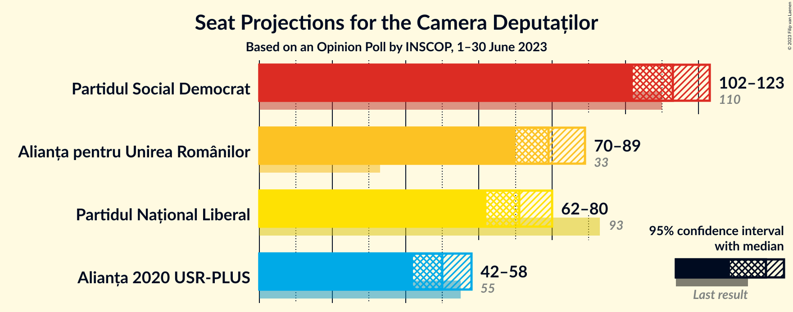
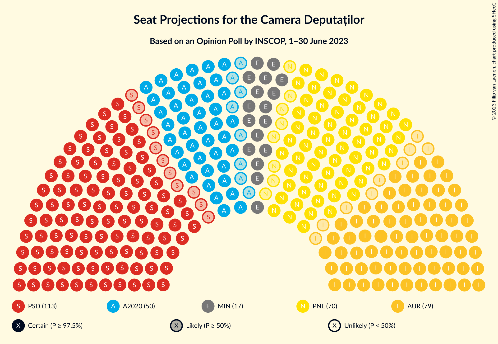
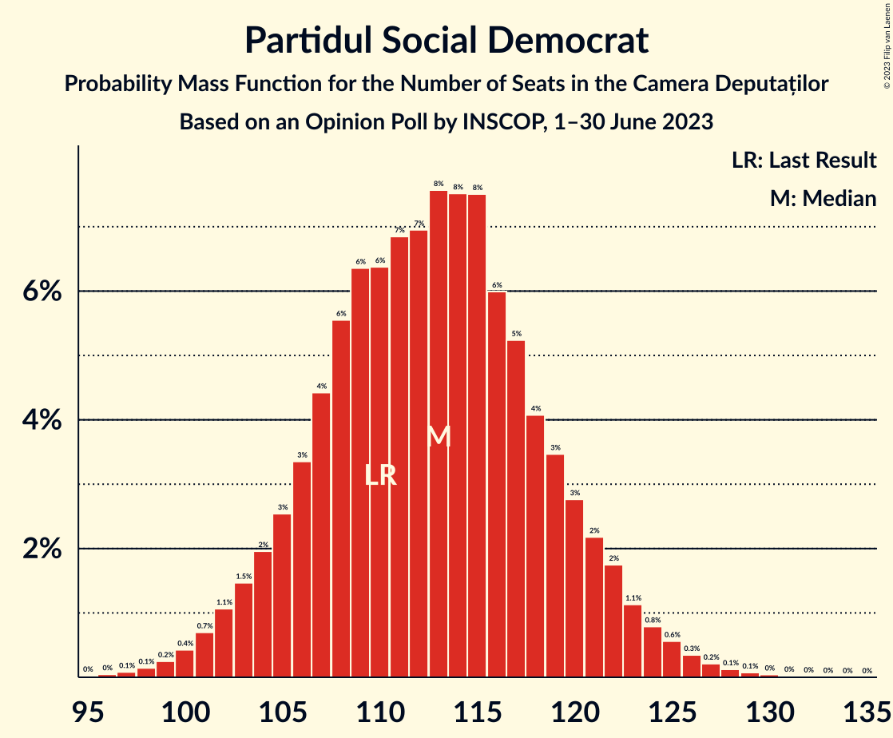
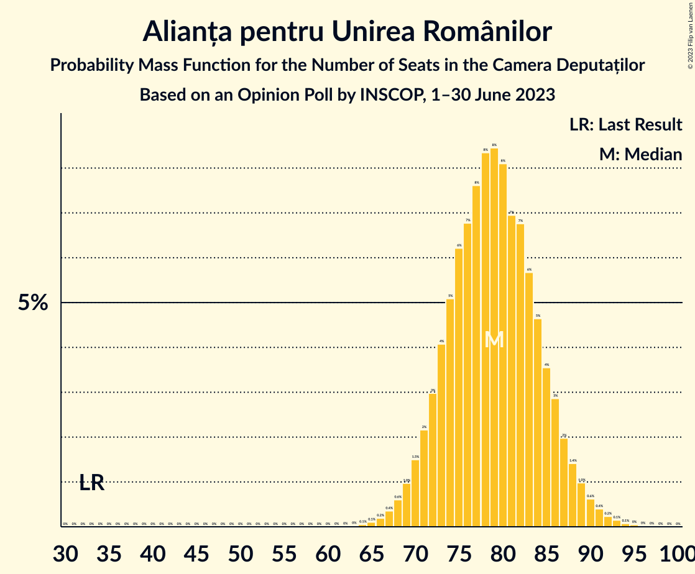
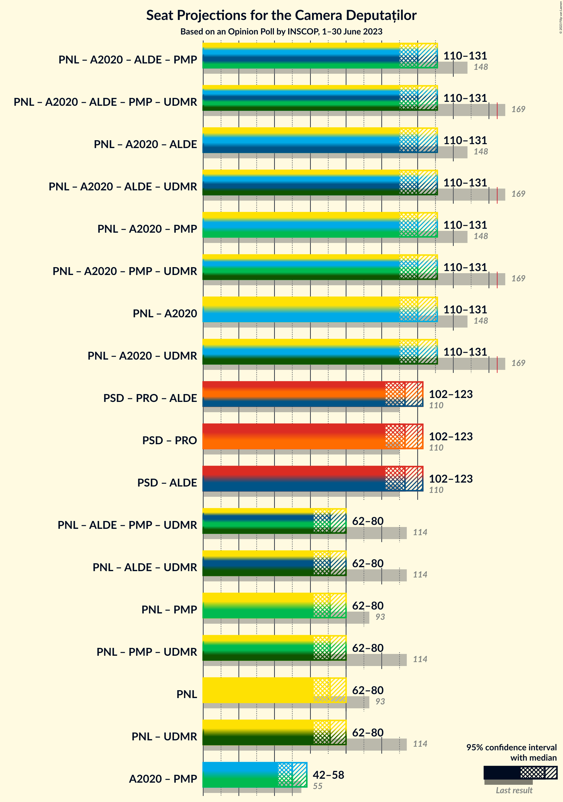
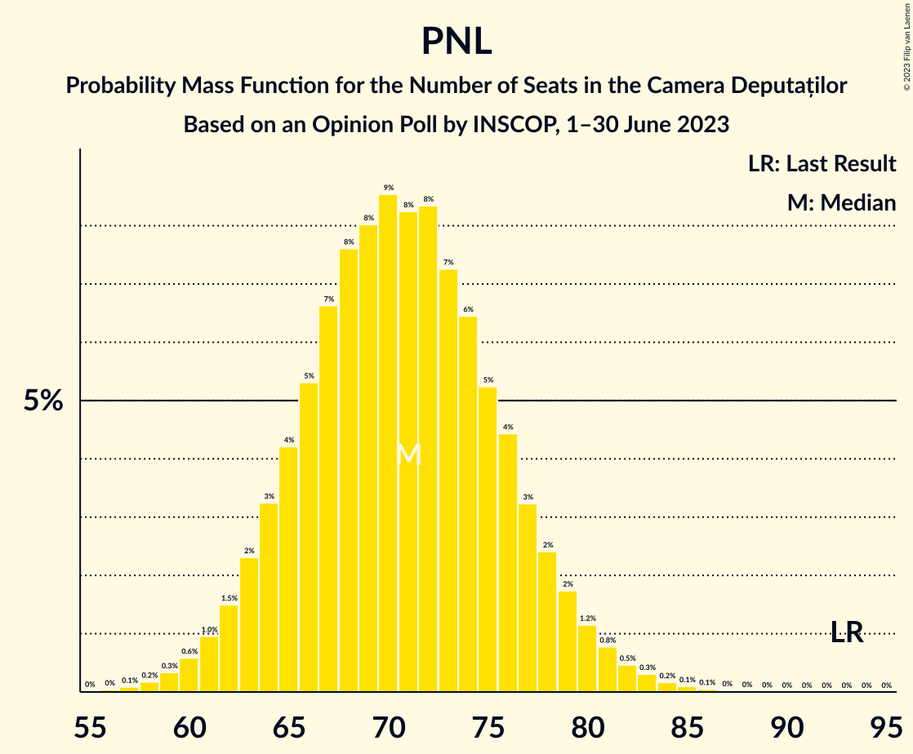

# Opinion Poll by INSCOP, 1–30 June 2023

<a href="#voting-intentions">Voting Intentions</a> | <a href="#seats">Seats</a> | <a href="#coalitions">Coalitions</a> | <a href="#technical-information">Technical Information</a>

## Voting Intentions

### Confidence Intervals

| Party | Last Result | Poll Result | 80% Confidence Interval | 90% Confidence Interval | 95% Confidence Interval | 99% Confidence Interval |
|:-----:|:-----------:|:-----------:|:-----------------------:|:-----------------------:|:-----------------------:|:-----------------------:|
| Partidul Social Democrat | 28.9% | 28.7% | 26.9–30.6% |26.4–31.1% |26.0–31.6% |25.1–32.5% |
| Alianța pentru Unirea Românilor | 9.1% | 20.1% | 18.5–21.8% |18.1–22.3% |17.7–22.7% |17.0–23.5% |
| Partidul Național Liberal | 25.2% | 18.0% | 16.5–19.6% |16.1–20.1% |15.7–20.5% |15.0–21.3% |
| Alianța 2020 USR-PLUS | 15.4% | 12.7% | 11.4–14.1% |11.1–14.6% |10.8–14.9% |10.2–15.6% |

*Note:* The poll result column reflects the actual value used in the calculations. Published results may vary slightly, and in addition be rounded to fewer digits.

## Seats

### Confidence Intervals

| Party | Last Result | Median | 80% Confidence Interval | 90% Confidence Interval | 95% Confidence Interval | 99% Confidence Interval |
|:-----:|:-----------:|:------:|:-----------------------:|:-----------------------:|:-----------------------:|:-----------------------:|
| <a href="#partidul-social-democrat">Partidul Social Democrat</a> | 110 | 113 | 106–120 |104–122 |102–123 |99–127 |
| <a href="#alianța-pentru-unirea-românilor">Alianța pentru Unirea Românilor</a> | 33 | 79 | 73–85 |71–87 |70–89 |67–92 |
| <a href="#partidul-național-liberal">Partidul Național Liberal</a> | 93 | 71 | 65–77 |63–78 |62–80 |59–83 |
| <a href="#alianța-2020-usr-plus">Alianța 2020 USR-PLUS</a> | 55 | 50 | 45–55 |43–57 |42–58 |40–61 |

### Partidul Social Democrat

*For a full overview of the results for this party, see the [Partidul Social Democrat](party-partidulsocialdemocrat.html) page.*

| Number of Seats | Probability | Accumulated | Special Marks |
|:---------------:|:-----------:|:-----------:|:-------------:|
| 96 | 0% | 100% |  |
| 97 | 0.1% | 99.9% |  |
| 98 | 0.1% | 99.8% |  |
| 99 | 0.2% | 99.7% |  |
| 100 | 0.4% | 99.4% |  |
| 101 | 0.7% | 99.0% |  |
| 102 | 1.1% | 98% |  |
| 103 | 1.5% | 97% |  |
| 104 | 2% | 96% |  |
| 105 | 3% | 94% |  |
| 106 | 3% | 91% |  |
| 107 | 4% | 88% |  |
| 108 | 6% | 83% |  |
| 109 | 6% | 78% |  |
| 110 | 6% | 72% | Last Result |
| 111 | 7% | 65% |  |
| 112 | 7% | 58% |  |
| 113 | 8% | 51% | Median |
| 114 | 8% | 44% |  |
| 115 | 8% | 36% |  |
| 116 | 6% | 29% |  |
| 117 | 5% | 23% |  |
| 118 | 4% | 18% |  |
| 119 | 3% | 13% |  |
| 120 | 3% | 10% |  |
| 121 | 2% | 7% |  |
| 122 | 2% | 5% |  |
| 123 | 1.1% | 3% |  |
| 124 | 0.8% | 2% |  |
| 125 | 0.6% | 1.4% |  |
| 126 | 0.3% | 0.9% |  |
| 127 | 0.2% | 0.5% |  |
| 128 | 0.1% | 0.3% |  |
| 129 | 0.1% | 0.2% |  |
| 130 | 0% | 0.1% |  |
| 131 | 0% | 0.1% |  |
| 132 | 0% | 0% |  |

### Alianța pentru Unirea Românilor

*For a full overview of the results for this party, see the [Alianța pentru Unirea Românilor](party-alianțapentruunirearomânilor.html) page.*

| Number of Seats | Probability | Accumulated | Special Marks |
|:---------------:|:-----------:|:-----------:|:-------------:|
| 33 | 0% | 100% | Last Result |
| 34 | 0% | 100% |  |
| 35 | 0% | 100% |  |
| 36 | 0% | 100% |  |
| 37 | 0% | 100% |  |
| 38 | 0% | 100% |  |
| 39 | 0% | 100% |  |
| 40 | 0% | 100% |  |
| 41 | 0% | 100% |  |
| 42 | 0% | 100% |  |
| 43 | 0% | 100% |  |
| 44 | 0% | 100% |  |
| 45 | 0% | 100% |  |
| 46 | 0% | 100% |  |
| 47 | 0% | 100% |  |
| 48 | 0% | 100% |  |
| 49 | 0% | 100% |  |
| 50 | 0% | 100% |  |
| 51 | 0% | 100% |  |
| 52 | 0% | 100% |  |
| 53 | 0% | 100% |  |
| 54 | 0% | 100% |  |
| 55 | 0% | 100% |  |
| 56 | 0% | 100% |  |
| 57 | 0% | 100% |  |
| 58 | 0% | 100% |  |
| 59 | 0% | 100% |  |
| 60 | 0% | 100% |  |
| 61 | 0% | 100% |  |
| 62 | 0% | 100% |  |
| 63 | 0% | 100% |  |
| 64 | 0.1% | 100% |  |
| 65 | 0.1% | 99.9% |  |
| 66 | 0.2% | 99.8% |  |
| 67 | 0.4% | 99.6% |  |
| 68 | 0.6% | 99.3% |  |
| 69 | 1.0% | 98.7% |  |
| 70 | 1.5% | 98% |  |
| 71 | 2% | 96% |  |
| 72 | 3% | 94% |  |
| 73 | 4% | 91% |  |
| 74 | 5% | 87% |  |
| 75 | 6% | 82% |  |
| 76 | 7% | 76% |  |
| 77 | 8% | 69% |  |
| 78 | 8% | 61% |  |
| 79 | 8% | 53% | Median |
| 80 | 8% | 44% |  |
| 81 | 7% | 36% |  |
| 82 | 7% | 29% |  |
| 83 | 6% | 23% |  |
| 84 | 5% | 17% |  |
| 85 | 4% | 12% |  |
| 86 | 3% | 9% |  |
| 87 | 2% | 6% |  |
| 88 | 1.4% | 4% |  |
| 89 | 1.0% | 3% |  |
| 90 | 0.6% | 2% |  |
| 91 | 0.4% | 0.9% |  |
| 92 | 0.2% | 0.5% |  |
| 93 | 0.1% | 0.3% |  |
| 94 | 0.1% | 0.2% |  |
| 95 | 0% | 0.1% |  |
| 96 | 0% | 0% |  |

### Partidul Național Liberal

*For a full overview of the results for this party, see the [Partidul Național Liberal](party-partidulnaționalliberal.html) page.*

| Number of Seats | Probability | Accumulated | Special Marks |
|:---------------:|:-----------:|:-----------:|:-------------:|
| 56 | 0% | 100% |  |
| 57 | 0.1% | 99.9% |  |
| 58 | 0.2% | 99.8% |  |
| 59 | 0.3% | 99.7% |  |
| 60 | 0.6% | 99.3% |  |
| 61 | 1.0% | 98.7% |  |
| 62 | 1.5% | 98% |  |
| 63 | 2% | 96% |  |
| 64 | 3% | 94% |  |
| 65 | 4% | 91% |  |
| 66 | 5% | 87% |  |
| 67 | 7% | 81% |  |
| 68 | 8% | 75% |  |
| 69 | 8% | 67% |  |
| 70 | 9% | 59% |  |
| 71 | 8% | 50% | Median |
| 72 | 8% | 42% |  |
| 73 | 7% | 34% |  |
| 74 | 6% | 27% |  |
| 75 | 5% | 20% |  |
| 76 | 4% | 15% |  |
| 77 | 3% | 10% |  |
| 78 | 2% | 7% |  |
| 79 | 2% | 5% |  |
| 80 | 1.2% | 3% |  |
| 81 | 0.8% | 2% |  |
| 82 | 0.5% | 1.1% |  |
| 83 | 0.3% | 0.7% |  |
| 84 | 0.2% | 0.4% |  |
| 85 | 0.1% | 0.2% |  |
| 86 | 0.1% | 0.1% |  |
| 87 | 0% | 0.1% |  |
| 88 | 0% | 0% |  |
| 89 | 0% | 0% |  |
| 90 | 0% | 0% |  |
| 91 | 0% | 0% |  |
| 92 | 0% | 0% |  |
| 93 | 0% | 0% | Last Result |

### Alianța 2020 USR-PLUS

*For a full overview of the results for this party, see the [Alianța 2020 USR-PLUS](party-alianța2020usr-plus.html) page.*

| Number of Seats | Probability | Accumulated | Special Marks |
|:---------------:|:-----------:|:-----------:|:-------------:|
| 37 | 0% | 100% |  |
| 38 | 0.1% | 99.9% |  |
| 39 | 0.2% | 99.8% |  |
| 40 | 0.4% | 99.6% |  |
| 41 | 0.9% | 99.2% |  |
| 42 | 2% | 98% |  |
| 43 | 2% | 97% |  |
| 44 | 4% | 94% |  |
| 45 | 5% | 91% |  |
| 46 | 7% | 86% |  |
| 47 | 8% | 79% |  |
| 48 | 9% | 71% |  |
| 49 | 10% | 62% |  |
| 50 | 10% | 52% | Median |
| 51 | 9% | 43% |  |
| 52 | 8% | 33% |  |
| 53 | 7% | 25% |  |
| 54 | 6% | 18% |  |
| 55 | 4% | 13% | Last Result |
| 56 | 3% | 8% |  |
| 57 | 2% | 5% |  |
| 58 | 1.3% | 3% |  |
| 59 | 0.9% | 2% |  |
| 60 | 0.5% | 1.1% |  |
| 61 | 0.3% | 0.6% |  |
| 62 | 0.2% | 0.3% |  |
| 63 | 0.1% | 0.2% |  |
| 64 | 0% | 0.1% |  |
| 65 | 0% | 0% |  |

## Coalitions

### Confidence Intervals

| Coalition | Last Result | Median | Majority? | 80% Confidence Interval | 90% Confidence Interval | 95% Confidence Interval | 99% Confidence Interval |
|:---------:|:-----------:|:------:|:---------:|:-----------------------:|:-----------------------:|:-----------------------:|:-----------------------:|
| Partidul Național Liberal – Alianța 2020 USR-PLUS | 148 | 120 | 0% | 114–127 | 112–129 | 110–131 | 107–135 |
| Partidul Național Liberal | 93 | 71 | 0% | 65–77 | 63–78 | 62–80 | 59–83 |

### Partidul Național Liberal – Alianța 2020 USR-PLUS

| Number of Seats | Probability | Accumulated | Special Marks |
|:---------------:|:-----------:|:-----------:|:-------------:|
| 103 | 0% | 100% |  |
| 104 | 0.1% | 99.9% |  |
| 105 | 0.1% | 99.9% |  |
| 106 | 0.2% | 99.7% |  |
| 107 | 0.3% | 99.6% |  |
| 108 | 0.5% | 99.2% |  |
| 109 | 0.8% | 98.7% |  |
| 110 | 1.2% | 98% |  |
| 111 | 2% | 97% |  |
| 112 | 2% | 95% |  |
| 113 | 3% | 93% |  |
| 114 | 4% | 90% |  |
| 115 | 4% | 86% |  |
| 116 | 5% | 82% |  |
| 117 | 6% | 77% |  |
| 118 | 7% | 71% |  |
| 119 | 7% | 64% |  |
| 120 | 7% | 57% |  |
| 121 | 7% | 49% | Median |
| 122 | 7% | 42% |  |
| 123 | 7% | 35% |  |
| 124 | 6% | 29% |  |
| 125 | 5% | 23% |  |
| 126 | 4% | 18% |  |
| 127 | 3% | 13% |  |
| 128 | 3% | 10% |  |
| 129 | 2% | 7% |  |
| 130 | 2% | 5% |  |
| 131 | 1.1% | 3% |  |
| 132 | 0.8% | 2% |  |
| 133 | 0.5% | 1.4% |  |
| 134 | 0.3% | 0.8% |  |
| 135 | 0.2% | 0.5% |  |
| 136 | 0.1% | 0.3% |  |
| 137 | 0.1% | 0.2% |  |
| 138 | 0% | 0.1% |  |
| 139 | 0% | 0% |  |
| 140 | 0% | 0% |  |
| 141 | 0% | 0% |  |
| 142 | 0% | 0% |  |
| 143 | 0% | 0% |  |
| 144 | 0% | 0% |  |
| 145 | 0% | 0% |  |
| 146 | 0% | 0% |  |
| 147 | 0% | 0% |  |
| 148 | 0% | 0% | Last Result |

### Partidul Național Liberal

| Number of Seats | Probability | Accumulated | Special Marks |
|:---------------:|:-----------:|:-----------:|:-------------:|
| 56 | 0% | 100% |  |
| 57 | 0.1% | 99.9% |  |
| 58 | 0.2% | 99.8% |  |
| 59 | 0.3% | 99.7% |  |
| 60 | 0.6% | 99.3% |  |
| 61 | 1.0% | 98.7% |  |
| 62 | 1.5% | 98% |  |
| 63 | 2% | 96% |  |
| 64 | 3% | 94% |  |
| 65 | 4% | 91% |  |
| 66 | 5% | 87% |  |
| 67 | 7% | 81% |  |
| 68 | 8% | 75% |  |
| 69 | 8% | 67% |  |
| 70 | 9% | 59% |  |
| 71 | 8% | 50% | Median |
| 72 | 8% | 42% |  |
| 73 | 7% | 34% |  |
| 74 | 6% | 27% |  |
| 75 | 5% | 20% |  |
| 76 | 4% | 15% |  |
| 77 | 3% | 10% |  |
| 78 | 2% | 7% |  |
| 79 | 2% | 5% |  |
| 80 | 1.2% | 3% |  |
| 81 | 0.8% | 2% |  |
| 82 | 0.5% | 1.1% |  |
| 83 | 0.3% | 0.7% |  |
| 84 | 0.2% | 0.4% |  |
| 85 | 0.1% | 0.2% |  |
| 86 | 0.1% | 0.1% |  |
| 87 | 0% | 0.1% |  |
| 88 | 0% | 0% |  |
| 89 | 0% | 0% |  |
| 90 | 0% | 0% |  |
| 91 | 0% | 0% |  |
| 92 | 0% | 0% |  |
| 93 | 0% | 0% | Last Result |

## Technical Information

### Opinion Poll

+ **Polling firm:** INSCOP
+ **Commissioner(s):** —
+ **Fieldwork period:** 1–30 June 2023

### Calculations

+ **Sample size:** 1000
+ **Simulations done:** 1,048,576
+ **Error estimate:** 0.15%

