# Opinion Poll by INSOMAR, 28–31 August 2023

<a href="#voting-intentions">Voting Intentions</a> | <a href="#seats">Seats</a> | <a href="#coalitions">Coalitions</a> | <a href="#technical-information">Technical Information</a>

## Voting Intentions

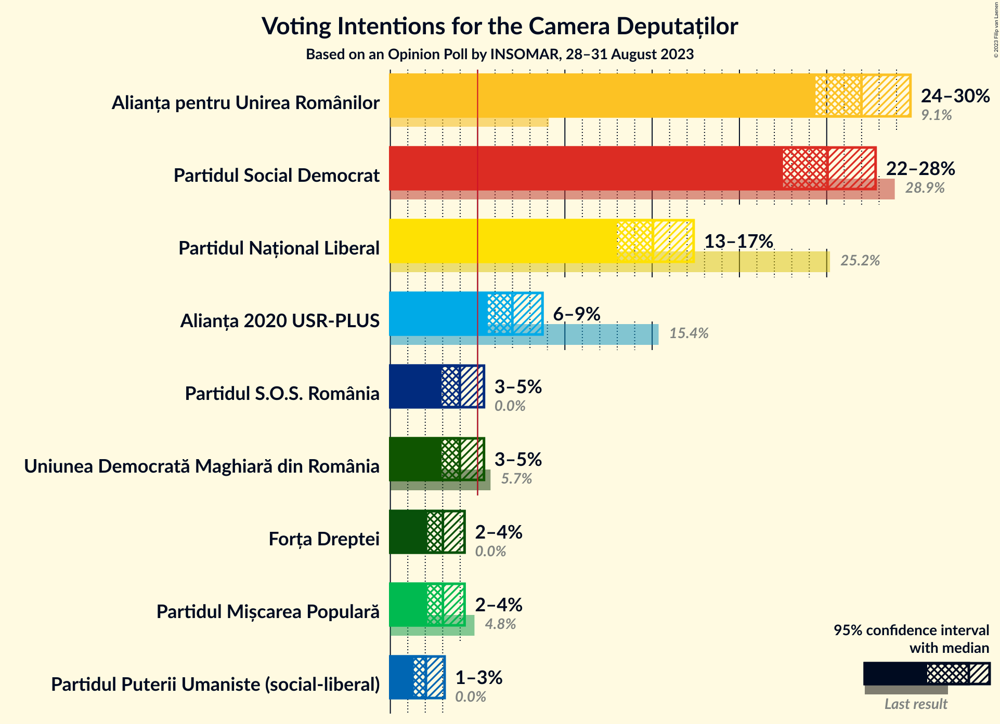

### Confidence Intervals

| Party | Last Result | Poll Result | 80% Confidence Interval | 90% Confidence Interval | 95% Confidence Interval | 99% Confidence Interval |
|:-----:|:-----------:|:-----------:|:-----------------------:|:-----------------------:|:-----------------------:|:-----------------------:|
| Alianța pentru Unirea Românilor | 9.1% | 27.0% | 25.3–28.8% |24.8–29.3% |24.4–29.8% |23.5–30.7% |
| Partidul Social Democrat | 28.9% | 25.0% | 23.4–26.8% |22.9–27.3% |22.5–27.8% |21.7–28.7% |
| Partidul Național Liberal | 25.2% | 15.0% | 13.7–16.6% |13.3–17.0% |13.0–17.4% |12.4–18.1% |
| Alianța 2020 USR-PLUS | 15.4% | 7.0% | 6.1–8.1% |5.8–8.4% |5.6–8.7% |5.2–9.3% |
| Uniunea Democrată Maghiară din România | 5.7% | 4.0% | 3.3–4.9% |3.1–5.1% |2.9–5.4% |2.7–5.8% |
| Partidul S.O.S. România | 0.0% | 4.0% | 3.3–4.9% |3.1–5.1% |2.9–5.4% |2.7–5.8% |
| Forța Dreptei | 0.0% | 3.0% | 2.4–3.8% |2.3–4.0% |2.1–4.3% |1.9–4.7% |
| Partidul Mișcarea Populară | 4.8% | 3.0% | 2.4–3.8% |2.3–4.0% |2.1–4.3% |1.9–4.7% |
| Partidul Puterii Umaniste (social-liberal) | 0.0% | 2.0% | 1.6–2.7% |1.4–2.9% |1.3–3.1% |1.1–3.5% |

*Note:* The poll result column reflects the actual value used in the calculations. Published results may vary slightly, and in addition be rounded to fewer digits.

## Seats

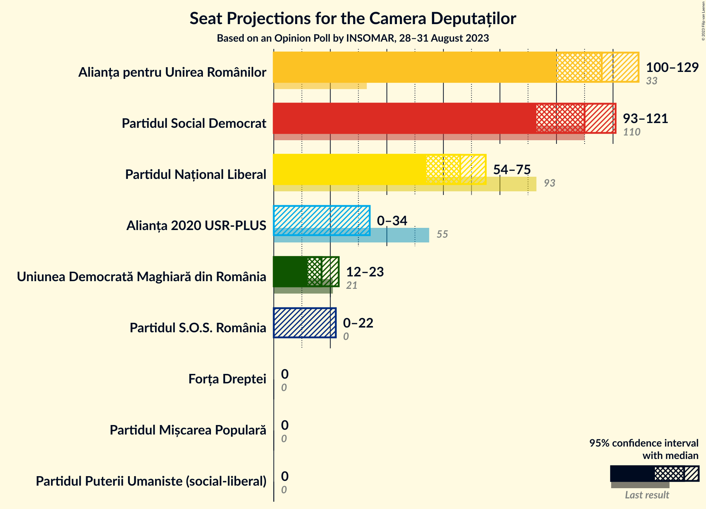

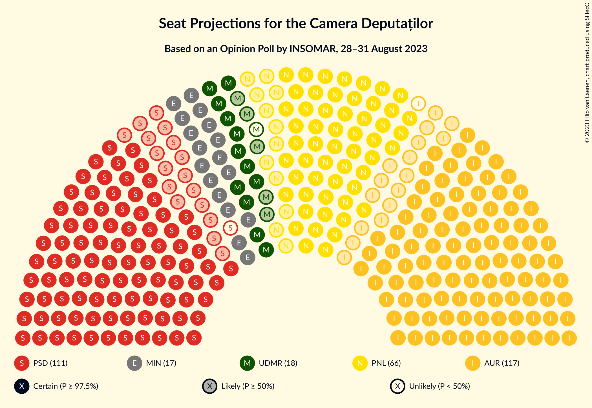

### Confidence Intervals

| Party | Last Result | Median | 80% Confidence Interval | 90% Confidence Interval | 95% Confidence Interval | 99% Confidence Interval |
|:-----:|:-----------:|:------:|:-----------------------:|:-----------------------:|:-----------------------:|:-----------------------:|
| <a href="#alianța-pentru-unirea-românilor">Alianța pentru Unirea Românilor</a> | 33 | 116 | 106–125 |102–127 |100–129 |96–133 |
| <a href="#partidul-social-democrat">Partidul Social Democrat</a> | 110 | 110 | 99–117 |96–119 |93–121 |89–123 |
| <a href="#partidul-național-liberal">Partidul Național Liberal</a> | 93 | 66 | 58–71 |57–73 |54–75 |52–79 |
| <a href="#alianța-2020-usr-plus">Alianța 2020 USR-PLUS</a> | 55 | 0 | 0–32 |0–33 |0–34 |0–36 |
| <a href="#uniunea-democrată-maghiară-din-românia">Uniunea Democrată Maghiară din România</a> | 21 | 17 | 14–20 |13–22 |12–23 |11–25 |
| <a href="#partidul-s.o.s.-românia">Partidul S.O.S. România</a> | 0 | 0 | 0 |0–21 |0–22 |0–24 |
| <a href="#forța-dreptei">Forța Dreptei</a> | 0 | 0 | 0 |0 |0 |0 |
| <a href="#partidul-mișcarea-populară">Partidul Mișcarea Populară</a> | 0 | 0 | 0 |0 |0 |0 |
| <a href="#partidul-puterii-umaniste-(social-liberal)">Partidul Puterii Umaniste (social-liberal)</a> | 0 | 0 | 0 |0 |0 |0 |

### Alianța pentru Unirea Românilor

*For a full overview of the results for this party, see the [Alianța pentru Unirea Românilor](party-alianțapentruunirearomânilor.html) page.*

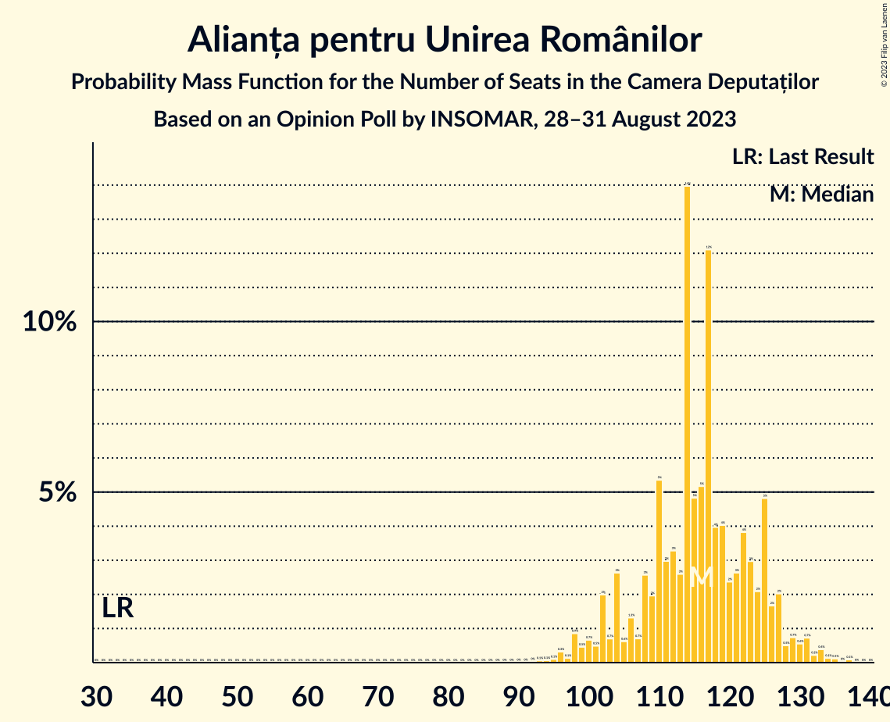

| Number of Seats | Probability | Accumulated | Special Marks |
|:---------------:|:-----------:|:-----------:|:-------------:|
| 33 | 0% | 100% | Last Result |
| 34 | 0% | 100% |  |
| 35 | 0% | 100% |  |
| 36 | 0% | 100% |  |
| 37 | 0% | 100% |  |
| 38 | 0% | 100% |  |
| 39 | 0% | 100% |  |
| 40 | 0% | 100% |  |
| 41 | 0% | 100% |  |
| 42 | 0% | 100% |  |
| 43 | 0% | 100% |  |
| 44 | 0% | 100% |  |
| 45 | 0% | 100% |  |
| 46 | 0% | 100% |  |
| 47 | 0% | 100% |  |
| 48 | 0% | 100% |  |
| 49 | 0% | 100% |  |
| 50 | 0% | 100% |  |
| 51 | 0% | 100% |  |
| 52 | 0% | 100% |  |
| 53 | 0% | 100% |  |
| 54 | 0% | 100% |  |
| 55 | 0% | 100% |  |
| 56 | 0% | 100% |  |
| 57 | 0% | 100% |  |
| 58 | 0% | 100% |  |
| 59 | 0% | 100% |  |
| 60 | 0% | 100% |  |
| 61 | 0% | 100% |  |
| 62 | 0% | 100% |  |
| 63 | 0% | 100% |  |
| 64 | 0% | 100% |  |
| 65 | 0% | 100% |  |
| 66 | 0% | 100% |  |
| 67 | 0% | 100% |  |
| 68 | 0% | 100% |  |
| 69 | 0% | 100% |  |
| 70 | 0% | 100% |  |
| 71 | 0% | 100% |  |
| 72 | 0% | 100% |  |
| 73 | 0% | 100% |  |
| 74 | 0% | 100% |  |
| 75 | 0% | 100% |  |
| 76 | 0% | 100% |  |
| 77 | 0% | 100% |  |
| 78 | 0% | 100% |  |
| 79 | 0% | 100% |  |
| 80 | 0% | 100% |  |
| 81 | 0% | 100% |  |
| 82 | 0% | 100% |  |
| 83 | 0% | 100% |  |
| 84 | 0% | 100% |  |
| 85 | 0% | 100% |  |
| 86 | 0% | 100% |  |
| 87 | 0% | 100% |  |
| 88 | 0% | 100% |  |
| 89 | 0% | 100% |  |
| 90 | 0% | 100% |  |
| 91 | 0% | 100% |  |
| 92 | 0% | 100% |  |
| 93 | 0.1% | 99.9% |  |
| 94 | 0.1% | 99.9% |  |
| 95 | 0.1% | 99.8% |  |
| 96 | 0.3% | 99.7% |  |
| 97 | 0.1% | 99.4% |  |
| 98 | 0.9% | 99.2% |  |
| 99 | 0.5% | 98% |  |
| 100 | 0.7% | 98% |  |
| 101 | 0.5% | 97% |  |
| 102 | 2% | 97% |  |
| 103 | 0.7% | 95% |  |
| 104 | 3% | 94% |  |
| 105 | 0.6% | 91% |  |
| 106 | 1.3% | 91% |  |
| 107 | 0.7% | 89% |  |
| 108 | 3% | 89% |  |
| 109 | 2% | 86% |  |
| 110 | 5% | 84% |  |
| 111 | 3% | 79% |  |
| 112 | 3% | 76% |  |
| 113 | 3% | 73% |  |
| 114 | 14% | 70% |  |
| 115 | 5% | 56% |  |
| 116 | 5% | 51% | Median |
| 117 | 12% | 46% |  |
| 118 | 4% | 34% |  |
| 119 | 4% | 30% |  |
| 120 | 2% | 26% |  |
| 121 | 3% | 24% |  |
| 122 | 4% | 21% |  |
| 123 | 3% | 17% |  |
| 124 | 2% | 14% |  |
| 125 | 5% | 12% |  |
| 126 | 2% | 7% |  |
| 127 | 2% | 6% |  |
| 128 | 0.5% | 4% |  |
| 129 | 0.7% | 3% |  |
| 130 | 0.6% | 2% |  |
| 131 | 0.7% | 2% |  |
| 132 | 0.2% | 1.0% |  |
| 133 | 0.4% | 0.8% |  |
| 134 | 0.1% | 0.4% |  |
| 135 | 0.1% | 0.3% |  |
| 136 | 0% | 0.1% |  |
| 137 | 0.1% | 0.1% |  |
| 138 | 0% | 0% |  |

### Partidul Social Democrat

*For a full overview of the results for this party, see the [Partidul Social Democrat](party-partidulsocialdemocrat.html) page.*

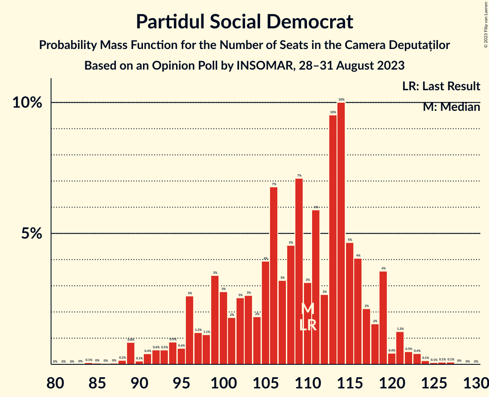

| Number of Seats | Probability | Accumulated | Special Marks |
|:---------------:|:-----------:|:-----------:|:-------------:|
| 84 | 0.1% | 100% |  |
| 85 | 0% | 99.9% |  |
| 86 | 0% | 99.9% |  |
| 87 | 0% | 99.8% |  |
| 88 | 0.2% | 99.8% |  |
| 89 | 0.8% | 99.6% |  |
| 90 | 0.1% | 98.8% |  |
| 91 | 0.4% | 98.7% |  |
| 92 | 0.6% | 98% |  |
| 93 | 0.5% | 98% |  |
| 94 | 0.9% | 97% |  |
| 95 | 0.6% | 96% |  |
| 96 | 3% | 96% |  |
| 97 | 1.2% | 93% |  |
| 98 | 1.1% | 92% |  |
| 99 | 3% | 91% |  |
| 100 | 3% | 87% |  |
| 101 | 2% | 85% |  |
| 102 | 3% | 83% |  |
| 103 | 3% | 80% |  |
| 104 | 2% | 78% |  |
| 105 | 4% | 76% |  |
| 106 | 7% | 72% |  |
| 107 | 3% | 65% |  |
| 108 | 5% | 62% |  |
| 109 | 7% | 57% |  |
| 110 | 3% | 50% | Last Result, Median |
| 111 | 6% | 47% |  |
| 112 | 3% | 41% |  |
| 113 | 10% | 38% |  |
| 114 | 10% | 29% |  |
| 115 | 5% | 19% |  |
| 116 | 4% | 14% |  |
| 117 | 2% | 10% |  |
| 118 | 2% | 8% |  |
| 119 | 4% | 7% |  |
| 120 | 0.4% | 3% |  |
| 121 | 1.3% | 3% |  |
| 122 | 0.5% | 1.3% |  |
| 123 | 0.4% | 0.9% |  |
| 124 | 0.1% | 0.4% |  |
| 125 | 0.1% | 0.3% |  |
| 126 | 0.1% | 0.2% |  |
| 127 | 0.1% | 0.1% |  |
| 128 | 0% | 0.1% |  |
| 129 | 0% | 0% |  |

### Partidul Național Liberal

*For a full overview of the results for this party, see the [Partidul Național Liberal](party-partidulnaționalliberal.html) page.*

| Number of Seats | Probability | Accumulated | Special Marks |
|:---------------:|:-----------:|:-----------:|:-------------:|
| 48 | 0.1% | 100% |  |
| 49 | 0.1% | 99.9% |  |
| 50 | 0.1% | 99.8% |  |
| 51 | 0.1% | 99.7% |  |
| 52 | 0.4% | 99.6% |  |
| 53 | 1.4% | 99.2% |  |
| 54 | 0.3% | 98% |  |
| 55 | 1.1% | 97% |  |
| 56 | 1.0% | 96% |  |
| 57 | 2% | 95% |  |
| 58 | 4% | 93% |  |
| 59 | 3% | 89% |  |
| 60 | 3% | 86% |  |
| 61 | 6% | 83% |  |
| 62 | 4% | 77% |  |
| 63 | 8% | 74% |  |
| 64 | 4% | 66% |  |
| 65 | 9% | 62% |  |
| 66 | 13% | 53% | Median |
| 67 | 10% | 39% |  |
| 68 | 9% | 29% |  |
| 69 | 4% | 21% |  |
| 70 | 4% | 16% |  |
| 71 | 4% | 12% |  |
| 72 | 2% | 9% |  |
| 73 | 2% | 7% |  |
| 74 | 2% | 5% |  |
| 75 | 1.0% | 3% |  |
| 76 | 0.6% | 2% |  |
| 77 | 0.4% | 1.0% |  |
| 78 | 0.1% | 0.6% |  |
| 79 | 0.3% | 0.5% |  |
| 80 | 0.1% | 0.2% |  |
| 81 | 0% | 0.1% |  |
| 82 | 0% | 0.1% |  |
| 83 | 0% | 0% |  |
| 84 | 0% | 0% |  |
| 85 | 0% | 0% |  |
| 86 | 0% | 0% |  |
| 87 | 0% | 0% |  |
| 88 | 0% | 0% |  |
| 89 | 0% | 0% |  |
| 90 | 0% | 0% |  |
| 91 | 0% | 0% |  |
| 92 | 0% | 0% |  |
| 93 | 0% | 0% | Last Result |

### Alianța 2020 USR-PLUS

*For a full overview of the results for this party, see the [Alianța 2020 USR-PLUS](party-alianța2020usr-plus.html) page.*

| Number of Seats | Probability | Accumulated | Special Marks |
|:---------------:|:-----------:|:-----------:|:-------------:|
| 0 | 89% | 100% | Median |
| 1 | 0% | 11% |  |
| 2 | 0% | 11% |  |
| 3 | 0% | 11% |  |
| 4 | 0% | 11% |  |
| 5 | 0% | 11% |  |
| 6 | 0% | 11% |  |
| 7 | 0% | 11% |  |
| 8 | 0% | 11% |  |
| 9 | 0% | 11% |  |
| 10 | 0% | 11% |  |
| 11 | 0% | 11% |  |
| 12 | 0% | 11% |  |
| 13 | 0% | 11% |  |
| 14 | 0% | 11% |  |
| 15 | 0% | 11% |  |
| 16 | 0% | 11% |  |
| 17 | 0% | 11% |  |
| 18 | 0% | 11% |  |
| 19 | 0% | 11% |  |
| 20 | 0% | 11% |  |
| 21 | 0% | 11% |  |
| 22 | 0% | 11% |  |
| 23 | 0% | 11% |  |
| 24 | 0% | 11% |  |
| 25 | 0% | 11% |  |
| 26 | 0% | 11% |  |
| 27 | 0% | 11% |  |
| 28 | 0% | 11% |  |
| 29 | 0% | 11% |  |
| 30 | 0.8% | 11% |  |
| 31 | 0.3% | 11% |  |
| 32 | 3% | 10% |  |
| 33 | 4% | 7% |  |
| 34 | 2% | 4% |  |
| 35 | 0.7% | 2% |  |
| 36 | 0.4% | 0.9% |  |
| 37 | 0.2% | 0.5% |  |
| 38 | 0.1% | 0.2% |  |
| 39 | 0.1% | 0.1% |  |
| 40 | 0% | 0% |  |
| 41 | 0% | 0% |  |
| 42 | 0% | 0% |  |
| 43 | 0% | 0% |  |
| 44 | 0% | 0% |  |
| 45 | 0% | 0% |  |
| 46 | 0% | 0% |  |
| 47 | 0% | 0% |  |
| 48 | 0% | 0% |  |
| 49 | 0% | 0% |  |
| 50 | 0% | 0% |  |
| 51 | 0% | 0% |  |
| 52 | 0% | 0% |  |
| 53 | 0% | 0% |  |
| 54 | 0% | 0% |  |
| 55 | 0% | 0% | Last Result |

### Uniunea Democrată Maghiară din România

*For a full overview of the results for this party, see the [Uniunea Democrată Maghiară din România](party-uniuneademocratămaghiarădinromânia.html) page.*

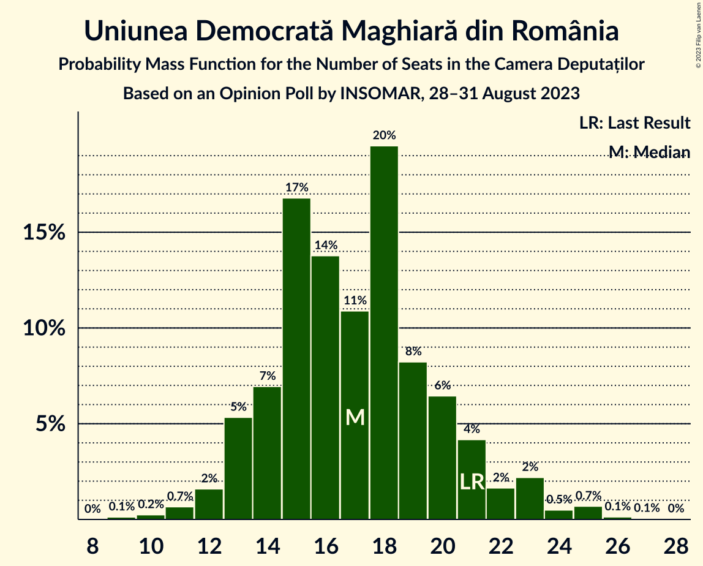

| Number of Seats | Probability | Accumulated | Special Marks |
|:---------------:|:-----------:|:-----------:|:-------------:|
| 9 | 0.1% | 100% |  |
| 10 | 0.2% | 99.9% |  |
| 11 | 0.7% | 99.6% |  |
| 12 | 2% | 99.0% |  |
| 13 | 5% | 97% |  |
| 14 | 7% | 92% |  |
| 15 | 17% | 85% |  |
| 16 | 14% | 68% |  |
| 17 | 11% | 55% | Median |
| 18 | 20% | 44% |  |
| 19 | 8% | 24% |  |
| 20 | 6% | 16% |  |
| 21 | 4% | 9% | Last Result |
| 22 | 2% | 5% |  |
| 23 | 2% | 4% |  |
| 24 | 0.5% | 1.4% |  |
| 25 | 0.7% | 0.9% |  |
| 26 | 0.1% | 0.2% |  |
| 27 | 0.1% | 0.1% |  |
| 28 | 0% | 0% |  |

### Partidul S.O.S. România

*For a full overview of the results for this party, see the [Partidul S.O.S. România](party-partidulsosromânia.html) page.*

| Number of Seats | Probability | Accumulated | Special Marks |
|:---------------:|:-----------:|:-----------:|:-------------:|
| 0 | 92% | 100% | Last Result, Median |
| 1 | 0% | 8% |  |
| 2 | 0% | 8% |  |
| 3 | 0% | 8% |  |
| 4 | 0% | 8% |  |
| 5 | 0% | 8% |  |
| 6 | 0% | 8% |  |
| 7 | 0% | 8% |  |
| 8 | 0% | 8% |  |
| 9 | 0% | 8% |  |
| 10 | 0% | 8% |  |
| 11 | 0% | 8% |  |
| 12 | 0% | 8% |  |
| 13 | 0% | 8% |  |
| 14 | 0% | 8% |  |
| 15 | 0% | 8% |  |
| 16 | 0% | 8% |  |
| 17 | 0% | 8% |  |
| 18 | 0% | 8% |  |
| 19 | 0.7% | 8% |  |
| 20 | 2% | 7% |  |
| 21 | 2% | 5% |  |
| 22 | 2% | 3% |  |
| 23 | 0.6% | 1.2% |  |
| 24 | 0.5% | 0.6% |  |
| 25 | 0.1% | 0.2% |  |
| 26 | 0% | 0.1% |  |
| 27 | 0% | 0% |  |

### Forța Dreptei

*For a full overview of the results for this party, see the [Forța Dreptei](party-forțadreptei.html) page.*

| Number of Seats | Probability | Accumulated | Special Marks |
|:---------------:|:-----------:|:-----------:|:-------------:|
| 0 | 99.9% | 100% | Last Result, Median |
| 1 | 0% | 0.1% |  |
| 2 | 0% | 0.1% |  |
| 3 | 0% | 0.1% |  |
| 4 | 0% | 0.1% |  |
| 5 | 0% | 0.1% |  |
| 6 | 0% | 0.1% |  |
| 7 | 0% | 0.1% |  |
| 8 | 0% | 0.1% |  |
| 9 | 0% | 0.1% |  |
| 10 | 0% | 0.1% |  |
| 11 | 0% | 0.1% |  |
| 12 | 0% | 0.1% |  |
| 13 | 0% | 0.1% |  |
| 14 | 0% | 0.1% |  |
| 15 | 0% | 0.1% |  |
| 16 | 0% | 0.1% |  |
| 17 | 0% | 0.1% |  |
| 18 | 0% | 0.1% |  |
| 19 | 0% | 0.1% |  |
| 20 | 0% | 0.1% |  |
| 21 | 0% | 0.1% |  |
| 22 | 0% | 0% |  |

### Partidul Mișcarea Populară

*For a full overview of the results for this party, see the [Partidul Mișcarea Populară](party-partidulmișcareapopulară.html) page.*

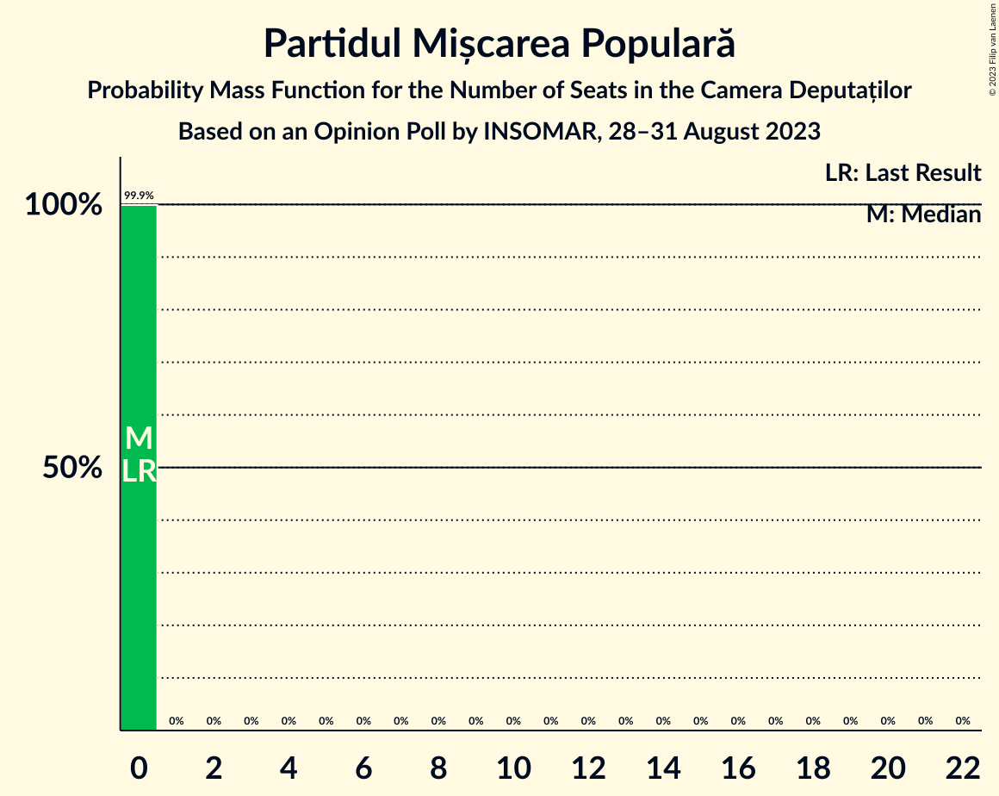

| Number of Seats | Probability | Accumulated | Special Marks |
|:---------------:|:-----------:|:-----------:|:-------------:|
| 0 | 99.9% | 100% | Last Result, Median |
| 1 | 0% | 0.1% |  |
| 2 | 0% | 0.1% |  |
| 3 | 0% | 0.1% |  |
| 4 | 0% | 0.1% |  |
| 5 | 0% | 0.1% |  |
| 6 | 0% | 0.1% |  |
| 7 | 0% | 0.1% |  |
| 8 | 0% | 0.1% |  |
| 9 | 0% | 0.1% |  |
| 10 | 0% | 0.1% |  |
| 11 | 0% | 0.1% |  |
| 12 | 0% | 0.1% |  |
| 13 | 0% | 0.1% |  |
| 14 | 0% | 0.1% |  |
| 15 | 0% | 0.1% |  |
| 16 | 0% | 0.1% |  |
| 17 | 0% | 0.1% |  |
| 18 | 0% | 0.1% |  |
| 19 | 0% | 0.1% |  |
| 20 | 0% | 0.1% |  |
| 21 | 0% | 0.1% |  |
| 22 | 0% | 0% |  |

### Partidul Puterii Umaniste (social-liberal)

*For a full overview of the results for this party, see the [Partidul Puterii Umaniste (social-liberal)](party-partidulputeriiumanistesocial-liberal.html) page.*

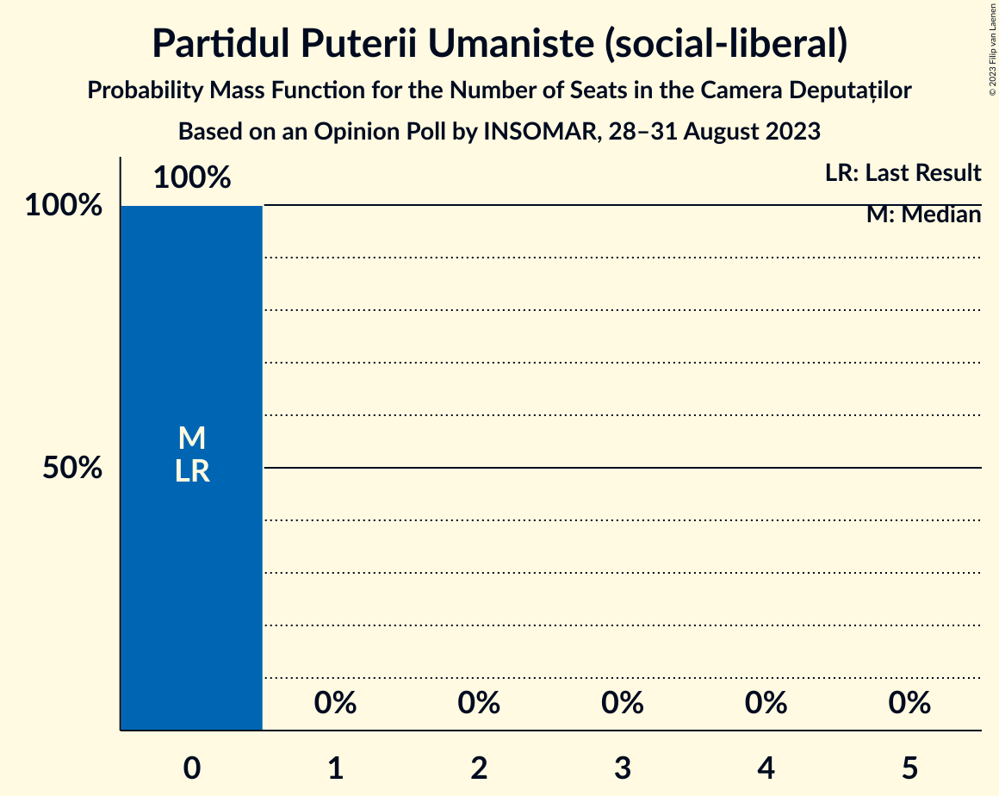

| Number of Seats | Probability | Accumulated | Special Marks |
|:---------------:|:-----------:|:-----------:|:-------------:|
| 0 | 100% | 100% | Last Result, Median |

## Coalitions

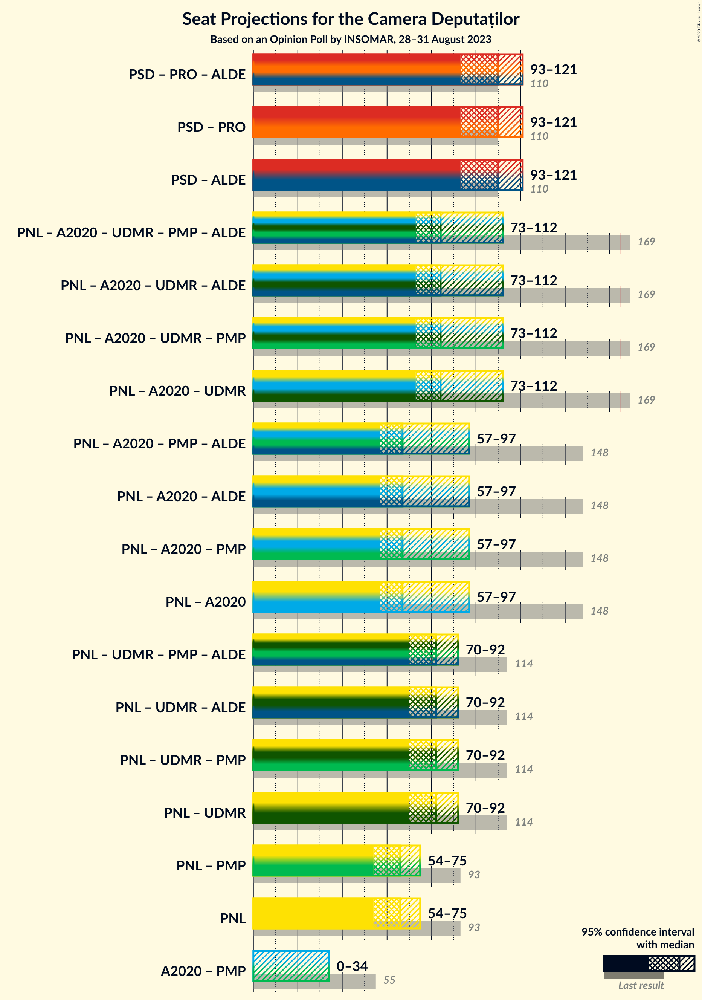

### Confidence Intervals

| Coalition | Last Result | Median | Majority? | 80% Confidence Interval | 90% Confidence Interval | 95% Confidence Interval | 99% Confidence Interval |
|:---------:|:-----------:|:------:|:---------:|:-----------------------:|:-----------------------:|:-----------------------:|:-----------------------:|
| Partidul Național Liberal – Alianța 2020 USR-PLUS – Uniunea Democrată Maghiară din România – Partidul Mișcarea Populară | 169 | 84 | 0% | 76–104 | 74–111 | 73–112 | 69–116 |
| Partidul Național Liberal – Alianța 2020 USR-PLUS – Uniunea Democrată Maghiară din România | 169 | 84 | 0% | 76–104 | 74–111 | 73–112 | 69–116 |
| Partidul Național Liberal – Alianța 2020 USR-PLUS – Partidul Mișcarea Populară | 148 | 67 | 0% | 60–87 | 58–96 | 57–97 | 53–99 |
| Partidul Național Liberal – Alianța 2020 USR-PLUS | 148 | 67 | 0% | 60–87 | 58–96 | 57–97 | 53–99 |
| Partidul Național Liberal – Uniunea Democrată Maghiară din România – Partidul Mișcarea Populară | 114 | 82 | 0% | 74–90 | 73–91 | 70–92 | 66–96 |
| Partidul Național Liberal – Uniunea Democrată Maghiară din România | 114 | 82 | 0% | 74–90 | 73–91 | 70–92 | 66–96 |
| Partidul Național Liberal – Partidul Mișcarea Populară | 93 | 66 | 0% | 58–71 | 57–74 | 54–75 | 52–79 |
| Partidul Național Liberal | 93 | 66 | 0% | 58–71 | 57–73 | 54–75 | 52–79 |
| Alianța 2020 USR-PLUS – Partidul Mișcarea Populară | 55 | 0 | 0% | 0–32 | 0–33 | 0–34 | 0–36 |

### Partidul Național Liberal – Alianța 2020 USR-PLUS – Uniunea Democrată Maghiară din România – Partidul Mișcarea Populară

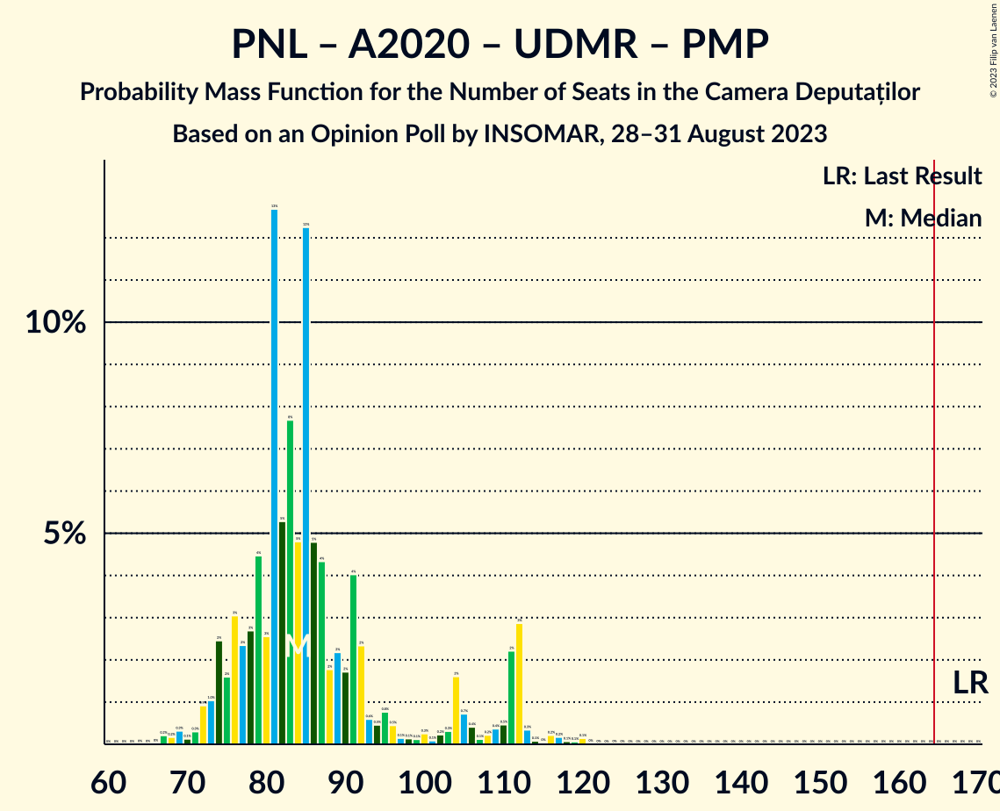

| Number of Seats | Probability | Accumulated | Special Marks |
|:---------------:|:-----------:|:-----------:|:-------------:|
| 66 | 0% | 100% |  |
| 67 | 0.2% | 99.9% |  |
| 68 | 0.2% | 99.7% |  |
| 69 | 0.3% | 99.6% |  |
| 70 | 0.1% | 99.2% |  |
| 71 | 0.3% | 99.1% |  |
| 72 | 0.9% | 98.8% |  |
| 73 | 1.0% | 98% |  |
| 74 | 2% | 97% |  |
| 75 | 2% | 94% |  |
| 76 | 3% | 93% |  |
| 77 | 2% | 90% |  |
| 78 | 3% | 87% |  |
| 79 | 4% | 85% |  |
| 80 | 3% | 80% |  |
| 81 | 13% | 78% |  |
| 82 | 5% | 65% |  |
| 83 | 8% | 60% | Median |
| 84 | 5% | 52% |  |
| 85 | 12% | 47% |  |
| 86 | 5% | 35% |  |
| 87 | 4% | 30% |  |
| 88 | 2% | 26% |  |
| 89 | 2% | 24% |  |
| 90 | 2% | 22% |  |
| 91 | 4% | 20% |  |
| 92 | 2% | 16% |  |
| 93 | 0.6% | 14% |  |
| 94 | 0.5% | 13% |  |
| 95 | 0.8% | 13% |  |
| 96 | 0.5% | 12% |  |
| 97 | 0.1% | 11% |  |
| 98 | 0.1% | 11% |  |
| 99 | 0.1% | 11% |  |
| 100 | 0.3% | 11% |  |
| 101 | 0.1% | 11% |  |
| 102 | 0.2% | 11% |  |
| 103 | 0.3% | 11% |  |
| 104 | 2% | 10% |  |
| 105 | 0.7% | 9% |  |
| 106 | 0.4% | 8% |  |
| 107 | 0.1% | 7% |  |
| 108 | 0.2% | 7% |  |
| 109 | 0.4% | 7% |  |
| 110 | 0.5% | 7% |  |
| 111 | 2% | 6% |  |
| 112 | 3% | 4% |  |
| 113 | 0.3% | 1.2% |  |
| 114 | 0.1% | 0.8% |  |
| 115 | 0% | 0.8% |  |
| 116 | 0.2% | 0.7% |  |
| 117 | 0.2% | 0.5% |  |
| 118 | 0.1% | 0.3% |  |
| 119 | 0.1% | 0.3% |  |
| 120 | 0.1% | 0.2% |  |
| 121 | 0% | 0% |  |
| 122 | 0% | 0% |  |
| 123 | 0% | 0% |  |
| 124 | 0% | 0% |  |
| 125 | 0% | 0% |  |
| 126 | 0% | 0% |  |
| 127 | 0% | 0% |  |
| 128 | 0% | 0% |  |
| 129 | 0% | 0% |  |
| 130 | 0% | 0% |  |
| 131 | 0% | 0% |  |
| 132 | 0% | 0% |  |
| 133 | 0% | 0% |  |
| 134 | 0% | 0% |  |
| 135 | 0% | 0% |  |
| 136 | 0% | 0% |  |
| 137 | 0% | 0% |  |
| 138 | 0% | 0% |  |
| 139 | 0% | 0% |  |
| 140 | 0% | 0% |  |
| 141 | 0% | 0% |  |
| 142 | 0% | 0% |  |
| 143 | 0% | 0% |  |
| 144 | 0% | 0% |  |
| 145 | 0% | 0% |  |
| 146 | 0% | 0% |  |
| 147 | 0% | 0% |  |
| 148 | 0% | 0% |  |
| 149 | 0% | 0% |  |
| 150 | 0% | 0% |  |
| 151 | 0% | 0% |  |
| 152 | 0% | 0% |  |
| 153 | 0% | 0% |  |
| 154 | 0% | 0% |  |
| 155 | 0% | 0% |  |
| 156 | 0% | 0% |  |
| 157 | 0% | 0% |  |
| 158 | 0% | 0% |  |
| 159 | 0% | 0% |  |
| 160 | 0% | 0% |  |
| 161 | 0% | 0% |  |
| 162 | 0% | 0% |  |
| 163 | 0% | 0% |  |
| 164 | 0% | 0% |  |
| 165 | 0% | 0% | Majority |
| 166 | 0% | 0% |  |
| 167 | 0% | 0% |  |
| 168 | 0% | 0% |  |
| 169 | 0% | 0% | Last Result |

### Partidul Național Liberal – Alianța 2020 USR-PLUS – Uniunea Democrată Maghiară din România

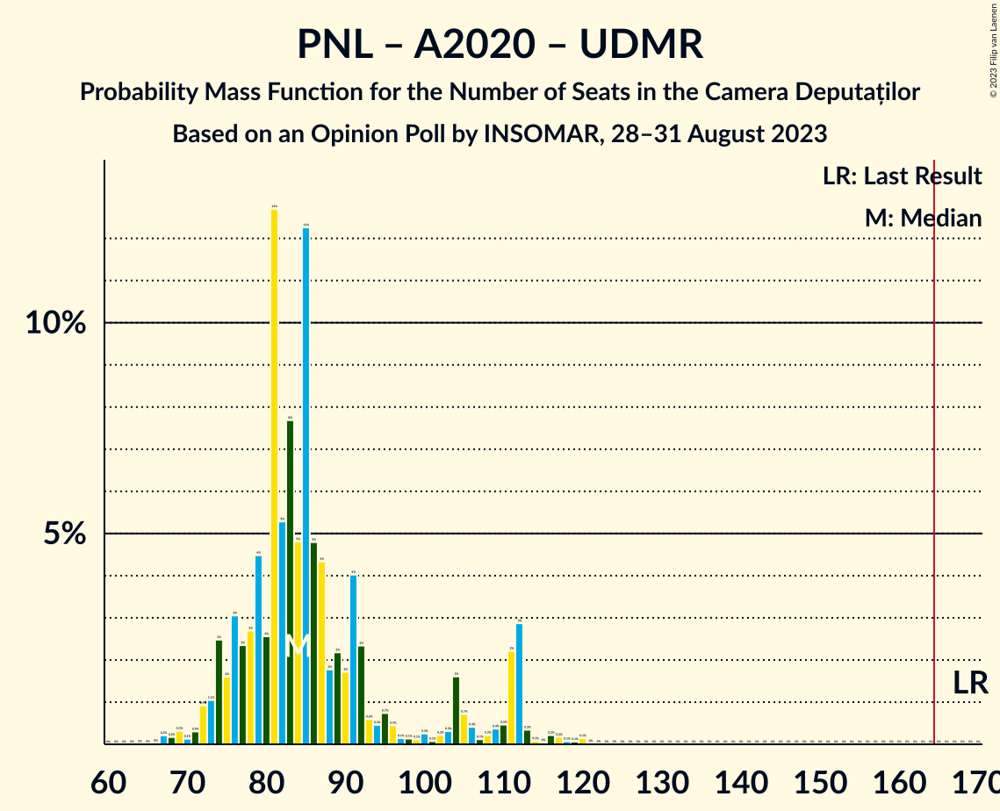

| Number of Seats | Probability | Accumulated | Special Marks |
|:---------------:|:-----------:|:-----------:|:-------------:|
| 66 | 0% | 100% |  |
| 67 | 0.2% | 99.9% |  |
| 68 | 0.2% | 99.7% |  |
| 69 | 0.3% | 99.6% |  |
| 70 | 0.1% | 99.2% |  |
| 71 | 0.3% | 99.1% |  |
| 72 | 0.9% | 98.8% |  |
| 73 | 1.1% | 98% |  |
| 74 | 2% | 97% |  |
| 75 | 2% | 94% |  |
| 76 | 3% | 93% |  |
| 77 | 2% | 90% |  |
| 78 | 3% | 87% |  |
| 79 | 4% | 85% |  |
| 80 | 3% | 80% |  |
| 81 | 13% | 78% |  |
| 82 | 5% | 65% |  |
| 83 | 8% | 60% | Median |
| 84 | 5% | 52% |  |
| 85 | 12% | 47% |  |
| 86 | 5% | 35% |  |
| 87 | 4% | 30% |  |
| 88 | 2% | 26% |  |
| 89 | 2% | 24% |  |
| 90 | 2% | 22% |  |
| 91 | 4% | 20% |  |
| 92 | 2% | 16% |  |
| 93 | 0.6% | 14% |  |
| 94 | 0.5% | 13% |  |
| 95 | 0.7% | 13% |  |
| 96 | 0.4% | 12% |  |
| 97 | 0.1% | 11% |  |
| 98 | 0.1% | 11% |  |
| 99 | 0.1% | 11% |  |
| 100 | 0.3% | 11% |  |
| 101 | 0.1% | 11% |  |
| 102 | 0.2% | 11% |  |
| 103 | 0.3% | 10% |  |
| 104 | 2% | 10% |  |
| 105 | 0.7% | 9% |  |
| 106 | 0.4% | 8% |  |
| 107 | 0.1% | 7% |  |
| 108 | 0.2% | 7% |  |
| 109 | 0.4% | 7% |  |
| 110 | 0.5% | 7% |  |
| 111 | 2% | 6% |  |
| 112 | 3% | 4% |  |
| 113 | 0.3% | 1.2% |  |
| 114 | 0.1% | 0.8% |  |
| 115 | 0% | 0.7% |  |
| 116 | 0.2% | 0.7% |  |
| 117 | 0.2% | 0.5% |  |
| 118 | 0.1% | 0.3% |  |
| 119 | 0.1% | 0.2% |  |
| 120 | 0.1% | 0.2% |  |
| 121 | 0% | 0% |  |
| 122 | 0% | 0% |  |
| 123 | 0% | 0% |  |
| 124 | 0% | 0% |  |
| 125 | 0% | 0% |  |
| 126 | 0% | 0% |  |
| 127 | 0% | 0% |  |
| 128 | 0% | 0% |  |
| 129 | 0% | 0% |  |
| 130 | 0% | 0% |  |
| 131 | 0% | 0% |  |
| 132 | 0% | 0% |  |
| 133 | 0% | 0% |  |
| 134 | 0% | 0% |  |
| 135 | 0% | 0% |  |
| 136 | 0% | 0% |  |
| 137 | 0% | 0% |  |
| 138 | 0% | 0% |  |
| 139 | 0% | 0% |  |
| 140 | 0% | 0% |  |
| 141 | 0% | 0% |  |
| 142 | 0% | 0% |  |
| 143 | 0% | 0% |  |
| 144 | 0% | 0% |  |
| 145 | 0% | 0% |  |
| 146 | 0% | 0% |  |
| 147 | 0% | 0% |  |
| 148 | 0% | 0% |  |
| 149 | 0% | 0% |  |
| 150 | 0% | 0% |  |
| 151 | 0% | 0% |  |
| 152 | 0% | 0% |  |
| 153 | 0% | 0% |  |
| 154 | 0% | 0% |  |
| 155 | 0% | 0% |  |
| 156 | 0% | 0% |  |
| 157 | 0% | 0% |  |
| 158 | 0% | 0% |  |
| 159 | 0% | 0% |  |
| 160 | 0% | 0% |  |
| 161 | 0% | 0% |  |
| 162 | 0% | 0% |  |
| 163 | 0% | 0% |  |
| 164 | 0% | 0% |  |
| 165 | 0% | 0% | Majority |
| 166 | 0% | 0% |  |
| 167 | 0% | 0% |  |
| 168 | 0% | 0% |  |
| 169 | 0% | 0% | Last Result |

### Partidul Național Liberal – Alianța 2020 USR-PLUS – Partidul Mișcarea Populară

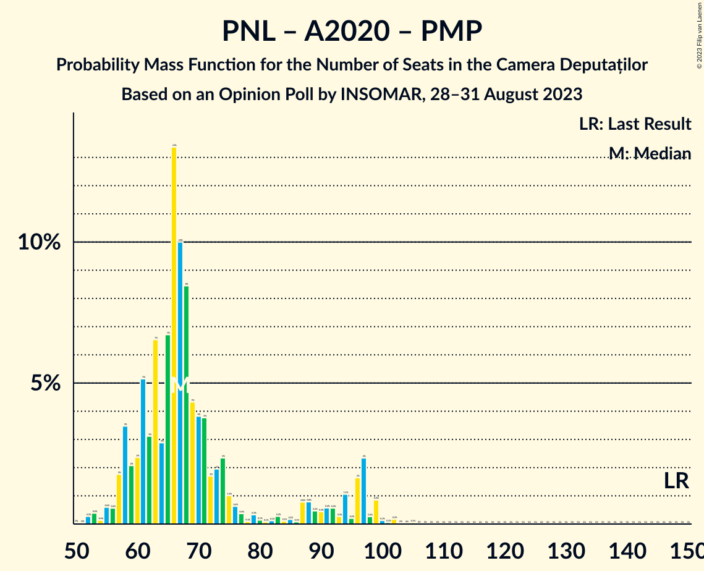

| Number of Seats | Probability | Accumulated | Special Marks |
|:---------------:|:-----------:|:-----------:|:-------------:|
| 50 | 0% | 100% |  |
| 51 | 0% | 99.9% |  |
| 52 | 0.3% | 99.9% |  |
| 53 | 0.4% | 99.6% |  |
| 54 | 0.1% | 99.2% |  |
| 55 | 0.6% | 99.1% |  |
| 56 | 0.6% | 98.5% |  |
| 57 | 2% | 98% |  |
| 58 | 3% | 96% |  |
| 59 | 2% | 93% |  |
| 60 | 2% | 91% |  |
| 61 | 5% | 88% |  |
| 62 | 3% | 83% |  |
| 63 | 7% | 80% |  |
| 64 | 3% | 73% |  |
| 65 | 7% | 71% |  |
| 66 | 13% | 64% | Median |
| 67 | 10% | 51% |  |
| 68 | 8% | 41% |  |
| 69 | 4% | 32% |  |
| 70 | 4% | 28% |  |
| 71 | 4% | 24% |  |
| 72 | 2% | 20% |  |
| 73 | 2% | 18% |  |
| 74 | 2% | 16% |  |
| 75 | 1.0% | 14% |  |
| 76 | 0.6% | 13% |  |
| 77 | 0.4% | 12% |  |
| 78 | 0.1% | 12% |  |
| 79 | 0.3% | 12% |  |
| 80 | 0.1% | 12% |  |
| 81 | 0.1% | 12% |  |
| 82 | 0.1% | 11% |  |
| 83 | 0.3% | 11% |  |
| 84 | 0.1% | 11% |  |
| 85 | 0.2% | 11% |  |
| 86 | 0.1% | 11% |  |
| 87 | 0.8% | 11% |  |
| 88 | 0.8% | 10% |  |
| 89 | 0.5% | 9% |  |
| 90 | 0.4% | 9% |  |
| 91 | 0.6% | 8% |  |
| 92 | 0.6% | 8% |  |
| 93 | 0.3% | 7% |  |
| 94 | 1.1% | 7% |  |
| 95 | 0.2% | 6% |  |
| 96 | 2% | 6% |  |
| 97 | 2% | 4% |  |
| 98 | 0.3% | 2% |  |
| 99 | 0.9% | 1.3% |  |
| 100 | 0.1% | 0.5% |  |
| 101 | 0.1% | 0.4% |  |
| 102 | 0.2% | 0.3% |  |
| 103 | 0% | 0.1% |  |
| 104 | 0% | 0.1% |  |
| 105 | 0.1% | 0.1% |  |
| 106 | 0% | 0% |  |
| 107 | 0% | 0% |  |
| 108 | 0% | 0% |  |
| 109 | 0% | 0% |  |
| 110 | 0% | 0% |  |
| 111 | 0% | 0% |  |
| 112 | 0% | 0% |  |
| 113 | 0% | 0% |  |
| 114 | 0% | 0% |  |
| 115 | 0% | 0% |  |
| 116 | 0% | 0% |  |
| 117 | 0% | 0% |  |
| 118 | 0% | 0% |  |
| 119 | 0% | 0% |  |
| 120 | 0% | 0% |  |
| 121 | 0% | 0% |  |
| 122 | 0% | 0% |  |
| 123 | 0% | 0% |  |
| 124 | 0% | 0% |  |
| 125 | 0% | 0% |  |
| 126 | 0% | 0% |  |
| 127 | 0% | 0% |  |
| 128 | 0% | 0% |  |
| 129 | 0% | 0% |  |
| 130 | 0% | 0% |  |
| 131 | 0% | 0% |  |
| 132 | 0% | 0% |  |
| 133 | 0% | 0% |  |
| 134 | 0% | 0% |  |
| 135 | 0% | 0% |  |
| 136 | 0% | 0% |  |
| 137 | 0% | 0% |  |
| 138 | 0% | 0% |  |
| 139 | 0% | 0% |  |
| 140 | 0% | 0% |  |
| 141 | 0% | 0% |  |
| 142 | 0% | 0% |  |
| 143 | 0% | 0% |  |
| 144 | 0% | 0% |  |
| 145 | 0% | 0% |  |
| 146 | 0% | 0% |  |
| 147 | 0% | 0% |  |
| 148 | 0% | 0% | Last Result |

### Partidul Național Liberal – Alianța 2020 USR-PLUS

| Number of Seats | Probability | Accumulated | Special Marks |
|:---------------:|:-----------:|:-----------:|:-------------:|
| 50 | 0% | 100% |  |
| 51 | 0% | 99.9% |  |
| 52 | 0.3% | 99.9% |  |
| 53 | 0.4% | 99.6% |  |
| 54 | 0.1% | 99.2% |  |
| 55 | 0.6% | 99.1% |  |
| 56 | 0.6% | 98.5% |  |
| 57 | 2% | 98% |  |
| 58 | 3% | 96% |  |
| 59 | 2% | 93% |  |
| 60 | 2% | 91% |  |
| 61 | 5% | 88% |  |
| 62 | 3% | 83% |  |
| 63 | 7% | 80% |  |
| 64 | 3% | 73% |  |
| 65 | 7% | 71% |  |
| 66 | 13% | 64% | Median |
| 67 | 10% | 50% |  |
| 68 | 8% | 40% |  |
| 69 | 4% | 32% |  |
| 70 | 4% | 28% |  |
| 71 | 4% | 24% |  |
| 72 | 2% | 20% |  |
| 73 | 2% | 18% |  |
| 74 | 2% | 16% |  |
| 75 | 1.0% | 14% |  |
| 76 | 0.6% | 13% |  |
| 77 | 0.4% | 12% |  |
| 78 | 0.1% | 12% |  |
| 79 | 0.3% | 12% |  |
| 80 | 0.1% | 12% |  |
| 81 | 0.1% | 11% |  |
| 82 | 0.1% | 11% |  |
| 83 | 0.3% | 11% |  |
| 84 | 0.1% | 11% |  |
| 85 | 0.2% | 11% |  |
| 86 | 0.1% | 11% |  |
| 87 | 0.8% | 11% |  |
| 88 | 0.8% | 10% |  |
| 89 | 0.5% | 9% |  |
| 90 | 0.4% | 9% |  |
| 91 | 0.6% | 8% |  |
| 92 | 0.6% | 8% |  |
| 93 | 0.3% | 7% |  |
| 94 | 1.1% | 7% |  |
| 95 | 0.2% | 6% |  |
| 96 | 2% | 6% |  |
| 97 | 2% | 4% |  |
| 98 | 0.3% | 2% |  |
| 99 | 0.9% | 1.3% |  |
| 100 | 0.1% | 0.5% |  |
| 101 | 0.1% | 0.3% |  |
| 102 | 0.2% | 0.3% |  |
| 103 | 0% | 0.1% |  |
| 104 | 0% | 0.1% |  |
| 105 | 0.1% | 0.1% |  |
| 106 | 0% | 0% |  |
| 107 | 0% | 0% |  |
| 108 | 0% | 0% |  |
| 109 | 0% | 0% |  |
| 110 | 0% | 0% |  |
| 111 | 0% | 0% |  |
| 112 | 0% | 0% |  |
| 113 | 0% | 0% |  |
| 114 | 0% | 0% |  |
| 115 | 0% | 0% |  |
| 116 | 0% | 0% |  |
| 117 | 0% | 0% |  |
| 118 | 0% | 0% |  |
| 119 | 0% | 0% |  |
| 120 | 0% | 0% |  |
| 121 | 0% | 0% |  |
| 122 | 0% | 0% |  |
| 123 | 0% | 0% |  |
| 124 | 0% | 0% |  |
| 125 | 0% | 0% |  |
| 126 | 0% | 0% |  |
| 127 | 0% | 0% |  |
| 128 | 0% | 0% |  |
| 129 | 0% | 0% |  |
| 130 | 0% | 0% |  |
| 131 | 0% | 0% |  |
| 132 | 0% | 0% |  |
| 133 | 0% | 0% |  |
| 134 | 0% | 0% |  |
| 135 | 0% | 0% |  |
| 136 | 0% | 0% |  |
| 137 | 0% | 0% |  |
| 138 | 0% | 0% |  |
| 139 | 0% | 0% |  |
| 140 | 0% | 0% |  |
| 141 | 0% | 0% |  |
| 142 | 0% | 0% |  |
| 143 | 0% | 0% |  |
| 144 | 0% | 0% |  |
| 145 | 0% | 0% |  |
| 146 | 0% | 0% |  |
| 147 | 0% | 0% |  |
| 148 | 0% | 0% | Last Result |

### Partidul Național Liberal – Uniunea Democrată Maghiară din România – Partidul Mișcarea Populară

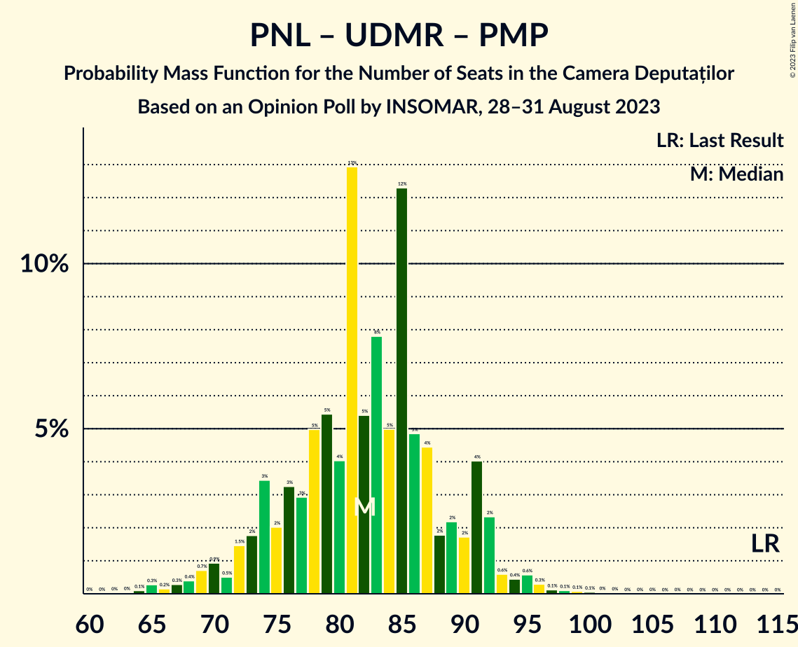

| Number of Seats | Probability | Accumulated | Special Marks |
|:---------------:|:-----------:|:-----------:|:-------------:|
| 62 | 0% | 100% |  |
| 63 | 0% | 99.9% |  |
| 64 | 0.1% | 99.9% |  |
| 65 | 0.3% | 99.8% |  |
| 66 | 0.2% | 99.5% |  |
| 67 | 0.3% | 99.4% |  |
| 68 | 0.4% | 99.1% |  |
| 69 | 0.7% | 98.7% |  |
| 70 | 0.9% | 98% |  |
| 71 | 0.5% | 97% |  |
| 72 | 1.5% | 97% |  |
| 73 | 2% | 95% |  |
| 74 | 3% | 93% |  |
| 75 | 2% | 90% |  |
| 76 | 3% | 88% |  |
| 77 | 3% | 85% |  |
| 78 | 5% | 82% |  |
| 79 | 5% | 77% |  |
| 80 | 4% | 71% |  |
| 81 | 13% | 67% |  |
| 82 | 5% | 54% |  |
| 83 | 8% | 49% | Median |
| 84 | 5% | 41% |  |
| 85 | 12% | 36% |  |
| 86 | 5% | 24% |  |
| 87 | 4% | 19% |  |
| 88 | 2% | 14% |  |
| 89 | 2% | 13% |  |
| 90 | 2% | 10% |  |
| 91 | 4% | 9% |  |
| 92 | 2% | 5% |  |
| 93 | 0.6% | 2% |  |
| 94 | 0.4% | 2% |  |
| 95 | 0.6% | 1.3% |  |
| 96 | 0.3% | 0.8% |  |
| 97 | 0.1% | 0.5% |  |
| 98 | 0.1% | 0.3% |  |
| 99 | 0.1% | 0.2% |  |
| 100 | 0.1% | 0.2% |  |
| 101 | 0% | 0.1% |  |
| 102 | 0% | 0.1% |  |
| 103 | 0% | 0% |  |
| 104 | 0% | 0% |  |
| 105 | 0% | 0% |  |
| 106 | 0% | 0% |  |
| 107 | 0% | 0% |  |
| 108 | 0% | 0% |  |
| 109 | 0% | 0% |  |
| 110 | 0% | 0% |  |
| 111 | 0% | 0% |  |
| 112 | 0% | 0% |  |
| 113 | 0% | 0% |  |
| 114 | 0% | 0% | Last Result |

### Partidul Național Liberal – Uniunea Democrată Maghiară din România

| Number of Seats | Probability | Accumulated | Special Marks |
|:---------------:|:-----------:|:-----------:|:-------------:|
| 62 | 0% | 100% |  |
| 63 | 0% | 99.9% |  |
| 64 | 0.1% | 99.9% |  |
| 65 | 0.3% | 99.8% |  |
| 66 | 0.2% | 99.5% |  |
| 67 | 0.3% | 99.4% |  |
| 68 | 0.4% | 99.1% |  |
| 69 | 0.7% | 98.7% |  |
| 70 | 0.9% | 98% |  |
| 71 | 0.5% | 97% |  |
| 72 | 1.5% | 97% |  |
| 73 | 2% | 95% |  |
| 74 | 3% | 93% |  |
| 75 | 2% | 90% |  |
| 76 | 3% | 88% |  |
| 77 | 3% | 85% |  |
| 78 | 5% | 82% |  |
| 79 | 5% | 77% |  |
| 80 | 4% | 71% |  |
| 81 | 13% | 67% |  |
| 82 | 5% | 54% |  |
| 83 | 8% | 49% | Median |
| 84 | 5% | 41% |  |
| 85 | 12% | 36% |  |
| 86 | 5% | 24% |  |
| 87 | 4% | 19% |  |
| 88 | 2% | 14% |  |
| 89 | 2% | 13% |  |
| 90 | 2% | 10% |  |
| 91 | 4% | 9% |  |
| 92 | 2% | 5% |  |
| 93 | 0.6% | 2% |  |
| 94 | 0.4% | 2% |  |
| 95 | 0.5% | 1.2% |  |
| 96 | 0.3% | 0.7% |  |
| 97 | 0.1% | 0.4% |  |
| 98 | 0.1% | 0.3% |  |
| 99 | 0.1% | 0.2% |  |
| 100 | 0.1% | 0.1% |  |
| 101 | 0% | 0.1% |  |
| 102 | 0% | 0% |  |
| 103 | 0% | 0% |  |
| 104 | 0% | 0% |  |
| 105 | 0% | 0% |  |
| 106 | 0% | 0% |  |
| 107 | 0% | 0% |  |
| 108 | 0% | 0% |  |
| 109 | 0% | 0% |  |
| 110 | 0% | 0% |  |
| 111 | 0% | 0% |  |
| 112 | 0% | 0% |  |
| 113 | 0% | 0% |  |
| 114 | 0% | 0% | Last Result |

### Partidul Național Liberal – Partidul Mișcarea Populară

| Number of Seats | Probability | Accumulated | Special Marks |
|:---------------:|:-----------:|:-----------:|:-------------:|
| 48 | 0.1% | 100% |  |
| 49 | 0.1% | 99.9% |  |
| 50 | 0.1% | 99.8% |  |
| 51 | 0.1% | 99.7% |  |
| 52 | 0.4% | 99.6% |  |
| 53 | 1.4% | 99.2% |  |
| 54 | 0.3% | 98% |  |
| 55 | 1.1% | 97% |  |
| 56 | 1.0% | 96% |  |
| 57 | 2% | 95% |  |
| 58 | 4% | 93% |  |
| 59 | 3% | 89% |  |
| 60 | 3% | 86% |  |
| 61 | 5% | 83% |  |
| 62 | 4% | 77% |  |
| 63 | 8% | 74% |  |
| 64 | 4% | 66% |  |
| 65 | 9% | 62% |  |
| 66 | 13% | 53% | Median |
| 67 | 10% | 39% |  |
| 68 | 9% | 29% |  |
| 69 | 4% | 21% |  |
| 70 | 4% | 16% |  |
| 71 | 4% | 13% |  |
| 72 | 2% | 9% |  |
| 73 | 2% | 7% |  |
| 74 | 2% | 5% |  |
| 75 | 1.0% | 3% |  |
| 76 | 0.6% | 2% |  |
| 77 | 0.4% | 1.1% |  |
| 78 | 0.1% | 0.7% |  |
| 79 | 0.3% | 0.6% |  |
| 80 | 0.1% | 0.3% |  |
| 81 | 0% | 0.2% |  |
| 82 | 0% | 0.1% |  |
| 83 | 0% | 0.1% |  |
| 84 | 0% | 0.1% |  |
| 85 | 0% | 0.1% |  |
| 86 | 0% | 0% |  |
| 87 | 0% | 0% |  |
| 88 | 0% | 0% |  |
| 89 | 0% | 0% |  |
| 90 | 0% | 0% |  |
| 91 | 0% | 0% |  |
| 92 | 0% | 0% |  |
| 93 | 0% | 0% | Last Result |

### Partidul Național Liberal

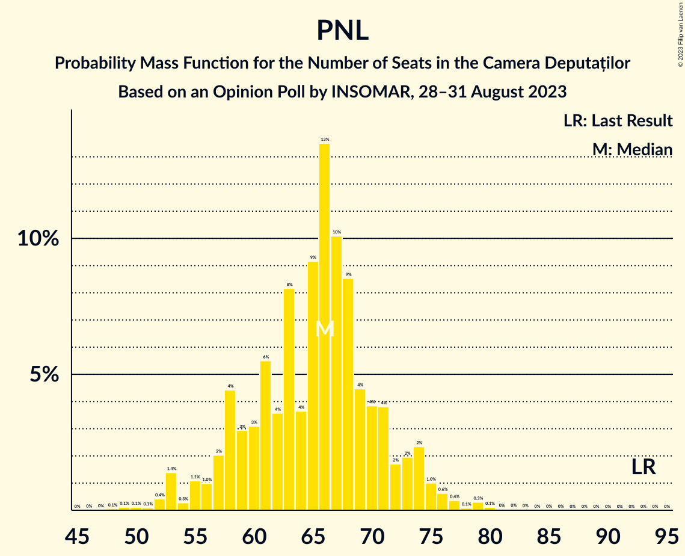

| Number of Seats | Probability | Accumulated | Special Marks |
|:---------------:|:-----------:|:-----------:|:-------------:|
| 48 | 0.1% | 100% |  |
| 49 | 0.1% | 99.9% |  |
| 50 | 0.1% | 99.8% |  |
| 51 | 0.1% | 99.7% |  |
| 52 | 0.4% | 99.6% |  |
| 53 | 1.4% | 99.2% |  |
| 54 | 0.3% | 98% |  |
| 55 | 1.1% | 97% |  |
| 56 | 1.0% | 96% |  |
| 57 | 2% | 95% |  |
| 58 | 4% | 93% |  |
| 59 | 3% | 89% |  |
| 60 | 3% | 86% |  |
| 61 | 6% | 83% |  |
| 62 | 4% | 77% |  |
| 63 | 8% | 74% |  |
| 64 | 4% | 66% |  |
| 65 | 9% | 62% |  |
| 66 | 13% | 53% | Median |
| 67 | 10% | 39% |  |
| 68 | 9% | 29% |  |
| 69 | 4% | 21% |  |
| 70 | 4% | 16% |  |
| 71 | 4% | 12% |  |
| 72 | 2% | 9% |  |
| 73 | 2% | 7% |  |
| 74 | 2% | 5% |  |
| 75 | 1.0% | 3% |  |
| 76 | 0.6% | 2% |  |
| 77 | 0.4% | 1.0% |  |
| 78 | 0.1% | 0.6% |  |
| 79 | 0.3% | 0.5% |  |
| 80 | 0.1% | 0.2% |  |
| 81 | 0% | 0.1% |  |
| 82 | 0% | 0.1% |  |
| 83 | 0% | 0% |  |
| 84 | 0% | 0% |  |
| 85 | 0% | 0% |  |
| 86 | 0% | 0% |  |
| 87 | 0% | 0% |  |
| 88 | 0% | 0% |  |
| 89 | 0% | 0% |  |
| 90 | 0% | 0% |  |
| 91 | 0% | 0% |  |
| 92 | 0% | 0% |  |
| 93 | 0% | 0% | Last Result |

### Alianța 2020 USR-PLUS – Partidul Mișcarea Populară

| Number of Seats | Probability | Accumulated | Special Marks |
|:---------------:|:-----------:|:-----------:|:-------------:|
| 0 | 88% | 100% | Median |
| 1 | 0% | 12% |  |
| 2 | 0% | 12% |  |
| 3 | 0% | 12% |  |
| 4 | 0% | 12% |  |
| 5 | 0% | 12% |  |
| 6 | 0% | 12% |  |
| 7 | 0% | 12% |  |
| 8 | 0% | 12% |  |
| 9 | 0% | 12% |  |
| 10 | 0% | 12% |  |
| 11 | 0% | 12% |  |
| 12 | 0% | 12% |  |
| 13 | 0% | 12% |  |
| 14 | 0% | 12% |  |
| 15 | 0% | 12% |  |
| 16 | 0% | 12% |  |
| 17 | 0% | 12% |  |
| 18 | 0% | 12% |  |
| 19 | 0% | 12% |  |
| 20 | 0% | 12% |  |
| 21 | 0% | 12% |  |
| 22 | 0% | 11% |  |
| 23 | 0% | 11% |  |
| 24 | 0% | 11% |  |
| 25 | 0% | 11% |  |
| 26 | 0% | 11% |  |
| 27 | 0% | 11% |  |
| 28 | 0% | 11% |  |
| 29 | 0% | 11% |  |
| 30 | 0.8% | 11% |  |
| 31 | 0.3% | 11% |  |
| 32 | 3% | 10% |  |
| 33 | 4% | 7% |  |
| 34 | 2% | 4% |  |
| 35 | 0.7% | 2% |  |
| 36 | 0.4% | 0.9% |  |
| 37 | 0.2% | 0.5% |  |
| 38 | 0.1% | 0.2% |  |
| 39 | 0.1% | 0.1% |  |
| 40 | 0% | 0% |  |
| 41 | 0% | 0% |  |
| 42 | 0% | 0% |  |
| 43 | 0% | 0% |  |
| 44 | 0% | 0% |  |
| 45 | 0% | 0% |  |
| 46 | 0% | 0% |  |
| 47 | 0% | 0% |  |
| 48 | 0% | 0% |  |
| 49 | 0% | 0% |  |
| 50 | 0% | 0% |  |
| 51 | 0% | 0% |  |
| 52 | 0% | 0% |  |
| 53 | 0% | 0% |  |
| 54 | 0% | 0% |  |
| 55 | 0% | 0% | Last Result |

## Technical Information

### Opinion Poll

+ **Polling firm:** INSOMAR
+ **Commissioner(s):** —
+ **Fieldwork period:** 28–31 August 2023

### Calculations

+ **Sample size:** 1030
+ **Simulations done:** 1,048,576
+ **Error estimate:** 1.46%

