# Opinion Poll by ARA Public Opinion, 16–28 December 2023

<a href="#voting-intentions">Voting Intentions</a> | <a href="#seats">Seats</a> | <a href="#coalitions">Coalitions</a> | <a href="#technical-information">Technical Information</a>

## Voting Intentions

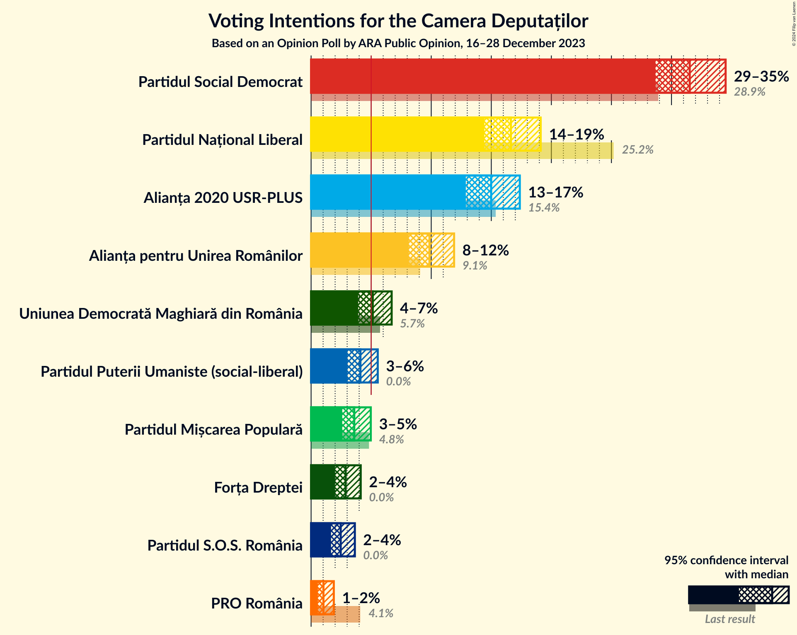

### Confidence Intervals

| Party | Last Result | Poll Result | 80% Confidence Interval | 90% Confidence Interval | 95% Confidence Interval | 99% Confidence Interval |
|:-----:|:-----------:|:-----------:|:-----------------------:|:-----------------------:|:-----------------------:|:-----------------------:|
| Partidul Social Democrat | 28.9% | 31.5% | 29.6–33.5% |29.1–34.0% |28.7–34.5% |27.8–35.5% |
| Partidul Național Liberal | 25.2% | 16.6% | 15.2–18.3% |14.8–18.7% |14.4–19.1% |13.7–19.9% |
| Alianța 2020 USR-PLUS | 15.4% | 15.0% | 13.6–16.6% |13.2–17.0% |12.9–17.4% |12.2–18.2% |
| Alianța pentru Unirea Românilor | 9.1% | 9.9% | 8.7–11.2% |8.4–11.6% |8.1–11.9% |7.6–12.6% |
| Uniunea Democrată Maghiară din România | 5.7% | 5.1% | 4.3–6.2% |4.1–6.4% |3.9–6.7% |3.6–7.2% |
| Partidul Puterii Umaniste (social-liberal) | 0.0% | 4.1% | 3.4–5.0% |3.2–5.3% |3.0–5.5% |2.7–6.0% |
| Partidul Mișcarea Populară | 4.8% | 3.6% | 2.9–4.5% |2.7–4.7% |2.6–5.0% |2.3–5.4% |
| Forța Dreptei | 0.0% | 2.9% | 2.3–3.7% |2.1–3.9% |2.0–4.1% |1.8–4.6% |
| Partidul S.O.S. România | 0.0% | 2.5% | 1.9–3.2% |1.8–3.4% |1.7–3.6% |1.4–4.1% |
| PRO România | 4.1% | 1.0% | 0.7–1.6% |0.6–1.7% |0.6–1.9% |0.4–2.2% |

*Note:* The poll result column reflects the actual value used in the calculations. Published results may vary slightly, and in addition be rounded to fewer digits.

## Seats

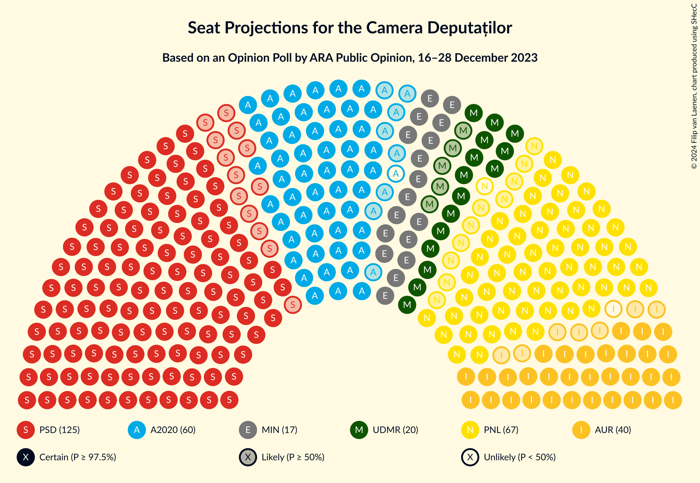

### Confidence Intervals

| Party | Last Result | Median | 80% Confidence Interval | 90% Confidence Interval | 95% Confidence Interval | 99% Confidence Interval |
|:-----:|:-----------:|:------:|:-----------------------:|:-----------------------:|:-----------------------:|:-----------------------:|
| <a href="#partidul-social-democrat">Partidul Social Democrat</a> | 110 | 125 | 116–134 |115–135 |112–136 |108–141 |
| <a href="#partidul-național-liberal">Partidul Național Liberal</a> | 93 | 66 | 59–72 |57–74 |56–76 |53–79 |
| <a href="#alianța-2020-usr-plus">Alianța 2020 USR-PLUS</a> | 55 | 59 | 53–65 |52–68 |51–70 |48–72 |
| <a href="#alianța-pentru-unirea-românilor">Alianța pentru Unirea Românilor</a> | 33 | 39 | 34–44 |33–46 |32–47 |29–49 |
| <a href="#uniunea-democrată-maghiară-din-românia">Uniunea Democrată Maghiară din România</a> | 21 | 20 | 16–24 |15–26 |15–28 |14–29 |
| <a href="#partidul-puterii-umaniste-(social-liberal)">Partidul Puterii Umaniste (social-liberal)</a> | 0 | 0 | 0–20 |0–20 |0–21 |0–22 |
| <a href="#partidul-mișcarea-populară">Partidul Mișcarea Populară</a> | 0 | 0 | 0 |0 |0 |0–20 |
| <a href="#forța-dreptei">Forța Dreptei</a> | 0 | 0 | 0 |0 |0 |0 |
| <a href="#partidul-s.o.s.-românia">Partidul S.O.S. România</a> | 0 | 0 | 0 |0 |0 |0 |
| <a href="#pro-românia">PRO România</a> | 0 | 0 | 0 |0 |0 |0 |

### Partidul Social Democrat

*For a full overview of the results for this party, see the [Partidul Social Democrat](party-partidulsocialdemocrat.html) page.*

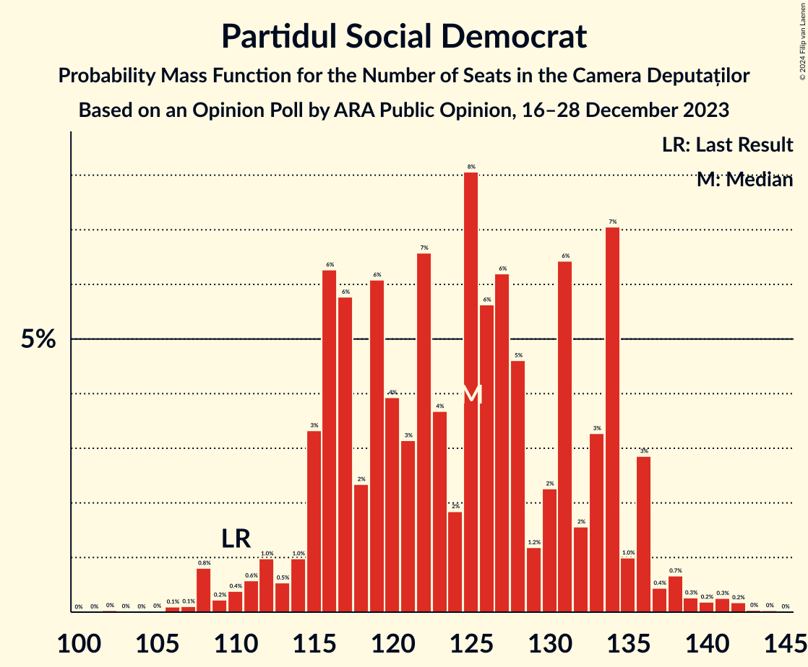

| Number of Seats | Probability | Accumulated | Special Marks |
|:---------------:|:-----------:|:-----------:|:-------------:|
| 102 | 0% | 100% |  |
| 103 | 0% | 99.9% |  |
| 104 | 0% | 99.9% |  |
| 105 | 0% | 99.9% |  |
| 106 | 0.1% | 99.9% |  |
| 107 | 0.1% | 99.8% |  |
| 108 | 0.8% | 99.7% |  |
| 109 | 0.2% | 98.9% |  |
| 110 | 0.4% | 98.7% | Last Result |
| 111 | 0.6% | 98% |  |
| 112 | 1.0% | 98% |  |
| 113 | 0.5% | 97% |  |
| 114 | 1.0% | 96% |  |
| 115 | 3% | 95% |  |
| 116 | 6% | 92% |  |
| 117 | 6% | 86% |  |
| 118 | 2% | 80% |  |
| 119 | 6% | 77% |  |
| 120 | 4% | 71% |  |
| 121 | 3% | 67% |  |
| 122 | 7% | 64% |  |
| 123 | 4% | 58% |  |
| 124 | 2% | 54% |  |
| 125 | 8% | 52% | Median |
| 126 | 6% | 44% |  |
| 127 | 6% | 39% |  |
| 128 | 5% | 32% |  |
| 129 | 1.2% | 28% |  |
| 130 | 2% | 27% |  |
| 131 | 6% | 24% |  |
| 132 | 2% | 18% |  |
| 133 | 3% | 16% |  |
| 134 | 7% | 13% |  |
| 135 | 1.0% | 6% |  |
| 136 | 3% | 5% |  |
| 137 | 0.4% | 2% |  |
| 138 | 0.7% | 2% |  |
| 139 | 0.3% | 1.0% |  |
| 140 | 0.2% | 0.7% |  |
| 141 | 0.3% | 0.5% |  |
| 142 | 0.2% | 0.3% |  |
| 143 | 0% | 0.1% |  |
| 144 | 0% | 0.1% |  |
| 145 | 0% | 0% |  |

### Partidul Național Liberal

*For a full overview of the results for this party, see the [Partidul Național Liberal](party-partidulnaționalliberal.html) page.*

| Number of Seats | Probability | Accumulated | Special Marks |
|:---------------:|:-----------:|:-----------:|:-------------:|
| 50 | 0.1% | 100% |  |
| 51 | 0.1% | 99.9% |  |
| 52 | 0.1% | 99.8% |  |
| 53 | 0.3% | 99.8% |  |
| 54 | 1.1% | 99.4% |  |
| 55 | 0.3% | 98% |  |
| 56 | 0.6% | 98% |  |
| 57 | 4% | 97% |  |
| 58 | 2% | 94% |  |
| 59 | 5% | 92% |  |
| 60 | 2% | 87% |  |
| 61 | 6% | 85% |  |
| 62 | 5% | 78% |  |
| 63 | 6% | 74% |  |
| 64 | 11% | 68% |  |
| 65 | 5% | 56% |  |
| 66 | 6% | 51% | Median |
| 67 | 11% | 45% |  |
| 68 | 10% | 34% |  |
| 69 | 6% | 24% |  |
| 70 | 4% | 18% |  |
| 71 | 2% | 14% |  |
| 72 | 3% | 12% |  |
| 73 | 3% | 8% |  |
| 74 | 2% | 6% |  |
| 75 | 0.7% | 4% |  |
| 76 | 2% | 3% |  |
| 77 | 0.6% | 2% |  |
| 78 | 0.3% | 0.9% |  |
| 79 | 0.3% | 0.7% |  |
| 80 | 0.2% | 0.4% |  |
| 81 | 0.2% | 0.2% |  |
| 82 | 0% | 0% |  |
| 83 | 0% | 0% |  |
| 84 | 0% | 0% |  |
| 85 | 0% | 0% |  |
| 86 | 0% | 0% |  |
| 87 | 0% | 0% |  |
| 88 | 0% | 0% |  |
| 89 | 0% | 0% |  |
| 90 | 0% | 0% |  |
| 91 | 0% | 0% |  |
| 92 | 0% | 0% |  |
| 93 | 0% | 0% | Last Result |

### Alianța 2020 USR-PLUS

*For a full overview of the results for this party, see the [Alianța 2020 USR-PLUS](party-alianța2020usr-plus.html) page.*

| Number of Seats | Probability | Accumulated | Special Marks |
|:---------------:|:-----------:|:-----------:|:-------------:|
| 46 | 0.1% | 100% |  |
| 47 | 0.2% | 99.8% |  |
| 48 | 0.2% | 99.6% |  |
| 49 | 0.6% | 99.4% |  |
| 50 | 1.3% | 98.8% |  |
| 51 | 2% | 98% |  |
| 52 | 2% | 95% |  |
| 53 | 5% | 93% |  |
| 54 | 4% | 88% |  |
| 55 | 2% | 85% | Last Result |
| 56 | 12% | 83% |  |
| 57 | 14% | 72% |  |
| 58 | 3% | 57% |  |
| 59 | 8% | 54% | Median |
| 60 | 14% | 46% |  |
| 61 | 4% | 32% |  |
| 62 | 3% | 28% |  |
| 63 | 9% | 25% |  |
| 64 | 6% | 17% |  |
| 65 | 2% | 11% |  |
| 66 | 3% | 9% |  |
| 67 | 0.9% | 6% |  |
| 68 | 0.8% | 5% |  |
| 69 | 0.7% | 5% |  |
| 70 | 3% | 4% |  |
| 71 | 0.2% | 0.7% |  |
| 72 | 0.3% | 0.5% |  |
| 73 | 0.1% | 0.2% |  |
| 74 | 0% | 0.1% |  |
| 75 | 0% | 0.1% |  |
| 76 | 0% | 0% |  |

### Alianța pentru Unirea Românilor

*For a full overview of the results for this party, see the [Alianța pentru Unirea Românilor](party-alianțapentruunirearomânilor.html) page.*

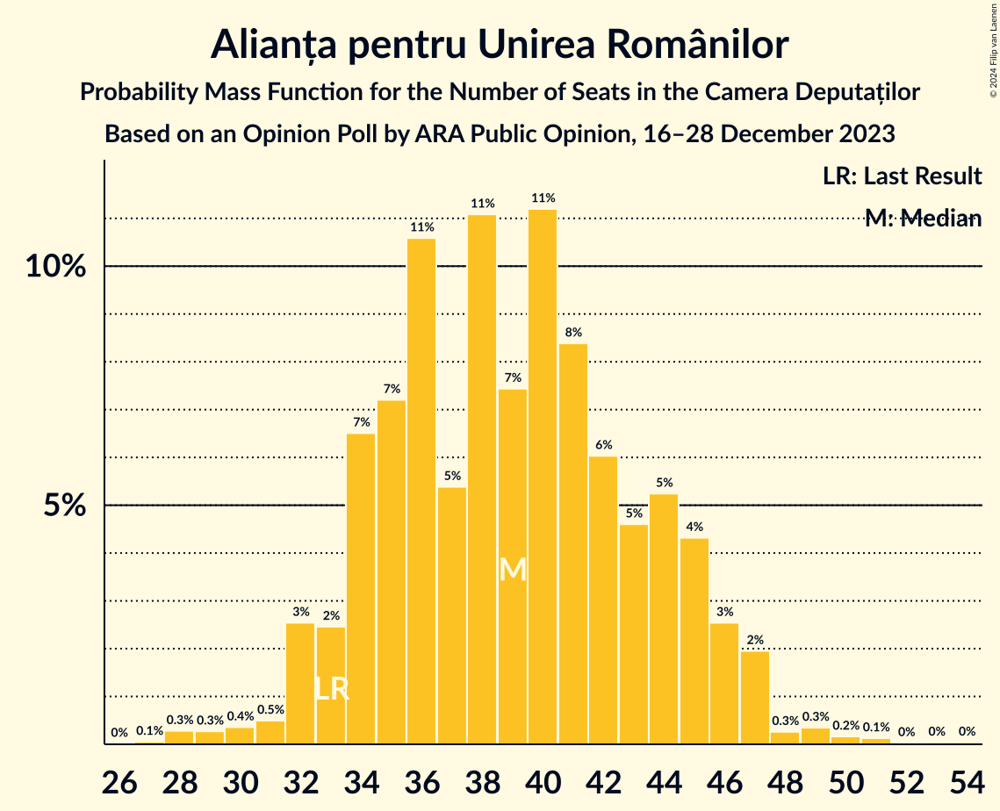

| Number of Seats | Probability | Accumulated | Special Marks |
|:---------------:|:-----------:|:-----------:|:-------------:|
| 27 | 0.1% | 100% |  |
| 28 | 0.3% | 99.9% |  |
| 29 | 0.3% | 99.6% |  |
| 30 | 0.4% | 99.4% |  |
| 31 | 0.5% | 99.0% |  |
| 32 | 3% | 98.5% |  |
| 33 | 2% | 96% | Last Result |
| 34 | 7% | 94% |  |
| 35 | 7% | 87% |  |
| 36 | 11% | 80% |  |
| 37 | 5% | 69% |  |
| 38 | 11% | 64% |  |
| 39 | 7% | 53% | Median |
| 40 | 11% | 45% |  |
| 41 | 8% | 34% |  |
| 42 | 6% | 26% |  |
| 43 | 5% | 20% |  |
| 44 | 5% | 15% |  |
| 45 | 4% | 10% |  |
| 46 | 3% | 6% |  |
| 47 | 2% | 3% |  |
| 48 | 0.3% | 1.0% |  |
| 49 | 0.3% | 0.8% |  |
| 50 | 0.2% | 0.4% |  |
| 51 | 0.1% | 0.2% |  |
| 52 | 0% | 0.1% |  |
| 53 | 0% | 0.1% |  |
| 54 | 0% | 0% |  |

### Uniunea Democrată Maghiară din România

*For a full overview of the results for this party, see the [Uniunea Democrată Maghiară din România](party-uniuneademocratămaghiarădinromânia.html) page.*

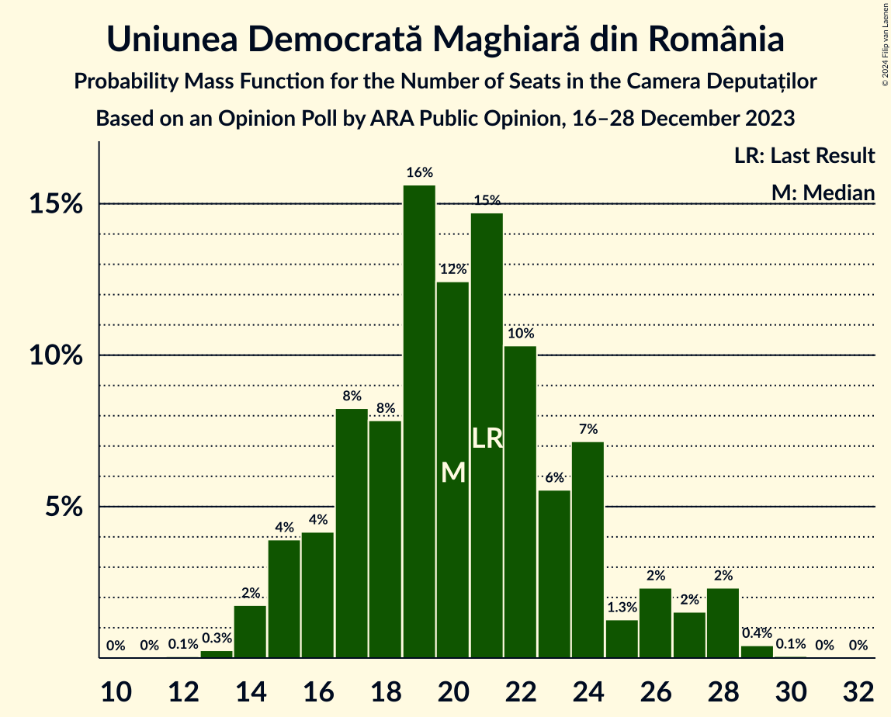

| Number of Seats | Probability | Accumulated | Special Marks |
|:---------------:|:-----------:|:-----------:|:-------------:|
| 12 | 0.1% | 100% |  |
| 13 | 0.3% | 99.9% |  |
| 14 | 2% | 99.7% |  |
| 15 | 4% | 98% |  |
| 16 | 4% | 94% |  |
| 17 | 8% | 90% |  |
| 18 | 8% | 82% |  |
| 19 | 16% | 74% |  |
| 20 | 12% | 58% | Median |
| 21 | 15% | 46% | Last Result |
| 22 | 10% | 31% |  |
| 23 | 6% | 21% |  |
| 24 | 7% | 15% |  |
| 25 | 1.3% | 8% |  |
| 26 | 2% | 7% |  |
| 27 | 2% | 4% |  |
| 28 | 2% | 3% |  |
| 29 | 0.4% | 0.5% |  |
| 30 | 0.1% | 0.1% |  |
| 31 | 0% | 0% |  |

### Partidul Puterii Umaniste (social-liberal)

*For a full overview of the results for this party, see the [Partidul Puterii Umaniste (social-liberal)](party-partidulputeriiumanistesocial-liberal.html) page.*

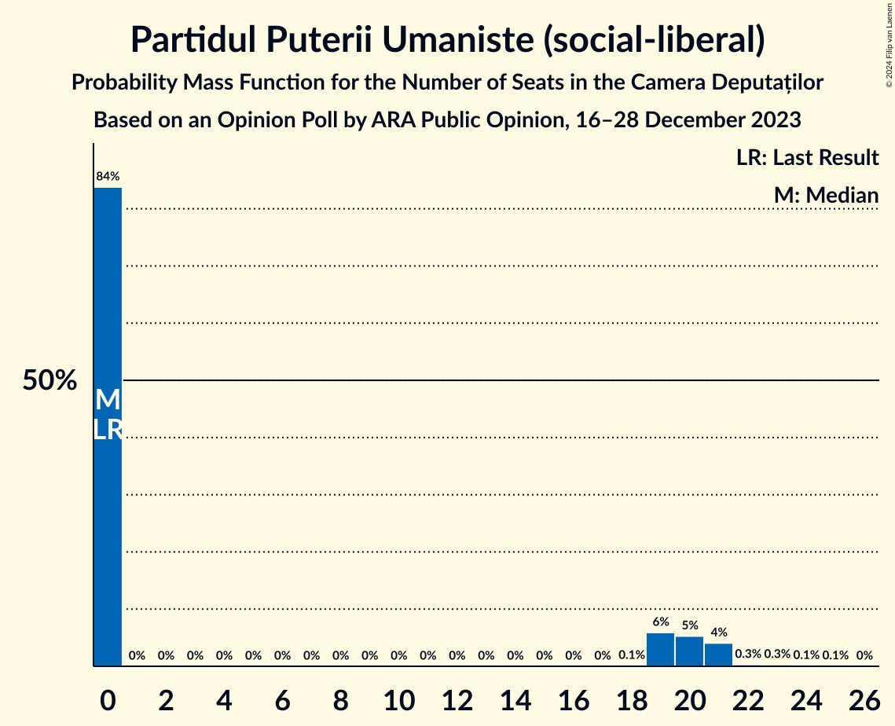

| Number of Seats | Probability | Accumulated | Special Marks |
|:---------------:|:-----------:|:-----------:|:-------------:|
| 0 | 84% | 100% | Last Result, Median |
| 1 | 0% | 16% |  |
| 2 | 0% | 16% |  |
| 3 | 0% | 16% |  |
| 4 | 0% | 16% |  |
| 5 | 0% | 16% |  |
| 6 | 0% | 16% |  |
| 7 | 0% | 16% |  |
| 8 | 0% | 16% |  |
| 9 | 0% | 16% |  |
| 10 | 0% | 16% |  |
| 11 | 0% | 16% |  |
| 12 | 0% | 16% |  |
| 13 | 0% | 16% |  |
| 14 | 0% | 16% |  |
| 15 | 0% | 16% |  |
| 16 | 0% | 16% |  |
| 17 | 0% | 16% |  |
| 18 | 0.1% | 16% |  |
| 19 | 6% | 16% |  |
| 20 | 5% | 10% |  |
| 21 | 4% | 5% |  |
| 22 | 0.3% | 0.8% |  |
| 23 | 0.3% | 0.5% |  |
| 24 | 0.1% | 0.2% |  |
| 25 | 0.1% | 0.1% |  |
| 26 | 0% | 0% |  |

### Partidul Mișcarea Populară

*For a full overview of the results for this party, see the [Partidul Mișcarea Populară](party-partidulmișcareapopulară.html) page.*

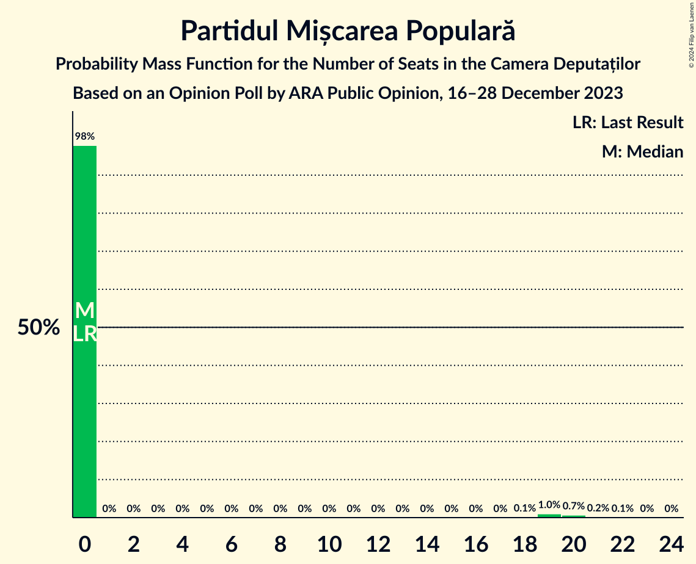

| Number of Seats | Probability | Accumulated | Special Marks |
|:---------------:|:-----------:|:-----------:|:-------------:|
| 0 | 98% | 100% | Last Result, Median |
| 1 | 0% | 2% |  |
| 2 | 0% | 2% |  |
| 3 | 0% | 2% |  |
| 4 | 0% | 2% |  |
| 5 | 0% | 2% |  |
| 6 | 0% | 2% |  |
| 7 | 0% | 2% |  |
| 8 | 0% | 2% |  |
| 9 | 0% | 2% |  |
| 10 | 0% | 2% |  |
| 11 | 0% | 2% |  |
| 12 | 0% | 2% |  |
| 13 | 0% | 2% |  |
| 14 | 0% | 2% |  |
| 15 | 0% | 2% |  |
| 16 | 0% | 2% |  |
| 17 | 0% | 2% |  |
| 18 | 0.1% | 2% |  |
| 19 | 1.0% | 2% |  |
| 20 | 0.7% | 1.0% |  |
| 21 | 0.2% | 0.3% |  |
| 22 | 0.1% | 0.1% |  |
| 23 | 0% | 0.1% |  |
| 24 | 0% | 0% |  |

### Forța Dreptei

*For a full overview of the results for this party, see the [Forța Dreptei](party-forțadreptei.html) page.*

| Number of Seats | Probability | Accumulated | Special Marks |
|:---------------:|:-----------:|:-----------:|:-------------:|
| 0 | 99.9% | 100% | Last Result, Median |
| 1 | 0% | 0.1% |  |
| 2 | 0% | 0.1% |  |
| 3 | 0% | 0.1% |  |
| 4 | 0% | 0.1% |  |
| 5 | 0% | 0.1% |  |
| 6 | 0% | 0.1% |  |
| 7 | 0% | 0.1% |  |
| 8 | 0% | 0.1% |  |
| 9 | 0% | 0.1% |  |
| 10 | 0% | 0.1% |  |
| 11 | 0% | 0.1% |  |
| 12 | 0% | 0.1% |  |
| 13 | 0% | 0.1% |  |
| 14 | 0% | 0.1% |  |
| 15 | 0% | 0.1% |  |
| 16 | 0% | 0.1% |  |
| 17 | 0% | 0.1% |  |
| 18 | 0% | 0.1% |  |
| 19 | 0% | 0.1% |  |
| 20 | 0% | 0% |  |

### Partidul S.O.S. România

*For a full overview of the results for this party, see the [Partidul S.O.S. România](party-partidulsosromânia.html) page.*

| Number of Seats | Probability | Accumulated | Special Marks |
|:---------------:|:-----------:|:-----------:|:-------------:|
| 0 | 100% | 100% | Last Result, Median |

### PRO România

*For a full overview of the results for this party, see the [PRO România](party-proromânia.html) page.*

| Number of Seats | Probability | Accumulated | Special Marks |
|:---------------:|:-----------:|:-----------:|:-------------:|
| 0 | 100% | 100% | Last Result, Median |

## Coalitions

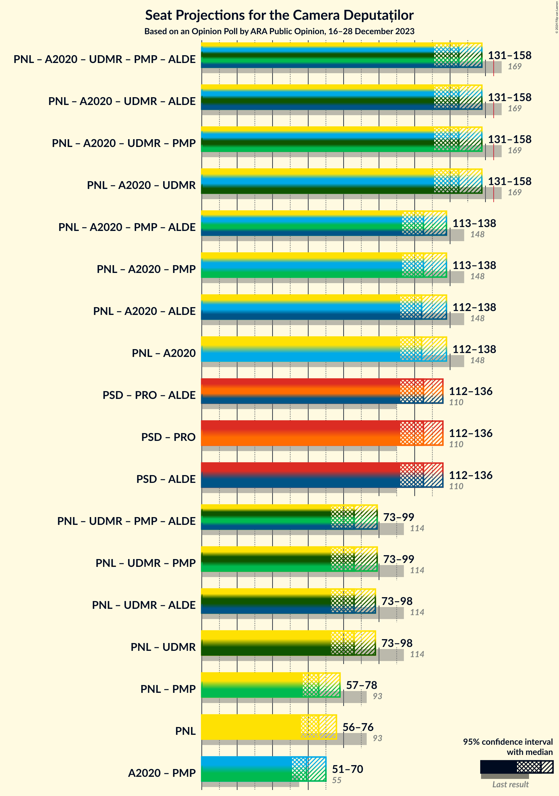

### Confidence Intervals

| Coalition | Last Result | Median | Majority? | 80% Confidence Interval | 90% Confidence Interval | 95% Confidence Interval | 99% Confidence Interval |
|:---------:|:-----------:|:------:|:---------:|:-----------------------:|:-----------------------:|:-----------------------:|:-----------------------:|
| Partidul Național Liberal – Alianța 2020 USR-PLUS – Uniunea Democrată Maghiară din România – Partidul Mișcarea Populară | 169 | 145 | 0.2% | 136–156 | 133–157 | 131–158 | 130–162 |
| Partidul Național Liberal – Alianța 2020 USR-PLUS – Uniunea Democrată Maghiară din România | 169 | 145 | 0.1% | 135–155 | 133–157 | 131–158 | 129–161 |
| Partidul Național Liberal – Alianța 2020 USR-PLUS – Partidul Mișcarea Populară | 148 | 125 | 0% | 116–134 | 115–137 | 113–138 | 109–142 |
| Partidul Național Liberal – Alianța 2020 USR-PLUS | 148 | 124 | 0% | 116–133 | 114–137 | 112–138 | 108–141 |
| Partidul Social Democrat – PRO România | 110 | 125 | 0% | 116–134 | 115–135 | 112–136 | 108–141 |
| Partidul Național Liberal – Uniunea Democrată Maghiară din România – Partidul Mișcarea Populară | 114 | 86 | 0% | 79–94 | 76–97 | 73–99 | 72–104 |
| Partidul Național Liberal – Uniunea Democrată Maghiară din România | 114 | 86 | 0% | 79–94 | 76–96 | 73–98 | 72–100 |
| Partidul Național Liberal – Partidul Mișcarea Populară | 93 | 66 | 0% | 59–73 | 57–76 | 57–78 | 54–85 |
| Partidul Național Liberal | 93 | 66 | 0% | 59–72 | 57–74 | 56–76 | 53–79 |
| Alianța 2020 USR-PLUS – Partidul Mișcarea Populară | 55 | 59 | 0% | 53–66 | 52–70 | 51–70 | 48–79 |

### Partidul Național Liberal – Alianța 2020 USR-PLUS – Uniunea Democrată Maghiară din România – Partidul Mișcarea Populară

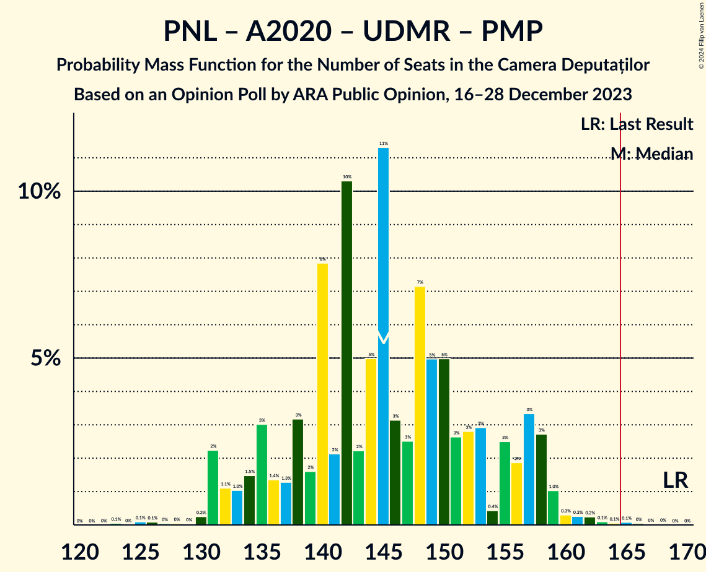

| Number of Seats | Probability | Accumulated | Special Marks |
|:---------------:|:-----------:|:-----------:|:-------------:|
| 123 | 0.1% | 100% |  |
| 124 | 0% | 99.9% |  |
| 125 | 0.1% | 99.9% |  |
| 126 | 0.1% | 99.8% |  |
| 127 | 0% | 99.7% |  |
| 128 | 0% | 99.7% |  |
| 129 | 0% | 99.6% |  |
| 130 | 0.3% | 99.6% |  |
| 131 | 2% | 99.3% |  |
| 132 | 1.1% | 97% |  |
| 133 | 1.0% | 96% |  |
| 134 | 1.5% | 95% |  |
| 135 | 3% | 93% |  |
| 136 | 1.4% | 90% |  |
| 137 | 1.3% | 89% |  |
| 138 | 3% | 88% |  |
| 139 | 2% | 85% |  |
| 140 | 8% | 83% |  |
| 141 | 2% | 75% |  |
| 142 | 10% | 73% |  |
| 143 | 2% | 63% |  |
| 144 | 5% | 61% |  |
| 145 | 11% | 56% | Median |
| 146 | 3% | 44% |  |
| 147 | 3% | 41% |  |
| 148 | 7% | 39% |  |
| 149 | 5% | 31% |  |
| 150 | 5% | 26% |  |
| 151 | 3% | 21% |  |
| 152 | 3% | 19% |  |
| 153 | 3% | 16% |  |
| 154 | 0.4% | 13% |  |
| 155 | 3% | 13% |  |
| 156 | 2% | 10% |  |
| 157 | 3% | 8% |  |
| 158 | 3% | 5% |  |
| 159 | 1.0% | 2% |  |
| 160 | 0.3% | 1.2% |  |
| 161 | 0.3% | 0.9% |  |
| 162 | 0.2% | 0.6% |  |
| 163 | 0.1% | 0.4% |  |
| 164 | 0.1% | 0.3% |  |
| 165 | 0.1% | 0.2% | Majority |
| 166 | 0% | 0.1% |  |
| 167 | 0% | 0.1% |  |
| 168 | 0% | 0% |  |
| 169 | 0% | 0% | Last Result |

### Partidul Național Liberal – Alianța 2020 USR-PLUS – Uniunea Democrată Maghiară din România

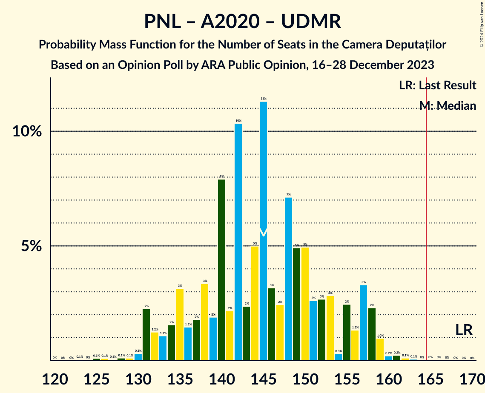

| Number of Seats | Probability | Accumulated | Special Marks |
|:---------------:|:-----------:|:-----------:|:-------------:|
| 123 | 0.1% | 100% |  |
| 124 | 0% | 99.9% |  |
| 125 | 0.1% | 99.9% |  |
| 126 | 0.1% | 99.8% |  |
| 127 | 0.1% | 99.7% |  |
| 128 | 0.1% | 99.6% |  |
| 129 | 0.1% | 99.5% |  |
| 130 | 0.3% | 99.4% |  |
| 131 | 2% | 99.1% |  |
| 132 | 1.2% | 97% |  |
| 133 | 1.1% | 96% |  |
| 134 | 2% | 94% |  |
| 135 | 3% | 93% |  |
| 136 | 1.5% | 90% |  |
| 137 | 2% | 88% |  |
| 138 | 3% | 87% |  |
| 139 | 2% | 83% |  |
| 140 | 8% | 81% |  |
| 141 | 2% | 73% |  |
| 142 | 10% | 71% |  |
| 143 | 2% | 61% |  |
| 144 | 5% | 58% |  |
| 145 | 11% | 53% | Median |
| 146 | 3% | 42% |  |
| 147 | 2% | 39% |  |
| 148 | 7% | 37% |  |
| 149 | 5% | 29% |  |
| 150 | 5% | 25% |  |
| 151 | 3% | 20% |  |
| 152 | 3% | 17% |  |
| 153 | 3% | 14% |  |
| 154 | 0.3% | 11% |  |
| 155 | 2% | 11% |  |
| 156 | 1.3% | 9% |  |
| 157 | 3% | 7% |  |
| 158 | 2% | 4% |  |
| 159 | 1.0% | 2% |  |
| 160 | 0.2% | 0.8% |  |
| 161 | 0.2% | 0.5% |  |
| 162 | 0.1% | 0.3% |  |
| 163 | 0.1% | 0.2% |  |
| 164 | 0% | 0.1% |  |
| 165 | 0% | 0.1% | Majority |
| 166 | 0% | 0.1% |  |
| 167 | 0% | 0% |  |
| 168 | 0% | 0% |  |
| 169 | 0% | 0% | Last Result |

### Partidul Național Liberal – Alianța 2020 USR-PLUS – Partidul Mișcarea Populară

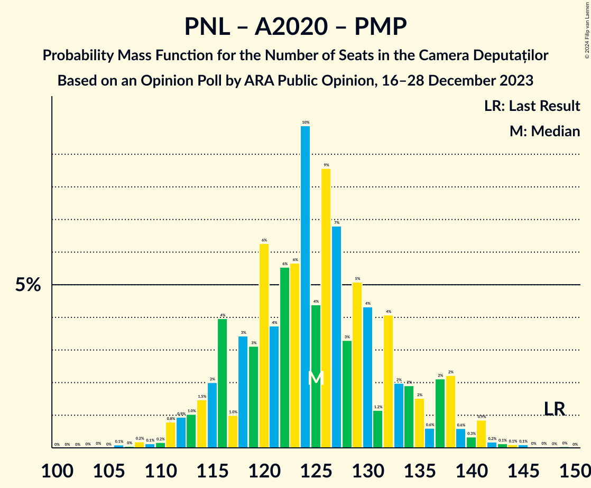

| Number of Seats | Probability | Accumulated | Special Marks |
|:---------------:|:-----------:|:-----------:|:-------------:|
| 104 | 0% | 100% |  |
| 105 | 0% | 99.9% |  |
| 106 | 0.1% | 99.9% |  |
| 107 | 0% | 99.8% |  |
| 108 | 0.2% | 99.8% |  |
| 109 | 0.1% | 99.6% |  |
| 110 | 0.2% | 99.5% |  |
| 111 | 0.8% | 99.3% |  |
| 112 | 0.9% | 98.5% |  |
| 113 | 1.0% | 98% |  |
| 114 | 1.5% | 97% |  |
| 115 | 2% | 95% |  |
| 116 | 4% | 93% |  |
| 117 | 1.0% | 89% |  |
| 118 | 3% | 88% |  |
| 119 | 3% | 85% |  |
| 120 | 6% | 82% |  |
| 121 | 4% | 75% |  |
| 122 | 6% | 72% |  |
| 123 | 6% | 66% |  |
| 124 | 10% | 60% |  |
| 125 | 4% | 50% | Median |
| 126 | 9% | 46% |  |
| 127 | 7% | 38% |  |
| 128 | 3% | 31% |  |
| 129 | 5% | 27% |  |
| 130 | 4% | 22% |  |
| 131 | 1.2% | 18% |  |
| 132 | 4% | 17% |  |
| 133 | 2% | 13% |  |
| 134 | 2% | 11% |  |
| 135 | 2% | 9% |  |
| 136 | 0.6% | 7% |  |
| 137 | 2% | 7% |  |
| 138 | 2% | 5% |  |
| 139 | 0.6% | 2% |  |
| 140 | 0.3% | 2% |  |
| 141 | 0.9% | 2% |  |
| 142 | 0.2% | 0.7% |  |
| 143 | 0.1% | 0.5% |  |
| 144 | 0.1% | 0.3% |  |
| 145 | 0.1% | 0.2% |  |
| 146 | 0% | 0.1% |  |
| 147 | 0% | 0.1% |  |
| 148 | 0% | 0.1% | Last Result |
| 149 | 0% | 0.1% |  |
| 150 | 0% | 0% |  |

### Partidul Național Liberal – Alianța 2020 USR-PLUS

| Number of Seats | Probability | Accumulated | Special Marks |
|:---------------:|:-----------:|:-----------:|:-------------:|
| 104 | 0% | 100% |  |
| 105 | 0% | 99.9% |  |
| 106 | 0.1% | 99.9% |  |
| 107 | 0.1% | 99.8% |  |
| 108 | 0.3% | 99.7% |  |
| 109 | 0.2% | 99.5% |  |
| 110 | 0.2% | 99.3% |  |
| 111 | 0.8% | 99.1% |  |
| 112 | 1.1% | 98% |  |
| 113 | 1.2% | 97% |  |
| 114 | 1.5% | 96% |  |
| 115 | 2% | 95% |  |
| 116 | 4% | 92% |  |
| 117 | 1.1% | 88% |  |
| 118 | 3% | 87% |  |
| 119 | 3% | 84% |  |
| 120 | 7% | 81% |  |
| 121 | 4% | 74% |  |
| 122 | 6% | 70% |  |
| 123 | 6% | 64% |  |
| 124 | 10% | 58% |  |
| 125 | 4% | 48% | Median |
| 126 | 9% | 44% |  |
| 127 | 7% | 36% |  |
| 128 | 3% | 29% |  |
| 129 | 5% | 25% |  |
| 130 | 4% | 20% |  |
| 131 | 1.1% | 16% |  |
| 132 | 4% | 15% |  |
| 133 | 2% | 11% |  |
| 134 | 2% | 9% |  |
| 135 | 1.5% | 7% |  |
| 136 | 0.5% | 6% |  |
| 137 | 2% | 5% |  |
| 138 | 2% | 3% |  |
| 139 | 0.1% | 1.2% |  |
| 140 | 0.3% | 1.1% |  |
| 141 | 0.4% | 0.8% |  |
| 142 | 0.1% | 0.4% |  |
| 143 | 0.1% | 0.3% |  |
| 144 | 0.1% | 0.2% |  |
| 145 | 0.1% | 0.1% |  |
| 146 | 0% | 0% |  |
| 147 | 0% | 0% |  |
| 148 | 0% | 0% | Last Result |

### Partidul Social Democrat – PRO România

| Number of Seats | Probability | Accumulated | Special Marks |
|:---------------:|:-----------:|:-----------:|:-------------:|
| 102 | 0% | 100% |  |
| 103 | 0% | 99.9% |  |
| 104 | 0% | 99.9% |  |
| 105 | 0% | 99.9% |  |
| 106 | 0.1% | 99.9% |  |
| 107 | 0.1% | 99.8% |  |
| 108 | 0.8% | 99.7% |  |
| 109 | 0.2% | 98.9% |  |
| 110 | 0.4% | 98.7% | Last Result |
| 111 | 0.6% | 98% |  |
| 112 | 1.0% | 98% |  |
| 113 | 0.5% | 97% |  |
| 114 | 1.0% | 96% |  |
| 115 | 3% | 95% |  |
| 116 | 6% | 92% |  |
| 117 | 6% | 86% |  |
| 118 | 2% | 80% |  |
| 119 | 6% | 77% |  |
| 120 | 4% | 71% |  |
| 121 | 3% | 67% |  |
| 122 | 7% | 64% |  |
| 123 | 4% | 58% |  |
| 124 | 2% | 54% |  |
| 125 | 8% | 52% | Median |
| 126 | 6% | 44% |  |
| 127 | 6% | 39% |  |
| 128 | 5% | 32% |  |
| 129 | 1.2% | 28% |  |
| 130 | 2% | 27% |  |
| 131 | 6% | 24% |  |
| 132 | 2% | 18% |  |
| 133 | 3% | 16% |  |
| 134 | 7% | 13% |  |
| 135 | 1.0% | 6% |  |
| 136 | 3% | 5% |  |
| 137 | 0.4% | 2% |  |
| 138 | 0.7% | 2% |  |
| 139 | 0.3% | 1.0% |  |
| 140 | 0.2% | 0.7% |  |
| 141 | 0.3% | 0.5% |  |
| 142 | 0.2% | 0.3% |  |
| 143 | 0% | 0.1% |  |
| 144 | 0% | 0.1% |  |
| 145 | 0% | 0% |  |

### Partidul Național Liberal – Uniunea Democrată Maghiară din România – Partidul Mișcarea Populară

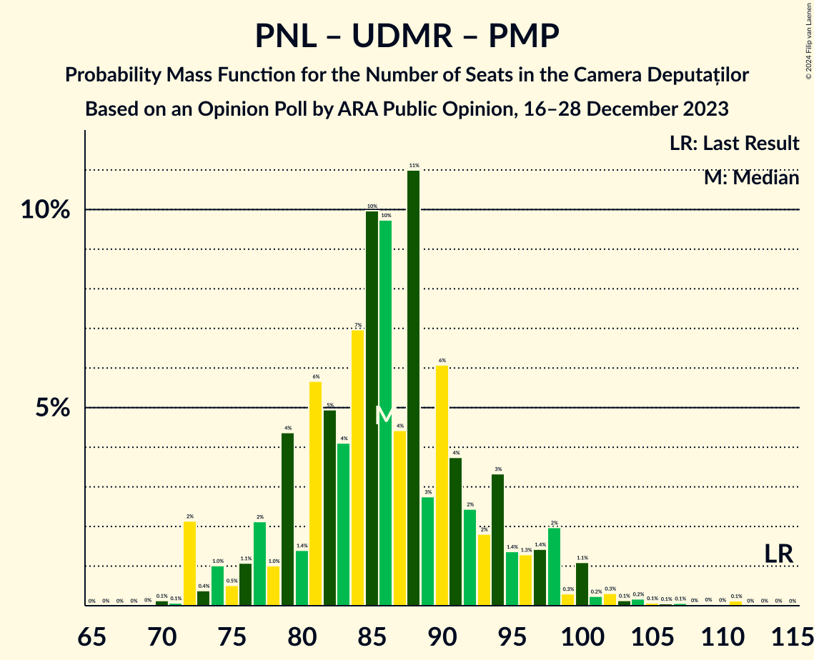

| Number of Seats | Probability | Accumulated | Special Marks |
|:---------------:|:-----------:|:-----------:|:-------------:|
| 69 | 0% | 100% |  |
| 70 | 0.1% | 99.9% |  |
| 71 | 0.1% | 99.8% |  |
| 72 | 2% | 99.7% |  |
| 73 | 0.4% | 98% |  |
| 74 | 1.0% | 97% |  |
| 75 | 0.5% | 96% |  |
| 76 | 1.1% | 96% |  |
| 77 | 2% | 95% |  |
| 78 | 1.0% | 92% |  |
| 79 | 4% | 91% |  |
| 80 | 1.4% | 87% |  |
| 81 | 6% | 86% |  |
| 82 | 5% | 80% |  |
| 83 | 4% | 75% |  |
| 84 | 7% | 71% |  |
| 85 | 10% | 64% |  |
| 86 | 10% | 54% | Median |
| 87 | 4% | 44% |  |
| 88 | 11% | 40% |  |
| 89 | 3% | 29% |  |
| 90 | 6% | 26% |  |
| 91 | 4% | 20% |  |
| 92 | 2% | 16% |  |
| 93 | 2% | 14% |  |
| 94 | 3% | 12% |  |
| 95 | 1.4% | 9% |  |
| 96 | 1.3% | 7% |  |
| 97 | 1.4% | 6% |  |
| 98 | 2% | 5% |  |
| 99 | 0.3% | 3% |  |
| 100 | 1.1% | 2% |  |
| 101 | 0.2% | 1.3% |  |
| 102 | 0.3% | 1.0% |  |
| 103 | 0.1% | 0.7% |  |
| 104 | 0.2% | 0.6% |  |
| 105 | 0.1% | 0.4% |  |
| 106 | 0.1% | 0.3% |  |
| 107 | 0.1% | 0.3% |  |
| 108 | 0% | 0.2% |  |
| 109 | 0% | 0.2% |  |
| 110 | 0% | 0.2% |  |
| 111 | 0.1% | 0.2% |  |
| 112 | 0% | 0% |  |
| 113 | 0% | 0% |  |
| 114 | 0% | 0% | Last Result |

### Partidul Național Liberal – Uniunea Democrată Maghiară din România

| Number of Seats | Probability | Accumulated | Special Marks |
|:---------------:|:-----------:|:-----------:|:-------------:|
| 69 | 0% | 100% |  |
| 70 | 0.1% | 99.9% |  |
| 71 | 0.1% | 99.8% |  |
| 72 | 2% | 99.7% |  |
| 73 | 0.4% | 98% |  |
| 74 | 1.0% | 97% |  |
| 75 | 0.6% | 96% |  |
| 76 | 1.1% | 96% |  |
| 77 | 3% | 94% |  |
| 78 | 1.1% | 92% |  |
| 79 | 5% | 91% |  |
| 80 | 2% | 86% |  |
| 81 | 6% | 85% |  |
| 82 | 5% | 79% |  |
| 83 | 4% | 74% |  |
| 84 | 7% | 69% |  |
| 85 | 10% | 62% |  |
| 86 | 10% | 52% | Median |
| 87 | 4% | 42% |  |
| 88 | 11% | 38% |  |
| 89 | 3% | 27% |  |
| 90 | 6% | 24% |  |
| 91 | 4% | 18% |  |
| 92 | 3% | 14% |  |
| 93 | 2% | 12% |  |
| 94 | 3% | 10% |  |
| 95 | 1.4% | 7% |  |
| 96 | 0.9% | 5% |  |
| 97 | 1.4% | 5% |  |
| 98 | 2% | 3% |  |
| 99 | 0.1% | 1.4% |  |
| 100 | 0.9% | 1.3% |  |
| 101 | 0.1% | 0.3% |  |
| 102 | 0.1% | 0.3% |  |
| 103 | 0.1% | 0.2% |  |
| 104 | 0% | 0.1% |  |
| 105 | 0% | 0% |  |
| 106 | 0% | 0% |  |
| 107 | 0% | 0% |  |
| 108 | 0% | 0% |  |
| 109 | 0% | 0% |  |
| 110 | 0% | 0% |  |
| 111 | 0% | 0% |  |
| 112 | 0% | 0% |  |
| 113 | 0% | 0% |  |
| 114 | 0% | 0% | Last Result |

### Partidul Național Liberal – Partidul Mișcarea Populară

| Number of Seats | Probability | Accumulated | Special Marks |
|:---------------:|:-----------:|:-----------:|:-------------:|
| 50 | 0.1% | 100% |  |
| 51 | 0.1% | 99.9% |  |
| 52 | 0.1% | 99.8% |  |
| 53 | 0.3% | 99.8% |  |
| 54 | 1.0% | 99.5% |  |
| 55 | 0.3% | 98% |  |
| 56 | 0.5% | 98% |  |
| 57 | 3% | 98% |  |
| 58 | 2% | 94% |  |
| 59 | 5% | 93% |  |
| 60 | 2% | 87% |  |
| 61 | 6% | 85% |  |
| 62 | 4% | 79% |  |
| 63 | 6% | 75% |  |
| 64 | 11% | 69% |  |
| 65 | 5% | 58% |  |
| 66 | 6% | 53% | Median |
| 67 | 11% | 47% |  |
| 68 | 10% | 36% |  |
| 69 | 6% | 26% |  |
| 70 | 4% | 20% |  |
| 71 | 2% | 15% |  |
| 72 | 3% | 14% |  |
| 73 | 3% | 11% |  |
| 74 | 2% | 8% |  |
| 75 | 0.7% | 6% |  |
| 76 | 2% | 5% |  |
| 77 | 0.8% | 4% |  |
| 78 | 0.3% | 3% |  |
| 79 | 0.8% | 2% |  |
| 80 | 0.3% | 2% |  |
| 81 | 0.4% | 1.4% |  |
| 82 | 0.2% | 1.0% |  |
| 83 | 0.2% | 0.8% |  |
| 84 | 0.1% | 0.6% |  |
| 85 | 0.1% | 0.5% |  |
| 86 | 0% | 0.4% |  |
| 87 | 0.1% | 0.4% |  |
| 88 | 0% | 0.3% |  |
| 89 | 0% | 0.2% |  |
| 90 | 0.1% | 0.2% |  |
| 91 | 0% | 0.1% |  |
| 92 | 0% | 0% |  |
| 93 | 0% | 0% | Last Result |

### Partidul Național Liberal

| Number of Seats | Probability | Accumulated | Special Marks |
|:---------------:|:-----------:|:-----------:|:-------------:|
| 50 | 0.1% | 100% |  |
| 51 | 0.1% | 99.9% |  |
| 52 | 0.1% | 99.8% |  |
| 53 | 0.3% | 99.8% |  |
| 54 | 1.1% | 99.4% |  |
| 55 | 0.3% | 98% |  |
| 56 | 0.6% | 98% |  |
| 57 | 4% | 97% |  |
| 58 | 2% | 94% |  |
| 59 | 5% | 92% |  |
| 60 | 2% | 87% |  |
| 61 | 6% | 85% |  |
| 62 | 5% | 78% |  |
| 63 | 6% | 74% |  |
| 64 | 11% | 68% |  |
| 65 | 5% | 56% |  |
| 66 | 6% | 51% | Median |
| 67 | 11% | 45% |  |
| 68 | 10% | 34% |  |
| 69 | 6% | 24% |  |
| 70 | 4% | 18% |  |
| 71 | 2% | 14% |  |
| 72 | 3% | 12% |  |
| 73 | 3% | 8% |  |
| 74 | 2% | 6% |  |
| 75 | 0.7% | 4% |  |
| 76 | 2% | 3% |  |
| 77 | 0.6% | 2% |  |
| 78 | 0.3% | 0.9% |  |
| 79 | 0.3% | 0.7% |  |
| 80 | 0.2% | 0.4% |  |
| 81 | 0.2% | 0.2% |  |
| 82 | 0% | 0% |  |
| 83 | 0% | 0% |  |
| 84 | 0% | 0% |  |
| 85 | 0% | 0% |  |
| 86 | 0% | 0% |  |
| 87 | 0% | 0% |  |
| 88 | 0% | 0% |  |
| 89 | 0% | 0% |  |
| 90 | 0% | 0% |  |
| 91 | 0% | 0% |  |
| 92 | 0% | 0% |  |
| 93 | 0% | 0% | Last Result |

### Alianța 2020 USR-PLUS – Partidul Mișcarea Populară

| Number of Seats | Probability | Accumulated | Special Marks |
|:---------------:|:-----------:|:-----------:|:-------------:|
| 46 | 0.1% | 100% |  |
| 47 | 0.1% | 99.8% |  |
| 48 | 0.2% | 99.7% |  |
| 49 | 0.4% | 99.5% |  |
| 50 | 1.1% | 99.1% |  |
| 51 | 2% | 98% |  |
| 52 | 2% | 96% |  |
| 53 | 5% | 94% |  |
| 54 | 4% | 89% |  |
| 55 | 1.5% | 86% | Last Result |
| 56 | 12% | 84% |  |
| 57 | 14% | 73% |  |
| 58 | 3% | 58% |  |
| 59 | 7% | 55% | Median |
| 60 | 13% | 47% |  |
| 61 | 4% | 34% |  |
| 62 | 3% | 30% |  |
| 63 | 9% | 27% |  |
| 64 | 6% | 19% |  |
| 65 | 2% | 13% |  |
| 66 | 3% | 11% |  |
| 67 | 1.0% | 8% |  |
| 68 | 0.8% | 8% |  |
| 69 | 0.8% | 7% |  |
| 70 | 4% | 6% |  |
| 71 | 0.2% | 2% |  |
| 72 | 0.4% | 2% |  |
| 73 | 0.2% | 2% |  |
| 74 | 0.1% | 1.4% |  |
| 75 | 0.1% | 1.3% |  |
| 76 | 0% | 1.2% |  |
| 77 | 0.1% | 1.2% |  |
| 78 | 0% | 1.1% |  |
| 79 | 0.9% | 1.1% |  |
| 80 | 0.1% | 0.2% |  |
| 81 | 0% | 0.2% |  |
| 82 | 0.1% | 0.1% |  |
| 83 | 0% | 0.1% |  |
| 84 | 0% | 0.1% |  |
| 85 | 0% | 0% |  |

## Technical Information

### Opinion Poll

+ **Polling firm:** ARA Public Opinion
+ **Commissioner(s):** —
+ **Fieldwork period:** 16–28 December 2023

### Calculations

+ **Sample size:** 974
+ **Simulations done:** 1,048,576
+ **Error estimate:** 1.91%

