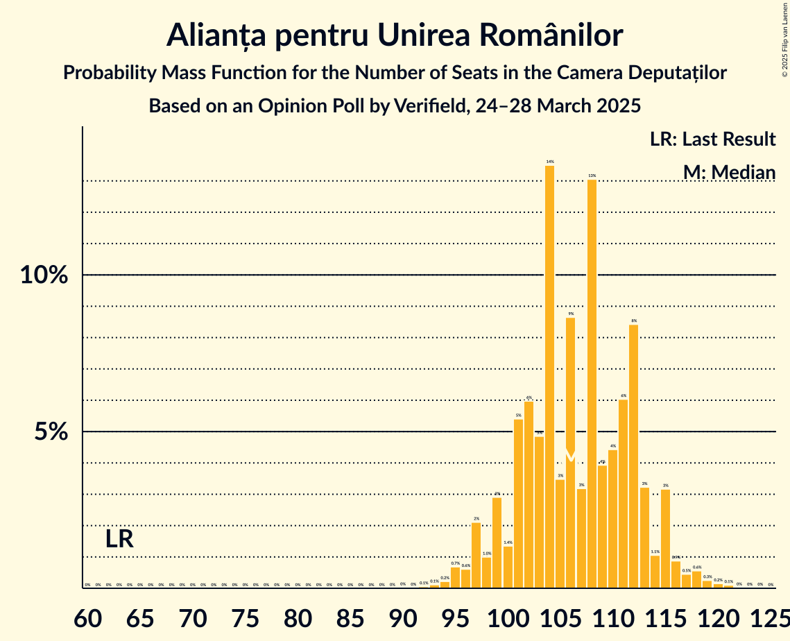
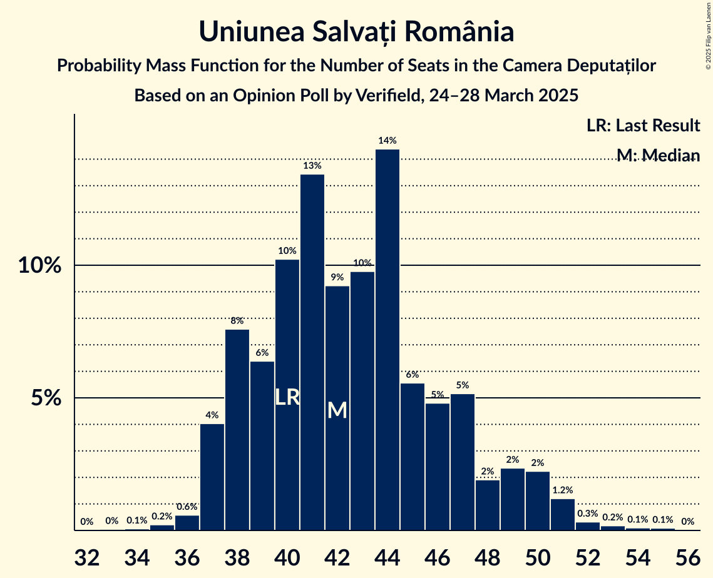
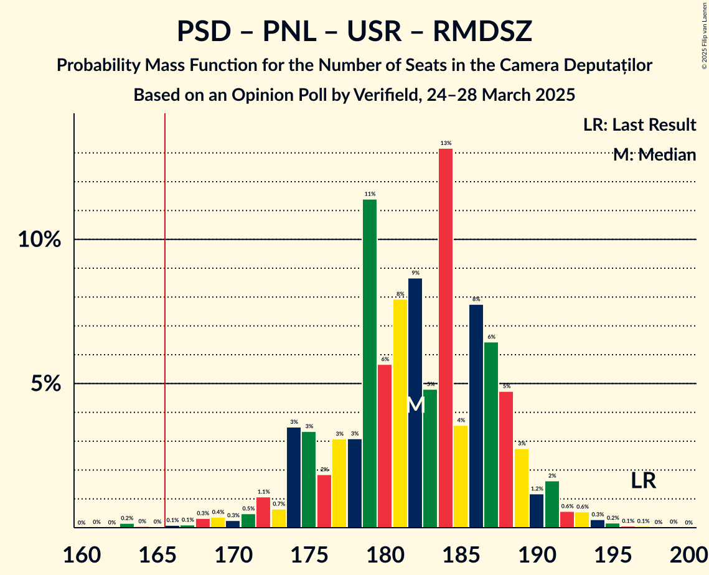
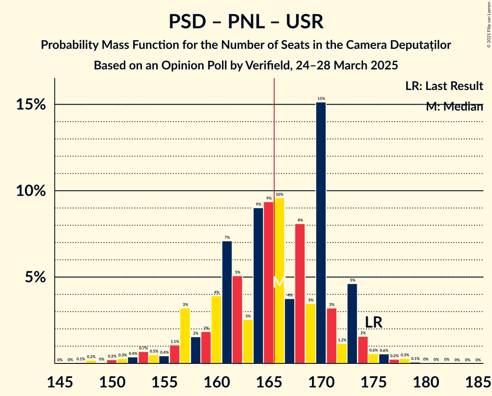

# Opinion Poll by Verifield, 24–28 March 2025

<a href="#voting-intentions">Voting Intentions</a> | <a href="#seats">Seats</a> | <a href="#coalitions">Coalitions</a> | <a href="#technical-information">Technical Information</a>

## Voting Intentions

### Confidence Intervals

| Party | Last Result | Poll Result | 80% Confidence Interval | 90% Confidence Interval | 95% Confidence Interval | 99% Confidence Interval |
|:-----:|:-----------:|:-----------:|:-----------------------:|:-----------------------:|:-----------------------:|:-----------------------:|
| Alianța pentru Unirea Românilor | 18.0% | 31.7% | 30.0–33.6% |29.5–34.1% |29.0–34.6% |28.2–35.4% |
| Partidul Social Democrat | 22.0% | 21.2% | 19.7–22.8% |19.2–23.3% |18.9–23.7% |18.2–24.5% |
| Partidul Național Liberal | 13.2% | 15.0% | 13.7–16.5% |13.3–16.9% |13.0–17.2% |12.4–18.0% |
| Uniunea Salvați România | 12.4% | 12.9% | 11.7–14.3% |11.3–14.7% |11.1–15.0% |10.5–15.7% |
| Partidul Oamenilor Tineri | 6.5% | 7.0% | 6.1–8.1% |5.9–8.4% |5.6–8.7% |5.2–9.2% |
| Romániai Magyar Demokrata Szövetség | 6.3% | 5.1% | 4.3–6.1% |4.1–6.3% |3.9–6.6% |3.6–7.0% |
| Partidul S.O.S. România | 7.4% | 3.6% | 3.0–4.5% |2.8–4.7% |2.7–4.9% |2.4–5.3% |
| Reînnoim Proiectul European al României | 1.2% | 1.2% | 0.9–1.7% |0.8–1.9% |0.7–2.0% |0.6–2.3% |
| Sănătate, Educație, Natură, Sustenabilitate | 3.0% | 0.8% | 0.6–1.3% |0.5–1.4% |0.4–1.6% |0.3–1.8% |
| Dreptate și Respect în Europa Pentru Toți | 1.2% | 0.6% | 0.4–1.1% |0.4–1.2% |0.3–1.3% |0.2–1.6% |

*Note:* The poll result column reflects the actual value used in the calculations. Published results may vary slightly, and in addition be rounded to fewer digits.

## Seats

### Confidence Intervals

| Party | Last Result | Median | 80% Confidence Interval | 90% Confidence Interval | 95% Confidence Interval | 99% Confidence Interval |
|:-----:|:-----------:|:------:|:-----------------------:|:-----------------------:|:-----------------------:|:-----------------------:|
| <a href="#alianța-pentru-unirea-românilor">Alianța pentru Unirea Românilor</a> | 63 | 106 | 101–112 |99–115 |97–115 |95–119 |
| <a href="#partidul-social-democrat">Partidul Social Democrat</a> | 86 | 73 | 67–77 |66–78 |64–79 |61–82 |
| <a href="#partidul-național-liberal">Partidul Național Liberal</a> | 49 | 51 | 46–55 |45–57 |44–59 |42–62 |
| <a href="#uniunea-salvați-românia">Uniunea Salvați România</a> | 40 | 42 | 38–47 |38–49 |37–50 |36–52 |
| <a href="#partidul-oamenilor-tineri">Partidul Oamenilor Tineri</a> | 24 | 23 | 20–26 |19–28 |19–28 |18–30 |
| <a href="#romániai-magyar-demokrata-szövetség">Romániai Magyar Demokrata Szövetség</a> | 22 | 16 | 14–20 |13–20 |13–21 |11–23 |
| <a href="#partidul-s.o.s.-românia">Partidul S.O.S. România</a> | 28 | 0 | 0 |0 |0 |0–17 |
| <a href="#reînnoim-proiectul-european-al-româniei">Reînnoim Proiectul European al României</a> | 0 | 0 | 0 |0 |0 |0 |
| <a href="#sănătate,-educație,-natură,-sustenabilitate">Sănătate, Educație, Natură, Sustenabilitate</a> | 0 | 0 | 0 |0 |0 |0 |
| <a href="#dreptate-și-respect-în-europa-pentru-toți">Dreptate și Respect în Europa Pentru Toți</a> | 0 | 0 | 0 |0 |0 |0 |

### Alianța pentru Unirea Românilor

*For a full overview of the results for this party, see the [Alianța pentru Unirea Românilor](party-alianțapentruunirearomânilor.html) page.*

| Number of Seats | Probability | Accumulated | Special Marks |
|:---------------:|:-----------:|:-----------:|:-------------:|
| 63 | 0% | 100% | Last Result |
| 64 | 0% | 100% |  |
| 65 | 0% | 100% |  |
| 66 | 0% | 100% |  |
| 67 | 0% | 100% |  |
| 68 | 0% | 100% |  |
| 69 | 0% | 100% |  |
| 70 | 0% | 100% |  |
| 71 | 0% | 100% |  |
| 72 | 0% | 100% |  |
| 73 | 0% | 100% |  |
| 74 | 0% | 100% |  |
| 75 | 0% | 100% |  |
| 76 | 0% | 100% |  |
| 77 | 0% | 100% |  |
| 78 | 0% | 100% |  |
| 79 | 0% | 100% |  |
| 80 | 0% | 100% |  |
| 81 | 0% | 100% |  |
| 82 | 0% | 100% |  |
| 83 | 0% | 100% |  |
| 84 | 0% | 100% |  |
| 85 | 0% | 100% |  |
| 86 | 0% | 100% |  |
| 87 | 0% | 100% |  |
| 88 | 0% | 100% |  |
| 89 | 0% | 100% |  |
| 90 | 0% | 100% |  |
| 91 | 0% | 100% |  |
| 92 | 0.1% | 99.9% |  |
| 93 | 0.1% | 99.9% |  |
| 94 | 0.2% | 99.8% |  |
| 95 | 0.7% | 99.6% |  |
| 96 | 0.6% | 98.9% |  |
| 97 | 2% | 98% |  |
| 98 | 1.0% | 96% |  |
| 99 | 3% | 95% |  |
| 100 | 1.4% | 92% |  |
| 101 | 5% | 91% |  |
| 102 | 6% | 85% |  |
| 103 | 5% | 79% |  |
| 104 | 14% | 75% |  |
| 105 | 3% | 61% |  |
| 106 | 9% | 58% | Median |
| 107 | 3% | 49% |  |
| 108 | 13% | 46% |  |
| 109 | 4% | 33% |  |
| 110 | 4% | 29% |  |
| 111 | 6% | 24% |  |
| 112 | 8% | 18% |  |
| 113 | 3% | 10% |  |
| 114 | 1.1% | 7% |  |
| 115 | 3% | 6% |  |
| 116 | 0.9% | 2% |  |
| 117 | 0.5% | 2% |  |
| 118 | 0.6% | 1.1% |  |
| 119 | 0.3% | 0.6% |  |
| 120 | 0.2% | 0.3% |  |
| 121 | 0.1% | 0.2% |  |
| 122 | 0% | 0.1% |  |
| 123 | 0% | 0% |  |

### Partidul Social Democrat

*For a full overview of the results for this party, see the [Partidul Social Democrat](party-partidulsocialdemocrat.html) page.*

| Number of Seats | Probability | Accumulated | Special Marks |
|:---------------:|:-----------:|:-----------:|:-------------:|
| 58 | 0% | 100% |  |
| 59 | 0.1% | 99.9% |  |
| 60 | 0.3% | 99.9% |  |
| 61 | 0.3% | 99.6% |  |
| 62 | 0.4% | 99.3% |  |
| 63 | 0.6% | 98.9% |  |
| 64 | 2% | 98% |  |
| 65 | 1.3% | 97% |  |
| 66 | 2% | 95% |  |
| 67 | 4% | 93% |  |
| 68 | 5% | 90% |  |
| 69 | 8% | 84% |  |
| 70 | 6% | 77% |  |
| 71 | 6% | 70% |  |
| 72 | 14% | 64% |  |
| 73 | 6% | 50% | Median |
| 74 | 12% | 44% |  |
| 75 | 14% | 32% |  |
| 76 | 7% | 18% |  |
| 77 | 3% | 11% |  |
| 78 | 4% | 8% |  |
| 79 | 3% | 5% |  |
| 80 | 0.8% | 2% |  |
| 81 | 0.5% | 1.1% |  |
| 82 | 0.3% | 0.6% |  |
| 83 | 0.2% | 0.3% |  |
| 84 | 0.1% | 0.2% |  |
| 85 | 0% | 0.1% |  |
| 86 | 0% | 0.1% | Last Result |
| 87 | 0% | 0% |  |

### Partidul Național Liberal

*For a full overview of the results for this party, see the [Partidul Național Liberal](party-partidulnaționalliberal.html) page.*

| Number of Seats | Probability | Accumulated | Special Marks |
|:---------------:|:-----------:|:-----------:|:-------------:|
| 39 | 0.1% | 100% |  |
| 40 | 0.1% | 99.9% |  |
| 41 | 0.2% | 99.8% |  |
| 42 | 0.7% | 99.6% |  |
| 43 | 0.9% | 99.0% |  |
| 44 | 3% | 98% |  |
| 45 | 3% | 95% |  |
| 46 | 4% | 92% |  |
| 47 | 8% | 88% |  |
| 48 | 6% | 80% |  |
| 49 | 13% | 74% | Last Result |
| 50 | 8% | 61% |  |
| 51 | 17% | 54% | Median |
| 52 | 9% | 37% |  |
| 53 | 8% | 28% |  |
| 54 | 7% | 20% |  |
| 55 | 3% | 13% |  |
| 56 | 4% | 10% |  |
| 57 | 2% | 6% |  |
| 58 | 0.7% | 4% |  |
| 59 | 2% | 4% |  |
| 60 | 0.2% | 1.1% |  |
| 61 | 0.4% | 1.0% |  |
| 62 | 0.5% | 0.6% |  |
| 63 | 0% | 0.1% |  |
| 64 | 0% | 0.1% |  |
| 65 | 0% | 0% |  |

### Uniunea Salvați România

*For a full overview of the results for this party, see the [Uniunea Salvați România](party-uniuneasalvațiromânia.html) page.*

| Number of Seats | Probability | Accumulated | Special Marks |
|:---------------:|:-----------:|:-----------:|:-------------:|
| 33 | 0% | 100% |  |
| 34 | 0.1% | 99.9% |  |
| 35 | 0.2% | 99.9% |  |
| 36 | 0.6% | 99.6% |  |
| 37 | 4% | 99.1% |  |
| 38 | 8% | 95% |  |
| 39 | 6% | 87% |  |
| 40 | 10% | 81% | Last Result |
| 41 | 13% | 71% |  |
| 42 | 9% | 57% | Median |
| 43 | 10% | 48% |  |
| 44 | 14% | 38% |  |
| 45 | 6% | 24% |  |
| 46 | 5% | 18% |  |
| 47 | 5% | 14% |  |
| 48 | 2% | 8% |  |
| 49 | 2% | 7% |  |
| 50 | 2% | 4% |  |
| 51 | 1.2% | 2% |  |
| 52 | 0.3% | 0.7% |  |
| 53 | 0.2% | 0.4% |  |
| 54 | 0.1% | 0.2% |  |
| 55 | 0.1% | 0.1% |  |
| 56 | 0% | 0% |  |

### Partidul Oamenilor Tineri

*For a full overview of the results for this party, see the [Partidul Oamenilor Tineri](party-partiduloamenilortineri.html) page.*

| Number of Seats | Probability | Accumulated | Special Marks |
|:---------------:|:-----------:|:-----------:|:-------------:|
| 0 | 0.2% | 100% |  |
| 1 | 0% | 99.8% |  |
| 2 | 0% | 99.8% |  |
| 3 | 0% | 99.8% |  |
| 4 | 0% | 99.8% |  |
| 5 | 0% | 99.8% |  |
| 6 | 0% | 99.8% |  |
| 7 | 0% | 99.8% |  |
| 8 | 0% | 99.8% |  |
| 9 | 0% | 99.8% |  |
| 10 | 0% | 99.8% |  |
| 11 | 0% | 99.8% |  |
| 12 | 0% | 99.8% |  |
| 13 | 0% | 99.8% |  |
| 14 | 0% | 99.8% |  |
| 15 | 0% | 99.8% |  |
| 16 | 0% | 99.8% |  |
| 17 | 0.3% | 99.8% |  |
| 18 | 1.1% | 99.6% |  |
| 19 | 4% | 98% |  |
| 20 | 6% | 95% |  |
| 21 | 12% | 89% |  |
| 22 | 21% | 76% |  |
| 23 | 14% | 56% | Median |
| 24 | 22% | 42% | Last Result |
| 25 | 5% | 20% |  |
| 26 | 6% | 15% |  |
| 27 | 3% | 9% |  |
| 28 | 3% | 6% |  |
| 29 | 0.9% | 2% |  |
| 30 | 1.1% | 2% |  |
| 31 | 0.3% | 0.5% |  |
| 32 | 0.1% | 0.2% |  |
| 33 | 0% | 0.1% |  |
| 34 | 0% | 0% |  |

### Romániai Magyar Demokrata Szövetség

*For a full overview of the results for this party, see the [Romániai Magyar Demokrata Szövetség](party-romániaimagyardemokrataszövetség.html) page.*

| Number of Seats | Probability | Accumulated | Special Marks |
|:---------------:|:-----------:|:-----------:|:-------------:|
| 10 | 0.1% | 100% |  |
| 11 | 0.4% | 99.9% |  |
| 12 | 2% | 99.5% |  |
| 13 | 5% | 98% |  |
| 14 | 13% | 93% |  |
| 15 | 19% | 80% |  |
| 16 | 13% | 61% | Median |
| 17 | 15% | 49% |  |
| 18 | 15% | 34% |  |
| 19 | 9% | 19% |  |
| 20 | 6% | 10% |  |
| 21 | 2% | 4% |  |
| 22 | 1.2% | 2% | Last Result |
| 23 | 0.6% | 0.8% |  |
| 24 | 0.2% | 0.2% |  |
| 25 | 0.1% | 0.1% |  |
| 26 | 0% | 0% |  |

### Partidul S.O.S. România

*For a full overview of the results for this party, see the [Partidul S.O.S. România](party-partidulsosromânia.html) page.*

| Number of Seats | Probability | Accumulated | Special Marks |
|:---------------:|:-----------:|:-----------:|:-------------:|
| 0 | 98.5% | 100% | Median |
| 1 | 0% | 1.5% |  |
| 2 | 0% | 1.5% |  |
| 3 | 0% | 1.5% |  |
| 4 | 0% | 1.5% |  |
| 5 | 0% | 1.5% |  |
| 6 | 0% | 1.5% |  |
| 7 | 0% | 1.5% |  |
| 8 | 0% | 1.5% |  |
| 9 | 0% | 1.5% |  |
| 10 | 0% | 1.5% |  |
| 11 | 0% | 1.5% |  |
| 12 | 0% | 1.5% |  |
| 13 | 0% | 1.5% |  |
| 14 | 0% | 1.5% |  |
| 15 | 0% | 1.5% |  |
| 16 | 0.8% | 1.5% |  |
| 17 | 0.5% | 0.7% |  |
| 18 | 0.1% | 0.2% |  |
| 19 | 0.1% | 0.1% |  |
| 20 | 0% | 0% |  |
| 21 | 0% | 0% |  |
| 22 | 0% | 0% |  |
| 23 | 0% | 0% |  |
| 24 | 0% | 0% |  |
| 25 | 0% | 0% |  |
| 26 | 0% | 0% |  |
| 27 | 0% | 0% |  |
| 28 | 0% | 0% | Last Result |

### Reînnoim Proiectul European al României

*For a full overview of the results for this party, see the [Reînnoim Proiectul European al României](party-reînnoimproiectuleuropeanalromâniei.html) page.*

| Number of Seats | Probability | Accumulated | Special Marks |
|:---------------:|:-----------:|:-----------:|:-------------:|
| 0 | 100% | 100% | Last Result, Median |

### Sănătate, Educație, Natură, Sustenabilitate

*For a full overview of the results for this party, see the [Sănătate, Educație, Natură, Sustenabilitate](party-sănătateeducațienaturăsustenabilitate.html) page.*

| Number of Seats | Probability | Accumulated | Special Marks |
|:---------------:|:-----------:|:-----------:|:-------------:|
| 0 | 100% | 100% | Last Result, Median |

### Dreptate și Respect în Europa Pentru Toți

*For a full overview of the results for this party, see the [Dreptate și Respect în Europa Pentru Toți](party-dreptateșirespectîneuropapentrutoți.html) page.*

| Number of Seats | Probability | Accumulated | Special Marks |
|:---------------:|:-----------:|:-----------:|:-------------:|
| 0 | 100% | 100% | Last Result, Median |

## Coalitions

### Confidence Intervals

| Coalition | Last Result | Median | Majority? | 80% Confidence Interval | 90% Confidence Interval | 95% Confidence Interval | 99% Confidence Interval |
|:---------:|:-----------:|:------:|:---------:|:-----------------------:|:-----------------------:|:-----------------------:|:-----------------------:|
| Partidul Social Democrat – Partidul Național Liberal – Uniunea Salvați România – Romániai Magyar Demokrata Szövetség | 197 | 182 | 99.7% | 175–188 | 174–189 | 172–191 | 168–194 |
| Partidul Social Democrat – Partidul Național Liberal – Uniunea Salvați România | 175 | 166 | 52% | 159–171 | 157–173 | 155–174 | 150–178 |
| Partidul Social Democrat – Partidul Național Liberal – Romániai Magyar Demokrata Szövetség | 157 | 140 | 0% | 133–146 | 131–147 | 129–149 | 126–152 |
| Partidul Social Democrat – Partidul Național Liberal | 135 | 124 | 0% | 116–129 | 115–130 | 112–131 | 109–133 |
| Partidul Social Democrat – Uniunea Salvați România | 126 | 116 | 0% | 110–120 | 106–122 | 106–124 | 101–126 |
| Partidul Național Liberal – Uniunea Salvați România – Romániai Magyar Demokrata Szövetség | 111 | 110 | 0% | 104–115 | 102–117 | 101–119 | 98–122 |
| Alianța pentru Unirea Românilor | 63 | 106 | 0% | 101–112 | 99–115 | 97–115 | 95–119 |
| Partidul Național Liberal – Uniunea Salvați România | 89 | 93 | 0% | 87–99 | 86–100 | 85–102 | 82–105 |
| Partidul Social Democrat | 86 | 73 | 0% | 67–77 | 66–78 | 64–79 | 61–82 |
| Partidul Național Liberal – Romániai Magyar Demokrata Szövetség | 71 | 67 | 0% | 62–73 | 61–75 | 59–75 | 58–78 |
| Partidul Național Liberal | 49 | 51 | 0% | 46–55 | 45–57 | 44–59 | 42–62 |

### Partidul Social Democrat – Partidul Național Liberal – Uniunea Salvați România – Romániai Magyar Demokrata Szövetség

| Number of Seats | Probability | Accumulated | Special Marks |
|:---------------:|:-----------:|:-----------:|:-------------:|
| 163 | 0.2% | 100% |  |
| 164 | 0% | 99.8% |  |
| 165 | 0% | 99.7% |  |
| 166 | 0.1% | 99.7% | Majority |
| 167 | 0.1% | 99.6% |  |
| 168 | 0.3% | 99.5% |  |
| 169 | 0.4% | 99.2% |  |
| 170 | 0.3% | 98.8% |  |
| 171 | 0.5% | 98.6% |  |
| 172 | 1.1% | 98% |  |
| 173 | 0.7% | 97% |  |
| 174 | 3% | 96% |  |
| 175 | 3% | 93% |  |
| 176 | 2% | 90% |  |
| 177 | 3% | 88% |  |
| 178 | 3% | 85% |  |
| 179 | 11% | 81% |  |
| 180 | 6% | 70% |  |
| 181 | 8% | 64% |  |
| 182 | 9% | 56% | Median |
| 183 | 5% | 48% |  |
| 184 | 13% | 43% |  |
| 185 | 4% | 30% |  |
| 186 | 8% | 26% |  |
| 187 | 6% | 19% |  |
| 188 | 5% | 12% |  |
| 189 | 3% | 7% |  |
| 190 | 1.2% | 5% |  |
| 191 | 2% | 3% |  |
| 192 | 0.6% | 2% |  |
| 193 | 0.6% | 1.2% |  |
| 194 | 0.3% | 0.7% |  |
| 195 | 0.2% | 0.4% |  |
| 196 | 0.1% | 0.2% |  |
| 197 | 0.1% | 0.2% | Last Result |
| 198 | 0% | 0.1% |  |
| 199 | 0% | 0.1% |  |
| 200 | 0% | 0% |  |

### Partidul Social Democrat – Partidul Național Liberal – Uniunea Salvați România

| Number of Seats | Probability | Accumulated | Special Marks |
|:---------------:|:-----------:|:-----------:|:-------------:|
| 147 | 0.1% | 100% |  |
| 148 | 0.2% | 99.9% |  |
| 149 | 0% | 99.7% |  |
| 150 | 0.2% | 99.7% |  |
| 151 | 0.3% | 99.4% |  |
| 152 | 0.4% | 99.2% |  |
| 153 | 0.7% | 98.8% |  |
| 154 | 0.5% | 98% |  |
| 155 | 0.4% | 98% |  |
| 156 | 1.1% | 97% |  |
| 157 | 3% | 96% |  |
| 158 | 2% | 93% |  |
| 159 | 2% | 91% |  |
| 160 | 4% | 89% |  |
| 161 | 7% | 86% |  |
| 162 | 5% | 78% |  |
| 163 | 3% | 73% |  |
| 164 | 9% | 71% |  |
| 165 | 9% | 62% |  |
| 166 | 10% | 52% | Median, Majority |
| 167 | 4% | 43% |  |
| 168 | 8% | 39% |  |
| 169 | 3% | 31% |  |
| 170 | 15% | 28% |  |
| 171 | 3% | 12% |  |
| 172 | 1.2% | 9% |  |
| 173 | 5% | 8% |  |
| 174 | 2% | 3% |  |
| 175 | 0.6% | 2% | Last Result |
| 176 | 0.6% | 1.3% |  |
| 177 | 0.2% | 0.7% |  |
| 178 | 0.3% | 0.5% |  |
| 179 | 0.1% | 0.2% |  |
| 180 | 0% | 0.1% |  |
| 181 | 0% | 0.1% |  |
| 182 | 0% | 0.1% |  |
| 183 | 0% | 0% |  |

### Partidul Social Democrat – Partidul Național Liberal – Romániai Magyar Demokrata Szövetség

| Number of Seats | Probability | Accumulated | Special Marks |
|:---------------:|:-----------:|:-----------:|:-------------:|
| 122 | 0.2% | 100% |  |
| 123 | 0% | 99.8% |  |
| 124 | 0.1% | 99.7% |  |
| 125 | 0.1% | 99.7% |  |
| 126 | 0.5% | 99.6% |  |
| 127 | 0.2% | 99.0% |  |
| 128 | 0.9% | 98.8% |  |
| 129 | 1.0% | 98% |  |
| 130 | 0.6% | 97% |  |
| 131 | 2% | 96% |  |
| 132 | 1.5% | 94% |  |
| 133 | 4% | 92% |  |
| 134 | 5% | 88% |  |
| 135 | 2% | 83% |  |
| 136 | 10% | 81% |  |
| 137 | 4% | 71% |  |
| 138 | 7% | 67% |  |
| 139 | 6% | 60% |  |
| 140 | 12% | 54% | Median |
| 141 | 6% | 43% |  |
| 142 | 11% | 37% |  |
| 143 | 5% | 26% |  |
| 144 | 4% | 22% |  |
| 145 | 3% | 18% |  |
| 146 | 8% | 15% |  |
| 147 | 3% | 7% |  |
| 148 | 1.0% | 4% |  |
| 149 | 1.2% | 3% |  |
| 150 | 0.8% | 1.5% |  |
| 151 | 0.1% | 0.6% |  |
| 152 | 0.3% | 0.5% |  |
| 153 | 0.1% | 0.3% |  |
| 154 | 0.1% | 0.1% |  |
| 155 | 0% | 0.1% |  |
| 156 | 0% | 0% |  |
| 157 | 0% | 0% | Last Result |

### Partidul Social Democrat – Partidul Național Liberal

| Number of Seats | Probability | Accumulated | Special Marks |
|:---------------:|:-----------:|:-----------:|:-------------:|
| 105 | 0% | 100% |  |
| 106 | 0% | 99.9% |  |
| 107 | 0.2% | 99.9% |  |
| 108 | 0.2% | 99.7% |  |
| 109 | 0.2% | 99.5% |  |
| 110 | 0.4% | 99.3% |  |
| 111 | 0.5% | 98.9% |  |
| 112 | 0.9% | 98% |  |
| 113 | 1.1% | 97% |  |
| 114 | 0.9% | 96% |  |
| 115 | 1.5% | 95% |  |
| 116 | 4% | 94% |  |
| 117 | 3% | 90% |  |
| 118 | 8% | 87% |  |
| 119 | 6% | 79% |  |
| 120 | 7% | 72% |  |
| 121 | 3% | 66% |  |
| 122 | 5% | 63% |  |
| 123 | 4% | 58% |  |
| 124 | 5% | 54% | Median |
| 125 | 7% | 49% |  |
| 126 | 16% | 41% |  |
| 127 | 7% | 26% |  |
| 128 | 8% | 19% |  |
| 129 | 4% | 11% |  |
| 130 | 4% | 7% |  |
| 131 | 0.5% | 3% |  |
| 132 | 1.4% | 2% |  |
| 133 | 0.2% | 0.6% |  |
| 134 | 0.2% | 0.4% |  |
| 135 | 0.1% | 0.2% | Last Result |
| 136 | 0.1% | 0.1% |  |
| 137 | 0% | 0.1% |  |
| 138 | 0% | 0% |  |

### Partidul Social Democrat – Uniunea Salvați România

| Number of Seats | Probability | Accumulated | Special Marks |
|:---------------:|:-----------:|:-----------:|:-------------:|
| 98 | 0% | 100% |  |
| 99 | 0.1% | 99.9% |  |
| 100 | 0.2% | 99.9% |  |
| 101 | 0.3% | 99.7% |  |
| 102 | 0.1% | 99.4% |  |
| 103 | 0.5% | 99.3% |  |
| 104 | 0.4% | 98.8% |  |
| 105 | 0.9% | 98% |  |
| 106 | 3% | 98% |  |
| 107 | 0.9% | 95% |  |
| 108 | 2% | 94% |  |
| 109 | 2% | 92% |  |
| 110 | 3% | 90% |  |
| 111 | 9% | 88% |  |
| 112 | 19% | 79% |  |
| 113 | 4% | 60% |  |
| 114 | 3% | 56% |  |
| 115 | 2% | 53% | Median |
| 116 | 6% | 51% |  |
| 117 | 12% | 45% |  |
| 118 | 5% | 33% |  |
| 119 | 17% | 28% |  |
| 120 | 2% | 11% |  |
| 121 | 2% | 9% |  |
| 122 | 2% | 7% |  |
| 123 | 1.1% | 5% |  |
| 124 | 3% | 4% |  |
| 125 | 0.3% | 0.9% |  |
| 126 | 0.2% | 0.7% | Last Result |
| 127 | 0.2% | 0.5% |  |
| 128 | 0.1% | 0.2% |  |
| 129 | 0% | 0.2% |  |
| 130 | 0% | 0.1% |  |
| 131 | 0.1% | 0.1% |  |
| 132 | 0% | 0% |  |

### Partidul Național Liberal – Uniunea Salvați România – Romániai Magyar Demokrata Szövetség

| Number of Seats | Probability | Accumulated | Special Marks |
|:---------------:|:-----------:|:-----------:|:-------------:|
| 95 | 0.1% | 100% |  |
| 96 | 0.1% | 99.9% |  |
| 97 | 0.2% | 99.8% |  |
| 98 | 0.1% | 99.5% |  |
| 99 | 0.7% | 99.4% |  |
| 100 | 0.6% | 98.7% |  |
| 101 | 3% | 98% |  |
| 102 | 1.2% | 95% |  |
| 103 | 2% | 94% |  |
| 104 | 5% | 93% |  |
| 105 | 7% | 87% |  |
| 106 | 4% | 80% |  |
| 107 | 5% | 77% |  |
| 108 | 3% | 72% |  |
| 109 | 14% | 69% | Median |
| 110 | 16% | 55% |  |
| 111 | 8% | 38% | Last Result |
| 112 | 5% | 30% |  |
| 113 | 5% | 25% |  |
| 114 | 6% | 20% |  |
| 115 | 5% | 14% |  |
| 116 | 4% | 10% |  |
| 117 | 1.4% | 6% |  |
| 118 | 2% | 4% |  |
| 119 | 1.1% | 3% |  |
| 120 | 0.5% | 2% |  |
| 121 | 0.4% | 1.1% |  |
| 122 | 0.2% | 0.7% |  |
| 123 | 0.2% | 0.5% |  |
| 124 | 0.1% | 0.3% |  |
| 125 | 0.1% | 0.2% |  |
| 126 | 0.1% | 0.1% |  |
| 127 | 0% | 0.1% |  |
| 128 | 0% | 0% |  |

### Alianța pentru Unirea Românilor

| Number of Seats | Probability | Accumulated | Special Marks |
|:---------------:|:-----------:|:-----------:|:-------------:|
| 63 | 0% | 100% | Last Result |
| 64 | 0% | 100% |  |
| 65 | 0% | 100% |  |
| 66 | 0% | 100% |  |
| 67 | 0% | 100% |  |
| 68 | 0% | 100% |  |
| 69 | 0% | 100% |  |
| 70 | 0% | 100% |  |
| 71 | 0% | 100% |  |
| 72 | 0% | 100% |  |
| 73 | 0% | 100% |  |
| 74 | 0% | 100% |  |
| 75 | 0% | 100% |  |
| 76 | 0% | 100% |  |
| 77 | 0% | 100% |  |
| 78 | 0% | 100% |  |
| 79 | 0% | 100% |  |
| 80 | 0% | 100% |  |
| 81 | 0% | 100% |  |
| 82 | 0% | 100% |  |
| 83 | 0% | 100% |  |
| 84 | 0% | 100% |  |
| 85 | 0% | 100% |  |
| 86 | 0% | 100% |  |
| 87 | 0% | 100% |  |
| 88 | 0% | 100% |  |
| 89 | 0% | 100% |  |
| 90 | 0% | 100% |  |
| 91 | 0% | 100% |  |
| 92 | 0.1% | 99.9% |  |
| 93 | 0.1% | 99.9% |  |
| 94 | 0.2% | 99.8% |  |
| 95 | 0.7% | 99.6% |  |
| 96 | 0.6% | 98.9% |  |
| 97 | 2% | 98% |  |
| 98 | 1.0% | 96% |  |
| 99 | 3% | 95% |  |
| 100 | 1.4% | 92% |  |
| 101 | 5% | 91% |  |
| 102 | 6% | 85% |  |
| 103 | 5% | 79% |  |
| 104 | 14% | 75% |  |
| 105 | 3% | 61% |  |
| 106 | 9% | 58% | Median |
| 107 | 3% | 49% |  |
| 108 | 13% | 46% |  |
| 109 | 4% | 33% |  |
| 110 | 4% | 29% |  |
| 111 | 6% | 24% |  |
| 112 | 8% | 18% |  |
| 113 | 3% | 10% |  |
| 114 | 1.1% | 7% |  |
| 115 | 3% | 6% |  |
| 116 | 0.9% | 2% |  |
| 117 | 0.5% | 2% |  |
| 118 | 0.6% | 1.1% |  |
| 119 | 0.3% | 0.6% |  |
| 120 | 0.2% | 0.3% |  |
| 121 | 0.1% | 0.2% |  |
| 122 | 0% | 0.1% |  |
| 123 | 0% | 0% |  |

### Partidul Național Liberal – Uniunea Salvați România

| Number of Seats | Probability | Accumulated | Special Marks |
|:---------------:|:-----------:|:-----------:|:-------------:|
| 79 | 0.1% | 100% |  |
| 80 | 0.2% | 99.9% |  |
| 81 | 0.1% | 99.7% |  |
| 82 | 0.2% | 99.6% |  |
| 83 | 0.4% | 99.4% |  |
| 84 | 1.0% | 98.9% |  |
| 85 | 0.7% | 98% |  |
| 86 | 4% | 97% |  |
| 87 | 5% | 93% |  |
| 88 | 2% | 88% |  |
| 89 | 4% | 86% | Last Result |
| 90 | 7% | 82% |  |
| 91 | 5% | 75% |  |
| 92 | 13% | 69% |  |
| 93 | 8% | 56% | Median |
| 94 | 11% | 48% |  |
| 95 | 13% | 38% |  |
| 96 | 4% | 25% |  |
| 97 | 3% | 21% |  |
| 98 | 5% | 17% |  |
| 99 | 6% | 12% |  |
| 100 | 2% | 6% |  |
| 101 | 0.7% | 4% |  |
| 102 | 0.9% | 3% |  |
| 103 | 0.9% | 2% |  |
| 104 | 0.5% | 1.2% |  |
| 105 | 0.4% | 0.8% |  |
| 106 | 0.2% | 0.4% |  |
| 107 | 0.1% | 0.2% |  |
| 108 | 0.1% | 0.1% |  |
| 109 | 0% | 0.1% |  |
| 110 | 0% | 0% |  |

### Partidul Social Democrat

| Number of Seats | Probability | Accumulated | Special Marks |
|:---------------:|:-----------:|:-----------:|:-------------:|
| 58 | 0% | 100% |  |
| 59 | 0.1% | 99.9% |  |
| 60 | 0.3% | 99.9% |  |
| 61 | 0.3% | 99.6% |  |
| 62 | 0.4% | 99.3% |  |
| 63 | 0.6% | 98.9% |  |
| 64 | 2% | 98% |  |
| 65 | 1.3% | 97% |  |
| 66 | 2% | 95% |  |
| 67 | 4% | 93% |  |
| 68 | 5% | 90% |  |
| 69 | 8% | 84% |  |
| 70 | 6% | 77% |  |
| 71 | 6% | 70% |  |
| 72 | 14% | 64% |  |
| 73 | 6% | 50% | Median |
| 74 | 12% | 44% |  |
| 75 | 14% | 32% |  |
| 76 | 7% | 18% |  |
| 77 | 3% | 11% |  |
| 78 | 4% | 8% |  |
| 79 | 3% | 5% |  |
| 80 | 0.8% | 2% |  |
| 81 | 0.5% | 1.1% |  |
| 82 | 0.3% | 0.6% |  |
| 83 | 0.2% | 0.3% |  |
| 84 | 0.1% | 0.2% |  |
| 85 | 0% | 0.1% |  |
| 86 | 0% | 0.1% | Last Result |
| 87 | 0% | 0% |  |

### Partidul Național Liberal – Romániai Magyar Demokrata Szövetség

| Number of Seats | Probability | Accumulated | Special Marks |
|:---------------:|:-----------:|:-----------:|:-------------:|
| 54 | 0.1% | 100% |  |
| 55 | 0% | 99.9% |  |
| 56 | 0.2% | 99.9% |  |
| 57 | 0.1% | 99.7% |  |
| 58 | 0.9% | 99.6% |  |
| 59 | 1.4% | 98.6% |  |
| 60 | 2% | 97% |  |
| 61 | 2% | 95% |  |
| 62 | 8% | 94% |  |
| 63 | 5% | 86% |  |
| 64 | 7% | 81% |  |
| 65 | 11% | 74% |  |
| 66 | 5% | 62% |  |
| 67 | 16% | 57% | Median |
| 68 | 4% | 41% |  |
| 69 | 5% | 37% |  |
| 70 | 14% | 32% |  |
| 71 | 2% | 18% | Last Result |
| 72 | 5% | 15% |  |
| 73 | 2% | 10% |  |
| 74 | 3% | 9% |  |
| 75 | 3% | 5% |  |
| 76 | 0.9% | 2% |  |
| 77 | 0.3% | 1.2% |  |
| 78 | 0.6% | 0.8% |  |
| 79 | 0.1% | 0.3% |  |
| 80 | 0.1% | 0.2% |  |
| 81 | 0.1% | 0.1% |  |
| 82 | 0% | 0% |  |

### Partidul Național Liberal

| Number of Seats | Probability | Accumulated | Special Marks |
|:---------------:|:-----------:|:-----------:|:-------------:|
| 39 | 0.1% | 100% |  |
| 40 | 0.1% | 99.9% |  |
| 41 | 0.2% | 99.8% |  |
| 42 | 0.7% | 99.6% |  |
| 43 | 0.9% | 99.0% |  |
| 44 | 3% | 98% |  |
| 45 | 3% | 95% |  |
| 46 | 4% | 92% |  |
| 47 | 8% | 88% |  |
| 48 | 6% | 80% |  |
| 49 | 13% | 74% | Last Result |
| 50 | 8% | 61% |  |
| 51 | 17% | 54% | Median |
| 52 | 9% | 37% |  |
| 53 | 8% | 28% |  |
| 54 | 7% | 20% |  |
| 55 | 3% | 13% |  |
| 56 | 4% | 10% |  |
| 57 | 2% | 6% |  |
| 58 | 0.7% | 4% |  |
| 59 | 2% | 4% |  |
| 60 | 0.2% | 1.1% |  |
| 61 | 0.4% | 1.0% |  |
| 62 | 0.5% | 0.6% |  |
| 63 | 0% | 0.1% |  |
| 64 | 0% | 0.1% |  |
| 65 | 0% | 0% |  |

## Technical Information

### Opinion Poll

+ **Polling firm:** Verifield
+ **Commissioner(s):** —
+ **Fieldwork period:** 24–28 March 2025

### Calculations

+ **Sample size:** 1100
+ **Simulations done:** 2,097,152
+ **Error estimate:** 1.27%

