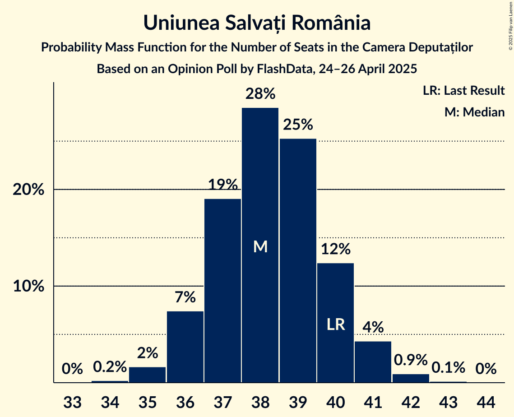
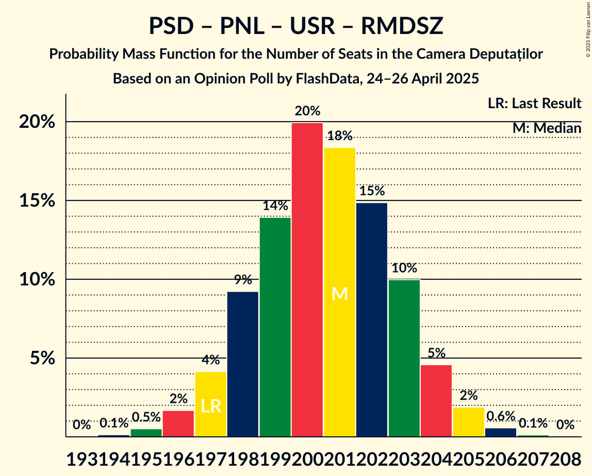
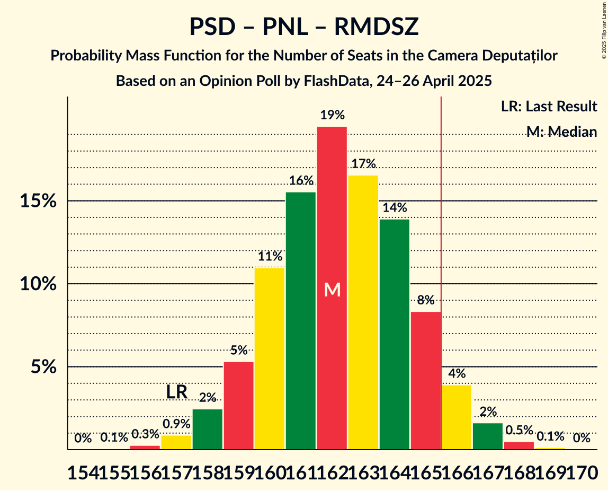
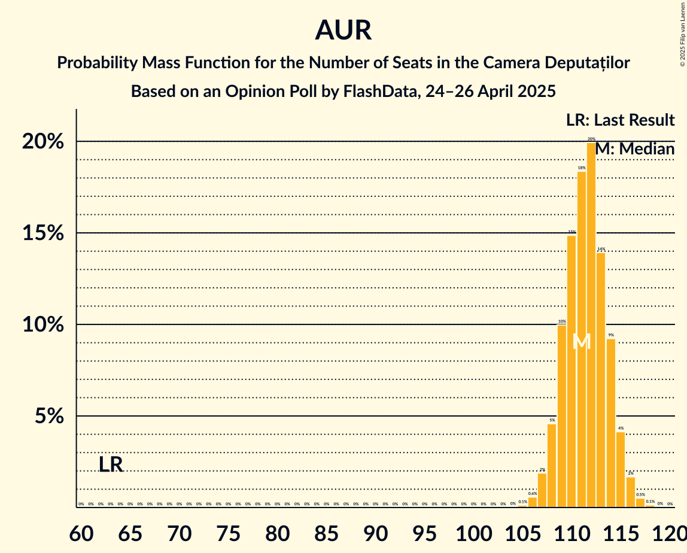
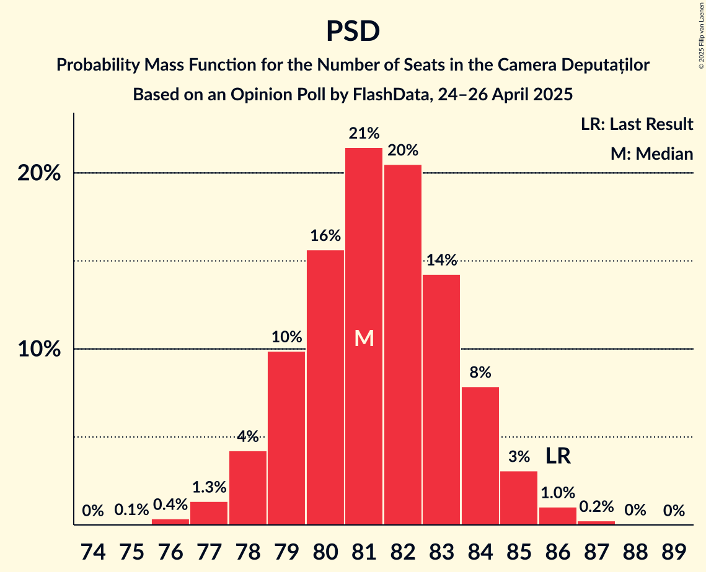
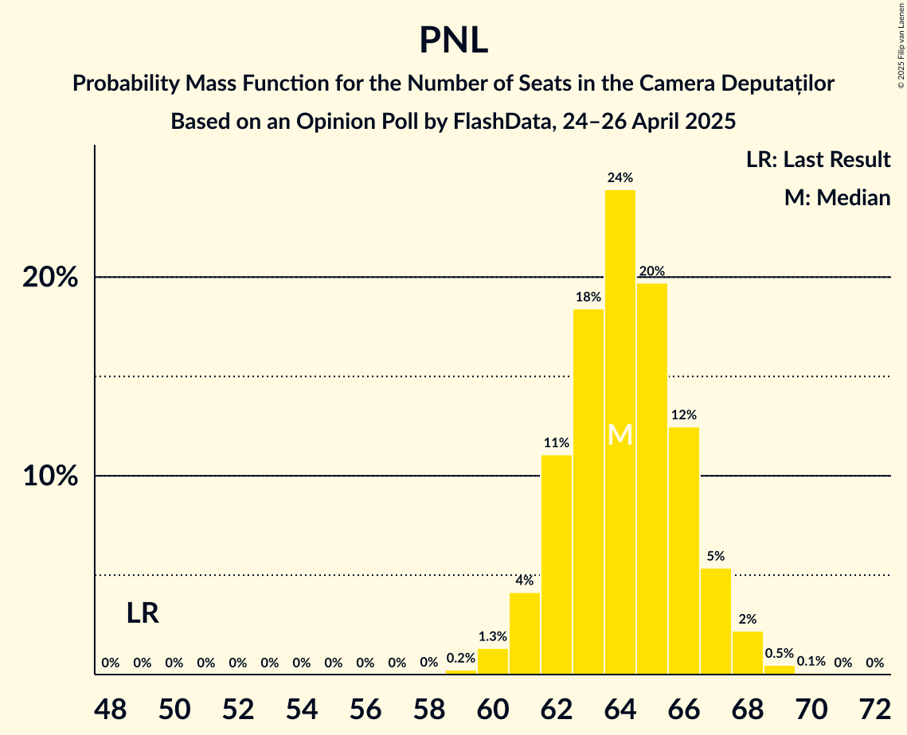

# Opinion Poll by FlashData, 24–26 April 2025

<a href="#voting-intentions">Voting Intentions</a> | <a href="#seats">Seats</a> | <a href="#coalitions">Coalitions</a> | <a href="#technical-information">Technical Information</a>

## Voting Intentions

### Confidence Intervals

| Party | Last Result | Poll Result | 80% Confidence Interval | 90% Confidence Interval | 95% Confidence Interval | 99% Confidence Interval |
|:-----:|:-----------:|:-----------:|:-----------------------:|:-----------------------:|:-----------------------:|:-----------------------:|
| Alianța pentru Unirea Românilor | 18.0% | 26.0% | 25.3–26.7% |25.2–26.9% |25.0–27.0% |24.7–27.3% |
| Partidul Social Democrat | 22.0% | 19.0% | 18.4–19.6% |18.3–19.8% |18.1–19.9% |17.8–20.2% |
| Partidul Național Liberal | 13.2% | 15.0% | 14.5–15.5% |14.3–15.7% |14.2–15.8% |14.0–16.1% |
| Uniunea Salvați România | 12.4% | 9.0% | 8.6–9.4% |8.5–9.6% |8.4–9.7% |8.2–9.9% |
| Romániai Magyar Demokrata Szövetség | 6.3% | 4.0% | 3.7–4.3% |3.6–4.4% |3.6–4.5% |3.4–4.6% |
| Partidul Oamenilor Tineri | 6.5% | 3.0% | 2.8–3.3% |2.7–3.4% |2.6–3.4% |2.5–3.6% |
| Partidul S.O.S. România | 7.4% | 2.0% | 1.8–2.2% |1.8–2.3% |1.7–2.3% |1.6–2.5% |

*Note:* The poll result column reflects the actual value used in the calculations. Published results may vary slightly, and in addition be rounded to fewer digits.

## Seats

### Confidence Intervals

| Party | Last Result | Median | 80% Confidence Interval | 90% Confidence Interval | 95% Confidence Interval | 99% Confidence Interval |
|:-----:|:-----------:|:------:|:-----------------------:|:-----------------------:|:-----------------------:|:-----------------------:|
| <a href="#alianța-pentru-unirea-românilor">Alianța pentru Unirea Românilor</a> | 63 | 111 | 109–114 |108–115 |107–115 |106–117 |
| <a href="#partidul-social-democrat">Partidul Social Democrat</a> | 86 | 81 | 79–84 |78–84 |78–85 |77–86 |
| <a href="#partidul-național-liberal">Partidul Național Liberal</a> | 49 | 64 | 62–66 |61–67 |61–68 |60–69 |
| <a href="#uniunea-salvați-românia">Uniunea Salvați România</a> | 40 | 38 | 37–40 |36–41 |36–41 |35–42 |
| <a href="#romániai-magyar-demokrata-szövetség">Romániai Magyar Demokrata Szövetség</a> | 22 | 17 | 16–18 |15–18 |15–19 |14–19 |
| <a href="#partidul-oamenilor-tineri">Partidul Oamenilor Tineri</a> | 24 | 0 | 0 |0 |0 |0 |
| <a href="#partidul-s.o.s.-românia">Partidul S.O.S. România</a> | 28 | 0 | 0 |0 |0 |0 |

### Alianța pentru Unirea Românilor

*For a full overview of the results for this party, see the [Alianța pentru Unirea Românilor](party-alianțapentruunirearomânilor.html) page.*

| Number of Seats | Probability | Accumulated | Special Marks |
|:---------------:|:-----------:|:-----------:|:-------------:|
| 63 | 0% | 100% | Last Result |
| 64 | 0% | 100% |  |
| 65 | 0% | 100% |  |
| 66 | 0% | 100% |  |
| 67 | 0% | 100% |  |
| 68 | 0% | 100% |  |
| 69 | 0% | 100% |  |
| 70 | 0% | 100% |  |
| 71 | 0% | 100% |  |
| 72 | 0% | 100% |  |
| 73 | 0% | 100% |  |
| 74 | 0% | 100% |  |
| 75 | 0% | 100% |  |
| 76 | 0% | 100% |  |
| 77 | 0% | 100% |  |
| 78 | 0% | 100% |  |
| 79 | 0% | 100% |  |
| 80 | 0% | 100% |  |
| 81 | 0% | 100% |  |
| 82 | 0% | 100% |  |
| 83 | 0% | 100% |  |
| 84 | 0% | 100% |  |
| 85 | 0% | 100% |  |
| 86 | 0% | 100% |  |
| 87 | 0% | 100% |  |
| 88 | 0% | 100% |  |
| 89 | 0% | 100% |  |
| 90 | 0% | 100% |  |
| 91 | 0% | 100% |  |
| 92 | 0% | 100% |  |
| 93 | 0% | 100% |  |
| 94 | 0% | 100% |  |
| 95 | 0% | 100% |  |
| 96 | 0% | 100% |  |
| 97 | 0% | 100% |  |
| 98 | 0% | 100% |  |
| 99 | 0% | 100% |  |
| 100 | 0% | 100% |  |
| 101 | 0% | 100% |  |
| 102 | 0% | 100% |  |
| 103 | 0% | 100% |  |
| 104 | 0% | 100% |  |
| 105 | 0.1% | 100% |  |
| 106 | 0.6% | 99.8% |  |
| 107 | 2% | 99.3% |  |
| 108 | 5% | 97% |  |
| 109 | 10% | 93% |  |
| 110 | 15% | 83% |  |
| 111 | 18% | 68% | Median |
| 112 | 20% | 50% |  |
| 113 | 14% | 30% |  |
| 114 | 9% | 16% |  |
| 115 | 4% | 7% |  |
| 116 | 2% | 2% |  |
| 117 | 0.5% | 0.7% |  |
| 118 | 0.1% | 0.2% |  |
| 119 | 0% | 0% |  |

### Partidul Social Democrat

*For a full overview of the results for this party, see the [Partidul Social Democrat](party-partidulsocialdemocrat.html) page.*

| Number of Seats | Probability | Accumulated | Special Marks |
|:---------------:|:-----------:|:-----------:|:-------------:|
| 75 | 0.1% | 100% |  |
| 76 | 0.4% | 99.9% |  |
| 77 | 1.3% | 99.6% |  |
| 78 | 4% | 98% |  |
| 79 | 10% | 94% |  |
| 80 | 16% | 84% |  |
| 81 | 21% | 68% | Median |
| 82 | 20% | 47% |  |
| 83 | 14% | 27% |  |
| 84 | 8% | 12% |  |
| 85 | 3% | 4% |  |
| 86 | 1.0% | 1.3% | Last Result |
| 87 | 0.2% | 0.3% |  |
| 88 | 0% | 0.1% |  |
| 89 | 0% | 0% |  |

### Partidul Național Liberal

*For a full overview of the results for this party, see the [Partidul Național Liberal](party-partidulnaționalliberal.html) page.*

| Number of Seats | Probability | Accumulated | Special Marks |
|:---------------:|:-----------:|:-----------:|:-------------:|
| 49 | 0% | 100% | Last Result |
| 50 | 0% | 100% |  |
| 51 | 0% | 100% |  |
| 52 | 0% | 100% |  |
| 53 | 0% | 100% |  |
| 54 | 0% | 100% |  |
| 55 | 0% | 100% |  |
| 56 | 0% | 100% |  |
| 57 | 0% | 100% |  |
| 58 | 0% | 100% |  |
| 59 | 0.2% | 100% |  |
| 60 | 1.3% | 99.7% |  |
| 61 | 4% | 98% |  |
| 62 | 11% | 94% |  |
| 63 | 18% | 83% |  |
| 64 | 24% | 65% | Median |
| 65 | 20% | 40% |  |
| 66 | 12% | 21% |  |
| 67 | 5% | 8% |  |
| 68 | 2% | 3% |  |
| 69 | 0.5% | 0.6% |  |
| 70 | 0.1% | 0.1% |  |
| 71 | 0% | 0% |  |

### Uniunea Salvați România

*For a full overview of the results for this party, see the [Uniunea Salvați România](party-uniuneasalvațiromânia.html) page.*

| Number of Seats | Probability | Accumulated | Special Marks |
|:---------------:|:-----------:|:-----------:|:-------------:|
| 34 | 0.2% | 100% |  |
| 35 | 2% | 99.8% |  |
| 36 | 7% | 98% |  |
| 37 | 19% | 91% |  |
| 38 | 28% | 72% | Median |
| 39 | 25% | 43% |  |
| 40 | 12% | 18% | Last Result |
| 41 | 4% | 5% |  |
| 42 | 0.9% | 1.1% |  |
| 43 | 0.1% | 0.2% |  |
| 44 | 0% | 0% |  |

### Romániai Magyar Demokrata Szövetség

*For a full overview of the results for this party, see the [Romániai Magyar Demokrata Szövetség](party-romániaimagyardemokrataszövetség.html) page.*

| Number of Seats | Probability | Accumulated | Special Marks |
|:---------------:|:-----------:|:-----------:|:-------------:|
| 14 | 0.8% | 100% |  |
| 15 | 7% | 99.2% |  |
| 16 | 29% | 92% |  |
| 17 | 43% | 63% | Median |
| 18 | 17% | 20% |  |
| 19 | 3% | 3% |  |
| 20 | 0.4% | 0.4% |  |
| 21 | 0% | 0% |  |
| 22 | 0% | 0% | Last Result |

### Partidul Oamenilor Tineri

*For a full overview of the results for this party, see the [Partidul Oamenilor Tineri](party-partiduloamenilortineri.html) page.*

| Number of Seats | Probability | Accumulated | Special Marks |
|:---------------:|:-----------:|:-----------:|:-------------:|
| 0 | 100% | 100% | Median |
| 1 | 0% | 0% |  |
| 2 | 0% | 0% |  |
| 3 | 0% | 0% |  |
| 4 | 0% | 0% |  |
| 5 | 0% | 0% |  |
| 6 | 0% | 0% |  |
| 7 | 0% | 0% |  |
| 8 | 0% | 0% |  |
| 9 | 0% | 0% |  |
| 10 | 0% | 0% |  |
| 11 | 0% | 0% |  |
| 12 | 0% | 0% |  |
| 13 | 0% | 0% |  |
| 14 | 0% | 0% |  |
| 15 | 0% | 0% |  |
| 16 | 0% | 0% |  |
| 17 | 0% | 0% |  |
| 18 | 0% | 0% |  |
| 19 | 0% | 0% |  |
| 20 | 0% | 0% |  |
| 21 | 0% | 0% |  |
| 22 | 0% | 0% |  |
| 23 | 0% | 0% |  |
| 24 | 0% | 0% | Last Result |

### Partidul S.O.S. România

*For a full overview of the results for this party, see the [Partidul S.O.S. România](party-partidulsosromânia.html) page.*

| Number of Seats | Probability | Accumulated | Special Marks |
|:---------------:|:-----------:|:-----------:|:-------------:|
| 0 | 100% | 100% | Median |
| 1 | 0% | 0% |  |
| 2 | 0% | 0% |  |
| 3 | 0% | 0% |  |
| 4 | 0% | 0% |  |
| 5 | 0% | 0% |  |
| 6 | 0% | 0% |  |
| 7 | 0% | 0% |  |
| 8 | 0% | 0% |  |
| 9 | 0% | 0% |  |
| 10 | 0% | 0% |  |
| 11 | 0% | 0% |  |
| 12 | 0% | 0% |  |
| 13 | 0% | 0% |  |
| 14 | 0% | 0% |  |
| 15 | 0% | 0% |  |
| 16 | 0% | 0% |  |
| 17 | 0% | 0% |  |
| 18 | 0% | 0% |  |
| 19 | 0% | 0% |  |
| 20 | 0% | 0% |  |
| 21 | 0% | 0% |  |
| 22 | 0% | 0% |  |
| 23 | 0% | 0% |  |
| 24 | 0% | 0% |  |
| 25 | 0% | 0% |  |
| 26 | 0% | 0% |  |
| 27 | 0% | 0% |  |
| 28 | 0% | 0% | Last Result |

## Coalitions

### Confidence Intervals

| Coalition | Last Result | Median | Majority? | 80% Confidence Interval | 90% Confidence Interval | 95% Confidence Interval | 99% Confidence Interval |
|:---------:|:-----------:|:------:|:---------:|:-----------------------:|:-----------------------:|:-----------------------:|:-----------------------:|
| Partidul Social Democrat – Partidul Național Liberal – Uniunea Salvați România – Romániai Magyar Demokrata Szövetség | 197 | 201 | 100% | 198–203 | 197–204 | 197–205 | 195–206 |
| Partidul Social Democrat – Partidul Național Liberal – Uniunea Salvați România | 175 | 184 | 100% | 181–186 | 180–187 | 180–188 | 178–189 |
| Partidul Social Democrat – Partidul Național Liberal – Romániai Magyar Demokrata Szövetség | 157 | 162 | 6% | 160–165 | 159–166 | 158–166 | 157–168 |
| Partidul Social Democrat – Partidul Național Liberal | 135 | 146 | 0% | 143–148 | 142–149 | 141–150 | 140–151 |
| Partidul Social Democrat – Uniunea Salvați România | 126 | 120 | 0% | 117–122 | 116–123 | 116–124 | 114–125 |
| Partidul Național Liberal – Uniunea Salvați România – Romániai Magyar Demokrata Szövetség | 111 | 119 | 0% | 117–122 | 116–123 | 115–123 | 114–125 |
| Alianța pentru Unirea Românilor | 63 | 111 | 0% | 109–114 | 108–115 | 107–115 | 106–117 |
| Partidul Național Liberal – Uniunea Salvați România | 89 | 102 | 0% | 100–105 | 99–106 | 99–106 | 97–108 |
| Partidul Social Democrat | 86 | 81 | 0% | 79–84 | 78–84 | 78–85 | 77–86 |
| Partidul Național Liberal – Romániai Magyar Demokrata Szövetség | 71 | 81 | 0% | 79–83 | 78–84 | 77–85 | 76–86 |
| Partidul Național Liberal | 49 | 64 | 0% | 62–66 | 61–67 | 61–68 | 60–69 |

### Partidul Social Democrat – Partidul Național Liberal – Uniunea Salvați România – Romániai Magyar Demokrata Szövetség

| Number of Seats | Probability | Accumulated | Special Marks |
|:---------------:|:-----------:|:-----------:|:-------------:|
| 194 | 0.1% | 100% |  |
| 195 | 0.5% | 99.8% |  |
| 196 | 2% | 99.3% |  |
| 197 | 4% | 98% | Last Result |
| 198 | 9% | 93% |  |
| 199 | 14% | 84% |  |
| 200 | 20% | 70% | Median |
| 201 | 18% | 50% |  |
| 202 | 15% | 32% |  |
| 203 | 10% | 17% |  |
| 204 | 5% | 7% |  |
| 205 | 2% | 3% |  |
| 206 | 0.6% | 0.7% |  |
| 207 | 0.1% | 0.2% |  |
| 208 | 0% | 0% |  |

### Partidul Social Democrat – Partidul Național Liberal – Uniunea Salvați România

| Number of Seats | Probability | Accumulated | Special Marks |
|:---------------:|:-----------:|:-----------:|:-------------:|
| 175 | 0% | 100% | Last Result |
| 176 | 0% | 100% |  |
| 177 | 0.1% | 100% |  |
| 178 | 0.4% | 99.9% |  |
| 179 | 1.5% | 99.4% |  |
| 180 | 4% | 98% |  |
| 181 | 8% | 94% |  |
| 182 | 14% | 86% |  |
| 183 | 17% | 73% | Median |
| 184 | 20% | 56% |  |
| 185 | 15% | 36% |  |
| 186 | 11% | 21% |  |
| 187 | 6% | 9% |  |
| 188 | 2% | 3% |  |
| 189 | 0.8% | 1.1% |  |
| 190 | 0.2% | 0.3% |  |
| 191 | 0.1% | 0.1% |  |
| 192 | 0% | 0% |  |

### Partidul Social Democrat – Partidul Național Liberal – Romániai Magyar Demokrata Szövetség

| Number of Seats | Probability | Accumulated | Special Marks |
|:---------------:|:-----------:|:-----------:|:-------------:|
| 155 | 0.1% | 100% |  |
| 156 | 0.3% | 99.9% |  |
| 157 | 0.9% | 99.7% | Last Result |
| 158 | 2% | 98.8% |  |
| 159 | 5% | 96% |  |
| 160 | 11% | 91% |  |
| 161 | 16% | 80% |  |
| 162 | 19% | 64% | Median |
| 163 | 17% | 45% |  |
| 164 | 14% | 28% |  |
| 165 | 8% | 15% |  |
| 166 | 4% | 6% | Majority |
| 167 | 2% | 2% |  |
| 168 | 0.5% | 0.7% |  |
| 169 | 0.1% | 0.2% |  |
| 170 | 0% | 0% |  |

### Partidul Social Democrat – Partidul Național Liberal

| Number of Seats | Probability | Accumulated | Special Marks |
|:---------------:|:-----------:|:-----------:|:-------------:|
| 135 | 0% | 100% | Last Result |
| 136 | 0% | 100% |  |
| 137 | 0% | 100% |  |
| 138 | 0% | 100% |  |
| 139 | 0.2% | 99.9% |  |
| 140 | 0.7% | 99.7% |  |
| 141 | 2% | 99.0% |  |
| 142 | 5% | 97% |  |
| 143 | 9% | 92% |  |
| 144 | 15% | 83% |  |
| 145 | 18% | 68% | Median |
| 146 | 18% | 50% |  |
| 147 | 14% | 32% |  |
| 148 | 10% | 17% |  |
| 149 | 5% | 8% |  |
| 150 | 2% | 3% |  |
| 151 | 0.7% | 0.9% |  |
| 152 | 0.2% | 0.2% |  |
| 153 | 0% | 0.1% |  |
| 154 | 0% | 0% |  |

### Partidul Social Democrat – Uniunea Salvați România

| Number of Seats | Probability | Accumulated | Special Marks |
|:---------------:|:-----------:|:-----------:|:-------------:|
| 113 | 0.1% | 100% |  |
| 114 | 0.5% | 99.8% |  |
| 115 | 2% | 99.4% |  |
| 116 | 4% | 98% |  |
| 117 | 8% | 93% |  |
| 118 | 14% | 85% |  |
| 119 | 18% | 71% | Median |
| 120 | 18% | 53% |  |
| 121 | 16% | 34% |  |
| 122 | 10% | 18% |  |
| 123 | 5% | 8% |  |
| 124 | 2% | 3% |  |
| 125 | 0.7% | 1.0% |  |
| 126 | 0.2% | 0.2% | Last Result |
| 127 | 0% | 0.1% |  |
| 128 | 0% | 0% |  |

### Partidul Național Liberal – Uniunea Salvați România – Romániai Magyar Demokrata Szövetség

| Number of Seats | Probability | Accumulated | Special Marks |
|:---------------:|:-----------:|:-----------:|:-------------:|
| 111 | 0% | 100% | Last Result |
| 112 | 0% | 100% |  |
| 113 | 0.2% | 99.9% |  |
| 114 | 0.8% | 99.7% |  |
| 115 | 3% | 99.0% |  |
| 116 | 6% | 96% |  |
| 117 | 11% | 91% |  |
| 118 | 17% | 79% |  |
| 119 | 19% | 63% | Median |
| 120 | 16% | 43% |  |
| 121 | 14% | 27% |  |
| 122 | 8% | 13% |  |
| 123 | 3% | 5% |  |
| 124 | 1.4% | 2% |  |
| 125 | 0.4% | 0.6% |  |
| 126 | 0.1% | 0.1% |  |
| 127 | 0% | 0% |  |

### Alianța pentru Unirea Românilor

| Number of Seats | Probability | Accumulated | Special Marks |
|:---------------:|:-----------:|:-----------:|:-------------:|
| 63 | 0% | 100% | Last Result |
| 64 | 0% | 100% |  |
| 65 | 0% | 100% |  |
| 66 | 0% | 100% |  |
| 67 | 0% | 100% |  |
| 68 | 0% | 100% |  |
| 69 | 0% | 100% |  |
| 70 | 0% | 100% |  |
| 71 | 0% | 100% |  |
| 72 | 0% | 100% |  |
| 73 | 0% | 100% |  |
| 74 | 0% | 100% |  |
| 75 | 0% | 100% |  |
| 76 | 0% | 100% |  |
| 77 | 0% | 100% |  |
| 78 | 0% | 100% |  |
| 79 | 0% | 100% |  |
| 80 | 0% | 100% |  |
| 81 | 0% | 100% |  |
| 82 | 0% | 100% |  |
| 83 | 0% | 100% |  |
| 84 | 0% | 100% |  |
| 85 | 0% | 100% |  |
| 86 | 0% | 100% |  |
| 87 | 0% | 100% |  |
| 88 | 0% | 100% |  |
| 89 | 0% | 100% |  |
| 90 | 0% | 100% |  |
| 91 | 0% | 100% |  |
| 92 | 0% | 100% |  |
| 93 | 0% | 100% |  |
| 94 | 0% | 100% |  |
| 95 | 0% | 100% |  |
| 96 | 0% | 100% |  |
| 97 | 0% | 100% |  |
| 98 | 0% | 100% |  |
| 99 | 0% | 100% |  |
| 100 | 0% | 100% |  |
| 101 | 0% | 100% |  |
| 102 | 0% | 100% |  |
| 103 | 0% | 100% |  |
| 104 | 0% | 100% |  |
| 105 | 0.1% | 100% |  |
| 106 | 0.6% | 99.8% |  |
| 107 | 2% | 99.3% |  |
| 108 | 5% | 97% |  |
| 109 | 10% | 93% |  |
| 110 | 15% | 83% |  |
| 111 | 18% | 68% | Median |
| 112 | 20% | 50% |  |
| 113 | 14% | 30% |  |
| 114 | 9% | 16% |  |
| 115 | 4% | 7% |  |
| 116 | 2% | 2% |  |
| 117 | 0.5% | 0.7% |  |
| 118 | 0.1% | 0.2% |  |
| 119 | 0% | 0% |  |

### Partidul Național Liberal – Uniunea Salvați România

| Number of Seats | Probability | Accumulated | Special Marks |
|:---------------:|:-----------:|:-----------:|:-------------:|
| 89 | 0% | 100% | Last Result |
| 90 | 0% | 100% |  |
| 91 | 0% | 100% |  |
| 92 | 0% | 100% |  |
| 93 | 0% | 100% |  |
| 94 | 0% | 100% |  |
| 95 | 0% | 100% |  |
| 96 | 0.1% | 100% |  |
| 97 | 0.5% | 99.9% |  |
| 98 | 2% | 99.4% |  |
| 99 | 4% | 98% |  |
| 100 | 8% | 94% |  |
| 101 | 17% | 85% |  |
| 102 | 22% | 68% | Median |
| 103 | 18% | 47% |  |
| 104 | 15% | 28% |  |
| 105 | 8% | 13% |  |
| 106 | 4% | 6% |  |
| 107 | 1.4% | 2% |  |
| 108 | 0.4% | 0.6% |  |
| 109 | 0.1% | 0.2% |  |
| 110 | 0% | 0% |  |

### Partidul Social Democrat

| Number of Seats | Probability | Accumulated | Special Marks |
|:---------------:|:-----------:|:-----------:|:-------------:|
| 75 | 0.1% | 100% |  |
| 76 | 0.4% | 99.9% |  |
| 77 | 1.3% | 99.6% |  |
| 78 | 4% | 98% |  |
| 79 | 10% | 94% |  |
| 80 | 16% | 84% |  |
| 81 | 21% | 68% | Median |
| 82 | 20% | 47% |  |
| 83 | 14% | 27% |  |
| 84 | 8% | 12% |  |
| 85 | 3% | 4% |  |
| 86 | 1.0% | 1.3% | Last Result |
| 87 | 0.2% | 0.3% |  |
| 88 | 0% | 0.1% |  |
| 89 | 0% | 0% |  |

### Partidul Național Liberal – Romániai Magyar Demokrata Szövetség

| Number of Seats | Probability | Accumulated | Special Marks |
|:---------------:|:-----------:|:-----------:|:-------------:|
| 71 | 0% | 100% | Last Result |
| 72 | 0% | 100% |  |
| 73 | 0% | 100% |  |
| 74 | 0% | 100% |  |
| 75 | 0.1% | 100% |  |
| 76 | 0.7% | 99.8% |  |
| 77 | 2% | 99.1% |  |
| 78 | 6% | 97% |  |
| 79 | 13% | 90% |  |
| 80 | 19% | 77% |  |
| 81 | 22% | 59% | Median |
| 82 | 17% | 37% |  |
| 83 | 12% | 20% |  |
| 84 | 5% | 8% |  |
| 85 | 2% | 3% |  |
| 86 | 0.6% | 0.8% |  |
| 87 | 0.1% | 0.2% |  |
| 88 | 0% | 0% |  |

### Partidul Național Liberal

| Number of Seats | Probability | Accumulated | Special Marks |
|:---------------:|:-----------:|:-----------:|:-------------:|
| 49 | 0% | 100% | Last Result |
| 50 | 0% | 100% |  |
| 51 | 0% | 100% |  |
| 52 | 0% | 100% |  |
| 53 | 0% | 100% |  |
| 54 | 0% | 100% |  |
| 55 | 0% | 100% |  |
| 56 | 0% | 100% |  |
| 57 | 0% | 100% |  |
| 58 | 0% | 100% |  |
| 59 | 0.2% | 100% |  |
| 60 | 1.3% | 99.7% |  |
| 61 | 4% | 98% |  |
| 62 | 11% | 94% |  |
| 63 | 18% | 83% |  |
| 64 | 24% | 65% | Median |
| 65 | 20% | 40% |  |
| 66 | 12% | 21% |  |
| 67 | 5% | 8% |  |
| 68 | 2% | 3% |  |
| 69 | 0.5% | 0.6% |  |
| 70 | 0.1% | 0.1% |  |
| 71 | 0% | 0% |  |

## Technical Information

### Opinion Poll

+ **Polling firm:** FlashData
+ **Commissioner(s):** —
+ **Fieldwork period:** 24–26 April 2025

### Calculations

+ **Sample size:** 7500
+ **Simulations done:** 2,097,152
+ **Error estimate:** 0.24%

