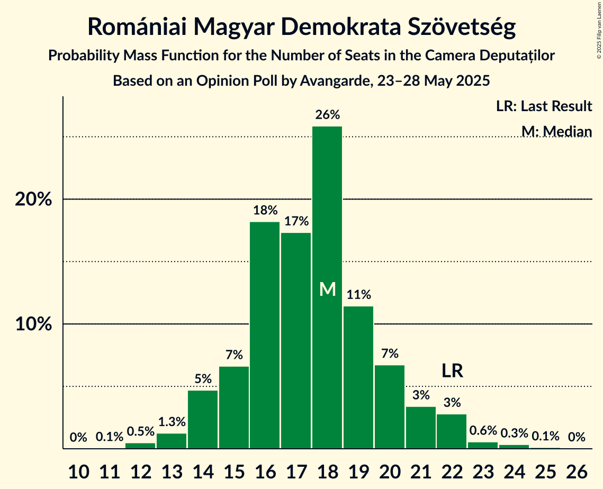
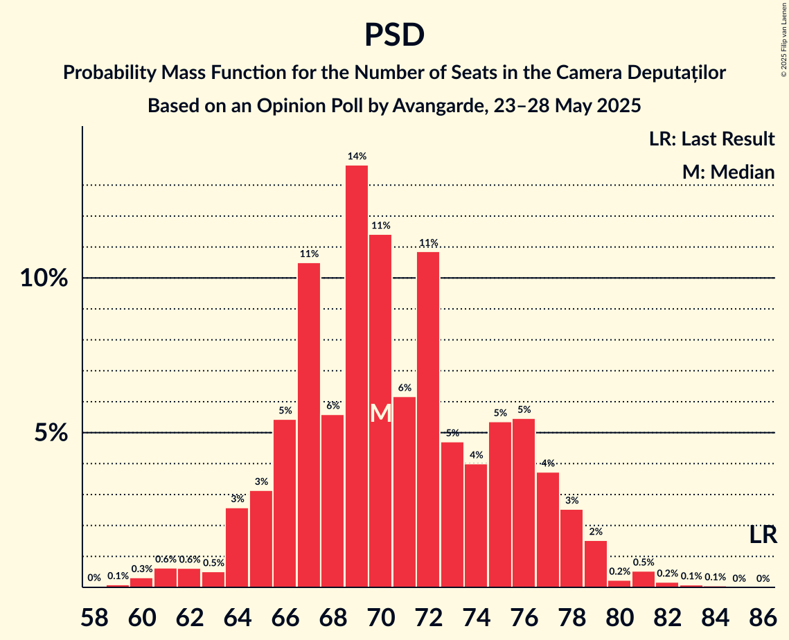
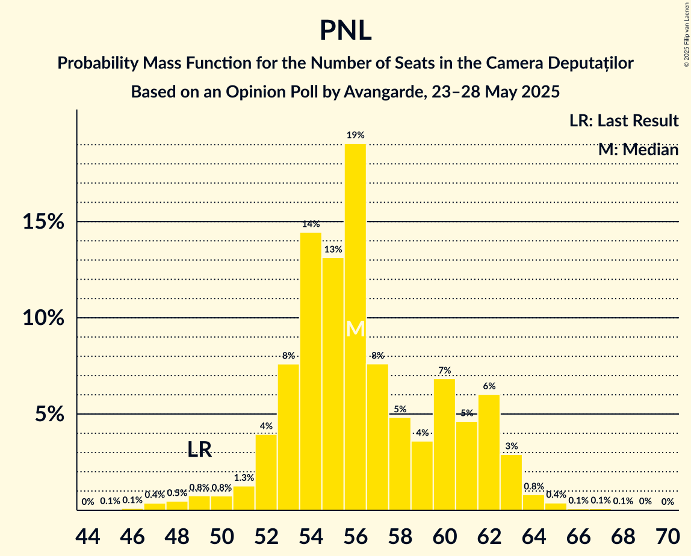

# Opinion Poll by Avangarde, 23–28 May 2025

<a href="#voting-intentions">Voting Intentions</a> | <a href="#seats">Seats</a> | <a href="#coalitions">Coalitions</a> | <a href="#technical-information">Technical Information</a>

## Voting Intentions

### Confidence Intervals

| Party | Last Result | Poll Result | 80% Confidence Interval | 90% Confidence Interval | 95% Confidence Interval | 99% Confidence Interval |
|:-----:|:-----------:|:-----------:|:-----------------------:|:-----------------------:|:-----------------------:|:-----------------------:|
| Alianța pentru Unirea Românilor | 18.0% | 32.0% | 30.4–33.7% |29.9–34.2% |29.5–34.6% |28.7–35.4% |
| Partidul Social Democrat | 22.0% | 20.0% | 18.6–21.5% |18.2–21.9% |17.9–22.3% |17.3–23.0% |
| Partidul Național Liberal | 13.2% | 16.0% | 14.8–17.4% |14.4–17.8% |14.1–18.1% |13.5–18.8% |
| Uniunea Salvați România | 12.4% | 15.0% | 13.8–16.3% |13.4–16.7% |13.2–17.1% |12.6–17.7% |
| Romániai Magyar Demokrata Szövetség | 6.3% | 5.0% | 4.3–5.9% |4.1–6.1% |3.9–6.3% |3.6–6.8% |
| Partidul S.O.S. România | 7.4% | 4.0% | 3.4–4.8% |3.2–5.0% |3.1–5.2% |2.8–5.6% |
| Partidul Oamenilor Tineri | 6.5% | 3.0% | 2.5–3.7% |2.3–3.9% |2.2–4.1% |2.0–4.5% |
| Forța Dreptei | 2.0% | 1.0% | 0.7–1.5% |0.6–1.6% |0.6–1.7% |0.5–2.0% |
| Dreptate și Respect în Europa Pentru Toți | 1.2% | 1.0% | 0.7–1.5% |0.6–1.6% |0.6–1.7% |0.5–2.0% |
| Partidul Mișcarea Populară | 2.0% | 1.0% | 0.7–1.5% |0.6–1.6% |0.6–1.7% |0.5–2.0% |

*Note:* The poll result column reflects the actual value used in the calculations. Published results may vary slightly, and in addition be rounded to fewer digits.

## Seats

### Confidence Intervals

| Party | Last Result | Median | 80% Confidence Interval | 90% Confidence Interval | 95% Confidence Interval | 99% Confidence Interval |
|:-----:|:-----------:|:------:|:-----------------------:|:-----------------------:|:-----------------------:|:-----------------------:|
| <a href="#alianța-pentru-unirea-românilor">Alianța pentru Unirea Românilor</a> | 63 | 114 | 107–119 |106–121 |105–123 |102–126 |
| <a href="#partidul-social-democrat">Partidul Social Democrat</a> | 86 | 70 | 66–76 |65–77 |64–79 |61–81 |
| <a href="#partidul-național-liberal">Partidul Național Liberal</a> | 49 | 56 | 53–60 |52–62 |51–63 |48–65 |
| <a href="#uniunea-salvați-românia">Uniunea Salvați România</a> | 40 | 54 | 48–58 |48–59 |47–61 |45–62 |
| <a href="#romániai-magyar-demokrata-szövetség">Romániai Magyar Demokrata Szövetség</a> | 22 | 18 | 15–19 |14–20 |14–22 |13–23 |
| <a href="#partidul-s.o.s.-românia">Partidul S.O.S. România</a> | 28 | 0 | 0 |0 |0–17 |0–18 |
| <a href="#partidul-oamenilor-tineri">Partidul Oamenilor Tineri</a> | 24 | 0 | 0 |0 |0 |0 |
| <a href="#forța-dreptei">Forța Dreptei</a> | 0 | 0 | 0 |0 |0 |0 |
| <a href="#dreptate-și-respect-în-europa-pentru-toți">Dreptate și Respect în Europa Pentru Toți</a> | 0 | 0 | 0 |0 |0 |0 |
| <a href="#partidul-mișcarea-populară">Partidul Mișcarea Populară</a> | 0 | 0 | 0 |0 |0 |0 |

### Alianța pentru Unirea Românilor

*For a full overview of the results for this party, see the [Alianța pentru Unirea Românilor](party-alianțapentruunirearomânilor.html) page.*

| Number of Seats | Probability | Accumulated | Special Marks |
|:---------------:|:-----------:|:-----------:|:-------------:|
| 63 | 0% | 100% | Last Result |
| 64 | 0% | 100% |  |
| 65 | 0% | 100% |  |
| 66 | 0% | 100% |  |
| 67 | 0% | 100% |  |
| 68 | 0% | 100% |  |
| 69 | 0% | 100% |  |
| 70 | 0% | 100% |  |
| 71 | 0% | 100% |  |
| 72 | 0% | 100% |  |
| 73 | 0% | 100% |  |
| 74 | 0% | 100% |  |
| 75 | 0% | 100% |  |
| 76 | 0% | 100% |  |
| 77 | 0% | 100% |  |
| 78 | 0% | 100% |  |
| 79 | 0% | 100% |  |
| 80 | 0% | 100% |  |
| 81 | 0% | 100% |  |
| 82 | 0% | 100% |  |
| 83 | 0% | 100% |  |
| 84 | 0% | 100% |  |
| 85 | 0% | 100% |  |
| 86 | 0% | 100% |  |
| 87 | 0% | 100% |  |
| 88 | 0% | 100% |  |
| 89 | 0% | 100% |  |
| 90 | 0% | 100% |  |
| 91 | 0% | 100% |  |
| 92 | 0% | 100% |  |
| 93 | 0% | 100% |  |
| 94 | 0% | 100% |  |
| 95 | 0% | 100% |  |
| 96 | 0% | 100% |  |
| 97 | 0% | 100% |  |
| 98 | 0% | 100% |  |
| 99 | 0.1% | 99.9% |  |
| 100 | 0.2% | 99.9% |  |
| 101 | 0.1% | 99.7% |  |
| 102 | 0.6% | 99.5% |  |
| 103 | 0.6% | 98.9% |  |
| 104 | 0.5% | 98% |  |
| 105 | 1.3% | 98% |  |
| 106 | 3% | 97% |  |
| 107 | 6% | 94% |  |
| 108 | 4% | 87% |  |
| 109 | 6% | 84% |  |
| 110 | 7% | 78% |  |
| 111 | 2% | 71% |  |
| 112 | 5% | 69% |  |
| 113 | 8% | 64% |  |
| 114 | 6% | 56% | Median |
| 115 | 3% | 50% |  |
| 116 | 20% | 47% |  |
| 117 | 8% | 26% |  |
| 118 | 2% | 19% |  |
| 119 | 10% | 17% |  |
| 120 | 2% | 7% |  |
| 121 | 0.8% | 5% |  |
| 122 | 0.4% | 4% |  |
| 123 | 3% | 4% |  |
| 124 | 0.1% | 1.3% |  |
| 125 | 0.6% | 1.3% |  |
| 126 | 0.5% | 0.6% |  |
| 127 | 0.1% | 0.1% |  |
| 128 | 0% | 0.1% |  |
| 129 | 0% | 0% |  |

### Partidul Social Democrat

*For a full overview of the results for this party, see the [Partidul Social Democrat](party-partidulsocialdemocrat.html) page.*

| Number of Seats | Probability | Accumulated | Special Marks |
|:---------------:|:-----------:|:-----------:|:-------------:|
| 59 | 0.1% | 100% |  |
| 60 | 0.1% | 99.8% |  |
| 61 | 0.6% | 99.7% |  |
| 62 | 0.8% | 99.1% |  |
| 63 | 0.3% | 98% |  |
| 64 | 2% | 98% |  |
| 65 | 4% | 96% |  |
| 66 | 5% | 92% |  |
| 67 | 13% | 87% |  |
| 68 | 7% | 74% |  |
| 69 | 3% | 67% |  |
| 70 | 18% | 64% | Median |
| 71 | 8% | 46% |  |
| 72 | 8% | 38% |  |
| 73 | 4% | 30% |  |
| 74 | 4% | 26% |  |
| 75 | 6% | 22% |  |
| 76 | 7% | 16% |  |
| 77 | 5% | 9% |  |
| 78 | 2% | 4% |  |
| 79 | 2% | 3% |  |
| 80 | 0.2% | 0.9% |  |
| 81 | 0.3% | 0.7% |  |
| 82 | 0.2% | 0.4% |  |
| 83 | 0.1% | 0.2% |  |
| 84 | 0.1% | 0.1% |  |
| 85 | 0% | 0% |  |
| 86 | 0% | 0% | Last Result |

### Partidul Național Liberal

*For a full overview of the results for this party, see the [Partidul Național Liberal](party-partidulnaționalliberal.html) page.*

| Number of Seats | Probability | Accumulated | Special Marks |
|:---------------:|:-----------:|:-----------:|:-------------:|
| 45 | 0.1% | 100% |  |
| 46 | 0.1% | 99.9% |  |
| 47 | 0.2% | 99.8% |  |
| 48 | 0.2% | 99.6% |  |
| 49 | 0.4% | 99.4% | Last Result |
| 50 | 0.7% | 99.0% |  |
| 51 | 1.2% | 98% |  |
| 52 | 4% | 97% |  |
| 53 | 11% | 93% |  |
| 54 | 19% | 83% |  |
| 55 | 12% | 64% |  |
| 56 | 17% | 52% | Median |
| 57 | 10% | 35% |  |
| 58 | 6% | 26% |  |
| 59 | 3% | 20% |  |
| 60 | 9% | 17% |  |
| 61 | 3% | 9% |  |
| 62 | 2% | 6% |  |
| 63 | 2% | 4% |  |
| 64 | 0.7% | 1.2% |  |
| 65 | 0.2% | 0.5% |  |
| 66 | 0.1% | 0.3% |  |
| 67 | 0.1% | 0.3% |  |
| 68 | 0.1% | 0.1% |  |
| 69 | 0% | 0.1% |  |
| 70 | 0% | 0% |  |

### Uniunea Salvați România

*For a full overview of the results for this party, see the [Uniunea Salvați România](party-uniuneasalvațiromânia.html) page.*

| Number of Seats | Probability | Accumulated | Special Marks |
|:---------------:|:-----------:|:-----------:|:-------------:|
| 40 | 0% | 100% | Last Result |
| 41 | 0% | 100% |  |
| 42 | 0% | 100% |  |
| 43 | 0.1% | 99.9% |  |
| 44 | 0.2% | 99.8% |  |
| 45 | 0.9% | 99.6% |  |
| 46 | 0.6% | 98.7% |  |
| 47 | 2% | 98% |  |
| 48 | 6% | 96% |  |
| 49 | 5% | 90% |  |
| 50 | 6% | 85% |  |
| 51 | 3% | 79% |  |
| 52 | 6% | 76% |  |
| 53 | 18% | 70% |  |
| 54 | 7% | 52% | Median |
| 55 | 19% | 45% |  |
| 56 | 7% | 26% |  |
| 57 | 3% | 19% |  |
| 58 | 11% | 16% |  |
| 59 | 2% | 5% |  |
| 60 | 0.5% | 4% |  |
| 61 | 2% | 3% |  |
| 62 | 0.6% | 1.1% |  |
| 63 | 0.3% | 0.4% |  |
| 64 | 0.1% | 0.1% |  |
| 65 | 0% | 0.1% |  |
| 66 | 0% | 0% |  |

### Romániai Magyar Demokrata Szövetség

*For a full overview of the results for this party, see the [Romániai Magyar Demokrata Szövetség](party-romániaimagyardemokrataszövetség.html) page.*

| Number of Seats | Probability | Accumulated | Special Marks |
|:---------------:|:-----------:|:-----------:|:-------------:|
| 11 | 0.1% | 100% |  |
| 12 | 0.3% | 99.9% |  |
| 13 | 1.5% | 99.6% |  |
| 14 | 4% | 98% |  |
| 15 | 6% | 94% |  |
| 16 | 13% | 88% |  |
| 17 | 23% | 75% |  |
| 18 | 35% | 53% | Median |
| 19 | 10% | 18% |  |
| 20 | 4% | 7% |  |
| 21 | 1.3% | 4% |  |
| 22 | 1.4% | 3% | Last Result |
| 23 | 0.7% | 1.2% |  |
| 24 | 0.4% | 0.5% |  |
| 25 | 0% | 0.1% |  |
| 26 | 0% | 0% |  |

### Partidul S.O.S. România

*For a full overview of the results for this party, see the [Partidul S.O.S. România](party-partidulsosromânia.html) page.*

| Number of Seats | Probability | Accumulated | Special Marks |
|:---------------:|:-----------:|:-----------:|:-------------:|
| 0 | 97% | 100% | Median |
| 1 | 0% | 3% |  |
| 2 | 0% | 3% |  |
| 3 | 0% | 3% |  |
| 4 | 0% | 3% |  |
| 5 | 0% | 3% |  |
| 6 | 0% | 3% |  |
| 7 | 0% | 3% |  |
| 8 | 0% | 3% |  |
| 9 | 0% | 3% |  |
| 10 | 0% | 3% |  |
| 11 | 0% | 3% |  |
| 12 | 0% | 3% |  |
| 13 | 0% | 3% |  |
| 14 | 0% | 3% |  |
| 15 | 0% | 3% |  |
| 16 | 0% | 3% |  |
| 17 | 2% | 3% |  |
| 18 | 0.5% | 1.0% |  |
| 19 | 0.3% | 0.5% |  |
| 20 | 0.1% | 0.2% |  |
| 21 | 0.1% | 0.1% |  |
| 22 | 0% | 0% |  |
| 23 | 0% | 0% |  |
| 24 | 0% | 0% |  |
| 25 | 0% | 0% |  |
| 26 | 0% | 0% |  |
| 27 | 0% | 0% |  |
| 28 | 0% | 0% | Last Result |

### Partidul Oamenilor Tineri

*For a full overview of the results for this party, see the [Partidul Oamenilor Tineri](party-partiduloamenilortineri.html) page.*

| Number of Seats | Probability | Accumulated | Special Marks |
|:---------------:|:-----------:|:-----------:|:-------------:|
| 0 | 100% | 100% | Median |
| 1 | 0% | 0% |  |
| 2 | 0% | 0% |  |
| 3 | 0% | 0% |  |
| 4 | 0% | 0% |  |
| 5 | 0% | 0% |  |
| 6 | 0% | 0% |  |
| 7 | 0% | 0% |  |
| 8 | 0% | 0% |  |
| 9 | 0% | 0% |  |
| 10 | 0% | 0% |  |
| 11 | 0% | 0% |  |
| 12 | 0% | 0% |  |
| 13 | 0% | 0% |  |
| 14 | 0% | 0% |  |
| 15 | 0% | 0% |  |
| 16 | 0% | 0% |  |
| 17 | 0% | 0% |  |
| 18 | 0% | 0% |  |
| 19 | 0% | 0% |  |
| 20 | 0% | 0% |  |
| 21 | 0% | 0% |  |
| 22 | 0% | 0% |  |
| 23 | 0% | 0% |  |
| 24 | 0% | 0% | Last Result |

### Forța Dreptei

*For a full overview of the results for this party, see the [Forța Dreptei](party-forțadreptei.html) page.*

| Number of Seats | Probability | Accumulated | Special Marks |
|:---------------:|:-----------:|:-----------:|:-------------:|
| 0 | 100% | 100% | Last Result, Median |

### Dreptate și Respect în Europa Pentru Toți

*For a full overview of the results for this party, see the [Dreptate și Respect în Europa Pentru Toți](party-dreptateșirespectîneuropapentrutoți.html) page.*

| Number of Seats | Probability | Accumulated | Special Marks |
|:---------------:|:-----------:|:-----------:|:-------------:|
| 0 | 100% | 100% | Last Result, Median |

### Partidul Mișcarea Populară

*For a full overview of the results for this party, see the [Partidul Mișcarea Populară](party-partidulmișcareapopulară.html) page.*

| Number of Seats | Probability | Accumulated | Special Marks |
|:---------------:|:-----------:|:-----------:|:-------------:|
| 0 | 100% | 100% | Last Result, Median |

## Coalitions

### Confidence Intervals

| Coalition | Last Result | Median | Majority? | 80% Confidence Interval | 90% Confidence Interval | 95% Confidence Interval | 99% Confidence Interval |
|:---------:|:-----------:|:------:|:---------:|:-----------------------:|:-----------------------:|:-----------------------:|:-----------------------:|
| Partidul Social Democrat – Partidul Național Liberal – Uniunea Salvați România – Romániai Magyar Demokrata Szövetség | 197 | 197 | 100% | 193–205 | 190–205 | 189–206 | 184–209 |
| Partidul Social Democrat – Partidul Național Liberal – Uniunea Salvați România | 175 | 179 | 99.8% | 175–187 | 172–187 | 171–189 | 167–192 |
| Partidul Social Democrat – Partidul Național Liberal – Romániai Magyar Demokrata Szövetség | 157 | 144 | 0% | 140–150 | 136–152 | 136–154 | 133–157 |
| Partidul Social Democrat – Partidul Național Liberal | 135 | 127 | 0% | 122–132 | 119–134 | 118–136 | 116–139 |
| Partidul Social Democrat – Uniunea Salvați România | 126 | 123 | 0% | 118–131 | 116–131 | 115–132 | 111–137 |
| Partidul Național Liberal – Uniunea Salvați România | 89 | 110 | 0% | 104–116 | 103–117 | 101–118 | 98–120 |
| Partidul Național Liberal – Romániai Magyar Demokrata Szövetség – Partidul Mișcarea Populară | 71 | 73 | 0% | 70–78 | 68–80 | 68–82 | 65–84 |
| Partidul Național Liberal – Romániai Magyar Demokrata Szövetség | 71 | 73 | 0% | 70–78 | 68–80 | 68–82 | 65–84 |
| Partidul Social Democrat | 86 | 70 | 0% | 66–76 | 65–77 | 64–79 | 61–81 |
| Partidul Național Liberal – Partidul Mișcarea Populară | 49 | 56 | 0% | 53–60 | 52–62 | 51–63 | 48–65 |
| Partidul Național Liberal | 49 | 56 | 0% | 53–60 | 52–62 | 51–63 | 48–65 |

### Partidul Social Democrat – Partidul Național Liberal – Uniunea Salvați România – Romániai Magyar Demokrata Szövetség

| Number of Seats | Probability | Accumulated | Special Marks |
|:---------------:|:-----------:|:-----------:|:-------------:|
| 179 | 0% | 100% |  |
| 180 | 0% | 99.9% |  |
| 181 | 0% | 99.9% |  |
| 182 | 0.1% | 99.9% |  |
| 183 | 0.2% | 99.8% |  |
| 184 | 0.1% | 99.6% |  |
| 185 | 0.2% | 99.4% |  |
| 186 | 0.7% | 99.2% |  |
| 187 | 0.7% | 98.6% |  |
| 188 | 0.1% | 98% |  |
| 189 | 3% | 98% |  |
| 190 | 1.2% | 95% |  |
| 191 | 0.9% | 94% |  |
| 192 | 2% | 93% |  |
| 193 | 10% | 91% |  |
| 194 | 2% | 81% |  |
| 195 | 8% | 79% |  |
| 196 | 21% | 71% |  |
| 197 | 3% | 51% | Last Result |
| 198 | 6% | 48% | Median |
| 199 | 8% | 41% |  |
| 200 | 5% | 34% |  |
| 201 | 2% | 29% |  |
| 202 | 7% | 27% |  |
| 203 | 5% | 20% |  |
| 204 | 4% | 15% |  |
| 205 | 6% | 11% |  |
| 206 | 3% | 4% |  |
| 207 | 0.5% | 2% |  |
| 208 | 0.4% | 1.3% |  |
| 209 | 0.5% | 0.9% |  |
| 210 | 0.3% | 0.4% |  |
| 211 | 0.1% | 0.2% |  |
| 212 | 0% | 0.1% |  |
| 213 | 0% | 0% |  |

### Partidul Social Democrat – Partidul Național Liberal – Uniunea Salvați România

| Number of Seats | Probability | Accumulated | Special Marks |
|:---------------:|:-----------:|:-----------:|:-------------:|
| 162 | 0% | 100% |  |
| 163 | 0% | 99.9% |  |
| 164 | 0% | 99.9% |  |
| 165 | 0.1% | 99.9% |  |
| 166 | 0.2% | 99.8% | Majority |
| 167 | 0.2% | 99.6% |  |
| 168 | 1.0% | 99.4% |  |
| 169 | 0.4% | 98% |  |
| 170 | 0.2% | 98% |  |
| 171 | 1.2% | 98% |  |
| 172 | 3% | 97% |  |
| 173 | 2% | 94% |  |
| 174 | 0.9% | 92% |  |
| 175 | 1.3% | 91% | Last Result |
| 176 | 2% | 90% |  |
| 177 | 17% | 88% |  |
| 178 | 19% | 71% |  |
| 179 | 2% | 51% |  |
| 180 | 4% | 50% | Median |
| 181 | 3% | 45% |  |
| 182 | 8% | 42% |  |
| 183 | 3% | 35% |  |
| 184 | 6% | 32% |  |
| 185 | 7% | 26% |  |
| 186 | 7% | 19% |  |
| 187 | 7% | 12% |  |
| 188 | 1.4% | 5% |  |
| 189 | 1.4% | 3% |  |
| 190 | 0.6% | 2% |  |
| 191 | 0.4% | 1.2% |  |
| 192 | 0.3% | 0.8% |  |
| 193 | 0.3% | 0.5% |  |
| 194 | 0.1% | 0.2% |  |
| 195 | 0.1% | 0.1% |  |
| 196 | 0% | 0% |  |

### Partidul Social Democrat – Partidul Național Liberal – Romániai Magyar Demokrata Szövetség

| Number of Seats | Probability | Accumulated | Special Marks |
|:---------------:|:-----------:|:-----------:|:-------------:|
| 125 | 0.1% | 100% |  |
| 126 | 0% | 99.9% |  |
| 127 | 0% | 99.9% |  |
| 128 | 0% | 99.9% |  |
| 129 | 0% | 99.9% |  |
| 130 | 0% | 99.9% |  |
| 131 | 0.1% | 99.8% |  |
| 132 | 0.1% | 99.7% |  |
| 133 | 0.2% | 99.6% |  |
| 134 | 0.3% | 99.5% |  |
| 135 | 1.3% | 99.2% |  |
| 136 | 3% | 98% |  |
| 137 | 2% | 95% |  |
| 138 | 1.2% | 93% |  |
| 139 | 1.3% | 92% |  |
| 140 | 10% | 91% |  |
| 141 | 14% | 81% |  |
| 142 | 10% | 66% |  |
| 143 | 5% | 56% |  |
| 144 | 2% | 51% | Median |
| 145 | 6% | 49% |  |
| 146 | 8% | 42% |  |
| 147 | 10% | 34% |  |
| 148 | 11% | 24% |  |
| 149 | 3% | 13% |  |
| 150 | 2% | 10% |  |
| 151 | 2% | 8% |  |
| 152 | 1.1% | 6% |  |
| 153 | 2% | 5% |  |
| 154 | 2% | 3% |  |
| 155 | 0.4% | 1.4% |  |
| 156 | 0.4% | 0.9% |  |
| 157 | 0.1% | 0.5% | Last Result |
| 158 | 0.1% | 0.4% |  |
| 159 | 0.2% | 0.2% |  |
| 160 | 0% | 0.1% |  |
| 161 | 0% | 0% |  |

### Partidul Social Democrat – Partidul Național Liberal

| Number of Seats | Probability | Accumulated | Special Marks |
|:---------------:|:-----------:|:-----------:|:-------------:|
| 110 | 0.1% | 100% |  |
| 111 | 0% | 99.9% |  |
| 112 | 0% | 99.9% |  |
| 113 | 0.1% | 99.9% |  |
| 114 | 0.1% | 99.8% |  |
| 115 | 0.1% | 99.7% |  |
| 116 | 0.2% | 99.6% |  |
| 117 | 0.7% | 99.4% |  |
| 118 | 1.3% | 98.7% |  |
| 119 | 3% | 97% |  |
| 120 | 1.1% | 95% |  |
| 121 | 2% | 94% |  |
| 122 | 2% | 91% |  |
| 123 | 13% | 89% |  |
| 124 | 20% | 77% |  |
| 125 | 5% | 57% |  |
| 126 | 3% | 53% | Median |
| 127 | 2% | 50% |  |
| 128 | 7% | 48% |  |
| 129 | 14% | 41% |  |
| 130 | 9% | 27% |  |
| 131 | 6% | 18% |  |
| 132 | 3% | 13% |  |
| 133 | 2% | 9% |  |
| 134 | 3% | 7% |  |
| 135 | 1.4% | 4% | Last Result |
| 136 | 1.3% | 3% |  |
| 137 | 0.7% | 2% |  |
| 138 | 0.4% | 1.0% |  |
| 139 | 0.3% | 0.6% |  |
| 140 | 0.2% | 0.4% |  |
| 141 | 0.1% | 0.2% |  |
| 142 | 0% | 0.1% |  |
| 143 | 0% | 0% |  |

### Partidul Social Democrat – Uniunea Salvați România

| Number of Seats | Probability | Accumulated | Special Marks |
|:---------------:|:-----------:|:-----------:|:-------------:|
| 108 | 0% | 100% |  |
| 109 | 0.1% | 99.9% |  |
| 110 | 0.1% | 99.8% |  |
| 111 | 0.2% | 99.7% |  |
| 112 | 0.1% | 99.5% |  |
| 113 | 0.7% | 99.4% |  |
| 114 | 0.5% | 98.6% |  |
| 115 | 2% | 98% |  |
| 116 | 2% | 97% |  |
| 117 | 1.1% | 95% |  |
| 118 | 8% | 94% |  |
| 119 | 1.2% | 86% |  |
| 120 | 2% | 85% |  |
| 121 | 3% | 82% |  |
| 122 | 14% | 79% |  |
| 123 | 16% | 65% |  |
| 124 | 11% | 49% | Median |
| 125 | 6% | 38% |  |
| 126 | 1.1% | 33% | Last Result |
| 127 | 2% | 32% |  |
| 128 | 2% | 29% |  |
| 129 | 3% | 27% |  |
| 130 | 9% | 24% |  |
| 131 | 13% | 15% |  |
| 132 | 1.0% | 3% |  |
| 133 | 0.4% | 2% |  |
| 134 | 0.2% | 1.1% |  |
| 135 | 0.3% | 0.9% |  |
| 136 | 0.1% | 0.7% |  |
| 137 | 0.4% | 0.5% |  |
| 138 | 0.1% | 0.2% |  |
| 139 | 0% | 0% |  |

### Partidul Național Liberal – Uniunea Salvați România

| Number of Seats | Probability | Accumulated | Special Marks |
|:---------------:|:-----------:|:-----------:|:-------------:|
| 89 | 0% | 100% | Last Result |
| 90 | 0% | 100% |  |
| 91 | 0% | 100% |  |
| 92 | 0% | 100% |  |
| 93 | 0% | 100% |  |
| 94 | 0% | 100% |  |
| 95 | 0% | 99.9% |  |
| 96 | 0.1% | 99.9% |  |
| 97 | 0.1% | 99.8% |  |
| 98 | 0.2% | 99.7% |  |
| 99 | 0.5% | 99.5% |  |
| 100 | 1.0% | 99.0% |  |
| 101 | 0.9% | 98% |  |
| 102 | 1.2% | 97% |  |
| 103 | 4% | 96% |  |
| 104 | 2% | 92% |  |
| 105 | 3% | 89% |  |
| 106 | 7% | 86% |  |
| 107 | 14% | 79% |  |
| 108 | 7% | 65% |  |
| 109 | 4% | 58% |  |
| 110 | 15% | 54% | Median |
| 111 | 12% | 40% |  |
| 112 | 3% | 27% |  |
| 113 | 3% | 24% |  |
| 114 | 2% | 21% |  |
| 115 | 7% | 19% |  |
| 116 | 6% | 11% |  |
| 117 | 1.2% | 5% |  |
| 118 | 2% | 4% |  |
| 119 | 1.2% | 2% |  |
| 120 | 0.6% | 1.1% |  |
| 121 | 0.2% | 0.5% |  |
| 122 | 0.2% | 0.3% |  |
| 123 | 0% | 0.1% |  |
| 124 | 0% | 0.1% |  |
| 125 | 0% | 0% |  |

### Partidul Național Liberal – Romániai Magyar Demokrata Szövetség – Partidul Mișcarea Populară

| Number of Seats | Probability | Accumulated | Special Marks |
|:---------------:|:-----------:|:-----------:|:-------------:|
| 61 | 0% | 100% |  |
| 62 | 0.1% | 99.9% |  |
| 63 | 0.1% | 99.8% |  |
| 64 | 0.1% | 99.7% |  |
| 65 | 0.2% | 99.6% |  |
| 66 | 0.4% | 99.3% |  |
| 67 | 0.8% | 98.9% |  |
| 68 | 3% | 98% |  |
| 69 | 3% | 95% |  |
| 70 | 10% | 91% |  |
| 71 | 15% | 82% | Last Result |
| 72 | 9% | 67% |  |
| 73 | 9% | 58% |  |
| 74 | 16% | 50% | Median |
| 75 | 13% | 34% |  |
| 76 | 4% | 21% |  |
| 77 | 3% | 17% |  |
| 78 | 6% | 14% |  |
| 79 | 3% | 8% |  |
| 80 | 2% | 5% |  |
| 81 | 0.6% | 3% |  |
| 82 | 1.1% | 3% |  |
| 83 | 1.1% | 2% |  |
| 84 | 0.2% | 0.5% |  |
| 85 | 0.1% | 0.3% |  |
| 86 | 0.1% | 0.2% |  |
| 87 | 0.1% | 0.1% |  |
| 88 | 0% | 0.1% |  |
| 89 | 0% | 0% |  |

### Partidul Național Liberal – Romániai Magyar Demokrata Szövetség

| Number of Seats | Probability | Accumulated | Special Marks |
|:---------------:|:-----------:|:-----------:|:-------------:|
| 61 | 0% | 100% |  |
| 62 | 0.1% | 99.9% |  |
| 63 | 0.1% | 99.8% |  |
| 64 | 0.1% | 99.7% |  |
| 65 | 0.2% | 99.6% |  |
| 66 | 0.4% | 99.3% |  |
| 67 | 0.8% | 98.9% |  |
| 68 | 3% | 98% |  |
| 69 | 3% | 95% |  |
| 70 | 10% | 91% |  |
| 71 | 15% | 82% | Last Result |
| 72 | 9% | 67% |  |
| 73 | 9% | 58% |  |
| 74 | 16% | 50% | Median |
| 75 | 13% | 34% |  |
| 76 | 4% | 21% |  |
| 77 | 3% | 17% |  |
| 78 | 6% | 14% |  |
| 79 | 3% | 8% |  |
| 80 | 2% | 5% |  |
| 81 | 0.6% | 3% |  |
| 82 | 1.1% | 3% |  |
| 83 | 1.1% | 2% |  |
| 84 | 0.2% | 0.5% |  |
| 85 | 0.1% | 0.3% |  |
| 86 | 0.1% | 0.2% |  |
| 87 | 0.1% | 0.1% |  |
| 88 | 0% | 0.1% |  |
| 89 | 0% | 0% |  |

### Partidul Social Democrat

| Number of Seats | Probability | Accumulated | Special Marks |
|:---------------:|:-----------:|:-----------:|:-------------:|
| 59 | 0.1% | 100% |  |
| 60 | 0.1% | 99.8% |  |
| 61 | 0.6% | 99.7% |  |
| 62 | 0.8% | 99.1% |  |
| 63 | 0.3% | 98% |  |
| 64 | 2% | 98% |  |
| 65 | 4% | 96% |  |
| 66 | 5% | 92% |  |
| 67 | 13% | 87% |  |
| 68 | 7% | 74% |  |
| 69 | 3% | 67% |  |
| 70 | 18% | 64% | Median |
| 71 | 8% | 46% |  |
| 72 | 8% | 38% |  |
| 73 | 4% | 30% |  |
| 74 | 4% | 26% |  |
| 75 | 6% | 22% |  |
| 76 | 7% | 16% |  |
| 77 | 5% | 9% |  |
| 78 | 2% | 4% |  |
| 79 | 2% | 3% |  |
| 80 | 0.2% | 0.9% |  |
| 81 | 0.3% | 0.7% |  |
| 82 | 0.2% | 0.4% |  |
| 83 | 0.1% | 0.2% |  |
| 84 | 0.1% | 0.1% |  |
| 85 | 0% | 0% |  |
| 86 | 0% | 0% | Last Result |

### Partidul Național Liberal – Partidul Mișcarea Populară

| Number of Seats | Probability | Accumulated | Special Marks |
|:---------------:|:-----------:|:-----------:|:-------------:|
| 45 | 0.1% | 100% |  |
| 46 | 0.1% | 99.9% |  |
| 47 | 0.2% | 99.8% |  |
| 48 | 0.2% | 99.6% |  |
| 49 | 0.4% | 99.4% | Last Result |
| 50 | 0.7% | 99.0% |  |
| 51 | 1.2% | 98% |  |
| 52 | 4% | 97% |  |
| 53 | 11% | 93% |  |
| 54 | 19% | 83% |  |
| 55 | 12% | 64% |  |
| 56 | 17% | 52% | Median |
| 57 | 10% | 35% |  |
| 58 | 6% | 26% |  |
| 59 | 3% | 20% |  |
| 60 | 9% | 17% |  |
| 61 | 3% | 9% |  |
| 62 | 2% | 6% |  |
| 63 | 2% | 4% |  |
| 64 | 0.7% | 1.2% |  |
| 65 | 0.2% | 0.5% |  |
| 66 | 0.1% | 0.3% |  |
| 67 | 0.1% | 0.3% |  |
| 68 | 0.1% | 0.1% |  |
| 69 | 0% | 0.1% |  |
| 70 | 0% | 0% |  |

### Partidul Național Liberal

| Number of Seats | Probability | Accumulated | Special Marks |
|:---------------:|:-----------:|:-----------:|:-------------:|
| 45 | 0.1% | 100% |  |
| 46 | 0.1% | 99.9% |  |
| 47 | 0.2% | 99.8% |  |
| 48 | 0.2% | 99.6% |  |
| 49 | 0.4% | 99.4% | Last Result |
| 50 | 0.7% | 99.0% |  |
| 51 | 1.2% | 98% |  |
| 52 | 4% | 97% |  |
| 53 | 11% | 93% |  |
| 54 | 19% | 83% |  |
| 55 | 12% | 64% |  |
| 56 | 17% | 52% | Median |
| 57 | 10% | 35% |  |
| 58 | 6% | 26% |  |
| 59 | 3% | 20% |  |
| 60 | 9% | 17% |  |
| 61 | 3% | 9% |  |
| 62 | 2% | 6% |  |
| 63 | 2% | 4% |  |
| 64 | 0.7% | 1.2% |  |
| 65 | 0.2% | 0.5% |  |
| 66 | 0.1% | 0.3% |  |
| 67 | 0.1% | 0.3% |  |
| 68 | 0.1% | 0.1% |  |
| 69 | 0% | 0.1% |  |
| 70 | 0% | 0% |  |

## Technical Information

### Opinion Poll

+ **Polling firm:** Avangarde
+ **Commissioner(s):** —
+ **Fieldwork period:** 23–28 May 2025

### Calculations

+ **Sample size:** 1300
+ **Simulations done:** 1,048,576
+ **Error estimate:** 0.98%

