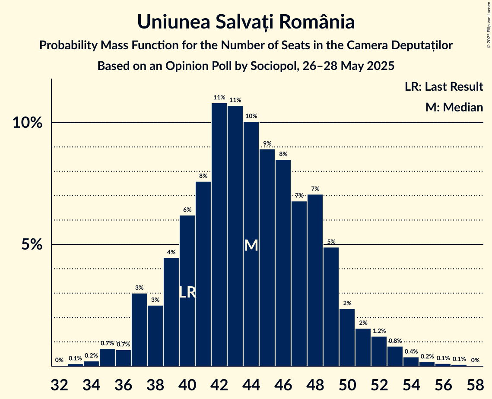
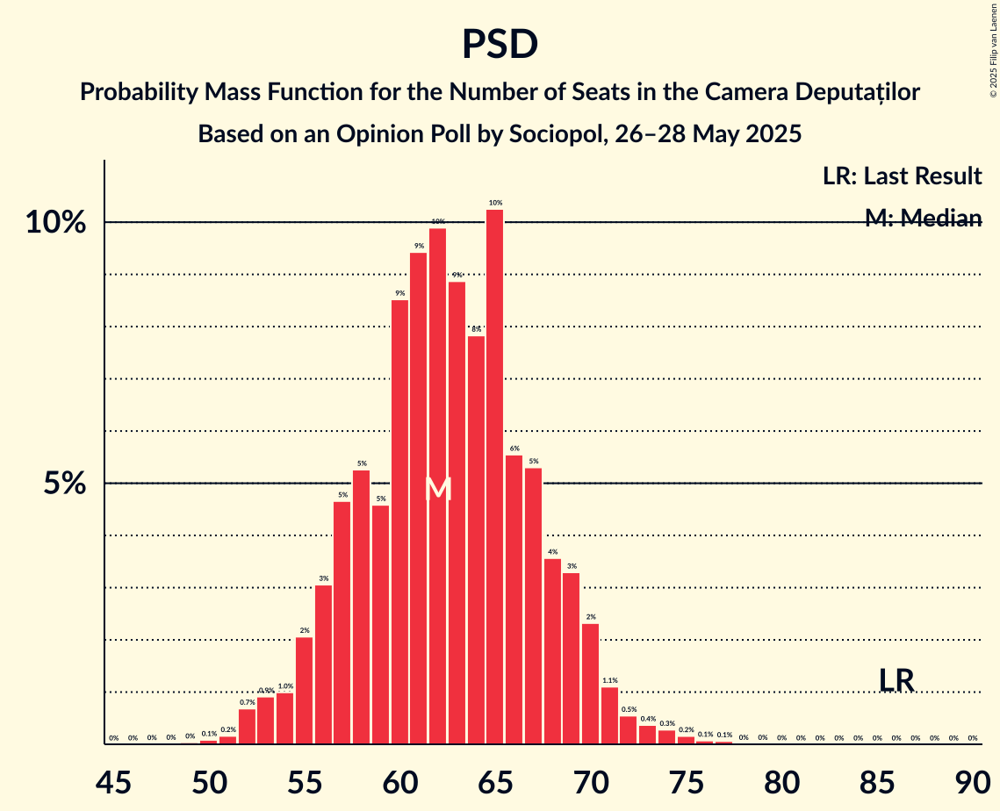

# Opinion Poll by Sociopol, 26–28 May 2025

<a href="#voting-intentions">Voting Intentions</a> | <a href="#seats">Seats</a> | <a href="#coalitions">Coalitions</a> | <a href="#technical-information">Technical Information</a>

## Voting Intentions

### Confidence Intervals

| Party | Last Result | Poll Result | 80% Confidence Interval | 90% Confidence Interval | 95% Confidence Interval | 99% Confidence Interval |
|:-----:|:-----------:|:-----------:|:-----------------------:|:-----------------------:|:-----------------------:|:-----------------------:|
| Alianța pentru Unirea Românilor | 18.0% | 36.0% | 34.0–38.0% |33.5–38.5% |33.0–39.0% |32.1–39.9% |
| Partidul Social Democrat | 22.0% | 17.0% | 15.5–18.6% |15.1–19.1% |14.8–19.4% |14.1–20.2% |
| Partidul Național Liberal | 13.2% | 14.0% | 12.7–15.5% |12.3–15.9% |12.0–16.3% |11.4–17.0% |
| Uniunea Salvați România | 12.4% | 12.0% | 10.8–13.4% |10.4–13.8% |10.1–14.2% |9.6–14.9% |
| Romániai Magyar Demokrata Szövetség | 6.3% | 6.0% | 5.1–7.1% |4.9–7.4% |4.7–7.7% |4.3–8.2% |
| Sănătate, Educație, Natură, Sustenabilitate | 3.0% | 3.0% | 2.4–3.8% |2.2–4.1% |2.1–4.3% |1.9–4.7% |
| Partidul Oamenilor Tineri | 6.5% | 3.0% | 2.4–3.8% |2.2–4.1% |2.1–4.3% |1.9–4.7% |
| Partidul S.O.S. România | 7.4% | 2.0% | 1.5–2.7% |1.4–2.9% |1.3–3.1% |1.1–3.4% |
| Forța Dreptei | 2.0% | 2.0% | 1.5–2.7% |1.4–2.9% |1.3–3.1% |1.1–3.4% |
| Reînnoim Proiectul European al României | 1.2% | 2.0% | 1.5–2.7% |1.4–2.9% |1.3–3.1% |1.1–3.4% |

*Note:* The poll result column reflects the actual value used in the calculations. Published results may vary slightly, and in addition be rounded to fewer digits.

## Seats

### Confidence Intervals

| Party | Last Result | Median | 80% Confidence Interval | 90% Confidence Interval | 95% Confidence Interval | 99% Confidence Interval |
|:-----:|:-----------:|:------:|:-----------------------:|:-----------------------:|:-----------------------:|:-----------------------:|
| <a href="#alianța-pentru-unirea-românilor">Alianța pentru Unirea Românilor</a> | 63 | 132 | 125–139 |123–140 |122–142 |118–146 |
| <a href="#partidul-social-democrat">Partidul Social Democrat</a> | 86 | 62 | 57–68 |56–69 |54–71 |52–74 |
| <a href="#partidul-național-liberal">Partidul Național Liberal</a> | 49 | 51 | 46–56 |45–58 |44–59 |41–62 |
| <a href="#uniunea-salvați-românia">Uniunea Salvați România</a> | 40 | 44 | 39–49 |38–50 |37–52 |35–54 |
| <a href="#romániai-magyar-demokrata-szövetség">Romániai Magyar Demokrata Szövetség</a> | 22 | 22 | 18–26 |18–27 |17–28 |15–29 |
| <a href="#sănătate,-educație,-natură,-sustenabilitate">Sănătate, Educație, Natură, Sustenabilitate</a> | 0 | 0 | 0 |0 |0 |0 |
| <a href="#partidul-oamenilor-tineri">Partidul Oamenilor Tineri</a> | 24 | 0 | 0 |0 |0 |0 |
| <a href="#partidul-s.o.s.-românia">Partidul S.O.S. România</a> | 28 | 0 | 0 |0 |0 |0 |
| <a href="#forța-dreptei">Forța Dreptei</a> | 0 | 0 | 0 |0 |0 |0 |
| <a href="#reînnoim-proiectul-european-al-româniei">Reînnoim Proiectul European al României</a> | 0 | 0 | 0 |0 |0 |0 |

### Alianța pentru Unirea Românilor

*For a full overview of the results for this party, see the [Alianța pentru Unirea Românilor](party-alianțapentruunirearomânilor.html) page.*

| Number of Seats | Probability | Accumulated | Special Marks |
|:---------------:|:-----------:|:-----------:|:-------------:|
| 63 | 0% | 100% | Last Result |
| 64 | 0% | 100% |  |
| 65 | 0% | 100% |  |
| 66 | 0% | 100% |  |
| 67 | 0% | 100% |  |
| 68 | 0% | 100% |  |
| 69 | 0% | 100% |  |
| 70 | 0% | 100% |  |
| 71 | 0% | 100% |  |
| 72 | 0% | 100% |  |
| 73 | 0% | 100% |  |
| 74 | 0% | 100% |  |
| 75 | 0% | 100% |  |
| 76 | 0% | 100% |  |
| 77 | 0% | 100% |  |
| 78 | 0% | 100% |  |
| 79 | 0% | 100% |  |
| 80 | 0% | 100% |  |
| 81 | 0% | 100% |  |
| 82 | 0% | 100% |  |
| 83 | 0% | 100% |  |
| 84 | 0% | 100% |  |
| 85 | 0% | 100% |  |
| 86 | 0% | 100% |  |
| 87 | 0% | 100% |  |
| 88 | 0% | 100% |  |
| 89 | 0% | 100% |  |
| 90 | 0% | 100% |  |
| 91 | 0% | 100% |  |
| 92 | 0% | 100% |  |
| 93 | 0% | 100% |  |
| 94 | 0% | 100% |  |
| 95 | 0% | 100% |  |
| 96 | 0% | 100% |  |
| 97 | 0% | 100% |  |
| 98 | 0% | 100% |  |
| 99 | 0% | 100% |  |
| 100 | 0% | 100% |  |
| 101 | 0% | 100% |  |
| 102 | 0% | 100% |  |
| 103 | 0% | 100% |  |
| 104 | 0% | 100% |  |
| 105 | 0% | 100% |  |
| 106 | 0% | 100% |  |
| 107 | 0% | 100% |  |
| 108 | 0% | 100% |  |
| 109 | 0% | 100% |  |
| 110 | 0% | 100% |  |
| 111 | 0% | 100% |  |
| 112 | 0% | 100% |  |
| 113 | 0% | 100% |  |
| 114 | 0% | 100% |  |
| 115 | 0% | 100% |  |
| 116 | 0.1% | 99.9% |  |
| 117 | 0.3% | 99.8% |  |
| 118 | 0.2% | 99.5% |  |
| 119 | 0.3% | 99.4% |  |
| 120 | 0.2% | 99.0% |  |
| 121 | 0.7% | 98.8% |  |
| 122 | 1.0% | 98% |  |
| 123 | 3% | 97% |  |
| 124 | 1.4% | 94% |  |
| 125 | 3% | 93% |  |
| 126 | 5% | 90% |  |
| 127 | 3% | 85% |  |
| 128 | 5% | 82% |  |
| 129 | 4% | 76% |  |
| 130 | 8% | 73% |  |
| 131 | 12% | 65% |  |
| 132 | 4% | 53% | Median |
| 133 | 8% | 49% |  |
| 134 | 6% | 41% |  |
| 135 | 5% | 35% |  |
| 136 | 10% | 30% |  |
| 137 | 6% | 20% |  |
| 138 | 3% | 14% |  |
| 139 | 4% | 11% |  |
| 140 | 3% | 8% |  |
| 141 | 1.2% | 4% |  |
| 142 | 0.7% | 3% |  |
| 143 | 0.7% | 2% |  |
| 144 | 0.5% | 2% |  |
| 145 | 0.4% | 1.1% |  |
| 146 | 0.4% | 0.8% |  |
| 147 | 0.1% | 0.4% |  |
| 148 | 0.1% | 0.3% |  |
| 149 | 0.1% | 0.2% |  |
| 150 | 0.1% | 0.1% |  |
| 151 | 0% | 0% |  |

### Partidul Social Democrat

*For a full overview of the results for this party, see the [Partidul Social Democrat](party-partidulsocialdemocrat.html) page.*

| Number of Seats | Probability | Accumulated | Special Marks |
|:---------------:|:-----------:|:-----------:|:-------------:|
| 49 | 0% | 100% |  |
| 50 | 0.1% | 99.9% |  |
| 51 | 0.2% | 99.9% |  |
| 52 | 0.7% | 99.7% |  |
| 53 | 0.9% | 99.0% |  |
| 54 | 1.0% | 98% |  |
| 55 | 2% | 97% |  |
| 56 | 3% | 95% |  |
| 57 | 5% | 92% |  |
| 58 | 5% | 87% |  |
| 59 | 5% | 82% |  |
| 60 | 9% | 77% |  |
| 61 | 9% | 69% |  |
| 62 | 10% | 60% | Median |
| 63 | 9% | 50% |  |
| 64 | 8% | 41% |  |
| 65 | 10% | 33% |  |
| 66 | 6% | 23% |  |
| 67 | 5% | 17% |  |
| 68 | 4% | 12% |  |
| 69 | 3% | 8% |  |
| 70 | 2% | 5% |  |
| 71 | 1.1% | 3% |  |
| 72 | 0.5% | 2% |  |
| 73 | 0.4% | 1.0% |  |
| 74 | 0.3% | 0.6% |  |
| 75 | 0.2% | 0.3% |  |
| 76 | 0.1% | 0.2% |  |
| 77 | 0.1% | 0.1% |  |
| 78 | 0% | 0% |  |
| 79 | 0% | 0% |  |
| 80 | 0% | 0% |  |
| 81 | 0% | 0% |  |
| 82 | 0% | 0% |  |
| 83 | 0% | 0% |  |
| 84 | 0% | 0% |  |
| 85 | 0% | 0% |  |
| 86 | 0% | 0% | Last Result |

### Partidul Național Liberal

*For a full overview of the results for this party, see the [Partidul Național Liberal](party-partidulnaționalliberal.html) page.*

| Number of Seats | Probability | Accumulated | Special Marks |
|:---------------:|:-----------:|:-----------:|:-------------:|
| 39 | 0% | 100% |  |
| 40 | 0.1% | 99.9% |  |
| 41 | 0.3% | 99.8% |  |
| 42 | 1.0% | 99.5% |  |
| 43 | 0.8% | 98.5% |  |
| 44 | 2% | 98% |  |
| 45 | 2% | 96% |  |
| 46 | 4% | 94% |  |
| 47 | 6% | 90% |  |
| 48 | 7% | 84% |  |
| 49 | 8% | 77% | Last Result |
| 50 | 9% | 69% |  |
| 51 | 11% | 60% | Median |
| 52 | 12% | 50% |  |
| 53 | 9% | 38% |  |
| 54 | 8% | 29% |  |
| 55 | 7% | 21% |  |
| 56 | 6% | 14% |  |
| 57 | 3% | 9% |  |
| 58 | 2% | 5% |  |
| 59 | 1.5% | 4% |  |
| 60 | 1.0% | 2% |  |
| 61 | 0.5% | 1.1% |  |
| 62 | 0.2% | 0.6% |  |
| 63 | 0.2% | 0.4% |  |
| 64 | 0.1% | 0.2% |  |
| 65 | 0% | 0.1% |  |
| 66 | 0% | 0% |  |

### Uniunea Salvați România

*For a full overview of the results for this party, see the [Uniunea Salvați România](party-uniuneasalvațiromânia.html) page.*

| Number of Seats | Probability | Accumulated | Special Marks |
|:---------------:|:-----------:|:-----------:|:-------------:|
| 33 | 0.1% | 100% |  |
| 34 | 0.2% | 99.9% |  |
| 35 | 0.7% | 99.6% |  |
| 36 | 0.7% | 98.9% |  |
| 37 | 3% | 98% |  |
| 38 | 3% | 95% |  |
| 39 | 4% | 93% |  |
| 40 | 6% | 88% | Last Result |
| 41 | 8% | 82% |  |
| 42 | 11% | 74% |  |
| 43 | 11% | 64% |  |
| 44 | 10% | 53% | Median |
| 45 | 9% | 43% |  |
| 46 | 8% | 34% |  |
| 47 | 7% | 25% |  |
| 48 | 7% | 19% |  |
| 49 | 5% | 12% |  |
| 50 | 2% | 7% |  |
| 51 | 2% | 4% |  |
| 52 | 1.2% | 3% |  |
| 53 | 0.8% | 2% |  |
| 54 | 0.4% | 0.8% |  |
| 55 | 0.2% | 0.4% |  |
| 56 | 0.1% | 0.2% |  |
| 57 | 0.1% | 0.1% |  |
| 58 | 0% | 0% |  |

### Romániai Magyar Demokrata Szövetség

*For a full overview of the results for this party, see the [Romániai Magyar Demokrata Szövetség](party-romániaimagyardemokrataszövetség.html) page.*

| Number of Seats | Probability | Accumulated | Special Marks |
|:---------------:|:-----------:|:-----------:|:-------------:|
| 14 | 0.1% | 100% |  |
| 15 | 0.4% | 99.8% |  |
| 16 | 1.3% | 99.5% |  |
| 17 | 2% | 98% |  |
| 18 | 7% | 96% |  |
| 19 | 9% | 88% |  |
| 20 | 10% | 80% |  |
| 21 | 18% | 70% |  |
| 22 | 18% | 52% | Last Result, Median |
| 23 | 9% | 34% |  |
| 24 | 7% | 25% |  |
| 25 | 8% | 19% |  |
| 26 | 5% | 11% |  |
| 27 | 2% | 6% |  |
| 28 | 3% | 5% |  |
| 29 | 1.0% | 1.4% |  |
| 30 | 0.3% | 0.4% |  |
| 31 | 0.1% | 0.2% |  |
| 32 | 0% | 0.1% |  |
| 33 | 0% | 0% |  |

### Sănătate, Educație, Natură, Sustenabilitate

*For a full overview of the results for this party, see the [Sănătate, Educație, Natură, Sustenabilitate](party-sănătateeducațienaturăsustenabilitate.html) page.*

| Number of Seats | Probability | Accumulated | Special Marks |
|:---------------:|:-----------:|:-----------:|:-------------:|
| 0 | 99.9% | 100% | Last Result, Median |
| 1 | 0% | 0.1% |  |
| 2 | 0% | 0.1% |  |
| 3 | 0% | 0.1% |  |
| 4 | 0% | 0.1% |  |
| 5 | 0% | 0.1% |  |
| 6 | 0% | 0.1% |  |
| 7 | 0% | 0.1% |  |
| 8 | 0% | 0.1% |  |
| 9 | 0% | 0.1% |  |
| 10 | 0% | 0.1% |  |
| 11 | 0% | 0.1% |  |
| 12 | 0% | 0.1% |  |
| 13 | 0% | 0.1% |  |
| 14 | 0% | 0.1% |  |
| 15 | 0% | 0.1% |  |
| 16 | 0% | 0.1% |  |
| 17 | 0% | 0.1% |  |
| 18 | 0% | 0.1% |  |
| 19 | 0% | 0% |  |

### Partidul Oamenilor Tineri

*For a full overview of the results for this party, see the [Partidul Oamenilor Tineri](party-partiduloamenilortineri.html) page.*

| Number of Seats | Probability | Accumulated | Special Marks |
|:---------------:|:-----------:|:-----------:|:-------------:|
| 0 | 99.9% | 100% | Median |
| 1 | 0% | 0.1% |  |
| 2 | 0% | 0.1% |  |
| 3 | 0% | 0.1% |  |
| 4 | 0% | 0.1% |  |
| 5 | 0% | 0.1% |  |
| 6 | 0% | 0.1% |  |
| 7 | 0% | 0.1% |  |
| 8 | 0% | 0.1% |  |
| 9 | 0% | 0.1% |  |
| 10 | 0% | 0.1% |  |
| 11 | 0% | 0.1% |  |
| 12 | 0% | 0.1% |  |
| 13 | 0% | 0.1% |  |
| 14 | 0% | 0.1% |  |
| 15 | 0% | 0.1% |  |
| 16 | 0% | 0.1% |  |
| 17 | 0.1% | 0.1% |  |
| 18 | 0% | 0.1% |  |
| 19 | 0% | 0% |  |
| 20 | 0% | 0% |  |
| 21 | 0% | 0% |  |
| 22 | 0% | 0% |  |
| 23 | 0% | 0% |  |
| 24 | 0% | 0% | Last Result |

### Partidul S.O.S. România

*For a full overview of the results for this party, see the [Partidul S.O.S. România](party-partidulsosromânia.html) page.*

| Number of Seats | Probability | Accumulated | Special Marks |
|:---------------:|:-----------:|:-----------:|:-------------:|
| 0 | 100% | 100% | Median |
| 1 | 0% | 0% |  |
| 2 | 0% | 0% |  |
| 3 | 0% | 0% |  |
| 4 | 0% | 0% |  |
| 5 | 0% | 0% |  |
| 6 | 0% | 0% |  |
| 7 | 0% | 0% |  |
| 8 | 0% | 0% |  |
| 9 | 0% | 0% |  |
| 10 | 0% | 0% |  |
| 11 | 0% | 0% |  |
| 12 | 0% | 0% |  |
| 13 | 0% | 0% |  |
| 14 | 0% | 0% |  |
| 15 | 0% | 0% |  |
| 16 | 0% | 0% |  |
| 17 | 0% | 0% |  |
| 18 | 0% | 0% |  |
| 19 | 0% | 0% |  |
| 20 | 0% | 0% |  |
| 21 | 0% | 0% |  |
| 22 | 0% | 0% |  |
| 23 | 0% | 0% |  |
| 24 | 0% | 0% |  |
| 25 | 0% | 0% |  |
| 26 | 0% | 0% |  |
| 27 | 0% | 0% |  |
| 28 | 0% | 0% | Last Result |

### Forța Dreptei

*For a full overview of the results for this party, see the [Forța Dreptei](party-forțadreptei.html) page.*

| Number of Seats | Probability | Accumulated | Special Marks |
|:---------------:|:-----------:|:-----------:|:-------------:|
| 0 | 100% | 100% | Last Result, Median |

### Reînnoim Proiectul European al României

*For a full overview of the results for this party, see the [Reînnoim Proiectul European al României](party-reînnoimproiectuleuropeanalromâniei.html) page.*

| Number of Seats | Probability | Accumulated | Special Marks |
|:---------------:|:-----------:|:-----------:|:-------------:|
| 0 | 100% | 100% | Last Result, Median |

## Coalitions

### Confidence Intervals

| Coalition | Last Result | Median | Majority? | 80% Confidence Interval | 90% Confidence Interval | 95% Confidence Interval | 99% Confidence Interval |
|:---------:|:-----------:|:------:|:---------:|:-----------------------:|:-----------------------:|:-----------------------:|:-----------------------:|
| Partidul Social Democrat – Partidul Național Liberal – Uniunea Salvați România – Romániai Magyar Demokrata Szövetség | 197 | 180 | 99.6% | 173–186 | 172–189 | 170–190 | 166–194 |
| Partidul Social Democrat – Partidul Național Liberal – Uniunea Salvați România | 175 | 158 | 7% | 152–165 | 149–167 | 147–168 | 144–172 |
| Partidul Social Democrat – Partidul Național Liberal – Romániai Magyar Demokrata Szövetség | 157 | 136 | 0% | 129–143 | 128–144 | 125–146 | 122–149 |
| Alianța pentru Unirea Românilor | 63 | 132 | 0% | 125–139 | 123–140 | 122–142 | 118–146 |
| Partidul Național Liberal – Uniunea Salvați România – Romániai Magyar Demokrata Szövetség | 111 | 117 | 0% | 110–124 | 109–126 | 108–127 | 104–130 |
| Partidul Social Democrat – Partidul Național Liberal | 135 | 114 | 0% | 107–120 | 106–122 | 104–123 | 100–127 |
| Partidul Social Democrat – Uniunea Salvați România | 126 | 107 | 0% | 100–112 | 98–114 | 96–116 | 94–120 |
| Partidul Național Liberal – Uniunea Salvați România | 89 | 96 | 0% | 88–101 | 87–103 | 86–105 | 84–109 |
| Partidul Național Liberal – Romániai Magyar Demokrata Szövetség | 71 | 73 | 0% | 67–79 | 66–81 | 65–82 | 62–85 |
| Partidul Social Democrat | 86 | 62 | 0% | 57–68 | 56–69 | 54–71 | 52–74 |
| Partidul Național Liberal | 49 | 51 | 0% | 46–56 | 45–58 | 44–59 | 41–62 |

### Partidul Social Democrat – Partidul Național Liberal – Uniunea Salvați România – Romániai Magyar Demokrata Szövetség

| Number of Seats | Probability | Accumulated | Special Marks |
|:---------------:|:-----------:|:-----------:|:-------------:|
| 162 | 0.1% | 100% |  |
| 163 | 0.1% | 99.9% |  |
| 164 | 0.1% | 99.8% |  |
| 165 | 0.1% | 99.7% |  |
| 166 | 0.4% | 99.6% | Majority |
| 167 | 0.4% | 99.2% |  |
| 168 | 0.5% | 98.8% |  |
| 169 | 0.7% | 98% |  |
| 170 | 0.7% | 98% |  |
| 171 | 1.2% | 97% |  |
| 172 | 3% | 96% |  |
| 173 | 4% | 92% |  |
| 174 | 3% | 89% |  |
| 175 | 6% | 86% |  |
| 176 | 10% | 80% |  |
| 177 | 5% | 70% |  |
| 178 | 6% | 65% |  |
| 179 | 8% | 59% | Median |
| 180 | 4% | 51% |  |
| 181 | 12% | 47% |  |
| 182 | 8% | 35% |  |
| 183 | 4% | 27% |  |
| 184 | 5% | 23% |  |
| 185 | 3% | 18% |  |
| 186 | 5% | 15% |  |
| 187 | 3% | 10% |  |
| 188 | 1.3% | 7% |  |
| 189 | 3% | 5% |  |
| 190 | 1.0% | 3% |  |
| 191 | 0.7% | 2% |  |
| 192 | 0.2% | 1.2% |  |
| 193 | 0.3% | 0.9% |  |
| 194 | 0.2% | 0.6% |  |
| 195 | 0.3% | 0.5% |  |
| 196 | 0.1% | 0.1% |  |
| 197 | 0% | 0.1% | Last Result |
| 198 | 0% | 0% |  |

### Partidul Social Democrat – Partidul Național Liberal – Uniunea Salvați România

| Number of Seats | Probability | Accumulated | Special Marks |
|:---------------:|:-----------:|:-----------:|:-------------:|
| 140 | 0.1% | 100% |  |
| 141 | 0.1% | 99.9% |  |
| 142 | 0.1% | 99.8% |  |
| 143 | 0.1% | 99.7% |  |
| 144 | 0.4% | 99.6% |  |
| 145 | 0.4% | 99.2% |  |
| 146 | 0.6% | 98.9% |  |
| 147 | 0.8% | 98% |  |
| 148 | 0.8% | 97% |  |
| 149 | 2% | 97% |  |
| 150 | 2% | 95% |  |
| 151 | 2% | 92% |  |
| 152 | 5% | 90% |  |
| 153 | 6% | 85% |  |
| 154 | 5% | 80% |  |
| 155 | 10% | 75% |  |
| 156 | 4% | 65% |  |
| 157 | 4% | 61% | Median |
| 158 | 8% | 57% |  |
| 159 | 11% | 49% |  |
| 160 | 14% | 38% |  |
| 161 | 3% | 24% |  |
| 162 | 5% | 21% |  |
| 163 | 3% | 16% |  |
| 164 | 2% | 14% |  |
| 165 | 4% | 11% |  |
| 166 | 2% | 7% | Majority |
| 167 | 0.9% | 5% |  |
| 168 | 2% | 4% |  |
| 169 | 0.6% | 2% |  |
| 170 | 0.4% | 1.4% |  |
| 171 | 0.2% | 1.1% |  |
| 172 | 0.5% | 0.9% |  |
| 173 | 0.2% | 0.4% |  |
| 174 | 0.1% | 0.1% |  |
| 175 | 0% | 0.1% | Last Result |
| 176 | 0% | 0% |  |

### Partidul Social Democrat – Partidul Național Liberal – Romániai Magyar Demokrata Szövetség

| Number of Seats | Probability | Accumulated | Special Marks |
|:---------------:|:-----------:|:-----------:|:-------------:|
| 118 | 0% | 100% |  |
| 119 | 0.1% | 99.9% |  |
| 120 | 0.1% | 99.9% |  |
| 121 | 0.1% | 99.7% |  |
| 122 | 0.3% | 99.6% |  |
| 123 | 0.5% | 99.3% |  |
| 124 | 0.6% | 98.8% |  |
| 125 | 1.4% | 98% |  |
| 126 | 0.8% | 97% |  |
| 127 | 0.8% | 96% |  |
| 128 | 2% | 95% |  |
| 129 | 6% | 93% |  |
| 130 | 3% | 87% |  |
| 131 | 5% | 85% |  |
| 132 | 6% | 80% |  |
| 133 | 6% | 74% |  |
| 134 | 6% | 68% |  |
| 135 | 7% | 62% | Median |
| 136 | 11% | 55% |  |
| 137 | 10% | 44% |  |
| 138 | 6% | 35% |  |
| 139 | 7% | 28% |  |
| 140 | 4% | 21% |  |
| 141 | 3% | 18% |  |
| 142 | 5% | 15% |  |
| 143 | 3% | 10% |  |
| 144 | 3% | 7% |  |
| 145 | 1.4% | 4% |  |
| 146 | 0.9% | 3% |  |
| 147 | 1.0% | 2% |  |
| 148 | 0.3% | 0.9% |  |
| 149 | 0.1% | 0.6% |  |
| 150 | 0.1% | 0.5% |  |
| 151 | 0.1% | 0.3% |  |
| 152 | 0.1% | 0.2% |  |
| 153 | 0.1% | 0.1% |  |
| 154 | 0% | 0.1% |  |
| 155 | 0% | 0% |  |
| 156 | 0% | 0% |  |
| 157 | 0% | 0% | Last Result |

### Alianța pentru Unirea Românilor

| Number of Seats | Probability | Accumulated | Special Marks |
|:---------------:|:-----------:|:-----------:|:-------------:|
| 63 | 0% | 100% | Last Result |
| 64 | 0% | 100% |  |
| 65 | 0% | 100% |  |
| 66 | 0% | 100% |  |
| 67 | 0% | 100% |  |
| 68 | 0% | 100% |  |
| 69 | 0% | 100% |  |
| 70 | 0% | 100% |  |
| 71 | 0% | 100% |  |
| 72 | 0% | 100% |  |
| 73 | 0% | 100% |  |
| 74 | 0% | 100% |  |
| 75 | 0% | 100% |  |
| 76 | 0% | 100% |  |
| 77 | 0% | 100% |  |
| 78 | 0% | 100% |  |
| 79 | 0% | 100% |  |
| 80 | 0% | 100% |  |
| 81 | 0% | 100% |  |
| 82 | 0% | 100% |  |
| 83 | 0% | 100% |  |
| 84 | 0% | 100% |  |
| 85 | 0% | 100% |  |
| 86 | 0% | 100% |  |
| 87 | 0% | 100% |  |
| 88 | 0% | 100% |  |
| 89 | 0% | 100% |  |
| 90 | 0% | 100% |  |
| 91 | 0% | 100% |  |
| 92 | 0% | 100% |  |
| 93 | 0% | 100% |  |
| 94 | 0% | 100% |  |
| 95 | 0% | 100% |  |
| 96 | 0% | 100% |  |
| 97 | 0% | 100% |  |
| 98 | 0% | 100% |  |
| 99 | 0% | 100% |  |
| 100 | 0% | 100% |  |
| 101 | 0% | 100% |  |
| 102 | 0% | 100% |  |
| 103 | 0% | 100% |  |
| 104 | 0% | 100% |  |
| 105 | 0% | 100% |  |
| 106 | 0% | 100% |  |
| 107 | 0% | 100% |  |
| 108 | 0% | 100% |  |
| 109 | 0% | 100% |  |
| 110 | 0% | 100% |  |
| 111 | 0% | 100% |  |
| 112 | 0% | 100% |  |
| 113 | 0% | 100% |  |
| 114 | 0% | 100% |  |
| 115 | 0% | 100% |  |
| 116 | 0.1% | 99.9% |  |
| 117 | 0.3% | 99.8% |  |
| 118 | 0.2% | 99.5% |  |
| 119 | 0.3% | 99.4% |  |
| 120 | 0.2% | 99.0% |  |
| 121 | 0.7% | 98.8% |  |
| 122 | 1.0% | 98% |  |
| 123 | 3% | 97% |  |
| 124 | 1.4% | 94% |  |
| 125 | 3% | 93% |  |
| 126 | 5% | 90% |  |
| 127 | 3% | 85% |  |
| 128 | 5% | 82% |  |
| 129 | 4% | 76% |  |
| 130 | 8% | 73% |  |
| 131 | 12% | 65% |  |
| 132 | 4% | 53% | Median |
| 133 | 8% | 49% |  |
| 134 | 6% | 41% |  |
| 135 | 5% | 35% |  |
| 136 | 10% | 30% |  |
| 137 | 6% | 20% |  |
| 138 | 3% | 14% |  |
| 139 | 4% | 11% |  |
| 140 | 3% | 8% |  |
| 141 | 1.2% | 4% |  |
| 142 | 0.7% | 3% |  |
| 143 | 0.7% | 2% |  |
| 144 | 0.5% | 2% |  |
| 145 | 0.4% | 1.1% |  |
| 146 | 0.4% | 0.8% |  |
| 147 | 0.1% | 0.4% |  |
| 148 | 0.1% | 0.3% |  |
| 149 | 0.1% | 0.2% |  |
| 150 | 0.1% | 0.1% |  |
| 151 | 0% | 0% |  |

### Partidul Național Liberal – Uniunea Salvați România – Romániai Magyar Demokrata Szövetség

| Number of Seats | Probability | Accumulated | Special Marks |
|:---------------:|:-----------:|:-----------:|:-------------:|
| 101 | 0% | 100% |  |
| 102 | 0.1% | 99.9% |  |
| 103 | 0.2% | 99.8% |  |
| 104 | 0.5% | 99.7% |  |
| 105 | 0.3% | 99.1% |  |
| 106 | 0.7% | 98.9% |  |
| 107 | 0.6% | 98% |  |
| 108 | 2% | 98% |  |
| 109 | 5% | 95% |  |
| 110 | 4% | 91% |  |
| 111 | 4% | 87% | Last Result |
| 112 | 3% | 84% |  |
| 113 | 3% | 81% |  |
| 114 | 9% | 77% |  |
| 115 | 5% | 68% |  |
| 116 | 9% | 63% |  |
| 117 | 6% | 54% | Median |
| 118 | 6% | 48% |  |
| 119 | 8% | 42% |  |
| 120 | 6% | 35% |  |
| 121 | 7% | 29% |  |
| 122 | 6% | 21% |  |
| 123 | 4% | 16% |  |
| 124 | 3% | 12% |  |
| 125 | 3% | 9% |  |
| 126 | 2% | 6% |  |
| 127 | 1.4% | 4% |  |
| 128 | 0.7% | 2% |  |
| 129 | 0.9% | 2% |  |
| 130 | 0.4% | 0.8% |  |
| 131 | 0.1% | 0.5% |  |
| 132 | 0.1% | 0.3% |  |
| 133 | 0.1% | 0.3% |  |
| 134 | 0.1% | 0.2% |  |
| 135 | 0% | 0.1% |  |
| 136 | 0% | 0% |  |

### Partidul Social Democrat – Partidul Național Liberal

| Number of Seats | Probability | Accumulated | Special Marks |
|:---------------:|:-----------:|:-----------:|:-------------:|
| 97 | 0% | 100% |  |
| 98 | 0.1% | 99.9% |  |
| 99 | 0.2% | 99.8% |  |
| 100 | 0.3% | 99.7% |  |
| 101 | 0.5% | 99.4% |  |
| 102 | 0.6% | 98.9% |  |
| 103 | 0.6% | 98% |  |
| 104 | 0.6% | 98% |  |
| 105 | 1.4% | 97% |  |
| 106 | 4% | 96% |  |
| 107 | 3% | 92% |  |
| 108 | 3% | 89% |  |
| 109 | 2% | 87% |  |
| 110 | 6% | 84% |  |
| 111 | 9% | 78% |  |
| 112 | 6% | 69% |  |
| 113 | 6% | 63% | Median |
| 114 | 12% | 57% |  |
| 115 | 11% | 45% |  |
| 116 | 7% | 35% |  |
| 117 | 6% | 28% |  |
| 118 | 6% | 21% |  |
| 119 | 5% | 16% |  |
| 120 | 3% | 11% |  |
| 121 | 1.0% | 8% |  |
| 122 | 2% | 7% |  |
| 123 | 2% | 5% |  |
| 124 | 0.8% | 2% |  |
| 125 | 0.4% | 2% |  |
| 126 | 0.5% | 1.3% |  |
| 127 | 0.3% | 0.8% |  |
| 128 | 0.2% | 0.4% |  |
| 129 | 0.1% | 0.3% |  |
| 130 | 0.1% | 0.2% |  |
| 131 | 0.1% | 0.1% |  |
| 132 | 0% | 0% |  |
| 133 | 0% | 0% |  |
| 134 | 0% | 0% |  |
| 135 | 0% | 0% | Last Result |

### Partidul Social Democrat – Uniunea Salvați România

| Number of Seats | Probability | Accumulated | Special Marks |
|:---------------:|:-----------:|:-----------:|:-------------:|
| 90 | 0% | 100% |  |
| 91 | 0.1% | 99.9% |  |
| 92 | 0.1% | 99.9% |  |
| 93 | 0.2% | 99.7% |  |
| 94 | 0.3% | 99.5% |  |
| 95 | 1.2% | 99.2% |  |
| 96 | 0.8% | 98% |  |
| 97 | 2% | 97% |  |
| 98 | 2% | 96% |  |
| 99 | 2% | 94% |  |
| 100 | 4% | 92% |  |
| 101 | 5% | 88% |  |
| 102 | 7% | 83% |  |
| 103 | 4% | 76% |  |
| 104 | 8% | 72% |  |
| 105 | 6% | 64% |  |
| 106 | 5% | 58% | Median |
| 107 | 9% | 53% |  |
| 108 | 9% | 44% |  |
| 109 | 8% | 35% |  |
| 110 | 4% | 27% |  |
| 111 | 6% | 23% |  |
| 112 | 8% | 17% |  |
| 113 | 3% | 10% |  |
| 114 | 2% | 7% |  |
| 115 | 1.2% | 5% |  |
| 116 | 2% | 4% |  |
| 117 | 0.7% | 2% |  |
| 118 | 0.4% | 1.3% |  |
| 119 | 0.3% | 0.8% |  |
| 120 | 0.1% | 0.5% |  |
| 121 | 0.2% | 0.4% |  |
| 122 | 0.1% | 0.2% |  |
| 123 | 0% | 0.1% |  |
| 124 | 0% | 0% |  |
| 125 | 0% | 0% |  |
| 126 | 0% | 0% | Last Result |

### Partidul Național Liberal – Uniunea Salvați România

| Number of Seats | Probability | Accumulated | Special Marks |
|:---------------:|:-----------:|:-----------:|:-------------:|
| 80 | 0% | 100% |  |
| 81 | 0.1% | 99.9% |  |
| 82 | 0.1% | 99.8% |  |
| 83 | 0.2% | 99.8% |  |
| 84 | 0.8% | 99.5% |  |
| 85 | 0.7% | 98.7% |  |
| 86 | 1.5% | 98% |  |
| 87 | 5% | 97% |  |
| 88 | 5% | 92% |  |
| 89 | 3% | 87% | Last Result |
| 90 | 3% | 84% |  |
| 91 | 5% | 82% |  |
| 92 | 2% | 76% |  |
| 93 | 5% | 74% |  |
| 94 | 5% | 69% |  |
| 95 | 11% | 64% | Median |
| 96 | 10% | 53% |  |
| 97 | 6% | 42% |  |
| 98 | 10% | 36% |  |
| 99 | 9% | 26% |  |
| 100 | 5% | 17% |  |
| 101 | 4% | 12% |  |
| 102 | 3% | 9% |  |
| 103 | 2% | 6% |  |
| 104 | 1.4% | 4% |  |
| 105 | 0.6% | 3% |  |
| 106 | 0.6% | 2% |  |
| 107 | 0.6% | 2% |  |
| 108 | 0.4% | 0.9% |  |
| 109 | 0.2% | 0.5% |  |
| 110 | 0.2% | 0.3% |  |
| 111 | 0.1% | 0.1% |  |
| 112 | 0.1% | 0.1% |  |
| 113 | 0% | 0% |  |

### Partidul Național Liberal – Romániai Magyar Demokrata Szövetség

| Number of Seats | Probability | Accumulated | Special Marks |
|:---------------:|:-----------:|:-----------:|:-------------:|
| 58 | 0% | 100% |  |
| 59 | 0.1% | 99.9% |  |
| 60 | 0.1% | 99.9% |  |
| 61 | 0.2% | 99.8% |  |
| 62 | 0.2% | 99.6% |  |
| 63 | 0.5% | 99.4% |  |
| 64 | 0.9% | 98.9% |  |
| 65 | 2% | 98% |  |
| 66 | 2% | 96% |  |
| 67 | 5% | 93% |  |
| 68 | 7% | 89% |  |
| 69 | 5% | 82% |  |
| 70 | 5% | 77% |  |
| 71 | 5% | 71% | Last Result |
| 72 | 9% | 67% |  |
| 73 | 8% | 57% | Median |
| 74 | 13% | 49% |  |
| 75 | 5% | 36% |  |
| 76 | 3% | 30% |  |
| 77 | 11% | 27% |  |
| 78 | 3% | 16% |  |
| 79 | 4% | 13% |  |
| 80 | 2% | 9% |  |
| 81 | 3% | 7% |  |
| 82 | 2% | 4% |  |
| 83 | 1.4% | 2% |  |
| 84 | 0.4% | 1.0% |  |
| 85 | 0.2% | 0.6% |  |
| 86 | 0.1% | 0.4% |  |
| 87 | 0.1% | 0.2% |  |
| 88 | 0.1% | 0.1% |  |
| 89 | 0% | 0.1% |  |
| 90 | 0% | 0% |  |

### Partidul Social Democrat

| Number of Seats | Probability | Accumulated | Special Marks |
|:---------------:|:-----------:|:-----------:|:-------------:|
| 49 | 0% | 100% |  |
| 50 | 0.1% | 99.9% |  |
| 51 | 0.2% | 99.9% |  |
| 52 | 0.7% | 99.7% |  |
| 53 | 0.9% | 99.0% |  |
| 54 | 1.0% | 98% |  |
| 55 | 2% | 97% |  |
| 56 | 3% | 95% |  |
| 57 | 5% | 92% |  |
| 58 | 5% | 87% |  |
| 59 | 5% | 82% |  |
| 60 | 9% | 77% |  |
| 61 | 9% | 69% |  |
| 62 | 10% | 60% | Median |
| 63 | 9% | 50% |  |
| 64 | 8% | 41% |  |
| 65 | 10% | 33% |  |
| 66 | 6% | 23% |  |
| 67 | 5% | 17% |  |
| 68 | 4% | 12% |  |
| 69 | 3% | 8% |  |
| 70 | 2% | 5% |  |
| 71 | 1.1% | 3% |  |
| 72 | 0.5% | 2% |  |
| 73 | 0.4% | 1.0% |  |
| 74 | 0.3% | 0.6% |  |
| 75 | 0.2% | 0.3% |  |
| 76 | 0.1% | 0.2% |  |
| 77 | 0.1% | 0.1% |  |
| 78 | 0% | 0% |  |
| 79 | 0% | 0% |  |
| 80 | 0% | 0% |  |
| 81 | 0% | 0% |  |
| 82 | 0% | 0% |  |
| 83 | 0% | 0% |  |
| 84 | 0% | 0% |  |
| 85 | 0% | 0% |  |
| 86 | 0% | 0% | Last Result |

### Partidul Național Liberal

| Number of Seats | Probability | Accumulated | Special Marks |
|:---------------:|:-----------:|:-----------:|:-------------:|
| 39 | 0% | 100% |  |
| 40 | 0.1% | 99.9% |  |
| 41 | 0.3% | 99.8% |  |
| 42 | 1.0% | 99.5% |  |
| 43 | 0.8% | 98.5% |  |
| 44 | 2% | 98% |  |
| 45 | 2% | 96% |  |
| 46 | 4% | 94% |  |
| 47 | 6% | 90% |  |
| 48 | 7% | 84% |  |
| 49 | 8% | 77% | Last Result |
| 50 | 9% | 69% |  |
| 51 | 11% | 60% | Median |
| 52 | 12% | 50% |  |
| 53 | 9% | 38% |  |
| 54 | 8% | 29% |  |
| 55 | 7% | 21% |  |
| 56 | 6% | 14% |  |
| 57 | 3% | 9% |  |
| 58 | 2% | 5% |  |
| 59 | 1.5% | 4% |  |
| 60 | 1.0% | 2% |  |
| 61 | 0.5% | 1.1% |  |
| 62 | 0.2% | 0.6% |  |
| 63 | 0.2% | 0.4% |  |
| 64 | 0.1% | 0.2% |  |
| 65 | 0% | 0.1% |  |
| 66 | 0% | 0% |  |

## Technical Information

### Opinion Poll

+ **Polling firm:** Sociopol
+ **Commissioner(s):** —
+ **Fieldwork period:** 26–28 May 2025

### Calculations

+ **Sample size:** 1001
+ **Simulations done:** 2,097,152
+ **Error estimate:** 2.30%

