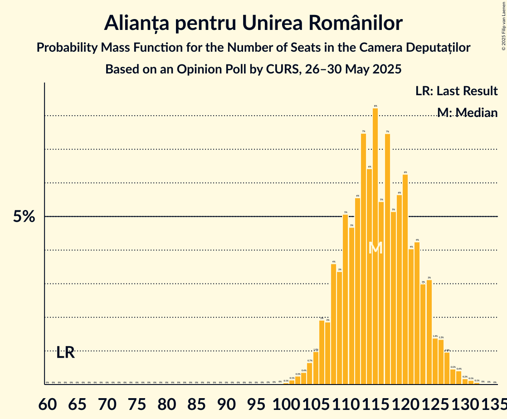
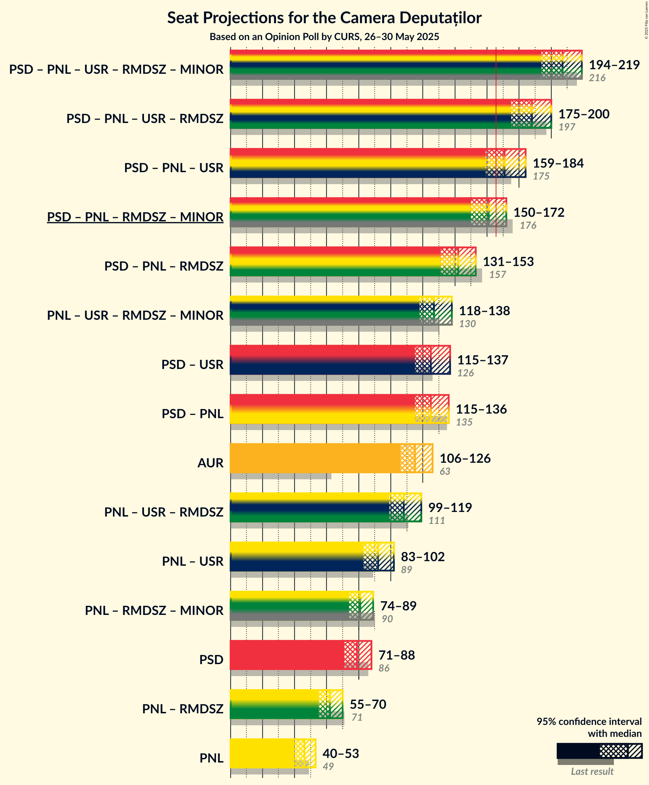
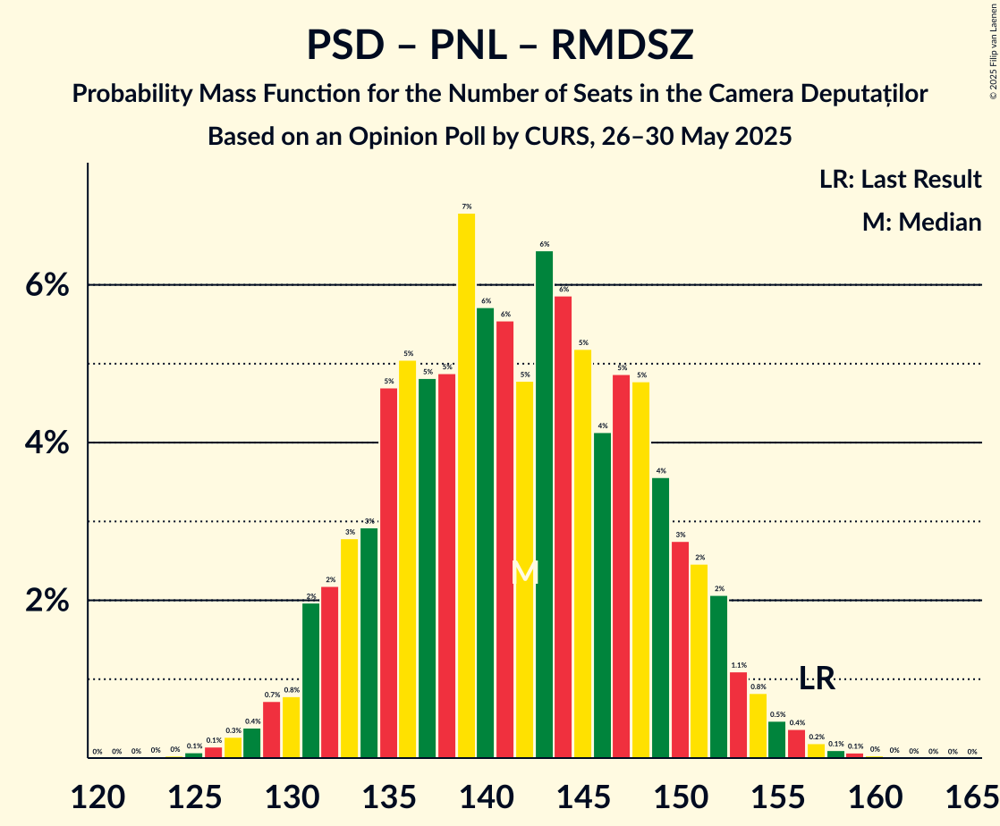

# Opinion Poll by CURS, 26–30 May 2025

<a href="#voting-intentions">Voting Intentions</a> | <a href="#seats">Seats</a> | <a href="#coalitions">Coalitions</a> | <a href="#technical-information">Technical Information</a>

## Voting Intentions

### Confidence Intervals

| Party | Last Result | Poll Result | 80% Confidence Interval | 90% Confidence Interval | 95% Confidence Interval | 99% Confidence Interval |
|:-----:|:-----------:|:-----------:|:-----------------------:|:-----------------------:|:-----------------------:|:-----------------------:|
| Alianța pentru Unirea Românilor | 18.0% | 35.0% | 33.3–36.7% |32.8–37.2% |32.4–37.6% |31.6–38.5% |
| Partidul Social Democrat | 22.0% | 24.0% | 22.5–25.6% |22.1–26.0% |21.7–26.4% |21.0–27.2% |
| Partidul Național Liberal | 13.2% | 14.0% | 12.8–15.3% |12.5–15.7% |12.2–16.0% |11.6–16.6% |
| Uniunea Salvați România | 12.4% | 14.0% | 12.8–15.3% |12.5–15.7% |12.2–16.0% |11.6–16.6% |
| Partidul S.O.S. România | 7.4% | 5.0% | 4.3–5.8% |4.1–6.1% |3.9–6.3% |3.6–6.8% |
| Romániai Magyar Demokrata Szövetség | 6.3% | 5.0% | 4.3–5.8% |4.1–6.1% |3.9–6.3% |3.6–6.8% |
| Partidul Oamenilor Tineri | 6.5% | 2.0% | 1.6–2.6% |1.5–2.8% |1.4–3.0% |1.2–3.3% |

*Note:* The poll result column reflects the actual value used in the calculations. Published results may vary slightly, and in addition be rounded to fewer digits.

## Seats

### Confidence Intervals

| Party | Last Result | Median | 80% Confidence Interval | 90% Confidence Interval | 95% Confidence Interval | 99% Confidence Interval |
|:-----:|:-----------:|:------:|:-----------------------:|:-----------------------:|:-----------------------:|:-----------------------:|
| <a href="#alianța-pentru-unirea-românilor">Alianța pentru Unirea Românilor</a> | 63 | 115 | 108–123 |107–124 |106–126 |103–129 |
| <a href="#partidul-social-democrat">Partidul Social Democrat</a> | 86 | 79 | 73–85 |72–87 |71–88 |69–91 |
| <a href="#partidul-național-liberal">Partidul Național Liberal</a> | 49 | 46 | 42–50 |40–52 |40–54 |38–55 |
| <a href="#uniunea-salvați-românia">Uniunea Salvați România</a> | 40 | 46 | 42–50 |41–52 |39–53 |38–55 |
| <a href="#partidul-s.o.s.-românia">Partidul S.O.S. România</a> | 28 | 16 | 0–19 |0–19 |0–20 |0–21 |
| <a href="#romániai-magyar-demokrata-szövetség">Romániai Magyar Demokrata Szövetség</a> | 22 | 16 | 14–19 |13–20 |12–21 |11–22 |
| <a href="#partidul-oamenilor-tineri">Partidul Oamenilor Tineri</a> | 24 | 0 | 0 |0 |0 |0 |

### Alianța pentru Unirea Românilor

*For a full overview of the results for this party, see the [Alianța pentru Unirea Românilor](party-alianțapentruunirearomânilor.html) page.*

| Number of Seats | Probability | Accumulated | Special Marks |
|:---------------:|:-----------:|:-----------:|:-------------:|
| 63 | 0% | 100% | Last Result |
| 64 | 0% | 100% |  |
| 65 | 0% | 100% |  |
| 66 | 0% | 100% |  |
| 67 | 0% | 100% |  |
| 68 | 0% | 100% |  |
| 69 | 0% | 100% |  |
| 70 | 0% | 100% |  |
| 71 | 0% | 100% |  |
| 72 | 0% | 100% |  |
| 73 | 0% | 100% |  |
| 74 | 0% | 100% |  |
| 75 | 0% | 100% |  |
| 76 | 0% | 100% |  |
| 77 | 0% | 100% |  |
| 78 | 0% | 100% |  |
| 79 | 0% | 100% |  |
| 80 | 0% | 100% |  |
| 81 | 0% | 100% |  |
| 82 | 0% | 100% |  |
| 83 | 0% | 100% |  |
| 84 | 0% | 100% |  |
| 85 | 0% | 100% |  |
| 86 | 0% | 100% |  |
| 87 | 0% | 100% |  |
| 88 | 0% | 100% |  |
| 89 | 0% | 100% |  |
| 90 | 0% | 100% |  |
| 91 | 0% | 100% |  |
| 92 | 0% | 100% |  |
| 93 | 0% | 100% |  |
| 94 | 0% | 100% |  |
| 95 | 0% | 100% |  |
| 96 | 0% | 100% |  |
| 97 | 0% | 100% |  |
| 98 | 0% | 100% |  |
| 99 | 0% | 100% |  |
| 100 | 0% | 99.9% |  |
| 101 | 0.2% | 99.9% |  |
| 102 | 0.2% | 99.7% |  |
| 103 | 0.4% | 99.5% |  |
| 104 | 0.6% | 99.1% |  |
| 105 | 1.0% | 98.6% |  |
| 106 | 2% | 98% |  |
| 107 | 2% | 96% |  |
| 108 | 4% | 94% |  |
| 109 | 3% | 90% |  |
| 110 | 5% | 86% |  |
| 111 | 4% | 81% |  |
| 112 | 5% | 77% |  |
| 113 | 8% | 72% |  |
| 114 | 8% | 64% |  |
| 115 | 9% | 56% | Median |
| 116 | 5% | 47% |  |
| 117 | 7% | 42% |  |
| 118 | 5% | 35% |  |
| 119 | 6% | 30% |  |
| 120 | 6% | 24% |  |
| 121 | 4% | 19% |  |
| 122 | 4% | 15% |  |
| 123 | 2% | 11% |  |
| 124 | 3% | 8% |  |
| 125 | 1.3% | 5% |  |
| 126 | 2% | 4% |  |
| 127 | 0.9% | 2% |  |
| 128 | 0.4% | 1.2% |  |
| 129 | 0.4% | 0.8% |  |
| 130 | 0.2% | 0.4% |  |
| 131 | 0.1% | 0.3% |  |
| 132 | 0% | 0.1% |  |
| 133 | 0% | 0.1% |  |
| 134 | 0% | 0% |  |

### Partidul Social Democrat

*For a full overview of the results for this party, see the [Partidul Social Democrat](party-partidulsocialdemocrat.html) page.*

| Number of Seats | Probability | Accumulated | Special Marks |
|:---------------:|:-----------:|:-----------:|:-------------:|
| 66 | 0.1% | 100% |  |
| 67 | 0.1% | 99.9% |  |
| 68 | 0.2% | 99.8% |  |
| 69 | 0.6% | 99.5% |  |
| 70 | 1.0% | 98.9% |  |
| 71 | 2% | 98% |  |
| 72 | 2% | 96% |  |
| 73 | 5% | 94% |  |
| 74 | 3% | 89% |  |
| 75 | 7% | 86% |  |
| 76 | 8% | 79% |  |
| 77 | 6% | 71% |  |
| 78 | 9% | 65% |  |
| 79 | 8% | 55% | Median |
| 80 | 10% | 48% |  |
| 81 | 7% | 38% |  |
| 82 | 6% | 31% |  |
| 83 | 7% | 26% |  |
| 84 | 5% | 18% |  |
| 85 | 4% | 13% |  |
| 86 | 2% | 9% | Last Result |
| 87 | 2% | 7% |  |
| 88 | 2% | 5% |  |
| 89 | 0.9% | 2% |  |
| 90 | 0.6% | 1.5% |  |
| 91 | 0.4% | 0.9% |  |
| 92 | 0.2% | 0.4% |  |
| 93 | 0.1% | 0.2% |  |
| 94 | 0.1% | 0.1% |  |
| 95 | 0% | 0.1% |  |
| 96 | 0% | 0% |  |

### Partidul Național Liberal

*For a full overview of the results for this party, see the [Partidul Național Liberal](party-partidulnaționalliberal.html) page.*

| Number of Seats | Probability | Accumulated | Special Marks |
|:---------------:|:-----------:|:-----------:|:-------------:|
| 35 | 0% | 100% |  |
| 36 | 0.1% | 99.9% |  |
| 37 | 0.1% | 99.9% |  |
| 38 | 0.5% | 99.8% |  |
| 39 | 1.4% | 99.3% |  |
| 40 | 3% | 98% |  |
| 41 | 3% | 95% |  |
| 42 | 6% | 92% |  |
| 43 | 11% | 85% |  |
| 44 | 11% | 74% |  |
| 45 | 10% | 64% |  |
| 46 | 10% | 53% | Median |
| 47 | 10% | 44% |  |
| 48 | 9% | 33% |  |
| 49 | 9% | 24% | Last Result |
| 50 | 6% | 15% |  |
| 51 | 4% | 9% |  |
| 52 | 1.4% | 6% |  |
| 53 | 2% | 4% |  |
| 54 | 1.2% | 3% |  |
| 55 | 0.9% | 1.3% |  |
| 56 | 0.2% | 0.4% |  |
| 57 | 0.1% | 0.2% |  |
| 58 | 0.1% | 0.1% |  |
| 59 | 0% | 0% |  |

### Uniunea Salvați România

*For a full overview of the results for this party, see the [Uniunea Salvați România](party-uniuneasalvațiromânia.html) page.*

| Number of Seats | Probability | Accumulated | Special Marks |
|:---------------:|:-----------:|:-----------:|:-------------:|
| 36 | 0.1% | 100% |  |
| 37 | 0.2% | 99.8% |  |
| 38 | 0.7% | 99.7% |  |
| 39 | 2% | 98.9% |  |
| 40 | 2% | 97% | Last Result |
| 41 | 4% | 96% |  |
| 42 | 7% | 92% |  |
| 43 | 10% | 85% |  |
| 44 | 8% | 75% |  |
| 45 | 11% | 67% |  |
| 46 | 14% | 56% | Median |
| 47 | 11% | 43% |  |
| 48 | 8% | 32% |  |
| 49 | 8% | 24% |  |
| 50 | 6% | 15% |  |
| 51 | 4% | 10% |  |
| 52 | 3% | 6% |  |
| 53 | 2% | 3% |  |
| 54 | 0.8% | 2% |  |
| 55 | 0.5% | 1.0% |  |
| 56 | 0.3% | 0.5% |  |
| 57 | 0.1% | 0.2% |  |
| 58 | 0% | 0.1% |  |
| 59 | 0% | 0% |  |

### Partidul S.O.S. România

*For a full overview of the results for this party, see the [Partidul S.O.S. România](party-partidulsosromânia.html) page.*

| Number of Seats | Probability | Accumulated | Special Marks |
|:---------------:|:-----------:|:-----------:|:-------------:|
| 0 | 49% | 100% |  |
| 1 | 0% | 51% |  |
| 2 | 0% | 51% |  |
| 3 | 0% | 51% |  |
| 4 | 0% | 51% |  |
| 5 | 0% | 51% |  |
| 6 | 0% | 51% |  |
| 7 | 0% | 51% |  |
| 8 | 0% | 51% |  |
| 9 | 0% | 51% |  |
| 10 | 0% | 51% |  |
| 11 | 0% | 51% |  |
| 12 | 0% | 51% |  |
| 13 | 0% | 51% |  |
| 14 | 0% | 51% |  |
| 15 | 0% | 51% |  |
| 16 | 13% | 51% | Median |
| 17 | 19% | 38% |  |
| 18 | 9% | 19% |  |
| 19 | 7% | 10% |  |
| 20 | 3% | 4% |  |
| 21 | 0.7% | 1.1% |  |
| 22 | 0.4% | 0.5% |  |
| 23 | 0.1% | 0.1% |  |
| 24 | 0% | 0% |  |
| 25 | 0% | 0% |  |
| 26 | 0% | 0% |  |
| 27 | 0% | 0% |  |
| 28 | 0% | 0% | Last Result |

### Romániai Magyar Demokrata Szövetség

*For a full overview of the results for this party, see the [Romániai Magyar Demokrata Szövetség](party-romániaimagyardemokrataszövetség.html) page.*

| Number of Seats | Probability | Accumulated | Special Marks |
|:---------------:|:-----------:|:-----------:|:-------------:|
| 10 | 0.1% | 100% |  |
| 11 | 0.4% | 99.9% |  |
| 12 | 2% | 99.5% |  |
| 13 | 6% | 97% |  |
| 14 | 11% | 91% |  |
| 15 | 18% | 79% |  |
| 16 | 21% | 62% | Median |
| 17 | 15% | 40% |  |
| 18 | 12% | 26% |  |
| 19 | 7% | 13% |  |
| 20 | 4% | 6% |  |
| 21 | 2% | 3% |  |
| 22 | 0.5% | 0.7% | Last Result |
| 23 | 0.2% | 0.3% |  |
| 24 | 0.1% | 0.1% |  |
| 25 | 0% | 0% |  |

### Partidul Oamenilor Tineri

*For a full overview of the results for this party, see the [Partidul Oamenilor Tineri](party-partiduloamenilortineri.html) page.*

| Number of Seats | Probability | Accumulated | Special Marks |
|:---------------:|:-----------:|:-----------:|:-------------:|
| 0 | 100% | 100% | Median |
| 1 | 0% | 0% |  |
| 2 | 0% | 0% |  |
| 3 | 0% | 0% |  |
| 4 | 0% | 0% |  |
| 5 | 0% | 0% |  |
| 6 | 0% | 0% |  |
| 7 | 0% | 0% |  |
| 8 | 0% | 0% |  |
| 9 | 0% | 0% |  |
| 10 | 0% | 0% |  |
| 11 | 0% | 0% |  |
| 12 | 0% | 0% |  |
| 13 | 0% | 0% |  |
| 14 | 0% | 0% |  |
| 15 | 0% | 0% |  |
| 16 | 0% | 0% |  |
| 17 | 0% | 0% |  |
| 18 | 0% | 0% |  |
| 19 | 0% | 0% |  |
| 20 | 0% | 0% |  |
| 21 | 0% | 0% |  |
| 22 | 0% | 0% |  |
| 23 | 0% | 0% |  |
| 24 | 0% | 0% | Last Result |

## Coalitions

### Confidence Intervals

| Coalition | Last Result | Median | Majority? | 80% Confidence Interval | 90% Confidence Interval | 95% Confidence Interval | 99% Confidence Interval |
|:---------:|:-----------:|:------:|:---------:|:-----------------------:|:-----------------------:|:-----------------------:|:-----------------------:|
| Partidul Social Democrat – Partidul Național Liberal – Uniunea Salvați România – Romániai Magyar Demokrata Szövetség | 197 | 187 | 100% | 178–197 | 177–199 | 175–200 | 172–203 |
| Partidul Social Democrat – Partidul Național Liberal – Uniunea Salvați România | 175 | 171 | 79% | 163–181 | 161–182 | 159–184 | 156–187 |
| Partidul Social Democrat – Partidul Național Liberal – Romániai Magyar Demokrata Szövetség | 157 | 141 | 0% | 133–150 | 132–152 | 130–153 | 127–156 |
| Partidul Social Democrat – Uniunea Salvați România | 126 | 125 | 0% | 118–133 | 116–135 | 115–137 | 112–140 |
| Partidul Social Democrat – Partidul Național Liberal | 135 | 125 | 0% | 118–133 | 116–135 | 115–136 | 112–140 |
| Alianța pentru Unirea Românilor | 63 | 115 | 0% | 108–123 | 107–124 | 106–126 | 103–129 |
| Partidul Național Liberal – Uniunea Salvați România – Romániai Magyar Demokrata Szövetség | 111 | 108 | 0% | 102–116 | 100–118 | 99–119 | 96–122 |
| Partidul Național Liberal – Uniunea Salvați România | 89 | 92 | 0% | 86–99 | 85–101 | 83–102 | 81–105 |
| Partidul Social Democrat | 86 | 79 | 0% | 73–85 | 72–87 | 71–88 | 69–91 |
| Partidul Național Liberal – Romániai Magyar Demokrata Szövetség | 71 | 62 | 0% | 57–68 | 56–69 | 55–71 | 53–73 |
| Partidul Național Liberal | 49 | 46 | 0% | 42–50 | 40–52 | 40–54 | 38–55 |

### Partidul Social Democrat – Partidul Național Liberal – Uniunea Salvați România – Romániai Magyar Demokrata Szövetség

| Number of Seats | Probability | Accumulated | Special Marks |
|:---------------:|:-----------:|:-----------:|:-------------:|
| 169 | 0% | 100% |  |
| 170 | 0.1% | 99.9% |  |
| 171 | 0.1% | 99.8% |  |
| 172 | 0.2% | 99.7% |  |
| 173 | 0.4% | 99.5% |  |
| 174 | 1.0% | 99.1% |  |
| 175 | 1.1% | 98% |  |
| 176 | 1.4% | 97% |  |
| 177 | 2% | 96% |  |
| 178 | 4% | 93% |  |
| 179 | 3% | 90% |  |
| 180 | 4% | 87% |  |
| 181 | 6% | 83% |  |
| 182 | 5% | 77% |  |
| 183 | 5% | 72% |  |
| 184 | 4% | 66% |  |
| 185 | 5% | 63% |  |
| 186 | 5% | 57% |  |
| 187 | 3% | 53% | Median |
| 188 | 5% | 49% |  |
| 189 | 4% | 44% |  |
| 190 | 5% | 41% |  |
| 191 | 4% | 36% |  |
| 192 | 5% | 32% |  |
| 193 | 4% | 27% |  |
| 194 | 3% | 23% |  |
| 195 | 4% | 20% |  |
| 196 | 2% | 15% |  |
| 197 | 4% | 13% | Last Result |
| 198 | 2% | 8% |  |
| 199 | 2% | 6% |  |
| 200 | 1.4% | 4% |  |
| 201 | 0.9% | 2% |  |
| 202 | 0.6% | 1.4% |  |
| 203 | 0.3% | 0.8% |  |
| 204 | 0.2% | 0.5% |  |
| 205 | 0.1% | 0.2% |  |
| 206 | 0.1% | 0.1% |  |
| 207 | 0% | 0% |  |

### Partidul Social Democrat – Partidul Național Liberal – Uniunea Salvați România

| Number of Seats | Probability | Accumulated | Special Marks |
|:---------------:|:-----------:|:-----------:|:-------------:|
| 153 | 0% | 100% |  |
| 154 | 0.1% | 99.9% |  |
| 155 | 0.1% | 99.9% |  |
| 156 | 0.2% | 99.7% |  |
| 157 | 0.4% | 99.5% |  |
| 158 | 0.9% | 99.1% |  |
| 159 | 0.8% | 98% |  |
| 160 | 2% | 97% |  |
| 161 | 2% | 96% |  |
| 162 | 3% | 94% |  |
| 163 | 3% | 90% |  |
| 164 | 3% | 88% |  |
| 165 | 6% | 84% |  |
| 166 | 5% | 79% | Majority |
| 167 | 6% | 74% |  |
| 168 | 6% | 68% |  |
| 169 | 4% | 62% |  |
| 170 | 6% | 59% |  |
| 171 | 6% | 53% | Median |
| 172 | 4% | 48% |  |
| 173 | 5% | 43% |  |
| 174 | 6% | 39% |  |
| 175 | 4% | 33% | Last Result |
| 176 | 4% | 29% |  |
| 177 | 5% | 25% |  |
| 178 | 4% | 20% |  |
| 179 | 3% | 16% |  |
| 180 | 2% | 13% |  |
| 181 | 4% | 10% |  |
| 182 | 2% | 7% |  |
| 183 | 2% | 4% |  |
| 184 | 1.1% | 3% |  |
| 185 | 0.7% | 2% |  |
| 186 | 0.4% | 1.1% |  |
| 187 | 0.4% | 0.7% |  |
| 188 | 0.1% | 0.3% |  |
| 189 | 0.1% | 0.2% |  |
| 190 | 0% | 0.1% |  |
| 191 | 0% | 0% |  |

### Partidul Social Democrat – Partidul Național Liberal – Romániai Magyar Demokrata Szövetség

| Number of Seats | Probability | Accumulated | Special Marks |
|:---------------:|:-----------:|:-----------:|:-------------:|
| 124 | 0% | 100% |  |
| 125 | 0.1% | 99.9% |  |
| 126 | 0.1% | 99.9% |  |
| 127 | 0.3% | 99.7% |  |
| 128 | 0.4% | 99.4% |  |
| 129 | 0.9% | 99.1% |  |
| 130 | 0.7% | 98% |  |
| 131 | 2% | 97% |  |
| 132 | 2% | 95% |  |
| 133 | 4% | 94% |  |
| 134 | 3% | 90% |  |
| 135 | 5% | 87% |  |
| 136 | 5% | 82% |  |
| 137 | 6% | 77% |  |
| 138 | 5% | 71% |  |
| 139 | 7% | 66% |  |
| 140 | 5% | 59% |  |
| 141 | 6% | 55% | Median |
| 142 | 5% | 48% |  |
| 143 | 5% | 43% |  |
| 144 | 5% | 38% |  |
| 145 | 5% | 33% |  |
| 146 | 4% | 27% |  |
| 147 | 5% | 23% |  |
| 148 | 4% | 19% |  |
| 149 | 4% | 15% |  |
| 150 | 3% | 11% |  |
| 151 | 2% | 8% |  |
| 152 | 2% | 5% |  |
| 153 | 1.1% | 3% |  |
| 154 | 0.8% | 2% |  |
| 155 | 0.5% | 1.3% |  |
| 156 | 0.3% | 0.8% |  |
| 157 | 0.2% | 0.4% | Last Result |
| 158 | 0.1% | 0.2% |  |
| 159 | 0.1% | 0.1% |  |
| 160 | 0% | 0.1% |  |
| 161 | 0% | 0% |  |

### Partidul Social Democrat – Uniunea Salvați România

| Number of Seats | Probability | Accumulated | Special Marks |
|:---------------:|:-----------:|:-----------:|:-------------:|
| 109 | 0.1% | 100% |  |
| 110 | 0.1% | 99.9% |  |
| 111 | 0.2% | 99.8% |  |
| 112 | 0.4% | 99.6% |  |
| 113 | 0.5% | 99.3% |  |
| 114 | 1.0% | 98.7% |  |
| 115 | 1.3% | 98% |  |
| 116 | 2% | 96% |  |
| 117 | 3% | 95% |  |
| 118 | 4% | 92% |  |
| 119 | 4% | 88% |  |
| 120 | 5% | 84% |  |
| 121 | 6% | 79% |  |
| 122 | 5% | 73% |  |
| 123 | 7% | 68% |  |
| 124 | 6% | 61% |  |
| 125 | 6% | 55% | Median |
| 126 | 7% | 49% | Last Result |
| 127 | 7% | 42% |  |
| 128 | 5% | 35% |  |
| 129 | 5% | 29% |  |
| 130 | 5% | 24% |  |
| 131 | 4% | 19% |  |
| 132 | 5% | 15% |  |
| 133 | 3% | 11% |  |
| 134 | 2% | 8% |  |
| 135 | 2% | 6% |  |
| 136 | 1.1% | 4% |  |
| 137 | 0.9% | 3% |  |
| 138 | 0.8% | 2% |  |
| 139 | 0.4% | 0.9% |  |
| 140 | 0.3% | 0.5% |  |
| 141 | 0.1% | 0.3% |  |
| 142 | 0.1% | 0.1% |  |
| 143 | 0% | 0.1% |  |
| 144 | 0% | 0% |  |

### Partidul Social Democrat – Partidul Național Liberal

| Number of Seats | Probability | Accumulated | Special Marks |
|:---------------:|:-----------:|:-----------:|:-------------:|
| 109 | 0.1% | 100% |  |
| 110 | 0.1% | 99.9% |  |
| 111 | 0.1% | 99.8% |  |
| 112 | 0.4% | 99.7% |  |
| 113 | 0.7% | 99.2% |  |
| 114 | 0.4% | 98.6% |  |
| 115 | 2% | 98% |  |
| 116 | 2% | 96% |  |
| 117 | 2% | 94% |  |
| 118 | 5% | 92% |  |
| 119 | 3% | 87% |  |
| 120 | 4% | 84% |  |
| 121 | 8% | 80% |  |
| 122 | 6% | 72% |  |
| 123 | 6% | 67% |  |
| 124 | 8% | 61% |  |
| 125 | 6% | 53% | Median |
| 126 | 5% | 47% |  |
| 127 | 7% | 42% |  |
| 128 | 4% | 35% |  |
| 129 | 5% | 31% |  |
| 130 | 6% | 25% |  |
| 131 | 2% | 19% |  |
| 132 | 6% | 17% |  |
| 133 | 3% | 11% |  |
| 134 | 4% | 9% |  |
| 135 | 2% | 5% | Last Result |
| 136 | 1.4% | 3% |  |
| 137 | 0.6% | 2% |  |
| 138 | 0.8% | 2% |  |
| 139 | 0.3% | 0.8% |  |
| 140 | 0.2% | 0.5% |  |
| 141 | 0.2% | 0.3% |  |
| 142 | 0.1% | 0.2% |  |
| 143 | 0% | 0.1% |  |
| 144 | 0% | 0% |  |

### Alianța pentru Unirea Românilor

| Number of Seats | Probability | Accumulated | Special Marks |
|:---------------:|:-----------:|:-----------:|:-------------:|
| 63 | 0% | 100% | Last Result |
| 64 | 0% | 100% |  |
| 65 | 0% | 100% |  |
| 66 | 0% | 100% |  |
| 67 | 0% | 100% |  |
| 68 | 0% | 100% |  |
| 69 | 0% | 100% |  |
| 70 | 0% | 100% |  |
| 71 | 0% | 100% |  |
| 72 | 0% | 100% |  |
| 73 | 0% | 100% |  |
| 74 | 0% | 100% |  |
| 75 | 0% | 100% |  |
| 76 | 0% | 100% |  |
| 77 | 0% | 100% |  |
| 78 | 0% | 100% |  |
| 79 | 0% | 100% |  |
| 80 | 0% | 100% |  |
| 81 | 0% | 100% |  |
| 82 | 0% | 100% |  |
| 83 | 0% | 100% |  |
| 84 | 0% | 100% |  |
| 85 | 0% | 100% |  |
| 86 | 0% | 100% |  |
| 87 | 0% | 100% |  |
| 88 | 0% | 100% |  |
| 89 | 0% | 100% |  |
| 90 | 0% | 100% |  |
| 91 | 0% | 100% |  |
| 92 | 0% | 100% |  |
| 93 | 0% | 100% |  |
| 94 | 0% | 100% |  |
| 95 | 0% | 100% |  |
| 96 | 0% | 100% |  |
| 97 | 0% | 100% |  |
| 98 | 0% | 100% |  |
| 99 | 0% | 100% |  |
| 100 | 0% | 99.9% |  |
| 101 | 0.2% | 99.9% |  |
| 102 | 0.2% | 99.7% |  |
| 103 | 0.4% | 99.5% |  |
| 104 | 0.6% | 99.1% |  |
| 105 | 1.0% | 98.6% |  |
| 106 | 2% | 98% |  |
| 107 | 2% | 96% |  |
| 108 | 4% | 94% |  |
| 109 | 3% | 90% |  |
| 110 | 5% | 86% |  |
| 111 | 4% | 81% |  |
| 112 | 5% | 77% |  |
| 113 | 8% | 72% |  |
| 114 | 8% | 64% |  |
| 115 | 9% | 56% | Median |
| 116 | 5% | 47% |  |
| 117 | 7% | 42% |  |
| 118 | 5% | 35% |  |
| 119 | 6% | 30% |  |
| 120 | 6% | 24% |  |
| 121 | 4% | 19% |  |
| 122 | 4% | 15% |  |
| 123 | 2% | 11% |  |
| 124 | 3% | 8% |  |
| 125 | 1.3% | 5% |  |
| 126 | 2% | 4% |  |
| 127 | 0.9% | 2% |  |
| 128 | 0.4% | 1.2% |  |
| 129 | 0.4% | 0.8% |  |
| 130 | 0.2% | 0.4% |  |
| 131 | 0.1% | 0.3% |  |
| 132 | 0% | 0.1% |  |
| 133 | 0% | 0.1% |  |
| 134 | 0% | 0% |  |

### Partidul Național Liberal – Uniunea Salvați România – Romániai Magyar Demokrata Szövetség

| Number of Seats | Probability | Accumulated | Special Marks |
|:---------------:|:-----------:|:-----------:|:-------------:|
| 93 | 0.1% | 100% |  |
| 94 | 0.1% | 99.9% |  |
| 95 | 0.3% | 99.8% |  |
| 96 | 0.4% | 99.6% |  |
| 97 | 0.5% | 99.1% |  |
| 98 | 0.8% | 98.6% |  |
| 99 | 1.4% | 98% |  |
| 100 | 2% | 96% |  |
| 101 | 3% | 95% |  |
| 102 | 5% | 92% |  |
| 103 | 7% | 87% |  |
| 104 | 5% | 80% |  |
| 105 | 9% | 74% |  |
| 106 | 7% | 66% |  |
| 107 | 8% | 58% |  |
| 108 | 7% | 51% | Median |
| 109 | 7% | 44% |  |
| 110 | 5% | 38% |  |
| 111 | 5% | 32% | Last Result |
| 112 | 4% | 27% |  |
| 113 | 5% | 23% |  |
| 114 | 5% | 18% |  |
| 115 | 2% | 13% |  |
| 116 | 4% | 11% |  |
| 117 | 2% | 7% |  |
| 118 | 2% | 5% |  |
| 119 | 1.2% | 3% |  |
| 120 | 0.8% | 2% |  |
| 121 | 0.5% | 1.2% |  |
| 122 | 0.4% | 0.8% |  |
| 123 | 0.2% | 0.4% |  |
| 124 | 0.1% | 0.2% |  |
| 125 | 0% | 0.1% |  |
| 126 | 0% | 0% |  |

### Partidul Național Liberal – Uniunea Salvați România

| Number of Seats | Probability | Accumulated | Special Marks |
|:---------------:|:-----------:|:-----------:|:-------------:|
| 77 | 0% | 100% |  |
| 78 | 0.1% | 99.9% |  |
| 79 | 0.1% | 99.9% |  |
| 80 | 0.3% | 99.8% |  |
| 81 | 0.6% | 99.5% |  |
| 82 | 1.0% | 99.0% |  |
| 83 | 0.7% | 98% |  |
| 84 | 2% | 97% |  |
| 85 | 3% | 95% |  |
| 86 | 4% | 92% |  |
| 87 | 8% | 89% |  |
| 88 | 5% | 81% |  |
| 89 | 9% | 76% | Last Result |
| 90 | 8% | 67% |  |
| 91 | 8% | 59% |  |
| 92 | 7% | 51% | Median |
| 93 | 8% | 44% |  |
| 94 | 6% | 36% |  |
| 95 | 7% | 30% |  |
| 96 | 3% | 22% |  |
| 97 | 4% | 19% |  |
| 98 | 5% | 15% |  |
| 99 | 3% | 10% |  |
| 100 | 2% | 7% |  |
| 101 | 2% | 5% |  |
| 102 | 2% | 3% |  |
| 103 | 0.6% | 2% |  |
| 104 | 0.5% | 1.3% |  |
| 105 | 0.3% | 0.8% |  |
| 106 | 0.2% | 0.5% |  |
| 107 | 0.1% | 0.2% |  |
| 108 | 0% | 0.1% |  |
| 109 | 0% | 0% |  |

### Partidul Social Democrat

| Number of Seats | Probability | Accumulated | Special Marks |
|:---------------:|:-----------:|:-----------:|:-------------:|
| 66 | 0.1% | 100% |  |
| 67 | 0.1% | 99.9% |  |
| 68 | 0.2% | 99.8% |  |
| 69 | 0.6% | 99.5% |  |
| 70 | 1.0% | 98.9% |  |
| 71 | 2% | 98% |  |
| 72 | 2% | 96% |  |
| 73 | 5% | 94% |  |
| 74 | 3% | 89% |  |
| 75 | 7% | 86% |  |
| 76 | 8% | 79% |  |
| 77 | 6% | 71% |  |
| 78 | 9% | 65% |  |
| 79 | 8% | 55% | Median |
| 80 | 10% | 48% |  |
| 81 | 7% | 38% |  |
| 82 | 6% | 31% |  |
| 83 | 7% | 26% |  |
| 84 | 5% | 18% |  |
| 85 | 4% | 13% |  |
| 86 | 2% | 9% | Last Result |
| 87 | 2% | 7% |  |
| 88 | 2% | 5% |  |
| 89 | 0.9% | 2% |  |
| 90 | 0.6% | 1.5% |  |
| 91 | 0.4% | 0.9% |  |
| 92 | 0.2% | 0.4% |  |
| 93 | 0.1% | 0.2% |  |
| 94 | 0.1% | 0.1% |  |
| 95 | 0% | 0.1% |  |
| 96 | 0% | 0% |  |

### Partidul Național Liberal – Romániai Magyar Demokrata Szövetség

| Number of Seats | Probability | Accumulated | Special Marks |
|:---------------:|:-----------:|:-----------:|:-------------:|
| 50 | 0% | 100% |  |
| 51 | 0.1% | 99.9% |  |
| 52 | 0.2% | 99.8% |  |
| 53 | 0.5% | 99.6% |  |
| 54 | 1.0% | 99.0% |  |
| 55 | 2% | 98% |  |
| 56 | 3% | 96% |  |
| 57 | 5% | 93% |  |
| 58 | 7% | 88% |  |
| 59 | 9% | 81% |  |
| 60 | 10% | 73% |  |
| 61 | 9% | 63% |  |
| 62 | 9% | 53% | Median |
| 63 | 9% | 45% |  |
| 64 | 7% | 35% |  |
| 65 | 7% | 28% |  |
| 66 | 6% | 21% |  |
| 67 | 5% | 15% |  |
| 68 | 4% | 11% |  |
| 69 | 2% | 7% |  |
| 70 | 2% | 4% |  |
| 71 | 1.4% | 3% | Last Result |
| 72 | 0.6% | 1.4% |  |
| 73 | 0.4% | 0.8% |  |
| 74 | 0.2% | 0.4% |  |
| 75 | 0.1% | 0.2% |  |
| 76 | 0% | 0.1% |  |
| 77 | 0% | 0% |  |

### Partidul Național Liberal

| Number of Seats | Probability | Accumulated | Special Marks |
|:---------------:|:-----------:|:-----------:|:-------------:|
| 35 | 0% | 100% |  |
| 36 | 0.1% | 99.9% |  |
| 37 | 0.1% | 99.9% |  |
| 38 | 0.5% | 99.8% |  |
| 39 | 1.4% | 99.3% |  |
| 40 | 3% | 98% |  |
| 41 | 3% | 95% |  |
| 42 | 6% | 92% |  |
| 43 | 11% | 85% |  |
| 44 | 11% | 74% |  |
| 45 | 10% | 64% |  |
| 46 | 10% | 53% | Median |
| 47 | 10% | 44% |  |
| 48 | 9% | 33% |  |
| 49 | 9% | 24% | Last Result |
| 50 | 6% | 15% |  |
| 51 | 4% | 9% |  |
| 52 | 1.4% | 6% |  |
| 53 | 2% | 4% |  |
| 54 | 1.2% | 3% |  |
| 55 | 0.9% | 1.3% |  |
| 56 | 0.2% | 0.4% |  |
| 57 | 0.1% | 0.2% |  |
| 58 | 0.1% | 0.1% |  |
| 59 | 0% | 0% |  |

## Technical Information

### Opinion Poll

+ **Polling firm:** CURS
+ **Commissioner(s):** —
+ **Fieldwork period:** 26–30 May 2025

### Calculations

+ **Sample size:** 1287
+ **Simulations done:** 1,048,576
+ **Error estimate:** 1.42%

