# Opinion Poll by FlashData, 10–12 July 2025

<a href="#voting-intentions">Voting Intentions</a> | <a href="#seats">Seats</a> | <a href="#coalitions">Coalitions</a> | <a href="#technical-information">Technical Information</a>

## Voting Intentions

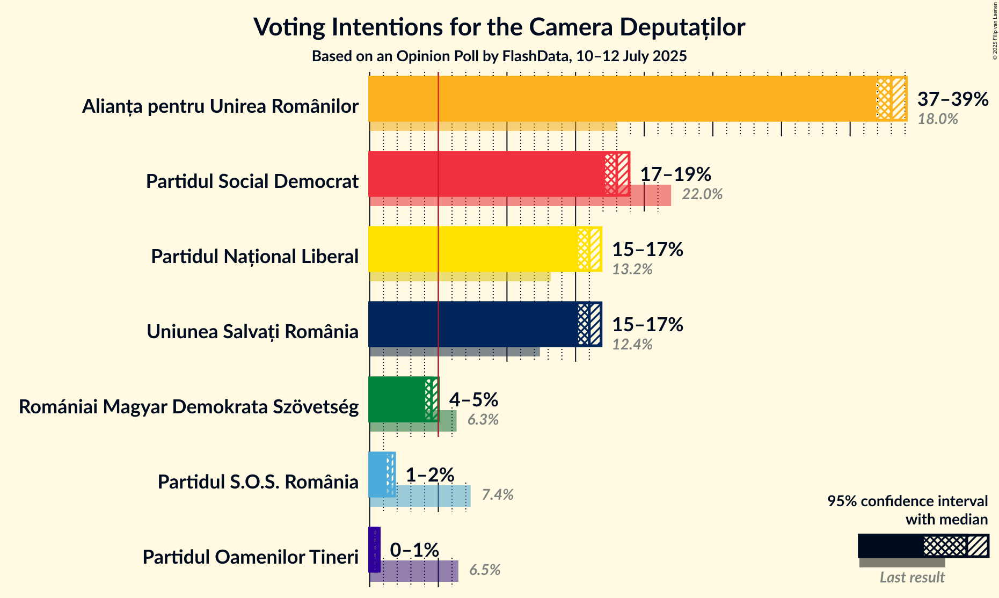

### Confidence Intervals

| Party | Last Result | Poll Result | 80% Confidence Interval | 90% Confidence Interval | 95% Confidence Interval | 99% Confidence Interval |
|:-----:|:-----------:|:-----------:|:-----------------------:|:-----------------------:|:-----------------------:|:-----------------------:|
| Alianța pentru Unirea Românilor | 18.0% | 38.0% | 37.3–38.7% |37.1–38.9% |36.9–39.1% |36.6–39.5% |
| Partidul Social Democrat | 22.0% | 18.0% | 17.4–18.6% |17.3–18.7% |17.1–18.9% |16.9–19.2% |
| Partidul Național Liberal | 13.2% | 16.0% | 15.5–16.6% |15.3–16.7% |15.2–16.9% |14.9–17.1% |
| Uniunea Salvați România | 12.4% | 16.0% | 15.5–16.6% |15.3–16.7% |15.2–16.9% |14.9–17.1% |
| Romániai Magyar Demokrata Szövetség | 6.3% | 4.5% | 4.2–4.8% |4.1–4.9% |4.1–5.0% |3.9–5.2% |
| Partidul S.O.S. România | 7.4% | 1.5% | 1.3–1.7% |1.3–1.8% |1.2–1.8% |1.2–1.9% |
| Partidul Oamenilor Tineri | 6.5% | 0.5% | 0.4–0.6% |0.4–0.7% |0.4–0.7% |0.3–0.8% |

*Note:* The poll result column reflects the actual value used in the calculations. Published results may vary slightly, and in addition be rounded to fewer digits.

## Seats

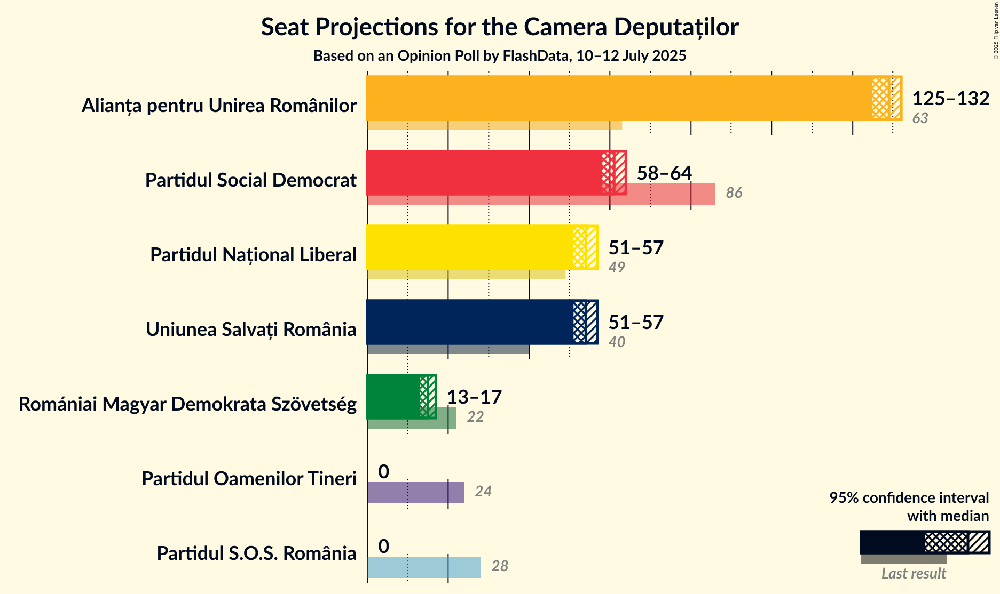

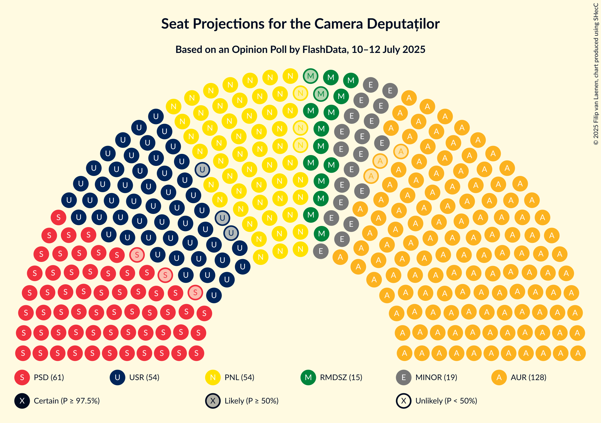

### Confidence Intervals

| Party | Last Result | Median | 80% Confidence Interval | 90% Confidence Interval | 95% Confidence Interval | 99% Confidence Interval |
|:-----:|:-----------:|:------:|:-----------------------:|:-----------------------:|:-----------------------:|:-----------------------:|
| <a href="#alianța-pentru-unirea-românilor">Alianța pentru Unirea Românilor</a> | 63 | 129 | 126–131 |126–132 |125–132 |124–134 |
| <a href="#partidul-social-democrat">Partidul Social Democrat</a> | 86 | 61 | 59–63 |58–63 |58–64 |57–65 |
| <a href="#partidul-național-liberal">Partidul Național Liberal</a> | 49 | 54 | 52–56 |52–56 |51–57 |50–58 |
| <a href="#uniunea-salvați-românia">Uniunea Salvați România</a> | 40 | 54 | 52–56 |51–56 |51–57 |50–58 |
| <a href="#romániai-magyar-demokrata-szövetség">Romániai Magyar Demokrata Szövetség</a> | 22 | 15 | 14–16 |14–16 |13–17 |13–17 |
| <a href="#partidul-s.o.s.-românia">Partidul S.O.S. România</a> | 28 | 0 | 0 |0 |0 |0 |
| <a href="#partidul-oamenilor-tineri">Partidul Oamenilor Tineri</a> | 24 | 0 | 0 |0 |0 |0 |

### Alianța pentru Unirea Românilor

*For a full overview of the results for this party, see the [Alianța pentru Unirea Românilor](party-alianțapentruunirearomânilor.html) page.*

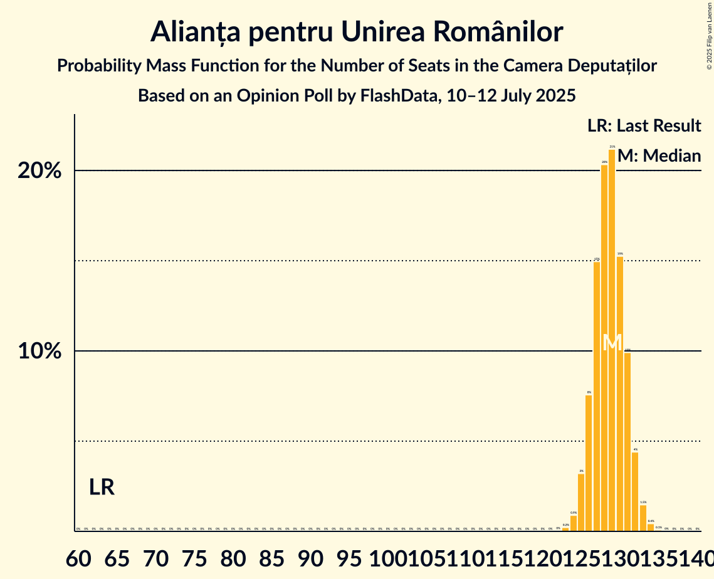

| Number of Seats | Probability | Accumulated | Special Marks |
|:---------------:|:-----------:|:-----------:|:-------------:|
| 63 | 0% | 100% | Last Result |
| 64 | 0% | 100% |  |
| 65 | 0% | 100% |  |
| 66 | 0% | 100% |  |
| 67 | 0% | 100% |  |
| 68 | 0% | 100% |  |
| 69 | 0% | 100% |  |
| 70 | 0% | 100% |  |
| 71 | 0% | 100% |  |
| 72 | 0% | 100% |  |
| 73 | 0% | 100% |  |
| 74 | 0% | 100% |  |
| 75 | 0% | 100% |  |
| 76 | 0% | 100% |  |
| 77 | 0% | 100% |  |
| 78 | 0% | 100% |  |
| 79 | 0% | 100% |  |
| 80 | 0% | 100% |  |
| 81 | 0% | 100% |  |
| 82 | 0% | 100% |  |
| 83 | 0% | 100% |  |
| 84 | 0% | 100% |  |
| 85 | 0% | 100% |  |
| 86 | 0% | 100% |  |
| 87 | 0% | 100% |  |
| 88 | 0% | 100% |  |
| 89 | 0% | 100% |  |
| 90 | 0% | 100% |  |
| 91 | 0% | 100% |  |
| 92 | 0% | 100% |  |
| 93 | 0% | 100% |  |
| 94 | 0% | 100% |  |
| 95 | 0% | 100% |  |
| 96 | 0% | 100% |  |
| 97 | 0% | 100% |  |
| 98 | 0% | 100% |  |
| 99 | 0% | 100% |  |
| 100 | 0% | 100% |  |
| 101 | 0% | 100% |  |
| 102 | 0% | 100% |  |
| 103 | 0% | 100% |  |
| 104 | 0% | 100% |  |
| 105 | 0% | 100% |  |
| 106 | 0% | 100% |  |
| 107 | 0% | 100% |  |
| 108 | 0% | 100% |  |
| 109 | 0% | 100% |  |
| 110 | 0% | 100% |  |
| 111 | 0% | 100% |  |
| 112 | 0% | 100% |  |
| 113 | 0% | 100% |  |
| 114 | 0% | 100% |  |
| 115 | 0% | 100% |  |
| 116 | 0% | 100% |  |
| 117 | 0% | 100% |  |
| 118 | 0% | 100% |  |
| 119 | 0% | 100% |  |
| 120 | 0% | 100% |  |
| 121 | 0% | 100% |  |
| 122 | 0% | 100% |  |
| 123 | 0.2% | 100% |  |
| 124 | 0.9% | 99.7% |  |
| 125 | 3% | 98.8% |  |
| 126 | 8% | 96% |  |
| 127 | 15% | 88% |  |
| 128 | 20% | 73% |  |
| 129 | 21% | 53% | Median |
| 130 | 15% | 32% |  |
| 131 | 10% | 16% |  |
| 132 | 4% | 6% |  |
| 133 | 1.5% | 2% |  |
| 134 | 0.4% | 0.5% |  |
| 135 | 0.1% | 0.1% |  |
| 136 | 0% | 0% |  |

### Partidul Social Democrat

*For a full overview of the results for this party, see the [Partidul Social Democrat](party-partidulsocialdemocrat.html) page.*

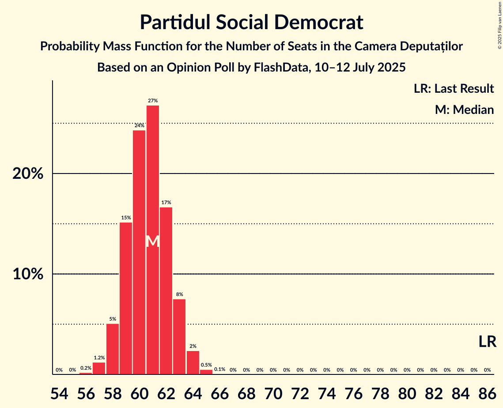

| Number of Seats | Probability | Accumulated | Special Marks |
|:---------------:|:-----------:|:-----------:|:-------------:|
| 56 | 0.2% | 100% |  |
| 57 | 1.2% | 99.8% |  |
| 58 | 5% | 98.6% |  |
| 59 | 15% | 93% |  |
| 60 | 24% | 78% |  |
| 61 | 27% | 54% | Median |
| 62 | 17% | 27% |  |
| 63 | 8% | 10% |  |
| 64 | 2% | 3% |  |
| 65 | 0.5% | 0.6% |  |
| 66 | 0.1% | 0.1% |  |
| 67 | 0% | 0% |  |
| 68 | 0% | 0% |  |
| 69 | 0% | 0% |  |
| 70 | 0% | 0% |  |
| 71 | 0% | 0% |  |
| 72 | 0% | 0% |  |
| 73 | 0% | 0% |  |
| 74 | 0% | 0% |  |
| 75 | 0% | 0% |  |
| 76 | 0% | 0% |  |
| 77 | 0% | 0% |  |
| 78 | 0% | 0% |  |
| 79 | 0% | 0% |  |
| 80 | 0% | 0% |  |
| 81 | 0% | 0% |  |
| 82 | 0% | 0% |  |
| 83 | 0% | 0% |  |
| 84 | 0% | 0% |  |
| 85 | 0% | 0% |  |
| 86 | 0% | 0% | Last Result |

### Partidul Național Liberal

*For a full overview of the results for this party, see the [Partidul Național Liberal](party-partidulnaționalliberal.html) page.*

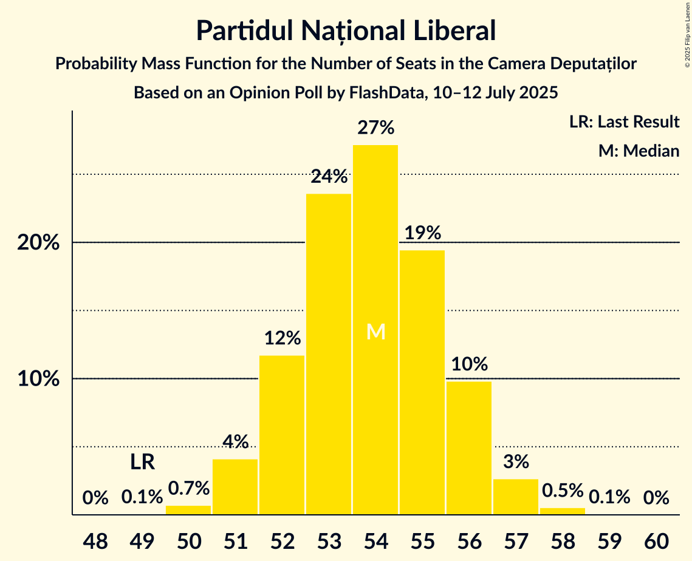

| Number of Seats | Probability | Accumulated | Special Marks |
|:---------------:|:-----------:|:-----------:|:-------------:|
| 49 | 0.1% | 100% | Last Result |
| 50 | 0.7% | 99.9% |  |
| 51 | 4% | 99.2% |  |
| 52 | 12% | 95% |  |
| 53 | 24% | 83% |  |
| 54 | 27% | 60% | Median |
| 55 | 19% | 33% |  |
| 56 | 10% | 13% |  |
| 57 | 3% | 3% |  |
| 58 | 0.5% | 0.6% |  |
| 59 | 0.1% | 0.1% |  |
| 60 | 0% | 0% |  |

### Uniunea Salvați România

*For a full overview of the results for this party, see the [Uniunea Salvați România](party-uniuneasalvațiromânia.html) page.*

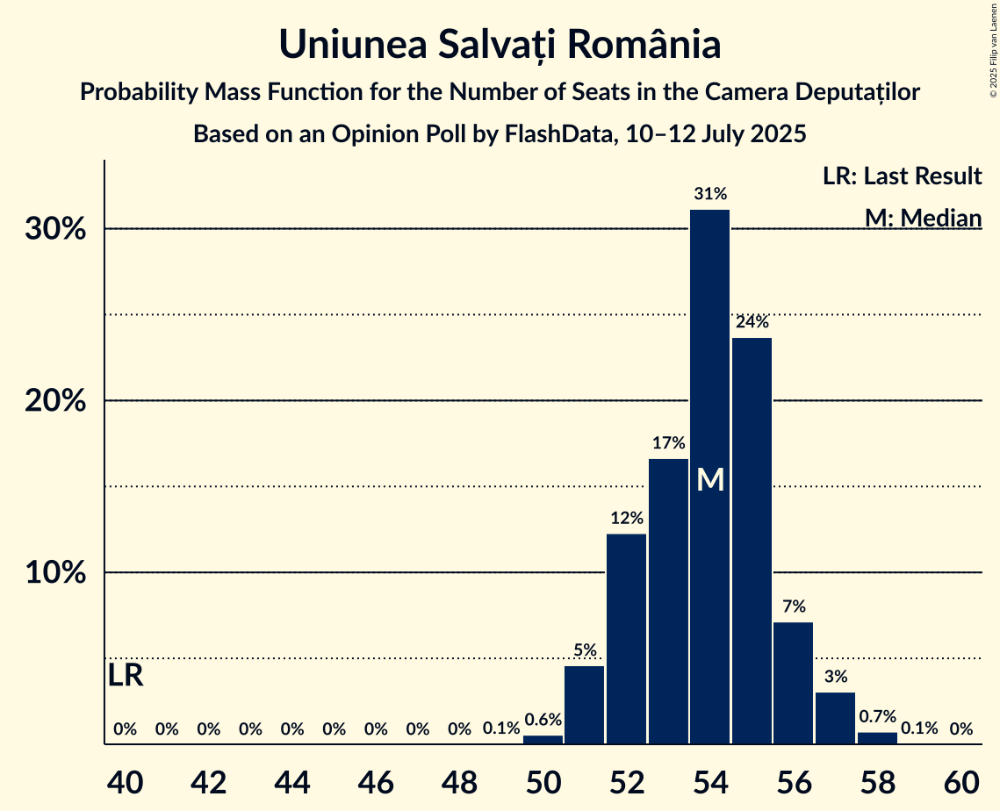

| Number of Seats | Probability | Accumulated | Special Marks |
|:---------------:|:-----------:|:-----------:|:-------------:|
| 40 | 0% | 100% | Last Result |
| 41 | 0% | 100% |  |
| 42 | 0% | 100% |  |
| 43 | 0% | 100% |  |
| 44 | 0% | 100% |  |
| 45 | 0% | 100% |  |
| 46 | 0% | 100% |  |
| 47 | 0% | 100% |  |
| 48 | 0% | 100% |  |
| 49 | 0.1% | 100% |  |
| 50 | 0.6% | 99.9% |  |
| 51 | 5% | 99.4% |  |
| 52 | 12% | 95% |  |
| 53 | 17% | 83% |  |
| 54 | 31% | 66% | Median |
| 55 | 24% | 35% |  |
| 56 | 7% | 11% |  |
| 57 | 3% | 4% |  |
| 58 | 0.7% | 0.8% |  |
| 59 | 0.1% | 0.1% |  |
| 60 | 0% | 0% |  |

### Romániai Magyar Demokrata Szövetség

*For a full overview of the results for this party, see the [Romániai Magyar Demokrata Szövetség](party-romániaimagyardemokrataszövetség.html) page.*

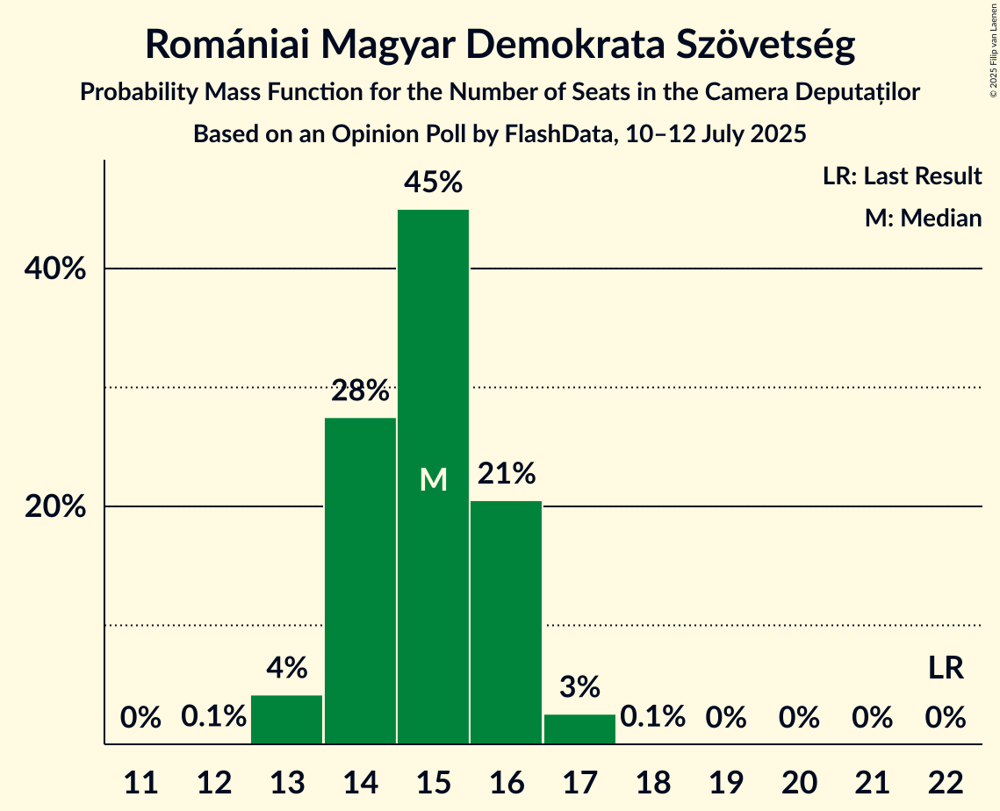

| Number of Seats | Probability | Accumulated | Special Marks |
|:---------------:|:-----------:|:-----------:|:-------------:|
| 12 | 0.1% | 100% |  |
| 13 | 4% | 99.9% |  |
| 14 | 28% | 96% |  |
| 15 | 45% | 68% | Median |
| 16 | 21% | 23% |  |
| 17 | 3% | 3% |  |
| 18 | 0.1% | 0.1% |  |
| 19 | 0% | 0% |  |
| 20 | 0% | 0% |  |
| 21 | 0% | 0% |  |
| 22 | 0% | 0% | Last Result |

### Partidul S.O.S. România

*For a full overview of the results for this party, see the [Partidul S.O.S. România](party-partidulsosromânia.html) page.*

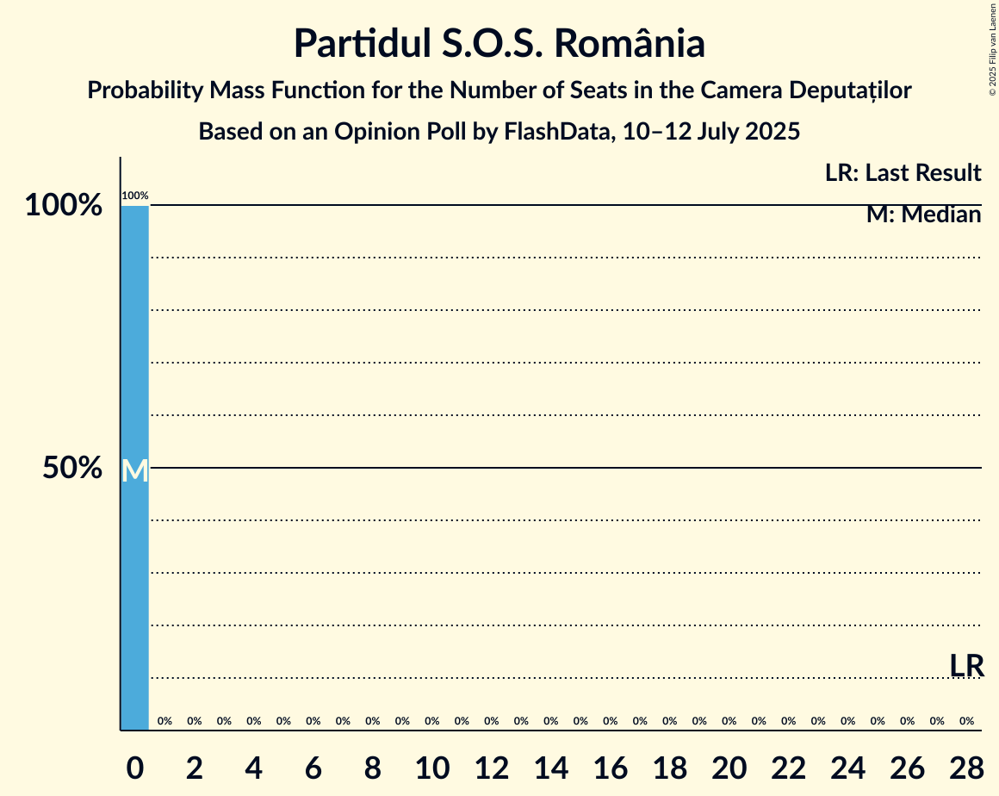

| Number of Seats | Probability | Accumulated | Special Marks |
|:---------------:|:-----------:|:-----------:|:-------------:|
| 0 | 100% | 100% | Median |
| 1 | 0% | 0% |  |
| 2 | 0% | 0% |  |
| 3 | 0% | 0% |  |
| 4 | 0% | 0% |  |
| 5 | 0% | 0% |  |
| 6 | 0% | 0% |  |
| 7 | 0% | 0% |  |
| 8 | 0% | 0% |  |
| 9 | 0% | 0% |  |
| 10 | 0% | 0% |  |
| 11 | 0% | 0% |  |
| 12 | 0% | 0% |  |
| 13 | 0% | 0% |  |
| 14 | 0% | 0% |  |
| 15 | 0% | 0% |  |
| 16 | 0% | 0% |  |
| 17 | 0% | 0% |  |
| 18 | 0% | 0% |  |
| 19 | 0% | 0% |  |
| 20 | 0% | 0% |  |
| 21 | 0% | 0% |  |
| 22 | 0% | 0% |  |
| 23 | 0% | 0% |  |
| 24 | 0% | 0% |  |
| 25 | 0% | 0% |  |
| 26 | 0% | 0% |  |
| 27 | 0% | 0% |  |
| 28 | 0% | 0% | Last Result |

### Partidul Oamenilor Tineri

*For a full overview of the results for this party, see the [Partidul Oamenilor Tineri](party-partiduloamenilortineri.html) page.*

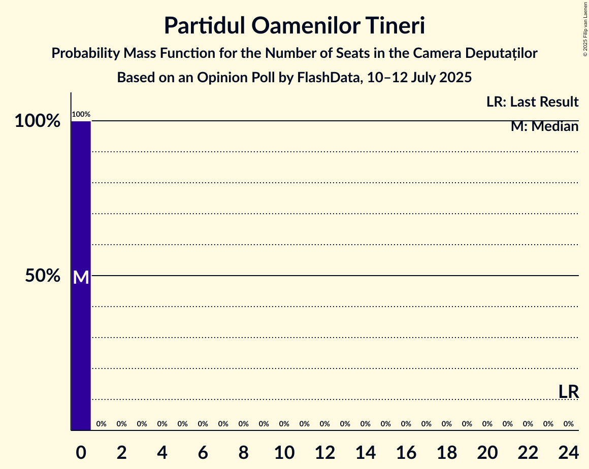

| Number of Seats | Probability | Accumulated | Special Marks |
|:---------------:|:-----------:|:-----------:|:-------------:|
| 0 | 100% | 100% | Median |
| 1 | 0% | 0% |  |
| 2 | 0% | 0% |  |
| 3 | 0% | 0% |  |
| 4 | 0% | 0% |  |
| 5 | 0% | 0% |  |
| 6 | 0% | 0% |  |
| 7 | 0% | 0% |  |
| 8 | 0% | 0% |  |
| 9 | 0% | 0% |  |
| 10 | 0% | 0% |  |
| 11 | 0% | 0% |  |
| 12 | 0% | 0% |  |
| 13 | 0% | 0% |  |
| 14 | 0% | 0% |  |
| 15 | 0% | 0% |  |
| 16 | 0% | 0% |  |
| 17 | 0% | 0% |  |
| 18 | 0% | 0% |  |
| 19 | 0% | 0% |  |
| 20 | 0% | 0% |  |
| 21 | 0% | 0% |  |
| 22 | 0% | 0% |  |
| 23 | 0% | 0% |  |
| 24 | 0% | 0% | Last Result |

## Coalitions

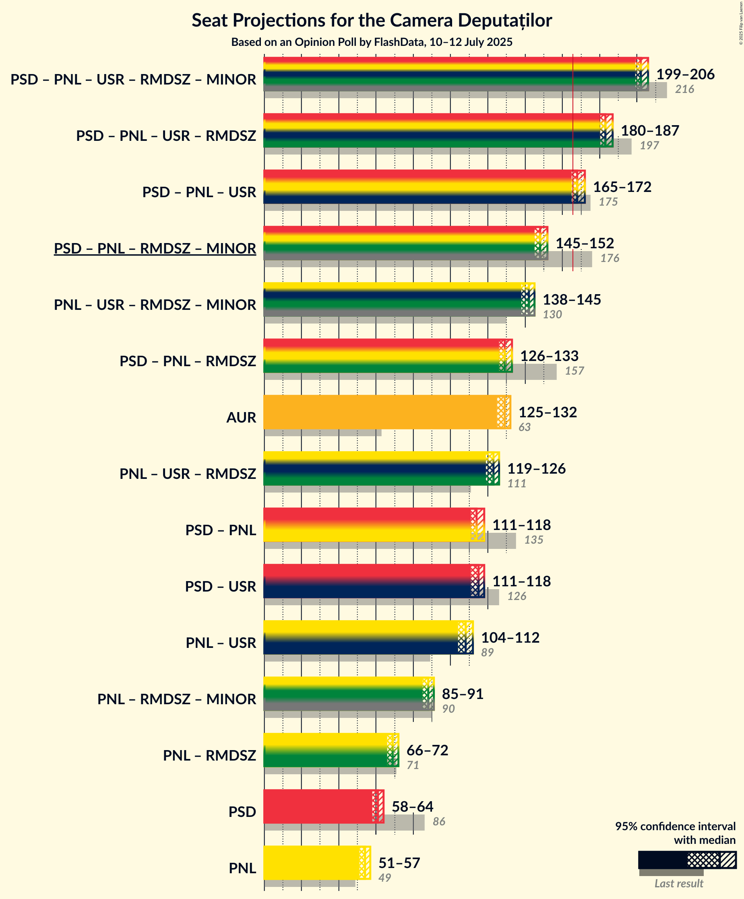

### Confidence Intervals

| Coalition | Last Result | Median | Majority? | 80% Confidence Interval | 90% Confidence Interval | 95% Confidence Interval | 99% Confidence Interval |
|:---------:|:-----------:|:------:|:---------:|:-----------------------:|:-----------------------:|:-----------------------:|:-----------------------:|
| Partidul Social Democrat – Partidul Național Liberal – Uniunea Salvați România – Romániai Magyar Demokrata Szövetség | 197 | 183 | 100% | 181–186 | 180–186 | 180–187 | 178–188 |
| Partidul Social Democrat – Partidul Național Liberal – Uniunea Salvați România | 175 | 168 | 93% | 166–171 | 165–172 | 165–172 | 164–173 |
| Partidul Social Democrat – Partidul Național Liberal – Romániai Magyar Demokrata Szövetség | 157 | 129 | 0% | 127–132 | 126–132 | 126–133 | 125–134 |
| Alianța pentru Unirea Românilor | 63 | 129 | 0% | 126–131 | 126–132 | 125–132 | 124–134 |
| Partidul Național Liberal – Uniunea Salvați România – Romániai Magyar Demokrata Szövetség | 111 | 123 | 0% | 120–125 | 119–126 | 119–126 | 118–128 |
| Partidul Social Democrat – Partidul Național Liberal | 135 | 114 | 0% | 112–117 | 112–118 | 111–118 | 110–119 |
| Partidul Social Democrat – Uniunea Salvați România | 126 | 115 | 0% | 112–117 | 112–118 | 111–118 | 110–119 |
| Partidul Național Liberal – Uniunea Salvați România | 89 | 108 | 0% | 105–110 | 105–111 | 104–112 | 104–112 |
| Partidul Național Liberal – Romániai Magyar Demokrata Szövetség | 71 | 69 | 0% | 67–71 | 66–71 | 66–72 | 65–73 |
| Partidul Social Democrat | 86 | 61 | 0% | 59–63 | 58–63 | 58–64 | 57–65 |
| Partidul Național Liberal | 49 | 54 | 0% | 52–56 | 52–56 | 51–57 | 50–58 |

### Partidul Social Democrat – Partidul Național Liberal – Uniunea Salvați România – Romániai Magyar Demokrata Szövetség

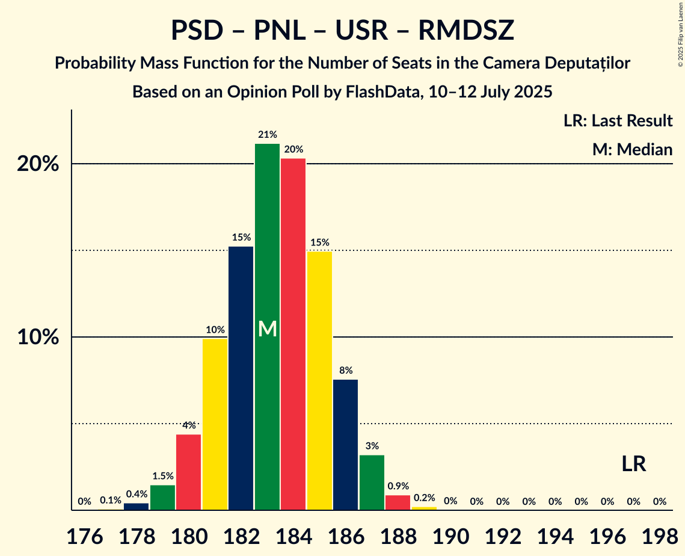

| Number of Seats | Probability | Accumulated | Special Marks |
|:---------------:|:-----------:|:-----------:|:-------------:|
| 177 | 0.1% | 100% |  |
| 178 | 0.4% | 99.9% |  |
| 179 | 1.5% | 99.5% |  |
| 180 | 4% | 98% |  |
| 181 | 10% | 94% |  |
| 182 | 15% | 84% |  |
| 183 | 21% | 68% |  |
| 184 | 20% | 47% | Median |
| 185 | 15% | 27% |  |
| 186 | 8% | 12% |  |
| 187 | 3% | 4% |  |
| 188 | 0.9% | 1.2% |  |
| 189 | 0.2% | 0.3% |  |
| 190 | 0% | 0% |  |
| 191 | 0% | 0% |  |
| 192 | 0% | 0% |  |
| 193 | 0% | 0% |  |
| 194 | 0% | 0% |  |
| 195 | 0% | 0% |  |
| 196 | 0% | 0% |  |
| 197 | 0% | 0% | Last Result |

### Partidul Social Democrat – Partidul Național Liberal – Uniunea Salvați România

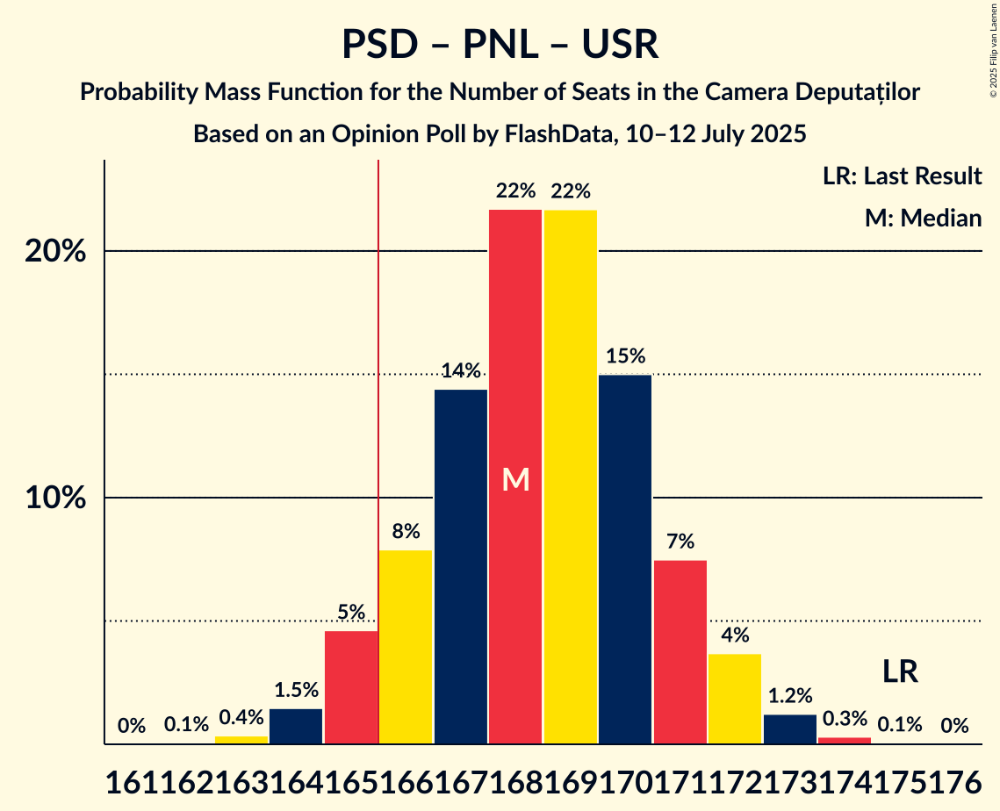

| Number of Seats | Probability | Accumulated | Special Marks |
|:---------------:|:-----------:|:-----------:|:-------------:|
| 162 | 0.1% | 100% |  |
| 163 | 0.4% | 99.9% |  |
| 164 | 1.5% | 99.6% |  |
| 165 | 5% | 98% |  |
| 166 | 8% | 93% | Majority |
| 167 | 14% | 86% |  |
| 168 | 22% | 71% |  |
| 169 | 22% | 49% | Median |
| 170 | 15% | 28% |  |
| 171 | 7% | 13% |  |
| 172 | 4% | 5% |  |
| 173 | 1.2% | 2% |  |
| 174 | 0.3% | 0.4% |  |
| 175 | 0.1% | 0.1% | Last Result |
| 176 | 0% | 0% |  |

### Partidul Social Democrat – Partidul Național Liberal – Romániai Magyar Demokrata Szövetség

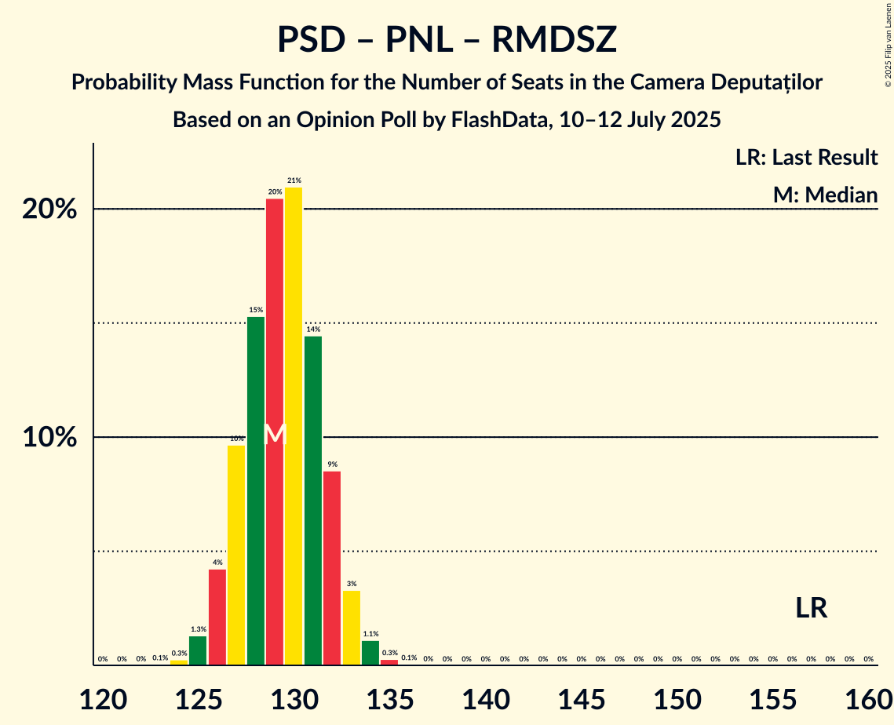

| Number of Seats | Probability | Accumulated | Special Marks |
|:---------------:|:-----------:|:-----------:|:-------------:|
| 123 | 0.1% | 100% |  |
| 124 | 0.3% | 99.9% |  |
| 125 | 1.3% | 99.7% |  |
| 126 | 4% | 98% |  |
| 127 | 10% | 94% |  |
| 128 | 15% | 84% |  |
| 129 | 20% | 69% |  |
| 130 | 21% | 49% | Median |
| 131 | 14% | 28% |  |
| 132 | 9% | 13% |  |
| 133 | 3% | 5% |  |
| 134 | 1.1% | 1.4% |  |
| 135 | 0.3% | 0.3% |  |
| 136 | 0.1% | 0.1% |  |
| 137 | 0% | 0% |  |
| 138 | 0% | 0% |  |
| 139 | 0% | 0% |  |
| 140 | 0% | 0% |  |
| 141 | 0% | 0% |  |
| 142 | 0% | 0% |  |
| 143 | 0% | 0% |  |
| 144 | 0% | 0% |  |
| 145 | 0% | 0% |  |
| 146 | 0% | 0% |  |
| 147 | 0% | 0% |  |
| 148 | 0% | 0% |  |
| 149 | 0% | 0% |  |
| 150 | 0% | 0% |  |
| 151 | 0% | 0% |  |
| 152 | 0% | 0% |  |
| 153 | 0% | 0% |  |
| 154 | 0% | 0% |  |
| 155 | 0% | 0% |  |
| 156 | 0% | 0% |  |
| 157 | 0% | 0% | Last Result |

### Alianța pentru Unirea Românilor

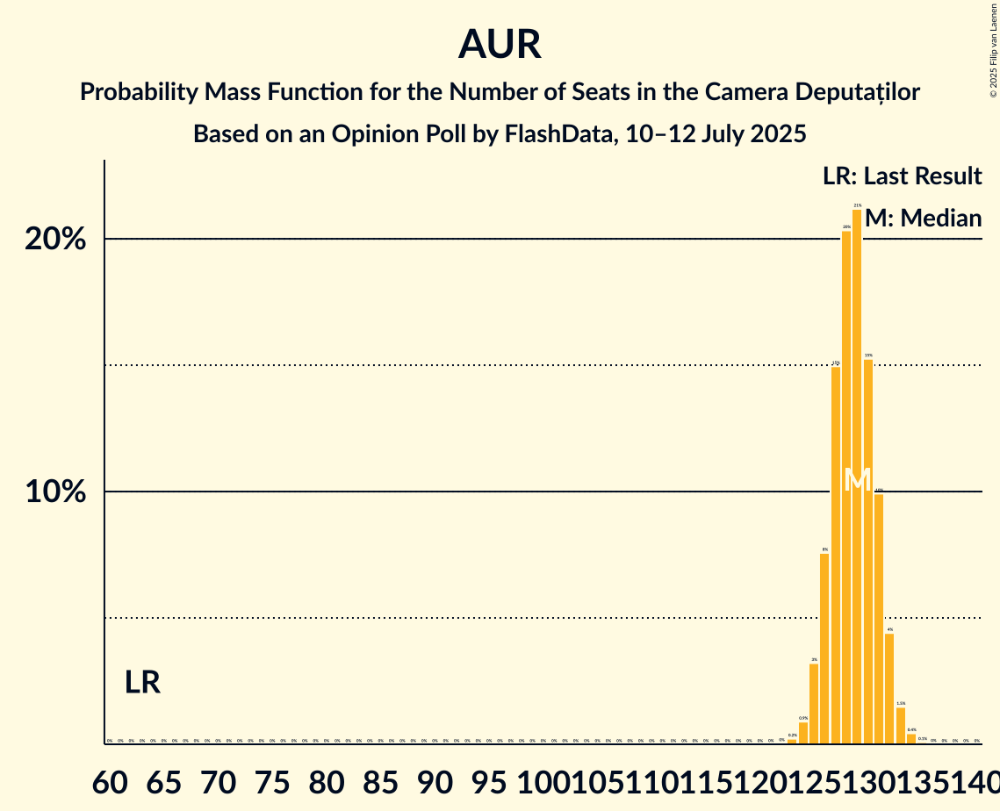

| Number of Seats | Probability | Accumulated | Special Marks |
|:---------------:|:-----------:|:-----------:|:-------------:|
| 63 | 0% | 100% | Last Result |
| 64 | 0% | 100% |  |
| 65 | 0% | 100% |  |
| 66 | 0% | 100% |  |
| 67 | 0% | 100% |  |
| 68 | 0% | 100% |  |
| 69 | 0% | 100% |  |
| 70 | 0% | 100% |  |
| 71 | 0% | 100% |  |
| 72 | 0% | 100% |  |
| 73 | 0% | 100% |  |
| 74 | 0% | 100% |  |
| 75 | 0% | 100% |  |
| 76 | 0% | 100% |  |
| 77 | 0% | 100% |  |
| 78 | 0% | 100% |  |
| 79 | 0% | 100% |  |
| 80 | 0% | 100% |  |
| 81 | 0% | 100% |  |
| 82 | 0% | 100% |  |
| 83 | 0% | 100% |  |
| 84 | 0% | 100% |  |
| 85 | 0% | 100% |  |
| 86 | 0% | 100% |  |
| 87 | 0% | 100% |  |
| 88 | 0% | 100% |  |
| 89 | 0% | 100% |  |
| 90 | 0% | 100% |  |
| 91 | 0% | 100% |  |
| 92 | 0% | 100% |  |
| 93 | 0% | 100% |  |
| 94 | 0% | 100% |  |
| 95 | 0% | 100% |  |
| 96 | 0% | 100% |  |
| 97 | 0% | 100% |  |
| 98 | 0% | 100% |  |
| 99 | 0% | 100% |  |
| 100 | 0% | 100% |  |
| 101 | 0% | 100% |  |
| 102 | 0% | 100% |  |
| 103 | 0% | 100% |  |
| 104 | 0% | 100% |  |
| 105 | 0% | 100% |  |
| 106 | 0% | 100% |  |
| 107 | 0% | 100% |  |
| 108 | 0% | 100% |  |
| 109 | 0% | 100% |  |
| 110 | 0% | 100% |  |
| 111 | 0% | 100% |  |
| 112 | 0% | 100% |  |
| 113 | 0% | 100% |  |
| 114 | 0% | 100% |  |
| 115 | 0% | 100% |  |
| 116 | 0% | 100% |  |
| 117 | 0% | 100% |  |
| 118 | 0% | 100% |  |
| 119 | 0% | 100% |  |
| 120 | 0% | 100% |  |
| 121 | 0% | 100% |  |
| 122 | 0% | 100% |  |
| 123 | 0.2% | 100% |  |
| 124 | 0.9% | 99.7% |  |
| 125 | 3% | 98.8% |  |
| 126 | 8% | 96% |  |
| 127 | 15% | 88% |  |
| 128 | 20% | 73% |  |
| 129 | 21% | 53% | Median |
| 130 | 15% | 32% |  |
| 131 | 10% | 16% |  |
| 132 | 4% | 6% |  |
| 133 | 1.5% | 2% |  |
| 134 | 0.4% | 0.5% |  |
| 135 | 0.1% | 0.1% |  |
| 136 | 0% | 0% |  |

### Partidul Național Liberal – Uniunea Salvați România – Romániai Magyar Demokrata Szövetség

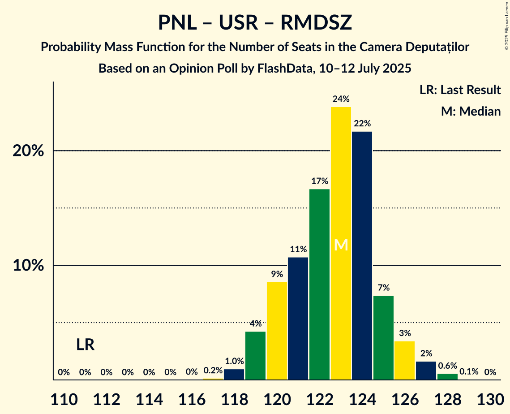

| Number of Seats | Probability | Accumulated | Special Marks |
|:---------------:|:-----------:|:-----------:|:-------------:|
| 111 | 0% | 100% | Last Result |
| 112 | 0% | 100% |  |
| 113 | 0% | 100% |  |
| 114 | 0% | 100% |  |
| 115 | 0% | 100% |  |
| 116 | 0% | 100% |  |
| 117 | 0.2% | 100% |  |
| 118 | 1.0% | 99.8% |  |
| 119 | 4% | 98.8% |  |
| 120 | 9% | 95% |  |
| 121 | 11% | 86% |  |
| 122 | 17% | 75% |  |
| 123 | 24% | 59% | Median |
| 124 | 22% | 35% |  |
| 125 | 7% | 13% |  |
| 126 | 3% | 6% |  |
| 127 | 2% | 2% |  |
| 128 | 0.6% | 0.6% |  |
| 129 | 0.1% | 0.1% |  |
| 130 | 0% | 0% |  |

### Partidul Social Democrat – Partidul Național Liberal

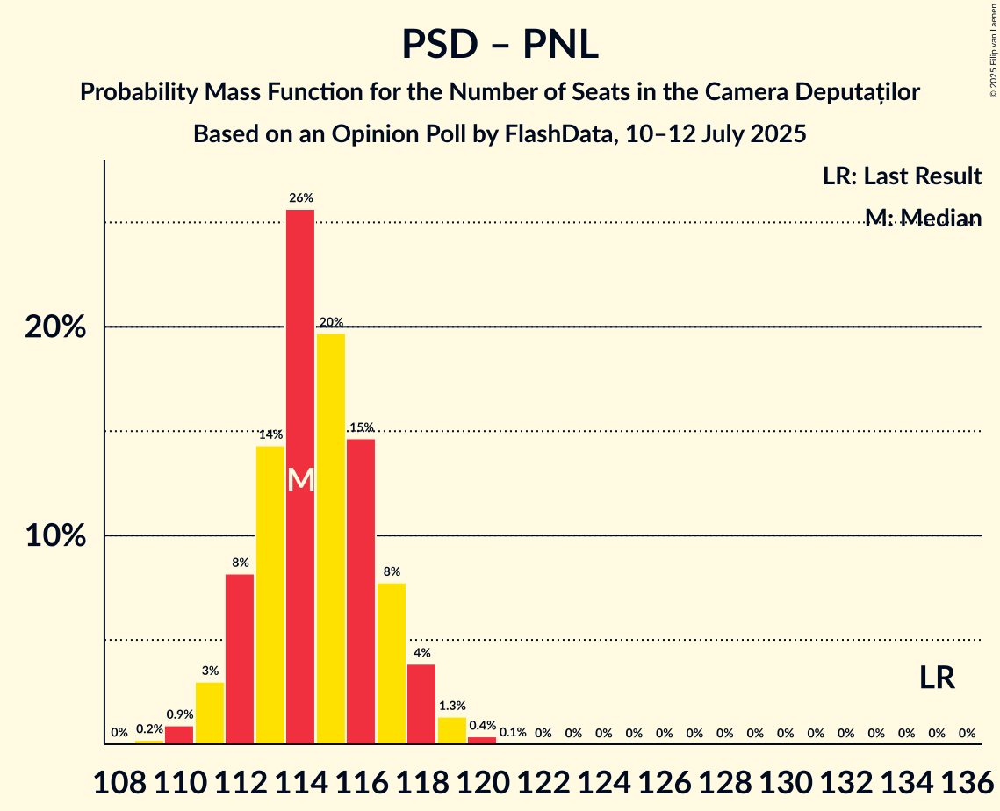

| Number of Seats | Probability | Accumulated | Special Marks |
|:---------------:|:-----------:|:-----------:|:-------------:|
| 109 | 0.2% | 100% |  |
| 110 | 0.9% | 99.7% |  |
| 111 | 3% | 98.8% |  |
| 112 | 8% | 96% |  |
| 113 | 14% | 88% |  |
| 114 | 26% | 73% |  |
| 115 | 20% | 48% | Median |
| 116 | 15% | 28% |  |
| 117 | 8% | 13% |  |
| 118 | 4% | 6% |  |
| 119 | 1.3% | 2% |  |
| 120 | 0.4% | 0.4% |  |
| 121 | 0.1% | 0.1% |  |
| 122 | 0% | 0% |  |
| 123 | 0% | 0% |  |
| 124 | 0% | 0% |  |
| 125 | 0% | 0% |  |
| 126 | 0% | 0% |  |
| 127 | 0% | 0% |  |
| 128 | 0% | 0% |  |
| 129 | 0% | 0% |  |
| 130 | 0% | 0% |  |
| 131 | 0% | 0% |  |
| 132 | 0% | 0% |  |
| 133 | 0% | 0% |  |
| 134 | 0% | 0% |  |
| 135 | 0% | 0% | Last Result |

### Partidul Social Democrat – Uniunea Salvați România

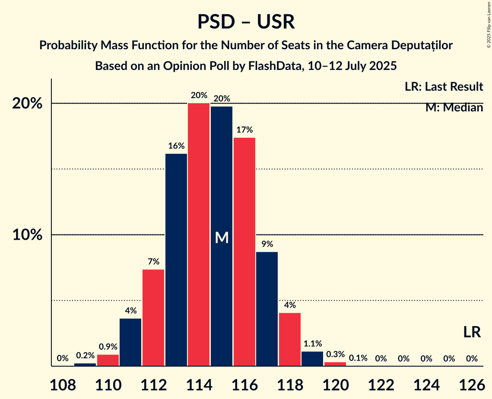

| Number of Seats | Probability | Accumulated | Special Marks |
|:---------------:|:-----------:|:-----------:|:-------------:|
| 109 | 0.2% | 100% |  |
| 110 | 0.9% | 99.7% |  |
| 111 | 4% | 98.8% |  |
| 112 | 7% | 95% |  |
| 113 | 16% | 88% |  |
| 114 | 20% | 72% |  |
| 115 | 20% | 52% | Median |
| 116 | 17% | 32% |  |
| 117 | 9% | 14% |  |
| 118 | 4% | 6% |  |
| 119 | 1.1% | 2% |  |
| 120 | 0.3% | 0.4% |  |
| 121 | 0.1% | 0.1% |  |
| 122 | 0% | 0% |  |
| 123 | 0% | 0% |  |
| 124 | 0% | 0% |  |
| 125 | 0% | 0% |  |
| 126 | 0% | 0% | Last Result |

### Partidul Național Liberal – Uniunea Salvați România

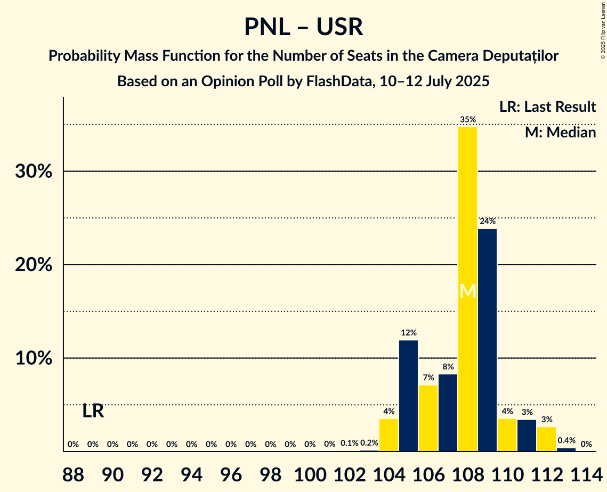

| Number of Seats | Probability | Accumulated | Special Marks |
|:---------------:|:-----------:|:-----------:|:-------------:|
| 89 | 0% | 100% | Last Result |
| 90 | 0% | 100% |  |
| 91 | 0% | 100% |  |
| 92 | 0% | 100% |  |
| 93 | 0% | 100% |  |
| 94 | 0% | 100% |  |
| 95 | 0% | 100% |  |
| 96 | 0% | 100% |  |
| 97 | 0% | 100% |  |
| 98 | 0% | 100% |  |
| 99 | 0% | 100% |  |
| 100 | 0% | 100% |  |
| 101 | 0% | 100% |  |
| 102 | 0.1% | 100% |  |
| 103 | 0.2% | 99.8% |  |
| 104 | 4% | 99.7% |  |
| 105 | 12% | 96% |  |
| 106 | 7% | 84% |  |
| 107 | 8% | 77% |  |
| 108 | 35% | 69% | Median |
| 109 | 24% | 34% |  |
| 110 | 4% | 10% |  |
| 111 | 3% | 7% |  |
| 112 | 3% | 3% |  |
| 113 | 0.4% | 0.5% |  |
| 114 | 0% | 0% |  |

### Partidul Național Liberal – Romániai Magyar Demokrata Szövetség

| Number of Seats | Probability | Accumulated | Special Marks |
|:---------------:|:-----------:|:-----------:|:-------------:|
| 64 | 0.3% | 100% |  |
| 65 | 2% | 99.6% |  |
| 66 | 6% | 98% |  |
| 67 | 15% | 92% |  |
| 68 | 21% | 78% |  |
| 69 | 24% | 57% | Median |
| 70 | 20% | 33% |  |
| 71 | 9% | 13% | Last Result |
| 72 | 4% | 4% |  |
| 73 | 0.7% | 0.8% |  |
| 74 | 0.1% | 0.1% |  |
| 75 | 0% | 0% |  |

### Partidul Social Democrat

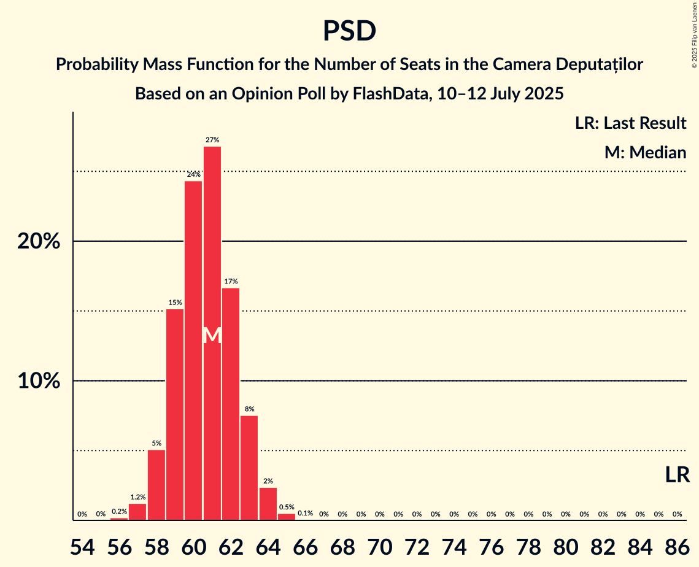

| Number of Seats | Probability | Accumulated | Special Marks |
|:---------------:|:-----------:|:-----------:|:-------------:|
| 56 | 0.2% | 100% |  |
| 57 | 1.2% | 99.8% |  |
| 58 | 5% | 98.6% |  |
| 59 | 15% | 93% |  |
| 60 | 24% | 78% |  |
| 61 | 27% | 54% | Median |
| 62 | 17% | 27% |  |
| 63 | 8% | 10% |  |
| 64 | 2% | 3% |  |
| 65 | 0.5% | 0.6% |  |
| 66 | 0.1% | 0.1% |  |
| 67 | 0% | 0% |  |
| 68 | 0% | 0% |  |
| 69 | 0% | 0% |  |
| 70 | 0% | 0% |  |
| 71 | 0% | 0% |  |
| 72 | 0% | 0% |  |
| 73 | 0% | 0% |  |
| 74 | 0% | 0% |  |
| 75 | 0% | 0% |  |
| 76 | 0% | 0% |  |
| 77 | 0% | 0% |  |
| 78 | 0% | 0% |  |
| 79 | 0% | 0% |  |
| 80 | 0% | 0% |  |
| 81 | 0% | 0% |  |
| 82 | 0% | 0% |  |
| 83 | 0% | 0% |  |
| 84 | 0% | 0% |  |
| 85 | 0% | 0% |  |
| 86 | 0% | 0% | Last Result |

### Partidul Național Liberal

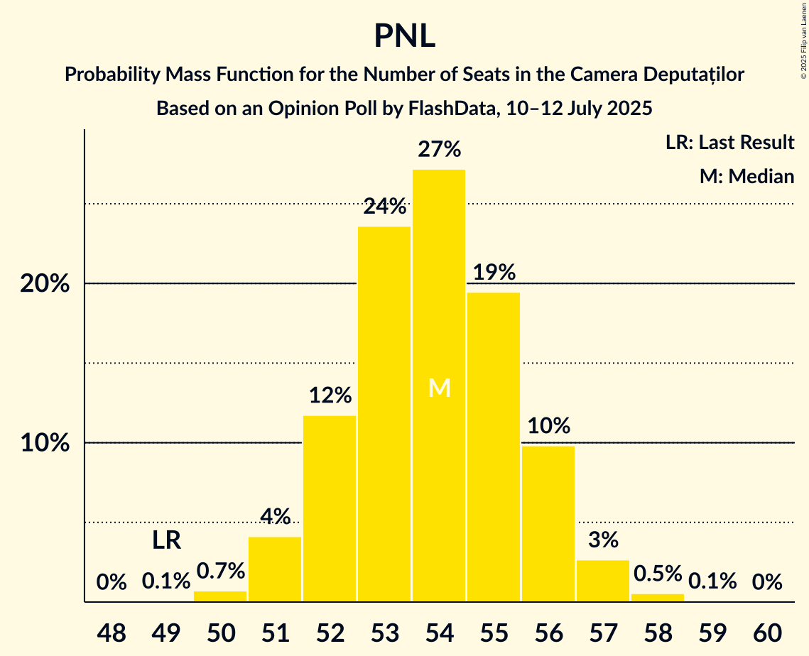

| Number of Seats | Probability | Accumulated | Special Marks |
|:---------------:|:-----------:|:-----------:|:-------------:|
| 49 | 0.1% | 100% | Last Result |
| 50 | 0.7% | 99.9% |  |
| 51 | 4% | 99.2% |  |
| 52 | 12% | 95% |  |
| 53 | 24% | 83% |  |
| 54 | 27% | 60% | Median |
| 55 | 19% | 33% |  |
| 56 | 10% | 13% |  |
| 57 | 3% | 3% |  |
| 58 | 0.5% | 0.6% |  |
| 59 | 0.1% | 0.1% |  |
| 60 | 0% | 0% |  |

## Technical Information

### Opinion Poll

+ **Polling firm:** FlashData
+ **Commissioner(s):** —
+ **Fieldwork period:** 10–12 July 2025

### Calculations

+ **Sample size:** 7500
+ **Simulations done:** 2,097,152
+ **Error estimate:** 0.32%

