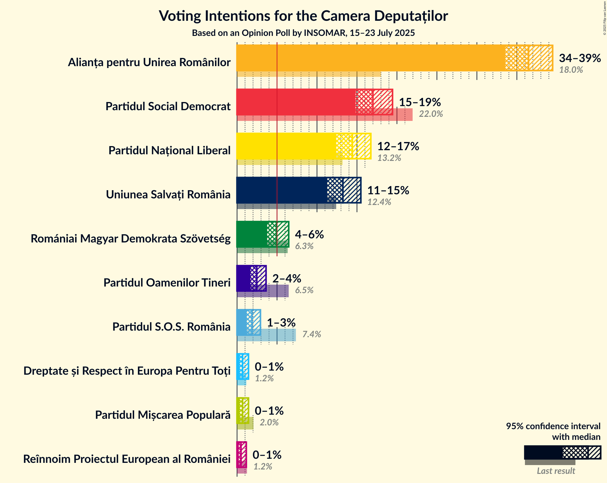
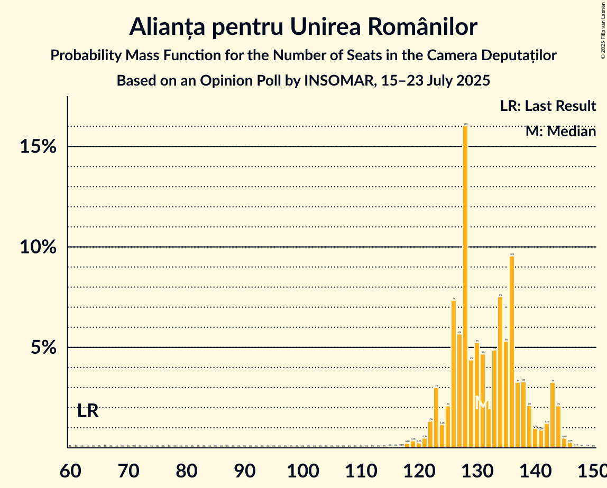
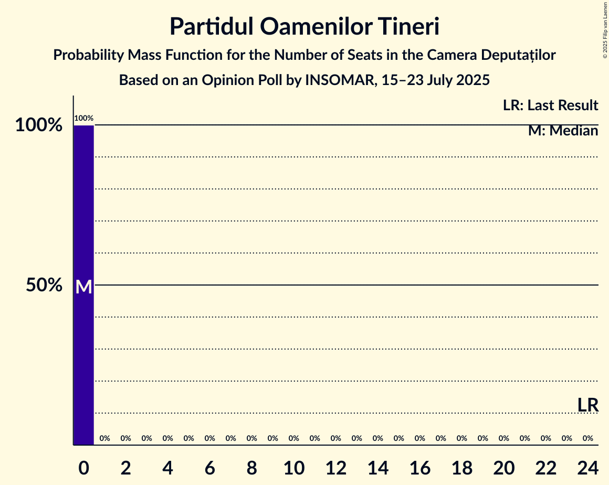
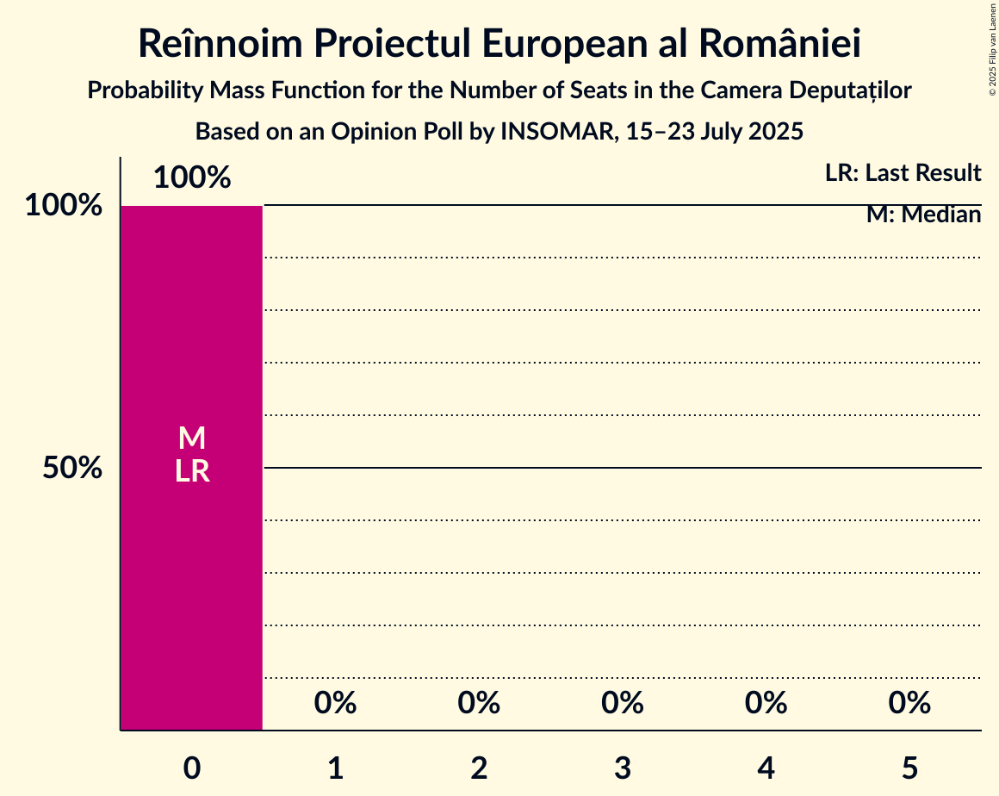

# Opinion Poll by INSOMAR, 15–23 July 2025

<a href="#voting-intentions">Voting Intentions</a> | <a href="#seats">Seats</a> | <a href="#coalitions">Coalitions</a> | <a href="#technical-information">Technical Information</a>

## Voting Intentions

### Confidence Intervals

| Party | Last Result | Poll Result | 80% Confidence Interval | 90% Confidence Interval | 95% Confidence Interval | 99% Confidence Interval |
|:-----:|:-----------:|:-----------:|:-----------------------:|:-----------------------:|:-----------------------:|:-----------------------:|
| Alianța pentru Unirea Românilor | 18.0% | 36.5% | 34.6–38.4% |34.0–39.0% |33.5–39.5% |32.6–40.4% |
| Partidul Social Democrat | 22.0% | 17.0% | 15.6–18.6% |15.2–19.1% |14.8–19.4% |14.1–20.2% |
| Partidul Național Liberal | 13.2% | 14.4% | 13.1–15.9% |12.7–16.4% |12.4–16.7% |11.8–17.5% |
| Uniunea Salvați România | 12.4% | 13.2% | 11.9–14.7% |11.6–15.1% |11.3–15.5% |10.7–16.2% |
| Romániai Magyar Demokrata Szövetség | 6.3% | 4.9% | 4.2–5.9% |3.9–6.2% |3.8–6.5% |3.4–7.0% |
| Partidul Oamenilor Tineri | 6.5% | 2.5% | 2.0–3.2% |1.8–3.4% |1.7–3.6% |1.4–4.0% |
| Partidul S.O.S. România | 7.4% | 1.9% | 1.4–2.6% |1.3–2.7% |1.2–2.9% |1.0–3.3% |
| Dreptate și Respect în Europa Pentru Toți | 1.2% | 0.7% | 0.5–1.2% |0.4–1.3% |0.3–1.4% |0.2–1.7% |
| Partidul Mișcarea Populară | 2.0% | 0.7% | 0.5–1.2% |0.4–1.3% |0.3–1.4% |0.2–1.7% |
| Reînnoim Proiectul European al României | 1.2% | 0.5% | 0.3–0.9% |0.2–1.0% |0.2–1.2% |0.1–1.4% |

*Note:* The poll result column reflects the actual value used in the calculations. Published results may vary slightly, and in addition be rounded to fewer digits.

## Seats

### Confidence Intervals

| Party | Last Result | Median | 80% Confidence Interval | 90% Confidence Interval | 95% Confidence Interval | 99% Confidence Interval |
|:-----:|:-----------:|:------:|:-----------------------:|:-----------------------:|:-----------------------:|:-----------------------:|
| <a href="#alianța-pentru-unirea-românilor">Alianța pentru Unirea Românilor</a> | 63 | 131 | 126–139 |123–143 |122–144 |119–145 |
| <a href="#partidul-social-democrat">Partidul Social Democrat</a> | 86 | 63 | 56–67 |55–68 |54–70 |52–72 |
| <a href="#partidul-național-liberal">Partidul Național Liberal</a> | 49 | 53 | 47–57 |45–58 |44–60 |42–63 |
| <a href="#uniunea-salvați-românia">Uniunea Salvați România</a> | 40 | 48 | 43–53 |42–54 |41–55 |39–58 |
| <a href="#romániai-magyar-demokrata-szövetség">Romániai Magyar Demokrata Szövetség</a> | 22 | 17 | 15–21 |14–22 |13–23 |12–25 |
| <a href="#partidul-oamenilor-tineri">Partidul Oamenilor Tineri</a> | 24 | 0 | 0 |0 |0 |0 |
| <a href="#partidul-s.o.s.-românia">Partidul S.O.S. România</a> | 28 | 0 | 0 |0 |0 |0 |
| <a href="#dreptate-și-respect-în-europa-pentru-toți">Dreptate și Respect în Europa Pentru Toți</a> | 0 | 0 | 0 |0 |0 |0 |
| <a href="#partidul-mișcarea-populară">Partidul Mișcarea Populară</a> | 0 | 0 | 0 |0 |0 |0 |
| <a href="#reînnoim-proiectul-european-al-româniei">Reînnoim Proiectul European al României</a> | 0 | 0 | 0 |0 |0 |0 |

### Alianța pentru Unirea Românilor

*For a full overview of the results for this party, see the [Alianța pentru Unirea Românilor](party-alianțapentruunirearomânilor.html) page.*

| Number of Seats | Probability | Accumulated | Special Marks |
|:---------------:|:-----------:|:-----------:|:-------------:|
| 63 | 0% | 100% | Last Result |
| 64 | 0% | 100% |  |
| 65 | 0% | 100% |  |
| 66 | 0% | 100% |  |
| 67 | 0% | 100% |  |
| 68 | 0% | 100% |  |
| 69 | 0% | 100% |  |
| 70 | 0% | 100% |  |
| 71 | 0% | 100% |  |
| 72 | 0% | 100% |  |
| 73 | 0% | 100% |  |
| 74 | 0% | 100% |  |
| 75 | 0% | 100% |  |
| 76 | 0% | 100% |  |
| 77 | 0% | 100% |  |
| 78 | 0% | 100% |  |
| 79 | 0% | 100% |  |
| 80 | 0% | 100% |  |
| 81 | 0% | 100% |  |
| 82 | 0% | 100% |  |
| 83 | 0% | 100% |  |
| 84 | 0% | 100% |  |
| 85 | 0% | 100% |  |
| 86 | 0% | 100% |  |
| 87 | 0% | 100% |  |
| 88 | 0% | 100% |  |
| 89 | 0% | 100% |  |
| 90 | 0% | 100% |  |
| 91 | 0% | 100% |  |
| 92 | 0% | 100% |  |
| 93 | 0% | 100% |  |
| 94 | 0% | 100% |  |
| 95 | 0% | 100% |  |
| 96 | 0% | 100% |  |
| 97 | 0% | 100% |  |
| 98 | 0% | 100% |  |
| 99 | 0% | 100% |  |
| 100 | 0% | 100% |  |
| 101 | 0% | 100% |  |
| 102 | 0% | 100% |  |
| 103 | 0% | 100% |  |
| 104 | 0% | 100% |  |
| 105 | 0% | 100% |  |
| 106 | 0% | 100% |  |
| 107 | 0% | 100% |  |
| 108 | 0% | 100% |  |
| 109 | 0% | 100% |  |
| 110 | 0% | 100% |  |
| 111 | 0% | 100% |  |
| 112 | 0% | 100% |  |
| 113 | 0% | 100% |  |
| 114 | 0% | 100% |  |
| 115 | 0% | 100% |  |
| 116 | 0% | 99.9% |  |
| 117 | 0.1% | 99.9% |  |
| 118 | 0.2% | 99.8% |  |
| 119 | 0.4% | 99.6% |  |
| 120 | 0.2% | 99.2% |  |
| 121 | 0.5% | 99.0% |  |
| 122 | 1.3% | 98.5% |  |
| 123 | 3% | 97% |  |
| 124 | 1.2% | 94% |  |
| 125 | 2% | 93% |  |
| 126 | 7% | 91% |  |
| 127 | 6% | 84% |  |
| 128 | 16% | 78% |  |
| 129 | 4% | 62% |  |
| 130 | 5% | 58% |  |
| 131 | 5% | 52% | Median |
| 132 | 2% | 48% |  |
| 133 | 5% | 45% |  |
| 134 | 8% | 40% |  |
| 135 | 5% | 33% |  |
| 136 | 10% | 28% |  |
| 137 | 3% | 18% |  |
| 138 | 3% | 15% |  |
| 139 | 2% | 11% |  |
| 140 | 1.0% | 9% |  |
| 141 | 0.9% | 8% |  |
| 142 | 1.2% | 7% |  |
| 143 | 3% | 6% |  |
| 144 | 2% | 3% |  |
| 145 | 0.5% | 0.9% |  |
| 146 | 0.3% | 0.4% |  |
| 147 | 0.1% | 0.2% |  |
| 148 | 0% | 0.1% |  |
| 149 | 0% | 0.1% |  |
| 150 | 0% | 0% |  |

### Partidul Social Democrat

*For a full overview of the results for this party, see the [Partidul Social Democrat](party-partidulsocialdemocrat.html) page.*

| Number of Seats | Probability | Accumulated | Special Marks |
|:---------------:|:-----------:|:-----------:|:-------------:|
| 48 | 0% | 100% |  |
| 49 | 0% | 99.9% |  |
| 50 | 0.1% | 99.9% |  |
| 51 | 0.1% | 99.8% |  |
| 52 | 0.9% | 99.8% |  |
| 53 | 0.9% | 98.9% |  |
| 54 | 2% | 98% |  |
| 55 | 5% | 96% |  |
| 56 | 4% | 92% |  |
| 57 | 5% | 87% |  |
| 58 | 8% | 82% |  |
| 59 | 6% | 74% |  |
| 60 | 4% | 69% |  |
| 61 | 4% | 65% |  |
| 62 | 3% | 61% |  |
| 63 | 9% | 58% | Median |
| 64 | 18% | 49% |  |
| 65 | 9% | 31% |  |
| 66 | 7% | 22% |  |
| 67 | 6% | 15% |  |
| 68 | 4% | 9% |  |
| 69 | 2% | 5% |  |
| 70 | 0.8% | 3% |  |
| 71 | 1.0% | 2% |  |
| 72 | 0.3% | 0.7% |  |
| 73 | 0.1% | 0.5% |  |
| 74 | 0.1% | 0.3% |  |
| 75 | 0.1% | 0.2% |  |
| 76 | 0.1% | 0.1% |  |
| 77 | 0% | 0.1% |  |
| 78 | 0% | 0% |  |
| 79 | 0% | 0% |  |
| 80 | 0% | 0% |  |
| 81 | 0% | 0% |  |
| 82 | 0% | 0% |  |
| 83 | 0% | 0% |  |
| 84 | 0% | 0% |  |
| 85 | 0% | 0% |  |
| 86 | 0% | 0% | Last Result |

### Partidul Național Liberal

*For a full overview of the results for this party, see the [Partidul Național Liberal](party-partidulnaționalliberal.html) page.*

| Number of Seats | Probability | Accumulated | Special Marks |
|:---------------:|:-----------:|:-----------:|:-------------:|
| 40 | 0.1% | 100% |  |
| 41 | 0.1% | 99.9% |  |
| 42 | 1.0% | 99.8% |  |
| 43 | 0.5% | 98.8% |  |
| 44 | 3% | 98% |  |
| 45 | 1.2% | 95% |  |
| 46 | 3% | 94% |  |
| 47 | 2% | 92% |  |
| 48 | 2% | 89% |  |
| 49 | 6% | 87% | Last Result |
| 50 | 6% | 81% |  |
| 51 | 9% | 75% |  |
| 52 | 16% | 66% |  |
| 53 | 9% | 50% | Median |
| 54 | 18% | 42% |  |
| 55 | 9% | 23% |  |
| 56 | 4% | 14% |  |
| 57 | 3% | 10% |  |
| 58 | 3% | 7% |  |
| 59 | 1.3% | 5% |  |
| 60 | 2% | 4% |  |
| 61 | 0.5% | 2% |  |
| 62 | 0.6% | 1.4% |  |
| 63 | 0.5% | 0.8% |  |
| 64 | 0.1% | 0.3% |  |
| 65 | 0.1% | 0.2% |  |
| 66 | 0% | 0.1% |  |
| 67 | 0% | 0% |  |

### Uniunea Salvați România

*For a full overview of the results for this party, see the [Uniunea Salvați România](party-uniuneasalvațiromânia.html) page.*

| Number of Seats | Probability | Accumulated | Special Marks |
|:---------------:|:-----------:|:-----------:|:-------------:|
| 36 | 0% | 100% |  |
| 37 | 0.1% | 99.9% |  |
| 38 | 0.2% | 99.8% |  |
| 39 | 0.7% | 99.6% |  |
| 40 | 0.6% | 99.0% | Last Result |
| 41 | 2% | 98% |  |
| 42 | 5% | 96% |  |
| 43 | 5% | 91% |  |
| 44 | 7% | 86% |  |
| 45 | 7% | 79% |  |
| 46 | 7% | 72% |  |
| 47 | 10% | 65% |  |
| 48 | 8% | 55% | Median |
| 49 | 17% | 47% |  |
| 50 | 6% | 29% |  |
| 51 | 3% | 23% |  |
| 52 | 8% | 20% |  |
| 53 | 5% | 12% |  |
| 54 | 3% | 8% |  |
| 55 | 3% | 5% |  |
| 56 | 0.7% | 2% |  |
| 57 | 0.8% | 1.5% |  |
| 58 | 0.2% | 0.6% |  |
| 59 | 0.2% | 0.5% |  |
| 60 | 0.1% | 0.3% |  |
| 61 | 0.1% | 0.2% |  |
| 62 | 0% | 0.1% |  |
| 63 | 0% | 0% |  |

### Romániai Magyar Demokrata Szövetség

*For a full overview of the results for this party, see the [Romániai Magyar Demokrata Szövetség](party-romániaimagyardemokrataszövetség.html) page.*

| Number of Seats | Probability | Accumulated | Special Marks |
|:---------------:|:-----------:|:-----------:|:-------------:|
| 10 | 0.1% | 100% |  |
| 11 | 0.2% | 99.9% |  |
| 12 | 0.7% | 99.7% |  |
| 13 | 4% | 99.0% |  |
| 14 | 3% | 95% |  |
| 15 | 7% | 92% |  |
| 16 | 14% | 84% |  |
| 17 | 24% | 70% | Median |
| 18 | 12% | 46% |  |
| 19 | 9% | 34% |  |
| 20 | 9% | 26% |  |
| 21 | 8% | 16% |  |
| 22 | 5% | 8% | Last Result |
| 23 | 1.3% | 3% |  |
| 24 | 1.3% | 2% |  |
| 25 | 0.4% | 0.6% |  |
| 26 | 0.1% | 0.2% |  |
| 27 | 0.1% | 0.1% |  |
| 28 | 0% | 0% |  |

### Partidul Oamenilor Tineri

*For a full overview of the results for this party, see the [Partidul Oamenilor Tineri](party-partiduloamenilortineri.html) page.*

| Number of Seats | Probability | Accumulated | Special Marks |
|:---------------:|:-----------:|:-----------:|:-------------:|
| 0 | 100% | 100% | Median |
| 1 | 0% | 0% |  |
| 2 | 0% | 0% |  |
| 3 | 0% | 0% |  |
| 4 | 0% | 0% |  |
| 5 | 0% | 0% |  |
| 6 | 0% | 0% |  |
| 7 | 0% | 0% |  |
| 8 | 0% | 0% |  |
| 9 | 0% | 0% |  |
| 10 | 0% | 0% |  |
| 11 | 0% | 0% |  |
| 12 | 0% | 0% |  |
| 13 | 0% | 0% |  |
| 14 | 0% | 0% |  |
| 15 | 0% | 0% |  |
| 16 | 0% | 0% |  |
| 17 | 0% | 0% |  |
| 18 | 0% | 0% |  |
| 19 | 0% | 0% |  |
| 20 | 0% | 0% |  |
| 21 | 0% | 0% |  |
| 22 | 0% | 0% |  |
| 23 | 0% | 0% |  |
| 24 | 0% | 0% | Last Result |

### Partidul S.O.S. România

*For a full overview of the results for this party, see the [Partidul S.O.S. România](party-partidulsosromânia.html) page.*

| Number of Seats | Probability | Accumulated | Special Marks |
|:---------------:|:-----------:|:-----------:|:-------------:|
| 0 | 100% | 100% | Median |
| 1 | 0% | 0% |  |
| 2 | 0% | 0% |  |
| 3 | 0% | 0% |  |
| 4 | 0% | 0% |  |
| 5 | 0% | 0% |  |
| 6 | 0% | 0% |  |
| 7 | 0% | 0% |  |
| 8 | 0% | 0% |  |
| 9 | 0% | 0% |  |
| 10 | 0% | 0% |  |
| 11 | 0% | 0% |  |
| 12 | 0% | 0% |  |
| 13 | 0% | 0% |  |
| 14 | 0% | 0% |  |
| 15 | 0% | 0% |  |
| 16 | 0% | 0% |  |
| 17 | 0% | 0% |  |
| 18 | 0% | 0% |  |
| 19 | 0% | 0% |  |
| 20 | 0% | 0% |  |
| 21 | 0% | 0% |  |
| 22 | 0% | 0% |  |
| 23 | 0% | 0% |  |
| 24 | 0% | 0% |  |
| 25 | 0% | 0% |  |
| 26 | 0% | 0% |  |
| 27 | 0% | 0% |  |
| 28 | 0% | 0% | Last Result |

### Dreptate și Respect în Europa Pentru Toți

*For a full overview of the results for this party, see the [Dreptate și Respect în Europa Pentru Toți](party-dreptateșirespectîneuropapentrutoți.html) page.*

| Number of Seats | Probability | Accumulated | Special Marks |
|:---------------:|:-----------:|:-----------:|:-------------:|
| 0 | 100% | 100% | Last Result, Median |

### Partidul Mișcarea Populară

*For a full overview of the results for this party, see the [Partidul Mișcarea Populară](party-partidulmișcareapopulară.html) page.*

| Number of Seats | Probability | Accumulated | Special Marks |
|:---------------:|:-----------:|:-----------:|:-------------:|
| 0 | 100% | 100% | Last Result, Median |

### Reînnoim Proiectul European al României

*For a full overview of the results for this party, see the [Reînnoim Proiectul European al României](party-reînnoimproiectuleuropeanalromâniei.html) page.*

| Number of Seats | Probability | Accumulated | Special Marks |
|:---------------:|:-----------:|:-----------:|:-------------:|
| 0 | 100% | 100% | Last Result, Median |

## Coalitions

### Confidence Intervals

| Coalition | Last Result | Median | Majority? | 80% Confidence Interval | 90% Confidence Interval | 95% Confidence Interval | 99% Confidence Interval |
|:---------:|:-----------:|:------:|:---------:|:-----------------------:|:-----------------------:|:-----------------------:|:-----------------------:|
| Partidul Social Democrat – Partidul Național Liberal – Uniunea Salvați România – Romániai Magyar Demokrata Szövetség | 197 | 181 | 99.8% | 173–186 | 169–189 | 168–190 | 167–193 |
| Partidul Social Democrat – Partidul Național Liberal – Uniunea Salvați România | 175 | 164 | 38% | 155–168 | 152–172 | 151–172 | 149–175 |
| Alianța pentru Unirea Românilor | 63 | 131 | 0% | 126–139 | 123–143 | 122–144 | 119–145 |
| Partidul Social Democrat – Partidul Național Liberal – Romániai Magyar Demokrata Szövetség | 157 | 133 | 0% | 125–140 | 123–141 | 121–142 | 119–145 |
| Partidul Național Liberal – Uniunea Salvați România – Romániai Magyar Demokrata Szövetség | 111 | 120 | 0% | 111–123 | 110–128 | 109–129 | 103–131 |
| Partidul Social Democrat – Partidul Național Liberal | 135 | 115 | 0% | 108–120 | 106–122 | 104–124 | 101–127 |
| Partidul Social Democrat – Uniunea Salvați România | 126 | 111 | 0% | 103–116 | 100–119 | 100–120 | 97–122 |
| Partidul Național Liberal – Uniunea Salvați România | 89 | 101 | 0% | 94–107 | 92–108 | 90–110 | 87–113 |
| Partidul Național Liberal – Romániai Magyar Demokrata Szövetség | 71 | 71 | 0% | 65–75 | 62–77 | 60–79 | 58–82 |
| Partidul Social Democrat | 86 | 63 | 0% | 56–67 | 55–68 | 54–70 | 52–72 |
| Partidul Național Liberal | 49 | 53 | 0% | 47–57 | 45–58 | 44–60 | 42–63 |

### Partidul Social Democrat – Partidul Național Liberal – Uniunea Salvați România – Romániai Magyar Demokrata Szövetség

| Number of Seats | Probability | Accumulated | Special Marks |
|:---------------:|:-----------:|:-----------:|:-------------:|
| 163 | 0% | 100% |  |
| 164 | 0% | 99.9% |  |
| 165 | 0.1% | 99.9% |  |
| 166 | 0.3% | 99.8% | Majority |
| 167 | 0.5% | 99.6% |  |
| 168 | 2% | 99.1% |  |
| 169 | 3% | 97% |  |
| 170 | 1.2% | 94% |  |
| 171 | 0.9% | 93% |  |
| 172 | 1.0% | 92% |  |
| 173 | 2% | 91% |  |
| 174 | 3% | 89% |  |
| 175 | 3% | 85% |  |
| 176 | 10% | 82% |  |
| 177 | 5% | 72% |  |
| 178 | 8% | 67% |  |
| 179 | 5% | 60% |  |
| 180 | 2% | 55% |  |
| 181 | 5% | 52% | Median |
| 182 | 5% | 48% |  |
| 183 | 4% | 42% |  |
| 184 | 16% | 38% |  |
| 185 | 6% | 22% |  |
| 186 | 7% | 16% |  |
| 187 | 2% | 9% |  |
| 188 | 1.2% | 7% |  |
| 189 | 3% | 6% |  |
| 190 | 1.3% | 3% |  |
| 191 | 0.5% | 1.5% |  |
| 192 | 0.2% | 1.0% |  |
| 193 | 0.4% | 0.8% |  |
| 194 | 0.2% | 0.4% |  |
| 195 | 0.1% | 0.2% |  |
| 196 | 0% | 0.1% |  |
| 197 | 0% | 0.1% | Last Result |
| 198 | 0% | 0% |  |

### Partidul Social Democrat – Partidul Național Liberal – Uniunea Salvați România

| Number of Seats | Probability | Accumulated | Special Marks |
|:---------------:|:-----------:|:-----------:|:-------------:|
| 144 | 0% | 100% |  |
| 145 | 0% | 99.9% |  |
| 146 | 0.1% | 99.9% |  |
| 147 | 0.1% | 99.9% |  |
| 148 | 0.2% | 99.8% |  |
| 149 | 1.2% | 99.6% |  |
| 150 | 0.6% | 98% |  |
| 151 | 1.1% | 98% |  |
| 152 | 4% | 97% |  |
| 153 | 0.7% | 93% |  |
| 154 | 0.9% | 92% |  |
| 155 | 3% | 91% |  |
| 156 | 2% | 88% |  |
| 157 | 5% | 86% |  |
| 158 | 7% | 81% |  |
| 159 | 4% | 74% |  |
| 160 | 8% | 70% |  |
| 161 | 5% | 62% |  |
| 162 | 3% | 57% |  |
| 163 | 2% | 54% |  |
| 164 | 8% | 52% | Median |
| 165 | 6% | 44% |  |
| 166 | 11% | 38% | Majority |
| 167 | 16% | 27% |  |
| 168 | 2% | 11% |  |
| 169 | 2% | 9% |  |
| 170 | 0.9% | 7% |  |
| 171 | 0.9% | 6% |  |
| 172 | 3% | 5% |  |
| 173 | 1.0% | 2% |  |
| 174 | 0.6% | 1.4% |  |
| 175 | 0.4% | 0.8% | Last Result |
| 176 | 0.2% | 0.4% |  |
| 177 | 0.1% | 0.2% |  |
| 178 | 0% | 0.1% |  |
| 179 | 0% | 0.1% |  |
| 180 | 0% | 0.1% |  |
| 181 | 0% | 0% |  |

### Alianța pentru Unirea Românilor

| Number of Seats | Probability | Accumulated | Special Marks |
|:---------------:|:-----------:|:-----------:|:-------------:|
| 63 | 0% | 100% | Last Result |
| 64 | 0% | 100% |  |
| 65 | 0% | 100% |  |
| 66 | 0% | 100% |  |
| 67 | 0% | 100% |  |
| 68 | 0% | 100% |  |
| 69 | 0% | 100% |  |
| 70 | 0% | 100% |  |
| 71 | 0% | 100% |  |
| 72 | 0% | 100% |  |
| 73 | 0% | 100% |  |
| 74 | 0% | 100% |  |
| 75 | 0% | 100% |  |
| 76 | 0% | 100% |  |
| 77 | 0% | 100% |  |
| 78 | 0% | 100% |  |
| 79 | 0% | 100% |  |
| 80 | 0% | 100% |  |
| 81 | 0% | 100% |  |
| 82 | 0% | 100% |  |
| 83 | 0% | 100% |  |
| 84 | 0% | 100% |  |
| 85 | 0% | 100% |  |
| 86 | 0% | 100% |  |
| 87 | 0% | 100% |  |
| 88 | 0% | 100% |  |
| 89 | 0% | 100% |  |
| 90 | 0% | 100% |  |
| 91 | 0% | 100% |  |
| 92 | 0% | 100% |  |
| 93 | 0% | 100% |  |
| 94 | 0% | 100% |  |
| 95 | 0% | 100% |  |
| 96 | 0% | 100% |  |
| 97 | 0% | 100% |  |
| 98 | 0% | 100% |  |
| 99 | 0% | 100% |  |
| 100 | 0% | 100% |  |
| 101 | 0% | 100% |  |
| 102 | 0% | 100% |  |
| 103 | 0% | 100% |  |
| 104 | 0% | 100% |  |
| 105 | 0% | 100% |  |
| 106 | 0% | 100% |  |
| 107 | 0% | 100% |  |
| 108 | 0% | 100% |  |
| 109 | 0% | 100% |  |
| 110 | 0% | 100% |  |
| 111 | 0% | 100% |  |
| 112 | 0% | 100% |  |
| 113 | 0% | 100% |  |
| 114 | 0% | 100% |  |
| 115 | 0% | 100% |  |
| 116 | 0% | 99.9% |  |
| 117 | 0.1% | 99.9% |  |
| 118 | 0.2% | 99.8% |  |
| 119 | 0.4% | 99.6% |  |
| 120 | 0.2% | 99.2% |  |
| 121 | 0.5% | 99.0% |  |
| 122 | 1.3% | 98.5% |  |
| 123 | 3% | 97% |  |
| 124 | 1.2% | 94% |  |
| 125 | 2% | 93% |  |
| 126 | 7% | 91% |  |
| 127 | 6% | 84% |  |
| 128 | 16% | 78% |  |
| 129 | 4% | 62% |  |
| 130 | 5% | 58% |  |
| 131 | 5% | 52% | Median |
| 132 | 2% | 48% |  |
| 133 | 5% | 45% |  |
| 134 | 8% | 40% |  |
| 135 | 5% | 33% |  |
| 136 | 10% | 28% |  |
| 137 | 3% | 18% |  |
| 138 | 3% | 15% |  |
| 139 | 2% | 11% |  |
| 140 | 1.0% | 9% |  |
| 141 | 0.9% | 8% |  |
| 142 | 1.2% | 7% |  |
| 143 | 3% | 6% |  |
| 144 | 2% | 3% |  |
| 145 | 0.5% | 0.9% |  |
| 146 | 0.3% | 0.4% |  |
| 147 | 0.1% | 0.2% |  |
| 148 | 0% | 0.1% |  |
| 149 | 0% | 0.1% |  |
| 150 | 0% | 0% |  |

### Partidul Social Democrat – Partidul Național Liberal – Romániai Magyar Demokrata Szövetség

| Number of Seats | Probability | Accumulated | Special Marks |
|:---------------:|:-----------:|:-----------:|:-------------:|
| 114 | 0% | 100% |  |
| 115 | 0.1% | 99.9% |  |
| 116 | 0.1% | 99.9% |  |
| 117 | 0.1% | 99.7% |  |
| 118 | 0.1% | 99.6% |  |
| 119 | 0.3% | 99.5% |  |
| 120 | 0.7% | 99.2% |  |
| 121 | 1.3% | 98.5% |  |
| 122 | 2% | 97% |  |
| 123 | 1.0% | 95% |  |
| 124 | 3% | 94% |  |
| 125 | 1.5% | 91% |  |
| 126 | 5% | 90% |  |
| 127 | 5% | 85% |  |
| 128 | 5% | 80% |  |
| 129 | 5% | 75% |  |
| 130 | 4% | 70% |  |
| 131 | 8% | 66% |  |
| 132 | 4% | 58% |  |
| 133 | 9% | 54% | Median |
| 134 | 7% | 45% |  |
| 135 | 17% | 39% |  |
| 136 | 2% | 22% |  |
| 137 | 4% | 20% |  |
| 138 | 2% | 16% |  |
| 139 | 3% | 14% |  |
| 140 | 5% | 11% |  |
| 141 | 3% | 6% |  |
| 142 | 1.4% | 3% |  |
| 143 | 0.3% | 2% |  |
| 144 | 0.7% | 1.2% |  |
| 145 | 0.2% | 0.6% |  |
| 146 | 0.2% | 0.4% |  |
| 147 | 0% | 0.2% |  |
| 148 | 0.1% | 0.1% |  |
| 149 | 0% | 0.1% |  |
| 150 | 0% | 0% |  |
| 151 | 0% | 0% |  |
| 152 | 0% | 0% |  |
| 153 | 0% | 0% |  |
| 154 | 0% | 0% |  |
| 155 | 0% | 0% |  |
| 156 | 0% | 0% |  |
| 157 | 0% | 0% | Last Result |

### Partidul Național Liberal – Uniunea Salvați România – Romániai Magyar Demokrata Szövetség

| Number of Seats | Probability | Accumulated | Special Marks |
|:---------------:|:-----------:|:-----------:|:-------------:|
| 101 | 0.1% | 100% |  |
| 102 | 0.3% | 99.9% |  |
| 103 | 0.2% | 99.6% |  |
| 104 | 0.1% | 99.4% |  |
| 105 | 0.1% | 99.3% |  |
| 106 | 0% | 99.2% |  |
| 107 | 0.1% | 99.2% |  |
| 108 | 0.5% | 99.2% |  |
| 109 | 2% | 98.7% |  |
| 110 | 4% | 97% |  |
| 111 | 6% | 93% | Last Result |
| 112 | 9% | 88% |  |
| 113 | 8% | 79% |  |
| 114 | 3% | 71% |  |
| 115 | 0.3% | 68% |  |
| 116 | 0.1% | 68% |  |
| 117 | 0.5% | 68% |  |
| 118 | 5% | 67% | Median |
| 119 | 10% | 62% |  |
| 120 | 24% | 52% |  |
| 121 | 11% | 28% |  |
| 122 | 7% | 18% |  |
| 123 | 3% | 10% |  |
| 124 | 0.4% | 7% |  |
| 125 | 0.1% | 7% |  |
| 126 | 0.3% | 7% |  |
| 127 | 0.5% | 7% |  |
| 128 | 2% | 6% |  |
| 129 | 2% | 4% |  |
| 130 | 1.0% | 2% |  |
| 131 | 0.5% | 0.7% |  |
| 132 | 0.2% | 0.3% |  |
| 133 | 0% | 0.1% |  |
| 134 | 0% | 0% |  |

### Partidul Social Democrat – Partidul Național Liberal

| Number of Seats | Probability | Accumulated | Special Marks |
|:---------------:|:-----------:|:-----------:|:-------------:|
| 97 | 0.1% | 100% |  |
| 98 | 0.1% | 99.9% |  |
| 99 | 0.1% | 99.8% |  |
| 100 | 0.1% | 99.7% |  |
| 101 | 0.4% | 99.6% |  |
| 102 | 0.6% | 99.3% |  |
| 103 | 0.9% | 98.6% |  |
| 104 | 0.9% | 98% |  |
| 105 | 0.9% | 97% |  |
| 106 | 3% | 96% |  |
| 107 | 3% | 93% |  |
| 108 | 4% | 90% |  |
| 109 | 4% | 86% |  |
| 110 | 6% | 82% |  |
| 111 | 4% | 77% |  |
| 112 | 7% | 72% |  |
| 113 | 6% | 65% |  |
| 114 | 5% | 59% |  |
| 115 | 7% | 55% |  |
| 116 | 5% | 48% | Median |
| 117 | 5% | 43% |  |
| 118 | 20% | 38% |  |
| 119 | 4% | 18% |  |
| 120 | 4% | 14% |  |
| 121 | 4% | 10% |  |
| 122 | 2% | 6% |  |
| 123 | 0.9% | 4% |  |
| 124 | 0.7% | 3% |  |
| 125 | 1.4% | 2% |  |
| 126 | 0.4% | 1.0% |  |
| 127 | 0.2% | 0.5% |  |
| 128 | 0.1% | 0.3% |  |
| 129 | 0.1% | 0.2% |  |
| 130 | 0.1% | 0.1% |  |
| 131 | 0% | 0.1% |  |
| 132 | 0% | 0.1% |  |
| 133 | 0% | 0% |  |
| 134 | 0% | 0% |  |
| 135 | 0% | 0% | Last Result |

### Partidul Social Democrat – Uniunea Salvați România

| Number of Seats | Probability | Accumulated | Special Marks |
|:---------------:|:-----------:|:-----------:|:-------------:|
| 93 | 0% | 100% |  |
| 94 | 0% | 99.9% |  |
| 95 | 0% | 99.9% |  |
| 96 | 0.1% | 99.9% |  |
| 97 | 0.3% | 99.7% |  |
| 98 | 0.7% | 99.5% |  |
| 99 | 1.1% | 98.8% |  |
| 100 | 3% | 98% |  |
| 101 | 1.4% | 95% |  |
| 102 | 2% | 93% |  |
| 103 | 4% | 91% |  |
| 104 | 3% | 87% |  |
| 105 | 6% | 84% |  |
| 106 | 7% | 78% |  |
| 107 | 5% | 71% |  |
| 108 | 5% | 67% |  |
| 109 | 4% | 62% |  |
| 110 | 4% | 58% |  |
| 111 | 4% | 53% | Median |
| 112 | 8% | 49% |  |
| 113 | 21% | 41% |  |
| 114 | 3% | 20% |  |
| 115 | 5% | 16% |  |
| 116 | 2% | 12% |  |
| 117 | 0.9% | 9% |  |
| 118 | 2% | 8% |  |
| 119 | 2% | 7% |  |
| 120 | 3% | 5% |  |
| 121 | 0.9% | 2% |  |
| 122 | 1.0% | 1.4% |  |
| 123 | 0.1% | 0.3% |  |
| 124 | 0% | 0.2% |  |
| 125 | 0.1% | 0.2% |  |
| 126 | 0.1% | 0.1% | Last Result |
| 127 | 0% | 0.1% |  |
| 128 | 0% | 0% |  |

### Partidul Național Liberal – Uniunea Salvați România

| Number of Seats | Probability | Accumulated | Special Marks |
|:---------------:|:-----------:|:-----------:|:-------------:|
| 84 | 0% | 100% |  |
| 85 | 0.1% | 99.9% |  |
| 86 | 0.1% | 99.8% |  |
| 87 | 0.5% | 99.8% |  |
| 88 | 0.5% | 99.3% |  |
| 89 | 1.2% | 98.7% | Last Result |
| 90 | 0.8% | 98% |  |
| 91 | 0.6% | 97% |  |
| 92 | 2% | 96% |  |
| 93 | 3% | 95% |  |
| 94 | 5% | 92% |  |
| 95 | 5% | 87% |  |
| 96 | 7% | 83% |  |
| 97 | 8% | 75% |  |
| 98 | 5% | 67% |  |
| 99 | 5% | 62% |  |
| 100 | 5% | 58% |  |
| 101 | 8% | 52% | Median |
| 102 | 5% | 45% |  |
| 103 | 16% | 40% |  |
| 104 | 6% | 24% |  |
| 105 | 5% | 17% |  |
| 106 | 3% | 13% |  |
| 107 | 3% | 10% |  |
| 108 | 3% | 8% |  |
| 109 | 2% | 4% |  |
| 110 | 1.1% | 3% |  |
| 111 | 0.6% | 2% |  |
| 112 | 0.3% | 1.0% |  |
| 113 | 0.2% | 0.7% |  |
| 114 | 0.2% | 0.5% |  |
| 115 | 0.2% | 0.3% |  |
| 116 | 0.1% | 0.2% |  |
| 117 | 0% | 0.1% |  |
| 118 | 0% | 0% |  |

### Partidul Național Liberal – Romániai Magyar Demokrata Szövetség

| Number of Seats | Probability | Accumulated | Special Marks |
|:---------------:|:-----------:|:-----------:|:-------------:|
| 57 | 0.1% | 100% |  |
| 58 | 0.4% | 99.9% |  |
| 59 | 0.4% | 99.5% |  |
| 60 | 2% | 99.1% |  |
| 61 | 0.6% | 97% |  |
| 62 | 1.5% | 96% |  |
| 63 | 2% | 95% |  |
| 64 | 3% | 93% |  |
| 65 | 2% | 90% |  |
| 66 | 6% | 88% |  |
| 67 | 6% | 82% |  |
| 68 | 6% | 76% |  |
| 69 | 10% | 70% |  |
| 70 | 9% | 60% | Median |
| 71 | 19% | 51% | Last Result |
| 72 | 5% | 32% |  |
| 73 | 10% | 27% |  |
| 74 | 3% | 17% |  |
| 75 | 6% | 14% |  |
| 76 | 2% | 8% |  |
| 77 | 2% | 6% |  |
| 78 | 1.4% | 4% |  |
| 79 | 0.9% | 3% |  |
| 80 | 0.8% | 2% |  |
| 81 | 0.5% | 1.2% |  |
| 82 | 0.2% | 0.6% |  |
| 83 | 0.1% | 0.5% |  |
| 84 | 0.2% | 0.3% |  |
| 85 | 0.1% | 0.1% |  |
| 86 | 0% | 0.1% |  |
| 87 | 0% | 0% |  |

### Partidul Social Democrat

| Number of Seats | Probability | Accumulated | Special Marks |
|:---------------:|:-----------:|:-----------:|:-------------:|
| 48 | 0% | 100% |  |
| 49 | 0% | 99.9% |  |
| 50 | 0.1% | 99.9% |  |
| 51 | 0.1% | 99.8% |  |
| 52 | 0.9% | 99.8% |  |
| 53 | 0.9% | 98.9% |  |
| 54 | 2% | 98% |  |
| 55 | 5% | 96% |  |
| 56 | 4% | 92% |  |
| 57 | 5% | 87% |  |
| 58 | 8% | 82% |  |
| 59 | 6% | 74% |  |
| 60 | 4% | 69% |  |
| 61 | 4% | 65% |  |
| 62 | 3% | 61% |  |
| 63 | 9% | 58% | Median |
| 64 | 18% | 49% |  |
| 65 | 9% | 31% |  |
| 66 | 7% | 22% |  |
| 67 | 6% | 15% |  |
| 68 | 4% | 9% |  |
| 69 | 2% | 5% |  |
| 70 | 0.8% | 3% |  |
| 71 | 1.0% | 2% |  |
| 72 | 0.3% | 0.7% |  |
| 73 | 0.1% | 0.5% |  |
| 74 | 0.1% | 0.3% |  |
| 75 | 0.1% | 0.2% |  |
| 76 | 0.1% | 0.1% |  |
| 77 | 0% | 0.1% |  |
| 78 | 0% | 0% |  |
| 79 | 0% | 0% |  |
| 80 | 0% | 0% |  |
| 81 | 0% | 0% |  |
| 82 | 0% | 0% |  |
| 83 | 0% | 0% |  |
| 84 | 0% | 0% |  |
| 85 | 0% | 0% |  |
| 86 | 0% | 0% | Last Result |

### Partidul Național Liberal

| Number of Seats | Probability | Accumulated | Special Marks |
|:---------------:|:-----------:|:-----------:|:-------------:|
| 40 | 0.1% | 100% |  |
| 41 | 0.1% | 99.9% |  |
| 42 | 1.0% | 99.8% |  |
| 43 | 0.5% | 98.8% |  |
| 44 | 3% | 98% |  |
| 45 | 1.2% | 95% |  |
| 46 | 3% | 94% |  |
| 47 | 2% | 92% |  |
| 48 | 2% | 89% |  |
| 49 | 6% | 87% | Last Result |
| 50 | 6% | 81% |  |
| 51 | 9% | 75% |  |
| 52 | 16% | 66% |  |
| 53 | 9% | 50% | Median |
| 54 | 18% | 42% |  |
| 55 | 9% | 23% |  |
| 56 | 4% | 14% |  |
| 57 | 3% | 10% |  |
| 58 | 3% | 7% |  |
| 59 | 1.3% | 5% |  |
| 60 | 2% | 4% |  |
| 61 | 0.5% | 2% |  |
| 62 | 0.6% | 1.4% |  |
| 63 | 0.5% | 0.8% |  |
| 64 | 0.1% | 0.3% |  |
| 65 | 0.1% | 0.2% |  |
| 66 | 0% | 0.1% |  |
| 67 | 0% | 0% |  |

## Technical Information

### Opinion Poll

+ **Polling firm:** INSOMAR
+ **Commissioner(s):** —
+ **Fieldwork period:** 15–23 July 2025

### Calculations

+ **Sample size:** 1012
+ **Simulations done:** 2,097,152
+ **Error estimate:** 1.31%

