# Opinion Poll by Avangarde, 9–18 September 2025

<a href="#voting-intentions">Voting Intentions</a> | <a href="#seats">Seats</a> | <a href="#coalitions">Coalitions</a> | <a href="#technical-information">Technical Information</a>

## Voting Intentions

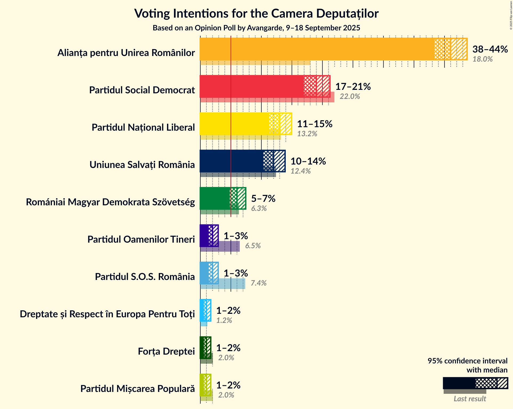

### Confidence Intervals

| Party | Last Result | Poll Result | 80% Confidence Interval | 90% Confidence Interval | 95% Confidence Interval | 99% Confidence Interval |
|:-----:|:-----------:|:-----------:|:-----------------------:|:-----------------------:|:-----------------------:|:-----------------------:|
| Alianța pentru Unirea Românilor | 18.0% | 41.0% | 39.3–42.8% |38.8–43.3% |38.3–43.7% |37.5–44.6% |
| Partidul Social Democrat | 22.0% | 19.0% | 17.6–20.5% |17.3–20.9% |16.9–21.2% |16.3–21.9% |
| Partidul Național Liberal | 13.2% | 13.0% | 11.9–14.3% |11.6–14.6% |11.3–15.0% |10.8–15.6% |
| Uniunea Salvați România | 12.4% | 12.0% | 10.9–13.2% |10.6–13.6% |10.3–13.9% |9.8–14.5% |
| Romániai Magyar Demokrata Szövetség | 6.3% | 6.0% | 5.2–6.9% |5.0–7.2% |4.8–7.4% |4.5–7.9% |
| Partidul S.O.S. România | 7.4% | 2.0% | 1.6–2.6% |1.5–2.8% |1.4–2.9% |1.2–3.2% |
| Partidul Oamenilor Tineri | 6.5% | 2.0% | 1.6–2.6% |1.5–2.8% |1.4–2.9% |1.2–3.2% |
| Dreptate și Respect în Europa Pentru Toți | 1.2% | 1.0% | 0.7–1.5% |0.6–1.6% |0.6–1.7% |0.5–2.0% |
| Forța Dreptei | 2.0% | 1.0% | 0.7–1.5% |0.6–1.6% |0.6–1.7% |0.5–2.0% |
| Partidul Mișcarea Populară | 2.0% | 1.0% | 0.7–1.5% |0.6–1.6% |0.6–1.7% |0.5–2.0% |

*Note:* The poll result column reflects the actual value used in the calculations. Published results may vary slightly, and in addition be rounded to fewer digits.

## Seats

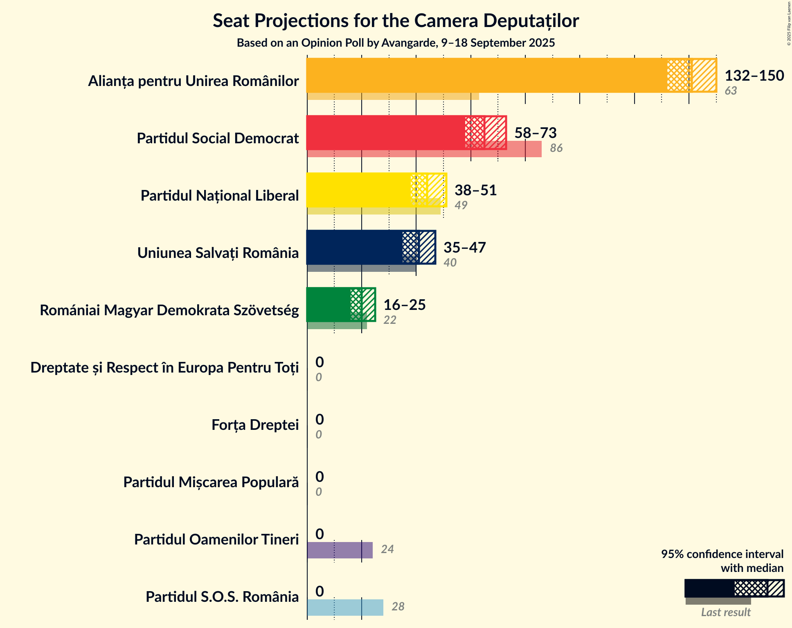

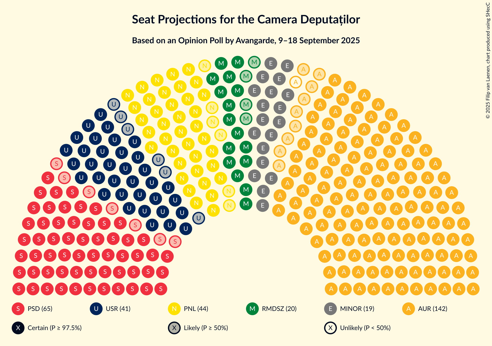

### Confidence Intervals

| Party | Last Result | Median | 80% Confidence Interval | 90% Confidence Interval | 95% Confidence Interval | 99% Confidence Interval |
|:-----:|:-----------:|:------:|:-----------------------:|:-----------------------:|:-----------------------:|:-----------------------:|
| <a href="#alianța-pentru-unirea-românilor">Alianța pentru Unirea Românilor</a> | 63 | 141 | 136–147 |134–148 |132–150 |129–153 |
| <a href="#partidul-social-democrat">Partidul Social Democrat</a> | 86 | 65 | 60–70 |59–72 |58–73 |56–75 |
| <a href="#partidul-național-liberal">Partidul Național Liberal</a> | 49 | 44 | 41–49 |39–50 |38–51 |37–53 |
| <a href="#uniunea-salvați-românia">Uniunea Salvați România</a> | 40 | 41 | 38–45 |36–46 |35–47 |33–49 |
| <a href="#romániai-magyar-demokrata-szövetség">Romániai Magyar Demokrata Szövetség</a> | 22 | 20 | 18–23 |17–24 |16–25 |15–27 |
| <a href="#partidul-s.o.s.-românia">Partidul S.O.S. România</a> | 28 | 0 | 0 |0 |0 |0 |
| <a href="#partidul-oamenilor-tineri">Partidul Oamenilor Tineri</a> | 24 | 0 | 0 |0 |0 |0 |
| <a href="#dreptate-și-respect-în-europa-pentru-toți">Dreptate și Respect în Europa Pentru Toți</a> | 0 | 0 | 0 |0 |0 |0 |
| <a href="#forța-dreptei">Forța Dreptei</a> | 0 | 0 | 0 |0 |0 |0 |
| <a href="#partidul-mișcarea-populară">Partidul Mișcarea Populară</a> | 0 | 0 | 0 |0 |0 |0 |

### Alianța pentru Unirea Românilor

*For a full overview of the results for this party, see the [Alianța pentru Unirea Românilor](party-alianțapentruunirearomânilor.html) page.*

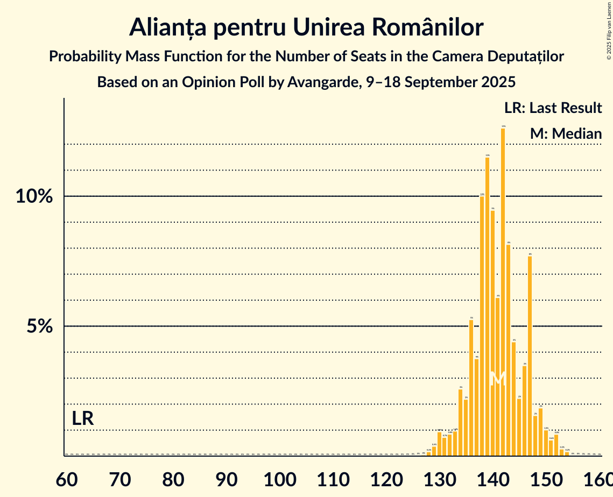

| Number of Seats | Probability | Accumulated | Special Marks |
|:---------------:|:-----------:|:-----------:|:-------------:|
| 63 | 0% | 100% | Last Result |
| 64 | 0% | 100% |  |
| 65 | 0% | 100% |  |
| 66 | 0% | 100% |  |
| 67 | 0% | 100% |  |
| 68 | 0% | 100% |  |
| 69 | 0% | 100% |  |
| 70 | 0% | 100% |  |
| 71 | 0% | 100% |  |
| 72 | 0% | 100% |  |
| 73 | 0% | 100% |  |
| 74 | 0% | 100% |  |
| 75 | 0% | 100% |  |
| 76 | 0% | 100% |  |
| 77 | 0% | 100% |  |
| 78 | 0% | 100% |  |
| 79 | 0% | 100% |  |
| 80 | 0% | 100% |  |
| 81 | 0% | 100% |  |
| 82 | 0% | 100% |  |
| 83 | 0% | 100% |  |
| 84 | 0% | 100% |  |
| 85 | 0% | 100% |  |
| 86 | 0% | 100% |  |
| 87 | 0% | 100% |  |
| 88 | 0% | 100% |  |
| 89 | 0% | 100% |  |
| 90 | 0% | 100% |  |
| 91 | 0% | 100% |  |
| 92 | 0% | 100% |  |
| 93 | 0% | 100% |  |
| 94 | 0% | 100% |  |
| 95 | 0% | 100% |  |
| 96 | 0% | 100% |  |
| 97 | 0% | 100% |  |
| 98 | 0% | 100% |  |
| 99 | 0% | 100% |  |
| 100 | 0% | 100% |  |
| 101 | 0% | 100% |  |
| 102 | 0% | 100% |  |
| 103 | 0% | 100% |  |
| 104 | 0% | 100% |  |
| 105 | 0% | 100% |  |
| 106 | 0% | 100% |  |
| 107 | 0% | 100% |  |
| 108 | 0% | 100% |  |
| 109 | 0% | 100% |  |
| 110 | 0% | 100% |  |
| 111 | 0% | 100% |  |
| 112 | 0% | 100% |  |
| 113 | 0% | 100% |  |
| 114 | 0% | 100% |  |
| 115 | 0% | 100% |  |
| 116 | 0% | 100% |  |
| 117 | 0% | 100% |  |
| 118 | 0% | 100% |  |
| 119 | 0% | 100% |  |
| 120 | 0% | 100% |  |
| 121 | 0% | 100% |  |
| 122 | 0% | 100% |  |
| 123 | 0% | 100% |  |
| 124 | 0% | 100% |  |
| 125 | 0% | 100% |  |
| 126 | 0% | 100% |  |
| 127 | 0% | 99.9% |  |
| 128 | 0.2% | 99.9% |  |
| 129 | 0.4% | 99.7% |  |
| 130 | 0.9% | 99.3% |  |
| 131 | 0.7% | 98% |  |
| 132 | 0.8% | 98% |  |
| 133 | 1.0% | 97% |  |
| 134 | 3% | 96% |  |
| 135 | 2% | 93% |  |
| 136 | 5% | 91% |  |
| 137 | 4% | 86% |  |
| 138 | 10% | 82% |  |
| 139 | 12% | 72% |  |
| 140 | 9% | 61% |  |
| 141 | 6% | 51% | Median |
| 142 | 13% | 45% |  |
| 143 | 8% | 32% |  |
| 144 | 4% | 24% |  |
| 145 | 2% | 20% |  |
| 146 | 3% | 18% |  |
| 147 | 8% | 14% |  |
| 148 | 2% | 6% |  |
| 149 | 2% | 5% |  |
| 150 | 1.0% | 3% |  |
| 151 | 0.6% | 2% |  |
| 152 | 0.8% | 1.4% |  |
| 153 | 0.3% | 0.5% |  |
| 154 | 0.2% | 0.3% |  |
| 155 | 0% | 0.1% |  |
| 156 | 0% | 0.1% |  |
| 157 | 0% | 0% |  |

### Partidul Social Democrat

*For a full overview of the results for this party, see the [Partidul Social Democrat](party-partidulsocialdemocrat.html) page.*

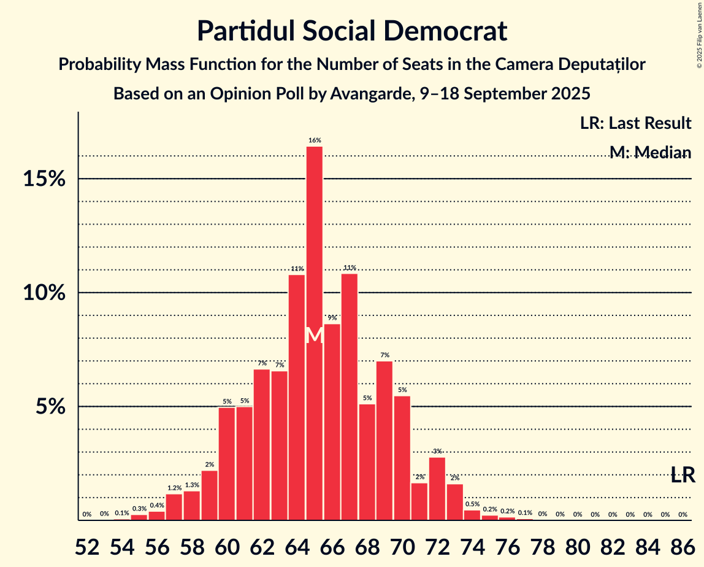

| Number of Seats | Probability | Accumulated | Special Marks |
|:---------------:|:-----------:|:-----------:|:-------------:|
| 53 | 0% | 100% |  |
| 54 | 0.1% | 99.9% |  |
| 55 | 0.3% | 99.9% |  |
| 56 | 0.4% | 99.6% |  |
| 57 | 1.2% | 99.2% |  |
| 58 | 1.3% | 98% |  |
| 59 | 2% | 97% |  |
| 60 | 5% | 95% |  |
| 61 | 5% | 90% |  |
| 62 | 7% | 85% |  |
| 63 | 7% | 78% |  |
| 64 | 11% | 71% |  |
| 65 | 16% | 61% | Median |
| 66 | 9% | 44% |  |
| 67 | 11% | 35% |  |
| 68 | 5% | 25% |  |
| 69 | 7% | 20% |  |
| 70 | 5% | 13% |  |
| 71 | 2% | 7% |  |
| 72 | 3% | 5% |  |
| 73 | 2% | 3% |  |
| 74 | 0.5% | 1.0% |  |
| 75 | 0.2% | 0.5% |  |
| 76 | 0.2% | 0.3% |  |
| 77 | 0.1% | 0.1% |  |
| 78 | 0% | 0.1% |  |
| 79 | 0% | 0% |  |
| 80 | 0% | 0% |  |
| 81 | 0% | 0% |  |
| 82 | 0% | 0% |  |
| 83 | 0% | 0% |  |
| 84 | 0% | 0% |  |
| 85 | 0% | 0% |  |
| 86 | 0% | 0% | Last Result |

### Partidul Național Liberal

*For a full overview of the results for this party, see the [Partidul Național Liberal](party-partidulnaționalliberal.html) page.*

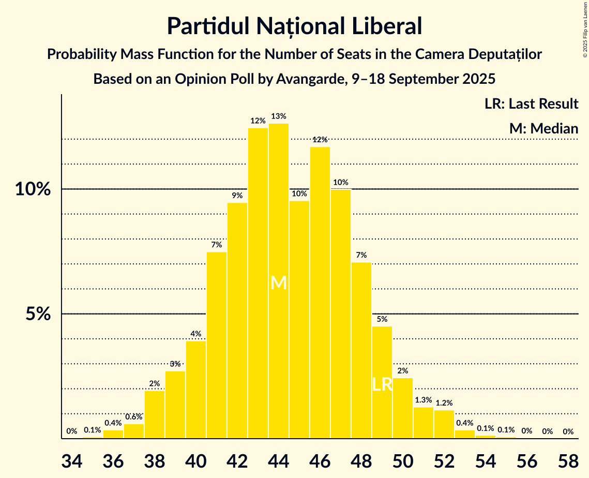

| Number of Seats | Probability | Accumulated | Special Marks |
|:---------------:|:-----------:|:-----------:|:-------------:|
| 35 | 0.1% | 100% |  |
| 36 | 0.4% | 99.9% |  |
| 37 | 0.6% | 99.5% |  |
| 38 | 2% | 98.9% |  |
| 39 | 3% | 97% |  |
| 40 | 4% | 94% |  |
| 41 | 7% | 90% |  |
| 42 | 9% | 83% |  |
| 43 | 12% | 73% |  |
| 44 | 13% | 61% | Median |
| 45 | 10% | 48% |  |
| 46 | 12% | 39% |  |
| 47 | 10% | 27% |  |
| 48 | 7% | 17% |  |
| 49 | 5% | 10% | Last Result |
| 50 | 2% | 5% |  |
| 51 | 1.3% | 3% |  |
| 52 | 1.2% | 2% |  |
| 53 | 0.4% | 0.6% |  |
| 54 | 0.1% | 0.3% |  |
| 55 | 0.1% | 0.1% |  |
| 56 | 0% | 0.1% |  |
| 57 | 0% | 0% |  |

### Uniunea Salvați România

*For a full overview of the results for this party, see the [Uniunea Salvați România](party-uniuneasalvațiromânia.html) page.*

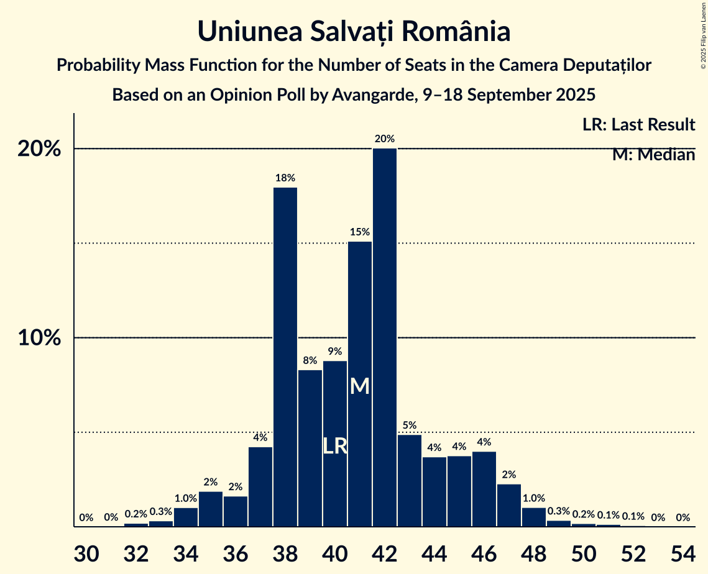

| Number of Seats | Probability | Accumulated | Special Marks |
|:---------------:|:-----------:|:-----------:|:-------------:|
| 32 | 0.2% | 100% |  |
| 33 | 0.3% | 99.8% |  |
| 34 | 1.0% | 99.4% |  |
| 35 | 2% | 98% |  |
| 36 | 2% | 97% |  |
| 37 | 4% | 95% |  |
| 38 | 18% | 91% |  |
| 39 | 8% | 73% |  |
| 40 | 9% | 64% | Last Result |
| 41 | 15% | 56% | Median |
| 42 | 20% | 40% |  |
| 43 | 5% | 20% |  |
| 44 | 4% | 16% |  |
| 45 | 4% | 12% |  |
| 46 | 4% | 8% |  |
| 47 | 2% | 4% |  |
| 48 | 1.0% | 2% |  |
| 49 | 0.3% | 0.8% |  |
| 50 | 0.2% | 0.4% |  |
| 51 | 0.1% | 0.2% |  |
| 52 | 0.1% | 0.1% |  |
| 53 | 0% | 0% |  |

### Romániai Magyar Demokrata Szövetség

*For a full overview of the results for this party, see the [Romániai Magyar Demokrata Szövetség](party-romániaimagyardemokrataszövetség.html) page.*

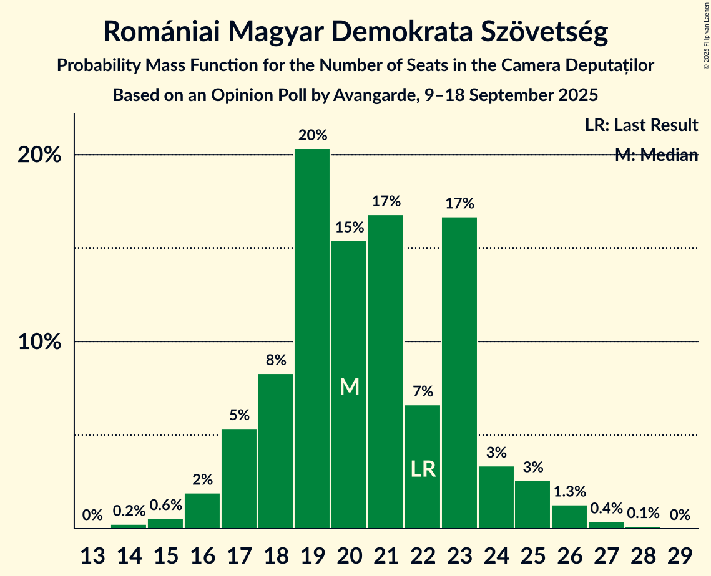

| Number of Seats | Probability | Accumulated | Special Marks |
|:---------------:|:-----------:|:-----------:|:-------------:|
| 14 | 0.2% | 100% |  |
| 15 | 0.6% | 99.7% |  |
| 16 | 2% | 99.2% |  |
| 17 | 5% | 97% |  |
| 18 | 8% | 92% |  |
| 19 | 20% | 84% |  |
| 20 | 15% | 63% | Median |
| 21 | 17% | 48% |  |
| 22 | 7% | 31% | Last Result |
| 23 | 17% | 24% |  |
| 24 | 3% | 8% |  |
| 25 | 3% | 4% |  |
| 26 | 1.3% | 2% |  |
| 27 | 0.4% | 0.5% |  |
| 28 | 0.1% | 0.2% |  |
| 29 | 0% | 0% |  |

### Partidul S.O.S. România

*For a full overview of the results for this party, see the [Partidul S.O.S. România](party-partidulsosromânia.html) page.*

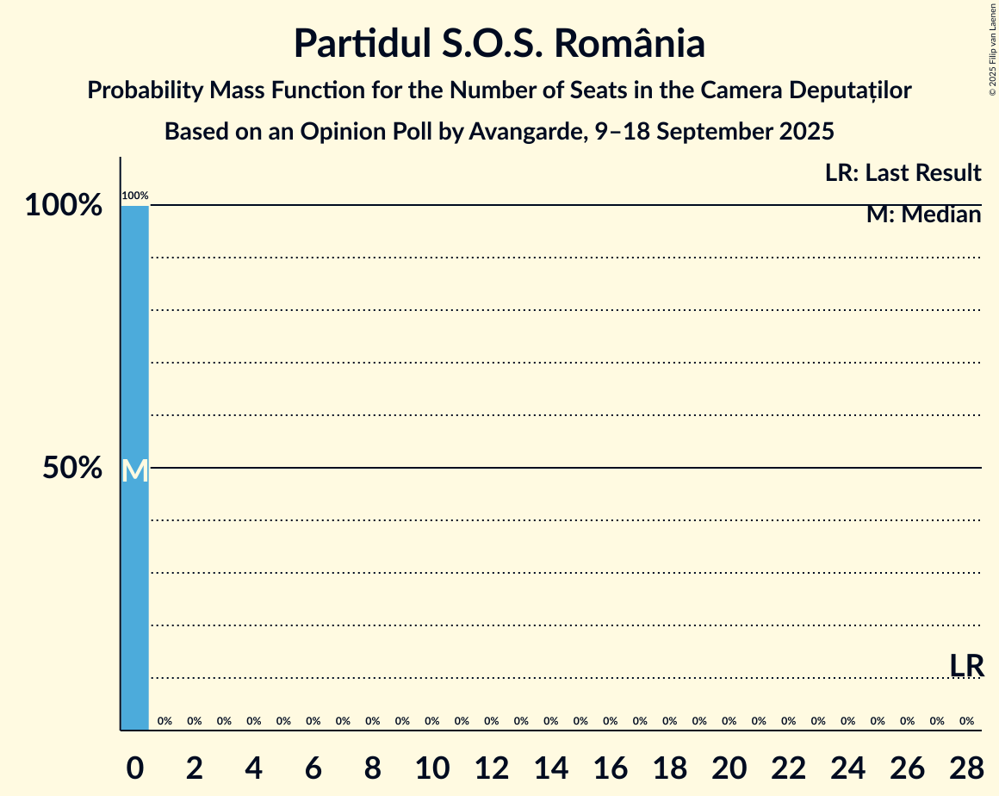

| Number of Seats | Probability | Accumulated | Special Marks |
|:---------------:|:-----------:|:-----------:|:-------------:|
| 0 | 100% | 100% | Median |
| 1 | 0% | 0% |  |
| 2 | 0% | 0% |  |
| 3 | 0% | 0% |  |
| 4 | 0% | 0% |  |
| 5 | 0% | 0% |  |
| 6 | 0% | 0% |  |
| 7 | 0% | 0% |  |
| 8 | 0% | 0% |  |
| 9 | 0% | 0% |  |
| 10 | 0% | 0% |  |
| 11 | 0% | 0% |  |
| 12 | 0% | 0% |  |
| 13 | 0% | 0% |  |
| 14 | 0% | 0% |  |
| 15 | 0% | 0% |  |
| 16 | 0% | 0% |  |
| 17 | 0% | 0% |  |
| 18 | 0% | 0% |  |
| 19 | 0% | 0% |  |
| 20 | 0% | 0% |  |
| 21 | 0% | 0% |  |
| 22 | 0% | 0% |  |
| 23 | 0% | 0% |  |
| 24 | 0% | 0% |  |
| 25 | 0% | 0% |  |
| 26 | 0% | 0% |  |
| 27 | 0% | 0% |  |
| 28 | 0% | 0% | Last Result |

### Partidul Oamenilor Tineri

*For a full overview of the results for this party, see the [Partidul Oamenilor Tineri](party-partiduloamenilortineri.html) page.*

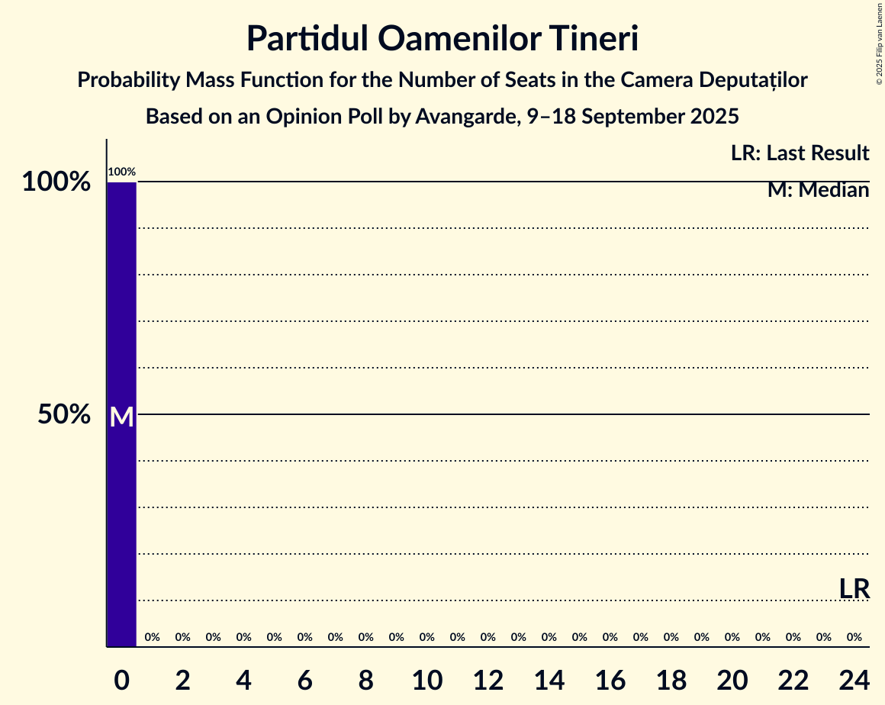

| Number of Seats | Probability | Accumulated | Special Marks |
|:---------------:|:-----------:|:-----------:|:-------------:|
| 0 | 100% | 100% | Median |
| 1 | 0% | 0% |  |
| 2 | 0% | 0% |  |
| 3 | 0% | 0% |  |
| 4 | 0% | 0% |  |
| 5 | 0% | 0% |  |
| 6 | 0% | 0% |  |
| 7 | 0% | 0% |  |
| 8 | 0% | 0% |  |
| 9 | 0% | 0% |  |
| 10 | 0% | 0% |  |
| 11 | 0% | 0% |  |
| 12 | 0% | 0% |  |
| 13 | 0% | 0% |  |
| 14 | 0% | 0% |  |
| 15 | 0% | 0% |  |
| 16 | 0% | 0% |  |
| 17 | 0% | 0% |  |
| 18 | 0% | 0% |  |
| 19 | 0% | 0% |  |
| 20 | 0% | 0% |  |
| 21 | 0% | 0% |  |
| 22 | 0% | 0% |  |
| 23 | 0% | 0% |  |
| 24 | 0% | 0% | Last Result |

### Dreptate și Respect în Europa Pentru Toți

*For a full overview of the results for this party, see the [Dreptate și Respect în Europa Pentru Toți](party-dreptateșirespectîneuropapentrutoți.html) page.*

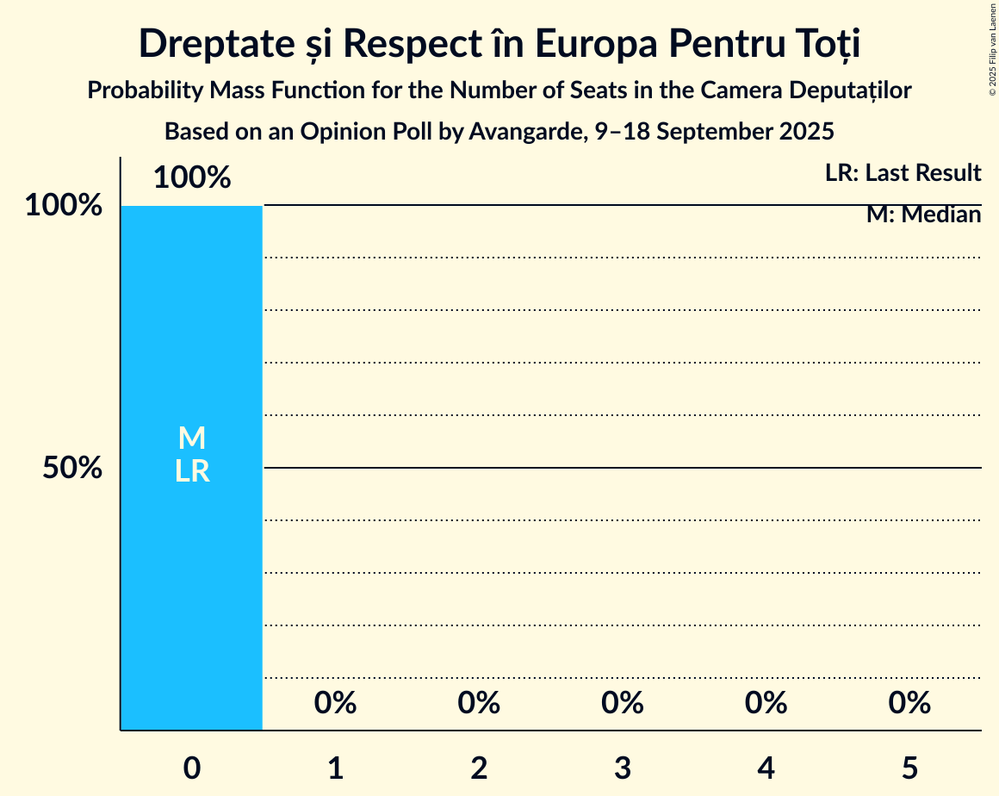

| Number of Seats | Probability | Accumulated | Special Marks |
|:---------------:|:-----------:|:-----------:|:-------------:|
| 0 | 100% | 100% | Last Result, Median |

### Forța Dreptei

*For a full overview of the results for this party, see the [Forța Dreptei](party-forțadreptei.html) page.*

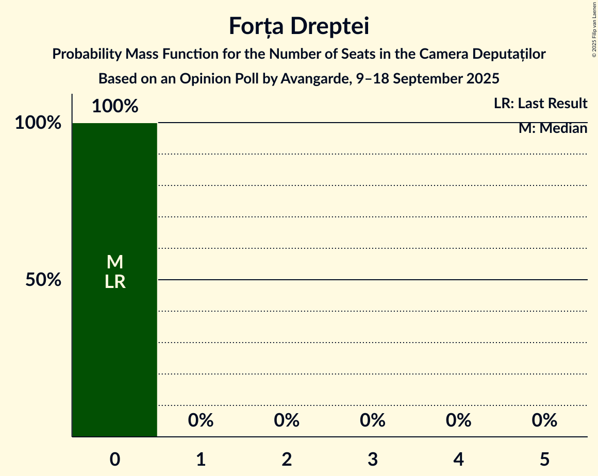

| Number of Seats | Probability | Accumulated | Special Marks |
|:---------------:|:-----------:|:-----------:|:-------------:|
| 0 | 100% | 100% | Last Result, Median |

### Partidul Mișcarea Populară

*For a full overview of the results for this party, see the [Partidul Mișcarea Populară](party-partidulmișcareapopulară.html) page.*

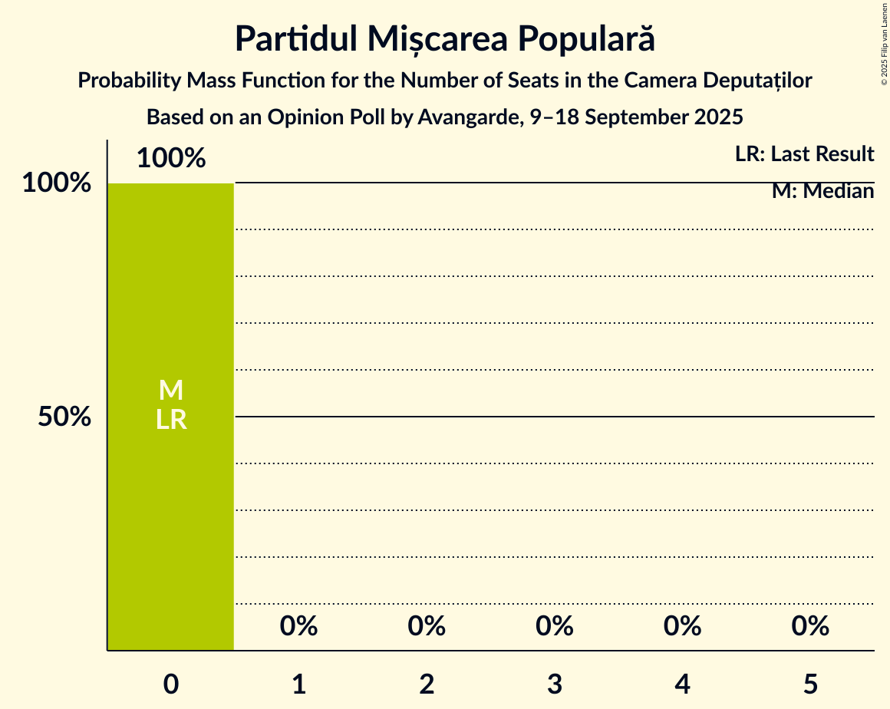

| Number of Seats | Probability | Accumulated | Special Marks |
|:---------------:|:-----------:|:-----------:|:-------------:|
| 0 | 100% | 100% | Last Result, Median |

## Coalitions

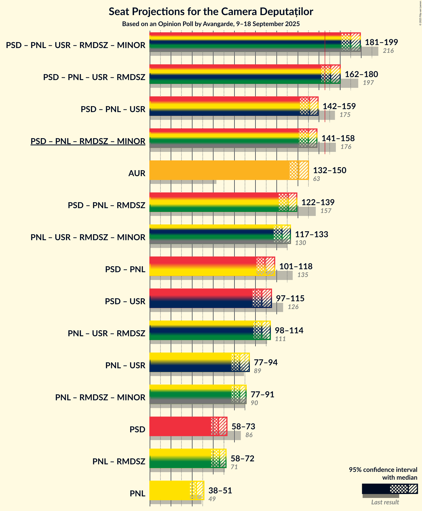

### Confidence Intervals

| Coalition | Last Result | Median | Majority? | 80% Confidence Interval | 90% Confidence Interval | 95% Confidence Interval | 99% Confidence Interval |
|:---------:|:-----------:|:------:|:---------:|:-----------------------:|:-----------------------:|:-----------------------:|:-----------------------:|
| Partidul Social Democrat – Partidul Național Liberal – Uniunea Salvați România – Romániai Magyar Demokrata Szövetség | 197 | 171 | 86% | 165–176 | 164–178 | 162–180 | 159–183 |
| Partidul Social Democrat – Partidul Național Liberal – Uniunea Salvați România | 175 | 151 | 0% | 146–156 | 144–158 | 142–159 | 138–162 |
| Alianța pentru Unirea Românilor | 63 | 141 | 0% | 136–147 | 134–148 | 132–150 | 129–153 |
| Partidul Social Democrat – Partidul Național Liberal – Romániai Magyar Demokrata Szövetség | 157 | 131 | 0% | 124–136 | 123–138 | 122–139 | 118–142 |
| Partidul Social Democrat – Partidul Național Liberal | 135 | 109 | 0% | 104–115 | 103–117 | 101–118 | 98–121 |
| Partidul Social Democrat – Uniunea Salvați România | 126 | 106 | 0% | 101–111 | 99–113 | 97–115 | 95–118 |
| Partidul Național Liberal – Uniunea Salvați România – Romániai Magyar Demokrata Szövetség | 111 | 106 | 0% | 100–112 | 99–113 | 98–114 | 95–117 |
| Partidul Național Liberal – Uniunea Salvați România | 89 | 85 | 0% | 81–90 | 79–92 | 77–94 | 75–96 |
| Partidul Social Democrat | 86 | 65 | 0% | 60–70 | 59–72 | 58–73 | 56–75 |
| Partidul Național Liberal – Romániai Magyar Demokrata Szövetség | 71 | 66 | 0% | 61–70 | 60–72 | 58–72 | 56–74 |
| Partidul Național Liberal | 49 | 44 | 0% | 41–49 | 39–50 | 38–51 | 37–53 |

### Partidul Social Democrat – Partidul Național Liberal – Uniunea Salvați România – Romániai Magyar Demokrata Szövetség

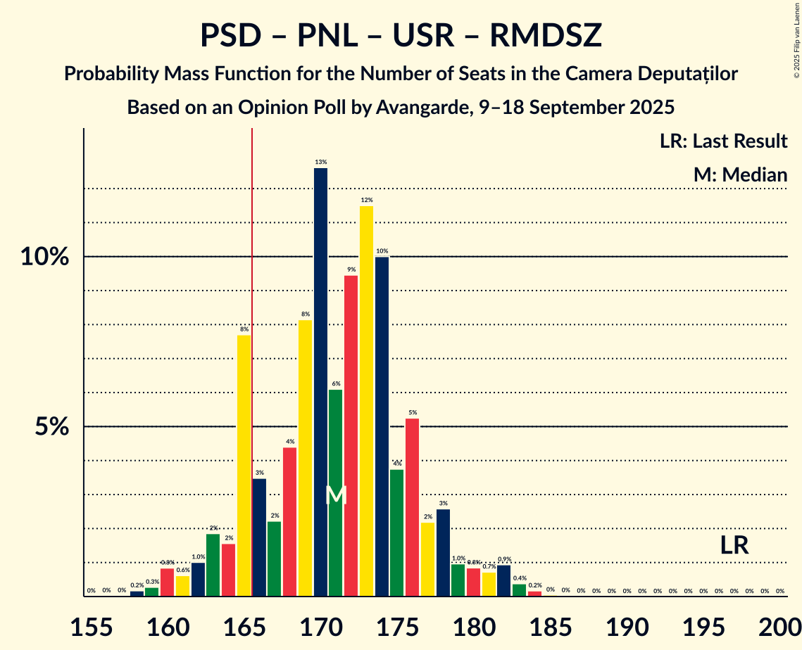

| Number of Seats | Probability | Accumulated | Special Marks |
|:---------------:|:-----------:|:-----------:|:-------------:|
| 156 | 0% | 100% |  |
| 157 | 0% | 99.9% |  |
| 158 | 0.2% | 99.9% |  |
| 159 | 0.3% | 99.7% |  |
| 160 | 0.8% | 99.5% |  |
| 161 | 0.6% | 98.6% |  |
| 162 | 1.0% | 98% |  |
| 163 | 2% | 97% |  |
| 164 | 2% | 95% |  |
| 165 | 8% | 94% |  |
| 166 | 3% | 86% | Majority |
| 167 | 2% | 82% |  |
| 168 | 4% | 80% |  |
| 169 | 8% | 76% |  |
| 170 | 13% | 68% | Median |
| 171 | 6% | 55% |  |
| 172 | 9% | 49% |  |
| 173 | 12% | 39% |  |
| 174 | 10% | 28% |  |
| 175 | 4% | 18% |  |
| 176 | 5% | 14% |  |
| 177 | 2% | 9% |  |
| 178 | 3% | 7% |  |
| 179 | 1.0% | 4% |  |
| 180 | 0.8% | 3% |  |
| 181 | 0.7% | 2% |  |
| 182 | 0.9% | 2% |  |
| 183 | 0.4% | 0.7% |  |
| 184 | 0.2% | 0.3% |  |
| 185 | 0% | 0.1% |  |
| 186 | 0% | 0.1% |  |
| 187 | 0% | 0% |  |
| 188 | 0% | 0% |  |
| 189 | 0% | 0% |  |
| 190 | 0% | 0% |  |
| 191 | 0% | 0% |  |
| 192 | 0% | 0% |  |
| 193 | 0% | 0% |  |
| 194 | 0% | 0% |  |
| 195 | 0% | 0% |  |
| 196 | 0% | 0% |  |
| 197 | 0% | 0% | Last Result |

### Partidul Social Democrat – Partidul Național Liberal – Uniunea Salvați România

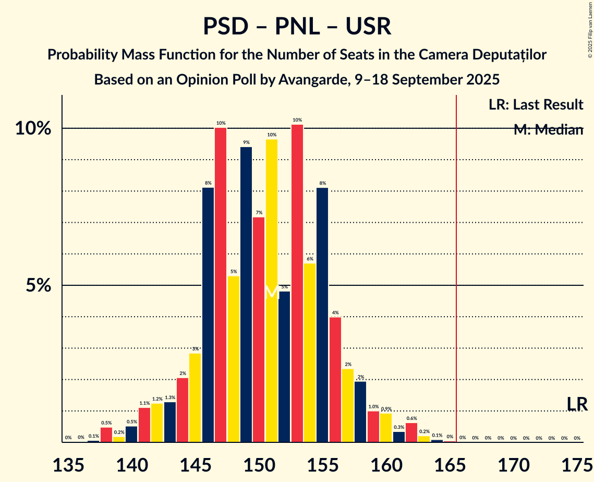

| Number of Seats | Probability | Accumulated | Special Marks |
|:---------------:|:-----------:|:-----------:|:-------------:|
| 136 | 0% | 100% |  |
| 137 | 0.1% | 99.9% |  |
| 138 | 0.5% | 99.9% |  |
| 139 | 0.2% | 99.4% |  |
| 140 | 0.5% | 99.2% |  |
| 141 | 1.1% | 98.7% |  |
| 142 | 1.2% | 98% |  |
| 143 | 1.3% | 96% |  |
| 144 | 2% | 95% |  |
| 145 | 3% | 93% |  |
| 146 | 8% | 90% |  |
| 147 | 10% | 82% |  |
| 148 | 5% | 72% |  |
| 149 | 9% | 67% |  |
| 150 | 7% | 57% | Median |
| 151 | 10% | 50% |  |
| 152 | 5% | 40% |  |
| 153 | 10% | 36% |  |
| 154 | 6% | 25% |  |
| 155 | 8% | 20% |  |
| 156 | 4% | 12% |  |
| 157 | 2% | 8% |  |
| 158 | 2% | 5% |  |
| 159 | 1.0% | 3% |  |
| 160 | 0.9% | 2% |  |
| 161 | 0.3% | 1.4% |  |
| 162 | 0.6% | 1.0% |  |
| 163 | 0.2% | 0.4% |  |
| 164 | 0.1% | 0.2% |  |
| 165 | 0% | 0.1% |  |
| 166 | 0% | 0% | Majority |
| 167 | 0% | 0% |  |
| 168 | 0% | 0% |  |
| 169 | 0% | 0% |  |
| 170 | 0% | 0% |  |
| 171 | 0% | 0% |  |
| 172 | 0% | 0% |  |
| 173 | 0% | 0% |  |
| 174 | 0% | 0% |  |
| 175 | 0% | 0% | Last Result |

### Alianța pentru Unirea Românilor

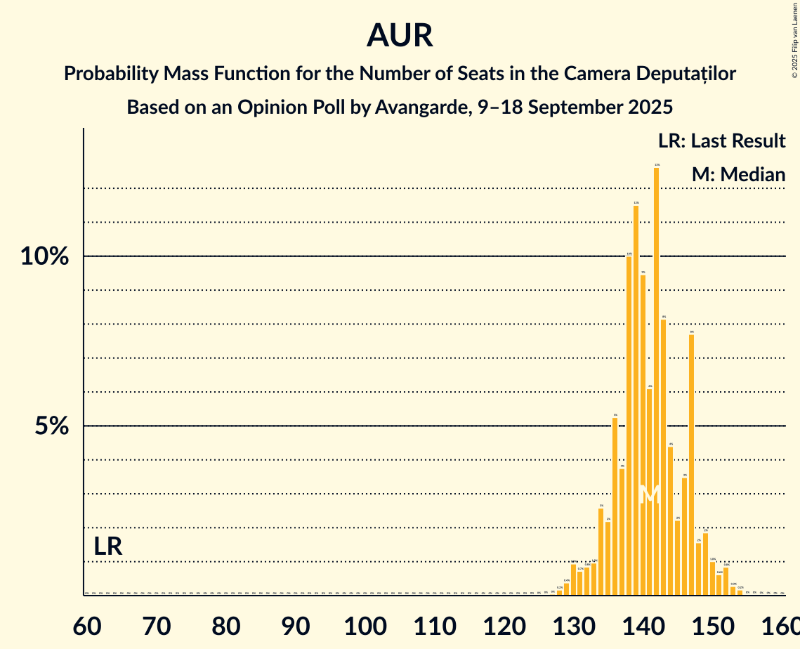

| Number of Seats | Probability | Accumulated | Special Marks |
|:---------------:|:-----------:|:-----------:|:-------------:|
| 63 | 0% | 100% | Last Result |
| 64 | 0% | 100% |  |
| 65 | 0% | 100% |  |
| 66 | 0% | 100% |  |
| 67 | 0% | 100% |  |
| 68 | 0% | 100% |  |
| 69 | 0% | 100% |  |
| 70 | 0% | 100% |  |
| 71 | 0% | 100% |  |
| 72 | 0% | 100% |  |
| 73 | 0% | 100% |  |
| 74 | 0% | 100% |  |
| 75 | 0% | 100% |  |
| 76 | 0% | 100% |  |
| 77 | 0% | 100% |  |
| 78 | 0% | 100% |  |
| 79 | 0% | 100% |  |
| 80 | 0% | 100% |  |
| 81 | 0% | 100% |  |
| 82 | 0% | 100% |  |
| 83 | 0% | 100% |  |
| 84 | 0% | 100% |  |
| 85 | 0% | 100% |  |
| 86 | 0% | 100% |  |
| 87 | 0% | 100% |  |
| 88 | 0% | 100% |  |
| 89 | 0% | 100% |  |
| 90 | 0% | 100% |  |
| 91 | 0% | 100% |  |
| 92 | 0% | 100% |  |
| 93 | 0% | 100% |  |
| 94 | 0% | 100% |  |
| 95 | 0% | 100% |  |
| 96 | 0% | 100% |  |
| 97 | 0% | 100% |  |
| 98 | 0% | 100% |  |
| 99 | 0% | 100% |  |
| 100 | 0% | 100% |  |
| 101 | 0% | 100% |  |
| 102 | 0% | 100% |  |
| 103 | 0% | 100% |  |
| 104 | 0% | 100% |  |
| 105 | 0% | 100% |  |
| 106 | 0% | 100% |  |
| 107 | 0% | 100% |  |
| 108 | 0% | 100% |  |
| 109 | 0% | 100% |  |
| 110 | 0% | 100% |  |
| 111 | 0% | 100% |  |
| 112 | 0% | 100% |  |
| 113 | 0% | 100% |  |
| 114 | 0% | 100% |  |
| 115 | 0% | 100% |  |
| 116 | 0% | 100% |  |
| 117 | 0% | 100% |  |
| 118 | 0% | 100% |  |
| 119 | 0% | 100% |  |
| 120 | 0% | 100% |  |
| 121 | 0% | 100% |  |
| 122 | 0% | 100% |  |
| 123 | 0% | 100% |  |
| 124 | 0% | 100% |  |
| 125 | 0% | 100% |  |
| 126 | 0% | 100% |  |
| 127 | 0% | 99.9% |  |
| 128 | 0.2% | 99.9% |  |
| 129 | 0.4% | 99.7% |  |
| 130 | 0.9% | 99.3% |  |
| 131 | 0.7% | 98% |  |
| 132 | 0.8% | 98% |  |
| 133 | 1.0% | 97% |  |
| 134 | 3% | 96% |  |
| 135 | 2% | 93% |  |
| 136 | 5% | 91% |  |
| 137 | 4% | 86% |  |
| 138 | 10% | 82% |  |
| 139 | 12% | 72% |  |
| 140 | 9% | 61% |  |
| 141 | 6% | 51% | Median |
| 142 | 13% | 45% |  |
| 143 | 8% | 32% |  |
| 144 | 4% | 24% |  |
| 145 | 2% | 20% |  |
| 146 | 3% | 18% |  |
| 147 | 8% | 14% |  |
| 148 | 2% | 6% |  |
| 149 | 2% | 5% |  |
| 150 | 1.0% | 3% |  |
| 151 | 0.6% | 2% |  |
| 152 | 0.8% | 1.4% |  |
| 153 | 0.3% | 0.5% |  |
| 154 | 0.2% | 0.3% |  |
| 155 | 0% | 0.1% |  |
| 156 | 0% | 0.1% |  |
| 157 | 0% | 0% |  |

### Partidul Social Democrat – Partidul Național Liberal – Romániai Magyar Demokrata Szövetség

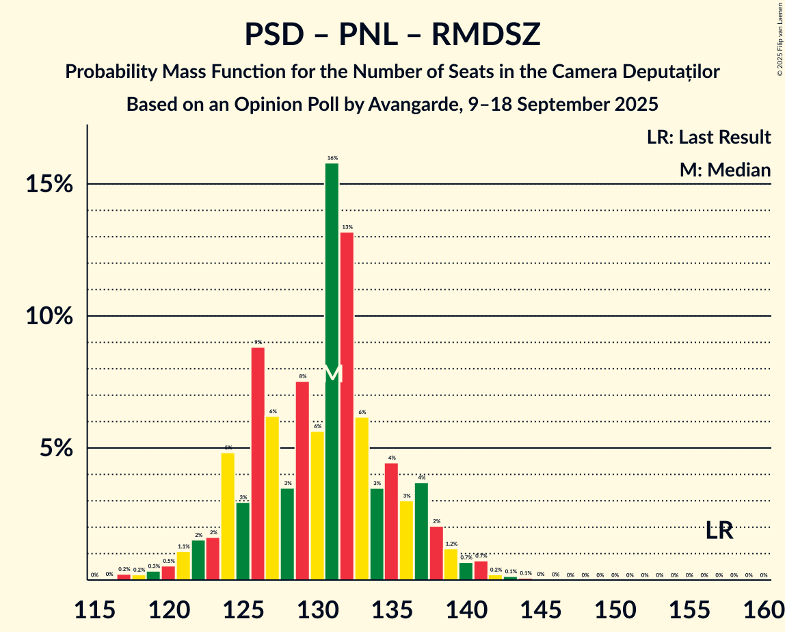

| Number of Seats | Probability | Accumulated | Special Marks |
|:---------------:|:-----------:|:-----------:|:-------------:|
| 116 | 0% | 100% |  |
| 117 | 0.2% | 99.9% |  |
| 118 | 0.2% | 99.7% |  |
| 119 | 0.3% | 99.5% |  |
| 120 | 0.5% | 99.2% |  |
| 121 | 1.1% | 98.6% |  |
| 122 | 2% | 98% |  |
| 123 | 2% | 96% |  |
| 124 | 5% | 94% |  |
| 125 | 3% | 90% |  |
| 126 | 9% | 87% |  |
| 127 | 6% | 78% |  |
| 128 | 3% | 72% |  |
| 129 | 8% | 68% | Median |
| 130 | 6% | 61% |  |
| 131 | 16% | 55% |  |
| 132 | 13% | 39% |  |
| 133 | 6% | 26% |  |
| 134 | 3% | 20% |  |
| 135 | 4% | 16% |  |
| 136 | 3% | 12% |  |
| 137 | 4% | 9% |  |
| 138 | 2% | 5% |  |
| 139 | 1.2% | 3% |  |
| 140 | 0.7% | 2% |  |
| 141 | 0.7% | 1.2% |  |
| 142 | 0.2% | 0.5% |  |
| 143 | 0.1% | 0.3% |  |
| 144 | 0.1% | 0.2% |  |
| 145 | 0% | 0.1% |  |
| 146 | 0% | 0% |  |
| 147 | 0% | 0% |  |
| 148 | 0% | 0% |  |
| 149 | 0% | 0% |  |
| 150 | 0% | 0% |  |
| 151 | 0% | 0% |  |
| 152 | 0% | 0% |  |
| 153 | 0% | 0% |  |
| 154 | 0% | 0% |  |
| 155 | 0% | 0% |  |
| 156 | 0% | 0% |  |
| 157 | 0% | 0% | Last Result |

### Partidul Social Democrat – Partidul Național Liberal

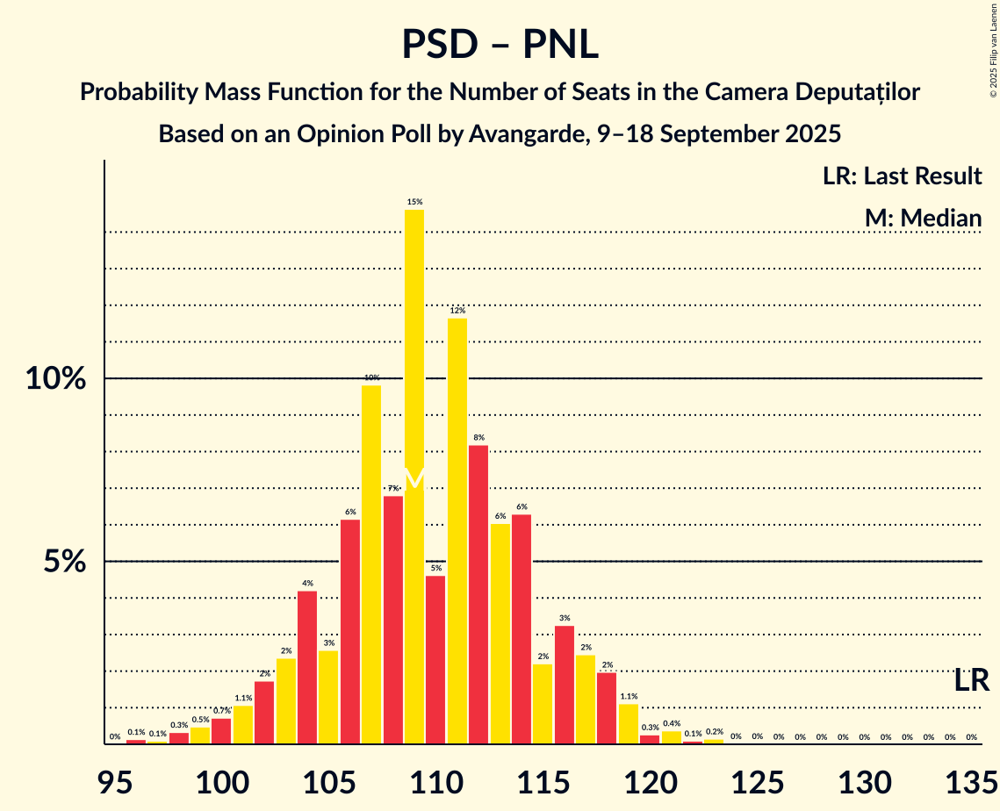

| Number of Seats | Probability | Accumulated | Special Marks |
|:---------------:|:-----------:|:-----------:|:-------------:|
| 96 | 0.1% | 100% |  |
| 97 | 0.1% | 99.8% |  |
| 98 | 0.3% | 99.7% |  |
| 99 | 0.5% | 99.4% |  |
| 100 | 0.7% | 98.9% |  |
| 101 | 1.1% | 98% |  |
| 102 | 2% | 97% |  |
| 103 | 2% | 95% |  |
| 104 | 4% | 93% |  |
| 105 | 3% | 89% |  |
| 106 | 6% | 86% |  |
| 107 | 10% | 80% |  |
| 108 | 7% | 70% |  |
| 109 | 15% | 63% | Median |
| 110 | 5% | 49% |  |
| 111 | 12% | 44% |  |
| 112 | 8% | 33% |  |
| 113 | 6% | 24% |  |
| 114 | 6% | 18% |  |
| 115 | 2% | 12% |  |
| 116 | 3% | 10% |  |
| 117 | 2% | 7% |  |
| 118 | 2% | 4% |  |
| 119 | 1.1% | 2% |  |
| 120 | 0.3% | 1.0% |  |
| 121 | 0.4% | 0.7% |  |
| 122 | 0.1% | 0.3% |  |
| 123 | 0.2% | 0.2% |  |
| 124 | 0% | 0.1% |  |
| 125 | 0% | 0% |  |
| 126 | 0% | 0% |  |
| 127 | 0% | 0% |  |
| 128 | 0% | 0% |  |
| 129 | 0% | 0% |  |
| 130 | 0% | 0% |  |
| 131 | 0% | 0% |  |
| 132 | 0% | 0% |  |
| 133 | 0% | 0% |  |
| 134 | 0% | 0% |  |
| 135 | 0% | 0% | Last Result |

### Partidul Social Democrat – Uniunea Salvați România

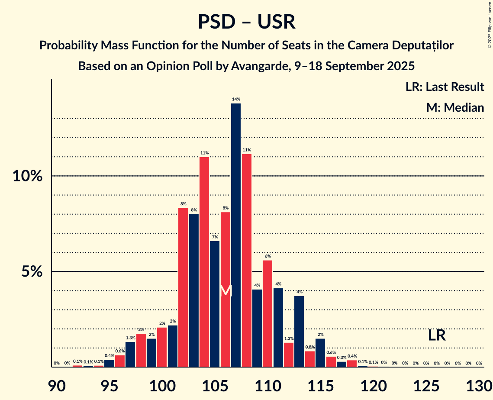

| Number of Seats | Probability | Accumulated | Special Marks |
|:---------------:|:-----------:|:-----------:|:-------------:|
| 92 | 0.1% | 100% |  |
| 93 | 0.1% | 99.9% |  |
| 94 | 0.1% | 99.8% |  |
| 95 | 0.4% | 99.7% |  |
| 96 | 0.6% | 99.3% |  |
| 97 | 1.3% | 98.7% |  |
| 98 | 2% | 97% |  |
| 99 | 2% | 96% |  |
| 100 | 2% | 94% |  |
| 101 | 2% | 92% |  |
| 102 | 8% | 90% |  |
| 103 | 8% | 81% |  |
| 104 | 11% | 73% |  |
| 105 | 7% | 62% |  |
| 106 | 8% | 56% | Median |
| 107 | 14% | 48% |  |
| 108 | 11% | 34% |  |
| 109 | 4% | 23% |  |
| 110 | 6% | 19% |  |
| 111 | 4% | 13% |  |
| 112 | 1.3% | 9% |  |
| 113 | 4% | 8% |  |
| 114 | 0.8% | 4% |  |
| 115 | 2% | 3% |  |
| 116 | 0.6% | 1.5% |  |
| 117 | 0.3% | 0.9% |  |
| 118 | 0.4% | 0.6% |  |
| 119 | 0.1% | 0.2% |  |
| 120 | 0.1% | 0.1% |  |
| 121 | 0% | 0.1% |  |
| 122 | 0% | 0% |  |
| 123 | 0% | 0% |  |
| 124 | 0% | 0% |  |
| 125 | 0% | 0% |  |
| 126 | 0% | 0% | Last Result |

### Partidul Național Liberal – Uniunea Salvați România – Romániai Magyar Demokrata Szövetség

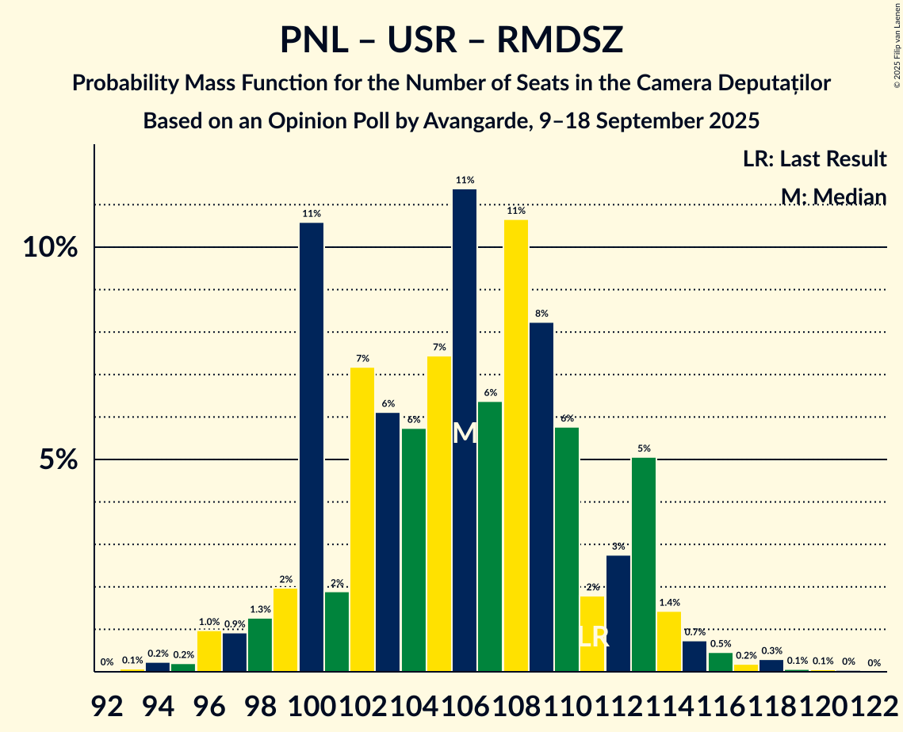

| Number of Seats | Probability | Accumulated | Special Marks |
|:---------------:|:-----------:|:-----------:|:-------------:|
| 92 | 0% | 100% |  |
| 93 | 0.1% | 99.9% |  |
| 94 | 0.2% | 99.8% |  |
| 95 | 0.2% | 99.6% |  |
| 96 | 1.0% | 99.4% |  |
| 97 | 0.9% | 98% |  |
| 98 | 1.3% | 98% |  |
| 99 | 2% | 96% |  |
| 100 | 11% | 94% |  |
| 101 | 2% | 84% |  |
| 102 | 7% | 82% |  |
| 103 | 6% | 75% |  |
| 104 | 6% | 68% |  |
| 105 | 7% | 63% | Median |
| 106 | 11% | 55% |  |
| 107 | 6% | 44% |  |
| 108 | 11% | 38% |  |
| 109 | 8% | 27% |  |
| 110 | 6% | 19% |  |
| 111 | 2% | 13% | Last Result |
| 112 | 3% | 11% |  |
| 113 | 5% | 8% |  |
| 114 | 1.4% | 3% |  |
| 115 | 0.7% | 2% |  |
| 116 | 0.5% | 1.1% |  |
| 117 | 0.2% | 0.7% |  |
| 118 | 0.3% | 0.5% |  |
| 119 | 0.1% | 0.2% |  |
| 120 | 0.1% | 0.1% |  |
| 121 | 0% | 0.1% |  |
| 122 | 0% | 0% |  |

### Partidul Național Liberal – Uniunea Salvați România

| Number of Seats | Probability | Accumulated | Special Marks |
|:---------------:|:-----------:|:-----------:|:-------------:|
| 72 | 0% | 100% |  |
| 73 | 0.1% | 99.9% |  |
| 74 | 0.1% | 99.9% |  |
| 75 | 0.3% | 99.8% |  |
| 76 | 1.2% | 99.5% |  |
| 77 | 1.4% | 98% |  |
| 78 | 1.2% | 97% |  |
| 79 | 1.5% | 96% |  |
| 80 | 2% | 94% |  |
| 81 | 11% | 92% |  |
| 82 | 10% | 81% |  |
| 83 | 12% | 72% |  |
| 84 | 4% | 60% |  |
| 85 | 8% | 56% | Median |
| 86 | 5% | 47% |  |
| 87 | 7% | 42% |  |
| 88 | 17% | 35% |  |
| 89 | 5% | 19% | Last Result |
| 90 | 5% | 14% |  |
| 91 | 2% | 8% |  |
| 92 | 2% | 6% |  |
| 93 | 1.1% | 4% |  |
| 94 | 1.4% | 3% |  |
| 95 | 0.5% | 1.2% |  |
| 96 | 0.3% | 0.7% |  |
| 97 | 0.2% | 0.4% |  |
| 98 | 0.1% | 0.2% |  |
| 99 | 0.1% | 0.1% |  |
| 100 | 0% | 0% |  |

### Partidul Social Democrat

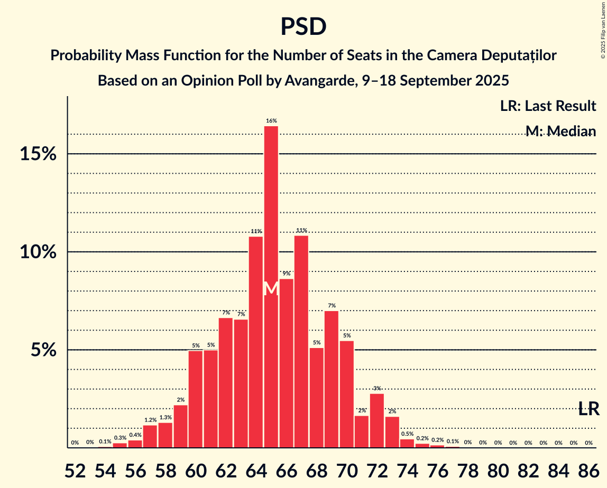

| Number of Seats | Probability | Accumulated | Special Marks |
|:---------------:|:-----------:|:-----------:|:-------------:|
| 53 | 0% | 100% |  |
| 54 | 0.1% | 99.9% |  |
| 55 | 0.3% | 99.9% |  |
| 56 | 0.4% | 99.6% |  |
| 57 | 1.2% | 99.2% |  |
| 58 | 1.3% | 98% |  |
| 59 | 2% | 97% |  |
| 60 | 5% | 95% |  |
| 61 | 5% | 90% |  |
| 62 | 7% | 85% |  |
| 63 | 7% | 78% |  |
| 64 | 11% | 71% |  |
| 65 | 16% | 61% | Median |
| 66 | 9% | 44% |  |
| 67 | 11% | 35% |  |
| 68 | 5% | 25% |  |
| 69 | 7% | 20% |  |
| 70 | 5% | 13% |  |
| 71 | 2% | 7% |  |
| 72 | 3% | 5% |  |
| 73 | 2% | 3% |  |
| 74 | 0.5% | 1.0% |  |
| 75 | 0.2% | 0.5% |  |
| 76 | 0.2% | 0.3% |  |
| 77 | 0.1% | 0.1% |  |
| 78 | 0% | 0.1% |  |
| 79 | 0% | 0% |  |
| 80 | 0% | 0% |  |
| 81 | 0% | 0% |  |
| 82 | 0% | 0% |  |
| 83 | 0% | 0% |  |
| 84 | 0% | 0% |  |
| 85 | 0% | 0% |  |
| 86 | 0% | 0% | Last Result |

### Partidul Național Liberal – Romániai Magyar Demokrata Szövetség

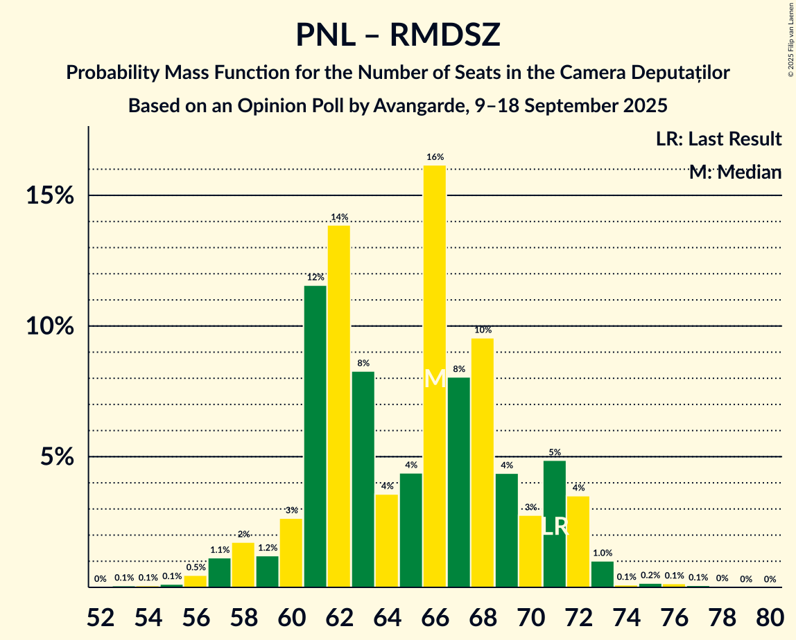

| Number of Seats | Probability | Accumulated | Special Marks |
|:---------------:|:-----------:|:-----------:|:-------------:|
| 53 | 0.1% | 100% |  |
| 54 | 0.1% | 99.9% |  |
| 55 | 0.1% | 99.8% |  |
| 56 | 0.5% | 99.7% |  |
| 57 | 1.1% | 99.2% |  |
| 58 | 2% | 98% |  |
| 59 | 1.2% | 96% |  |
| 60 | 3% | 95% |  |
| 61 | 12% | 93% |  |
| 62 | 14% | 81% |  |
| 63 | 8% | 67% |  |
| 64 | 4% | 59% | Median |
| 65 | 4% | 55% |  |
| 66 | 16% | 51% |  |
| 67 | 8% | 35% |  |
| 68 | 10% | 27% |  |
| 69 | 4% | 17% |  |
| 70 | 3% | 13% |  |
| 71 | 5% | 10% | Last Result |
| 72 | 4% | 5% |  |
| 73 | 1.0% | 2% |  |
| 74 | 0.1% | 0.6% |  |
| 75 | 0.2% | 0.5% |  |
| 76 | 0.1% | 0.3% |  |
| 77 | 0.1% | 0.1% |  |
| 78 | 0% | 0.1% |  |
| 79 | 0% | 0% |  |

### Partidul Național Liberal

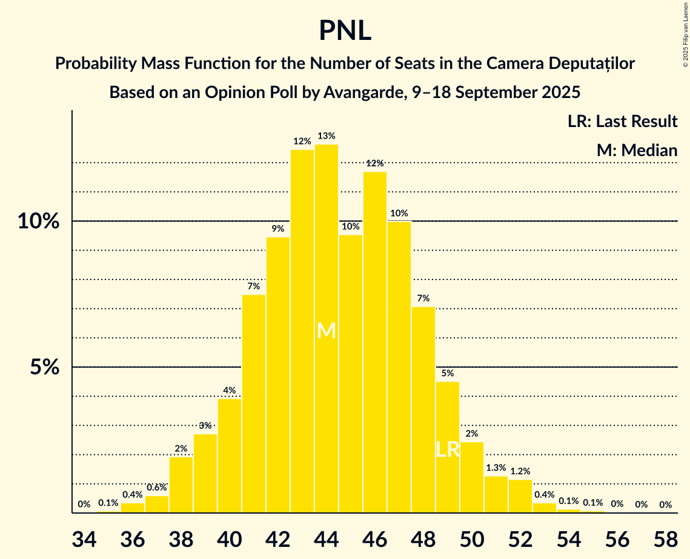

| Number of Seats | Probability | Accumulated | Special Marks |
|:---------------:|:-----------:|:-----------:|:-------------:|
| 35 | 0.1% | 100% |  |
| 36 | 0.4% | 99.9% |  |
| 37 | 0.6% | 99.5% |  |
| 38 | 2% | 98.9% |  |
| 39 | 3% | 97% |  |
| 40 | 4% | 94% |  |
| 41 | 7% | 90% |  |
| 42 | 9% | 83% |  |
| 43 | 12% | 73% |  |
| 44 | 13% | 61% | Median |
| 45 | 10% | 48% |  |
| 46 | 12% | 39% |  |
| 47 | 10% | 27% |  |
| 48 | 7% | 17% |  |
| 49 | 5% | 10% | Last Result |
| 50 | 2% | 5% |  |
| 51 | 1.3% | 3% |  |
| 52 | 1.2% | 2% |  |
| 53 | 0.4% | 0.6% |  |
| 54 | 0.1% | 0.3% |  |
| 55 | 0.1% | 0.1% |  |
| 56 | 0% | 0.1% |  |
| 57 | 0% | 0% |  |

## Technical Information

### Opinion Poll

+ **Polling firm:** Avangarde
+ **Commissioner(s):** —
+ **Fieldwork period:** 9–18 September 2025

### Calculations

+ **Sample size:** 1300
+ **Simulations done:** 2,097,152
+ **Error estimate:** 1.13%

