# Opinion Poll by CURS, 5–19 September 2025

<a href="#voting-intentions">Voting Intentions</a> | <a href="#seats">Seats</a> | <a href="#coalitions">Coalitions</a> | <a href="#technical-information">Technical Information</a>

## Voting Intentions

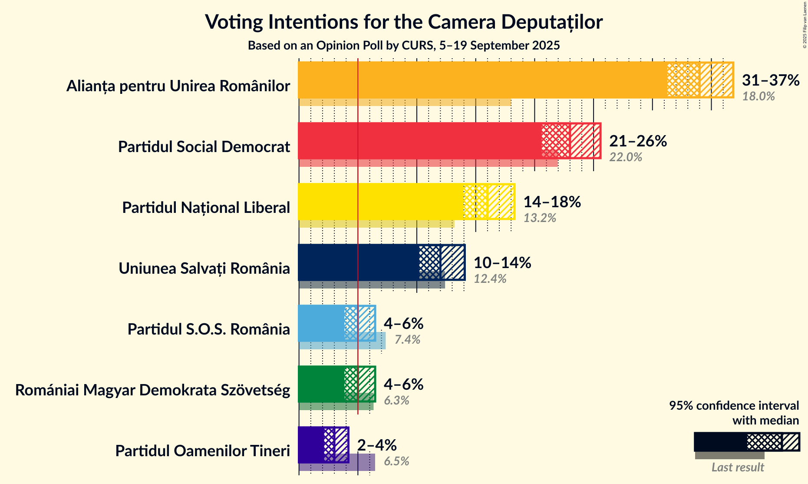

### Confidence Intervals

| Party | Last Result | Poll Result | 80% Confidence Interval | 90% Confidence Interval | 95% Confidence Interval | 99% Confidence Interval |
|:-----:|:-----------:|:-----------:|:-----------------------:|:-----------------------:|:-----------------------:|:-----------------------:|
| Alianța pentru Unirea Românilor | 18.0% | 34.0% | 32.2–35.9% |31.7–36.4% |31.3–36.9% |30.4–37.8% |
| Partidul Social Democrat | 22.0% | 23.0% | 21.4–24.7% |21.0–25.2% |20.6–25.6% |19.9–26.4% |
| Partidul Național Liberal | 13.2% | 16.0% | 14.6–17.5% |14.3–17.9% |13.9–18.3% |13.3–19.0% |
| Uniunea Salvați România | 12.4% | 12.0% | 10.8–13.4% |10.5–13.7% |10.2–14.1% |9.7–14.7% |
| Partidul S.O.S. România | 7.4% | 5.0% | 4.3–6.0% |4.0–6.2% |3.9–6.5% |3.5–7.0% |
| Romániai Magyar Demokrata Szövetség | 6.3% | 5.0% | 4.3–6.0% |4.0–6.2% |3.9–6.5% |3.5–7.0% |
| Partidul Oamenilor Tineri | 6.5% | 3.0% | 2.4–3.8% |2.3–4.0% |2.1–4.2% |1.9–4.6% |

*Note:* The poll result column reflects the actual value used in the calculations. Published results may vary slightly, and in addition be rounded to fewer digits.

## Seats

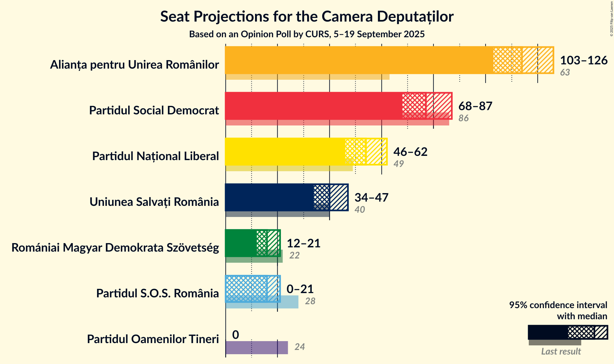

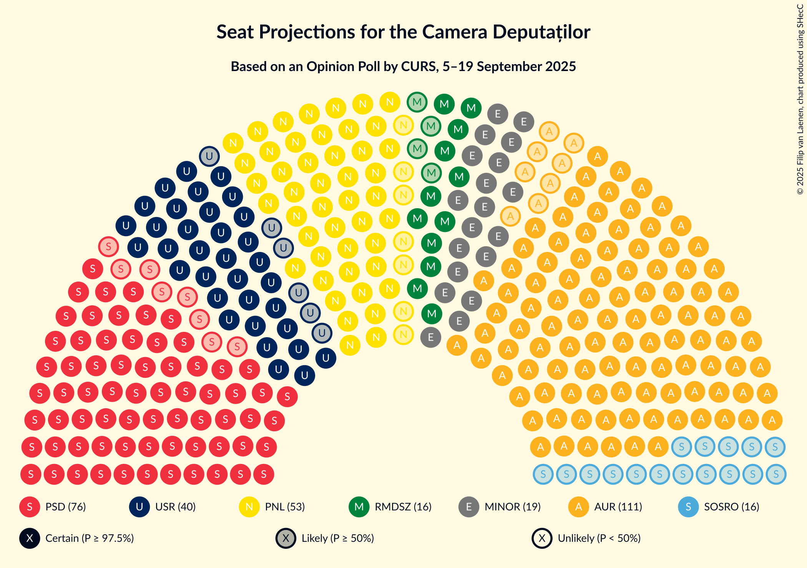

### Confidence Intervals

| Party | Last Result | Median | 80% Confidence Interval | 90% Confidence Interval | 95% Confidence Interval | 99% Confidence Interval |
|:-----:|:-----------:|:------:|:-----------------------:|:-----------------------:|:-----------------------:|:-----------------------:|
| <a href="#alianța-pentru-unirea-românilor">Alianța pentru Unirea Românilor</a> | 63 | 114 | 107–122 |105–124 |103–126 |101–129 |
| <a href="#partidul-social-democrat">Partidul Social Democrat</a> | 86 | 77 | 71–84 |70–86 |68–87 |66–90 |
| <a href="#partidul-național-liberal">Partidul Național Liberal</a> | 49 | 54 | 49–59 |47–61 |46–62 |44–65 |
| <a href="#uniunea-salvați-românia">Uniunea Salvați România</a> | 40 | 40 | 36–45 |35–46 |34–47 |32–50 |
| <a href="#partidul-s.o.s.-românia">Partidul S.O.S. România</a> | 28 | 16 | 0–19 |0–20 |0–21 |0–22 |
| <a href="#romániai-magyar-demokrata-szövetség">Romániai Magyar Demokrata Szövetség</a> | 22 | 16 | 14–20 |13–20 |12–21 |11–23 |
| <a href="#partidul-oamenilor-tineri">Partidul Oamenilor Tineri</a> | 24 | 0 | 0 |0 |0 |0 |

### Alianța pentru Unirea Românilor

*For a full overview of the results for this party, see the [Alianța pentru Unirea Românilor](party-alianțapentruunirearomânilor.html) page.*

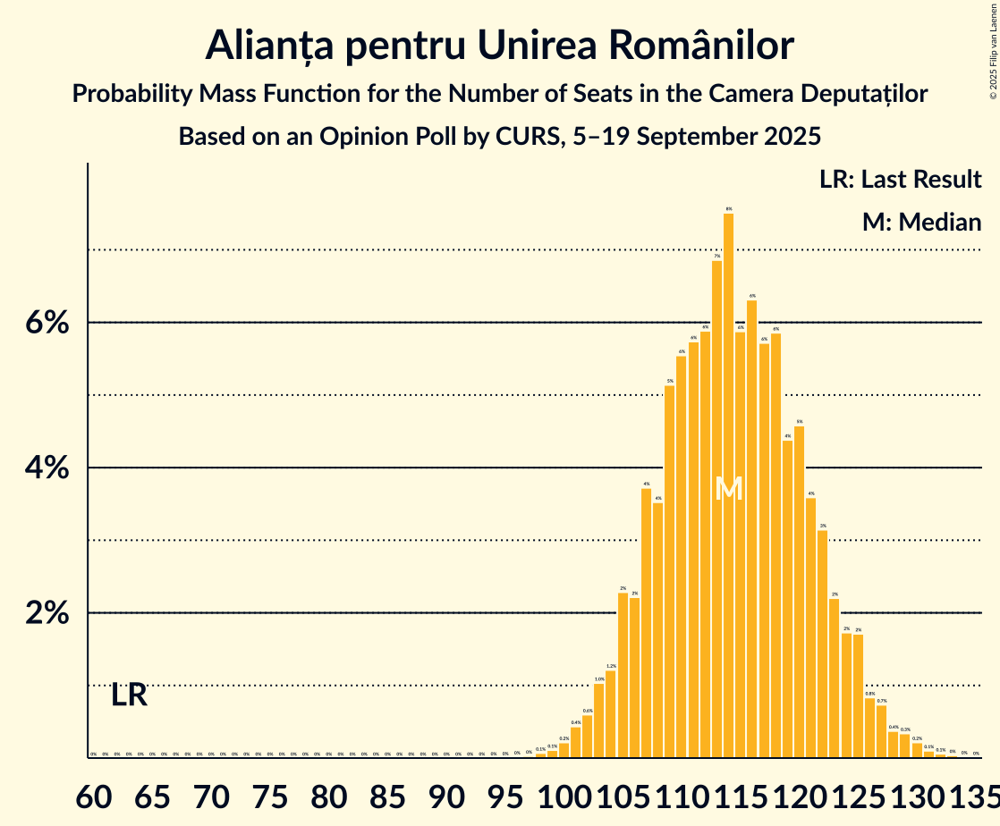

| Number of Seats | Probability | Accumulated | Special Marks |
|:---------------:|:-----------:|:-----------:|:-------------:|
| 63 | 0% | 100% | Last Result |
| 64 | 0% | 100% |  |
| 65 | 0% | 100% |  |
| 66 | 0% | 100% |  |
| 67 | 0% | 100% |  |
| 68 | 0% | 100% |  |
| 69 | 0% | 100% |  |
| 70 | 0% | 100% |  |
| 71 | 0% | 100% |  |
| 72 | 0% | 100% |  |
| 73 | 0% | 100% |  |
| 74 | 0% | 100% |  |
| 75 | 0% | 100% |  |
| 76 | 0% | 100% |  |
| 77 | 0% | 100% |  |
| 78 | 0% | 100% |  |
| 79 | 0% | 100% |  |
| 80 | 0% | 100% |  |
| 81 | 0% | 100% |  |
| 82 | 0% | 100% |  |
| 83 | 0% | 100% |  |
| 84 | 0% | 100% |  |
| 85 | 0% | 100% |  |
| 86 | 0% | 100% |  |
| 87 | 0% | 100% |  |
| 88 | 0% | 100% |  |
| 89 | 0% | 100% |  |
| 90 | 0% | 100% |  |
| 91 | 0% | 100% |  |
| 92 | 0% | 100% |  |
| 93 | 0% | 100% |  |
| 94 | 0% | 100% |  |
| 95 | 0% | 100% |  |
| 96 | 0% | 100% |  |
| 97 | 0% | 100% |  |
| 98 | 0.1% | 99.9% |  |
| 99 | 0.1% | 99.9% |  |
| 100 | 0.2% | 99.8% |  |
| 101 | 0.4% | 99.5% |  |
| 102 | 0.6% | 99.1% |  |
| 103 | 1.0% | 98.5% |  |
| 104 | 1.2% | 97% |  |
| 105 | 2% | 96% |  |
| 106 | 2% | 94% |  |
| 107 | 4% | 92% |  |
| 108 | 4% | 88% |  |
| 109 | 5% | 85% |  |
| 110 | 6% | 79% |  |
| 111 | 6% | 74% |  |
| 112 | 6% | 68% |  |
| 113 | 7% | 62% |  |
| 114 | 8% | 55% | Median |
| 115 | 6% | 48% |  |
| 116 | 6% | 42% |  |
| 117 | 6% | 36% |  |
| 118 | 6% | 30% |  |
| 119 | 4% | 24% |  |
| 120 | 5% | 20% |  |
| 121 | 4% | 15% |  |
| 122 | 3% | 12% |  |
| 123 | 2% | 8% |  |
| 124 | 2% | 6% |  |
| 125 | 2% | 4% |  |
| 126 | 0.8% | 3% |  |
| 127 | 0.7% | 2% |  |
| 128 | 0.4% | 1.2% |  |
| 129 | 0.3% | 0.8% |  |
| 130 | 0.2% | 0.5% |  |
| 131 | 0.1% | 0.2% |  |
| 132 | 0.1% | 0.1% |  |
| 133 | 0% | 0.1% |  |
| 134 | 0% | 0% |  |

### Partidul Social Democrat

*For a full overview of the results for this party, see the [Partidul Social Democrat](party-partidulsocialdemocrat.html) page.*

| Number of Seats | Probability | Accumulated | Special Marks |
|:---------------:|:-----------:|:-----------:|:-------------:|
| 63 | 0% | 100% |  |
| 64 | 0.1% | 99.9% |  |
| 65 | 0.3% | 99.8% |  |
| 66 | 0.4% | 99.5% |  |
| 67 | 0.6% | 99.2% |  |
| 68 | 1.4% | 98.5% |  |
| 69 | 2% | 97% |  |
| 70 | 3% | 95% |  |
| 71 | 4% | 93% |  |
| 72 | 4% | 89% |  |
| 73 | 7% | 85% |  |
| 74 | 6% | 78% |  |
| 75 | 6% | 72% |  |
| 76 | 9% | 66% |  |
| 77 | 8% | 56% | Median |
| 78 | 8% | 48% |  |
| 79 | 7% | 40% |  |
| 80 | 8% | 33% |  |
| 81 | 5% | 25% |  |
| 82 | 6% | 20% |  |
| 83 | 3% | 14% |  |
| 84 | 4% | 10% |  |
| 85 | 2% | 7% |  |
| 86 | 2% | 5% | Last Result |
| 87 | 1.1% | 3% |  |
| 88 | 0.9% | 2% |  |
| 89 | 0.4% | 1.1% |  |
| 90 | 0.4% | 0.8% |  |
| 91 | 0.2% | 0.4% |  |
| 92 | 0.1% | 0.2% |  |
| 93 | 0% | 0.1% |  |
| 94 | 0% | 0.1% |  |
| 95 | 0% | 0% |  |

### Partidul Național Liberal

*For a full overview of the results for this party, see the [Partidul Național Liberal](party-partidulnaționalliberal.html) page.*

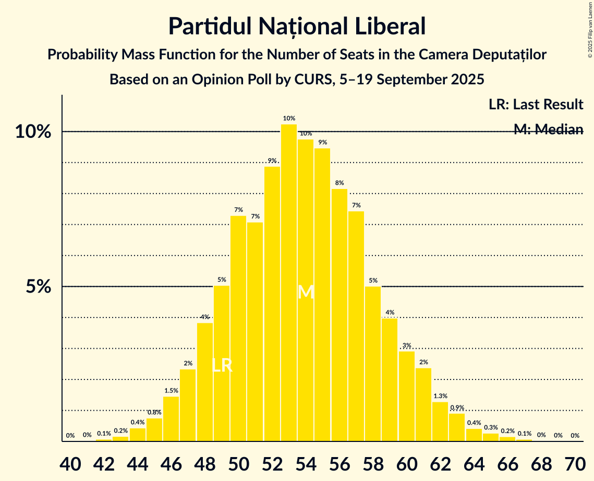

| Number of Seats | Probability | Accumulated | Special Marks |
|:---------------:|:-----------:|:-----------:|:-------------:|
| 42 | 0.1% | 100% |  |
| 43 | 0.2% | 99.9% |  |
| 44 | 0.4% | 99.7% |  |
| 45 | 0.8% | 99.3% |  |
| 46 | 1.5% | 98.5% |  |
| 47 | 2% | 97% |  |
| 48 | 4% | 95% |  |
| 49 | 5% | 91% | Last Result |
| 50 | 7% | 86% |  |
| 51 | 7% | 79% |  |
| 52 | 9% | 71% |  |
| 53 | 10% | 63% |  |
| 54 | 10% | 52% | Median |
| 55 | 9% | 43% |  |
| 56 | 8% | 33% |  |
| 57 | 7% | 25% |  |
| 58 | 5% | 17% |  |
| 59 | 4% | 12% |  |
| 60 | 3% | 8% |  |
| 61 | 2% | 6% |  |
| 62 | 1.3% | 3% |  |
| 63 | 0.9% | 2% |  |
| 64 | 0.4% | 1.0% |  |
| 65 | 0.3% | 0.6% |  |
| 66 | 0.2% | 0.3% |  |
| 67 | 0.1% | 0.1% |  |
| 68 | 0% | 0.1% |  |
| 69 | 0% | 0% |  |

### Uniunea Salvați România

*For a full overview of the results for this party, see the [Uniunea Salvați România](party-uniuneasalvațiromânia.html) page.*

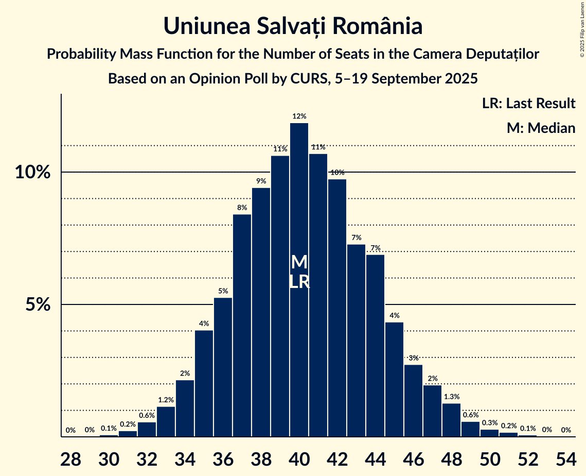

| Number of Seats | Probability | Accumulated | Special Marks |
|:---------------:|:-----------:|:-----------:|:-------------:|
| 30 | 0.1% | 100% |  |
| 31 | 0.2% | 99.9% |  |
| 32 | 0.6% | 99.7% |  |
| 33 | 1.2% | 99.1% |  |
| 34 | 2% | 98% |  |
| 35 | 4% | 96% |  |
| 36 | 5% | 92% |  |
| 37 | 8% | 86% |  |
| 38 | 9% | 78% |  |
| 39 | 11% | 69% |  |
| 40 | 12% | 58% | Last Result, Median |
| 41 | 11% | 46% |  |
| 42 | 10% | 35% |  |
| 43 | 7% | 26% |  |
| 44 | 7% | 18% |  |
| 45 | 4% | 12% |  |
| 46 | 3% | 7% |  |
| 47 | 2% | 4% |  |
| 48 | 1.3% | 2% |  |
| 49 | 0.6% | 1.2% |  |
| 50 | 0.3% | 0.6% |  |
| 51 | 0.2% | 0.3% |  |
| 52 | 0.1% | 0.1% |  |
| 53 | 0% | 0.1% |  |
| 54 | 0% | 0% |  |

### Partidul S.O.S. România

*For a full overview of the results for this party, see the [Partidul S.O.S. România](party-partidulsosromânia.html) page.*

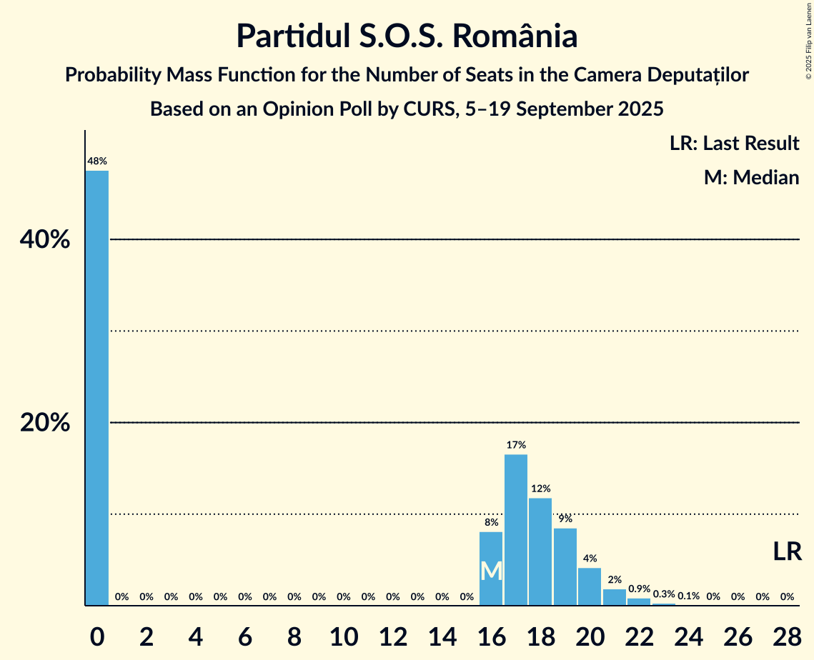

| Number of Seats | Probability | Accumulated | Special Marks |
|:---------------:|:-----------:|:-----------:|:-------------:|
| 0 | 48% | 100% |  |
| 1 | 0% | 52% |  |
| 2 | 0% | 52% |  |
| 3 | 0% | 52% |  |
| 4 | 0% | 52% |  |
| 5 | 0% | 52% |  |
| 6 | 0% | 52% |  |
| 7 | 0% | 52% |  |
| 8 | 0% | 52% |  |
| 9 | 0% | 52% |  |
| 10 | 0% | 52% |  |
| 11 | 0% | 52% |  |
| 12 | 0% | 52% |  |
| 13 | 0% | 52% |  |
| 14 | 0% | 52% |  |
| 15 | 0% | 52% |  |
| 16 | 8% | 52% | Median |
| 17 | 17% | 44% |  |
| 18 | 12% | 28% |  |
| 19 | 9% | 16% |  |
| 20 | 4% | 7% |  |
| 21 | 2% | 3% |  |
| 22 | 0.9% | 1.3% |  |
| 23 | 0.3% | 0.4% |  |
| 24 | 0.1% | 0.1% |  |
| 25 | 0% | 0% |  |
| 26 | 0% | 0% |  |
| 27 | 0% | 0% |  |
| 28 | 0% | 0% | Last Result |

### Romániai Magyar Demokrata Szövetség

*For a full overview of the results for this party, see the [Romániai Magyar Demokrata Szövetség](party-romániaimagyardemokrataszövetség.html) page.*

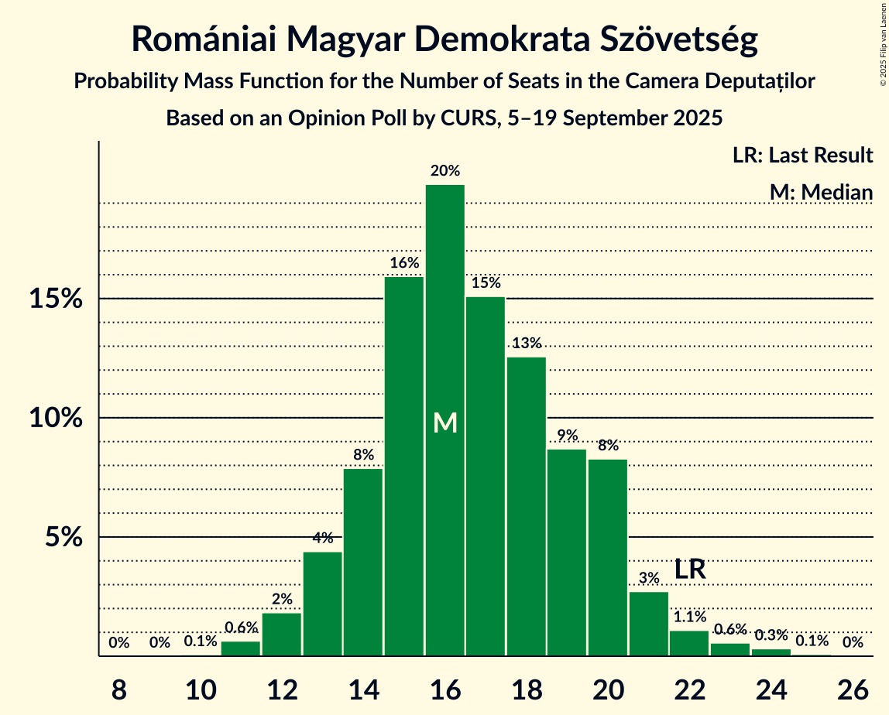

| Number of Seats | Probability | Accumulated | Special Marks |
|:---------------:|:-----------:|:-----------:|:-------------:|
| 10 | 0.1% | 100% |  |
| 11 | 0.6% | 99.9% |  |
| 12 | 2% | 99.3% |  |
| 13 | 4% | 97% |  |
| 14 | 8% | 93% |  |
| 15 | 16% | 85% |  |
| 16 | 20% | 69% | Median |
| 17 | 15% | 49% |  |
| 18 | 13% | 34% |  |
| 19 | 9% | 22% |  |
| 20 | 8% | 13% |  |
| 21 | 3% | 5% |  |
| 22 | 1.1% | 2% | Last Result |
| 23 | 0.6% | 1.0% |  |
| 24 | 0.3% | 0.4% |  |
| 25 | 0.1% | 0.1% |  |
| 26 | 0% | 0% |  |

### Partidul Oamenilor Tineri

*For a full overview of the results for this party, see the [Partidul Oamenilor Tineri](party-partiduloamenilortineri.html) page.*

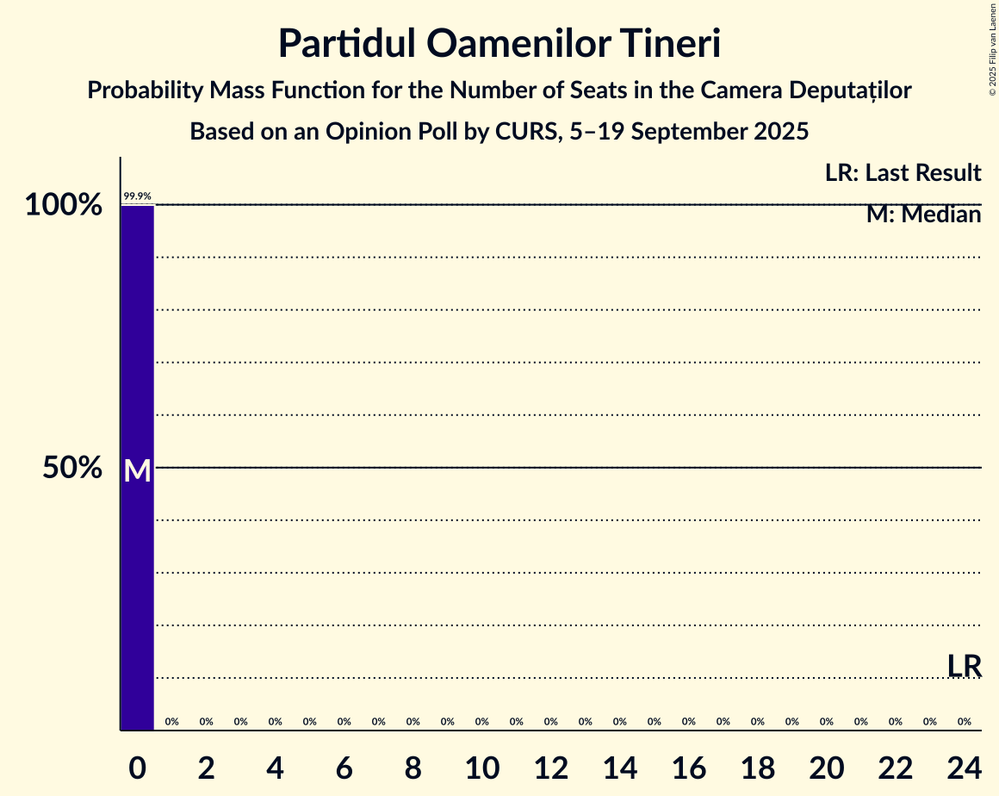

| Number of Seats | Probability | Accumulated | Special Marks |
|:---------------:|:-----------:|:-----------:|:-------------:|
| 0 | 99.9% | 100% | Median |
| 1 | 0% | 0.1% |  |
| 2 | 0% | 0.1% |  |
| 3 | 0% | 0.1% |  |
| 4 | 0% | 0.1% |  |
| 5 | 0% | 0.1% |  |
| 6 | 0% | 0.1% |  |
| 7 | 0% | 0.1% |  |
| 8 | 0% | 0.1% |  |
| 9 | 0% | 0.1% |  |
| 10 | 0% | 0.1% |  |
| 11 | 0% | 0.1% |  |
| 12 | 0% | 0.1% |  |
| 13 | 0% | 0.1% |  |
| 14 | 0% | 0.1% |  |
| 15 | 0% | 0.1% |  |
| 16 | 0% | 0.1% |  |
| 17 | 0% | 0% |  |
| 18 | 0% | 0% |  |
| 19 | 0% | 0% |  |
| 20 | 0% | 0% |  |
| 21 | 0% | 0% |  |
| 22 | 0% | 0% |  |
| 23 | 0% | 0% |  |
| 24 | 0% | 0% | Last Result |

## Coalitions

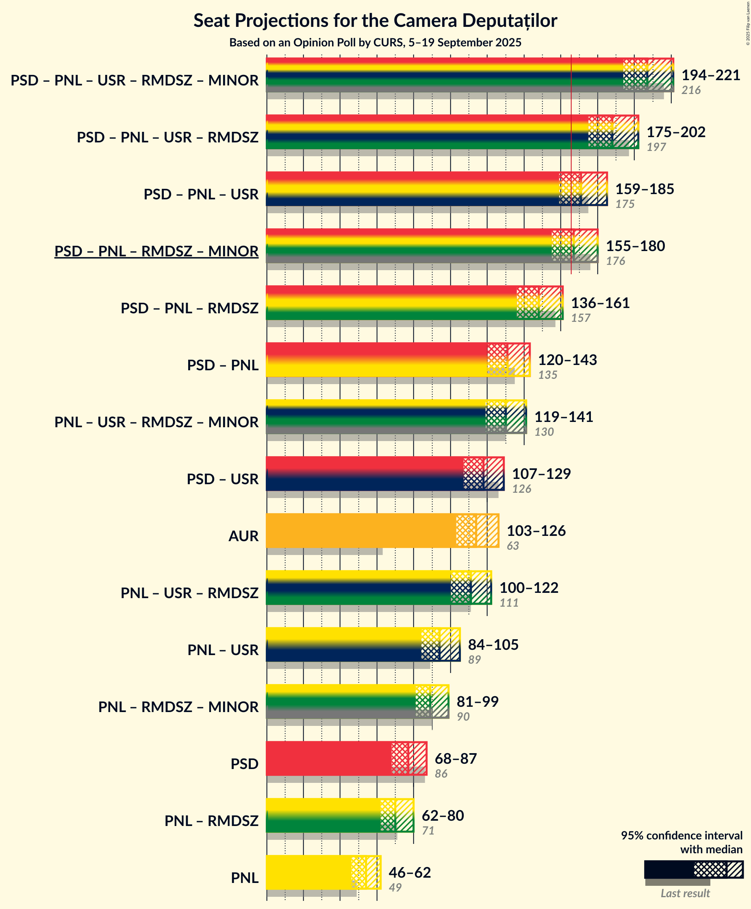

### Confidence Intervals

| Coalition | Last Result | Median | Majority? | 80% Confidence Interval | 90% Confidence Interval | 95% Confidence Interval | 99% Confidence Interval |
|:---------:|:-----------:|:------:|:---------:|:-----------------------:|:-----------------------:|:-----------------------:|:-----------------------:|
| Partidul Social Democrat – Partidul Național Liberal – Uniunea Salvați România – Romániai Magyar Demokrata Szövetség | 197 | 188 | 100% | 179–198 | 177–200 | 175–202 | 172–205 |
| Partidul Social Democrat – Partidul Național Liberal – Uniunea Salvați România | 175 | 171 | 78% | 162–181 | 161–183 | 159–185 | 156–188 |
| Partidul Social Democrat – Partidul Național Liberal – Romániai Magyar Demokrata Szövetség | 157 | 148 | 0.2% | 140–157 | 138–159 | 136–161 | 133–164 |
| Partidul Social Democrat – Partidul Național Liberal | 135 | 131 | 0% | 123–139 | 121–142 | 120–143 | 117–147 |
| Partidul Social Democrat – Uniunea Salvați România | 126 | 118 | 0% | 110–125 | 108–127 | 107–129 | 104–133 |
| Alianța pentru Unirea Românilor | 63 | 114 | 0% | 107–122 | 105–124 | 103–126 | 101–129 |
| Partidul Național Liberal – Uniunea Salvați România – Romániai Magyar Demokrata Szövetség | 111 | 111 | 0% | 103–118 | 102–120 | 100–122 | 97–126 |
| Partidul Național Liberal – Uniunea Salvați România | 89 | 94 | 0% | 87–101 | 86–103 | 84–105 | 81–108 |
| Partidul Social Democrat | 86 | 77 | 0% | 71–84 | 70–86 | 68–87 | 66–90 |
| Partidul Național Liberal – Romániai Magyar Demokrata Szövetség | 71 | 70 | 0% | 65–76 | 63–78 | 62–80 | 59–83 |
| Partidul Național Liberal | 49 | 54 | 0% | 49–59 | 47–61 | 46–62 | 44–65 |

### Partidul Social Democrat – Partidul Național Liberal – Uniunea Salvați România – Romániai Magyar Demokrata Szövetség

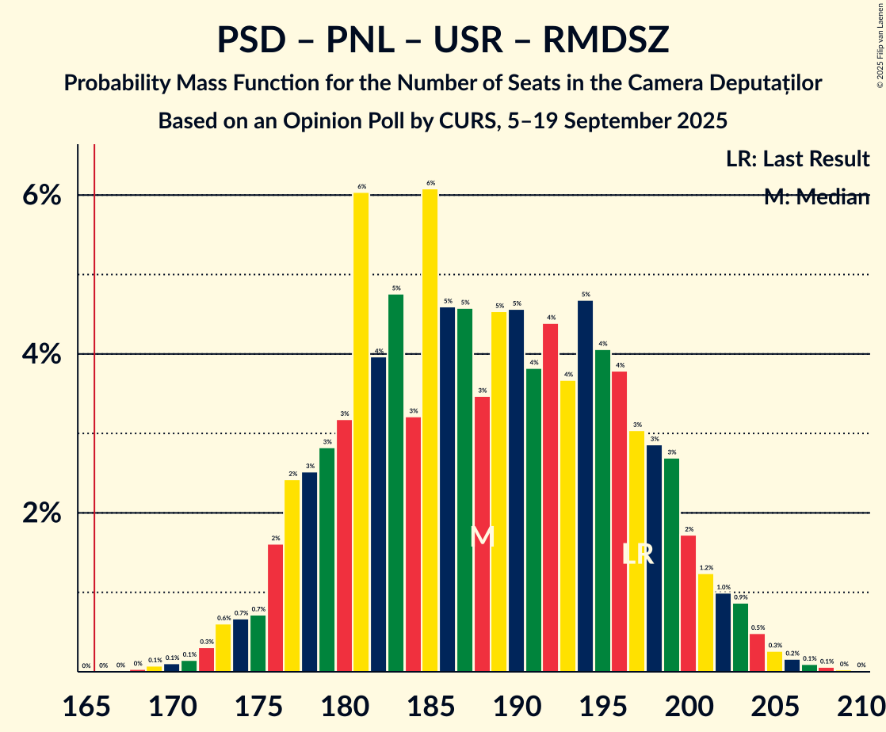

| Number of Seats | Probability | Accumulated | Special Marks |
|:---------------:|:-----------:|:-----------:|:-------------:|
| 168 | 0% | 100% |  |
| 169 | 0.1% | 99.9% |  |
| 170 | 0.1% | 99.9% |  |
| 171 | 0.1% | 99.8% |  |
| 172 | 0.3% | 99.6% |  |
| 173 | 0.6% | 99.3% |  |
| 174 | 0.7% | 98.7% |  |
| 175 | 0.7% | 98% |  |
| 176 | 2% | 97% |  |
| 177 | 2% | 96% |  |
| 178 | 3% | 93% |  |
| 179 | 3% | 91% |  |
| 180 | 3% | 88% |  |
| 181 | 6% | 85% |  |
| 182 | 4% | 79% |  |
| 183 | 5% | 75% |  |
| 184 | 3% | 70% |  |
| 185 | 6% | 67% |  |
| 186 | 5% | 61% |  |
| 187 | 5% | 56% | Median |
| 188 | 3% | 52% |  |
| 189 | 5% | 48% |  |
| 190 | 5% | 44% |  |
| 191 | 4% | 39% |  |
| 192 | 4% | 35% |  |
| 193 | 4% | 31% |  |
| 194 | 5% | 27% |  |
| 195 | 4% | 22% |  |
| 196 | 4% | 18% |  |
| 197 | 3% | 15% | Last Result |
| 198 | 3% | 11% |  |
| 199 | 3% | 9% |  |
| 200 | 2% | 6% |  |
| 201 | 1.2% | 4% |  |
| 202 | 1.0% | 3% |  |
| 203 | 0.9% | 2% |  |
| 204 | 0.5% | 1.1% |  |
| 205 | 0.3% | 0.6% |  |
| 206 | 0.2% | 0.4% |  |
| 207 | 0.1% | 0.2% |  |
| 208 | 0.1% | 0.1% |  |
| 209 | 0% | 0.1% |  |
| 210 | 0% | 0% |  |

### Partidul Social Democrat – Partidul Național Liberal – Uniunea Salvați România

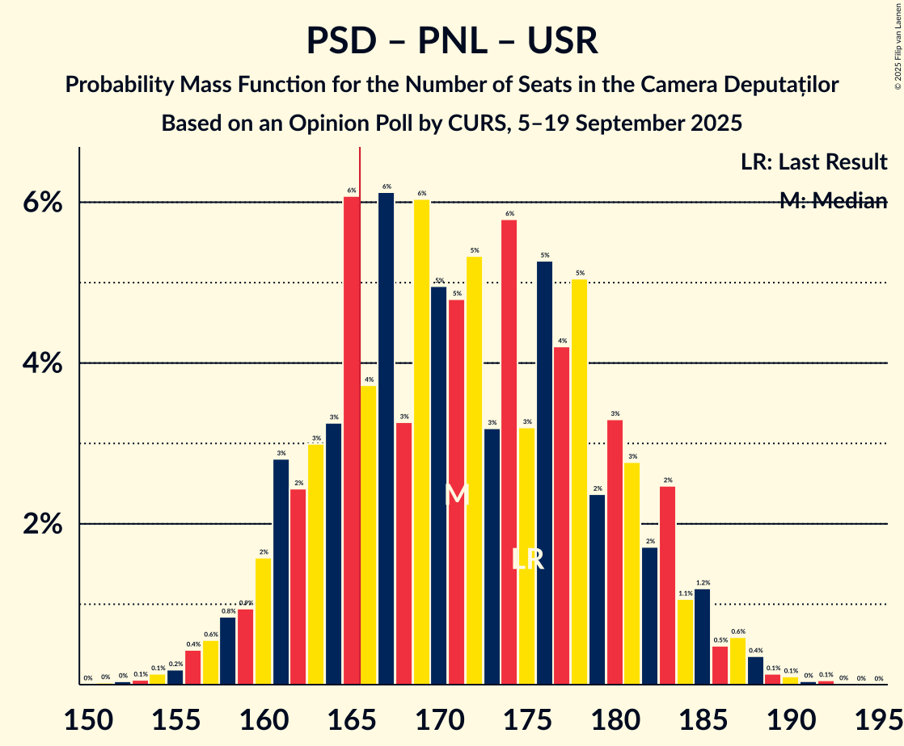

| Number of Seats | Probability | Accumulated | Special Marks |
|:---------------:|:-----------:|:-----------:|:-------------:|
| 152 | 0% | 100% |  |
| 153 | 0.1% | 99.9% |  |
| 154 | 0.1% | 99.9% |  |
| 155 | 0.2% | 99.7% |  |
| 156 | 0.4% | 99.5% |  |
| 157 | 0.6% | 99.1% |  |
| 158 | 0.8% | 98.5% |  |
| 159 | 0.9% | 98% |  |
| 160 | 2% | 97% |  |
| 161 | 3% | 95% |  |
| 162 | 2% | 92% |  |
| 163 | 3% | 90% |  |
| 164 | 3% | 87% |  |
| 165 | 6% | 84% |  |
| 166 | 4% | 78% | Majority |
| 167 | 6% | 74% |  |
| 168 | 3% | 68% |  |
| 169 | 6% | 64% |  |
| 170 | 5% | 58% |  |
| 171 | 5% | 53% | Median |
| 172 | 5% | 49% |  |
| 173 | 3% | 43% |  |
| 174 | 6% | 40% |  |
| 175 | 3% | 34% | Last Result |
| 176 | 5% | 31% |  |
| 177 | 4% | 26% |  |
| 178 | 5% | 22% |  |
| 179 | 2% | 17% |  |
| 180 | 3% | 14% |  |
| 181 | 3% | 11% |  |
| 182 | 2% | 8% |  |
| 183 | 2% | 7% |  |
| 184 | 1.1% | 4% |  |
| 185 | 1.2% | 3% |  |
| 186 | 0.5% | 2% |  |
| 187 | 0.6% | 1.3% |  |
| 188 | 0.4% | 0.7% |  |
| 189 | 0.1% | 0.4% |  |
| 190 | 0.1% | 0.2% |  |
| 191 | 0% | 0.1% |  |
| 192 | 0.1% | 0.1% |  |
| 193 | 0% | 0% |  |

### Partidul Social Democrat – Partidul Național Liberal – Romániai Magyar Demokrata Szövetség

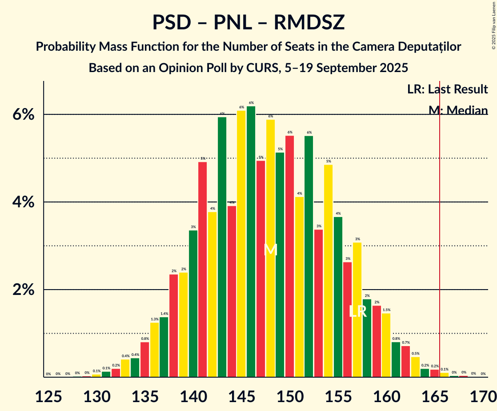

| Number of Seats | Probability | Accumulated | Special Marks |
|:---------------:|:-----------:|:-----------:|:-------------:|
| 129 | 0% | 100% |  |
| 130 | 0.1% | 99.9% |  |
| 131 | 0.1% | 99.9% |  |
| 132 | 0.2% | 99.7% |  |
| 133 | 0.4% | 99.5% |  |
| 134 | 0.4% | 99.1% |  |
| 135 | 0.8% | 98.7% |  |
| 136 | 1.3% | 98% |  |
| 137 | 1.4% | 97% |  |
| 138 | 2% | 95% |  |
| 139 | 2% | 93% |  |
| 140 | 3% | 90% |  |
| 141 | 5% | 87% |  |
| 142 | 4% | 82% |  |
| 143 | 6% | 78% |  |
| 144 | 4% | 72% |  |
| 145 | 6% | 69% |  |
| 146 | 6% | 62% |  |
| 147 | 5% | 56% | Median |
| 148 | 6% | 51% |  |
| 149 | 5% | 45% |  |
| 150 | 6% | 40% |  |
| 151 | 4% | 35% |  |
| 152 | 6% | 31% |  |
| 153 | 3% | 25% |  |
| 154 | 5% | 22% |  |
| 155 | 4% | 17% |  |
| 156 | 3% | 13% |  |
| 157 | 3% | 11% | Last Result |
| 158 | 2% | 7% |  |
| 159 | 2% | 6% |  |
| 160 | 1.5% | 4% |  |
| 161 | 0.8% | 3% |  |
| 162 | 0.7% | 2% |  |
| 163 | 0.5% | 1.1% |  |
| 164 | 0.2% | 0.6% |  |
| 165 | 0.2% | 0.4% |  |
| 166 | 0.1% | 0.2% | Majority |
| 167 | 0% | 0.1% |  |
| 168 | 0% | 0.1% |  |
| 169 | 0% | 0% |  |

### Partidul Social Democrat – Partidul Național Liberal

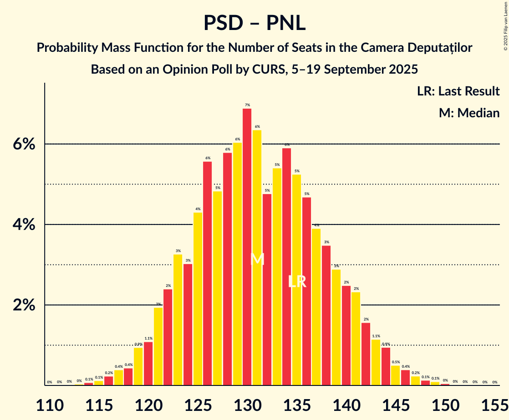

| Number of Seats | Probability | Accumulated | Special Marks |
|:---------------:|:-----------:|:-----------:|:-------------:|
| 113 | 0% | 100% |  |
| 114 | 0.1% | 99.9% |  |
| 115 | 0.1% | 99.9% |  |
| 116 | 0.2% | 99.7% |  |
| 117 | 0.4% | 99.5% |  |
| 118 | 0.4% | 99.1% |  |
| 119 | 0.9% | 98.7% |  |
| 120 | 1.1% | 98% |  |
| 121 | 2% | 97% |  |
| 122 | 2% | 95% |  |
| 123 | 3% | 92% |  |
| 124 | 3% | 89% |  |
| 125 | 4% | 86% |  |
| 126 | 6% | 82% |  |
| 127 | 5% | 76% |  |
| 128 | 6% | 71% |  |
| 129 | 6% | 66% |  |
| 130 | 7% | 59% |  |
| 131 | 6% | 53% | Median |
| 132 | 5% | 46% |  |
| 133 | 5% | 41% |  |
| 134 | 6% | 36% |  |
| 135 | 5% | 30% | Last Result |
| 136 | 5% | 25% |  |
| 137 | 4% | 20% |  |
| 138 | 3% | 16% |  |
| 139 | 3% | 13% |  |
| 140 | 2% | 10% |  |
| 141 | 2% | 7% |  |
| 142 | 2% | 5% |  |
| 143 | 1.1% | 4% |  |
| 144 | 0.9% | 2% |  |
| 145 | 0.5% | 1.5% |  |
| 146 | 0.4% | 1.0% |  |
| 147 | 0.2% | 0.6% |  |
| 148 | 0.1% | 0.3% |  |
| 149 | 0.1% | 0.2% |  |
| 150 | 0% | 0.1% |  |
| 151 | 0% | 0% |  |

### Partidul Social Democrat – Uniunea Salvați România

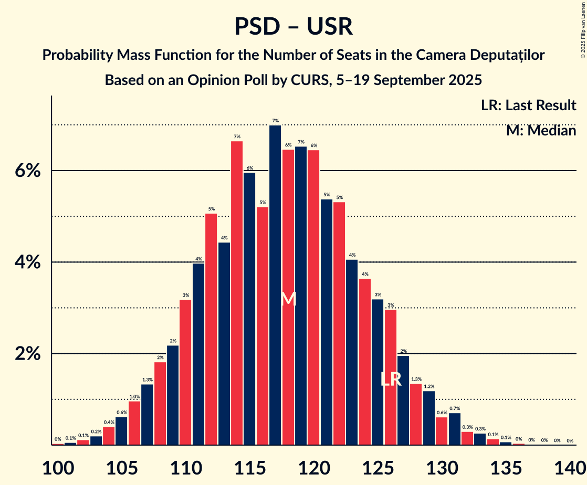

| Number of Seats | Probability | Accumulated | Special Marks |
|:---------------:|:-----------:|:-----------:|:-------------:|
| 100 | 0% | 100% |  |
| 101 | 0.1% | 99.9% |  |
| 102 | 0.1% | 99.9% |  |
| 103 | 0.2% | 99.8% |  |
| 104 | 0.4% | 99.6% |  |
| 105 | 0.6% | 99.1% |  |
| 106 | 1.0% | 98.5% |  |
| 107 | 1.3% | 98% |  |
| 108 | 2% | 96% |  |
| 109 | 2% | 94% |  |
| 110 | 3% | 92% |  |
| 111 | 4% | 89% |  |
| 112 | 5% | 85% |  |
| 113 | 4% | 80% |  |
| 114 | 7% | 76% |  |
| 115 | 6% | 69% |  |
| 116 | 5% | 63% |  |
| 117 | 7% | 58% | Median |
| 118 | 6% | 51% |  |
| 119 | 7% | 44% |  |
| 120 | 6% | 38% |  |
| 121 | 5% | 31% |  |
| 122 | 5% | 26% |  |
| 123 | 4% | 21% |  |
| 124 | 4% | 16% |  |
| 125 | 3% | 13% |  |
| 126 | 3% | 10% | Last Result |
| 127 | 2% | 7% |  |
| 128 | 1.3% | 5% |  |
| 129 | 1.2% | 3% |  |
| 130 | 0.6% | 2% |  |
| 131 | 0.7% | 2% |  |
| 132 | 0.3% | 0.9% |  |
| 133 | 0.3% | 0.6% |  |
| 134 | 0.1% | 0.3% |  |
| 135 | 0.1% | 0.2% |  |
| 136 | 0% | 0.1% |  |
| 137 | 0% | 0% |  |

### Alianța pentru Unirea Românilor

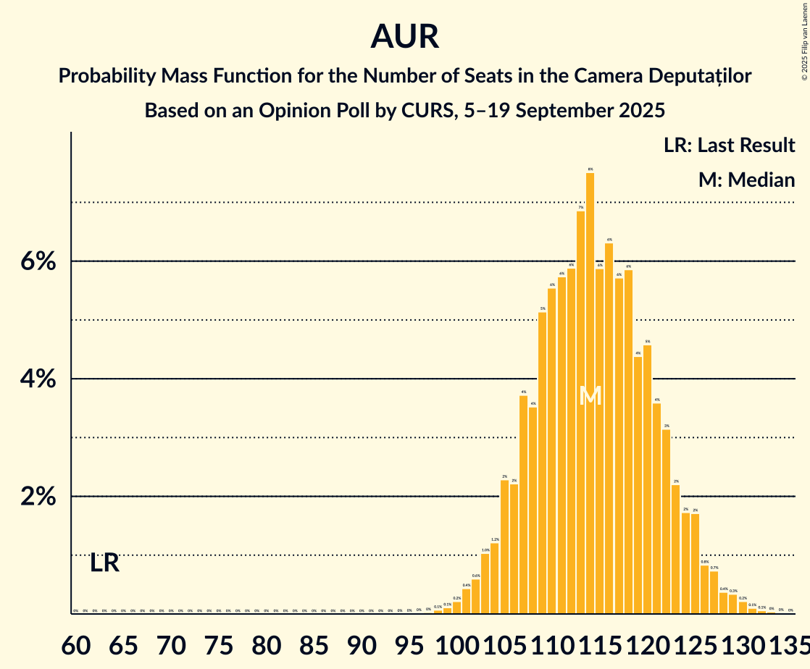

| Number of Seats | Probability | Accumulated | Special Marks |
|:---------------:|:-----------:|:-----------:|:-------------:|
| 63 | 0% | 100% | Last Result |
| 64 | 0% | 100% |  |
| 65 | 0% | 100% |  |
| 66 | 0% | 100% |  |
| 67 | 0% | 100% |  |
| 68 | 0% | 100% |  |
| 69 | 0% | 100% |  |
| 70 | 0% | 100% |  |
| 71 | 0% | 100% |  |
| 72 | 0% | 100% |  |
| 73 | 0% | 100% |  |
| 74 | 0% | 100% |  |
| 75 | 0% | 100% |  |
| 76 | 0% | 100% |  |
| 77 | 0% | 100% |  |
| 78 | 0% | 100% |  |
| 79 | 0% | 100% |  |
| 80 | 0% | 100% |  |
| 81 | 0% | 100% |  |
| 82 | 0% | 100% |  |
| 83 | 0% | 100% |  |
| 84 | 0% | 100% |  |
| 85 | 0% | 100% |  |
| 86 | 0% | 100% |  |
| 87 | 0% | 100% |  |
| 88 | 0% | 100% |  |
| 89 | 0% | 100% |  |
| 90 | 0% | 100% |  |
| 91 | 0% | 100% |  |
| 92 | 0% | 100% |  |
| 93 | 0% | 100% |  |
| 94 | 0% | 100% |  |
| 95 | 0% | 100% |  |
| 96 | 0% | 100% |  |
| 97 | 0% | 100% |  |
| 98 | 0.1% | 99.9% |  |
| 99 | 0.1% | 99.9% |  |
| 100 | 0.2% | 99.8% |  |
| 101 | 0.4% | 99.5% |  |
| 102 | 0.6% | 99.1% |  |
| 103 | 1.0% | 98.5% |  |
| 104 | 1.2% | 97% |  |
| 105 | 2% | 96% |  |
| 106 | 2% | 94% |  |
| 107 | 4% | 92% |  |
| 108 | 4% | 88% |  |
| 109 | 5% | 85% |  |
| 110 | 6% | 79% |  |
| 111 | 6% | 74% |  |
| 112 | 6% | 68% |  |
| 113 | 7% | 62% |  |
| 114 | 8% | 55% | Median |
| 115 | 6% | 48% |  |
| 116 | 6% | 42% |  |
| 117 | 6% | 36% |  |
| 118 | 6% | 30% |  |
| 119 | 4% | 24% |  |
| 120 | 5% | 20% |  |
| 121 | 4% | 15% |  |
| 122 | 3% | 12% |  |
| 123 | 2% | 8% |  |
| 124 | 2% | 6% |  |
| 125 | 2% | 4% |  |
| 126 | 0.8% | 3% |  |
| 127 | 0.7% | 2% |  |
| 128 | 0.4% | 1.2% |  |
| 129 | 0.3% | 0.8% |  |
| 130 | 0.2% | 0.5% |  |
| 131 | 0.1% | 0.2% |  |
| 132 | 0.1% | 0.1% |  |
| 133 | 0% | 0.1% |  |
| 134 | 0% | 0% |  |

### Partidul Național Liberal – Uniunea Salvați România – Romániai Magyar Demokrata Szövetség

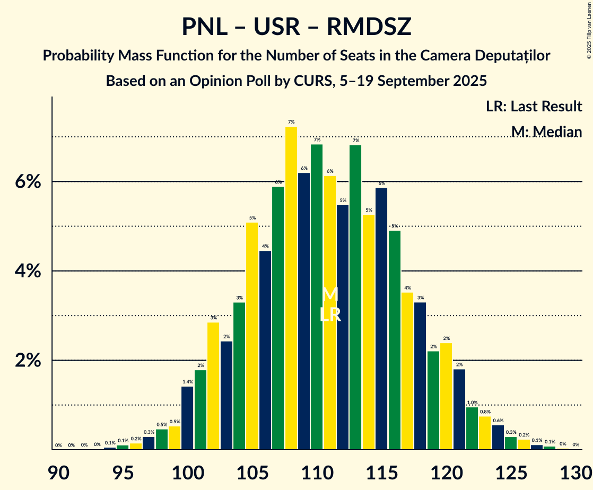

| Number of Seats | Probability | Accumulated | Special Marks |
|:---------------:|:-----------:|:-----------:|:-------------:|
| 94 | 0.1% | 100% |  |
| 95 | 0.1% | 99.9% |  |
| 96 | 0.2% | 99.8% |  |
| 97 | 0.3% | 99.6% |  |
| 98 | 0.5% | 99.3% |  |
| 99 | 0.5% | 98.9% |  |
| 100 | 1.4% | 98% |  |
| 101 | 2% | 97% |  |
| 102 | 3% | 95% |  |
| 103 | 2% | 92% |  |
| 104 | 3% | 90% |  |
| 105 | 5% | 87% |  |
| 106 | 4% | 81% |  |
| 107 | 6% | 77% |  |
| 108 | 7% | 71% |  |
| 109 | 6% | 64% |  |
| 110 | 7% | 58% | Median |
| 111 | 6% | 51% | Last Result |
| 112 | 5% | 45% |  |
| 113 | 7% | 39% |  |
| 114 | 5% | 32% |  |
| 115 | 6% | 27% |  |
| 116 | 5% | 21% |  |
| 117 | 4% | 16% |  |
| 118 | 3% | 13% |  |
| 119 | 2% | 9% |  |
| 120 | 2% | 7% |  |
| 121 | 2% | 5% |  |
| 122 | 1.0% | 3% |  |
| 123 | 0.8% | 2% |  |
| 124 | 0.6% | 1.4% |  |
| 125 | 0.3% | 0.8% |  |
| 126 | 0.2% | 0.5% |  |
| 127 | 0.1% | 0.3% |  |
| 128 | 0.1% | 0.2% |  |
| 129 | 0% | 0.1% |  |
| 130 | 0% | 0% |  |

### Partidul Național Liberal – Uniunea Salvați România

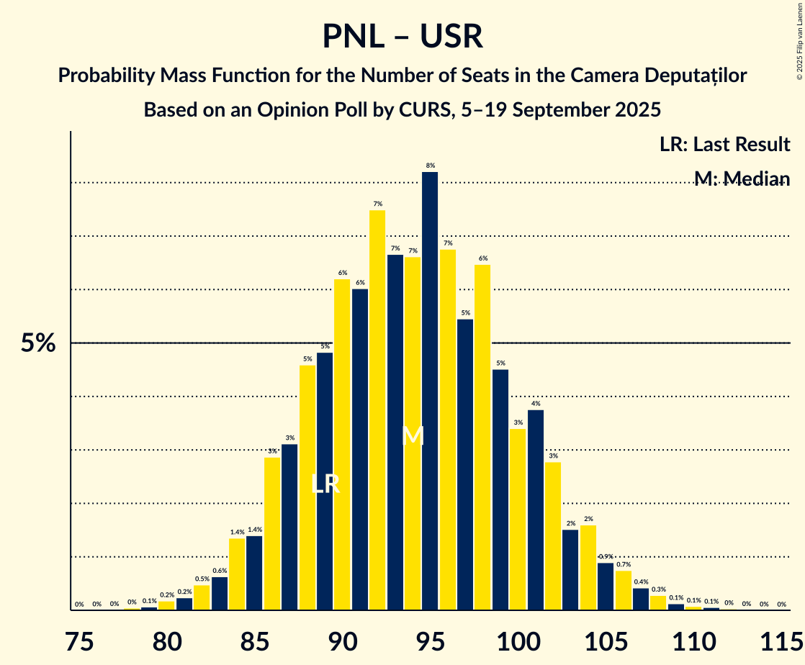

| Number of Seats | Probability | Accumulated | Special Marks |
|:---------------:|:-----------:|:-----------:|:-------------:|
| 78 | 0% | 100% |  |
| 79 | 0.1% | 99.9% |  |
| 80 | 0.2% | 99.9% |  |
| 81 | 0.2% | 99.7% |  |
| 82 | 0.5% | 99.4% |  |
| 83 | 0.6% | 99.0% |  |
| 84 | 1.4% | 98% |  |
| 85 | 1.4% | 97% |  |
| 86 | 3% | 96% |  |
| 87 | 3% | 93% |  |
| 88 | 5% | 90% |  |
| 89 | 5% | 85% | Last Result |
| 90 | 6% | 80% |  |
| 91 | 6% | 74% |  |
| 92 | 7% | 68% |  |
| 93 | 7% | 60% |  |
| 94 | 7% | 54% | Median |
| 95 | 8% | 47% |  |
| 96 | 7% | 39% |  |
| 97 | 5% | 32% |  |
| 98 | 6% | 27% |  |
| 99 | 5% | 20% |  |
| 100 | 3% | 16% |  |
| 101 | 4% | 12% |  |
| 102 | 3% | 9% |  |
| 103 | 2% | 6% |  |
| 104 | 2% | 4% |  |
| 105 | 0.9% | 3% |  |
| 106 | 0.7% | 2% |  |
| 107 | 0.4% | 1.0% |  |
| 108 | 0.3% | 0.6% |  |
| 109 | 0.1% | 0.3% |  |
| 110 | 0.1% | 0.2% |  |
| 111 | 0.1% | 0.1% |  |
| 112 | 0% | 0.1% |  |
| 113 | 0% | 0% |  |

### Partidul Social Democrat

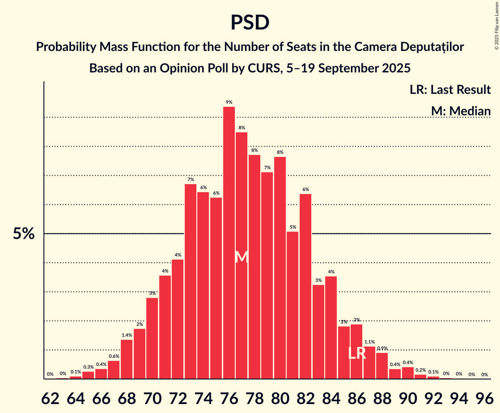

| Number of Seats | Probability | Accumulated | Special Marks |
|:---------------:|:-----------:|:-----------:|:-------------:|
| 63 | 0% | 100% |  |
| 64 | 0.1% | 99.9% |  |
| 65 | 0.3% | 99.8% |  |
| 66 | 0.4% | 99.5% |  |
| 67 | 0.6% | 99.2% |  |
| 68 | 1.4% | 98.5% |  |
| 69 | 2% | 97% |  |
| 70 | 3% | 95% |  |
| 71 | 4% | 93% |  |
| 72 | 4% | 89% |  |
| 73 | 7% | 85% |  |
| 74 | 6% | 78% |  |
| 75 | 6% | 72% |  |
| 76 | 9% | 66% |  |
| 77 | 8% | 56% | Median |
| 78 | 8% | 48% |  |
| 79 | 7% | 40% |  |
| 80 | 8% | 33% |  |
| 81 | 5% | 25% |  |
| 82 | 6% | 20% |  |
| 83 | 3% | 14% |  |
| 84 | 4% | 10% |  |
| 85 | 2% | 7% |  |
| 86 | 2% | 5% | Last Result |
| 87 | 1.1% | 3% |  |
| 88 | 0.9% | 2% |  |
| 89 | 0.4% | 1.1% |  |
| 90 | 0.4% | 0.8% |  |
| 91 | 0.2% | 0.4% |  |
| 92 | 0.1% | 0.2% |  |
| 93 | 0% | 0.1% |  |
| 94 | 0% | 0.1% |  |
| 95 | 0% | 0% |  |

### Partidul Național Liberal – Romániai Magyar Demokrata Szövetség

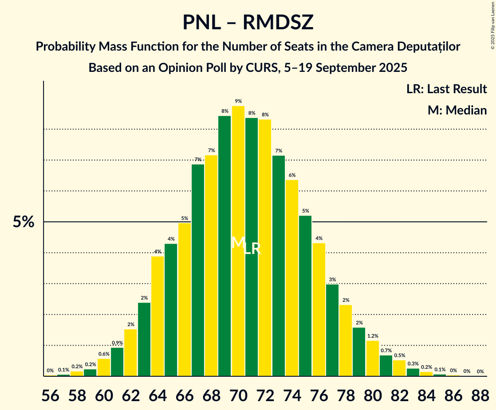

| Number of Seats | Probability | Accumulated | Special Marks |
|:---------------:|:-----------:|:-----------:|:-------------:|
| 56 | 0% | 100% |  |
| 57 | 0.1% | 99.9% |  |
| 58 | 0.2% | 99.9% |  |
| 59 | 0.2% | 99.7% |  |
| 60 | 0.6% | 99.5% |  |
| 61 | 0.9% | 98.9% |  |
| 62 | 2% | 98% |  |
| 63 | 2% | 96% |  |
| 64 | 4% | 94% |  |
| 65 | 4% | 90% |  |
| 66 | 5% | 86% |  |
| 67 | 7% | 81% |  |
| 68 | 7% | 74% |  |
| 69 | 8% | 67% |  |
| 70 | 9% | 58% | Median |
| 71 | 8% | 50% | Last Result |
| 72 | 8% | 41% |  |
| 73 | 7% | 33% |  |
| 74 | 6% | 26% |  |
| 75 | 5% | 19% |  |
| 76 | 4% | 14% |  |
| 77 | 3% | 10% |  |
| 78 | 2% | 7% |  |
| 79 | 2% | 5% |  |
| 80 | 1.2% | 3% |  |
| 81 | 0.7% | 2% |  |
| 82 | 0.5% | 1.1% |  |
| 83 | 0.3% | 0.6% |  |
| 84 | 0.2% | 0.3% |  |
| 85 | 0.1% | 0.2% |  |
| 86 | 0% | 0.1% |  |
| 87 | 0% | 0% |  |

### Partidul Național Liberal

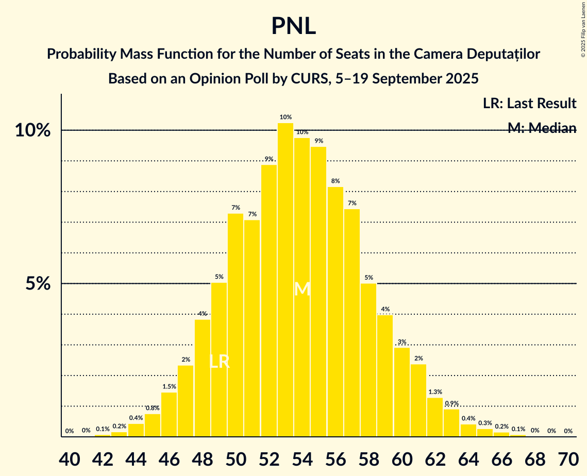

| Number of Seats | Probability | Accumulated | Special Marks |
|:---------------:|:-----------:|:-----------:|:-------------:|
| 42 | 0.1% | 100% |  |
| 43 | 0.2% | 99.9% |  |
| 44 | 0.4% | 99.7% |  |
| 45 | 0.8% | 99.3% |  |
| 46 | 1.5% | 98.5% |  |
| 47 | 2% | 97% |  |
| 48 | 4% | 95% |  |
| 49 | 5% | 91% | Last Result |
| 50 | 7% | 86% |  |
| 51 | 7% | 79% |  |
| 52 | 9% | 71% |  |
| 53 | 10% | 63% |  |
| 54 | 10% | 52% | Median |
| 55 | 9% | 43% |  |
| 56 | 8% | 33% |  |
| 57 | 7% | 25% |  |
| 58 | 5% | 17% |  |
| 59 | 4% | 12% |  |
| 60 | 3% | 8% |  |
| 61 | 2% | 6% |  |
| 62 | 1.3% | 3% |  |
| 63 | 0.9% | 2% |  |
| 64 | 0.4% | 1.0% |  |
| 65 | 0.3% | 0.6% |  |
| 66 | 0.2% | 0.3% |  |
| 67 | 0.1% | 0.1% |  |
| 68 | 0% | 0.1% |  |
| 69 | 0% | 0% |  |

## Technical Information

### Opinion Poll

+ **Polling firm:** CURS
+ **Commissioner(s):** —
+ **Fieldwork period:** 5–19 September 2025

### Calculations

+ **Sample size:** 1100
+ **Simulations done:** 2,097,152
+ **Error estimate:** 0.55%

