# Opinion Poll by INSCOP for Informat.ro, 25 October–2 November 2025

<a href="#voting-intentions">Voting Intentions</a> | <a href="#seats">Seats</a> | <a href="#coalitions">Coalitions</a> | <a href="#technical-information">Technical Information</a>

## Voting Intentions

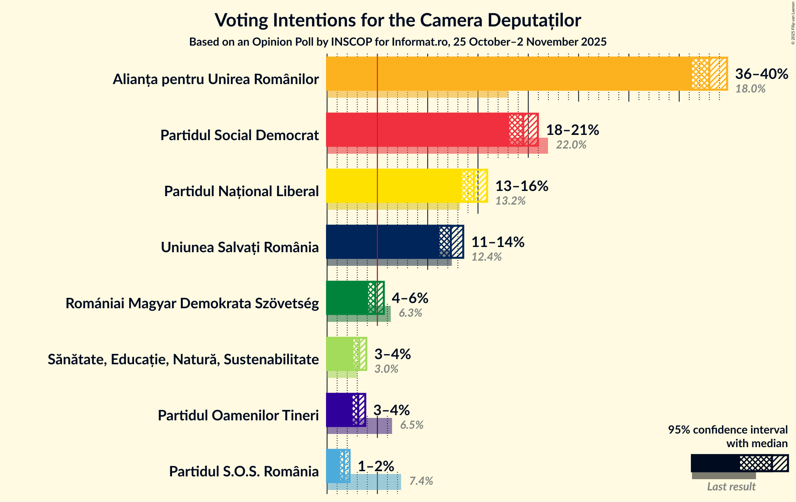

### Confidence Intervals

| Party | Last Result | Poll Result | 80% Confidence Interval | 90% Confidence Interval | 95% Confidence Interval | 99% Confidence Interval |
|:-----:|:-----------:|:-----------:|:-----------------------:|:-----------------------:|:-----------------------:|:-----------------------:|
| Alianța pentru Unirea Românilor | 18.0% | 38.0% | 36.9–39.2% |36.5–39.5% |36.3–39.8% |35.7–40.3% |
| Partidul Social Democrat | 22.0% | 19.5% | 18.6–20.5% |18.3–20.7% |18.1–21.0% |17.7–21.4% |
| Partidul Național Liberal | 13.2% | 14.6% | 13.8–15.5% |13.6–15.7% |13.4–15.9% |13.0–16.3% |
| Uniunea Salvați România | 12.4% | 12.3% | 11.6–13.1% |11.3–13.3% |11.2–13.5% |10.8–13.9% |
| Romániai Magyar Demokrata Szövetség | 6.3% | 4.8% | 4.3–5.3% |4.2–5.5% |4.1–5.6% |3.9–5.9% |
| Sănătate, Educație, Natură, Sustenabilitate | 3.0% | 3.2% | 2.8–3.7% |2.7–3.8% |2.6–3.9% |2.5–4.1% |
| Partidul Oamenilor Tineri | 6.5% | 3.1% | 2.7–3.6% |2.6–3.7% |2.5–3.8% |2.4–4.0% |
| Partidul S.O.S. România | 7.4% | 1.7% | 1.4–2.1% |1.4–2.1% |1.3–2.2% |1.2–2.4% |

*Note:* The poll result column reflects the actual value used in the calculations. Published results may vary slightly, and in addition be rounded to fewer digits.

## Seats

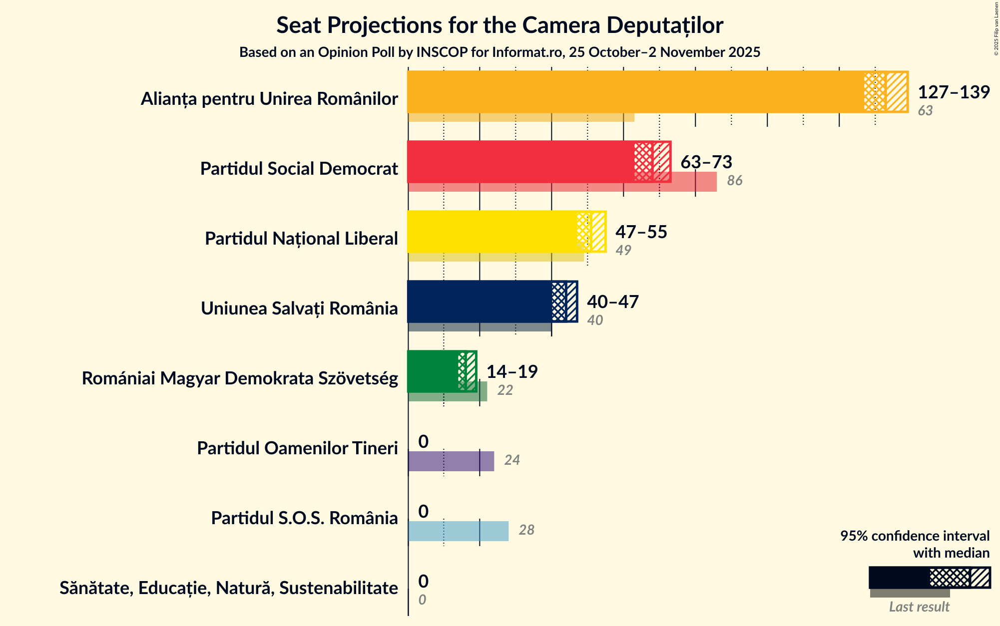

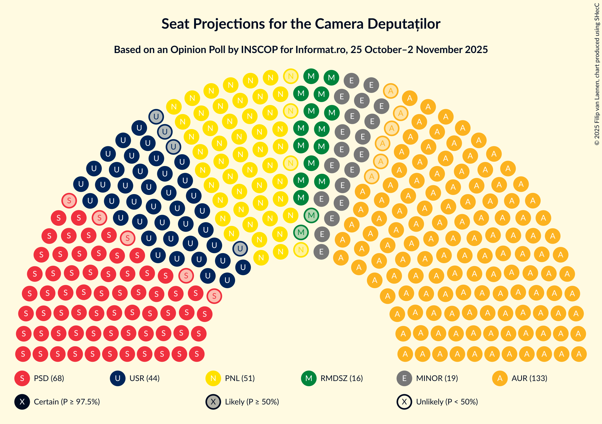

### Confidence Intervals

| Party | Last Result | Median | 80% Confidence Interval | 90% Confidence Interval | 95% Confidence Interval | 99% Confidence Interval |
|:-----:|:-----------:|:------:|:-----------------------:|:-----------------------:|:-----------------------:|:-----------------------:|
| <a href="#alianța-pentru-unirea-românilor">Alianța pentru Unirea Românilor</a> | 63 | 133 | 129–137 |128–138 |127–139 |126–141 |
| <a href="#partidul-social-democrat">Partidul Social Democrat</a> | 86 | 68 | 65–71 |64–72 |63–73 |62–75 |
| <a href="#partidul-național-liberal">Partidul Național Liberal</a> | 49 | 51 | 48–54 |47–54 |47–55 |45–56 |
| <a href="#uniunea-salvați-românia">Uniunea Salvați România</a> | 40 | 44 | 41–46 |41–47 |40–47 |39–48 |
| <a href="#romániai-magyar-demokrata-szövetség">Romániai Magyar Demokrata Szövetség</a> | 22 | 16 | 15–18 |14–19 |14–19 |13–20 |
| <a href="#sănătate,-educație,-natură,-sustenabilitate">Sănătate, Educație, Natură, Sustenabilitate</a> | 0 | 0 | 0 |0 |0 |0 |
| <a href="#partidul-oamenilor-tineri">Partidul Oamenilor Tineri</a> | 24 | 0 | 0 |0 |0 |0 |
| <a href="#partidul-s.o.s.-românia">Partidul S.O.S. România</a> | 28 | 0 | 0 |0 |0 |0 |

### Alianța pentru Unirea Românilor

*For a full overview of the results for this party, see the [Alianța pentru Unirea Românilor](party-alianțapentruunirearomânilor.html) page.*

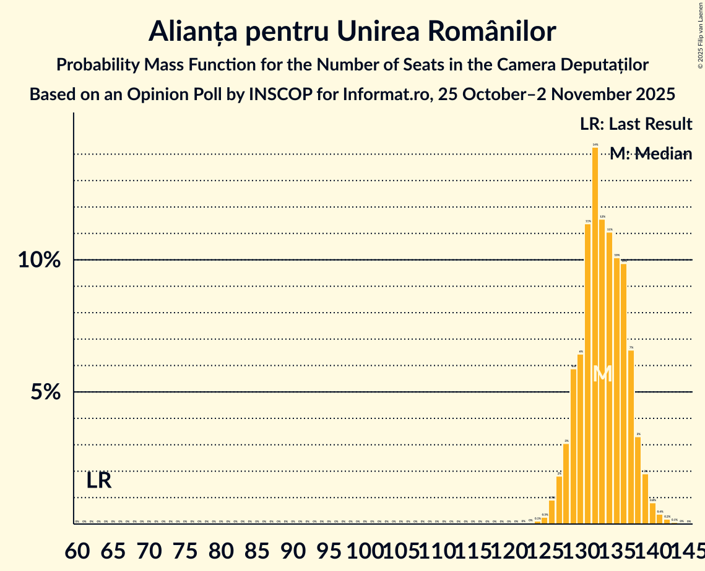

| Number of Seats | Probability | Accumulated | Special Marks |
|:---------------:|:-----------:|:-----------:|:-------------:|
| 63 | 0% | 100% | Last Result |
| 64 | 0% | 100% |  |
| 65 | 0% | 100% |  |
| 66 | 0% | 100% |  |
| 67 | 0% | 100% |  |
| 68 | 0% | 100% |  |
| 69 | 0% | 100% |  |
| 70 | 0% | 100% |  |
| 71 | 0% | 100% |  |
| 72 | 0% | 100% |  |
| 73 | 0% | 100% |  |
| 74 | 0% | 100% |  |
| 75 | 0% | 100% |  |
| 76 | 0% | 100% |  |
| 77 | 0% | 100% |  |
| 78 | 0% | 100% |  |
| 79 | 0% | 100% |  |
| 80 | 0% | 100% |  |
| 81 | 0% | 100% |  |
| 82 | 0% | 100% |  |
| 83 | 0% | 100% |  |
| 84 | 0% | 100% |  |
| 85 | 0% | 100% |  |
| 86 | 0% | 100% |  |
| 87 | 0% | 100% |  |
| 88 | 0% | 100% |  |
| 89 | 0% | 100% |  |
| 90 | 0% | 100% |  |
| 91 | 0% | 100% |  |
| 92 | 0% | 100% |  |
| 93 | 0% | 100% |  |
| 94 | 0% | 100% |  |
| 95 | 0% | 100% |  |
| 96 | 0% | 100% |  |
| 97 | 0% | 100% |  |
| 98 | 0% | 100% |  |
| 99 | 0% | 100% |  |
| 100 | 0% | 100% |  |
| 101 | 0% | 100% |  |
| 102 | 0% | 100% |  |
| 103 | 0% | 100% |  |
| 104 | 0% | 100% |  |
| 105 | 0% | 100% |  |
| 106 | 0% | 100% |  |
| 107 | 0% | 100% |  |
| 108 | 0% | 100% |  |
| 109 | 0% | 100% |  |
| 110 | 0% | 100% |  |
| 111 | 0% | 100% |  |
| 112 | 0% | 100% |  |
| 113 | 0% | 100% |  |
| 114 | 0% | 100% |  |
| 115 | 0% | 100% |  |
| 116 | 0% | 100% |  |
| 117 | 0% | 100% |  |
| 118 | 0% | 100% |  |
| 119 | 0% | 100% |  |
| 120 | 0% | 100% |  |
| 121 | 0% | 100% |  |
| 122 | 0% | 100% |  |
| 123 | 0% | 100% |  |
| 124 | 0.1% | 99.9% |  |
| 125 | 0.3% | 99.8% |  |
| 126 | 0.9% | 99.6% |  |
| 127 | 2% | 98.6% |  |
| 128 | 3% | 97% |  |
| 129 | 6% | 94% |  |
| 130 | 6% | 88% |  |
| 131 | 11% | 81% |  |
| 132 | 14% | 70% |  |
| 133 | 12% | 56% | Median |
| 134 | 11% | 44% |  |
| 135 | 10% | 33% |  |
| 136 | 10% | 23% |  |
| 137 | 7% | 13% |  |
| 138 | 3% | 7% |  |
| 139 | 2% | 3% |  |
| 140 | 0.8% | 1.5% |  |
| 141 | 0.4% | 0.7% |  |
| 142 | 0.2% | 0.3% |  |
| 143 | 0.1% | 0.1% |  |
| 144 | 0% | 0% |  |

### Partidul Social Democrat

*For a full overview of the results for this party, see the [Partidul Social Democrat](party-partidulsocialdemocrat.html) page.*

| Number of Seats | Probability | Accumulated | Special Marks |
|:---------------:|:-----------:|:-----------:|:-------------:|
| 60 | 0.1% | 100% |  |
| 61 | 0.3% | 99.9% |  |
| 62 | 0.8% | 99.7% |  |
| 63 | 2% | 98.8% |  |
| 64 | 3% | 97% |  |
| 65 | 8% | 93% |  |
| 66 | 11% | 85% |  |
| 67 | 15% | 74% |  |
| 68 | 14% | 59% | Median |
| 69 | 16% | 46% |  |
| 70 | 13% | 30% |  |
| 71 | 7% | 16% |  |
| 72 | 5% | 9% |  |
| 73 | 3% | 4% |  |
| 74 | 1.1% | 2% |  |
| 75 | 0.4% | 0.6% |  |
| 76 | 0.1% | 0.2% |  |
| 77 | 0% | 0.1% |  |
| 78 | 0% | 0% |  |
| 79 | 0% | 0% |  |
| 80 | 0% | 0% |  |
| 81 | 0% | 0% |  |
| 82 | 0% | 0% |  |
| 83 | 0% | 0% |  |
| 84 | 0% | 0% |  |
| 85 | 0% | 0% |  |
| 86 | 0% | 0% | Last Result |

### Partidul Național Liberal

*For a full overview of the results for this party, see the [Partidul Național Liberal](party-partidulnaționalliberal.html) page.*

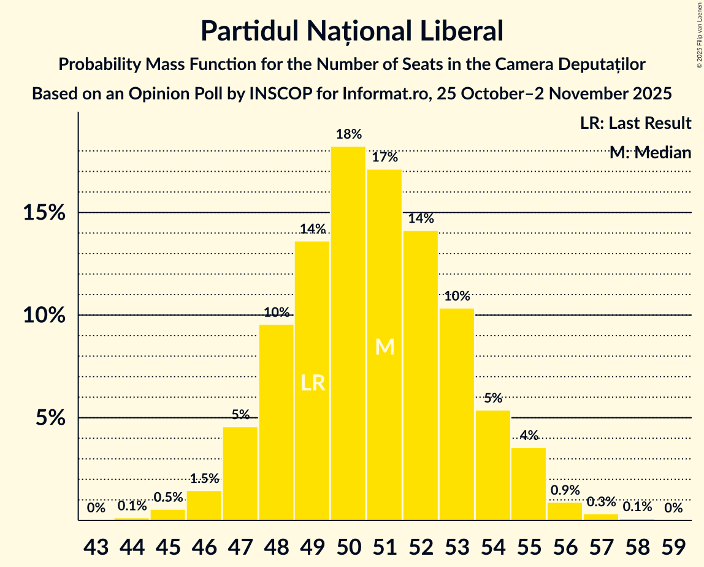

| Number of Seats | Probability | Accumulated | Special Marks |
|:---------------:|:-----------:|:-----------:|:-------------:|
| 44 | 0.1% | 100% |  |
| 45 | 0.5% | 99.8% |  |
| 46 | 1.5% | 99.3% |  |
| 47 | 5% | 98% |  |
| 48 | 10% | 93% |  |
| 49 | 14% | 84% | Last Result |
| 50 | 18% | 70% |  |
| 51 | 17% | 52% | Median |
| 52 | 14% | 35% |  |
| 53 | 10% | 21% |  |
| 54 | 5% | 10% |  |
| 55 | 4% | 5% |  |
| 56 | 0.9% | 1.3% |  |
| 57 | 0.3% | 0.4% |  |
| 58 | 0.1% | 0.1% |  |
| 59 | 0% | 0% |  |

### Uniunea Salvați România

*For a full overview of the results for this party, see the [Uniunea Salvați România](party-uniuneasalvațiromânia.html) page.*

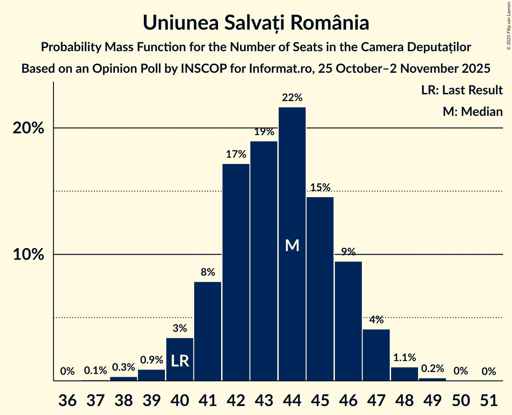

| Number of Seats | Probability | Accumulated | Special Marks |
|:---------------:|:-----------:|:-----------:|:-------------:|
| 37 | 0.1% | 100% |  |
| 38 | 0.3% | 99.9% |  |
| 39 | 0.9% | 99.5% |  |
| 40 | 3% | 98.6% | Last Result |
| 41 | 8% | 95% |  |
| 42 | 17% | 87% |  |
| 43 | 19% | 70% |  |
| 44 | 22% | 51% | Median |
| 45 | 15% | 30% |  |
| 46 | 9% | 15% |  |
| 47 | 4% | 6% |  |
| 48 | 1.1% | 1.4% |  |
| 49 | 0.2% | 0.3% |  |
| 50 | 0% | 0.1% |  |
| 51 | 0% | 0% |  |

### Romániai Magyar Demokrata Szövetség

*For a full overview of the results for this party, see the [Romániai Magyar Demokrata Szövetség](party-romániaimagyardemokrataszövetség.html) page.*

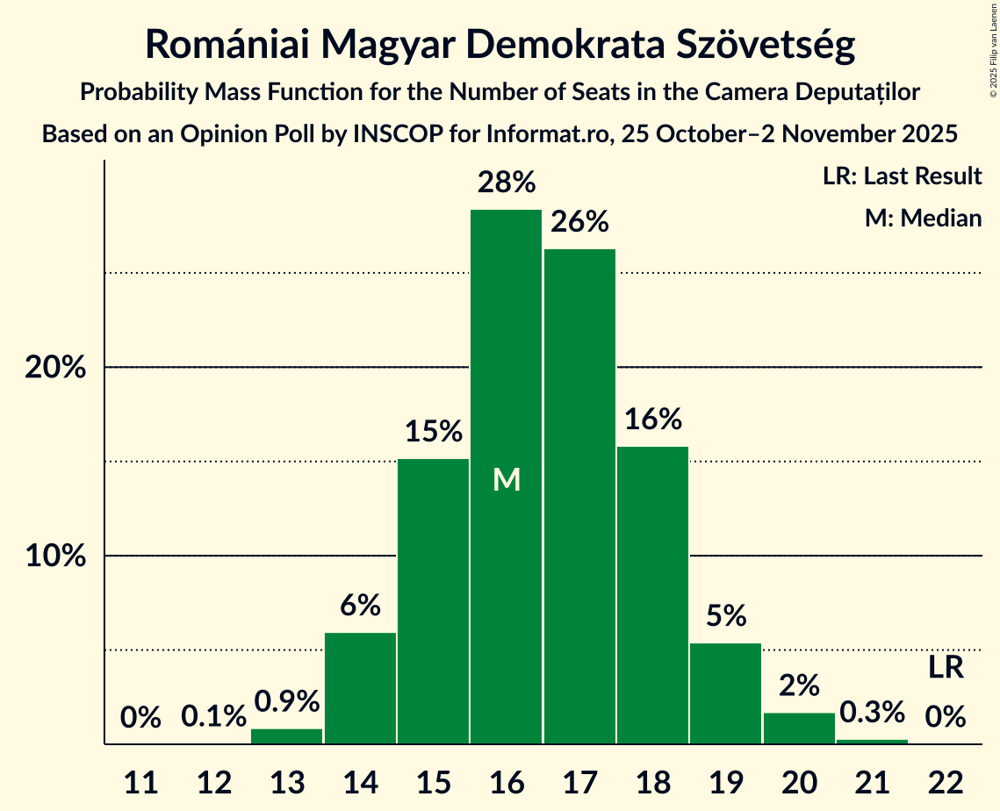

| Number of Seats | Probability | Accumulated | Special Marks |
|:---------------:|:-----------:|:-----------:|:-------------:|
| 12 | 0.1% | 100% |  |
| 13 | 0.9% | 99.9% |  |
| 14 | 6% | 99.1% |  |
| 15 | 15% | 93% |  |
| 16 | 28% | 78% | Median |
| 17 | 26% | 50% |  |
| 18 | 16% | 23% |  |
| 19 | 5% | 7% |  |
| 20 | 2% | 2% |  |
| 21 | 0.3% | 0.3% |  |
| 22 | 0% | 0% | Last Result |

### Sănătate, Educație, Natură, Sustenabilitate

*For a full overview of the results for this party, see the [Sănătate, Educație, Natură, Sustenabilitate](party-sănătateeducațienaturăsustenabilitate.html) page.*

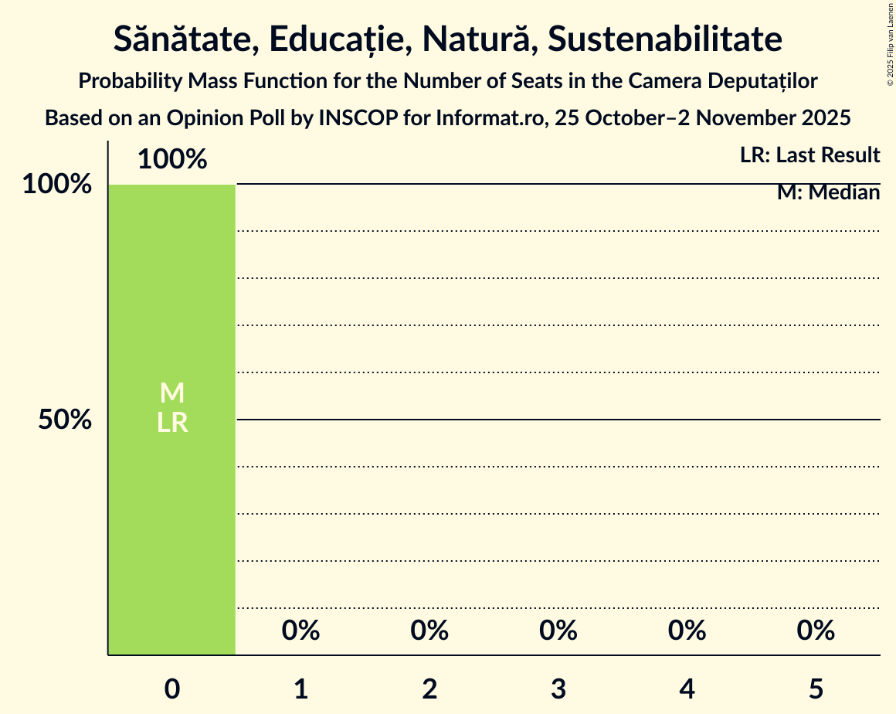

| Number of Seats | Probability | Accumulated | Special Marks |
|:---------------:|:-----------:|:-----------:|:-------------:|
| 0 | 100% | 100% | Last Result, Median |

### Partidul Oamenilor Tineri

*For a full overview of the results for this party, see the [Partidul Oamenilor Tineri](party-partiduloamenilortineri.html) page.*

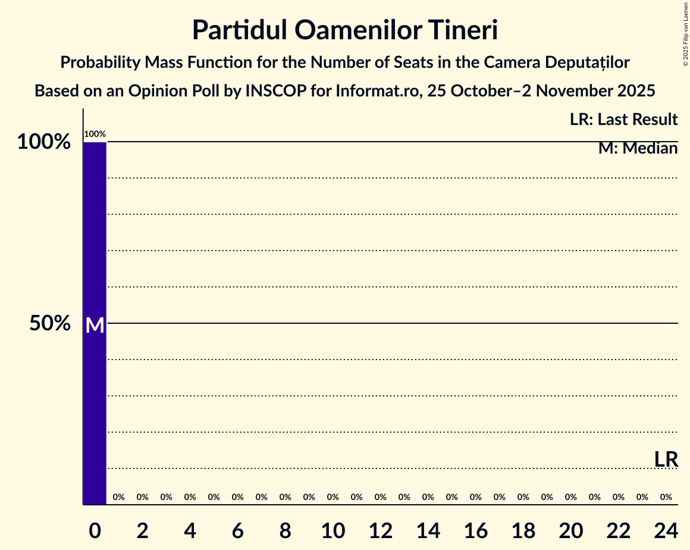

| Number of Seats | Probability | Accumulated | Special Marks |
|:---------------:|:-----------:|:-----------:|:-------------:|
| 0 | 100% | 100% | Median |
| 1 | 0% | 0% |  |
| 2 | 0% | 0% |  |
| 3 | 0% | 0% |  |
| 4 | 0% | 0% |  |
| 5 | 0% | 0% |  |
| 6 | 0% | 0% |  |
| 7 | 0% | 0% |  |
| 8 | 0% | 0% |  |
| 9 | 0% | 0% |  |
| 10 | 0% | 0% |  |
| 11 | 0% | 0% |  |
| 12 | 0% | 0% |  |
| 13 | 0% | 0% |  |
| 14 | 0% | 0% |  |
| 15 | 0% | 0% |  |
| 16 | 0% | 0% |  |
| 17 | 0% | 0% |  |
| 18 | 0% | 0% |  |
| 19 | 0% | 0% |  |
| 20 | 0% | 0% |  |
| 21 | 0% | 0% |  |
| 22 | 0% | 0% |  |
| 23 | 0% | 0% |  |
| 24 | 0% | 0% | Last Result |

### Partidul S.O.S. România

*For a full overview of the results for this party, see the [Partidul S.O.S. România](party-partidulsosromânia.html) page.*

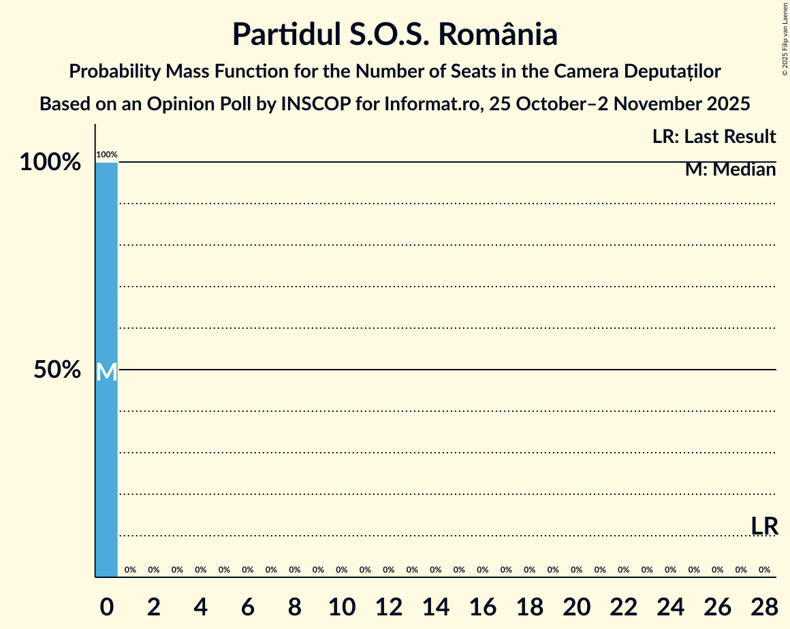

| Number of Seats | Probability | Accumulated | Special Marks |
|:---------------:|:-----------:|:-----------:|:-------------:|
| 0 | 100% | 100% | Median |
| 1 | 0% | 0% |  |
| 2 | 0% | 0% |  |
| 3 | 0% | 0% |  |
| 4 | 0% | 0% |  |
| 5 | 0% | 0% |  |
| 6 | 0% | 0% |  |
| 7 | 0% | 0% |  |
| 8 | 0% | 0% |  |
| 9 | 0% | 0% |  |
| 10 | 0% | 0% |  |
| 11 | 0% | 0% |  |
| 12 | 0% | 0% |  |
| 13 | 0% | 0% |  |
| 14 | 0% | 0% |  |
| 15 | 0% | 0% |  |
| 16 | 0% | 0% |  |
| 17 | 0% | 0% |  |
| 18 | 0% | 0% |  |
| 19 | 0% | 0% |  |
| 20 | 0% | 0% |  |
| 21 | 0% | 0% |  |
| 22 | 0% | 0% |  |
| 23 | 0% | 0% |  |
| 24 | 0% | 0% |  |
| 25 | 0% | 0% |  |
| 26 | 0% | 0% |  |
| 27 | 0% | 0% |  |
| 28 | 0% | 0% | Last Result |

## Coalitions

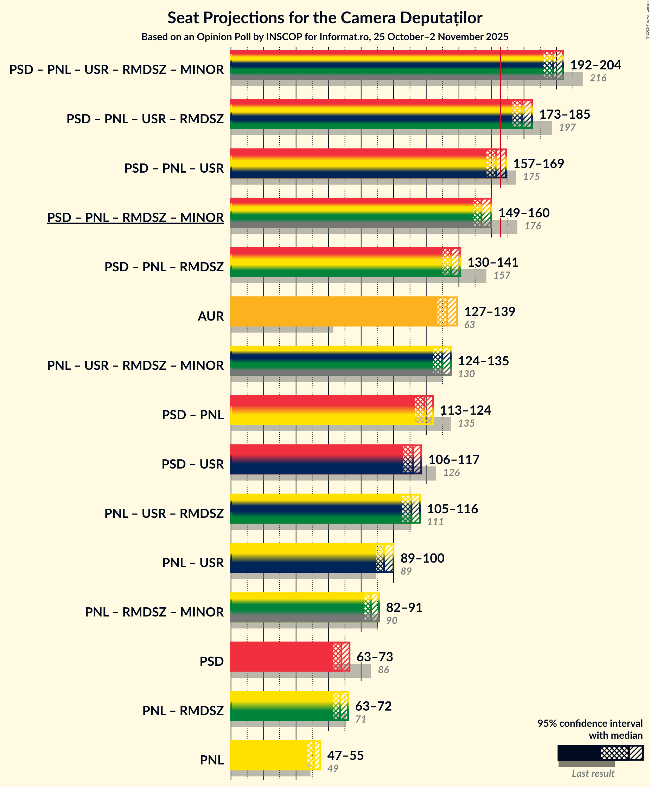

### Confidence Intervals

| Coalition | Last Result | Median | Majority? | 80% Confidence Interval | 90% Confidence Interval | 95% Confidence Interval | 99% Confidence Interval |
|:---------:|:-----------:|:------:|:---------:|:-----------------------:|:-----------------------:|:-----------------------:|:-----------------------:|
| Partidul Social Democrat – Partidul Național Liberal – Uniunea Salvați România – Romániai Magyar Demokrata Szövetség | 197 | 179 | 100% | 175–183 | 174–184 | 173–185 | 171–186 |
| Partidul Social Democrat – Partidul Național Liberal – Uniunea Salvați România | 175 | 163 | 14% | 159–166 | 158–168 | 157–169 | 154–170 |
| Partidul Social Democrat – Partidul Național Liberal – Romániai Magyar Demokrata Szövetség | 157 | 135 | 0% | 131–139 | 131–140 | 130–141 | 128–143 |
| Alianța pentru Unirea Românilor | 63 | 133 | 0% | 129–137 | 128–138 | 127–139 | 126–141 |
| Partidul Social Democrat – Partidul Național Liberal | 135 | 119 | 0% | 115–123 | 114–124 | 113–124 | 112–126 |
| Partidul Social Democrat – Uniunea Salvați România | 126 | 112 | 0% | 108–115 | 107–117 | 106–117 | 105–119 |
| Partidul Național Liberal – Uniunea Salvați România – Romániai Magyar Demokrata Szövetség | 111 | 111 | 0% | 107–114 | 106–115 | 105–116 | 103–118 |
| Partidul Național Liberal – Uniunea Salvați România | 89 | 94 | 0% | 91–98 | 90–99 | 89–100 | 87–101 |
| Partidul Social Democrat | 86 | 68 | 0% | 65–71 | 64–72 | 63–73 | 62–75 |
| Partidul Național Liberal – Romániai Magyar Demokrata Szövetség | 71 | 67 | 0% | 64–70 | 63–71 | 63–72 | 61–74 |
| Partidul Național Liberal | 49 | 51 | 0% | 48–54 | 47–54 | 47–55 | 45–56 |

### Partidul Social Democrat – Partidul Național Liberal – Uniunea Salvați România – Romániai Magyar Demokrata Szövetség

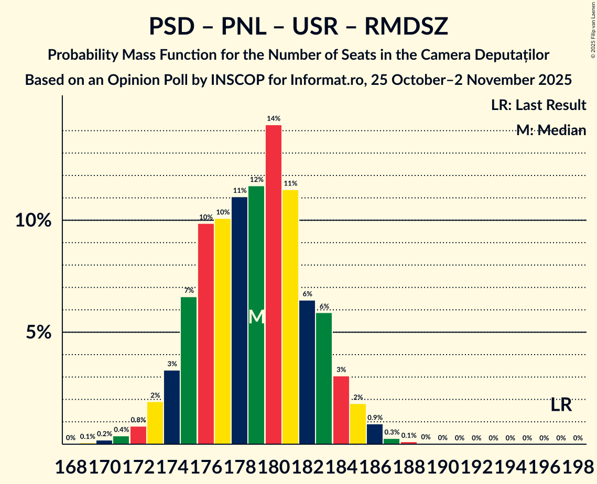

| Number of Seats | Probability | Accumulated | Special Marks |
|:---------------:|:-----------:|:-----------:|:-------------:|
| 169 | 0.1% | 100% |  |
| 170 | 0.2% | 99.9% |  |
| 171 | 0.4% | 99.7% |  |
| 172 | 0.8% | 99.3% |  |
| 173 | 2% | 98.5% |  |
| 174 | 3% | 97% |  |
| 175 | 7% | 93% |  |
| 176 | 10% | 87% |  |
| 177 | 10% | 77% |  |
| 178 | 11% | 67% |  |
| 179 | 12% | 56% | Median |
| 180 | 14% | 44% |  |
| 181 | 11% | 30% |  |
| 182 | 6% | 19% |  |
| 183 | 6% | 12% |  |
| 184 | 3% | 6% |  |
| 185 | 2% | 3% |  |
| 186 | 0.9% | 1.4% |  |
| 187 | 0.3% | 0.4% |  |
| 188 | 0.1% | 0.2% |  |
| 189 | 0% | 0.1% |  |
| 190 | 0% | 0% |  |
| 191 | 0% | 0% |  |
| 192 | 0% | 0% |  |
| 193 | 0% | 0% |  |
| 194 | 0% | 0% |  |
| 195 | 0% | 0% |  |
| 196 | 0% | 0% |  |
| 197 | 0% | 0% | Last Result |

### Partidul Social Democrat – Partidul Național Liberal – Uniunea Salvați România

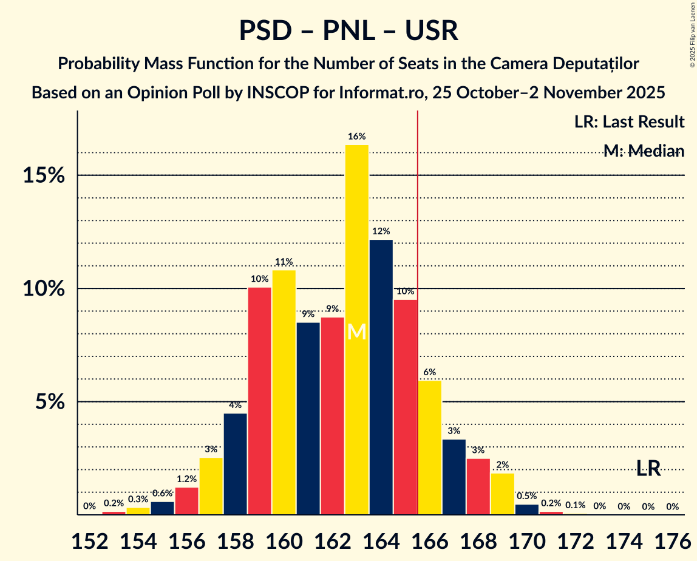

| Number of Seats | Probability | Accumulated | Special Marks |
|:---------------:|:-----------:|:-----------:|:-------------:|
| 153 | 0.2% | 100% |  |
| 154 | 0.3% | 99.8% |  |
| 155 | 0.6% | 99.5% |  |
| 156 | 1.2% | 98.9% |  |
| 157 | 3% | 98% |  |
| 158 | 4% | 95% |  |
| 159 | 10% | 91% |  |
| 160 | 11% | 81% |  |
| 161 | 9% | 70% |  |
| 162 | 9% | 61% |  |
| 163 | 16% | 52% | Median |
| 164 | 12% | 36% |  |
| 165 | 10% | 24% |  |
| 166 | 6% | 14% | Majority |
| 167 | 3% | 8% |  |
| 168 | 3% | 5% |  |
| 169 | 2% | 3% |  |
| 170 | 0.5% | 0.8% |  |
| 171 | 0.2% | 0.3% |  |
| 172 | 0.1% | 0.1% |  |
| 173 | 0% | 0% |  |
| 174 | 0% | 0% |  |
| 175 | 0% | 0% | Last Result |

### Partidul Social Democrat – Partidul Național Liberal – Romániai Magyar Demokrata Szövetség

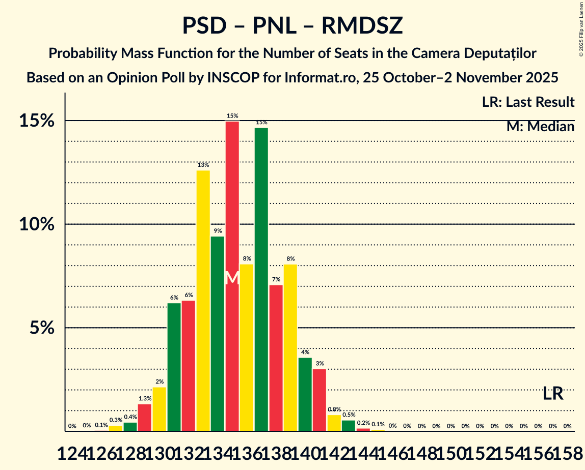

| Number of Seats | Probability | Accumulated | Special Marks |
|:---------------:|:-----------:|:-----------:|:-------------:|
| 126 | 0.1% | 100% |  |
| 127 | 0.3% | 99.9% |  |
| 128 | 0.4% | 99.6% |  |
| 129 | 1.3% | 99.2% |  |
| 130 | 2% | 98% |  |
| 131 | 6% | 96% |  |
| 132 | 6% | 89% |  |
| 133 | 13% | 83% |  |
| 134 | 9% | 71% |  |
| 135 | 15% | 61% | Median |
| 136 | 8% | 46% |  |
| 137 | 15% | 38% |  |
| 138 | 7% | 23% |  |
| 139 | 8% | 16% |  |
| 140 | 4% | 8% |  |
| 141 | 3% | 5% |  |
| 142 | 0.8% | 2% |  |
| 143 | 0.5% | 0.8% |  |
| 144 | 0.2% | 0.3% |  |
| 145 | 0.1% | 0.1% |  |
| 146 | 0% | 0% |  |
| 147 | 0% | 0% |  |
| 148 | 0% | 0% |  |
| 149 | 0% | 0% |  |
| 150 | 0% | 0% |  |
| 151 | 0% | 0% |  |
| 152 | 0% | 0% |  |
| 153 | 0% | 0% |  |
| 154 | 0% | 0% |  |
| 155 | 0% | 0% |  |
| 156 | 0% | 0% |  |
| 157 | 0% | 0% | Last Result |

### Alianța pentru Unirea Românilor

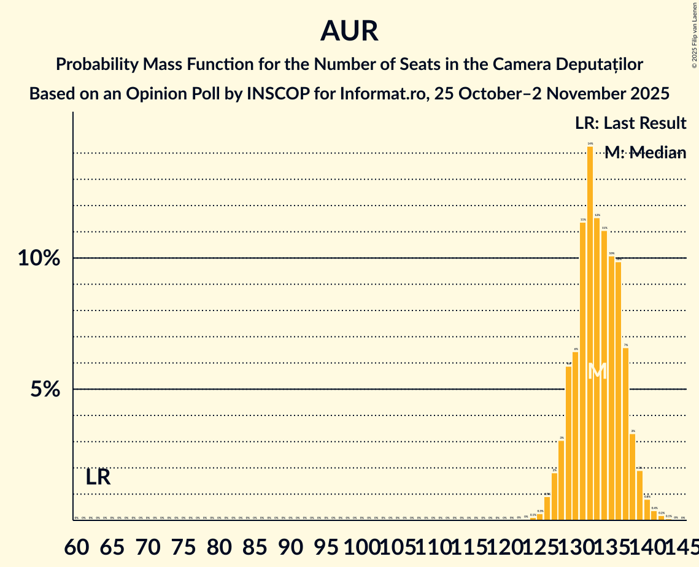

| Number of Seats | Probability | Accumulated | Special Marks |
|:---------------:|:-----------:|:-----------:|:-------------:|
| 63 | 0% | 100% | Last Result |
| 64 | 0% | 100% |  |
| 65 | 0% | 100% |  |
| 66 | 0% | 100% |  |
| 67 | 0% | 100% |  |
| 68 | 0% | 100% |  |
| 69 | 0% | 100% |  |
| 70 | 0% | 100% |  |
| 71 | 0% | 100% |  |
| 72 | 0% | 100% |  |
| 73 | 0% | 100% |  |
| 74 | 0% | 100% |  |
| 75 | 0% | 100% |  |
| 76 | 0% | 100% |  |
| 77 | 0% | 100% |  |
| 78 | 0% | 100% |  |
| 79 | 0% | 100% |  |
| 80 | 0% | 100% |  |
| 81 | 0% | 100% |  |
| 82 | 0% | 100% |  |
| 83 | 0% | 100% |  |
| 84 | 0% | 100% |  |
| 85 | 0% | 100% |  |
| 86 | 0% | 100% |  |
| 87 | 0% | 100% |  |
| 88 | 0% | 100% |  |
| 89 | 0% | 100% |  |
| 90 | 0% | 100% |  |
| 91 | 0% | 100% |  |
| 92 | 0% | 100% |  |
| 93 | 0% | 100% |  |
| 94 | 0% | 100% |  |
| 95 | 0% | 100% |  |
| 96 | 0% | 100% |  |
| 97 | 0% | 100% |  |
| 98 | 0% | 100% |  |
| 99 | 0% | 100% |  |
| 100 | 0% | 100% |  |
| 101 | 0% | 100% |  |
| 102 | 0% | 100% |  |
| 103 | 0% | 100% |  |
| 104 | 0% | 100% |  |
| 105 | 0% | 100% |  |
| 106 | 0% | 100% |  |
| 107 | 0% | 100% |  |
| 108 | 0% | 100% |  |
| 109 | 0% | 100% |  |
| 110 | 0% | 100% |  |
| 111 | 0% | 100% |  |
| 112 | 0% | 100% |  |
| 113 | 0% | 100% |  |
| 114 | 0% | 100% |  |
| 115 | 0% | 100% |  |
| 116 | 0% | 100% |  |
| 117 | 0% | 100% |  |
| 118 | 0% | 100% |  |
| 119 | 0% | 100% |  |
| 120 | 0% | 100% |  |
| 121 | 0% | 100% |  |
| 122 | 0% | 100% |  |
| 123 | 0% | 100% |  |
| 124 | 0.1% | 99.9% |  |
| 125 | 0.3% | 99.8% |  |
| 126 | 0.9% | 99.6% |  |
| 127 | 2% | 98.6% |  |
| 128 | 3% | 97% |  |
| 129 | 6% | 94% |  |
| 130 | 6% | 88% |  |
| 131 | 11% | 81% |  |
| 132 | 14% | 70% |  |
| 133 | 12% | 56% | Median |
| 134 | 11% | 44% |  |
| 135 | 10% | 33% |  |
| 136 | 10% | 23% |  |
| 137 | 7% | 13% |  |
| 138 | 3% | 7% |  |
| 139 | 2% | 3% |  |
| 140 | 0.8% | 1.5% |  |
| 141 | 0.4% | 0.7% |  |
| 142 | 0.2% | 0.3% |  |
| 143 | 0.1% | 0.1% |  |
| 144 | 0% | 0% |  |

### Partidul Social Democrat – Partidul Național Liberal

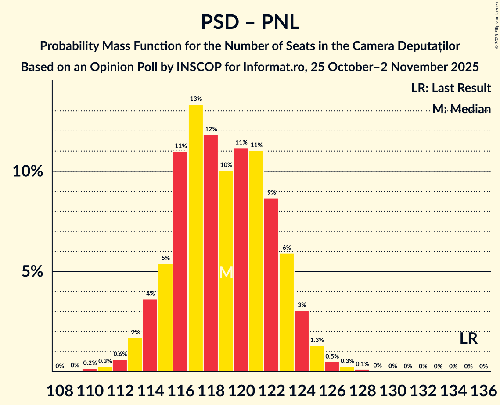

| Number of Seats | Probability | Accumulated | Special Marks |
|:---------------:|:-----------:|:-----------:|:-------------:|
| 109 | 0% | 100% |  |
| 110 | 0.2% | 99.9% |  |
| 111 | 0.3% | 99.8% |  |
| 112 | 0.6% | 99.5% |  |
| 113 | 2% | 98.9% |  |
| 114 | 4% | 97% |  |
| 115 | 5% | 94% |  |
| 116 | 11% | 88% |  |
| 117 | 13% | 77% |  |
| 118 | 12% | 64% |  |
| 119 | 10% | 52% | Median |
| 120 | 11% | 42% |  |
| 121 | 11% | 31% |  |
| 122 | 9% | 20% |  |
| 123 | 6% | 11% |  |
| 124 | 3% | 5% |  |
| 125 | 1.3% | 2% |  |
| 126 | 0.5% | 0.9% |  |
| 127 | 0.3% | 0.4% |  |
| 128 | 0.1% | 0.2% |  |
| 129 | 0% | 0.1% |  |
| 130 | 0% | 0% |  |
| 131 | 0% | 0% |  |
| 132 | 0% | 0% |  |
| 133 | 0% | 0% |  |
| 134 | 0% | 0% |  |
| 135 | 0% | 0% | Last Result |

### Partidul Social Democrat – Uniunea Salvați România

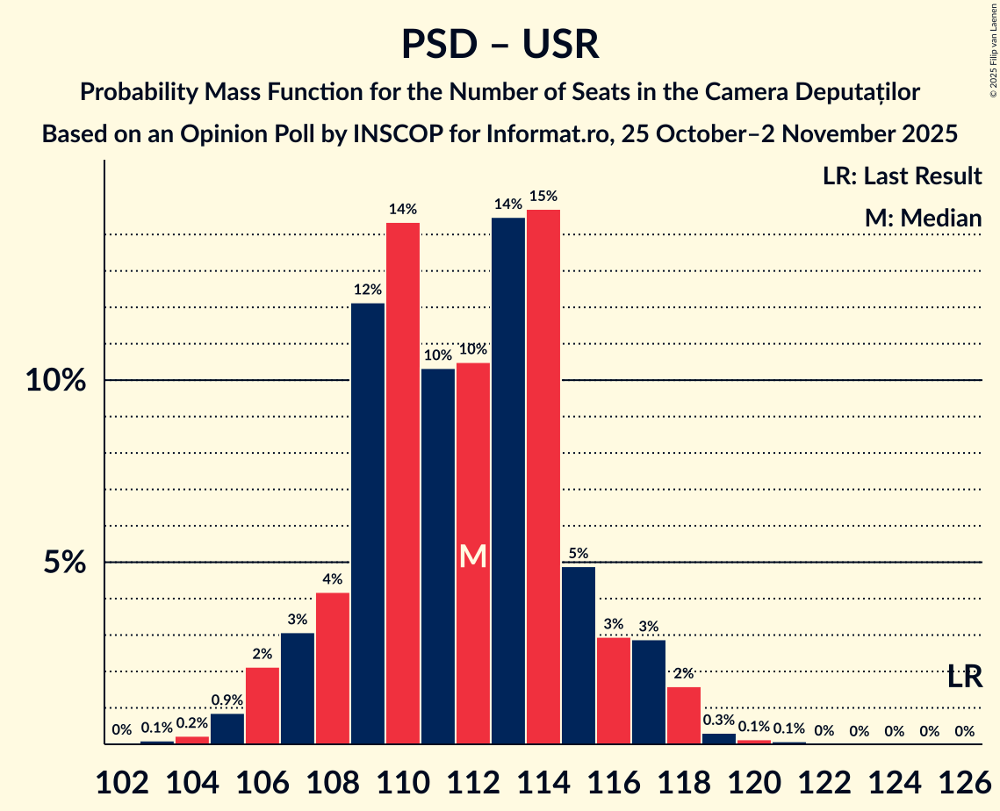

| Number of Seats | Probability | Accumulated | Special Marks |
|:---------------:|:-----------:|:-----------:|:-------------:|
| 102 | 0% | 100% |  |
| 103 | 0.1% | 99.9% |  |
| 104 | 0.2% | 99.8% |  |
| 105 | 0.9% | 99.6% |  |
| 106 | 2% | 98.7% |  |
| 107 | 3% | 97% |  |
| 108 | 4% | 94% |  |
| 109 | 12% | 89% |  |
| 110 | 14% | 77% |  |
| 111 | 10% | 63% |  |
| 112 | 10% | 53% | Median |
| 113 | 14% | 42% |  |
| 114 | 15% | 28% |  |
| 115 | 5% | 13% |  |
| 116 | 3% | 8% |  |
| 117 | 3% | 5% |  |
| 118 | 2% | 2% |  |
| 119 | 0.3% | 0.6% |  |
| 120 | 0.1% | 0.2% |  |
| 121 | 0.1% | 0.1% |  |
| 122 | 0% | 0% |  |
| 123 | 0% | 0% |  |
| 124 | 0% | 0% |  |
| 125 | 0% | 0% |  |
| 126 | 0% | 0% | Last Result |

### Partidul Național Liberal – Uniunea Salvați România – Romániai Magyar Demokrata Szövetség

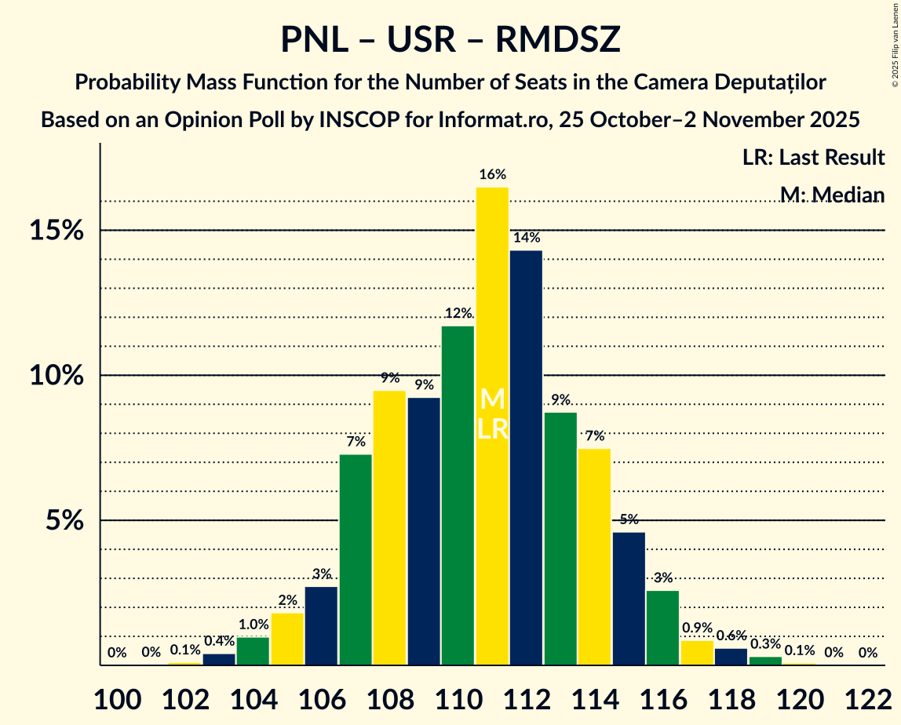

| Number of Seats | Probability | Accumulated | Special Marks |
|:---------------:|:-----------:|:-----------:|:-------------:|
| 102 | 0.1% | 100% |  |
| 103 | 0.4% | 99.8% |  |
| 104 | 1.0% | 99.4% |  |
| 105 | 2% | 98% |  |
| 106 | 3% | 97% |  |
| 107 | 7% | 94% |  |
| 108 | 9% | 87% |  |
| 109 | 9% | 77% |  |
| 110 | 12% | 68% |  |
| 111 | 16% | 56% | Last Result, Median |
| 112 | 14% | 40% |  |
| 113 | 9% | 25% |  |
| 114 | 7% | 17% |  |
| 115 | 5% | 9% |  |
| 116 | 3% | 4% |  |
| 117 | 0.9% | 2% |  |
| 118 | 0.6% | 1.0% |  |
| 119 | 0.3% | 0.4% |  |
| 120 | 0.1% | 0.1% |  |
| 121 | 0% | 0% |  |

### Partidul Național Liberal – Uniunea Salvați România

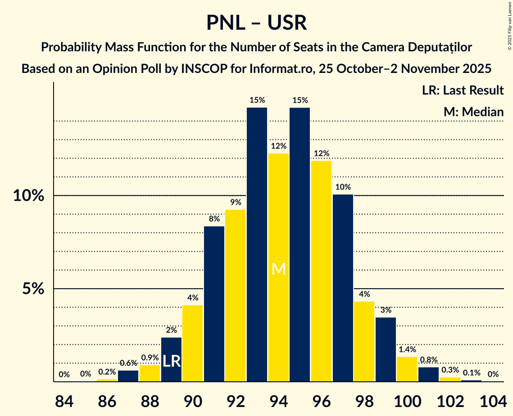

| Number of Seats | Probability | Accumulated | Special Marks |
|:---------------:|:-----------:|:-----------:|:-------------:|
| 85 | 0% | 100% |  |
| 86 | 0.2% | 99.9% |  |
| 87 | 0.6% | 99.8% |  |
| 88 | 0.9% | 99.2% |  |
| 89 | 2% | 98% | Last Result |
| 90 | 4% | 96% |  |
| 91 | 8% | 92% |  |
| 92 | 9% | 83% |  |
| 93 | 15% | 74% |  |
| 94 | 12% | 59% |  |
| 95 | 15% | 47% | Median |
| 96 | 12% | 32% |  |
| 97 | 10% | 20% |  |
| 98 | 4% | 10% |  |
| 99 | 3% | 6% |  |
| 100 | 1.4% | 3% |  |
| 101 | 0.8% | 1.2% |  |
| 102 | 0.3% | 0.4% |  |
| 103 | 0.1% | 0.1% |  |
| 104 | 0% | 0% |  |

### Partidul Social Democrat

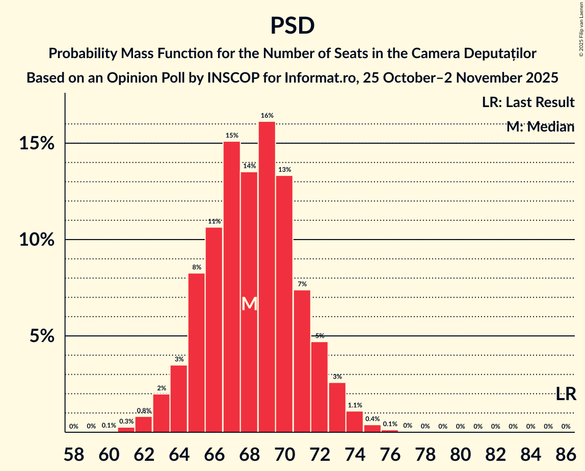

| Number of Seats | Probability | Accumulated | Special Marks |
|:---------------:|:-----------:|:-----------:|:-------------:|
| 60 | 0.1% | 100% |  |
| 61 | 0.3% | 99.9% |  |
| 62 | 0.8% | 99.7% |  |
| 63 | 2% | 98.8% |  |
| 64 | 3% | 97% |  |
| 65 | 8% | 93% |  |
| 66 | 11% | 85% |  |
| 67 | 15% | 74% |  |
| 68 | 14% | 59% | Median |
| 69 | 16% | 46% |  |
| 70 | 13% | 30% |  |
| 71 | 7% | 16% |  |
| 72 | 5% | 9% |  |
| 73 | 3% | 4% |  |
| 74 | 1.1% | 2% |  |
| 75 | 0.4% | 0.6% |  |
| 76 | 0.1% | 0.2% |  |
| 77 | 0% | 0.1% |  |
| 78 | 0% | 0% |  |
| 79 | 0% | 0% |  |
| 80 | 0% | 0% |  |
| 81 | 0% | 0% |  |
| 82 | 0% | 0% |  |
| 83 | 0% | 0% |  |
| 84 | 0% | 0% |  |
| 85 | 0% | 0% |  |
| 86 | 0% | 0% | Last Result |

### Partidul Național Liberal – Romániai Magyar Demokrata Szövetség

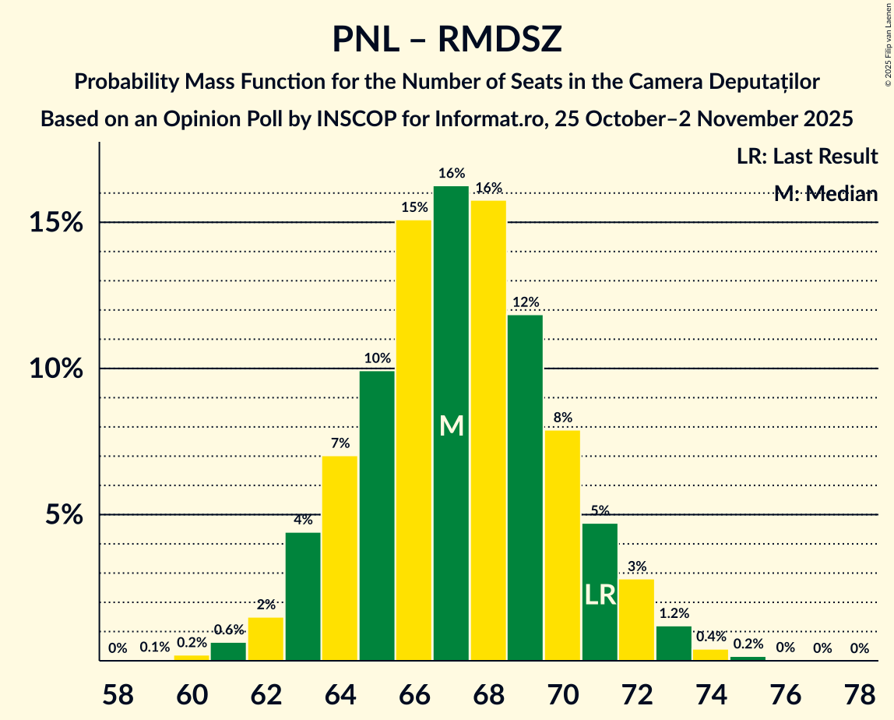

| Number of Seats | Probability | Accumulated | Special Marks |
|:---------------:|:-----------:|:-----------:|:-------------:|
| 59 | 0.1% | 100% |  |
| 60 | 0.2% | 99.9% |  |
| 61 | 0.6% | 99.7% |  |
| 62 | 2% | 99.1% |  |
| 63 | 4% | 98% |  |
| 64 | 7% | 93% |  |
| 65 | 10% | 86% |  |
| 66 | 15% | 76% |  |
| 67 | 16% | 61% | Median |
| 68 | 16% | 45% |  |
| 69 | 12% | 29% |  |
| 70 | 8% | 17% |  |
| 71 | 5% | 9% | Last Result |
| 72 | 3% | 5% |  |
| 73 | 1.2% | 2% |  |
| 74 | 0.4% | 0.6% |  |
| 75 | 0.2% | 0.2% |  |
| 76 | 0% | 0.1% |  |
| 77 | 0% | 0% |  |

### Partidul Național Liberal

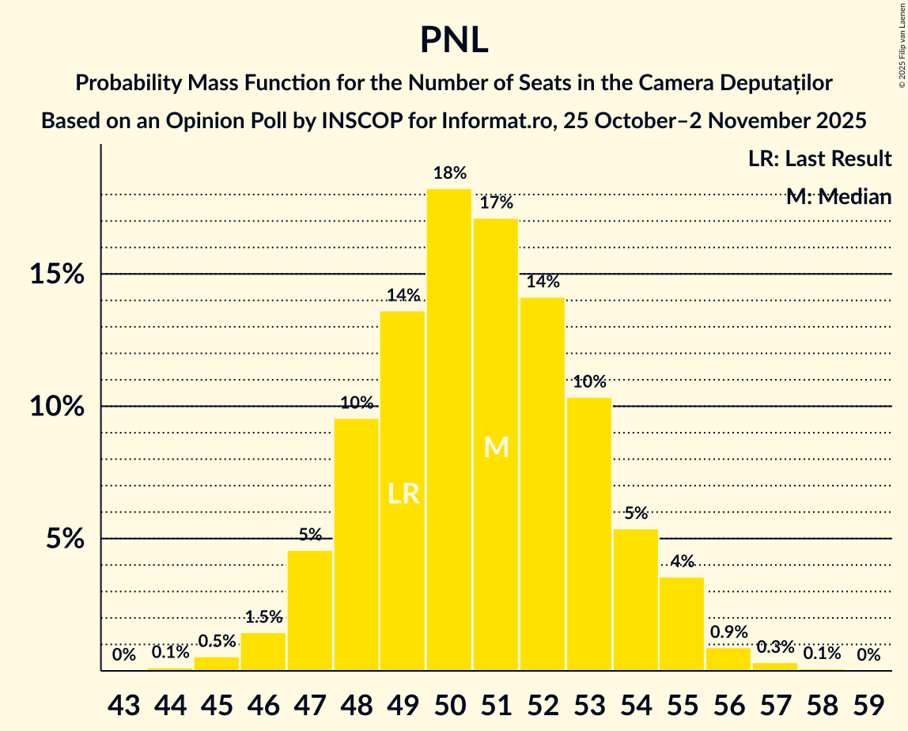

| Number of Seats | Probability | Accumulated | Special Marks |
|:---------------:|:-----------:|:-----------:|:-------------:|
| 44 | 0.1% | 100% |  |
| 45 | 0.5% | 99.8% |  |
| 46 | 1.5% | 99.3% |  |
| 47 | 5% | 98% |  |
| 48 | 10% | 93% |  |
| 49 | 14% | 84% | Last Result |
| 50 | 18% | 70% |  |
| 51 | 17% | 52% | Median |
| 52 | 14% | 35% |  |
| 53 | 10% | 21% |  |
| 54 | 5% | 10% |  |
| 55 | 4% | 5% |  |
| 56 | 0.9% | 1.3% |  |
| 57 | 0.3% | 0.4% |  |
| 58 | 0.1% | 0.1% |  |
| 59 | 0% | 0% |  |

## Technical Information

### Opinion Poll

+ **Polling firm:** INSCOP
+ **Commissioner(s):** Informat.ro
+ **Fieldwork period:** 25 October–2 November 2025

### Calculations

+ **Sample size:** 3000
+ **Simulations done:** 2,097,152
+ **Error estimate:** 1.01%

