# Opinion Poll by IRES, 4–17 December 2025

<a href="#voting-intentions">Voting Intentions</a> | <a href="#seats">Seats</a> | <a href="#coalitions">Coalitions</a> | <a href="#technical-information">Technical Information</a>

## Voting Intentions

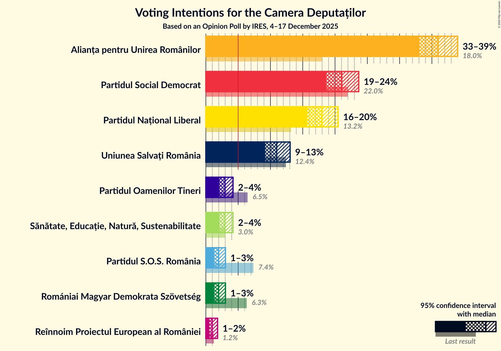

### Confidence Intervals

| Party | Last Result | Poll Result | 80% Confidence Interval | 90% Confidence Interval | 95% Confidence Interval | 99% Confidence Interval |
|:-----:|:-----------:|:-----------:|:-----------------------:|:-----------------------:|:-----------------------:|:-----------------------:|
| Alianța pentru Unirea Românilor | 18.0% | 36.0% | 34.1–37.9% |33.5–38.5% |33.1–39.0% |32.2–39.9% |
| Partidul Social Democrat | 22.0% | 21.0% | 19.5–22.8% |19.0–23.2% |18.6–23.7% |17.9–24.5% |
| Partidul Național Liberal | 13.2% | 18.0% | 16.5–19.6% |16.1–20.1% |15.7–20.5% |15.1–21.3% |
| Uniunea Salvați România | 12.4% | 11.0% | 9.8–12.3% |9.5–12.7% |9.2–13.0% |8.7–13.7% |
| Sănătate, Educație, Natură, Sustenabilitate | 3.0% | 3.0% | 2.4–3.8% |2.2–4.0% |2.1–4.2% |1.8–4.6% |
| Partidul Oamenilor Tineri | 6.5% | 3.0% | 2.4–3.8% |2.2–4.0% |2.1–4.2% |1.8–4.6% |
| Partidul S.O.S. România | 7.4% | 2.0% | 1.5–2.7% |1.4–2.9% |1.3–3.0% |1.1–3.4% |
| Romániai Magyar Demokrata Szövetség | 6.3% | 2.0% | 1.5–2.7% |1.4–2.9% |1.3–3.0% |1.1–3.4% |
| Reînnoim Proiectul European al României | 1.2% | 1.0% | 0.7–1.5% |0.6–1.7% |0.5–1.8% |0.4–2.1% |

*Note:* The poll result column reflects the actual value used in the calculations. Published results may vary slightly, and in addition be rounded to fewer digits.

## Seats

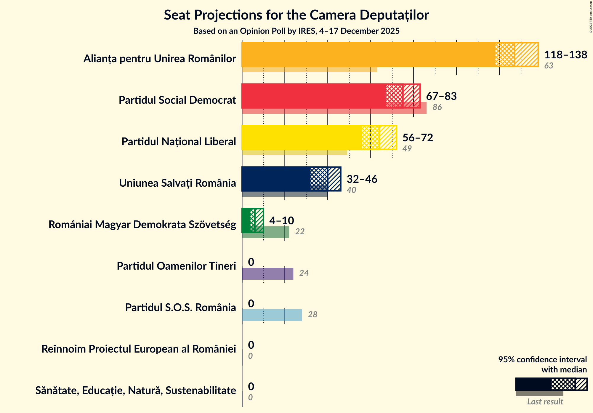

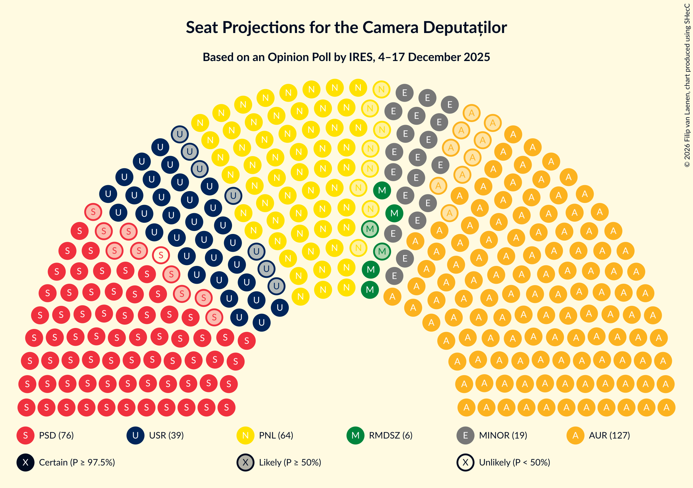

### Confidence Intervals

| Party | Last Result | Median | 80% Confidence Interval | 90% Confidence Interval | 95% Confidence Interval | 99% Confidence Interval |
|:-----:|:-----------:|:------:|:-----------------------:|:-----------------------:|:-----------------------:|:-----------------------:|
| <a href="#alianța-pentru-unirea-românilor">Alianța pentru Unirea Românilor</a> | 63 | 127 | 121–134 |119–136 |118–138 |115–141 |
| <a href="#partidul-social-democrat">Partidul Social Democrat</a> | 86 | 75 | 69–80 |67–81 |67–83 |64–86 |
| <a href="#partidul-național-liberal">Partidul Național Liberal</a> | 49 | 64 | 58–69 |57–70 |56–72 |54–75 |
| <a href="#uniunea-salvați-românia">Uniunea Salvați România</a> | 40 | 40 | 35–43 |33–44 |32–46 |31–48 |
| <a href="#sănătate,-educație,-natură,-sustenabilitate">Sănătate, Educație, Natură, Sustenabilitate</a> | 0 | 0 | 0 |0 |0 |0 |
| <a href="#partidul-oamenilor-tineri">Partidul Oamenilor Tineri</a> | 24 | 0 | 0 |0 |0 |0 |
| <a href="#partidul-s.o.s.-românia">Partidul S.O.S. România</a> | 28 | 0 | 0 |0 |0 |0 |
| <a href="#romániai-magyar-demokrata-szövetség">Romániai Magyar Demokrata Szövetség</a> | 22 | 6 | 5–9 |4–9 |4–10 |3–11 |
| <a href="#reînnoim-proiectul-european-al-româniei">Reînnoim Proiectul European al României</a> | 0 | 0 | 0 |0 |0 |0 |

### Alianța pentru Unirea Românilor

*For a full overview of the results for this party, see the [Alianța pentru Unirea Românilor](party-alianțapentruunirearomânilor.html) page.*

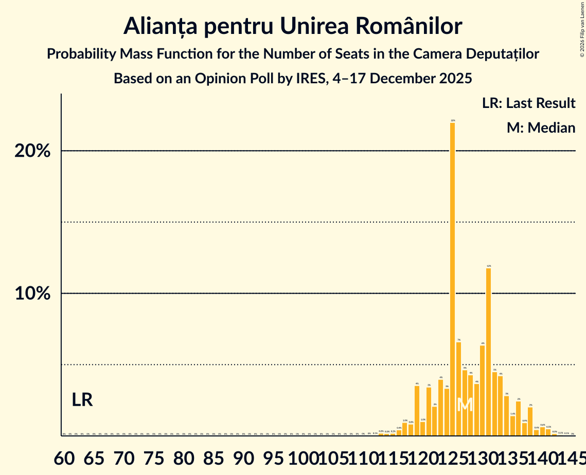

| Number of Seats | Probability | Accumulated | Special Marks |
|:---------------:|:-----------:|:-----------:|:-------------:|
| 63 | 0% | 100% | Last Result |
| 64 | 0% | 100% |  |
| 65 | 0% | 100% |  |
| 66 | 0% | 100% |  |
| 67 | 0% | 100% |  |
| 68 | 0% | 100% |  |
| 69 | 0% | 100% |  |
| 70 | 0% | 100% |  |
| 71 | 0% | 100% |  |
| 72 | 0% | 100% |  |
| 73 | 0% | 100% |  |
| 74 | 0% | 100% |  |
| 75 | 0% | 100% |  |
| 76 | 0% | 100% |  |
| 77 | 0% | 100% |  |
| 78 | 0% | 100% |  |
| 79 | 0% | 100% |  |
| 80 | 0% | 100% |  |
| 81 | 0% | 100% |  |
| 82 | 0% | 100% |  |
| 83 | 0% | 100% |  |
| 84 | 0% | 100% |  |
| 85 | 0% | 100% |  |
| 86 | 0% | 100% |  |
| 87 | 0% | 100% |  |
| 88 | 0% | 100% |  |
| 89 | 0% | 100% |  |
| 90 | 0% | 100% |  |
| 91 | 0% | 100% |  |
| 92 | 0% | 100% |  |
| 93 | 0% | 100% |  |
| 94 | 0% | 100% |  |
| 95 | 0% | 100% |  |
| 96 | 0% | 100% |  |
| 97 | 0% | 100% |  |
| 98 | 0% | 100% |  |
| 99 | 0% | 100% |  |
| 100 | 0% | 100% |  |
| 101 | 0% | 100% |  |
| 102 | 0% | 100% |  |
| 103 | 0% | 100% |  |
| 104 | 0% | 100% |  |
| 105 | 0% | 100% |  |
| 106 | 0% | 100% |  |
| 107 | 0% | 100% |  |
| 108 | 0% | 100% |  |
| 109 | 0% | 100% |  |
| 110 | 0% | 100% |  |
| 111 | 0% | 100% |  |
| 112 | 0.1% | 99.9% |  |
| 113 | 0.2% | 99.9% |  |
| 114 | 0.2% | 99.7% |  |
| 115 | 0.2% | 99.5% |  |
| 116 | 0.4% | 99.3% |  |
| 117 | 1.0% | 98.9% |  |
| 118 | 0.8% | 98% |  |
| 119 | 4% | 97% |  |
| 120 | 1.0% | 94% |  |
| 121 | 3% | 93% |  |
| 122 | 2% | 89% |  |
| 123 | 4% | 87% |  |
| 124 | 3% | 83% |  |
| 125 | 22% | 80% |  |
| 126 | 7% | 58% |  |
| 127 | 5% | 51% | Median |
| 128 | 4% | 46% |  |
| 129 | 4% | 42% |  |
| 130 | 6% | 39% |  |
| 131 | 12% | 32% |  |
| 132 | 5% | 20% |  |
| 133 | 4% | 16% |  |
| 134 | 3% | 12% |  |
| 135 | 1.4% | 9% |  |
| 136 | 2% | 7% |  |
| 137 | 0.9% | 5% |  |
| 138 | 2% | 4% |  |
| 139 | 0.4% | 2% |  |
| 140 | 0.6% | 1.5% |  |
| 141 | 0.5% | 0.9% |  |
| 142 | 0.2% | 0.3% |  |
| 143 | 0.1% | 0.2% |  |
| 144 | 0.1% | 0.1% |  |
| 145 | 0% | 0% |  |

### Partidul Social Democrat

*For a full overview of the results for this party, see the [Partidul Social Democrat](party-partidulsocialdemocrat.html) page.*

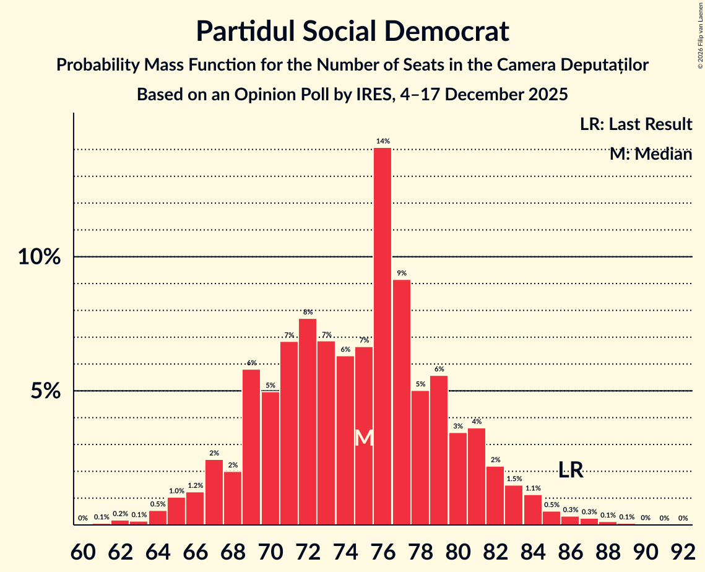

| Number of Seats | Probability | Accumulated | Special Marks |
|:---------------:|:-----------:|:-----------:|:-------------:|
| 61 | 0.1% | 100% |  |
| 62 | 0.2% | 99.9% |  |
| 63 | 0.1% | 99.7% |  |
| 64 | 0.3% | 99.6% |  |
| 65 | 0.3% | 99.3% |  |
| 66 | 1.1% | 99.0% |  |
| 67 | 3% | 98% |  |
| 68 | 2% | 95% |  |
| 69 | 5% | 93% |  |
| 70 | 3% | 88% |  |
| 71 | 8% | 85% |  |
| 72 | 10% | 77% |  |
| 73 | 6% | 67% |  |
| 74 | 5% | 61% |  |
| 75 | 8% | 56% | Median |
| 76 | 23% | 48% |  |
| 77 | 6% | 25% |  |
| 78 | 4% | 18% |  |
| 79 | 4% | 15% |  |
| 80 | 3% | 11% |  |
| 81 | 4% | 8% |  |
| 82 | 0.9% | 4% |  |
| 83 | 0.9% | 3% |  |
| 84 | 0.6% | 2% |  |
| 85 | 0.7% | 1.3% |  |
| 86 | 0.2% | 0.7% | Last Result |
| 87 | 0.1% | 0.5% |  |
| 88 | 0.2% | 0.3% |  |
| 89 | 0.1% | 0.2% |  |
| 90 | 0% | 0.1% |  |
| 91 | 0% | 0% |  |

### Partidul Național Liberal

*For a full overview of the results for this party, see the [Partidul Național Liberal](party-partidulnaționalliberal.html) page.*

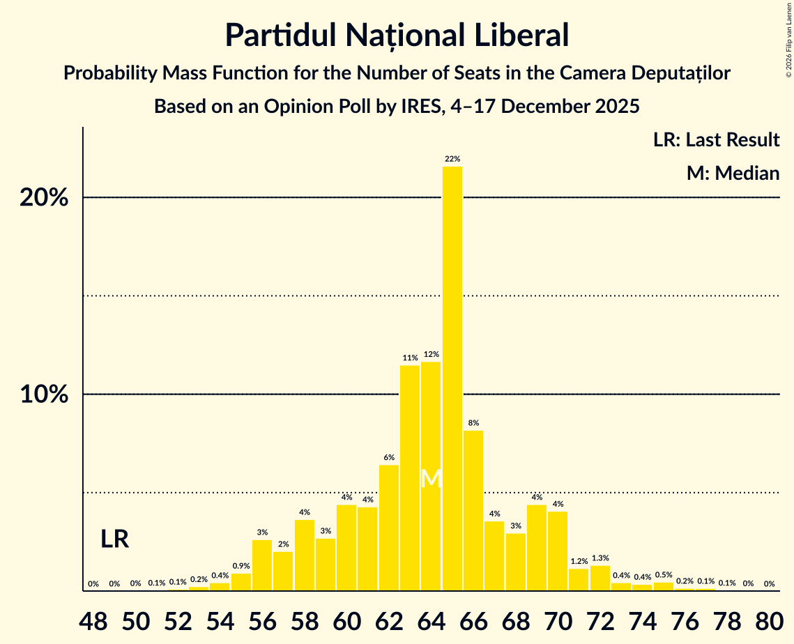

| Number of Seats | Probability | Accumulated | Special Marks |
|:---------------:|:-----------:|:-----------:|:-------------:|
| 49 | 0% | 100% | Last Result |
| 50 | 0% | 100% |  |
| 51 | 0.1% | 100% |  |
| 52 | 0.1% | 99.9% |  |
| 53 | 0.2% | 99.8% |  |
| 54 | 0.4% | 99.6% |  |
| 55 | 0.9% | 99.1% |  |
| 56 | 3% | 98% |  |
| 57 | 2% | 96% |  |
| 58 | 4% | 94% |  |
| 59 | 3% | 90% |  |
| 60 | 4% | 87% |  |
| 61 | 4% | 83% |  |
| 62 | 6% | 79% |  |
| 63 | 11% | 72% |  |
| 64 | 12% | 61% | Median |
| 65 | 22% | 49% |  |
| 66 | 8% | 27% |  |
| 67 | 4% | 19% |  |
| 68 | 3% | 16% |  |
| 69 | 4% | 13% |  |
| 70 | 4% | 8% |  |
| 71 | 1.2% | 4% |  |
| 72 | 1.3% | 3% |  |
| 73 | 0.4% | 2% |  |
| 74 | 0.4% | 1.2% |  |
| 75 | 0.5% | 0.9% |  |
| 76 | 0.2% | 0.4% |  |
| 77 | 0.1% | 0.2% |  |
| 78 | 0.1% | 0.1% |  |
| 79 | 0% | 0% |  |

### Uniunea Salvați România

*For a full overview of the results for this party, see the [Uniunea Salvați România](party-uniuneasalvațiromânia.html) page.*

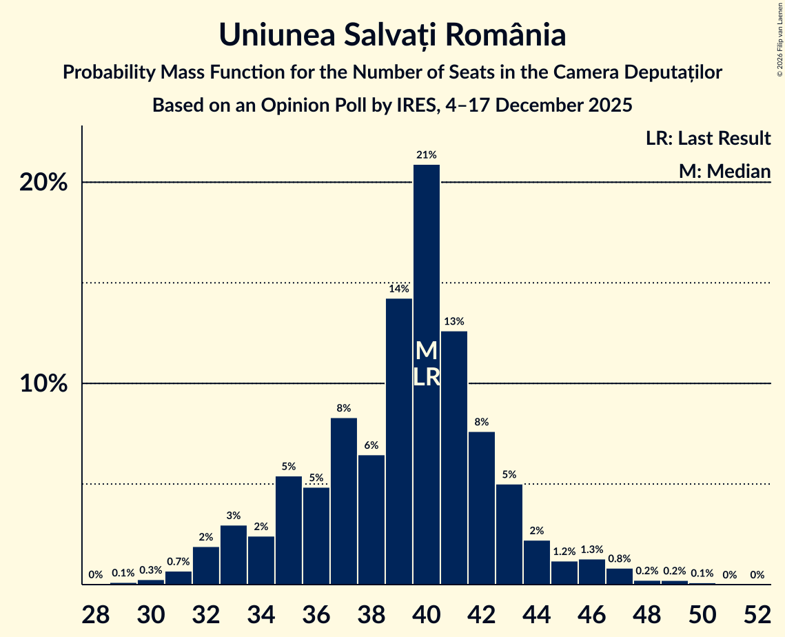

| Number of Seats | Probability | Accumulated | Special Marks |
|:---------------:|:-----------:|:-----------:|:-------------:|
| 28 | 0% | 100% |  |
| 29 | 0.1% | 99.9% |  |
| 30 | 0.3% | 99.8% |  |
| 31 | 0.7% | 99.6% |  |
| 32 | 2% | 98.9% |  |
| 33 | 3% | 97% |  |
| 34 | 2% | 94% |  |
| 35 | 5% | 92% |  |
| 36 | 5% | 86% |  |
| 37 | 8% | 81% |  |
| 38 | 6% | 73% |  |
| 39 | 14% | 67% |  |
| 40 | 21% | 52% | Last Result, Median |
| 41 | 13% | 31% |  |
| 42 | 8% | 19% |  |
| 43 | 5% | 11% |  |
| 44 | 2% | 6% |  |
| 45 | 1.2% | 4% |  |
| 46 | 1.3% | 3% |  |
| 47 | 0.8% | 1.4% |  |
| 48 | 0.2% | 0.6% |  |
| 49 | 0.2% | 0.4% |  |
| 50 | 0.1% | 0.2% |  |
| 51 | 0% | 0.1% |  |
| 52 | 0% | 0% |  |

### Sănătate, Educație, Natură, Sustenabilitate

*For a full overview of the results for this party, see the [Sănătate, Educație, Natură, Sustenabilitate](party-sănătateeducațienaturăsustenabilitate.html) page.*

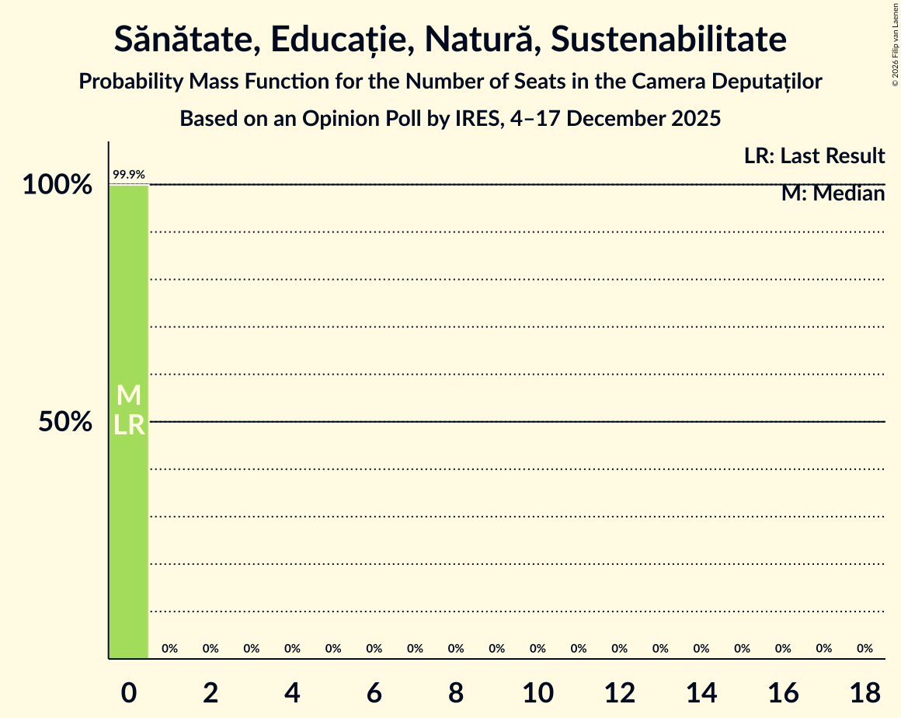

| Number of Seats | Probability | Accumulated | Special Marks |
|:---------------:|:-----------:|:-----------:|:-------------:|
| 0 | 99.9% | 100% | Last Result, Median |
| 1 | 0% | 0.1% |  |
| 2 | 0% | 0.1% |  |
| 3 | 0% | 0.1% |  |
| 4 | 0% | 0.1% |  |
| 5 | 0% | 0.1% |  |
| 6 | 0% | 0.1% |  |
| 7 | 0% | 0.1% |  |
| 8 | 0% | 0.1% |  |
| 9 | 0% | 0.1% |  |
| 10 | 0% | 0.1% |  |
| 11 | 0% | 0.1% |  |
| 12 | 0% | 0.1% |  |
| 13 | 0% | 0.1% |  |
| 14 | 0% | 0.1% |  |
| 15 | 0% | 0.1% |  |
| 16 | 0% | 0.1% |  |
| 17 | 0.1% | 0.1% |  |
| 18 | 0% | 0% |  |

### Partidul Oamenilor Tineri

*For a full overview of the results for this party, see the [Partidul Oamenilor Tineri](party-partiduloamenilortineri.html) page.*

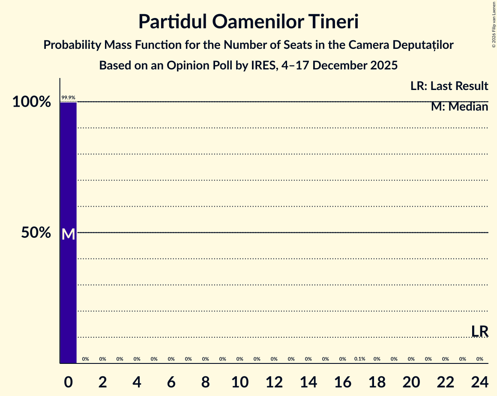

| Number of Seats | Probability | Accumulated | Special Marks |
|:---------------:|:-----------:|:-----------:|:-------------:|
| 0 | 99.9% | 100% | Median |
| 1 | 0% | 0.1% |  |
| 2 | 0% | 0.1% |  |
| 3 | 0% | 0.1% |  |
| 4 | 0% | 0.1% |  |
| 5 | 0% | 0.1% |  |
| 6 | 0% | 0.1% |  |
| 7 | 0% | 0.1% |  |
| 8 | 0% | 0.1% |  |
| 9 | 0% | 0.1% |  |
| 10 | 0% | 0.1% |  |
| 11 | 0% | 0.1% |  |
| 12 | 0% | 0.1% |  |
| 13 | 0% | 0.1% |  |
| 14 | 0% | 0.1% |  |
| 15 | 0% | 0.1% |  |
| 16 | 0% | 0.1% |  |
| 17 | 0.1% | 0.1% |  |
| 18 | 0% | 0% |  |
| 19 | 0% | 0% |  |
| 20 | 0% | 0% |  |
| 21 | 0% | 0% |  |
| 22 | 0% | 0% |  |
| 23 | 0% | 0% |  |
| 24 | 0% | 0% | Last Result |

### Partidul S.O.S. România

*For a full overview of the results for this party, see the [Partidul S.O.S. România](party-partidulsosromânia.html) page.*

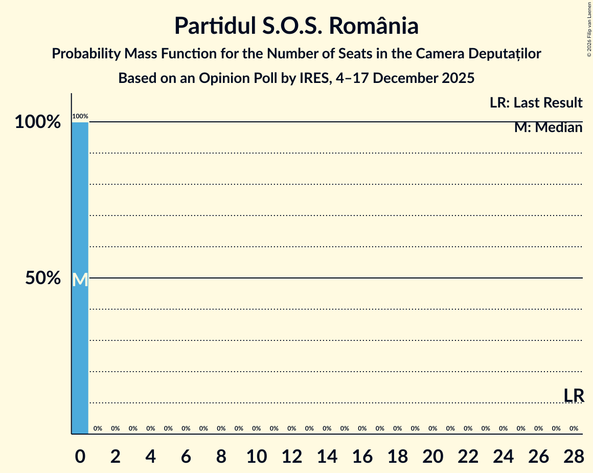

| Number of Seats | Probability | Accumulated | Special Marks |
|:---------------:|:-----------:|:-----------:|:-------------:|
| 0 | 100% | 100% | Median |
| 1 | 0% | 0% |  |
| 2 | 0% | 0% |  |
| 3 | 0% | 0% |  |
| 4 | 0% | 0% |  |
| 5 | 0% | 0% |  |
| 6 | 0% | 0% |  |
| 7 | 0% | 0% |  |
| 8 | 0% | 0% |  |
| 9 | 0% | 0% |  |
| 10 | 0% | 0% |  |
| 11 | 0% | 0% |  |
| 12 | 0% | 0% |  |
| 13 | 0% | 0% |  |
| 14 | 0% | 0% |  |
| 15 | 0% | 0% |  |
| 16 | 0% | 0% |  |
| 17 | 0% | 0% |  |
| 18 | 0% | 0% |  |
| 19 | 0% | 0% |  |
| 20 | 0% | 0% |  |
| 21 | 0% | 0% |  |
| 22 | 0% | 0% |  |
| 23 | 0% | 0% |  |
| 24 | 0% | 0% |  |
| 25 | 0% | 0% |  |
| 26 | 0% | 0% |  |
| 27 | 0% | 0% |  |
| 28 | 0% | 0% | Last Result |

### Romániai Magyar Demokrata Szövetség

*For a full overview of the results for this party, see the [Romániai Magyar Demokrata Szövetség](party-romániaimagyardemokrataszövetség.html) page.*

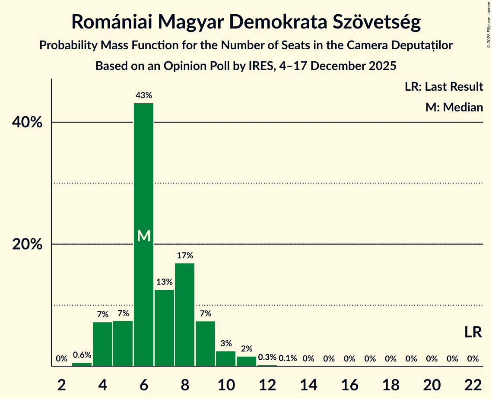

| Number of Seats | Probability | Accumulated | Special Marks |
|:---------------:|:-----------:|:-----------:|:-------------:|
| 3 | 0.6% | 100% |  |
| 4 | 7% | 99.4% |  |
| 5 | 7% | 92% |  |
| 6 | 43% | 85% | Median |
| 7 | 13% | 41% |  |
| 8 | 17% | 29% |  |
| 9 | 7% | 12% |  |
| 10 | 3% | 5% |  |
| 11 | 2% | 2% |  |
| 12 | 0.3% | 0.4% |  |
| 13 | 0.1% | 0.1% |  |
| 14 | 0% | 0% |  |
| 15 | 0% | 0% |  |
| 16 | 0% | 0% |  |
| 17 | 0% | 0% |  |
| 18 | 0% | 0% |  |
| 19 | 0% | 0% |  |
| 20 | 0% | 0% |  |
| 21 | 0% | 0% |  |
| 22 | 0% | 0% | Last Result |

### Reînnoim Proiectul European al României

*For a full overview of the results for this party, see the [Reînnoim Proiectul European al României](party-reînnoimproiectuleuropeanalromâniei.html) page.*

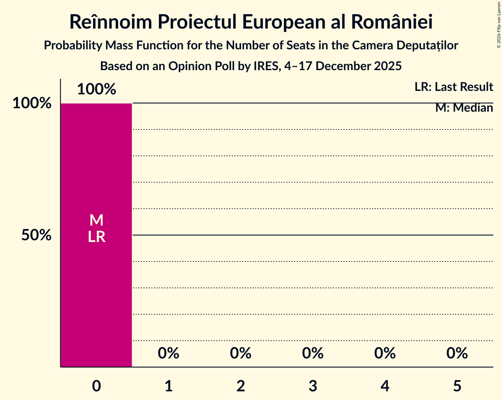

| Number of Seats | Probability | Accumulated | Special Marks |
|:---------------:|:-----------:|:-----------:|:-------------:|
| 0 | 100% | 100% | Last Result, Median |

## Coalitions

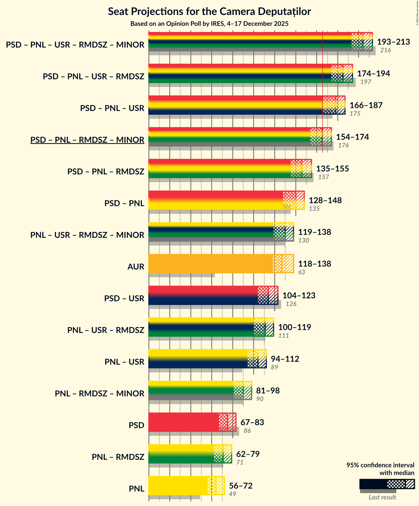

### Confidence Intervals

| Coalition | Last Result | Median | Majority? | 80% Confidence Interval | 90% Confidence Interval | 95% Confidence Interval | 99% Confidence Interval |
|:---------:|:-----------:|:------:|:---------:|:-----------------------:|:-----------------------:|:-----------------------:|:-----------------------:|
| Partidul Social Democrat – Partidul Național Liberal – Uniunea Salvați România – Romániai Magyar Demokrata Szövetség | 197 | 185 | 100% | 178–191 | 175–193 | 174–194 | 171–197 |
| Partidul Social Democrat – Partidul Național Liberal – Uniunea Salvați România | 175 | 178 | 98.7% | 171–184 | 168–185 | 166–187 | 164–191 |
| Partidul Social Democrat – Partidul Național Liberal – Romániai Magyar Demokrata Szövetség | 157 | 146 | 0% | 138–151 | 137–152 | 135–155 | 133–159 |
| Partidul Social Democrat – Partidul Național Liberal | 135 | 140 | 0% | 132–144 | 129–146 | 128–148 | 126–152 |
| Alianța pentru Unirea Românilor | 63 | 127 | 0% | 121–134 | 119–136 | 118–138 | 115–141 |
| Partidul Social Democrat – Uniunea Salvați România | 126 | 114 | 0% | 108–119 | 106–121 | 104–123 | 101–127 |
| Partidul Național Liberal – Uniunea Salvați România – Romániai Magyar Demokrata Szövetség | 111 | 111 | 0% | 103–116 | 102–118 | 100–119 | 97–122 |
| Partidul Național Liberal – Uniunea Salvați România | 89 | 104 | 0% | 97–109 | 95–111 | 94–112 | 90–115 |
| Partidul Social Democrat | 86 | 75 | 0% | 69–80 | 67–81 | 67–83 | 64–86 |
| Partidul Național Liberal – Romániai Magyar Demokrata Szövetség | 71 | 71 | 0% | 66–76 | 64–78 | 62–79 | 60–83 |
| Partidul Național Liberal | 49 | 64 | 0% | 58–69 | 57–70 | 56–72 | 54–75 |

### Partidul Social Democrat – Partidul Național Liberal – Uniunea Salvați România – Romániai Magyar Demokrata Szövetség

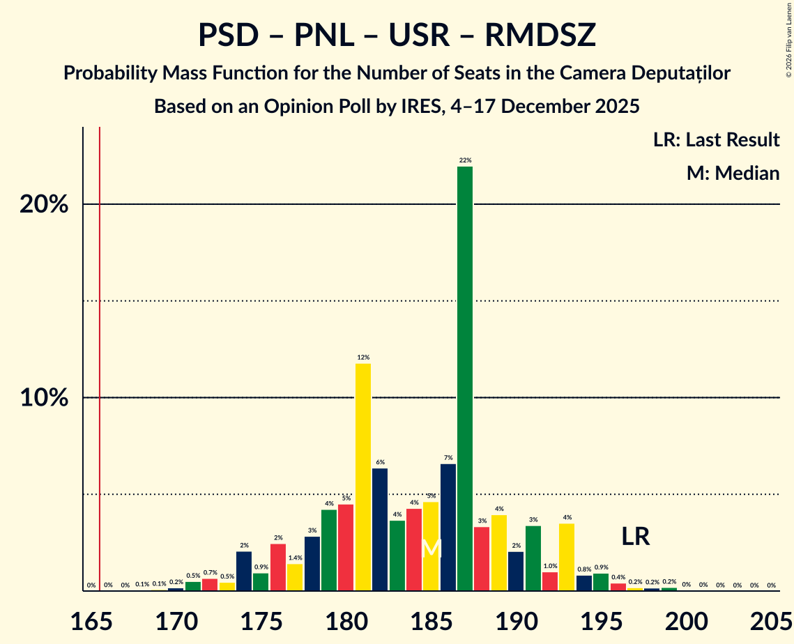

| Number of Seats | Probability | Accumulated | Special Marks |
|:---------------:|:-----------:|:-----------:|:-------------:|
| 166 | 0% | 100% | Majority |
| 167 | 0% | 99.9% |  |
| 168 | 0.1% | 99.9% |  |
| 169 | 0.1% | 99.9% |  |
| 170 | 0.2% | 99.8% |  |
| 171 | 0.5% | 99.6% |  |
| 172 | 0.7% | 99.1% |  |
| 173 | 0.5% | 98% |  |
| 174 | 2% | 98% |  |
| 175 | 0.9% | 96% |  |
| 176 | 2% | 95% |  |
| 177 | 1.4% | 92% |  |
| 178 | 3% | 91% |  |
| 179 | 4% | 88% |  |
| 180 | 5% | 84% |  |
| 181 | 12% | 79% |  |
| 182 | 6% | 68% |  |
| 183 | 4% | 61% |  |
| 184 | 4% | 58% |  |
| 185 | 5% | 53% | Median |
| 186 | 7% | 49% |  |
| 187 | 22% | 42% |  |
| 188 | 3% | 20% |  |
| 189 | 4% | 17% |  |
| 190 | 2% | 13% |  |
| 191 | 3% | 11% |  |
| 192 | 1.0% | 7% |  |
| 193 | 4% | 6% |  |
| 194 | 0.8% | 3% |  |
| 195 | 0.9% | 2% |  |
| 196 | 0.4% | 1.1% |  |
| 197 | 0.2% | 0.7% | Last Result |
| 198 | 0.2% | 0.5% |  |
| 199 | 0.2% | 0.3% |  |
| 200 | 0% | 0.1% |  |
| 201 | 0% | 0.1% |  |
| 202 | 0% | 0% |  |

### Partidul Social Democrat – Partidul Național Liberal – Uniunea Salvați România

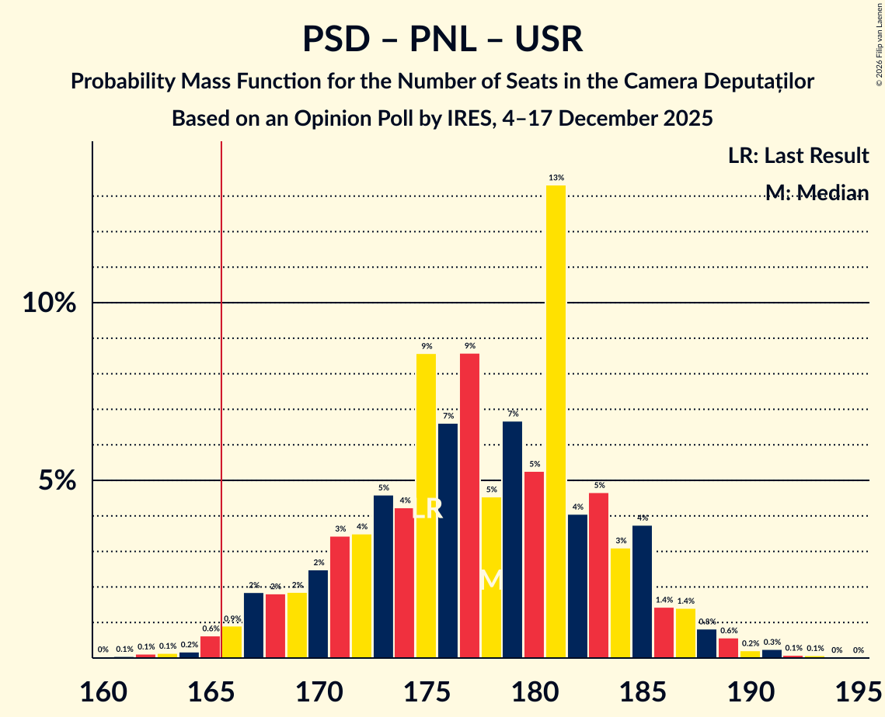

| Number of Seats | Probability | Accumulated | Special Marks |
|:---------------:|:-----------:|:-----------:|:-------------:|
| 160 | 0% | 100% |  |
| 161 | 0% | 99.9% |  |
| 162 | 0.1% | 99.9% |  |
| 163 | 0.1% | 99.7% |  |
| 164 | 0.2% | 99.6% |  |
| 165 | 0.8% | 99.4% |  |
| 166 | 1.3% | 98.7% | Majority |
| 167 | 0.5% | 97% |  |
| 168 | 3% | 97% |  |
| 169 | 2% | 94% |  |
| 170 | 3% | 93% |  |
| 171 | 3% | 90% |  |
| 172 | 3% | 87% |  |
| 173 | 4% | 84% |  |
| 174 | 3% | 80% |  |
| 175 | 12% | 77% | Last Result |
| 176 | 5% | 65% |  |
| 177 | 7% | 60% |  |
| 178 | 4% | 53% |  |
| 179 | 6% | 49% | Median |
| 180 | 4% | 42% |  |
| 181 | 20% | 38% |  |
| 182 | 4% | 18% |  |
| 183 | 3% | 14% |  |
| 184 | 2% | 11% |  |
| 185 | 5% | 9% |  |
| 186 | 1.1% | 4% |  |
| 187 | 1.3% | 3% |  |
| 188 | 0.7% | 2% |  |
| 189 | 0.5% | 1.2% |  |
| 190 | 0.2% | 0.7% |  |
| 191 | 0.3% | 0.5% |  |
| 192 | 0.1% | 0.2% |  |
| 193 | 0.1% | 0.1% |  |
| 194 | 0% | 0.1% |  |
| 195 | 0% | 0% |  |

### Partidul Social Democrat – Partidul Național Liberal – Romániai Magyar Demokrata Szövetség

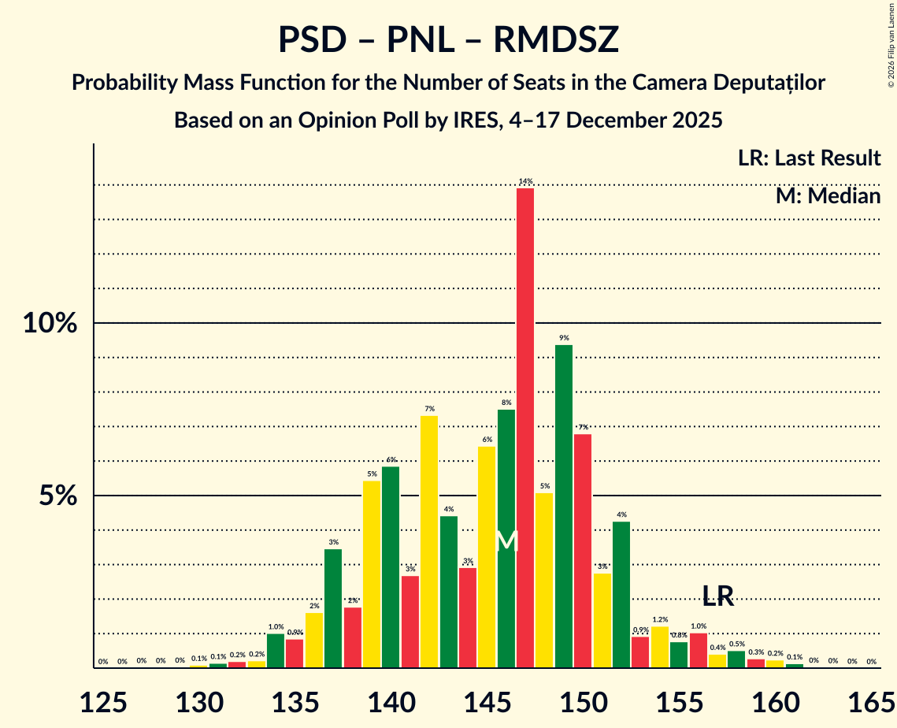

| Number of Seats | Probability | Accumulated | Special Marks |
|:---------------:|:-----------:|:-----------:|:-------------:|
| 128 | 0% | 100% |  |
| 129 | 0% | 99.9% |  |
| 130 | 0.1% | 99.9% |  |
| 131 | 0.1% | 99.8% |  |
| 132 | 0.1% | 99.7% |  |
| 133 | 0.3% | 99.6% |  |
| 134 | 1.0% | 99.3% |  |
| 135 | 1.1% | 98% |  |
| 136 | 1.3% | 97% |  |
| 137 | 5% | 96% |  |
| 138 | 2% | 91% |  |
| 139 | 4% | 90% |  |
| 140 | 8% | 86% |  |
| 141 | 2% | 78% |  |
| 142 | 8% | 76% |  |
| 143 | 4% | 68% |  |
| 144 | 3% | 64% |  |
| 145 | 6% | 62% | Median |
| 146 | 6% | 55% |  |
| 147 | 21% | 50% |  |
| 148 | 5% | 29% |  |
| 149 | 7% | 24% |  |
| 150 | 7% | 17% |  |
| 151 | 2% | 10% |  |
| 152 | 3% | 8% |  |
| 153 | 0.7% | 5% |  |
| 154 | 1.1% | 4% |  |
| 155 | 0.9% | 3% |  |
| 156 | 0.9% | 2% |  |
| 157 | 0.4% | 1.3% | Last Result |
| 158 | 0.3% | 0.8% |  |
| 159 | 0.2% | 0.6% |  |
| 160 | 0.3% | 0.4% |  |
| 161 | 0% | 0.1% |  |
| 162 | 0.1% | 0.1% |  |
| 163 | 0% | 0.1% |  |
| 164 | 0% | 0% |  |

### Partidul Social Democrat – Partidul Național Liberal

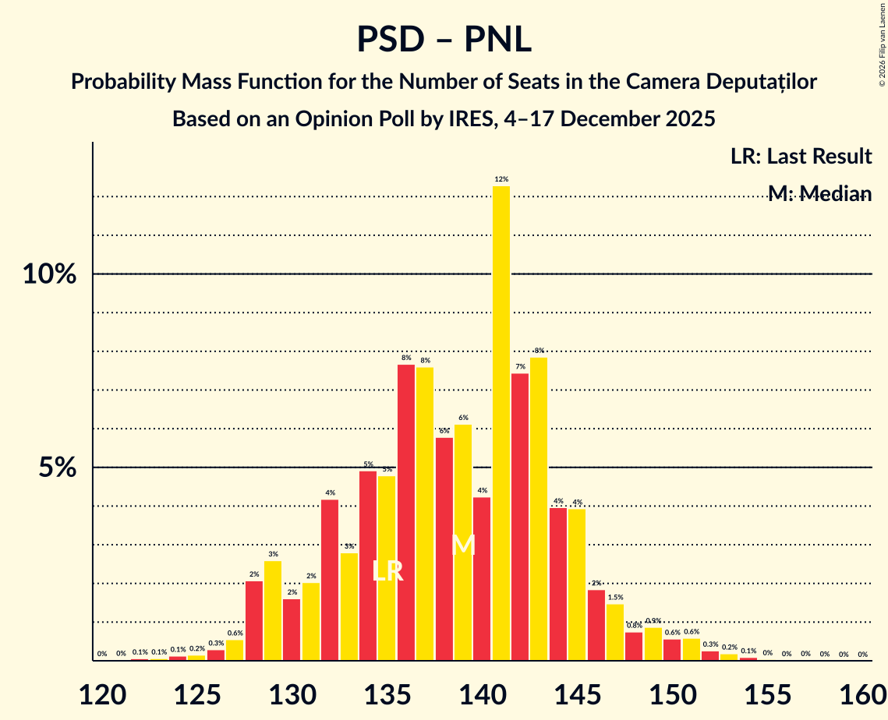

| Number of Seats | Probability | Accumulated | Special Marks |
|:---------------:|:-----------:|:-----------:|:-------------:|
| 121 | 0% | 100% |  |
| 122 | 0.1% | 99.9% |  |
| 123 | 0% | 99.9% |  |
| 124 | 0.1% | 99.8% |  |
| 125 | 0.1% | 99.7% |  |
| 126 | 0.3% | 99.6% |  |
| 127 | 0.6% | 99.3% |  |
| 128 | 2% | 98.7% |  |
| 129 | 4% | 97% |  |
| 130 | 0.7% | 93% |  |
| 131 | 2% | 92% |  |
| 132 | 3% | 90% |  |
| 133 | 3% | 87% |  |
| 134 | 7% | 84% |  |
| 135 | 5% | 78% | Last Result |
| 136 | 9% | 73% |  |
| 137 | 5% | 64% |  |
| 138 | 4% | 59% |  |
| 139 | 4% | 55% | Median |
| 140 | 4% | 51% |  |
| 141 | 20% | 47% |  |
| 142 | 9% | 27% |  |
| 143 | 6% | 18% |  |
| 144 | 4% | 12% |  |
| 145 | 2% | 8% |  |
| 146 | 1.1% | 5% |  |
| 147 | 1.2% | 4% |  |
| 148 | 0.8% | 3% |  |
| 149 | 0.8% | 2% |  |
| 150 | 0.5% | 1.5% |  |
| 151 | 0.4% | 0.9% |  |
| 152 | 0.3% | 0.5% |  |
| 153 | 0.1% | 0.3% |  |
| 154 | 0.1% | 0.2% |  |
| 155 | 0% | 0.1% |  |
| 156 | 0% | 0.1% |  |
| 157 | 0% | 0% |  |

### Alianța pentru Unirea Românilor

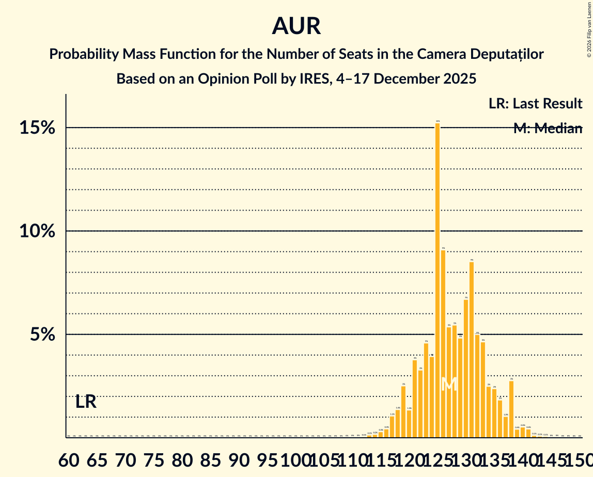

| Number of Seats | Probability | Accumulated | Special Marks |
|:---------------:|:-----------:|:-----------:|:-------------:|
| 63 | 0% | 100% | Last Result |
| 64 | 0% | 100% |  |
| 65 | 0% | 100% |  |
| 66 | 0% | 100% |  |
| 67 | 0% | 100% |  |
| 68 | 0% | 100% |  |
| 69 | 0% | 100% |  |
| 70 | 0% | 100% |  |
| 71 | 0% | 100% |  |
| 72 | 0% | 100% |  |
| 73 | 0% | 100% |  |
| 74 | 0% | 100% |  |
| 75 | 0% | 100% |  |
| 76 | 0% | 100% |  |
| 77 | 0% | 100% |  |
| 78 | 0% | 100% |  |
| 79 | 0% | 100% |  |
| 80 | 0% | 100% |  |
| 81 | 0% | 100% |  |
| 82 | 0% | 100% |  |
| 83 | 0% | 100% |  |
| 84 | 0% | 100% |  |
| 85 | 0% | 100% |  |
| 86 | 0% | 100% |  |
| 87 | 0% | 100% |  |
| 88 | 0% | 100% |  |
| 89 | 0% | 100% |  |
| 90 | 0% | 100% |  |
| 91 | 0% | 100% |  |
| 92 | 0% | 100% |  |
| 93 | 0% | 100% |  |
| 94 | 0% | 100% |  |
| 95 | 0% | 100% |  |
| 96 | 0% | 100% |  |
| 97 | 0% | 100% |  |
| 98 | 0% | 100% |  |
| 99 | 0% | 100% |  |
| 100 | 0% | 100% |  |
| 101 | 0% | 100% |  |
| 102 | 0% | 100% |  |
| 103 | 0% | 100% |  |
| 104 | 0% | 100% |  |
| 105 | 0% | 100% |  |
| 106 | 0% | 100% |  |
| 107 | 0% | 100% |  |
| 108 | 0% | 100% |  |
| 109 | 0% | 100% |  |
| 110 | 0% | 100% |  |
| 111 | 0% | 100% |  |
| 112 | 0.1% | 99.9% |  |
| 113 | 0.2% | 99.9% |  |
| 114 | 0.2% | 99.7% |  |
| 115 | 0.2% | 99.5% |  |
| 116 | 0.4% | 99.3% |  |
| 117 | 1.0% | 98.9% |  |
| 118 | 0.8% | 98% |  |
| 119 | 4% | 97% |  |
| 120 | 1.0% | 94% |  |
| 121 | 3% | 93% |  |
| 122 | 2% | 89% |  |
| 123 | 4% | 87% |  |
| 124 | 3% | 83% |  |
| 125 | 22% | 80% |  |
| 126 | 7% | 58% |  |
| 127 | 5% | 51% | Median |
| 128 | 4% | 46% |  |
| 129 | 4% | 42% |  |
| 130 | 6% | 39% |  |
| 131 | 12% | 32% |  |
| 132 | 5% | 20% |  |
| 133 | 4% | 16% |  |
| 134 | 3% | 12% |  |
| 135 | 1.4% | 9% |  |
| 136 | 2% | 7% |  |
| 137 | 0.9% | 5% |  |
| 138 | 2% | 4% |  |
| 139 | 0.4% | 2% |  |
| 140 | 0.6% | 1.5% |  |
| 141 | 0.5% | 0.9% |  |
| 142 | 0.2% | 0.3% |  |
| 143 | 0.1% | 0.2% |  |
| 144 | 0.1% | 0.1% |  |
| 145 | 0% | 0% |  |

### Partidul Social Democrat – Uniunea Salvați România

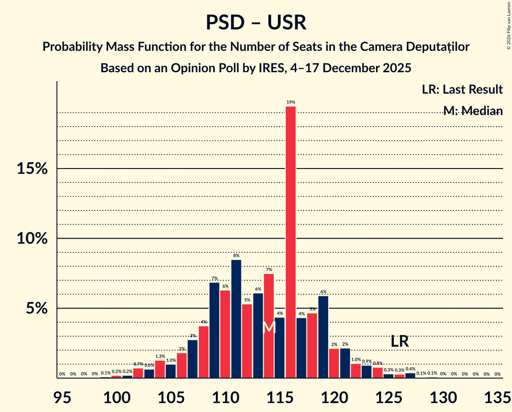

| Number of Seats | Probability | Accumulated | Special Marks |
|:---------------:|:-----------:|:-----------:|:-------------:|
| 97 | 0% | 100% |  |
| 98 | 0% | 99.9% |  |
| 99 | 0.1% | 99.9% |  |
| 100 | 0.2% | 99.8% |  |
| 101 | 0.2% | 99.6% |  |
| 102 | 0.7% | 99.4% |  |
| 103 | 0.6% | 98.7% |  |
| 104 | 1.3% | 98% |  |
| 105 | 1.0% | 97% |  |
| 106 | 2% | 96% |  |
| 107 | 3% | 94% |  |
| 108 | 4% | 91% |  |
| 109 | 7% | 87% |  |
| 110 | 6% | 81% |  |
| 111 | 8% | 74% |  |
| 112 | 5% | 66% |  |
| 113 | 6% | 61% |  |
| 114 | 7% | 54% |  |
| 115 | 4% | 47% | Median |
| 116 | 19% | 43% |  |
| 117 | 4% | 23% |  |
| 118 | 5% | 19% |  |
| 119 | 6% | 14% |  |
| 120 | 2% | 8% |  |
| 121 | 2% | 6% |  |
| 122 | 1.0% | 4% |  |
| 123 | 0.9% | 3% |  |
| 124 | 0.8% | 2% |  |
| 125 | 0.3% | 1.2% |  |
| 126 | 0.3% | 0.9% | Last Result |
| 127 | 0.4% | 0.6% |  |
| 128 | 0.1% | 0.2% |  |
| 129 | 0.1% | 0.1% |  |
| 130 | 0% | 0.1% |  |
| 131 | 0% | 0% |  |

### Partidul Național Liberal – Uniunea Salvați România – Romániai Magyar Demokrata Szövetség

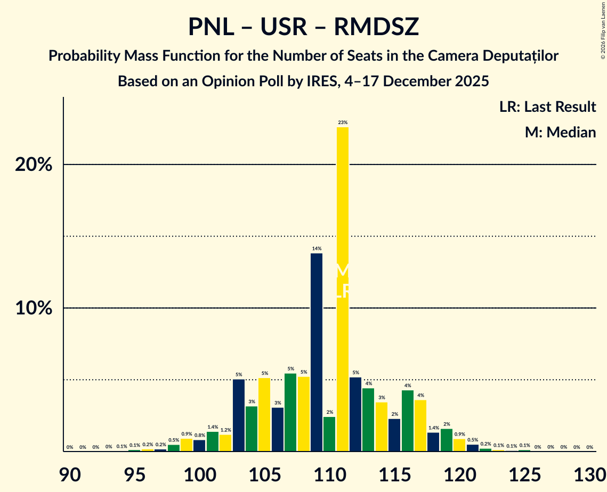

| Number of Seats | Probability | Accumulated | Special Marks |
|:---------------:|:-----------:|:-----------:|:-------------:|
| 93 | 0% | 100% |  |
| 94 | 0.1% | 99.9% |  |
| 95 | 0.1% | 99.9% |  |
| 96 | 0.2% | 99.7% |  |
| 97 | 0.2% | 99.5% |  |
| 98 | 0.5% | 99.4% |  |
| 99 | 0.9% | 98.9% |  |
| 100 | 0.8% | 98% |  |
| 101 | 1.4% | 97% |  |
| 102 | 1.2% | 96% |  |
| 103 | 5% | 94% |  |
| 104 | 3% | 89% |  |
| 105 | 5% | 86% |  |
| 106 | 3% | 81% |  |
| 107 | 5% | 78% |  |
| 108 | 5% | 73% |  |
| 109 | 14% | 67% |  |
| 110 | 2% | 53% | Median |
| 111 | 23% | 51% | Last Result |
| 112 | 5% | 28% |  |
| 113 | 4% | 23% |  |
| 114 | 3% | 19% |  |
| 115 | 2% | 15% |  |
| 116 | 4% | 13% |  |
| 117 | 4% | 9% |  |
| 118 | 1.4% | 5% |  |
| 119 | 2% | 4% |  |
| 120 | 0.9% | 2% |  |
| 121 | 0.5% | 1.2% |  |
| 122 | 0.2% | 0.6% |  |
| 123 | 0.1% | 0.4% |  |
| 124 | 0.1% | 0.3% |  |
| 125 | 0.1% | 0.2% |  |
| 126 | 0% | 0.1% |  |
| 127 | 0% | 0% |  |

### Partidul Național Liberal – Uniunea Salvați România

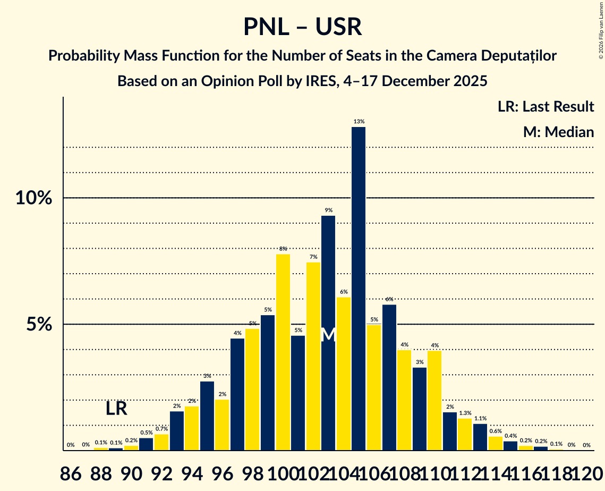

| Number of Seats | Probability | Accumulated | Special Marks |
|:---------------:|:-----------:|:-----------:|:-------------:|
| 87 | 0% | 100% |  |
| 88 | 0.2% | 99.9% |  |
| 89 | 0.1% | 99.7% | Last Result |
| 90 | 0.2% | 99.6% |  |
| 91 | 0.5% | 99.4% |  |
| 92 | 0.5% | 98.8% |  |
| 93 | 0.8% | 98% |  |
| 94 | 1.2% | 98% |  |
| 95 | 2% | 96% |  |
| 96 | 3% | 95% |  |
| 97 | 5% | 92% |  |
| 98 | 5% | 87% |  |
| 99 | 5% | 82% |  |
| 100 | 4% | 78% |  |
| 101 | 3% | 74% |  |
| 102 | 8% | 71% |  |
| 103 | 11% | 63% |  |
| 104 | 7% | 52% | Median |
| 105 | 21% | 45% |  |
| 106 | 5% | 24% |  |
| 107 | 4% | 19% |  |
| 108 | 3% | 14% |  |
| 109 | 3% | 11% |  |
| 110 | 3% | 8% |  |
| 111 | 1.5% | 5% |  |
| 112 | 1.2% | 4% |  |
| 113 | 1.4% | 2% |  |
| 114 | 0.4% | 1.0% |  |
| 115 | 0.3% | 0.7% |  |
| 116 | 0.2% | 0.4% |  |
| 117 | 0.1% | 0.2% |  |
| 118 | 0.1% | 0.1% |  |
| 119 | 0% | 0.1% |  |
| 120 | 0% | 0% |  |

### Partidul Social Democrat

| Number of Seats | Probability | Accumulated | Special Marks |
|:---------------:|:-----------:|:-----------:|:-------------:|
| 61 | 0.1% | 100% |  |
| 62 | 0.2% | 99.9% |  |
| 63 | 0.1% | 99.7% |  |
| 64 | 0.3% | 99.6% |  |
| 65 | 0.3% | 99.3% |  |
| 66 | 1.1% | 99.0% |  |
| 67 | 3% | 98% |  |
| 68 | 2% | 95% |  |
| 69 | 5% | 93% |  |
| 70 | 3% | 88% |  |
| 71 | 8% | 85% |  |
| 72 | 10% | 77% |  |
| 73 | 6% | 67% |  |
| 74 | 5% | 61% |  |
| 75 | 8% | 56% | Median |
| 76 | 23% | 48% |  |
| 77 | 6% | 25% |  |
| 78 | 4% | 18% |  |
| 79 | 4% | 15% |  |
| 80 | 3% | 11% |  |
| 81 | 4% | 8% |  |
| 82 | 0.9% | 4% |  |
| 83 | 0.9% | 3% |  |
| 84 | 0.6% | 2% |  |
| 85 | 0.7% | 1.3% |  |
| 86 | 0.2% | 0.7% | Last Result |
| 87 | 0.1% | 0.5% |  |
| 88 | 0.2% | 0.3% |  |
| 89 | 0.1% | 0.2% |  |
| 90 | 0% | 0.1% |  |
| 91 | 0% | 0% |  |

### Partidul Național Liberal – Romániai Magyar Demokrata Szövetség

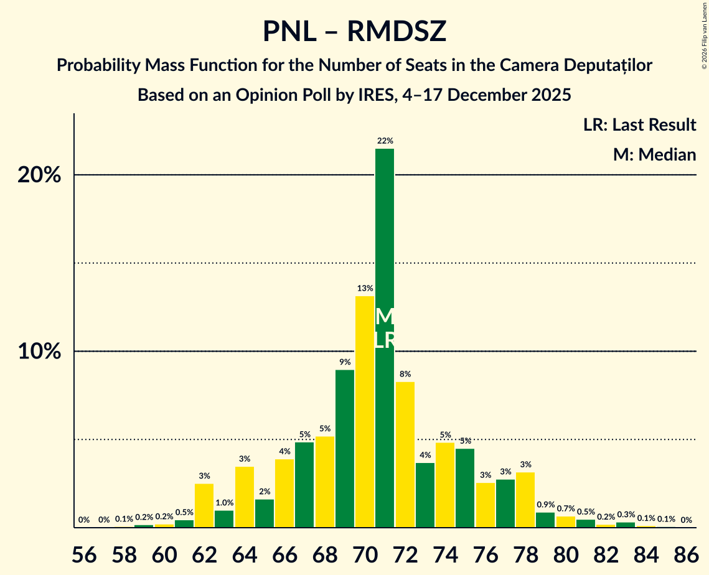

| Number of Seats | Probability | Accumulated | Special Marks |
|:---------------:|:-----------:|:-----------:|:-------------:|
| 57 | 0% | 100% |  |
| 58 | 0.1% | 99.9% |  |
| 59 | 0.2% | 99.8% |  |
| 60 | 0.2% | 99.6% |  |
| 61 | 0.5% | 99.4% |  |
| 62 | 3% | 99.0% |  |
| 63 | 1.0% | 96% |  |
| 64 | 3% | 95% |  |
| 65 | 2% | 92% |  |
| 66 | 4% | 90% |  |
| 67 | 5% | 86% |  |
| 68 | 5% | 82% |  |
| 69 | 9% | 76% |  |
| 70 | 13% | 67% | Median |
| 71 | 22% | 54% | Last Result |
| 72 | 8% | 33% |  |
| 73 | 4% | 24% |  |
| 74 | 5% | 21% |  |
| 75 | 5% | 16% |  |
| 76 | 3% | 11% |  |
| 77 | 3% | 9% |  |
| 78 | 3% | 6% |  |
| 79 | 0.9% | 3% |  |
| 80 | 0.7% | 2% |  |
| 81 | 0.5% | 1.3% |  |
| 82 | 0.2% | 0.8% |  |
| 83 | 0.3% | 0.6% |  |
| 84 | 0.1% | 0.2% |  |
| 85 | 0.1% | 0.1% |  |
| 86 | 0% | 0% |  |

### Partidul Național Liberal

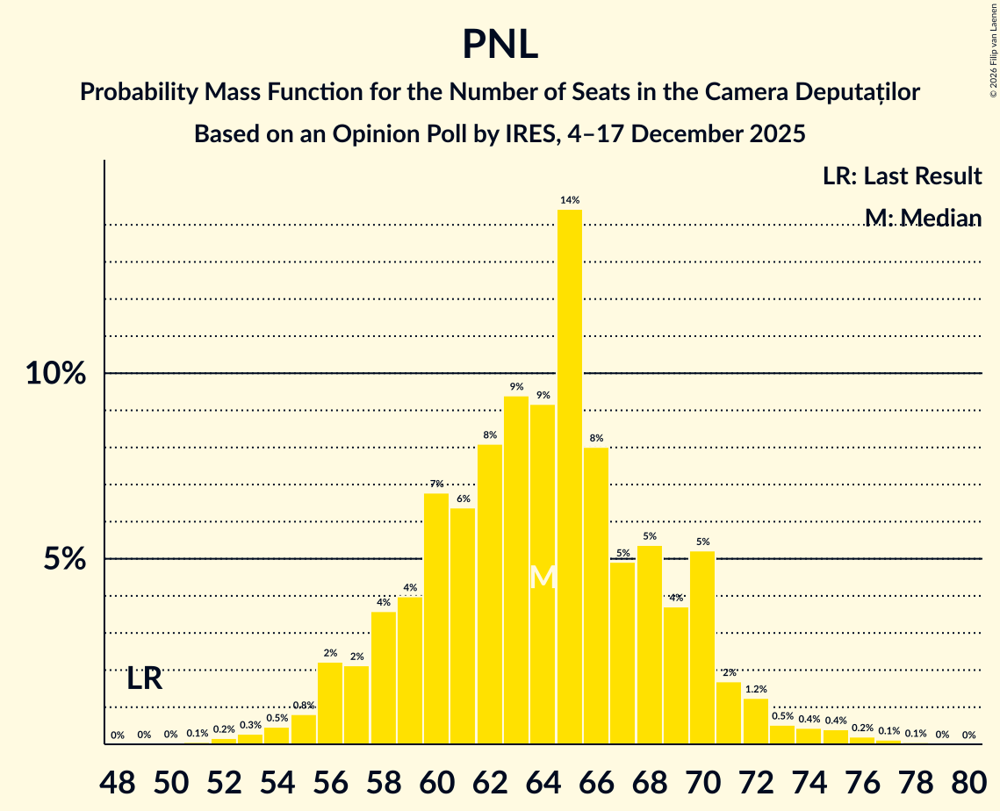

| Number of Seats | Probability | Accumulated | Special Marks |
|:---------------:|:-----------:|:-----------:|:-------------:|
| 49 | 0% | 100% | Last Result |
| 50 | 0% | 100% |  |
| 51 | 0.1% | 100% |  |
| 52 | 0.1% | 99.9% |  |
| 53 | 0.2% | 99.8% |  |
| 54 | 0.4% | 99.6% |  |
| 55 | 0.9% | 99.1% |  |
| 56 | 3% | 98% |  |
| 57 | 2% | 96% |  |
| 58 | 4% | 94% |  |
| 59 | 3% | 90% |  |
| 60 | 4% | 87% |  |
| 61 | 4% | 83% |  |
| 62 | 6% | 79% |  |
| 63 | 11% | 72% |  |
| 64 | 12% | 61% | Median |
| 65 | 22% | 49% |  |
| 66 | 8% | 27% |  |
| 67 | 4% | 19% |  |
| 68 | 3% | 16% |  |
| 69 | 4% | 13% |  |
| 70 | 4% | 8% |  |
| 71 | 1.2% | 4% |  |
| 72 | 1.3% | 3% |  |
| 73 | 0.4% | 2% |  |
| 74 | 0.4% | 1.2% |  |
| 75 | 0.5% | 0.9% |  |
| 76 | 0.2% | 0.4% |  |
| 77 | 0.1% | 0.2% |  |
| 78 | 0.1% | 0.1% |  |
| 79 | 0% | 0% |  |

## Technical Information

### Opinion Poll

+ **Polling firm:** IRES
+ **Commissioner(s):** —
+ **Fieldwork period:** 4–17 December 2025

### Calculations

+ **Sample size:** 1012
+ **Simulations done:** 1,048,576
+ **Error estimate:** 2.19%

