# Opinion Poll by CURS, 10–19 December 2025

<a href="#voting-intentions">Voting Intentions</a> | <a href="#seats">Seats</a> | <a href="#coalitions">Coalitions</a> | <a href="#technical-information">Technical Information</a>

## Voting Intentions

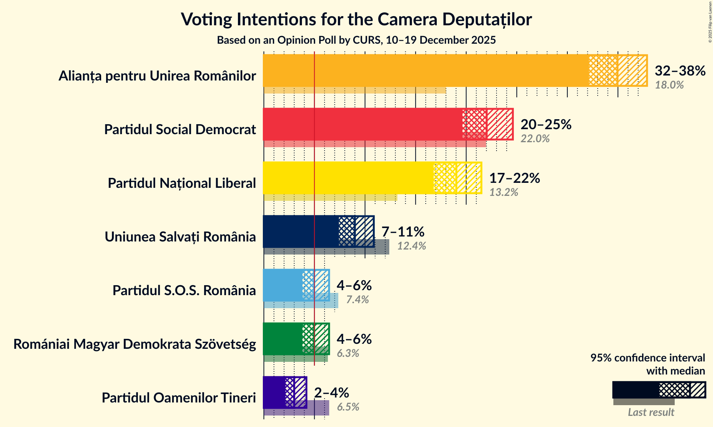

### Confidence Intervals

| Party | Last Result | Poll Result | 80% Confidence Interval | 90% Confidence Interval | 95% Confidence Interval | 99% Confidence Interval |
|:-----:|:-----------:|:-----------:|:-----------------------:|:-----------------------:|:-----------------------:|:-----------------------:|
| Alianța pentru Unirea Românilor | 18.0% | 35.0% | 33.1–36.9% |32.6–37.4% |32.1–37.9% |31.3–38.8% |
| Partidul Social Democrat | 22.0% | 22.0% | 20.5–23.7% |20.0–24.2% |19.6–24.6% |18.9–25.4% |
| Partidul Național Liberal | 13.2% | 19.0% | 17.5–20.6% |17.1–21.1% |16.8–21.5% |16.1–22.3% |
| Uniunea Salvați România | 12.4% | 9.0% | 8.0–10.2% |7.7–10.6% |7.4–10.9% |7.0–11.5% |
| Partidul S.O.S. România | 7.4% | 5.0% | 4.2–5.9% |4.0–6.2% |3.8–6.4% |3.5–6.9% |
| Romániai Magyar Demokrata Szövetség | 6.3% | 5.0% | 4.2–5.9% |4.0–6.2% |3.8–6.4% |3.5–6.9% |
| Partidul Oamenilor Tineri | 6.5% | 3.0% | 2.4–3.8% |2.3–4.0% |2.1–4.2% |1.9–4.6% |

*Note:* The poll result column reflects the actual value used in the calculations. Published results may vary slightly, and in addition be rounded to fewer digits.

## Seats

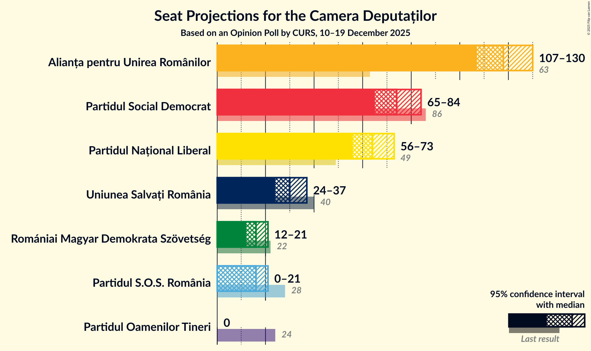

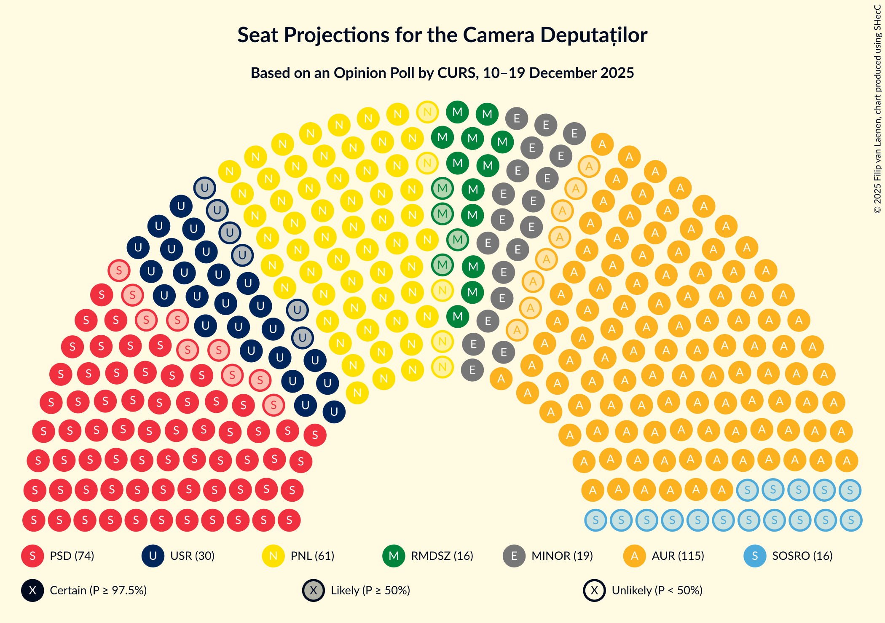

### Confidence Intervals

| Party | Last Result | Median | 80% Confidence Interval | 90% Confidence Interval | 95% Confidence Interval | 99% Confidence Interval |
|:-----:|:-----------:|:------:|:-----------------------:|:-----------------------:|:-----------------------:|:-----------------------:|
| <a href="#alianța-pentru-unirea-românilor">Alianța pentru Unirea Românilor</a> | 63 | 118 | 111–126 |108–128 |107–130 |104–132 |
| <a href="#partidul-social-democrat">Partidul Social Democrat</a> | 86 | 74 | 68–80 |67–82 |65–84 |63–87 |
| <a href="#partidul-național-liberal">Partidul Național Liberal</a> | 49 | 64 | 58–70 |57–72 |56–73 |53–76 |
| <a href="#uniunea-salvați-românia">Uniunea Salvați România</a> | 40 | 30 | 26–34 |25–35 |24–37 |23–39 |
| <a href="#partidul-s.o.s.-românia">Partidul S.O.S. România</a> | 28 | 16 | 0–19 |0–20 |0–21 |0–22 |
| <a href="#romániai-magyar-demokrata-szövetség">Romániai Magyar Demokrata Szövetség</a> | 22 | 16 | 14–20 |13–21 |12–21 |11–23 |
| <a href="#partidul-oamenilor-tineri">Partidul Oamenilor Tineri</a> | 24 | 0 | 0 |0 |0 |0 |

### Alianța pentru Unirea Românilor

*For a full overview of the results for this party, see the [Alianța pentru Unirea Românilor](party-alianțapentruunirearomânilor.html) page.*

| Number of Seats | Probability | Accumulated | Special Marks |
|:---------------:|:-----------:|:-----------:|:-------------:|
| 63 | 0% | 100% | Last Result |
| 64 | 0% | 100% |  |
| 65 | 0% | 100% |  |
| 66 | 0% | 100% |  |
| 67 | 0% | 100% |  |
| 68 | 0% | 100% |  |
| 69 | 0% | 100% |  |
| 70 | 0% | 100% |  |
| 71 | 0% | 100% |  |
| 72 | 0% | 100% |  |
| 73 | 0% | 100% |  |
| 74 | 0% | 100% |  |
| 75 | 0% | 100% |  |
| 76 | 0% | 100% |  |
| 77 | 0% | 100% |  |
| 78 | 0% | 100% |  |
| 79 | 0% | 100% |  |
| 80 | 0% | 100% |  |
| 81 | 0% | 100% |  |
| 82 | 0% | 100% |  |
| 83 | 0% | 100% |  |
| 84 | 0% | 100% |  |
| 85 | 0% | 100% |  |
| 86 | 0% | 100% |  |
| 87 | 0% | 100% |  |
| 88 | 0% | 100% |  |
| 89 | 0% | 100% |  |
| 90 | 0% | 100% |  |
| 91 | 0% | 100% |  |
| 92 | 0% | 100% |  |
| 93 | 0% | 100% |  |
| 94 | 0% | 100% |  |
| 95 | 0% | 100% |  |
| 96 | 0% | 100% |  |
| 97 | 0% | 100% |  |
| 98 | 0% | 100% |  |
| 99 | 0% | 100% |  |
| 100 | 0% | 100% |  |
| 101 | 0.1% | 99.9% |  |
| 102 | 0.1% | 99.9% |  |
| 103 | 0.2% | 99.8% |  |
| 104 | 0.4% | 99.6% |  |
| 105 | 0.6% | 99.2% |  |
| 106 | 0.9% | 98.6% |  |
| 107 | 2% | 98% |  |
| 108 | 2% | 96% |  |
| 109 | 2% | 95% |  |
| 110 | 2% | 92% |  |
| 111 | 4% | 90% |  |
| 112 | 4% | 87% |  |
| 113 | 6% | 82% |  |
| 114 | 6% | 76% |  |
| 115 | 7% | 70% |  |
| 116 | 6% | 64% |  |
| 117 | 6% | 58% |  |
| 118 | 5% | 52% | Median |
| 119 | 5% | 47% |  |
| 120 | 6% | 41% |  |
| 121 | 7% | 35% |  |
| 122 | 6% | 28% |  |
| 123 | 6% | 22% |  |
| 124 | 4% | 17% |  |
| 125 | 2% | 13% |  |
| 126 | 2% | 10% |  |
| 127 | 2% | 8% |  |
| 128 | 2% | 6% |  |
| 129 | 2% | 4% |  |
| 130 | 1.0% | 3% |  |
| 131 | 0.7% | 2% |  |
| 132 | 0.4% | 0.9% |  |
| 133 | 0.2% | 0.5% |  |
| 134 | 0.1% | 0.3% |  |
| 135 | 0.1% | 0.2% |  |
| 136 | 0.1% | 0.1% |  |
| 137 | 0% | 0.1% |  |
| 138 | 0% | 0% |  |

### Partidul Social Democrat

*For a full overview of the results for this party, see the [Partidul Social Democrat](party-partidulsocialdemocrat.html) page.*

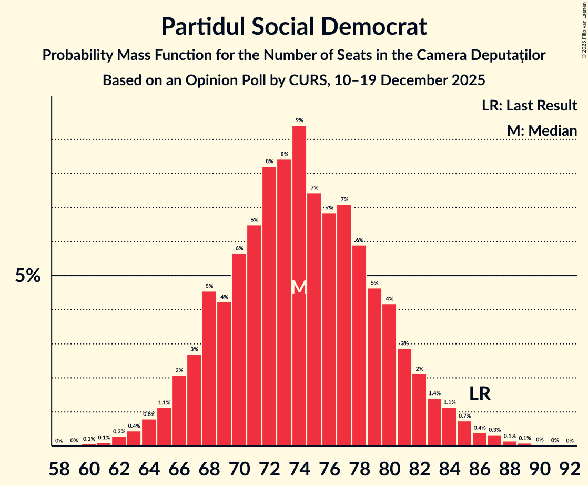

| Number of Seats | Probability | Accumulated | Special Marks |
|:---------------:|:-----------:|:-----------:|:-------------:|
| 60 | 0.1% | 100% |  |
| 61 | 0.1% | 99.9% |  |
| 62 | 0.3% | 99.8% |  |
| 63 | 0.4% | 99.5% |  |
| 64 | 0.8% | 99.1% |  |
| 65 | 1.1% | 98% |  |
| 66 | 2% | 97% |  |
| 67 | 3% | 95% |  |
| 68 | 5% | 92% |  |
| 69 | 4% | 88% |  |
| 70 | 6% | 84% |  |
| 71 | 6% | 78% |  |
| 72 | 8% | 71% |  |
| 73 | 8% | 63% |  |
| 74 | 9% | 55% | Median |
| 75 | 7% | 45% |  |
| 76 | 7% | 38% |  |
| 77 | 7% | 31% |  |
| 78 | 6% | 24% |  |
| 79 | 5% | 18% |  |
| 80 | 4% | 13% |  |
| 81 | 3% | 9% |  |
| 82 | 2% | 6% |  |
| 83 | 1.4% | 4% |  |
| 84 | 1.1% | 3% |  |
| 85 | 0.7% | 2% |  |
| 86 | 0.4% | 1.0% | Last Result |
| 87 | 0.3% | 0.7% |  |
| 88 | 0.1% | 0.3% |  |
| 89 | 0.1% | 0.2% |  |
| 90 | 0% | 0.1% |  |
| 91 | 0% | 0% |  |

### Partidul Național Liberal

*For a full overview of the results for this party, see the [Partidul Național Liberal](party-partidulnaționalliberal.html) page.*

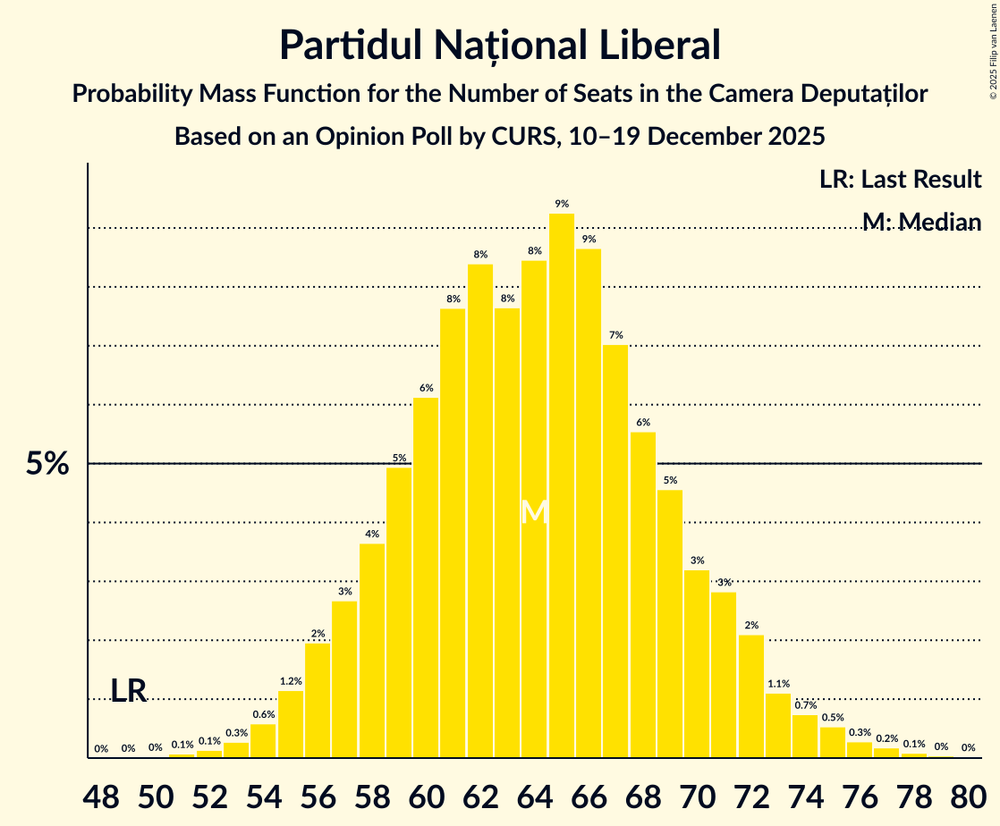

| Number of Seats | Probability | Accumulated | Special Marks |
|:---------------:|:-----------:|:-----------:|:-------------:|
| 49 | 0% | 100% | Last Result |
| 50 | 0% | 100% |  |
| 51 | 0.1% | 100% |  |
| 52 | 0.1% | 99.9% |  |
| 53 | 0.3% | 99.7% |  |
| 54 | 0.6% | 99.5% |  |
| 55 | 1.2% | 98.9% |  |
| 56 | 2% | 98% |  |
| 57 | 3% | 96% |  |
| 58 | 4% | 93% |  |
| 59 | 5% | 89% |  |
| 60 | 6% | 84% |  |
| 61 | 8% | 78% |  |
| 62 | 8% | 71% |  |
| 63 | 8% | 62% |  |
| 64 | 8% | 55% | Median |
| 65 | 9% | 46% |  |
| 66 | 9% | 37% |  |
| 67 | 7% | 28% |  |
| 68 | 6% | 21% |  |
| 69 | 5% | 16% |  |
| 70 | 3% | 11% |  |
| 71 | 3% | 8% |  |
| 72 | 2% | 5% |  |
| 73 | 1.1% | 3% |  |
| 74 | 0.7% | 2% |  |
| 75 | 0.5% | 1.2% |  |
| 76 | 0.3% | 0.6% |  |
| 77 | 0.2% | 0.4% |  |
| 78 | 0.1% | 0.2% |  |
| 79 | 0% | 0.1% |  |
| 80 | 0% | 0% |  |

### Uniunea Salvați România

*For a full overview of the results for this party, see the [Uniunea Salvați România](party-uniuneasalvațiromânia.html) page.*

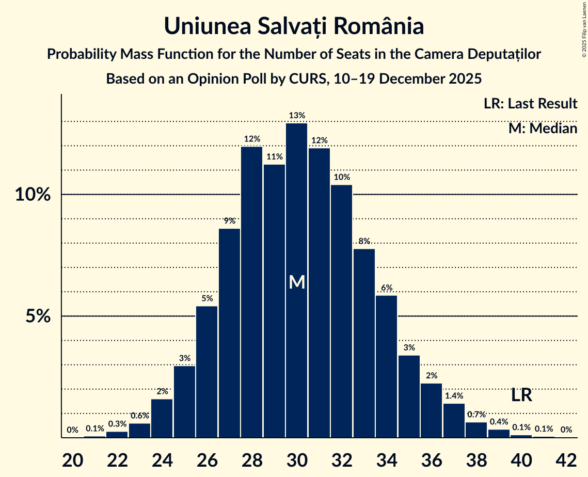

| Number of Seats | Probability | Accumulated | Special Marks |
|:---------------:|:-----------:|:-----------:|:-------------:|
| 21 | 0.1% | 100% |  |
| 22 | 0.3% | 99.9% |  |
| 23 | 0.6% | 99.6% |  |
| 24 | 2% | 99.0% |  |
| 25 | 3% | 97% |  |
| 26 | 5% | 94% |  |
| 27 | 9% | 89% |  |
| 28 | 12% | 80% |  |
| 29 | 11% | 68% |  |
| 30 | 13% | 57% | Median |
| 31 | 12% | 44% |  |
| 32 | 10% | 32% |  |
| 33 | 8% | 22% |  |
| 34 | 6% | 14% |  |
| 35 | 3% | 8% |  |
| 36 | 2% | 5% |  |
| 37 | 1.4% | 3% |  |
| 38 | 0.7% | 1.2% |  |
| 39 | 0.4% | 0.6% |  |
| 40 | 0.1% | 0.2% | Last Result |
| 41 | 0.1% | 0.1% |  |
| 42 | 0% | 0% |  |

### Partidul S.O.S. România

*For a full overview of the results for this party, see the [Partidul S.O.S. România](party-partidulsosromânia.html) page.*

| Number of Seats | Probability | Accumulated | Special Marks |
|:---------------:|:-----------:|:-----------:|:-------------:|
| 0 | 49% | 100% |  |
| 1 | 0% | 51% |  |
| 2 | 0% | 51% |  |
| 3 | 0% | 51% |  |
| 4 | 0% | 51% |  |
| 5 | 0% | 51% |  |
| 6 | 0% | 51% |  |
| 7 | 0% | 51% |  |
| 8 | 0% | 51% |  |
| 9 | 0% | 51% |  |
| 10 | 0% | 51% |  |
| 11 | 0% | 51% |  |
| 12 | 0% | 51% |  |
| 13 | 0% | 51% |  |
| 14 | 0% | 51% |  |
| 15 | 0% | 51% |  |
| 16 | 7% | 51% | Median |
| 17 | 17% | 44% |  |
| 18 | 12% | 27% |  |
| 19 | 8% | 15% |  |
| 20 | 4% | 7% |  |
| 21 | 2% | 3% |  |
| 22 | 0.8% | 1.3% |  |
| 23 | 0.3% | 0.4% |  |
| 24 | 0.1% | 0.1% |  |
| 25 | 0% | 0% |  |
| 26 | 0% | 0% |  |
| 27 | 0% | 0% |  |
| 28 | 0% | 0% | Last Result |

### Romániai Magyar Demokrata Szövetség

*For a full overview of the results for this party, see the [Romániai Magyar Demokrata Szövetség](party-romániaimagyardemokrataszövetség.html) page.*

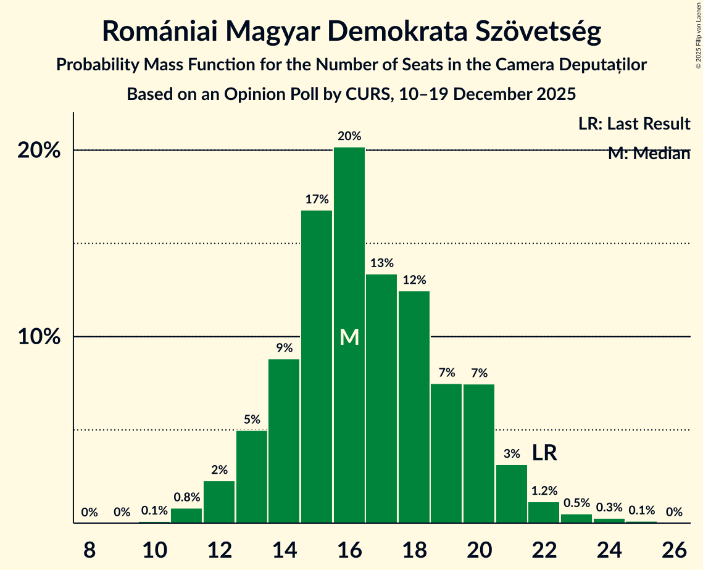

| Number of Seats | Probability | Accumulated | Special Marks |
|:---------------:|:-----------:|:-----------:|:-------------:|
| 10 | 0.1% | 100% |  |
| 11 | 0.8% | 99.9% |  |
| 12 | 2% | 99.1% |  |
| 13 | 5% | 97% |  |
| 14 | 9% | 92% |  |
| 15 | 17% | 83% |  |
| 16 | 20% | 66% | Median |
| 17 | 13% | 46% |  |
| 18 | 12% | 33% |  |
| 19 | 7% | 20% |  |
| 20 | 7% | 13% |  |
| 21 | 3% | 5% |  |
| 22 | 1.2% | 2% | Last Result |
| 23 | 0.5% | 0.9% |  |
| 24 | 0.3% | 0.4% |  |
| 25 | 0.1% | 0.1% |  |
| 26 | 0% | 0% |  |

### Partidul Oamenilor Tineri

*For a full overview of the results for this party, see the [Partidul Oamenilor Tineri](party-partiduloamenilortineri.html) page.*

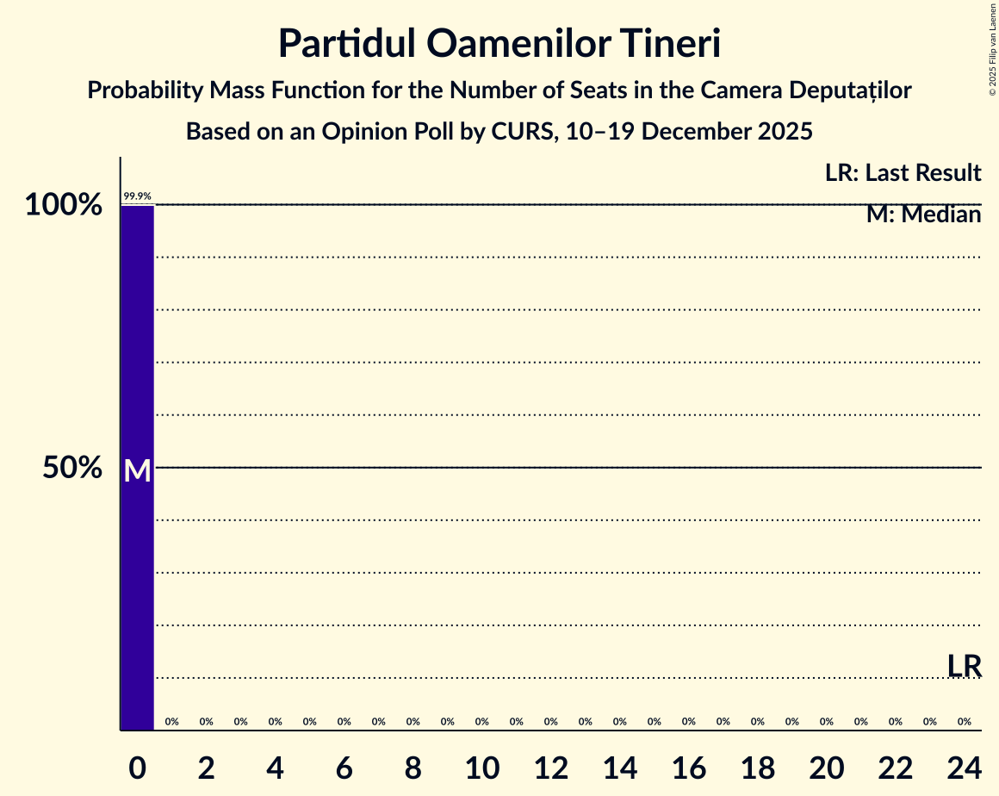

| Number of Seats | Probability | Accumulated | Special Marks |
|:---------------:|:-----------:|:-----------:|:-------------:|
| 0 | 99.9% | 100% | Median |
| 1 | 0% | 0.1% |  |
| 2 | 0% | 0.1% |  |
| 3 | 0% | 0.1% |  |
| 4 | 0% | 0.1% |  |
| 5 | 0% | 0.1% |  |
| 6 | 0% | 0.1% |  |
| 7 | 0% | 0.1% |  |
| 8 | 0% | 0.1% |  |
| 9 | 0% | 0.1% |  |
| 10 | 0% | 0.1% |  |
| 11 | 0% | 0.1% |  |
| 12 | 0% | 0.1% |  |
| 13 | 0% | 0.1% |  |
| 14 | 0% | 0.1% |  |
| 15 | 0% | 0.1% |  |
| 16 | 0% | 0.1% |  |
| 17 | 0% | 0% |  |
| 18 | 0% | 0% |  |
| 19 | 0% | 0% |  |
| 20 | 0% | 0% |  |
| 21 | 0% | 0% |  |
| 22 | 0% | 0% |  |
| 23 | 0% | 0% |  |
| 24 | 0% | 0% | Last Result |

## Coalitions

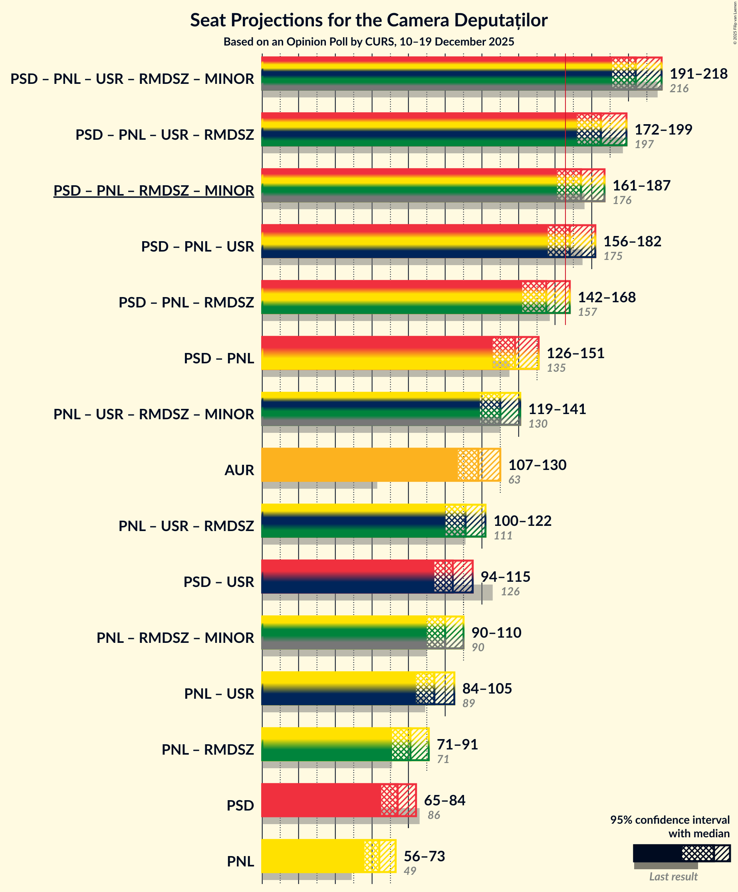

### Confidence Intervals

| Coalition | Last Result | Median | Majority? | 80% Confidence Interval | 90% Confidence Interval | 95% Confidence Interval | 99% Confidence Interval |
|:---------:|:-----------:|:------:|:---------:|:-----------------------:|:-----------------------:|:-----------------------:|:-----------------------:|
| Partidul Social Democrat – Partidul Național Liberal – Uniunea Salvați România – Romániai Magyar Demokrata Szövetség | 197 | 185 | 99.9% | 175–195 | 173–197 | 172–199 | 168–202 |
| Partidul Social Democrat – Partidul Național Liberal – Uniunea Salvați România | 175 | 168 | 61% | 159–178 | 157–180 | 156–182 | 152–184 |
| Partidul Social Democrat – Partidul Național Liberal – Romániai Magyar Demokrata Szövetség | 157 | 155 | 6% | 146–164 | 144–166 | 142–168 | 139–171 |
| Partidul Social Democrat – Partidul Național Liberal | 135 | 138 | 0% | 130–147 | 128–149 | 126–151 | 123–154 |
| Alianța pentru Unirea Românilor | 63 | 118 | 0% | 111–126 | 108–128 | 107–130 | 104–132 |
| Partidul Național Liberal – Uniunea Salvați România – Romániai Magyar Demokrata Szövetség | 111 | 111 | 0% | 103–118 | 101–120 | 100–122 | 97–126 |
| Partidul Social Democrat – Uniunea Salvați România | 126 | 104 | 0% | 97–112 | 95–114 | 94–115 | 91–119 |
| Partidul Național Liberal – Uniunea Salvați România | 89 | 94 | 0% | 87–101 | 86–103 | 84–105 | 81–108 |
| Partidul Național Liberal – Romániai Magyar Demokrata Szövetség | 71 | 81 | 0% | 74–87 | 73–89 | 71–91 | 69–94 |
| Partidul Social Democrat | 86 | 74 | 0% | 68–80 | 67–82 | 65–84 | 63–87 |
| Partidul Național Liberal | 49 | 64 | 0% | 58–70 | 57–72 | 56–73 | 53–76 |

### Partidul Social Democrat – Partidul Național Liberal – Uniunea Salvați România – Romániai Magyar Demokrata Szövetség

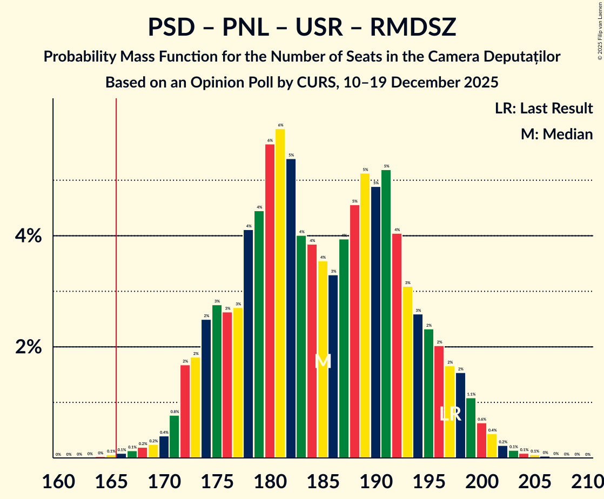

| Number of Seats | Probability | Accumulated | Special Marks |
|:---------------:|:-----------:|:-----------:|:-------------:|
| 165 | 0.1% | 100% |  |
| 166 | 0.1% | 99.9% | Majority |
| 167 | 0.1% | 99.8% |  |
| 168 | 0.2% | 99.7% |  |
| 169 | 0.2% | 99.5% |  |
| 170 | 0.4% | 99.2% |  |
| 171 | 0.8% | 98.8% |  |
| 172 | 2% | 98% |  |
| 173 | 2% | 96% |  |
| 174 | 2% | 95% |  |
| 175 | 3% | 92% |  |
| 176 | 3% | 89% |  |
| 177 | 3% | 87% |  |
| 178 | 4% | 84% |  |
| 179 | 4% | 80% |  |
| 180 | 6% | 75% |  |
| 181 | 6% | 70% |  |
| 182 | 5% | 64% |  |
| 183 | 4% | 58% |  |
| 184 | 4% | 54% | Median |
| 185 | 4% | 51% |  |
| 186 | 3% | 47% |  |
| 187 | 4% | 44% |  |
| 188 | 5% | 40% |  |
| 189 | 5% | 35% |  |
| 190 | 5% | 30% |  |
| 191 | 5% | 25% |  |
| 192 | 4% | 20% |  |
| 193 | 3% | 16% |  |
| 194 | 3% | 13% |  |
| 195 | 2% | 10% |  |
| 196 | 2% | 8% |  |
| 197 | 2% | 6% | Last Result |
| 198 | 2% | 4% |  |
| 199 | 1.1% | 3% |  |
| 200 | 0.6% | 2% |  |
| 201 | 0.4% | 1.0% |  |
| 202 | 0.2% | 0.6% |  |
| 203 | 0.1% | 0.3% |  |
| 204 | 0.1% | 0.2% |  |
| 205 | 0.1% | 0.1% |  |
| 206 | 0% | 0.1% |  |
| 207 | 0% | 0% |  |

### Partidul Social Democrat – Partidul Național Liberal – Uniunea Salvați România

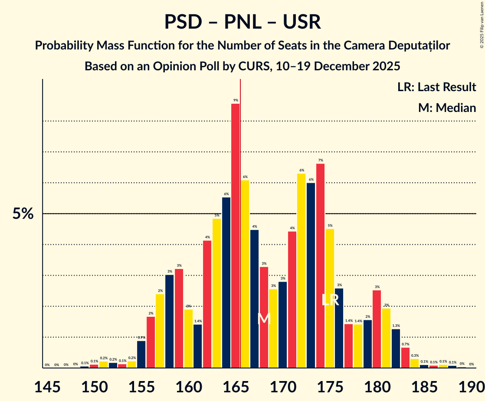

| Number of Seats | Probability | Accumulated | Special Marks |
|:---------------:|:-----------:|:-----------:|:-------------:|
| 149 | 0.1% | 100% |  |
| 150 | 0.1% | 99.9% |  |
| 151 | 0.2% | 99.8% |  |
| 152 | 0.2% | 99.5% |  |
| 153 | 0.1% | 99.4% |  |
| 154 | 0.2% | 99.2% |  |
| 155 | 0.9% | 99.0% |  |
| 156 | 2% | 98% |  |
| 157 | 2% | 96% |  |
| 158 | 3% | 94% |  |
| 159 | 3% | 91% |  |
| 160 | 2% | 88% |  |
| 161 | 1.4% | 86% |  |
| 162 | 4% | 84% |  |
| 163 | 5% | 80% |  |
| 164 | 6% | 75% |  |
| 165 | 9% | 70% |  |
| 166 | 6% | 61% | Majority |
| 167 | 4% | 55% |  |
| 168 | 3% | 51% | Median |
| 169 | 3% | 47% |  |
| 170 | 3% | 45% |  |
| 171 | 4% | 42% |  |
| 172 | 6% | 38% |  |
| 173 | 6% | 31% |  |
| 174 | 7% | 25% |  |
| 175 | 5% | 19% | Last Result |
| 176 | 3% | 14% |  |
| 177 | 1.4% | 12% |  |
| 178 | 1.4% | 10% |  |
| 179 | 2% | 9% |  |
| 180 | 3% | 7% |  |
| 181 | 2% | 5% |  |
| 182 | 1.3% | 3% |  |
| 183 | 0.7% | 1.5% |  |
| 184 | 0.3% | 0.8% |  |
| 185 | 0.1% | 0.5% |  |
| 186 | 0.1% | 0.4% |  |
| 187 | 0.1% | 0.3% |  |
| 188 | 0.1% | 0.2% |  |
| 189 | 0% | 0.1% |  |
| 190 | 0% | 0% |  |

### Partidul Social Democrat – Partidul Național Liberal – Romániai Magyar Demokrata Szövetség

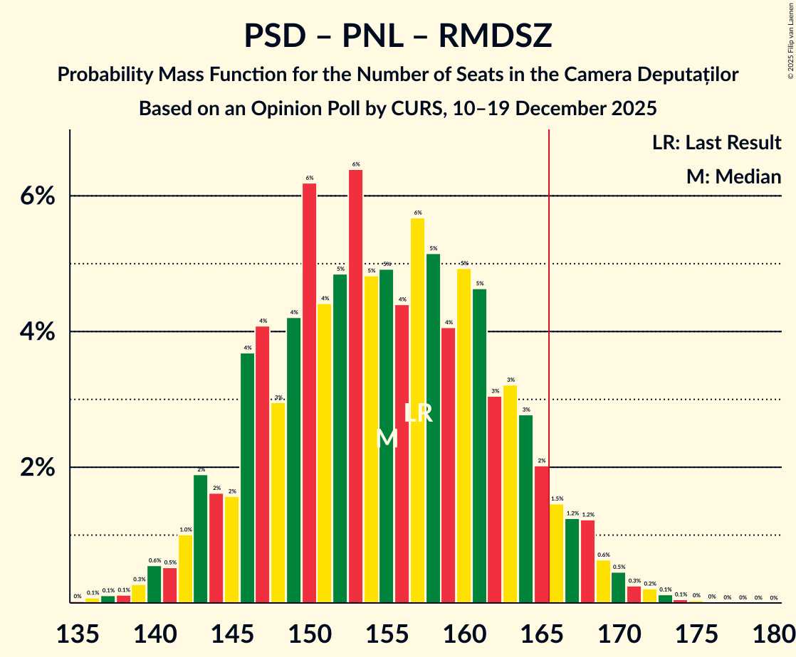

| Number of Seats | Probability | Accumulated | Special Marks |
|:---------------:|:-----------:|:-----------:|:-------------:|
| 135 | 0% | 100% |  |
| 136 | 0.1% | 99.9% |  |
| 137 | 0.1% | 99.9% |  |
| 138 | 0.1% | 99.8% |  |
| 139 | 0.3% | 99.6% |  |
| 140 | 0.6% | 99.4% |  |
| 141 | 0.5% | 98.8% |  |
| 142 | 1.0% | 98% |  |
| 143 | 2% | 97% |  |
| 144 | 2% | 95% |  |
| 145 | 2% | 94% |  |
| 146 | 4% | 92% |  |
| 147 | 4% | 89% |  |
| 148 | 3% | 84% |  |
| 149 | 4% | 81% |  |
| 150 | 6% | 77% |  |
| 151 | 4% | 71% |  |
| 152 | 5% | 67% |  |
| 153 | 6% | 62% |  |
| 154 | 5% | 55% | Median |
| 155 | 5% | 51% |  |
| 156 | 4% | 46% |  |
| 157 | 6% | 41% | Last Result |
| 158 | 5% | 36% |  |
| 159 | 4% | 30% |  |
| 160 | 5% | 26% |  |
| 161 | 5% | 21% |  |
| 162 | 3% | 17% |  |
| 163 | 3% | 14% |  |
| 164 | 3% | 11% |  |
| 165 | 2% | 8% |  |
| 166 | 1.5% | 6% | Majority |
| 167 | 1.2% | 4% |  |
| 168 | 1.2% | 3% |  |
| 169 | 0.6% | 2% |  |
| 170 | 0.5% | 1.2% |  |
| 171 | 0.3% | 0.7% |  |
| 172 | 0.2% | 0.5% |  |
| 173 | 0.1% | 0.3% |  |
| 174 | 0.1% | 0.1% |  |
| 175 | 0% | 0.1% |  |
| 176 | 0% | 0% |  |

### Partidul Social Democrat – Partidul Național Liberal

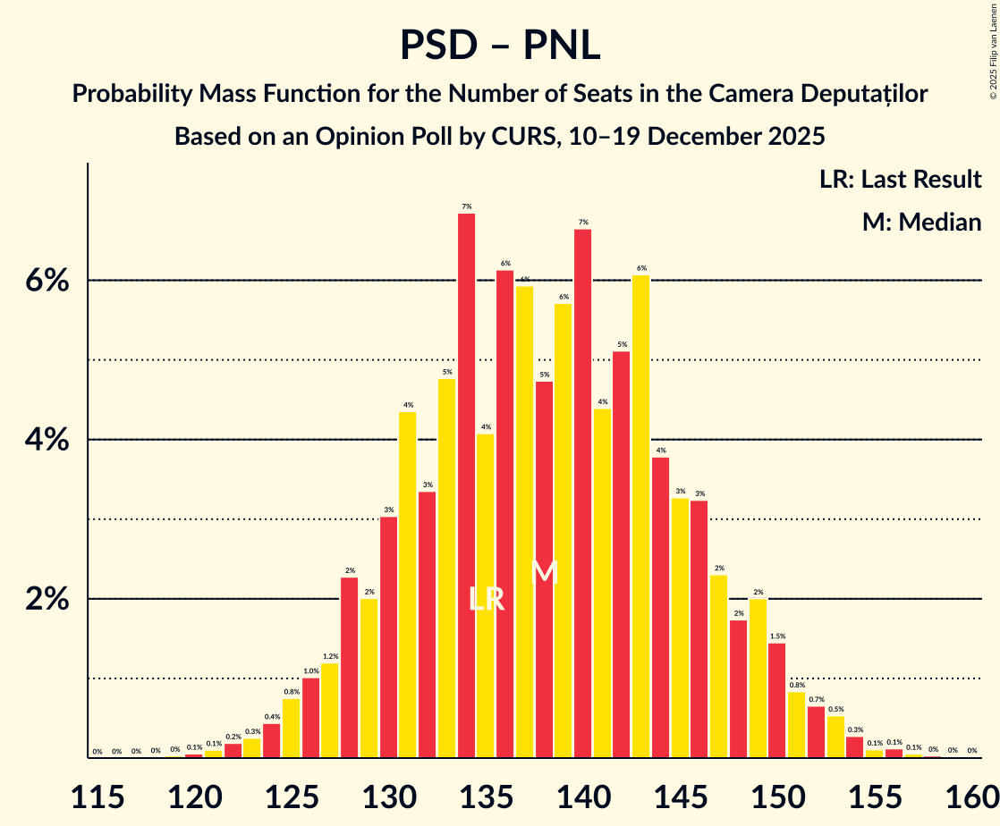

| Number of Seats | Probability | Accumulated | Special Marks |
|:---------------:|:-----------:|:-----------:|:-------------:|
| 119 | 0% | 100% |  |
| 120 | 0.1% | 99.9% |  |
| 121 | 0.1% | 99.9% |  |
| 122 | 0.2% | 99.8% |  |
| 123 | 0.3% | 99.6% |  |
| 124 | 0.4% | 99.3% |  |
| 125 | 0.8% | 98.9% |  |
| 126 | 1.0% | 98% |  |
| 127 | 1.2% | 97% |  |
| 128 | 2% | 96% |  |
| 129 | 2% | 94% |  |
| 130 | 3% | 92% |  |
| 131 | 4% | 89% |  |
| 132 | 3% | 84% |  |
| 133 | 5% | 81% |  |
| 134 | 7% | 76% |  |
| 135 | 4% | 69% | Last Result |
| 136 | 6% | 65% |  |
| 137 | 6% | 59% |  |
| 138 | 5% | 53% | Median |
| 139 | 6% | 48% |  |
| 140 | 7% | 43% |  |
| 141 | 4% | 36% |  |
| 142 | 5% | 32% |  |
| 143 | 6% | 27% |  |
| 144 | 4% | 20% |  |
| 145 | 3% | 17% |  |
| 146 | 3% | 13% |  |
| 147 | 2% | 10% |  |
| 148 | 2% | 8% |  |
| 149 | 2% | 6% |  |
| 150 | 1.5% | 4% |  |
| 151 | 0.8% | 3% |  |
| 152 | 0.7% | 2% |  |
| 153 | 0.5% | 1.2% |  |
| 154 | 0.3% | 0.6% |  |
| 155 | 0.1% | 0.4% |  |
| 156 | 0.1% | 0.2% |  |
| 157 | 0.1% | 0.1% |  |
| 158 | 0% | 0.1% |  |
| 159 | 0% | 0% |  |

### Alianța pentru Unirea Românilor

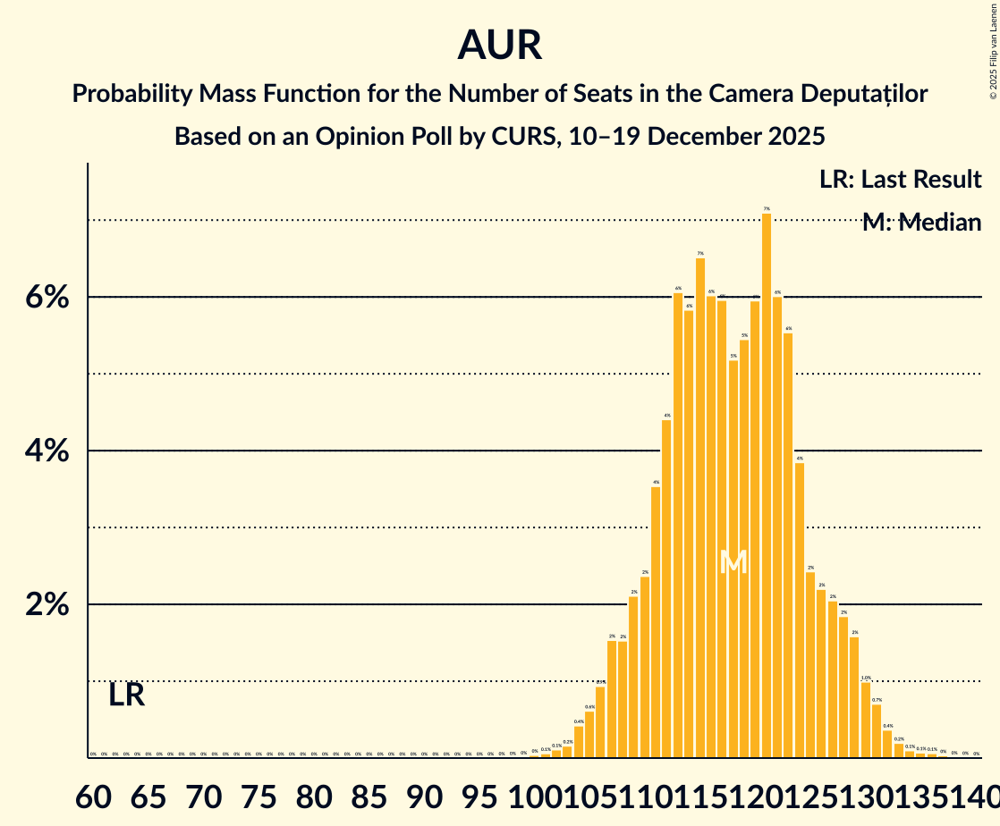

| Number of Seats | Probability | Accumulated | Special Marks |
|:---------------:|:-----------:|:-----------:|:-------------:|
| 63 | 0% | 100% | Last Result |
| 64 | 0% | 100% |  |
| 65 | 0% | 100% |  |
| 66 | 0% | 100% |  |
| 67 | 0% | 100% |  |
| 68 | 0% | 100% |  |
| 69 | 0% | 100% |  |
| 70 | 0% | 100% |  |
| 71 | 0% | 100% |  |
| 72 | 0% | 100% |  |
| 73 | 0% | 100% |  |
| 74 | 0% | 100% |  |
| 75 | 0% | 100% |  |
| 76 | 0% | 100% |  |
| 77 | 0% | 100% |  |
| 78 | 0% | 100% |  |
| 79 | 0% | 100% |  |
| 80 | 0% | 100% |  |
| 81 | 0% | 100% |  |
| 82 | 0% | 100% |  |
| 83 | 0% | 100% |  |
| 84 | 0% | 100% |  |
| 85 | 0% | 100% |  |
| 86 | 0% | 100% |  |
| 87 | 0% | 100% |  |
| 88 | 0% | 100% |  |
| 89 | 0% | 100% |  |
| 90 | 0% | 100% |  |
| 91 | 0% | 100% |  |
| 92 | 0% | 100% |  |
| 93 | 0% | 100% |  |
| 94 | 0% | 100% |  |
| 95 | 0% | 100% |  |
| 96 | 0% | 100% |  |
| 97 | 0% | 100% |  |
| 98 | 0% | 100% |  |
| 99 | 0% | 100% |  |
| 100 | 0% | 100% |  |
| 101 | 0.1% | 99.9% |  |
| 102 | 0.1% | 99.9% |  |
| 103 | 0.2% | 99.8% |  |
| 104 | 0.4% | 99.6% |  |
| 105 | 0.6% | 99.2% |  |
| 106 | 0.9% | 98.6% |  |
| 107 | 2% | 98% |  |
| 108 | 2% | 96% |  |
| 109 | 2% | 95% |  |
| 110 | 2% | 92% |  |
| 111 | 4% | 90% |  |
| 112 | 4% | 87% |  |
| 113 | 6% | 82% |  |
| 114 | 6% | 76% |  |
| 115 | 7% | 70% |  |
| 116 | 6% | 64% |  |
| 117 | 6% | 58% |  |
| 118 | 5% | 52% | Median |
| 119 | 5% | 47% |  |
| 120 | 6% | 41% |  |
| 121 | 7% | 35% |  |
| 122 | 6% | 28% |  |
| 123 | 6% | 22% |  |
| 124 | 4% | 17% |  |
| 125 | 2% | 13% |  |
| 126 | 2% | 10% |  |
| 127 | 2% | 8% |  |
| 128 | 2% | 6% |  |
| 129 | 2% | 4% |  |
| 130 | 1.0% | 3% |  |
| 131 | 0.7% | 2% |  |
| 132 | 0.4% | 0.9% |  |
| 133 | 0.2% | 0.5% |  |
| 134 | 0.1% | 0.3% |  |
| 135 | 0.1% | 0.2% |  |
| 136 | 0.1% | 0.1% |  |
| 137 | 0% | 0.1% |  |
| 138 | 0% | 0% |  |

### Partidul Național Liberal – Uniunea Salvați România – Romániai Magyar Demokrata Szövetség

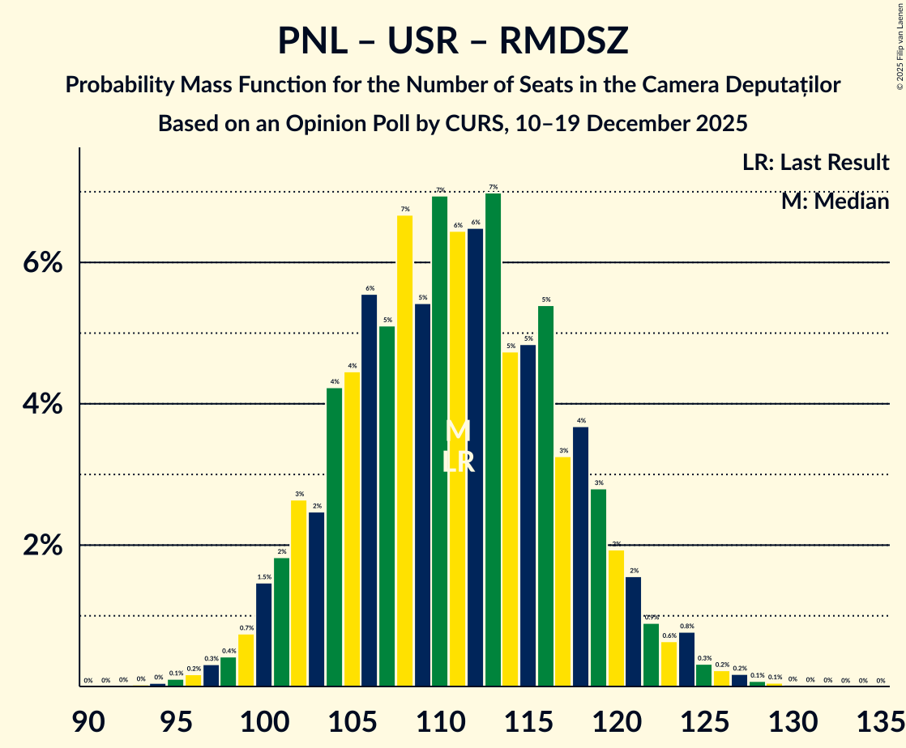

| Number of Seats | Probability | Accumulated | Special Marks |
|:---------------:|:-----------:|:-----------:|:-------------:|
| 93 | 0% | 100% |  |
| 94 | 0% | 99.9% |  |
| 95 | 0.1% | 99.9% |  |
| 96 | 0.2% | 99.8% |  |
| 97 | 0.3% | 99.6% |  |
| 98 | 0.4% | 99.3% |  |
| 99 | 0.7% | 98.9% |  |
| 100 | 1.5% | 98% |  |
| 101 | 2% | 97% |  |
| 102 | 3% | 95% |  |
| 103 | 2% | 92% |  |
| 104 | 4% | 90% |  |
| 105 | 4% | 85% |  |
| 106 | 6% | 81% |  |
| 107 | 5% | 75% |  |
| 108 | 7% | 70% |  |
| 109 | 5% | 64% |  |
| 110 | 7% | 58% | Median |
| 111 | 6% | 51% | Last Result |
| 112 | 6% | 45% |  |
| 113 | 7% | 38% |  |
| 114 | 5% | 31% |  |
| 115 | 5% | 27% |  |
| 116 | 5% | 22% |  |
| 117 | 3% | 16% |  |
| 118 | 4% | 13% |  |
| 119 | 3% | 10% |  |
| 120 | 2% | 7% |  |
| 121 | 2% | 5% |  |
| 122 | 0.9% | 3% |  |
| 123 | 0.6% | 2% |  |
| 124 | 0.8% | 2% |  |
| 125 | 0.3% | 0.9% |  |
| 126 | 0.2% | 0.6% |  |
| 127 | 0.2% | 0.4% |  |
| 128 | 0.1% | 0.2% |  |
| 129 | 0.1% | 0.1% |  |
| 130 | 0% | 0.1% |  |
| 131 | 0% | 0% |  |

### Partidul Social Democrat – Uniunea Salvați România

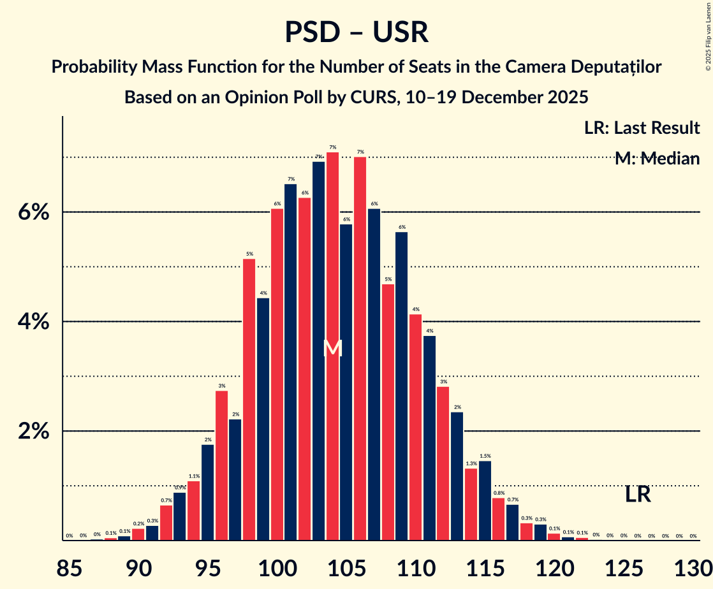

| Number of Seats | Probability | Accumulated | Special Marks |
|:---------------:|:-----------:|:-----------:|:-------------:|
| 87 | 0% | 100% |  |
| 88 | 0.1% | 99.9% |  |
| 89 | 0.1% | 99.9% |  |
| 90 | 0.2% | 99.8% |  |
| 91 | 0.3% | 99.6% |  |
| 92 | 0.7% | 99.3% |  |
| 93 | 0.9% | 98.6% |  |
| 94 | 1.1% | 98% |  |
| 95 | 2% | 97% |  |
| 96 | 3% | 95% |  |
| 97 | 2% | 92% |  |
| 98 | 5% | 90% |  |
| 99 | 4% | 85% |  |
| 100 | 6% | 80% |  |
| 101 | 7% | 74% |  |
| 102 | 6% | 68% |  |
| 103 | 7% | 61% |  |
| 104 | 7% | 55% | Median |
| 105 | 6% | 47% |  |
| 106 | 7% | 42% |  |
| 107 | 6% | 35% |  |
| 108 | 5% | 29% |  |
| 109 | 6% | 24% |  |
| 110 | 4% | 18% |  |
| 111 | 4% | 14% |  |
| 112 | 3% | 10% |  |
| 113 | 2% | 8% |  |
| 114 | 1.3% | 5% |  |
| 115 | 1.5% | 4% |  |
| 116 | 0.8% | 2% |  |
| 117 | 0.7% | 2% |  |
| 118 | 0.3% | 1.0% |  |
| 119 | 0.3% | 0.6% |  |
| 120 | 0.1% | 0.3% |  |
| 121 | 0.1% | 0.2% |  |
| 122 | 0.1% | 0.1% |  |
| 123 | 0% | 0.1% |  |
| 124 | 0% | 0% |  |
| 125 | 0% | 0% |  |
| 126 | 0% | 0% | Last Result |

### Partidul Național Liberal – Uniunea Salvați România

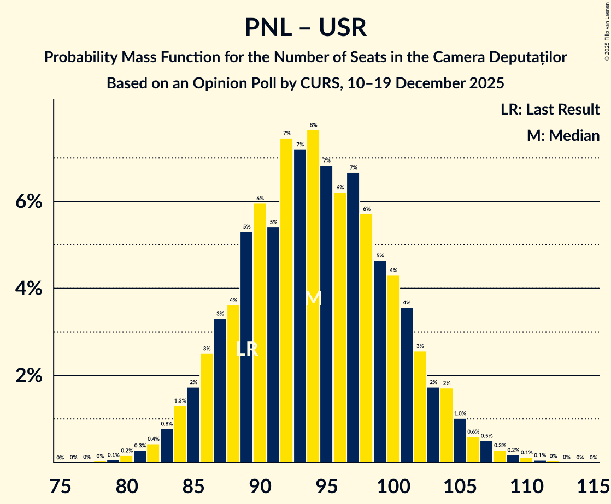

| Number of Seats | Probability | Accumulated | Special Marks |
|:---------------:|:-----------:|:-----------:|:-------------:|
| 78 | 0% | 100% |  |
| 79 | 0.1% | 99.9% |  |
| 80 | 0.2% | 99.9% |  |
| 81 | 0.3% | 99.7% |  |
| 82 | 0.4% | 99.4% |  |
| 83 | 0.8% | 99.0% |  |
| 84 | 1.3% | 98% |  |
| 85 | 2% | 97% |  |
| 86 | 3% | 95% |  |
| 87 | 3% | 93% |  |
| 88 | 4% | 89% |  |
| 89 | 5% | 86% | Last Result |
| 90 | 6% | 80% |  |
| 91 | 5% | 74% |  |
| 92 | 7% | 69% |  |
| 93 | 7% | 62% |  |
| 94 | 8% | 54% | Median |
| 95 | 7% | 47% |  |
| 96 | 6% | 40% |  |
| 97 | 7% | 34% |  |
| 98 | 6% | 27% |  |
| 99 | 5% | 21% |  |
| 100 | 4% | 17% |  |
| 101 | 4% | 12% |  |
| 102 | 3% | 9% |  |
| 103 | 2% | 6% |  |
| 104 | 2% | 5% |  |
| 105 | 1.0% | 3% |  |
| 106 | 0.6% | 2% |  |
| 107 | 0.5% | 1.2% |  |
| 108 | 0.3% | 0.7% |  |
| 109 | 0.2% | 0.4% |  |
| 110 | 0.1% | 0.2% |  |
| 111 | 0.1% | 0.1% |  |
| 112 | 0% | 0.1% |  |
| 113 | 0% | 0% |  |

### Partidul Național Liberal – Romániai Magyar Demokrata Szövetség

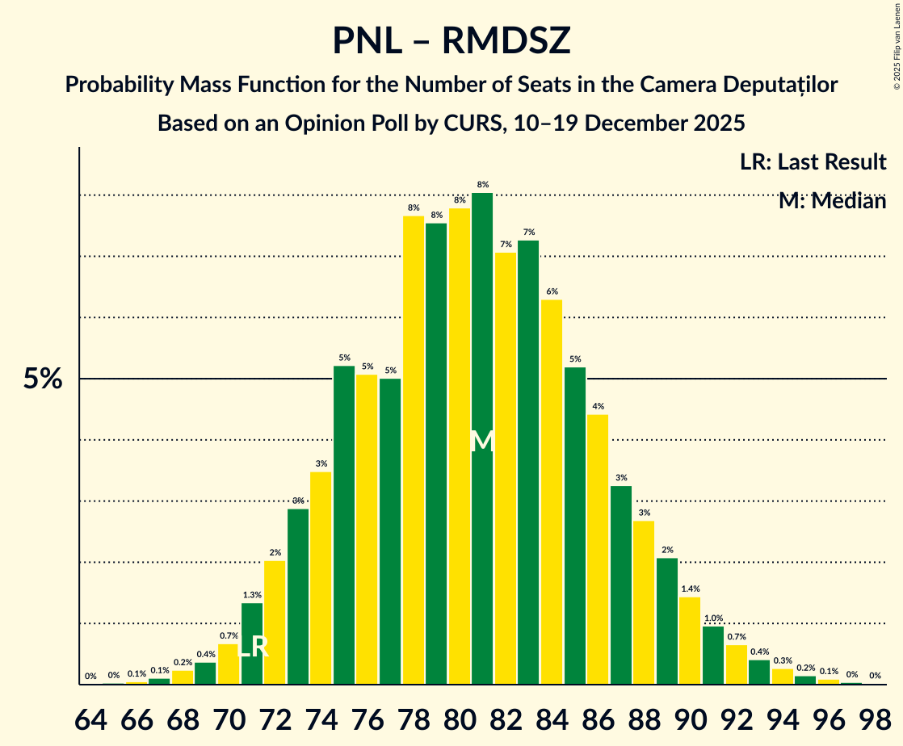

| Number of Seats | Probability | Accumulated | Special Marks |
|:---------------:|:-----------:|:-----------:|:-------------:|
| 65 | 0% | 100% |  |
| 66 | 0.1% | 99.9% |  |
| 67 | 0.1% | 99.9% |  |
| 68 | 0.2% | 99.8% |  |
| 69 | 0.4% | 99.5% |  |
| 70 | 0.7% | 99.2% |  |
| 71 | 1.3% | 98% | Last Result |
| 72 | 2% | 97% |  |
| 73 | 3% | 95% |  |
| 74 | 3% | 92% |  |
| 75 | 5% | 89% |  |
| 76 | 5% | 84% |  |
| 77 | 5% | 78% |  |
| 78 | 8% | 73% |  |
| 79 | 8% | 66% |  |
| 80 | 8% | 58% | Median |
| 81 | 8% | 50% |  |
| 82 | 7% | 42% |  |
| 83 | 7% | 35% |  |
| 84 | 6% | 28% |  |
| 85 | 5% | 22% |  |
| 86 | 4% | 17% |  |
| 87 | 3% | 12% |  |
| 88 | 3% | 9% |  |
| 89 | 2% | 6% |  |
| 90 | 1.4% | 4% |  |
| 91 | 1.0% | 3% |  |
| 92 | 0.7% | 2% |  |
| 93 | 0.4% | 1.0% |  |
| 94 | 0.3% | 0.6% |  |
| 95 | 0.2% | 0.3% |  |
| 96 | 0.1% | 0.2% |  |
| 97 | 0% | 0.1% |  |
| 98 | 0% | 0% |  |

### Partidul Social Democrat

| Number of Seats | Probability | Accumulated | Special Marks |
|:---------------:|:-----------:|:-----------:|:-------------:|
| 60 | 0.1% | 100% |  |
| 61 | 0.1% | 99.9% |  |
| 62 | 0.3% | 99.8% |  |
| 63 | 0.4% | 99.5% |  |
| 64 | 0.8% | 99.1% |  |
| 65 | 1.1% | 98% |  |
| 66 | 2% | 97% |  |
| 67 | 3% | 95% |  |
| 68 | 5% | 92% |  |
| 69 | 4% | 88% |  |
| 70 | 6% | 84% |  |
| 71 | 6% | 78% |  |
| 72 | 8% | 71% |  |
| 73 | 8% | 63% |  |
| 74 | 9% | 55% | Median |
| 75 | 7% | 45% |  |
| 76 | 7% | 38% |  |
| 77 | 7% | 31% |  |
| 78 | 6% | 24% |  |
| 79 | 5% | 18% |  |
| 80 | 4% | 13% |  |
| 81 | 3% | 9% |  |
| 82 | 2% | 6% |  |
| 83 | 1.4% | 4% |  |
| 84 | 1.1% | 3% |  |
| 85 | 0.7% | 2% |  |
| 86 | 0.4% | 1.0% | Last Result |
| 87 | 0.3% | 0.7% |  |
| 88 | 0.1% | 0.3% |  |
| 89 | 0.1% | 0.2% |  |
| 90 | 0% | 0.1% |  |
| 91 | 0% | 0% |  |

### Partidul Național Liberal

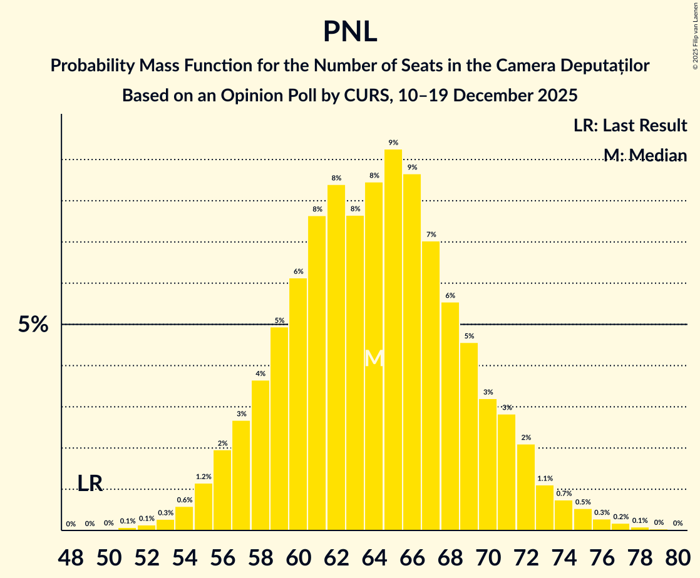

| Number of Seats | Probability | Accumulated | Special Marks |
|:---------------:|:-----------:|:-----------:|:-------------:|
| 49 | 0% | 100% | Last Result |
| 50 | 0% | 100% |  |
| 51 | 0.1% | 100% |  |
| 52 | 0.1% | 99.9% |  |
| 53 | 0.3% | 99.7% |  |
| 54 | 0.6% | 99.5% |  |
| 55 | 1.2% | 98.9% |  |
| 56 | 2% | 98% |  |
| 57 | 3% | 96% |  |
| 58 | 4% | 93% |  |
| 59 | 5% | 89% |  |
| 60 | 6% | 84% |  |
| 61 | 8% | 78% |  |
| 62 | 8% | 71% |  |
| 63 | 8% | 62% |  |
| 64 | 8% | 55% | Median |
| 65 | 9% | 46% |  |
| 66 | 9% | 37% |  |
| 67 | 7% | 28% |  |
| 68 | 6% | 21% |  |
| 69 | 5% | 16% |  |
| 70 | 3% | 11% |  |
| 71 | 3% | 8% |  |
| 72 | 2% | 5% |  |
| 73 | 1.1% | 3% |  |
| 74 | 0.7% | 2% |  |
| 75 | 0.5% | 1.2% |  |
| 76 | 0.3% | 0.6% |  |
| 77 | 0.2% | 0.4% |  |
| 78 | 0.1% | 0.2% |  |
| 79 | 0% | 0.1% |  |
| 80 | 0% | 0% |  |

## Technical Information

### Opinion Poll

+ **Polling firm:** CURS
+ **Commissioner(s):** —
+ **Fieldwork period:** 10–19 December 2025

### Calculations

+ **Sample size:** 1067
+ **Simulations done:** 2,097,152
+ **Error estimate:** 0.72%

