# Opinion Poll by ARA for Antena3CNN, 11 February 2026

<a href="#voting-intentions">Voting Intentions</a> | <a href="#seats">Seats</a> | <a href="#coalitions">Coalitions</a> | <a href="#technical-information">Technical Information</a>

## Voting Intentions

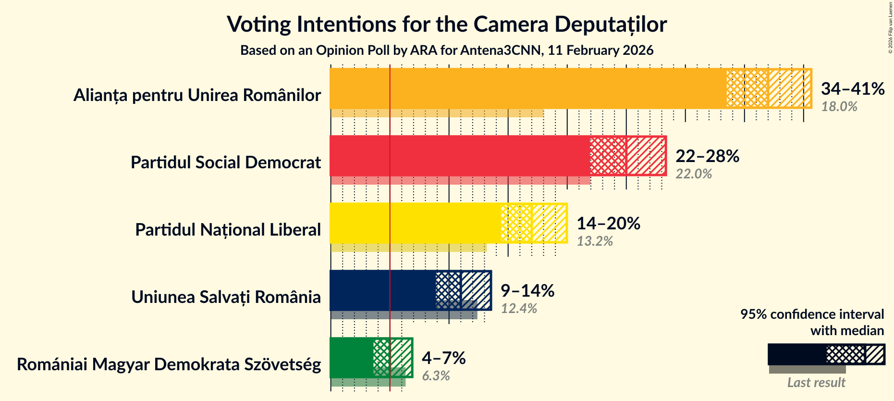

### Confidence Intervals

| Party | Last Result | Poll Result | 80% Confidence Interval | 90% Confidence Interval | 95% Confidence Interval | 99% Confidence Interval |
|:-----:|:-----------:|:-----------:|:-----------------------:|:-----------------------:|:-----------------------:|:-----------------------:|
| Alianța pentru Unirea Românilor | 18.0% | 37.0% | 34.7–39.4% |34.0–40.1% |33.5–40.6% |32.4–41.8% |
| Partidul Social Democrat | 22.0% | 25.0% | 23.0–27.2% |22.4–27.8% |21.9–28.3% |21.0–29.4% |
| Partidul Național Liberal | 13.2% | 17.0% | 15.3–18.9% |14.8–19.5% |14.4–20.0% |13.6–20.9% |
| Uniunea Salvați România | 12.4% | 11.0% | 9.6–12.7% |9.2–13.1% |8.9–13.5% |8.3–14.4% |
| Romániai Magyar Demokrata Szövetség | 6.3% | 5.0% | 4.1–6.2% |3.8–6.6% |3.6–6.9% |3.2–7.5% |

*Note:* The poll result column reflects the actual value used in the calculations. Published results may vary slightly, and in addition be rounded to fewer digits.

## Seats

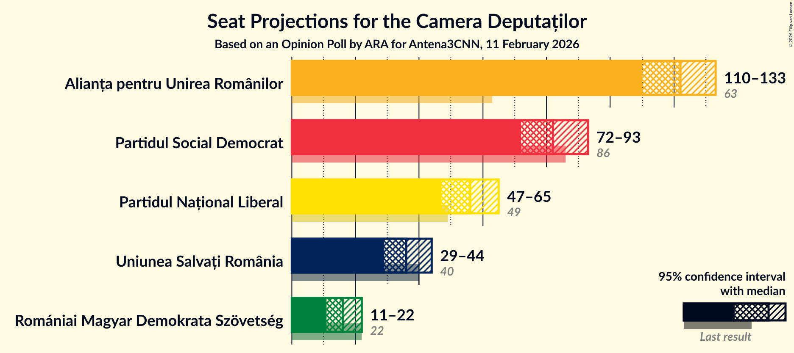

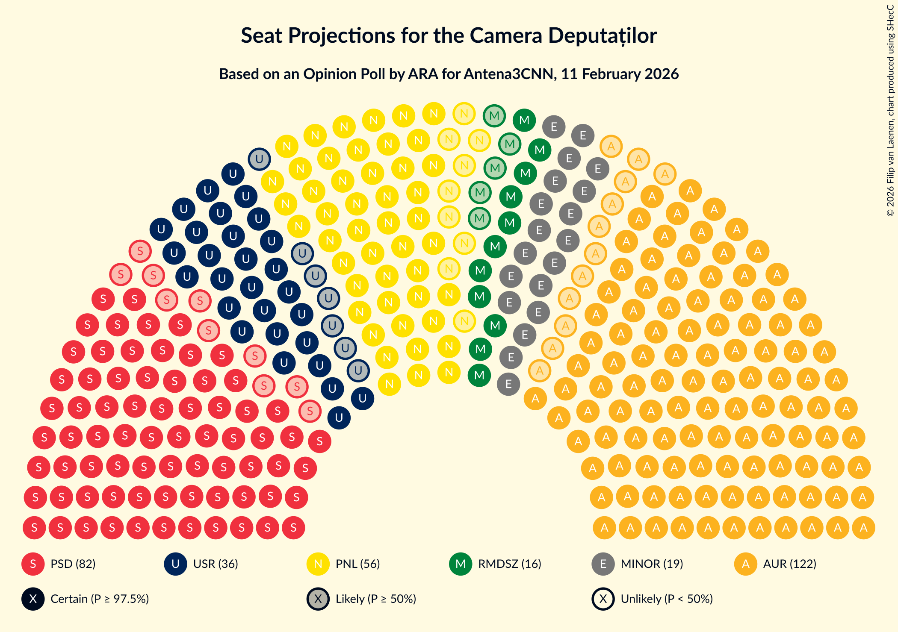

### Confidence Intervals

| Party | Last Result | Median | 80% Confidence Interval | 90% Confidence Interval | 95% Confidence Interval | 99% Confidence Interval |
|:-----:|:-----------:|:------:|:-----------------------:|:-----------------------:|:-----------------------:|:-----------------------:|
| <a href="#alianța-pentru-unirea-românilor">Alianța pentru Unirea Românilor</a> | 63 | 122 | 114–129 |112–131 |110–133 |107–137 |
| <a href="#partidul-social-democrat">Partidul Social Democrat</a> | 86 | 82 | 75–89 |73–91 |72–93 |69–96 |
| <a href="#partidul-național-liberal">Partidul Național Liberal</a> | 49 | 56 | 50–62 |48–64 |47–65 |44–68 |
| <a href="#uniunea-salvați-românia">Uniunea Salvați România</a> | 40 | 36 | 31–41 |30–43 |29–44 |27–47 |
| <a href="#romániai-magyar-demokrata-szövetség">Romániai Magyar Demokrata Szövetség</a> | 22 | 16 | 13–20 |12–21 |11–22 |10–24 |

### Alianța pentru Unirea Românilor

*For a full overview of the results for this party, see the [Alianța pentru Unirea Românilor](party-alianțapentruunirearomânilor.html) page.*

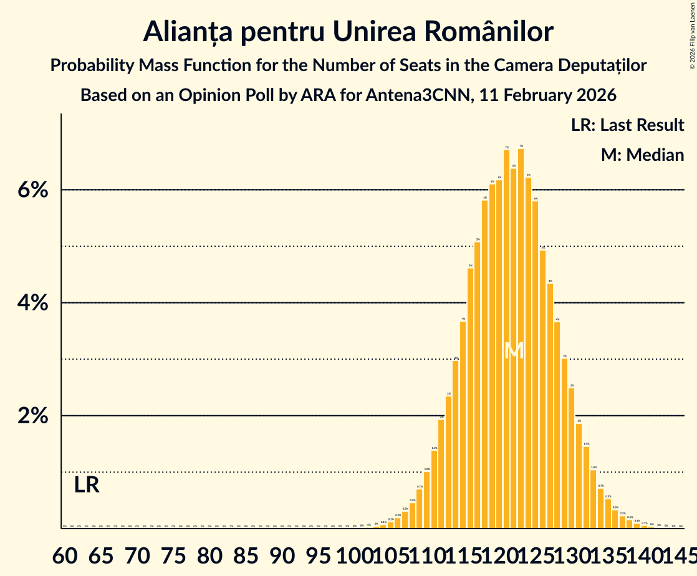

| Number of Seats | Probability | Accumulated | Special Marks |
|:---------------:|:-----------:|:-----------:|:-------------:|
| 63 | 0% | 100% | Last Result |
| 64 | 0% | 100% |  |
| 65 | 0% | 100% |  |
| 66 | 0% | 100% |  |
| 67 | 0% | 100% |  |
| 68 | 0% | 100% |  |
| 69 | 0% | 100% |  |
| 70 | 0% | 100% |  |
| 71 | 0% | 100% |  |
| 72 | 0% | 100% |  |
| 73 | 0% | 100% |  |
| 74 | 0% | 100% |  |
| 75 | 0% | 100% |  |
| 76 | 0% | 100% |  |
| 77 | 0% | 100% |  |
| 78 | 0% | 100% |  |
| 79 | 0% | 100% |  |
| 80 | 0% | 100% |  |
| 81 | 0% | 100% |  |
| 82 | 0% | 100% |  |
| 83 | 0% | 100% |  |
| 84 | 0% | 100% |  |
| 85 | 0% | 100% |  |
| 86 | 0% | 100% |  |
| 87 | 0% | 100% |  |
| 88 | 0% | 100% |  |
| 89 | 0% | 100% |  |
| 90 | 0% | 100% |  |
| 91 | 0% | 100% |  |
| 92 | 0% | 100% |  |
| 93 | 0% | 100% |  |
| 94 | 0% | 100% |  |
| 95 | 0% | 100% |  |
| 96 | 0% | 100% |  |
| 97 | 0% | 100% |  |
| 98 | 0% | 100% |  |
| 99 | 0% | 100% |  |
| 100 | 0% | 100% |  |
| 101 | 0% | 100% |  |
| 102 | 0% | 100% |  |
| 103 | 0% | 99.9% |  |
| 104 | 0.1% | 99.9% |  |
| 105 | 0.1% | 99.8% |  |
| 106 | 0.2% | 99.7% |  |
| 107 | 0.3% | 99.5% |  |
| 108 | 0.5% | 99.2% |  |
| 109 | 0.7% | 98.7% |  |
| 110 | 1.0% | 98% |  |
| 111 | 1.4% | 97% |  |
| 112 | 2% | 96% |  |
| 113 | 2% | 94% |  |
| 114 | 3% | 91% |  |
| 115 | 4% | 88% |  |
| 116 | 5% | 85% |  |
| 117 | 5% | 80% |  |
| 118 | 6% | 75% |  |
| 119 | 6% | 69% |  |
| 120 | 6% | 63% |  |
| 121 | 7% | 57% |  |
| 122 | 6% | 50% | Median |
| 123 | 7% | 44% |  |
| 124 | 6% | 37% |  |
| 125 | 6% | 31% |  |
| 126 | 5% | 25% |  |
| 127 | 4% | 20% |  |
| 128 | 4% | 16% |  |
| 129 | 3% | 12% |  |
| 130 | 2% | 9% |  |
| 131 | 2% | 7% |  |
| 132 | 1.5% | 5% |  |
| 133 | 1.0% | 3% |  |
| 134 | 0.7% | 2% |  |
| 135 | 0.5% | 1.5% |  |
| 136 | 0.3% | 1.0% |  |
| 137 | 0.2% | 0.6% |  |
| 138 | 0.2% | 0.4% |  |
| 139 | 0.1% | 0.2% |  |
| 140 | 0.1% | 0.1% |  |
| 141 | 0% | 0.1% |  |
| 142 | 0% | 0% |  |

### Partidul Social Democrat

*For a full overview of the results for this party, see the [Partidul Social Democrat](party-partidulsocialdemocrat.html) page.*

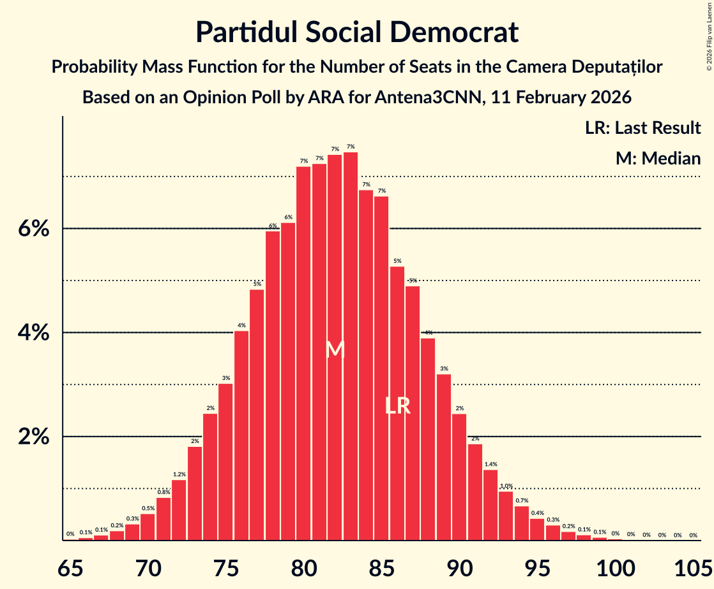

| Number of Seats | Probability | Accumulated | Special Marks |
|:---------------:|:-----------:|:-----------:|:-------------:|
| 65 | 0% | 100% |  |
| 66 | 0.1% | 99.9% |  |
| 67 | 0.1% | 99.9% |  |
| 68 | 0.2% | 99.8% |  |
| 69 | 0.3% | 99.6% |  |
| 70 | 0.5% | 99.3% |  |
| 71 | 0.8% | 98.7% |  |
| 72 | 1.2% | 98% |  |
| 73 | 2% | 97% |  |
| 74 | 2% | 95% |  |
| 75 | 3% | 92% |  |
| 76 | 4% | 89% |  |
| 77 | 5% | 85% |  |
| 78 | 6% | 81% |  |
| 79 | 6% | 75% |  |
| 80 | 7% | 68% |  |
| 81 | 7% | 61% |  |
| 82 | 7% | 54% | Median |
| 83 | 7% | 47% |  |
| 84 | 7% | 39% |  |
| 85 | 7% | 32% |  |
| 86 | 5% | 26% | Last Result |
| 87 | 5% | 20% |  |
| 88 | 4% | 16% |  |
| 89 | 3% | 12% |  |
| 90 | 2% | 8% |  |
| 91 | 2% | 6% |  |
| 92 | 1.4% | 4% |  |
| 93 | 1.0% | 3% |  |
| 94 | 0.7% | 2% |  |
| 95 | 0.4% | 1.2% |  |
| 96 | 0.3% | 0.7% |  |
| 97 | 0.2% | 0.4% |  |
| 98 | 0.1% | 0.3% |  |
| 99 | 0.1% | 0.2% |  |
| 100 | 0% | 0.1% |  |
| 101 | 0% | 0% |  |

### Partidul Național Liberal

*For a full overview of the results for this party, see the [Partidul Național Liberal](party-partidulnaționalliberal.html) page.*

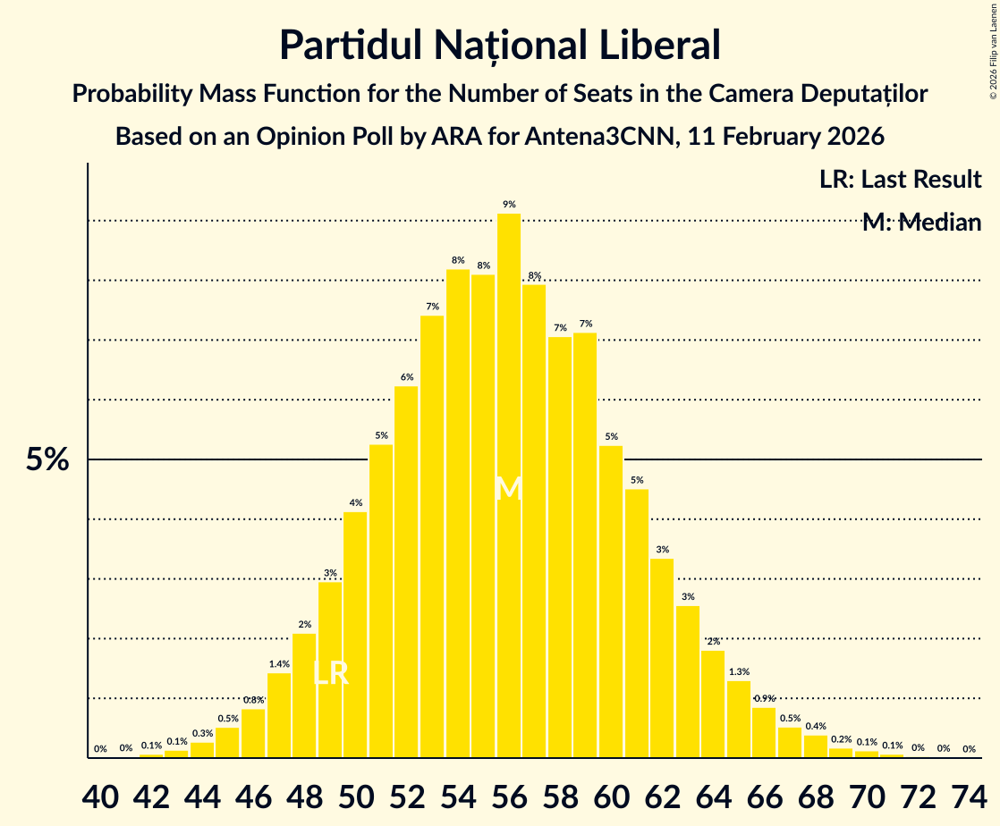

| Number of Seats | Probability | Accumulated | Special Marks |
|:---------------:|:-----------:|:-----------:|:-------------:|
| 42 | 0.1% | 100% |  |
| 43 | 0.1% | 99.9% |  |
| 44 | 0.3% | 99.7% |  |
| 45 | 0.5% | 99.5% |  |
| 46 | 0.8% | 99.0% |  |
| 47 | 1.4% | 98% |  |
| 48 | 2% | 97% |  |
| 49 | 3% | 95% | Last Result |
| 50 | 4% | 92% |  |
| 51 | 5% | 87% |  |
| 52 | 6% | 82% |  |
| 53 | 7% | 76% |  |
| 54 | 8% | 69% |  |
| 55 | 8% | 60% |  |
| 56 | 9% | 52% | Median |
| 57 | 8% | 43% |  |
| 58 | 7% | 35% |  |
| 59 | 7% | 28% |  |
| 60 | 5% | 21% |  |
| 61 | 5% | 16% |  |
| 62 | 3% | 11% |  |
| 63 | 3% | 8% |  |
| 64 | 2% | 5% |  |
| 65 | 1.3% | 4% |  |
| 66 | 0.9% | 2% |  |
| 67 | 0.5% | 1.4% |  |
| 68 | 0.4% | 0.8% |  |
| 69 | 0.2% | 0.4% |  |
| 70 | 0.1% | 0.3% |  |
| 71 | 0.1% | 0.1% |  |
| 72 | 0% | 0.1% |  |
| 73 | 0% | 0% |  |

### Uniunea Salvați România

*For a full overview of the results for this party, see the [Uniunea Salvați România](party-uniuneasalvațiromânia.html) page.*

| Number of Seats | Probability | Accumulated | Special Marks |
|:---------------:|:-----------:|:-----------:|:-------------:|
| 25 | 0.1% | 100% |  |
| 26 | 0.2% | 99.9% |  |
| 27 | 0.5% | 99.6% |  |
| 28 | 1.1% | 99.1% |  |
| 29 | 2% | 98% |  |
| 30 | 3% | 96% |  |
| 31 | 5% | 93% |  |
| 32 | 6% | 89% |  |
| 33 | 8% | 82% |  |
| 34 | 9% | 74% |  |
| 35 | 10% | 65% |  |
| 36 | 10% | 55% | Median |
| 37 | 10% | 45% |  |
| 38 | 9% | 35% |  |
| 39 | 8% | 27% |  |
| 40 | 6% | 19% | Last Result |
| 41 | 4% | 13% |  |
| 42 | 3% | 9% |  |
| 43 | 2% | 6% |  |
| 44 | 1.4% | 3% |  |
| 45 | 0.8% | 2% |  |
| 46 | 0.5% | 1.1% |  |
| 47 | 0.3% | 0.6% |  |
| 48 | 0.2% | 0.3% |  |
| 49 | 0.1% | 0.2% |  |
| 50 | 0% | 0.1% |  |
| 51 | 0% | 0% |  |

### Romániai Magyar Demokrata Szövetség

*For a full overview of the results for this party, see the [Romániai Magyar Demokrata Szövetség](party-romániaimagyardemokrataszövetség.html) page.*

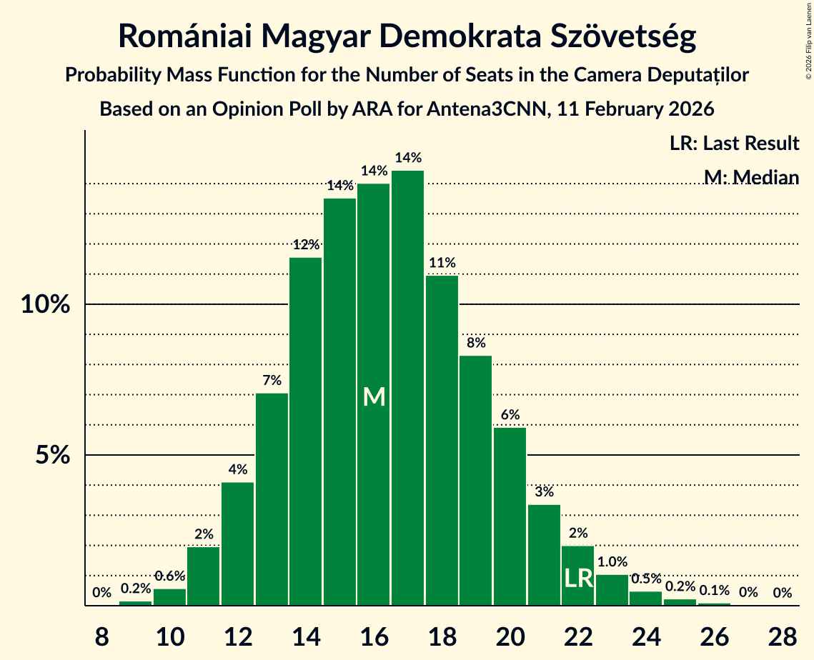

| Number of Seats | Probability | Accumulated | Special Marks |
|:---------------:|:-----------:|:-----------:|:-------------:|
| 9 | 0.2% | 100% |  |
| 10 | 0.6% | 99.8% |  |
| 11 | 2% | 99.2% |  |
| 12 | 4% | 97% |  |
| 13 | 7% | 93% |  |
| 14 | 12% | 86% |  |
| 15 | 14% | 75% |  |
| 16 | 14% | 61% | Median |
| 17 | 14% | 47% |  |
| 18 | 11% | 33% |  |
| 19 | 8% | 22% |  |
| 20 | 6% | 13% |  |
| 21 | 3% | 7% |  |
| 22 | 2% | 4% | Last Result |
| 23 | 1.0% | 2% |  |
| 24 | 0.5% | 0.9% |  |
| 25 | 0.2% | 0.4% |  |
| 26 | 0.1% | 0.2% |  |
| 27 | 0% | 0.1% |  |
| 28 | 0% | 0% |  |

## Coalitions

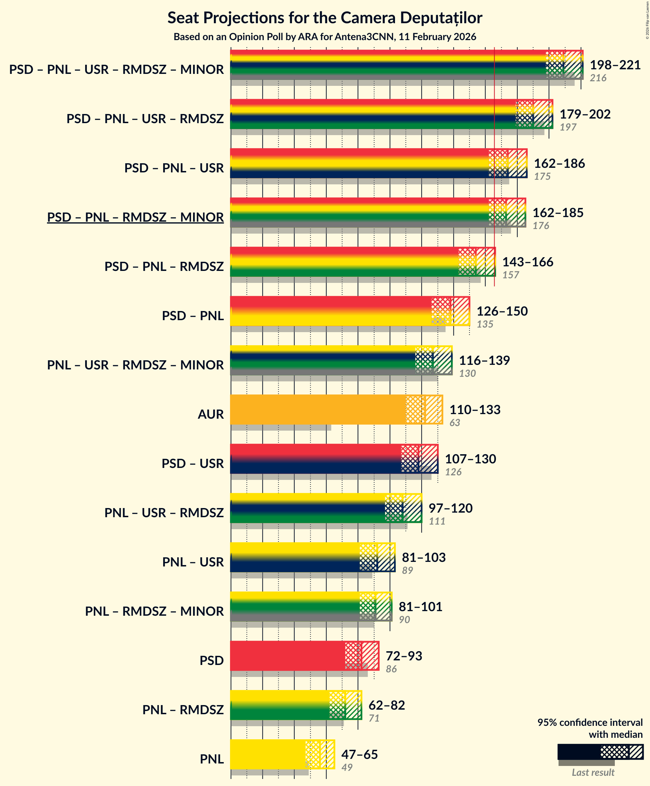

### Confidence Intervals

| Coalition | Last Result | Median | Majority? | 80% Confidence Interval | 90% Confidence Interval | 95% Confidence Interval | 99% Confidence Interval |
|:---------:|:-----------:|:------:|:---------:|:-----------------------:|:-----------------------:|:-----------------------:|:-----------------------:|
| Partidul Social Democrat – Partidul Național Liberal – Uniunea Salvați România – Romániai Magyar Demokrata Szövetség | 197 | 190 | 100% | 183–198 | 181–200 | 179–202 | 175–205 |
| Partidul Social Democrat – Partidul Național Liberal – Uniunea Salvați România | 175 | 174 | 92% | 166–182 | 164–184 | 162–186 | 158–189 |
| Partidul Social Democrat – Partidul Național Liberal – Romániai Magyar Demokrata Szövetség | 157 | 154 | 3% | 147–162 | 144–164 | 143–166 | 139–170 |
| Partidul Social Democrat – Partidul Național Liberal | 135 | 138 | 0% | 130–146 | 128–148 | 126–150 | 123–154 |
| Alianța pentru Unirea Românilor | 63 | 122 | 0% | 114–129 | 112–131 | 110–133 | 107–137 |
| Partidul Social Democrat – Uniunea Salvați România | 126 | 118 | 0% | 111–126 | 109–128 | 107–130 | 103–134 |
| Partidul Național Liberal – Uniunea Salvați România – Romániai Magyar Demokrata Szövetség | 111 | 108 | 0% | 101–116 | 99–118 | 97–120 | 94–123 |
| Partidul Național Liberal – Uniunea Salvați România | 89 | 92 | 0% | 85–99 | 83–101 | 81–103 | 78–107 |
| Partidul Social Democrat | 86 | 82 | 0% | 75–89 | 73–91 | 72–93 | 69–96 |
| Partidul Național Liberal – Romániai Magyar Demokrata Szövetség | 71 | 72 | 0% | 66–79 | 64–81 | 62–82 | 60–86 |
| Partidul Național Liberal | 49 | 56 | 0% | 50–62 | 48–64 | 47–65 | 44–68 |

### Partidul Social Democrat – Partidul Național Liberal – Uniunea Salvați România – Romániai Magyar Demokrata Szövetség

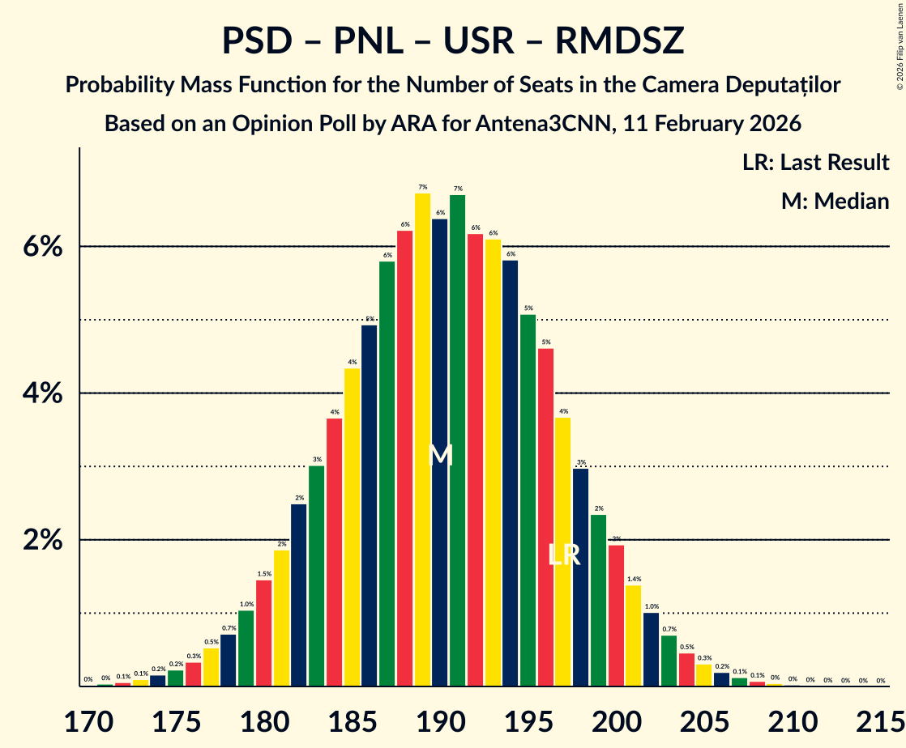

| Number of Seats | Probability | Accumulated | Special Marks |
|:---------------:|:-----------:|:-----------:|:-------------:|
| 171 | 0% | 100% |  |
| 172 | 0.1% | 99.9% |  |
| 173 | 0.1% | 99.9% |  |
| 174 | 0.2% | 99.8% |  |
| 175 | 0.2% | 99.6% |  |
| 176 | 0.3% | 99.4% |  |
| 177 | 0.5% | 99.0% |  |
| 178 | 0.7% | 98.5% |  |
| 179 | 1.0% | 98% |  |
| 180 | 1.5% | 97% |  |
| 181 | 2% | 95% |  |
| 182 | 2% | 93% |  |
| 183 | 3% | 91% |  |
| 184 | 4% | 88% |  |
| 185 | 4% | 84% |  |
| 186 | 5% | 80% |  |
| 187 | 6% | 75% |  |
| 188 | 6% | 69% |  |
| 189 | 7% | 63% |  |
| 190 | 6% | 56% | Median |
| 191 | 7% | 50% |  |
| 192 | 6% | 43% |  |
| 193 | 6% | 37% |  |
| 194 | 6% | 31% |  |
| 195 | 5% | 25% |  |
| 196 | 5% | 20% |  |
| 197 | 4% | 15% | Last Result |
| 198 | 3% | 12% |  |
| 199 | 2% | 9% |  |
| 200 | 2% | 6% |  |
| 201 | 1.4% | 4% |  |
| 202 | 1.0% | 3% |  |
| 203 | 0.7% | 2% |  |
| 204 | 0.5% | 1.3% |  |
| 205 | 0.3% | 0.8% |  |
| 206 | 0.2% | 0.5% |  |
| 207 | 0.1% | 0.3% |  |
| 208 | 0.1% | 0.2% |  |
| 209 | 0% | 0.1% |  |
| 210 | 0% | 0.1% |  |
| 211 | 0% | 0% |  |

### Partidul Social Democrat – Partidul Național Liberal – Uniunea Salvați România

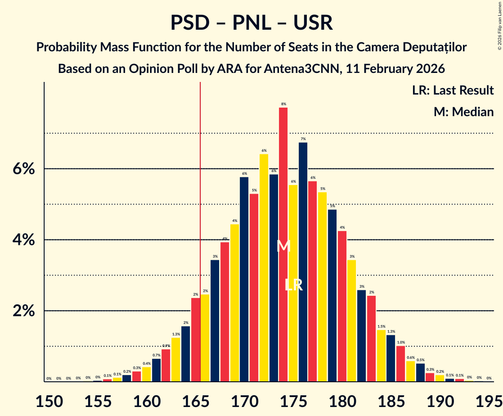

| Number of Seats | Probability | Accumulated | Special Marks |
|:---------------:|:-----------:|:-----------:|:-------------:|
| 154 | 0% | 100% |  |
| 155 | 0% | 99.9% |  |
| 156 | 0.1% | 99.9% |  |
| 157 | 0.1% | 99.8% |  |
| 158 | 0.2% | 99.7% |  |
| 159 | 0.3% | 99.5% |  |
| 160 | 0.4% | 99.2% |  |
| 161 | 0.7% | 98.8% |  |
| 162 | 0.9% | 98% |  |
| 163 | 1.3% | 97% |  |
| 164 | 2% | 96% |  |
| 165 | 2% | 94% |  |
| 166 | 2% | 92% | Majority |
| 167 | 3% | 89% |  |
| 168 | 4% | 86% |  |
| 169 | 4% | 82% |  |
| 170 | 6% | 78% |  |
| 171 | 5% | 72% |  |
| 172 | 6% | 67% |  |
| 173 | 6% | 60% |  |
| 174 | 8% | 54% | Median |
| 175 | 6% | 47% | Last Result |
| 176 | 7% | 41% |  |
| 177 | 6% | 34% |  |
| 178 | 5% | 29% |  |
| 179 | 5% | 23% |  |
| 180 | 4% | 18% |  |
| 181 | 3% | 14% |  |
| 182 | 3% | 11% |  |
| 183 | 2% | 8% |  |
| 184 | 1.5% | 6% |  |
| 185 | 1.3% | 4% |  |
| 186 | 1.0% | 3% |  |
| 187 | 0.6% | 2% |  |
| 188 | 0.5% | 1.3% |  |
| 189 | 0.3% | 0.7% |  |
| 190 | 0.2% | 0.5% |  |
| 191 | 0.1% | 0.3% |  |
| 192 | 0.1% | 0.2% |  |
| 193 | 0% | 0.1% |  |
| 194 | 0% | 0.1% |  |
| 195 | 0% | 0% |  |

### Partidul Social Democrat – Partidul Național Liberal – Romániai Magyar Demokrata Szövetség

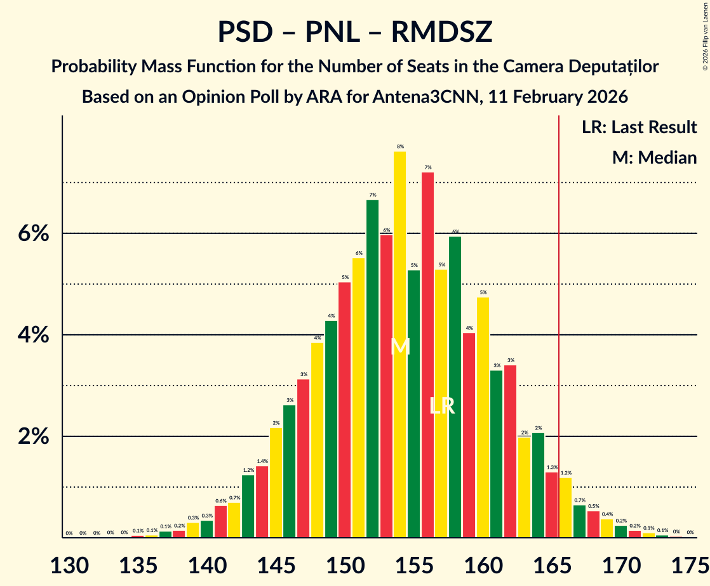

| Number of Seats | Probability | Accumulated | Special Marks |
|:---------------:|:-----------:|:-----------:|:-------------:|
| 135 | 0.1% | 100% |  |
| 136 | 0.1% | 99.9% |  |
| 137 | 0.1% | 99.8% |  |
| 138 | 0.2% | 99.7% |  |
| 139 | 0.3% | 99.6% |  |
| 140 | 0.3% | 99.3% |  |
| 141 | 0.6% | 98.9% |  |
| 142 | 0.7% | 98% |  |
| 143 | 1.2% | 98% |  |
| 144 | 1.4% | 96% |  |
| 145 | 2% | 95% |  |
| 146 | 3% | 93% |  |
| 147 | 3% | 90% |  |
| 148 | 4% | 87% |  |
| 149 | 4% | 83% |  |
| 150 | 5% | 79% |  |
| 151 | 6% | 74% |  |
| 152 | 7% | 68% |  |
| 153 | 6% | 62% |  |
| 154 | 8% | 56% | Median |
| 155 | 5% | 48% |  |
| 156 | 7% | 43% |  |
| 157 | 5% | 35% | Last Result |
| 158 | 6% | 30% |  |
| 159 | 4% | 24% |  |
| 160 | 5% | 20% |  |
| 161 | 3% | 15% |  |
| 162 | 3% | 12% |  |
| 163 | 2% | 9% |  |
| 164 | 2% | 7% |  |
| 165 | 1.3% | 5% |  |
| 166 | 1.2% | 3% | Majority |
| 167 | 0.7% | 2% |  |
| 168 | 0.5% | 2% |  |
| 169 | 0.4% | 1.0% |  |
| 170 | 0.2% | 0.6% |  |
| 171 | 0.2% | 0.4% |  |
| 172 | 0.1% | 0.2% |  |
| 173 | 0.1% | 0.1% |  |
| 174 | 0% | 0.1% |  |
| 175 | 0% | 0% |  |

### Partidul Social Democrat – Partidul Național Liberal

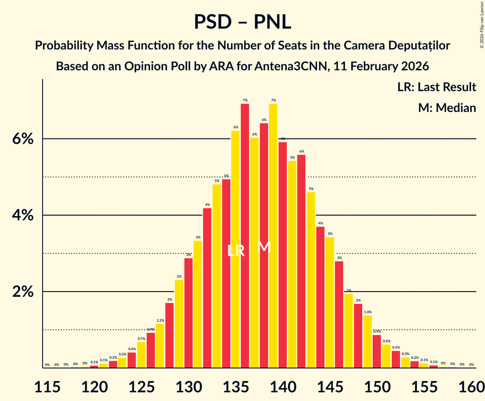

| Number of Seats | Probability | Accumulated | Special Marks |
|:---------------:|:-----------:|:-----------:|:-------------:|
| 118 | 0% | 100% |  |
| 119 | 0% | 99.9% |  |
| 120 | 0.1% | 99.9% |  |
| 121 | 0.1% | 99.8% |  |
| 122 | 0.2% | 99.7% |  |
| 123 | 0.3% | 99.5% |  |
| 124 | 0.4% | 99.2% |  |
| 125 | 0.7% | 98.8% |  |
| 126 | 0.9% | 98% |  |
| 127 | 1.2% | 97% |  |
| 128 | 2% | 96% |  |
| 129 | 2% | 94% |  |
| 130 | 3% | 92% |  |
| 131 | 3% | 89% |  |
| 132 | 4% | 86% |  |
| 133 | 5% | 82% |  |
| 134 | 5% | 77% |  |
| 135 | 6% | 72% | Last Result |
| 136 | 7% | 66% |  |
| 137 | 6% | 59% |  |
| 138 | 6% | 53% | Median |
| 139 | 7% | 46% |  |
| 140 | 6% | 39% |  |
| 141 | 5% | 33% |  |
| 142 | 6% | 28% |  |
| 143 | 5% | 22% |  |
| 144 | 4% | 18% |  |
| 145 | 3% | 14% |  |
| 146 | 3% | 11% |  |
| 147 | 2% | 8% |  |
| 148 | 2% | 6% |  |
| 149 | 1.4% | 4% |  |
| 150 | 0.9% | 3% |  |
| 151 | 0.6% | 2% |  |
| 152 | 0.5% | 1.3% |  |
| 153 | 0.3% | 0.8% |  |
| 154 | 0.2% | 0.5% |  |
| 155 | 0.1% | 0.3% |  |
| 156 | 0.1% | 0.2% |  |
| 157 | 0% | 0.1% |  |
| 158 | 0% | 0.1% |  |
| 159 | 0% | 0% |  |

### Alianța pentru Unirea Românilor

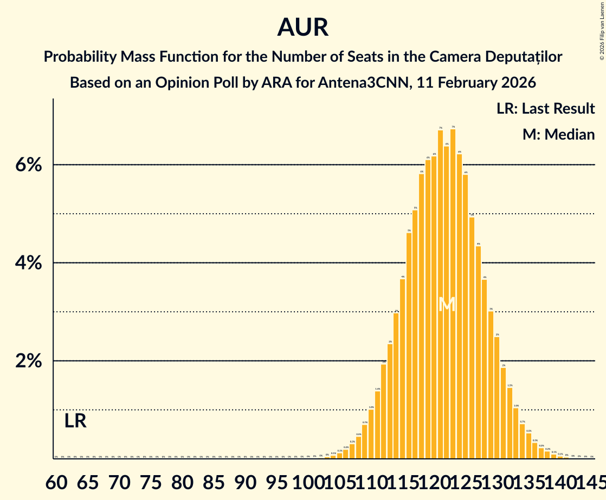

| Number of Seats | Probability | Accumulated | Special Marks |
|:---------------:|:-----------:|:-----------:|:-------------:|
| 63 | 0% | 100% | Last Result |
| 64 | 0% | 100% |  |
| 65 | 0% | 100% |  |
| 66 | 0% | 100% |  |
| 67 | 0% | 100% |  |
| 68 | 0% | 100% |  |
| 69 | 0% | 100% |  |
| 70 | 0% | 100% |  |
| 71 | 0% | 100% |  |
| 72 | 0% | 100% |  |
| 73 | 0% | 100% |  |
| 74 | 0% | 100% |  |
| 75 | 0% | 100% |  |
| 76 | 0% | 100% |  |
| 77 | 0% | 100% |  |
| 78 | 0% | 100% |  |
| 79 | 0% | 100% |  |
| 80 | 0% | 100% |  |
| 81 | 0% | 100% |  |
| 82 | 0% | 100% |  |
| 83 | 0% | 100% |  |
| 84 | 0% | 100% |  |
| 85 | 0% | 100% |  |
| 86 | 0% | 100% |  |
| 87 | 0% | 100% |  |
| 88 | 0% | 100% |  |
| 89 | 0% | 100% |  |
| 90 | 0% | 100% |  |
| 91 | 0% | 100% |  |
| 92 | 0% | 100% |  |
| 93 | 0% | 100% |  |
| 94 | 0% | 100% |  |
| 95 | 0% | 100% |  |
| 96 | 0% | 100% |  |
| 97 | 0% | 100% |  |
| 98 | 0% | 100% |  |
| 99 | 0% | 100% |  |
| 100 | 0% | 100% |  |
| 101 | 0% | 100% |  |
| 102 | 0% | 100% |  |
| 103 | 0% | 99.9% |  |
| 104 | 0.1% | 99.9% |  |
| 105 | 0.1% | 99.8% |  |
| 106 | 0.2% | 99.7% |  |
| 107 | 0.3% | 99.5% |  |
| 108 | 0.5% | 99.2% |  |
| 109 | 0.7% | 98.7% |  |
| 110 | 1.0% | 98% |  |
| 111 | 1.4% | 97% |  |
| 112 | 2% | 96% |  |
| 113 | 2% | 94% |  |
| 114 | 3% | 91% |  |
| 115 | 4% | 88% |  |
| 116 | 5% | 85% |  |
| 117 | 5% | 80% |  |
| 118 | 6% | 75% |  |
| 119 | 6% | 69% |  |
| 120 | 6% | 63% |  |
| 121 | 7% | 57% |  |
| 122 | 6% | 50% | Median |
| 123 | 7% | 44% |  |
| 124 | 6% | 37% |  |
| 125 | 6% | 31% |  |
| 126 | 5% | 25% |  |
| 127 | 4% | 20% |  |
| 128 | 4% | 16% |  |
| 129 | 3% | 12% |  |
| 130 | 2% | 9% |  |
| 131 | 2% | 7% |  |
| 132 | 1.5% | 5% |  |
| 133 | 1.0% | 3% |  |
| 134 | 0.7% | 2% |  |
| 135 | 0.5% | 1.5% |  |
| 136 | 0.3% | 1.0% |  |
| 137 | 0.2% | 0.6% |  |
| 138 | 0.2% | 0.4% |  |
| 139 | 0.1% | 0.2% |  |
| 140 | 0.1% | 0.1% |  |
| 141 | 0% | 0.1% |  |
| 142 | 0% | 0% |  |

### Partidul Social Democrat – Uniunea Salvați România

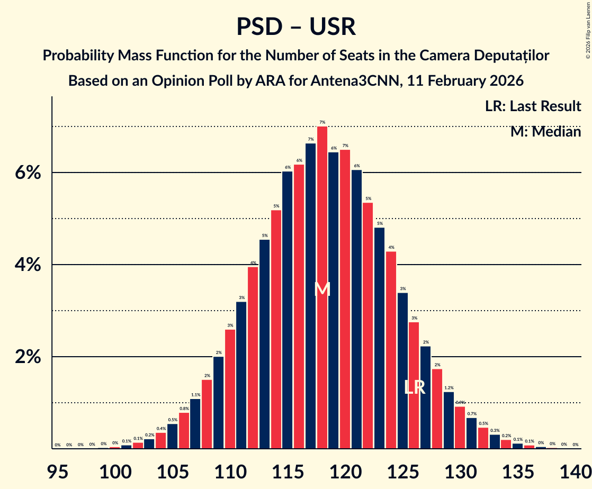

| Number of Seats | Probability | Accumulated | Special Marks |
|:---------------:|:-----------:|:-----------:|:-------------:|
| 99 | 0% | 100% |  |
| 100 | 0% | 99.9% |  |
| 101 | 0.1% | 99.9% |  |
| 102 | 0.1% | 99.8% |  |
| 103 | 0.2% | 99.7% |  |
| 104 | 0.4% | 99.4% |  |
| 105 | 0.5% | 99.1% |  |
| 106 | 0.8% | 98.5% |  |
| 107 | 1.1% | 98% |  |
| 108 | 2% | 97% |  |
| 109 | 2% | 95% |  |
| 110 | 3% | 93% |  |
| 111 | 3% | 91% |  |
| 112 | 4% | 87% |  |
| 113 | 5% | 83% |  |
| 114 | 5% | 79% |  |
| 115 | 6% | 74% |  |
| 116 | 6% | 68% |  |
| 117 | 7% | 61% |  |
| 118 | 7% | 55% | Median |
| 119 | 6% | 48% |  |
| 120 | 7% | 41% |  |
| 121 | 6% | 35% |  |
| 122 | 5% | 29% |  |
| 123 | 5% | 23% |  |
| 124 | 4% | 19% |  |
| 125 | 3% | 14% |  |
| 126 | 3% | 11% | Last Result |
| 127 | 2% | 8% |  |
| 128 | 2% | 6% |  |
| 129 | 1.2% | 4% |  |
| 130 | 0.9% | 3% |  |
| 131 | 0.7% | 2% |  |
| 132 | 0.5% | 1.3% |  |
| 133 | 0.3% | 0.8% |  |
| 134 | 0.2% | 0.5% |  |
| 135 | 0.1% | 0.3% |  |
| 136 | 0.1% | 0.2% |  |
| 137 | 0% | 0.1% |  |
| 138 | 0% | 0.1% |  |
| 139 | 0% | 0% |  |

### Partidul Național Liberal – Uniunea Salvați România – Romániai Magyar Demokrata Szövetség

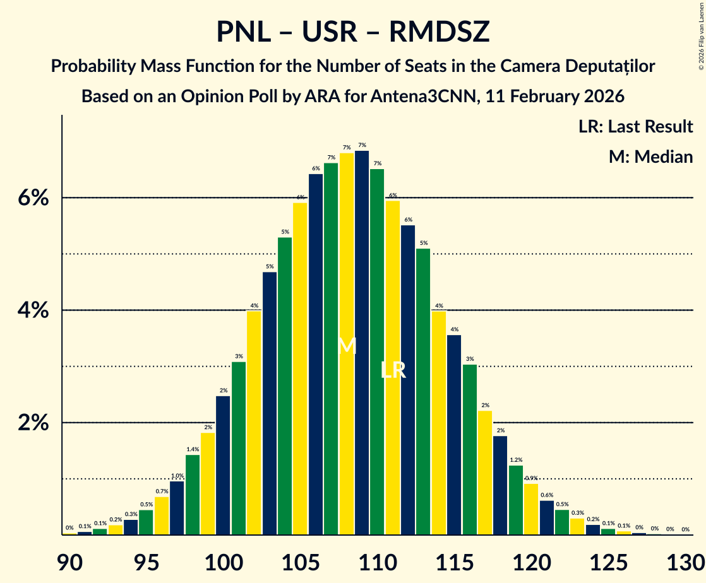

| Number of Seats | Probability | Accumulated | Special Marks |
|:---------------:|:-----------:|:-----------:|:-------------:|
| 90 | 0% | 100% |  |
| 91 | 0.1% | 99.9% |  |
| 92 | 0.1% | 99.9% |  |
| 93 | 0.2% | 99.7% |  |
| 94 | 0.3% | 99.5% |  |
| 95 | 0.5% | 99.3% |  |
| 96 | 0.7% | 98.8% |  |
| 97 | 1.0% | 98% |  |
| 98 | 1.4% | 97% |  |
| 99 | 2% | 96% |  |
| 100 | 2% | 94% |  |
| 101 | 3% | 91% |  |
| 102 | 4% | 88% |  |
| 103 | 5% | 84% |  |
| 104 | 5% | 80% |  |
| 105 | 6% | 74% |  |
| 106 | 6% | 68% |  |
| 107 | 7% | 62% |  |
| 108 | 7% | 55% | Median |
| 109 | 7% | 49% |  |
| 110 | 7% | 42% |  |
| 111 | 6% | 35% | Last Result |
| 112 | 6% | 29% |  |
| 113 | 5% | 24% |  |
| 114 | 4% | 19% |  |
| 115 | 4% | 15% |  |
| 116 | 3% | 11% |  |
| 117 | 2% | 8% |  |
| 118 | 2% | 6% |  |
| 119 | 1.2% | 4% |  |
| 120 | 0.9% | 3% |  |
| 121 | 0.6% | 2% |  |
| 122 | 0.5% | 1.3% |  |
| 123 | 0.3% | 0.8% |  |
| 124 | 0.2% | 0.5% |  |
| 125 | 0.1% | 0.3% |  |
| 126 | 0.1% | 0.2% |  |
| 127 | 0% | 0.1% |  |
| 128 | 0% | 0.1% |  |
| 129 | 0% | 0% |  |

### Partidul Național Liberal – Uniunea Salvați România

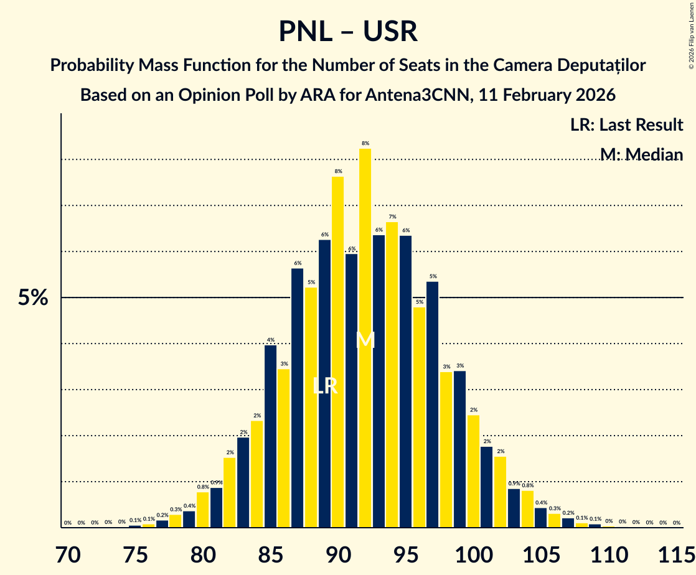

| Number of Seats | Probability | Accumulated | Special Marks |
|:---------------:|:-----------:|:-----------:|:-------------:|
| 74 | 0% | 100% |  |
| 75 | 0.1% | 99.9% |  |
| 76 | 0.1% | 99.9% |  |
| 77 | 0.2% | 99.8% |  |
| 78 | 0.3% | 99.6% |  |
| 79 | 0.4% | 99.3% |  |
| 80 | 0.8% | 99.0% |  |
| 81 | 0.9% | 98% |  |
| 82 | 2% | 97% |  |
| 83 | 2% | 96% |  |
| 84 | 2% | 94% |  |
| 85 | 4% | 91% |  |
| 86 | 3% | 87% |  |
| 87 | 6% | 84% |  |
| 88 | 5% | 78% |  |
| 89 | 6% | 73% | Last Result |
| 90 | 8% | 67% |  |
| 91 | 6% | 59% |  |
| 92 | 8% | 53% | Median |
| 93 | 6% | 45% |  |
| 94 | 7% | 39% |  |
| 95 | 6% | 32% |  |
| 96 | 5% | 26% |  |
| 97 | 5% | 21% |  |
| 98 | 3% | 16% |  |
| 99 | 3% | 12% |  |
| 100 | 2% | 9% |  |
| 101 | 2% | 6% |  |
| 102 | 2% | 4% |  |
| 103 | 0.9% | 3% |  |
| 104 | 0.8% | 2% |  |
| 105 | 0.4% | 1.3% |  |
| 106 | 0.3% | 0.8% |  |
| 107 | 0.2% | 0.5% |  |
| 108 | 0.1% | 0.3% |  |
| 109 | 0.1% | 0.2% |  |
| 110 | 0% | 0.1% |  |
| 111 | 0% | 0.1% |  |
| 112 | 0% | 0% |  |

### Partidul Social Democrat

| Number of Seats | Probability | Accumulated | Special Marks |
|:---------------:|:-----------:|:-----------:|:-------------:|
| 65 | 0% | 100% |  |
| 66 | 0.1% | 99.9% |  |
| 67 | 0.1% | 99.9% |  |
| 68 | 0.2% | 99.8% |  |
| 69 | 0.3% | 99.6% |  |
| 70 | 0.5% | 99.3% |  |
| 71 | 0.8% | 98.7% |  |
| 72 | 1.2% | 98% |  |
| 73 | 2% | 97% |  |
| 74 | 2% | 95% |  |
| 75 | 3% | 92% |  |
| 76 | 4% | 89% |  |
| 77 | 5% | 85% |  |
| 78 | 6% | 81% |  |
| 79 | 6% | 75% |  |
| 80 | 7% | 68% |  |
| 81 | 7% | 61% |  |
| 82 | 7% | 54% | Median |
| 83 | 7% | 47% |  |
| 84 | 7% | 39% |  |
| 85 | 7% | 32% |  |
| 86 | 5% | 26% | Last Result |
| 87 | 5% | 20% |  |
| 88 | 4% | 16% |  |
| 89 | 3% | 12% |  |
| 90 | 2% | 8% |  |
| 91 | 2% | 6% |  |
| 92 | 1.4% | 4% |  |
| 93 | 1.0% | 3% |  |
| 94 | 0.7% | 2% |  |
| 95 | 0.4% | 1.2% |  |
| 96 | 0.3% | 0.7% |  |
| 97 | 0.2% | 0.4% |  |
| 98 | 0.1% | 0.3% |  |
| 99 | 0.1% | 0.2% |  |
| 100 | 0% | 0.1% |  |
| 101 | 0% | 0% |  |

### Partidul Național Liberal – Romániai Magyar Demokrata Szövetség

| Number of Seats | Probability | Accumulated | Special Marks |
|:---------------:|:-----------:|:-----------:|:-------------:|
| 56 | 0% | 100% |  |
| 57 | 0.1% | 99.9% |  |
| 58 | 0.1% | 99.9% |  |
| 59 | 0.2% | 99.7% |  |
| 60 | 0.4% | 99.5% |  |
| 61 | 0.7% | 99.1% |  |
| 62 | 1.1% | 98% |  |
| 63 | 1.5% | 97% |  |
| 64 | 2% | 96% |  |
| 65 | 3% | 94% |  |
| 66 | 4% | 91% |  |
| 67 | 5% | 87% |  |
| 68 | 6% | 82% |  |
| 69 | 7% | 77% |  |
| 70 | 7% | 70% |  |
| 71 | 8% | 63% | Last Result |
| 72 | 7% | 55% | Median |
| 73 | 8% | 48% |  |
| 74 | 7% | 39% |  |
| 75 | 6% | 32% |  |
| 76 | 6% | 26% |  |
| 77 | 5% | 20% |  |
| 78 | 4% | 15% |  |
| 79 | 3% | 11% |  |
| 80 | 3% | 8% |  |
| 81 | 2% | 6% |  |
| 82 | 1.4% | 4% |  |
| 83 | 0.8% | 2% |  |
| 84 | 0.6% | 2% |  |
| 85 | 0.4% | 1.0% |  |
| 86 | 0.2% | 0.6% |  |
| 87 | 0.2% | 0.4% |  |
| 88 | 0.1% | 0.2% |  |
| 89 | 0.1% | 0.1% |  |
| 90 | 0% | 0.1% |  |
| 91 | 0% | 0% |  |

### Partidul Național Liberal

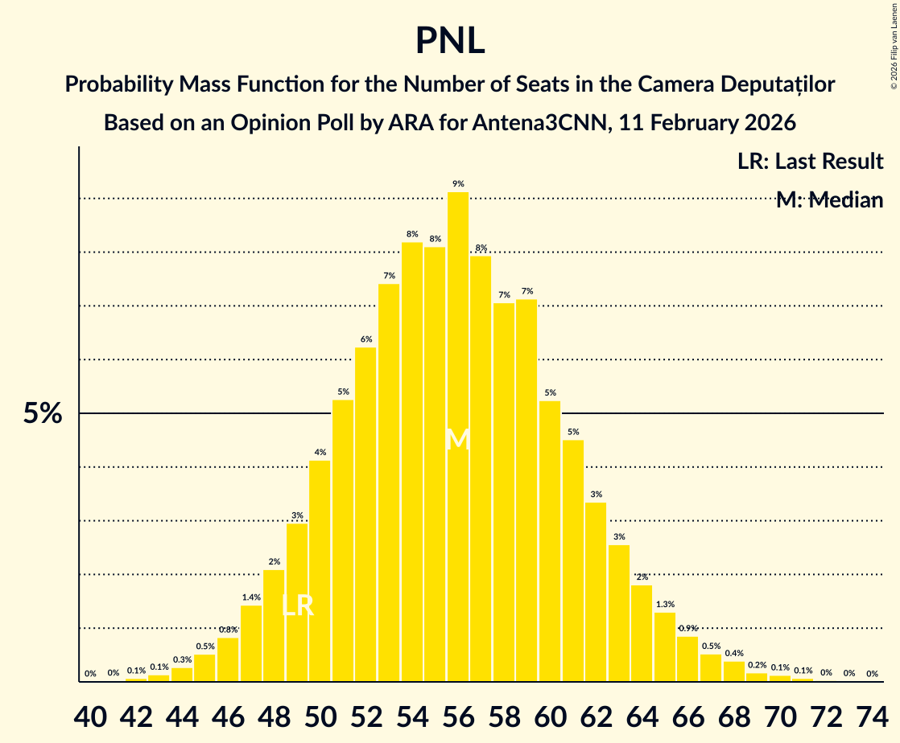

| Number of Seats | Probability | Accumulated | Special Marks |
|:---------------:|:-----------:|:-----------:|:-------------:|
| 42 | 0.1% | 100% |  |
| 43 | 0.1% | 99.9% |  |
| 44 | 0.3% | 99.7% |  |
| 45 | 0.5% | 99.5% |  |
| 46 | 0.8% | 99.0% |  |
| 47 | 1.4% | 98% |  |
| 48 | 2% | 97% |  |
| 49 | 3% | 95% | Last Result |
| 50 | 4% | 92% |  |
| 51 | 5% | 87% |  |
| 52 | 6% | 82% |  |
| 53 | 7% | 76% |  |
| 54 | 8% | 69% |  |
| 55 | 8% | 60% |  |
| 56 | 9% | 52% | Median |
| 57 | 8% | 43% |  |
| 58 | 7% | 35% |  |
| 59 | 7% | 28% |  |
| 60 | 5% | 21% |  |
| 61 | 5% | 16% |  |
| 62 | 3% | 11% |  |
| 63 | 3% | 8% |  |
| 64 | 2% | 5% |  |
| 65 | 1.3% | 4% |  |
| 66 | 0.9% | 2% |  |
| 67 | 0.5% | 1.4% |  |
| 68 | 0.4% | 0.8% |  |
| 69 | 0.2% | 0.4% |  |
| 70 | 0.1% | 0.3% |  |
| 71 | 0.1% | 0.1% |  |
| 72 | 0% | 0.1% |  |
| 73 | 0% | 0% |  |

## Technical Information

### Opinion Poll

+ **Polling firm:** ARA
+ **Commissioner(s):** Antena3CNN
+ **Fieldwork period:** 11 February 2026

### Calculations

+ **Sample size:** 700
+ **Simulations done:** 1,048,576
+ **Error estimate:** 0.49%

