# Opinion Poll by INSCOP for informat.ro, 2–6 March 2026

<a href="#voting-intentions">Voting Intentions</a> | <a href="#seats">Seats</a> | <a href="#coalitions">Coalitions</a> | <a href="#technical-information">Technical Information</a>

## Voting Intentions

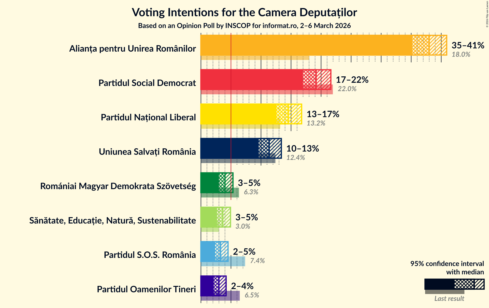

### Confidence Intervals

| Party | Last Result | Poll Result | 80% Confidence Interval | 90% Confidence Interval | 95% Confidence Interval | 99% Confidence Interval |
|:-----:|:-----------:|:-----------:|:-----------------------:|:-----------------------:|:-----------------------:|:-----------------------:|
| Alianța pentru Unirea Românilor | 18.0% | 38.0% | 36.1–39.9% |35.6–40.5% |35.2–40.9% |34.3–41.8% |
| Partidul Social Democrat | 22.0% | 19.2% | 17.7–20.8% |17.3–21.2% |17.0–21.6% |16.3–22.4% |
| Partidul Național Liberal | 13.2% | 14.5% | 13.3–16.0% |12.9–16.4% |12.6–16.8% |12.0–17.5% |
| Uniunea Salvați România | 12.4% | 11.4% | 10.2–12.7% |9.9–13.1% |9.6–13.4% |9.1–14.0% |
| Romániai Magyar Demokrata Szövetség | 6.3% | 4.0% | 3.3–4.9% |3.1–5.1% |3.0–5.3% |2.7–5.8% |
| Sănătate, Educație, Natură, Sustenabilitate | 3.0% | 3.6% | 3.0–4.5% |2.8–4.7% |2.7–4.9% |2.4–5.3% |
| Partidul S.O.S. România | 7.4% | 3.3% | 2.7–4.1% |2.5–4.3% |2.4–4.5% |2.1–4.9% |
| Partidul Oamenilor Tineri | 6.5% | 3.0% | 2.4–3.8% |2.3–4.0% |2.1–4.2% |1.9–4.6% |

*Note:* The poll result column reflects the actual value used in the calculations. Published results may vary slightly, and in addition be rounded to fewer digits.

## Seats

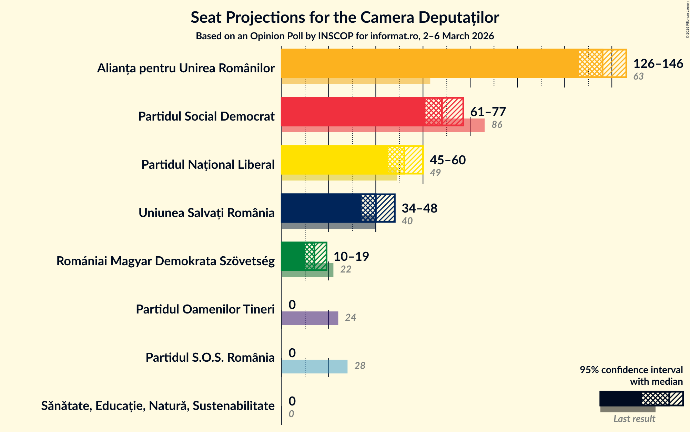

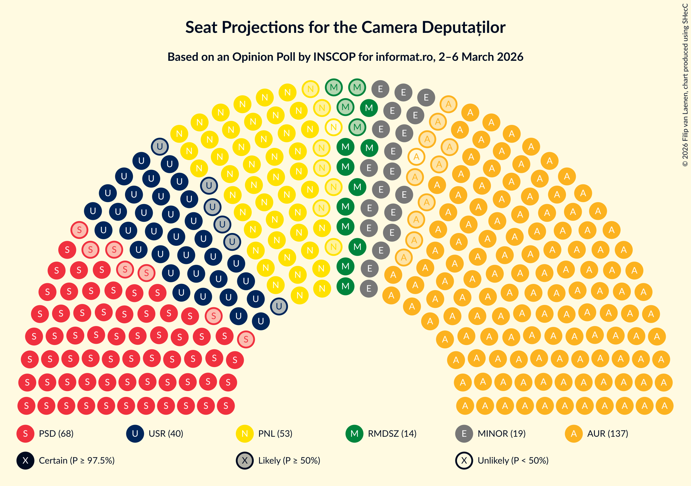

### Confidence Intervals

| Party | Last Result | Median | 80% Confidence Interval | 90% Confidence Interval | 95% Confidence Interval | 99% Confidence Interval |
|:-----:|:-----------:|:------:|:-----------------------:|:-----------------------:|:-----------------------:|:-----------------------:|
| <a href="#alianța-pentru-unirea-românilor">Alianța pentru Unirea Românilor</a> | 63 | 136 | 130–143 |128–144 |126–146 |123–150 |
| <a href="#partidul-social-democrat">Partidul Social Democrat</a> | 86 | 68 | 63–74 |62–76 |61–77 |58–80 |
| <a href="#partidul-național-liberal">Partidul Național Liberal</a> | 49 | 52 | 47–57 |46–58 |45–60 |43–62 |
| <a href="#uniunea-salvați-românia">Uniunea Salvați România</a> | 40 | 40 | 36–45 |35–46 |34–48 |32–50 |
| <a href="#romániai-magyar-demokrata-szövetség">Romániai Magyar Demokrata Szövetség</a> | 22 | 14 | 12–17 |11–18 |10–19 |9–20 |
| <a href="#sănătate,-educație,-natură,-sustenabilitate">Sănătate, Educație, Natură, Sustenabilitate</a> | 0 | 0 | 0 |0 |0 |0–18 |
| <a href="#partidul-s.o.s.-românia">Partidul S.O.S. România</a> | 28 | 0 | 0 |0 |0 |0 |
| <a href="#partidul-oamenilor-tineri">Partidul Oamenilor Tineri</a> | 24 | 0 | 0 |0 |0 |0 |

### Alianța pentru Unirea Românilor

*For a full overview of the results for this party, see the [Alianța pentru Unirea Românilor](party-alianțapentruunirearomânilor.html) page.*

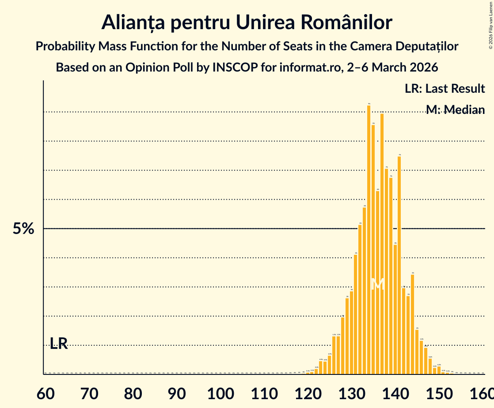

| Number of Seats | Probability | Accumulated | Special Marks |
|:---------------:|:-----------:|:-----------:|:-------------:|
| 63 | 0% | 100% | Last Result |
| 64 | 0% | 100% |  |
| 65 | 0% | 100% |  |
| 66 | 0% | 100% |  |
| 67 | 0% | 100% |  |
| 68 | 0% | 100% |  |
| 69 | 0% | 100% |  |
| 70 | 0% | 100% |  |
| 71 | 0% | 100% |  |
| 72 | 0% | 100% |  |
| 73 | 0% | 100% |  |
| 74 | 0% | 100% |  |
| 75 | 0% | 100% |  |
| 76 | 0% | 100% |  |
| 77 | 0% | 100% |  |
| 78 | 0% | 100% |  |
| 79 | 0% | 100% |  |
| 80 | 0% | 100% |  |
| 81 | 0% | 100% |  |
| 82 | 0% | 100% |  |
| 83 | 0% | 100% |  |
| 84 | 0% | 100% |  |
| 85 | 0% | 100% |  |
| 86 | 0% | 100% |  |
| 87 | 0% | 100% |  |
| 88 | 0% | 100% |  |
| 89 | 0% | 100% |  |
| 90 | 0% | 100% |  |
| 91 | 0% | 100% |  |
| 92 | 0% | 100% |  |
| 93 | 0% | 100% |  |
| 94 | 0% | 100% |  |
| 95 | 0% | 100% |  |
| 96 | 0% | 100% |  |
| 97 | 0% | 100% |  |
| 98 | 0% | 100% |  |
| 99 | 0% | 100% |  |
| 100 | 0% | 100% |  |
| 101 | 0% | 100% |  |
| 102 | 0% | 100% |  |
| 103 | 0% | 100% |  |
| 104 | 0% | 100% |  |
| 105 | 0% | 100% |  |
| 106 | 0% | 100% |  |
| 107 | 0% | 100% |  |
| 108 | 0% | 100% |  |
| 109 | 0% | 100% |  |
| 110 | 0% | 100% |  |
| 111 | 0% | 100% |  |
| 112 | 0% | 100% |  |
| 113 | 0% | 100% |  |
| 114 | 0% | 100% |  |
| 115 | 0% | 100% |  |
| 116 | 0% | 100% |  |
| 117 | 0% | 100% |  |
| 118 | 0% | 100% |  |
| 119 | 0% | 100% |  |
| 120 | 0.1% | 99.9% |  |
| 121 | 0.1% | 99.8% |  |
| 122 | 0.2% | 99.7% |  |
| 123 | 0.5% | 99.5% |  |
| 124 | 0.5% | 99.1% |  |
| 125 | 0.7% | 98.6% |  |
| 126 | 1.3% | 98% |  |
| 127 | 1.3% | 97% |  |
| 128 | 2% | 95% |  |
| 129 | 3% | 93% |  |
| 130 | 3% | 91% |  |
| 131 | 4% | 88% |  |
| 132 | 5% | 84% |  |
| 133 | 6% | 79% |  |
| 134 | 9% | 73% |  |
| 135 | 9% | 64% |  |
| 136 | 6% | 55% | Median |
| 137 | 9% | 49% |  |
| 138 | 7% | 40% |  |
| 139 | 7% | 33% |  |
| 140 | 4% | 26% |  |
| 141 | 7% | 22% |  |
| 142 | 3% | 14% |  |
| 143 | 3% | 11% |  |
| 144 | 3% | 8% |  |
| 145 | 2% | 5% |  |
| 146 | 1.2% | 3% |  |
| 147 | 0.9% | 2% |  |
| 148 | 0.6% | 1.3% |  |
| 149 | 0.2% | 0.8% |  |
| 150 | 0.3% | 0.5% |  |
| 151 | 0.1% | 0.2% |  |
| 152 | 0.1% | 0.1% |  |
| 153 | 0% | 0.1% |  |
| 154 | 0% | 0% |  |

### Partidul Social Democrat

*For a full overview of the results for this party, see the [Partidul Social Democrat](party-partidulsocialdemocrat.html) page.*

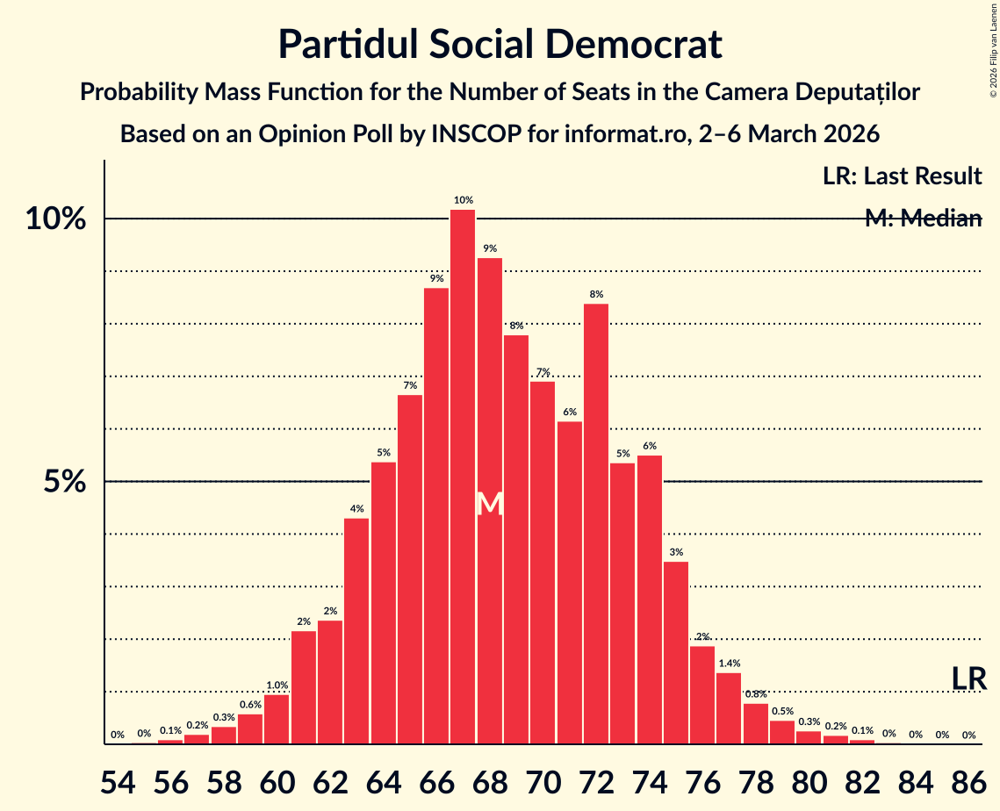

| Number of Seats | Probability | Accumulated | Special Marks |
|:---------------:|:-----------:|:-----------:|:-------------:|
| 55 | 0% | 100% |  |
| 56 | 0.1% | 99.9% |  |
| 57 | 0.2% | 99.8% |  |
| 58 | 0.3% | 99.6% |  |
| 59 | 0.6% | 99.3% |  |
| 60 | 1.0% | 98.7% |  |
| 61 | 2% | 98% |  |
| 62 | 2% | 96% |  |
| 63 | 4% | 93% |  |
| 64 | 5% | 89% |  |
| 65 | 7% | 84% |  |
| 66 | 9% | 77% |  |
| 67 | 10% | 68% |  |
| 68 | 9% | 58% | Median |
| 69 | 8% | 49% |  |
| 70 | 7% | 41% |  |
| 71 | 6% | 34% |  |
| 72 | 8% | 28% |  |
| 73 | 5% | 19% |  |
| 74 | 6% | 14% |  |
| 75 | 3% | 9% |  |
| 76 | 2% | 5% |  |
| 77 | 1.4% | 3% |  |
| 78 | 0.8% | 2% |  |
| 79 | 0.5% | 1.1% |  |
| 80 | 0.3% | 0.6% |  |
| 81 | 0.2% | 0.3% |  |
| 82 | 0.1% | 0.2% |  |
| 83 | 0% | 0.1% |  |
| 84 | 0% | 0% |  |
| 85 | 0% | 0% |  |
| 86 | 0% | 0% | Last Result |

### Partidul Național Liberal

*For a full overview of the results for this party, see the [Partidul Național Liberal](party-partidulnaționalliberal.html) page.*

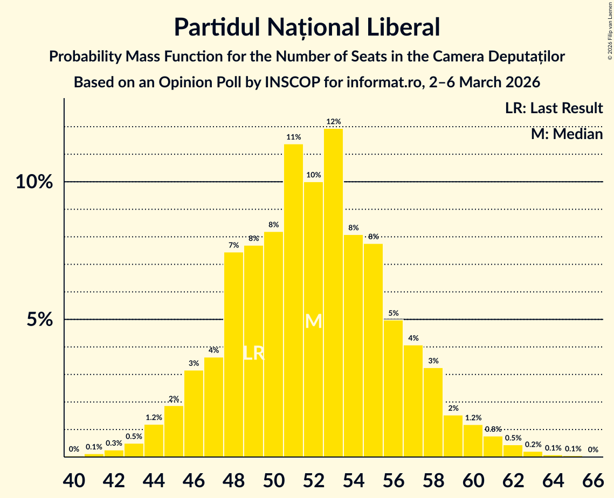

| Number of Seats | Probability | Accumulated | Special Marks |
|:---------------:|:-----------:|:-----------:|:-------------:|
| 40 | 0% | 100% |  |
| 41 | 0.1% | 99.9% |  |
| 42 | 0.3% | 99.8% |  |
| 43 | 0.5% | 99.5% |  |
| 44 | 1.2% | 99.0% |  |
| 45 | 2% | 98% |  |
| 46 | 3% | 96% |  |
| 47 | 4% | 93% |  |
| 48 | 7% | 89% |  |
| 49 | 8% | 82% | Last Result |
| 50 | 8% | 74% |  |
| 51 | 11% | 66% |  |
| 52 | 10% | 54% | Median |
| 53 | 12% | 44% |  |
| 54 | 8% | 32% |  |
| 55 | 8% | 24% |  |
| 56 | 5% | 17% |  |
| 57 | 4% | 12% |  |
| 58 | 3% | 8% |  |
| 59 | 2% | 4% |  |
| 60 | 1.2% | 3% |  |
| 61 | 0.8% | 2% |  |
| 62 | 0.5% | 0.8% |  |
| 63 | 0.2% | 0.4% |  |
| 64 | 0.1% | 0.2% |  |
| 65 | 0.1% | 0.1% |  |
| 66 | 0% | 0% |  |

### Uniunea Salvați România

*For a full overview of the results for this party, see the [Uniunea Salvați România](party-uniuneasalvațiromânia.html) page.*

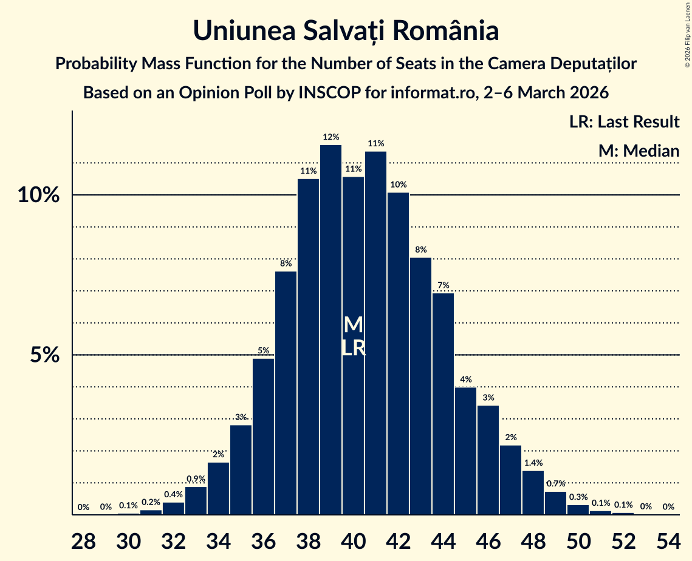

| Number of Seats | Probability | Accumulated | Special Marks |
|:---------------:|:-----------:|:-----------:|:-------------:|
| 30 | 0.1% | 100% |  |
| 31 | 0.2% | 99.9% |  |
| 32 | 0.4% | 99.8% |  |
| 33 | 0.9% | 99.4% |  |
| 34 | 2% | 98% |  |
| 35 | 3% | 97% |  |
| 36 | 5% | 94% |  |
| 37 | 8% | 89% |  |
| 38 | 11% | 81% |  |
| 39 | 12% | 71% |  |
| 40 | 11% | 59% | Last Result, Median |
| 41 | 11% | 49% |  |
| 42 | 10% | 37% |  |
| 43 | 8% | 27% |  |
| 44 | 7% | 19% |  |
| 45 | 4% | 12% |  |
| 46 | 3% | 8% |  |
| 47 | 2% | 5% |  |
| 48 | 1.4% | 3% |  |
| 49 | 0.7% | 1.3% |  |
| 50 | 0.3% | 0.6% |  |
| 51 | 0.1% | 0.3% |  |
| 52 | 0.1% | 0.1% |  |
| 53 | 0% | 0.1% |  |
| 54 | 0% | 0% |  |

### Romániai Magyar Demokrata Szövetség

*For a full overview of the results for this party, see the [Romániai Magyar Demokrata Szövetség](party-romániaimagyardemokrataszövetség.html) page.*

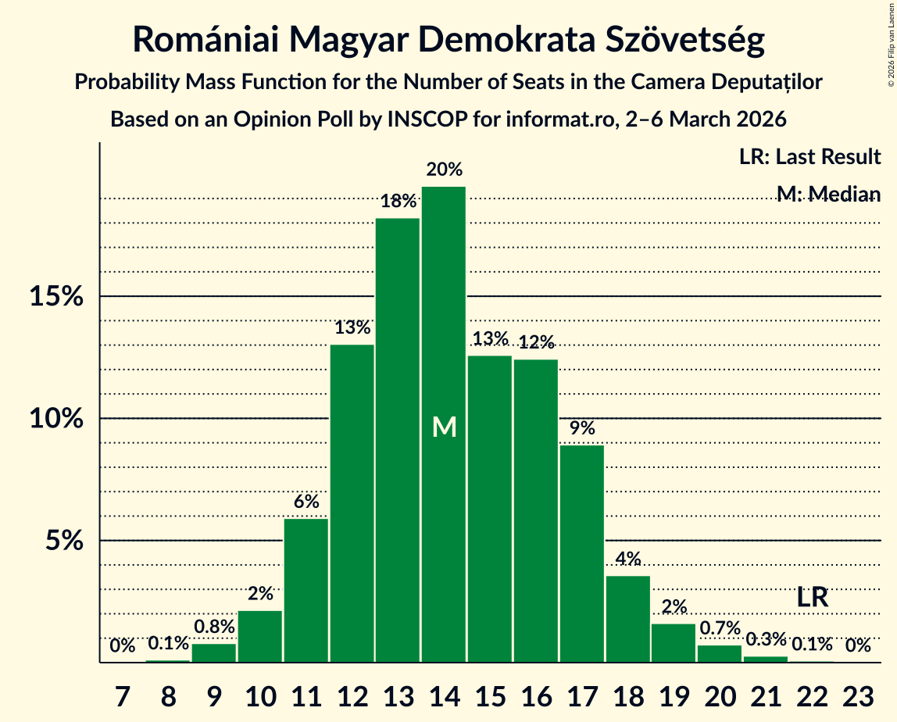

| Number of Seats | Probability | Accumulated | Special Marks |
|:---------------:|:-----------:|:-----------:|:-------------:|
| 8 | 0.1% | 100% |  |
| 9 | 0.8% | 99.9% |  |
| 10 | 2% | 99.1% |  |
| 11 | 6% | 97% |  |
| 12 | 13% | 91% |  |
| 13 | 18% | 78% |  |
| 14 | 20% | 60% | Median |
| 15 | 13% | 40% |  |
| 16 | 12% | 28% |  |
| 17 | 9% | 15% |  |
| 18 | 4% | 6% |  |
| 19 | 2% | 3% |  |
| 20 | 0.7% | 1.1% |  |
| 21 | 0.3% | 0.4% |  |
| 22 | 0.1% | 0.1% | Last Result |
| 23 | 0% | 0% |  |

### Sănătate, Educație, Natură, Sustenabilitate

*For a full overview of the results for this party, see the [Sănătate, Educație, Natură, Sustenabilitate](party-sănătateeducațienaturăsustenabilitate.html) page.*

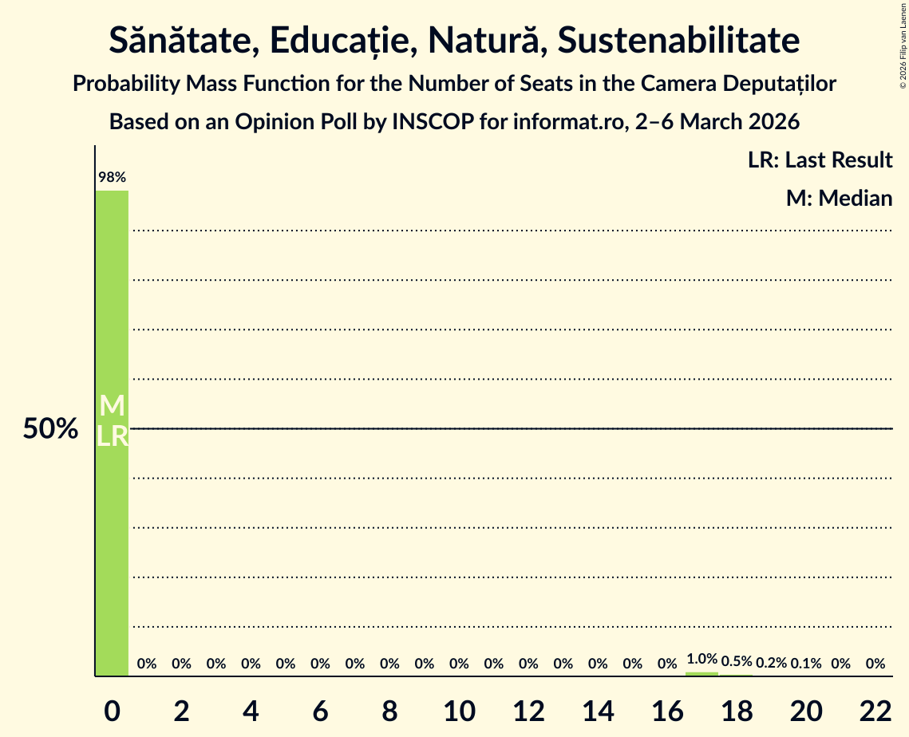

| Number of Seats | Probability | Accumulated | Special Marks |
|:---------------:|:-----------:|:-----------:|:-------------:|
| 0 | 98% | 100% | Last Result, Median |
| 1 | 0% | 2% |  |
| 2 | 0% | 2% |  |
| 3 | 0% | 2% |  |
| 4 | 0% | 2% |  |
| 5 | 0% | 2% |  |
| 6 | 0% | 2% |  |
| 7 | 0% | 2% |  |
| 8 | 0% | 2% |  |
| 9 | 0% | 2% |  |
| 10 | 0% | 2% |  |
| 11 | 0% | 2% |  |
| 12 | 0% | 2% |  |
| 13 | 0% | 2% |  |
| 14 | 0% | 2% |  |
| 15 | 0% | 2% |  |
| 16 | 0% | 2% |  |
| 17 | 1.0% | 2% |  |
| 18 | 0.5% | 0.8% |  |
| 19 | 0.2% | 0.3% |  |
| 20 | 0.1% | 0.1% |  |
| 21 | 0% | 0% |  |

### Partidul S.O.S. România

*For a full overview of the results for this party, see the [Partidul S.O.S. România](party-partidulsosromânia.html) page.*

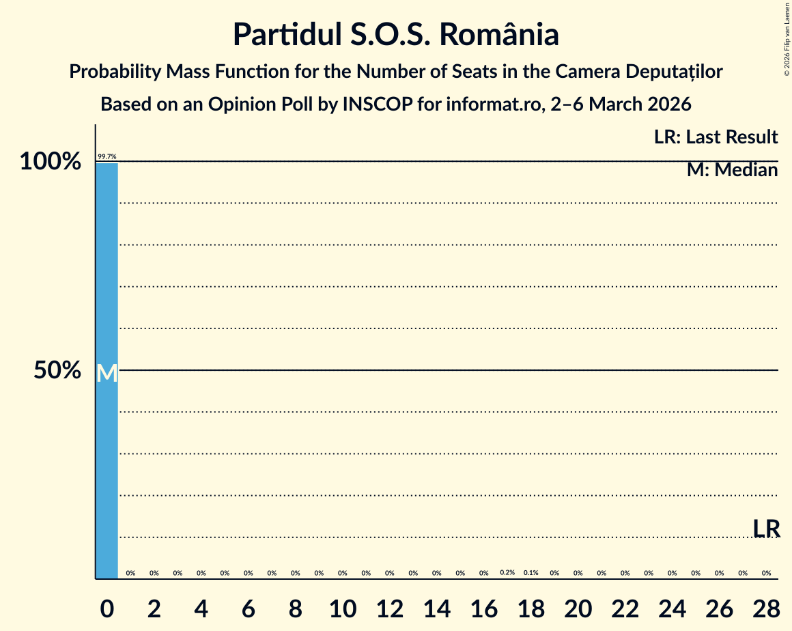

| Number of Seats | Probability | Accumulated | Special Marks |
|:---------------:|:-----------:|:-----------:|:-------------:|
| 0 | 99.7% | 100% | Median |
| 1 | 0% | 0.3% |  |
| 2 | 0% | 0.3% |  |
| 3 | 0% | 0.3% |  |
| 4 | 0% | 0.3% |  |
| 5 | 0% | 0.3% |  |
| 6 | 0% | 0.3% |  |
| 7 | 0% | 0.3% |  |
| 8 | 0% | 0.3% |  |
| 9 | 0% | 0.3% |  |
| 10 | 0% | 0.3% |  |
| 11 | 0% | 0.3% |  |
| 12 | 0% | 0.3% |  |
| 13 | 0% | 0.3% |  |
| 14 | 0% | 0.3% |  |
| 15 | 0% | 0.3% |  |
| 16 | 0% | 0.3% |  |
| 17 | 0.2% | 0.3% |  |
| 18 | 0.1% | 0.1% |  |
| 19 | 0% | 0% |  |
| 20 | 0% | 0% |  |
| 21 | 0% | 0% |  |
| 22 | 0% | 0% |  |
| 23 | 0% | 0% |  |
| 24 | 0% | 0% |  |
| 25 | 0% | 0% |  |
| 26 | 0% | 0% |  |
| 27 | 0% | 0% |  |
| 28 | 0% | 0% | Last Result |

### Partidul Oamenilor Tineri

*For a full overview of the results for this party, see the [Partidul Oamenilor Tineri](party-partiduloamenilortineri.html) page.*

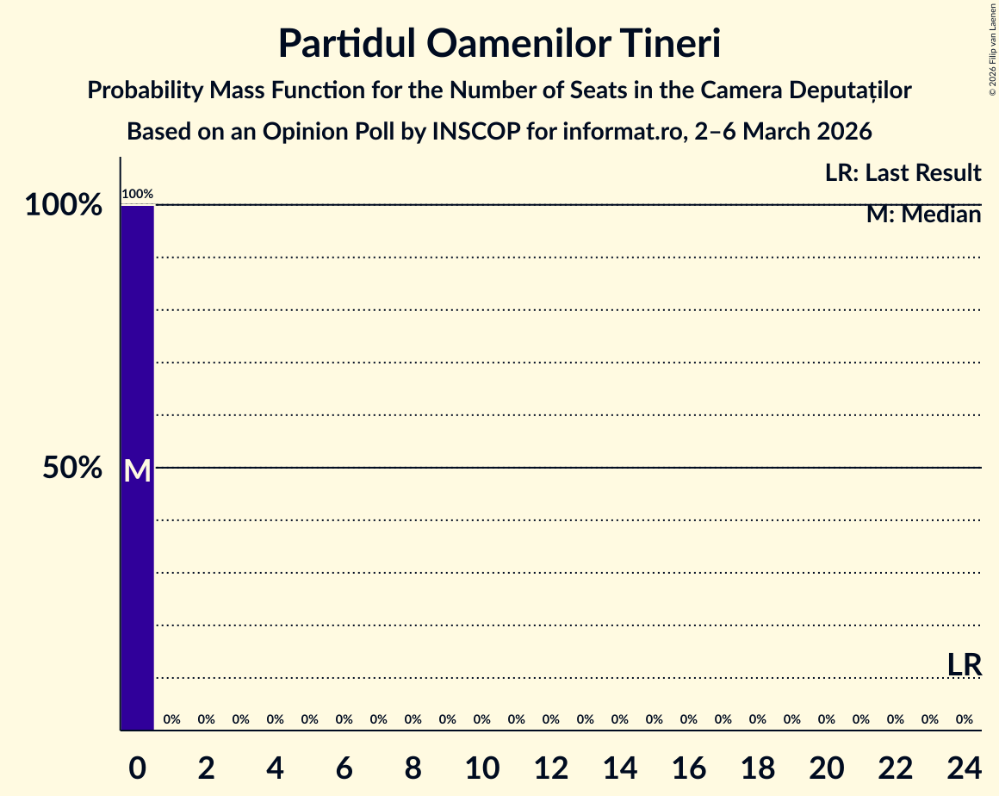

| Number of Seats | Probability | Accumulated | Special Marks |
|:---------------:|:-----------:|:-----------:|:-------------:|
| 0 | 100% | 100% | Median |
| 1 | 0% | 0% |  |
| 2 | 0% | 0% |  |
| 3 | 0% | 0% |  |
| 4 | 0% | 0% |  |
| 5 | 0% | 0% |  |
| 6 | 0% | 0% |  |
| 7 | 0% | 0% |  |
| 8 | 0% | 0% |  |
| 9 | 0% | 0% |  |
| 10 | 0% | 0% |  |
| 11 | 0% | 0% |  |
| 12 | 0% | 0% |  |
| 13 | 0% | 0% |  |
| 14 | 0% | 0% |  |
| 15 | 0% | 0% |  |
| 16 | 0% | 0% |  |
| 17 | 0% | 0% |  |
| 18 | 0% | 0% |  |
| 19 | 0% | 0% |  |
| 20 | 0% | 0% |  |
| 21 | 0% | 0% |  |
| 22 | 0% | 0% |  |
| 23 | 0% | 0% |  |
| 24 | 0% | 0% | Last Result |

## Coalitions

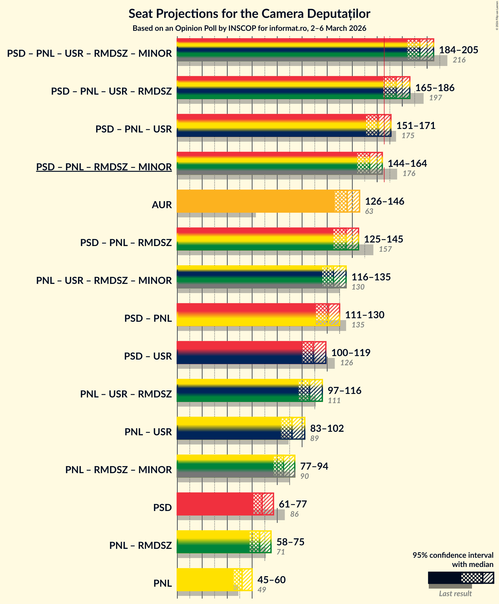

### Confidence Intervals

| Coalition | Last Result | Median | Majority? | 80% Confidence Interval | 90% Confidence Interval | 95% Confidence Interval | 99% Confidence Interval |
|:---------:|:-----------:|:------:|:---------:|:-----------------------:|:-----------------------:|:-----------------------:|:-----------------------:|
| Partidul Social Democrat – Partidul Național Liberal – Uniunea Salvați România – Romániai Magyar Demokrata Szövetség | 197 | 175 | 97% | 169–182 | 167–184 | 165–186 | 161–189 |
| Partidul Social Democrat – Partidul Național Liberal – Uniunea Salvați România | 175 | 161 | 18% | 155–168 | 153–170 | 151–171 | 147–175 |
| Alianța pentru Unirea Românilor | 63 | 136 | 0% | 130–143 | 128–144 | 126–146 | 123–150 |
| Partidul Social Democrat – Partidul Național Liberal – Romániai Magyar Demokrata Szövetség | 157 | 135 | 0% | 128–141 | 127–143 | 125–145 | 121–148 |
| Partidul Social Democrat – Partidul Național Liberal | 135 | 121 | 0% | 114–127 | 113–129 | 111–130 | 107–133 |
| Partidul Social Democrat – Uniunea Salvați România | 126 | 109 | 0% | 103–115 | 101–117 | 100–119 | 97–122 |
| Partidul Național Liberal – Uniunea Salvați România – Romániai Magyar Demokrata Szövetség | 111 | 106 | 0% | 101–113 | 99–115 | 97–116 | 94–120 |
| Partidul Național Liberal – Uniunea Salvați România | 89 | 92 | 0% | 87–98 | 85–100 | 83–102 | 81–105 |
| Partidul Social Democrat | 86 | 68 | 0% | 63–74 | 62–76 | 61–77 | 58–80 |
| Partidul Național Liberal – Romániai Magyar Demokrata Szövetség | 71 | 66 | 0% | 61–72 | 59–73 | 58–75 | 56–77 |
| Partidul Național Liberal | 49 | 52 | 0% | 47–57 | 46–58 | 45–60 | 43–62 |

### Partidul Social Democrat – Partidul Național Liberal – Uniunea Salvați România – Romániai Magyar Demokrata Szövetség

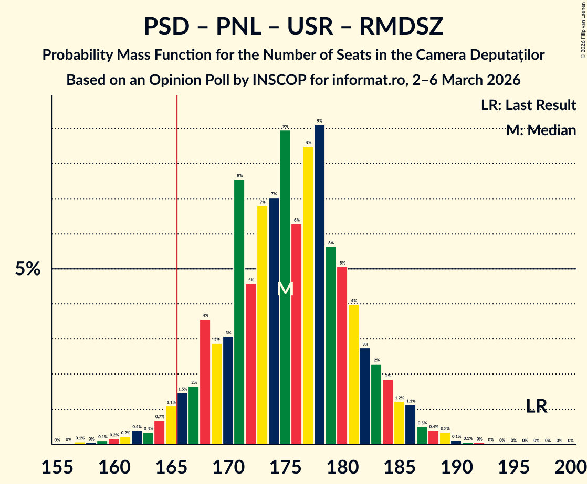

| Number of Seats | Probability | Accumulated | Special Marks |
|:---------------:|:-----------:|:-----------:|:-------------:|
| 156 | 0% | 100% |  |
| 157 | 0.1% | 99.9% |  |
| 158 | 0% | 99.9% |  |
| 159 | 0.1% | 99.8% |  |
| 160 | 0.2% | 99.7% |  |
| 161 | 0.2% | 99.6% |  |
| 162 | 0.4% | 99.3% |  |
| 163 | 0.3% | 99.0% |  |
| 164 | 0.7% | 98.6% |  |
| 165 | 1.1% | 98% |  |
| 166 | 1.5% | 97% | Majority |
| 167 | 2% | 95% |  |
| 168 | 4% | 94% |  |
| 169 | 3% | 90% |  |
| 170 | 3% | 87% |  |
| 171 | 8% | 84% |  |
| 172 | 5% | 77% |  |
| 173 | 7% | 72% |  |
| 174 | 7% | 65% | Median |
| 175 | 9% | 58% |  |
| 176 | 6% | 49% |  |
| 177 | 8% | 43% |  |
| 178 | 9% | 35% |  |
| 179 | 6% | 25% |  |
| 180 | 5% | 20% |  |
| 181 | 4% | 15% |  |
| 182 | 3% | 11% |  |
| 183 | 2% | 8% |  |
| 184 | 2% | 6% |  |
| 185 | 1.2% | 4% |  |
| 186 | 1.1% | 3% |  |
| 187 | 0.5% | 1.5% |  |
| 188 | 0.4% | 1.0% |  |
| 189 | 0.3% | 0.6% |  |
| 190 | 0.1% | 0.2% |  |
| 191 | 0.1% | 0.1% |  |
| 192 | 0% | 0.1% |  |
| 193 | 0% | 0% |  |
| 194 | 0% | 0% |  |
| 195 | 0% | 0% |  |
| 196 | 0% | 0% |  |
| 197 | 0% | 0% | Last Result |

### Partidul Social Democrat – Partidul Național Liberal – Uniunea Salvați România

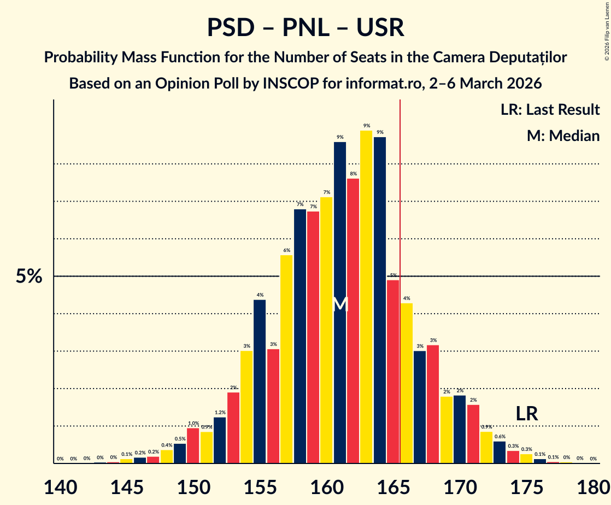

| Number of Seats | Probability | Accumulated | Special Marks |
|:---------------:|:-----------:|:-----------:|:-------------:|
| 143 | 0% | 100% |  |
| 144 | 0% | 99.9% |  |
| 145 | 0.1% | 99.9% |  |
| 146 | 0.2% | 99.7% |  |
| 147 | 0.2% | 99.6% |  |
| 148 | 0.4% | 99.4% |  |
| 149 | 0.5% | 99.0% |  |
| 150 | 1.0% | 98% |  |
| 151 | 0.9% | 98% |  |
| 152 | 1.2% | 97% |  |
| 153 | 2% | 95% |  |
| 154 | 3% | 93% |  |
| 155 | 4% | 90% |  |
| 156 | 3% | 86% |  |
| 157 | 6% | 83% |  |
| 158 | 7% | 77% |  |
| 159 | 7% | 71% |  |
| 160 | 7% | 64% | Median |
| 161 | 9% | 57% |  |
| 162 | 8% | 48% |  |
| 163 | 9% | 41% |  |
| 164 | 9% | 32% |  |
| 165 | 5% | 23% |  |
| 166 | 4% | 18% | Majority |
| 167 | 3% | 14% |  |
| 168 | 3% | 11% |  |
| 169 | 2% | 8% |  |
| 170 | 2% | 6% |  |
| 171 | 2% | 4% |  |
| 172 | 0.9% | 2% |  |
| 173 | 0.6% | 1.5% |  |
| 174 | 0.3% | 0.9% |  |
| 175 | 0.3% | 0.5% | Last Result |
| 176 | 0.1% | 0.3% |  |
| 177 | 0.1% | 0.1% |  |
| 178 | 0% | 0.1% |  |
| 179 | 0% | 0% |  |

### Alianța pentru Unirea Românilor

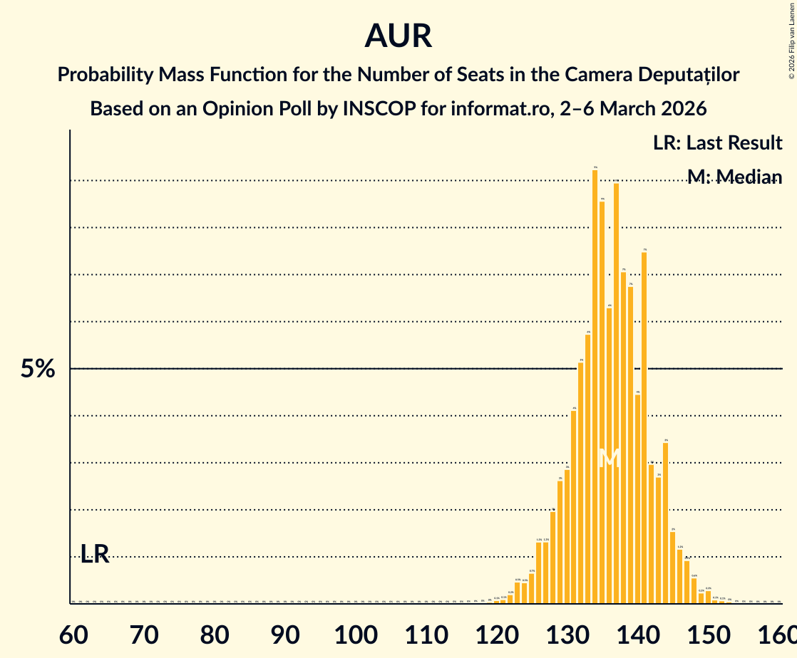

| Number of Seats | Probability | Accumulated | Special Marks |
|:---------------:|:-----------:|:-----------:|:-------------:|
| 63 | 0% | 100% | Last Result |
| 64 | 0% | 100% |  |
| 65 | 0% | 100% |  |
| 66 | 0% | 100% |  |
| 67 | 0% | 100% |  |
| 68 | 0% | 100% |  |
| 69 | 0% | 100% |  |
| 70 | 0% | 100% |  |
| 71 | 0% | 100% |  |
| 72 | 0% | 100% |  |
| 73 | 0% | 100% |  |
| 74 | 0% | 100% |  |
| 75 | 0% | 100% |  |
| 76 | 0% | 100% |  |
| 77 | 0% | 100% |  |
| 78 | 0% | 100% |  |
| 79 | 0% | 100% |  |
| 80 | 0% | 100% |  |
| 81 | 0% | 100% |  |
| 82 | 0% | 100% |  |
| 83 | 0% | 100% |  |
| 84 | 0% | 100% |  |
| 85 | 0% | 100% |  |
| 86 | 0% | 100% |  |
| 87 | 0% | 100% |  |
| 88 | 0% | 100% |  |
| 89 | 0% | 100% |  |
| 90 | 0% | 100% |  |
| 91 | 0% | 100% |  |
| 92 | 0% | 100% |  |
| 93 | 0% | 100% |  |
| 94 | 0% | 100% |  |
| 95 | 0% | 100% |  |
| 96 | 0% | 100% |  |
| 97 | 0% | 100% |  |
| 98 | 0% | 100% |  |
| 99 | 0% | 100% |  |
| 100 | 0% | 100% |  |
| 101 | 0% | 100% |  |
| 102 | 0% | 100% |  |
| 103 | 0% | 100% |  |
| 104 | 0% | 100% |  |
| 105 | 0% | 100% |  |
| 106 | 0% | 100% |  |
| 107 | 0% | 100% |  |
| 108 | 0% | 100% |  |
| 109 | 0% | 100% |  |
| 110 | 0% | 100% |  |
| 111 | 0% | 100% |  |
| 112 | 0% | 100% |  |
| 113 | 0% | 100% |  |
| 114 | 0% | 100% |  |
| 115 | 0% | 100% |  |
| 116 | 0% | 100% |  |
| 117 | 0% | 100% |  |
| 118 | 0% | 100% |  |
| 119 | 0% | 100% |  |
| 120 | 0.1% | 99.9% |  |
| 121 | 0.1% | 99.8% |  |
| 122 | 0.2% | 99.7% |  |
| 123 | 0.5% | 99.5% |  |
| 124 | 0.5% | 99.1% |  |
| 125 | 0.7% | 98.6% |  |
| 126 | 1.3% | 98% |  |
| 127 | 1.3% | 97% |  |
| 128 | 2% | 95% |  |
| 129 | 3% | 93% |  |
| 130 | 3% | 91% |  |
| 131 | 4% | 88% |  |
| 132 | 5% | 84% |  |
| 133 | 6% | 79% |  |
| 134 | 9% | 73% |  |
| 135 | 9% | 64% |  |
| 136 | 6% | 55% | Median |
| 137 | 9% | 49% |  |
| 138 | 7% | 40% |  |
| 139 | 7% | 33% |  |
| 140 | 4% | 26% |  |
| 141 | 7% | 22% |  |
| 142 | 3% | 14% |  |
| 143 | 3% | 11% |  |
| 144 | 3% | 8% |  |
| 145 | 2% | 5% |  |
| 146 | 1.2% | 3% |  |
| 147 | 0.9% | 2% |  |
| 148 | 0.6% | 1.3% |  |
| 149 | 0.2% | 0.8% |  |
| 150 | 0.3% | 0.5% |  |
| 151 | 0.1% | 0.2% |  |
| 152 | 0.1% | 0.1% |  |
| 153 | 0% | 0.1% |  |
| 154 | 0% | 0% |  |

### Partidul Social Democrat – Partidul Național Liberal – Romániai Magyar Demokrata Szövetség

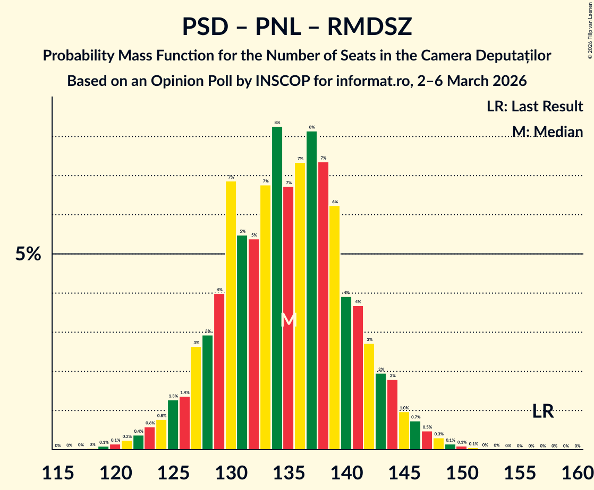

| Number of Seats | Probability | Accumulated | Special Marks |
|:---------------:|:-----------:|:-----------:|:-------------:|
| 117 | 0% | 100% |  |
| 118 | 0% | 99.9% |  |
| 119 | 0.1% | 99.9% |  |
| 120 | 0.1% | 99.8% |  |
| 121 | 0.2% | 99.7% |  |
| 122 | 0.4% | 99.4% |  |
| 123 | 0.6% | 99.0% |  |
| 124 | 0.8% | 98% |  |
| 125 | 1.3% | 98% |  |
| 126 | 1.4% | 96% |  |
| 127 | 3% | 95% |  |
| 128 | 3% | 92% |  |
| 129 | 4% | 89% |  |
| 130 | 7% | 85% |  |
| 131 | 5% | 79% |  |
| 132 | 5% | 73% |  |
| 133 | 7% | 68% |  |
| 134 | 8% | 61% | Median |
| 135 | 7% | 53% |  |
| 136 | 7% | 46% |  |
| 137 | 8% | 39% |  |
| 138 | 7% | 31% |  |
| 139 | 6% | 23% |  |
| 140 | 4% | 17% |  |
| 141 | 4% | 13% |  |
| 142 | 3% | 9% |  |
| 143 | 2% | 7% |  |
| 144 | 2% | 5% |  |
| 145 | 1.0% | 3% |  |
| 146 | 0.7% | 2% |  |
| 147 | 0.5% | 1.1% |  |
| 148 | 0.3% | 0.7% |  |
| 149 | 0.1% | 0.4% |  |
| 150 | 0.1% | 0.2% |  |
| 151 | 0.1% | 0.1% |  |
| 152 | 0% | 0.1% |  |
| 153 | 0% | 0% |  |
| 154 | 0% | 0% |  |
| 155 | 0% | 0% |  |
| 156 | 0% | 0% |  |
| 157 | 0% | 0% | Last Result |

### Partidul Social Democrat – Partidul Național Liberal

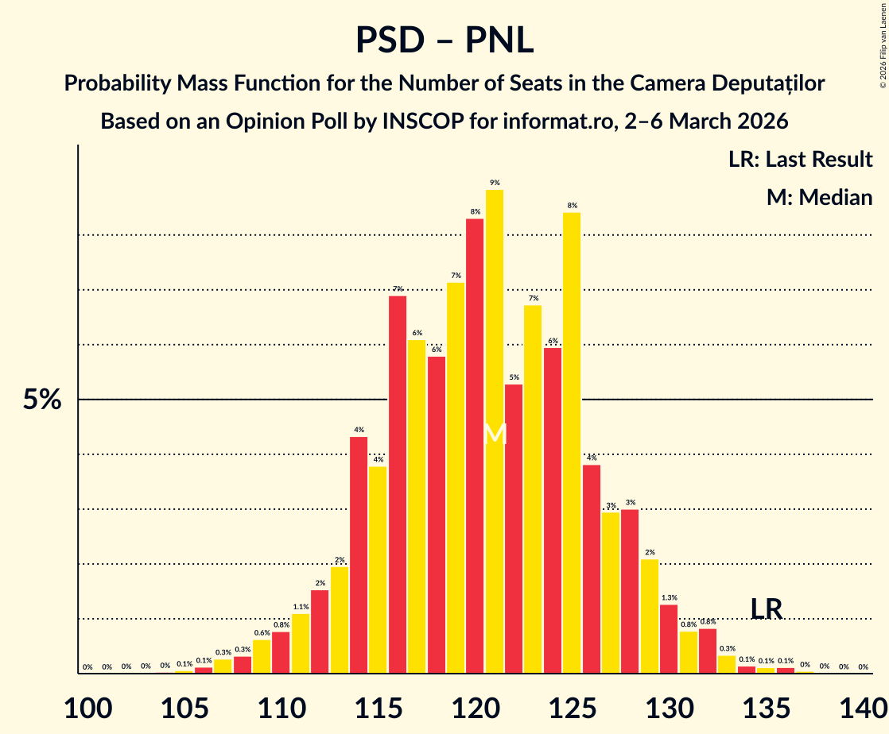

| Number of Seats | Probability | Accumulated | Special Marks |
|:---------------:|:-----------:|:-----------:|:-------------:|
| 104 | 0% | 100% |  |
| 105 | 0.1% | 99.9% |  |
| 106 | 0.1% | 99.9% |  |
| 107 | 0.3% | 99.7% |  |
| 108 | 0.3% | 99.5% |  |
| 109 | 0.6% | 99.1% |  |
| 110 | 0.8% | 98.5% |  |
| 111 | 1.1% | 98% |  |
| 112 | 2% | 97% |  |
| 113 | 2% | 95% |  |
| 114 | 4% | 93% |  |
| 115 | 4% | 89% |  |
| 116 | 7% | 85% |  |
| 117 | 6% | 78% |  |
| 118 | 6% | 72% |  |
| 119 | 7% | 66% |  |
| 120 | 8% | 59% | Median |
| 121 | 9% | 51% |  |
| 122 | 5% | 42% |  |
| 123 | 7% | 37% |  |
| 124 | 6% | 30% |  |
| 125 | 8% | 24% |  |
| 126 | 4% | 16% |  |
| 127 | 3% | 12% |  |
| 128 | 3% | 9% |  |
| 129 | 2% | 6% |  |
| 130 | 1.3% | 4% |  |
| 131 | 0.8% | 2% |  |
| 132 | 0.8% | 2% |  |
| 133 | 0.3% | 0.8% |  |
| 134 | 0.1% | 0.5% |  |
| 135 | 0.1% | 0.3% | Last Result |
| 136 | 0.1% | 0.2% |  |
| 137 | 0% | 0.1% |  |
| 138 | 0% | 0% |  |

### Partidul Social Democrat – Uniunea Salvați România

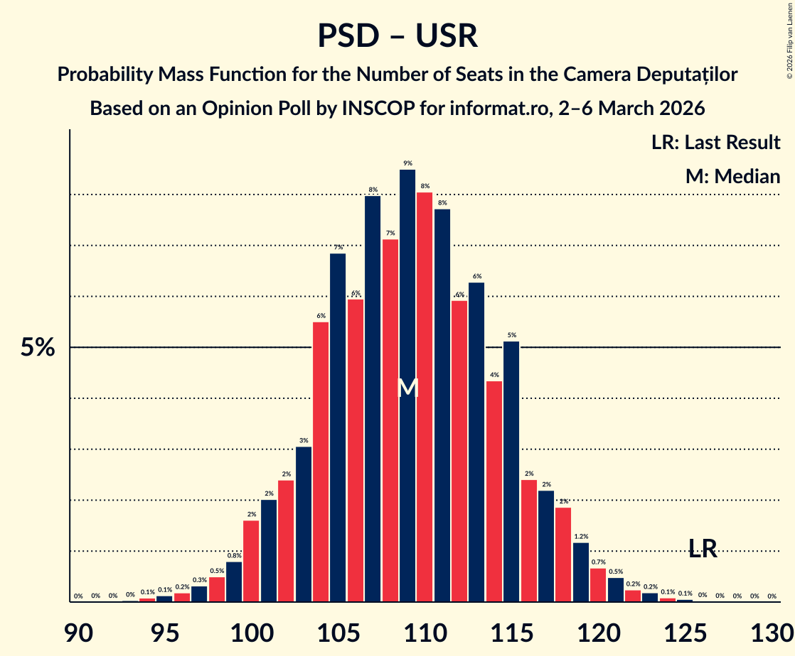

| Number of Seats | Probability | Accumulated | Special Marks |
|:---------------:|:-----------:|:-----------:|:-------------:|
| 93 | 0% | 100% |  |
| 94 | 0.1% | 99.9% |  |
| 95 | 0.1% | 99.9% |  |
| 96 | 0.2% | 99.7% |  |
| 97 | 0.3% | 99.5% |  |
| 98 | 0.5% | 99.2% |  |
| 99 | 0.8% | 98.7% |  |
| 100 | 2% | 98% |  |
| 101 | 2% | 96% |  |
| 102 | 2% | 94% |  |
| 103 | 3% | 92% |  |
| 104 | 6% | 89% |  |
| 105 | 7% | 83% |  |
| 106 | 6% | 76% |  |
| 107 | 8% | 71% |  |
| 108 | 7% | 63% | Median |
| 109 | 9% | 55% |  |
| 110 | 8% | 47% |  |
| 111 | 8% | 39% |  |
| 112 | 6% | 31% |  |
| 113 | 6% | 25% |  |
| 114 | 4% | 19% |  |
| 115 | 5% | 15% |  |
| 116 | 2% | 9% |  |
| 117 | 2% | 7% |  |
| 118 | 2% | 5% |  |
| 119 | 1.2% | 3% |  |
| 120 | 0.7% | 2% |  |
| 121 | 0.5% | 1.1% |  |
| 122 | 0.2% | 0.6% |  |
| 123 | 0.2% | 0.4% |  |
| 124 | 0.1% | 0.2% |  |
| 125 | 0.1% | 0.1% |  |
| 126 | 0% | 0.1% | Last Result |
| 127 | 0% | 0% |  |

### Partidul Național Liberal – Uniunea Salvați România – Romániai Magyar Demokrata Szövetség

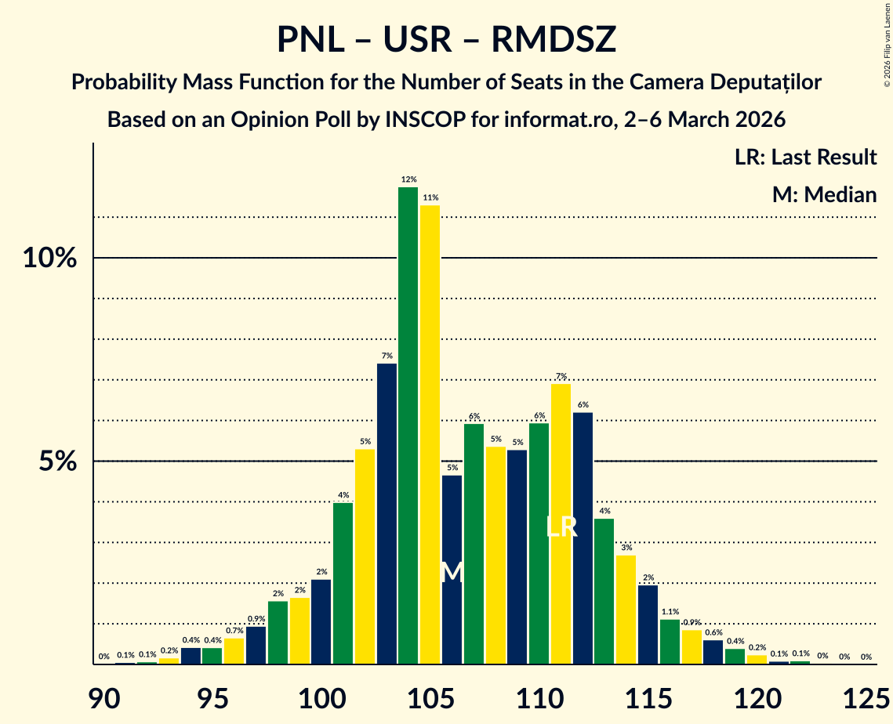

| Number of Seats | Probability | Accumulated | Special Marks |
|:---------------:|:-----------:|:-----------:|:-------------:|
| 91 | 0.1% | 100% |  |
| 92 | 0.1% | 99.9% |  |
| 93 | 0.2% | 99.8% |  |
| 94 | 0.4% | 99.7% |  |
| 95 | 0.4% | 99.2% |  |
| 96 | 0.7% | 98.8% |  |
| 97 | 0.9% | 98% |  |
| 98 | 2% | 97% |  |
| 99 | 2% | 96% |  |
| 100 | 2% | 94% |  |
| 101 | 4% | 92% |  |
| 102 | 5% | 88% |  |
| 103 | 7% | 83% |  |
| 104 | 12% | 75% |  |
| 105 | 11% | 63% |  |
| 106 | 5% | 52% | Median |
| 107 | 6% | 47% |  |
| 108 | 5% | 41% |  |
| 109 | 5% | 36% |  |
| 110 | 6% | 31% |  |
| 111 | 7% | 25% | Last Result |
| 112 | 6% | 18% |  |
| 113 | 4% | 12% |  |
| 114 | 3% | 8% |  |
| 115 | 2% | 5% |  |
| 116 | 1.1% | 3% |  |
| 117 | 0.9% | 2% |  |
| 118 | 0.6% | 2% |  |
| 119 | 0.4% | 0.9% |  |
| 120 | 0.2% | 0.5% |  |
| 121 | 0.1% | 0.3% |  |
| 122 | 0.1% | 0.2% |  |
| 123 | 0% | 0.1% |  |
| 124 | 0% | 0% |  |

### Partidul Național Liberal – Uniunea Salvați România

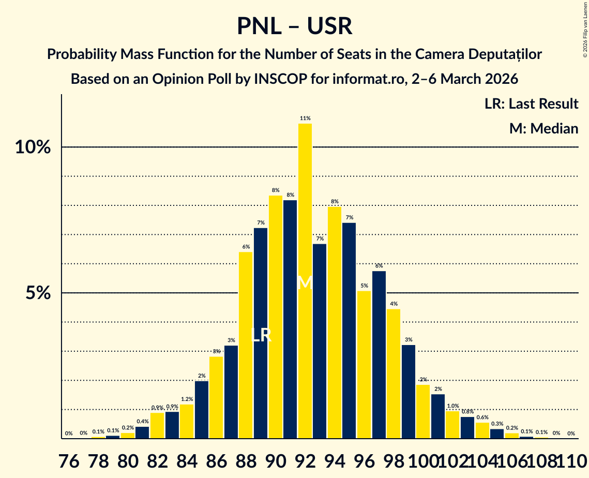

| Number of Seats | Probability | Accumulated | Special Marks |
|:---------------:|:-----------:|:-----------:|:-------------:|
| 77 | 0% | 100% |  |
| 78 | 0.1% | 99.9% |  |
| 79 | 0.1% | 99.9% |  |
| 80 | 0.2% | 99.8% |  |
| 81 | 0.4% | 99.5% |  |
| 82 | 0.9% | 99.1% |  |
| 83 | 0.9% | 98% |  |
| 84 | 1.2% | 97% |  |
| 85 | 2% | 96% |  |
| 86 | 3% | 94% |  |
| 87 | 3% | 91% |  |
| 88 | 6% | 88% |  |
| 89 | 7% | 82% | Last Result |
| 90 | 8% | 74% |  |
| 91 | 8% | 66% |  |
| 92 | 11% | 58% | Median |
| 93 | 7% | 47% |  |
| 94 | 8% | 40% |  |
| 95 | 7% | 32% |  |
| 96 | 5% | 25% |  |
| 97 | 6% | 20% |  |
| 98 | 4% | 14% |  |
| 99 | 3% | 10% |  |
| 100 | 2% | 6% |  |
| 101 | 2% | 5% |  |
| 102 | 1.0% | 3% |  |
| 103 | 0.8% | 2% |  |
| 104 | 0.6% | 1.3% |  |
| 105 | 0.3% | 0.7% |  |
| 106 | 0.2% | 0.4% |  |
| 107 | 0.1% | 0.2% |  |
| 108 | 0.1% | 0.1% |  |
| 109 | 0% | 0% |  |

### Partidul Social Democrat

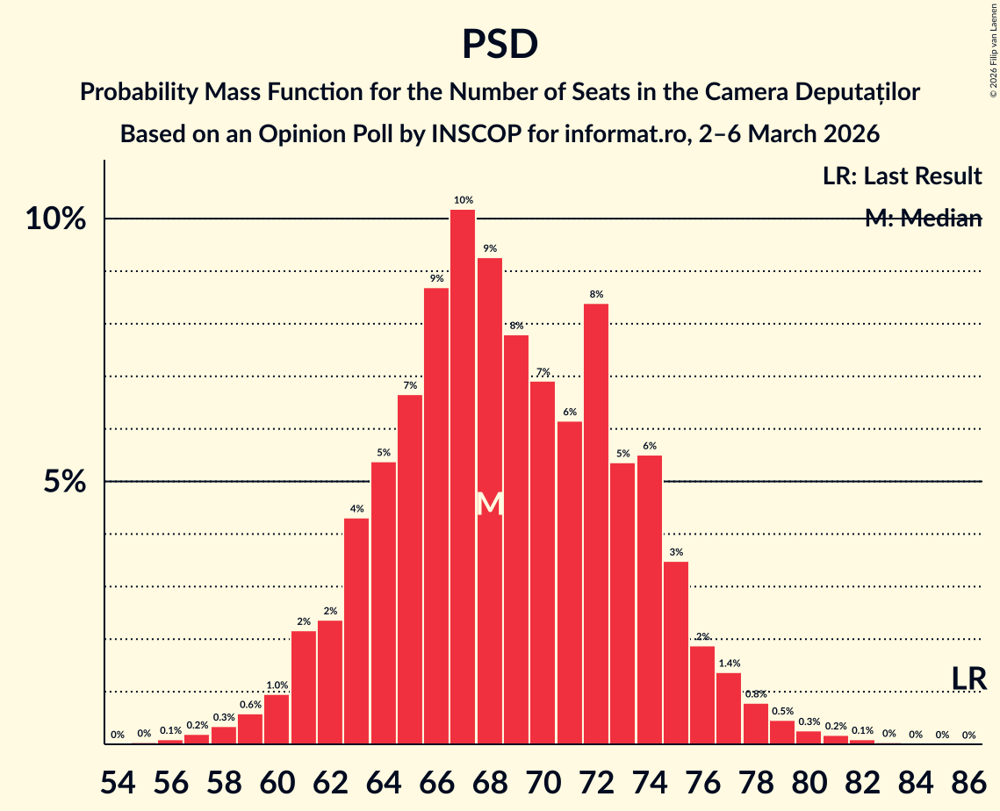

| Number of Seats | Probability | Accumulated | Special Marks |
|:---------------:|:-----------:|:-----------:|:-------------:|
| 55 | 0% | 100% |  |
| 56 | 0.1% | 99.9% |  |
| 57 | 0.2% | 99.8% |  |
| 58 | 0.3% | 99.6% |  |
| 59 | 0.6% | 99.3% |  |
| 60 | 1.0% | 98.7% |  |
| 61 | 2% | 98% |  |
| 62 | 2% | 96% |  |
| 63 | 4% | 93% |  |
| 64 | 5% | 89% |  |
| 65 | 7% | 84% |  |
| 66 | 9% | 77% |  |
| 67 | 10% | 68% |  |
| 68 | 9% | 58% | Median |
| 69 | 8% | 49% |  |
| 70 | 7% | 41% |  |
| 71 | 6% | 34% |  |
| 72 | 8% | 28% |  |
| 73 | 5% | 19% |  |
| 74 | 6% | 14% |  |
| 75 | 3% | 9% |  |
| 76 | 2% | 5% |  |
| 77 | 1.4% | 3% |  |
| 78 | 0.8% | 2% |  |
| 79 | 0.5% | 1.1% |  |
| 80 | 0.3% | 0.6% |  |
| 81 | 0.2% | 0.3% |  |
| 82 | 0.1% | 0.2% |  |
| 83 | 0% | 0.1% |  |
| 84 | 0% | 0% |  |
| 85 | 0% | 0% |  |
| 86 | 0% | 0% | Last Result |

### Partidul Național Liberal – Romániai Magyar Demokrata Szövetség

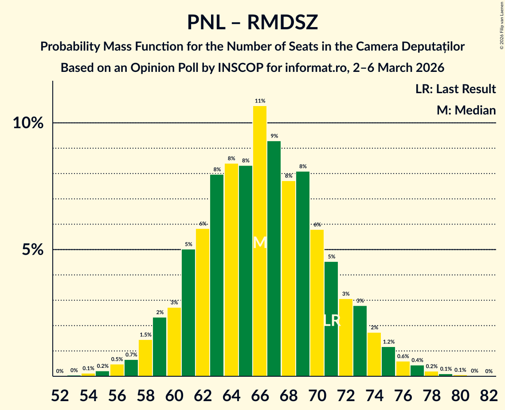

| Number of Seats | Probability | Accumulated | Special Marks |
|:---------------:|:-----------:|:-----------:|:-------------:|
| 53 | 0% | 100% |  |
| 54 | 0.1% | 99.9% |  |
| 55 | 0.2% | 99.8% |  |
| 56 | 0.5% | 99.6% |  |
| 57 | 0.7% | 99.1% |  |
| 58 | 1.5% | 98% |  |
| 59 | 2% | 97% |  |
| 60 | 3% | 95% |  |
| 61 | 5% | 92% |  |
| 62 | 6% | 87% |  |
| 63 | 8% | 81% |  |
| 64 | 8% | 73% |  |
| 65 | 8% | 65% |  |
| 66 | 11% | 56% | Median |
| 67 | 9% | 46% |  |
| 68 | 8% | 36% |  |
| 69 | 8% | 29% |  |
| 70 | 6% | 21% |  |
| 71 | 5% | 15% | Last Result |
| 72 | 3% | 10% |  |
| 73 | 3% | 7% |  |
| 74 | 2% | 4% |  |
| 75 | 1.2% | 3% |  |
| 76 | 0.6% | 1.5% |  |
| 77 | 0.4% | 0.9% |  |
| 78 | 0.2% | 0.4% |  |
| 79 | 0.1% | 0.2% |  |
| 80 | 0.1% | 0.1% |  |
| 81 | 0% | 0% |  |

### Partidul Național Liberal

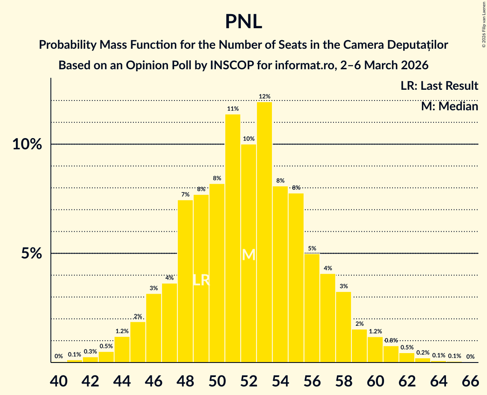

| Number of Seats | Probability | Accumulated | Special Marks |
|:---------------:|:-----------:|:-----------:|:-------------:|
| 40 | 0% | 100% |  |
| 41 | 0.1% | 99.9% |  |
| 42 | 0.3% | 99.8% |  |
| 43 | 0.5% | 99.5% |  |
| 44 | 1.2% | 99.0% |  |
| 45 | 2% | 98% |  |
| 46 | 3% | 96% |  |
| 47 | 4% | 93% |  |
| 48 | 7% | 89% |  |
| 49 | 8% | 82% | Last Result |
| 50 | 8% | 74% |  |
| 51 | 11% | 66% |  |
| 52 | 10% | 54% | Median |
| 53 | 12% | 44% |  |
| 54 | 8% | 32% |  |
| 55 | 8% | 24% |  |
| 56 | 5% | 17% |  |
| 57 | 4% | 12% |  |
| 58 | 3% | 8% |  |
| 59 | 2% | 4% |  |
| 60 | 1.2% | 3% |  |
| 61 | 0.8% | 2% |  |
| 62 | 0.5% | 0.8% |  |
| 63 | 0.2% | 0.4% |  |
| 64 | 0.1% | 0.2% |  |
| 65 | 0.1% | 0.1% |  |
| 66 | 0% | 0% |  |

## Technical Information

### Opinion Poll

+ **Polling firm:** INSCOP
+ **Commissioner(s):** informat.ro
+ **Fieldwork period:** 2–6 March 2026

### Calculations

+ **Sample size:** 1100
+ **Simulations done:** 2,097,152
+ **Error estimate:** 1.89%

