# Opinion Poll by Avangarde, 10–17 March 2026

<a href="#voting-intentions">Voting Intentions</a> | <a href="#seats">Seats</a> | <a href="#coalitions">Coalitions</a> | <a href="#technical-information">Technical Information</a>

## Voting Intentions

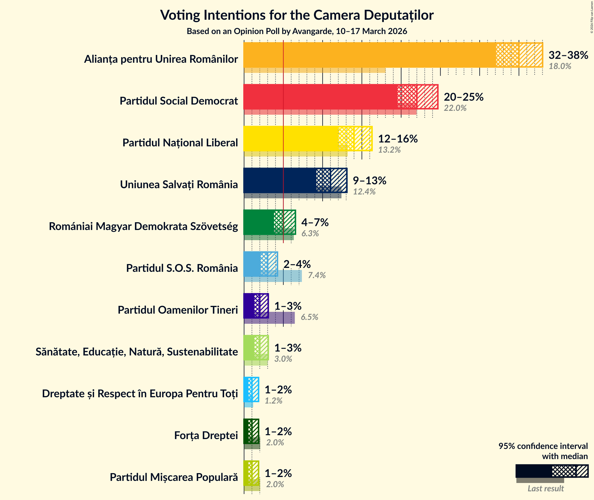

### Confidence Intervals

| Party | Last Result | Poll Result | 80% Confidence Interval | 90% Confidence Interval | 95% Confidence Interval | 99% Confidence Interval |
|:-----:|:-----------:|:-----------:|:-----------------------:|:-----------------------:|:-----------------------:|:-----------------------:|
| Alianța pentru Unirea Românilor | 18.0% | 35.0% | 33.1–37.0% |32.6–37.5% |32.1–38.0% |31.2–39.0% |
| Partidul Social Democrat | 22.0% | 22.0% | 20.4–23.7% |19.9–24.2% |19.5–24.7% |18.8–25.5% |
| Partidul Național Liberal | 13.2% | 14.0% | 12.7–15.5% |12.3–15.9% |12.0–16.3% |11.4–17.0% |
| Uniunea Salvați România | 12.4% | 11.0% | 9.8–12.4% |9.5–12.8% |9.2–13.1% |8.7–13.8% |
| Romániai Magyar Demokrata Szövetség | 6.3% | 5.0% | 4.2–6.0% |4.0–6.3% |3.8–6.5% |3.5–7.1% |
| Partidul S.O.S. România | 7.4% | 3.0% | 2.4–3.8% |2.2–4.1% |2.1–4.3% |1.9–4.7% |
| Sănătate, Educație, Natură, Sustenabilitate | 3.0% | 2.0% | 1.5–2.7% |1.4–2.9% |1.3–3.1% |1.1–3.4% |
| Partidul Oamenilor Tineri | 6.5% | 2.0% | 1.5–2.7% |1.4–2.9% |1.3–3.1% |1.1–3.4% |
| Dreptate și Respect în Europa Pentru Toți | 1.2% | 1.0% | 0.7–1.5% |0.6–1.7% |0.5–1.8% |0.4–2.1% |
| Forța Dreptei | 2.0% | 1.0% | 0.7–1.5% |0.6–1.7% |0.5–1.8% |0.4–2.1% |
| Partidul Mișcarea Populară | 2.0% | 1.0% | 0.7–1.5% |0.6–1.7% |0.5–1.8% |0.4–2.1% |

*Note:* The poll result column reflects the actual value used in the calculations. Published results may vary slightly, and in addition be rounded to fewer digits.

## Seats

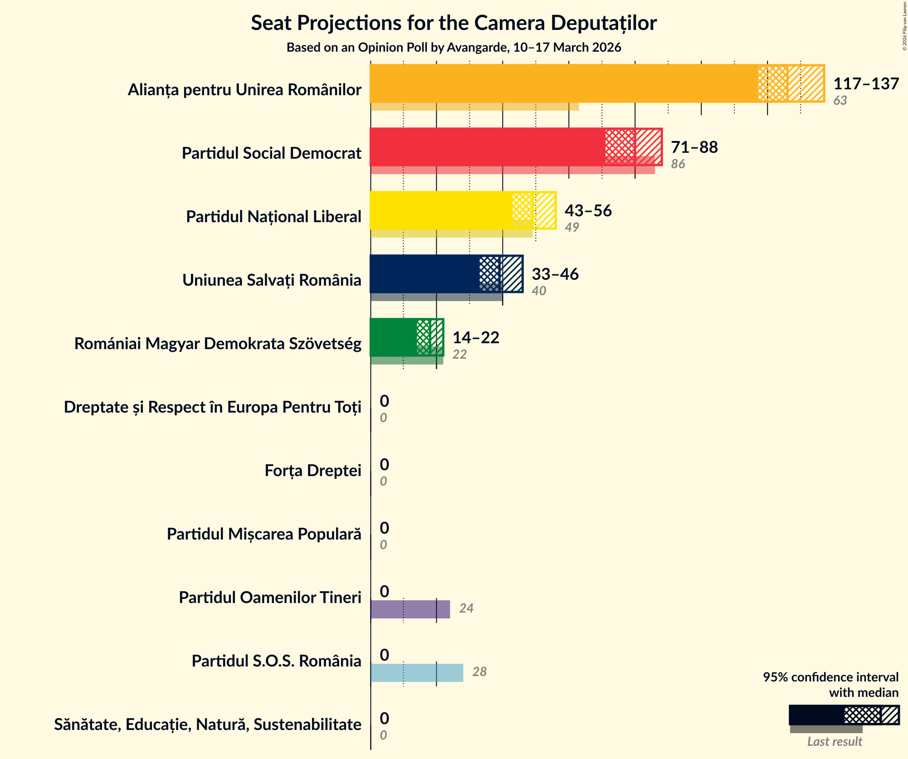

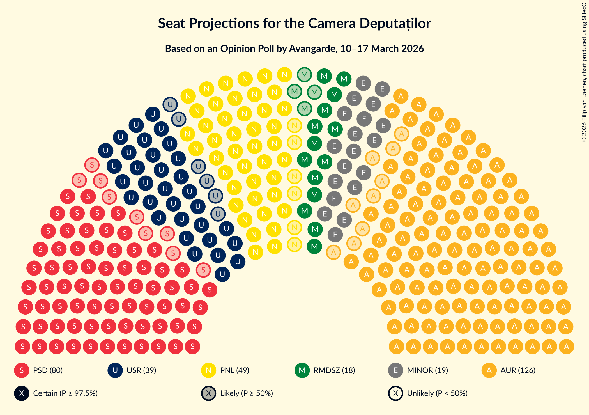

### Confidence Intervals

| Party | Last Result | Median | 80% Confidence Interval | 90% Confidence Interval | 95% Confidence Interval | 99% Confidence Interval |
|:-----:|:-----------:|:------:|:-----------------------:|:-----------------------:|:-----------------------:|:-----------------------:|
| <a href="#alianța-pentru-unirea-românilor">Alianța pentru Unirea Românilor</a> | 63 | 126 | 120–132 |118–134 |117–137 |113–139 |
| <a href="#partidul-social-democrat">Partidul Social Democrat</a> | 86 | 80 | 74–85 |72–87 |71–88 |68–91 |
| <a href="#partidul-național-liberal">Partidul Național Liberal</a> | 49 | 49 | 45–55 |43–56 |43–58 |41–61 |
| <a href="#uniunea-salvați-românia">Uniunea Salvați România</a> | 40 | 39 | 35–43 |34–45 |33–46 |31–49 |
| <a href="#romániai-magyar-demokrata-szövetség">Romániai Magyar Demokrata Szövetség</a> | 22 | 18 | 15–21 |14–22 |14–23 |13–25 |
| <a href="#partidul-s.o.s.-românia">Partidul S.O.S. România</a> | 28 | 0 | 0 |0 |0 |0 |
| <a href="#sănătate,-educație,-natură,-sustenabilitate">Sănătate, Educație, Natură, Sustenabilitate</a> | 0 | 0 | 0 |0 |0 |0 |
| <a href="#partidul-oamenilor-tineri">Partidul Oamenilor Tineri</a> | 24 | 0 | 0 |0 |0 |0 |
| <a href="#dreptate-și-respect-în-europa-pentru-toți">Dreptate și Respect în Europa Pentru Toți</a> | 0 | 0 | 0 |0 |0 |0 |
| <a href="#forța-dreptei">Forța Dreptei</a> | 0 | 0 | 0 |0 |0 |0 |
| <a href="#partidul-mișcarea-populară">Partidul Mișcarea Populară</a> | 0 | 0 | 0 |0 |0 |0 |

### Alianța pentru Unirea Românilor

*For a full overview of the results for this party, see the [Alianța pentru Unirea Românilor](party-alianțapentruunirearomânilor.html) page.*

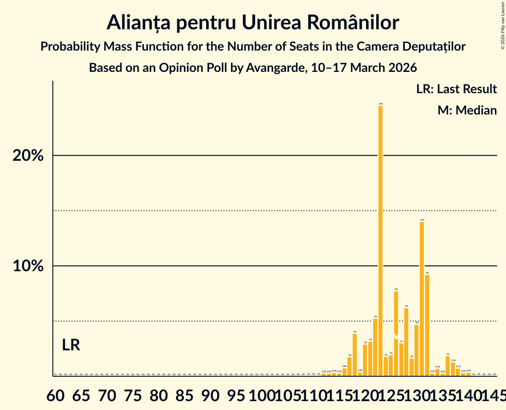

| Number of Seats | Probability | Accumulated | Special Marks |
|:---------------:|:-----------:|:-----------:|:-------------:|
| 63 | 0% | 100% | Last Result |
| 64 | 0% | 100% |  |
| 65 | 0% | 100% |  |
| 66 | 0% | 100% |  |
| 67 | 0% | 100% |  |
| 68 | 0% | 100% |  |
| 69 | 0% | 100% |  |
| 70 | 0% | 100% |  |
| 71 | 0% | 100% |  |
| 72 | 0% | 100% |  |
| 73 | 0% | 100% |  |
| 74 | 0% | 100% |  |
| 75 | 0% | 100% |  |
| 76 | 0% | 100% |  |
| 77 | 0% | 100% |  |
| 78 | 0% | 100% |  |
| 79 | 0% | 100% |  |
| 80 | 0% | 100% |  |
| 81 | 0% | 100% |  |
| 82 | 0% | 100% |  |
| 83 | 0% | 100% |  |
| 84 | 0% | 100% |  |
| 85 | 0% | 100% |  |
| 86 | 0% | 100% |  |
| 87 | 0% | 100% |  |
| 88 | 0% | 100% |  |
| 89 | 0% | 100% |  |
| 90 | 0% | 100% |  |
| 91 | 0% | 100% |  |
| 92 | 0% | 100% |  |
| 93 | 0% | 100% |  |
| 94 | 0% | 100% |  |
| 95 | 0% | 100% |  |
| 96 | 0% | 100% |  |
| 97 | 0% | 100% |  |
| 98 | 0% | 100% |  |
| 99 | 0% | 100% |  |
| 100 | 0% | 100% |  |
| 101 | 0% | 100% |  |
| 102 | 0% | 100% |  |
| 103 | 0% | 100% |  |
| 104 | 0% | 100% |  |
| 105 | 0% | 100% |  |
| 106 | 0% | 100% |  |
| 107 | 0% | 100% |  |
| 108 | 0% | 100% |  |
| 109 | 0% | 100% |  |
| 110 | 0% | 99.9% |  |
| 111 | 0% | 99.9% |  |
| 112 | 0.3% | 99.8% |  |
| 113 | 0.3% | 99.6% |  |
| 114 | 0.3% | 99.3% |  |
| 115 | 0.3% | 99.0% |  |
| 116 | 0.8% | 98.7% |  |
| 117 | 2% | 98% |  |
| 118 | 4% | 96% |  |
| 119 | 0.4% | 92% |  |
| 120 | 3% | 92% |  |
| 121 | 3% | 89% |  |
| 122 | 5% | 86% |  |
| 123 | 25% | 81% |  |
| 124 | 2% | 56% |  |
| 125 | 2% | 54% |  |
| 126 | 8% | 52% | Median |
| 127 | 3% | 45% |  |
| 128 | 6% | 42% |  |
| 129 | 2% | 35% |  |
| 130 | 5% | 34% |  |
| 131 | 14% | 29% |  |
| 132 | 9% | 15% |  |
| 133 | 0.3% | 6% |  |
| 134 | 0.7% | 6% |  |
| 135 | 0.3% | 5% |  |
| 136 | 2% | 5% |  |
| 137 | 1.3% | 3% |  |
| 138 | 0.7% | 2% |  |
| 139 | 0.3% | 0.8% |  |
| 140 | 0.4% | 0.5% |  |
| 141 | 0% | 0.1% |  |
| 142 | 0% | 0.1% |  |
| 143 | 0% | 0.1% |  |
| 144 | 0% | 0% |  |

### Partidul Social Democrat

*For a full overview of the results for this party, see the [Partidul Social Democrat](party-partidulsocialdemocrat.html) page.*

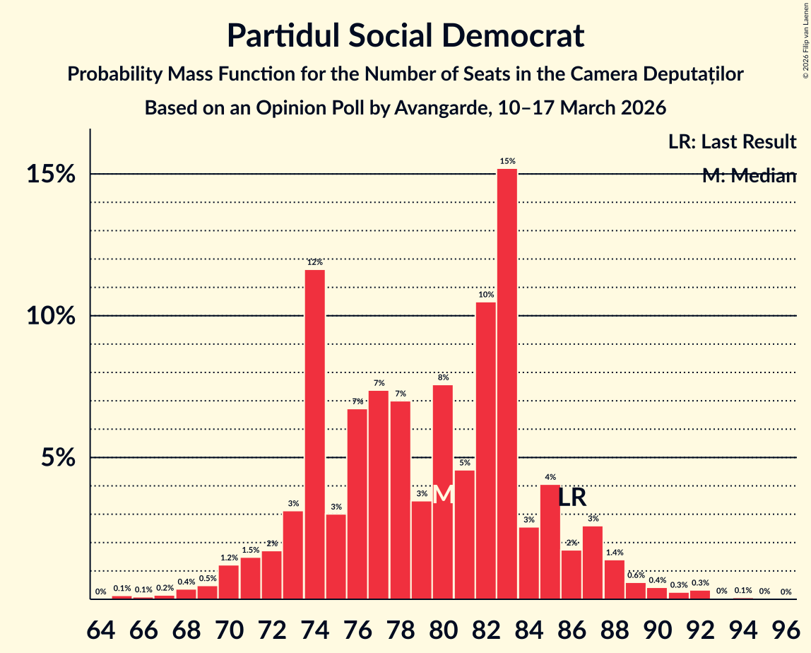

| Number of Seats | Probability | Accumulated | Special Marks |
|:---------------:|:-----------:|:-----------:|:-------------:|
| 65 | 0.1% | 100% |  |
| 66 | 0.1% | 99.8% |  |
| 67 | 0.2% | 99.7% |  |
| 68 | 0.4% | 99.6% |  |
| 69 | 0.5% | 99.2% |  |
| 70 | 1.2% | 98.7% |  |
| 71 | 1.5% | 98% |  |
| 72 | 2% | 96% |  |
| 73 | 3% | 94% |  |
| 74 | 12% | 91% |  |
| 75 | 3% | 80% |  |
| 76 | 7% | 77% |  |
| 77 | 7% | 70% |  |
| 78 | 7% | 62% |  |
| 79 | 3% | 55% |  |
| 80 | 8% | 52% | Median |
| 81 | 5% | 44% |  |
| 82 | 10% | 40% |  |
| 83 | 15% | 29% |  |
| 84 | 3% | 14% |  |
| 85 | 4% | 12% |  |
| 86 | 2% | 8% | Last Result |
| 87 | 3% | 6% |  |
| 88 | 1.4% | 3% |  |
| 89 | 0.6% | 2% |  |
| 90 | 0.4% | 1.2% |  |
| 91 | 0.3% | 0.8% |  |
| 92 | 0.3% | 0.5% |  |
| 93 | 0% | 0.2% |  |
| 94 | 0.1% | 0.1% |  |
| 95 | 0% | 0.1% |  |
| 96 | 0% | 0% |  |

### Partidul Național Liberal

*For a full overview of the results for this party, see the [Partidul Național Liberal](party-partidulnaționalliberal.html) page.*

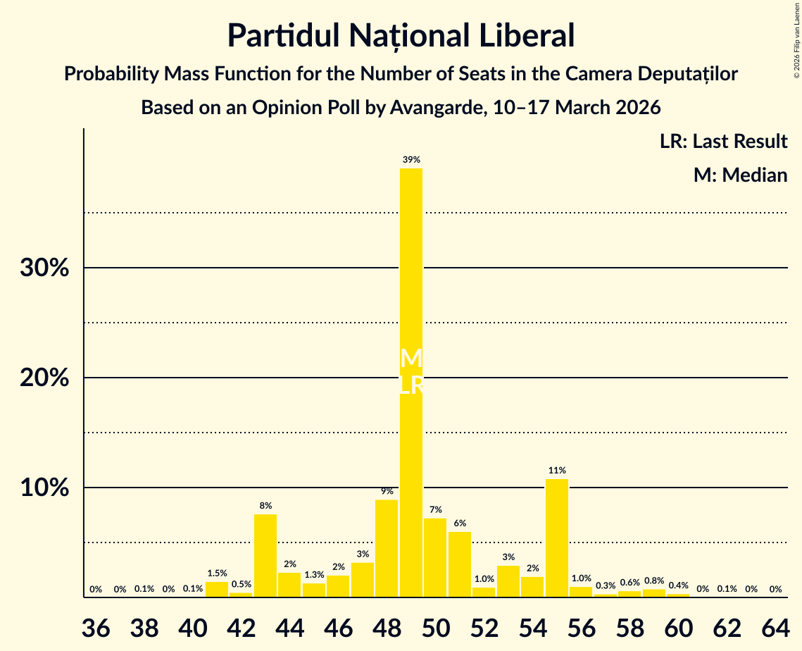

| Number of Seats | Probability | Accumulated | Special Marks |
|:---------------:|:-----------:|:-----------:|:-------------:|
| 38 | 0.1% | 100% |  |
| 39 | 0.2% | 99.9% |  |
| 40 | 0.2% | 99.7% |  |
| 41 | 1.0% | 99.5% |  |
| 42 | 0.7% | 98.5% |  |
| 43 | 5% | 98% |  |
| 44 | 3% | 93% |  |
| 45 | 4% | 90% |  |
| 46 | 7% | 86% |  |
| 47 | 3% | 80% |  |
| 48 | 8% | 77% |  |
| 49 | 29% | 69% | Last Result, Median |
| 50 | 6% | 40% |  |
| 51 | 6% | 34% |  |
| 52 | 5% | 28% |  |
| 53 | 4% | 23% |  |
| 54 | 3% | 19% |  |
| 55 | 10% | 16% |  |
| 56 | 4% | 7% |  |
| 57 | 0.6% | 3% |  |
| 58 | 0.7% | 3% |  |
| 59 | 0.8% | 2% |  |
| 60 | 0.6% | 1.1% |  |
| 61 | 0.4% | 0.6% |  |
| 62 | 0.1% | 0.2% |  |
| 63 | 0% | 0.1% |  |
| 64 | 0% | 0% |  |

### Uniunea Salvați România

*For a full overview of the results for this party, see the [Uniunea Salvați România](party-uniuneasalvațiromânia.html) page.*

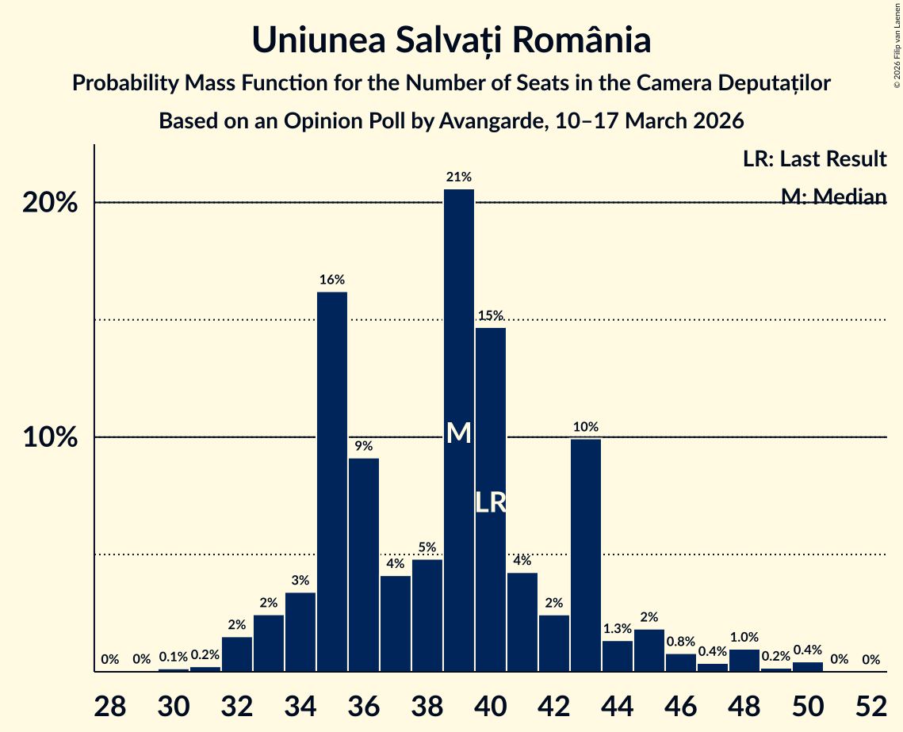

| Number of Seats | Probability | Accumulated | Special Marks |
|:---------------:|:-----------:|:-----------:|:-------------:|
| 29 | 0.1% | 100% |  |
| 30 | 0.2% | 99.9% |  |
| 31 | 0.4% | 99.8% |  |
| 32 | 1.0% | 99.4% |  |
| 33 | 2% | 98% |  |
| 34 | 2% | 96% |  |
| 35 | 15% | 94% |  |
| 36 | 8% | 79% |  |
| 37 | 5% | 71% |  |
| 38 | 9% | 66% |  |
| 39 | 18% | 58% | Median |
| 40 | 10% | 40% | Last Result |
| 41 | 9% | 30% |  |
| 42 | 4% | 20% |  |
| 43 | 7% | 16% |  |
| 44 | 3% | 9% |  |
| 45 | 3% | 6% |  |
| 46 | 1.5% | 4% |  |
| 47 | 0.7% | 2% |  |
| 48 | 0.8% | 1.5% |  |
| 49 | 0.2% | 0.7% |  |
| 50 | 0.3% | 0.5% |  |
| 51 | 0.1% | 0.2% |  |
| 52 | 0% | 0% |  |

### Romániai Magyar Demokrata Szövetség

*For a full overview of the results for this party, see the [Romániai Magyar Demokrata Szövetség](party-romániaimagyardemokrataszövetség.html) page.*

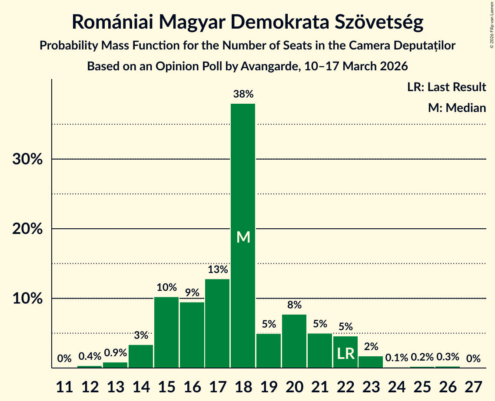

| Number of Seats | Probability | Accumulated | Special Marks |
|:---------------:|:-----------:|:-----------:|:-------------:|
| 11 | 0.1% | 100% |  |
| 12 | 0.4% | 99.9% |  |
| 13 | 1.2% | 99.5% |  |
| 14 | 4% | 98% |  |
| 15 | 10% | 94% |  |
| 16 | 13% | 85% |  |
| 17 | 11% | 72% |  |
| 18 | 30% | 61% | Median |
| 19 | 7% | 31% |  |
| 20 | 11% | 23% |  |
| 21 | 5% | 12% |  |
| 22 | 4% | 7% | Last Result |
| 23 | 2% | 3% |  |
| 24 | 0.5% | 1.0% |  |
| 25 | 0.3% | 0.6% |  |
| 26 | 0.2% | 0.3% |  |
| 27 | 0.1% | 0.1% |  |
| 28 | 0% | 0% |  |

### Partidul S.O.S. România

*For a full overview of the results for this party, see the [Partidul S.O.S. România](party-partidulsosromânia.html) page.*

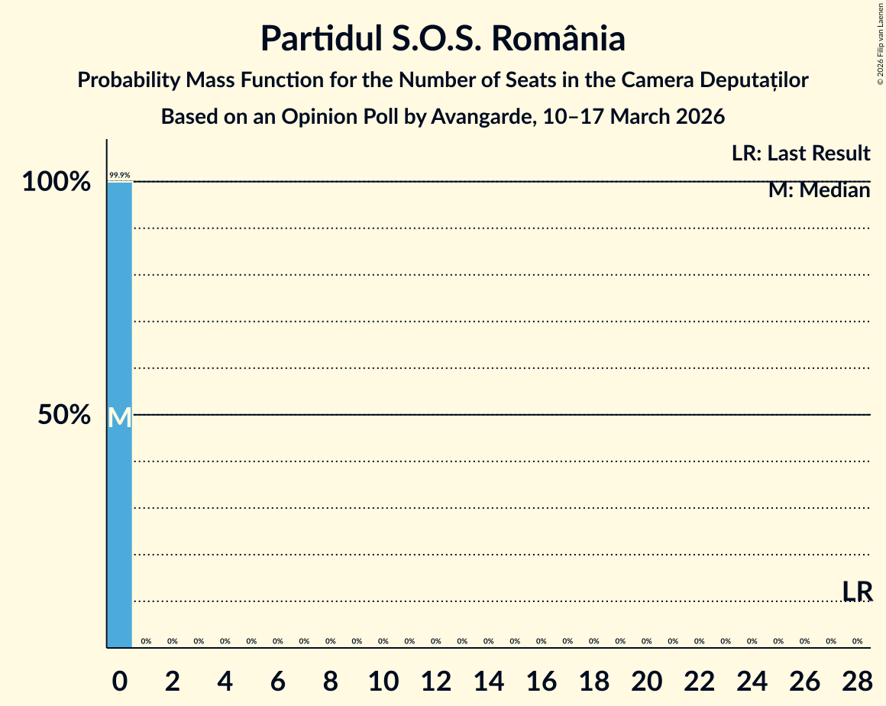

| Number of Seats | Probability | Accumulated | Special Marks |
|:---------------:|:-----------:|:-----------:|:-------------:|
| 0 | 99.9% | 100% | Median |
| 1 | 0% | 0.1% |  |
| 2 | 0% | 0.1% |  |
| 3 | 0% | 0.1% |  |
| 4 | 0% | 0.1% |  |
| 5 | 0% | 0.1% |  |
| 6 | 0% | 0.1% |  |
| 7 | 0% | 0.1% |  |
| 8 | 0% | 0.1% |  |
| 9 | 0% | 0.1% |  |
| 10 | 0% | 0.1% |  |
| 11 | 0% | 0.1% |  |
| 12 | 0% | 0.1% |  |
| 13 | 0% | 0.1% |  |
| 14 | 0% | 0.1% |  |
| 15 | 0% | 0.1% |  |
| 16 | 0% | 0.1% |  |
| 17 | 0% | 0.1% |  |
| 18 | 0% | 0% |  |
| 19 | 0% | 0% |  |
| 20 | 0% | 0% |  |
| 21 | 0% | 0% |  |
| 22 | 0% | 0% |  |
| 23 | 0% | 0% |  |
| 24 | 0% | 0% |  |
| 25 | 0% | 0% |  |
| 26 | 0% | 0% |  |
| 27 | 0% | 0% |  |
| 28 | 0% | 0% | Last Result |

### Sănătate, Educație, Natură, Sustenabilitate

*For a full overview of the results for this party, see the [Sănătate, Educație, Natură, Sustenabilitate](party-sănătateeducațienaturăsustenabilitate.html) page.*

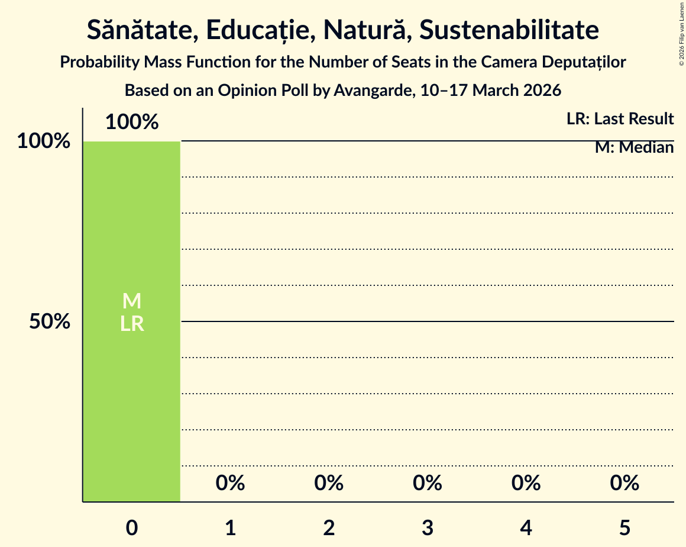

| Number of Seats | Probability | Accumulated | Special Marks |
|:---------------:|:-----------:|:-----------:|:-------------:|
| 0 | 100% | 100% | Last Result, Median |

### Partidul Oamenilor Tineri

*For a full overview of the results for this party, see the [Partidul Oamenilor Tineri](party-partiduloamenilortineri.html) page.*

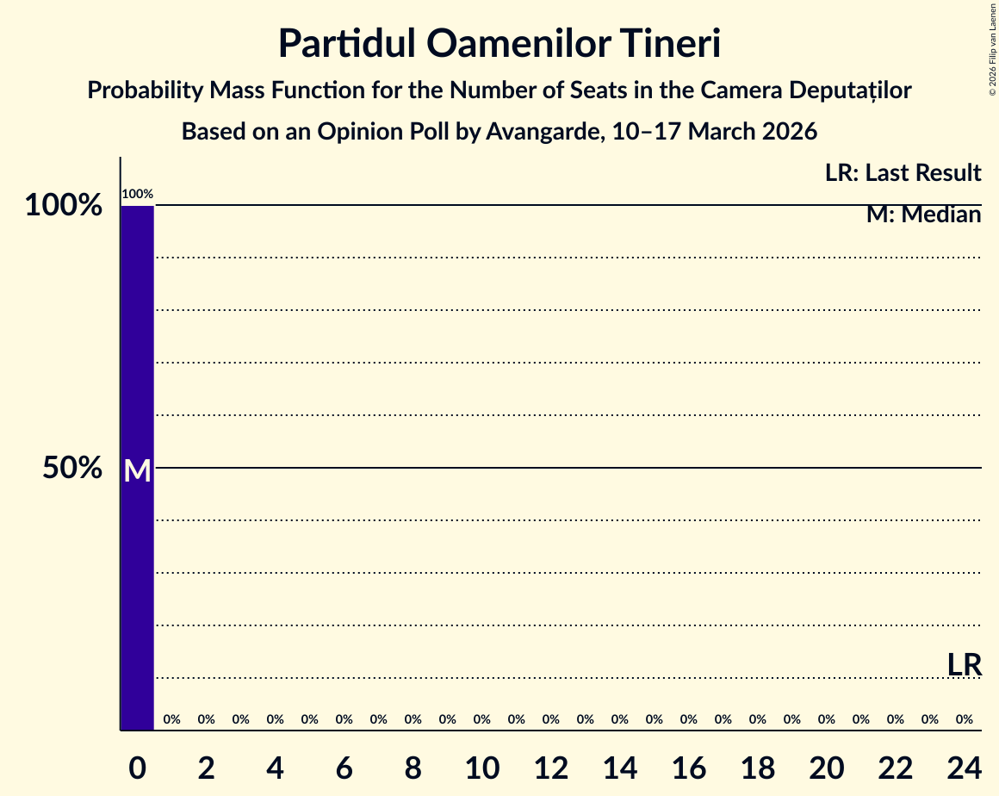

| Number of Seats | Probability | Accumulated | Special Marks |
|:---------------:|:-----------:|:-----------:|:-------------:|
| 0 | 100% | 100% | Median |
| 1 | 0% | 0% |  |
| 2 | 0% | 0% |  |
| 3 | 0% | 0% |  |
| 4 | 0% | 0% |  |
| 5 | 0% | 0% |  |
| 6 | 0% | 0% |  |
| 7 | 0% | 0% |  |
| 8 | 0% | 0% |  |
| 9 | 0% | 0% |  |
| 10 | 0% | 0% |  |
| 11 | 0% | 0% |  |
| 12 | 0% | 0% |  |
| 13 | 0% | 0% |  |
| 14 | 0% | 0% |  |
| 15 | 0% | 0% |  |
| 16 | 0% | 0% |  |
| 17 | 0% | 0% |  |
| 18 | 0% | 0% |  |
| 19 | 0% | 0% |  |
| 20 | 0% | 0% |  |
| 21 | 0% | 0% |  |
| 22 | 0% | 0% |  |
| 23 | 0% | 0% |  |
| 24 | 0% | 0% | Last Result |

### Dreptate și Respect în Europa Pentru Toți

*For a full overview of the results for this party, see the [Dreptate și Respect în Europa Pentru Toți](party-dreptateșirespectîneuropapentrutoți.html) page.*

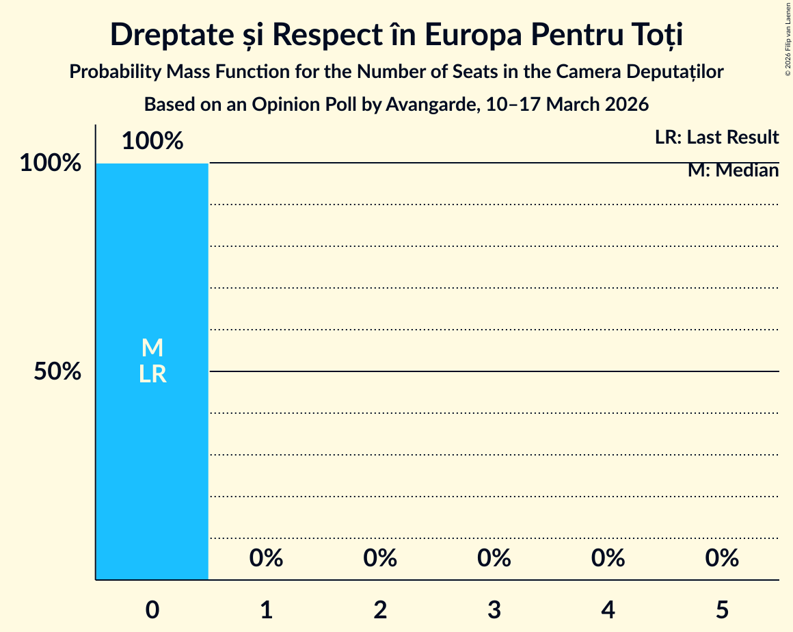

| Number of Seats | Probability | Accumulated | Special Marks |
|:---------------:|:-----------:|:-----------:|:-------------:|
| 0 | 100% | 100% | Last Result, Median |

### Forța Dreptei

*For a full overview of the results for this party, see the [Forța Dreptei](party-forțadreptei.html) page.*

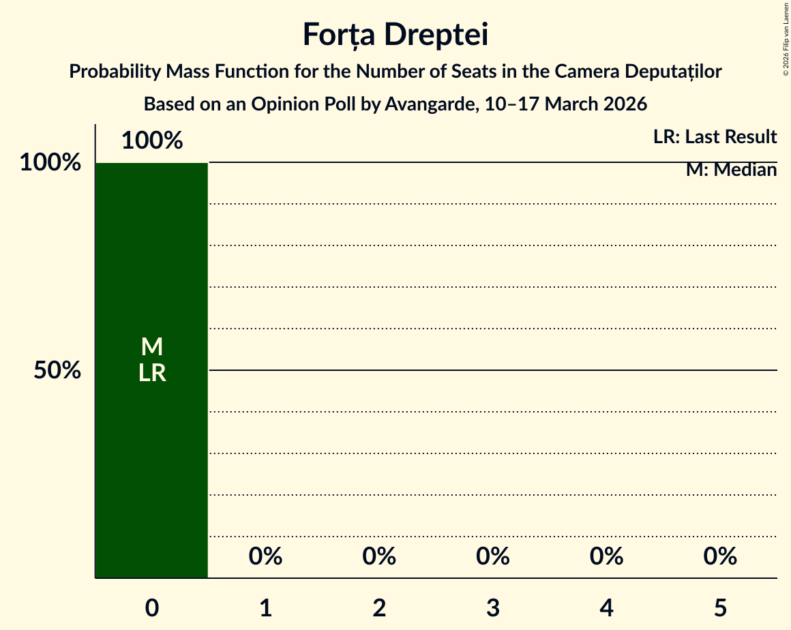

| Number of Seats | Probability | Accumulated | Special Marks |
|:---------------:|:-----------:|:-----------:|:-------------:|
| 0 | 100% | 100% | Last Result, Median |

### Partidul Mișcarea Populară

*For a full overview of the results for this party, see the [Partidul Mișcarea Populară](party-partidulmișcareapopulară.html) page.*

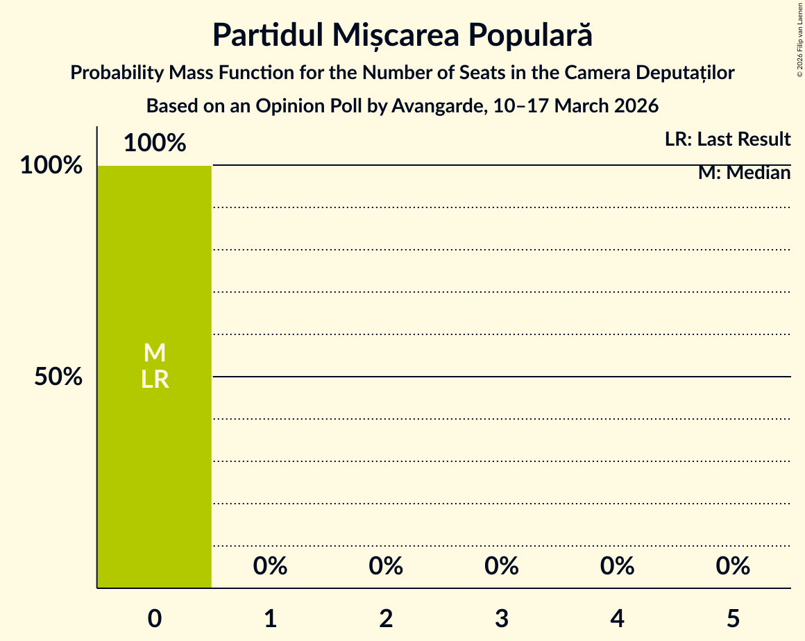

| Number of Seats | Probability | Accumulated | Special Marks |
|:---------------:|:-----------:|:-----------:|:-------------:|
| 0 | 100% | 100% | Last Result, Median |

## Coalitions

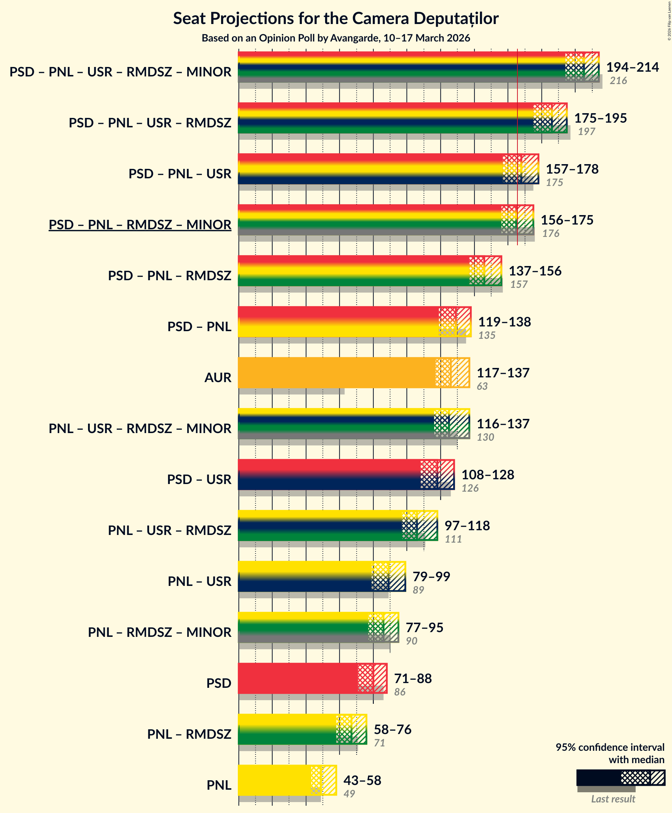

### Confidence Intervals

| Coalition | Last Result | Median | Majority? | 80% Confidence Interval | 90% Confidence Interval | 95% Confidence Interval | 99% Confidence Interval |
|:---------:|:-----------:|:------:|:---------:|:-----------------------:|:-----------------------:|:-----------------------:|:-----------------------:|
| Partidul Social Democrat – Partidul Național Liberal – Uniunea Salvați România – Romániai Magyar Demokrata Szövetség | 197 | 186 | 100% | 180–192 | 178–194 | 175–195 | 173–199 |
| Partidul Social Democrat – Partidul Național Liberal – Uniunea Salvați România | 175 | 168 | 62% | 162–174 | 160–176 | 157–178 | 154–181 |
| Partidul Social Democrat – Partidul Național Liberal – Romániai Magyar Demokrata Szövetség | 157 | 146 | 0% | 141–154 | 139–155 | 137–156 | 133–161 |
| Partidul Social Democrat – Partidul Național Liberal | 135 | 129 | 0% | 123–136 | 121–137 | 119–138 | 116–142 |
| Alianța pentru Unirea Românilor | 63 | 126 | 0% | 120–132 | 118–134 | 117–137 | 113–139 |
| Partidul Social Democrat – Uniunea Salvați România | 126 | 118 | 0% | 111–125 | 109–126 | 108–128 | 105–132 |
| Partidul Național Liberal – Uniunea Salvați România – Romániai Magyar Demokrata Szövetség | 111 | 106 | 0% | 100–113 | 97–116 | 97–118 | 95–120 |
| Partidul Național Liberal – Uniunea Salvați România | 89 | 89 | 0% | 83–95 | 80–97 | 79–99 | 77–102 |
| Partidul Social Democrat | 86 | 80 | 0% | 74–85 | 72–87 | 71–88 | 68–91 |
| Partidul Național Liberal – Romániai Magyar Demokrata Szövetség | 71 | 67 | 0% | 63–74 | 61–75 | 58–76 | 57–80 |
| Partidul Național Liberal | 49 | 49 | 0% | 45–55 | 43–56 | 43–58 | 41–61 |

### Partidul Social Democrat – Partidul Național Liberal – Uniunea Salvați România – Romániai Magyar Demokrata Szövetség

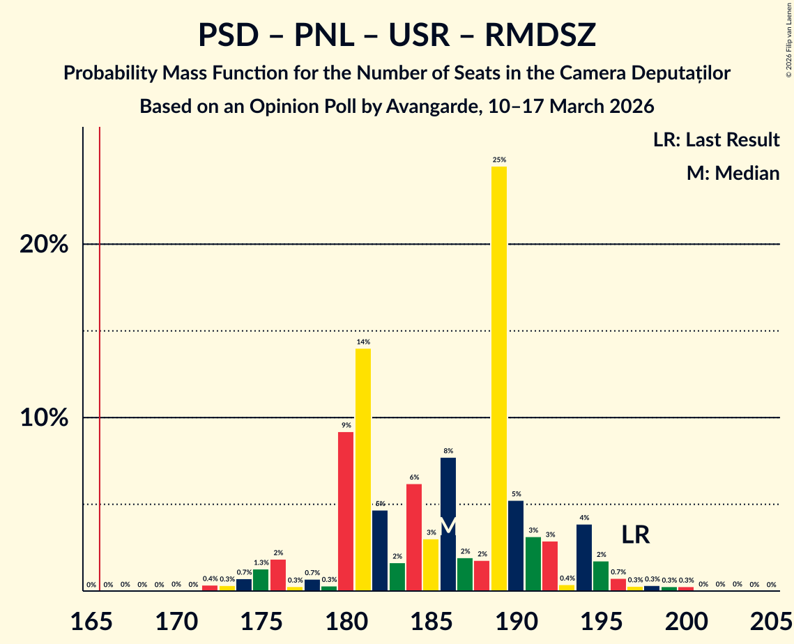

| Number of Seats | Probability | Accumulated | Special Marks |
|:---------------:|:-----------:|:-----------:|:-------------:|
| 168 | 0% | 100% |  |
| 169 | 0% | 99.9% |  |
| 170 | 0% | 99.9% |  |
| 171 | 0% | 99.9% |  |
| 172 | 0.4% | 99.9% |  |
| 173 | 0.3% | 99.5% |  |
| 174 | 0.7% | 99.2% |  |
| 175 | 1.3% | 98% |  |
| 176 | 2% | 97% |  |
| 177 | 0.3% | 95% |  |
| 178 | 0.7% | 95% |  |
| 179 | 0.3% | 94% |  |
| 180 | 9% | 94% |  |
| 181 | 14% | 85% |  |
| 182 | 5% | 71% |  |
| 183 | 2% | 66% |  |
| 184 | 6% | 65% |  |
| 185 | 3% | 58% |  |
| 186 | 8% | 55% | Median |
| 187 | 2% | 48% |  |
| 188 | 2% | 46% |  |
| 189 | 25% | 44% |  |
| 190 | 5% | 19% |  |
| 191 | 3% | 14% |  |
| 192 | 3% | 11% |  |
| 193 | 0.4% | 8% |  |
| 194 | 4% | 8% |  |
| 195 | 2% | 4% |  |
| 196 | 0.7% | 2% |  |
| 197 | 0.3% | 1.3% | Last Result |
| 198 | 0.3% | 1.0% |  |
| 199 | 0.3% | 0.7% |  |
| 200 | 0.3% | 0.4% |  |
| 201 | 0% | 0.1% |  |
| 202 | 0% | 0.1% |  |
| 203 | 0% | 0.1% |  |
| 204 | 0% | 0% |  |

### Partidul Social Democrat – Partidul Național Liberal – Uniunea Salvați România

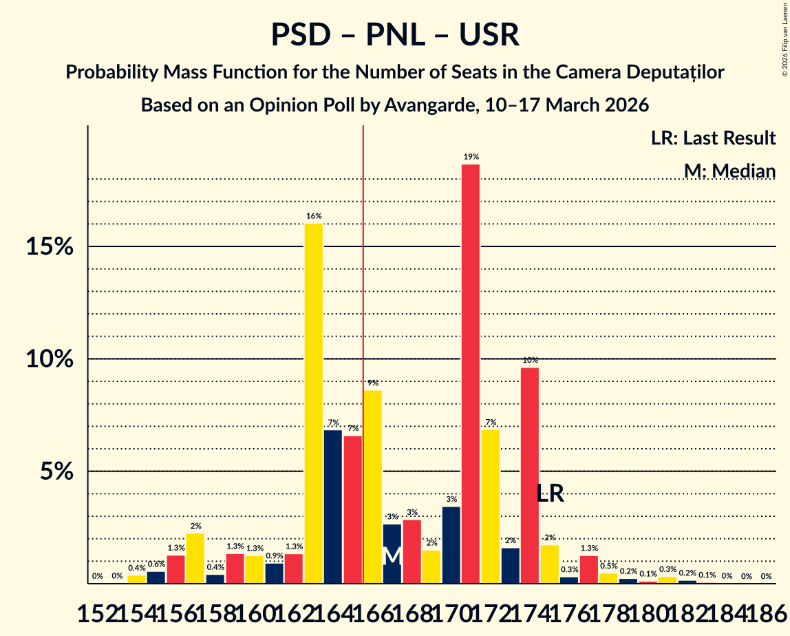

| Number of Seats | Probability | Accumulated | Special Marks |
|:---------------:|:-----------:|:-----------:|:-------------:|
| 151 | 0% | 100% |  |
| 152 | 0% | 99.9% |  |
| 153 | 0% | 99.9% |  |
| 154 | 0.4% | 99.9% |  |
| 155 | 0.3% | 99.5% |  |
| 156 | 0.9% | 99.1% |  |
| 157 | 2% | 98% |  |
| 158 | 0.4% | 97% |  |
| 159 | 1.0% | 96% |  |
| 160 | 1.0% | 95% |  |
| 161 | 0.9% | 94% |  |
| 162 | 5% | 93% |  |
| 163 | 13% | 88% |  |
| 164 | 7% | 75% |  |
| 165 | 6% | 68% |  |
| 166 | 6% | 62% | Majority |
| 167 | 4% | 55% |  |
| 168 | 3% | 51% | Median |
| 169 | 3% | 48% |  |
| 170 | 4% | 45% |  |
| 171 | 13% | 41% |  |
| 172 | 5% | 27% |  |
| 173 | 8% | 22% |  |
| 174 | 7% | 15% |  |
| 175 | 3% | 8% | Last Result |
| 176 | 0.8% | 5% |  |
| 177 | 2% | 4% |  |
| 178 | 0.5% | 3% |  |
| 179 | 0.7% | 2% |  |
| 180 | 0.6% | 1.3% |  |
| 181 | 0.3% | 0.7% |  |
| 182 | 0.2% | 0.4% |  |
| 183 | 0.1% | 0.2% |  |
| 184 | 0% | 0.1% |  |
| 185 | 0% | 0.1% |  |
| 186 | 0% | 0% |  |

### Partidul Social Democrat – Partidul Național Liberal – Romániai Magyar Demokrata Szövetség

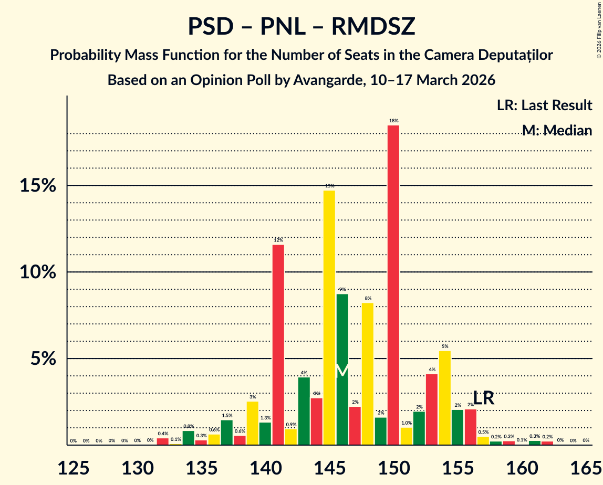

| Number of Seats | Probability | Accumulated | Special Marks |
|:---------------:|:-----------:|:-----------:|:-------------:|
| 129 | 0% | 100% |  |
| 130 | 0% | 99.9% |  |
| 131 | 0% | 99.9% |  |
| 132 | 0.3% | 99.9% |  |
| 133 | 0.1% | 99.6% |  |
| 134 | 0.7% | 99.5% |  |
| 135 | 0.2% | 98.8% |  |
| 136 | 0.6% | 98.5% |  |
| 137 | 1.2% | 98% |  |
| 138 | 0.8% | 97% |  |
| 139 | 2% | 96% |  |
| 140 | 1.5% | 93% |  |
| 141 | 7% | 92% |  |
| 142 | 3% | 85% |  |
| 143 | 7% | 81% |  |
| 144 | 3% | 74% |  |
| 145 | 11% | 71% |  |
| 146 | 11% | 60% |  |
| 147 | 2% | 49% | Median |
| 148 | 11% | 46% |  |
| 149 | 1.5% | 36% |  |
| 150 | 15% | 34% |  |
| 151 | 2% | 19% |  |
| 152 | 3% | 17% |  |
| 153 | 3% | 14% |  |
| 154 | 4% | 11% |  |
| 155 | 2% | 7% |  |
| 156 | 2% | 4% |  |
| 157 | 0.7% | 2% | Last Result |
| 158 | 0.2% | 1.3% |  |
| 159 | 0.4% | 1.0% |  |
| 160 | 0.1% | 0.7% |  |
| 161 | 0.2% | 0.6% |  |
| 162 | 0.2% | 0.4% |  |
| 163 | 0% | 0.2% |  |
| 164 | 0.1% | 0.1% |  |
| 165 | 0% | 0.1% |  |
| 166 | 0% | 0% | Majority |

### Partidul Social Democrat – Partidul Național Liberal

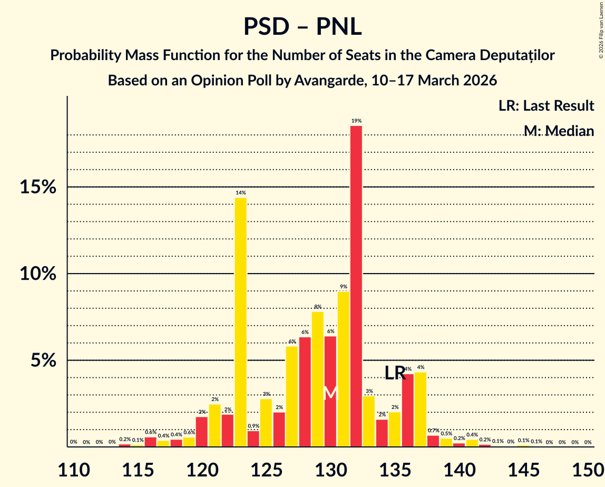

| Number of Seats | Probability | Accumulated | Special Marks |
|:---------------:|:-----------:|:-----------:|:-------------:|
| 112 | 0% | 100% |  |
| 113 | 0% | 99.9% |  |
| 114 | 0.1% | 99.9% |  |
| 115 | 0.1% | 99.8% |  |
| 116 | 0.4% | 99.7% |  |
| 117 | 0.3% | 99.3% |  |
| 118 | 0.5% | 98.9% |  |
| 119 | 1.1% | 98% |  |
| 120 | 1.4% | 97% |  |
| 121 | 2% | 96% |  |
| 122 | 2% | 94% |  |
| 123 | 13% | 92% |  |
| 124 | 2% | 79% |  |
| 125 | 3% | 77% |  |
| 126 | 4% | 74% |  |
| 127 | 7% | 71% |  |
| 128 | 9% | 64% |  |
| 129 | 7% | 55% | Median |
| 130 | 5% | 48% |  |
| 131 | 6% | 44% |  |
| 132 | 17% | 37% |  |
| 133 | 5% | 20% |  |
| 134 | 2% | 15% |  |
| 135 | 2% | 13% | Last Result |
| 136 | 4% | 11% |  |
| 137 | 3% | 7% |  |
| 138 | 1.4% | 4% |  |
| 139 | 0.9% | 2% |  |
| 140 | 0.6% | 2% |  |
| 141 | 0.6% | 1.1% |  |
| 142 | 0.2% | 0.5% |  |
| 143 | 0.1% | 0.3% |  |
| 144 | 0.1% | 0.2% |  |
| 145 | 0.1% | 0.2% |  |
| 146 | 0% | 0.1% |  |
| 147 | 0% | 0% |  |

### Alianța pentru Unirea Românilor

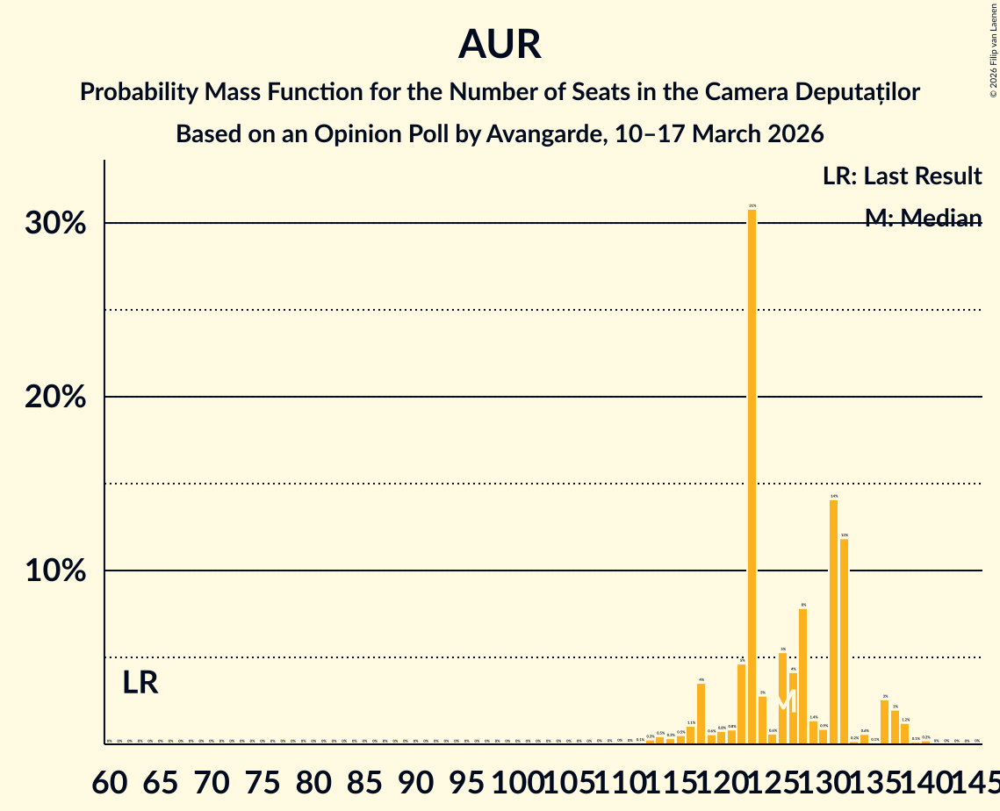

| Number of Seats | Probability | Accumulated | Special Marks |
|:---------------:|:-----------:|:-----------:|:-------------:|
| 63 | 0% | 100% | Last Result |
| 64 | 0% | 100% |  |
| 65 | 0% | 100% |  |
| 66 | 0% | 100% |  |
| 67 | 0% | 100% |  |
| 68 | 0% | 100% |  |
| 69 | 0% | 100% |  |
| 70 | 0% | 100% |  |
| 71 | 0% | 100% |  |
| 72 | 0% | 100% |  |
| 73 | 0% | 100% |  |
| 74 | 0% | 100% |  |
| 75 | 0% | 100% |  |
| 76 | 0% | 100% |  |
| 77 | 0% | 100% |  |
| 78 | 0% | 100% |  |
| 79 | 0% | 100% |  |
| 80 | 0% | 100% |  |
| 81 | 0% | 100% |  |
| 82 | 0% | 100% |  |
| 83 | 0% | 100% |  |
| 84 | 0% | 100% |  |
| 85 | 0% | 100% |  |
| 86 | 0% | 100% |  |
| 87 | 0% | 100% |  |
| 88 | 0% | 100% |  |
| 89 | 0% | 100% |  |
| 90 | 0% | 100% |  |
| 91 | 0% | 100% |  |
| 92 | 0% | 100% |  |
| 93 | 0% | 100% |  |
| 94 | 0% | 100% |  |
| 95 | 0% | 100% |  |
| 96 | 0% | 100% |  |
| 97 | 0% | 100% |  |
| 98 | 0% | 100% |  |
| 99 | 0% | 100% |  |
| 100 | 0% | 100% |  |
| 101 | 0% | 100% |  |
| 102 | 0% | 100% |  |
| 103 | 0% | 100% |  |
| 104 | 0% | 100% |  |
| 105 | 0% | 100% |  |
| 106 | 0% | 100% |  |
| 107 | 0% | 100% |  |
| 108 | 0% | 100% |  |
| 109 | 0% | 100% |  |
| 110 | 0% | 99.9% |  |
| 111 | 0% | 99.9% |  |
| 112 | 0.3% | 99.8% |  |
| 113 | 0.3% | 99.6% |  |
| 114 | 0.3% | 99.3% |  |
| 115 | 0.3% | 99.0% |  |
| 116 | 0.8% | 98.7% |  |
| 117 | 2% | 98% |  |
| 118 | 4% | 96% |  |
| 119 | 0.4% | 92% |  |
| 120 | 3% | 92% |  |
| 121 | 3% | 89% |  |
| 122 | 5% | 86% |  |
| 123 | 25% | 81% |  |
| 124 | 2% | 56% |  |
| 125 | 2% | 54% |  |
| 126 | 8% | 52% | Median |
| 127 | 3% | 45% |  |
| 128 | 6% | 42% |  |
| 129 | 2% | 35% |  |
| 130 | 5% | 34% |  |
| 131 | 14% | 29% |  |
| 132 | 9% | 15% |  |
| 133 | 0.3% | 6% |  |
| 134 | 0.7% | 6% |  |
| 135 | 0.3% | 5% |  |
| 136 | 2% | 5% |  |
| 137 | 1.3% | 3% |  |
| 138 | 0.7% | 2% |  |
| 139 | 0.3% | 0.8% |  |
| 140 | 0.4% | 0.5% |  |
| 141 | 0% | 0.1% |  |
| 142 | 0% | 0.1% |  |
| 143 | 0% | 0.1% |  |
| 144 | 0% | 0% |  |

### Partidul Social Democrat – Uniunea Salvați România

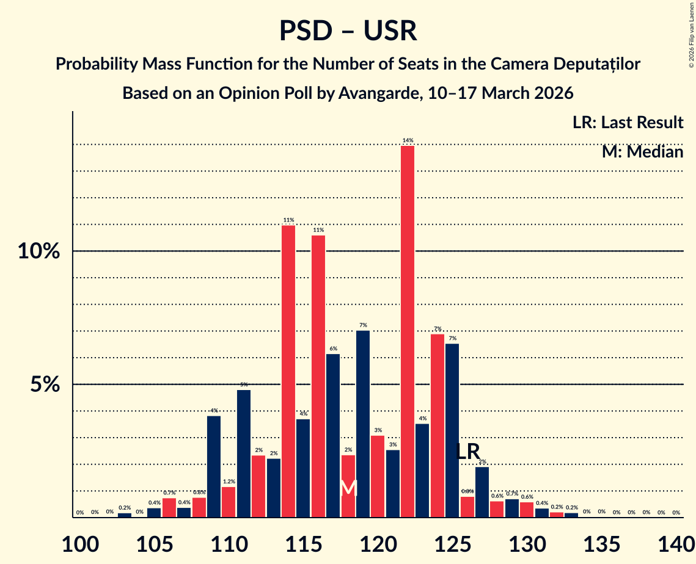

| Number of Seats | Probability | Accumulated | Special Marks |
|:---------------:|:-----------:|:-----------:|:-------------:|
| 102 | 0% | 100% |  |
| 103 | 0.2% | 99.9% |  |
| 104 | 0% | 99.7% |  |
| 105 | 0.4% | 99.7% |  |
| 106 | 0.7% | 99.3% |  |
| 107 | 0.4% | 98.6% |  |
| 108 | 0.8% | 98% |  |
| 109 | 4% | 97% |  |
| 110 | 1.2% | 94% |  |
| 111 | 5% | 92% |  |
| 112 | 2% | 88% |  |
| 113 | 2% | 85% |  |
| 114 | 11% | 83% |  |
| 115 | 4% | 72% |  |
| 116 | 11% | 68% |  |
| 117 | 6% | 58% |  |
| 118 | 2% | 52% |  |
| 119 | 7% | 49% | Median |
| 120 | 3% | 42% |  |
| 121 | 3% | 39% |  |
| 122 | 14% | 37% |  |
| 123 | 4% | 23% |  |
| 124 | 7% | 19% |  |
| 125 | 7% | 12% |  |
| 126 | 0.8% | 6% | Last Result |
| 127 | 2% | 5% |  |
| 128 | 0.6% | 3% |  |
| 129 | 0.7% | 2% |  |
| 130 | 0.6% | 2% |  |
| 131 | 0.4% | 0.9% |  |
| 132 | 0.2% | 0.5% |  |
| 133 | 0.2% | 0.3% |  |
| 134 | 0% | 0.1% |  |
| 135 | 0% | 0.1% |  |
| 136 | 0% | 0% |  |

### Partidul Național Liberal – Uniunea Salvați România – Romániai Magyar Demokrata Szövetség

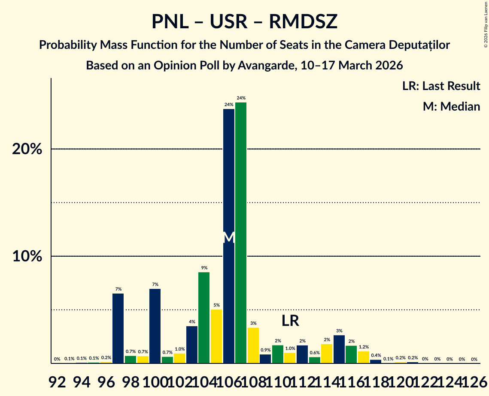

| Number of Seats | Probability | Accumulated | Special Marks |
|:---------------:|:-----------:|:-----------:|:-------------:|
| 91 | 0% | 100% |  |
| 92 | 0.1% | 99.9% |  |
| 93 | 0.1% | 99.8% |  |
| 94 | 0.2% | 99.8% |  |
| 95 | 0.2% | 99.6% |  |
| 96 | 0.3% | 99.4% |  |
| 97 | 4% | 99.1% |  |
| 98 | 2% | 95% |  |
| 99 | 2% | 93% |  |
| 100 | 4% | 91% |  |
| 101 | 0.7% | 87% |  |
| 102 | 2% | 87% |  |
| 103 | 3% | 85% |  |
| 104 | 8% | 82% |  |
| 105 | 12% | 74% |  |
| 106 | 19% | 62% | Median |
| 107 | 15% | 43% |  |
| 108 | 5% | 27% |  |
| 109 | 3% | 23% |  |
| 110 | 2% | 19% |  |
| 111 | 2% | 18% | Last Result |
| 112 | 2% | 16% |  |
| 113 | 4% | 14% |  |
| 114 | 2% | 10% |  |
| 115 | 2% | 8% |  |
| 116 | 1.4% | 6% |  |
| 117 | 0.9% | 4% |  |
| 118 | 3% | 3% |  |
| 119 | 0.3% | 0.9% |  |
| 120 | 0.1% | 0.6% |  |
| 121 | 0.3% | 0.5% |  |
| 122 | 0.1% | 0.2% |  |
| 123 | 0% | 0.1% |  |
| 124 | 0% | 0.1% |  |
| 125 | 0% | 0% |  |

### Partidul Național Liberal – Uniunea Salvați România

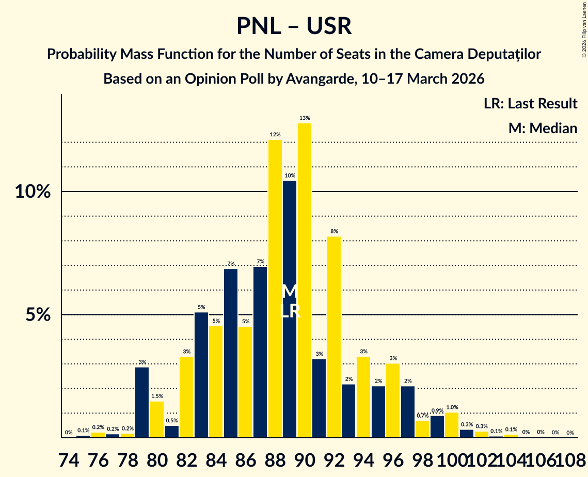

| Number of Seats | Probability | Accumulated | Special Marks |
|:---------------:|:-----------:|:-----------:|:-------------:|
| 75 | 0.1% | 100% |  |
| 76 | 0.2% | 99.9% |  |
| 77 | 0.2% | 99.6% |  |
| 78 | 0.2% | 99.5% |  |
| 79 | 3% | 99.3% |  |
| 80 | 1.5% | 96% |  |
| 81 | 0.5% | 95% |  |
| 82 | 3% | 94% |  |
| 83 | 5% | 91% |  |
| 84 | 5% | 86% |  |
| 85 | 7% | 81% |  |
| 86 | 5% | 75% |  |
| 87 | 7% | 70% |  |
| 88 | 12% | 63% | Median |
| 89 | 10% | 51% | Last Result |
| 90 | 13% | 41% |  |
| 91 | 3% | 28% |  |
| 92 | 8% | 25% |  |
| 93 | 2% | 16% |  |
| 94 | 3% | 14% |  |
| 95 | 2% | 11% |  |
| 96 | 3% | 9% |  |
| 97 | 2% | 6% |  |
| 98 | 0.7% | 4% |  |
| 99 | 0.9% | 3% |  |
| 100 | 1.0% | 2% |  |
| 101 | 0.3% | 0.9% |  |
| 102 | 0.3% | 0.6% |  |
| 103 | 0.1% | 0.3% |  |
| 104 | 0.1% | 0.2% |  |
| 105 | 0% | 0.1% |  |
| 106 | 0% | 0.1% |  |
| 107 | 0% | 0% |  |

### Partidul Social Democrat

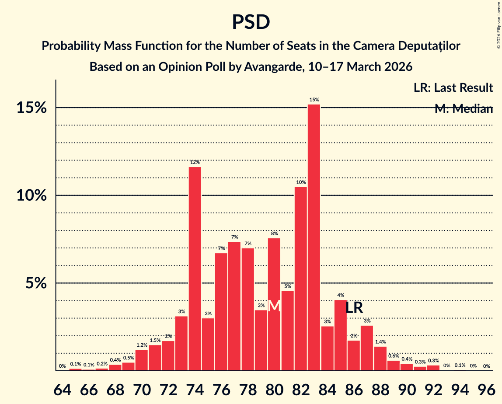

| Number of Seats | Probability | Accumulated | Special Marks |
|:---------------:|:-----------:|:-----------:|:-------------:|
| 65 | 0.1% | 100% |  |
| 66 | 0.1% | 99.8% |  |
| 67 | 0.2% | 99.7% |  |
| 68 | 0.4% | 99.6% |  |
| 69 | 0.5% | 99.2% |  |
| 70 | 1.2% | 98.7% |  |
| 71 | 1.5% | 98% |  |
| 72 | 2% | 96% |  |
| 73 | 3% | 94% |  |
| 74 | 12% | 91% |  |
| 75 | 3% | 80% |  |
| 76 | 7% | 77% |  |
| 77 | 7% | 70% |  |
| 78 | 7% | 62% |  |
| 79 | 3% | 55% |  |
| 80 | 8% | 52% | Median |
| 81 | 5% | 44% |  |
| 82 | 10% | 40% |  |
| 83 | 15% | 29% |  |
| 84 | 3% | 14% |  |
| 85 | 4% | 12% |  |
| 86 | 2% | 8% | Last Result |
| 87 | 3% | 6% |  |
| 88 | 1.4% | 3% |  |
| 89 | 0.6% | 2% |  |
| 90 | 0.4% | 1.2% |  |
| 91 | 0.3% | 0.8% |  |
| 92 | 0.3% | 0.5% |  |
| 93 | 0% | 0.2% |  |
| 94 | 0.1% | 0.1% |  |
| 95 | 0% | 0.1% |  |
| 96 | 0% | 0% |  |

### Partidul Național Liberal – Romániai Magyar Demokrata Szövetség

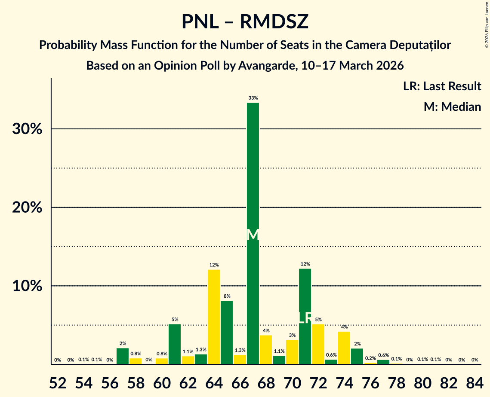

| Number of Seats | Probability | Accumulated | Special Marks |
|:---------------:|:-----------:|:-----------:|:-------------:|
| 54 | 0.1% | 100% |  |
| 55 | 0% | 99.9% |  |
| 56 | 0.3% | 99.9% |  |
| 57 | 2% | 99.6% |  |
| 58 | 0.6% | 98% |  |
| 59 | 0.2% | 97% |  |
| 60 | 1.1% | 97% |  |
| 61 | 5% | 96% |  |
| 62 | 0.7% | 92% |  |
| 63 | 2% | 91% |  |
| 64 | 11% | 89% |  |
| 65 | 10% | 78% |  |
| 66 | 6% | 68% |  |
| 67 | 23% | 61% | Median |
| 68 | 4% | 38% |  |
| 69 | 1.0% | 34% |  |
| 70 | 7% | 33% |  |
| 71 | 8% | 26% | Last Result |
| 72 | 4% | 18% |  |
| 73 | 4% | 14% |  |
| 74 | 5% | 10% |  |
| 75 | 1.2% | 6% |  |
| 76 | 2% | 4% |  |
| 77 | 1.0% | 2% |  |
| 78 | 0.8% | 1.4% |  |
| 79 | 0.1% | 0.6% |  |
| 80 | 0.3% | 0.5% |  |
| 81 | 0.2% | 0.2% |  |
| 82 | 0% | 0.1% |  |
| 83 | 0% | 0.1% |  |
| 84 | 0% | 0% |  |

### Partidul Național Liberal

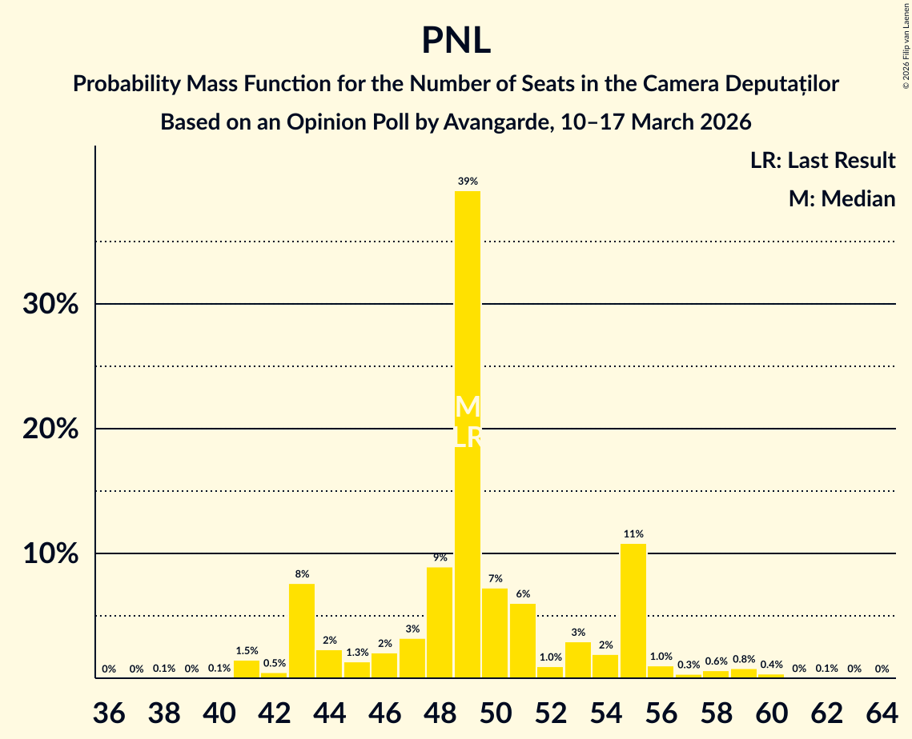

| Number of Seats | Probability | Accumulated | Special Marks |
|:---------------:|:-----------:|:-----------:|:-------------:|
| 38 | 0.1% | 100% |  |
| 39 | 0.2% | 99.9% |  |
| 40 | 0.2% | 99.7% |  |
| 41 | 1.0% | 99.5% |  |
| 42 | 0.7% | 98.5% |  |
| 43 | 5% | 98% |  |
| 44 | 3% | 93% |  |
| 45 | 4% | 90% |  |
| 46 | 7% | 86% |  |
| 47 | 3% | 80% |  |
| 48 | 8% | 77% |  |
| 49 | 29% | 69% | Last Result, Median |
| 50 | 6% | 40% |  |
| 51 | 6% | 34% |  |
| 52 | 5% | 28% |  |
| 53 | 4% | 23% |  |
| 54 | 3% | 19% |  |
| 55 | 10% | 16% |  |
| 56 | 4% | 7% |  |
| 57 | 0.6% | 3% |  |
| 58 | 0.7% | 3% |  |
| 59 | 0.8% | 2% |  |
| 60 | 0.6% | 1.1% |  |
| 61 | 0.4% | 0.6% |  |
| 62 | 0.1% | 0.2% |  |
| 63 | 0% | 0.1% |  |
| 64 | 0% | 0% |  |

## Technical Information

### Opinion Poll

+ **Polling firm:** Avangarde
+ **Commissioner(s):** —
+ **Fieldwork period:** 10–17 March 2026

### Calculations

+ **Sample size:** 1000
+ **Simulations done:** 2,097,152
+ **Error estimate:** 0.75%

