# Opinion Poll by CURS, 23–27 March 2026

<a href="#voting-intentions">Voting Intentions</a> | <a href="#seats">Seats</a> | <a href="#coalitions">Coalitions</a> | <a href="#technical-information">Technical Information</a>

## Voting Intentions

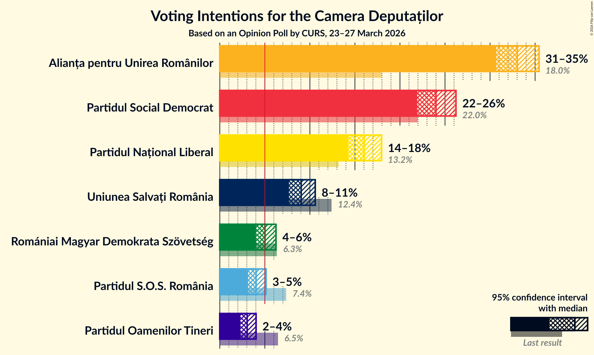

### Confidence Intervals

| Party | Last Result | Poll Result | 80% Confidence Interval | 90% Confidence Interval | 95% Confidence Interval | 99% Confidence Interval |
|:-----:|:-----------:|:-----------:|:-----------------------:|:-----------------------:|:-----------------------:|:-----------------------:|
| Alianța pentru Unirea Românilor | 18.0% | 33.0% | 31.5–34.6% |31.1–35.1% |30.7–35.4% |30.0–36.2% |
| Partidul Social Democrat | 22.0% | 24.0% | 22.6–25.5% |22.2–25.9% |21.9–26.2% |21.3–26.9% |
| Partidul Național Liberal | 13.2% | 16.0% | 14.9–17.3% |14.5–17.6% |14.3–18.0% |13.7–18.6% |
| Uniunea Salvați România | 12.4% | 9.0% | 8.1–10.0% |7.9–10.3% |7.7–10.6% |7.3–11.1% |
| Romániai Magyar Demokrata Szövetség | 6.3% | 5.0% | 4.4–5.8% |4.2–6.0% |4.0–6.2% |3.7–6.6% |
| Partidul S.O.S. România | 7.4% | 4.0% | 3.4–4.8% |3.3–5.0% |3.1–5.1% |2.9–5.5% |
| Partidul Oamenilor Tineri | 6.5% | 3.0% | 2.5–3.7% |2.4–3.9% |2.3–4.0% |2.1–4.4% |

*Note:* The poll result column reflects the actual value used in the calculations. Published results may vary slightly, and in addition be rounded to fewer digits.

## Seats

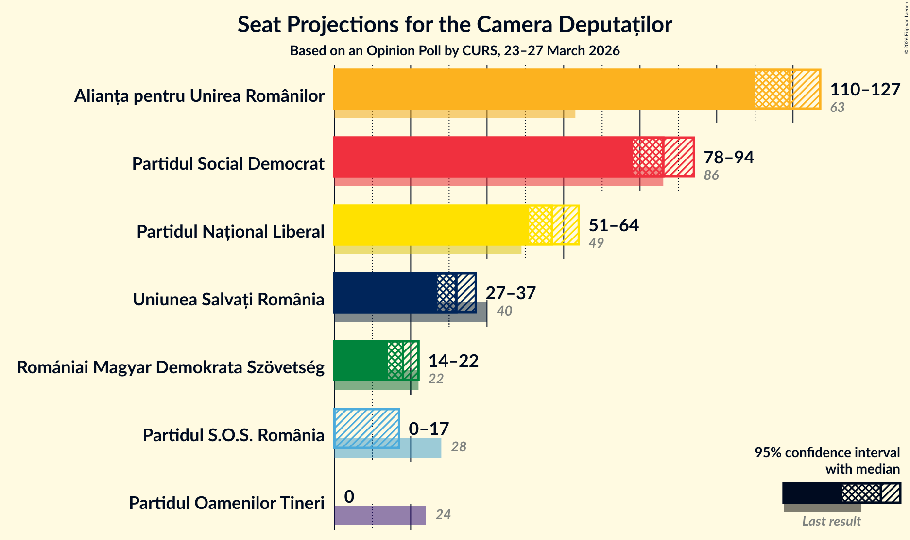

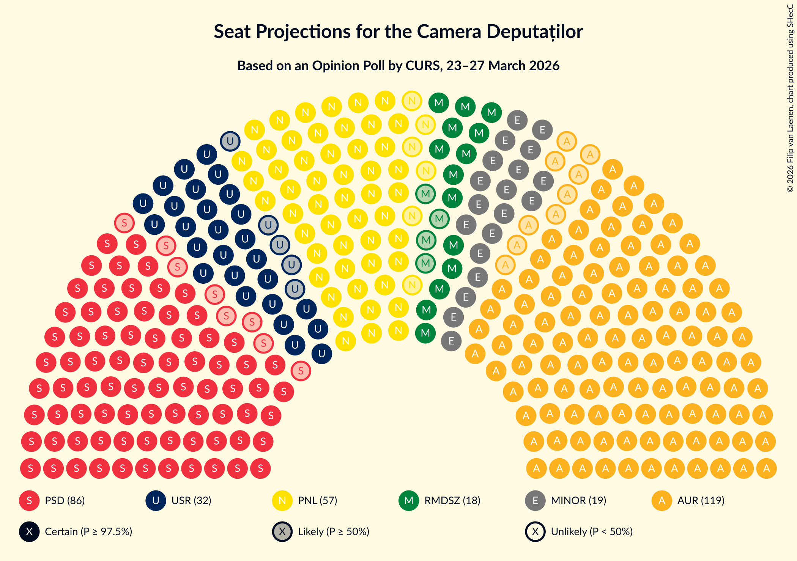

### Confidence Intervals

| Party | Last Result | Median | 80% Confidence Interval | 90% Confidence Interval | 95% Confidence Interval | 99% Confidence Interval |
|:-----:|:-----------:|:------:|:-----------------------:|:-----------------------:|:-----------------------:|:-----------------------:|
| <a href="#alianța-pentru-unirea-românilor">Alianța pentru Unirea Românilor</a> | 63 | 119 | 113–124 |111–126 |110–127 |107–129 |
| <a href="#partidul-social-democrat">Partidul Social Democrat</a> | 86 | 86 | 81–91 |79–92 |78–94 |76–96 |
| <a href="#partidul-național-liberal">Partidul Național Liberal</a> | 49 | 57 | 53–62 |52–63 |51–64 |49–66 |
| <a href="#uniunea-salvați-românia">Uniunea Salvați România</a> | 40 | 32 | 29–36 |28–37 |27–37 |26–39 |
| <a href="#romániai-magyar-demokrata-szövetség">Romániai Magyar Demokrata Szövetség</a> | 22 | 18 | 15–20 |15–21 |14–22 |13–23 |
| <a href="#partidul-s.o.s.-românia">Partidul S.O.S. România</a> | 28 | 0 | 0 |0 |0–17 |0–18 |
| <a href="#partidul-oamenilor-tineri">Partidul Oamenilor Tineri</a> | 24 | 0 | 0 |0 |0 |0 |

### Alianța pentru Unirea Românilor

*For a full overview of the results for this party, see the [Alianța pentru Unirea Românilor](party-alianțapentruunirearomânilor.html) page.*

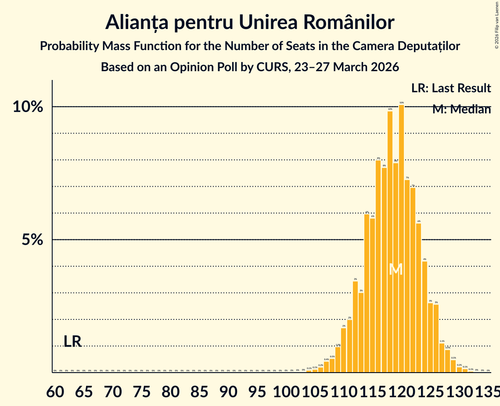

| Number of Seats | Probability | Accumulated | Special Marks |
|:---------------:|:-----------:|:-----------:|:-------------:|
| 63 | 0% | 100% | Last Result |
| 64 | 0% | 100% |  |
| 65 | 0% | 100% |  |
| 66 | 0% | 100% |  |
| 67 | 0% | 100% |  |
| 68 | 0% | 100% |  |
| 69 | 0% | 100% |  |
| 70 | 0% | 100% |  |
| 71 | 0% | 100% |  |
| 72 | 0% | 100% |  |
| 73 | 0% | 100% |  |
| 74 | 0% | 100% |  |
| 75 | 0% | 100% |  |
| 76 | 0% | 100% |  |
| 77 | 0% | 100% |  |
| 78 | 0% | 100% |  |
| 79 | 0% | 100% |  |
| 80 | 0% | 100% |  |
| 81 | 0% | 100% |  |
| 82 | 0% | 100% |  |
| 83 | 0% | 100% |  |
| 84 | 0% | 100% |  |
| 85 | 0% | 100% |  |
| 86 | 0% | 100% |  |
| 87 | 0% | 100% |  |
| 88 | 0% | 100% |  |
| 89 | 0% | 100% |  |
| 90 | 0% | 100% |  |
| 91 | 0% | 100% |  |
| 92 | 0% | 100% |  |
| 93 | 0% | 100% |  |
| 94 | 0% | 100% |  |
| 95 | 0% | 100% |  |
| 96 | 0% | 100% |  |
| 97 | 0% | 100% |  |
| 98 | 0% | 100% |  |
| 99 | 0% | 100% |  |
| 100 | 0% | 100% |  |
| 101 | 0% | 100% |  |
| 102 | 0% | 100% |  |
| 103 | 0% | 100% |  |
| 104 | 0.1% | 99.9% |  |
| 105 | 0.1% | 99.8% |  |
| 106 | 0.2% | 99.7% |  |
| 107 | 0.4% | 99.5% |  |
| 108 | 0.5% | 99.1% |  |
| 109 | 1.0% | 98.6% |  |
| 110 | 2% | 98% |  |
| 111 | 2% | 96% |  |
| 112 | 3% | 94% |  |
| 113 | 3% | 90% |  |
| 114 | 6% | 87% |  |
| 115 | 6% | 81% |  |
| 116 | 8% | 76% |  |
| 117 | 8% | 68% |  |
| 118 | 10% | 60% |  |
| 119 | 8% | 50% | Median |
| 120 | 10% | 42% |  |
| 121 | 7% | 32% |  |
| 122 | 7% | 25% |  |
| 123 | 6% | 18% |  |
| 124 | 4% | 12% |  |
| 125 | 3% | 8% |  |
| 126 | 3% | 5% |  |
| 127 | 1.1% | 3% |  |
| 128 | 0.9% | 2% |  |
| 129 | 0.5% | 0.9% |  |
| 130 | 0.2% | 0.5% |  |
| 131 | 0.1% | 0.2% |  |
| 132 | 0.1% | 0.1% |  |
| 133 | 0% | 0% |  |

### Partidul Social Democrat

*For a full overview of the results for this party, see the [Partidul Social Democrat](party-partidulsocialdemocrat.html) page.*

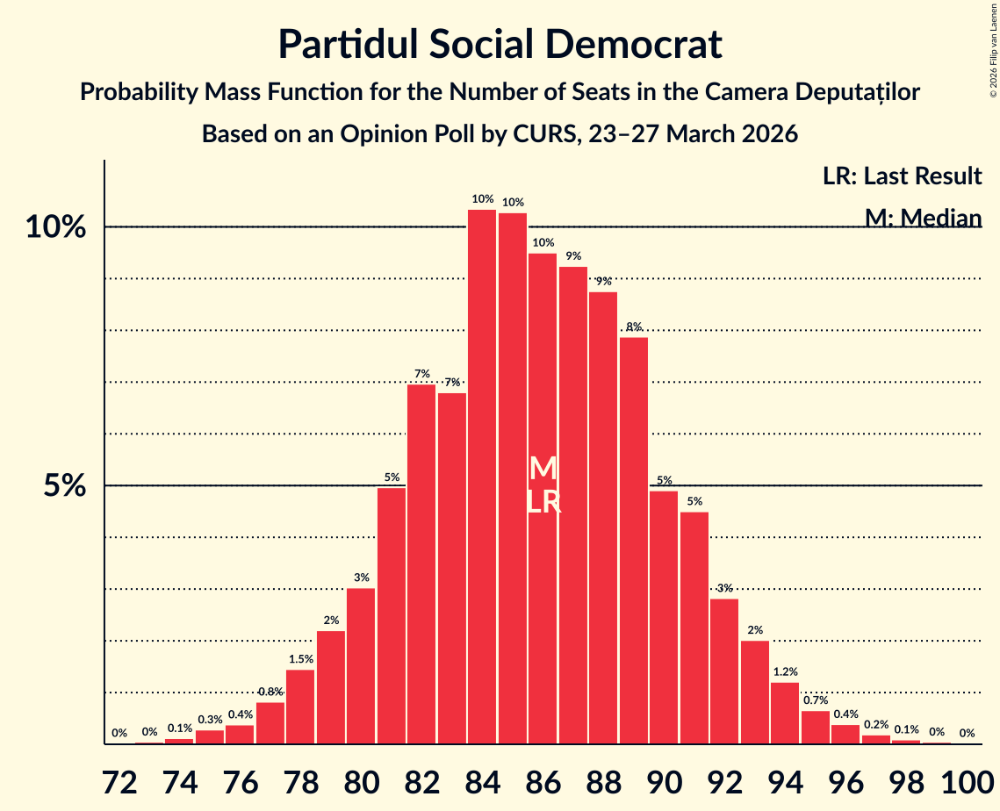

| Number of Seats | Probability | Accumulated | Special Marks |
|:---------------:|:-----------:|:-----------:|:-------------:|
| 73 | 0% | 100% |  |
| 74 | 0.1% | 99.9% |  |
| 75 | 0.3% | 99.8% |  |
| 76 | 0.4% | 99.5% |  |
| 77 | 0.8% | 99.1% |  |
| 78 | 1.5% | 98% |  |
| 79 | 2% | 97% |  |
| 80 | 3% | 95% |  |
| 81 | 5% | 92% |  |
| 82 | 7% | 87% |  |
| 83 | 7% | 80% |  |
| 84 | 10% | 73% |  |
| 85 | 10% | 63% |  |
| 86 | 10% | 52% | Last Result, Median |
| 87 | 9% | 43% |  |
| 88 | 9% | 34% |  |
| 89 | 8% | 25% |  |
| 90 | 5% | 17% |  |
| 91 | 5% | 12% |  |
| 92 | 3% | 7% |  |
| 93 | 2% | 5% |  |
| 94 | 1.2% | 3% |  |
| 95 | 0.7% | 1.4% |  |
| 96 | 0.4% | 0.8% |  |
| 97 | 0.2% | 0.4% |  |
| 98 | 0.1% | 0.2% |  |
| 99 | 0% | 0.1% |  |
| 100 | 0% | 0% |  |

### Partidul Național Liberal

*For a full overview of the results for this party, see the [Partidul Național Liberal](party-partidulnaționalliberal.html) page.*

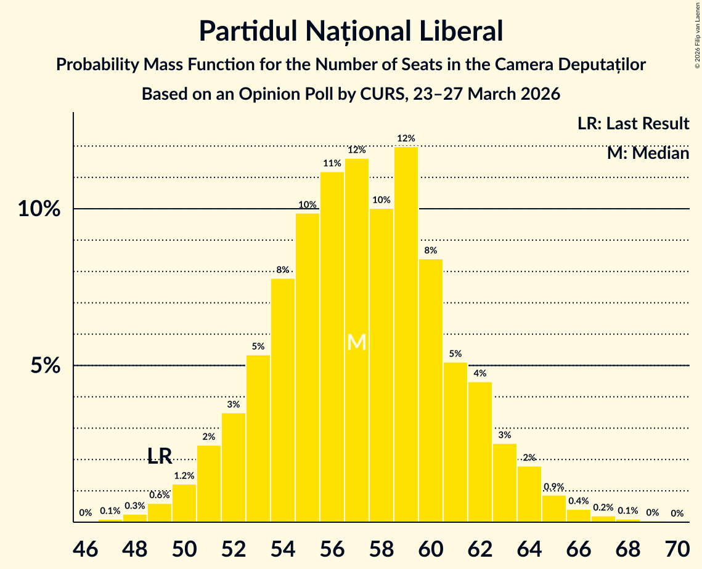

| Number of Seats | Probability | Accumulated | Special Marks |
|:---------------:|:-----------:|:-----------:|:-------------:|
| 46 | 0% | 100% |  |
| 47 | 0.1% | 99.9% |  |
| 48 | 0.3% | 99.8% |  |
| 49 | 0.6% | 99.6% | Last Result |
| 50 | 1.2% | 99.0% |  |
| 51 | 2% | 98% |  |
| 52 | 3% | 95% |  |
| 53 | 5% | 92% |  |
| 54 | 8% | 86% |  |
| 55 | 10% | 79% |  |
| 56 | 11% | 69% |  |
| 57 | 12% | 58% | Median |
| 58 | 10% | 46% |  |
| 59 | 12% | 36% |  |
| 60 | 8% | 24% |  |
| 61 | 5% | 16% |  |
| 62 | 4% | 10% |  |
| 63 | 3% | 6% |  |
| 64 | 2% | 3% |  |
| 65 | 0.9% | 2% |  |
| 66 | 0.4% | 0.8% |  |
| 67 | 0.2% | 0.4% |  |
| 68 | 0.1% | 0.2% |  |
| 69 | 0% | 0.1% |  |
| 70 | 0% | 0% |  |

### Uniunea Salvați România

*For a full overview of the results for this party, see the [Uniunea Salvați România](party-uniuneasalvațiromânia.html) page.*

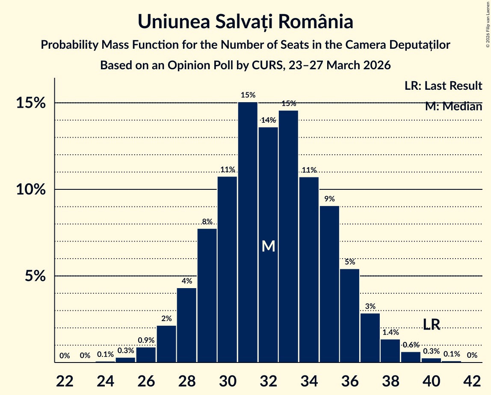

| Number of Seats | Probability | Accumulated | Special Marks |
|:---------------:|:-----------:|:-----------:|:-------------:|
| 24 | 0.1% | 100% |  |
| 25 | 0.3% | 99.9% |  |
| 26 | 0.9% | 99.6% |  |
| 27 | 2% | 98.7% |  |
| 28 | 4% | 97% |  |
| 29 | 8% | 92% |  |
| 30 | 11% | 84% |  |
| 31 | 15% | 74% |  |
| 32 | 14% | 59% | Median |
| 33 | 15% | 45% |  |
| 34 | 11% | 30% |  |
| 35 | 9% | 20% |  |
| 36 | 5% | 11% |  |
| 37 | 3% | 5% |  |
| 38 | 1.4% | 2% |  |
| 39 | 0.6% | 1.0% |  |
| 40 | 0.3% | 0.4% | Last Result |
| 41 | 0.1% | 0.1% |  |
| 42 | 0% | 0% |  |

### Romániai Magyar Demokrata Szövetség

*For a full overview of the results for this party, see the [Romániai Magyar Demokrata Szövetség](party-romániaimagyardemokrataszövetség.html) page.*

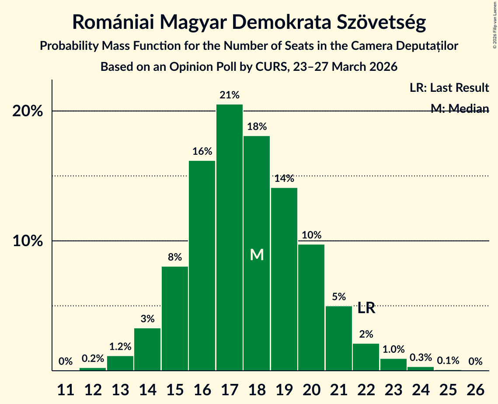

| Number of Seats | Probability | Accumulated | Special Marks |
|:---------------:|:-----------:|:-----------:|:-------------:|
| 12 | 0.2% | 100% |  |
| 13 | 1.2% | 99.7% |  |
| 14 | 3% | 98.6% |  |
| 15 | 8% | 95% |  |
| 16 | 16% | 87% |  |
| 17 | 21% | 71% |  |
| 18 | 18% | 50% | Median |
| 19 | 14% | 32% |  |
| 20 | 10% | 18% |  |
| 21 | 5% | 9% |  |
| 22 | 2% | 4% | Last Result |
| 23 | 1.0% | 1.4% |  |
| 24 | 0.3% | 0.4% |  |
| 25 | 0.1% | 0.1% |  |
| 26 | 0% | 0% |  |

### Partidul S.O.S. România

*For a full overview of the results for this party, see the [Partidul S.O.S. România](party-partidulsosromânia.html) page.*

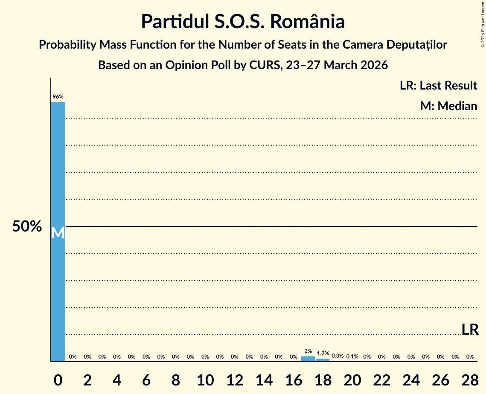

| Number of Seats | Probability | Accumulated | Special Marks |
|:---------------:|:-----------:|:-----------:|:-------------:|
| 0 | 96% | 100% | Median |
| 1 | 0% | 4% |  |
| 2 | 0% | 4% |  |
| 3 | 0% | 4% |  |
| 4 | 0% | 4% |  |
| 5 | 0% | 4% |  |
| 6 | 0% | 4% |  |
| 7 | 0% | 4% |  |
| 8 | 0% | 4% |  |
| 9 | 0% | 4% |  |
| 10 | 0% | 4% |  |
| 11 | 0% | 4% |  |
| 12 | 0% | 4% |  |
| 13 | 0% | 4% |  |
| 14 | 0% | 4% |  |
| 15 | 0% | 4% |  |
| 16 | 0% | 4% |  |
| 17 | 2% | 4% |  |
| 18 | 1.2% | 2% |  |
| 19 | 0.3% | 0.5% |  |
| 20 | 0.1% | 0.1% |  |
| 21 | 0% | 0% |  |
| 22 | 0% | 0% |  |
| 23 | 0% | 0% |  |
| 24 | 0% | 0% |  |
| 25 | 0% | 0% |  |
| 26 | 0% | 0% |  |
| 27 | 0% | 0% |  |
| 28 | 0% | 0% | Last Result |

### Partidul Oamenilor Tineri

*For a full overview of the results for this party, see the [Partidul Oamenilor Tineri](party-partiduloamenilortineri.html) page.*

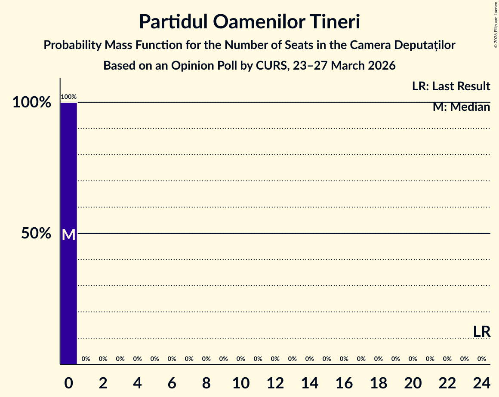

| Number of Seats | Probability | Accumulated | Special Marks |
|:---------------:|:-----------:|:-----------:|:-------------:|
| 0 | 100% | 100% | Median |
| 1 | 0% | 0% |  |
| 2 | 0% | 0% |  |
| 3 | 0% | 0% |  |
| 4 | 0% | 0% |  |
| 5 | 0% | 0% |  |
| 6 | 0% | 0% |  |
| 7 | 0% | 0% |  |
| 8 | 0% | 0% |  |
| 9 | 0% | 0% |  |
| 10 | 0% | 0% |  |
| 11 | 0% | 0% |  |
| 12 | 0% | 0% |  |
| 13 | 0% | 0% |  |
| 14 | 0% | 0% |  |
| 15 | 0% | 0% |  |
| 16 | 0% | 0% |  |
| 17 | 0% | 0% |  |
| 18 | 0% | 0% |  |
| 19 | 0% | 0% |  |
| 20 | 0% | 0% |  |
| 21 | 0% | 0% |  |
| 22 | 0% | 0% |  |
| 23 | 0% | 0% |  |
| 24 | 0% | 0% | Last Result |

## Coalitions

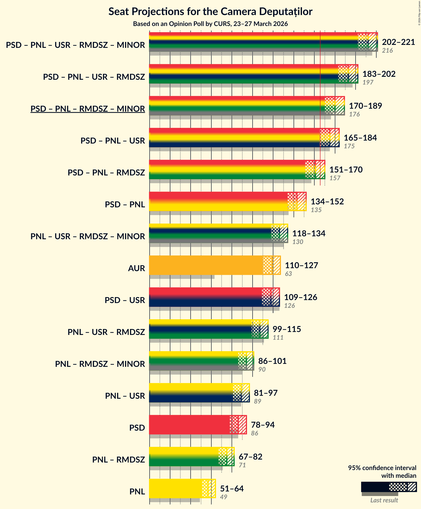

### Confidence Intervals

| Coalition | Last Result | Median | Majority? | 80% Confidence Interval | 90% Confidence Interval | 95% Confidence Interval | 99% Confidence Interval |
|:---------:|:-----------:|:------:|:---------:|:-----------------------:|:-----------------------:|:-----------------------:|:-----------------------:|
| Partidul Social Democrat – Partidul Național Liberal – Uniunea Salvați România – Romániai Magyar Demokrata Szövetség | 197 | 193 | 100% | 187–199 | 185–200 | 183–202 | 178–204 |
| Partidul Social Democrat – Partidul Național Liberal – Uniunea Salvați România | 175 | 175 | 97% | 169–181 | 167–183 | 165–184 | 161–187 |
| Partidul Social Democrat – Partidul Național Liberal – Romániai Magyar Demokrata Szövetség | 157 | 161 | 15% | 155–167 | 153–168 | 151–170 | 147–172 |
| Partidul Social Democrat – Partidul Național Liberal | 135 | 143 | 0% | 137–149 | 136–150 | 134–152 | 130–155 |
| Alianța pentru Unirea Românilor | 63 | 119 | 0% | 113–124 | 111–126 | 110–127 | 107–129 |
| Partidul Social Democrat – Uniunea Salvați România | 126 | 118 | 0% | 113–124 | 111–125 | 109–126 | 106–129 |
| Partidul Național Liberal – Uniunea Salvați România – Romániai Magyar Demokrata Szövetség | 111 | 107 | 0% | 102–113 | 100–114 | 99–115 | 96–118 |
| Partidul Național Liberal – Uniunea Salvați România | 89 | 89 | 0% | 84–95 | 83–96 | 81–97 | 79–100 |
| Partidul Social Democrat | 86 | 86 | 0% | 81–91 | 79–92 | 78–94 | 76–96 |
| Partidul Național Liberal – Romániai Magyar Demokrata Szövetség | 71 | 75 | 0% | 70–80 | 69–81 | 67–82 | 65–85 |
| Partidul Național Liberal | 49 | 57 | 0% | 53–62 | 52–63 | 51–64 | 49–66 |

### Partidul Social Democrat – Partidul Național Liberal – Uniunea Salvați România – Romániai Magyar Demokrata Szövetség

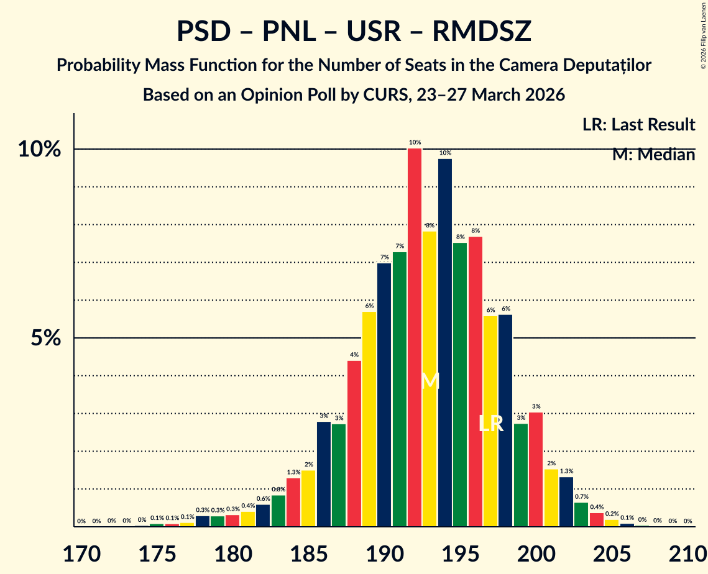

| Number of Seats | Probability | Accumulated | Special Marks |
|:---------------:|:-----------:|:-----------:|:-------------:|
| 174 | 0% | 100% |  |
| 175 | 0.1% | 99.9% |  |
| 176 | 0.1% | 99.8% |  |
| 177 | 0.1% | 99.7% |  |
| 178 | 0.3% | 99.6% |  |
| 179 | 0.3% | 99.3% |  |
| 180 | 0.3% | 99.0% |  |
| 181 | 0.4% | 98.7% |  |
| 182 | 0.6% | 98% |  |
| 183 | 0.8% | 98% |  |
| 184 | 1.3% | 97% |  |
| 185 | 2% | 96% |  |
| 186 | 3% | 94% |  |
| 187 | 3% | 91% |  |
| 188 | 4% | 89% |  |
| 189 | 6% | 84% |  |
| 190 | 7% | 78% |  |
| 191 | 7% | 71% |  |
| 192 | 10% | 64% |  |
| 193 | 8% | 54% | Median |
| 194 | 10% | 46% |  |
| 195 | 8% | 36% |  |
| 196 | 8% | 29% |  |
| 197 | 6% | 21% | Last Result |
| 198 | 6% | 16% |  |
| 199 | 3% | 10% |  |
| 200 | 3% | 7% |  |
| 201 | 2% | 4% |  |
| 202 | 1.3% | 3% |  |
| 203 | 0.7% | 1.4% |  |
| 204 | 0.4% | 0.8% |  |
| 205 | 0.2% | 0.4% |  |
| 206 | 0.1% | 0.2% |  |
| 207 | 0% | 0.1% |  |
| 208 | 0% | 0% |  |

### Partidul Social Democrat – Partidul Național Liberal – Uniunea Salvați România

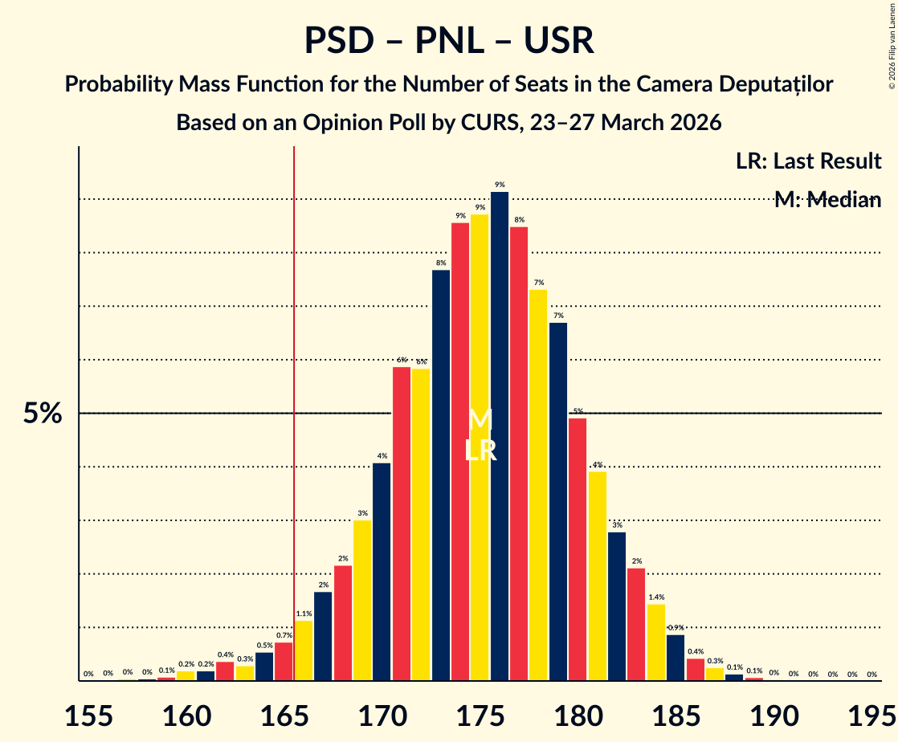

| Number of Seats | Probability | Accumulated | Special Marks |
|:---------------:|:-----------:|:-----------:|:-------------:|
| 157 | 0% | 100% |  |
| 158 | 0% | 99.9% |  |
| 159 | 0.1% | 99.9% |  |
| 160 | 0.2% | 99.8% |  |
| 161 | 0.2% | 99.6% |  |
| 162 | 0.4% | 99.4% |  |
| 163 | 0.3% | 99.0% |  |
| 164 | 0.5% | 98.7% |  |
| 165 | 0.7% | 98% |  |
| 166 | 1.1% | 97% | Majority |
| 167 | 2% | 96% |  |
| 168 | 2% | 95% |  |
| 169 | 3% | 92% |  |
| 170 | 4% | 89% |  |
| 171 | 6% | 85% |  |
| 172 | 6% | 80% |  |
| 173 | 8% | 74% |  |
| 174 | 9% | 66% |  |
| 175 | 9% | 57% | Last Result, Median |
| 176 | 9% | 49% |  |
| 177 | 8% | 40% |  |
| 178 | 7% | 31% |  |
| 179 | 7% | 24% |  |
| 180 | 5% | 17% |  |
| 181 | 4% | 12% |  |
| 182 | 3% | 8% |  |
| 183 | 2% | 5% |  |
| 184 | 1.4% | 3% |  |
| 185 | 0.9% | 2% |  |
| 186 | 0.4% | 0.9% |  |
| 187 | 0.3% | 0.5% |  |
| 188 | 0.1% | 0.3% |  |
| 189 | 0.1% | 0.1% |  |
| 190 | 0% | 0.1% |  |
| 191 | 0% | 0% |  |

### Partidul Social Democrat – Partidul Național Liberal – Romániai Magyar Demokrata Szövetség

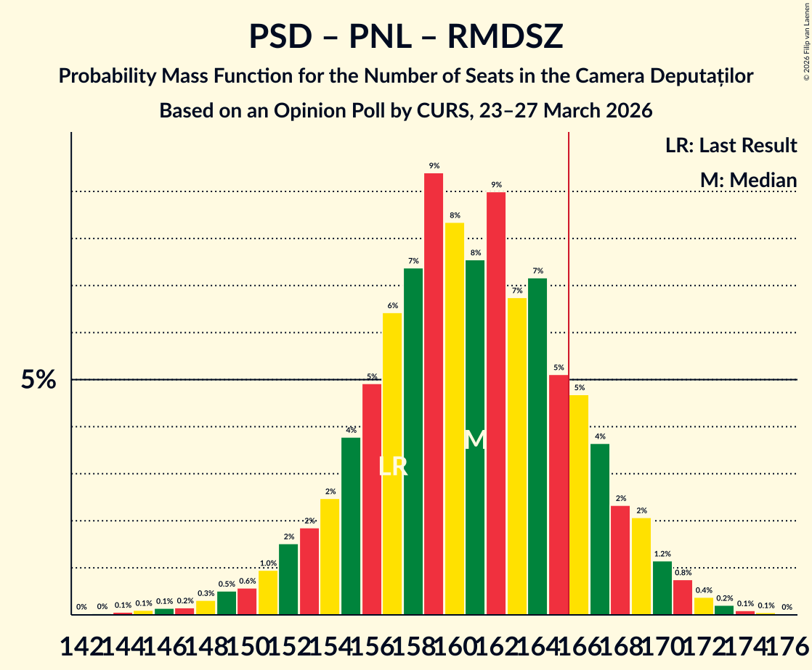

| Number of Seats | Probability | Accumulated | Special Marks |
|:---------------:|:-----------:|:-----------:|:-------------:|
| 143 | 0% | 100% |  |
| 144 | 0.1% | 99.9% |  |
| 145 | 0.1% | 99.9% |  |
| 146 | 0.1% | 99.8% |  |
| 147 | 0.2% | 99.6% |  |
| 148 | 0.3% | 99.5% |  |
| 149 | 0.5% | 99.1% |  |
| 150 | 0.6% | 98.6% |  |
| 151 | 1.0% | 98% |  |
| 152 | 2% | 97% |  |
| 153 | 2% | 96% |  |
| 154 | 2% | 94% |  |
| 155 | 4% | 91% |  |
| 156 | 5% | 87% |  |
| 157 | 6% | 83% | Last Result |
| 158 | 7% | 76% |  |
| 159 | 9% | 69% |  |
| 160 | 8% | 59% |  |
| 161 | 8% | 51% | Median |
| 162 | 9% | 43% |  |
| 163 | 7% | 34% |  |
| 164 | 7% | 28% |  |
| 165 | 5% | 21% |  |
| 166 | 5% | 15% | Majority |
| 167 | 4% | 11% |  |
| 168 | 2% | 7% |  |
| 169 | 2% | 5% |  |
| 170 | 1.2% | 3% |  |
| 171 | 0.8% | 2% |  |
| 172 | 0.4% | 0.8% |  |
| 173 | 0.2% | 0.4% |  |
| 174 | 0.1% | 0.2% |  |
| 175 | 0.1% | 0.1% |  |
| 176 | 0% | 0% |  |

### Partidul Social Democrat – Partidul Național Liberal

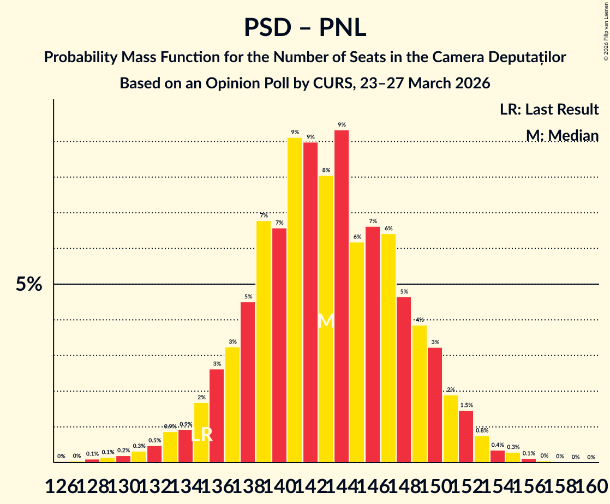

| Number of Seats | Probability | Accumulated | Special Marks |
|:---------------:|:-----------:|:-----------:|:-------------:|
| 126 | 0% | 100% |  |
| 127 | 0% | 99.9% |  |
| 128 | 0.1% | 99.9% |  |
| 129 | 0.1% | 99.8% |  |
| 130 | 0.2% | 99.6% |  |
| 131 | 0.3% | 99.4% |  |
| 132 | 0.5% | 99.1% |  |
| 133 | 0.9% | 98.6% |  |
| 134 | 0.9% | 98% |  |
| 135 | 2% | 97% | Last Result |
| 136 | 3% | 95% |  |
| 137 | 3% | 93% |  |
| 138 | 5% | 89% |  |
| 139 | 7% | 85% |  |
| 140 | 7% | 78% |  |
| 141 | 9% | 71% |  |
| 142 | 9% | 62% |  |
| 143 | 8% | 53% | Median |
| 144 | 9% | 45% |  |
| 145 | 6% | 36% |  |
| 146 | 7% | 30% |  |
| 147 | 6% | 23% |  |
| 148 | 5% | 17% |  |
| 149 | 4% | 12% |  |
| 150 | 3% | 8% |  |
| 151 | 2% | 5% |  |
| 152 | 1.5% | 3% |  |
| 153 | 0.8% | 2% |  |
| 154 | 0.4% | 0.9% |  |
| 155 | 0.3% | 0.5% |  |
| 156 | 0.1% | 0.2% |  |
| 157 | 0% | 0.1% |  |
| 158 | 0% | 0.1% |  |
| 159 | 0% | 0% |  |

### Alianța pentru Unirea Românilor

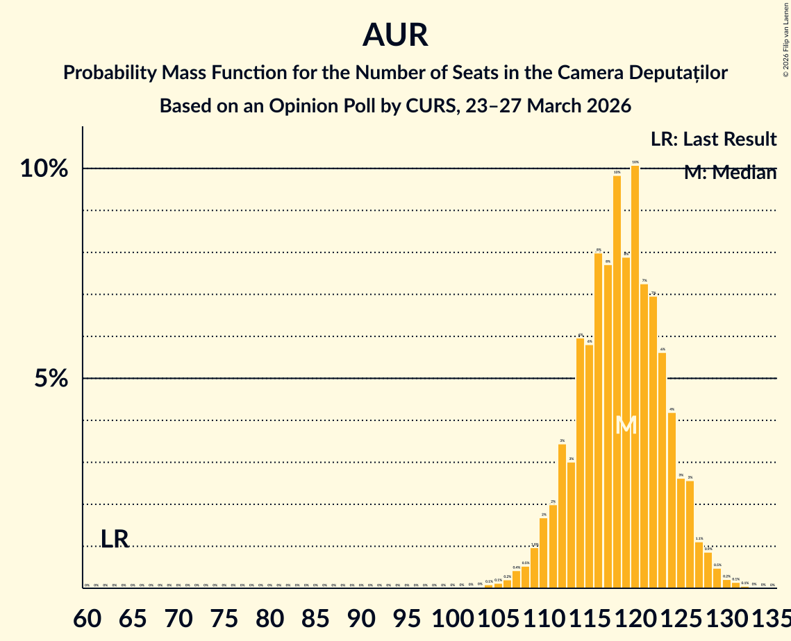

| Number of Seats | Probability | Accumulated | Special Marks |
|:---------------:|:-----------:|:-----------:|:-------------:|
| 63 | 0% | 100% | Last Result |
| 64 | 0% | 100% |  |
| 65 | 0% | 100% |  |
| 66 | 0% | 100% |  |
| 67 | 0% | 100% |  |
| 68 | 0% | 100% |  |
| 69 | 0% | 100% |  |
| 70 | 0% | 100% |  |
| 71 | 0% | 100% |  |
| 72 | 0% | 100% |  |
| 73 | 0% | 100% |  |
| 74 | 0% | 100% |  |
| 75 | 0% | 100% |  |
| 76 | 0% | 100% |  |
| 77 | 0% | 100% |  |
| 78 | 0% | 100% |  |
| 79 | 0% | 100% |  |
| 80 | 0% | 100% |  |
| 81 | 0% | 100% |  |
| 82 | 0% | 100% |  |
| 83 | 0% | 100% |  |
| 84 | 0% | 100% |  |
| 85 | 0% | 100% |  |
| 86 | 0% | 100% |  |
| 87 | 0% | 100% |  |
| 88 | 0% | 100% |  |
| 89 | 0% | 100% |  |
| 90 | 0% | 100% |  |
| 91 | 0% | 100% |  |
| 92 | 0% | 100% |  |
| 93 | 0% | 100% |  |
| 94 | 0% | 100% |  |
| 95 | 0% | 100% |  |
| 96 | 0% | 100% |  |
| 97 | 0% | 100% |  |
| 98 | 0% | 100% |  |
| 99 | 0% | 100% |  |
| 100 | 0% | 100% |  |
| 101 | 0% | 100% |  |
| 102 | 0% | 100% |  |
| 103 | 0% | 100% |  |
| 104 | 0.1% | 99.9% |  |
| 105 | 0.1% | 99.8% |  |
| 106 | 0.2% | 99.7% |  |
| 107 | 0.4% | 99.5% |  |
| 108 | 0.5% | 99.1% |  |
| 109 | 1.0% | 98.6% |  |
| 110 | 2% | 98% |  |
| 111 | 2% | 96% |  |
| 112 | 3% | 94% |  |
| 113 | 3% | 90% |  |
| 114 | 6% | 87% |  |
| 115 | 6% | 81% |  |
| 116 | 8% | 76% |  |
| 117 | 8% | 68% |  |
| 118 | 10% | 60% |  |
| 119 | 8% | 50% | Median |
| 120 | 10% | 42% |  |
| 121 | 7% | 32% |  |
| 122 | 7% | 25% |  |
| 123 | 6% | 18% |  |
| 124 | 4% | 12% |  |
| 125 | 3% | 8% |  |
| 126 | 3% | 5% |  |
| 127 | 1.1% | 3% |  |
| 128 | 0.9% | 2% |  |
| 129 | 0.5% | 0.9% |  |
| 130 | 0.2% | 0.5% |  |
| 131 | 0.1% | 0.2% |  |
| 132 | 0.1% | 0.1% |  |
| 133 | 0% | 0% |  |

### Partidul Social Democrat – Uniunea Salvați România

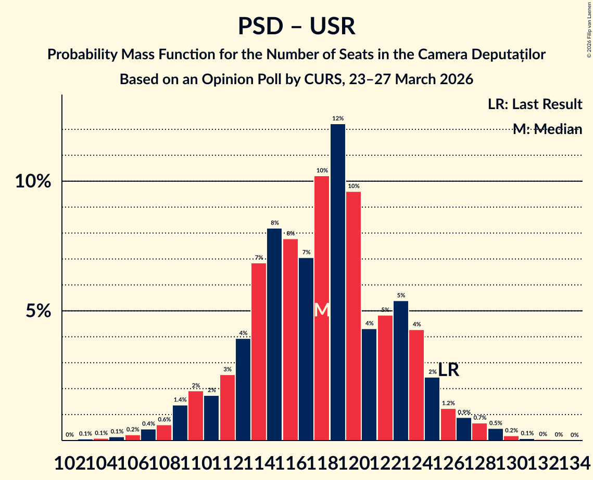

| Number of Seats | Probability | Accumulated | Special Marks |
|:---------------:|:-----------:|:-----------:|:-------------:|
| 103 | 0.1% | 100% |  |
| 104 | 0.1% | 99.9% |  |
| 105 | 0.1% | 99.8% |  |
| 106 | 0.2% | 99.7% |  |
| 107 | 0.4% | 99.4% |  |
| 108 | 0.6% | 99.0% |  |
| 109 | 1.4% | 98% |  |
| 110 | 2% | 97% |  |
| 111 | 2% | 95% |  |
| 112 | 3% | 93% |  |
| 113 | 4% | 91% |  |
| 114 | 7% | 87% |  |
| 115 | 8% | 80% |  |
| 116 | 8% | 72% |  |
| 117 | 7% | 64% |  |
| 118 | 10% | 57% | Median |
| 119 | 12% | 47% |  |
| 120 | 10% | 35% |  |
| 121 | 4% | 25% |  |
| 122 | 5% | 21% |  |
| 123 | 5% | 16% |  |
| 124 | 4% | 10% |  |
| 125 | 2% | 6% |  |
| 126 | 1.2% | 4% | Last Result |
| 127 | 0.9% | 2% |  |
| 128 | 0.7% | 2% |  |
| 129 | 0.5% | 0.8% |  |
| 130 | 0.2% | 0.4% |  |
| 131 | 0.1% | 0.2% |  |
| 132 | 0% | 0.1% |  |
| 133 | 0% | 0% |  |

### Partidul Național Liberal – Uniunea Salvați România – Romániai Magyar Demokrata Szövetség

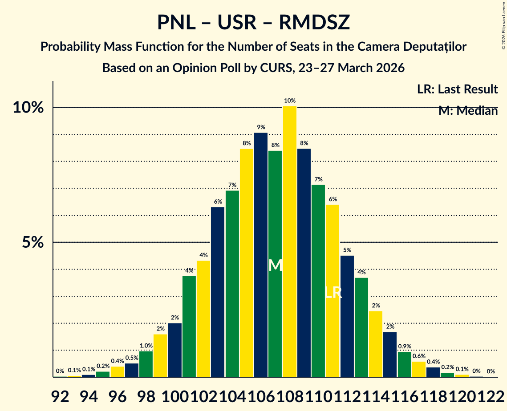

| Number of Seats | Probability | Accumulated | Special Marks |
|:---------------:|:-----------:|:-----------:|:-------------:|
| 92 | 0% | 100% |  |
| 93 | 0.1% | 99.9% |  |
| 94 | 0.1% | 99.9% |  |
| 95 | 0.2% | 99.8% |  |
| 96 | 0.4% | 99.5% |  |
| 97 | 0.5% | 99.1% |  |
| 98 | 1.0% | 98.6% |  |
| 99 | 2% | 98% |  |
| 100 | 2% | 96% |  |
| 101 | 4% | 94% |  |
| 102 | 4% | 90% |  |
| 103 | 6% | 86% |  |
| 104 | 7% | 80% |  |
| 105 | 8% | 73% |  |
| 106 | 9% | 64% |  |
| 107 | 8% | 55% | Median |
| 108 | 10% | 47% |  |
| 109 | 8% | 37% |  |
| 110 | 7% | 28% |  |
| 111 | 6% | 21% | Last Result |
| 112 | 5% | 15% |  |
| 113 | 4% | 10% |  |
| 114 | 2% | 6% |  |
| 115 | 2% | 4% |  |
| 116 | 0.9% | 2% |  |
| 117 | 0.6% | 1.3% |  |
| 118 | 0.4% | 0.7% |  |
| 119 | 0.2% | 0.4% |  |
| 120 | 0.1% | 0.2% |  |
| 121 | 0% | 0.1% |  |
| 122 | 0% | 0% |  |

### Partidul Național Liberal – Uniunea Salvați România

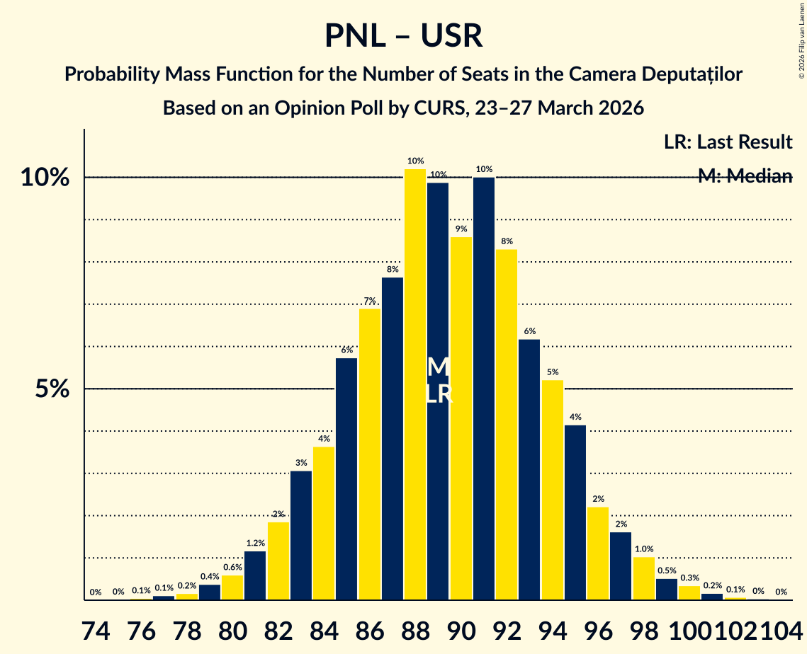

| Number of Seats | Probability | Accumulated | Special Marks |
|:---------------:|:-----------:|:-----------:|:-------------:|
| 76 | 0.1% | 100% |  |
| 77 | 0.1% | 99.9% |  |
| 78 | 0.2% | 99.8% |  |
| 79 | 0.4% | 99.6% |  |
| 80 | 0.6% | 99.3% |  |
| 81 | 1.2% | 98.7% |  |
| 82 | 2% | 97% |  |
| 83 | 3% | 96% |  |
| 84 | 4% | 93% |  |
| 85 | 6% | 89% |  |
| 86 | 7% | 83% |  |
| 87 | 8% | 76% |  |
| 88 | 10% | 69% |  |
| 89 | 10% | 58% | Last Result, Median |
| 90 | 9% | 49% |  |
| 91 | 10% | 40% |  |
| 92 | 8% | 30% |  |
| 93 | 6% | 22% |  |
| 94 | 5% | 15% |  |
| 95 | 4% | 10% |  |
| 96 | 2% | 6% |  |
| 97 | 2% | 4% |  |
| 98 | 1.0% | 2% |  |
| 99 | 0.5% | 1.2% |  |
| 100 | 0.3% | 0.7% |  |
| 101 | 0.2% | 0.3% |  |
| 102 | 0.1% | 0.1% |  |
| 103 | 0% | 0.1% |  |
| 104 | 0% | 0% |  |

### Partidul Social Democrat

| Number of Seats | Probability | Accumulated | Special Marks |
|:---------------:|:-----------:|:-----------:|:-------------:|
| 73 | 0% | 100% |  |
| 74 | 0.1% | 99.9% |  |
| 75 | 0.3% | 99.8% |  |
| 76 | 0.4% | 99.5% |  |
| 77 | 0.8% | 99.1% |  |
| 78 | 1.5% | 98% |  |
| 79 | 2% | 97% |  |
| 80 | 3% | 95% |  |
| 81 | 5% | 92% |  |
| 82 | 7% | 87% |  |
| 83 | 7% | 80% |  |
| 84 | 10% | 73% |  |
| 85 | 10% | 63% |  |
| 86 | 10% | 52% | Last Result, Median |
| 87 | 9% | 43% |  |
| 88 | 9% | 34% |  |
| 89 | 8% | 25% |  |
| 90 | 5% | 17% |  |
| 91 | 5% | 12% |  |
| 92 | 3% | 7% |  |
| 93 | 2% | 5% |  |
| 94 | 1.2% | 3% |  |
| 95 | 0.7% | 1.4% |  |
| 96 | 0.4% | 0.8% |  |
| 97 | 0.2% | 0.4% |  |
| 98 | 0.1% | 0.2% |  |
| 99 | 0% | 0.1% |  |
| 100 | 0% | 0% |  |

### Partidul Național Liberal – Romániai Magyar Demokrata Szövetség

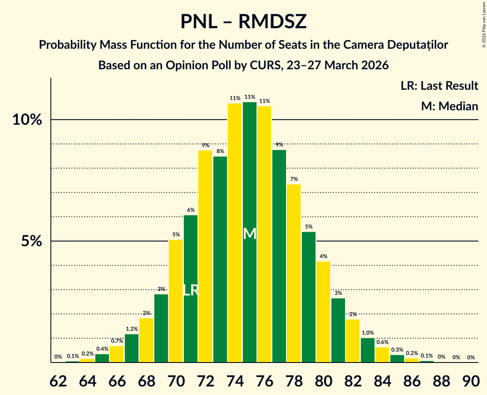

| Number of Seats | Probability | Accumulated | Special Marks |
|:---------------:|:-----------:|:-----------:|:-------------:|
| 62 | 0% | 100% |  |
| 63 | 0.1% | 99.9% |  |
| 64 | 0.2% | 99.9% |  |
| 65 | 0.4% | 99.7% |  |
| 66 | 0.7% | 99.4% |  |
| 67 | 1.2% | 98.7% |  |
| 68 | 2% | 97% |  |
| 69 | 3% | 96% |  |
| 70 | 5% | 93% |  |
| 71 | 6% | 88% | Last Result |
| 72 | 9% | 82% |  |
| 73 | 8% | 73% |  |
| 74 | 11% | 64% |  |
| 75 | 11% | 54% | Median |
| 76 | 11% | 43% |  |
| 77 | 9% | 32% |  |
| 78 | 7% | 24% |  |
| 79 | 5% | 16% |  |
| 80 | 4% | 11% |  |
| 81 | 3% | 7% |  |
| 82 | 2% | 4% |  |
| 83 | 1.0% | 2% |  |
| 84 | 0.6% | 1.3% |  |
| 85 | 0.3% | 0.7% |  |
| 86 | 0.2% | 0.3% |  |
| 87 | 0.1% | 0.1% |  |
| 88 | 0% | 0.1% |  |
| 89 | 0% | 0% |  |

### Partidul Național Liberal

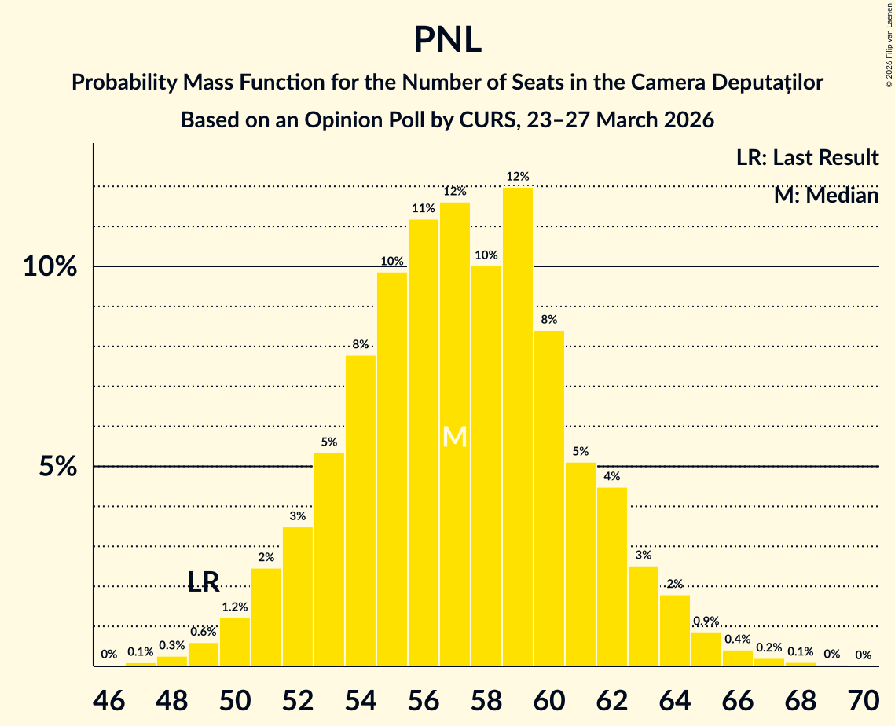

| Number of Seats | Probability | Accumulated | Special Marks |
|:---------------:|:-----------:|:-----------:|:-------------:|
| 46 | 0% | 100% |  |
| 47 | 0.1% | 99.9% |  |
| 48 | 0.3% | 99.8% |  |
| 49 | 0.6% | 99.6% | Last Result |
| 50 | 1.2% | 99.0% |  |
| 51 | 2% | 98% |  |
| 52 | 3% | 95% |  |
| 53 | 5% | 92% |  |
| 54 | 8% | 86% |  |
| 55 | 10% | 79% |  |
| 56 | 11% | 69% |  |
| 57 | 12% | 58% | Median |
| 58 | 10% | 46% |  |
| 59 | 12% | 36% |  |
| 60 | 8% | 24% |  |
| 61 | 5% | 16% |  |
| 62 | 4% | 10% |  |
| 63 | 3% | 6% |  |
| 64 | 2% | 3% |  |
| 65 | 0.9% | 2% |  |
| 66 | 0.4% | 0.8% |  |
| 67 | 0.2% | 0.4% |  |
| 68 | 0.1% | 0.2% |  |
| 69 | 0% | 0.1% |  |
| 70 | 0% | 0% |  |

## Technical Information

### Opinion Poll

+ **Polling firm:** CURS
+ **Commissioner(s):** —
+ **Fieldwork period:** 23–27 March 2026

### Calculations

+ **Sample size:** 1517
+ **Simulations done:** 2,097,152
+ **Error estimate:** 0.72%

