# Opinion Poll by Sociopol, 26 March–4 April 2026

<a href="#voting-intentions">Voting Intentions</a> | <a href="#seats">Seats</a> | <a href="#coalitions">Coalitions</a> | <a href="#technical-information">Technical Information</a>

## Voting Intentions

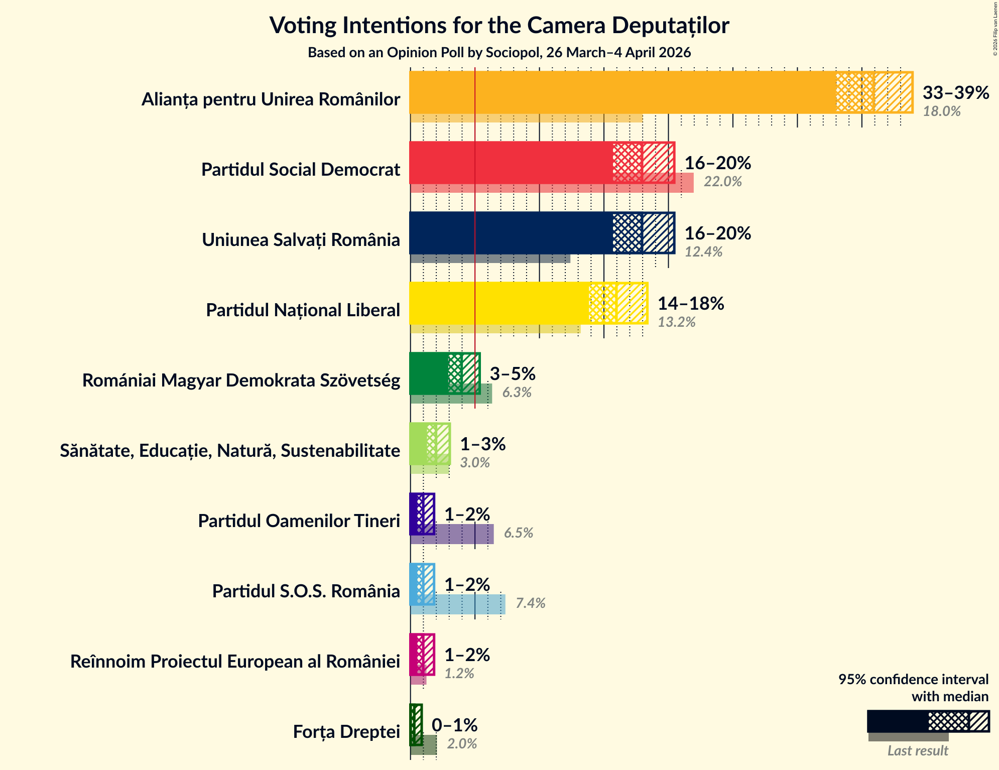

### Confidence Intervals

| Party | Last Result | Poll Result | 80% Confidence Interval | 90% Confidence Interval | 95% Confidence Interval | 99% Confidence Interval |
|:-----:|:-----------:|:-----------:|:-----------------------:|:-----------------------:|:-----------------------:|:-----------------------:|
| Alianța pentru Unirea Românilor | 18.0% | 35.9% | 34.0–37.9% |33.5–38.4% |33.0–38.9% |32.1–39.9% |
| Partidul Social Democrat | 22.0% | 18.0% | 16.5–19.6% |16.1–20.1% |15.7–20.5% |15.0–21.3% |
| Uniunea Salvați România | 12.4% | 18.0% | 16.5–19.6% |16.1–20.1% |15.7–20.5% |15.0–21.3% |
| Partidul Național Liberal | 13.2% | 16.0% | 14.6–17.5% |14.2–18.0% |13.8–18.4% |13.2–19.1% |
| Romániai Magyar Demokrata Szövetség | 6.3% | 4.0% | 3.3–4.9% |3.1–5.1% |2.9–5.4% |2.6–5.8% |
| Sănătate, Educație, Natură, Sustenabilitate | 3.0% | 2.0% | 1.5–2.7% |1.4–2.9% |1.3–3.0% |1.1–3.4% |
| Partidul S.O.S. România | 7.4% | 1.0% | 0.7–1.5% |0.6–1.7% |0.5–1.8% |0.4–2.1% |
| Partidul Oamenilor Tineri | 6.5% | 1.0% | 0.7–1.5% |0.6–1.7% |0.5–1.8% |0.4–2.1% |
| Reînnoim Proiectul European al României | 1.2% | 1.0% | 0.7–1.5% |0.6–1.7% |0.5–1.8% |0.4–2.1% |
| Forța Dreptei | 2.0% | 0.3% | 0.2–0.7% |0.1–0.8% |0.1–0.9% |0.1–1.1% |

*Note:* The poll result column reflects the actual value used in the calculations. Published results may vary slightly, and in addition be rounded to fewer digits.

## Seats

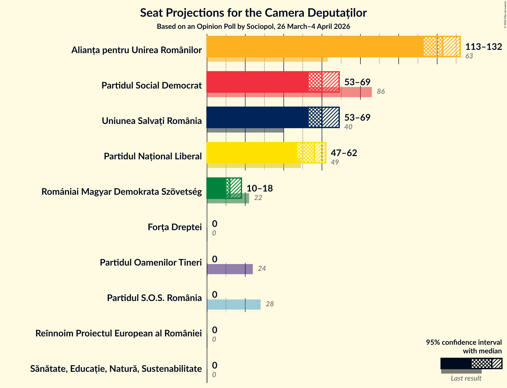

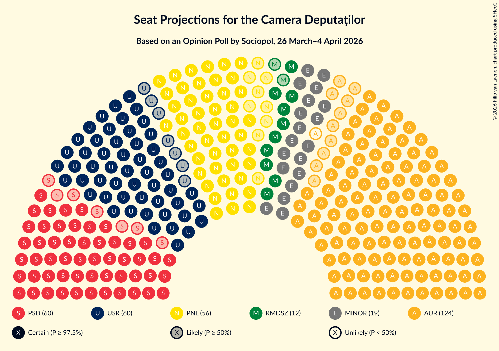

### Confidence Intervals

| Party | Last Result | Median | 80% Confidence Interval | 90% Confidence Interval | 95% Confidence Interval | 99% Confidence Interval |
|:-----:|:-----------:|:------:|:-----------------------:|:-----------------------:|:-----------------------:|:-----------------------:|
| <a href="#alianța-pentru-unirea-românilor">Alianța pentru Unirea Românilor</a> | 63 | 123 | 117–129 |115–130 |113–132 |110–135 |
| <a href="#partidul-social-democrat">Partidul Social Democrat</a> | 86 | 60 | 55–66 |54–67 |53–69 |51–71 |
| <a href="#uniunea-salvați-românia">Uniunea Salvați România</a> | 40 | 60 | 56–65 |54–67 |53–69 |51–71 |
| <a href="#partidul-național-liberal">Partidul Național Liberal</a> | 49 | 56 | 50–61 |47–61 |47–62 |45–64 |
| <a href="#romániai-magyar-demokrata-szövetség">Romániai Magyar Demokrata Szövetség</a> | 22 | 12 | 11–16 |10–17 |10–18 |9–19 |
| <a href="#sănătate,-educație,-natură,-sustenabilitate">Sănătate, Educație, Natură, Sustenabilitate</a> | 0 | 0 | 0 |0 |0 |0 |
| <a href="#partidul-s.o.s.-românia">Partidul S.O.S. România</a> | 28 | 0 | 0 |0 |0 |0 |
| <a href="#partidul-oamenilor-tineri">Partidul Oamenilor Tineri</a> | 24 | 0 | 0 |0 |0 |0 |
| <a href="#reînnoim-proiectul-european-al-româniei">Reînnoim Proiectul European al României</a> | 0 | 0 | 0 |0 |0 |0 |
| <a href="#forța-dreptei">Forța Dreptei</a> | 0 | 0 | 0 |0 |0 |0 |

### Alianța pentru Unirea Românilor

*For a full overview of the results for this party, see the [Alianța pentru Unirea Românilor](party-alianțapentruunirearomânilor.html) page.*

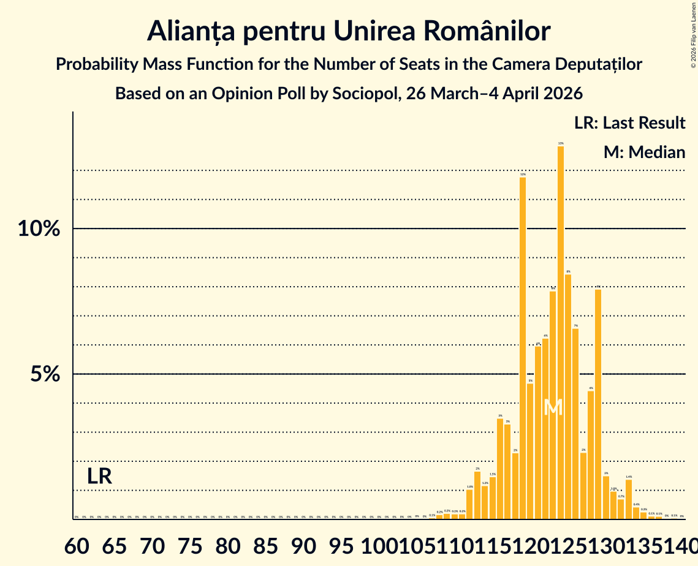

| Number of Seats | Probability | Accumulated | Special Marks |
|:---------------:|:-----------:|:-----------:|:-------------:|
| 63 | 0% | 100% | Last Result |
| 64 | 0% | 100% |  |
| 65 | 0% | 100% |  |
| 66 | 0% | 100% |  |
| 67 | 0% | 100% |  |
| 68 | 0% | 100% |  |
| 69 | 0% | 100% |  |
| 70 | 0% | 100% |  |
| 71 | 0% | 100% |  |
| 72 | 0% | 100% |  |
| 73 | 0% | 100% |  |
| 74 | 0% | 100% |  |
| 75 | 0% | 100% |  |
| 76 | 0% | 100% |  |
| 77 | 0% | 100% |  |
| 78 | 0% | 100% |  |
| 79 | 0% | 100% |  |
| 80 | 0% | 100% |  |
| 81 | 0% | 100% |  |
| 82 | 0% | 100% |  |
| 83 | 0% | 100% |  |
| 84 | 0% | 100% |  |
| 85 | 0% | 100% |  |
| 86 | 0% | 100% |  |
| 87 | 0% | 100% |  |
| 88 | 0% | 100% |  |
| 89 | 0% | 100% |  |
| 90 | 0% | 100% |  |
| 91 | 0% | 100% |  |
| 92 | 0% | 100% |  |
| 93 | 0% | 100% |  |
| 94 | 0% | 100% |  |
| 95 | 0% | 100% |  |
| 96 | 0% | 100% |  |
| 97 | 0% | 100% |  |
| 98 | 0% | 100% |  |
| 99 | 0% | 100% |  |
| 100 | 0% | 100% |  |
| 101 | 0% | 100% |  |
| 102 | 0% | 100% |  |
| 103 | 0% | 100% |  |
| 104 | 0% | 100% |  |
| 105 | 0% | 100% |  |
| 106 | 0% | 100% |  |
| 107 | 0.1% | 99.9% |  |
| 108 | 0.2% | 99.9% |  |
| 109 | 0.2% | 99.7% |  |
| 110 | 0.2% | 99.5% |  |
| 111 | 0.2% | 99.3% |  |
| 112 | 1.0% | 99.1% |  |
| 113 | 2% | 98% |  |
| 114 | 1.2% | 96% |  |
| 115 | 1.5% | 95% |  |
| 116 | 3% | 94% |  |
| 117 | 3% | 90% |  |
| 118 | 2% | 87% |  |
| 119 | 12% | 85% |  |
| 120 | 5% | 73% |  |
| 121 | 6% | 68% |  |
| 122 | 6% | 62% |  |
| 123 | 8% | 56% | Median |
| 124 | 13% | 48% |  |
| 125 | 8% | 35% |  |
| 126 | 7% | 27% |  |
| 127 | 2% | 20% |  |
| 128 | 4% | 18% |  |
| 129 | 8% | 14% |  |
| 130 | 2% | 6% |  |
| 131 | 1.0% | 4% |  |
| 132 | 0.7% | 3% |  |
| 133 | 1.4% | 2% |  |
| 134 | 0.4% | 1.1% |  |
| 135 | 0.3% | 0.6% |  |
| 136 | 0.1% | 0.4% |  |
| 137 | 0.1% | 0.3% |  |
| 138 | 0% | 0.1% |  |
| 139 | 0.1% | 0.1% |  |
| 140 | 0% | 0% |  |

### Partidul Social Democrat

*For a full overview of the results for this party, see the [Partidul Social Democrat](party-partidulsocialdemocrat.html) page.*

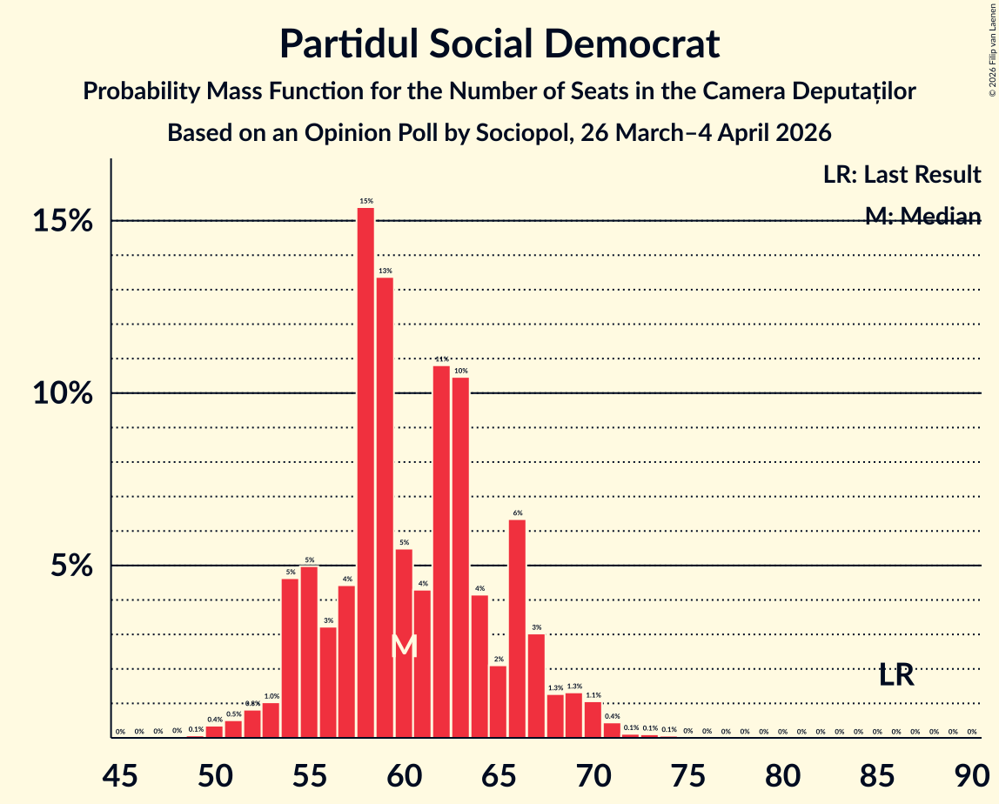

| Number of Seats | Probability | Accumulated | Special Marks |
|:---------------:|:-----------:|:-----------:|:-------------:|
| 48 | 0% | 100% |  |
| 49 | 0.1% | 99.9% |  |
| 50 | 0.4% | 99.9% |  |
| 51 | 0.5% | 99.5% |  |
| 52 | 0.8% | 99.0% |  |
| 53 | 1.0% | 98% |  |
| 54 | 5% | 97% |  |
| 55 | 5% | 93% |  |
| 56 | 3% | 88% |  |
| 57 | 4% | 84% |  |
| 58 | 15% | 80% |  |
| 59 | 13% | 64% |  |
| 60 | 5% | 51% | Median |
| 61 | 4% | 46% |  |
| 62 | 11% | 41% |  |
| 63 | 10% | 31% |  |
| 64 | 4% | 20% |  |
| 65 | 2% | 16% |  |
| 66 | 6% | 14% |  |
| 67 | 3% | 7% |  |
| 68 | 1.3% | 4% |  |
| 69 | 1.3% | 3% |  |
| 70 | 1.1% | 2% |  |
| 71 | 0.4% | 0.8% |  |
| 72 | 0.1% | 0.3% |  |
| 73 | 0.1% | 0.2% |  |
| 74 | 0.1% | 0.1% |  |
| 75 | 0% | 0.1% |  |
| 76 | 0% | 0% |  |
| 77 | 0% | 0% |  |
| 78 | 0% | 0% |  |
| 79 | 0% | 0% |  |
| 80 | 0% | 0% |  |
| 81 | 0% | 0% |  |
| 82 | 0% | 0% |  |
| 83 | 0% | 0% |  |
| 84 | 0% | 0% |  |
| 85 | 0% | 0% |  |
| 86 | 0% | 0% | Last Result |

### Uniunea Salvați România

*For a full overview of the results for this party, see the [Uniunea Salvați România](party-uniuneasalvațiromânia.html) page.*

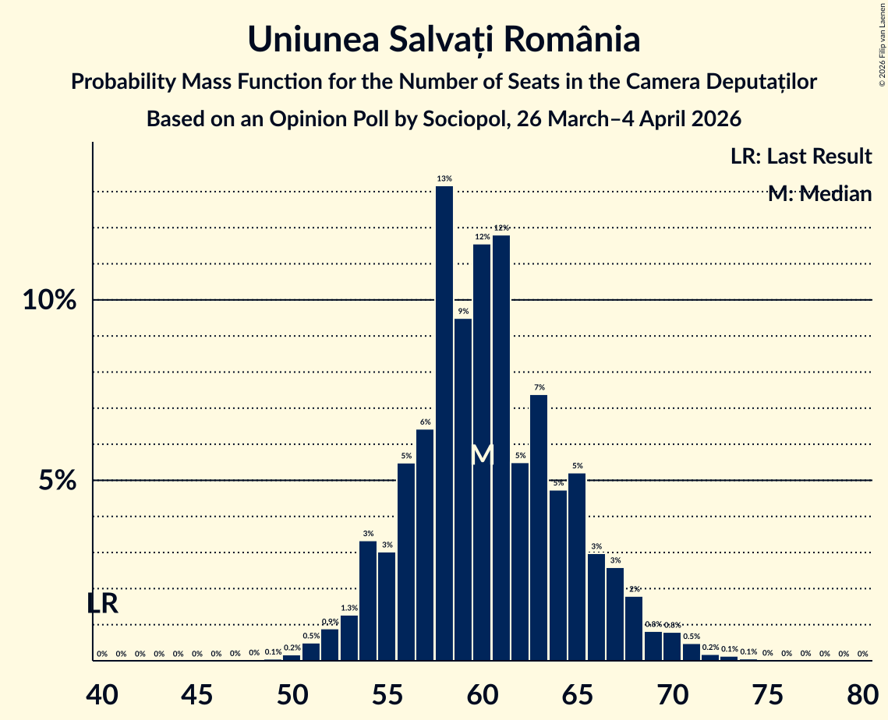

| Number of Seats | Probability | Accumulated | Special Marks |
|:---------------:|:-----------:|:-----------:|:-------------:|
| 40 | 0% | 100% | Last Result |
| 41 | 0% | 100% |  |
| 42 | 0% | 100% |  |
| 43 | 0% | 100% |  |
| 44 | 0% | 100% |  |
| 45 | 0% | 100% |  |
| 46 | 0% | 100% |  |
| 47 | 0% | 100% |  |
| 48 | 0% | 100% |  |
| 49 | 0.1% | 99.9% |  |
| 50 | 0.2% | 99.9% |  |
| 51 | 0.5% | 99.7% |  |
| 52 | 0.9% | 99.2% |  |
| 53 | 1.3% | 98% |  |
| 54 | 3% | 97% |  |
| 55 | 3% | 94% |  |
| 56 | 5% | 91% |  |
| 57 | 6% | 85% |  |
| 58 | 13% | 79% |  |
| 59 | 9% | 66% |  |
| 60 | 12% | 56% | Median |
| 61 | 12% | 45% |  |
| 62 | 5% | 33% |  |
| 63 | 7% | 27% |  |
| 64 | 5% | 20% |  |
| 65 | 5% | 15% |  |
| 66 | 3% | 10% |  |
| 67 | 3% | 7% |  |
| 68 | 2% | 4% |  |
| 69 | 0.8% | 3% |  |
| 70 | 0.8% | 2% |  |
| 71 | 0.5% | 0.9% |  |
| 72 | 0.2% | 0.4% |  |
| 73 | 0.1% | 0.3% |  |
| 74 | 0.1% | 0.1% |  |
| 75 | 0% | 0.1% |  |
| 76 | 0% | 0% |  |

### Partidul Național Liberal

*For a full overview of the results for this party, see the [Partidul Național Liberal](party-partidulnaționalliberal.html) page.*

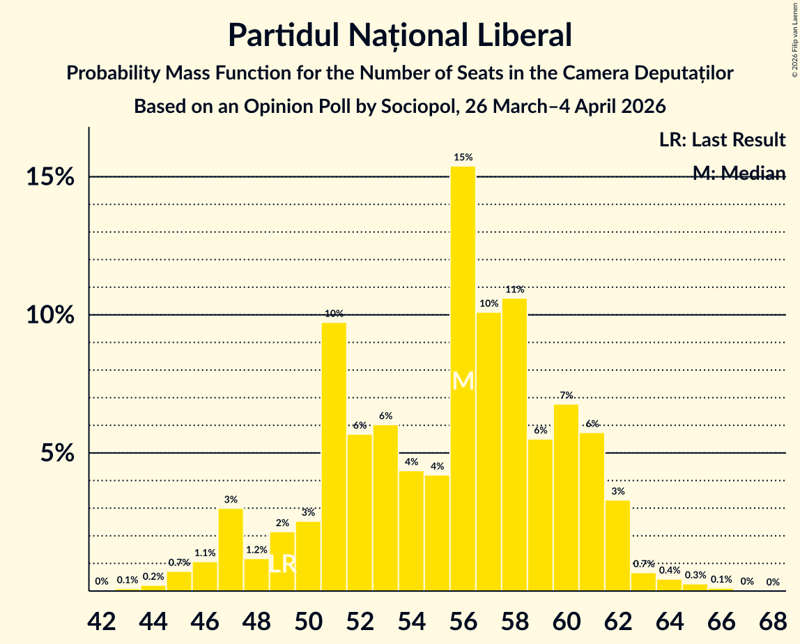

| Number of Seats | Probability | Accumulated | Special Marks |
|:---------------:|:-----------:|:-----------:|:-------------:|
| 42 | 0% | 100% |  |
| 43 | 0.1% | 99.9% |  |
| 44 | 0.2% | 99.8% |  |
| 45 | 0.7% | 99.6% |  |
| 46 | 1.1% | 98.9% |  |
| 47 | 3% | 98% |  |
| 48 | 1.2% | 95% |  |
| 49 | 2% | 94% | Last Result |
| 50 | 3% | 92% |  |
| 51 | 10% | 89% |  |
| 52 | 6% | 79% |  |
| 53 | 6% | 74% |  |
| 54 | 4% | 68% |  |
| 55 | 4% | 63% |  |
| 56 | 15% | 59% | Median |
| 57 | 10% | 44% |  |
| 58 | 11% | 33% |  |
| 59 | 6% | 23% |  |
| 60 | 7% | 17% |  |
| 61 | 6% | 11% |  |
| 62 | 3% | 5% |  |
| 63 | 0.7% | 2% |  |
| 64 | 0.4% | 0.9% |  |
| 65 | 0.3% | 0.4% |  |
| 66 | 0.1% | 0.2% |  |
| 67 | 0% | 0.1% |  |
| 68 | 0% | 0% |  |

### Romániai Magyar Demokrata Szövetség

*For a full overview of the results for this party, see the [Romániai Magyar Demokrata Szövetség](party-romániaimagyardemokrataszövetség.html) page.*

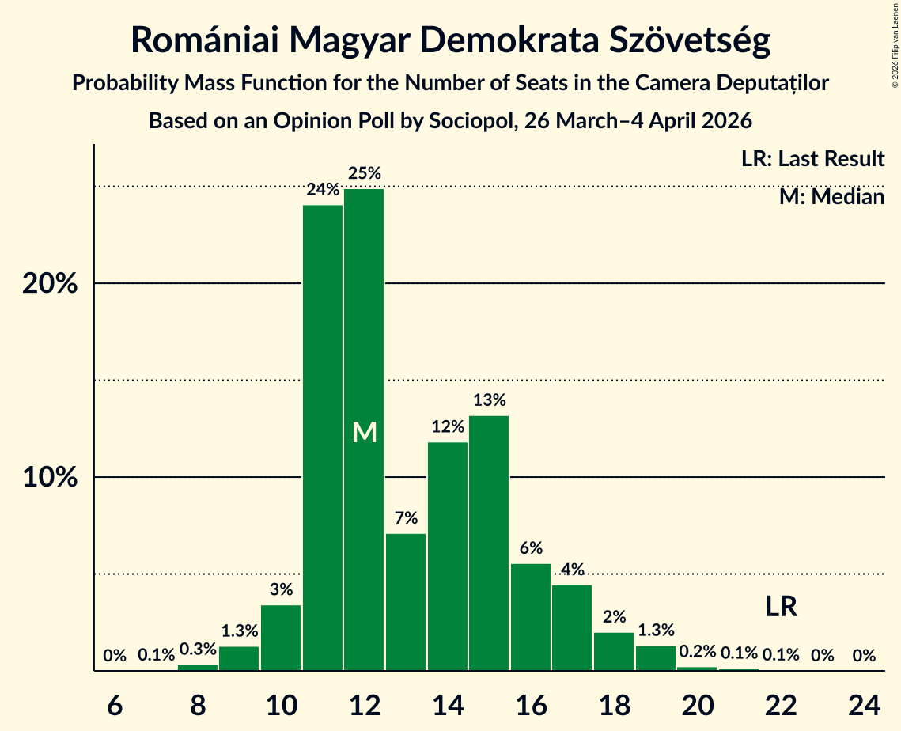

| Number of Seats | Probability | Accumulated | Special Marks |
|:---------------:|:-----------:|:-----------:|:-------------:|
| 7 | 0.1% | 100% |  |
| 8 | 0.3% | 99.9% |  |
| 9 | 1.3% | 99.6% |  |
| 10 | 3% | 98% |  |
| 11 | 24% | 95% |  |
| 12 | 25% | 71% | Median |
| 13 | 7% | 46% |  |
| 14 | 12% | 39% |  |
| 15 | 13% | 27% |  |
| 16 | 6% | 14% |  |
| 17 | 4% | 8% |  |
| 18 | 2% | 4% |  |
| 19 | 1.3% | 2% |  |
| 20 | 0.2% | 0.4% |  |
| 21 | 0.1% | 0.2% |  |
| 22 | 0.1% | 0.1% | Last Result |
| 23 | 0% | 0% |  |

### Sănătate, Educație, Natură, Sustenabilitate

*For a full overview of the results for this party, see the [Sănătate, Educație, Natură, Sustenabilitate](party-sănătateeducațienaturăsustenabilitate.html) page.*

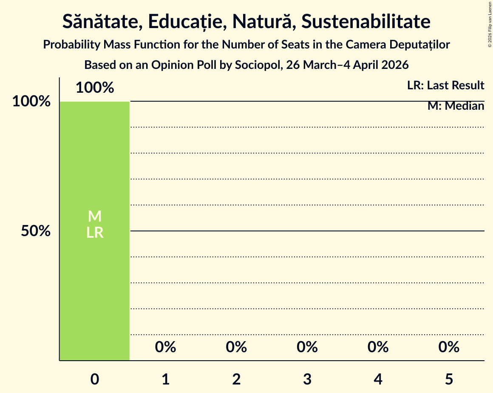

| Number of Seats | Probability | Accumulated | Special Marks |
|:---------------:|:-----------:|:-----------:|:-------------:|
| 0 | 100% | 100% | Last Result, Median |

### Partidul S.O.S. România

*For a full overview of the results for this party, see the [Partidul S.O.S. România](party-partidulsosromânia.html) page.*

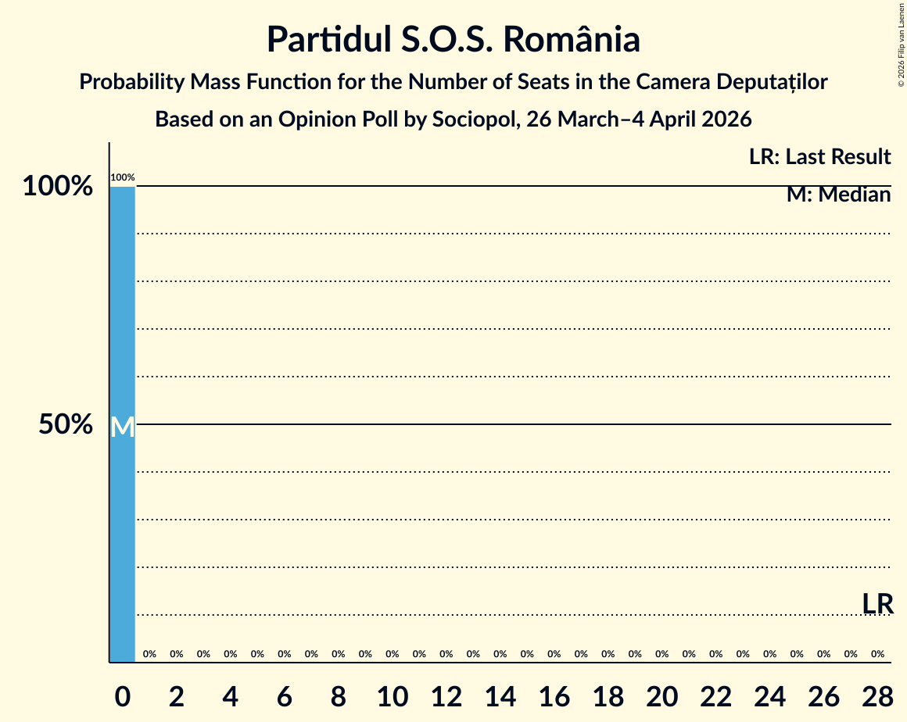

| Number of Seats | Probability | Accumulated | Special Marks |
|:---------------:|:-----------:|:-----------:|:-------------:|
| 0 | 100% | 100% | Median |
| 1 | 0% | 0% |  |
| 2 | 0% | 0% |  |
| 3 | 0% | 0% |  |
| 4 | 0% | 0% |  |
| 5 | 0% | 0% |  |
| 6 | 0% | 0% |  |
| 7 | 0% | 0% |  |
| 8 | 0% | 0% |  |
| 9 | 0% | 0% |  |
| 10 | 0% | 0% |  |
| 11 | 0% | 0% |  |
| 12 | 0% | 0% |  |
| 13 | 0% | 0% |  |
| 14 | 0% | 0% |  |
| 15 | 0% | 0% |  |
| 16 | 0% | 0% |  |
| 17 | 0% | 0% |  |
| 18 | 0% | 0% |  |
| 19 | 0% | 0% |  |
| 20 | 0% | 0% |  |
| 21 | 0% | 0% |  |
| 22 | 0% | 0% |  |
| 23 | 0% | 0% |  |
| 24 | 0% | 0% |  |
| 25 | 0% | 0% |  |
| 26 | 0% | 0% |  |
| 27 | 0% | 0% |  |
| 28 | 0% | 0% | Last Result |

### Partidul Oamenilor Tineri

*For a full overview of the results for this party, see the [Partidul Oamenilor Tineri](party-partiduloamenilortineri.html) page.*

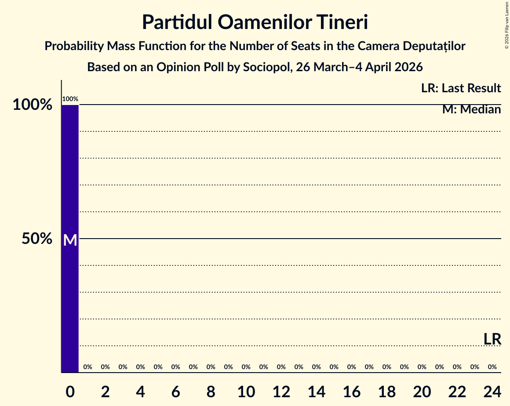

| Number of Seats | Probability | Accumulated | Special Marks |
|:---------------:|:-----------:|:-----------:|:-------------:|
| 0 | 100% | 100% | Median |
| 1 | 0% | 0% |  |
| 2 | 0% | 0% |  |
| 3 | 0% | 0% |  |
| 4 | 0% | 0% |  |
| 5 | 0% | 0% |  |
| 6 | 0% | 0% |  |
| 7 | 0% | 0% |  |
| 8 | 0% | 0% |  |
| 9 | 0% | 0% |  |
| 10 | 0% | 0% |  |
| 11 | 0% | 0% |  |
| 12 | 0% | 0% |  |
| 13 | 0% | 0% |  |
| 14 | 0% | 0% |  |
| 15 | 0% | 0% |  |
| 16 | 0% | 0% |  |
| 17 | 0% | 0% |  |
| 18 | 0% | 0% |  |
| 19 | 0% | 0% |  |
| 20 | 0% | 0% |  |
| 21 | 0% | 0% |  |
| 22 | 0% | 0% |  |
| 23 | 0% | 0% |  |
| 24 | 0% | 0% | Last Result |

### Reînnoim Proiectul European al României

*For a full overview of the results for this party, see the [Reînnoim Proiectul European al României](party-reînnoimproiectuleuropeanalromâniei.html) page.*

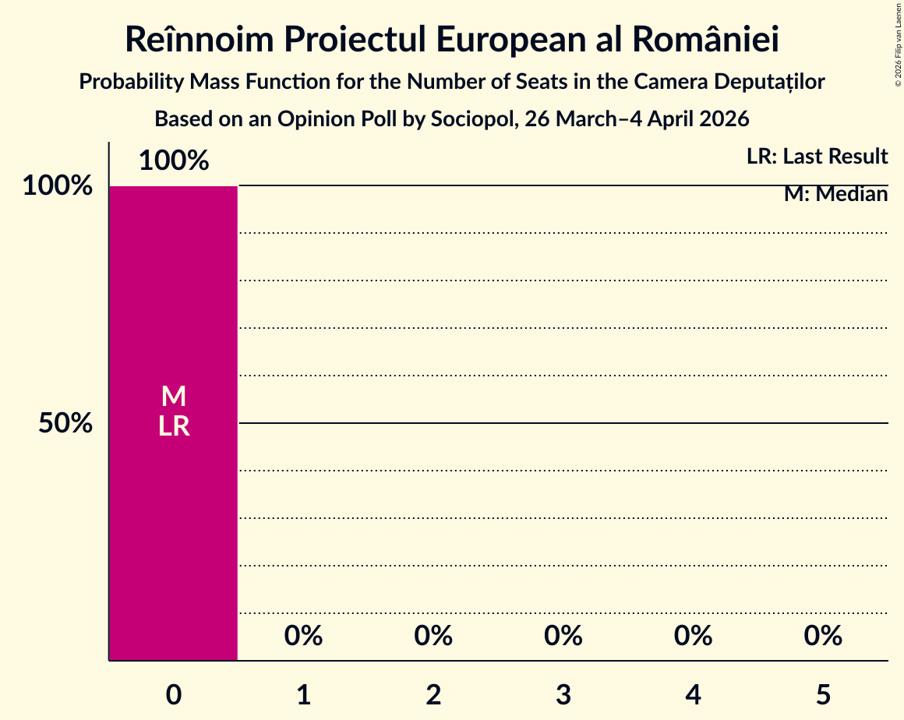

| Number of Seats | Probability | Accumulated | Special Marks |
|:---------------:|:-----------:|:-----------:|:-------------:|
| 0 | 100% | 100% | Last Result, Median |

### Forța Dreptei

*For a full overview of the results for this party, see the [Forța Dreptei](party-forțadreptei.html) page.*

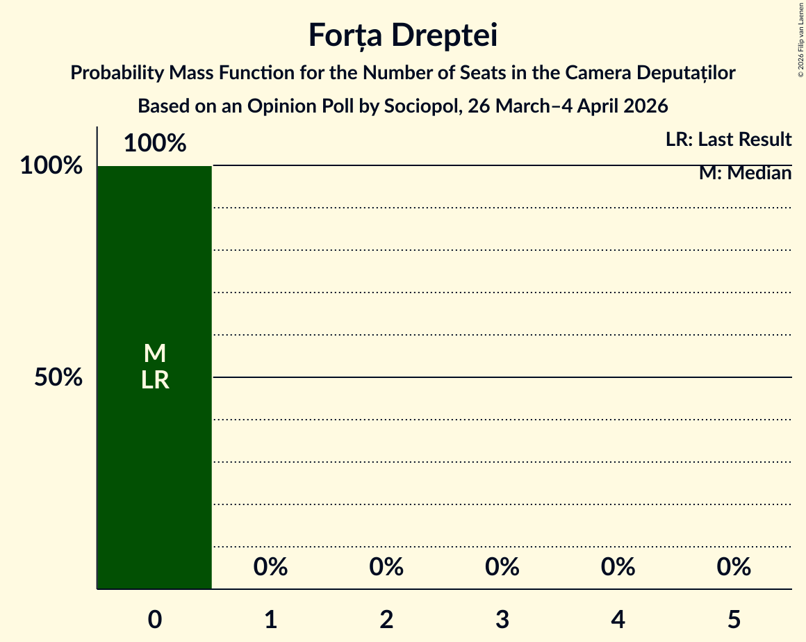

| Number of Seats | Probability | Accumulated | Special Marks |
|:---------------:|:-----------:|:-----------:|:-------------:|
| 0 | 100% | 100% | Last Result, Median |

## Coalitions

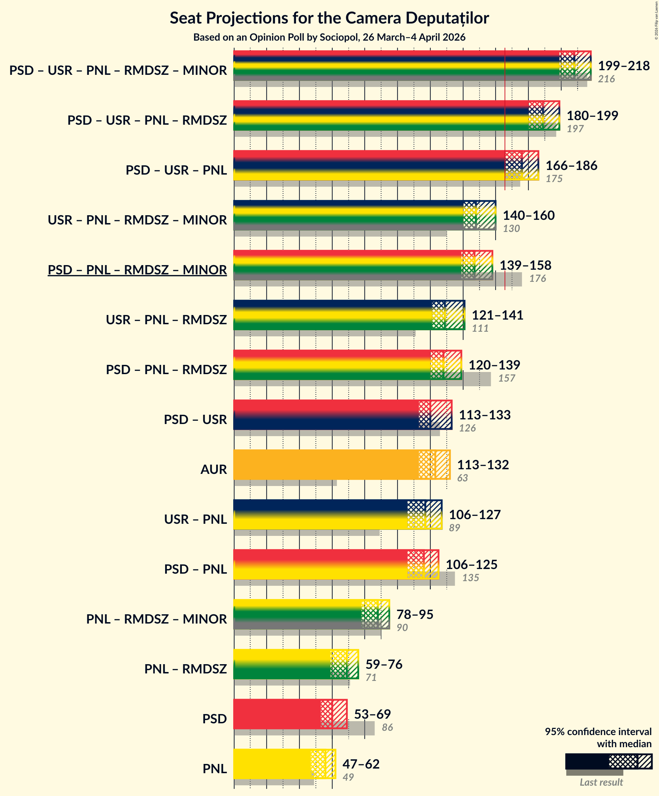

### Confidence Intervals

| Coalition | Last Result | Median | Majority? | 80% Confidence Interval | 90% Confidence Interval | 95% Confidence Interval | 99% Confidence Interval |
|:---------:|:-----------:|:------:|:---------:|:-----------------------:|:-----------------------:|:-----------------------:|:-----------------------:|
| Partidul Social Democrat – Uniunea Salvați România – Partidul Național Liberal – Romániai Magyar Demokrata Szövetség | 197 | 189 | 100% | 183–195 | 182–197 | 180–199 | 177–202 |
| Partidul Social Democrat – Uniunea Salvați România – Partidul Național Liberal | 175 | 176 | 98% | 170–182 | 168–184 | 166–186 | 163–189 |
| Uniunea Salvați România – Partidul Național Liberal – Romániai Magyar Demokrata Szövetség | 111 | 129 | 0% | 123–135 | 122–138 | 121–141 | 116–142 |
| Partidul Social Democrat – Partidul Național Liberal – Romániai Magyar Demokrata Szövetség | 157 | 128 | 0% | 122–135 | 120–137 | 120–139 | 117–142 |
| Partidul Social Democrat – Uniunea Salvați România | 126 | 120 | 0% | 116–127 | 114–131 | 113–133 | 111–135 |
| Alianța pentru Unirea Românilor | 63 | 123 | 0% | 117–129 | 115–130 | 113–132 | 110–135 |
| Uniunea Salvați România – Partidul Național Liberal | 89 | 117 | 0% | 109–122 | 107–125 | 106–127 | 103–128 |
| Partidul Social Democrat – Partidul Național Liberal | 135 | 116 | 0% | 109–123 | 108–124 | 106–125 | 103–128 |
| Partidul Național Liberal – Romániai Magyar Demokrata Szövetség | 71 | 69 | 0% | 63–74 | 61–75 | 59–76 | 57–78 |
| Partidul Social Democrat | 86 | 60 | 0% | 55–66 | 54–67 | 53–69 | 51–71 |
| Partidul Național Liberal | 49 | 56 | 0% | 50–61 | 47–61 | 47–62 | 45–64 |

### Partidul Social Democrat – Uniunea Salvați România – Partidul Național Liberal – Romániai Magyar Demokrata Szövetség

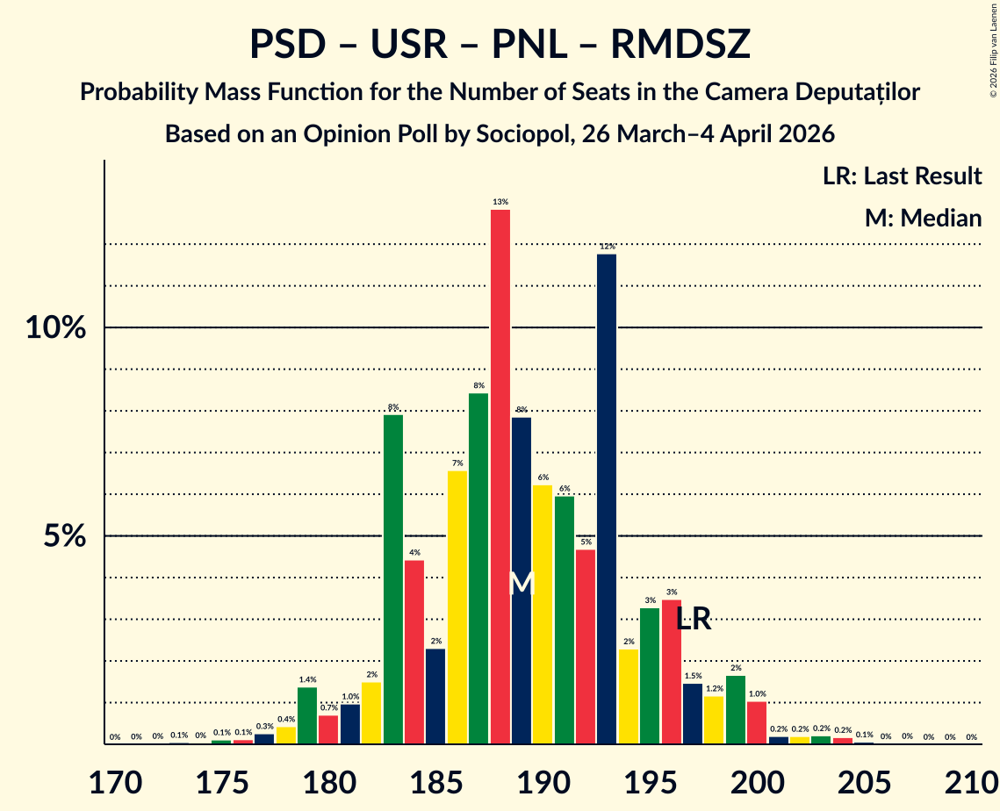

| Number of Seats | Probability | Accumulated | Special Marks |
|:---------------:|:-----------:|:-----------:|:-------------:|
| 173 | 0.1% | 100% |  |
| 174 | 0% | 99.9% |  |
| 175 | 0.1% | 99.9% |  |
| 176 | 0.1% | 99.7% |  |
| 177 | 0.3% | 99.6% |  |
| 178 | 0.4% | 99.4% |  |
| 179 | 1.4% | 98.9% |  |
| 180 | 0.7% | 98% |  |
| 181 | 1.0% | 97% |  |
| 182 | 2% | 96% |  |
| 183 | 8% | 94% |  |
| 184 | 4% | 86% |  |
| 185 | 2% | 82% |  |
| 186 | 7% | 80% |  |
| 187 | 8% | 73% |  |
| 188 | 13% | 65% | Median |
| 189 | 8% | 52% |  |
| 190 | 6% | 44% |  |
| 191 | 6% | 38% |  |
| 192 | 5% | 32% |  |
| 193 | 12% | 27% |  |
| 194 | 2% | 15% |  |
| 195 | 3% | 13% |  |
| 196 | 3% | 10% |  |
| 197 | 1.5% | 6% | Last Result |
| 198 | 1.2% | 5% |  |
| 199 | 2% | 4% |  |
| 200 | 1.0% | 2% |  |
| 201 | 0.2% | 0.9% |  |
| 202 | 0.2% | 0.7% |  |
| 203 | 0.2% | 0.5% |  |
| 204 | 0.2% | 0.3% |  |
| 205 | 0.1% | 0.1% |  |
| 206 | 0% | 0.1% |  |
| 207 | 0% | 0% |  |

### Partidul Social Democrat – Uniunea Salvați România – Partidul Național Liberal

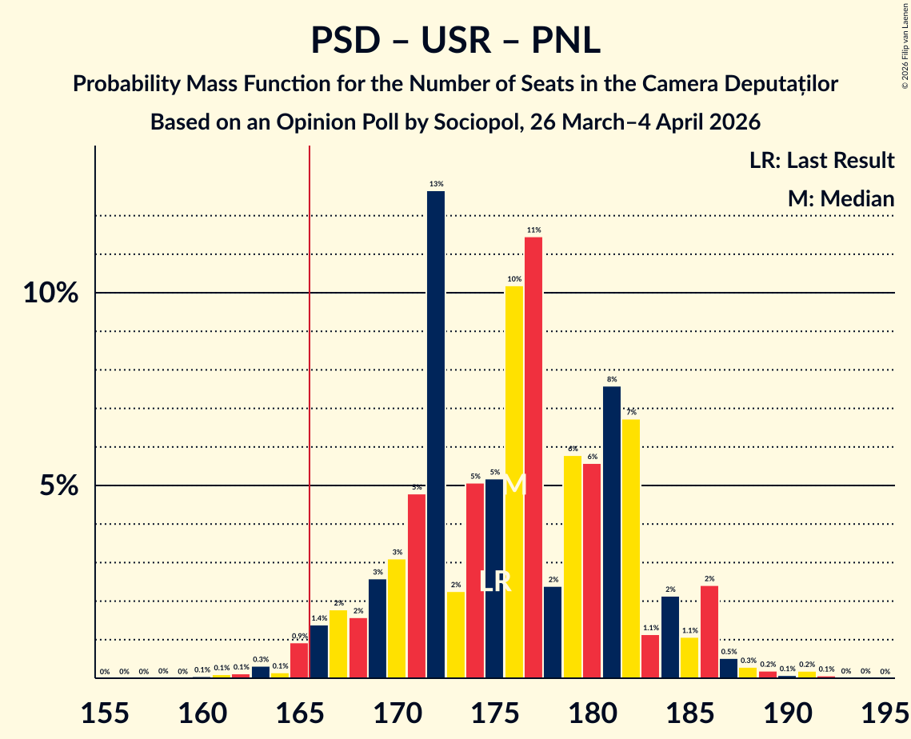

| Number of Seats | Probability | Accumulated | Special Marks |
|:---------------:|:-----------:|:-----------:|:-------------:|
| 160 | 0.1% | 100% |  |
| 161 | 0.1% | 99.9% |  |
| 162 | 0.1% | 99.8% |  |
| 163 | 0.3% | 99.7% |  |
| 164 | 0.1% | 99.4% |  |
| 165 | 0.9% | 99.2% |  |
| 166 | 1.4% | 98% | Majority |
| 167 | 2% | 97% |  |
| 168 | 2% | 95% |  |
| 169 | 3% | 94% |  |
| 170 | 3% | 91% |  |
| 171 | 5% | 88% |  |
| 172 | 13% | 83% |  |
| 173 | 2% | 70% |  |
| 174 | 5% | 68% |  |
| 175 | 5% | 63% | Last Result |
| 176 | 10% | 58% | Median |
| 177 | 11% | 48% |  |
| 178 | 2% | 36% |  |
| 179 | 6% | 34% |  |
| 180 | 6% | 28% |  |
| 181 | 8% | 22% |  |
| 182 | 7% | 15% |  |
| 183 | 1.1% | 8% |  |
| 184 | 2% | 7% |  |
| 185 | 1.1% | 5% |  |
| 186 | 2% | 4% |  |
| 187 | 0.5% | 1.4% |  |
| 188 | 0.3% | 0.9% |  |
| 189 | 0.2% | 0.6% |  |
| 190 | 0.1% | 0.4% |  |
| 191 | 0.2% | 0.3% |  |
| 192 | 0.1% | 0.1% |  |
| 193 | 0% | 0% |  |

### Uniunea Salvați România – Partidul Național Liberal – Romániai Magyar Demokrata Szövetség

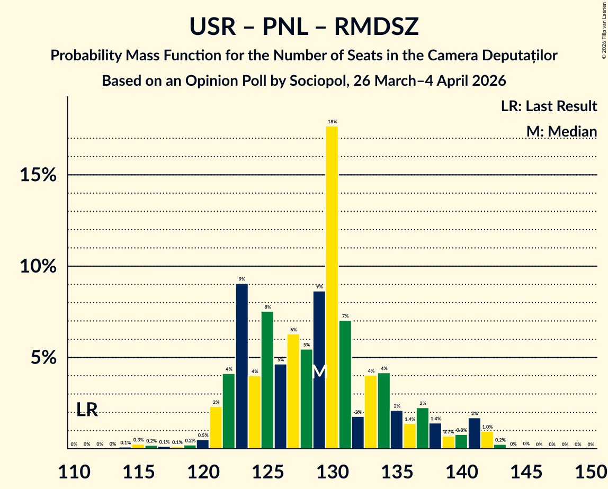

| Number of Seats | Probability | Accumulated | Special Marks |
|:---------------:|:-----------:|:-----------:|:-------------:|
| 111 | 0% | 100% | Last Result |
| 112 | 0% | 100% |  |
| 113 | 0% | 99.9% |  |
| 114 | 0.1% | 99.9% |  |
| 115 | 0.3% | 99.8% |  |
| 116 | 0.2% | 99.6% |  |
| 117 | 0.1% | 99.4% |  |
| 118 | 0.1% | 99.2% |  |
| 119 | 0.2% | 99.1% |  |
| 120 | 0.5% | 98.9% |  |
| 121 | 2% | 98% |  |
| 122 | 4% | 96% |  |
| 123 | 9% | 92% |  |
| 124 | 4% | 83% |  |
| 125 | 8% | 79% |  |
| 126 | 5% | 71% |  |
| 127 | 6% | 67% |  |
| 128 | 5% | 60% | Median |
| 129 | 9% | 55% |  |
| 130 | 18% | 46% |  |
| 131 | 7% | 29% |  |
| 132 | 2% | 22% |  |
| 133 | 4% | 20% |  |
| 134 | 4% | 16% |  |
| 135 | 2% | 12% |  |
| 136 | 1.4% | 10% |  |
| 137 | 2% | 8% |  |
| 138 | 1.4% | 6% |  |
| 139 | 0.7% | 4% |  |
| 140 | 0.8% | 4% |  |
| 141 | 2% | 3% |  |
| 142 | 1.0% | 1.3% |  |
| 143 | 0.2% | 0.3% |  |
| 144 | 0% | 0.1% |  |
| 145 | 0% | 0.1% |  |
| 146 | 0% | 0% |  |

### Partidul Social Democrat – Partidul Național Liberal – Romániai Magyar Demokrata Szövetség

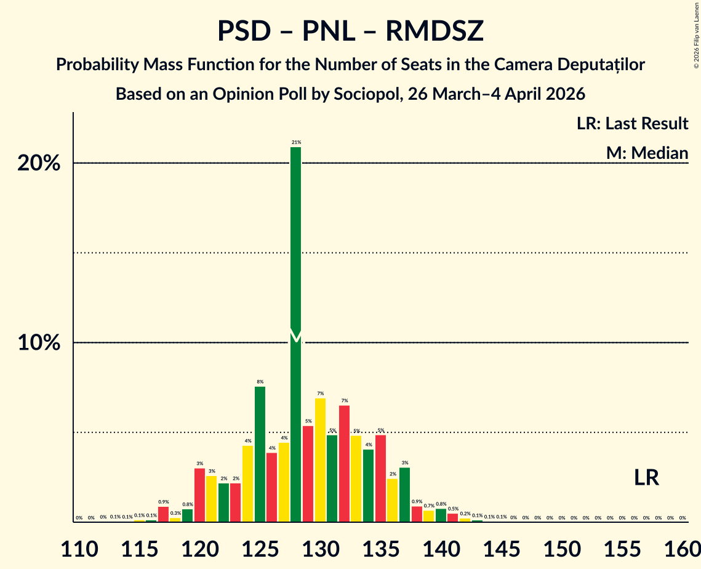

| Number of Seats | Probability | Accumulated | Special Marks |
|:---------------:|:-----------:|:-----------:|:-------------:|
| 112 | 0% | 100% |  |
| 113 | 0.1% | 99.9% |  |
| 114 | 0.1% | 99.9% |  |
| 115 | 0.1% | 99.8% |  |
| 116 | 0.1% | 99.7% |  |
| 117 | 0.9% | 99.5% |  |
| 118 | 0.3% | 98.6% |  |
| 119 | 0.8% | 98% |  |
| 120 | 3% | 98% |  |
| 121 | 3% | 95% |  |
| 122 | 2% | 92% |  |
| 123 | 2% | 90% |  |
| 124 | 4% | 88% |  |
| 125 | 8% | 83% |  |
| 126 | 4% | 76% |  |
| 127 | 4% | 72% |  |
| 128 | 21% | 67% | Median |
| 129 | 5% | 46% |  |
| 130 | 7% | 41% |  |
| 131 | 5% | 34% |  |
| 132 | 7% | 29% |  |
| 133 | 5% | 23% |  |
| 134 | 4% | 18% |  |
| 135 | 5% | 14% |  |
| 136 | 2% | 9% |  |
| 137 | 3% | 6% |  |
| 138 | 0.9% | 3% |  |
| 139 | 0.7% | 3% |  |
| 140 | 0.8% | 2% |  |
| 141 | 0.5% | 1.1% |  |
| 142 | 0.2% | 0.5% |  |
| 143 | 0.1% | 0.3% |  |
| 144 | 0.1% | 0.2% |  |
| 145 | 0.1% | 0.1% |  |
| 146 | 0% | 0% |  |
| 147 | 0% | 0% |  |
| 148 | 0% | 0% |  |
| 149 | 0% | 0% |  |
| 150 | 0% | 0% |  |
| 151 | 0% | 0% |  |
| 152 | 0% | 0% |  |
| 153 | 0% | 0% |  |
| 154 | 0% | 0% |  |
| 155 | 0% | 0% |  |
| 156 | 0% | 0% |  |
| 157 | 0% | 0% | Last Result |

### Partidul Social Democrat – Uniunea Salvați România

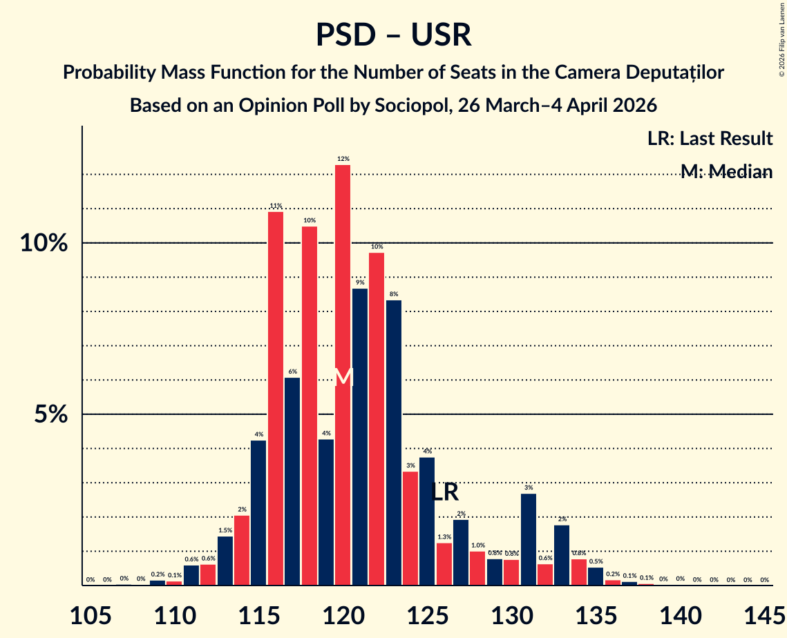

| Number of Seats | Probability | Accumulated | Special Marks |
|:---------------:|:-----------:|:-----------:|:-------------:|
| 107 | 0% | 100% |  |
| 108 | 0% | 99.9% |  |
| 109 | 0.2% | 99.9% |  |
| 110 | 0.1% | 99.7% |  |
| 111 | 0.6% | 99.6% |  |
| 112 | 0.6% | 99.0% |  |
| 113 | 1.5% | 98% |  |
| 114 | 2% | 97% |  |
| 115 | 4% | 95% |  |
| 116 | 11% | 91% |  |
| 117 | 6% | 80% |  |
| 118 | 10% | 74% |  |
| 119 | 4% | 63% |  |
| 120 | 12% | 59% | Median |
| 121 | 9% | 47% |  |
| 122 | 10% | 38% |  |
| 123 | 8% | 28% |  |
| 124 | 3% | 20% |  |
| 125 | 4% | 16% |  |
| 126 | 1.3% | 13% | Last Result |
| 127 | 2% | 11% |  |
| 128 | 1.0% | 9% |  |
| 129 | 0.8% | 8% |  |
| 130 | 0.8% | 8% |  |
| 131 | 3% | 7% |  |
| 132 | 0.6% | 4% |  |
| 133 | 2% | 4% |  |
| 134 | 0.8% | 2% |  |
| 135 | 0.5% | 1.0% |  |
| 136 | 0.2% | 0.4% |  |
| 137 | 0.1% | 0.3% |  |
| 138 | 0.1% | 0.1% |  |
| 139 | 0% | 0.1% |  |
| 140 | 0% | 0.1% |  |
| 141 | 0% | 0% |  |

### Alianța pentru Unirea Românilor

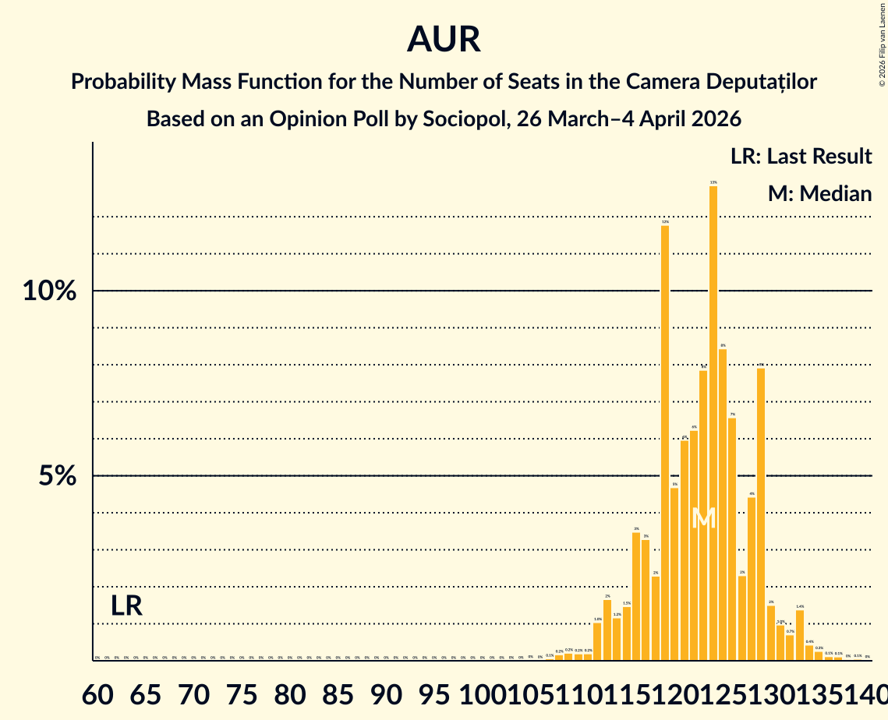

| Number of Seats | Probability | Accumulated | Special Marks |
|:---------------:|:-----------:|:-----------:|:-------------:|
| 63 | 0% | 100% | Last Result |
| 64 | 0% | 100% |  |
| 65 | 0% | 100% |  |
| 66 | 0% | 100% |  |
| 67 | 0% | 100% |  |
| 68 | 0% | 100% |  |
| 69 | 0% | 100% |  |
| 70 | 0% | 100% |  |
| 71 | 0% | 100% |  |
| 72 | 0% | 100% |  |
| 73 | 0% | 100% |  |
| 74 | 0% | 100% |  |
| 75 | 0% | 100% |  |
| 76 | 0% | 100% |  |
| 77 | 0% | 100% |  |
| 78 | 0% | 100% |  |
| 79 | 0% | 100% |  |
| 80 | 0% | 100% |  |
| 81 | 0% | 100% |  |
| 82 | 0% | 100% |  |
| 83 | 0% | 100% |  |
| 84 | 0% | 100% |  |
| 85 | 0% | 100% |  |
| 86 | 0% | 100% |  |
| 87 | 0% | 100% |  |
| 88 | 0% | 100% |  |
| 89 | 0% | 100% |  |
| 90 | 0% | 100% |  |
| 91 | 0% | 100% |  |
| 92 | 0% | 100% |  |
| 93 | 0% | 100% |  |
| 94 | 0% | 100% |  |
| 95 | 0% | 100% |  |
| 96 | 0% | 100% |  |
| 97 | 0% | 100% |  |
| 98 | 0% | 100% |  |
| 99 | 0% | 100% |  |
| 100 | 0% | 100% |  |
| 101 | 0% | 100% |  |
| 102 | 0% | 100% |  |
| 103 | 0% | 100% |  |
| 104 | 0% | 100% |  |
| 105 | 0% | 100% |  |
| 106 | 0% | 100% |  |
| 107 | 0.1% | 99.9% |  |
| 108 | 0.2% | 99.9% |  |
| 109 | 0.2% | 99.7% |  |
| 110 | 0.2% | 99.5% |  |
| 111 | 0.2% | 99.3% |  |
| 112 | 1.0% | 99.1% |  |
| 113 | 2% | 98% |  |
| 114 | 1.2% | 96% |  |
| 115 | 1.5% | 95% |  |
| 116 | 3% | 94% |  |
| 117 | 3% | 90% |  |
| 118 | 2% | 87% |  |
| 119 | 12% | 85% |  |
| 120 | 5% | 73% |  |
| 121 | 6% | 68% |  |
| 122 | 6% | 62% |  |
| 123 | 8% | 56% | Median |
| 124 | 13% | 48% |  |
| 125 | 8% | 35% |  |
| 126 | 7% | 27% |  |
| 127 | 2% | 20% |  |
| 128 | 4% | 18% |  |
| 129 | 8% | 14% |  |
| 130 | 2% | 6% |  |
| 131 | 1.0% | 4% |  |
| 132 | 0.7% | 3% |  |
| 133 | 1.4% | 2% |  |
| 134 | 0.4% | 1.1% |  |
| 135 | 0.3% | 0.6% |  |
| 136 | 0.1% | 0.4% |  |
| 137 | 0.1% | 0.3% |  |
| 138 | 0% | 0.1% |  |
| 139 | 0.1% | 0.1% |  |
| 140 | 0% | 0% |  |

### Uniunea Salvați România – Partidul Național Liberal

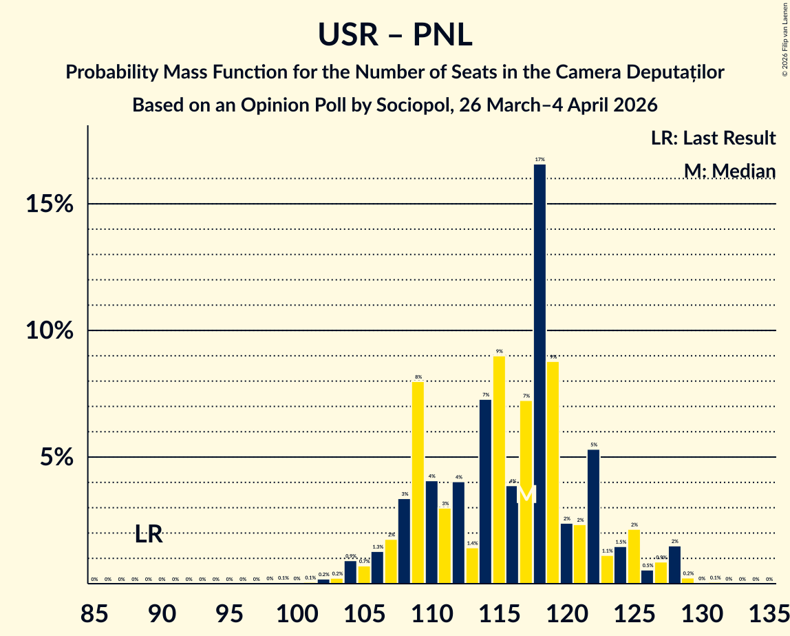

| Number of Seats | Probability | Accumulated | Special Marks |
|:---------------:|:-----------:|:-----------:|:-------------:|
| 89 | 0% | 100% | Last Result |
| 90 | 0% | 100% |  |
| 91 | 0% | 100% |  |
| 92 | 0% | 100% |  |
| 93 | 0% | 100% |  |
| 94 | 0% | 100% |  |
| 95 | 0% | 100% |  |
| 96 | 0% | 100% |  |
| 97 | 0% | 100% |  |
| 98 | 0% | 100% |  |
| 99 | 0.1% | 100% |  |
| 100 | 0% | 99.9% |  |
| 101 | 0.1% | 99.9% |  |
| 102 | 0.2% | 99.8% |  |
| 103 | 0.2% | 99.6% |  |
| 104 | 0.9% | 99.4% |  |
| 105 | 0.7% | 98% |  |
| 106 | 1.3% | 98% |  |
| 107 | 2% | 96% |  |
| 108 | 3% | 95% |  |
| 109 | 8% | 91% |  |
| 110 | 4% | 83% |  |
| 111 | 3% | 79% |  |
| 112 | 4% | 76% |  |
| 113 | 1.4% | 72% |  |
| 114 | 7% | 71% |  |
| 115 | 9% | 64% |  |
| 116 | 4% | 55% | Median |
| 117 | 7% | 51% |  |
| 118 | 17% | 43% |  |
| 119 | 9% | 27% |  |
| 120 | 2% | 18% |  |
| 121 | 2% | 16% |  |
| 122 | 5% | 13% |  |
| 123 | 1.1% | 8% |  |
| 124 | 1.5% | 7% |  |
| 125 | 2% | 5% |  |
| 126 | 0.5% | 3% |  |
| 127 | 0.9% | 3% |  |
| 128 | 2% | 2% |  |
| 129 | 0.2% | 0.4% |  |
| 130 | 0% | 0.1% |  |
| 131 | 0.1% | 0.1% |  |
| 132 | 0% | 0% |  |

### Partidul Social Democrat – Partidul Național Liberal

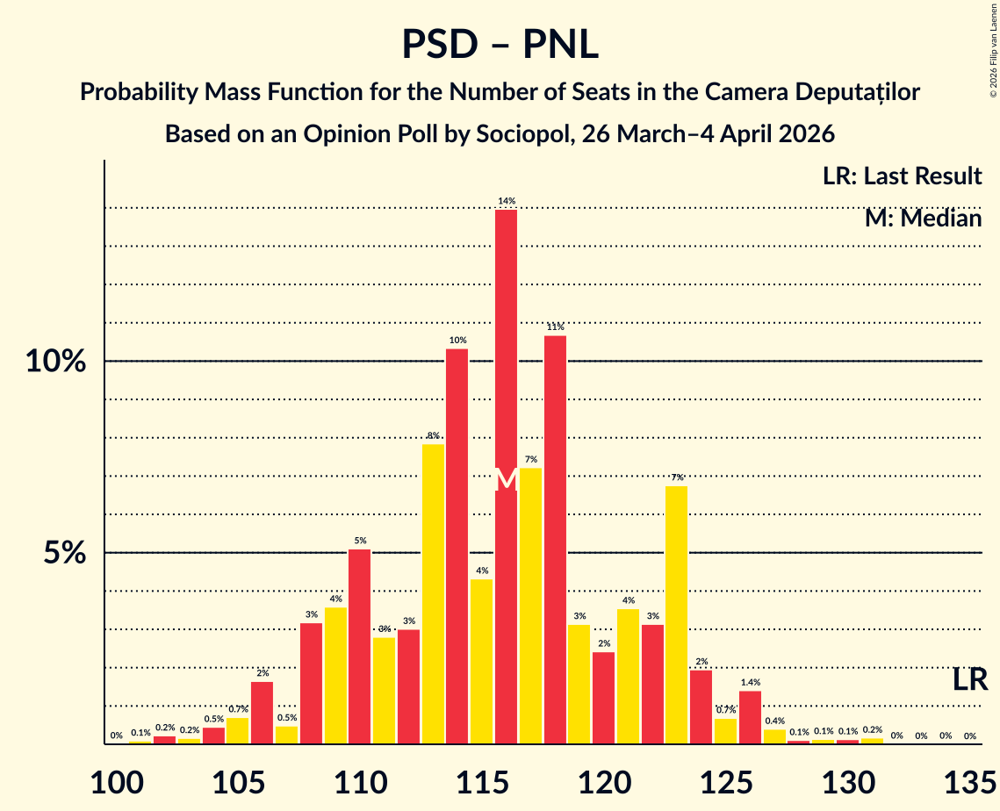

| Number of Seats | Probability | Accumulated | Special Marks |
|:---------------:|:-----------:|:-----------:|:-------------:|
| 101 | 0.1% | 100% |  |
| 102 | 0.2% | 99.9% |  |
| 103 | 0.2% | 99.6% |  |
| 104 | 0.5% | 99.5% |  |
| 105 | 0.7% | 99.0% |  |
| 106 | 2% | 98% |  |
| 107 | 0.5% | 97% |  |
| 108 | 3% | 96% |  |
| 109 | 4% | 93% |  |
| 110 | 5% | 89% |  |
| 111 | 3% | 84% |  |
| 112 | 3% | 81% |  |
| 113 | 8% | 78% |  |
| 114 | 10% | 71% |  |
| 115 | 4% | 60% |  |
| 116 | 14% | 56% | Median |
| 117 | 7% | 42% |  |
| 118 | 11% | 35% |  |
| 119 | 3% | 24% |  |
| 120 | 2% | 21% |  |
| 121 | 4% | 19% |  |
| 122 | 3% | 15% |  |
| 123 | 7% | 12% |  |
| 124 | 2% | 5% |  |
| 125 | 0.7% | 3% |  |
| 126 | 1.4% | 2% |  |
| 127 | 0.4% | 1.0% |  |
| 128 | 0.1% | 0.6% |  |
| 129 | 0.1% | 0.5% |  |
| 130 | 0.1% | 0.4% |  |
| 131 | 0.2% | 0.2% |  |
| 132 | 0% | 0.1% |  |
| 133 | 0% | 0% |  |
| 134 | 0% | 0% |  |
| 135 | 0% | 0% | Last Result |

### Partidul Național Liberal – Romániai Magyar Demokrata Szövetség

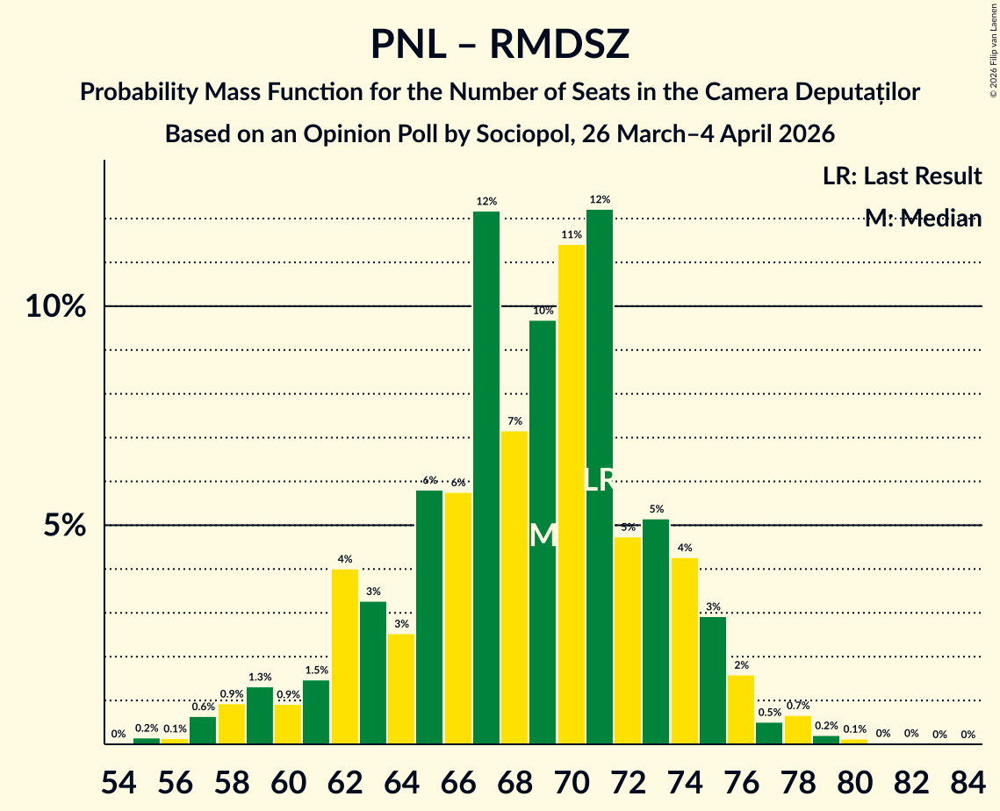

| Number of Seats | Probability | Accumulated | Special Marks |
|:---------------:|:-----------:|:-----------:|:-------------:|
| 54 | 0% | 100% |  |
| 55 | 0.2% | 99.9% |  |
| 56 | 0.1% | 99.8% |  |
| 57 | 0.6% | 99.7% |  |
| 58 | 0.9% | 99.0% |  |
| 59 | 1.3% | 98% |  |
| 60 | 0.9% | 97% |  |
| 61 | 1.5% | 96% |  |
| 62 | 4% | 94% |  |
| 63 | 3% | 90% |  |
| 64 | 3% | 87% |  |
| 65 | 6% | 85% |  |
| 66 | 6% | 79% |  |
| 67 | 12% | 73% |  |
| 68 | 7% | 61% | Median |
| 69 | 10% | 54% |  |
| 70 | 11% | 44% |  |
| 71 | 12% | 33% | Last Result |
| 72 | 5% | 20% |  |
| 73 | 5% | 16% |  |
| 74 | 4% | 10% |  |
| 75 | 3% | 6% |  |
| 76 | 2% | 3% |  |
| 77 | 0.5% | 2% |  |
| 78 | 0.7% | 1.1% |  |
| 79 | 0.2% | 0.4% |  |
| 80 | 0.1% | 0.2% |  |
| 81 | 0% | 0.1% |  |
| 82 | 0% | 0.1% |  |
| 83 | 0% | 0% |  |

### Partidul Social Democrat

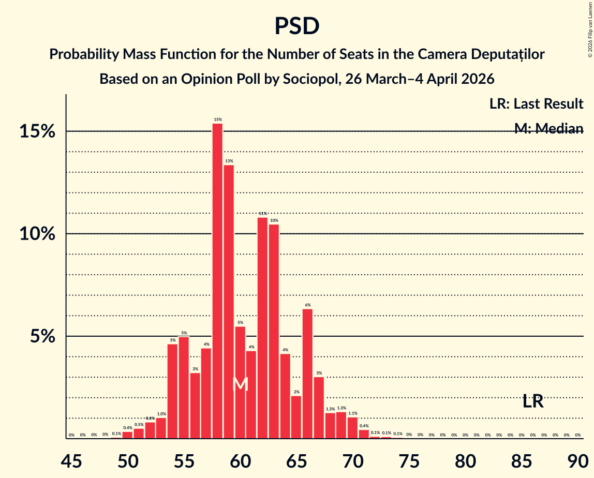

| Number of Seats | Probability | Accumulated | Special Marks |
|:---------------:|:-----------:|:-----------:|:-------------:|
| 48 | 0% | 100% |  |
| 49 | 0.1% | 99.9% |  |
| 50 | 0.4% | 99.9% |  |
| 51 | 0.5% | 99.5% |  |
| 52 | 0.8% | 99.0% |  |
| 53 | 1.0% | 98% |  |
| 54 | 5% | 97% |  |
| 55 | 5% | 93% |  |
| 56 | 3% | 88% |  |
| 57 | 4% | 84% |  |
| 58 | 15% | 80% |  |
| 59 | 13% | 64% |  |
| 60 | 5% | 51% | Median |
| 61 | 4% | 46% |  |
| 62 | 11% | 41% |  |
| 63 | 10% | 31% |  |
| 64 | 4% | 20% |  |
| 65 | 2% | 16% |  |
| 66 | 6% | 14% |  |
| 67 | 3% | 7% |  |
| 68 | 1.3% | 4% |  |
| 69 | 1.3% | 3% |  |
| 70 | 1.1% | 2% |  |
| 71 | 0.4% | 0.8% |  |
| 72 | 0.1% | 0.3% |  |
| 73 | 0.1% | 0.2% |  |
| 74 | 0.1% | 0.1% |  |
| 75 | 0% | 0.1% |  |
| 76 | 0% | 0% |  |
| 77 | 0% | 0% |  |
| 78 | 0% | 0% |  |
| 79 | 0% | 0% |  |
| 80 | 0% | 0% |  |
| 81 | 0% | 0% |  |
| 82 | 0% | 0% |  |
| 83 | 0% | 0% |  |
| 84 | 0% | 0% |  |
| 85 | 0% | 0% |  |
| 86 | 0% | 0% | Last Result |

### Partidul Național Liberal

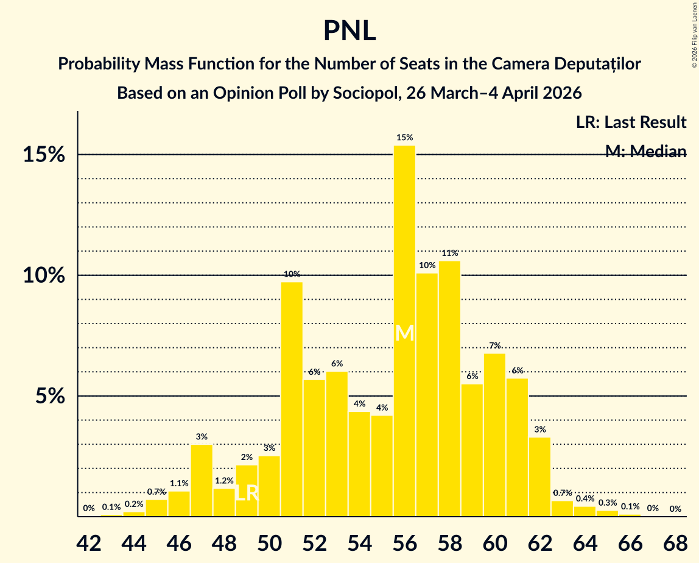

| Number of Seats | Probability | Accumulated | Special Marks |
|:---------------:|:-----------:|:-----------:|:-------------:|
| 42 | 0% | 100% |  |
| 43 | 0.1% | 99.9% |  |
| 44 | 0.2% | 99.8% |  |
| 45 | 0.7% | 99.6% |  |
| 46 | 1.1% | 98.9% |  |
| 47 | 3% | 98% |  |
| 48 | 1.2% | 95% |  |
| 49 | 2% | 94% | Last Result |
| 50 | 3% | 92% |  |
| 51 | 10% | 89% |  |
| 52 | 6% | 79% |  |
| 53 | 6% | 74% |  |
| 54 | 4% | 68% |  |
| 55 | 4% | 63% |  |
| 56 | 15% | 59% | Median |
| 57 | 10% | 44% |  |
| 58 | 11% | 33% |  |
| 59 | 6% | 23% |  |
| 60 | 7% | 17% |  |
| 61 | 6% | 11% |  |
| 62 | 3% | 5% |  |
| 63 | 0.7% | 2% |  |
| 64 | 0.4% | 0.9% |  |
| 65 | 0.3% | 0.4% |  |
| 66 | 0.1% | 0.2% |  |
| 67 | 0% | 0.1% |  |
| 68 | 0% | 0% |  |

## Technical Information

### Opinion Poll

+ **Polling firm:** Sociopol
+ **Commissioner(s):** —
+ **Fieldwork period:** 26 March–4 April 2026

### Calculations

+ **Sample size:** 1008
+ **Simulations done:** 2,097,152
+ **Error estimate:** 1.34%

