# Opinion Poll by ARP, 1–10 April 2026

<a href="#voting-intentions">Voting Intentions</a> | <a href="#seats">Seats</a> | <a href="#coalitions">Coalitions</a> | <a href="#technical-information">Technical Information</a>

## Voting Intentions

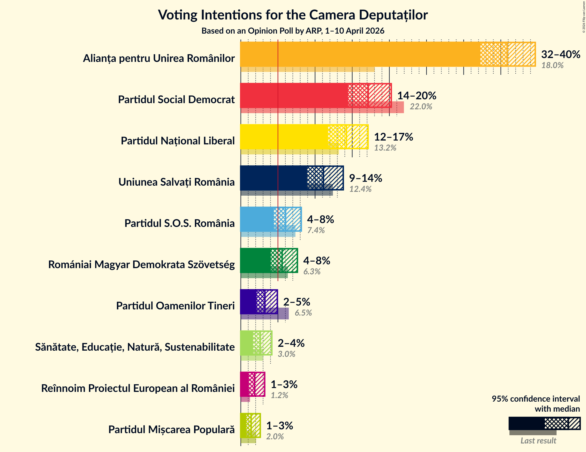

### Confidence Intervals

| Party | Last Result | Poll Result | 80% Confidence Interval | 90% Confidence Interval | 95% Confidence Interval | 99% Confidence Interval |
|:-----:|:-----------:|:-----------:|:-----------------------:|:-----------------------:|:-----------------------:|:-----------------------:|
| Alianța pentru Unirea Românilor | 18.0% | 35.9% | 33.5–38.3% |32.8–39.0% |32.3–39.6% |31.1–40.8% |
| Partidul Social Democrat | 22.0% | 17.2% | 15.4–19.2% |14.9–19.8% |14.4–20.3% |13.6–21.3% |
| Partidul Național Liberal | 13.2% | 14.2% | 12.6–16.1% |12.1–16.7% |11.7–17.1% |11.0–18.1% |
| Uniunea Salvați România | 12.4% | 11.1% | 9.7–12.9% |9.3–13.4% |8.9–13.8% |8.3–14.7% |
| Partidul S.O.S. România | 7.4% | 6.0% | 5.0–7.4% |4.7–7.8% |4.4–8.1% |4.0–8.9% |
| Romániai Magyar Demokrata Szövetség | 6.3% | 5.6% | 4.6–6.9% |4.3–7.3% |4.0–7.6% |3.6–8.3% |
| Partidul Oamenilor Tineri | 6.5% | 3.2% | 2.5–4.3% |2.3–4.6% |2.1–4.9% |1.8–5.5% |
| Sănătate, Educație, Natură, Sustenabilitate | 3.0% | 2.6% | 2.0–3.6% |1.8–3.9% |1.6–4.2% |1.4–4.7% |
| Reînnoim Proiectul European al României | 1.2% | 1.9% | 1.3–2.7% |1.2–3.0% |1.1–3.2% |0.9–3.7% |
| Partidul Mișcarea Populară | 2.0% | 1.4% | 1.0–2.2% |0.8–2.4% |0.7–2.6% |0.6–3.1% |

*Note:* The poll result column reflects the actual value used in the calculations. Published results may vary slightly, and in addition be rounded to fewer digits.

## Seats

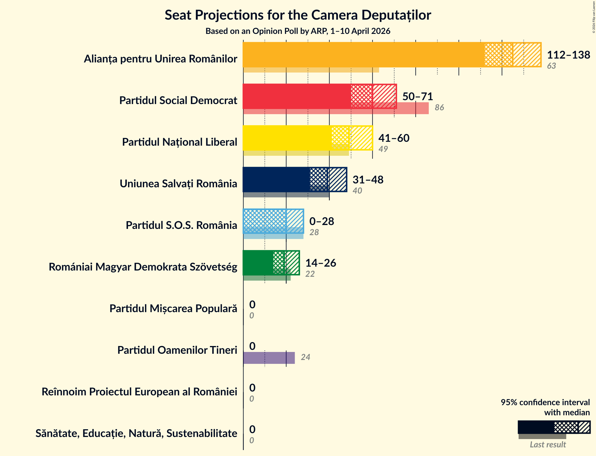

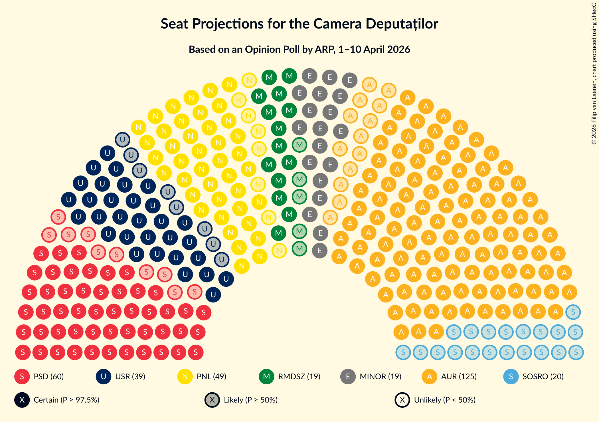

### Confidence Intervals

| Party | Last Result | Median | 80% Confidence Interval | 90% Confidence Interval | 95% Confidence Interval | 99% Confidence Interval |
|:-----:|:-----------:|:------:|:-----------------------:|:-----------------------:|:-----------------------:|:-----------------------:|
| <a href="#alianța-pentru-unirea-românilor">Alianța pentru Unirea Românilor</a> | 63 | 125 | 116–134 |114–136 |112–138 |109–143 |
| <a href="#partidul-social-democrat">Partidul Social Democrat</a> | 86 | 60 | 53–67 |52–68 |50–71 |47–74 |
| <a href="#partidul-național-liberal">Partidul Național Liberal</a> | 49 | 49 | 44–56 |42–58 |41–60 |38–64 |
| <a href="#uniunea-salvați-românia">Uniunea Salvați România</a> | 40 | 39 | 33–45 |32–47 |31–48 |28–51 |
| <a href="#partidul-s.o.s.-românia">Partidul S.O.S. România</a> | 28 | 20 | 0–26 |0–26 |0–28 |0–30 |
| <a href="#romániai-magyar-demokrata-szövetség">Romániai Magyar Demokrata Szövetség</a> | 22 | 19 | 15–23 |14–25 |14–26 |12–28 |
| <a href="#partidul-oamenilor-tineri">Partidul Oamenilor Tineri</a> | 24 | 0 | 0 |0 |0 |0–18 |
| <a href="#sănătate,-educație,-natură,-sustenabilitate">Sănătate, Educație, Natură, Sustenabilitate</a> | 0 | 0 | 0 |0 |0 |0 |
| <a href="#reînnoim-proiectul-european-al-româniei">Reînnoim Proiectul European al României</a> | 0 | 0 | 0 |0 |0 |0 |
| <a href="#partidul-mișcarea-populară">Partidul Mișcarea Populară</a> | 0 | 0 | 0 |0 |0 |0 |

### Alianța pentru Unirea Românilor

*For a full overview of the results for this party, see the [Alianța pentru Unirea Românilor](party-alianțapentruunirearomânilor.html) page.*

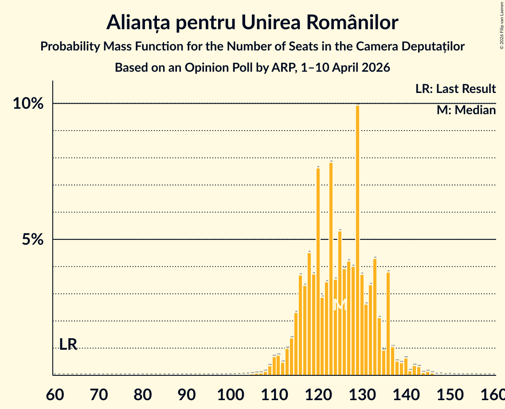

| Number of Seats | Probability | Accumulated | Special Marks |
|:---------------:|:-----------:|:-----------:|:-------------:|
| 63 | 0% | 100% | Last Result |
| 64 | 0% | 100% |  |
| 65 | 0% | 100% |  |
| 66 | 0% | 100% |  |
| 67 | 0% | 100% |  |
| 68 | 0% | 100% |  |
| 69 | 0% | 100% |  |
| 70 | 0% | 100% |  |
| 71 | 0% | 100% |  |
| 72 | 0% | 100% |  |
| 73 | 0% | 100% |  |
| 74 | 0% | 100% |  |
| 75 | 0% | 100% |  |
| 76 | 0% | 100% |  |
| 77 | 0% | 100% |  |
| 78 | 0% | 100% |  |
| 79 | 0% | 100% |  |
| 80 | 0% | 100% |  |
| 81 | 0% | 100% |  |
| 82 | 0% | 100% |  |
| 83 | 0% | 100% |  |
| 84 | 0% | 100% |  |
| 85 | 0% | 100% |  |
| 86 | 0% | 100% |  |
| 87 | 0% | 100% |  |
| 88 | 0% | 100% |  |
| 89 | 0% | 100% |  |
| 90 | 0% | 100% |  |
| 91 | 0% | 100% |  |
| 92 | 0% | 100% |  |
| 93 | 0% | 100% |  |
| 94 | 0% | 100% |  |
| 95 | 0% | 100% |  |
| 96 | 0% | 100% |  |
| 97 | 0% | 100% |  |
| 98 | 0% | 100% |  |
| 99 | 0% | 100% |  |
| 100 | 0% | 100% |  |
| 101 | 0% | 100% |  |
| 102 | 0% | 100% |  |
| 103 | 0% | 100% |  |
| 104 | 0% | 99.9% |  |
| 105 | 0.1% | 99.9% |  |
| 106 | 0.1% | 99.9% |  |
| 107 | 0.1% | 99.8% |  |
| 108 | 0.1% | 99.7% |  |
| 109 | 0.4% | 99.6% |  |
| 110 | 0.7% | 99.2% |  |
| 111 | 0.7% | 98.5% |  |
| 112 | 0.5% | 98% |  |
| 113 | 1.0% | 97% |  |
| 114 | 1.4% | 96% |  |
| 115 | 2% | 95% |  |
| 116 | 4% | 93% |  |
| 117 | 3% | 89% |  |
| 118 | 5% | 86% |  |
| 119 | 4% | 81% |  |
| 120 | 8% | 77% |  |
| 121 | 3% | 70% |  |
| 122 | 3% | 67% |  |
| 123 | 8% | 63% |  |
| 124 | 4% | 56% |  |
| 125 | 5% | 52% | Median |
| 126 | 4% | 47% |  |
| 127 | 4% | 43% |  |
| 128 | 4% | 39% |  |
| 129 | 10% | 35% |  |
| 130 | 4% | 25% |  |
| 131 | 3% | 21% |  |
| 132 | 3% | 18% |  |
| 133 | 4% | 15% |  |
| 134 | 2% | 11% |  |
| 135 | 0.9% | 9% |  |
| 136 | 4% | 8% |  |
| 137 | 1.1% | 4% |  |
| 138 | 0.5% | 3% |  |
| 139 | 0.5% | 2% |  |
| 140 | 0.6% | 2% |  |
| 141 | 0.2% | 1.3% |  |
| 142 | 0.4% | 1.1% |  |
| 143 | 0.3% | 0.8% |  |
| 144 | 0.1% | 0.5% |  |
| 145 | 0.1% | 0.4% |  |
| 146 | 0.1% | 0.2% |  |
| 147 | 0% | 0.1% |  |
| 148 | 0% | 0.1% |  |
| 149 | 0% | 0.1% |  |
| 150 | 0% | 0.1% |  |
| 151 | 0% | 0% |  |

### Partidul Social Democrat

*For a full overview of the results for this party, see the [Partidul Social Democrat](party-partidulsocialdemocrat.html) page.*

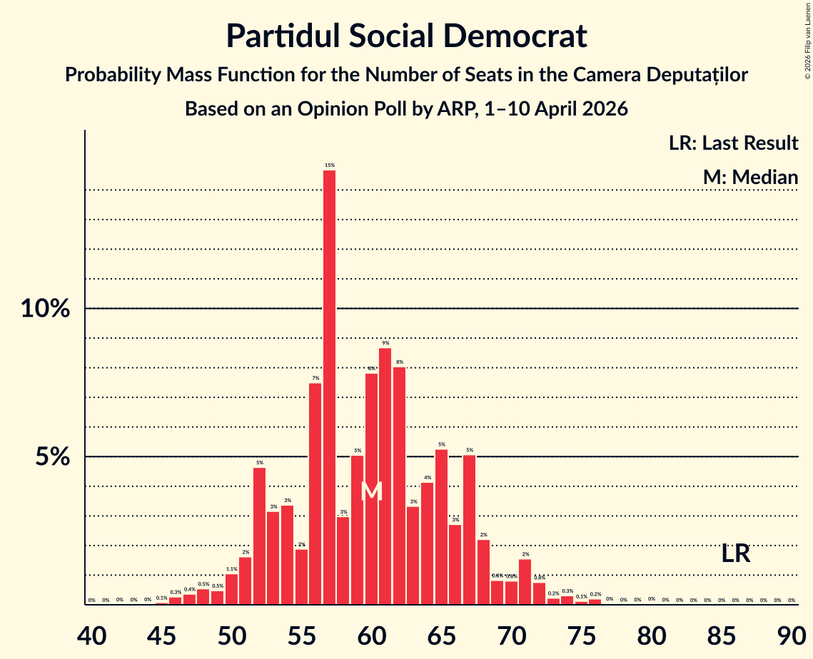

| Number of Seats | Probability | Accumulated | Special Marks |
|:---------------:|:-----------:|:-----------:|:-------------:|
| 44 | 0% | 100% |  |
| 45 | 0.1% | 99.9% |  |
| 46 | 0.3% | 99.9% |  |
| 47 | 0.4% | 99.6% |  |
| 48 | 0.5% | 99.2% |  |
| 49 | 0.5% | 98.7% |  |
| 50 | 1.1% | 98% |  |
| 51 | 2% | 97% |  |
| 52 | 5% | 96% |  |
| 53 | 3% | 91% |  |
| 54 | 3% | 88% |  |
| 55 | 2% | 84% |  |
| 56 | 7% | 82% |  |
| 57 | 15% | 75% |  |
| 58 | 3% | 60% |  |
| 59 | 5% | 57% |  |
| 60 | 8% | 52% | Median |
| 61 | 9% | 44% |  |
| 62 | 8% | 36% |  |
| 63 | 3% | 28% |  |
| 64 | 4% | 24% |  |
| 65 | 5% | 20% |  |
| 66 | 3% | 15% |  |
| 67 | 5% | 12% |  |
| 68 | 2% | 7% |  |
| 69 | 0.8% | 5% |  |
| 70 | 0.8% | 4% |  |
| 71 | 2% | 3% |  |
| 72 | 0.8% | 2% |  |
| 73 | 0.2% | 1.0% |  |
| 74 | 0.3% | 0.8% |  |
| 75 | 0.1% | 0.5% |  |
| 76 | 0.2% | 0.3% |  |
| 77 | 0% | 0.1% |  |
| 78 | 0% | 0.1% |  |
| 79 | 0% | 0.1% |  |
| 80 | 0% | 0.1% |  |
| 81 | 0% | 0% |  |
| 82 | 0% | 0% |  |
| 83 | 0% | 0% |  |
| 84 | 0% | 0% |  |
| 85 | 0% | 0% |  |
| 86 | 0% | 0% | Last Result |

### Partidul Național Liberal

*For a full overview of the results for this party, see the [Partidul Național Liberal](party-partidulnaționalliberal.html) page.*

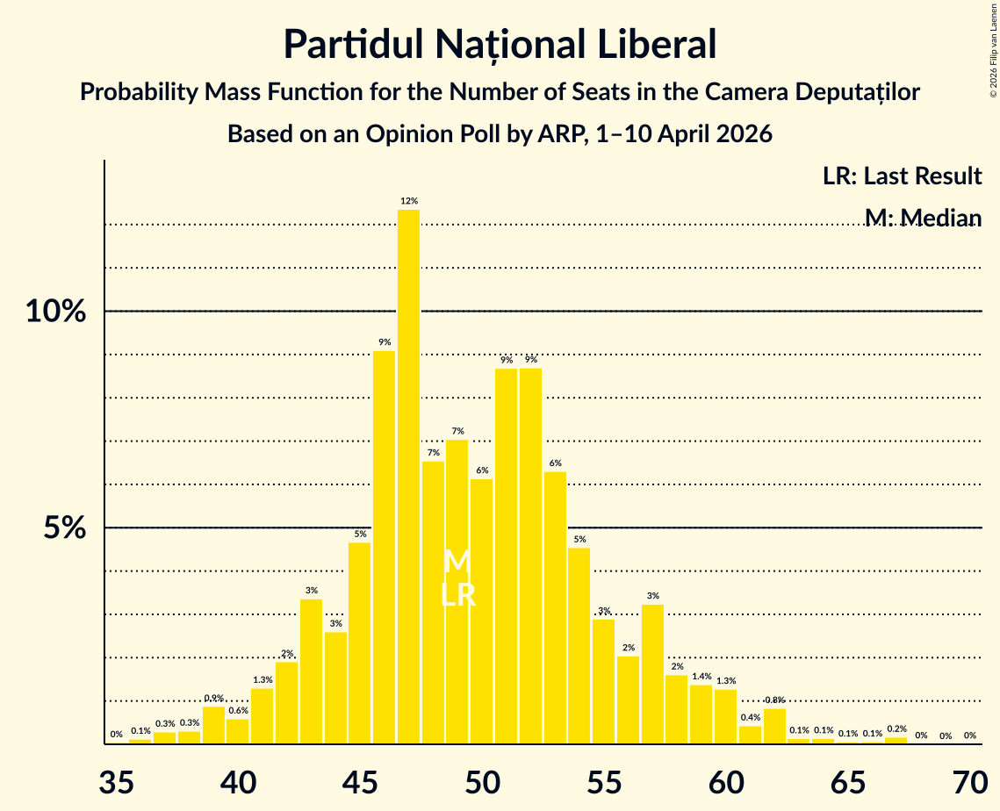

| Number of Seats | Probability | Accumulated | Special Marks |
|:---------------:|:-----------:|:-----------:|:-------------:|
| 35 | 0% | 100% |  |
| 36 | 0.1% | 99.9% |  |
| 37 | 0.3% | 99.8% |  |
| 38 | 0.3% | 99.5% |  |
| 39 | 0.9% | 99.2% |  |
| 40 | 0.6% | 98% |  |
| 41 | 1.3% | 98% |  |
| 42 | 2% | 96% |  |
| 43 | 3% | 94% |  |
| 44 | 3% | 91% |  |
| 45 | 5% | 89% |  |
| 46 | 9% | 84% |  |
| 47 | 12% | 75% |  |
| 48 | 7% | 62% |  |
| 49 | 7% | 56% | Last Result, Median |
| 50 | 6% | 49% |  |
| 51 | 9% | 43% |  |
| 52 | 9% | 34% |  |
| 53 | 6% | 25% |  |
| 54 | 5% | 19% |  |
| 55 | 3% | 14% |  |
| 56 | 2% | 11% |  |
| 57 | 3% | 9% |  |
| 58 | 2% | 6% |  |
| 59 | 1.4% | 5% |  |
| 60 | 1.3% | 3% |  |
| 61 | 0.4% | 2% |  |
| 62 | 0.8% | 1.5% |  |
| 63 | 0.1% | 0.6% |  |
| 64 | 0.1% | 0.5% |  |
| 65 | 0.1% | 0.4% |  |
| 66 | 0.1% | 0.3% |  |
| 67 | 0.2% | 0.2% |  |
| 68 | 0% | 0.1% |  |
| 69 | 0% | 0% |  |

### Uniunea Salvați România

*For a full overview of the results for this party, see the [Uniunea Salvați România](party-uniuneasalvațiromânia.html) page.*

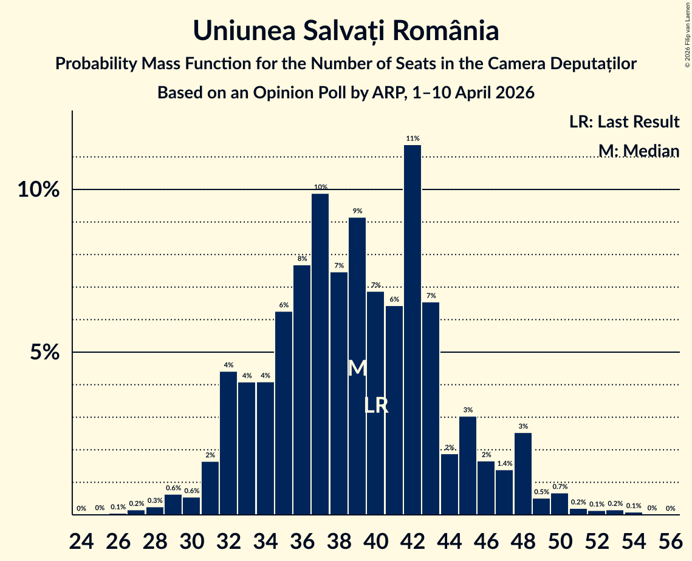

| Number of Seats | Probability | Accumulated | Special Marks |
|:---------------:|:-----------:|:-----------:|:-------------:|
| 26 | 0.1% | 100% |  |
| 27 | 0.2% | 99.9% |  |
| 28 | 0.3% | 99.7% |  |
| 29 | 0.6% | 99.5% |  |
| 30 | 0.6% | 98.9% |  |
| 31 | 2% | 98% |  |
| 32 | 4% | 97% |  |
| 33 | 4% | 92% |  |
| 34 | 4% | 88% |  |
| 35 | 6% | 84% |  |
| 36 | 8% | 78% |  |
| 37 | 10% | 70% |  |
| 38 | 7% | 60% |  |
| 39 | 9% | 53% | Median |
| 40 | 7% | 44% | Last Result |
| 41 | 6% | 37% |  |
| 42 | 11% | 30% |  |
| 43 | 7% | 19% |  |
| 44 | 2% | 12% |  |
| 45 | 3% | 10% |  |
| 46 | 2% | 7% |  |
| 47 | 1.4% | 6% |  |
| 48 | 3% | 4% |  |
| 49 | 0.5% | 2% |  |
| 50 | 0.7% | 1.3% |  |
| 51 | 0.2% | 0.6% |  |
| 52 | 0.1% | 0.4% |  |
| 53 | 0.2% | 0.3% |  |
| 54 | 0.1% | 0.1% |  |
| 55 | 0% | 0.1% |  |
| 56 | 0% | 0% |  |

### Partidul S.O.S. România

*For a full overview of the results for this party, see the [Partidul S.O.S. România](party-partidulsosromânia.html) page.*

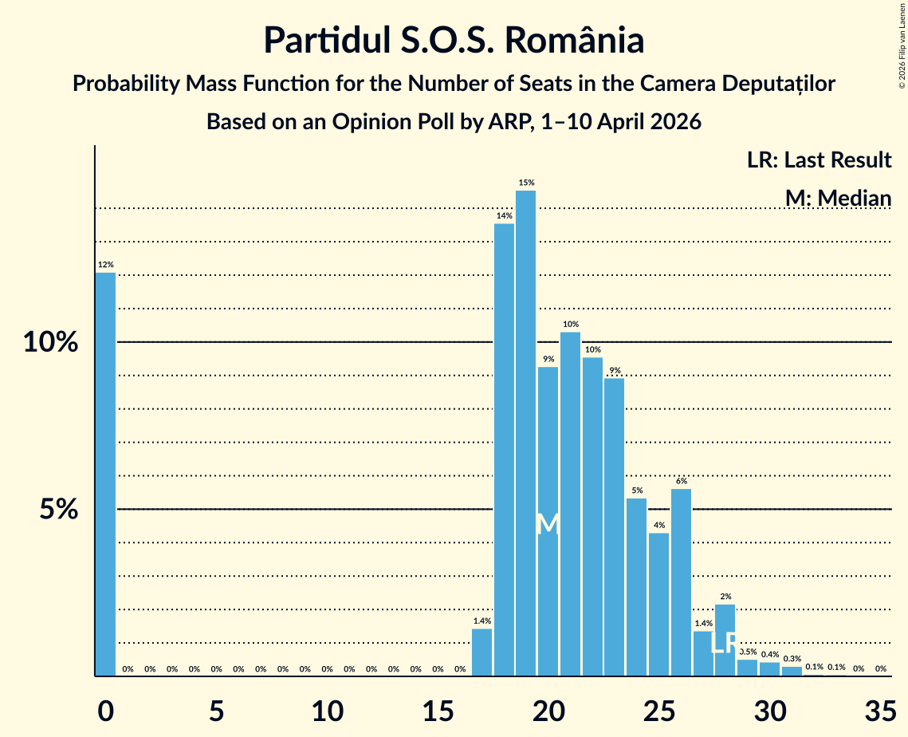

| Number of Seats | Probability | Accumulated | Special Marks |
|:---------------:|:-----------:|:-----------:|:-------------:|
| 0 | 12% | 100% |  |
| 1 | 0% | 88% |  |
| 2 | 0% | 88% |  |
| 3 | 0% | 88% |  |
| 4 | 0% | 88% |  |
| 5 | 0% | 88% |  |
| 6 | 0% | 88% |  |
| 7 | 0% | 88% |  |
| 8 | 0% | 88% |  |
| 9 | 0% | 88% |  |
| 10 | 0% | 88% |  |
| 11 | 0% | 88% |  |
| 12 | 0% | 88% |  |
| 13 | 0% | 88% |  |
| 14 | 0% | 88% |  |
| 15 | 0% | 88% |  |
| 16 | 0% | 88% |  |
| 17 | 1.4% | 88% |  |
| 18 | 14% | 86% |  |
| 19 | 15% | 73% |  |
| 20 | 9% | 58% | Median |
| 21 | 10% | 49% |  |
| 22 | 10% | 39% |  |
| 23 | 9% | 29% |  |
| 24 | 5% | 20% |  |
| 25 | 4% | 15% |  |
| 26 | 6% | 11% |  |
| 27 | 1.4% | 5% |  |
| 28 | 2% | 4% | Last Result |
| 29 | 0.5% | 1.4% |  |
| 30 | 0.4% | 0.9% |  |
| 31 | 0.3% | 0.5% |  |
| 32 | 0.1% | 0.2% |  |
| 33 | 0.1% | 0.1% |  |
| 34 | 0% | 0% |  |

### Romániai Magyar Demokrata Szövetség

*For a full overview of the results for this party, see the [Romániai Magyar Demokrata Szövetség](party-romániaimagyardemokrataszövetség.html) page.*

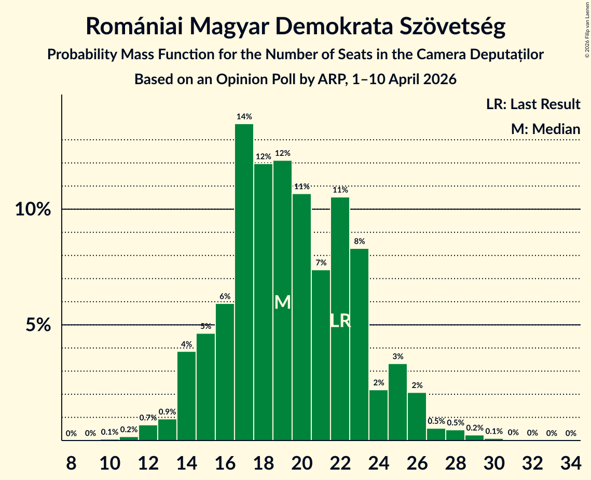

| Number of Seats | Probability | Accumulated | Special Marks |
|:---------------:|:-----------:|:-----------:|:-------------:|
| 10 | 0.1% | 100% |  |
| 11 | 0.2% | 99.9% |  |
| 12 | 0.7% | 99.8% |  |
| 13 | 0.9% | 99.1% |  |
| 14 | 4% | 98% |  |
| 15 | 5% | 94% |  |
| 16 | 6% | 90% |  |
| 17 | 14% | 84% |  |
| 18 | 12% | 70% |  |
| 19 | 12% | 58% | Median |
| 20 | 11% | 46% |  |
| 21 | 7% | 35% |  |
| 22 | 11% | 28% | Last Result |
| 23 | 8% | 17% |  |
| 24 | 2% | 9% |  |
| 25 | 3% | 7% |  |
| 26 | 2% | 4% |  |
| 27 | 0.5% | 1.4% |  |
| 28 | 0.5% | 0.9% |  |
| 29 | 0.2% | 0.4% |  |
| 30 | 0.1% | 0.2% |  |
| 31 | 0% | 0.1% |  |
| 32 | 0% | 0.1% |  |
| 33 | 0% | 0% |  |

### Partidul Oamenilor Tineri

*For a full overview of the results for this party, see the [Partidul Oamenilor Tineri](party-partiduloamenilortineri.html) page.*

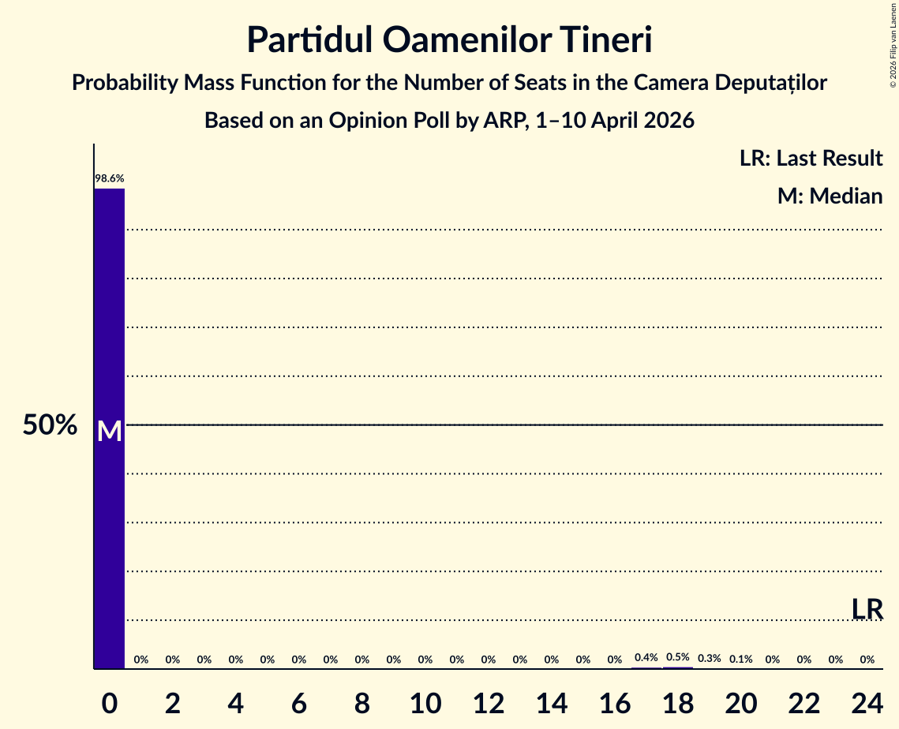

| Number of Seats | Probability | Accumulated | Special Marks |
|:---------------:|:-----------:|:-----------:|:-------------:|
| 0 | 98.6% | 100% | Median |
| 1 | 0% | 1.4% |  |
| 2 | 0% | 1.4% |  |
| 3 | 0% | 1.4% |  |
| 4 | 0% | 1.4% |  |
| 5 | 0% | 1.4% |  |
| 6 | 0% | 1.4% |  |
| 7 | 0% | 1.4% |  |
| 8 | 0% | 1.4% |  |
| 9 | 0% | 1.4% |  |
| 10 | 0% | 1.4% |  |
| 11 | 0% | 1.4% |  |
| 12 | 0% | 1.4% |  |
| 13 | 0% | 1.4% |  |
| 14 | 0% | 1.4% |  |
| 15 | 0% | 1.4% |  |
| 16 | 0% | 1.4% |  |
| 17 | 0.4% | 1.4% |  |
| 18 | 0.5% | 1.0% |  |
| 19 | 0.3% | 0.4% |  |
| 20 | 0.1% | 0.1% |  |
| 21 | 0% | 0% |  |
| 22 | 0% | 0% |  |
| 23 | 0% | 0% |  |
| 24 | 0% | 0% | Last Result |

### Sănătate, Educație, Natură, Sustenabilitate

*For a full overview of the results for this party, see the [Sănătate, Educație, Natură, Sustenabilitate](party-sănătateeducațienaturăsustenabilitate.html) page.*

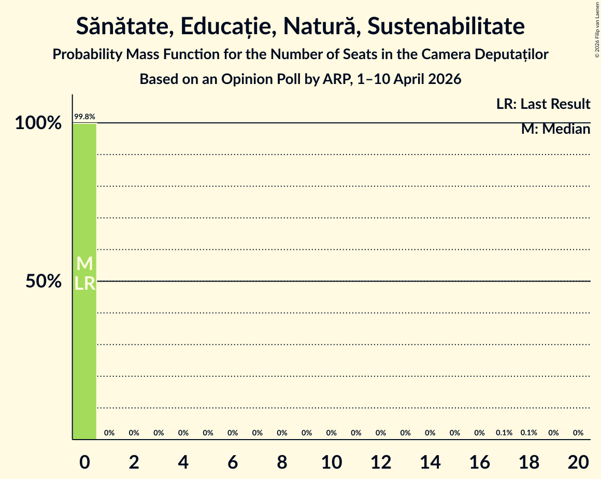

| Number of Seats | Probability | Accumulated | Special Marks |
|:---------------:|:-----------:|:-----------:|:-------------:|
| 0 | 99.8% | 100% | Last Result, Median |
| 1 | 0% | 0.2% |  |
| 2 | 0% | 0.2% |  |
| 3 | 0% | 0.2% |  |
| 4 | 0% | 0.2% |  |
| 5 | 0% | 0.2% |  |
| 6 | 0% | 0.2% |  |
| 7 | 0% | 0.2% |  |
| 8 | 0% | 0.2% |  |
| 9 | 0% | 0.2% |  |
| 10 | 0% | 0.2% |  |
| 11 | 0% | 0.2% |  |
| 12 | 0% | 0.2% |  |
| 13 | 0% | 0.2% |  |
| 14 | 0% | 0.2% |  |
| 15 | 0% | 0.2% |  |
| 16 | 0% | 0.2% |  |
| 17 | 0.1% | 0.2% |  |
| 18 | 0.1% | 0.1% |  |
| 19 | 0% | 0% |  |

### Reînnoim Proiectul European al României

*For a full overview of the results for this party, see the [Reînnoim Proiectul European al României](party-reînnoimproiectuleuropeanalromâniei.html) page.*

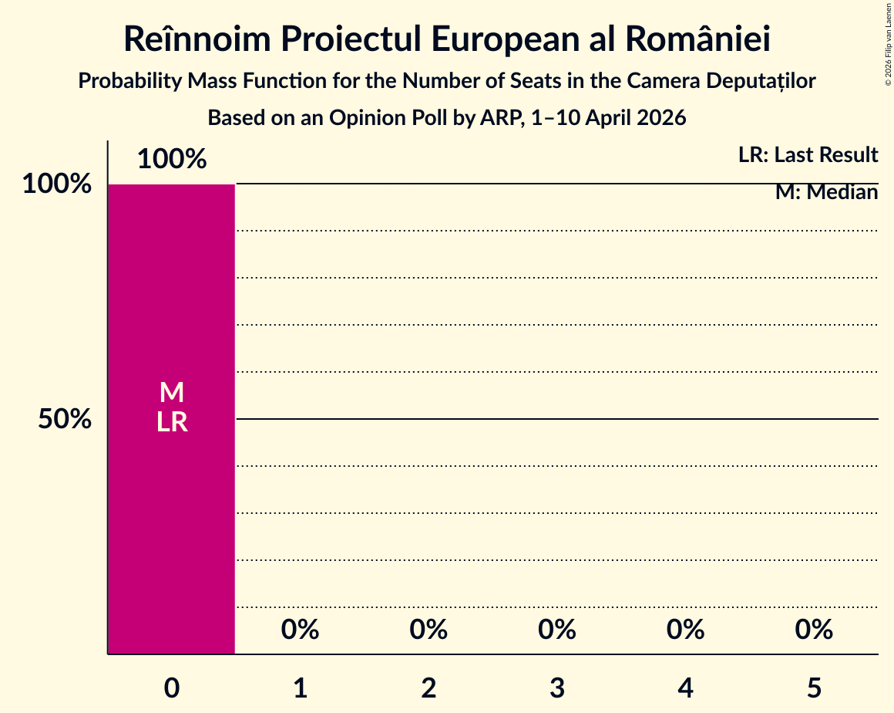

| Number of Seats | Probability | Accumulated | Special Marks |
|:---------------:|:-----------:|:-----------:|:-------------:|
| 0 | 100% | 100% | Last Result, Median |

### Partidul Mișcarea Populară

*For a full overview of the results for this party, see the [Partidul Mișcarea Populară](party-partidulmișcareapopulară.html) page.*

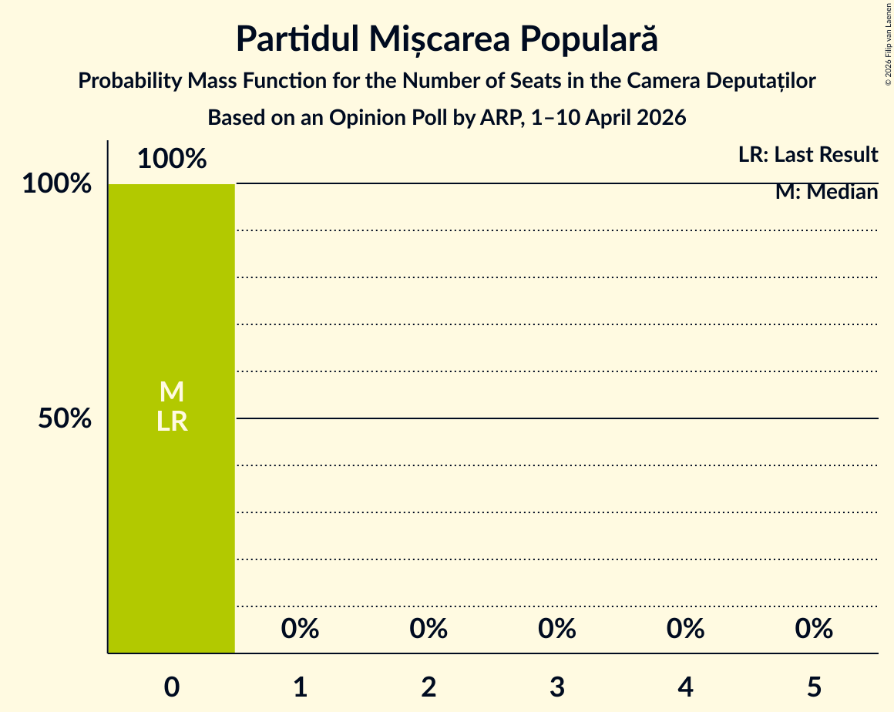

| Number of Seats | Probability | Accumulated | Special Marks |
|:---------------:|:-----------:|:-----------:|:-------------:|
| 0 | 100% | 100% | Last Result, Median |

## Coalitions

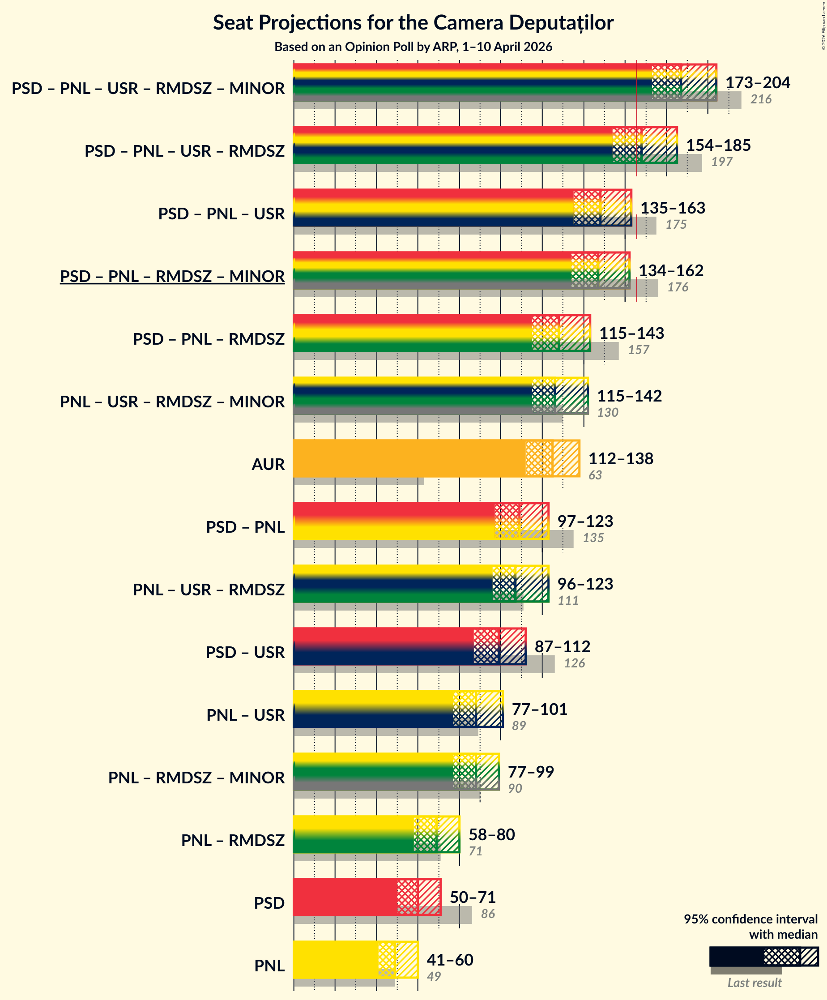

### Confidence Intervals

| Coalition | Last Result | Median | Majority? | 80% Confidence Interval | 90% Confidence Interval | 95% Confidence Interval | 99% Confidence Interval |
|:---------:|:-----------:|:------:|:---------:|:-----------------------:|:-----------------------:|:-----------------------:|:-----------------------:|
| Partidul Social Democrat – Partidul Național Liberal – Uniunea Salvați România – Romániai Magyar Demokrata Szövetség | 197 | 168 | 60% | 158–178 | 156–181 | 154–185 | 150–190 |
| Partidul Social Democrat – Partidul Național Liberal – Uniunea Salvați România | 175 | 148 | 2% | 140–158 | 137–160 | 135–163 | 130–169 |
| Partidul Social Democrat – Partidul Național Liberal – Romániai Magyar Demokrata Szövetség | 157 | 128 | 0% | 120–138 | 118–140 | 115–143 | 111–152 |
| Alianța pentru Unirea Românilor | 63 | 125 | 0% | 116–134 | 114–136 | 112–138 | 109–143 |
| Partidul Social Democrat – Partidul Național Liberal | 135 | 109 | 0% | 101–119 | 100–121 | 97–123 | 93–129 |
| Partidul Național Liberal – Uniunea Salvați România – Romániai Magyar Demokrata Szövetség | 111 | 107 | 0% | 100–118 | 98–119 | 96–123 | 91–127 |
| Partidul Social Democrat – Uniunea Salvați România | 126 | 99 | 0% | 91–108 | 89–110 | 87–112 | 83–116 |
| Partidul Național Liberal – Uniunea Salvați România | 89 | 88 | 0% | 82–96 | 79–99 | 77–101 | 73–106 |
| Partidul Național Liberal – Romániai Magyar Demokrata Szövetség | 71 | 69 | 0% | 63–77 | 61–79 | 58–80 | 55–85 |
| Partidul Social Democrat | 86 | 60 | 0% | 53–67 | 52–68 | 50–71 | 47–74 |
| Partidul Național Liberal | 49 | 49 | 0% | 44–56 | 42–58 | 41–60 | 38–64 |

### Partidul Social Democrat – Partidul Național Liberal – Uniunea Salvați România – Romániai Magyar Demokrata Szövetség

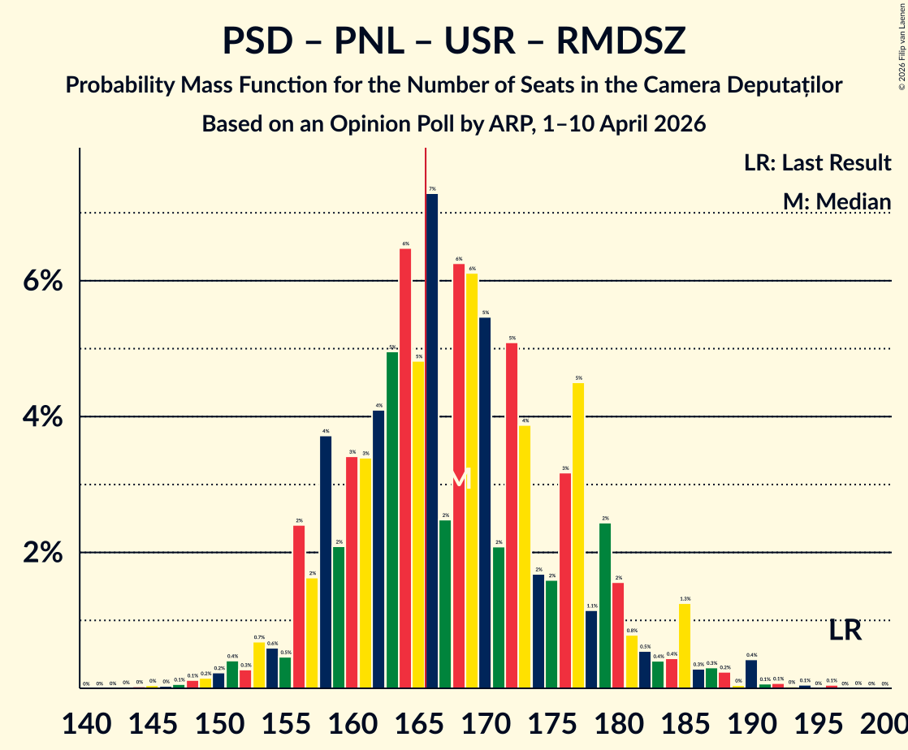

| Number of Seats | Probability | Accumulated | Special Marks |
|:---------------:|:-----------:|:-----------:|:-------------:|
| 144 | 0% | 100% |  |
| 145 | 0% | 99.9% |  |
| 146 | 0% | 99.9% |  |
| 147 | 0.1% | 99.9% |  |
| 148 | 0.1% | 99.8% |  |
| 149 | 0.2% | 99.7% |  |
| 150 | 0.2% | 99.5% |  |
| 151 | 0.4% | 99.3% |  |
| 152 | 0.3% | 98.9% |  |
| 153 | 0.7% | 98.6% |  |
| 154 | 0.6% | 98% |  |
| 155 | 0.5% | 97% |  |
| 156 | 2% | 97% |  |
| 157 | 2% | 94% |  |
| 158 | 4% | 93% |  |
| 159 | 2% | 89% |  |
| 160 | 3% | 87% |  |
| 161 | 3% | 84% |  |
| 162 | 4% | 80% |  |
| 163 | 5% | 76% |  |
| 164 | 6% | 71% |  |
| 165 | 5% | 65% |  |
| 166 | 7% | 60% | Majority |
| 167 | 2% | 53% | Median |
| 168 | 6% | 50% |  |
| 169 | 6% | 44% |  |
| 170 | 5% | 38% |  |
| 171 | 2% | 32% |  |
| 172 | 5% | 30% |  |
| 173 | 4% | 25% |  |
| 174 | 2% | 21% |  |
| 175 | 2% | 19% |  |
| 176 | 3% | 18% |  |
| 177 | 5% | 15% |  |
| 178 | 1.1% | 10% |  |
| 179 | 2% | 9% |  |
| 180 | 2% | 7% |  |
| 181 | 0.8% | 5% |  |
| 182 | 0.5% | 4% |  |
| 183 | 0.4% | 4% |  |
| 184 | 0.4% | 3% |  |
| 185 | 1.3% | 3% |  |
| 186 | 0.3% | 2% |  |
| 187 | 0.3% | 1.3% |  |
| 188 | 0.2% | 1.0% |  |
| 189 | 0% | 0.8% |  |
| 190 | 0.4% | 0.7% |  |
| 191 | 0.1% | 0.3% |  |
| 192 | 0.1% | 0.2% |  |
| 193 | 0% | 0.2% |  |
| 194 | 0.1% | 0.1% |  |
| 195 | 0% | 0.1% |  |
| 196 | 0.1% | 0.1% |  |
| 197 | 0% | 0% | Last Result |

### Partidul Social Democrat – Partidul Național Liberal – Uniunea Salvați România

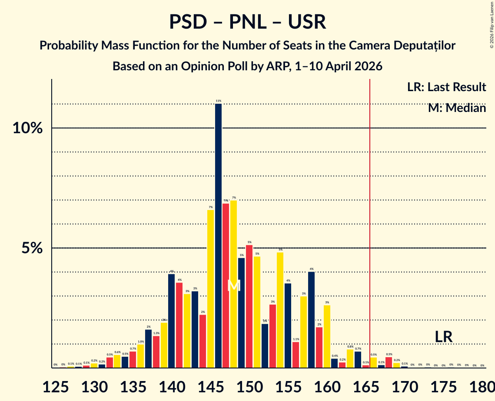

| Number of Seats | Probability | Accumulated | Special Marks |
|:---------------:|:-----------:|:-----------:|:-------------:|
| 125 | 0% | 100% |  |
| 126 | 0% | 99.9% |  |
| 127 | 0.1% | 99.9% |  |
| 128 | 0.1% | 99.8% |  |
| 129 | 0.1% | 99.7% |  |
| 130 | 0.2% | 99.6% |  |
| 131 | 0.2% | 99.4% |  |
| 132 | 0.5% | 99.2% |  |
| 133 | 0.6% | 98.8% |  |
| 134 | 0.5% | 98% |  |
| 135 | 0.7% | 98% |  |
| 136 | 1.0% | 97% |  |
| 137 | 2% | 96% |  |
| 138 | 1.3% | 94% |  |
| 139 | 2% | 93% |  |
| 140 | 4% | 91% |  |
| 141 | 4% | 87% |  |
| 142 | 3% | 84% |  |
| 143 | 3% | 81% |  |
| 144 | 2% | 77% |  |
| 145 | 7% | 75% |  |
| 146 | 11% | 69% |  |
| 147 | 7% | 57% |  |
| 148 | 7% | 51% | Median |
| 149 | 5% | 44% |  |
| 150 | 5% | 39% |  |
| 151 | 5% | 34% |  |
| 152 | 2% | 29% |  |
| 153 | 3% | 27% |  |
| 154 | 5% | 25% |  |
| 155 | 4% | 20% |  |
| 156 | 1.1% | 16% |  |
| 157 | 3% | 15% |  |
| 158 | 4% | 12% |  |
| 159 | 2% | 8% |  |
| 160 | 3% | 6% |  |
| 161 | 0.4% | 4% |  |
| 162 | 0.2% | 3% |  |
| 163 | 0.8% | 3% |  |
| 164 | 0.7% | 2% |  |
| 165 | 0.1% | 2% |  |
| 166 | 0.5% | 2% | Majority |
| 167 | 0.1% | 1.1% |  |
| 168 | 0.5% | 1.0% |  |
| 169 | 0.2% | 0.5% |  |
| 170 | 0.1% | 0.3% |  |
| 171 | 0% | 0.2% |  |
| 172 | 0% | 0.2% |  |
| 173 | 0% | 0.1% |  |
| 174 | 0% | 0.1% |  |
| 175 | 0% | 0.1% | Last Result |
| 176 | 0% | 0.1% |  |
| 177 | 0% | 0.1% |  |
| 178 | 0% | 0% |  |

### Partidul Social Democrat – Partidul Național Liberal – Romániai Magyar Demokrata Szövetség

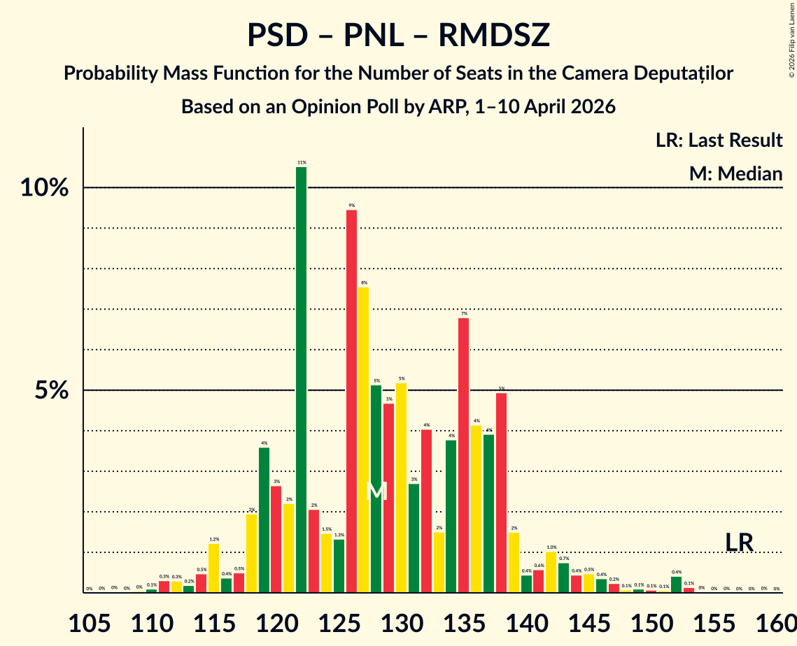

| Number of Seats | Probability | Accumulated | Special Marks |
|:---------------:|:-----------:|:-----------:|:-------------:|
| 107 | 0% | 100% |  |
| 108 | 0% | 99.9% |  |
| 109 | 0% | 99.9% |  |
| 110 | 0.1% | 99.9% |  |
| 111 | 0.3% | 99.8% |  |
| 112 | 0.3% | 99.5% |  |
| 113 | 0.2% | 99.2% |  |
| 114 | 0.5% | 99.0% |  |
| 115 | 1.2% | 98.5% |  |
| 116 | 0.4% | 97% |  |
| 117 | 0.5% | 97% |  |
| 118 | 2% | 96% |  |
| 119 | 4% | 94% |  |
| 120 | 3% | 91% |  |
| 121 | 2% | 88% |  |
| 122 | 11% | 86% |  |
| 123 | 2% | 75% |  |
| 124 | 1.5% | 73% |  |
| 125 | 1.3% | 72% |  |
| 126 | 9% | 71% |  |
| 127 | 8% | 61% |  |
| 128 | 5% | 54% | Median |
| 129 | 5% | 48% |  |
| 130 | 5% | 44% |  |
| 131 | 3% | 39% |  |
| 132 | 4% | 36% |  |
| 133 | 2% | 32% |  |
| 134 | 4% | 30% |  |
| 135 | 7% | 27% |  |
| 136 | 4% | 20% |  |
| 137 | 4% | 16% |  |
| 138 | 5% | 12% |  |
| 139 | 2% | 7% |  |
| 140 | 0.4% | 5% |  |
| 141 | 0.6% | 5% |  |
| 142 | 1.0% | 4% |  |
| 143 | 0.7% | 3% |  |
| 144 | 0.4% | 2% |  |
| 145 | 0.5% | 2% |  |
| 146 | 0.4% | 2% |  |
| 147 | 0.2% | 1.2% |  |
| 148 | 0.1% | 0.9% |  |
| 149 | 0.1% | 0.9% |  |
| 150 | 0.1% | 0.8% |  |
| 151 | 0.1% | 0.7% |  |
| 152 | 0.4% | 0.6% |  |
| 153 | 0.1% | 0.2% |  |
| 154 | 0% | 0.1% |  |
| 155 | 0% | 0% |  |
| 156 | 0% | 0% |  |
| 157 | 0% | 0% | Last Result |

### Alianța pentru Unirea Românilor

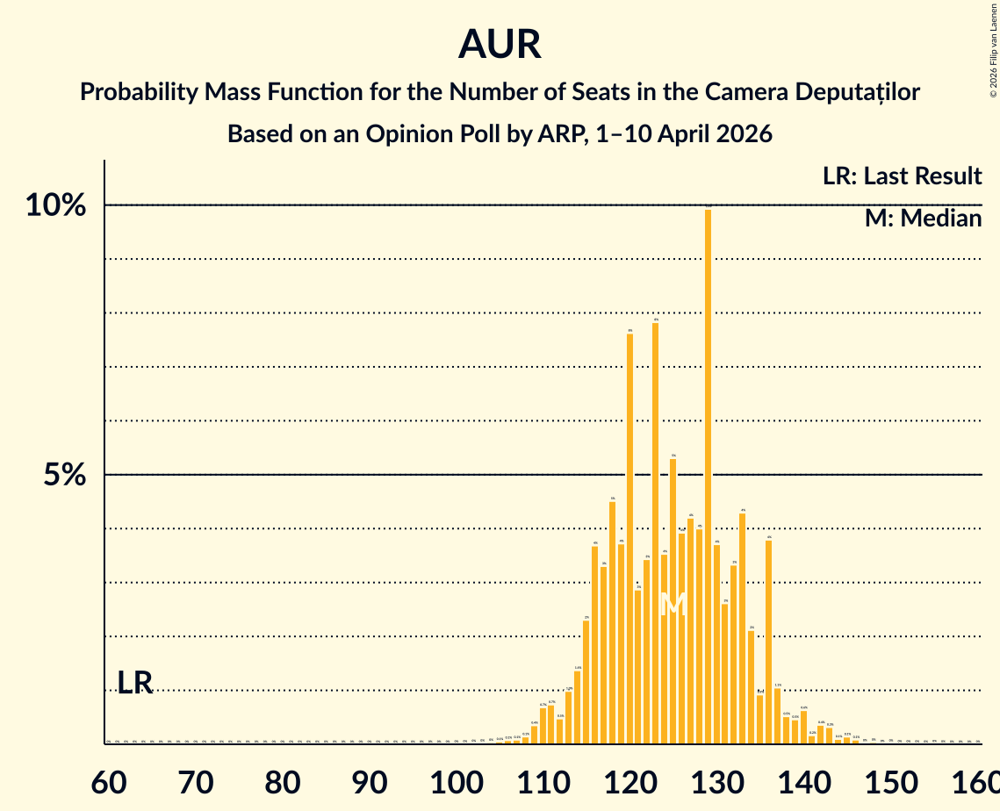

| Number of Seats | Probability | Accumulated | Special Marks |
|:---------------:|:-----------:|:-----------:|:-------------:|
| 63 | 0% | 100% | Last Result |
| 64 | 0% | 100% |  |
| 65 | 0% | 100% |  |
| 66 | 0% | 100% |  |
| 67 | 0% | 100% |  |
| 68 | 0% | 100% |  |
| 69 | 0% | 100% |  |
| 70 | 0% | 100% |  |
| 71 | 0% | 100% |  |
| 72 | 0% | 100% |  |
| 73 | 0% | 100% |  |
| 74 | 0% | 100% |  |
| 75 | 0% | 100% |  |
| 76 | 0% | 100% |  |
| 77 | 0% | 100% |  |
| 78 | 0% | 100% |  |
| 79 | 0% | 100% |  |
| 80 | 0% | 100% |  |
| 81 | 0% | 100% |  |
| 82 | 0% | 100% |  |
| 83 | 0% | 100% |  |
| 84 | 0% | 100% |  |
| 85 | 0% | 100% |  |
| 86 | 0% | 100% |  |
| 87 | 0% | 100% |  |
| 88 | 0% | 100% |  |
| 89 | 0% | 100% |  |
| 90 | 0% | 100% |  |
| 91 | 0% | 100% |  |
| 92 | 0% | 100% |  |
| 93 | 0% | 100% |  |
| 94 | 0% | 100% |  |
| 95 | 0% | 100% |  |
| 96 | 0% | 100% |  |
| 97 | 0% | 100% |  |
| 98 | 0% | 100% |  |
| 99 | 0% | 100% |  |
| 100 | 0% | 100% |  |
| 101 | 0% | 100% |  |
| 102 | 0% | 100% |  |
| 103 | 0% | 100% |  |
| 104 | 0% | 99.9% |  |
| 105 | 0.1% | 99.9% |  |
| 106 | 0.1% | 99.9% |  |
| 107 | 0.1% | 99.8% |  |
| 108 | 0.1% | 99.7% |  |
| 109 | 0.4% | 99.6% |  |
| 110 | 0.7% | 99.2% |  |
| 111 | 0.7% | 98.5% |  |
| 112 | 0.5% | 98% |  |
| 113 | 1.0% | 97% |  |
| 114 | 1.4% | 96% |  |
| 115 | 2% | 95% |  |
| 116 | 4% | 93% |  |
| 117 | 3% | 89% |  |
| 118 | 5% | 86% |  |
| 119 | 4% | 81% |  |
| 120 | 8% | 77% |  |
| 121 | 3% | 70% |  |
| 122 | 3% | 67% |  |
| 123 | 8% | 63% |  |
| 124 | 4% | 56% |  |
| 125 | 5% | 52% | Median |
| 126 | 4% | 47% |  |
| 127 | 4% | 43% |  |
| 128 | 4% | 39% |  |
| 129 | 10% | 35% |  |
| 130 | 4% | 25% |  |
| 131 | 3% | 21% |  |
| 132 | 3% | 18% |  |
| 133 | 4% | 15% |  |
| 134 | 2% | 11% |  |
| 135 | 0.9% | 9% |  |
| 136 | 4% | 8% |  |
| 137 | 1.1% | 4% |  |
| 138 | 0.5% | 3% |  |
| 139 | 0.5% | 2% |  |
| 140 | 0.6% | 2% |  |
| 141 | 0.2% | 1.3% |  |
| 142 | 0.4% | 1.1% |  |
| 143 | 0.3% | 0.8% |  |
| 144 | 0.1% | 0.5% |  |
| 145 | 0.1% | 0.4% |  |
| 146 | 0.1% | 0.2% |  |
| 147 | 0% | 0.1% |  |
| 148 | 0% | 0.1% |  |
| 149 | 0% | 0.1% |  |
| 150 | 0% | 0.1% |  |
| 151 | 0% | 0% |  |

### Partidul Social Democrat – Partidul Național Liberal

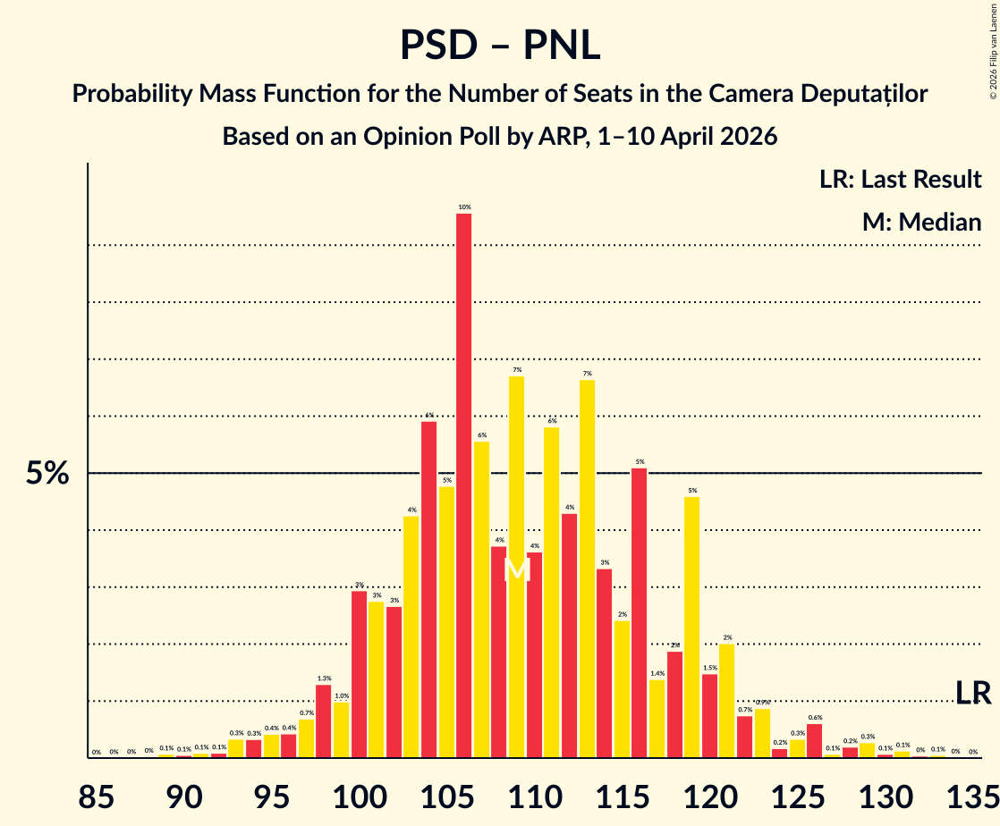

| Number of Seats | Probability | Accumulated | Special Marks |
|:---------------:|:-----------:|:-----------:|:-------------:|
| 88 | 0% | 100% |  |
| 89 | 0.1% | 99.9% |  |
| 90 | 0.1% | 99.9% |  |
| 91 | 0.1% | 99.8% |  |
| 92 | 0.1% | 99.7% |  |
| 93 | 0.3% | 99.6% |  |
| 94 | 0.3% | 99.3% |  |
| 95 | 0.4% | 99.0% |  |
| 96 | 0.4% | 98.5% |  |
| 97 | 0.7% | 98% |  |
| 98 | 1.3% | 97% |  |
| 99 | 1.0% | 96% |  |
| 100 | 3% | 95% |  |
| 101 | 3% | 92% |  |
| 102 | 3% | 89% |  |
| 103 | 4% | 87% |  |
| 104 | 6% | 83% |  |
| 105 | 5% | 77% |  |
| 106 | 10% | 72% |  |
| 107 | 6% | 62% |  |
| 108 | 4% | 57% |  |
| 109 | 7% | 53% | Median |
| 110 | 4% | 46% |  |
| 111 | 6% | 43% |  |
| 112 | 4% | 37% |  |
| 113 | 7% | 32% |  |
| 114 | 3% | 26% |  |
| 115 | 2% | 23% |  |
| 116 | 5% | 20% |  |
| 117 | 1.4% | 15% |  |
| 118 | 2% | 14% |  |
| 119 | 5% | 12% |  |
| 120 | 1.5% | 7% |  |
| 121 | 2% | 6% |  |
| 122 | 0.7% | 4% |  |
| 123 | 0.9% | 3% |  |
| 124 | 0.2% | 2% |  |
| 125 | 0.3% | 2% |  |
| 126 | 0.6% | 1.5% |  |
| 127 | 0.1% | 0.9% |  |
| 128 | 0.2% | 0.8% |  |
| 129 | 0.3% | 0.6% |  |
| 130 | 0.1% | 0.3% |  |
| 131 | 0.1% | 0.3% |  |
| 132 | 0% | 0.1% |  |
| 133 | 0.1% | 0.1% |  |
| 134 | 0% | 0% |  |
| 135 | 0% | 0% | Last Result |

### Partidul Național Liberal – Uniunea Salvați România – Romániai Magyar Demokrata Szövetség

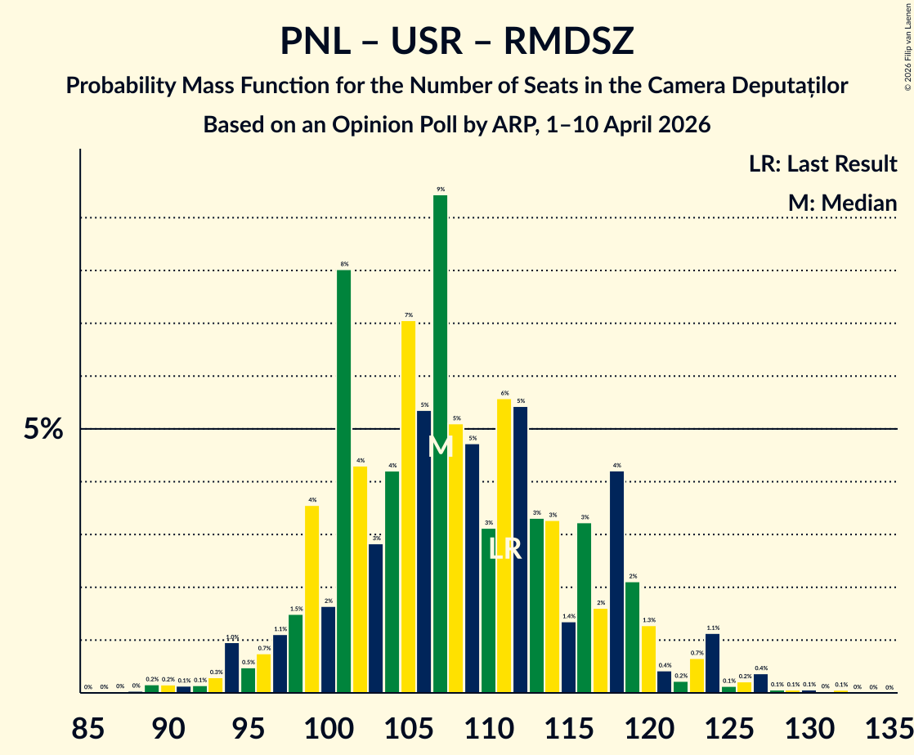

| Number of Seats | Probability | Accumulated | Special Marks |
|:---------------:|:-----------:|:-----------:|:-------------:|
| 87 | 0% | 100% |  |
| 88 | 0% | 99.9% |  |
| 89 | 0.2% | 99.9% |  |
| 90 | 0.2% | 99.7% |  |
| 91 | 0.1% | 99.6% |  |
| 92 | 0.1% | 99.4% |  |
| 93 | 0.3% | 99.3% |  |
| 94 | 1.0% | 99.0% |  |
| 95 | 0.5% | 98% |  |
| 96 | 0.7% | 98% |  |
| 97 | 1.1% | 97% |  |
| 98 | 1.5% | 96% |  |
| 99 | 4% | 94% |  |
| 100 | 2% | 91% |  |
| 101 | 8% | 89% |  |
| 102 | 4% | 81% |  |
| 103 | 3% | 77% |  |
| 104 | 4% | 74% |  |
| 105 | 7% | 70% |  |
| 106 | 5% | 63% |  |
| 107 | 9% | 57% | Median |
| 108 | 5% | 48% |  |
| 109 | 5% | 43% |  |
| 110 | 3% | 38% |  |
| 111 | 6% | 35% | Last Result |
| 112 | 5% | 29% |  |
| 113 | 3% | 24% |  |
| 114 | 3% | 21% |  |
| 115 | 1.4% | 17% |  |
| 116 | 3% | 16% |  |
| 117 | 2% | 13% |  |
| 118 | 4% | 11% |  |
| 119 | 2% | 7% |  |
| 120 | 1.3% | 5% |  |
| 121 | 0.4% | 3% |  |
| 122 | 0.2% | 3% |  |
| 123 | 0.7% | 3% |  |
| 124 | 1.1% | 2% |  |
| 125 | 0.1% | 1.0% |  |
| 126 | 0.2% | 0.9% |  |
| 127 | 0.4% | 0.7% |  |
| 128 | 0.1% | 0.3% |  |
| 129 | 0.1% | 0.2% |  |
| 130 | 0.1% | 0.2% |  |
| 131 | 0% | 0.1% |  |
| 132 | 0.1% | 0.1% |  |
| 133 | 0% | 0% |  |

### Partidul Social Democrat – Uniunea Salvați România

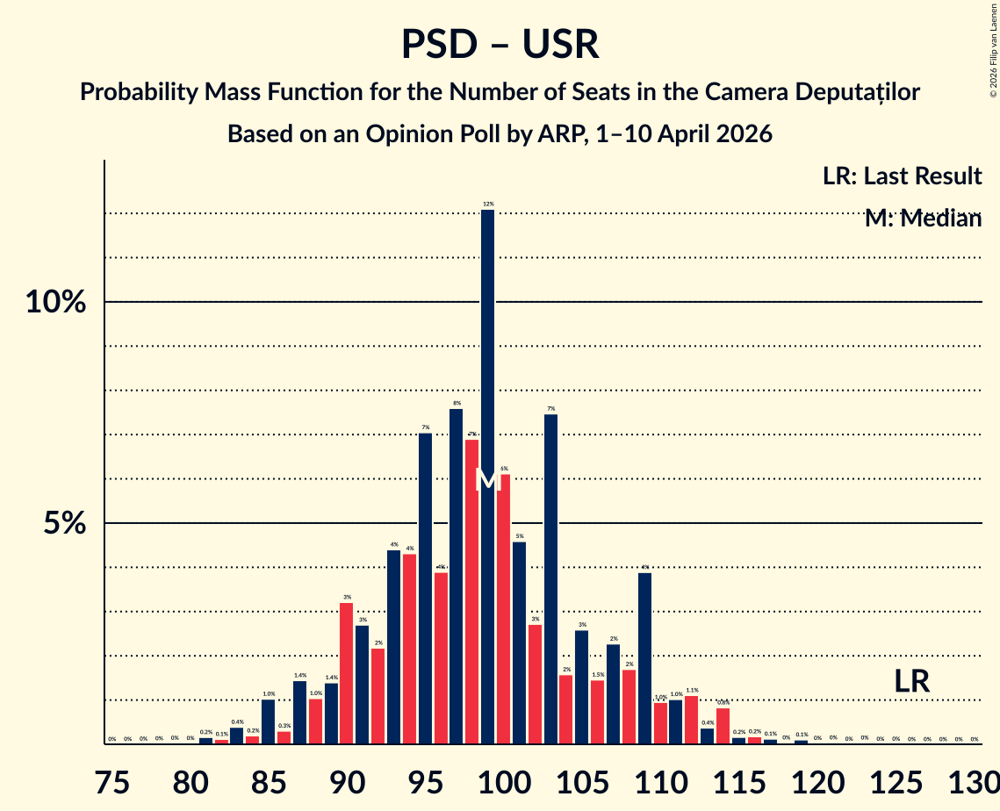

| Number of Seats | Probability | Accumulated | Special Marks |
|:---------------:|:-----------:|:-----------:|:-------------:|
| 79 | 0% | 100% |  |
| 80 | 0% | 99.9% |  |
| 81 | 0.2% | 99.9% |  |
| 82 | 0.1% | 99.7% |  |
| 83 | 0.4% | 99.6% |  |
| 84 | 0.2% | 99.2% |  |
| 85 | 1.0% | 99.0% |  |
| 86 | 0.3% | 98% |  |
| 87 | 1.4% | 98% |  |
| 88 | 1.0% | 96% |  |
| 89 | 1.4% | 95% |  |
| 90 | 3% | 94% |  |
| 91 | 3% | 91% |  |
| 92 | 2% | 88% |  |
| 93 | 4% | 86% |  |
| 94 | 4% | 81% |  |
| 95 | 7% | 77% |  |
| 96 | 4% | 70% |  |
| 97 | 8% | 66% |  |
| 98 | 7% | 58% |  |
| 99 | 12% | 52% | Median |
| 100 | 6% | 39% |  |
| 101 | 5% | 33% |  |
| 102 | 3% | 29% |  |
| 103 | 7% | 26% |  |
| 104 | 2% | 19% |  |
| 105 | 3% | 17% |  |
| 106 | 1.5% | 14% |  |
| 107 | 2% | 13% |  |
| 108 | 2% | 11% |  |
| 109 | 4% | 9% |  |
| 110 | 1.0% | 5% |  |
| 111 | 1.0% | 4% |  |
| 112 | 1.1% | 3% |  |
| 113 | 0.4% | 2% |  |
| 114 | 0.8% | 2% |  |
| 115 | 0.2% | 0.8% |  |
| 116 | 0.2% | 0.6% |  |
| 117 | 0.1% | 0.4% |  |
| 118 | 0% | 0.3% |  |
| 119 | 0.1% | 0.2% |  |
| 120 | 0% | 0.1% |  |
| 121 | 0% | 0.1% |  |
| 122 | 0% | 0.1% |  |
| 123 | 0% | 0.1% |  |
| 124 | 0% | 0% |  |
| 125 | 0% | 0% |  |
| 126 | 0% | 0% | Last Result |

### Partidul Național Liberal – Uniunea Salvați România

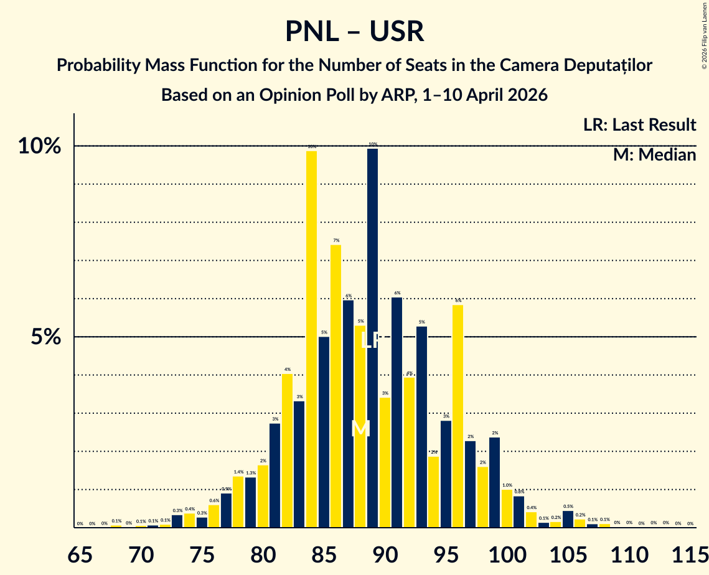

| Number of Seats | Probability | Accumulated | Special Marks |
|:---------------:|:-----------:|:-----------:|:-------------:|
| 68 | 0.1% | 100% |  |
| 69 | 0% | 99.9% |  |
| 70 | 0.1% | 99.9% |  |
| 71 | 0.1% | 99.8% |  |
| 72 | 0.1% | 99.8% |  |
| 73 | 0.3% | 99.7% |  |
| 74 | 0.4% | 99.3% |  |
| 75 | 0.3% | 98.9% |  |
| 76 | 0.6% | 98.6% |  |
| 77 | 0.9% | 98% |  |
| 78 | 1.4% | 97% |  |
| 79 | 1.3% | 96% |  |
| 80 | 2% | 94% |  |
| 81 | 3% | 93% |  |
| 82 | 4% | 90% |  |
| 83 | 3% | 86% |  |
| 84 | 10% | 83% |  |
| 85 | 5% | 73% |  |
| 86 | 7% | 68% |  |
| 87 | 6% | 60% |  |
| 88 | 5% | 54% | Median |
| 89 | 10% | 49% | Last Result |
| 90 | 3% | 39% |  |
| 91 | 6% | 36% |  |
| 92 | 4% | 30% |  |
| 93 | 5% | 26% |  |
| 94 | 2% | 20% |  |
| 95 | 3% | 19% |  |
| 96 | 6% | 16% |  |
| 97 | 2% | 10% |  |
| 98 | 2% | 8% |  |
| 99 | 2% | 6% |  |
| 100 | 1.0% | 4% |  |
| 101 | 0.8% | 3% |  |
| 102 | 0.4% | 2% |  |
| 103 | 0.1% | 1.4% |  |
| 104 | 0.2% | 1.2% |  |
| 105 | 0.5% | 1.0% |  |
| 106 | 0.2% | 0.6% |  |
| 107 | 0.1% | 0.4% |  |
| 108 | 0.1% | 0.3% |  |
| 109 | 0% | 0.1% |  |
| 110 | 0% | 0.1% |  |
| 111 | 0% | 0.1% |  |
| 112 | 0% | 0.1% |  |
| 113 | 0% | 0% |  |

### Partidul Național Liberal – Romániai Magyar Demokrata Szövetség

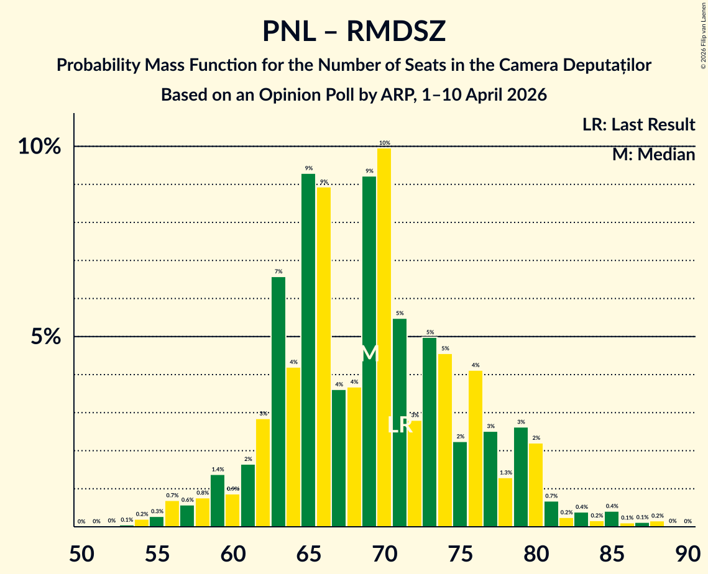

| Number of Seats | Probability | Accumulated | Special Marks |
|:---------------:|:-----------:|:-----------:|:-------------:|
| 52 | 0% | 100% |  |
| 53 | 0.1% | 99.9% |  |
| 54 | 0.2% | 99.9% |  |
| 55 | 0.3% | 99.7% |  |
| 56 | 0.7% | 99.4% |  |
| 57 | 0.6% | 98.7% |  |
| 58 | 0.8% | 98% |  |
| 59 | 1.4% | 97% |  |
| 60 | 0.9% | 96% |  |
| 61 | 2% | 95% |  |
| 62 | 3% | 93% |  |
| 63 | 7% | 91% |  |
| 64 | 4% | 84% |  |
| 65 | 9% | 80% |  |
| 66 | 9% | 71% |  |
| 67 | 4% | 62% |  |
| 68 | 4% | 58% | Median |
| 69 | 9% | 54% |  |
| 70 | 10% | 45% |  |
| 71 | 5% | 35% | Last Result |
| 72 | 3% | 30% |  |
| 73 | 5% | 27% |  |
| 74 | 5% | 22% |  |
| 75 | 2% | 17% |  |
| 76 | 4% | 15% |  |
| 77 | 3% | 11% |  |
| 78 | 1.3% | 8% |  |
| 79 | 3% | 7% |  |
| 80 | 2% | 5% |  |
| 81 | 0.7% | 2% |  |
| 82 | 0.2% | 2% |  |
| 83 | 0.4% | 1.4% |  |
| 84 | 0.2% | 1.0% |  |
| 85 | 0.4% | 0.9% |  |
| 86 | 0.1% | 0.4% |  |
| 87 | 0.1% | 0.3% |  |
| 88 | 0.2% | 0.2% |  |
| 89 | 0% | 0.1% |  |
| 90 | 0% | 0% |  |

### Partidul Social Democrat

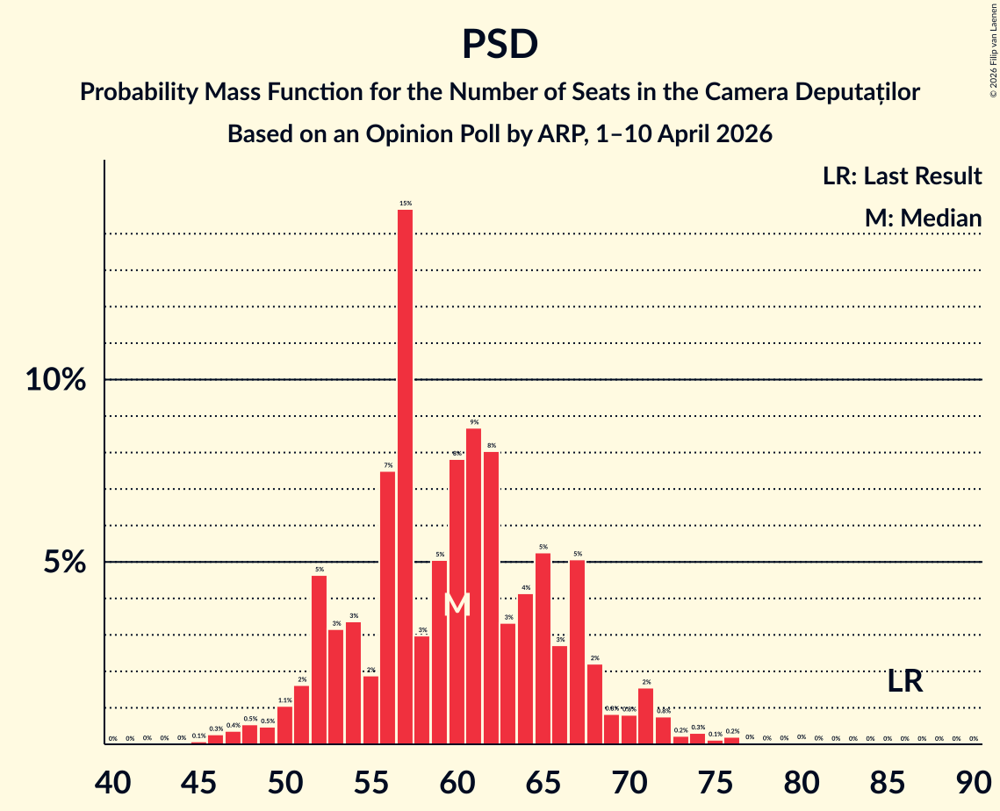

| Number of Seats | Probability | Accumulated | Special Marks |
|:---------------:|:-----------:|:-----------:|:-------------:|
| 44 | 0% | 100% |  |
| 45 | 0.1% | 99.9% |  |
| 46 | 0.3% | 99.9% |  |
| 47 | 0.4% | 99.6% |  |
| 48 | 0.5% | 99.2% |  |
| 49 | 0.5% | 98.7% |  |
| 50 | 1.1% | 98% |  |
| 51 | 2% | 97% |  |
| 52 | 5% | 96% |  |
| 53 | 3% | 91% |  |
| 54 | 3% | 88% |  |
| 55 | 2% | 84% |  |
| 56 | 7% | 82% |  |
| 57 | 15% | 75% |  |
| 58 | 3% | 60% |  |
| 59 | 5% | 57% |  |
| 60 | 8% | 52% | Median |
| 61 | 9% | 44% |  |
| 62 | 8% | 36% |  |
| 63 | 3% | 28% |  |
| 64 | 4% | 24% |  |
| 65 | 5% | 20% |  |
| 66 | 3% | 15% |  |
| 67 | 5% | 12% |  |
| 68 | 2% | 7% |  |
| 69 | 0.8% | 5% |  |
| 70 | 0.8% | 4% |  |
| 71 | 2% | 3% |  |
| 72 | 0.8% | 2% |  |
| 73 | 0.2% | 1.0% |  |
| 74 | 0.3% | 0.8% |  |
| 75 | 0.1% | 0.5% |  |
| 76 | 0.2% | 0.3% |  |
| 77 | 0% | 0.1% |  |
| 78 | 0% | 0.1% |  |
| 79 | 0% | 0.1% |  |
| 80 | 0% | 0.1% |  |
| 81 | 0% | 0% |  |
| 82 | 0% | 0% |  |
| 83 | 0% | 0% |  |
| 84 | 0% | 0% |  |
| 85 | 0% | 0% |  |
| 86 | 0% | 0% | Last Result |

### Partidul Național Liberal

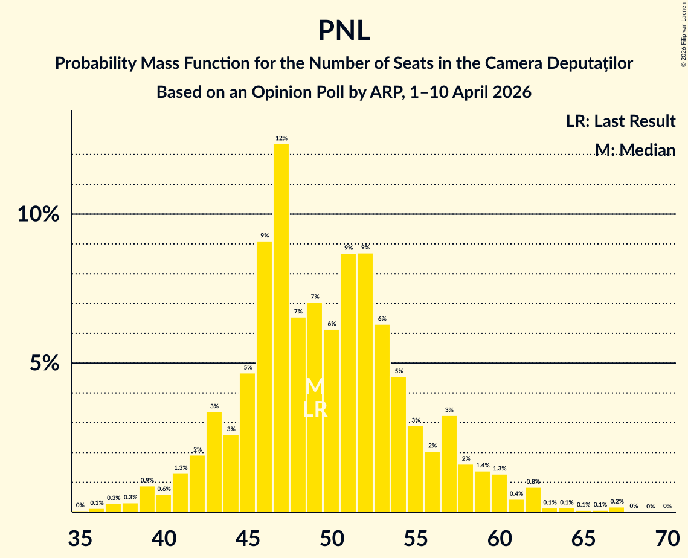

| Number of Seats | Probability | Accumulated | Special Marks |
|:---------------:|:-----------:|:-----------:|:-------------:|
| 35 | 0% | 100% |  |
| 36 | 0.1% | 99.9% |  |
| 37 | 0.3% | 99.8% |  |
| 38 | 0.3% | 99.5% |  |
| 39 | 0.9% | 99.2% |  |
| 40 | 0.6% | 98% |  |
| 41 | 1.3% | 98% |  |
| 42 | 2% | 96% |  |
| 43 | 3% | 94% |  |
| 44 | 3% | 91% |  |
| 45 | 5% | 89% |  |
| 46 | 9% | 84% |  |
| 47 | 12% | 75% |  |
| 48 | 7% | 62% |  |
| 49 | 7% | 56% | Last Result, Median |
| 50 | 6% | 49% |  |
| 51 | 9% | 43% |  |
| 52 | 9% | 34% |  |
| 53 | 6% | 25% |  |
| 54 | 5% | 19% |  |
| 55 | 3% | 14% |  |
| 56 | 2% | 11% |  |
| 57 | 3% | 9% |  |
| 58 | 2% | 6% |  |
| 59 | 1.4% | 5% |  |
| 60 | 1.3% | 3% |  |
| 61 | 0.4% | 2% |  |
| 62 | 0.8% | 1.5% |  |
| 63 | 0.1% | 0.6% |  |
| 64 | 0.1% | 0.5% |  |
| 65 | 0.1% | 0.4% |  |
| 66 | 0.1% | 0.3% |  |
| 67 | 0.2% | 0.2% |  |
| 68 | 0% | 0.1% |  |
| 69 | 0% | 0% |  |

## Technical Information

### Opinion Poll

+ **Polling firm:** ARP
+ **Commissioner(s):** —
+ **Fieldwork period:** 1–10 April 2026

### Calculations

+ **Sample size:** 647
+ **Simulations done:** 2,097,152
+ **Error estimate:** 2.80%

