# Opinion Poll by CURS, 1–14 May 2026

<a href="#voting-intentions">Voting Intentions</a> | <a href="#seats">Seats</a> | <a href="#coalitions">Coalitions</a> | <a href="#technical-information">Technical Information</a>

## Voting Intentions

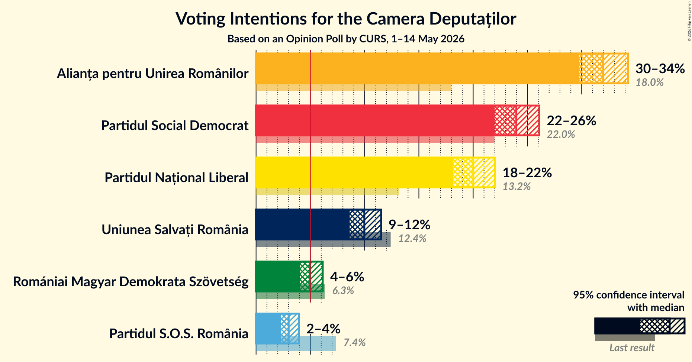

### Confidence Intervals

| Party | Last Result | Poll Result | 80% Confidence Interval | 90% Confidence Interval | 95% Confidence Interval | 99% Confidence Interval |
|:-----:|:-----------:|:-----------:|:-----------------------:|:-----------------------:|:-----------------------:|:-----------------------:|
| Alianța pentru Unirea Românilor | 18.0% | 32.0% | 30.5–33.5% |30.1–33.9% |29.8–34.3% |29.1–35.0% |
| Partidul Social Democrat | 22.0% | 24.0% | 22.7–25.4% |22.3–25.8% |22.0–26.1% |21.4–26.8% |
| Partidul Național Liberal | 13.2% | 20.0% | 18.8–21.3% |18.4–21.7% |18.2–22.0% |17.6–22.6% |
| Uniunea Salvați România | 12.4% | 10.0% | 9.1–11.0% |8.8–11.3% |8.6–11.5% |8.2–12.0% |
| Romániai Magyar Demokrata Szövetség | 6.3% | 5.0% | 4.4–5.7% |4.2–6.0% |4.0–6.1% |3.7–6.5% |
| Partidul S.O.S. România | 7.4% | 3.0% | 2.5–3.6% |2.4–3.8% |2.3–3.9% |2.1–4.3% |

*Note:* The poll result column reflects the actual value used in the calculations. Published results may vary slightly, and in addition be rounded to fewer digits.

## Seats

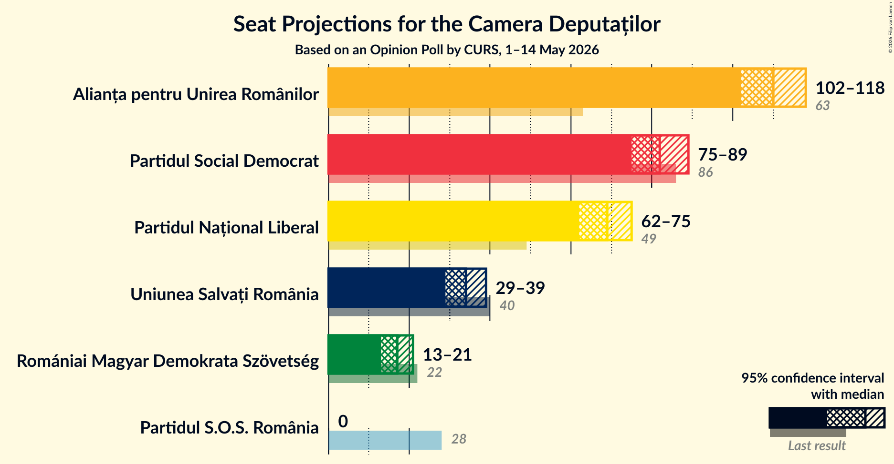

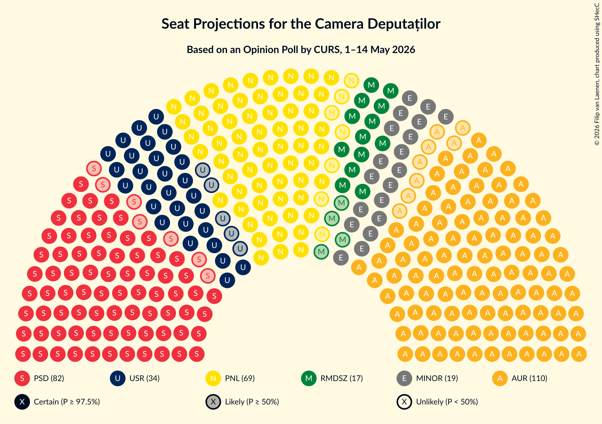

### Confidence Intervals

| Party | Last Result | Median | 80% Confidence Interval | 90% Confidence Interval | 95% Confidence Interval | 99% Confidence Interval |
|:-----:|:-----------:|:------:|:-----------------------:|:-----------------------:|:-----------------------:|:-----------------------:|
| <a href="#alianța-pentru-unirea-românilor">Alianța pentru Unirea Românilor</a> | 63 | 110 | 105–115 |104–116 |102–118 |100–120 |
| <a href="#partidul-social-democrat">Partidul Social Democrat</a> | 86 | 82 | 78–87 |77–88 |75–89 |73–92 |
| <a href="#partidul-național-liberal">Partidul Național Liberal</a> | 49 | 69 | 64–73 |63–74 |62–75 |60–78 |
| <a href="#uniunea-salvați-românia">Uniunea Salvați România</a> | 40 | 34 | 31–37 |30–38 |29–39 |28–41 |
| <a href="#romániai-magyar-demokrata-szövetség">Romániai Magyar Demokrata Szövetség</a> | 22 | 17 | 15–19 |14–20 |13–21 |12–22 |
| <a href="#partidul-s.o.s.-românia">Partidul S.O.S. România</a> | 28 | 0 | 0 |0 |0 |0 |

### Alianța pentru Unirea Românilor

*For a full overview of the results for this party, see the [Alianța pentru Unirea Românilor](party-alianțapentruunirearomânilor.html) page.*

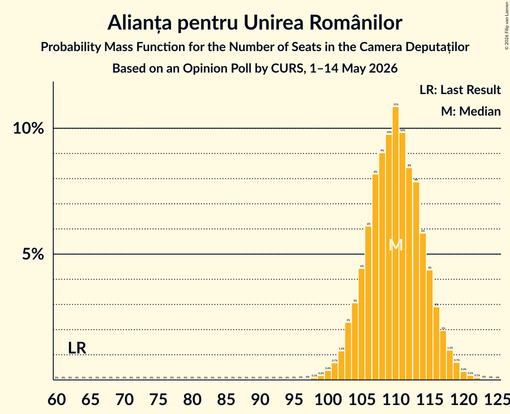

| Number of Seats | Probability | Accumulated | Special Marks |
|:---------------:|:-----------:|:-----------:|:-------------:|
| 63 | 0% | 100% | Last Result |
| 64 | 0% | 100% |  |
| 65 | 0% | 100% |  |
| 66 | 0% | 100% |  |
| 67 | 0% | 100% |  |
| 68 | 0% | 100% |  |
| 69 | 0% | 100% |  |
| 70 | 0% | 100% |  |
| 71 | 0% | 100% |  |
| 72 | 0% | 100% |  |
| 73 | 0% | 100% |  |
| 74 | 0% | 100% |  |
| 75 | 0% | 100% |  |
| 76 | 0% | 100% |  |
| 77 | 0% | 100% |  |
| 78 | 0% | 100% |  |
| 79 | 0% | 100% |  |
| 80 | 0% | 100% |  |
| 81 | 0% | 100% |  |
| 82 | 0% | 100% |  |
| 83 | 0% | 100% |  |
| 84 | 0% | 100% |  |
| 85 | 0% | 100% |  |
| 86 | 0% | 100% |  |
| 87 | 0% | 100% |  |
| 88 | 0% | 100% |  |
| 89 | 0% | 100% |  |
| 90 | 0% | 100% |  |
| 91 | 0% | 100% |  |
| 92 | 0% | 100% |  |
| 93 | 0% | 100% |  |
| 94 | 0% | 100% |  |
| 95 | 0% | 100% |  |
| 96 | 0% | 100% |  |
| 97 | 0% | 100% |  |
| 98 | 0.1% | 99.9% |  |
| 99 | 0.2% | 99.9% |  |
| 100 | 0.4% | 99.7% |  |
| 101 | 0.7% | 99.3% |  |
| 102 | 1.2% | 98.6% |  |
| 103 | 2% | 97% |  |
| 104 | 3% | 95% |  |
| 105 | 4% | 92% |  |
| 106 | 6% | 88% |  |
| 107 | 8% | 82% |  |
| 108 | 9% | 73% |  |
| 109 | 10% | 64% |  |
| 110 | 11% | 55% | Median |
| 111 | 10% | 44% |  |
| 112 | 8% | 34% |  |
| 113 | 8% | 25% |  |
| 114 | 6% | 18% |  |
| 115 | 4% | 12% |  |
| 116 | 3% | 7% |  |
| 117 | 2% | 5% |  |
| 118 | 1.2% | 3% |  |
| 119 | 0.7% | 1.4% |  |
| 120 | 0.3% | 0.7% |  |
| 121 | 0.2% | 0.3% |  |
| 122 | 0.1% | 0.2% |  |
| 123 | 0% | 0.1% |  |
| 124 | 0% | 0% |  |

### Partidul Social Democrat

*For a full overview of the results for this party, see the [Partidul Social Democrat](party-partidulsocialdemocrat.html) page.*

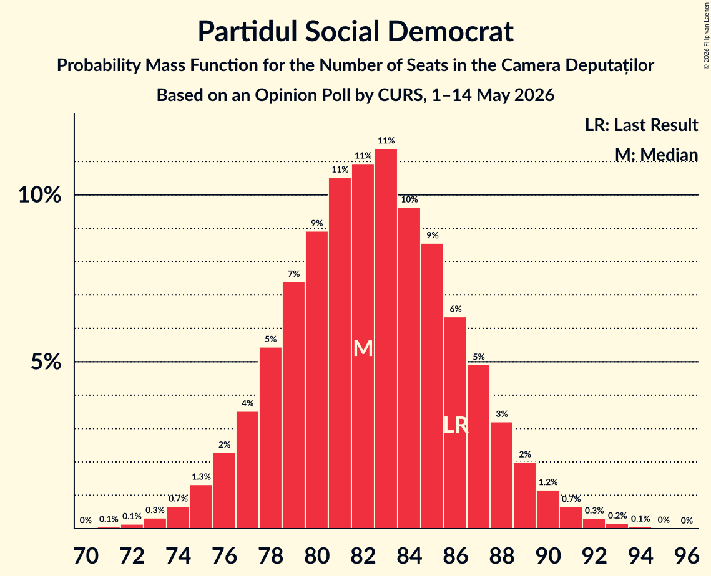

| Number of Seats | Probability | Accumulated | Special Marks |
|:---------------:|:-----------:|:-----------:|:-------------:|
| 71 | 0.1% | 100% |  |
| 72 | 0.1% | 99.9% |  |
| 73 | 0.3% | 99.8% |  |
| 74 | 0.7% | 99.5% |  |
| 75 | 1.3% | 98.8% |  |
| 76 | 2% | 97% |  |
| 77 | 4% | 95% |  |
| 78 | 5% | 92% |  |
| 79 | 7% | 86% |  |
| 80 | 9% | 79% |  |
| 81 | 11% | 70% |  |
| 82 | 11% | 59% | Median |
| 83 | 11% | 48% |  |
| 84 | 10% | 37% |  |
| 85 | 9% | 27% |  |
| 86 | 6% | 19% | Last Result |
| 87 | 5% | 13% |  |
| 88 | 3% | 8% |  |
| 89 | 2% | 4% |  |
| 90 | 1.2% | 2% |  |
| 91 | 0.7% | 1.2% |  |
| 92 | 0.3% | 0.6% |  |
| 93 | 0.2% | 0.3% |  |
| 94 | 0.1% | 0.1% |  |
| 95 | 0% | 0% |  |

### Partidul Național Liberal

*For a full overview of the results for this party, see the [Partidul Național Liberal](party-partidulnaționalliberal.html) page.*

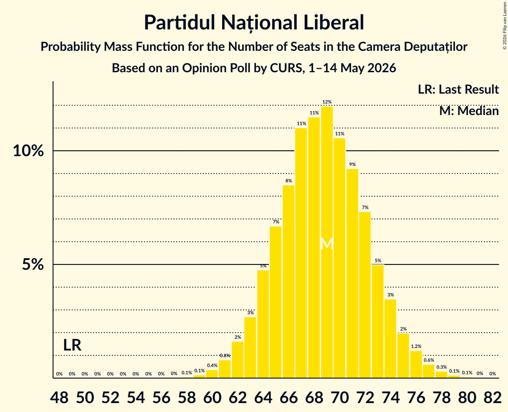

| Number of Seats | Probability | Accumulated | Special Marks |
|:---------------:|:-----------:|:-----------:|:-------------:|
| 49 | 0% | 100% | Last Result |
| 50 | 0% | 100% |  |
| 51 | 0% | 100% |  |
| 52 | 0% | 100% |  |
| 53 | 0% | 100% |  |
| 54 | 0% | 100% |  |
| 55 | 0% | 100% |  |
| 56 | 0% | 100% |  |
| 57 | 0% | 100% |  |
| 58 | 0.1% | 100% |  |
| 59 | 0.1% | 99.9% |  |
| 60 | 0.4% | 99.8% |  |
| 61 | 0.8% | 99.4% |  |
| 62 | 2% | 98.6% |  |
| 63 | 3% | 97% |  |
| 64 | 5% | 94% |  |
| 65 | 7% | 90% |  |
| 66 | 8% | 83% |  |
| 67 | 11% | 74% |  |
| 68 | 11% | 63% |  |
| 69 | 12% | 52% | Median |
| 70 | 11% | 40% |  |
| 71 | 9% | 29% |  |
| 72 | 7% | 20% |  |
| 73 | 5% | 13% |  |
| 74 | 3% | 8% |  |
| 75 | 2% | 4% |  |
| 76 | 1.2% | 2% |  |
| 77 | 0.6% | 1.1% |  |
| 78 | 0.3% | 0.5% |  |
| 79 | 0.1% | 0.2% |  |
| 80 | 0.1% | 0.1% |  |
| 81 | 0% | 0% |  |

### Uniunea Salvați România

*For a full overview of the results for this party, see the [Uniunea Salvați România](party-uniuneasalvațiromânia.html) page.*

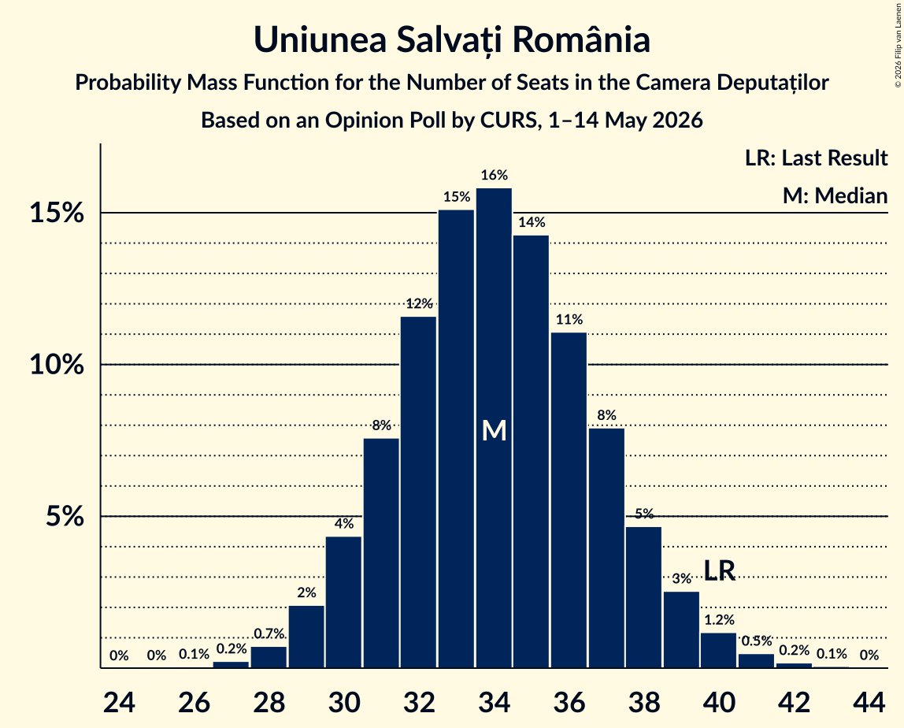

| Number of Seats | Probability | Accumulated | Special Marks |
|:---------------:|:-----------:|:-----------:|:-------------:|
| 26 | 0.1% | 100% |  |
| 27 | 0.2% | 99.9% |  |
| 28 | 0.7% | 99.7% |  |
| 29 | 2% | 99.0% |  |
| 30 | 4% | 97% |  |
| 31 | 8% | 93% |  |
| 32 | 12% | 85% |  |
| 33 | 15% | 73% |  |
| 34 | 16% | 58% | Median |
| 35 | 14% | 42% |  |
| 36 | 11% | 28% |  |
| 37 | 8% | 17% |  |
| 38 | 5% | 9% |  |
| 39 | 3% | 4% |  |
| 40 | 1.2% | 2% | Last Result |
| 41 | 0.5% | 0.8% |  |
| 42 | 0.2% | 0.3% |  |
| 43 | 0.1% | 0.1% |  |
| 44 | 0% | 0% |  |

### Romániai Magyar Demokrata Szövetség

*For a full overview of the results for this party, see the [Romániai Magyar Demokrata Szövetség](party-romániaimagyardemokrataszövetség.html) page.*

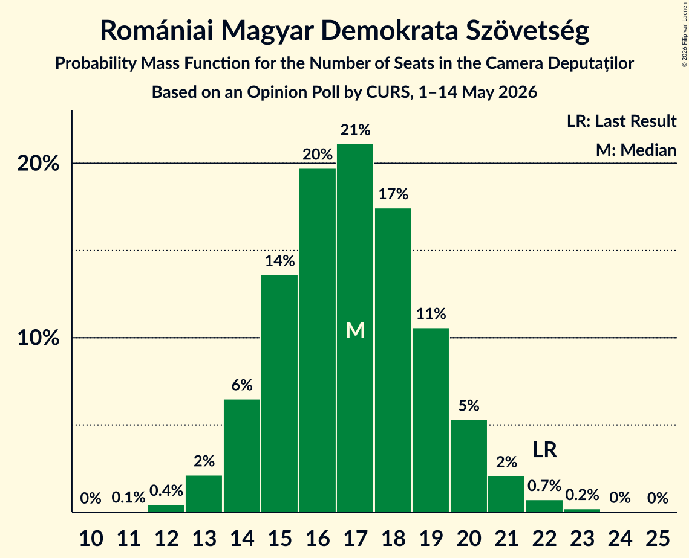

| Number of Seats | Probability | Accumulated | Special Marks |
|:---------------:|:-----------:|:-----------:|:-------------:|
| 11 | 0.1% | 100% |  |
| 12 | 0.4% | 99.9% |  |
| 13 | 2% | 99.5% |  |
| 14 | 6% | 97% |  |
| 15 | 14% | 91% |  |
| 16 | 20% | 77% |  |
| 17 | 21% | 58% | Median |
| 18 | 17% | 36% |  |
| 19 | 11% | 19% |  |
| 20 | 5% | 8% |  |
| 21 | 2% | 3% |  |
| 22 | 0.7% | 1.0% | Last Result |
| 23 | 0.2% | 0.3% |  |
| 24 | 0% | 0.1% |  |
| 25 | 0% | 0% |  |

### Partidul S.O.S. România

*For a full overview of the results for this party, see the [Partidul S.O.S. România](party-partidulsosromânia.html) page.*

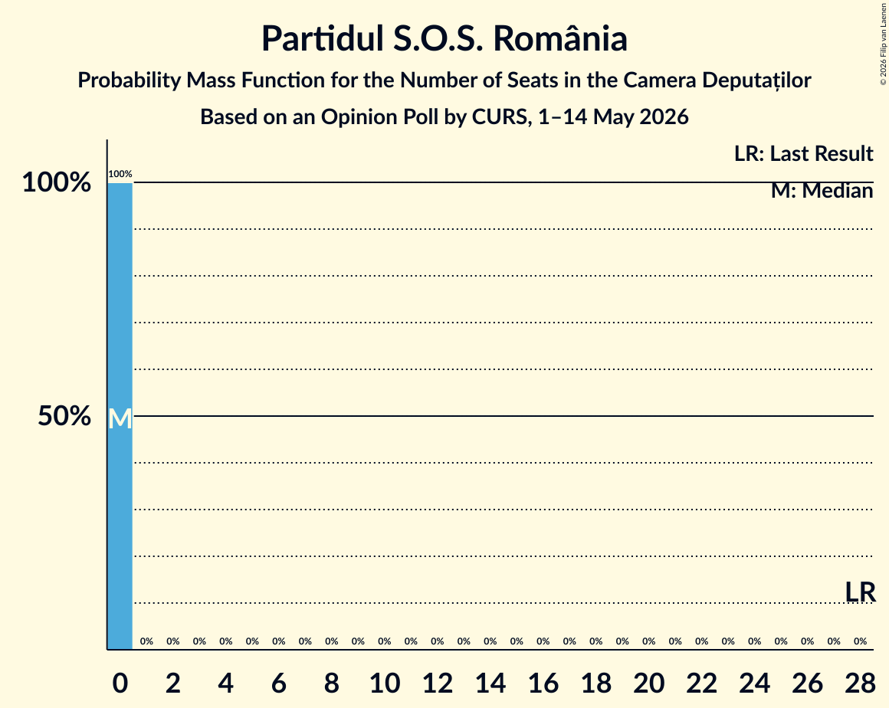

| Number of Seats | Probability | Accumulated | Special Marks |
|:---------------:|:-----------:|:-----------:|:-------------:|
| 0 | 100% | 100% | Median |
| 1 | 0% | 0% |  |
| 2 | 0% | 0% |  |
| 3 | 0% | 0% |  |
| 4 | 0% | 0% |  |
| 5 | 0% | 0% |  |
| 6 | 0% | 0% |  |
| 7 | 0% | 0% |  |
| 8 | 0% | 0% |  |
| 9 | 0% | 0% |  |
| 10 | 0% | 0% |  |
| 11 | 0% | 0% |  |
| 12 | 0% | 0% |  |
| 13 | 0% | 0% |  |
| 14 | 0% | 0% |  |
| 15 | 0% | 0% |  |
| 16 | 0% | 0% |  |
| 17 | 0% | 0% |  |
| 18 | 0% | 0% |  |
| 19 | 0% | 0% |  |
| 20 | 0% | 0% |  |
| 21 | 0% | 0% |  |
| 22 | 0% | 0% |  |
| 23 | 0% | 0% |  |
| 24 | 0% | 0% |  |
| 25 | 0% | 0% |  |
| 26 | 0% | 0% |  |
| 27 | 0% | 0% |  |
| 28 | 0% | 0% | Last Result |

## Coalitions

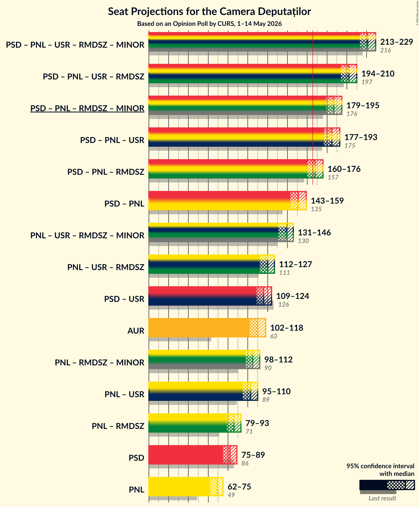

### Confidence Intervals

| Coalition | Last Result | Median | Majority? | 80% Confidence Interval | 90% Confidence Interval | 95% Confidence Interval | 99% Confidence Interval |
|:---------:|:-----------:|:------:|:---------:|:-----------------------:|:-----------------------:|:-----------------------:|:-----------------------:|
| Partidul Social Democrat – Partidul Național Liberal – Uniunea Salvați România – Romániai Magyar Demokrata Szövetség | 197 | 202 | 100% | 197–207 | 196–208 | 194–210 | 192–212 |
| Partidul Social Democrat – Partidul Național Liberal – Uniunea Salvați România | 175 | 185 | 100% | 180–190 | 179–192 | 177–193 | 175–195 |
| Partidul Social Democrat – Partidul Național Liberal – Romániai Magyar Demokrata Szövetség | 157 | 168 | 73% | 163–173 | 161–175 | 160–176 | 158–178 |
| Partidul Social Democrat – Partidul Național Liberal | 135 | 151 | 0% | 146–156 | 144–158 | 143–159 | 141–161 |
| Partidul Național Liberal – Uniunea Salvați România – Romániai Magyar Demokrata Szövetség | 111 | 120 | 0% | 115–125 | 113–126 | 112–127 | 110–130 |
| Partidul Social Democrat – Uniunea Salvați România | 126 | 116 | 0% | 111–121 | 110–123 | 109–124 | 107–127 |
| Alianța pentru Unirea Românilor | 63 | 110 | 0% | 105–115 | 104–116 | 102–118 | 100–120 |
| Partidul Național Liberal – Uniunea Salvați România | 89 | 103 | 0% | 98–108 | 97–109 | 95–110 | 93–113 |
| Partidul Național Liberal – Romániai Magyar Demokrata Szövetség | 71 | 86 | 0% | 81–90 | 80–92 | 79–93 | 76–95 |
| Partidul Social Democrat | 86 | 82 | 0% | 78–87 | 77–88 | 75–89 | 73–92 |
| Partidul Național Liberal | 49 | 69 | 0% | 64–73 | 63–74 | 62–75 | 60–78 |

### Partidul Social Democrat – Partidul Național Liberal – Uniunea Salvați România – Romániai Magyar Demokrata Szövetség

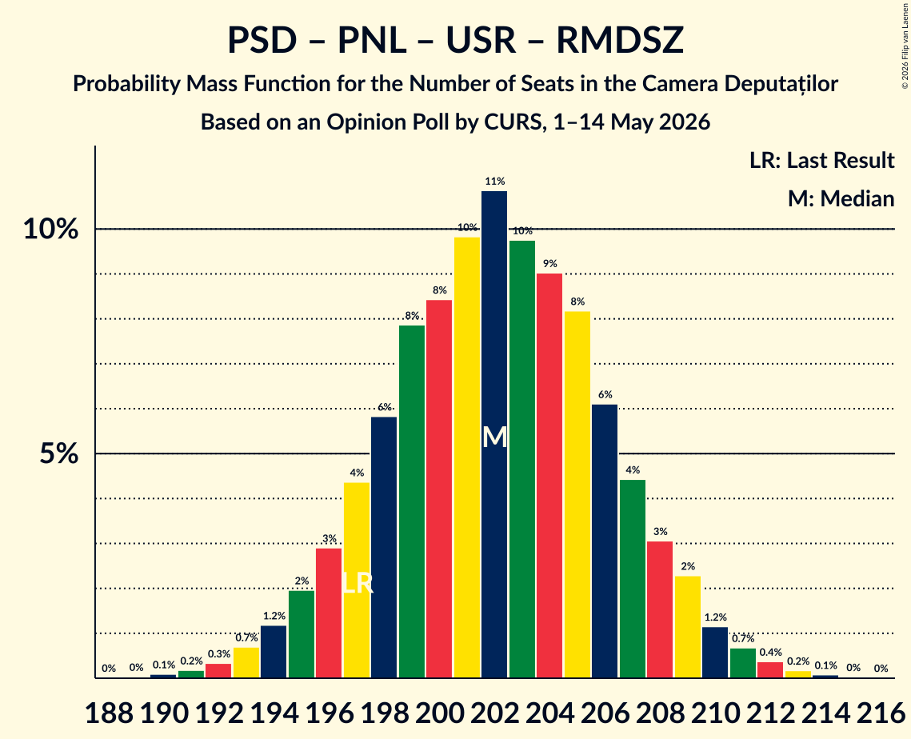

| Number of Seats | Probability | Accumulated | Special Marks |
|:---------------:|:-----------:|:-----------:|:-------------:|
| 189 | 0% | 100% |  |
| 190 | 0.1% | 99.9% |  |
| 191 | 0.2% | 99.8% |  |
| 192 | 0.3% | 99.7% |  |
| 193 | 0.7% | 99.3% |  |
| 194 | 1.2% | 98.6% |  |
| 195 | 2% | 97% |  |
| 196 | 3% | 95% |  |
| 197 | 4% | 93% | Last Result |
| 198 | 6% | 88% |  |
| 199 | 8% | 82% |  |
| 200 | 8% | 74% |  |
| 201 | 10% | 66% |  |
| 202 | 11% | 56% | Median |
| 203 | 10% | 45% |  |
| 204 | 9% | 36% |  |
| 205 | 8% | 27% |  |
| 206 | 6% | 18% |  |
| 207 | 4% | 12% |  |
| 208 | 3% | 8% |  |
| 209 | 2% | 5% |  |
| 210 | 1.2% | 3% |  |
| 211 | 0.7% | 1.4% |  |
| 212 | 0.4% | 0.7% |  |
| 213 | 0.2% | 0.3% |  |
| 214 | 0.1% | 0.1% |  |
| 215 | 0% | 0.1% |  |
| 216 | 0% | 0% |  |

### Partidul Social Democrat – Partidul Național Liberal – Uniunea Salvați România

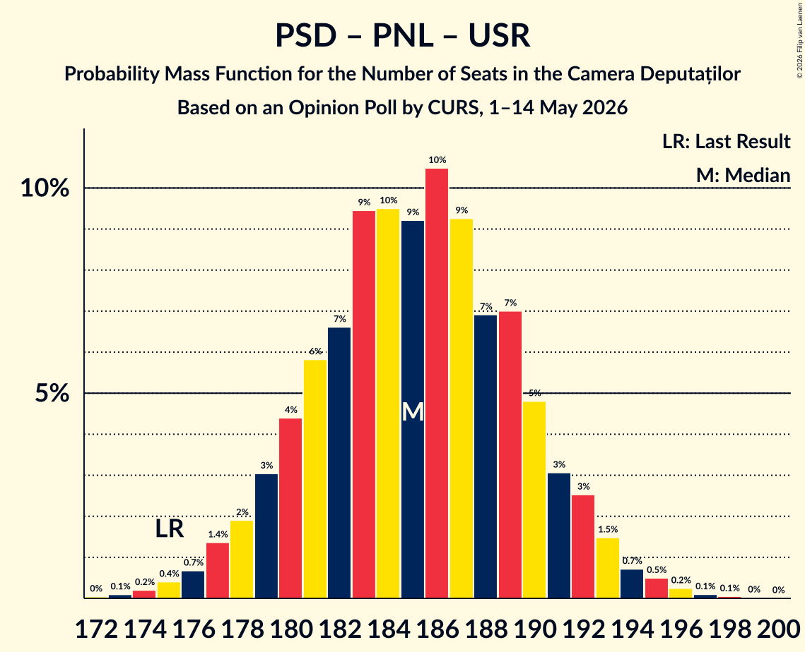

| Number of Seats | Probability | Accumulated | Special Marks |
|:---------------:|:-----------:|:-----------:|:-------------:|
| 172 | 0% | 100% |  |
| 173 | 0.1% | 99.9% |  |
| 174 | 0.2% | 99.8% |  |
| 175 | 0.4% | 99.6% | Last Result |
| 176 | 0.7% | 99.2% |  |
| 177 | 1.4% | 98.5% |  |
| 178 | 2% | 97% |  |
| 179 | 3% | 95% |  |
| 180 | 4% | 92% |  |
| 181 | 6% | 88% |  |
| 182 | 7% | 82% |  |
| 183 | 9% | 75% |  |
| 184 | 10% | 66% |  |
| 185 | 9% | 56% | Median |
| 186 | 10% | 47% |  |
| 187 | 9% | 37% |  |
| 188 | 7% | 27% |  |
| 189 | 7% | 21% |  |
| 190 | 5% | 14% |  |
| 191 | 3% | 9% |  |
| 192 | 3% | 6% |  |
| 193 | 1.5% | 3% |  |
| 194 | 0.7% | 2% |  |
| 195 | 0.5% | 0.9% |  |
| 196 | 0.2% | 0.4% |  |
| 197 | 0.1% | 0.2% |  |
| 198 | 0.1% | 0.1% |  |
| 199 | 0% | 0% |  |

### Partidul Social Democrat – Partidul Național Liberal – Romániai Magyar Demokrata Szövetség

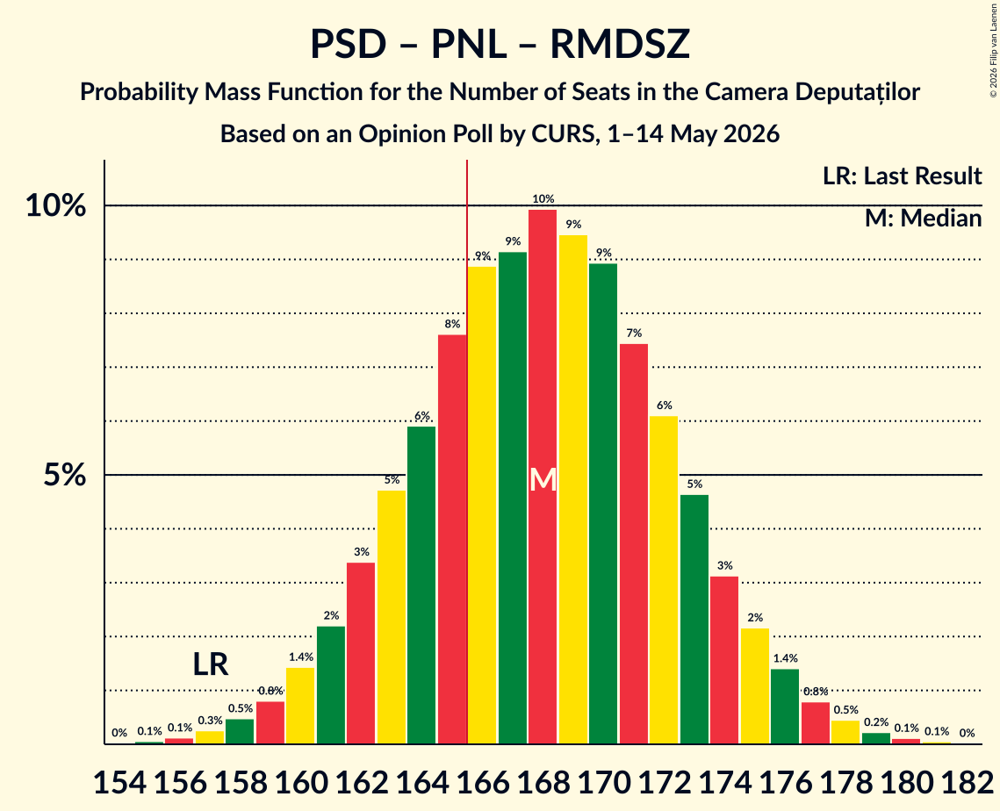

| Number of Seats | Probability | Accumulated | Special Marks |
|:---------------:|:-----------:|:-----------:|:-------------:|
| 155 | 0.1% | 100% |  |
| 156 | 0.1% | 99.9% |  |
| 157 | 0.3% | 99.8% | Last Result |
| 158 | 0.5% | 99.5% |  |
| 159 | 0.8% | 99.0% |  |
| 160 | 1.4% | 98% |  |
| 161 | 2% | 97% |  |
| 162 | 3% | 95% |  |
| 163 | 5% | 91% |  |
| 164 | 6% | 86% |  |
| 165 | 8% | 81% |  |
| 166 | 9% | 73% | Majority |
| 167 | 9% | 64% |  |
| 168 | 10% | 55% | Median |
| 169 | 9% | 45% |  |
| 170 | 9% | 36% |  |
| 171 | 7% | 27% |  |
| 172 | 6% | 19% |  |
| 173 | 5% | 13% |  |
| 174 | 3% | 8% |  |
| 175 | 2% | 5% |  |
| 176 | 1.4% | 3% |  |
| 177 | 0.8% | 2% |  |
| 178 | 0.5% | 0.9% |  |
| 179 | 0.2% | 0.4% |  |
| 180 | 0.1% | 0.2% |  |
| 181 | 0.1% | 0.1% |  |
| 182 | 0% | 0% |  |

### Partidul Social Democrat – Partidul Național Liberal

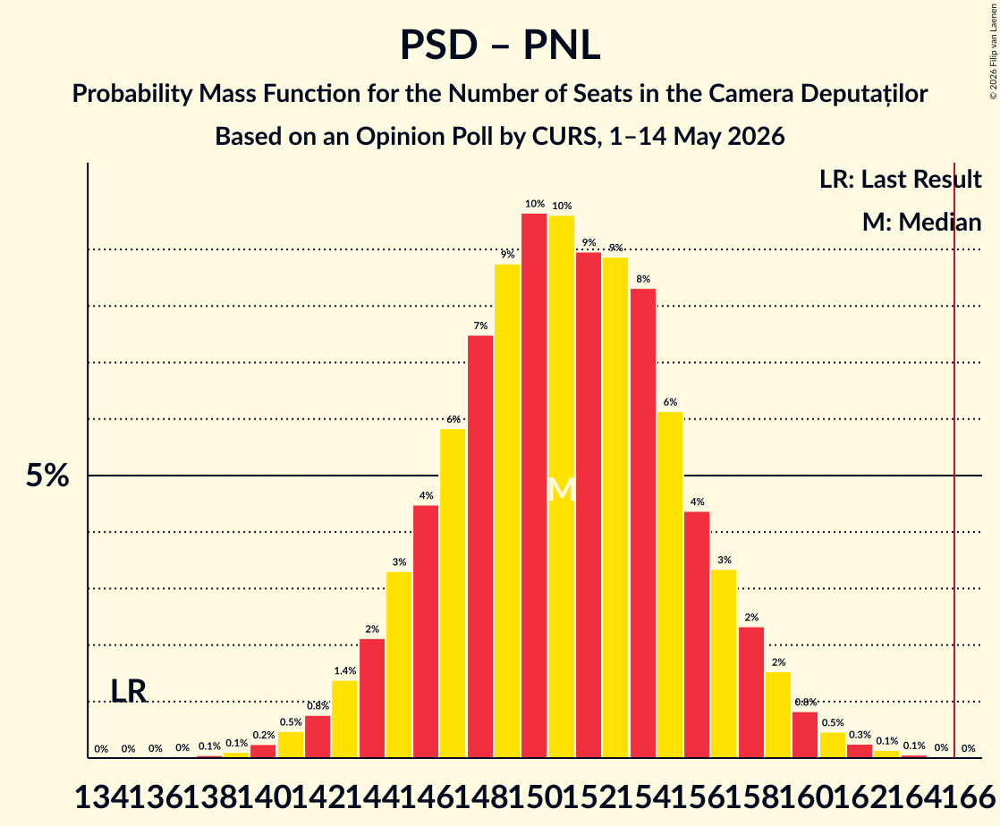

| Number of Seats | Probability | Accumulated | Special Marks |
|:---------------:|:-----------:|:-----------:|:-------------:|
| 135 | 0% | 100% | Last Result |
| 136 | 0% | 100% |  |
| 137 | 0% | 100% |  |
| 138 | 0.1% | 100% |  |
| 139 | 0.1% | 99.9% |  |
| 140 | 0.2% | 99.8% |  |
| 141 | 0.5% | 99.6% |  |
| 142 | 0.8% | 99.1% |  |
| 143 | 1.4% | 98% |  |
| 144 | 2% | 97% |  |
| 145 | 3% | 95% |  |
| 146 | 4% | 92% |  |
| 147 | 6% | 87% |  |
| 148 | 7% | 81% |  |
| 149 | 9% | 74% |  |
| 150 | 10% | 65% |  |
| 151 | 10% | 55% | Median |
| 152 | 9% | 46% |  |
| 153 | 9% | 37% |  |
| 154 | 8% | 28% |  |
| 155 | 6% | 20% |  |
| 156 | 4% | 13% |  |
| 157 | 3% | 9% |  |
| 158 | 2% | 6% |  |
| 159 | 2% | 3% |  |
| 160 | 0.8% | 2% |  |
| 161 | 0.5% | 1.0% |  |
| 162 | 0.3% | 0.5% |  |
| 163 | 0.1% | 0.2% |  |
| 164 | 0.1% | 0.1% |  |
| 165 | 0% | 0% |  |

### Partidul Național Liberal – Uniunea Salvați România – Romániai Magyar Demokrata Szövetség

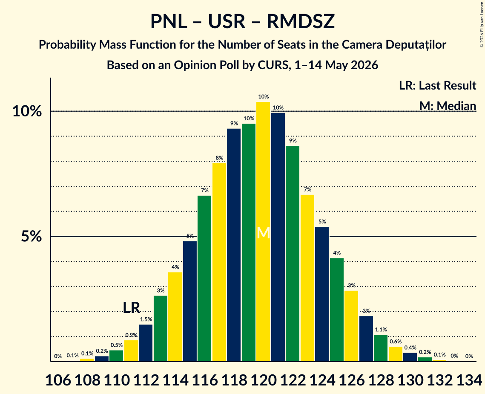

| Number of Seats | Probability | Accumulated | Special Marks |
|:---------------:|:-----------:|:-----------:|:-------------:|
| 107 | 0.1% | 100% |  |
| 108 | 0.1% | 99.9% |  |
| 109 | 0.2% | 99.8% |  |
| 110 | 0.5% | 99.6% |  |
| 111 | 0.9% | 99.1% | Last Result |
| 112 | 1.5% | 98% |  |
| 113 | 3% | 97% |  |
| 114 | 4% | 94% |  |
| 115 | 5% | 91% |  |
| 116 | 7% | 86% |  |
| 117 | 8% | 79% |  |
| 118 | 9% | 71% |  |
| 119 | 10% | 62% |  |
| 120 | 10% | 52% | Median |
| 121 | 10% | 42% |  |
| 122 | 9% | 32% |  |
| 123 | 7% | 23% |  |
| 124 | 5% | 17% |  |
| 125 | 4% | 11% |  |
| 126 | 3% | 7% |  |
| 127 | 2% | 4% |  |
| 128 | 1.1% | 2% |  |
| 129 | 0.6% | 1.3% |  |
| 130 | 0.4% | 0.7% |  |
| 131 | 0.2% | 0.3% |  |
| 132 | 0.1% | 0.1% |  |
| 133 | 0% | 0.1% |  |
| 134 | 0% | 0% |  |

### Partidul Social Democrat – Uniunea Salvați România

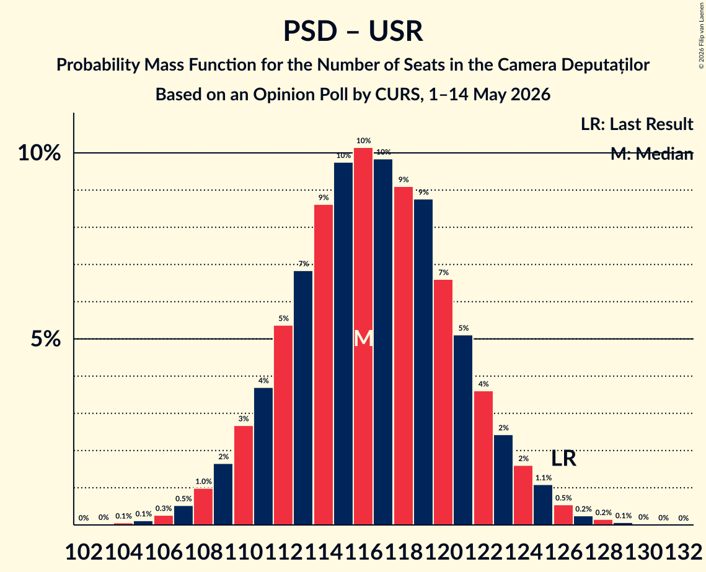

| Number of Seats | Probability | Accumulated | Special Marks |
|:---------------:|:-----------:|:-----------:|:-------------:|
| 104 | 0.1% | 100% |  |
| 105 | 0.1% | 99.9% |  |
| 106 | 0.3% | 99.8% |  |
| 107 | 0.5% | 99.5% |  |
| 108 | 1.0% | 99.0% |  |
| 109 | 2% | 98% |  |
| 110 | 3% | 96% |  |
| 111 | 4% | 94% |  |
| 112 | 5% | 90% |  |
| 113 | 7% | 85% |  |
| 114 | 9% | 78% |  |
| 115 | 10% | 69% |  |
| 116 | 10% | 59% | Median |
| 117 | 10% | 49% |  |
| 118 | 9% | 39% |  |
| 119 | 9% | 30% |  |
| 120 | 7% | 22% |  |
| 121 | 5% | 15% |  |
| 122 | 4% | 10% |  |
| 123 | 2% | 6% |  |
| 124 | 2% | 4% |  |
| 125 | 1.1% | 2% |  |
| 126 | 0.5% | 1.1% | Last Result |
| 127 | 0.2% | 0.5% |  |
| 128 | 0.2% | 0.3% |  |
| 129 | 0.1% | 0.1% |  |
| 130 | 0% | 0.1% |  |
| 131 | 0% | 0% |  |

### Alianța pentru Unirea Românilor

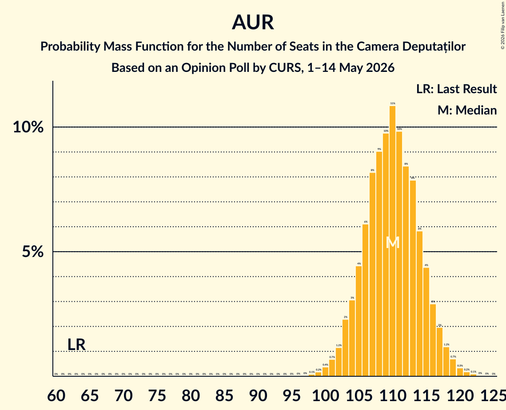

| Number of Seats | Probability | Accumulated | Special Marks |
|:---------------:|:-----------:|:-----------:|:-------------:|
| 63 | 0% | 100% | Last Result |
| 64 | 0% | 100% |  |
| 65 | 0% | 100% |  |
| 66 | 0% | 100% |  |
| 67 | 0% | 100% |  |
| 68 | 0% | 100% |  |
| 69 | 0% | 100% |  |
| 70 | 0% | 100% |  |
| 71 | 0% | 100% |  |
| 72 | 0% | 100% |  |
| 73 | 0% | 100% |  |
| 74 | 0% | 100% |  |
| 75 | 0% | 100% |  |
| 76 | 0% | 100% |  |
| 77 | 0% | 100% |  |
| 78 | 0% | 100% |  |
| 79 | 0% | 100% |  |
| 80 | 0% | 100% |  |
| 81 | 0% | 100% |  |
| 82 | 0% | 100% |  |
| 83 | 0% | 100% |  |
| 84 | 0% | 100% |  |
| 85 | 0% | 100% |  |
| 86 | 0% | 100% |  |
| 87 | 0% | 100% |  |
| 88 | 0% | 100% |  |
| 89 | 0% | 100% |  |
| 90 | 0% | 100% |  |
| 91 | 0% | 100% |  |
| 92 | 0% | 100% |  |
| 93 | 0% | 100% |  |
| 94 | 0% | 100% |  |
| 95 | 0% | 100% |  |
| 96 | 0% | 100% |  |
| 97 | 0% | 100% |  |
| 98 | 0.1% | 99.9% |  |
| 99 | 0.2% | 99.9% |  |
| 100 | 0.4% | 99.7% |  |
| 101 | 0.7% | 99.3% |  |
| 102 | 1.2% | 98.6% |  |
| 103 | 2% | 97% |  |
| 104 | 3% | 95% |  |
| 105 | 4% | 92% |  |
| 106 | 6% | 88% |  |
| 107 | 8% | 82% |  |
| 108 | 9% | 73% |  |
| 109 | 10% | 64% |  |
| 110 | 11% | 55% | Median |
| 111 | 10% | 44% |  |
| 112 | 8% | 34% |  |
| 113 | 8% | 25% |  |
| 114 | 6% | 18% |  |
| 115 | 4% | 12% |  |
| 116 | 3% | 7% |  |
| 117 | 2% | 5% |  |
| 118 | 1.2% | 3% |  |
| 119 | 0.7% | 1.4% |  |
| 120 | 0.3% | 0.7% |  |
| 121 | 0.2% | 0.3% |  |
| 122 | 0.1% | 0.2% |  |
| 123 | 0% | 0.1% |  |
| 124 | 0% | 0% |  |

### Partidul Național Liberal – Uniunea Salvați România

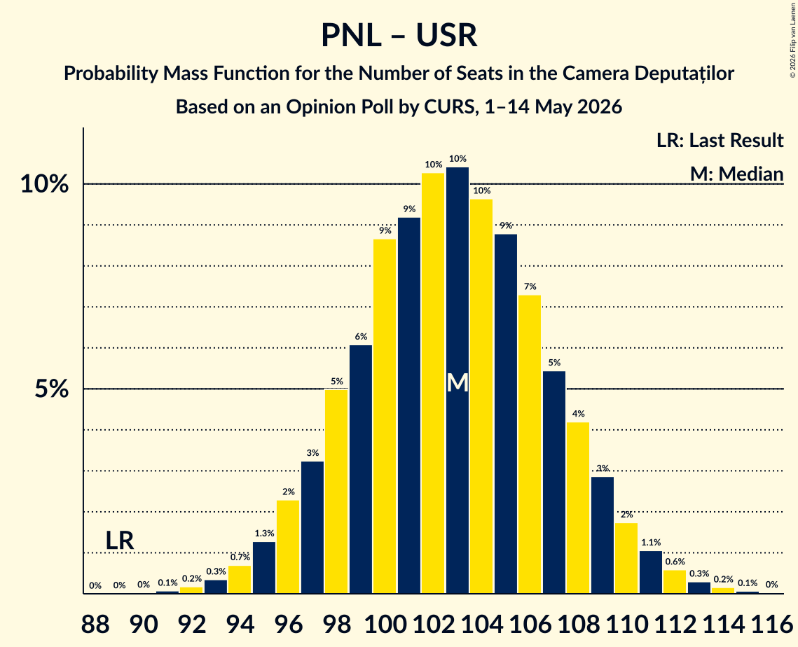

| Number of Seats | Probability | Accumulated | Special Marks |
|:---------------:|:-----------:|:-----------:|:-------------:|
| 89 | 0% | 100% | Last Result |
| 90 | 0% | 100% |  |
| 91 | 0.1% | 100% |  |
| 92 | 0.2% | 99.9% |  |
| 93 | 0.3% | 99.7% |  |
| 94 | 0.7% | 99.4% |  |
| 95 | 1.3% | 98.7% |  |
| 96 | 2% | 97% |  |
| 97 | 3% | 95% |  |
| 98 | 5% | 92% |  |
| 99 | 6% | 87% |  |
| 100 | 9% | 81% |  |
| 101 | 9% | 72% |  |
| 102 | 10% | 63% |  |
| 103 | 10% | 53% | Median |
| 104 | 10% | 42% |  |
| 105 | 9% | 33% |  |
| 106 | 7% | 24% |  |
| 107 | 5% | 16% |  |
| 108 | 4% | 11% |  |
| 109 | 3% | 7% |  |
| 110 | 2% | 4% |  |
| 111 | 1.1% | 2% |  |
| 112 | 0.6% | 1.2% |  |
| 113 | 0.3% | 0.6% |  |
| 114 | 0.2% | 0.3% |  |
| 115 | 0.1% | 0.1% |  |
| 116 | 0% | 0% |  |

### Partidul Național Liberal – Romániai Magyar Demokrata Szövetség

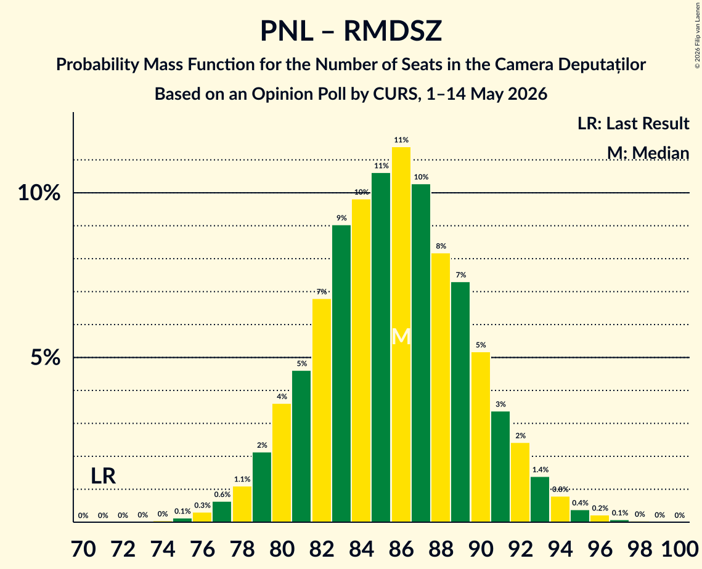

| Number of Seats | Probability | Accumulated | Special Marks |
|:---------------:|:-----------:|:-----------:|:-------------:|
| 71 | 0% | 100% | Last Result |
| 72 | 0% | 100% |  |
| 73 | 0% | 100% |  |
| 74 | 0% | 100% |  |
| 75 | 0.1% | 99.9% |  |
| 76 | 0.3% | 99.8% |  |
| 77 | 0.6% | 99.5% |  |
| 78 | 1.1% | 98.8% |  |
| 79 | 2% | 98% |  |
| 80 | 4% | 96% |  |
| 81 | 5% | 92% |  |
| 82 | 7% | 87% |  |
| 83 | 9% | 81% |  |
| 84 | 10% | 72% |  |
| 85 | 11% | 62% |  |
| 86 | 11% | 51% | Median |
| 87 | 10% | 40% |  |
| 88 | 8% | 29% |  |
| 89 | 7% | 21% |  |
| 90 | 5% | 14% |  |
| 91 | 3% | 9% |  |
| 92 | 2% | 5% |  |
| 93 | 1.4% | 3% |  |
| 94 | 0.8% | 2% |  |
| 95 | 0.4% | 0.8% |  |
| 96 | 0.2% | 0.4% |  |
| 97 | 0.1% | 0.1% |  |
| 98 | 0% | 0.1% |  |
| 99 | 0% | 0% |  |

### Partidul Social Democrat

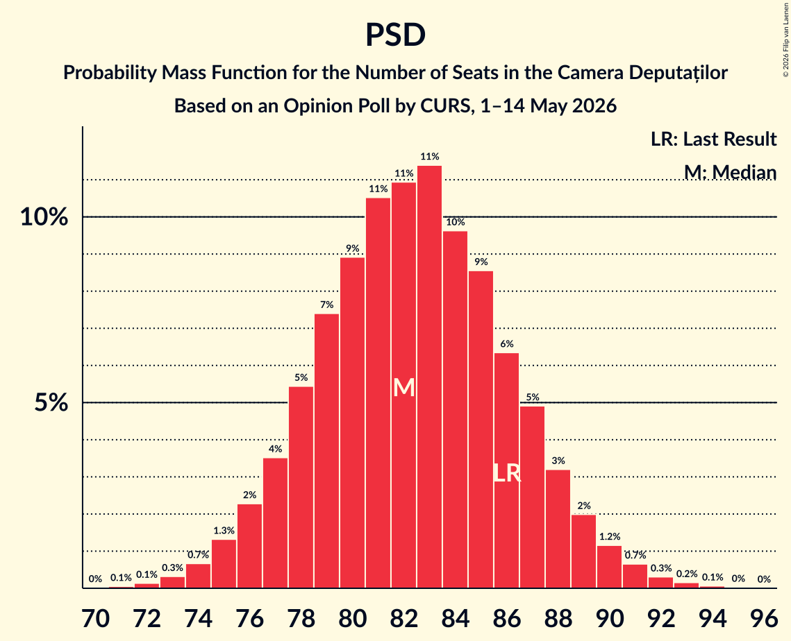

| Number of Seats | Probability | Accumulated | Special Marks |
|:---------------:|:-----------:|:-----------:|:-------------:|
| 71 | 0.1% | 100% |  |
| 72 | 0.1% | 99.9% |  |
| 73 | 0.3% | 99.8% |  |
| 74 | 0.7% | 99.5% |  |
| 75 | 1.3% | 98.8% |  |
| 76 | 2% | 97% |  |
| 77 | 4% | 95% |  |
| 78 | 5% | 92% |  |
| 79 | 7% | 86% |  |
| 80 | 9% | 79% |  |
| 81 | 11% | 70% |  |
| 82 | 11% | 59% | Median |
| 83 | 11% | 48% |  |
| 84 | 10% | 37% |  |
| 85 | 9% | 27% |  |
| 86 | 6% | 19% | Last Result |
| 87 | 5% | 13% |  |
| 88 | 3% | 8% |  |
| 89 | 2% | 4% |  |
| 90 | 1.2% | 2% |  |
| 91 | 0.7% | 1.2% |  |
| 92 | 0.3% | 0.6% |  |
| 93 | 0.2% | 0.3% |  |
| 94 | 0.1% | 0.1% |  |
| 95 | 0% | 0% |  |

### Partidul Național Liberal

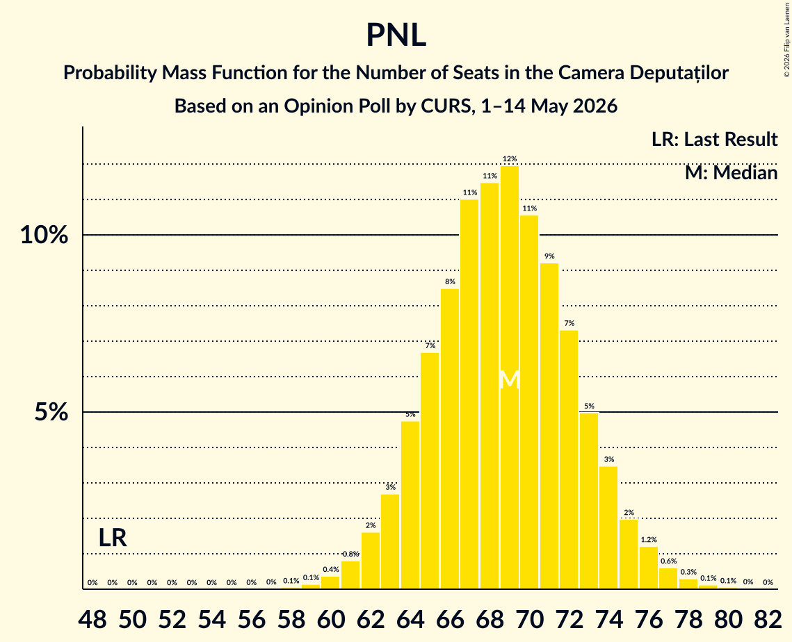

| Number of Seats | Probability | Accumulated | Special Marks |
|:---------------:|:-----------:|:-----------:|:-------------:|
| 49 | 0% | 100% | Last Result |
| 50 | 0% | 100% |  |
| 51 | 0% | 100% |  |
| 52 | 0% | 100% |  |
| 53 | 0% | 100% |  |
| 54 | 0% | 100% |  |
| 55 | 0% | 100% |  |
| 56 | 0% | 100% |  |
| 57 | 0% | 100% |  |
| 58 | 0.1% | 100% |  |
| 59 | 0.1% | 99.9% |  |
| 60 | 0.4% | 99.8% |  |
| 61 | 0.8% | 99.4% |  |
| 62 | 2% | 98.6% |  |
| 63 | 3% | 97% |  |
| 64 | 5% | 94% |  |
| 65 | 7% | 90% |  |
| 66 | 8% | 83% |  |
| 67 | 11% | 74% |  |
| 68 | 11% | 63% |  |
| 69 | 12% | 52% | Median |
| 70 | 11% | 40% |  |
| 71 | 9% | 29% |  |
| 72 | 7% | 20% |  |
| 73 | 5% | 13% |  |
| 74 | 3% | 8% |  |
| 75 | 2% | 4% |  |
| 76 | 1.2% | 2% |  |
| 77 | 0.6% | 1.1% |  |
| 78 | 0.3% | 0.5% |  |
| 79 | 0.1% | 0.2% |  |
| 80 | 0.1% | 0.1% |  |
| 81 | 0% | 0% |  |

## Technical Information

### Opinion Poll

+ **Polling firm:** CURS
+ **Commissioner(s):** —
+ **Fieldwork period:** 1–14 May 2026

### Calculations

+ **Sample size:** 1664
+ **Simulations done:** 2,097,152
+ **Error estimate:** 0.44%

