# Opinion Poll by INSCOP for Informat.ro, 11–14 May 2026

<a href="#voting-intentions">Voting Intentions</a> | <a href="#seats">Seats</a> | <a href="#coalitions">Coalitions</a> | <a href="#technical-information">Technical Information</a>

## Voting Intentions

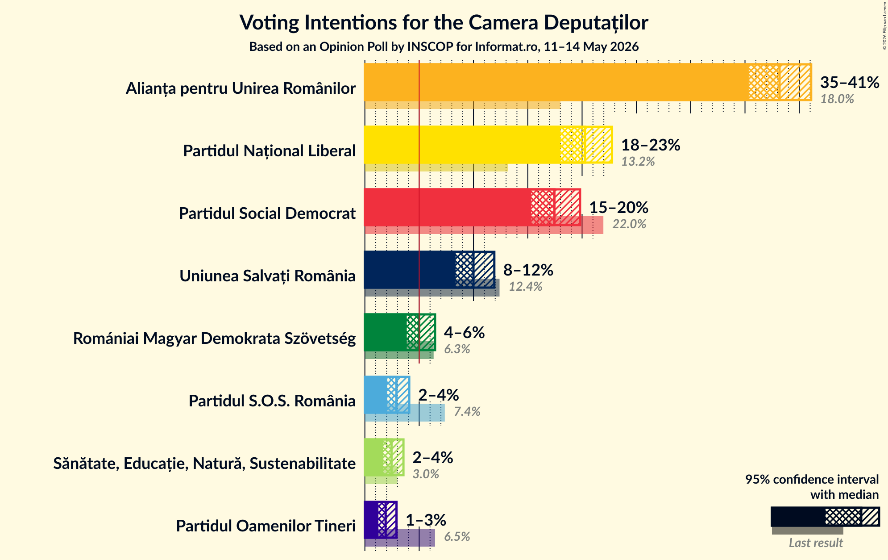

### Confidence Intervals

| Party | Last Result | Poll Result | 80% Confidence Interval | 90% Confidence Interval | 95% Confidence Interval | 99% Confidence Interval |
|:-----:|:-----------:|:-----------:|:-----------------------:|:-----------------------:|:-----------------------:|:-----------------------:|
| Alianța pentru Unirea Românilor | 18.0% | 38.2% | 36.3–40.1% |35.8–40.6% |35.3–41.1% |34.5–42.0% |
| Partidul Național Liberal | 13.2% | 20.3% | 18.8–21.9% |18.4–22.4% |18.0–22.8% |17.3–23.5% |
| Partidul Social Democrat | 22.0% | 17.5% | 16.0–19.0% |15.7–19.4% |15.3–19.8% |14.7–20.6% |
| Uniunea Salvați România | 12.4% | 10.0% | 8.9–11.3% |8.6–11.6% |8.4–11.9% |7.9–12.5% |
| Romániai Magyar Demokrata Szövetség | 6.3% | 5.0% | 4.3–6.0% |4.0–6.2% |3.9–6.5% |3.5–7.0% |
| Partidul S.O.S. România | 7.4% | 2.9% | 2.3–3.7% |2.2–3.9% |2.1–4.1% |1.8–4.5% |
| Sănătate, Educație, Natură, Sustenabilitate | 3.0% | 2.5% | 2.0–3.2% |1.8–3.4% |1.7–3.6% |1.5–3.9% |
| Partidul Oamenilor Tineri | 6.5% | 1.9% | 1.5–2.6% |1.4–2.7% |1.2–2.9% |1.1–3.2% |

*Note:* The poll result column reflects the actual value used in the calculations. Published results may vary slightly, and in addition be rounded to fewer digits.

## Seats

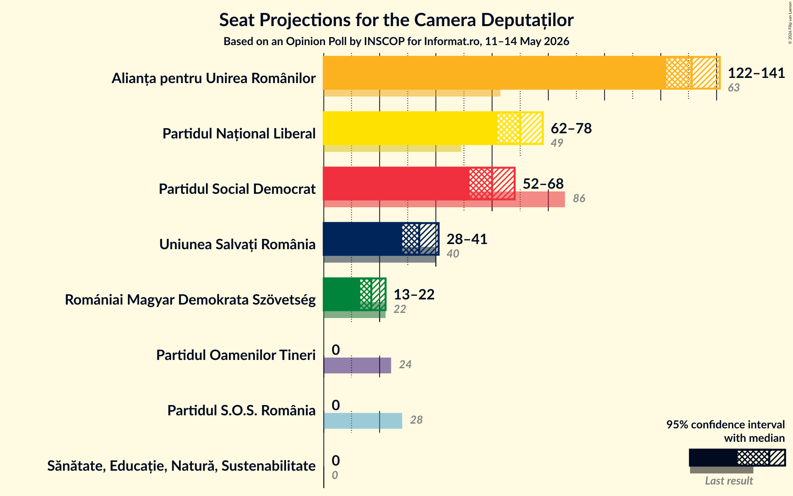

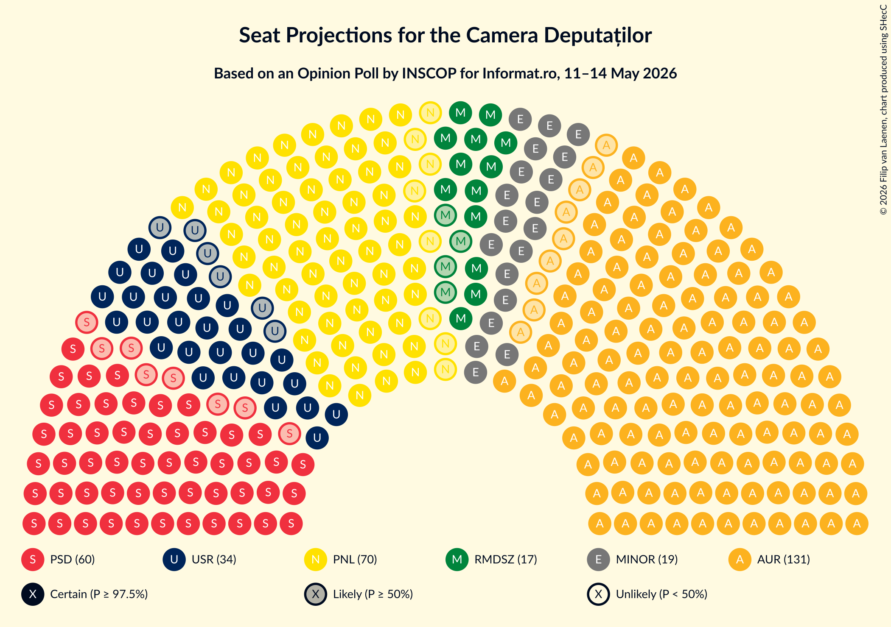

### Confidence Intervals

| Party | Last Result | Median | 80% Confidence Interval | 90% Confidence Interval | 95% Confidence Interval | 99% Confidence Interval |
|:-----:|:-----------:|:------:|:-----------------------:|:-----------------------:|:-----------------------:|:-----------------------:|
| <a href="#alianța-pentru-unirea-românilor">Alianța pentru Unirea Românilor</a> | 63 | 131 | 125–138 |123–139 |122–141 |119–144 |
| <a href="#partidul-național-liberal">Partidul Național Liberal</a> | 49 | 70 | 64–75 |63–77 |62–78 |59–81 |
| <a href="#partidul-social-democrat">Partidul Social Democrat</a> | 86 | 60 | 55–65 |53–66 |52–68 |50–70 |
| <a href="#uniunea-salvați-românia">Uniunea Salvați România</a> | 40 | 34 | 30–38 |29–40 |28–41 |27–43 |
| <a href="#romániai-magyar-demokrata-szövetség">Romániai Magyar Demokrata Szövetség</a> | 22 | 17 | 14–20 |13–21 |13–22 |12–23 |
| <a href="#partidul-s.o.s.-românia">Partidul S.O.S. România</a> | 28 | 0 | 0 |0 |0 |0 |
| <a href="#sănătate,-educație,-natură,-sustenabilitate">Sănătate, Educație, Natură, Sustenabilitate</a> | 0 | 0 | 0 |0 |0 |0 |
| <a href="#partidul-oamenilor-tineri">Partidul Oamenilor Tineri</a> | 24 | 0 | 0 |0 |0 |0 |

### Alianța pentru Unirea Românilor

*For a full overview of the results for this party, see the [Alianța pentru Unirea Românilor](party-alianțapentruunirearomânilor.html) page.*

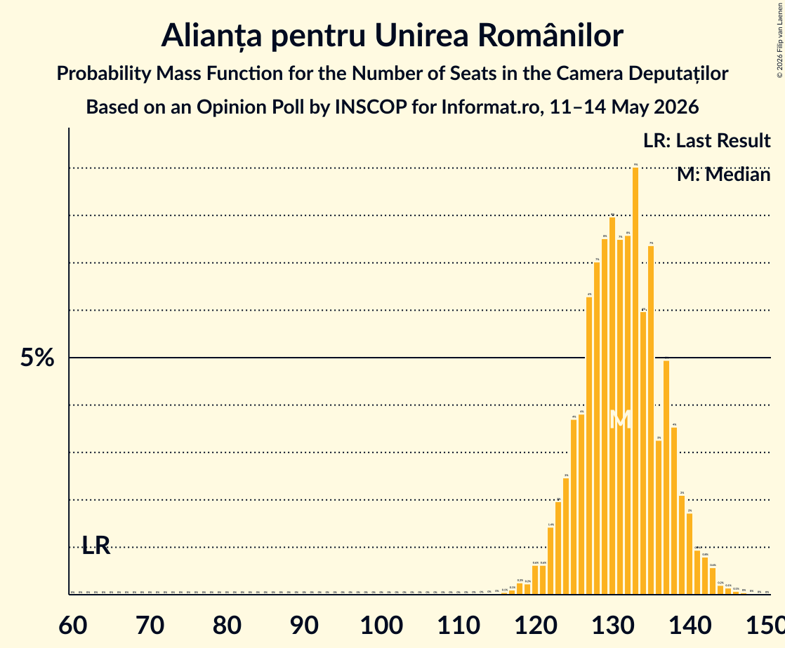

| Number of Seats | Probability | Accumulated | Special Marks |
|:---------------:|:-----------:|:-----------:|:-------------:|
| 63 | 0% | 100% | Last Result |
| 64 | 0% | 100% |  |
| 65 | 0% | 100% |  |
| 66 | 0% | 100% |  |
| 67 | 0% | 100% |  |
| 68 | 0% | 100% |  |
| 69 | 0% | 100% |  |
| 70 | 0% | 100% |  |
| 71 | 0% | 100% |  |
| 72 | 0% | 100% |  |
| 73 | 0% | 100% |  |
| 74 | 0% | 100% |  |
| 75 | 0% | 100% |  |
| 76 | 0% | 100% |  |
| 77 | 0% | 100% |  |
| 78 | 0% | 100% |  |
| 79 | 0% | 100% |  |
| 80 | 0% | 100% |  |
| 81 | 0% | 100% |  |
| 82 | 0% | 100% |  |
| 83 | 0% | 100% |  |
| 84 | 0% | 100% |  |
| 85 | 0% | 100% |  |
| 86 | 0% | 100% |  |
| 87 | 0% | 100% |  |
| 88 | 0% | 100% |  |
| 89 | 0% | 100% |  |
| 90 | 0% | 100% |  |
| 91 | 0% | 100% |  |
| 92 | 0% | 100% |  |
| 93 | 0% | 100% |  |
| 94 | 0% | 100% |  |
| 95 | 0% | 100% |  |
| 96 | 0% | 100% |  |
| 97 | 0% | 100% |  |
| 98 | 0% | 100% |  |
| 99 | 0% | 100% |  |
| 100 | 0% | 100% |  |
| 101 | 0% | 100% |  |
| 102 | 0% | 100% |  |
| 103 | 0% | 100% |  |
| 104 | 0% | 100% |  |
| 105 | 0% | 100% |  |
| 106 | 0% | 100% |  |
| 107 | 0% | 100% |  |
| 108 | 0% | 100% |  |
| 109 | 0% | 100% |  |
| 110 | 0% | 100% |  |
| 111 | 0% | 100% |  |
| 112 | 0% | 100% |  |
| 113 | 0% | 100% |  |
| 114 | 0% | 100% |  |
| 115 | 0% | 100% |  |
| 116 | 0.1% | 99.9% |  |
| 117 | 0.1% | 99.9% |  |
| 118 | 0.3% | 99.8% |  |
| 119 | 0.2% | 99.5% |  |
| 120 | 0.6% | 99.3% |  |
| 121 | 0.6% | 98.7% |  |
| 122 | 1.4% | 98% |  |
| 123 | 2% | 97% |  |
| 124 | 2% | 95% |  |
| 125 | 4% | 92% |  |
| 126 | 4% | 88% |  |
| 127 | 6% | 85% |  |
| 128 | 7% | 78% |  |
| 129 | 8% | 71% |  |
| 130 | 8% | 64% |  |
| 131 | 7% | 56% | Median |
| 132 | 8% | 48% |  |
| 133 | 9% | 41% |  |
| 134 | 6% | 32% |  |
| 135 | 7% | 26% |  |
| 136 | 3% | 18% |  |
| 137 | 5% | 15% |  |
| 138 | 4% | 10% |  |
| 139 | 2% | 7% |  |
| 140 | 2% | 5% |  |
| 141 | 0.9% | 3% |  |
| 142 | 0.8% | 2% |  |
| 143 | 0.6% | 1.1% |  |
| 144 | 0.2% | 0.5% |  |
| 145 | 0.1% | 0.3% |  |
| 146 | 0.1% | 0.2% |  |
| 147 | 0% | 0.1% |  |
| 148 | 0% | 0% |  |

### Partidul Național Liberal

*For a full overview of the results for this party, see the [Partidul Național Liberal](party-partidulnaționalliberal.html) page.*

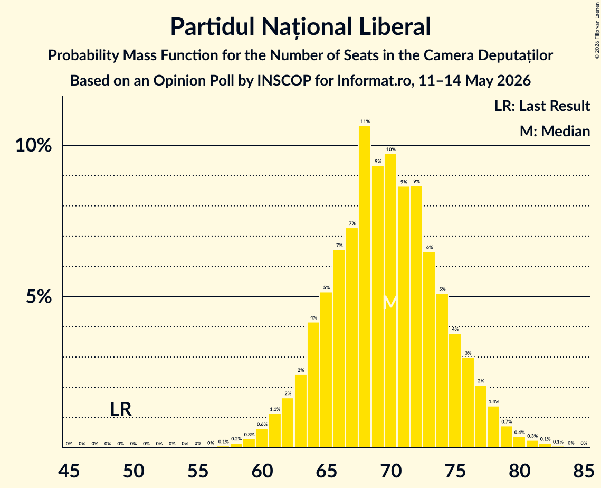

| Number of Seats | Probability | Accumulated | Special Marks |
|:---------------:|:-----------:|:-----------:|:-------------:|
| 49 | 0% | 100% | Last Result |
| 50 | 0% | 100% |  |
| 51 | 0% | 100% |  |
| 52 | 0% | 100% |  |
| 53 | 0% | 100% |  |
| 54 | 0% | 100% |  |
| 55 | 0% | 100% |  |
| 56 | 0% | 100% |  |
| 57 | 0.1% | 100% |  |
| 58 | 0.2% | 99.9% |  |
| 59 | 0.3% | 99.7% |  |
| 60 | 0.6% | 99.4% |  |
| 61 | 1.1% | 98.8% |  |
| 62 | 2% | 98% |  |
| 63 | 2% | 96% |  |
| 64 | 4% | 94% |  |
| 65 | 5% | 89% |  |
| 66 | 7% | 84% |  |
| 67 | 7% | 78% |  |
| 68 | 11% | 70% |  |
| 69 | 9% | 60% |  |
| 70 | 10% | 50% | Median |
| 71 | 9% | 41% |  |
| 72 | 9% | 32% |  |
| 73 | 6% | 23% |  |
| 74 | 5% | 17% |  |
| 75 | 4% | 12% |  |
| 76 | 3% | 8% |  |
| 77 | 2% | 5% |  |
| 78 | 1.4% | 3% |  |
| 79 | 0.7% | 2% |  |
| 80 | 0.4% | 0.9% |  |
| 81 | 0.3% | 0.5% |  |
| 82 | 0.1% | 0.3% |  |
| 83 | 0.1% | 0.1% |  |
| 84 | 0% | 0% |  |

### Partidul Social Democrat

*For a full overview of the results for this party, see the [Partidul Social Democrat](party-partidulsocialdemocrat.html) page.*

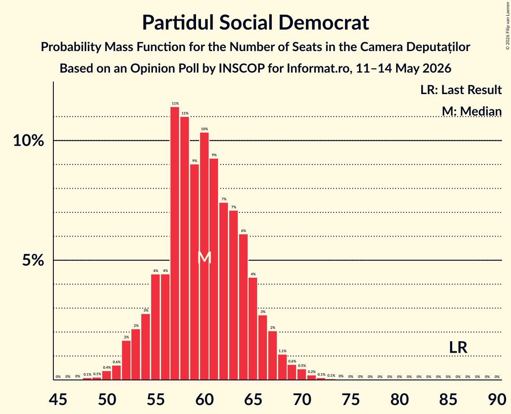

| Number of Seats | Probability | Accumulated | Special Marks |
|:---------------:|:-----------:|:-----------:|:-------------:|
| 48 | 0.1% | 100% |  |
| 49 | 0.1% | 99.9% |  |
| 50 | 0.4% | 99.7% |  |
| 51 | 0.6% | 99.4% |  |
| 52 | 2% | 98.7% |  |
| 53 | 2% | 97% |  |
| 54 | 3% | 95% |  |
| 55 | 4% | 92% |  |
| 56 | 4% | 88% |  |
| 57 | 11% | 83% |  |
| 58 | 11% | 72% |  |
| 59 | 9% | 61% |  |
| 60 | 10% | 52% | Median |
| 61 | 9% | 42% |  |
| 62 | 7% | 32% |  |
| 63 | 7% | 25% |  |
| 64 | 6% | 18% |  |
| 65 | 4% | 12% |  |
| 66 | 3% | 7% |  |
| 67 | 2% | 5% |  |
| 68 | 1.1% | 3% |  |
| 69 | 0.6% | 2% |  |
| 70 | 0.5% | 0.9% |  |
| 71 | 0.2% | 0.4% |  |
| 72 | 0.1% | 0.2% |  |
| 73 | 0.1% | 0.1% |  |
| 74 | 0% | 0% |  |
| 75 | 0% | 0% |  |
| 76 | 0% | 0% |  |
| 77 | 0% | 0% |  |
| 78 | 0% | 0% |  |
| 79 | 0% | 0% |  |
| 80 | 0% | 0% |  |
| 81 | 0% | 0% |  |
| 82 | 0% | 0% |  |
| 83 | 0% | 0% |  |
| 84 | 0% | 0% |  |
| 85 | 0% | 0% |  |
| 86 | 0% | 0% | Last Result |

### Uniunea Salvați România

*For a full overview of the results for this party, see the [Uniunea Salvați România](party-uniuneasalvațiromânia.html) page.*

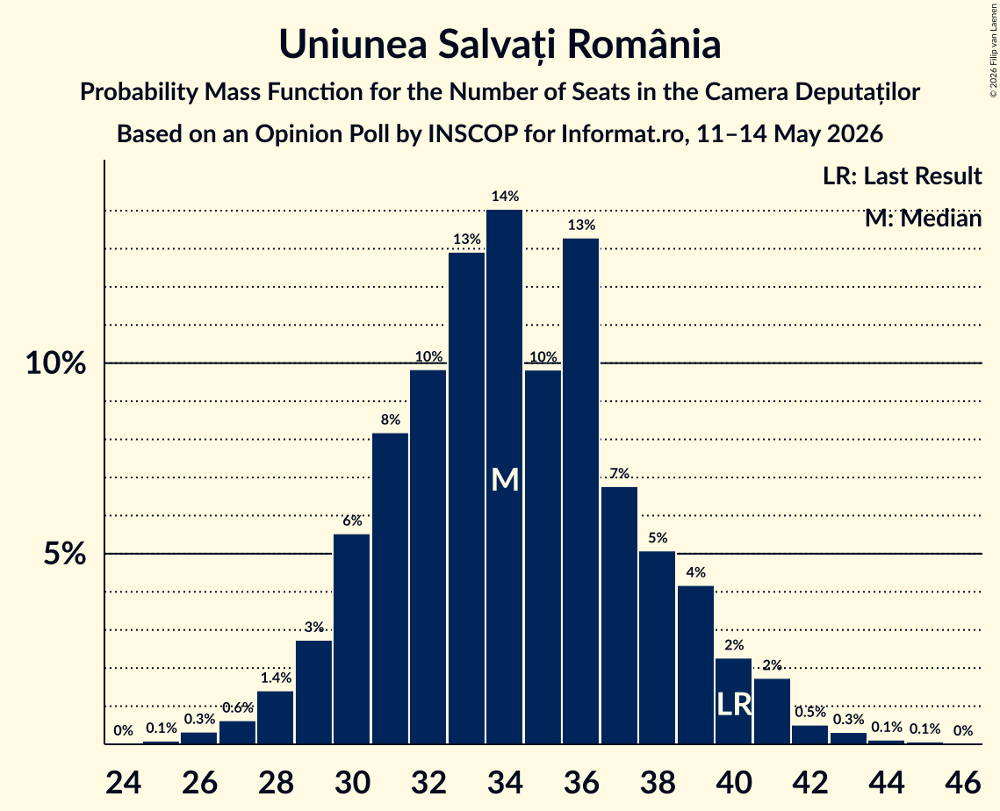

| Number of Seats | Probability | Accumulated | Special Marks |
|:---------------:|:-----------:|:-----------:|:-------------:|
| 25 | 0.1% | 100% |  |
| 26 | 0.3% | 99.9% |  |
| 27 | 0.6% | 99.5% |  |
| 28 | 1.4% | 98.9% |  |
| 29 | 3% | 97% |  |
| 30 | 6% | 95% |  |
| 31 | 8% | 89% |  |
| 32 | 10% | 81% |  |
| 33 | 13% | 71% |  |
| 34 | 14% | 58% | Median |
| 35 | 10% | 44% |  |
| 36 | 13% | 34% |  |
| 37 | 7% | 21% |  |
| 38 | 5% | 14% |  |
| 39 | 4% | 9% |  |
| 40 | 2% | 5% | Last Result |
| 41 | 2% | 3% |  |
| 42 | 0.5% | 1.1% |  |
| 43 | 0.3% | 0.6% |  |
| 44 | 0.1% | 0.2% |  |
| 45 | 0.1% | 0.1% |  |
| 46 | 0% | 0% |  |

### Romániai Magyar Demokrata Szövetség

*For a full overview of the results for this party, see the [Romániai Magyar Demokrata Szövetség](party-romániaimagyardemokrataszövetség.html) page.*

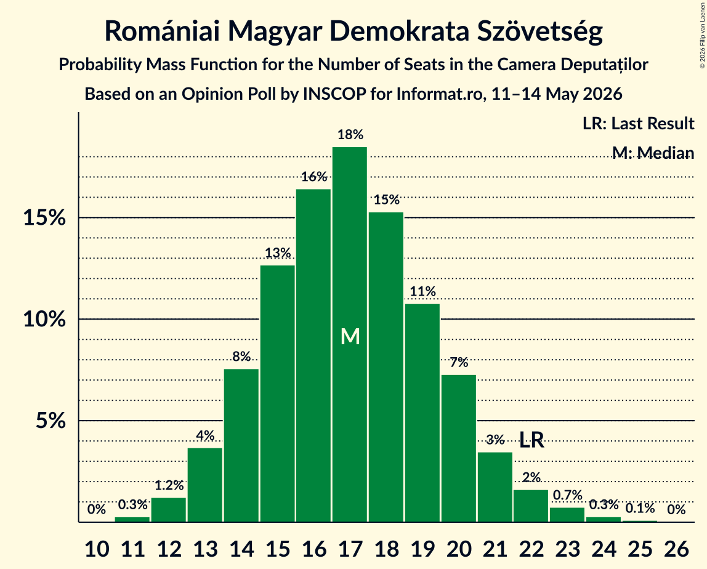

| Number of Seats | Probability | Accumulated | Special Marks |
|:---------------:|:-----------:|:-----------:|:-------------:|
| 11 | 0.3% | 100% |  |
| 12 | 1.2% | 99.7% |  |
| 13 | 4% | 98% |  |
| 14 | 8% | 95% |  |
| 15 | 13% | 87% |  |
| 16 | 16% | 75% |  |
| 17 | 18% | 58% | Median |
| 18 | 15% | 40% |  |
| 19 | 11% | 24% |  |
| 20 | 7% | 14% |  |
| 21 | 3% | 6% |  |
| 22 | 2% | 3% | Last Result |
| 23 | 0.7% | 1.2% |  |
| 24 | 0.3% | 0.4% |  |
| 25 | 0.1% | 0.1% |  |
| 26 | 0% | 0% |  |

### Partidul S.O.S. România

*For a full overview of the results for this party, see the [Partidul S.O.S. România](party-partidulsosromânia.html) page.*

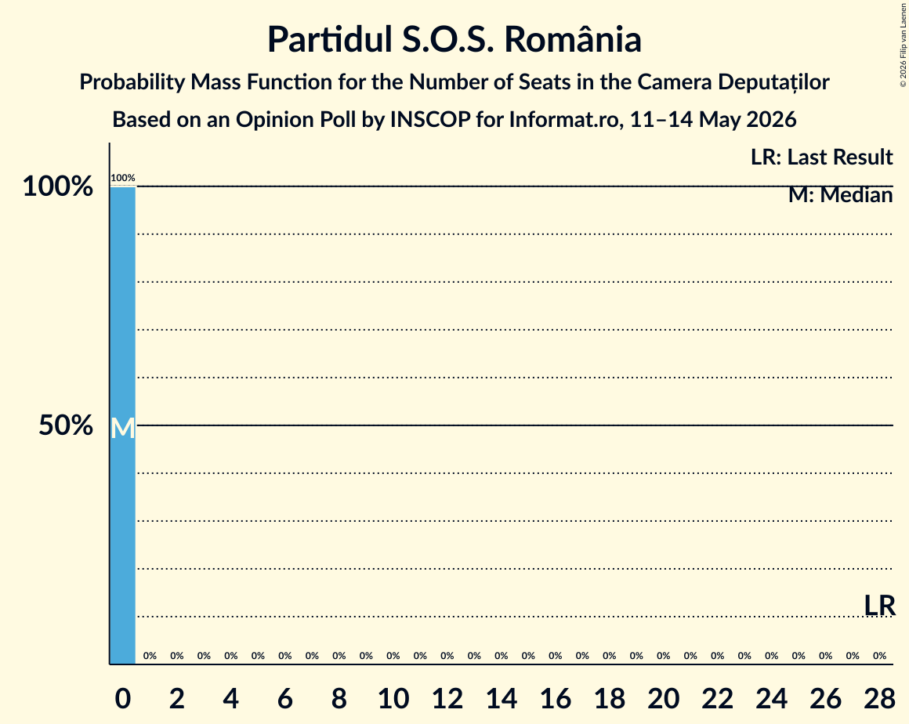

| Number of Seats | Probability | Accumulated | Special Marks |
|:---------------:|:-----------:|:-----------:|:-------------:|
| 0 | 100% | 100% | Median |
| 1 | 0% | 0% |  |
| 2 | 0% | 0% |  |
| 3 | 0% | 0% |  |
| 4 | 0% | 0% |  |
| 5 | 0% | 0% |  |
| 6 | 0% | 0% |  |
| 7 | 0% | 0% |  |
| 8 | 0% | 0% |  |
| 9 | 0% | 0% |  |
| 10 | 0% | 0% |  |
| 11 | 0% | 0% |  |
| 12 | 0% | 0% |  |
| 13 | 0% | 0% |  |
| 14 | 0% | 0% |  |
| 15 | 0% | 0% |  |
| 16 | 0% | 0% |  |
| 17 | 0% | 0% |  |
| 18 | 0% | 0% |  |
| 19 | 0% | 0% |  |
| 20 | 0% | 0% |  |
| 21 | 0% | 0% |  |
| 22 | 0% | 0% |  |
| 23 | 0% | 0% |  |
| 24 | 0% | 0% |  |
| 25 | 0% | 0% |  |
| 26 | 0% | 0% |  |
| 27 | 0% | 0% |  |
| 28 | 0% | 0% | Last Result |

### Sănătate, Educație, Natură, Sustenabilitate

*For a full overview of the results for this party, see the [Sănătate, Educație, Natură, Sustenabilitate](party-sănătateeducațienaturăsustenabilitate.html) page.*

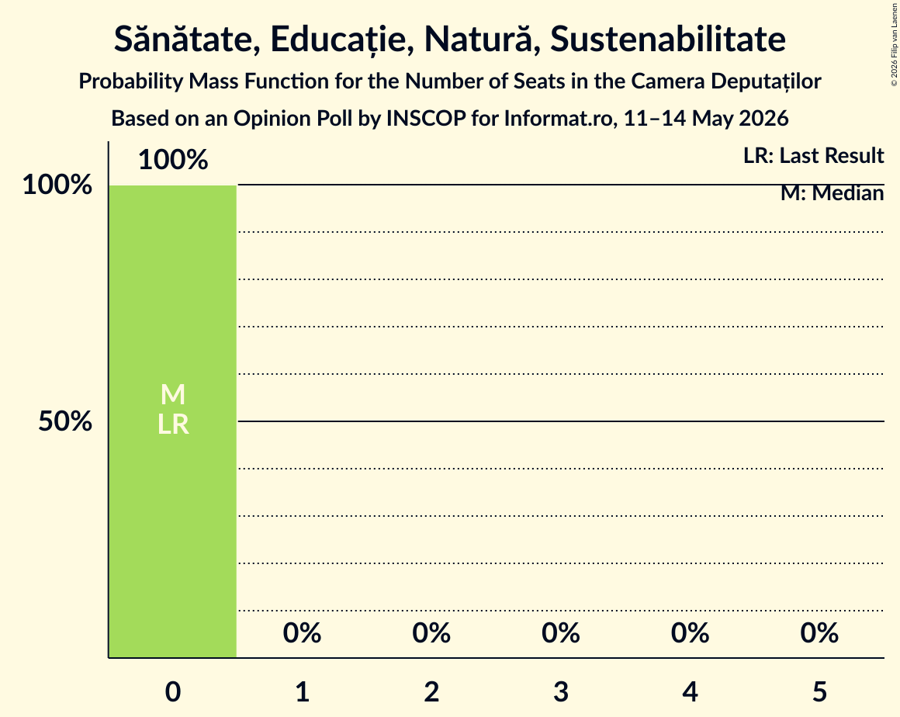

| Number of Seats | Probability | Accumulated | Special Marks |
|:---------------:|:-----------:|:-----------:|:-------------:|
| 0 | 100% | 100% | Last Result, Median |

### Partidul Oamenilor Tineri

*For a full overview of the results for this party, see the [Partidul Oamenilor Tineri](party-partiduloamenilortineri.html) page.*

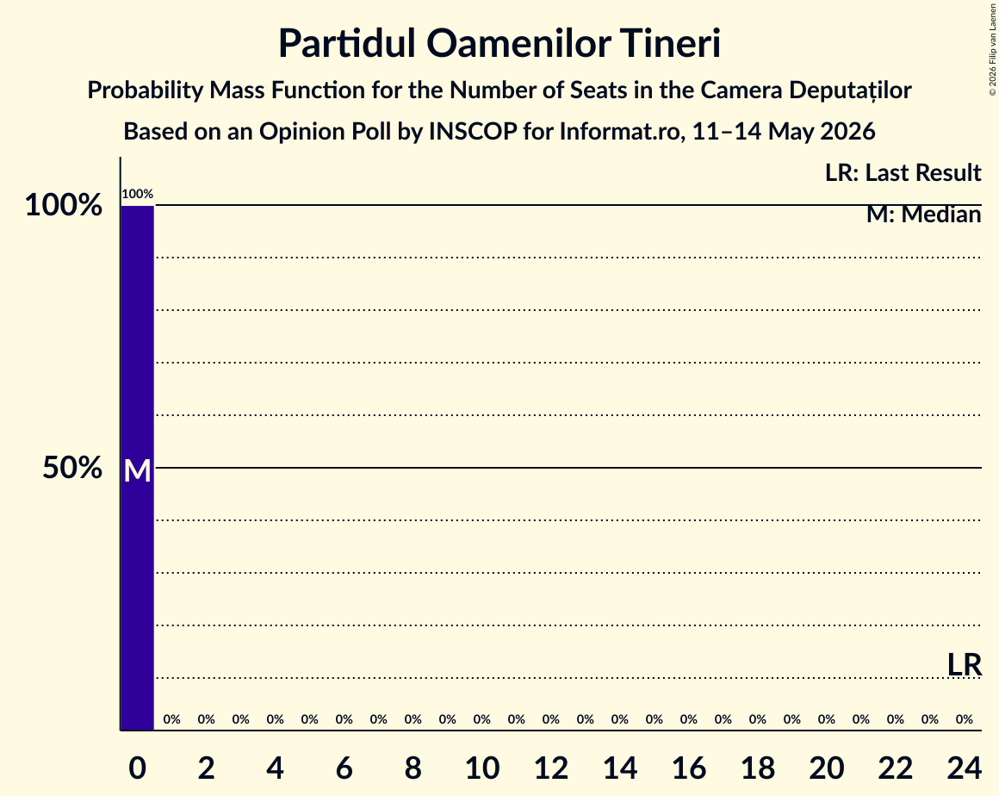

| Number of Seats | Probability | Accumulated | Special Marks |
|:---------------:|:-----------:|:-----------:|:-------------:|
| 0 | 100% | 100% | Median |
| 1 | 0% | 0% |  |
| 2 | 0% | 0% |  |
| 3 | 0% | 0% |  |
| 4 | 0% | 0% |  |
| 5 | 0% | 0% |  |
| 6 | 0% | 0% |  |
| 7 | 0% | 0% |  |
| 8 | 0% | 0% |  |
| 9 | 0% | 0% |  |
| 10 | 0% | 0% |  |
| 11 | 0% | 0% |  |
| 12 | 0% | 0% |  |
| 13 | 0% | 0% |  |
| 14 | 0% | 0% |  |
| 15 | 0% | 0% |  |
| 16 | 0% | 0% |  |
| 17 | 0% | 0% |  |
| 18 | 0% | 0% |  |
| 19 | 0% | 0% |  |
| 20 | 0% | 0% |  |
| 21 | 0% | 0% |  |
| 22 | 0% | 0% |  |
| 23 | 0% | 0% |  |
| 24 | 0% | 0% | Last Result |

## Coalitions

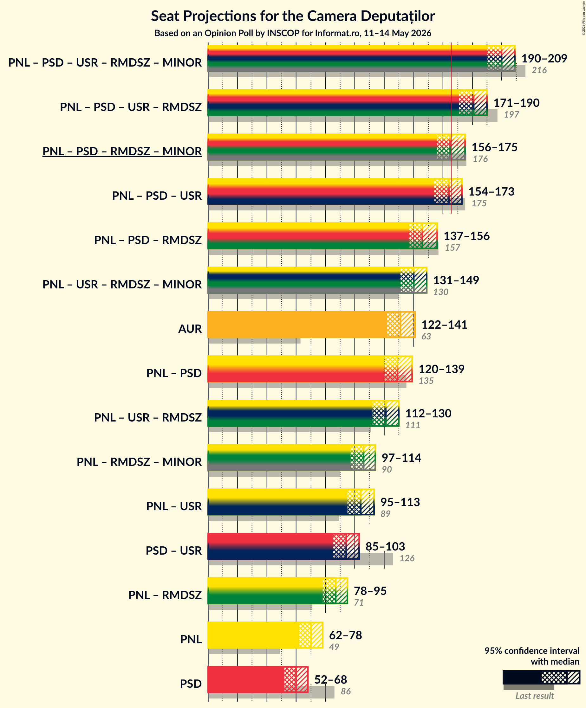

### Confidence Intervals

| Coalition | Last Result | Median | Majority? | 80% Confidence Interval | 90% Confidence Interval | 95% Confidence Interval | 99% Confidence Interval |
|:---------:|:-----------:|:------:|:---------:|:-----------------------:|:-----------------------:|:-----------------------:|:-----------------------:|
| Partidul Național Liberal – Partidul Social Democrat – Uniunea Salvați România – Romániai Magyar Demokrata Szövetség | 197 | 181 | 99.9% | 174–187 | 173–189 | 171–190 | 168–193 |
| Partidul Național Liberal – Partidul Social Democrat – Uniunea Salvați România | 175 | 164 | 39% | 158–170 | 155–172 | 154–173 | 151–176 |
| Partidul Național Liberal – Partidul Social Democrat – Romániai Magyar Demokrata Szövetség | 157 | 146 | 0% | 140–153 | 138–155 | 137–156 | 134–159 |
| Alianța pentru Unirea Românilor | 63 | 131 | 0% | 125–138 | 123–139 | 122–141 | 119–144 |
| Partidul Național Liberal – Partidul Social Democrat | 135 | 129 | 0% | 123–136 | 122–138 | 120–139 | 117–142 |
| Partidul Național Liberal – Uniunea Salvați România – Romániai Magyar Demokrata Szövetség | 111 | 121 | 0% | 115–127 | 113–129 | 112–130 | 109–133 |
| Partidul Național Liberal – Uniunea Salvați România | 89 | 104 | 0% | 98–110 | 96–111 | 95–113 | 92–116 |
| Partidul Social Democrat – Uniunea Salvați România | 126 | 94 | 0% | 88–100 | 87–102 | 85–103 | 83–106 |
| Partidul Național Liberal – Romániai Magyar Demokrata Szövetség | 71 | 87 | 0% | 81–92 | 79–94 | 78–95 | 75–98 |
| Partidul Național Liberal | 49 | 70 | 0% | 64–75 | 63–77 | 62–78 | 59–81 |
| Partidul Social Democrat | 86 | 60 | 0% | 55–65 | 53–66 | 52–68 | 50–70 |

### Partidul Național Liberal – Partidul Social Democrat – Uniunea Salvați România – Romániai Magyar Demokrata Szövetség

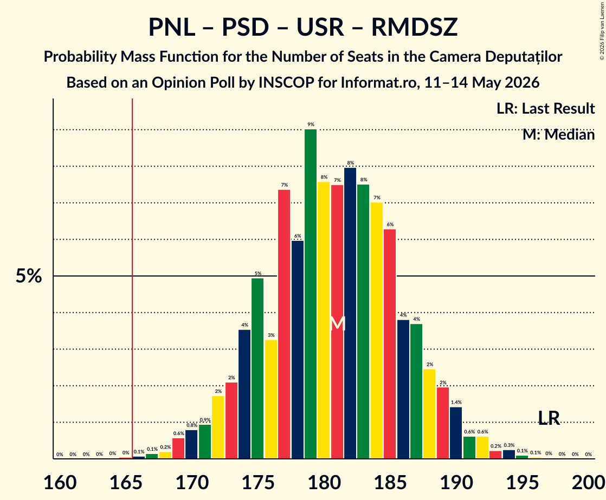

| Number of Seats | Probability | Accumulated | Special Marks |
|:---------------:|:-----------:|:-----------:|:-------------:|
| 164 | 0% | 100% |  |
| 165 | 0% | 99.9% |  |
| 166 | 0.1% | 99.9% | Majority |
| 167 | 0.1% | 99.8% |  |
| 168 | 0.2% | 99.7% |  |
| 169 | 0.6% | 99.5% |  |
| 170 | 0.8% | 98.9% |  |
| 171 | 0.9% | 98% |  |
| 172 | 2% | 97% |  |
| 173 | 2% | 95% |  |
| 174 | 4% | 93% |  |
| 175 | 5% | 90% |  |
| 176 | 3% | 85% |  |
| 177 | 7% | 82% |  |
| 178 | 6% | 74% |  |
| 179 | 9% | 68% |  |
| 180 | 8% | 59% |  |
| 181 | 7% | 52% | Median |
| 182 | 8% | 44% |  |
| 183 | 8% | 36% |  |
| 184 | 7% | 29% |  |
| 185 | 6% | 22% |  |
| 186 | 4% | 15% |  |
| 187 | 4% | 11% |  |
| 188 | 2% | 8% |  |
| 189 | 2% | 5% |  |
| 190 | 1.4% | 3% |  |
| 191 | 0.6% | 2% |  |
| 192 | 0.6% | 1.3% |  |
| 193 | 0.2% | 0.7% |  |
| 194 | 0.3% | 0.5% |  |
| 195 | 0.1% | 0.2% |  |
| 196 | 0.1% | 0.1% |  |
| 197 | 0% | 0.1% | Last Result |
| 198 | 0% | 0% |  |

### Partidul Național Liberal – Partidul Social Democrat – Uniunea Salvați România

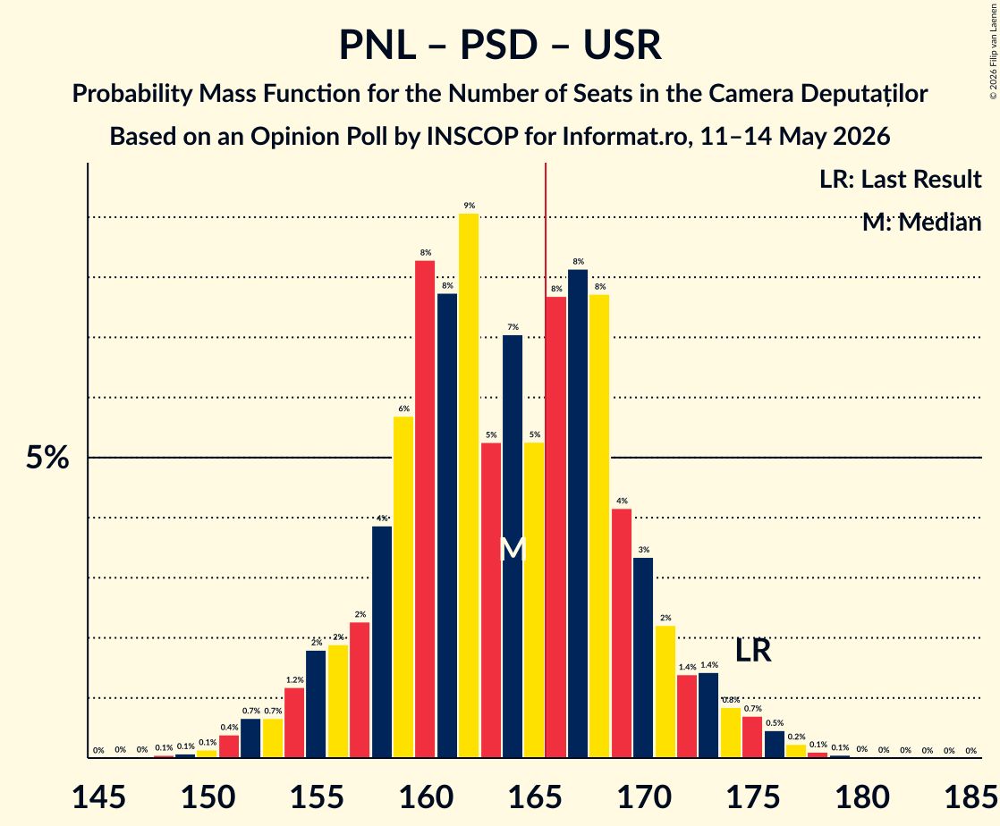

| Number of Seats | Probability | Accumulated | Special Marks |
|:---------------:|:-----------:|:-----------:|:-------------:|
| 147 | 0% | 100% |  |
| 148 | 0.1% | 99.9% |  |
| 149 | 0.1% | 99.9% |  |
| 150 | 0.1% | 99.8% |  |
| 151 | 0.4% | 99.7% |  |
| 152 | 0.7% | 99.3% |  |
| 153 | 0.7% | 98.6% |  |
| 154 | 1.2% | 98% |  |
| 155 | 2% | 97% |  |
| 156 | 2% | 95% |  |
| 157 | 2% | 93% |  |
| 158 | 4% | 91% |  |
| 159 | 6% | 87% |  |
| 160 | 8% | 81% |  |
| 161 | 8% | 73% |  |
| 162 | 9% | 65% |  |
| 163 | 5% | 56% |  |
| 164 | 7% | 51% | Median |
| 165 | 5% | 44% |  |
| 166 | 8% | 39% | Majority |
| 167 | 8% | 31% |  |
| 168 | 8% | 23% |  |
| 169 | 4% | 15% |  |
| 170 | 3% | 11% |  |
| 171 | 2% | 8% |  |
| 172 | 1.4% | 5% |  |
| 173 | 1.4% | 4% |  |
| 174 | 0.8% | 2% |  |
| 175 | 0.7% | 2% | Last Result |
| 176 | 0.5% | 0.9% |  |
| 177 | 0.2% | 0.5% |  |
| 178 | 0.1% | 0.2% |  |
| 179 | 0.1% | 0.1% |  |
| 180 | 0% | 0.1% |  |
| 181 | 0% | 0% |  |

### Partidul Național Liberal – Partidul Social Democrat – Romániai Magyar Demokrata Szövetség

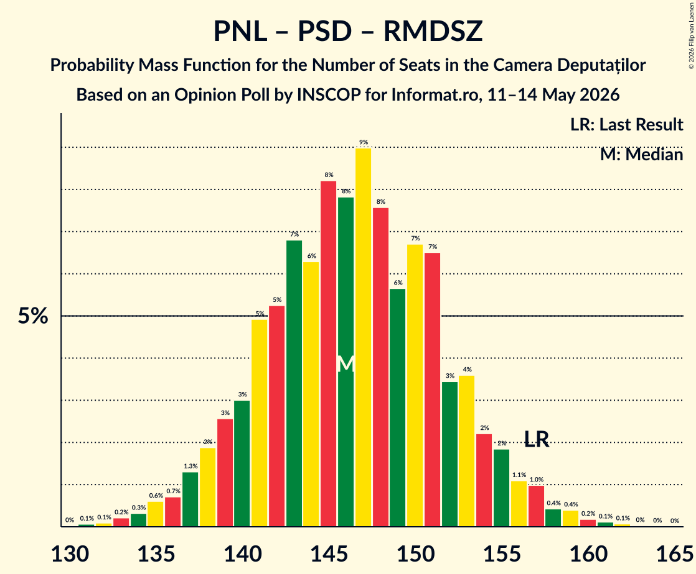

| Number of Seats | Probability | Accumulated | Special Marks |
|:---------------:|:-----------:|:-----------:|:-------------:|
| 130 | 0% | 100% |  |
| 131 | 0.1% | 99.9% |  |
| 132 | 0.1% | 99.9% |  |
| 133 | 0.2% | 99.8% |  |
| 134 | 0.3% | 99.6% |  |
| 135 | 0.6% | 99.3% |  |
| 136 | 0.7% | 98.6% |  |
| 137 | 1.3% | 98% |  |
| 138 | 2% | 97% |  |
| 139 | 3% | 95% |  |
| 140 | 3% | 92% |  |
| 141 | 5% | 89% |  |
| 142 | 5% | 84% |  |
| 143 | 7% | 79% |  |
| 144 | 6% | 72% |  |
| 145 | 8% | 66% |  |
| 146 | 8% | 58% |  |
| 147 | 9% | 50% | Median |
| 148 | 8% | 41% |  |
| 149 | 6% | 33% |  |
| 150 | 7% | 28% |  |
| 151 | 7% | 21% |  |
| 152 | 3% | 14% |  |
| 153 | 4% | 11% |  |
| 154 | 2% | 7% |  |
| 155 | 2% | 5% |  |
| 156 | 1.1% | 3% |  |
| 157 | 1.0% | 2% | Last Result |
| 158 | 0.4% | 1.3% |  |
| 159 | 0.4% | 0.8% |  |
| 160 | 0.2% | 0.4% |  |
| 161 | 0.1% | 0.2% |  |
| 162 | 0.1% | 0.1% |  |
| 163 | 0% | 0.1% |  |
| 164 | 0% | 0% |  |

### Alianța pentru Unirea Românilor

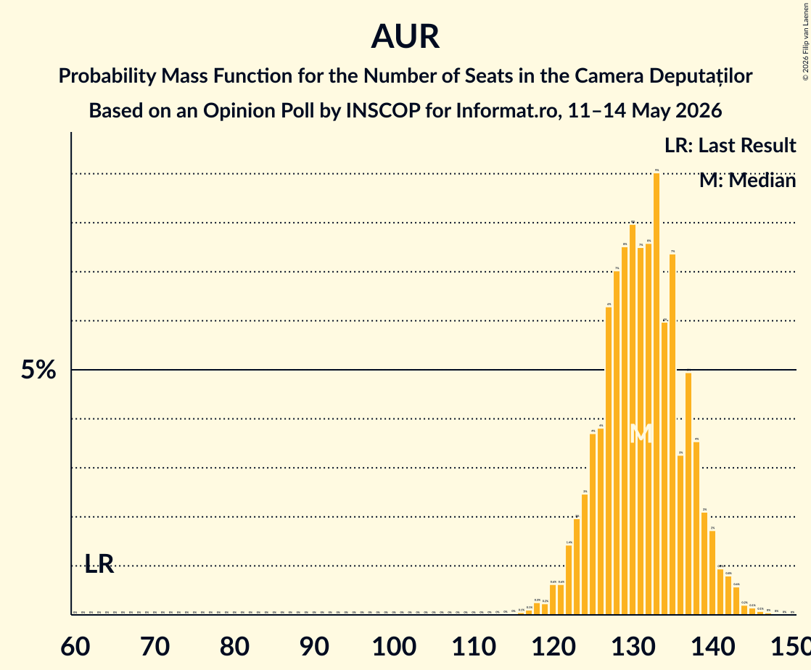

| Number of Seats | Probability | Accumulated | Special Marks |
|:---------------:|:-----------:|:-----------:|:-------------:|
| 63 | 0% | 100% | Last Result |
| 64 | 0% | 100% |  |
| 65 | 0% | 100% |  |
| 66 | 0% | 100% |  |
| 67 | 0% | 100% |  |
| 68 | 0% | 100% |  |
| 69 | 0% | 100% |  |
| 70 | 0% | 100% |  |
| 71 | 0% | 100% |  |
| 72 | 0% | 100% |  |
| 73 | 0% | 100% |  |
| 74 | 0% | 100% |  |
| 75 | 0% | 100% |  |
| 76 | 0% | 100% |  |
| 77 | 0% | 100% |  |
| 78 | 0% | 100% |  |
| 79 | 0% | 100% |  |
| 80 | 0% | 100% |  |
| 81 | 0% | 100% |  |
| 82 | 0% | 100% |  |
| 83 | 0% | 100% |  |
| 84 | 0% | 100% |  |
| 85 | 0% | 100% |  |
| 86 | 0% | 100% |  |
| 87 | 0% | 100% |  |
| 88 | 0% | 100% |  |
| 89 | 0% | 100% |  |
| 90 | 0% | 100% |  |
| 91 | 0% | 100% |  |
| 92 | 0% | 100% |  |
| 93 | 0% | 100% |  |
| 94 | 0% | 100% |  |
| 95 | 0% | 100% |  |
| 96 | 0% | 100% |  |
| 97 | 0% | 100% |  |
| 98 | 0% | 100% |  |
| 99 | 0% | 100% |  |
| 100 | 0% | 100% |  |
| 101 | 0% | 100% |  |
| 102 | 0% | 100% |  |
| 103 | 0% | 100% |  |
| 104 | 0% | 100% |  |
| 105 | 0% | 100% |  |
| 106 | 0% | 100% |  |
| 107 | 0% | 100% |  |
| 108 | 0% | 100% |  |
| 109 | 0% | 100% |  |
| 110 | 0% | 100% |  |
| 111 | 0% | 100% |  |
| 112 | 0% | 100% |  |
| 113 | 0% | 100% |  |
| 114 | 0% | 100% |  |
| 115 | 0% | 100% |  |
| 116 | 0.1% | 99.9% |  |
| 117 | 0.1% | 99.9% |  |
| 118 | 0.3% | 99.8% |  |
| 119 | 0.2% | 99.5% |  |
| 120 | 0.6% | 99.3% |  |
| 121 | 0.6% | 98.7% |  |
| 122 | 1.4% | 98% |  |
| 123 | 2% | 97% |  |
| 124 | 2% | 95% |  |
| 125 | 4% | 92% |  |
| 126 | 4% | 88% |  |
| 127 | 6% | 85% |  |
| 128 | 7% | 78% |  |
| 129 | 8% | 71% |  |
| 130 | 8% | 64% |  |
| 131 | 7% | 56% | Median |
| 132 | 8% | 48% |  |
| 133 | 9% | 41% |  |
| 134 | 6% | 32% |  |
| 135 | 7% | 26% |  |
| 136 | 3% | 18% |  |
| 137 | 5% | 15% |  |
| 138 | 4% | 10% |  |
| 139 | 2% | 7% |  |
| 140 | 2% | 5% |  |
| 141 | 0.9% | 3% |  |
| 142 | 0.8% | 2% |  |
| 143 | 0.6% | 1.1% |  |
| 144 | 0.2% | 0.5% |  |
| 145 | 0.1% | 0.3% |  |
| 146 | 0.1% | 0.2% |  |
| 147 | 0% | 0.1% |  |
| 148 | 0% | 0% |  |

### Partidul Național Liberal – Partidul Social Democrat

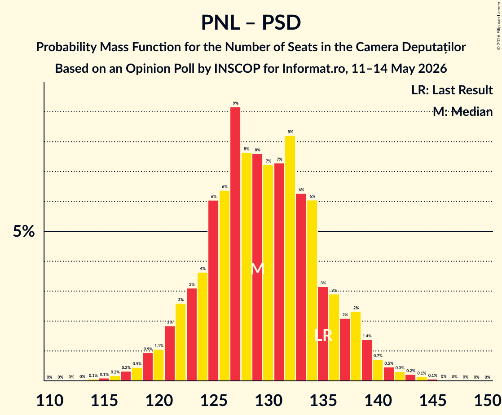

| Number of Seats | Probability | Accumulated | Special Marks |
|:---------------:|:-----------:|:-----------:|:-------------:|
| 114 | 0.1% | 100% |  |
| 115 | 0.1% | 99.9% |  |
| 116 | 0.2% | 99.8% |  |
| 117 | 0.3% | 99.6% |  |
| 118 | 0.5% | 99.3% |  |
| 119 | 0.9% | 98.9% |  |
| 120 | 1.1% | 98% |  |
| 121 | 2% | 97% |  |
| 122 | 3% | 95% |  |
| 123 | 3% | 92% |  |
| 124 | 4% | 89% |  |
| 125 | 6% | 86% |  |
| 126 | 6% | 80% |  |
| 127 | 9% | 73% |  |
| 128 | 8% | 64% |  |
| 129 | 8% | 56% |  |
| 130 | 7% | 49% | Median |
| 131 | 7% | 42% |  |
| 132 | 8% | 34% |  |
| 133 | 6% | 26% |  |
| 134 | 6% | 20% |  |
| 135 | 3% | 14% | Last Result |
| 136 | 3% | 11% |  |
| 137 | 2% | 8% |  |
| 138 | 2% | 6% |  |
| 139 | 1.4% | 3% |  |
| 140 | 0.7% | 2% |  |
| 141 | 0.5% | 1.3% |  |
| 142 | 0.3% | 0.8% |  |
| 143 | 0.2% | 0.5% |  |
| 144 | 0.1% | 0.3% |  |
| 145 | 0.1% | 0.1% |  |
| 146 | 0% | 0.1% |  |
| 147 | 0% | 0% |  |

### Partidul Național Liberal – Uniunea Salvați România – Romániai Magyar Demokrata Szövetség

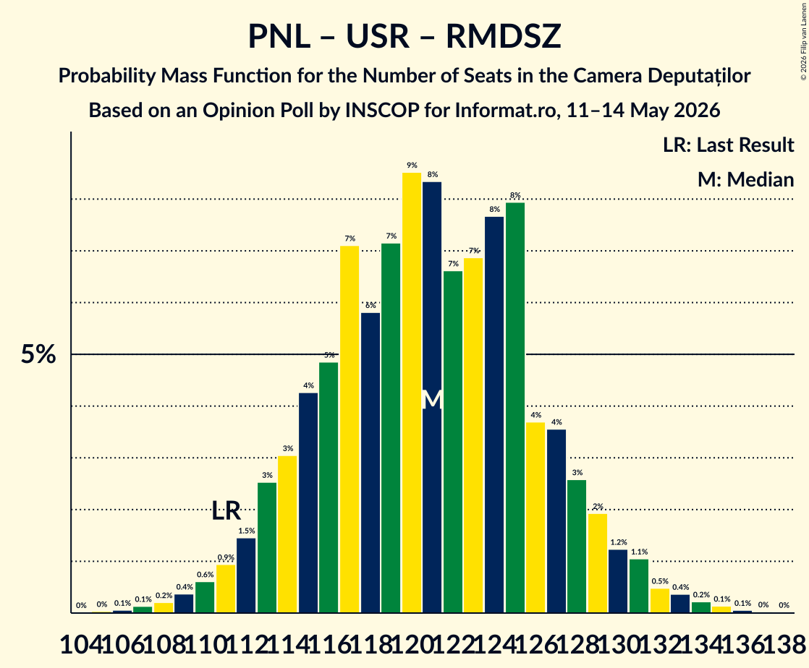

| Number of Seats | Probability | Accumulated | Special Marks |
|:---------------:|:-----------:|:-----------:|:-------------:|
| 105 | 0% | 100% |  |
| 106 | 0.1% | 99.9% |  |
| 107 | 0.1% | 99.9% |  |
| 108 | 0.2% | 99.7% |  |
| 109 | 0.4% | 99.5% |  |
| 110 | 0.6% | 99.2% |  |
| 111 | 0.9% | 98.5% | Last Result |
| 112 | 1.5% | 98% |  |
| 113 | 3% | 96% |  |
| 114 | 3% | 94% |  |
| 115 | 4% | 91% |  |
| 116 | 5% | 86% |  |
| 117 | 7% | 81% |  |
| 118 | 6% | 74% |  |
| 119 | 7% | 69% |  |
| 120 | 9% | 61% |  |
| 121 | 8% | 53% | Median |
| 122 | 7% | 44% |  |
| 123 | 7% | 38% |  |
| 124 | 8% | 31% |  |
| 125 | 8% | 23% |  |
| 126 | 4% | 15% |  |
| 127 | 4% | 12% |  |
| 128 | 3% | 8% |  |
| 129 | 2% | 6% |  |
| 130 | 1.2% | 4% |  |
| 131 | 1.1% | 2% |  |
| 132 | 0.5% | 1.3% |  |
| 133 | 0.4% | 0.9% |  |
| 134 | 0.2% | 0.5% |  |
| 135 | 0.1% | 0.3% |  |
| 136 | 0.1% | 0.1% |  |
| 137 | 0% | 0.1% |  |
| 138 | 0% | 0% |  |

### Partidul Național Liberal – Uniunea Salvați România

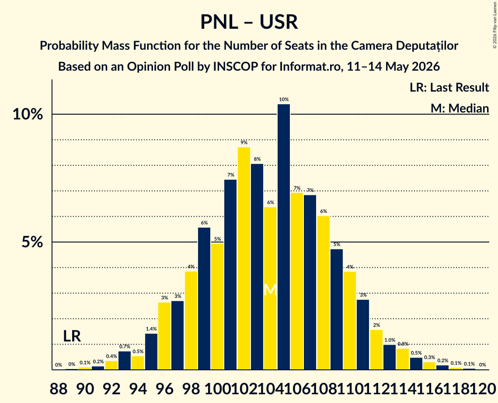

| Number of Seats | Probability | Accumulated | Special Marks |
|:---------------:|:-----------:|:-----------:|:-------------:|
| 89 | 0% | 100% | Last Result |
| 90 | 0.1% | 99.9% |  |
| 91 | 0.2% | 99.8% |  |
| 92 | 0.4% | 99.6% |  |
| 93 | 0.7% | 99.3% |  |
| 94 | 0.5% | 98.6% |  |
| 95 | 1.4% | 98% |  |
| 96 | 3% | 97% |  |
| 97 | 3% | 94% |  |
| 98 | 4% | 91% |  |
| 99 | 6% | 87% |  |
| 100 | 5% | 82% |  |
| 101 | 7% | 77% |  |
| 102 | 9% | 69% |  |
| 103 | 8% | 61% |  |
| 104 | 6% | 53% | Median |
| 105 | 10% | 46% |  |
| 106 | 7% | 36% |  |
| 107 | 7% | 29% |  |
| 108 | 6% | 22% |  |
| 109 | 5% | 16% |  |
| 110 | 4% | 11% |  |
| 111 | 3% | 7% |  |
| 112 | 2% | 5% |  |
| 113 | 1.0% | 3% |  |
| 114 | 0.8% | 2% |  |
| 115 | 0.5% | 1.2% |  |
| 116 | 0.3% | 0.7% |  |
| 117 | 0.2% | 0.4% |  |
| 118 | 0.1% | 0.2% |  |
| 119 | 0.1% | 0.1% |  |
| 120 | 0% | 0% |  |

### Partidul Social Democrat – Uniunea Salvați România

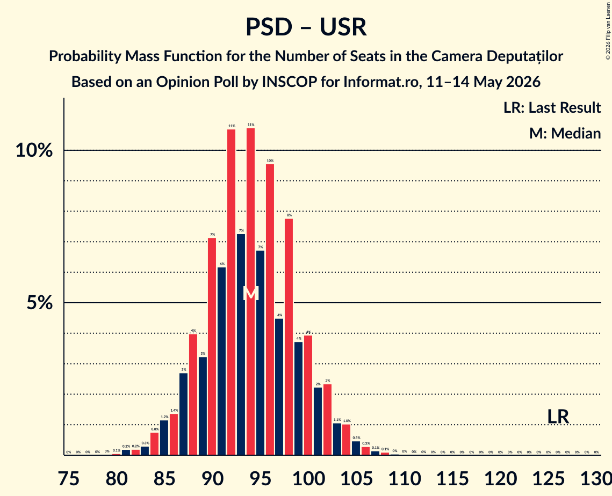

| Number of Seats | Probability | Accumulated | Special Marks |
|:---------------:|:-----------:|:-----------:|:-------------:|
| 80 | 0.1% | 100% |  |
| 81 | 0.2% | 99.9% |  |
| 82 | 0.2% | 99.7% |  |
| 83 | 0.3% | 99.5% |  |
| 84 | 0.8% | 99.2% |  |
| 85 | 1.2% | 98% |  |
| 86 | 1.4% | 97% |  |
| 87 | 3% | 96% |  |
| 88 | 4% | 93% |  |
| 89 | 3% | 89% |  |
| 90 | 7% | 86% |  |
| 91 | 6% | 79% |  |
| 92 | 11% | 73% |  |
| 93 | 7% | 62% |  |
| 94 | 11% | 55% | Median |
| 95 | 7% | 44% |  |
| 96 | 10% | 37% |  |
| 97 | 4% | 28% |  |
| 98 | 8% | 23% |  |
| 99 | 4% | 15% |  |
| 100 | 4% | 12% |  |
| 101 | 2% | 8% |  |
| 102 | 2% | 6% |  |
| 103 | 1.1% | 3% |  |
| 104 | 1.0% | 2% |  |
| 105 | 0.5% | 1.1% |  |
| 106 | 0.3% | 0.6% |  |
| 107 | 0.1% | 0.3% |  |
| 108 | 0.1% | 0.2% |  |
| 109 | 0% | 0.1% |  |
| 110 | 0% | 0% |  |
| 111 | 0% | 0% |  |
| 112 | 0% | 0% |  |
| 113 | 0% | 0% |  |
| 114 | 0% | 0% |  |
| 115 | 0% | 0% |  |
| 116 | 0% | 0% |  |
| 117 | 0% | 0% |  |
| 118 | 0% | 0% |  |
| 119 | 0% | 0% |  |
| 120 | 0% | 0% |  |
| 121 | 0% | 0% |  |
| 122 | 0% | 0% |  |
| 123 | 0% | 0% |  |
| 124 | 0% | 0% |  |
| 125 | 0% | 0% |  |
| 126 | 0% | 0% | Last Result |

### Partidul Național Liberal – Romániai Magyar Demokrata Szövetség

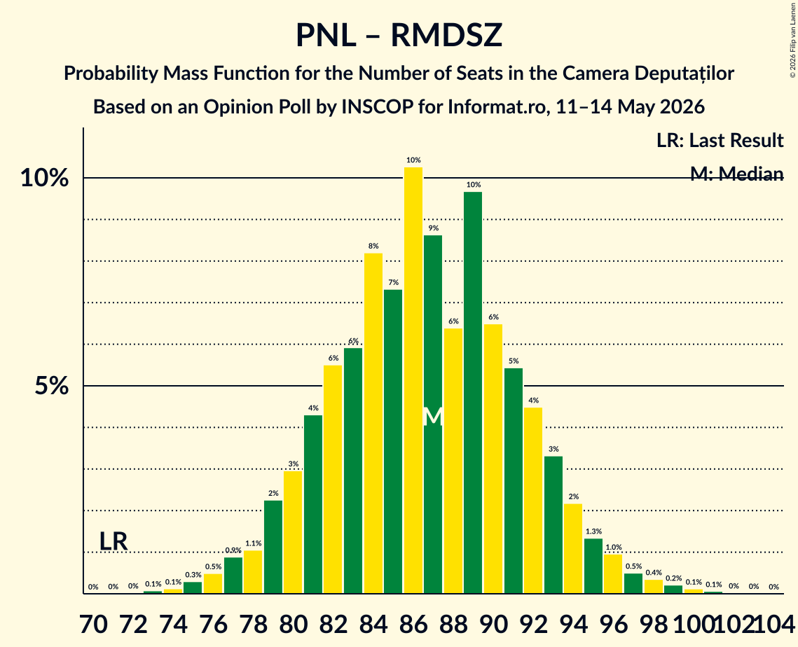

| Number of Seats | Probability | Accumulated | Special Marks |
|:---------------:|:-----------:|:-----------:|:-------------:|
| 71 | 0% | 100% | Last Result |
| 72 | 0% | 100% |  |
| 73 | 0.1% | 100% |  |
| 74 | 0.1% | 99.9% |  |
| 75 | 0.3% | 99.7% |  |
| 76 | 0.5% | 99.4% |  |
| 77 | 0.9% | 99.0% |  |
| 78 | 1.1% | 98% |  |
| 79 | 2% | 97% |  |
| 80 | 3% | 95% |  |
| 81 | 4% | 92% |  |
| 82 | 6% | 87% |  |
| 83 | 6% | 82% |  |
| 84 | 8% | 76% |  |
| 85 | 7% | 68% |  |
| 86 | 10% | 61% |  |
| 87 | 9% | 50% | Median |
| 88 | 6% | 42% |  |
| 89 | 10% | 35% |  |
| 90 | 6% | 26% |  |
| 91 | 5% | 19% |  |
| 92 | 4% | 14% |  |
| 93 | 3% | 9% |  |
| 94 | 2% | 6% |  |
| 95 | 1.3% | 4% |  |
| 96 | 1.0% | 2% |  |
| 97 | 0.5% | 1.3% |  |
| 98 | 0.4% | 0.8% |  |
| 99 | 0.2% | 0.5% |  |
| 100 | 0.1% | 0.2% |  |
| 101 | 0.1% | 0.1% |  |
| 102 | 0% | 0.1% |  |
| 103 | 0% | 0% |  |

### Partidul Național Liberal

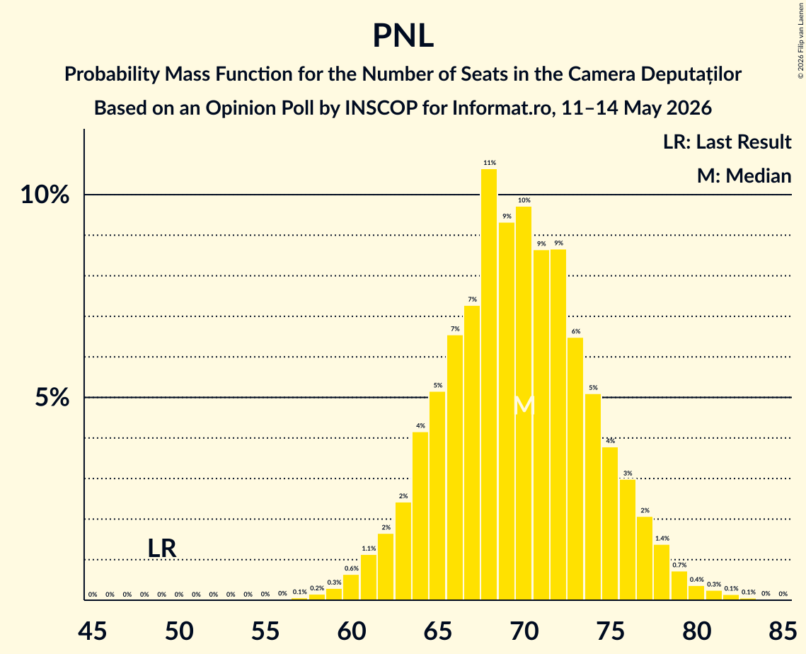

| Number of Seats | Probability | Accumulated | Special Marks |
|:---------------:|:-----------:|:-----------:|:-------------:|
| 49 | 0% | 100% | Last Result |
| 50 | 0% | 100% |  |
| 51 | 0% | 100% |  |
| 52 | 0% | 100% |  |
| 53 | 0% | 100% |  |
| 54 | 0% | 100% |  |
| 55 | 0% | 100% |  |
| 56 | 0% | 100% |  |
| 57 | 0.1% | 100% |  |
| 58 | 0.2% | 99.9% |  |
| 59 | 0.3% | 99.7% |  |
| 60 | 0.6% | 99.4% |  |
| 61 | 1.1% | 98.8% |  |
| 62 | 2% | 98% |  |
| 63 | 2% | 96% |  |
| 64 | 4% | 94% |  |
| 65 | 5% | 89% |  |
| 66 | 7% | 84% |  |
| 67 | 7% | 78% |  |
| 68 | 11% | 70% |  |
| 69 | 9% | 60% |  |
| 70 | 10% | 50% | Median |
| 71 | 9% | 41% |  |
| 72 | 9% | 32% |  |
| 73 | 6% | 23% |  |
| 74 | 5% | 17% |  |
| 75 | 4% | 12% |  |
| 76 | 3% | 8% |  |
| 77 | 2% | 5% |  |
| 78 | 1.4% | 3% |  |
| 79 | 0.7% | 2% |  |
| 80 | 0.4% | 0.9% |  |
| 81 | 0.3% | 0.5% |  |
| 82 | 0.1% | 0.3% |  |
| 83 | 0.1% | 0.1% |  |
| 84 | 0% | 0% |  |

### Partidul Social Democrat

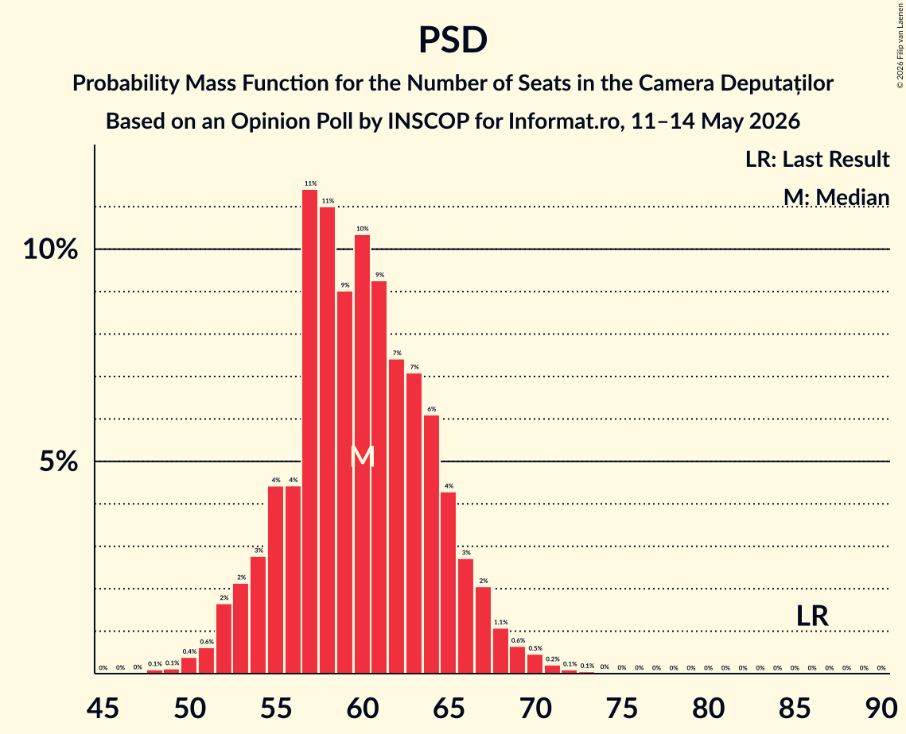

| Number of Seats | Probability | Accumulated | Special Marks |
|:---------------:|:-----------:|:-----------:|:-------------:|
| 48 | 0.1% | 100% |  |
| 49 | 0.1% | 99.9% |  |
| 50 | 0.4% | 99.7% |  |
| 51 | 0.6% | 99.4% |  |
| 52 | 2% | 98.7% |  |
| 53 | 2% | 97% |  |
| 54 | 3% | 95% |  |
| 55 | 4% | 92% |  |
| 56 | 4% | 88% |  |
| 57 | 11% | 83% |  |
| 58 | 11% | 72% |  |
| 59 | 9% | 61% |  |
| 60 | 10% | 52% | Median |
| 61 | 9% | 42% |  |
| 62 | 7% | 32% |  |
| 63 | 7% | 25% |  |
| 64 | 6% | 18% |  |
| 65 | 4% | 12% |  |
| 66 | 3% | 7% |  |
| 67 | 2% | 5% |  |
| 68 | 1.1% | 3% |  |
| 69 | 0.6% | 2% |  |
| 70 | 0.5% | 0.9% |  |
| 71 | 0.2% | 0.4% |  |
| 72 | 0.1% | 0.2% |  |
| 73 | 0.1% | 0.1% |  |
| 74 | 0% | 0% |  |
| 75 | 0% | 0% |  |
| 76 | 0% | 0% |  |
| 77 | 0% | 0% |  |
| 78 | 0% | 0% |  |
| 79 | 0% | 0% |  |
| 80 | 0% | 0% |  |
| 81 | 0% | 0% |  |
| 82 | 0% | 0% |  |
| 83 | 0% | 0% |  |
| 84 | 0% | 0% |  |
| 85 | 0% | 0% |  |
| 86 | 0% | 0% | Last Result |

## Technical Information

### Opinion Poll

+ **Polling firm:** INSCOP
+ **Commissioner(s):** Informat.ro
+ **Fieldwork period:** 11–14 May 2026

### Calculations

+ **Sample size:** 1100
+ **Simulations done:** 2,097,152
+ **Error estimate:** 1.05%

