# Opinion Poll by ARP, 30 June–3 July 2026

<a href="#voting-intentions">Voting Intentions</a> | <a href="#seats">Seats</a> | <a href="#coalitions">Coalitions</a> | <a href="#technical-information">Technical Information</a>

## Voting Intentions

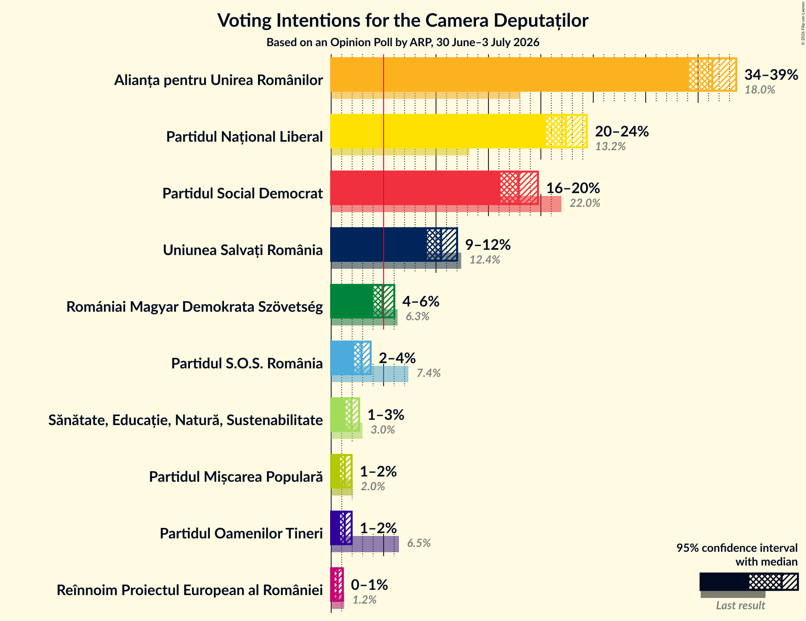

### Confidence Intervals

| Party | Last Result | Poll Result | 80% Confidence Interval | 90% Confidence Interval | 95% Confidence Interval | 99% Confidence Interval |
|:-----:|:-----------:|:-----------:|:-----------------------:|:-----------------------:|:-----------------------:|:-----------------------:|
| Alianța pentru Unirea Românilor | 18.0% | 36.4% | 34.9–37.8% |34.5–38.3% |34.1–38.6% |33.5–39.4% |
| Partidul Național Liberal | 13.2% | 22.4% | 21.1–23.7% |20.8–24.1% |20.5–24.4% |19.9–25.0% |
| Partidul Social Democrat | 22.0% | 17.9% | 16.7–19.1% |16.4–19.4% |16.2–19.7% |15.6–20.3% |
| Uniunea Salvați România | 12.4% | 10.5% | 9.6–11.5% |9.3–11.8% |9.1–12.0% |8.7–12.5% |
| Romániai Magyar Demokrata Szövetség | 6.3% | 4.9% | 4.3–5.6% |4.1–5.8% |4.0–6.0% |3.7–6.4% |
| Partidul S.O.S. România | 7.4% | 2.9% | 2.4–3.5% |2.3–3.6% |2.2–3.8% |2.0–4.1% |
| Sănătate, Educație, Natură, Sustenabilitate | 3.0% | 1.9% | 1.6–2.4% |1.4–2.5% |1.4–2.7% |1.2–2.9% |
| Partidul Oamenilor Tineri | 6.5% | 1.3% | 1.0–1.7% |0.9–1.8% |0.9–2.0% |0.7–2.2% |
| Partidul Mișcarea Populară | 2.0% | 1.3% | 1.0–1.7% |0.9–1.8% |0.9–2.0% |0.7–2.2% |
| Reînnoim Proiectul European al României | 1.2% | 0.6% | 0.4–0.9% |0.4–1.0% |0.3–1.1% |0.3–1.3% |

*Note:* The poll result column reflects the actual value used in the calculations. Published results may vary slightly, and in addition be rounded to fewer digits.

## Seats

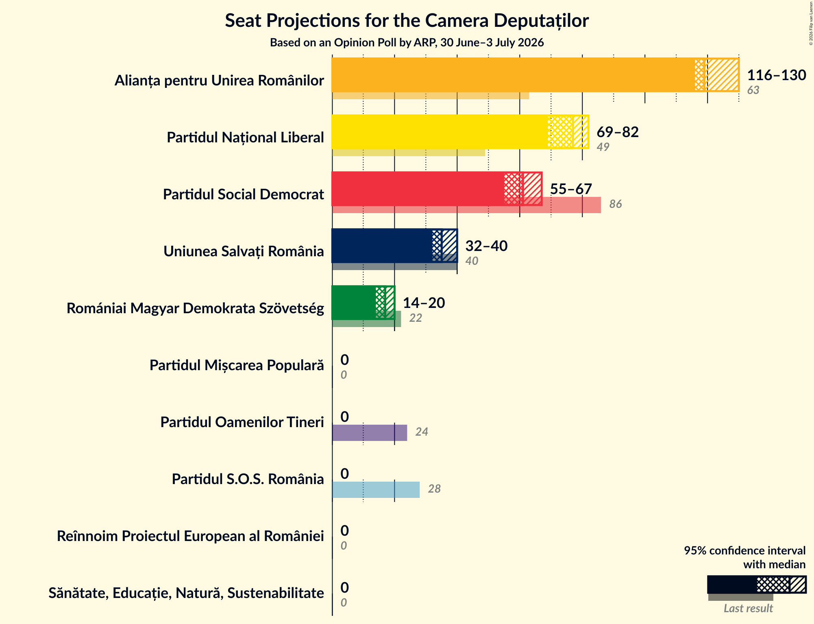

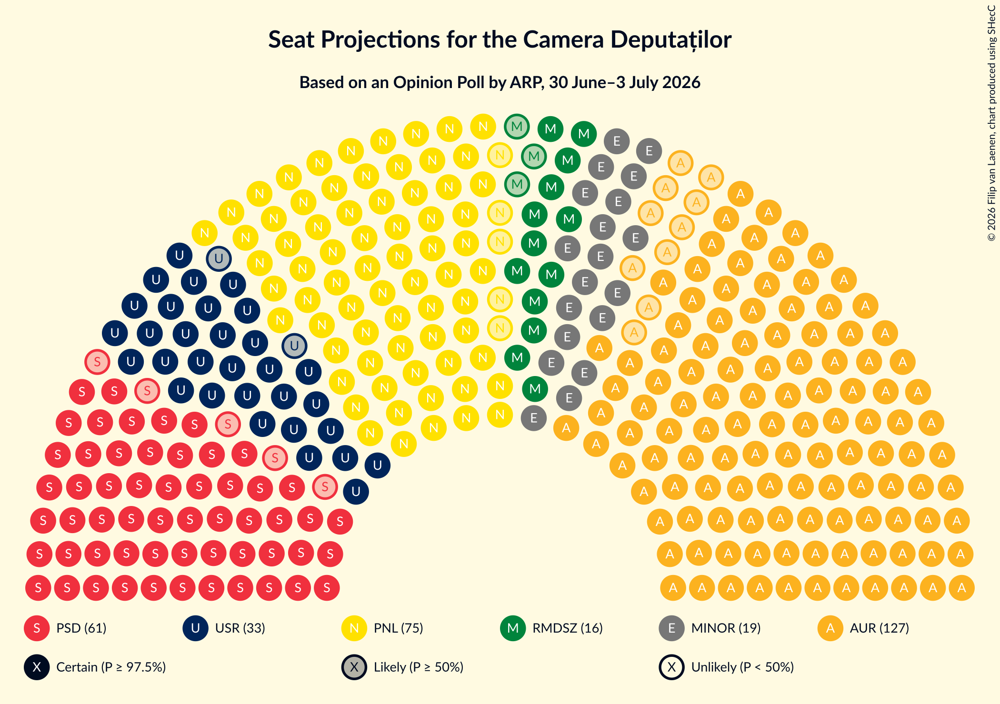

### Confidence Intervals

| Party | Last Result | Median | 80% Confidence Interval | 90% Confidence Interval | 95% Confidence Interval | 99% Confidence Interval |
|:-----:|:-----------:|:------:|:-----------------------:|:-----------------------:|:-----------------------:|:-----------------------:|
| <a href="#alianța-pentru-unirea-românilor">Alianța pentru Unirea Românilor</a> | 63 | 127 | 117–128 |117–128 |117–131 |114–133 |
| <a href="#partidul-național-liberal">Partidul Național Liberal</a> | 49 | 75 | 73–82 |71–82 |70–82 |69–84 |
| <a href="#partidul-social-democrat">Partidul Social Democrat</a> | 86 | 61 | 57–64 |57–66 |56–66 |54–68 |
| <a href="#uniunea-salvați-românia">Uniunea Salvați România</a> | 40 | 34 | 32–39 |31–40 |31–40 |30–42 |
| <a href="#romániai-magyar-demokrata-szövetség">Romániai Magyar Demokrata Szövetség</a> | 22 | 16 | 15–19 |14–19 |13–19 |12–21 |
| <a href="#partidul-s.o.s.-românia">Partidul S.O.S. România</a> | 28 | 0 | 0 |0 |0 |0 |
| <a href="#sănătate,-educație,-natură,-sustenabilitate">Sănătate, Educație, Natură, Sustenabilitate</a> | 0 | 0 | 0 |0 |0 |0 |
| <a href="#partidul-oamenilor-tineri">Partidul Oamenilor Tineri</a> | 24 | 0 | 0 |0 |0 |0 |
| <a href="#partidul-mișcarea-populară">Partidul Mișcarea Populară</a> | 0 | 0 | 0 |0 |0 |0 |
| <a href="#reînnoim-proiectul-european-al-româniei">Reînnoim Proiectul European al României</a> | 0 | 0 | 0 |0 |0 |0 |

### Alianța pentru Unirea Românilor

*For a full overview of the results for this party, see the [Alianța pentru Unirea Românilor](party-alianțapentruunirearomânilor.html) page.*

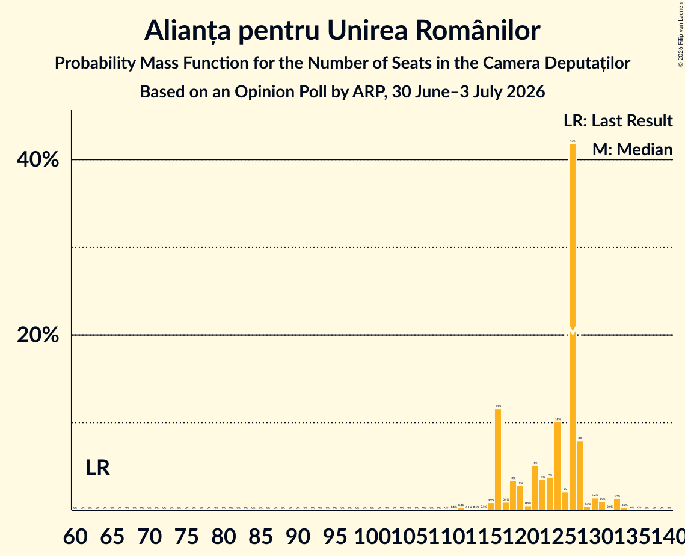

| Number of Seats | Probability | Accumulated | Special Marks |
|:---------------:|:-----------:|:-----------:|:-------------:|
| 63 | 0% | 100% | Last Result |
| 64 | 0% | 100% |  |
| 65 | 0% | 100% |  |
| 66 | 0% | 100% |  |
| 67 | 0% | 100% |  |
| 68 | 0% | 100% |  |
| 69 | 0% | 100% |  |
| 70 | 0% | 100% |  |
| 71 | 0% | 100% |  |
| 72 | 0% | 100% |  |
| 73 | 0% | 100% |  |
| 74 | 0% | 100% |  |
| 75 | 0% | 100% |  |
| 76 | 0% | 100% |  |
| 77 | 0% | 100% |  |
| 78 | 0% | 100% |  |
| 79 | 0% | 100% |  |
| 80 | 0% | 100% |  |
| 81 | 0% | 100% |  |
| 82 | 0% | 100% |  |
| 83 | 0% | 100% |  |
| 84 | 0% | 100% |  |
| 85 | 0% | 100% |  |
| 86 | 0% | 100% |  |
| 87 | 0% | 100% |  |
| 88 | 0% | 100% |  |
| 89 | 0% | 100% |  |
| 90 | 0% | 100% |  |
| 91 | 0% | 100% |  |
| 92 | 0% | 100% |  |
| 93 | 0% | 100% |  |
| 94 | 0% | 100% |  |
| 95 | 0% | 100% |  |
| 96 | 0% | 100% |  |
| 97 | 0% | 100% |  |
| 98 | 0% | 100% |  |
| 99 | 0% | 100% |  |
| 100 | 0% | 100% |  |
| 101 | 0% | 100% |  |
| 102 | 0% | 100% |  |
| 103 | 0% | 100% |  |
| 104 | 0% | 100% |  |
| 105 | 0% | 100% |  |
| 106 | 0% | 100% |  |
| 107 | 0% | 100% |  |
| 108 | 0% | 100% |  |
| 109 | 0% | 100% |  |
| 110 | 0% | 100% |  |
| 111 | 0.1% | 100% |  |
| 112 | 0.3% | 99.9% |  |
| 113 | 0.1% | 99.6% |  |
| 114 | 0.1% | 99.5% |  |
| 115 | 0.1% | 99.4% |  |
| 116 | 0.9% | 99.3% |  |
| 117 | 12% | 98% |  |
| 118 | 0.9% | 87% |  |
| 119 | 3% | 86% |  |
| 120 | 3% | 83% |  |
| 121 | 0.5% | 80% |  |
| 122 | 5% | 79% |  |
| 123 | 3% | 74% |  |
| 124 | 4% | 71% |  |
| 125 | 10% | 67% |  |
| 126 | 2% | 57% |  |
| 127 | 42% | 55% | Median |
| 128 | 8% | 13% |  |
| 129 | 0.4% | 5% |  |
| 130 | 1.4% | 4% |  |
| 131 | 1.0% | 3% |  |
| 132 | 0.1% | 2% |  |
| 133 | 1.4% | 2% |  |
| 134 | 0.3% | 0.4% |  |
| 135 | 0% | 0.1% |  |
| 136 | 0% | 0% |  |

### Partidul Național Liberal

*For a full overview of the results for this party, see the [Partidul Național Liberal](party-partidulnaționalliberal.html) page.*

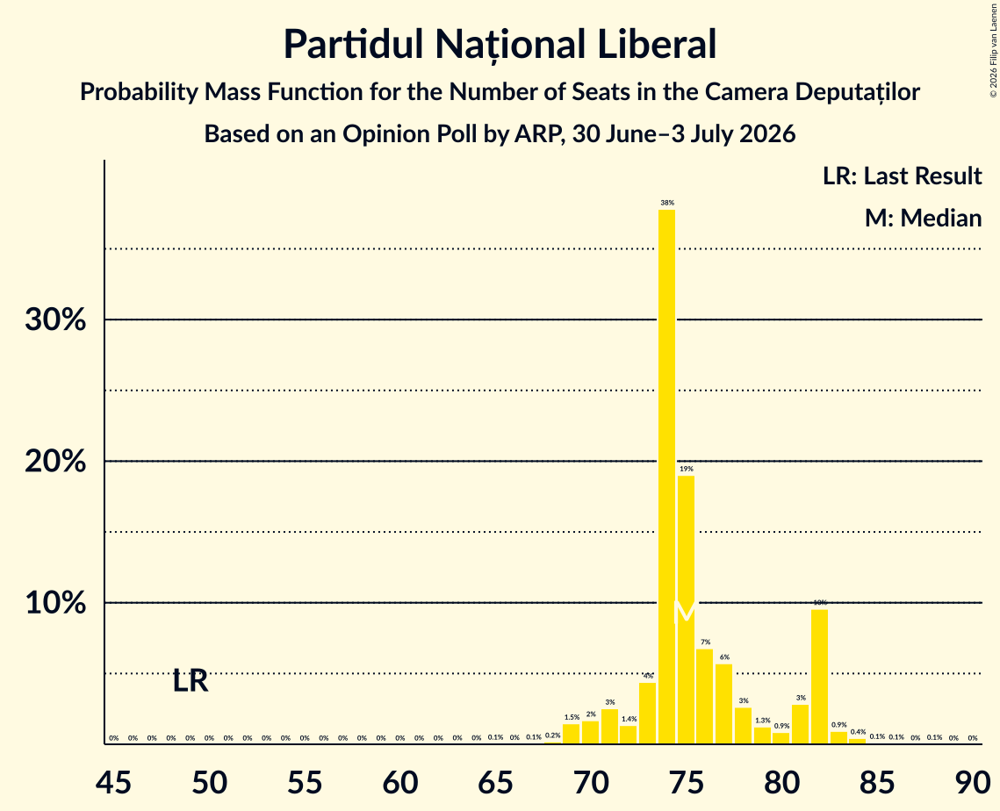

| Number of Seats | Probability | Accumulated | Special Marks |
|:---------------:|:-----------:|:-----------:|:-------------:|
| 49 | 0% | 100% | Last Result |
| 50 | 0% | 100% |  |
| 51 | 0% | 100% |  |
| 52 | 0% | 100% |  |
| 53 | 0% | 100% |  |
| 54 | 0% | 100% |  |
| 55 | 0% | 100% |  |
| 56 | 0% | 100% |  |
| 57 | 0% | 100% |  |
| 58 | 0% | 100% |  |
| 59 | 0% | 100% |  |
| 60 | 0% | 100% |  |
| 61 | 0% | 100% |  |
| 62 | 0% | 100% |  |
| 63 | 0% | 100% |  |
| 64 | 0% | 100% |  |
| 65 | 0.1% | 100% |  |
| 66 | 0% | 99.9% |  |
| 67 | 0.1% | 99.9% |  |
| 68 | 0.2% | 99.8% |  |
| 69 | 1.5% | 99.6% |  |
| 70 | 2% | 98% |  |
| 71 | 3% | 96% |  |
| 72 | 1.4% | 94% |  |
| 73 | 4% | 93% |  |
| 74 | 38% | 88% |  |
| 75 | 19% | 50% | Median |
| 76 | 7% | 31% |  |
| 77 | 6% | 25% |  |
| 78 | 3% | 19% |  |
| 79 | 1.3% | 16% |  |
| 80 | 0.9% | 15% |  |
| 81 | 3% | 14% |  |
| 82 | 10% | 11% |  |
| 83 | 0.9% | 2% |  |
| 84 | 0.4% | 0.7% |  |
| 85 | 0.1% | 0.3% |  |
| 86 | 0.1% | 0.1% |  |
| 87 | 0% | 0.1% |  |
| 88 | 0.1% | 0.1% |  |
| 89 | 0% | 0% |  |

### Partidul Social Democrat

*For a full overview of the results for this party, see the [Partidul Social Democrat](party-partidulsocialdemocrat.html) page.*

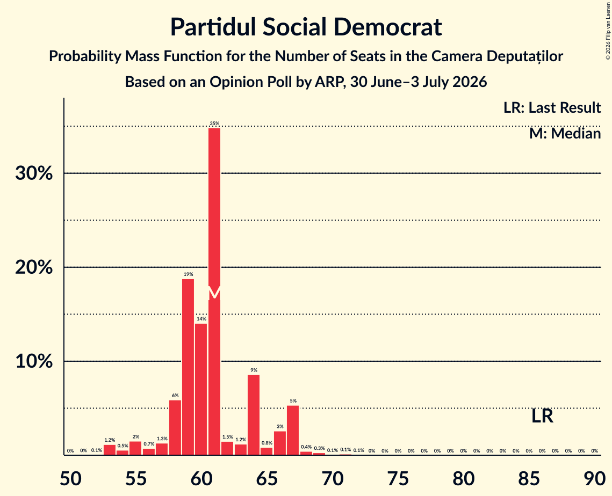

| Number of Seats | Probability | Accumulated | Special Marks |
|:---------------:|:-----------:|:-----------:|:-------------:|
| 52 | 0.1% | 100% |  |
| 53 | 0.3% | 99.9% |  |
| 54 | 0.4% | 99.5% |  |
| 55 | 1.2% | 99.1% |  |
| 56 | 1.4% | 98% |  |
| 57 | 12% | 96% |  |
| 58 | 2% | 85% |  |
| 59 | 17% | 83% |  |
| 60 | 6% | 66% |  |
| 61 | 10% | 59% | Median |
| 62 | 36% | 49% |  |
| 63 | 2% | 13% |  |
| 64 | 3% | 11% |  |
| 65 | 2% | 7% |  |
| 66 | 3% | 5% |  |
| 67 | 2% | 2% |  |
| 68 | 0.3% | 0.7% |  |
| 69 | 0.2% | 0.4% |  |
| 70 | 0.1% | 0.2% |  |
| 71 | 0.1% | 0.1% |  |
| 72 | 0% | 0% |  |
| 73 | 0% | 0% |  |
| 74 | 0% | 0% |  |
| 75 | 0% | 0% |  |
| 76 | 0% | 0% |  |
| 77 | 0% | 0% |  |
| 78 | 0% | 0% |  |
| 79 | 0% | 0% |  |
| 80 | 0% | 0% |  |
| 81 | 0% | 0% |  |
| 82 | 0% | 0% |  |
| 83 | 0% | 0% |  |
| 84 | 0% | 0% |  |
| 85 | 0% | 0% |  |
| 86 | 0% | 0% | Last Result |

### Uniunea Salvați România

*For a full overview of the results for this party, see the [Uniunea Salvați România](party-uniuneasalvațiromânia.html) page.*

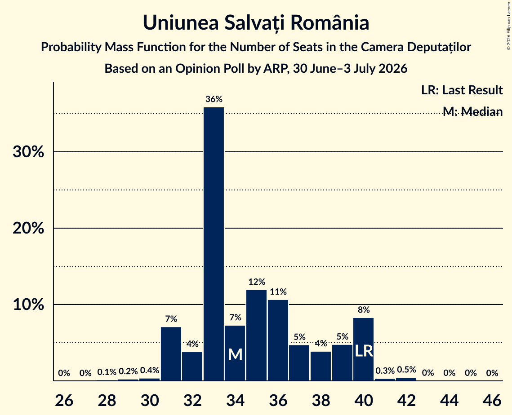

| Number of Seats | Probability | Accumulated | Special Marks |
|:---------------:|:-----------:|:-----------:|:-------------:|
| 28 | 0.1% | 100% |  |
| 29 | 0.2% | 99.9% |  |
| 30 | 0.4% | 99.6% |  |
| 31 | 7% | 99.2% |  |
| 32 | 4% | 92% |  |
| 33 | 36% | 88% |  |
| 34 | 7% | 52% | Median |
| 35 | 12% | 45% |  |
| 36 | 11% | 33% |  |
| 37 | 5% | 23% |  |
| 38 | 4% | 18% |  |
| 39 | 5% | 14% |  |
| 40 | 8% | 9% | Last Result |
| 41 | 0.3% | 0.9% |  |
| 42 | 0.5% | 0.5% |  |
| 43 | 0% | 0.1% |  |
| 44 | 0% | 0.1% |  |
| 45 | 0% | 0% |  |

### Romániai Magyar Demokrata Szövetség

*For a full overview of the results for this party, see the [Romániai Magyar Demokrata Szövetség](party-romániaimagyardemokrataszövetség.html) page.*

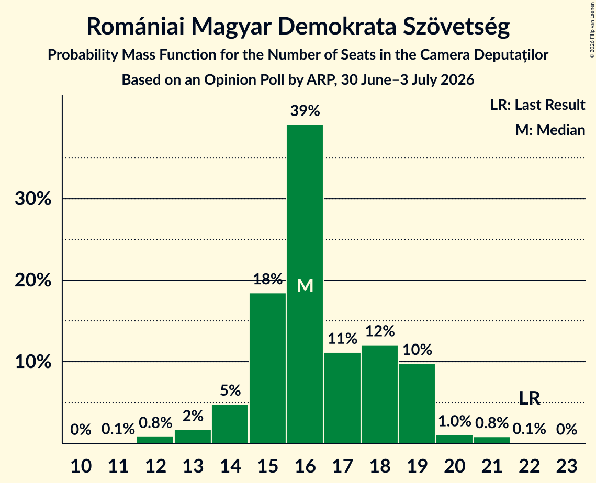

| Number of Seats | Probability | Accumulated | Special Marks |
|:---------------:|:-----------:|:-----------:|:-------------:|
| 11 | 0.1% | 100% |  |
| 12 | 0.8% | 99.9% |  |
| 13 | 2% | 99.1% |  |
| 14 | 5% | 97% |  |
| 15 | 18% | 93% |  |
| 16 | 39% | 74% | Median |
| 17 | 11% | 35% |  |
| 18 | 12% | 24% |  |
| 19 | 10% | 12% |  |
| 20 | 1.0% | 2% |  |
| 21 | 0.8% | 1.0% |  |
| 22 | 0.1% | 0.1% | Last Result |
| 23 | 0% | 0% |  |

### Partidul S.O.S. România

*For a full overview of the results for this party, see the [Partidul S.O.S. România](party-partidulsosromânia.html) page.*

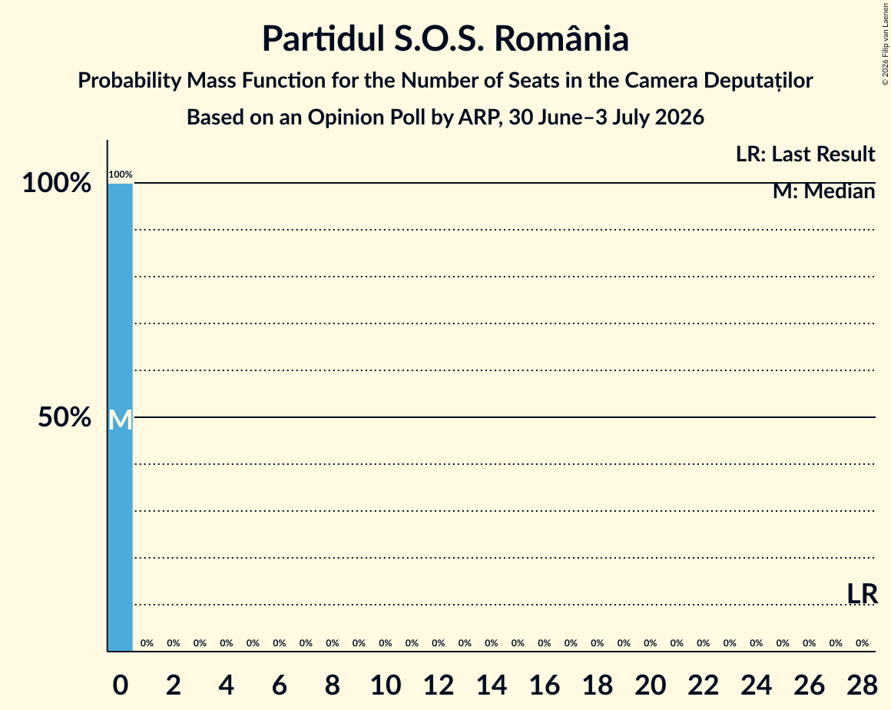

| Number of Seats | Probability | Accumulated | Special Marks |
|:---------------:|:-----------:|:-----------:|:-------------:|
| 0 | 100% | 100% | Median |
| 1 | 0% | 0% |  |
| 2 | 0% | 0% |  |
| 3 | 0% | 0% |  |
| 4 | 0% | 0% |  |
| 5 | 0% | 0% |  |
| 6 | 0% | 0% |  |
| 7 | 0% | 0% |  |
| 8 | 0% | 0% |  |
| 9 | 0% | 0% |  |
| 10 | 0% | 0% |  |
| 11 | 0% | 0% |  |
| 12 | 0% | 0% |  |
| 13 | 0% | 0% |  |
| 14 | 0% | 0% |  |
| 15 | 0% | 0% |  |
| 16 | 0% | 0% |  |
| 17 | 0% | 0% |  |
| 18 | 0% | 0% |  |
| 19 | 0% | 0% |  |
| 20 | 0% | 0% |  |
| 21 | 0% | 0% |  |
| 22 | 0% | 0% |  |
| 23 | 0% | 0% |  |
| 24 | 0% | 0% |  |
| 25 | 0% | 0% |  |
| 26 | 0% | 0% |  |
| 27 | 0% | 0% |  |
| 28 | 0% | 0% | Last Result |

### Sănătate, Educație, Natură, Sustenabilitate

*For a full overview of the results for this party, see the [Sănătate, Educație, Natură, Sustenabilitate](party-sănătateeducațienaturăsustenabilitate.html) page.*

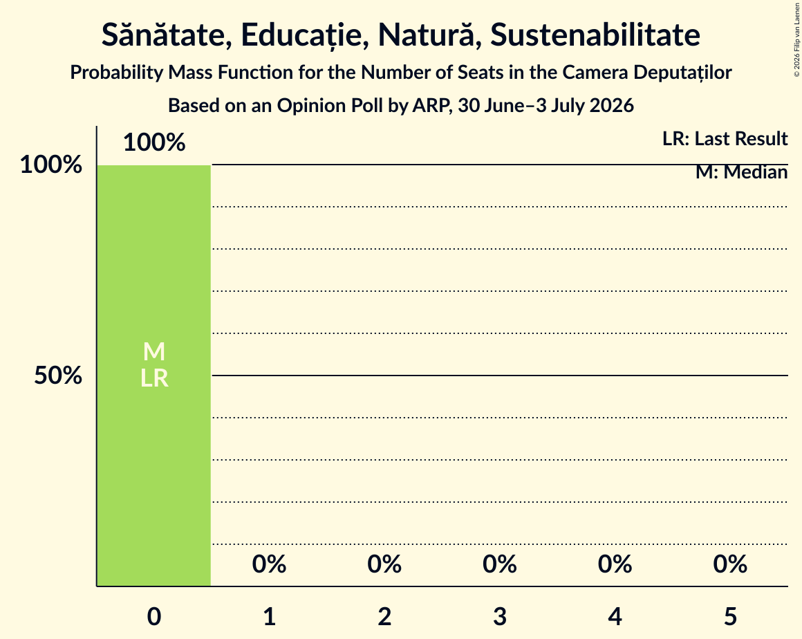

| Number of Seats | Probability | Accumulated | Special Marks |
|:---------------:|:-----------:|:-----------:|:-------------:|
| 0 | 100% | 100% | Last Result, Median |

### Partidul Oamenilor Tineri

*For a full overview of the results for this party, see the [Partidul Oamenilor Tineri](party-partiduloamenilortineri.html) page.*

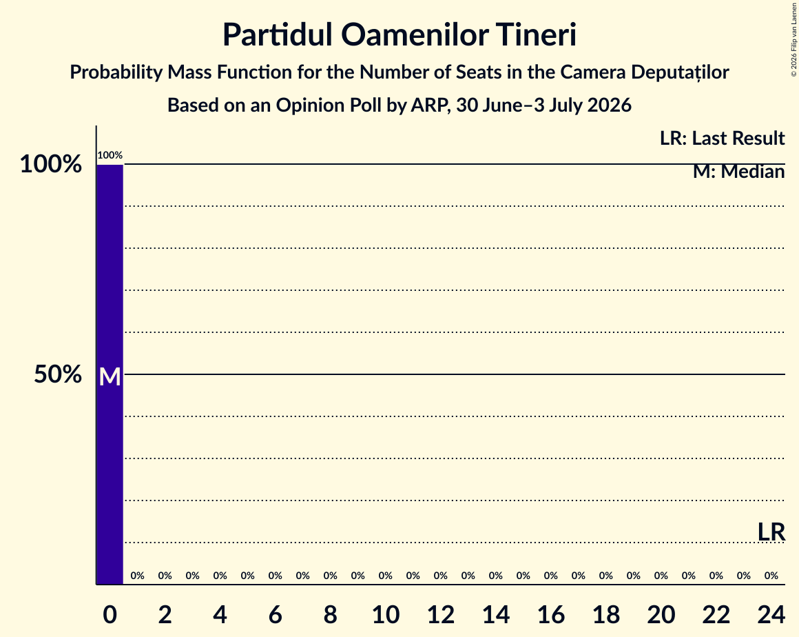

| Number of Seats | Probability | Accumulated | Special Marks |
|:---------------:|:-----------:|:-----------:|:-------------:|
| 0 | 100% | 100% | Median |
| 1 | 0% | 0% |  |
| 2 | 0% | 0% |  |
| 3 | 0% | 0% |  |
| 4 | 0% | 0% |  |
| 5 | 0% | 0% |  |
| 6 | 0% | 0% |  |
| 7 | 0% | 0% |  |
| 8 | 0% | 0% |  |
| 9 | 0% | 0% |  |
| 10 | 0% | 0% |  |
| 11 | 0% | 0% |  |
| 12 | 0% | 0% |  |
| 13 | 0% | 0% |  |
| 14 | 0% | 0% |  |
| 15 | 0% | 0% |  |
| 16 | 0% | 0% |  |
| 17 | 0% | 0% |  |
| 18 | 0% | 0% |  |
| 19 | 0% | 0% |  |
| 20 | 0% | 0% |  |
| 21 | 0% | 0% |  |
| 22 | 0% | 0% |  |
| 23 | 0% | 0% |  |
| 24 | 0% | 0% | Last Result |

### Partidul Mișcarea Populară

*For a full overview of the results for this party, see the [Partidul Mișcarea Populară](party-partidulmișcareapopulară.html) page.*

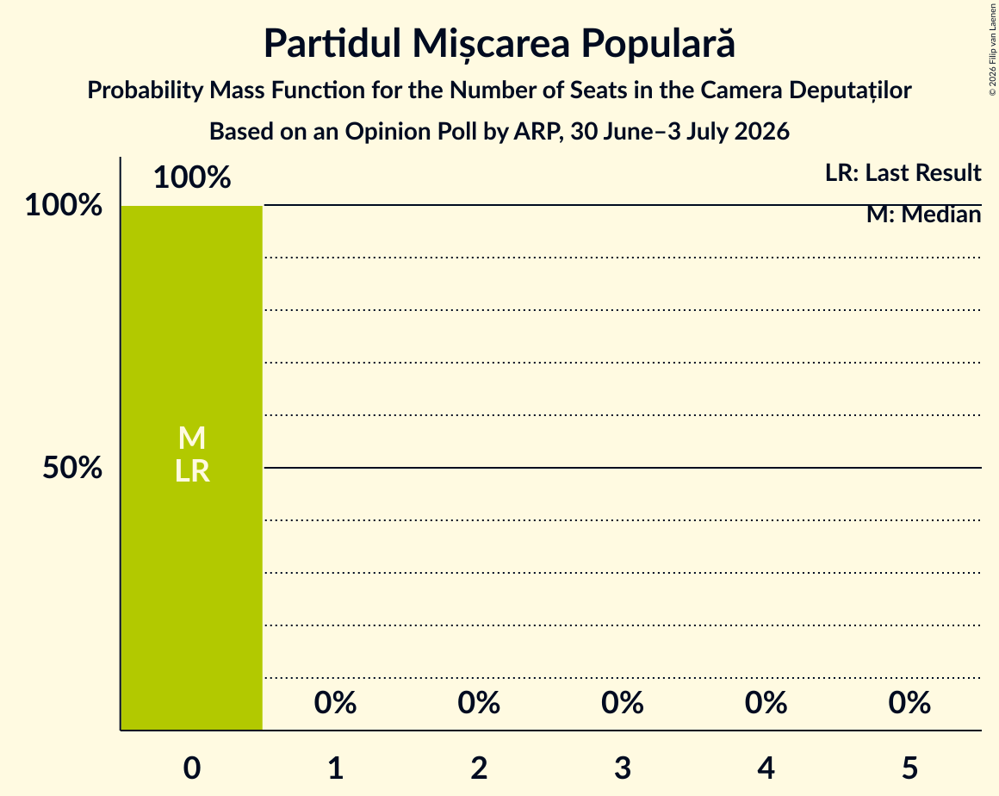

| Number of Seats | Probability | Accumulated | Special Marks |
|:---------------:|:-----------:|:-----------:|:-------------:|
| 0 | 100% | 100% | Last Result, Median |

### Reînnoim Proiectul European al României

*For a full overview of the results for this party, see the [Reînnoim Proiectul European al României](party-reînnoimproiectuleuropeanalromâniei.html) page.*

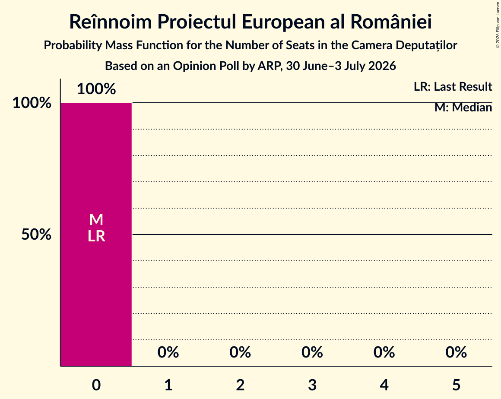

| Number of Seats | Probability | Accumulated | Special Marks |
|:---------------:|:-----------:|:-----------:|:-------------:|
| 0 | 100% | 100% | Last Result, Median |

## Coalitions

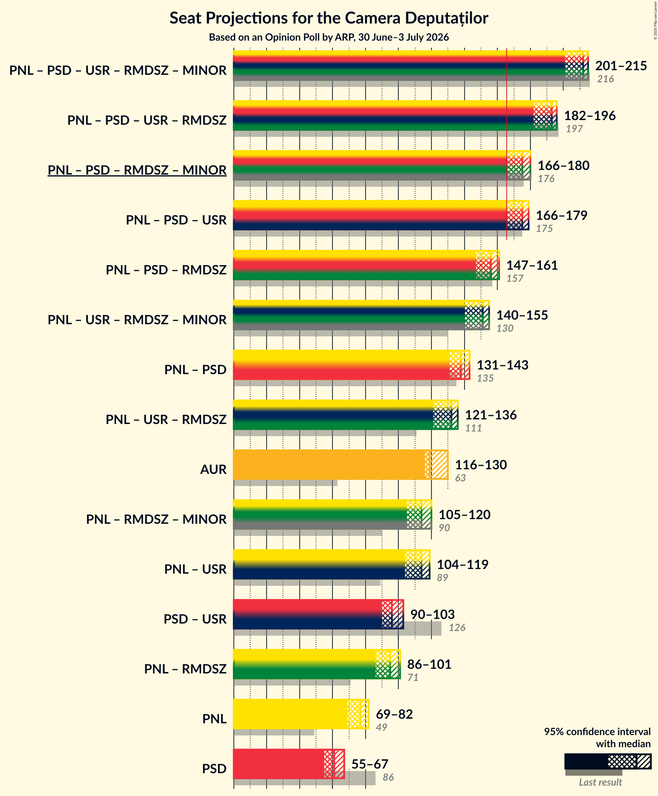

### Confidence Intervals

| Coalition | Last Result | Median | Majority? | 80% Confidence Interval | 90% Confidence Interval | 95% Confidence Interval | 99% Confidence Interval |
|:---------:|:-----------:|:------:|:---------:|:-----------------------:|:-----------------------:|:-----------------------:|:-----------------------:|
| Partidul Național Liberal – Partidul Social Democrat – Uniunea Salvați România – Romániai Magyar Demokrata Szövetség | 197 | 185 | 100% | 184–195 | 184–195 | 181–195 | 179–198 |
| Partidul Național Liberal – Partidul Social Democrat – Uniunea Salvați România | 175 | 169 | 97% | 167–177 | 166–178 | 165–180 | 163–182 |
| Partidul Național Liberal – Partidul Social Democrat – Romániai Magyar Demokrata Szövetség | 157 | 152 | 0.1% | 147–160 | 147–160 | 147–161 | 144–162 |
| Partidul Național Liberal – Partidul Social Democrat | 135 | 136 | 0% | 132–142 | 132–143 | 130–146 | 128–147 |
| Partidul Național Liberal – Uniunea Salvați România – Romániai Magyar Demokrata Szövetség | 111 | 125 | 0% | 123–134 | 121–136 | 120–136 | 119–137 |
| Alianța pentru Unirea Românilor | 63 | 127 | 0% | 117–128 | 117–128 | 117–131 | 114–133 |
| Partidul Național Liberal – Uniunea Salvați România | 89 | 109 | 0% | 107–117 | 107–117 | 104–117 | 103–121 |
| Partidul Social Democrat – Uniunea Salvați România | 126 | 95 | 0% | 92–99 | 90–101 | 90–102 | 88–105 |
| Partidul Național Liberal – Romániai Magyar Demokrata Szövetség | 71 | 90 | 0% | 90–99 | 87–99 | 85–101 | 84–101 |
| Partidul Național Liberal | 49 | 75 | 0% | 73–82 | 71–82 | 70–82 | 69–84 |
| Partidul Social Democrat | 86 | 61 | 0% | 57–64 | 57–66 | 56–66 | 54–68 |

### Partidul Național Liberal – Partidul Social Democrat – Uniunea Salvați România – Romániai Magyar Demokrata Szövetség

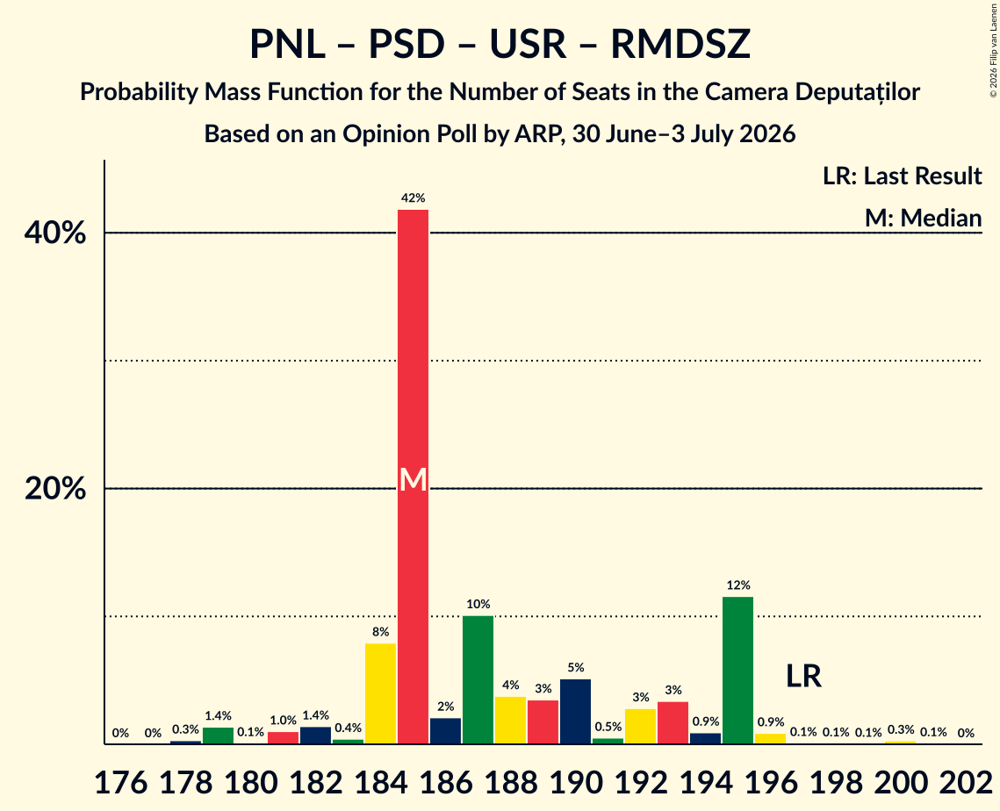

| Number of Seats | Probability | Accumulated | Special Marks |
|:---------------:|:-----------:|:-----------:|:-------------:|
| 177 | 0% | 100% |  |
| 178 | 0.3% | 99.9% |  |
| 179 | 1.4% | 99.6% |  |
| 180 | 0.1% | 98% |  |
| 181 | 1.0% | 98% |  |
| 182 | 1.4% | 97% |  |
| 183 | 0.4% | 96% |  |
| 184 | 8% | 95% |  |
| 185 | 42% | 87% |  |
| 186 | 2% | 45% | Median |
| 187 | 10% | 43% |  |
| 188 | 4% | 33% |  |
| 189 | 3% | 29% |  |
| 190 | 5% | 26% |  |
| 191 | 0.5% | 21% |  |
| 192 | 3% | 20% |  |
| 193 | 3% | 17% |  |
| 194 | 0.9% | 14% |  |
| 195 | 12% | 13% |  |
| 196 | 0.9% | 2% |  |
| 197 | 0.1% | 0.7% | Last Result |
| 198 | 0.1% | 0.6% |  |
| 199 | 0.1% | 0.5% |  |
| 200 | 0.3% | 0.4% |  |
| 201 | 0.1% | 0.1% |  |
| 202 | 0% | 0% |  |

### Partidul Național Liberal – Partidul Social Democrat – Uniunea Salvați România

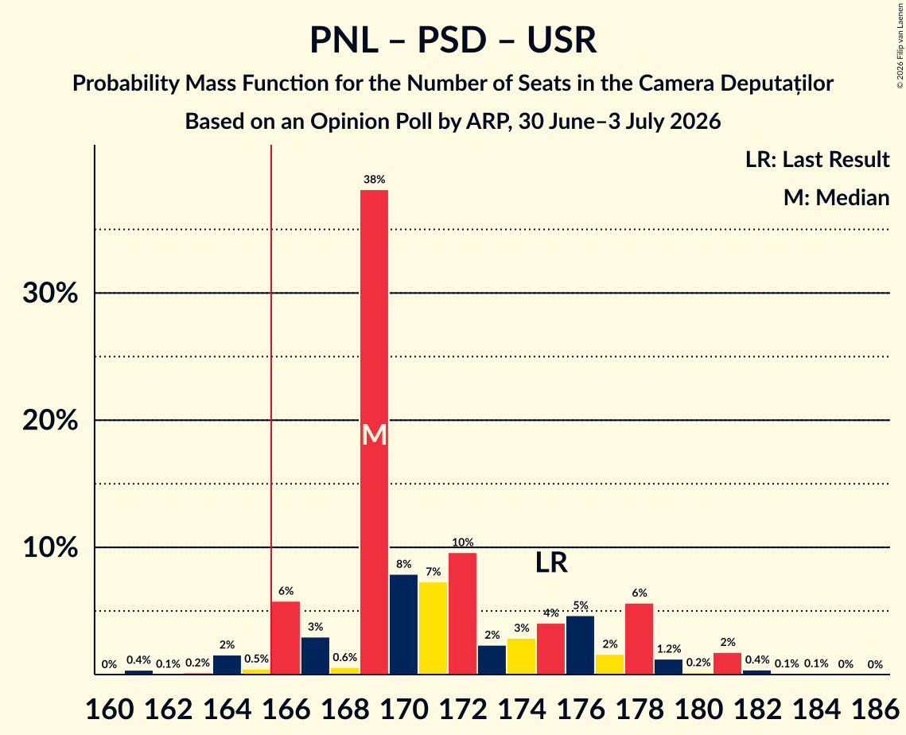

| Number of Seats | Probability | Accumulated | Special Marks |
|:---------------:|:-----------:|:-----------:|:-------------:|
| 160 | 0% | 100% |  |
| 161 | 0.4% | 99.9% |  |
| 162 | 0.1% | 99.6% |  |
| 163 | 0.2% | 99.5% |  |
| 164 | 2% | 99.4% |  |
| 165 | 0.5% | 98% |  |
| 166 | 6% | 97% | Majority |
| 167 | 3% | 92% |  |
| 168 | 0.6% | 89% |  |
| 169 | 38% | 88% |  |
| 170 | 8% | 50% | Median |
| 171 | 7% | 42% |  |
| 172 | 10% | 35% |  |
| 173 | 2% | 25% |  |
| 174 | 3% | 23% |  |
| 175 | 4% | 20% | Last Result |
| 176 | 5% | 16% |  |
| 177 | 2% | 11% |  |
| 178 | 6% | 9% |  |
| 179 | 1.2% | 4% |  |
| 180 | 0.2% | 3% |  |
| 181 | 2% | 2% |  |
| 182 | 0.4% | 0.6% |  |
| 183 | 0.1% | 0.2% |  |
| 184 | 0.1% | 0.2% |  |
| 185 | 0% | 0.1% |  |
| 186 | 0% | 0% |  |

### Partidul Național Liberal – Partidul Social Democrat – Romániai Magyar Demokrata Szövetség

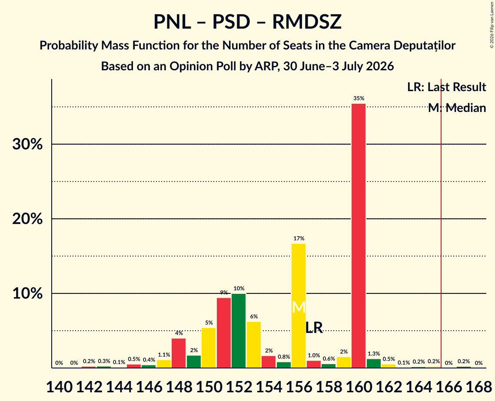

| Number of Seats | Probability | Accumulated | Special Marks |
|:---------------:|:-----------:|:-----------:|:-------------:|
| 142 | 0.1% | 100% |  |
| 143 | 0.2% | 99.9% |  |
| 144 | 0.3% | 99.7% |  |
| 145 | 1.5% | 99.4% |  |
| 146 | 0.3% | 98% |  |
| 147 | 9% | 98% |  |
| 148 | 2% | 89% |  |
| 149 | 8% | 87% |  |
| 150 | 2% | 79% |  |
| 151 | 7% | 77% |  |
| 152 | 37% | 70% | Median |
| 153 | 7% | 32% |  |
| 154 | 1.2% | 25% |  |
| 155 | 0.9% | 24% |  |
| 156 | 7% | 23% |  |
| 157 | 0.8% | 16% | Last Result |
| 158 | 2% | 15% |  |
| 159 | 0.8% | 14% |  |
| 160 | 10% | 13% |  |
| 161 | 2% | 3% |  |
| 162 | 0.9% | 1.2% |  |
| 163 | 0.1% | 0.3% |  |
| 164 | 0.1% | 0.2% |  |
| 165 | 0.1% | 0.1% |  |
| 166 | 0% | 0.1% | Majority |
| 167 | 0.1% | 0.1% |  |
| 168 | 0% | 0% |  |

### Partidul Național Liberal – Partidul Social Democrat

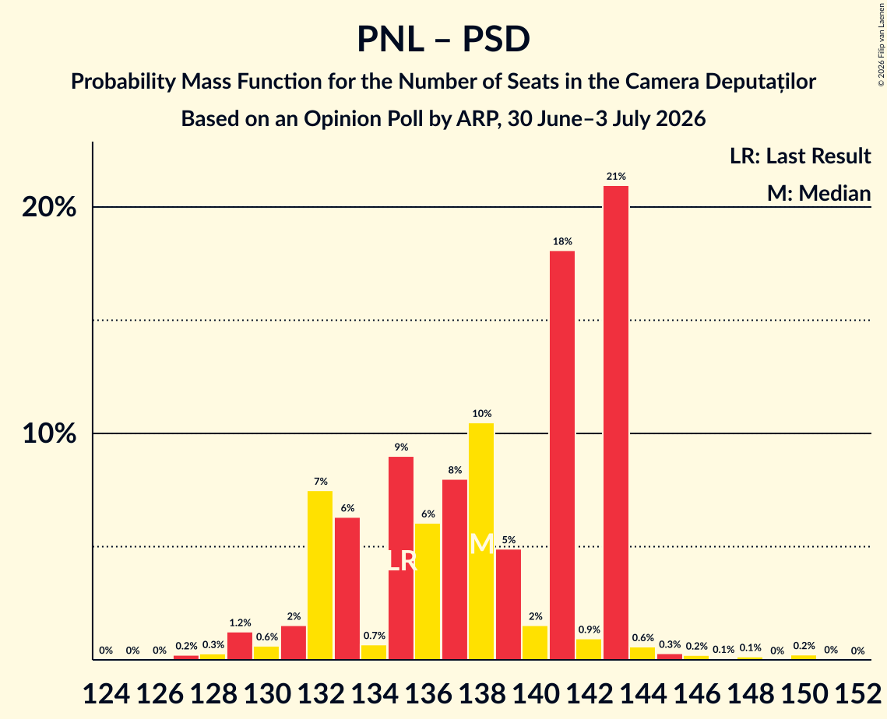

| Number of Seats | Probability | Accumulated | Special Marks |
|:---------------:|:-----------:|:-----------:|:-------------:|
| 125 | 0.2% | 100% |  |
| 126 | 0.1% | 99.8% |  |
| 127 | 0.1% | 99.7% |  |
| 128 | 0.5% | 99.6% |  |
| 129 | 0.5% | 99.1% |  |
| 130 | 2% | 98.6% |  |
| 131 | 0.9% | 97% |  |
| 132 | 13% | 96% |  |
| 133 | 3% | 83% |  |
| 134 | 7% | 80% |  |
| 135 | 9% | 73% | Last Result |
| 136 | 36% | 64% | Median |
| 137 | 3% | 28% |  |
| 138 | 6% | 25% |  |
| 139 | 2% | 19% |  |
| 140 | 1.1% | 17% |  |
| 141 | 5% | 16% |  |
| 142 | 1.2% | 10% |  |
| 143 | 6% | 9% |  |
| 144 | 0.4% | 3% |  |
| 145 | 0.2% | 3% |  |
| 146 | 0.8% | 3% |  |
| 147 | 2% | 2% |  |
| 148 | 0.2% | 0.3% |  |
| 149 | 0% | 0.1% |  |
| 150 | 0.1% | 0.1% |  |
| 151 | 0% | 0% |  |

### Partidul Național Liberal – Uniunea Salvați România – Romániai Magyar Demokrata Szövetség

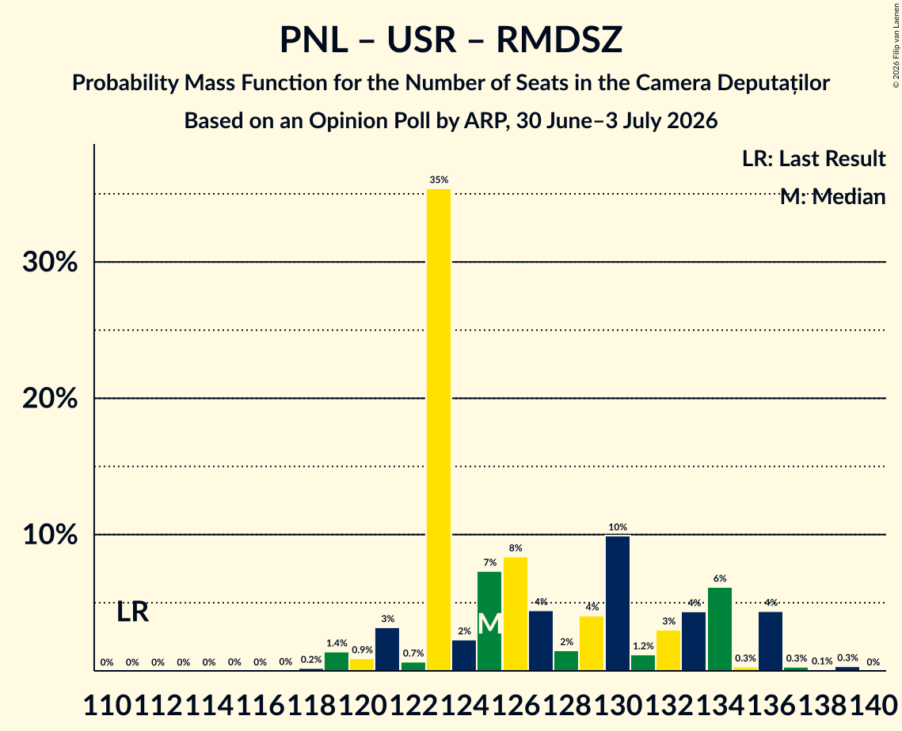

| Number of Seats | Probability | Accumulated | Special Marks |
|:---------------:|:-----------:|:-----------:|:-------------:|
| 111 | 0% | 100% | Last Result |
| 112 | 0% | 100% |  |
| 113 | 0% | 100% |  |
| 114 | 0% | 100% |  |
| 115 | 0% | 100% |  |
| 116 | 0% | 100% |  |
| 117 | 0% | 100% |  |
| 118 | 0.2% | 99.9% |  |
| 119 | 1.4% | 99.7% |  |
| 120 | 0.9% | 98% |  |
| 121 | 3% | 97% |  |
| 122 | 0.7% | 94% |  |
| 123 | 35% | 94% |  |
| 124 | 2% | 58% |  |
| 125 | 7% | 56% | Median |
| 126 | 8% | 48% |  |
| 127 | 4% | 40% |  |
| 128 | 2% | 36% |  |
| 129 | 4% | 34% |  |
| 130 | 10% | 30% |  |
| 131 | 1.2% | 20% |  |
| 132 | 3% | 19% |  |
| 133 | 4% | 16% |  |
| 134 | 6% | 12% |  |
| 135 | 0.3% | 5% |  |
| 136 | 4% | 5% |  |
| 137 | 0.3% | 0.8% |  |
| 138 | 0.1% | 0.5% |  |
| 139 | 0.3% | 0.4% |  |
| 140 | 0% | 0% |  |

### Alianța pentru Unirea Românilor

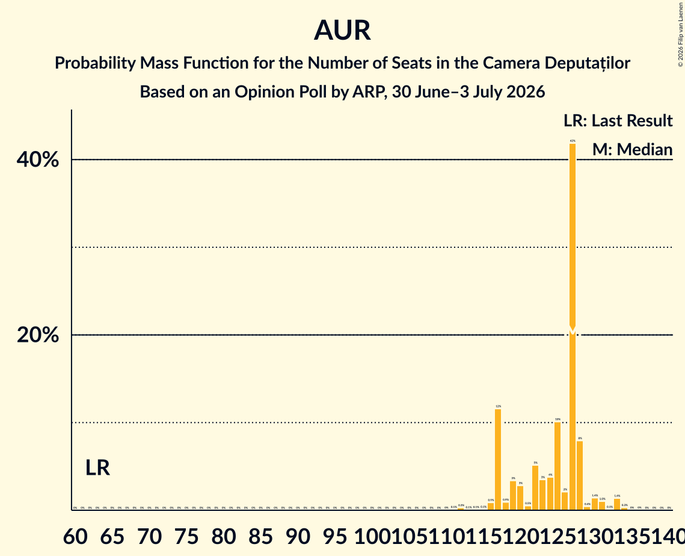

| Number of Seats | Probability | Accumulated | Special Marks |
|:---------------:|:-----------:|:-----------:|:-------------:|
| 63 | 0% | 100% | Last Result |
| 64 | 0% | 100% |  |
| 65 | 0% | 100% |  |
| 66 | 0% | 100% |  |
| 67 | 0% | 100% |  |
| 68 | 0% | 100% |  |
| 69 | 0% | 100% |  |
| 70 | 0% | 100% |  |
| 71 | 0% | 100% |  |
| 72 | 0% | 100% |  |
| 73 | 0% | 100% |  |
| 74 | 0% | 100% |  |
| 75 | 0% | 100% |  |
| 76 | 0% | 100% |  |
| 77 | 0% | 100% |  |
| 78 | 0% | 100% |  |
| 79 | 0% | 100% |  |
| 80 | 0% | 100% |  |
| 81 | 0% | 100% |  |
| 82 | 0% | 100% |  |
| 83 | 0% | 100% |  |
| 84 | 0% | 100% |  |
| 85 | 0% | 100% |  |
| 86 | 0% | 100% |  |
| 87 | 0% | 100% |  |
| 88 | 0% | 100% |  |
| 89 | 0% | 100% |  |
| 90 | 0% | 100% |  |
| 91 | 0% | 100% |  |
| 92 | 0% | 100% |  |
| 93 | 0% | 100% |  |
| 94 | 0% | 100% |  |
| 95 | 0% | 100% |  |
| 96 | 0% | 100% |  |
| 97 | 0% | 100% |  |
| 98 | 0% | 100% |  |
| 99 | 0% | 100% |  |
| 100 | 0% | 100% |  |
| 101 | 0% | 100% |  |
| 102 | 0% | 100% |  |
| 103 | 0% | 100% |  |
| 104 | 0% | 100% |  |
| 105 | 0% | 100% |  |
| 106 | 0% | 100% |  |
| 107 | 0% | 100% |  |
| 108 | 0% | 100% |  |
| 109 | 0% | 100% |  |
| 110 | 0% | 100% |  |
| 111 | 0.1% | 100% |  |
| 112 | 0.3% | 99.9% |  |
| 113 | 0.1% | 99.6% |  |
| 114 | 0.1% | 99.5% |  |
| 115 | 0.1% | 99.4% |  |
| 116 | 0.9% | 99.3% |  |
| 117 | 12% | 98% |  |
| 118 | 0.9% | 87% |  |
| 119 | 3% | 86% |  |
| 120 | 3% | 83% |  |
| 121 | 0.5% | 80% |  |
| 122 | 5% | 79% |  |
| 123 | 3% | 74% |  |
| 124 | 4% | 71% |  |
| 125 | 10% | 67% |  |
| 126 | 2% | 57% |  |
| 127 | 42% | 55% | Median |
| 128 | 8% | 13% |  |
| 129 | 0.4% | 5% |  |
| 130 | 1.4% | 4% |  |
| 131 | 1.0% | 3% |  |
| 132 | 0.1% | 2% |  |
| 133 | 1.4% | 2% |  |
| 134 | 0.3% | 0.4% |  |
| 135 | 0% | 0.1% |  |
| 136 | 0% | 0% |  |

### Partidul Național Liberal – Uniunea Salvați România

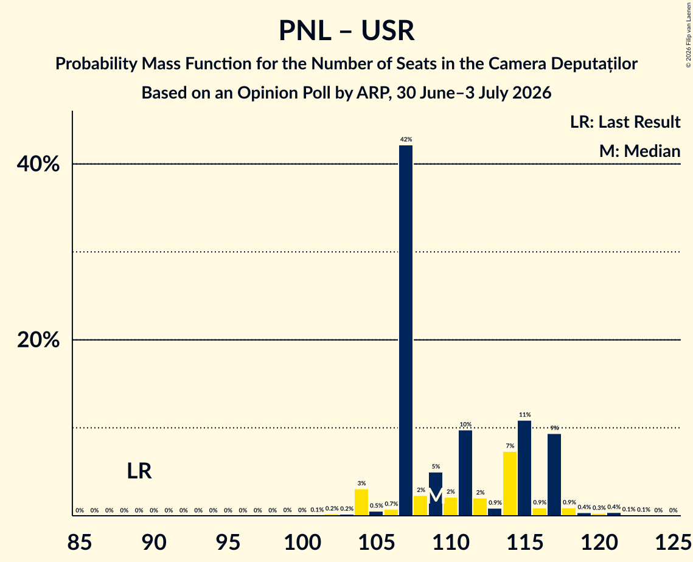

| Number of Seats | Probability | Accumulated | Special Marks |
|:---------------:|:-----------:|:-----------:|:-------------:|
| 89 | 0% | 100% | Last Result |
| 90 | 0% | 100% |  |
| 91 | 0% | 100% |  |
| 92 | 0% | 100% |  |
| 93 | 0% | 100% |  |
| 94 | 0% | 100% |  |
| 95 | 0% | 100% |  |
| 96 | 0% | 100% |  |
| 97 | 0% | 100% |  |
| 98 | 0% | 100% |  |
| 99 | 0% | 100% |  |
| 100 | 0% | 100% |  |
| 101 | 0.1% | 99.9% |  |
| 102 | 0.2% | 99.9% |  |
| 103 | 0.2% | 99.6% |  |
| 104 | 3% | 99.4% |  |
| 105 | 0.5% | 96% |  |
| 106 | 0.7% | 96% |  |
| 107 | 42% | 95% |  |
| 108 | 2% | 53% |  |
| 109 | 5% | 51% | Median |
| 110 | 2% | 46% |  |
| 111 | 10% | 43% |  |
| 112 | 2% | 34% |  |
| 113 | 0.9% | 32% |  |
| 114 | 7% | 31% |  |
| 115 | 11% | 23% |  |
| 116 | 0.9% | 13% |  |
| 117 | 9% | 12% |  |
| 118 | 0.9% | 2% |  |
| 119 | 0.4% | 1.3% |  |
| 120 | 0.3% | 0.9% |  |
| 121 | 0.4% | 0.6% |  |
| 122 | 0.1% | 0.2% |  |
| 123 | 0.1% | 0.1% |  |
| 124 | 0% | 0% |  |

### Partidul Social Democrat – Uniunea Salvați România

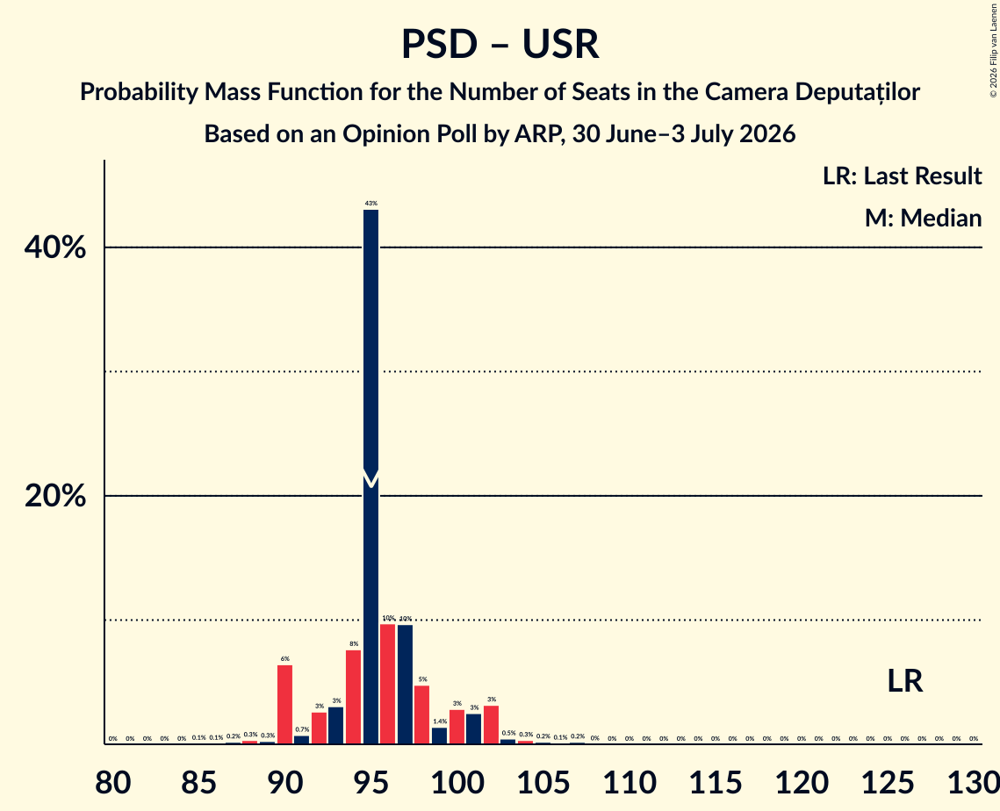

| Number of Seats | Probability | Accumulated | Special Marks |
|:---------------:|:-----------:|:-----------:|:-------------:|
| 85 | 0.1% | 100% |  |
| 86 | 0.1% | 99.9% |  |
| 87 | 0.2% | 99.8% |  |
| 88 | 0.3% | 99.6% |  |
| 89 | 0.3% | 99.3% |  |
| 90 | 6% | 99.0% |  |
| 91 | 0.7% | 93% |  |
| 92 | 3% | 92% |  |
| 93 | 3% | 89% |  |
| 94 | 8% | 86% |  |
| 95 | 43% | 79% | Median |
| 96 | 10% | 35% |  |
| 97 | 10% | 26% |  |
| 98 | 5% | 16% |  |
| 99 | 1.4% | 11% |  |
| 100 | 3% | 10% |  |
| 101 | 3% | 7% |  |
| 102 | 3% | 5% |  |
| 103 | 0.5% | 1.3% |  |
| 104 | 0.3% | 0.9% |  |
| 105 | 0.2% | 0.5% |  |
| 106 | 0.1% | 0.3% |  |
| 107 | 0.2% | 0.2% |  |
| 108 | 0% | 0.1% |  |
| 109 | 0% | 0% |  |
| 110 | 0% | 0% |  |
| 111 | 0% | 0% |  |
| 112 | 0% | 0% |  |
| 113 | 0% | 0% |  |
| 114 | 0% | 0% |  |
| 115 | 0% | 0% |  |
| 116 | 0% | 0% |  |
| 117 | 0% | 0% |  |
| 118 | 0% | 0% |  |
| 119 | 0% | 0% |  |
| 120 | 0% | 0% |  |
| 121 | 0% | 0% |  |
| 122 | 0% | 0% |  |
| 123 | 0% | 0% |  |
| 124 | 0% | 0% |  |
| 125 | 0% | 0% |  |
| 126 | 0% | 0% | Last Result |

### Partidul Național Liberal – Romániai Magyar Demokrata Szövetség

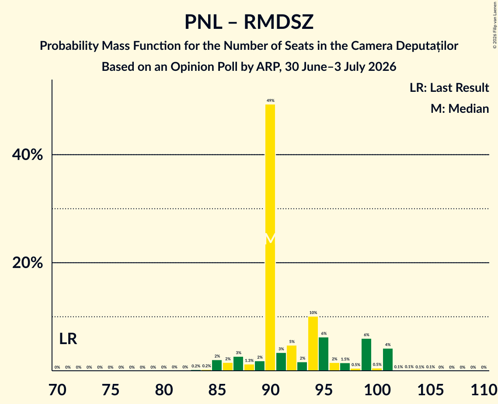

| Number of Seats | Probability | Accumulated | Special Marks |
|:---------------:|:-----------:|:-----------:|:-------------:|
| 71 | 0% | 100% | Last Result |
| 72 | 0% | 100% |  |
| 73 | 0% | 100% |  |
| 74 | 0% | 100% |  |
| 75 | 0% | 100% |  |
| 76 | 0% | 100% |  |
| 77 | 0% | 100% |  |
| 78 | 0% | 100% |  |
| 79 | 0% | 100% |  |
| 80 | 0% | 100% |  |
| 81 | 0% | 100% |  |
| 82 | 0% | 99.9% |  |
| 83 | 0.2% | 99.9% |  |
| 84 | 0.2% | 99.7% |  |
| 85 | 2% | 99.4% |  |
| 86 | 2% | 97% |  |
| 87 | 3% | 96% |  |
| 88 | 1.3% | 93% |  |
| 89 | 2% | 92% |  |
| 90 | 49% | 90% |  |
| 91 | 3% | 41% | Median |
| 92 | 5% | 37% |  |
| 93 | 2% | 33% |  |
| 94 | 10% | 31% |  |
| 95 | 6% | 21% |  |
| 96 | 2% | 15% |  |
| 97 | 1.5% | 13% |  |
| 98 | 0.5% | 11% |  |
| 99 | 6% | 11% |  |
| 100 | 0.5% | 5% |  |
| 101 | 4% | 4% |  |
| 102 | 0.1% | 0.3% |  |
| 103 | 0.1% | 0.2% |  |
| 104 | 0.1% | 0.1% |  |
| 105 | 0.1% | 0.1% |  |
| 106 | 0% | 0% |  |

### Partidul Național Liberal

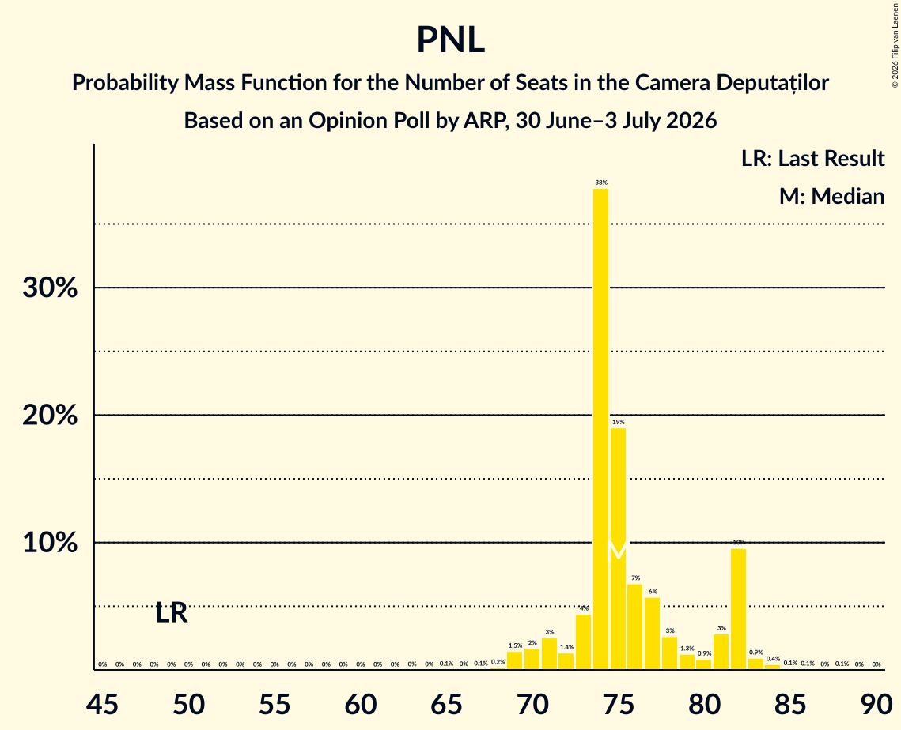

| Number of Seats | Probability | Accumulated | Special Marks |
|:---------------:|:-----------:|:-----------:|:-------------:|
| 49 | 0% | 100% | Last Result |
| 50 | 0% | 100% |  |
| 51 | 0% | 100% |  |
| 52 | 0% | 100% |  |
| 53 | 0% | 100% |  |
| 54 | 0% | 100% |  |
| 55 | 0% | 100% |  |
| 56 | 0% | 100% |  |
| 57 | 0% | 100% |  |
| 58 | 0% | 100% |  |
| 59 | 0% | 100% |  |
| 60 | 0% | 100% |  |
| 61 | 0% | 100% |  |
| 62 | 0% | 100% |  |
| 63 | 0% | 100% |  |
| 64 | 0% | 100% |  |
| 65 | 0.1% | 100% |  |
| 66 | 0% | 99.9% |  |
| 67 | 0.1% | 99.9% |  |
| 68 | 0.2% | 99.8% |  |
| 69 | 1.5% | 99.6% |  |
| 70 | 2% | 98% |  |
| 71 | 3% | 96% |  |
| 72 | 1.4% | 94% |  |
| 73 | 4% | 93% |  |
| 74 | 38% | 88% |  |
| 75 | 19% | 50% | Median |
| 76 | 7% | 31% |  |
| 77 | 6% | 25% |  |
| 78 | 3% | 19% |  |
| 79 | 1.3% | 16% |  |
| 80 | 0.9% | 15% |  |
| 81 | 3% | 14% |  |
| 82 | 10% | 11% |  |
| 83 | 0.9% | 2% |  |
| 84 | 0.4% | 0.7% |  |
| 85 | 0.1% | 0.3% |  |
| 86 | 0.1% | 0.1% |  |
| 87 | 0% | 0.1% |  |
| 88 | 0.1% | 0.1% |  |
| 89 | 0% | 0% |  |

### Partidul Social Democrat

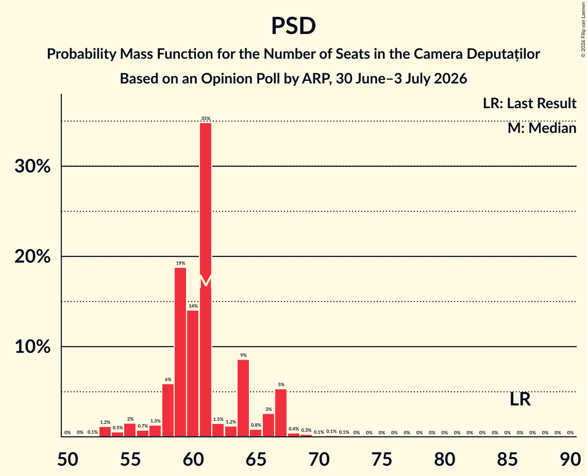

| Number of Seats | Probability | Accumulated | Special Marks |
|:---------------:|:-----------:|:-----------:|:-------------:|
| 52 | 0.1% | 100% |  |
| 53 | 0.3% | 99.9% |  |
| 54 | 0.4% | 99.5% |  |
| 55 | 1.2% | 99.1% |  |
| 56 | 1.4% | 98% |  |
| 57 | 12% | 96% |  |
| 58 | 2% | 85% |  |
| 59 | 17% | 83% |  |
| 60 | 6% | 66% |  |
| 61 | 10% | 59% | Median |
| 62 | 36% | 49% |  |
| 63 | 2% | 13% |  |
| 64 | 3% | 11% |  |
| 65 | 2% | 7% |  |
| 66 | 3% | 5% |  |
| 67 | 2% | 2% |  |
| 68 | 0.3% | 0.7% |  |
| 69 | 0.2% | 0.4% |  |
| 70 | 0.1% | 0.2% |  |
| 71 | 0.1% | 0.1% |  |
| 72 | 0% | 0% |  |
| 73 | 0% | 0% |  |
| 74 | 0% | 0% |  |
| 75 | 0% | 0% |  |
| 76 | 0% | 0% |  |
| 77 | 0% | 0% |  |
| 78 | 0% | 0% |  |
| 79 | 0% | 0% |  |
| 80 | 0% | 0% |  |
| 81 | 0% | 0% |  |
| 82 | 0% | 0% |  |
| 83 | 0% | 0% |  |
| 84 | 0% | 0% |  |
| 85 | 0% | 0% |  |
| 86 | 0% | 0% | Last Result |

## Technical Information

### Opinion Poll

+ **Polling firm:** ARP
+ **Commissioner(s):** —
+ **Fieldwork period:** 30 June–3 July 2026

### Calculations

+ **Sample size:** 1774
+ **Simulations done:** 2,097,152
+ **Error estimate:** 3.41%

