# Opinion Poll by INSCOP for Informat.ro, 1–7 September 2026

<a href="#voting-intentions">Voting Intentions</a> | <a href="#seats">Seats</a> | <a href="#coalitions">Coalitions</a> | <a href="#technical-information">Technical Information</a>

## Voting Intentions

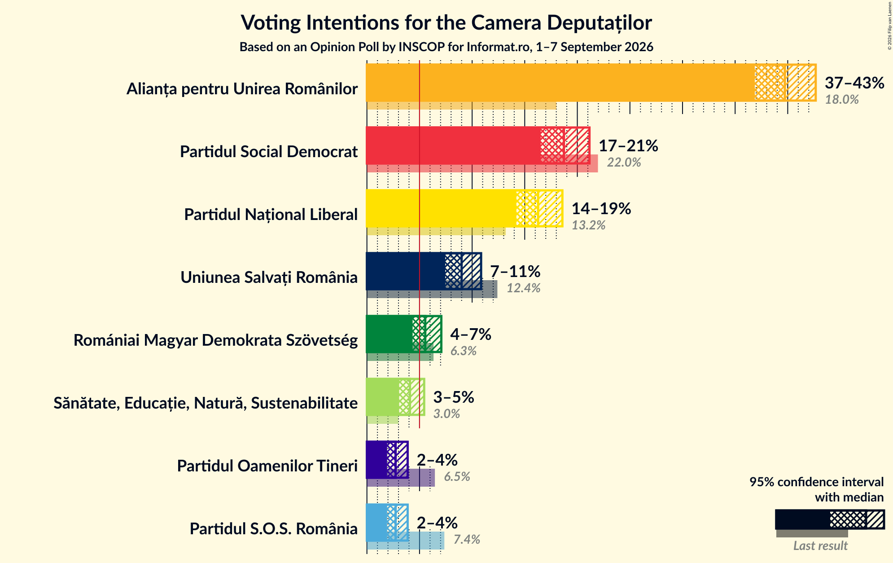

### Confidence Intervals

| Party | Last Result | Poll Result | 80% Confidence Interval | 90% Confidence Interval | 95% Confidence Interval | 99% Confidence Interval |
|:-----:|:-----------:|:-----------:|:-----------------------:|:-----------------------:|:-----------------------:|:-----------------------:|
| Alianța pentru Unirea Românilor | 18.0% | 39.7% | 37.9–41.6% |37.3–42.2% |36.9–42.7% |36.0–43.6% |
| Partidul Social Democrat | 22.0% | 18.7% | 17.3–20.3% |16.9–20.8% |16.5–21.2% |15.9–21.9% |
| Partidul Național Liberal | 13.2% | 16.3% | 14.9–17.8% |14.5–18.2% |14.2–18.6% |13.6–19.3% |
| Uniunea Salvați România | 12.4% | 9.0% | 8.0–10.2% |7.7–10.5% |7.4–10.9% |7.0–11.4% |
| Romániai Magyar Demokrata Szövetség | 6.3% | 5.5% | 4.8–6.5% |4.5–6.8% |4.3–7.1% |4.0–7.6% |
| Sănătate, Educație, Natură, Sustenabilitate | 3.0% | 4.1% | 3.4–5.0% |3.2–5.2% |3.1–5.4% |2.8–5.9% |
| Partidul S.O.S. România | 7.4% | 2.7% | 2.2–3.5% |2.0–3.7% |1.9–3.9% |1.7–4.3% |
| Partidul Oamenilor Tineri | 6.5% | 2.7% | 2.2–3.5% |2.0–3.7% |1.9–3.9% |1.7–4.3% |

*Note:* The poll result column reflects the actual value used in the calculations. Published results may vary slightly, and in addition be rounded to fewer digits.

## Seats

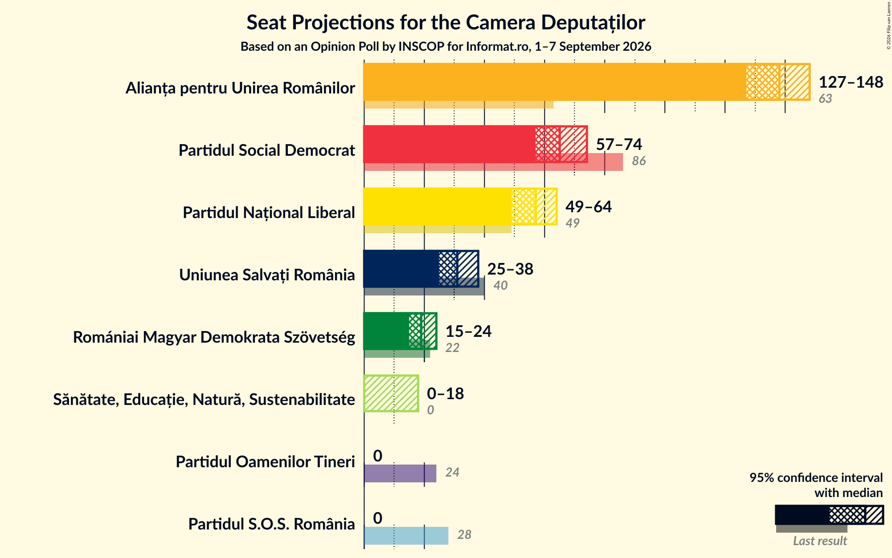

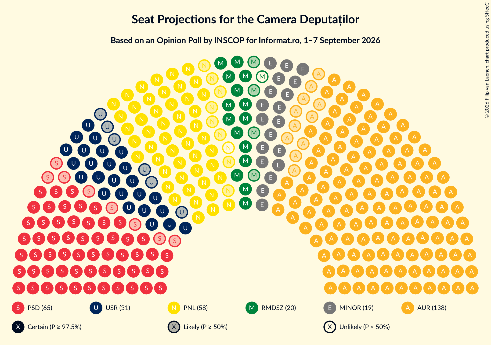

### Confidence Intervals

| Party | Last Result | Median | 80% Confidence Interval | 90% Confidence Interval | 95% Confidence Interval | 99% Confidence Interval |
|:-----:|:-----------:|:------:|:-----------------------:|:-----------------------:|:-----------------------:|:-----------------------:|
| <a href="#alianța-pentru-unirea-românilor">Alianța pentru Unirea Românilor</a> | 63 | 138 | 131–146 |130–147 |127–148 |123–152 |
| <a href="#partidul-social-democrat">Partidul Social Democrat</a> | 86 | 65 | 60–71 |58–72 |57–74 |54–76 |
| <a href="#partidul-național-liberal">Partidul Național Liberal</a> | 49 | 57 | 51–62 |50–63 |49–64 |47–67 |
| <a href="#uniunea-salvați-românia">Uniunea Salvați România</a> | 40 | 31 | 27–36 |26–37 |25–38 |24–40 |
| <a href="#romániai-magyar-demokrata-szövetség">Romániai Magyar Demokrata Szövetség</a> | 22 | 19 | 16–22 |15–23 |15–24 |13–26 |
| <a href="#sănătate,-educație,-natură,-sustenabilitate">Sănătate, Educație, Natură, Sustenabilitate</a> | 0 | 0 | 0 |0–17 |0–18 |0–19 |
| <a href="#partidul-s.o.s.-românia">Partidul S.O.S. România</a> | 28 | 0 | 0 |0 |0 |0 |
| <a href="#partidul-oamenilor-tineri">Partidul Oamenilor Tineri</a> | 24 | 0 | 0 |0 |0 |0 |

### Alianța pentru Unirea Românilor

*For a full overview of the results for this party, see the [Alianța pentru Unirea Românilor](party-alianțapentruunirearomânilor.html) page.*

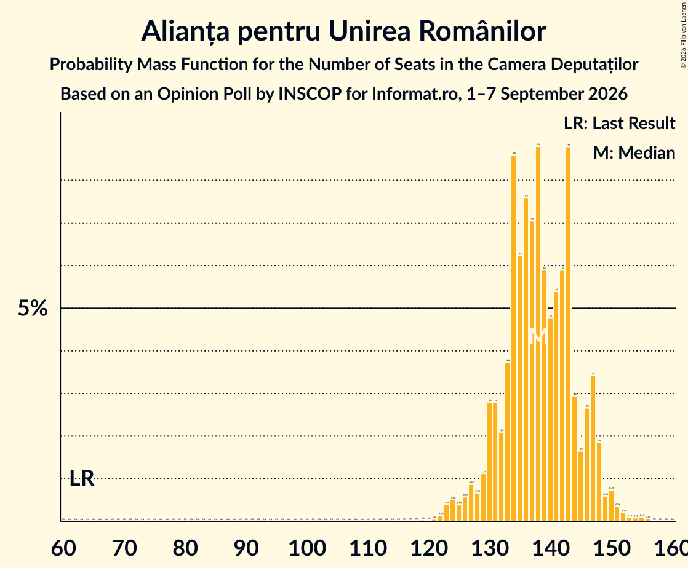

| Number of Seats | Probability | Accumulated | Special Marks |
|:---------------:|:-----------:|:-----------:|:-------------:|
| 63 | 0% | 100% | Last Result |
| 64 | 0% | 100% |  |
| 65 | 0% | 100% |  |
| 66 | 0% | 100% |  |
| 67 | 0% | 100% |  |
| 68 | 0% | 100% |  |
| 69 | 0% | 100% |  |
| 70 | 0% | 100% |  |
| 71 | 0% | 100% |  |
| 72 | 0% | 100% |  |
| 73 | 0% | 100% |  |
| 74 | 0% | 100% |  |
| 75 | 0% | 100% |  |
| 76 | 0% | 100% |  |
| 77 | 0% | 100% |  |
| 78 | 0% | 100% |  |
| 79 | 0% | 100% |  |
| 80 | 0% | 100% |  |
| 81 | 0% | 100% |  |
| 82 | 0% | 100% |  |
| 83 | 0% | 100% |  |
| 84 | 0% | 100% |  |
| 85 | 0% | 100% |  |
| 86 | 0% | 100% |  |
| 87 | 0% | 100% |  |
| 88 | 0% | 100% |  |
| 89 | 0% | 100% |  |
| 90 | 0% | 100% |  |
| 91 | 0% | 100% |  |
| 92 | 0% | 100% |  |
| 93 | 0% | 100% |  |
| 94 | 0% | 100% |  |
| 95 | 0% | 100% |  |
| 96 | 0% | 100% |  |
| 97 | 0% | 100% |  |
| 98 | 0% | 100% |  |
| 99 | 0% | 100% |  |
| 100 | 0% | 100% |  |
| 101 | 0% | 100% |  |
| 102 | 0% | 100% |  |
| 103 | 0% | 100% |  |
| 104 | 0% | 100% |  |
| 105 | 0% | 100% |  |
| 106 | 0% | 100% |  |
| 107 | 0% | 100% |  |
| 108 | 0% | 100% |  |
| 109 | 0% | 100% |  |
| 110 | 0% | 100% |  |
| 111 | 0% | 100% |  |
| 112 | 0% | 100% |  |
| 113 | 0% | 100% |  |
| 114 | 0% | 100% |  |
| 115 | 0% | 100% |  |
| 116 | 0% | 100% |  |
| 117 | 0% | 100% |  |
| 118 | 0% | 100% |  |
| 119 | 0% | 100% |  |
| 120 | 0% | 99.9% |  |
| 121 | 0% | 99.9% |  |
| 122 | 0.1% | 99.9% |  |
| 123 | 0.4% | 99.7% |  |
| 124 | 0.5% | 99.3% |  |
| 125 | 0.4% | 98.8% |  |
| 126 | 0.6% | 98% |  |
| 127 | 0.9% | 98% |  |
| 128 | 0.7% | 97% |  |
| 129 | 1.1% | 96% |  |
| 130 | 3% | 95% |  |
| 131 | 3% | 92% |  |
| 132 | 2% | 90% |  |
| 133 | 4% | 88% |  |
| 134 | 9% | 84% |  |
| 135 | 6% | 75% |  |
| 136 | 8% | 69% |  |
| 137 | 7% | 61% |  |
| 138 | 9% | 54% | Median |
| 139 | 6% | 45% |  |
| 140 | 5% | 40% |  |
| 141 | 5% | 35% |  |
| 142 | 6% | 29% |  |
| 143 | 9% | 24% |  |
| 144 | 3% | 15% |  |
| 145 | 2% | 12% |  |
| 146 | 3% | 10% |  |
| 147 | 3% | 8% |  |
| 148 | 2% | 4% |  |
| 149 | 0.6% | 2% |  |
| 150 | 0.7% | 2% |  |
| 151 | 0.3% | 0.9% |  |
| 152 | 0.2% | 0.6% |  |
| 153 | 0.1% | 0.4% |  |
| 154 | 0.1% | 0.3% |  |
| 155 | 0.1% | 0.2% |  |
| 156 | 0.1% | 0.1% |  |
| 157 | 0% | 0% |  |

### Partidul Social Democrat

*For a full overview of the results for this party, see the [Partidul Social Democrat](party-partidulsocialdemocrat.html) page.*

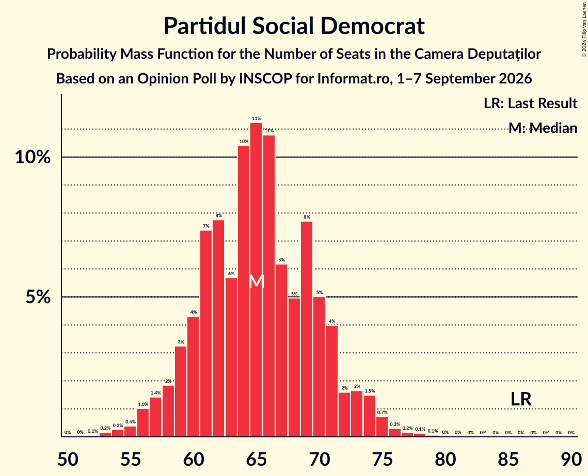

| Number of Seats | Probability | Accumulated | Special Marks |
|:---------------:|:-----------:|:-----------:|:-------------:|
| 52 | 0.1% | 100% |  |
| 53 | 0.2% | 99.9% |  |
| 54 | 0.3% | 99.7% |  |
| 55 | 0.4% | 99.5% |  |
| 56 | 1.0% | 99.1% |  |
| 57 | 1.4% | 98% |  |
| 58 | 2% | 97% |  |
| 59 | 3% | 95% |  |
| 60 | 4% | 92% |  |
| 61 | 7% | 87% |  |
| 62 | 8% | 80% |  |
| 63 | 6% | 72% |  |
| 64 | 10% | 66% |  |
| 65 | 11% | 56% | Median |
| 66 | 11% | 45% |  |
| 67 | 6% | 34% |  |
| 68 | 5% | 28% |  |
| 69 | 8% | 23% |  |
| 70 | 5% | 15% |  |
| 71 | 4% | 10% |  |
| 72 | 2% | 6% |  |
| 73 | 2% | 5% |  |
| 74 | 1.5% | 3% |  |
| 75 | 0.7% | 1.4% |  |
| 76 | 0.3% | 0.7% |  |
| 77 | 0.2% | 0.4% |  |
| 78 | 0.1% | 0.2% |  |
| 79 | 0.1% | 0.1% |  |
| 80 | 0% | 0% |  |
| 81 | 0% | 0% |  |
| 82 | 0% | 0% |  |
| 83 | 0% | 0% |  |
| 84 | 0% | 0% |  |
| 85 | 0% | 0% |  |
| 86 | 0% | 0% | Last Result |

### Partidul Național Liberal

*For a full overview of the results for this party, see the [Partidul Național Liberal](party-partidulnaționalliberal.html) page.*

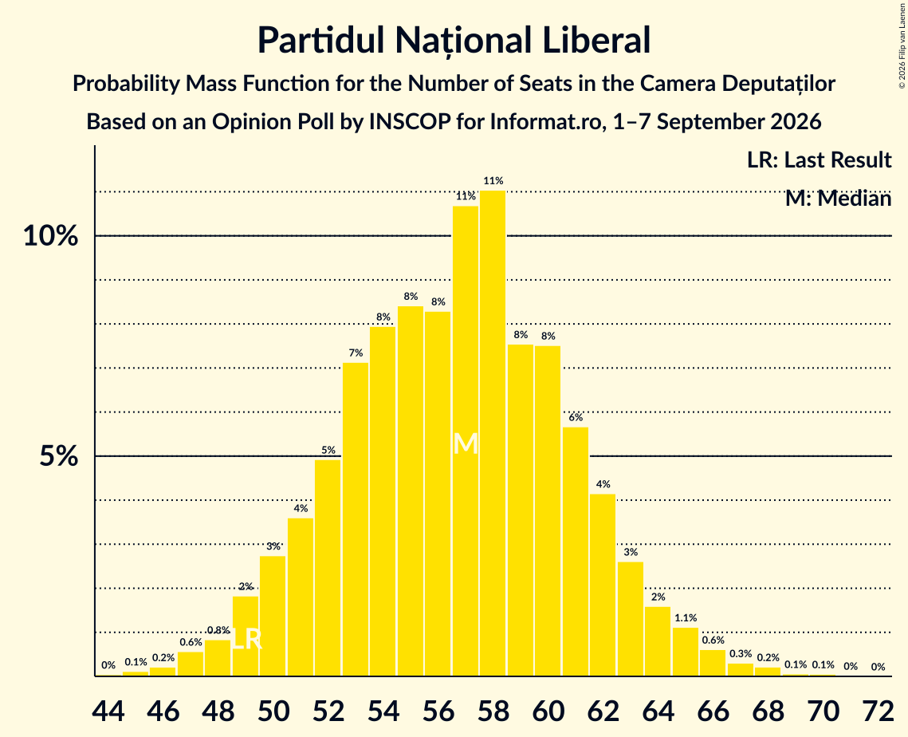

| Number of Seats | Probability | Accumulated | Special Marks |
|:---------------:|:-----------:|:-----------:|:-------------:|
| 44 | 0% | 100% |  |
| 45 | 0.1% | 99.9% |  |
| 46 | 0.2% | 99.8% |  |
| 47 | 0.6% | 99.6% |  |
| 48 | 0.8% | 99.0% |  |
| 49 | 2% | 98% | Last Result |
| 50 | 3% | 96% |  |
| 51 | 4% | 94% |  |
| 52 | 5% | 90% |  |
| 53 | 7% | 85% |  |
| 54 | 8% | 78% |  |
| 55 | 8% | 70% |  |
| 56 | 8% | 62% |  |
| 57 | 11% | 53% | Median |
| 58 | 11% | 43% |  |
| 59 | 8% | 32% |  |
| 60 | 8% | 24% |  |
| 61 | 6% | 16% |  |
| 62 | 4% | 11% |  |
| 63 | 3% | 7% |  |
| 64 | 2% | 4% |  |
| 65 | 1.1% | 2% |  |
| 66 | 0.6% | 1.3% |  |
| 67 | 0.3% | 0.7% |  |
| 68 | 0.2% | 0.4% |  |
| 69 | 0.1% | 0.2% |  |
| 70 | 0.1% | 0.1% |  |
| 71 | 0% | 0% |  |

### Uniunea Salvați România

*For a full overview of the results for this party, see the [Uniunea Salvați România](party-uniuneasalvațiromânia.html) page.*

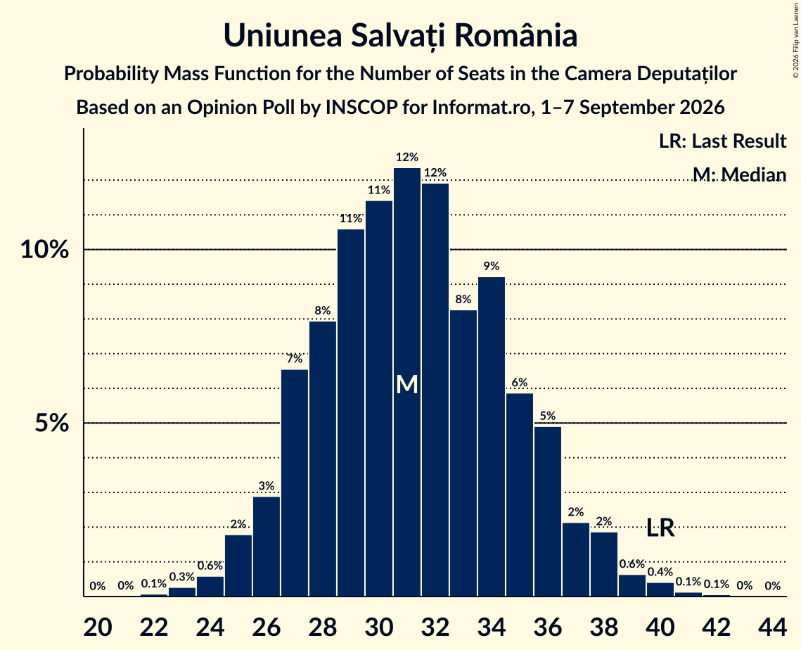

| Number of Seats | Probability | Accumulated | Special Marks |
|:---------------:|:-----------:|:-----------:|:-------------:|
| 22 | 0.1% | 100% |  |
| 23 | 0.3% | 99.9% |  |
| 24 | 0.6% | 99.6% |  |
| 25 | 2% | 99.0% |  |
| 26 | 3% | 97% |  |
| 27 | 7% | 94% |  |
| 28 | 8% | 88% |  |
| 29 | 11% | 80% |  |
| 30 | 11% | 69% |  |
| 31 | 12% | 58% | Median |
| 32 | 12% | 45% |  |
| 33 | 8% | 34% |  |
| 34 | 9% | 25% |  |
| 35 | 6% | 16% |  |
| 36 | 5% | 10% |  |
| 37 | 2% | 5% |  |
| 38 | 2% | 3% |  |
| 39 | 0.6% | 1.3% |  |
| 40 | 0.4% | 0.6% | Last Result |
| 41 | 0.1% | 0.2% |  |
| 42 | 0.1% | 0.1% |  |
| 43 | 0% | 0% |  |

### Romániai Magyar Demokrata Szövetség

*For a full overview of the results for this party, see the [Romániai Magyar Demokrata Szövetség](party-romániaimagyardemokrataszövetség.html) page.*

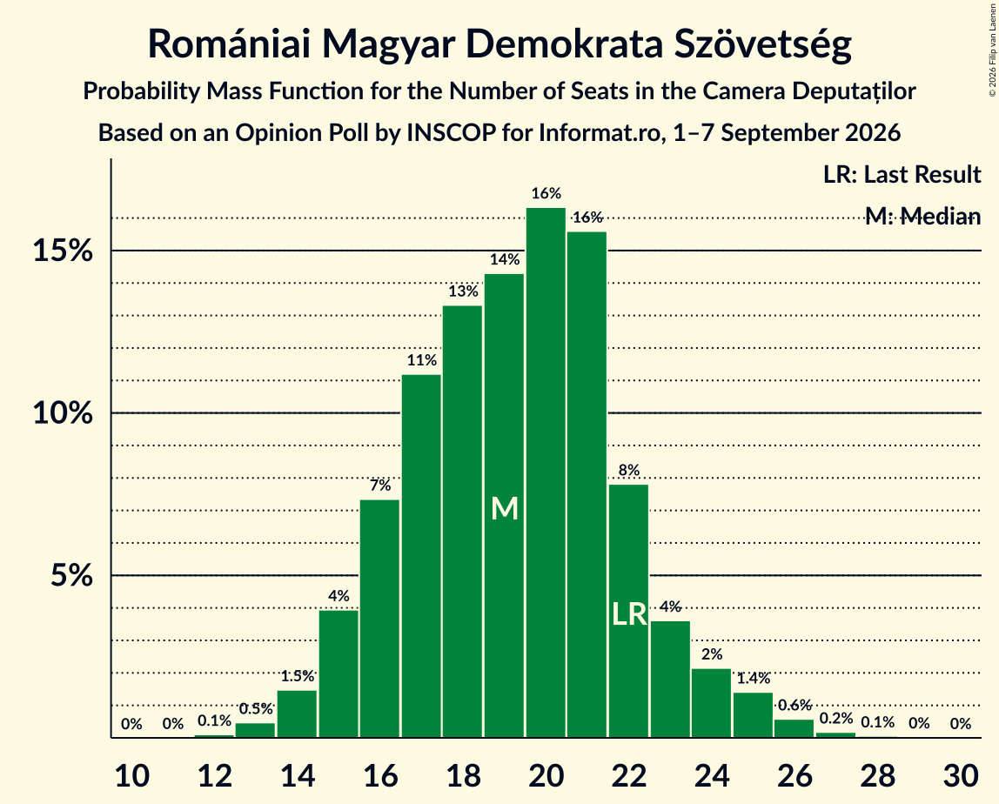

| Number of Seats | Probability | Accumulated | Special Marks |
|:---------------:|:-----------:|:-----------:|:-------------:|
| 12 | 0.1% | 100% |  |
| 13 | 0.5% | 99.9% |  |
| 14 | 1.5% | 99.4% |  |
| 15 | 4% | 98% |  |
| 16 | 7% | 94% |  |
| 17 | 11% | 87% |  |
| 18 | 13% | 75% |  |
| 19 | 14% | 62% | Median |
| 20 | 16% | 48% |  |
| 21 | 16% | 31% |  |
| 22 | 8% | 16% | Last Result |
| 23 | 4% | 8% |  |
| 24 | 2% | 4% |  |
| 25 | 1.4% | 2% |  |
| 26 | 0.6% | 0.9% |  |
| 27 | 0.2% | 0.3% |  |
| 28 | 0.1% | 0.1% |  |
| 29 | 0% | 0% |  |

### Sănătate, Educație, Natură, Sustenabilitate

*For a full overview of the results for this party, see the [Sănătate, Educație, Natură, Sustenabilitate](party-sănătateeducațienaturăsustenabilitate.html) page.*

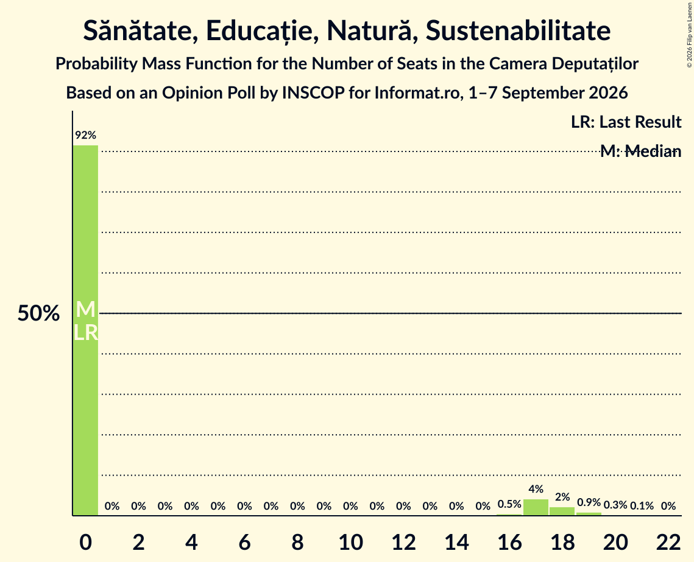

| Number of Seats | Probability | Accumulated | Special Marks |
|:---------------:|:-----------:|:-----------:|:-------------:|
| 0 | 92% | 100% | Last Result, Median |
| 1 | 0% | 8% |  |
| 2 | 0% | 8% |  |
| 3 | 0% | 8% |  |
| 4 | 0% | 8% |  |
| 5 | 0% | 8% |  |
| 6 | 0% | 8% |  |
| 7 | 0% | 8% |  |
| 8 | 0% | 8% |  |
| 9 | 0% | 8% |  |
| 10 | 0% | 8% |  |
| 11 | 0% | 8% |  |
| 12 | 0% | 8% |  |
| 13 | 0% | 8% |  |
| 14 | 0% | 8% |  |
| 15 | 0% | 8% |  |
| 16 | 0.5% | 8% |  |
| 17 | 4% | 8% |  |
| 18 | 2% | 4% |  |
| 19 | 0.9% | 1.4% |  |
| 20 | 0.3% | 0.4% |  |
| 21 | 0.1% | 0.1% |  |
| 22 | 0% | 0% |  |

### Partidul S.O.S. România

*For a full overview of the results for this party, see the [Partidul S.O.S. România](party-partidulsosromânia.html) page.*

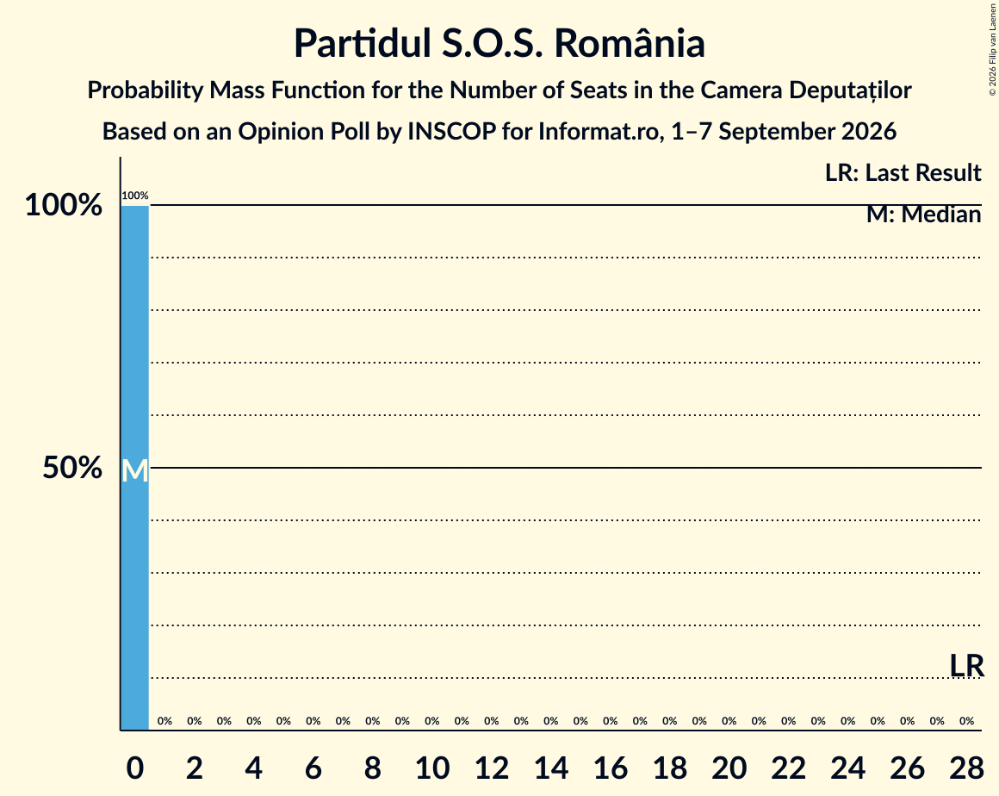

| Number of Seats | Probability | Accumulated | Special Marks |
|:---------------:|:-----------:|:-----------:|:-------------:|
| 0 | 100% | 100% | Median |
| 1 | 0% | 0% |  |
| 2 | 0% | 0% |  |
| 3 | 0% | 0% |  |
| 4 | 0% | 0% |  |
| 5 | 0% | 0% |  |
| 6 | 0% | 0% |  |
| 7 | 0% | 0% |  |
| 8 | 0% | 0% |  |
| 9 | 0% | 0% |  |
| 10 | 0% | 0% |  |
| 11 | 0% | 0% |  |
| 12 | 0% | 0% |  |
| 13 | 0% | 0% |  |
| 14 | 0% | 0% |  |
| 15 | 0% | 0% |  |
| 16 | 0% | 0% |  |
| 17 | 0% | 0% |  |
| 18 | 0% | 0% |  |
| 19 | 0% | 0% |  |
| 20 | 0% | 0% |  |
| 21 | 0% | 0% |  |
| 22 | 0% | 0% |  |
| 23 | 0% | 0% |  |
| 24 | 0% | 0% |  |
| 25 | 0% | 0% |  |
| 26 | 0% | 0% |  |
| 27 | 0% | 0% |  |
| 28 | 0% | 0% | Last Result |

### Partidul Oamenilor Tineri

*For a full overview of the results for this party, see the [Partidul Oamenilor Tineri](party-partiduloamenilortineri.html) page.*

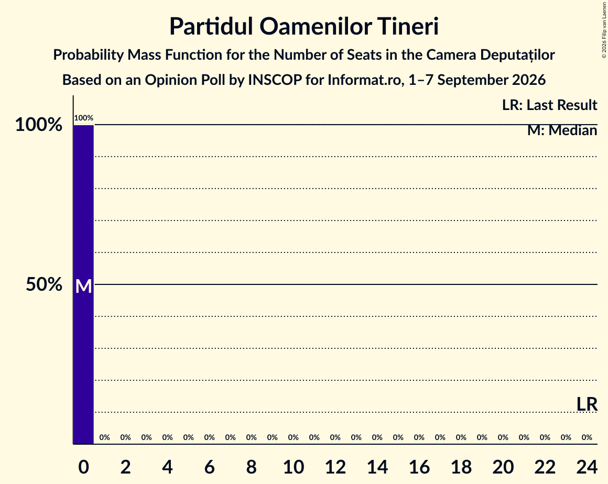

| Number of Seats | Probability | Accumulated | Special Marks |
|:---------------:|:-----------:|:-----------:|:-------------:|
| 0 | 100% | 100% | Median |
| 1 | 0% | 0% |  |
| 2 | 0% | 0% |  |
| 3 | 0% | 0% |  |
| 4 | 0% | 0% |  |
| 5 | 0% | 0% |  |
| 6 | 0% | 0% |  |
| 7 | 0% | 0% |  |
| 8 | 0% | 0% |  |
| 9 | 0% | 0% |  |
| 10 | 0% | 0% |  |
| 11 | 0% | 0% |  |
| 12 | 0% | 0% |  |
| 13 | 0% | 0% |  |
| 14 | 0% | 0% |  |
| 15 | 0% | 0% |  |
| 16 | 0% | 0% |  |
| 17 | 0% | 0% |  |
| 18 | 0% | 0% |  |
| 19 | 0% | 0% |  |
| 20 | 0% | 0% |  |
| 21 | 0% | 0% |  |
| 22 | 0% | 0% |  |
| 23 | 0% | 0% |  |
| 24 | 0% | 0% | Last Result |

## Coalitions

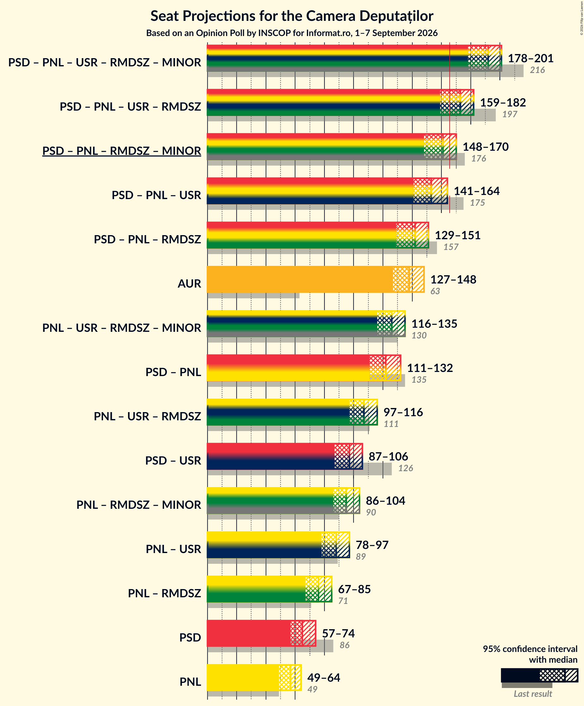

### Confidence Intervals

| Coalition | Last Result | Median | Majority? | 80% Confidence Interval | 90% Confidence Interval | 95% Confidence Interval | 99% Confidence Interval |
|:---------:|:-----------:|:------:|:---------:|:-----------------------:|:-----------------------:|:-----------------------:|:-----------------------:|
| Partidul Social Democrat – Partidul Național Liberal – Uniunea Salvați România – Romániai Magyar Demokrata Szövetség | 197 | 173 | 87% | 165–179 | 162–181 | 159–182 | 155–186 |
| Partidul Social Democrat – Partidul Național Liberal – Uniunea Salvați România | 175 | 153 | 0.8% | 146–160 | 143–162 | 141–164 | 137–166 |
| Partidul Social Democrat – Partidul Național Liberal – Romániai Magyar Demokrata Szövetség | 157 | 142 | 0% | 134–148 | 132–150 | 129–151 | 126–154 |
| Alianța pentru Unirea Românilor | 63 | 138 | 0% | 131–146 | 130–147 | 127–148 | 123–152 |
| Partidul Social Democrat – Partidul Național Liberal | 135 | 122 | 0% | 115–128 | 113–130 | 111–132 | 107–135 |
| Partidul Național Liberal – Uniunea Salvați România – Romániai Magyar Demokrata Szövetség | 111 | 107 | 0% | 100–114 | 98–115 | 97–116 | 94–120 |
| Partidul Social Democrat – Uniunea Salvați România | 126 | 97 | 0% | 90–103 | 88–105 | 87–106 | 84–109 |
| Partidul Național Liberal – Uniunea Salvați România | 89 | 88 | 0% | 81–94 | 80–95 | 78–97 | 76–100 |
| Partidul Național Liberal – Romániai Magyar Demokrata Szövetség | 71 | 76 | 0% | 70–82 | 68–83 | 67–85 | 64–87 |
| Partidul Social Democrat | 86 | 65 | 0% | 60–71 | 58–72 | 57–74 | 54–76 |
| Partidul Național Liberal | 49 | 57 | 0% | 51–62 | 50–63 | 49–64 | 47–67 |

### Partidul Social Democrat – Partidul Național Liberal – Uniunea Salvați România – Romániai Magyar Demokrata Szövetség

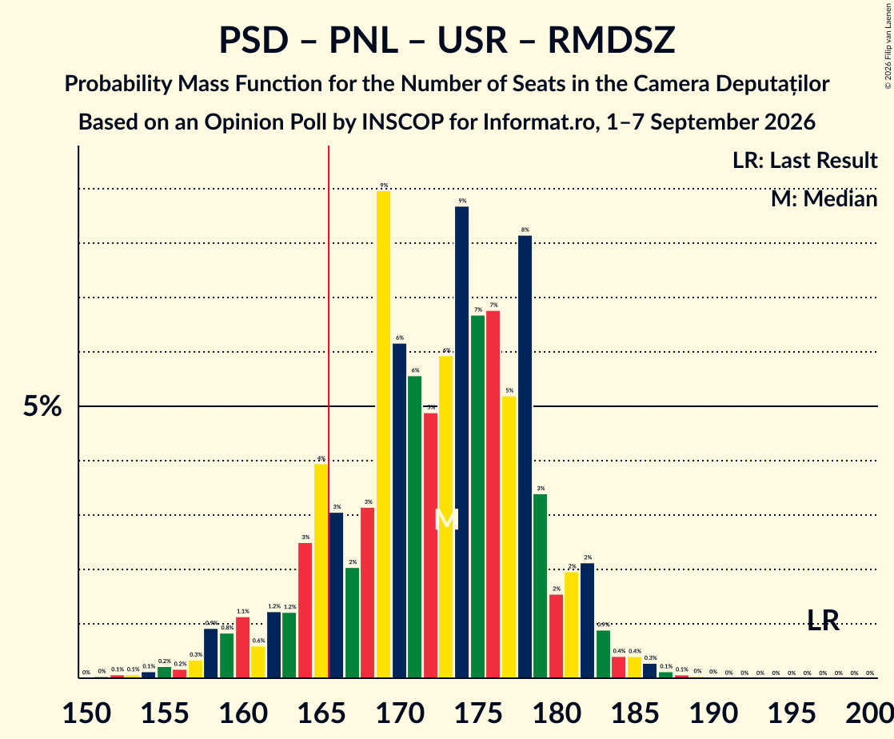

| Number of Seats | Probability | Accumulated | Special Marks |
|:---------------:|:-----------:|:-----------:|:-------------:|
| 151 | 0% | 100% |  |
| 152 | 0.1% | 99.9% |  |
| 153 | 0.1% | 99.9% |  |
| 154 | 0.1% | 99.8% |  |
| 155 | 0.2% | 99.7% |  |
| 156 | 0.2% | 99.5% |  |
| 157 | 0.3% | 99.3% |  |
| 158 | 0.9% | 98.9% |  |
| 159 | 0.8% | 98% |  |
| 160 | 1.1% | 97% |  |
| 161 | 0.6% | 96% |  |
| 162 | 1.2% | 95% |  |
| 163 | 1.2% | 94% |  |
| 164 | 3% | 93% |  |
| 165 | 4% | 91% |  |
| 166 | 3% | 87% | Majority |
| 167 | 2% | 83% |  |
| 168 | 3% | 81% |  |
| 169 | 9% | 78% |  |
| 170 | 6% | 69% |  |
| 171 | 6% | 63% |  |
| 172 | 5% | 58% | Median |
| 173 | 6% | 53% |  |
| 174 | 9% | 47% |  |
| 175 | 7% | 38% |  |
| 176 | 7% | 31% |  |
| 177 | 5% | 25% |  |
| 178 | 8% | 19% |  |
| 179 | 3% | 11% |  |
| 180 | 2% | 8% |  |
| 181 | 2% | 6% |  |
| 182 | 2% | 4% |  |
| 183 | 0.9% | 2% |  |
| 184 | 0.4% | 1.4% |  |
| 185 | 0.4% | 1.0% |  |
| 186 | 0.3% | 0.6% |  |
| 187 | 0.1% | 0.3% |  |
| 188 | 0.1% | 0.1% |  |
| 189 | 0% | 0.1% |  |
| 190 | 0% | 0% |  |
| 191 | 0% | 0% |  |
| 192 | 0% | 0% |  |
| 193 | 0% | 0% |  |
| 194 | 0% | 0% |  |
| 195 | 0% | 0% |  |
| 196 | 0% | 0% |  |
| 197 | 0% | 0% | Last Result |

### Partidul Social Democrat – Partidul Național Liberal – Uniunea Salvați România

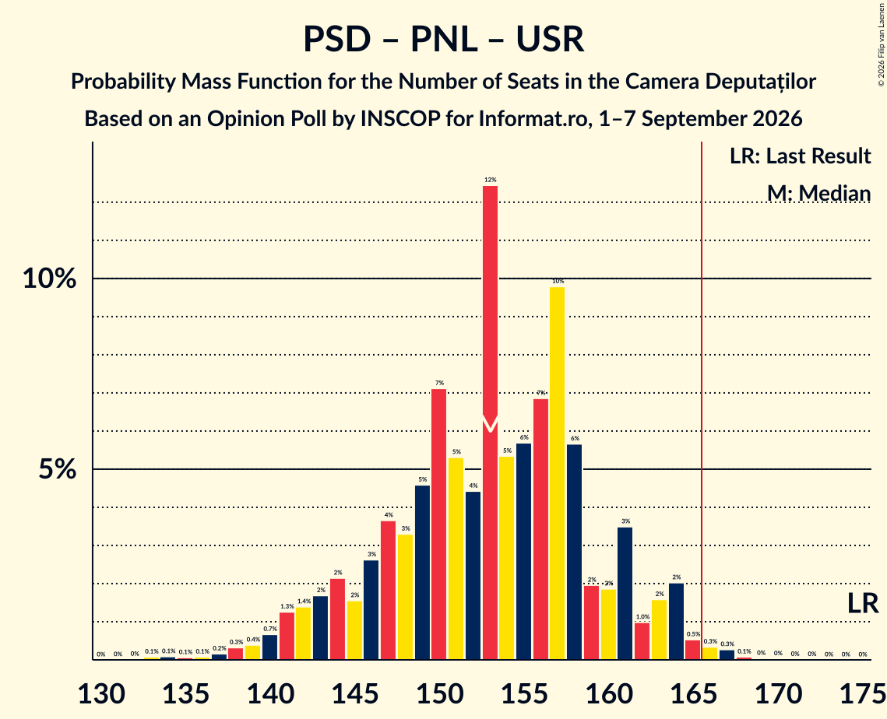

| Number of Seats | Probability | Accumulated | Special Marks |
|:---------------:|:-----------:|:-----------:|:-------------:|
| 133 | 0.1% | 100% |  |
| 134 | 0.1% | 99.9% |  |
| 135 | 0.1% | 99.8% |  |
| 136 | 0.1% | 99.7% |  |
| 137 | 0.2% | 99.7% |  |
| 138 | 0.3% | 99.5% |  |
| 139 | 0.4% | 99.2% |  |
| 140 | 0.7% | 98.8% |  |
| 141 | 1.3% | 98% |  |
| 142 | 1.4% | 97% |  |
| 143 | 2% | 95% |  |
| 144 | 2% | 94% |  |
| 145 | 2% | 92% |  |
| 146 | 3% | 90% |  |
| 147 | 4% | 87% |  |
| 148 | 3% | 84% |  |
| 149 | 5% | 80% |  |
| 150 | 7% | 76% |  |
| 151 | 5% | 69% |  |
| 152 | 4% | 63% |  |
| 153 | 12% | 59% | Median |
| 154 | 5% | 47% |  |
| 155 | 6% | 41% |  |
| 156 | 7% | 36% |  |
| 157 | 10% | 29% |  |
| 158 | 6% | 19% |  |
| 159 | 2% | 13% |  |
| 160 | 2% | 11% |  |
| 161 | 3% | 9% |  |
| 162 | 1.0% | 6% |  |
| 163 | 2% | 5% |  |
| 164 | 2% | 3% |  |
| 165 | 0.5% | 1.3% |  |
| 166 | 0.3% | 0.8% | Majority |
| 167 | 0.3% | 0.5% |  |
| 168 | 0.1% | 0.2% |  |
| 169 | 0% | 0.1% |  |
| 170 | 0% | 0.1% |  |
| 171 | 0% | 0% |  |
| 172 | 0% | 0% |  |
| 173 | 0% | 0% |  |
| 174 | 0% | 0% |  |
| 175 | 0% | 0% | Last Result |

### Partidul Social Democrat – Partidul Național Liberal – Romániai Magyar Demokrata Szövetség

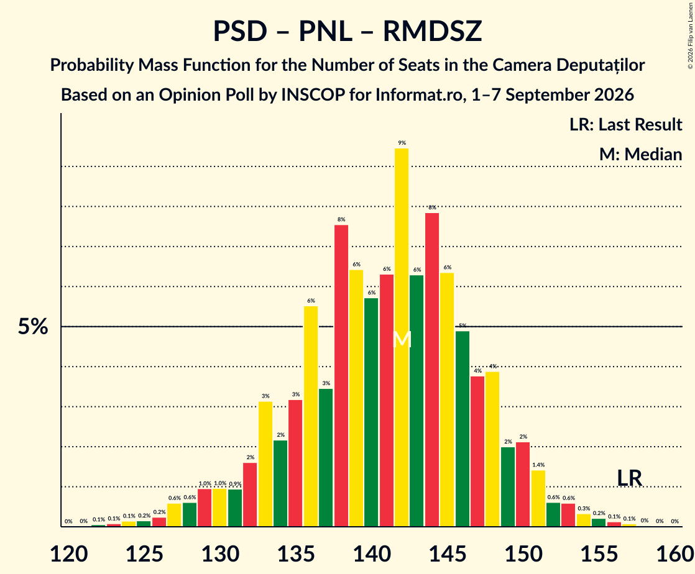

| Number of Seats | Probability | Accumulated | Special Marks |
|:---------------:|:-----------:|:-----------:|:-------------:|
| 122 | 0.1% | 100% |  |
| 123 | 0.1% | 99.9% |  |
| 124 | 0.1% | 99.8% |  |
| 125 | 0.2% | 99.7% |  |
| 126 | 0.2% | 99.5% |  |
| 127 | 0.6% | 99.3% |  |
| 128 | 0.6% | 98.7% |  |
| 129 | 1.0% | 98% |  |
| 130 | 1.0% | 97% |  |
| 131 | 0.9% | 96% |  |
| 132 | 2% | 95% |  |
| 133 | 3% | 94% |  |
| 134 | 2% | 90% |  |
| 135 | 3% | 88% |  |
| 136 | 6% | 85% |  |
| 137 | 3% | 80% |  |
| 138 | 8% | 76% |  |
| 139 | 6% | 69% |  |
| 140 | 6% | 62% |  |
| 141 | 6% | 56% | Median |
| 142 | 9% | 50% |  |
| 143 | 6% | 41% |  |
| 144 | 8% | 34% |  |
| 145 | 6% | 26% |  |
| 146 | 5% | 20% |  |
| 147 | 4% | 15% |  |
| 148 | 4% | 11% |  |
| 149 | 2% | 8% |  |
| 150 | 2% | 6% |  |
| 151 | 1.4% | 3% |  |
| 152 | 0.6% | 2% |  |
| 153 | 0.6% | 1.4% |  |
| 154 | 0.3% | 0.8% |  |
| 155 | 0.2% | 0.5% |  |
| 156 | 0.1% | 0.3% |  |
| 157 | 0.1% | 0.1% | Last Result |
| 158 | 0% | 0.1% |  |
| 159 | 0% | 0% |  |

### Alianța pentru Unirea Românilor

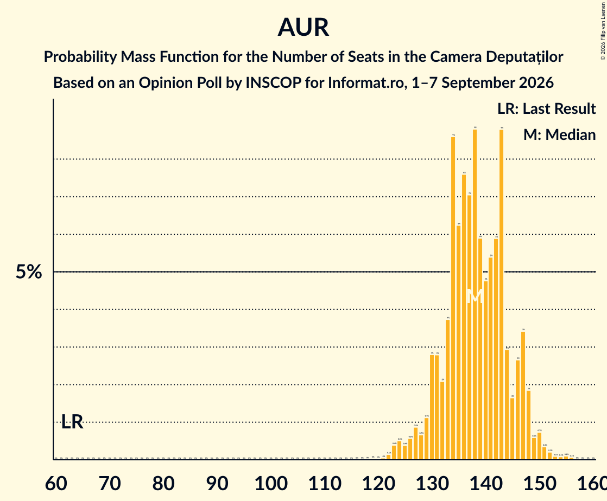

| Number of Seats | Probability | Accumulated | Special Marks |
|:---------------:|:-----------:|:-----------:|:-------------:|
| 63 | 0% | 100% | Last Result |
| 64 | 0% | 100% |  |
| 65 | 0% | 100% |  |
| 66 | 0% | 100% |  |
| 67 | 0% | 100% |  |
| 68 | 0% | 100% |  |
| 69 | 0% | 100% |  |
| 70 | 0% | 100% |  |
| 71 | 0% | 100% |  |
| 72 | 0% | 100% |  |
| 73 | 0% | 100% |  |
| 74 | 0% | 100% |  |
| 75 | 0% | 100% |  |
| 76 | 0% | 100% |  |
| 77 | 0% | 100% |  |
| 78 | 0% | 100% |  |
| 79 | 0% | 100% |  |
| 80 | 0% | 100% |  |
| 81 | 0% | 100% |  |
| 82 | 0% | 100% |  |
| 83 | 0% | 100% |  |
| 84 | 0% | 100% |  |
| 85 | 0% | 100% |  |
| 86 | 0% | 100% |  |
| 87 | 0% | 100% |  |
| 88 | 0% | 100% |  |
| 89 | 0% | 100% |  |
| 90 | 0% | 100% |  |
| 91 | 0% | 100% |  |
| 92 | 0% | 100% |  |
| 93 | 0% | 100% |  |
| 94 | 0% | 100% |  |
| 95 | 0% | 100% |  |
| 96 | 0% | 100% |  |
| 97 | 0% | 100% |  |
| 98 | 0% | 100% |  |
| 99 | 0% | 100% |  |
| 100 | 0% | 100% |  |
| 101 | 0% | 100% |  |
| 102 | 0% | 100% |  |
| 103 | 0% | 100% |  |
| 104 | 0% | 100% |  |
| 105 | 0% | 100% |  |
| 106 | 0% | 100% |  |
| 107 | 0% | 100% |  |
| 108 | 0% | 100% |  |
| 109 | 0% | 100% |  |
| 110 | 0% | 100% |  |
| 111 | 0% | 100% |  |
| 112 | 0% | 100% |  |
| 113 | 0% | 100% |  |
| 114 | 0% | 100% |  |
| 115 | 0% | 100% |  |
| 116 | 0% | 100% |  |
| 117 | 0% | 100% |  |
| 118 | 0% | 100% |  |
| 119 | 0% | 100% |  |
| 120 | 0% | 99.9% |  |
| 121 | 0% | 99.9% |  |
| 122 | 0.1% | 99.9% |  |
| 123 | 0.4% | 99.7% |  |
| 124 | 0.5% | 99.3% |  |
| 125 | 0.4% | 98.8% |  |
| 126 | 0.6% | 98% |  |
| 127 | 0.9% | 98% |  |
| 128 | 0.7% | 97% |  |
| 129 | 1.1% | 96% |  |
| 130 | 3% | 95% |  |
| 131 | 3% | 92% |  |
| 132 | 2% | 90% |  |
| 133 | 4% | 88% |  |
| 134 | 9% | 84% |  |
| 135 | 6% | 75% |  |
| 136 | 8% | 69% |  |
| 137 | 7% | 61% |  |
| 138 | 9% | 54% | Median |
| 139 | 6% | 45% |  |
| 140 | 5% | 40% |  |
| 141 | 5% | 35% |  |
| 142 | 6% | 29% |  |
| 143 | 9% | 24% |  |
| 144 | 3% | 15% |  |
| 145 | 2% | 12% |  |
| 146 | 3% | 10% |  |
| 147 | 3% | 8% |  |
| 148 | 2% | 4% |  |
| 149 | 0.6% | 2% |  |
| 150 | 0.7% | 2% |  |
| 151 | 0.3% | 0.9% |  |
| 152 | 0.2% | 0.6% |  |
| 153 | 0.1% | 0.4% |  |
| 154 | 0.1% | 0.3% |  |
| 155 | 0.1% | 0.2% |  |
| 156 | 0.1% | 0.1% |  |
| 157 | 0% | 0% |  |

### Partidul Social Democrat – Partidul Național Liberal

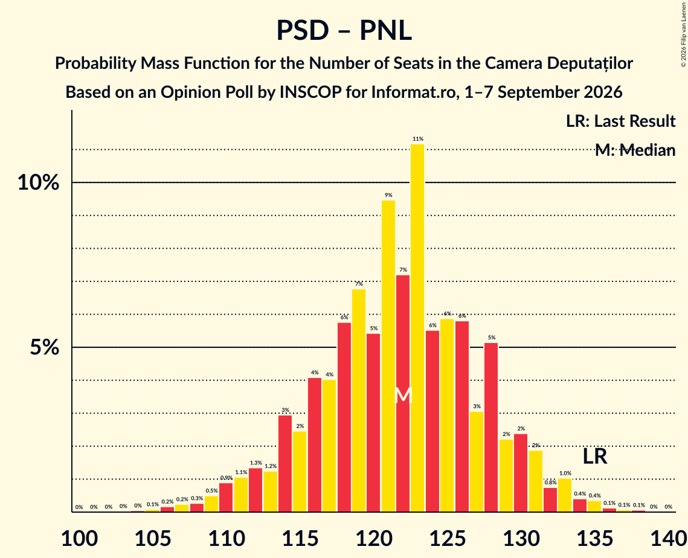

| Number of Seats | Probability | Accumulated | Special Marks |
|:---------------:|:-----------:|:-----------:|:-------------:|
| 103 | 0% | 100% |  |
| 104 | 0% | 99.9% |  |
| 105 | 0.1% | 99.9% |  |
| 106 | 0.2% | 99.8% |  |
| 107 | 0.2% | 99.6% |  |
| 108 | 0.3% | 99.4% |  |
| 109 | 0.5% | 99.1% |  |
| 110 | 0.9% | 98.6% |  |
| 111 | 1.1% | 98% |  |
| 112 | 1.3% | 97% |  |
| 113 | 1.2% | 95% |  |
| 114 | 3% | 94% |  |
| 115 | 2% | 91% |  |
| 116 | 4% | 89% |  |
| 117 | 4% | 85% |  |
| 118 | 6% | 81% |  |
| 119 | 7% | 75% |  |
| 120 | 5% | 68% |  |
| 121 | 9% | 63% |  |
| 122 | 7% | 53% | Median |
| 123 | 11% | 46% |  |
| 124 | 6% | 35% |  |
| 125 | 6% | 29% |  |
| 126 | 6% | 23% |  |
| 127 | 3% | 18% |  |
| 128 | 5% | 14% |  |
| 129 | 2% | 9% |  |
| 130 | 2% | 7% |  |
| 131 | 2% | 5% |  |
| 132 | 0.8% | 3% |  |
| 133 | 1.0% | 2% |  |
| 134 | 0.4% | 1.1% |  |
| 135 | 0.4% | 0.7% | Last Result |
| 136 | 0.1% | 0.3% |  |
| 137 | 0.1% | 0.2% |  |
| 138 | 0.1% | 0.1% |  |
| 139 | 0% | 0% |  |

### Partidul Național Liberal – Uniunea Salvați România – Romániai Magyar Demokrata Szövetség

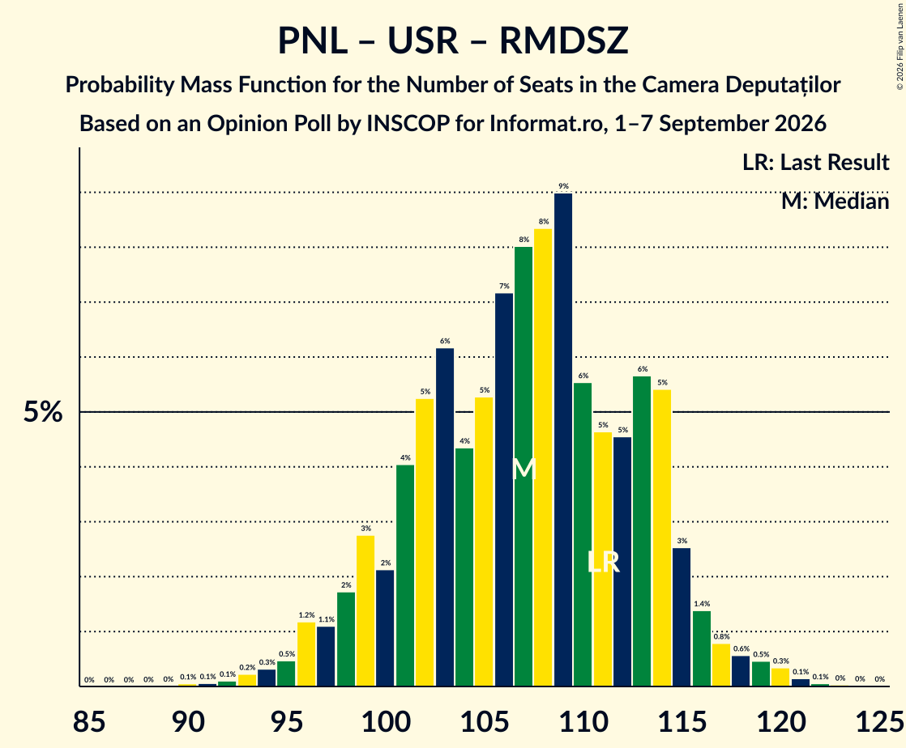

| Number of Seats | Probability | Accumulated | Special Marks |
|:---------------:|:-----------:|:-----------:|:-------------:|
| 90 | 0.1% | 100% |  |
| 91 | 0.1% | 99.9% |  |
| 92 | 0.1% | 99.9% |  |
| 93 | 0.2% | 99.8% |  |
| 94 | 0.3% | 99.5% |  |
| 95 | 0.5% | 99.2% |  |
| 96 | 1.2% | 98.7% |  |
| 97 | 1.1% | 98% |  |
| 98 | 2% | 96% |  |
| 99 | 3% | 95% |  |
| 100 | 2% | 92% |  |
| 101 | 4% | 90% |  |
| 102 | 5% | 86% |  |
| 103 | 6% | 81% |  |
| 104 | 4% | 74% |  |
| 105 | 5% | 70% |  |
| 106 | 7% | 65% |  |
| 107 | 8% | 58% | Median |
| 108 | 8% | 50% |  |
| 109 | 9% | 41% |  |
| 110 | 6% | 32% |  |
| 111 | 5% | 27% | Last Result |
| 112 | 5% | 22% |  |
| 113 | 6% | 17% |  |
| 114 | 5% | 12% |  |
| 115 | 3% | 6% |  |
| 116 | 1.4% | 4% |  |
| 117 | 0.8% | 2% |  |
| 118 | 0.6% | 2% |  |
| 119 | 0.5% | 1.1% |  |
| 120 | 0.3% | 0.6% |  |
| 121 | 0.1% | 0.3% |  |
| 122 | 0.1% | 0.1% |  |
| 123 | 0% | 0.1% |  |
| 124 | 0% | 0% |  |

### Partidul Social Democrat – Uniunea Salvați România

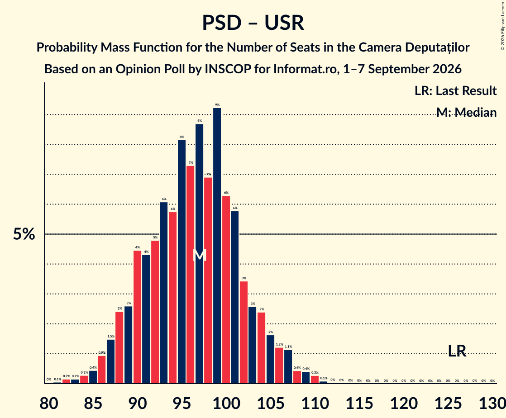

| Number of Seats | Probability | Accumulated | Special Marks |
|:---------------:|:-----------:|:-----------:|:-------------:|
| 80 | 0% | 100% |  |
| 81 | 0.1% | 99.9% |  |
| 82 | 0.2% | 99.9% |  |
| 83 | 0.2% | 99.7% |  |
| 84 | 0.3% | 99.6% |  |
| 85 | 0.4% | 99.3% |  |
| 86 | 0.9% | 98.9% |  |
| 87 | 1.5% | 98% |  |
| 88 | 2% | 96% |  |
| 89 | 3% | 94% |  |
| 90 | 4% | 91% |  |
| 91 | 4% | 87% |  |
| 92 | 5% | 83% |  |
| 93 | 6% | 78% |  |
| 94 | 6% | 72% |  |
| 95 | 8% | 66% |  |
| 96 | 7% | 58% | Median |
| 97 | 9% | 51% |  |
| 98 | 7% | 42% |  |
| 99 | 9% | 35% |  |
| 100 | 6% | 26% |  |
| 101 | 6% | 19% |  |
| 102 | 3% | 14% |  |
| 103 | 3% | 10% |  |
| 104 | 2% | 8% |  |
| 105 | 2% | 5% |  |
| 106 | 1.2% | 4% |  |
| 107 | 1.1% | 2% |  |
| 108 | 0.4% | 1.3% |  |
| 109 | 0.4% | 0.8% |  |
| 110 | 0.3% | 0.4% |  |
| 111 | 0.1% | 0.2% |  |
| 112 | 0% | 0.1% |  |
| 113 | 0% | 0% |  |
| 114 | 0% | 0% |  |
| 115 | 0% | 0% |  |
| 116 | 0% | 0% |  |
| 117 | 0% | 0% |  |
| 118 | 0% | 0% |  |
| 119 | 0% | 0% |  |
| 120 | 0% | 0% |  |
| 121 | 0% | 0% |  |
| 122 | 0% | 0% |  |
| 123 | 0% | 0% |  |
| 124 | 0% | 0% |  |
| 125 | 0% | 0% |  |
| 126 | 0% | 0% | Last Result |

### Partidul Național Liberal – Uniunea Salvați România

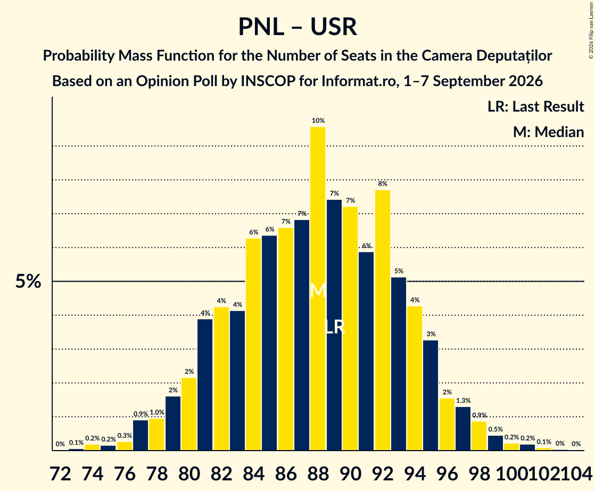

| Number of Seats | Probability | Accumulated | Special Marks |
|:---------------:|:-----------:|:-----------:|:-------------:|
| 73 | 0.1% | 100% |  |
| 74 | 0.2% | 99.9% |  |
| 75 | 0.2% | 99.7% |  |
| 76 | 0.3% | 99.5% |  |
| 77 | 0.9% | 99.3% |  |
| 78 | 1.0% | 98% |  |
| 79 | 2% | 97% |  |
| 80 | 2% | 96% |  |
| 81 | 4% | 94% |  |
| 82 | 4% | 90% |  |
| 83 | 4% | 85% |  |
| 84 | 6% | 81% |  |
| 85 | 6% | 75% |  |
| 86 | 7% | 69% |  |
| 87 | 7% | 62% |  |
| 88 | 10% | 55% | Median |
| 89 | 7% | 46% | Last Result |
| 90 | 7% | 38% |  |
| 91 | 6% | 31% |  |
| 92 | 8% | 25% |  |
| 93 | 5% | 17% |  |
| 94 | 4% | 12% |  |
| 95 | 3% | 8% |  |
| 96 | 2% | 5% |  |
| 97 | 1.3% | 3% |  |
| 98 | 0.9% | 2% |  |
| 99 | 0.5% | 1.0% |  |
| 100 | 0.2% | 0.6% |  |
| 101 | 0.2% | 0.4% |  |
| 102 | 0.1% | 0.2% |  |
| 103 | 0% | 0.1% |  |
| 104 | 0% | 0% |  |

### Partidul Național Liberal – Romániai Magyar Demokrata Szövetség

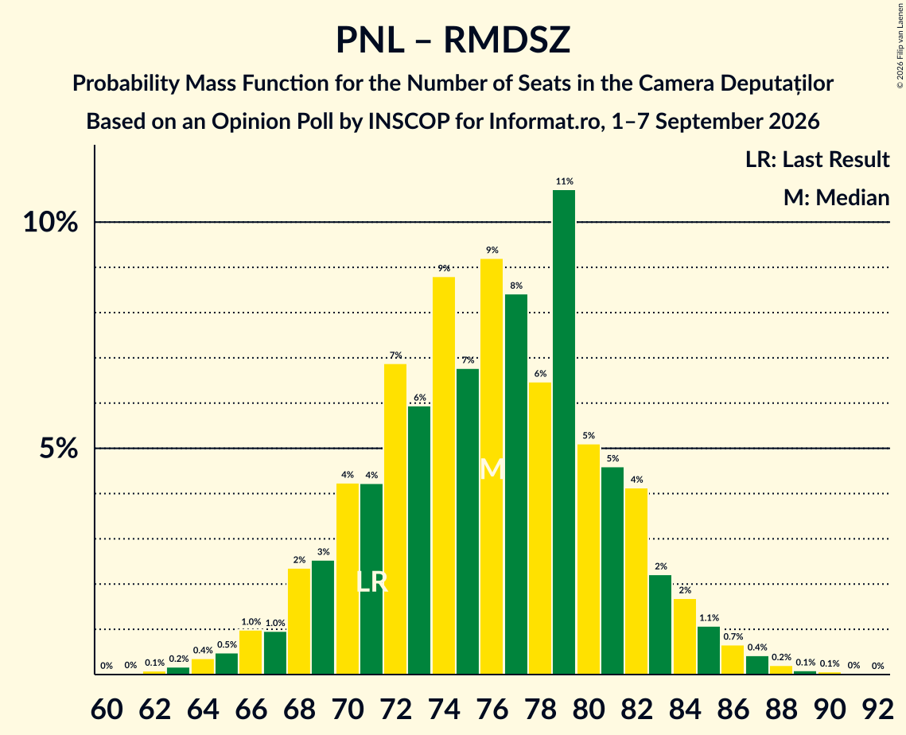

| Number of Seats | Probability | Accumulated | Special Marks |
|:---------------:|:-----------:|:-----------:|:-------------:|
| 61 | 0% | 100% |  |
| 62 | 0.1% | 99.9% |  |
| 63 | 0.2% | 99.9% |  |
| 64 | 0.4% | 99.7% |  |
| 65 | 0.5% | 99.3% |  |
| 66 | 1.0% | 98.8% |  |
| 67 | 1.0% | 98% |  |
| 68 | 2% | 97% |  |
| 69 | 3% | 95% |  |
| 70 | 4% | 92% |  |
| 71 | 4% | 88% | Last Result |
| 72 | 7% | 84% |  |
| 73 | 6% | 77% |  |
| 74 | 9% | 71% |  |
| 75 | 7% | 62% |  |
| 76 | 9% | 55% | Median |
| 77 | 8% | 46% |  |
| 78 | 6% | 38% |  |
| 79 | 11% | 31% |  |
| 80 | 5% | 20% |  |
| 81 | 5% | 15% |  |
| 82 | 4% | 11% |  |
| 83 | 2% | 6% |  |
| 84 | 2% | 4% |  |
| 85 | 1.1% | 3% |  |
| 86 | 0.7% | 2% |  |
| 87 | 0.4% | 0.8% |  |
| 88 | 0.2% | 0.4% |  |
| 89 | 0.1% | 0.2% |  |
| 90 | 0.1% | 0.1% |  |
| 91 | 0% | 0.1% |  |
| 92 | 0% | 0% |  |

### Partidul Social Democrat

| Number of Seats | Probability | Accumulated | Special Marks |
|:---------------:|:-----------:|:-----------:|:-------------:|
| 52 | 0.1% | 100% |  |
| 53 | 0.2% | 99.9% |  |
| 54 | 0.3% | 99.7% |  |
| 55 | 0.4% | 99.5% |  |
| 56 | 1.0% | 99.1% |  |
| 57 | 1.4% | 98% |  |
| 58 | 2% | 97% |  |
| 59 | 3% | 95% |  |
| 60 | 4% | 92% |  |
| 61 | 7% | 87% |  |
| 62 | 8% | 80% |  |
| 63 | 6% | 72% |  |
| 64 | 10% | 66% |  |
| 65 | 11% | 56% | Median |
| 66 | 11% | 45% |  |
| 67 | 6% | 34% |  |
| 68 | 5% | 28% |  |
| 69 | 8% | 23% |  |
| 70 | 5% | 15% |  |
| 71 | 4% | 10% |  |
| 72 | 2% | 6% |  |
| 73 | 2% | 5% |  |
| 74 | 1.5% | 3% |  |
| 75 | 0.7% | 1.4% |  |
| 76 | 0.3% | 0.7% |  |
| 77 | 0.2% | 0.4% |  |
| 78 | 0.1% | 0.2% |  |
| 79 | 0.1% | 0.1% |  |
| 80 | 0% | 0% |  |
| 81 | 0% | 0% |  |
| 82 | 0% | 0% |  |
| 83 | 0% | 0% |  |
| 84 | 0% | 0% |  |
| 85 | 0% | 0% |  |
| 86 | 0% | 0% | Last Result |

### Partidul Național Liberal

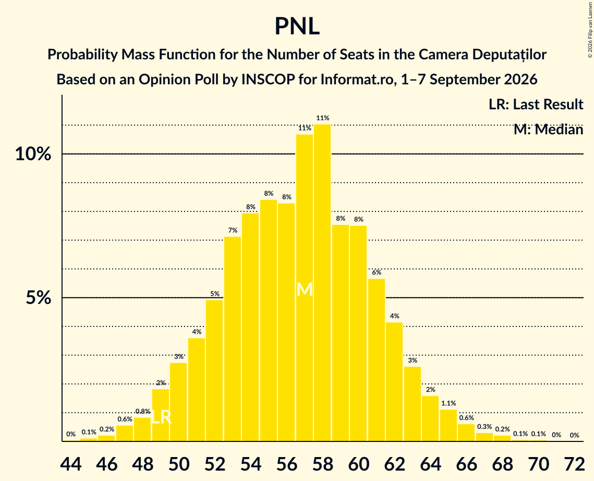

| Number of Seats | Probability | Accumulated | Special Marks |
|:---------------:|:-----------:|:-----------:|:-------------:|
| 44 | 0% | 100% |  |
| 45 | 0.1% | 99.9% |  |
| 46 | 0.2% | 99.8% |  |
| 47 | 0.6% | 99.6% |  |
| 48 | 0.8% | 99.0% |  |
| 49 | 2% | 98% | Last Result |
| 50 | 3% | 96% |  |
| 51 | 4% | 94% |  |
| 52 | 5% | 90% |  |
| 53 | 7% | 85% |  |
| 54 | 8% | 78% |  |
| 55 | 8% | 70% |  |
| 56 | 8% | 62% |  |
| 57 | 11% | 53% | Median |
| 58 | 11% | 43% |  |
| 59 | 8% | 32% |  |
| 60 | 8% | 24% |  |
| 61 | 6% | 16% |  |
| 62 | 4% | 11% |  |
| 63 | 3% | 7% |  |
| 64 | 2% | 4% |  |
| 65 | 1.1% | 2% |  |
| 66 | 0.6% | 1.3% |  |
| 67 | 0.3% | 0.7% |  |
| 68 | 0.2% | 0.4% |  |
| 69 | 0.1% | 0.2% |  |
| 70 | 0.1% | 0.1% |  |
| 71 | 0% | 0% |  |

## Technical Information

### Opinion Poll

+ **Polling firm:** INSCOP
+ **Commissioner(s):** Informat.ro
+ **Fieldwork period:** 1–7 September 2026

### Calculations

+ **Sample size:** 1100
+ **Simulations done:** 2,097,152
+ **Error estimate:** 1.07%

