# Opinion Poll by CURS, 16–22 September 2026

<a href="#voting-intentions">Voting Intentions</a> | <a href="#seats">Seats</a> | <a href="#coalitions">Coalitions</a> | <a href="#technical-information">Technical Information</a>

## Voting Intentions

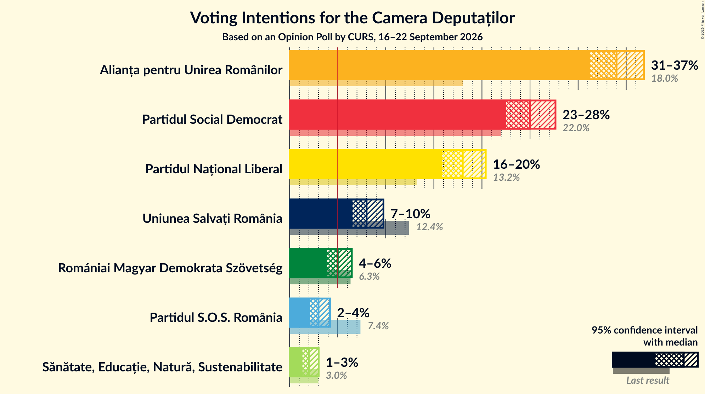

### Confidence Intervals

| Party | Last Result | Poll Result | 80% Confidence Interval | 90% Confidence Interval | 95% Confidence Interval | 99% Confidence Interval |
|:-----:|:-----------:|:-----------:|:-----------------------:|:-----------------------:|:-----------------------:|:-----------------------:|
| Alianța pentru Unirea Românilor | 18.0% | 34.0% | 32.2–35.9% |31.7–36.4% |31.3–36.9% |30.4–37.8% |
| Partidul Social Democrat | 22.0% | 25.0% | 23.4–26.7% |22.9–27.2% |22.5–27.6% |21.8–28.5% |
| Partidul Național Liberal | 13.2% | 18.0% | 16.6–19.6% |16.2–20.0% |15.8–20.4% |15.2–21.2% |
| Uniunea Salvați România | 12.4% | 8.0% | 7.0–9.1% |6.8–9.5% |6.5–9.8% |6.1–10.3% |
| Romániai Magyar Demokrata Szövetség | 6.3% | 5.0% | 4.3–6.0% |4.0–6.2% |3.9–6.5% |3.5–7.0% |
| Partidul S.O.S. România | 7.4% | 3.0% | 2.4–3.8% |2.3–4.0% |2.1–4.2% |1.9–4.6% |
| Sănătate, Educație, Natură, Sustenabilitate | 3.0% | 2.0% | 1.6–2.7% |1.4–2.9% |1.3–3.0% |1.1–3.4% |

*Note:* The poll result column reflects the actual value used in the calculations. Published results may vary slightly, and in addition be rounded to fewer digits.

## Seats

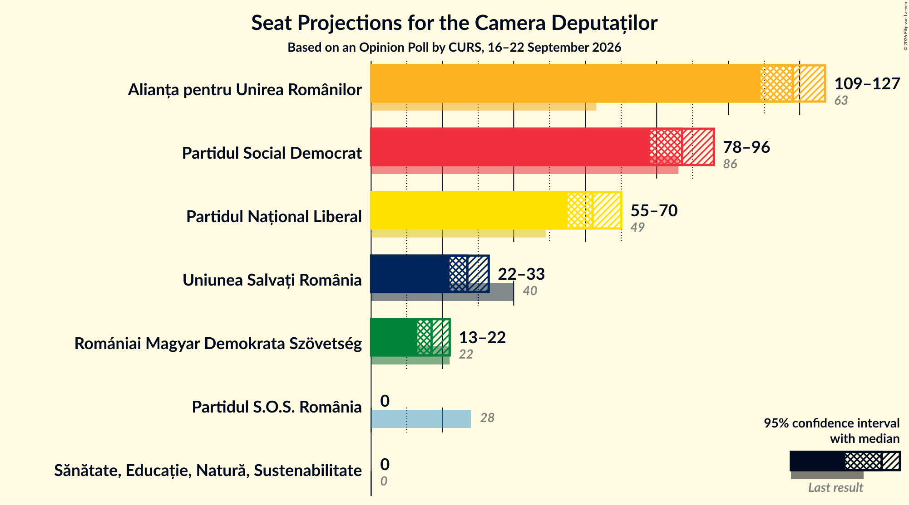

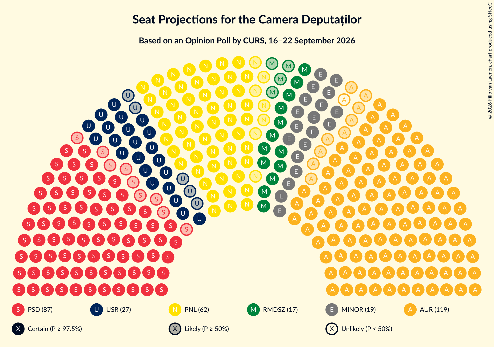

### Confidence Intervals

| Party | Last Result | Median | 80% Confidence Interval | 90% Confidence Interval | 95% Confidence Interval | 99% Confidence Interval |
|:-----:|:-----------:|:------:|:-----------------------:|:-----------------------:|:-----------------------:|:-----------------------:|
| <a href="#alianța-pentru-unirea-românilor">Alianța pentru Unirea Românilor</a> | 63 | 118 | 112–124 |110–126 |109–127 |106–131 |
| <a href="#partidul-social-democrat">Partidul Social Democrat</a> | 86 | 87 | 81–93 |79–94 |78–95 |76–98 |
| <a href="#partidul-național-liberal">Partidul Național Liberal</a> | 49 | 62 | 57–68 |56–69 |55–70 |52–73 |
| <a href="#uniunea-salvați-românia">Uniunea Salvați România</a> | 40 | 27 | 24–31 |23–32 |22–33 |21–35 |
| <a href="#romániai-magyar-demokrata-szövetség">Romániai Magyar Demokrata Szövetség</a> | 22 | 17 | 14–20 |14–21 |13–22 |12–24 |
| <a href="#partidul-s.o.s.-românia">Partidul S.O.S. România</a> | 28 | 0 | 0 |0 |0 |0 |
| <a href="#sănătate,-educație,-natură,-sustenabilitate">Sănătate, Educație, Natură, Sustenabilitate</a> | 0 | 0 | 0 |0 |0 |0 |

### Alianța pentru Unirea Românilor

*For a full overview of the results for this party, see the [Alianța pentru Unirea Românilor](party-alianțapentruunirearomânilor.html) page.*

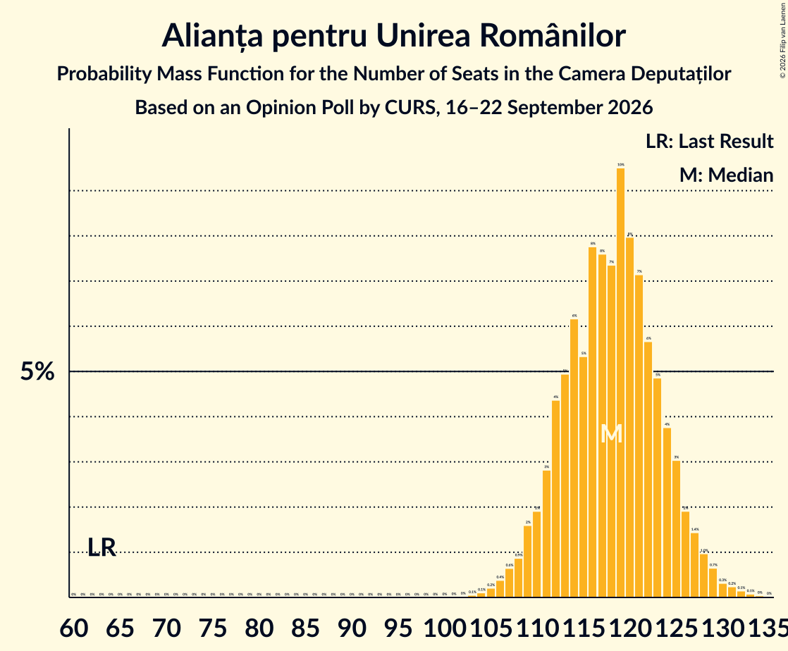

| Number of Seats | Probability | Accumulated | Special Marks |
|:---------------:|:-----------:|:-----------:|:-------------:|
| 63 | 0% | 100% | Last Result |
| 64 | 0% | 100% |  |
| 65 | 0% | 100% |  |
| 66 | 0% | 100% |  |
| 67 | 0% | 100% |  |
| 68 | 0% | 100% |  |
| 69 | 0% | 100% |  |
| 70 | 0% | 100% |  |
| 71 | 0% | 100% |  |
| 72 | 0% | 100% |  |
| 73 | 0% | 100% |  |
| 74 | 0% | 100% |  |
| 75 | 0% | 100% |  |
| 76 | 0% | 100% |  |
| 77 | 0% | 100% |  |
| 78 | 0% | 100% |  |
| 79 | 0% | 100% |  |
| 80 | 0% | 100% |  |
| 81 | 0% | 100% |  |
| 82 | 0% | 100% |  |
| 83 | 0% | 100% |  |
| 84 | 0% | 100% |  |
| 85 | 0% | 100% |  |
| 86 | 0% | 100% |  |
| 87 | 0% | 100% |  |
| 88 | 0% | 100% |  |
| 89 | 0% | 100% |  |
| 90 | 0% | 100% |  |
| 91 | 0% | 100% |  |
| 92 | 0% | 100% |  |
| 93 | 0% | 100% |  |
| 94 | 0% | 100% |  |
| 95 | 0% | 100% |  |
| 96 | 0% | 100% |  |
| 97 | 0% | 100% |  |
| 98 | 0% | 100% |  |
| 99 | 0% | 100% |  |
| 100 | 0% | 100% |  |
| 101 | 0% | 100% |  |
| 102 | 0% | 100% |  |
| 103 | 0.1% | 100% |  |
| 104 | 0.1% | 99.9% |  |
| 105 | 0.2% | 99.8% |  |
| 106 | 0.4% | 99.6% |  |
| 107 | 0.6% | 99.2% |  |
| 108 | 0.9% | 98.5% |  |
| 109 | 2% | 98% |  |
| 110 | 2% | 96% |  |
| 111 | 3% | 94% |  |
| 112 | 4% | 91% |  |
| 113 | 5% | 87% |  |
| 114 | 6% | 82% |  |
| 115 | 5% | 76% |  |
| 116 | 8% | 71% |  |
| 117 | 8% | 63% |  |
| 118 | 7% | 55% | Median |
| 119 | 10% | 48% |  |
| 120 | 8% | 38% |  |
| 121 | 7% | 30% |  |
| 122 | 6% | 23% |  |
| 123 | 5% | 18% |  |
| 124 | 4% | 13% |  |
| 125 | 3% | 9% |  |
| 126 | 2% | 6% |  |
| 127 | 1.4% | 4% |  |
| 128 | 1.0% | 2% |  |
| 129 | 0.7% | 2% |  |
| 130 | 0.3% | 0.9% |  |
| 131 | 0.2% | 0.6% |  |
| 132 | 0.1% | 0.3% |  |
| 133 | 0.1% | 0.2% |  |
| 134 | 0% | 0.1% |  |
| 135 | 0% | 0% |  |

### Partidul Social Democrat

*For a full overview of the results for this party, see the [Partidul Social Democrat](party-partidulsocialdemocrat.html) page.*

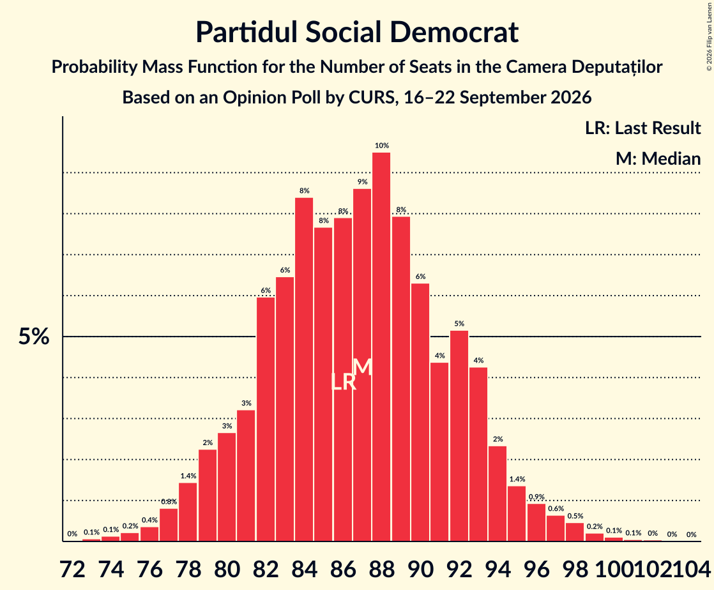

| Number of Seats | Probability | Accumulated | Special Marks |
|:---------------:|:-----------:|:-----------:|:-------------:|
| 73 | 0.1% | 100% |  |
| 74 | 0.1% | 99.9% |  |
| 75 | 0.2% | 99.7% |  |
| 76 | 0.4% | 99.5% |  |
| 77 | 0.8% | 99.2% |  |
| 78 | 1.4% | 98% |  |
| 79 | 2% | 97% |  |
| 80 | 3% | 95% |  |
| 81 | 3% | 92% |  |
| 82 | 6% | 89% |  |
| 83 | 6% | 83% |  |
| 84 | 8% | 76% |  |
| 85 | 8% | 68% |  |
| 86 | 8% | 60% | Last Result |
| 87 | 9% | 52% | Median |
| 88 | 10% | 44% |  |
| 89 | 8% | 34% |  |
| 90 | 6% | 26% |  |
| 91 | 4% | 20% |  |
| 92 | 5% | 16% |  |
| 93 | 4% | 10% |  |
| 94 | 2% | 6% |  |
| 95 | 1.4% | 4% |  |
| 96 | 0.9% | 2% |  |
| 97 | 0.6% | 2% |  |
| 98 | 0.5% | 0.9% |  |
| 99 | 0.2% | 0.4% |  |
| 100 | 0.1% | 0.2% |  |
| 101 | 0.1% | 0.1% |  |
| 102 | 0% | 0.1% |  |
| 103 | 0% | 0% |  |

### Partidul Național Liberal

*For a full overview of the results for this party, see the [Partidul Național Liberal](party-partidulnaționalliberal.html) page.*

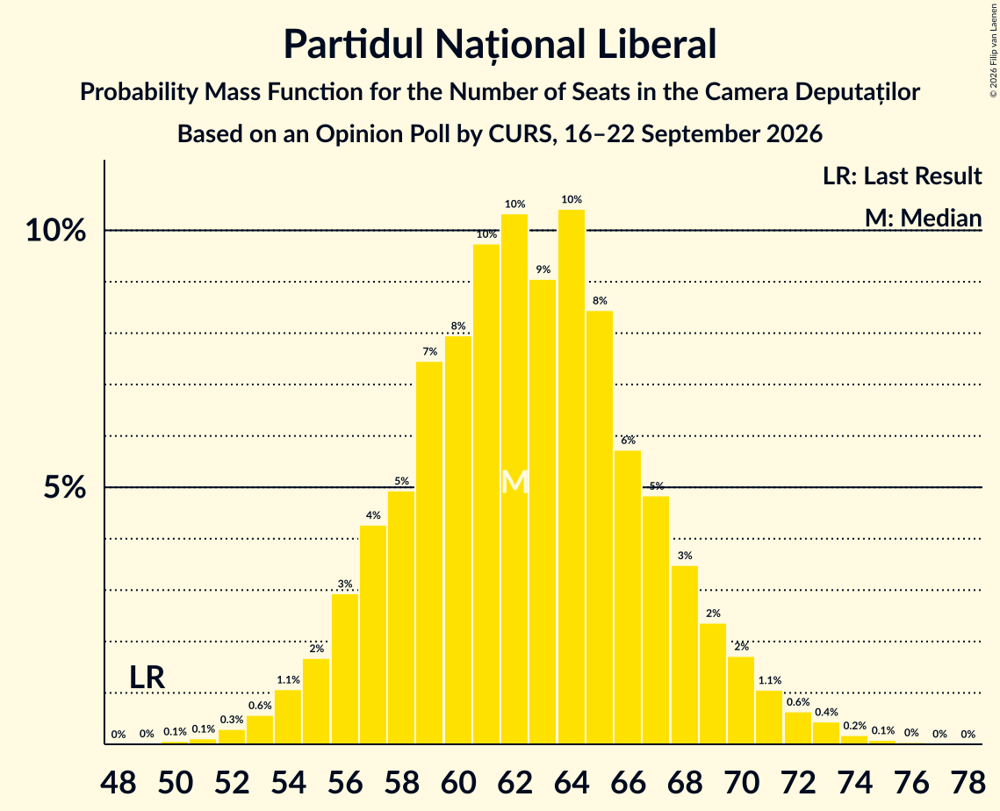

| Number of Seats | Probability | Accumulated | Special Marks |
|:---------------:|:-----------:|:-----------:|:-------------:|
| 49 | 0% | 100% | Last Result |
| 50 | 0.1% | 100% |  |
| 51 | 0.1% | 99.9% |  |
| 52 | 0.3% | 99.8% |  |
| 53 | 0.6% | 99.5% |  |
| 54 | 1.1% | 98.9% |  |
| 55 | 2% | 98% |  |
| 56 | 3% | 96% |  |
| 57 | 4% | 93% |  |
| 58 | 5% | 89% |  |
| 59 | 7% | 84% |  |
| 60 | 8% | 77% |  |
| 61 | 10% | 69% |  |
| 62 | 10% | 59% | Median |
| 63 | 9% | 49% |  |
| 64 | 10% | 39% |  |
| 65 | 8% | 29% |  |
| 66 | 6% | 21% |  |
| 67 | 5% | 15% |  |
| 68 | 3% | 10% |  |
| 69 | 2% | 7% |  |
| 70 | 2% | 4% |  |
| 71 | 1.1% | 2% |  |
| 72 | 0.6% | 1.4% |  |
| 73 | 0.4% | 0.8% |  |
| 74 | 0.2% | 0.3% |  |
| 75 | 0.1% | 0.2% |  |
| 76 | 0% | 0.1% |  |
| 77 | 0% | 0% |  |

### Uniunea Salvați România

*For a full overview of the results for this party, see the [Uniunea Salvați România](party-uniuneasalvațiromânia.html) page.*

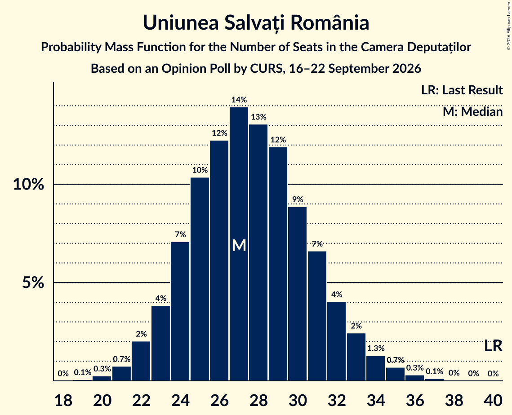

| Number of Seats | Probability | Accumulated | Special Marks |
|:---------------:|:-----------:|:-----------:|:-------------:|
| 19 | 0.1% | 100% |  |
| 20 | 0.3% | 99.9% |  |
| 21 | 0.7% | 99.7% |  |
| 22 | 2% | 98.9% |  |
| 23 | 4% | 97% |  |
| 24 | 7% | 93% |  |
| 25 | 10% | 86% |  |
| 26 | 12% | 76% |  |
| 27 | 14% | 63% | Median |
| 28 | 13% | 49% |  |
| 29 | 12% | 36% |  |
| 30 | 9% | 24% |  |
| 31 | 7% | 16% |  |
| 32 | 4% | 9% |  |
| 33 | 2% | 5% |  |
| 34 | 1.3% | 2% |  |
| 35 | 0.7% | 1.2% |  |
| 36 | 0.3% | 0.5% |  |
| 37 | 0.1% | 0.2% |  |
| 38 | 0% | 0.1% |  |
| 39 | 0% | 0% |  |
| 40 | 0% | 0% | Last Result |

### Romániai Magyar Demokrata Szövetség

*For a full overview of the results for this party, see the [Romániai Magyar Demokrata Szövetség](party-romániaimagyardemokrataszövetség.html) page.*

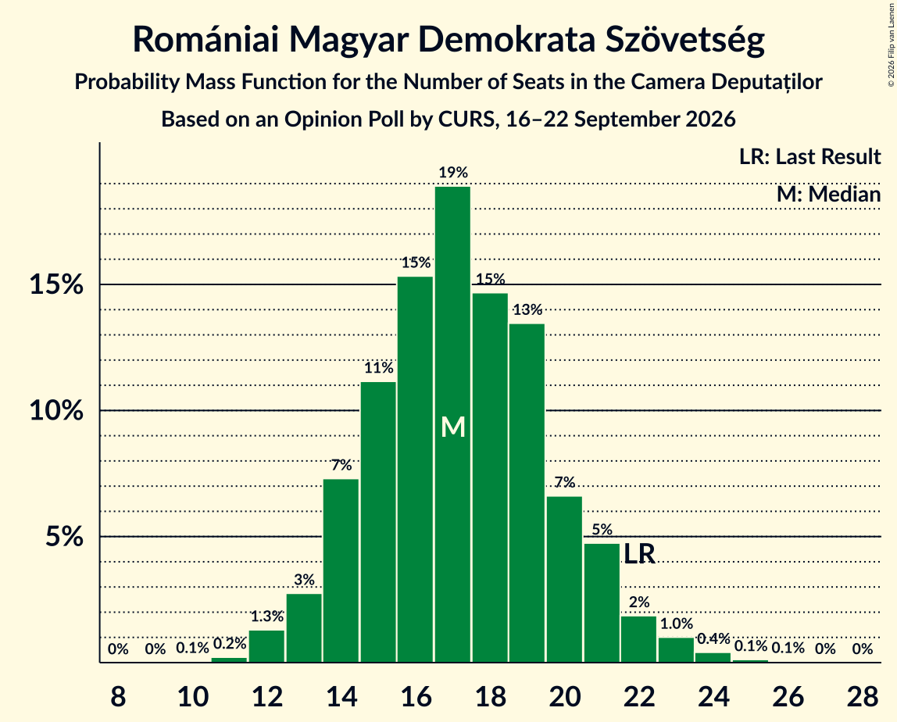

| Number of Seats | Probability | Accumulated | Special Marks |
|:---------------:|:-----------:|:-----------:|:-------------:|
| 10 | 0.1% | 100% |  |
| 11 | 0.2% | 99.9% |  |
| 12 | 1.3% | 99.7% |  |
| 13 | 3% | 98% |  |
| 14 | 7% | 96% |  |
| 15 | 11% | 88% |  |
| 16 | 15% | 77% |  |
| 17 | 19% | 62% | Median |
| 18 | 15% | 43% |  |
| 19 | 13% | 28% |  |
| 20 | 7% | 15% |  |
| 21 | 5% | 8% |  |
| 22 | 2% | 3% | Last Result |
| 23 | 1.0% | 2% |  |
| 24 | 0.4% | 0.6% |  |
| 25 | 0.1% | 0.2% |  |
| 26 | 0.1% | 0.1% |  |
| 27 | 0% | 0% |  |

### Partidul S.O.S. România

*For a full overview of the results for this party, see the [Partidul S.O.S. România](party-partidulsosromânia.html) page.*

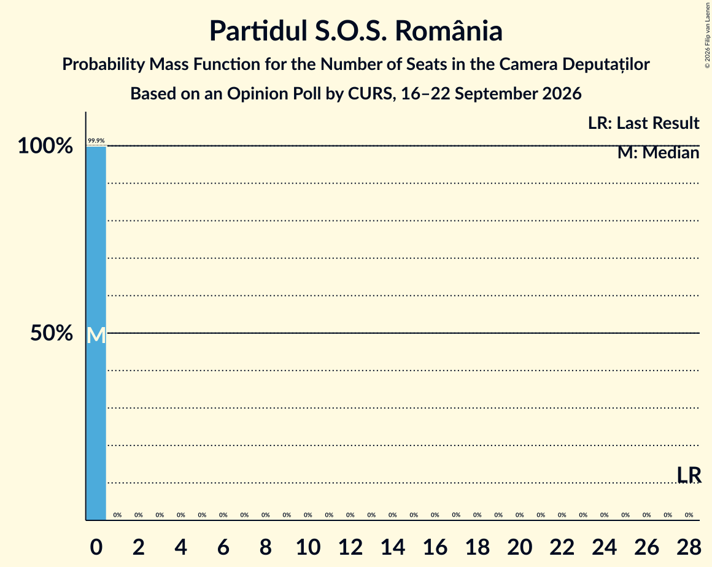

| Number of Seats | Probability | Accumulated | Special Marks |
|:---------------:|:-----------:|:-----------:|:-------------:|
| 0 | 99.9% | 100% | Median |
| 1 | 0% | 0.1% |  |
| 2 | 0% | 0.1% |  |
| 3 | 0% | 0.1% |  |
| 4 | 0% | 0.1% |  |
| 5 | 0% | 0.1% |  |
| 6 | 0% | 0.1% |  |
| 7 | 0% | 0.1% |  |
| 8 | 0% | 0.1% |  |
| 9 | 0% | 0.1% |  |
| 10 | 0% | 0.1% |  |
| 11 | 0% | 0.1% |  |
| 12 | 0% | 0.1% |  |
| 13 | 0% | 0.1% |  |
| 14 | 0% | 0.1% |  |
| 15 | 0% | 0.1% |  |
| 16 | 0% | 0.1% |  |
| 17 | 0% | 0.1% |  |
| 18 | 0% | 0% |  |
| 19 | 0% | 0% |  |
| 20 | 0% | 0% |  |
| 21 | 0% | 0% |  |
| 22 | 0% | 0% |  |
| 23 | 0% | 0% |  |
| 24 | 0% | 0% |  |
| 25 | 0% | 0% |  |
| 26 | 0% | 0% |  |
| 27 | 0% | 0% |  |
| 28 | 0% | 0% | Last Result |

### Sănătate, Educație, Natură, Sustenabilitate

*For a full overview of the results for this party, see the [Sănătate, Educație, Natură, Sustenabilitate](party-sănătateeducațienaturăsustenabilitate.html) page.*

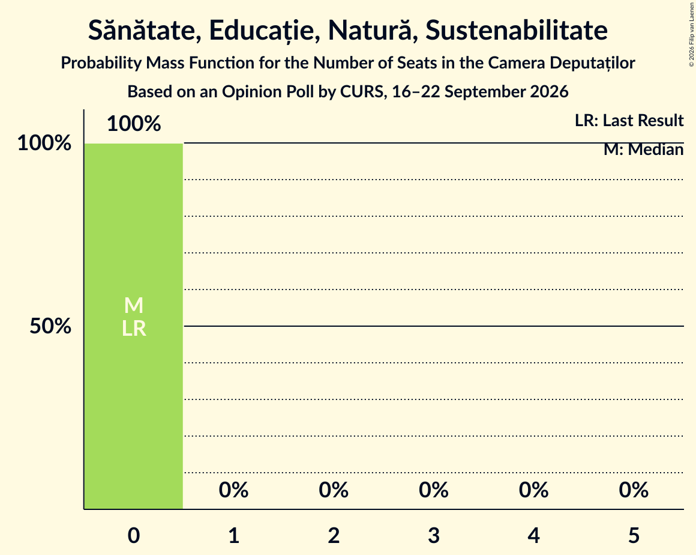

| Number of Seats | Probability | Accumulated | Special Marks |
|:---------------:|:-----------:|:-----------:|:-------------:|
| 0 | 100% | 100% | Last Result, Median |

## Coalitions

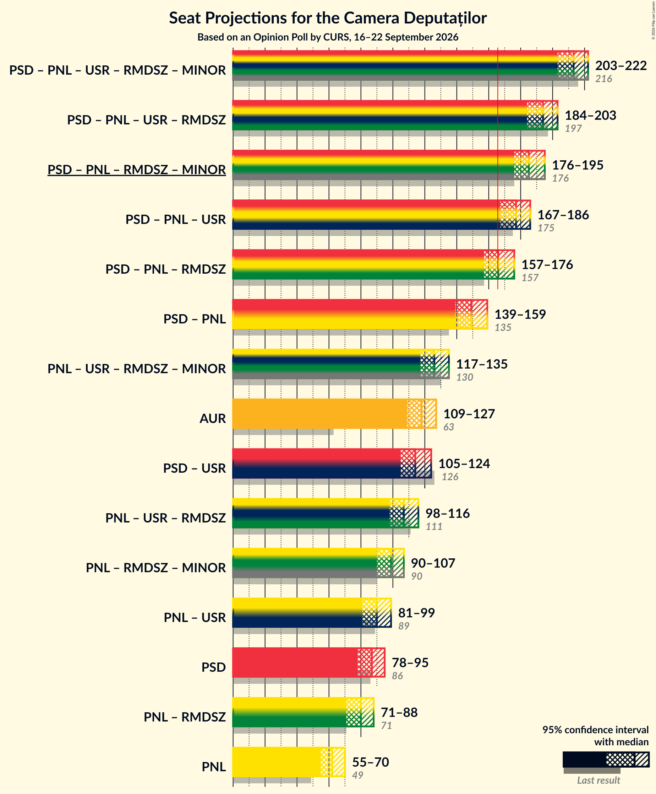

### Confidence Intervals

| Coalition | Last Result | Median | Majority? | 80% Confidence Interval | 90% Confidence Interval | 95% Confidence Interval | 99% Confidence Interval |
|:---------:|:-----------:|:------:|:---------:|:-----------------------:|:-----------------------:|:-----------------------:|:-----------------------:|
| Partidul Social Democrat – Partidul Național Liberal – Uniunea Salvați România – Romániai Magyar Demokrata Szövetség | 197 | 194 | 100% | 188–200 | 186–202 | 184–203 | 181–206 |
| Partidul Social Democrat – Partidul Național Liberal – Uniunea Salvați România | 175 | 177 | 98.8% | 170–183 | 169–185 | 167–186 | 164–189 |
| Partidul Social Democrat – Partidul Național Liberal – Romániai Magyar Demokrata Szövetség | 157 | 166 | 57% | 160–173 | 158–174 | 157–176 | 154–179 |
| Partidul Social Democrat – Partidul Național Liberal | 135 | 149 | 0.1% | 143–155 | 141–157 | 139–159 | 136–162 |
| Alianța pentru Unirea Românilor | 63 | 118 | 0% | 112–124 | 110–126 | 109–127 | 106–131 |
| Partidul Social Democrat – Uniunea Salvați România | 126 | 114 | 0% | 108–121 | 106–122 | 105–124 | 102–127 |
| Partidul Național Liberal – Uniunea Salvați România – Romániai Magyar Demokrata Szövetség | 111 | 107 | 0% | 101–113 | 100–115 | 98–116 | 95–120 |
| Partidul Național Liberal – Uniunea Salvați România | 89 | 90 | 0% | 84–96 | 83–97 | 81–99 | 79–102 |
| Partidul Social Democrat | 86 | 87 | 0% | 81–93 | 79–94 | 78–95 | 76–98 |
| Partidul Național Liberal – Romániai Magyar Demokrata Szövetség | 71 | 80 | 0% | 74–85 | 72–87 | 71–88 | 69–91 |
| Partidul Național Liberal | 49 | 62 | 0% | 57–68 | 56–69 | 55–70 | 52–73 |

### Partidul Social Democrat – Partidul Național Liberal – Uniunea Salvați România – Romániai Magyar Demokrata Szövetség

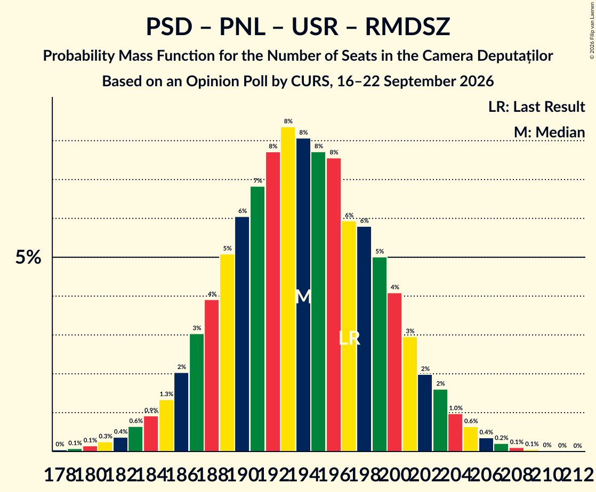

| Number of Seats | Probability | Accumulated | Special Marks |
|:---------------:|:-----------:|:-----------:|:-------------:|
| 178 | 0% | 100% |  |
| 179 | 0.1% | 99.9% |  |
| 180 | 0.2% | 99.8% |  |
| 181 | 0.2% | 99.7% |  |
| 182 | 0.3% | 99.4% |  |
| 183 | 0.7% | 99.1% |  |
| 184 | 1.0% | 98% |  |
| 185 | 1.4% | 97% |  |
| 186 | 2% | 96% |  |
| 187 | 3% | 94% |  |
| 188 | 4% | 91% |  |
| 189 | 5% | 87% |  |
| 190 | 6% | 82% |  |
| 191 | 7% | 77% |  |
| 192 | 8% | 70% |  |
| 193 | 10% | 62% | Median |
| 194 | 7% | 52% |  |
| 195 | 8% | 45% |  |
| 196 | 8% | 37% |  |
| 197 | 5% | 29% | Last Result |
| 198 | 6% | 24% |  |
| 199 | 5% | 18% |  |
| 200 | 4% | 13% |  |
| 201 | 3% | 9% |  |
| 202 | 2% | 6% |  |
| 203 | 2% | 4% |  |
| 204 | 0.9% | 2% |  |
| 205 | 0.6% | 1.4% |  |
| 206 | 0.4% | 0.8% |  |
| 207 | 0.2% | 0.4% |  |
| 208 | 0.1% | 0.2% |  |
| 209 | 0.1% | 0.1% |  |
| 210 | 0% | 0% |  |

### Partidul Social Democrat – Partidul Național Liberal – Uniunea Salvați România

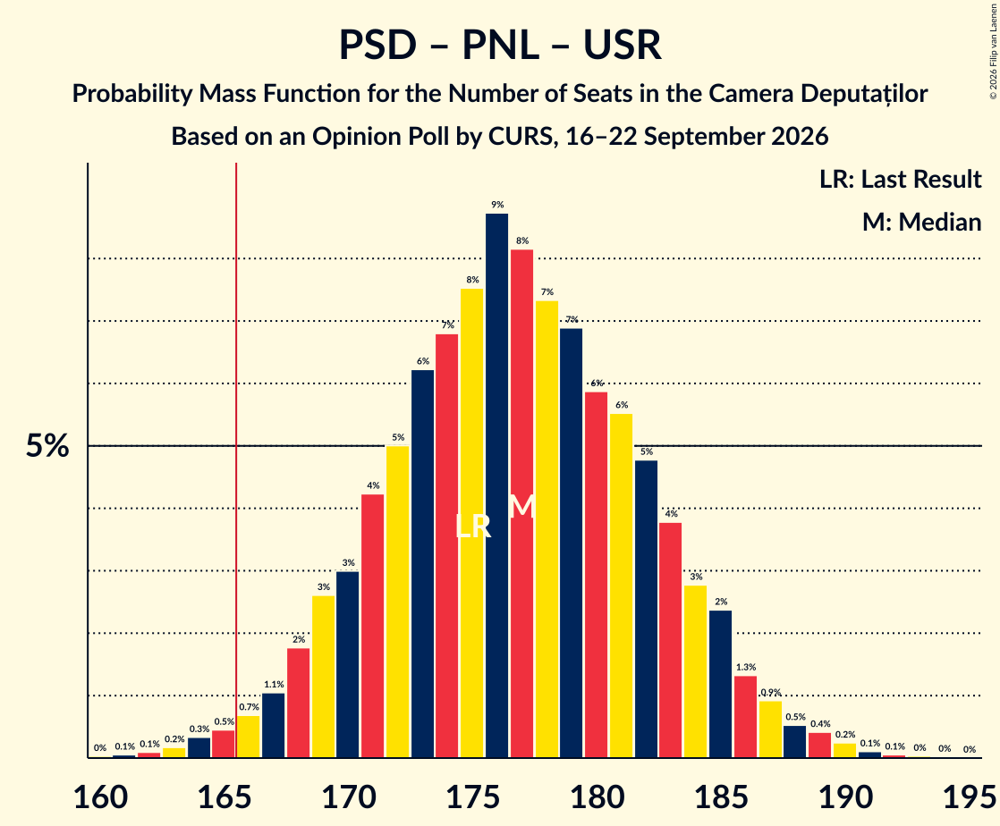

| Number of Seats | Probability | Accumulated | Special Marks |
|:---------------:|:-----------:|:-----------:|:-------------:|
| 160 | 0% | 100% |  |
| 161 | 0.1% | 99.9% |  |
| 162 | 0.1% | 99.9% |  |
| 163 | 0.2% | 99.8% |  |
| 164 | 0.3% | 99.6% |  |
| 165 | 0.4% | 99.2% |  |
| 166 | 0.7% | 98.8% | Majority |
| 167 | 0.8% | 98% |  |
| 168 | 2% | 97% |  |
| 169 | 3% | 96% |  |
| 170 | 3% | 93% |  |
| 171 | 4% | 90% |  |
| 172 | 5% | 86% |  |
| 173 | 6% | 81% |  |
| 174 | 8% | 75% |  |
| 175 | 8% | 67% | Last Result |
| 176 | 8% | 60% | Median |
| 177 | 9% | 52% |  |
| 178 | 7% | 43% |  |
| 179 | 7% | 35% |  |
| 180 | 5% | 28% |  |
| 181 | 5% | 23% |  |
| 182 | 5% | 17% |  |
| 183 | 4% | 12% |  |
| 184 | 3% | 9% |  |
| 185 | 2% | 6% |  |
| 186 | 1.4% | 4% |  |
| 187 | 0.9% | 2% |  |
| 188 | 0.5% | 1.4% |  |
| 189 | 0.4% | 0.9% |  |
| 190 | 0.2% | 0.5% |  |
| 191 | 0.1% | 0.2% |  |
| 192 | 0.1% | 0.1% |  |
| 193 | 0% | 0.1% |  |
| 194 | 0% | 0% |  |

### Partidul Social Democrat – Partidul Național Liberal – Romániai Magyar Demokrata Szövetség

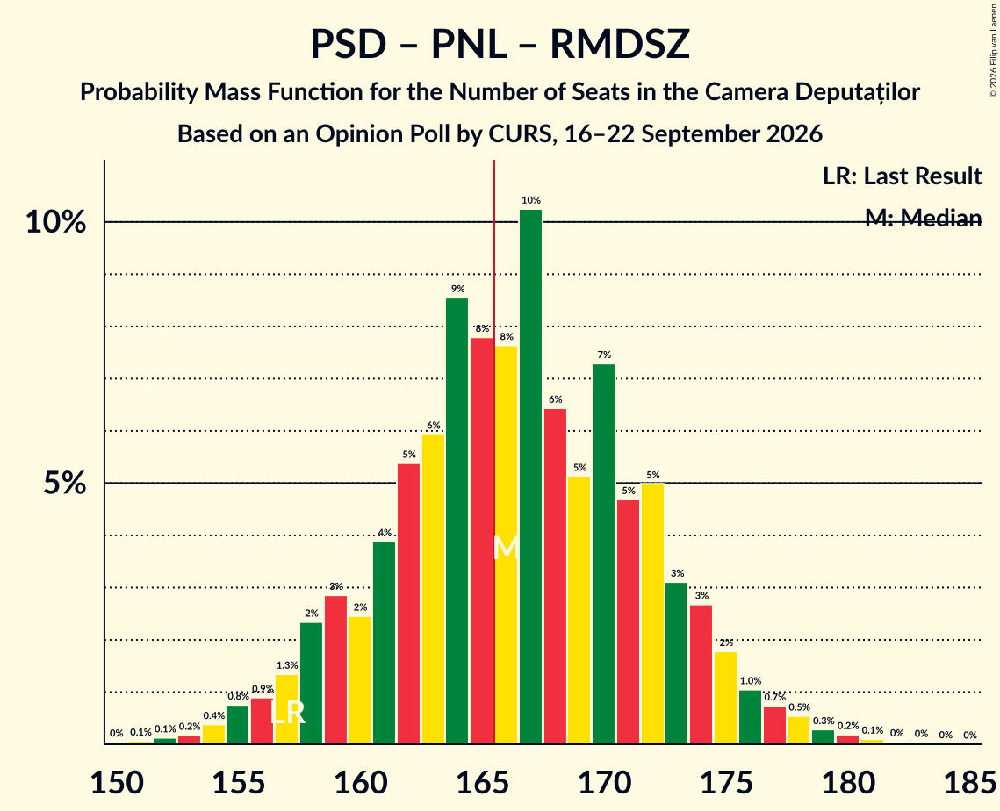

| Number of Seats | Probability | Accumulated | Special Marks |
|:---------------:|:-----------:|:-----------:|:-------------:|
| 150 | 0% | 100% |  |
| 151 | 0.1% | 99.9% |  |
| 152 | 0.1% | 99.9% |  |
| 153 | 0.2% | 99.7% |  |
| 154 | 0.4% | 99.6% |  |
| 155 | 0.8% | 99.2% |  |
| 156 | 0.9% | 98% |  |
| 157 | 1.3% | 98% | Last Result |
| 158 | 2% | 96% |  |
| 159 | 3% | 94% |  |
| 160 | 2% | 91% |  |
| 161 | 4% | 89% |  |
| 162 | 5% | 85% |  |
| 163 | 6% | 79% |  |
| 164 | 9% | 73% |  |
| 165 | 8% | 65% |  |
| 166 | 8% | 57% | Median, Majority |
| 167 | 10% | 49% |  |
| 168 | 6% | 39% |  |
| 169 | 5% | 33% |  |
| 170 | 7% | 28% |  |
| 171 | 5% | 20% |  |
| 172 | 5% | 16% |  |
| 173 | 3% | 11% |  |
| 174 | 3% | 7% |  |
| 175 | 2% | 5% |  |
| 176 | 1.0% | 3% |  |
| 177 | 0.7% | 2% |  |
| 178 | 0.5% | 1.2% |  |
| 179 | 0.3% | 0.7% |  |
| 180 | 0.2% | 0.4% |  |
| 181 | 0.1% | 0.2% |  |
| 182 | 0% | 0.1% |  |
| 183 | 0% | 0.1% |  |
| 184 | 0% | 0% |  |

### Partidul Social Democrat – Partidul Național Liberal

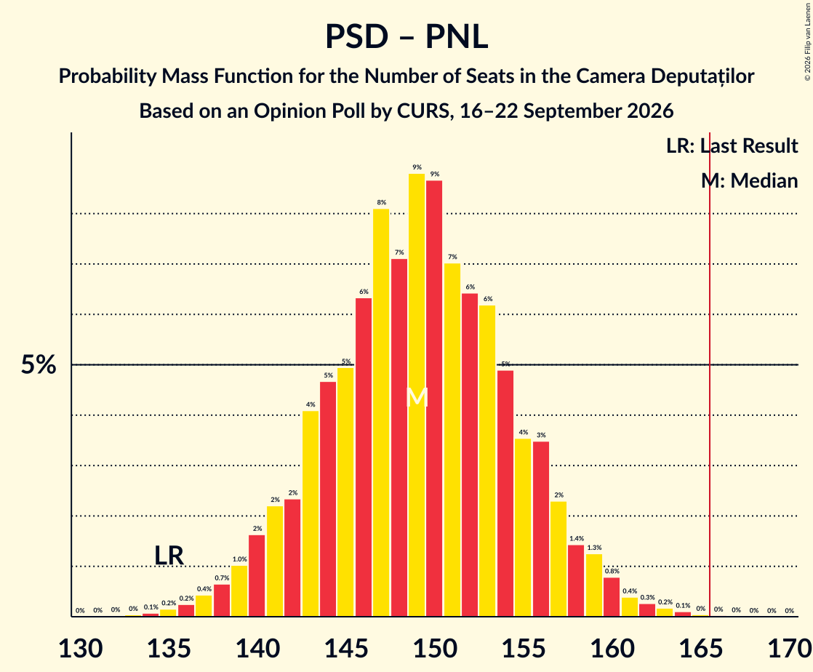

| Number of Seats | Probability | Accumulated | Special Marks |
|:---------------:|:-----------:|:-----------:|:-------------:|
| 133 | 0% | 100% |  |
| 134 | 0.1% | 99.9% |  |
| 135 | 0.2% | 99.8% | Last Result |
| 136 | 0.2% | 99.7% |  |
| 137 | 0.4% | 99.4% |  |
| 138 | 0.7% | 99.0% |  |
| 139 | 1.1% | 98% |  |
| 140 | 2% | 97% |  |
| 141 | 2% | 96% |  |
| 142 | 2% | 94% |  |
| 143 | 4% | 91% |  |
| 144 | 4% | 87% |  |
| 145 | 5% | 83% |  |
| 146 | 8% | 78% |  |
| 147 | 7% | 70% |  |
| 148 | 7% | 63% |  |
| 149 | 9% | 57% | Median |
| 150 | 9% | 48% |  |
| 151 | 7% | 38% |  |
| 152 | 7% | 32% |  |
| 153 | 6% | 25% |  |
| 154 | 4% | 18% |  |
| 155 | 4% | 14% |  |
| 156 | 3% | 10% |  |
| 157 | 2% | 7% |  |
| 158 | 2% | 5% |  |
| 159 | 1.3% | 3% |  |
| 160 | 0.8% | 2% |  |
| 161 | 0.3% | 1.0% |  |
| 162 | 0.3% | 0.7% |  |
| 163 | 0.2% | 0.4% |  |
| 164 | 0.1% | 0.2% |  |
| 165 | 0% | 0.1% |  |
| 166 | 0% | 0.1% | Majority |
| 167 | 0% | 0% |  |

### Alianța pentru Unirea Românilor

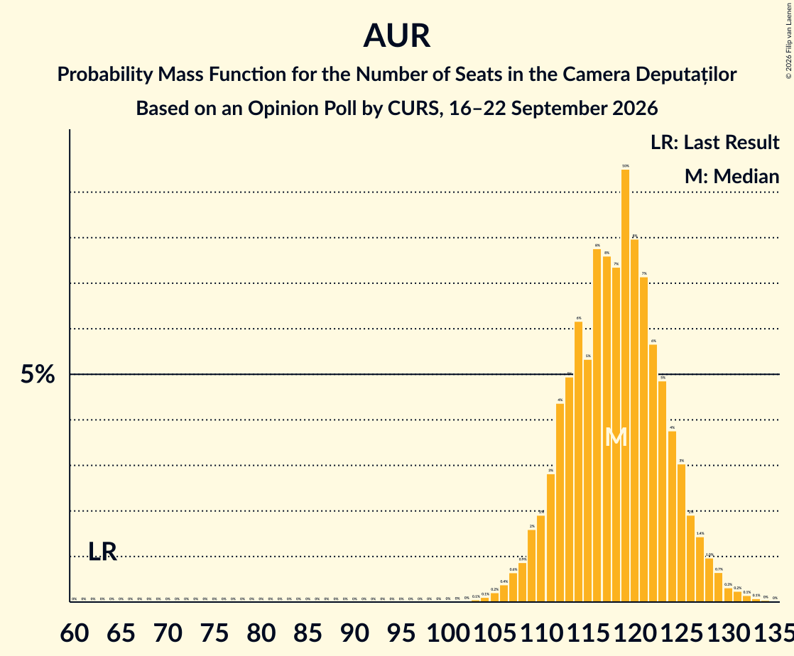

| Number of Seats | Probability | Accumulated | Special Marks |
|:---------------:|:-----------:|:-----------:|:-------------:|
| 63 | 0% | 100% | Last Result |
| 64 | 0% | 100% |  |
| 65 | 0% | 100% |  |
| 66 | 0% | 100% |  |
| 67 | 0% | 100% |  |
| 68 | 0% | 100% |  |
| 69 | 0% | 100% |  |
| 70 | 0% | 100% |  |
| 71 | 0% | 100% |  |
| 72 | 0% | 100% |  |
| 73 | 0% | 100% |  |
| 74 | 0% | 100% |  |
| 75 | 0% | 100% |  |
| 76 | 0% | 100% |  |
| 77 | 0% | 100% |  |
| 78 | 0% | 100% |  |
| 79 | 0% | 100% |  |
| 80 | 0% | 100% |  |
| 81 | 0% | 100% |  |
| 82 | 0% | 100% |  |
| 83 | 0% | 100% |  |
| 84 | 0% | 100% |  |
| 85 | 0% | 100% |  |
| 86 | 0% | 100% |  |
| 87 | 0% | 100% |  |
| 88 | 0% | 100% |  |
| 89 | 0% | 100% |  |
| 90 | 0% | 100% |  |
| 91 | 0% | 100% |  |
| 92 | 0% | 100% |  |
| 93 | 0% | 100% |  |
| 94 | 0% | 100% |  |
| 95 | 0% | 100% |  |
| 96 | 0% | 100% |  |
| 97 | 0% | 100% |  |
| 98 | 0% | 100% |  |
| 99 | 0% | 100% |  |
| 100 | 0% | 100% |  |
| 101 | 0% | 100% |  |
| 102 | 0% | 100% |  |
| 103 | 0.1% | 100% |  |
| 104 | 0.1% | 99.9% |  |
| 105 | 0.2% | 99.8% |  |
| 106 | 0.4% | 99.6% |  |
| 107 | 0.6% | 99.2% |  |
| 108 | 0.9% | 98.5% |  |
| 109 | 2% | 98% |  |
| 110 | 2% | 96% |  |
| 111 | 3% | 94% |  |
| 112 | 4% | 91% |  |
| 113 | 5% | 87% |  |
| 114 | 6% | 82% |  |
| 115 | 5% | 76% |  |
| 116 | 8% | 71% |  |
| 117 | 8% | 63% |  |
| 118 | 7% | 55% | Median |
| 119 | 10% | 48% |  |
| 120 | 8% | 38% |  |
| 121 | 7% | 30% |  |
| 122 | 6% | 23% |  |
| 123 | 5% | 18% |  |
| 124 | 4% | 13% |  |
| 125 | 3% | 9% |  |
| 126 | 2% | 6% |  |
| 127 | 1.4% | 4% |  |
| 128 | 1.0% | 2% |  |
| 129 | 0.7% | 2% |  |
| 130 | 0.3% | 0.9% |  |
| 131 | 0.2% | 0.6% |  |
| 132 | 0.1% | 0.3% |  |
| 133 | 0.1% | 0.2% |  |
| 134 | 0% | 0.1% |  |
| 135 | 0% | 0% |  |

### Partidul Social Democrat – Uniunea Salvați România

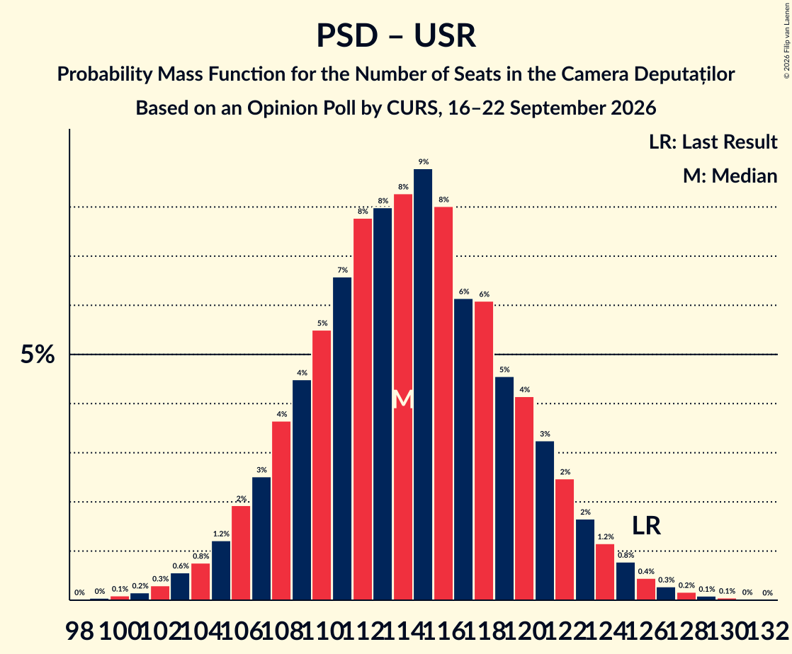

| Number of Seats | Probability | Accumulated | Special Marks |
|:---------------:|:-----------:|:-----------:|:-------------:|
| 99 | 0% | 100% |  |
| 100 | 0.1% | 99.9% |  |
| 101 | 0.2% | 99.8% |  |
| 102 | 0.3% | 99.7% |  |
| 103 | 0.5% | 99.4% |  |
| 104 | 0.9% | 98.9% |  |
| 105 | 1.4% | 98% |  |
| 106 | 2% | 97% |  |
| 107 | 2% | 95% |  |
| 108 | 3% | 92% |  |
| 109 | 4% | 89% |  |
| 110 | 6% | 85% |  |
| 111 | 7% | 79% |  |
| 112 | 7% | 72% |  |
| 113 | 9% | 65% |  |
| 114 | 8% | 56% | Median |
| 115 | 9% | 48% |  |
| 116 | 7% | 39% |  |
| 117 | 6% | 32% |  |
| 118 | 6% | 26% |  |
| 119 | 5% | 20% |  |
| 120 | 5% | 15% |  |
| 121 | 3% | 10% |  |
| 122 | 2% | 7% |  |
| 123 | 1.4% | 4% |  |
| 124 | 1.1% | 3% |  |
| 125 | 0.7% | 2% |  |
| 126 | 0.5% | 1.2% | Last Result |
| 127 | 0.3% | 0.7% |  |
| 128 | 0.2% | 0.3% |  |
| 129 | 0.1% | 0.2% |  |
| 130 | 0% | 0.1% |  |
| 131 | 0% | 0% |  |

### Partidul Național Liberal – Uniunea Salvați România – Romániai Magyar Demokrata Szövetség

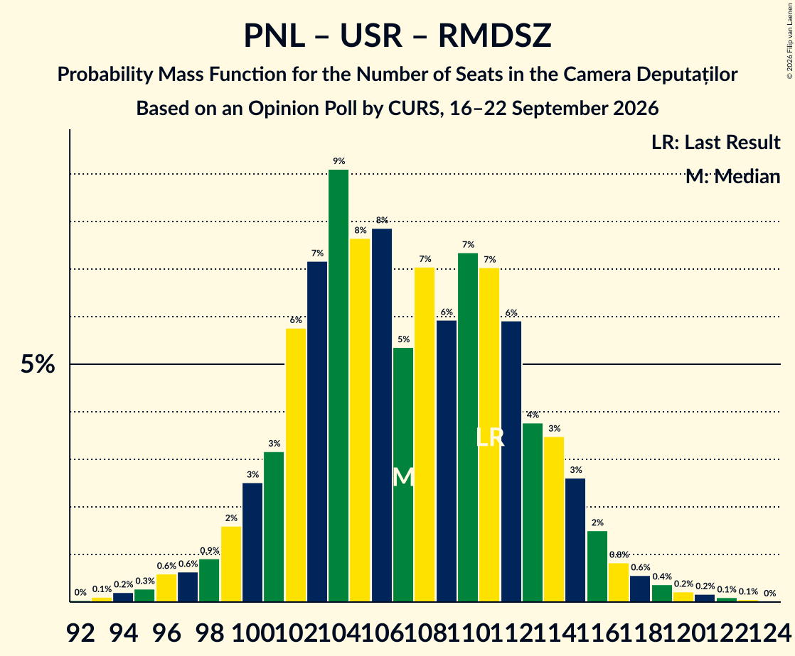

| Number of Seats | Probability | Accumulated | Special Marks |
|:---------------:|:-----------:|:-----------:|:-------------:|
| 92 | 0% | 100% |  |
| 93 | 0.1% | 99.9% |  |
| 94 | 0.2% | 99.8% |  |
| 95 | 0.3% | 99.6% |  |
| 96 | 0.6% | 99.3% |  |
| 97 | 0.6% | 98.7% |  |
| 98 | 0.9% | 98% |  |
| 99 | 2% | 97% |  |
| 100 | 3% | 96% |  |
| 101 | 3% | 93% |  |
| 102 | 6% | 90% |  |
| 103 | 7% | 84% |  |
| 104 | 9% | 77% |  |
| 105 | 8% | 68% |  |
| 106 | 8% | 60% | Median |
| 107 | 5% | 52% |  |
| 108 | 7% | 47% |  |
| 109 | 6% | 40% |  |
| 110 | 7% | 34% |  |
| 111 | 7% | 27% | Last Result |
| 112 | 6% | 20% |  |
| 113 | 4% | 14% |  |
| 114 | 3% | 10% |  |
| 115 | 3% | 6% |  |
| 116 | 2% | 4% |  |
| 117 | 0.8% | 2% |  |
| 118 | 0.6% | 2% |  |
| 119 | 0.4% | 0.9% |  |
| 120 | 0.2% | 0.6% |  |
| 121 | 0.2% | 0.4% |  |
| 122 | 0.1% | 0.2% |  |
| 123 | 0.1% | 0.1% |  |
| 124 | 0% | 0% |  |

### Partidul Național Liberal – Uniunea Salvați România

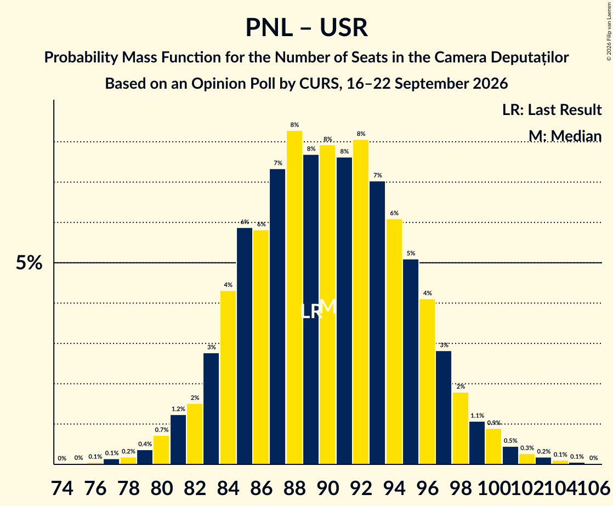

| Number of Seats | Probability | Accumulated | Special Marks |
|:---------------:|:-----------:|:-----------:|:-------------:|
| 75 | 0% | 100% |  |
| 76 | 0% | 99.9% |  |
| 77 | 0.1% | 99.9% |  |
| 78 | 0.3% | 99.8% |  |
| 79 | 0.4% | 99.5% |  |
| 80 | 0.7% | 99.2% |  |
| 81 | 1.3% | 98% |  |
| 82 | 2% | 97% |  |
| 83 | 2% | 96% |  |
| 84 | 4% | 93% |  |
| 85 | 6% | 89% |  |
| 86 | 6% | 83% |  |
| 87 | 8% | 77% |  |
| 88 | 8% | 69% |  |
| 89 | 9% | 61% | Last Result, Median |
| 90 | 8% | 52% |  |
| 91 | 6% | 44% |  |
| 92 | 8% | 38% |  |
| 93 | 8% | 30% |  |
| 94 | 6% | 22% |  |
| 95 | 4% | 16% |  |
| 96 | 4% | 12% |  |
| 97 | 3% | 8% |  |
| 98 | 2% | 5% |  |
| 99 | 1.0% | 3% |  |
| 100 | 0.8% | 2% |  |
| 101 | 0.4% | 1.1% |  |
| 102 | 0.3% | 0.6% |  |
| 103 | 0.2% | 0.4% |  |
| 104 | 0.1% | 0.2% |  |
| 105 | 0.1% | 0.1% |  |
| 106 | 0% | 0% |  |

### Partidul Social Democrat

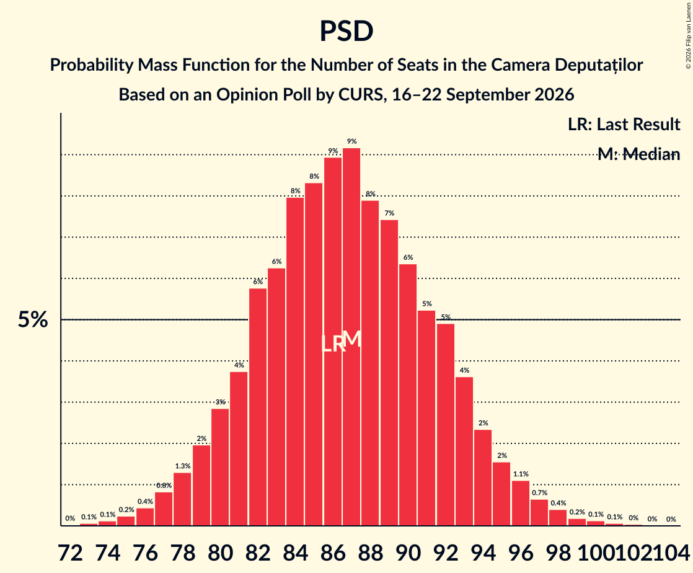

| Number of Seats | Probability | Accumulated | Special Marks |
|:---------------:|:-----------:|:-----------:|:-------------:|
| 73 | 0.1% | 100% |  |
| 74 | 0.1% | 99.9% |  |
| 75 | 0.2% | 99.7% |  |
| 76 | 0.4% | 99.5% |  |
| 77 | 0.8% | 99.2% |  |
| 78 | 1.4% | 98% |  |
| 79 | 2% | 97% |  |
| 80 | 3% | 95% |  |
| 81 | 3% | 92% |  |
| 82 | 6% | 89% |  |
| 83 | 6% | 83% |  |
| 84 | 8% | 76% |  |
| 85 | 8% | 68% |  |
| 86 | 8% | 60% | Last Result |
| 87 | 9% | 52% | Median |
| 88 | 10% | 44% |  |
| 89 | 8% | 34% |  |
| 90 | 6% | 26% |  |
| 91 | 4% | 20% |  |
| 92 | 5% | 16% |  |
| 93 | 4% | 10% |  |
| 94 | 2% | 6% |  |
| 95 | 1.4% | 4% |  |
| 96 | 0.9% | 2% |  |
| 97 | 0.6% | 2% |  |
| 98 | 0.5% | 0.9% |  |
| 99 | 0.2% | 0.4% |  |
| 100 | 0.1% | 0.2% |  |
| 101 | 0.1% | 0.1% |  |
| 102 | 0% | 0.1% |  |
| 103 | 0% | 0% |  |

### Partidul Național Liberal – Romániai Magyar Demokrata Szövetség

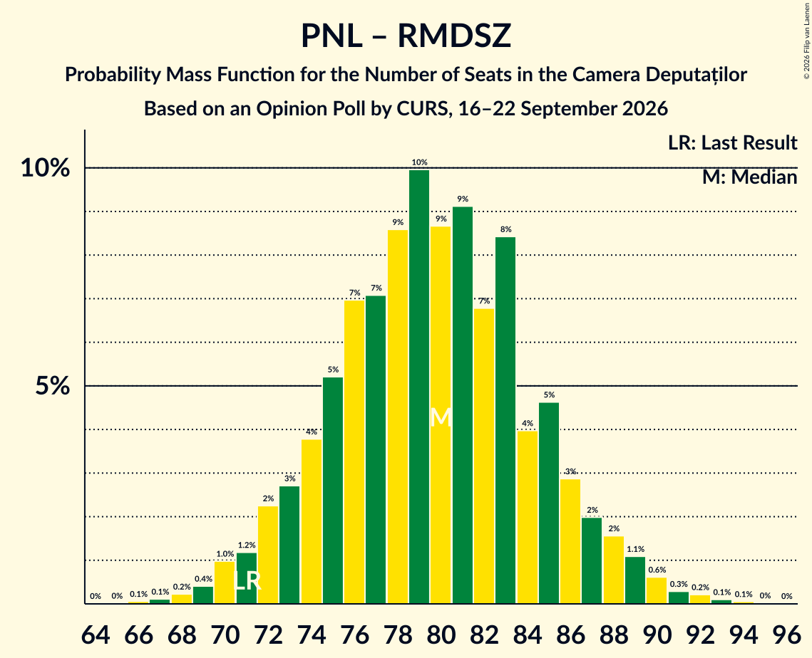

| Number of Seats | Probability | Accumulated | Special Marks |
|:---------------:|:-----------:|:-----------:|:-------------:|
| 66 | 0.1% | 100% |  |
| 67 | 0.1% | 99.9% |  |
| 68 | 0.2% | 99.8% |  |
| 69 | 0.4% | 99.6% |  |
| 70 | 1.0% | 99.2% |  |
| 71 | 1.2% | 98% | Last Result |
| 72 | 2% | 97% |  |
| 73 | 3% | 95% |  |
| 74 | 4% | 92% |  |
| 75 | 5% | 88% |  |
| 76 | 7% | 83% |  |
| 77 | 7% | 76% |  |
| 78 | 9% | 69% |  |
| 79 | 10% | 60% | Median |
| 80 | 9% | 50% |  |
| 81 | 9% | 42% |  |
| 82 | 7% | 33% |  |
| 83 | 8% | 26% |  |
| 84 | 4% | 17% |  |
| 85 | 5% | 13% |  |
| 86 | 3% | 9% |  |
| 87 | 2% | 6% |  |
| 88 | 2% | 4% |  |
| 89 | 1.1% | 2% |  |
| 90 | 0.6% | 1.3% |  |
| 91 | 0.3% | 0.7% |  |
| 92 | 0.2% | 0.4% |  |
| 93 | 0.1% | 0.2% |  |
| 94 | 0.1% | 0.1% |  |
| 95 | 0% | 0% |  |

### Partidul Național Liberal

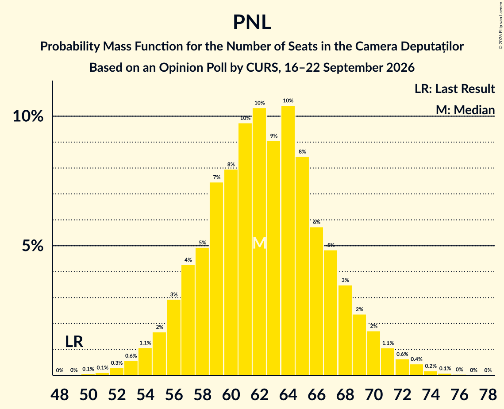

| Number of Seats | Probability | Accumulated | Special Marks |
|:---------------:|:-----------:|:-----------:|:-------------:|
| 49 | 0% | 100% | Last Result |
| 50 | 0.1% | 100% |  |
| 51 | 0.1% | 99.9% |  |
| 52 | 0.3% | 99.8% |  |
| 53 | 0.6% | 99.5% |  |
| 54 | 1.1% | 98.9% |  |
| 55 | 2% | 98% |  |
| 56 | 3% | 96% |  |
| 57 | 4% | 93% |  |
| 58 | 5% | 89% |  |
| 59 | 7% | 84% |  |
| 60 | 8% | 77% |  |
| 61 | 10% | 69% |  |
| 62 | 10% | 59% | Median |
| 63 | 9% | 49% |  |
| 64 | 10% | 39% |  |
| 65 | 8% | 29% |  |
| 66 | 6% | 21% |  |
| 67 | 5% | 15% |  |
| 68 | 3% | 10% |  |
| 69 | 2% | 7% |  |
| 70 | 2% | 4% |  |
| 71 | 1.1% | 2% |  |
| 72 | 0.6% | 1.4% |  |
| 73 | 0.4% | 0.8% |  |
| 74 | 0.2% | 0.3% |  |
| 75 | 0.1% | 0.2% |  |
| 76 | 0% | 0.1% |  |
| 77 | 0% | 0% |  |

## Technical Information

### Opinion Poll

+ **Polling firm:** CURS
+ **Commissioner(s):** —
+ **Fieldwork period:** 16–22 September 2026

### Calculations

+ **Sample size:** 1100
+ **Simulations done:** 1,048,576
+ **Error estimate:** 0.55%

