# Poll Average

<a href="#voting-intentions">Voting Intentions</a> | <a href="#seats">Seats</a> | <a href="#coalitions">Coalitions</a> | <a href="#technical-information">Technical Information</a>

## Summary

The table below lists the polls on which the average is based. They are the most recent polls (less than 90 days old) registered and analyzed so far.

| Period     | Polling firm/Commissioner(s) | PSD | AUR | PNL | USR | SOSRO | POT | RMDSZ | SENS | FD | PMP | REPER | DREPT | MINOR |
|:----------:|:----------------------------:|:--:|:--:|:--:|:--:|:--:|:--:|:--:|:--:|:--:|:--:|:--:|:--:|:--:|
| 1 December 2024 | General Election | 22.0%   86 | 18.0%   63 | 13.2%   49 | 12.4%   40 | 7.4%   28 | 6.5%   24 | 6.3%   22 | 3.0%   0 | 2.0%   0 | 2.0%   0 | 1.2%   0 | 1.2%   0 | 0.0%   19 |
| N/A | Poll Average | 16–23%   55–78 | 35–42%   122–146 | 13–17%   45–59 | 10–16%   36–56 | 1–5%   0 | 0–5%   0 | 3–6%   11–22 | 2–4%   0 | 1–2%   0 | 0–1%   0 | 0–2%   0 | 0–1%   0 | N/A   19 |
| [1–9 September 2025](2025-09-09-INSCOP.html) | INSCOP   informat.ro | 16–20%   54–70 | 38–44%   131–150 | 13–17%   45–60 | 11–15%   37–51 | 2–4%   0 | 2–4%   0 | 3–5%   10–18 | 1–3%   0 | N/A   N/A | N/A   N/A | N/A   N/A | N/A   N/A | N/A   19 |
| [21–23 July 2025](2025-07-23-Sociopol.html) | Sociopol   RomâniaTV | 19–24%   63–82 | 35–41%   121–140 | 13–17%   44–60 | 10–14%   35–48 | 1–2%   0 | 1–3%   0 | 4–7%   13–22 | 2–4%   0 | 1–2%   0 | N/A   N/A | 1–2%   0 | N/A   N/A | N/A   19 |
| [15–23 July 2025](2025-07-23-INSOMAR.html) | INSOMAR | 15–19%   54–70 | 34–39%   122–144 | 12–17%   44–60 | 11–15%   41–55 | 1–3%   0 | 2–4%   0 | 4–6%   13–23 | N/A   N/A | N/A   N/A | 0–1%   0 | 0–1%   0 | 0–1%   0 | N/A   19 |
| [10–12 July 2025](2025-07-12-FlashData.html) | FlashData | 17–19%   58–64 | 37–39%   125–132 | 15–17%   51–57 | 15–17%   51–57 | 1–2%   0 | 0–1%   0 | 4–5%   13–17 | N/A   N/A | N/A   N/A | N/A   N/A | N/A   N/A | N/A   N/A | N/A   19 |
| [4–10 July 2025](2025-07-10-CURS.html) | CURS | 18–22%   60–77 | 35–41%   120–141 | 13–17%   44–60 | 10–14%   35–48 | 3–5%   0 | 3–5%   0–18 | 4–6%   13–22 | N/A   N/A | N/A   N/A | N/A   N/A | N/A   N/A | N/A   N/A | N/A   19 |
| 1 December 2024 | General Election | 22.0%   86 | 18.0%   63 | 13.2%   49 | 12.4%   40 | 7.4%   28 | 6.5%   24 | 6.3%   22 | 3.0%   0 | 2.0%   0 | 2.0%   0 | 1.2%   0 | 1.2%   0 | 0.0%   19 |

Only polls for which at least the sample size has been published are included in the table above.

**Legend:**
+ **Top half of each row:** Voting intentions (95% confidence interval)
+ **Bottom half of each row:** Seat projections for the Camera Deputaților (95% confidence interval)
+ **PSD:** Partidul Social Democrat
+ **AUR:** Alianța pentru Unirea Românilor
+ **PNL:** Partidul Național Liberal
+ **USR:** Uniunea Salvați România
+ **SOSRO:** Partidul S.O.S. România
+ **POT:** Partidul Oamenilor Tineri
+ **RMDSZ:** Romániai Magyar Demokrata Szövetség
+ **SENS:** Sănătate, Educație, Natură, Sustenabilitate
+ **FD:** Forța Dreptei
+ **PMP:** Partidul Mișcarea Populară
+ **REPER:** Reînnoim Proiectul European al României
+ **DREPT:** Dreptate și Respect în Europa Pentru Toți
+ **MINOR:** Parties of ethnic minorities
+ **N/A (single party):** Party not included the published results
+ **N/A (entire row):** Calculation for this opinion poll not started yet

## Voting Intentions

### Confidence Intervals

| Party | Last Result | Median | 80% Confidence Interval | 90% Confidence Interval | 95% Confidence Interval | 99% Confidence Interval |
|:-----:|:-----------:|:------:|:-----------------------:|:-----------------------:|:-----------------------:|:-----------------------:|
| <a href="#partidul-social-democrat">Partidul Social Democrat</a> | 22.0% | 18.4% | 16.6–21.4% |16.1–22.1% | 15.6–22.6% | 14.8–23.6% |
| <a href="#alianța-pentru-unirea-românilor">Alianța pentru Unirea Românilor</a> | 18.0% | 38.1% | 35.9–41.0% |35.2–41.9% | 34.6–42.5% | 33.5–43.7% |
| <a href="#partidul-național-liberal">Partidul Național Liberal</a> | 13.2% | 15.3% | 13.6–16.5% |13.2–16.8% | 12.9–17.1% | 12.2–17.9% |
| <a href="#uniunea-salvați-românia">Uniunea Salvați România</a> | 12.4% | 12.9% | 11.2–16.0% |10.8–16.3% | 10.5–16.5% | 9.9–16.8% |
| <a href="#partidul-s.o.s.-românia">Partidul S.O.S. România</a> | 7.4% | 1.9% | 1.1–4.1% |0.9–4.5% | 0.7–4.8% | 0.6–5.4% |
| <a href="#partidul-oamenilor-tineri">Partidul Oamenilor Tineri</a> | 6.5% | 2.6% | 0.5–4.2% |0.5–4.5% | 0.4–4.8% | 0.4–5.4% |
| <a href="#romániai-magyar-demokrata-szövetség">Romániai Magyar Demokrata Szövetség</a> | 6.3% | 4.7% | 3.9–5.7% |3.6–6.0% | 3.4–6.3% | 3.0–6.8% |
| <a href="#sănătate,-educație,-natură,-sustenabilitate">Sănătate, Educație, Natură, Sustenabilitate</a> | 3.0% | 2.6% | 1.8–3.5% |1.6–3.8% | 1.5–4.0% | 1.3–4.5% |
| <a href="#forța-dreptei">Forța Dreptei</a> | 2.0% | 1.1% | 0.7–1.5% |0.6–1.7% | 0.6–1.8% | 0.4–2.1% |
| <a href="#partidul-mișcarea-populară">Partidul Mișcarea Populară</a> | 2.0% | 0.8% | 0.5–1.2% |0.4–1.3% | 0.3–1.4% | 0.3–1.7% |
| <a href="#reînnoim-proiectul-european-al-româniei">Reînnoim Proiectul European al României</a> | 1.2% | 0.8% | 0.4–1.4% |0.3–1.5% | 0.3–1.7% | 0.2–2.0% |
| <a href="#dreptate-și-respect-în-europa-pentru-toți">Dreptate și Respect în Europa Pentru Toți</a> | 1.2% | 0.8% | 0.5–1.2% |0.4–1.3% | 0.3–1.4% | 0.3–1.7% |
| <a href="#parties-of-ethnic-minorities">Parties of ethnic minorities</a> | 0.0% | N/A | N/A |N/A | N/A | N/A |

### Partidul Social Democrat

*For a full overview of the results for this party, see the [Partidul Social Democrat](party-partidulsocialdemocrat.html) page.*

| Voting Intentions | Probability | Accumulated | Special Marks |
|:-----------------:|:-----------:|:-----------:|:-------------:|
| 12.5–13.5% | 0% | 100% |  |
| 13.5–14.5% | 0.3% | 100% |  |
| 14.5–15.5% | 2% | 99.7% |  |
| 15.5–16.5% | 7% | 98% |  |
| 16.5–17.5% | 15% | 91% |  |
| 17.5–18.5% | 28% | 76% | Median |
| 18.5–19.5% | 15% | 47% |  |
| 19.5–20.5% | 13% | 32% |  |
| 20.5–21.5% | 11% | 20% |  |
| 21.5–22.5% | 6% | 9% | Last Result |
| 22.5–23.5% | 2% | 3% |  |
| 23.5–24.5% | 0.5% | 0.6% |  |
| 24.5–25.5% | 0.1% | 0.1% |  |
| 25.5–26.5% | 0% | 0% |  |

### Alianța pentru Unirea Românilor

*For a full overview of the results for this party, see the [Alianța pentru Unirea Românilor](party-alianțapentruunirearomânilor.html) page.*

| Voting Intentions | Probability | Accumulated | Special Marks |
|:-----------------:|:-----------:|:-----------:|:-------------:|
| 17.5–18.5% | 0% | 100% | Last Result |
| 18.5–19.5% | 0% | 100% |  |
| 19.5–20.5% | 0% | 100% |  |
| 20.5–21.5% | 0% | 100% |  |
| 21.5–22.5% | 0% | 100% |  |
| 22.5–23.5% | 0% | 100% |  |
| 23.5–24.5% | 0% | 100% |  |
| 24.5–25.5% | 0% | 100% |  |
| 25.5–26.5% | 0% | 100% |  |
| 26.5–27.5% | 0% | 100% |  |
| 27.5–28.5% | 0% | 100% |  |
| 28.5–29.5% | 0% | 100% |  |
| 29.5–30.5% | 0% | 100% |  |
| 30.5–31.5% | 0% | 100% |  |
| 31.5–32.5% | 0.1% | 100% |  |
| 32.5–33.5% | 0.5% | 99.9% |  |
| 33.5–34.5% | 2% | 99.5% |  |
| 34.5–35.5% | 5% | 98% |  |
| 35.5–36.5% | 10% | 93% |  |
| 36.5–37.5% | 18% | 83% |  |
| 37.5–38.5% | 27% | 65% | Median |
| 38.5–39.5% | 16% | 38% |  |
| 39.5–40.5% | 9% | 23% |  |
| 40.5–41.5% | 7% | 13% |  |
| 41.5–42.5% | 4% | 7% |  |
| 42.5–43.5% | 2% | 2% |  |
| 43.5–44.5% | 0.5% | 0.7% |  |
| 44.5–45.5% | 0.1% | 0.1% |  |
| 45.5–46.5% | 0% | 0% |  |

### Partidul Național Liberal

*For a full overview of the results for this party, see the [Partidul Național Liberal](party-partidulnaționalliberal.html) page.*

| Voting Intentions | Probability | Accumulated | Special Marks |
|:-----------------:|:-----------:|:-----------:|:-------------:|
| 10.5–11.5% | 0.1% | 100% |  |
| 11.5–12.5% | 1.1% | 99.9% |  |
| 12.5–13.5% | 7% | 98.8% | Last Result |
| 13.5–14.5% | 21% | 91% |  |
| 14.5–15.5% | 30% | 70% | Median |
| 15.5–16.5% | 32% | 41% |  |
| 16.5–17.5% | 7% | 8% |  |
| 17.5–18.5% | 1.0% | 1.0% |  |
| 18.5–19.5% | 0.1% | 0.1% |  |
| 19.5–20.5% | 0% | 0% |  |

### Uniunea Salvați România

*For a full overview of the results for this party, see the [Uniunea Salvați România](party-uniuneasalvațiromânia.html) page.*

| Voting Intentions | Probability | Accumulated | Special Marks |
|:-----------------:|:-----------:|:-----------:|:-------------:|
| 7.5–8.5% | 0% | 100% |  |
| 8.5–9.5% | 0.2% | 100% |  |
| 9.5–10.5% | 3% | 99.8% |  |
| 10.5–11.5% | 13% | 97% |  |
| 11.5–12.5% | 25% | 85% | Last Result |
| 12.5–13.5% | 24% | 60% | Median |
| 13.5–14.5% | 12% | 36% |  |
| 14.5–15.5% | 6% | 24% |  |
| 15.5–16.5% | 16% | 18% |  |
| 16.5–17.5% | 2% | 2% |  |
| 17.5–18.5% | 0% | 0% |  |

### Partidul S.O.S. România

*For a full overview of the results for this party, see the [Partidul S.O.S. România](party-partidulsosromânia.html) page.*

| Voting Intentions | Probability | Accumulated | Special Marks |
|:-----------------:|:-----------:|:-----------:|:-------------:|
| 0.0–0.5% | 0.5% | 100% |  |
| 0.5–1.5% | 33% | 99.5% |  |
| 1.5–2.5% | 29% | 66% | Median |
| 2.5–3.5% | 18% | 37% |  |
| 3.5–4.5% | 14% | 19% |  |
| 4.5–5.5% | 4% | 5% |  |
| 5.5–6.5% | 0.3% | 0.3% |  |
| 6.5–7.5% | 0% | 0% | Last Result |

### Partidul Oamenilor Tineri

*For a full overview of the results for this party, see the [Partidul Oamenilor Tineri](party-partiduloamenilortineri.html) page.*

| Voting Intentions | Probability | Accumulated | Special Marks |
|:-----------------:|:-----------:|:-----------:|:-------------:|
| 0.0–0.5% | 13% | 100% |  |
| 0.5–1.5% | 9% | 87% |  |
| 1.5–2.5% | 26% | 78% |  |
| 2.5–3.5% | 28% | 52% | Median |
| 3.5–4.5% | 19% | 24% |  |
| 4.5–5.5% | 5% | 5% |  |
| 5.5–6.5% | 0.3% | 0.3% | Last Result |
| 6.5–7.5% | 0% | 0% |  |

### Romániai Magyar Demokrata Szövetség

*For a full overview of the results for this party, see the [Romániai Magyar Demokrata Szövetség](party-romániaimagyardemokrataszövetség.html) page.*

| Voting Intentions | Probability | Accumulated | Special Marks |
|:-----------------:|:-----------:|:-----------:|:-------------:|
| 1.5–2.5% | 0% | 100% |  |
| 2.5–3.5% | 4% | 100% |  |
| 3.5–4.5% | 37% | 96% |  |
| 4.5–5.5% | 44% | 58% | Median |
| 5.5–6.5% | 13% | 14% | Last Result |
| 6.5–7.5% | 1.1% | 1.2% |  |
| 7.5–8.5% | 0% | 0% |  |

### Sănătate, Educație, Natură, Sustenabilitate

*For a full overview of the results for this party, see the [Sănătate, Educație, Natură, Sustenabilitate](party-sănătateeducațienaturăsustenabilitate.html) page.*

| Voting Intentions | Probability | Accumulated | Special Marks |
|:-----------------:|:-----------:|:-----------:|:-------------:|
| 0.0–0.5% | 0% | 100% |  |
| 0.5–1.5% | 3% | 100% |  |
| 1.5–2.5% | 45% | 97% |  |
| 2.5–3.5% | 42% | 52% | Last Result, Median |
| 3.5–4.5% | 9% | 10% |  |
| 4.5–5.5% | 0.4% | 0.4% |  |
| 5.5–6.5% | 0% | 0% |  |

### Forța Dreptei

*For a full overview of the results for this party, see the [Forța Dreptei](party-forțadreptei.html) page.*

| Voting Intentions | Probability | Accumulated | Special Marks |
|:-----------------:|:-----------:|:-----------:|:-------------:|
| 0.0–0.5% | 2% | 100% |  |
| 0.5–1.5% | 88% | 98% | Median |
| 1.5–2.5% | 9% | 9% | Last Result |
| 2.5–3.5% | 0% | 0% |  |

### Partidul Mișcarea Populară

*For a full overview of the results for this party, see the [Partidul Mișcarea Populară](party-partidulmișcareapopulară.html) page.*

| Voting Intentions | Probability | Accumulated | Special Marks |
|:-----------------:|:-----------:|:-----------:|:-------------:|
| 0.0–0.5% | 20% | 100% |  |
| 0.5–1.5% | 79% | 80% | Median |
| 1.5–2.5% | 1.1% | 1.1% | Last Result |
| 2.5–3.5% | 0% | 0% |  |

### Reînnoim Proiectul European al României

*For a full overview of the results for this party, see the [Reînnoim Proiectul European al României](party-reînnoimproiectuleuropeanalromâniei.html) page.*

| Voting Intentions | Probability | Accumulated | Special Marks |
|:-----------------:|:-----------:|:-----------:|:-------------:|
| 0.0–0.5% | 25% | 100% |  |
| 0.5–1.5% | 70% | 75% | Last Result, Median |
| 1.5–2.5% | 5% | 5% |  |
| 2.5–3.5% | 0% | 0% |  |

### Dreptate și Respect în Europa Pentru Toți

*For a full overview of the results for this party, see the [Dreptate și Respect în Europa Pentru Toți](party-dreptateșirespectîneuropapentrutoți.html) page.*

| Voting Intentions | Probability | Accumulated | Special Marks |
|:-----------------:|:-----------:|:-----------:|:-------------:|
| 0.0–0.5% | 20% | 100% |  |
| 0.5–1.5% | 79% | 80% | Last Result, Median |
| 1.5–2.5% | 1.1% | 1.1% |  |
| 2.5–3.5% | 0% | 0% |  |

## Seats

### Confidence Intervals

| Party | Last Result | Median | 80% Confidence Interval | 90% Confidence Interval | 95% Confidence Interval | 99% Confidence Interval |
|:-----:|:-----------:|:------:|:-----------------------:|:-----------------------:|:-----------------------:|:-----------------------:|
| <a href="#partidul-social-democrat">Partidul Social Democrat</a> | 86 | 64 | 58–74 |57–76 | 55–78 | 53–82 |
| <a href="#alianța-pentru-unirea-românilor">Alianța pentru Unirea Românilor</a> | 63 | 131 | 125–142 |123–144 | 122–146 | 118–150 |
| <a href="#partidul-național-liberal">Partidul Național Liberal</a> | 49 | 53 | 48–56 |46–58 | 45–59 | 42–62 |
| <a href="#uniunea-salvați-românia">Uniunea Salvați România</a> | 40 | 45 | 39–54 |37–55 | 36–56 | 34–57 |
| <a href="#partidul-s.o.s.-românia">Partidul S.O.S. România</a> | 28 | 0 | 0 |0 | 0 | 0–16 |
| <a href="#partidul-oamenilor-tineri">Partidul Oamenilor Tineri</a> | 24 | 0 | 0 |0 | 0 | 0–18 |
| <a href="#romániai-magyar-demokrata-szövetség">Romániai Magyar Demokrata Szövetség</a> | 22 | 16 | 13–20 |12–21 | 11–22 | 10–24 |
| <a href="#sănătate,-educație,-natură,-sustenabilitate">Sănătate, Educație, Natură, Sustenabilitate</a> | 0 | 0 | 0 |0 | 0 | 0 |
| <a href="#forța-dreptei">Forța Dreptei</a> | 0 | 0 | 0 |0 | 0 | 0 |
| <a href="#partidul-mișcarea-populară">Partidul Mișcarea Populară</a> | 0 | 0 | 0 |0 | 0 | 0 |
| <a href="#reînnoim-proiectul-european-al-româniei">Reînnoim Proiectul European al României</a> | 0 | 0 | 0 |0 | 0 | 0 |
| <a href="#dreptate-și-respect-în-europa-pentru-toți">Dreptate și Respect în Europa Pentru Toți</a> | 0 | 0 | 0 |0 | 0 | 0 |
| <a href="#parties-of-ethnic-minorities">Parties of ethnic minorities</a> | 19 | 19 | 19 |19 | 19 | 19 |

### Partidul Social Democrat

*For a full overview of the results for this party, see the [Partidul Social Democrat](party-partidulsocialdemocrat.html) page.*

| Number of Seats | Probability | Accumulated | Special Marks |
|:---------------:|:-----------:|:-----------:|:-------------:|
| 50 | 0% | 100% |  |
| 51 | 0.1% | 99.9% |  |
| 52 | 0.3% | 99.9% |  |
| 53 | 0.4% | 99.6% |  |
| 54 | 0.6% | 99.3% |  |
| 55 | 2% | 98.7% |  |
| 56 | 2% | 97% |  |
| 57 | 2% | 96% |  |
| 58 | 4% | 93% |  |
| 59 | 6% | 89% |  |
| 60 | 8% | 83% |  |
| 61 | 9% | 75% |  |
| 62 | 7% | 66% |  |
| 63 | 6% | 59% |  |
| 64 | 7% | 53% | Median |
| 65 | 5% | 46% |  |
| 66 | 4% | 42% |  |
| 67 | 6% | 38% |  |
| 68 | 3% | 32% |  |
| 69 | 3% | 29% |  |
| 70 | 5% | 25% |  |
| 71 | 5% | 21% |  |
| 72 | 3% | 15% |  |
| 73 | 2% | 12% |  |
| 74 | 3% | 11% |  |
| 75 | 2% | 7% |  |
| 76 | 0.9% | 5% |  |
| 77 | 0.6% | 4% |  |
| 78 | 2% | 4% |  |
| 79 | 1.1% | 2% |  |
| 80 | 0.2% | 0.9% |  |
| 81 | 0.1% | 0.8% |  |
| 82 | 0.4% | 0.6% |  |
| 83 | 0.2% | 0.2% |  |
| 84 | 0% | 0.1% |  |
| 85 | 0% | 0% |  |
| 86 | 0% | 0% | Last Result |

### Alianța pentru Unirea Românilor

*For a full overview of the results for this party, see the [Alianța pentru Unirea Românilor](party-alianțapentruunirearomânilor.html) page.*

| Number of Seats | Probability | Accumulated | Special Marks |
|:---------------:|:-----------:|:-----------:|:-------------:|
| 63 | 0% | 100% | Last Result |
| 64 | 0% | 100% |  |
| 65 | 0% | 100% |  |
| 66 | 0% | 100% |  |
| 67 | 0% | 100% |  |
| 68 | 0% | 100% |  |
| 69 | 0% | 100% |  |
| 70 | 0% | 100% |  |
| 71 | 0% | 100% |  |
| 72 | 0% | 100% |  |
| 73 | 0% | 100% |  |
| 74 | 0% | 100% |  |
| 75 | 0% | 100% |  |
| 76 | 0% | 100% |  |
| 77 | 0% | 100% |  |
| 78 | 0% | 100% |  |
| 79 | 0% | 100% |  |
| 80 | 0% | 100% |  |
| 81 | 0% | 100% |  |
| 82 | 0% | 100% |  |
| 83 | 0% | 100% |  |
| 84 | 0% | 100% |  |
| 85 | 0% | 100% |  |
| 86 | 0% | 100% |  |
| 87 | 0% | 100% |  |
| 88 | 0% | 100% |  |
| 89 | 0% | 100% |  |
| 90 | 0% | 100% |  |
| 91 | 0% | 100% |  |
| 92 | 0% | 100% |  |
| 93 | 0% | 100% |  |
| 94 | 0% | 100% |  |
| 95 | 0% | 100% |  |
| 96 | 0% | 100% |  |
| 97 | 0% | 100% |  |
| 98 | 0% | 100% |  |
| 99 | 0% | 100% |  |
| 100 | 0% | 100% |  |
| 101 | 0% | 100% |  |
| 102 | 0% | 100% |  |
| 103 | 0% | 100% |  |
| 104 | 0% | 100% |  |
| 105 | 0% | 100% |  |
| 106 | 0% | 100% |  |
| 107 | 0% | 100% |  |
| 108 | 0% | 100% |  |
| 109 | 0% | 100% |  |
| 110 | 0% | 100% |  |
| 111 | 0% | 100% |  |
| 112 | 0% | 100% |  |
| 113 | 0% | 100% |  |
| 114 | 0% | 100% |  |
| 115 | 0% | 99.9% |  |
| 116 | 0.1% | 99.9% |  |
| 117 | 0.1% | 99.8% |  |
| 118 | 0.3% | 99.7% |  |
| 119 | 0.3% | 99.4% |  |
| 120 | 0.3% | 99.2% |  |
| 121 | 0.5% | 98.9% |  |
| 122 | 1.0% | 98% |  |
| 123 | 3% | 97% |  |
| 124 | 2% | 94% |  |
| 125 | 3% | 93% |  |
| 126 | 4% | 89% |  |
| 127 | 6% | 85% |  |
| 128 | 9% | 79% |  |
| 129 | 9% | 70% |  |
| 130 | 7% | 61% |  |
| 131 | 5% | 54% | Median |
| 132 | 5% | 49% |  |
| 133 | 5% | 44% |  |
| 134 | 5% | 39% |  |
| 135 | 4% | 34% |  |
| 136 | 6% | 30% |  |
| 137 | 3% | 24% |  |
| 138 | 3% | 21% |  |
| 139 | 2% | 18% |  |
| 140 | 2% | 16% |  |
| 141 | 2% | 14% |  |
| 142 | 3% | 12% |  |
| 143 | 2% | 9% |  |
| 144 | 2% | 7% |  |
| 145 | 1.5% | 5% |  |
| 146 | 0.9% | 3% |  |
| 147 | 0.6% | 2% |  |
| 148 | 0.4% | 2% |  |
| 149 | 0.4% | 1.2% |  |
| 150 | 0.4% | 0.9% |  |
| 151 | 0.2% | 0.5% |  |
| 152 | 0.1% | 0.3% |  |
| 153 | 0.1% | 0.2% |  |
| 154 | 0% | 0.1% |  |
| 155 | 0% | 0% |  |

### Partidul Național Liberal

*For a full overview of the results for this party, see the [Partidul Național Liberal](party-partidulnaționalliberal.html) page.*

| Number of Seats | Probability | Accumulated | Special Marks |
|:---------------:|:-----------:|:-----------:|:-------------:|
| 40 | 0% | 100% |  |
| 41 | 0.1% | 99.9% |  |
| 42 | 0.4% | 99.8% |  |
| 43 | 0.5% | 99.5% |  |
| 44 | 1.3% | 98.9% |  |
| 45 | 1.5% | 98% |  |
| 46 | 2% | 96% |  |
| 47 | 3% | 94% |  |
| 48 | 4% | 91% |  |
| 49 | 6% | 87% | Last Result |
| 50 | 8% | 81% |  |
| 51 | 8% | 72% |  |
| 52 | 12% | 64% |  |
| 53 | 13% | 52% | Median |
| 54 | 14% | 39% |  |
| 55 | 10% | 25% |  |
| 56 | 6% | 15% |  |
| 57 | 4% | 9% |  |
| 58 | 2% | 6% |  |
| 59 | 1.1% | 3% |  |
| 60 | 1.3% | 2% |  |
| 61 | 0.4% | 1.1% |  |
| 62 | 0.3% | 0.6% |  |
| 63 | 0.2% | 0.4% |  |
| 64 | 0.1% | 0.1% |  |
| 65 | 0% | 0.1% |  |
| 66 | 0% | 0% |  |

### Uniunea Salvați România

*For a full overview of the results for this party, see the [Uniunea Salvați România](party-uniuneasalvațiromânia.html) page.*

| Number of Seats | Probability | Accumulated | Special Marks |
|:---------------:|:-----------:|:-----------:|:-------------:|
| 31 | 0.1% | 100% |  |
| 32 | 0.1% | 99.9% |  |
| 33 | 0.2% | 99.8% |  |
| 34 | 0.4% | 99.5% |  |
| 35 | 0.9% | 99.2% |  |
| 36 | 2% | 98% |  |
| 37 | 3% | 97% |  |
| 38 | 3% | 94% |  |
| 39 | 5% | 91% |  |
| 40 | 6% | 86% | Last Result |
| 41 | 7% | 80% |  |
| 42 | 7% | 73% |  |
| 43 | 8% | 67% |  |
| 44 | 8% | 59% |  |
| 45 | 6% | 51% | Median |
| 46 | 5% | 45% |  |
| 47 | 5% | 41% |  |
| 48 | 4% | 36% |  |
| 49 | 5% | 32% |  |
| 50 | 2% | 27% |  |
| 51 | 2% | 25% |  |
| 52 | 4% | 23% |  |
| 53 | 4% | 19% |  |
| 54 | 7% | 15% |  |
| 55 | 5% | 8% |  |
| 56 | 2% | 3% |  |
| 57 | 0.8% | 1.1% |  |
| 58 | 0.2% | 0.3% |  |
| 59 | 0.1% | 0.1% |  |
| 60 | 0% | 0.1% |  |
| 61 | 0% | 0% |  |

### Partidul S.O.S. România

*For a full overview of the results for this party, see the [Partidul S.O.S. România](party-partidulsosromânia.html) page.*

| Number of Seats | Probability | Accumulated | Special Marks |
|:---------------:|:-----------:|:-----------:|:-------------:|
| 0 | 99.5% | 100% | Median |
| 1 | 0% | 0.5% |  |
| 2 | 0% | 0.5% |  |
| 3 | 0% | 0.5% |  |
| 4 | 0% | 0.5% |  |
| 5 | 0% | 0.5% |  |
| 6 | 0% | 0.5% |  |
| 7 | 0% | 0.5% |  |
| 8 | 0% | 0.5% |  |
| 9 | 0% | 0.5% |  |
| 10 | 0% | 0.5% |  |
| 11 | 0% | 0.5% |  |
| 12 | 0% | 0.5% |  |
| 13 | 0% | 0.5% |  |
| 14 | 0% | 0.5% |  |
| 15 | 0% | 0.5% |  |
| 16 | 0% | 0.5% |  |
| 17 | 0% | 0.5% |  |
| 18 | 0.1% | 0.5% |  |
| 19 | 0.3% | 0.4% |  |
| 20 | 0% | 0% |  |
| 21 | 0% | 0% |  |
| 22 | 0% | 0% |  |
| 23 | 0% | 0% |  |
| 24 | 0% | 0% |  |
| 25 | 0% | 0% |  |
| 26 | 0% | 0% |  |
| 27 | 0% | 0% |  |
| 28 | 0% | 0% | Last Result |

### Partidul Oamenilor Tineri

*For a full overview of the results for this party, see the [Partidul Oamenilor Tineri](party-partiduloamenilortineri.html) page.*

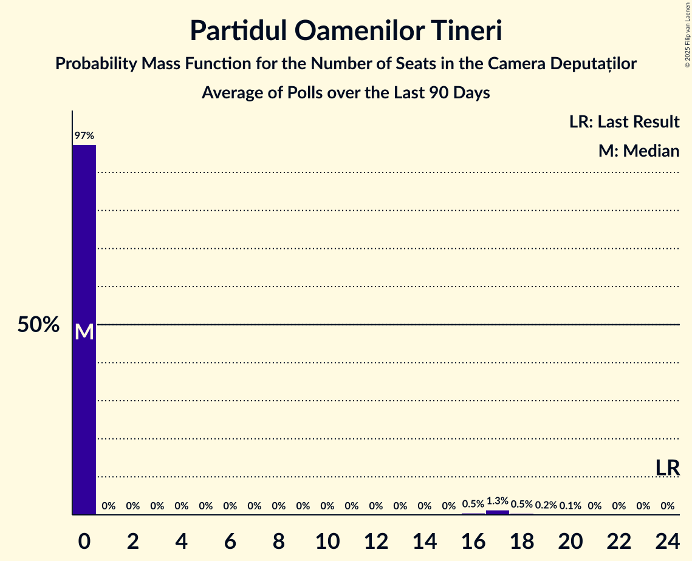

| Number of Seats | Probability | Accumulated | Special Marks |
|:---------------:|:-----------:|:-----------:|:-------------:|
| 0 | 98% | 100% | Median |
| 1 | 0% | 2% |  |
| 2 | 0% | 2% |  |
| 3 | 0% | 2% |  |
| 4 | 0% | 2% |  |
| 5 | 0% | 2% |  |
| 6 | 0% | 2% |  |
| 7 | 0% | 2% |  |
| 8 | 0% | 2% |  |
| 9 | 0% | 2% |  |
| 10 | 0% | 2% |  |
| 11 | 0% | 2% |  |
| 12 | 0% | 2% |  |
| 13 | 0% | 2% |  |
| 14 | 0% | 2% |  |
| 15 | 0% | 2% |  |
| 16 | 0.3% | 2% |  |
| 17 | 0.8% | 1.3% |  |
| 18 | 0.3% | 0.5% |  |
| 19 | 0.1% | 0.2% |  |
| 20 | 0% | 0% |  |
| 21 | 0% | 0% |  |
| 22 | 0% | 0% |  |
| 23 | 0% | 0% |  |
| 24 | 0% | 0% | Last Result |

### Romániai Magyar Demokrata Szövetség

*For a full overview of the results for this party, see the [Romániai Magyar Demokrata Szövetség](party-romániaimagyardemokrataszövetség.html) page.*

| Number of Seats | Probability | Accumulated | Special Marks |
|:---------------:|:-----------:|:-----------:|:-------------:|
| 9 | 0.2% | 100% |  |
| 10 | 0.9% | 99.7% |  |
| 11 | 2% | 98.8% |  |
| 12 | 4% | 97% |  |
| 13 | 8% | 93% |  |
| 14 | 13% | 85% |  |
| 15 | 17% | 72% |  |
| 16 | 15% | 54% | Median |
| 17 | 13% | 39% |  |
| 18 | 8% | 26% |  |
| 19 | 7% | 18% |  |
| 20 | 5% | 11% |  |
| 21 | 3% | 6% |  |
| 22 | 2% | 3% | Last Result |
| 23 | 0.6% | 1.3% |  |
| 24 | 0.5% | 0.7% |  |
| 25 | 0.1% | 0.2% |  |
| 26 | 0% | 0.1% |  |
| 27 | 0% | 0% |  |

### Sănătate, Educație, Natură, Sustenabilitate

*For a full overview of the results for this party, see the [Sănătate, Educație, Natură, Sustenabilitate](party-sănătateeducațienaturăsustenabilitate.html) page.*

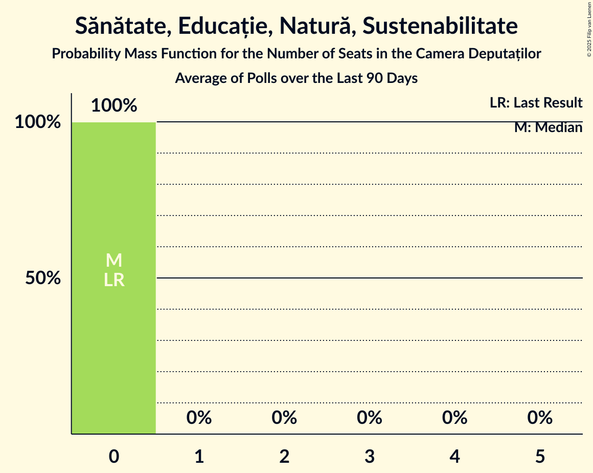

| Number of Seats | Probability | Accumulated | Special Marks |
|:---------------:|:-----------:|:-----------:|:-------------:|
| 0 | 100% | 100% | Last Result, Median |

### Forța Dreptei

*For a full overview of the results for this party, see the [Forța Dreptei](party-forțadreptei.html) page.*

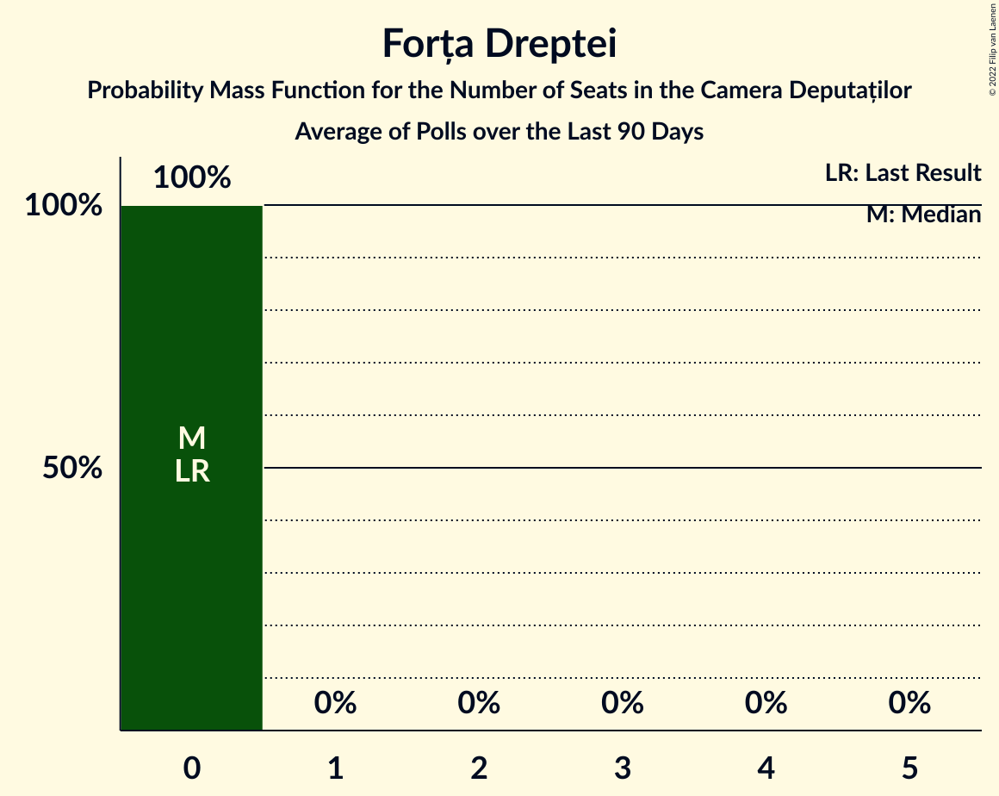

| Number of Seats | Probability | Accumulated | Special Marks |
|:---------------:|:-----------:|:-----------:|:-------------:|
| 0 | 100% | 100% | Last Result, Median |

### Partidul Mișcarea Populară

*For a full overview of the results for this party, see the [Partidul Mișcarea Populară](party-partidulmișcareapopulară.html) page.*

| Number of Seats | Probability | Accumulated | Special Marks |
|:---------------:|:-----------:|:-----------:|:-------------:|
| 0 | 100% | 100% | Last Result, Median |

### Reînnoim Proiectul European al României

*For a full overview of the results for this party, see the [Reînnoim Proiectul European al României](party-reînnoimproiectuleuropeanalromâniei.html) page.*

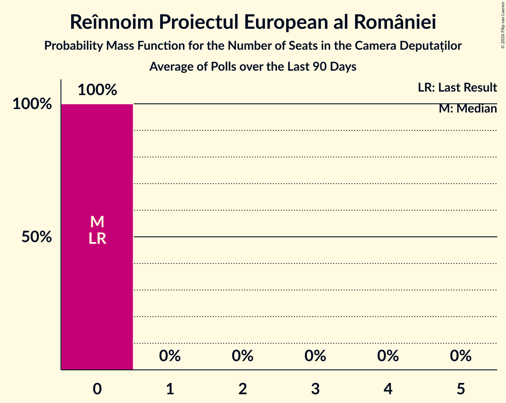

| Number of Seats | Probability | Accumulated | Special Marks |
|:---------------:|:-----------:|:-----------:|:-------------:|
| 0 | 100% | 100% | Last Result, Median |

### Dreptate și Respect în Europa Pentru Toți

*For a full overview of the results for this party, see the [Dreptate și Respect în Europa Pentru Toți](party-dreptateșirespectîneuropapentrutoți.html) page.*

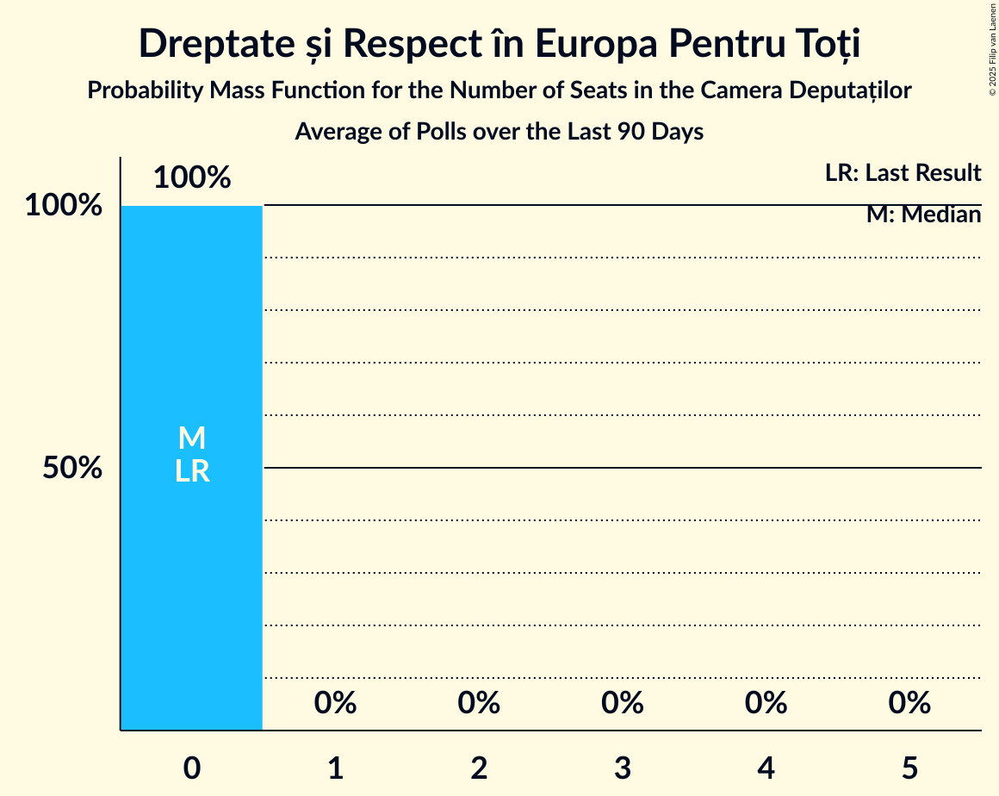

| Number of Seats | Probability | Accumulated | Special Marks |
|:---------------:|:-----------:|:-----------:|:-------------:|
| 0 | 100% | 100% | Last Result, Median |

### Parties of ethnic minorities

*For a full overview of the results for this party, see the [Parties of ethnic minorities](party-partiesofethnicminorities.html) page.*

| Number of Seats | Probability | Accumulated | Special Marks |
|:---------------:|:-----------:|:-----------:|:-------------:|
| 19 | 100% | 100% | Last Result, Median |

## Coalitions

### Confidence Intervals

| Coalition | Last Result | Median | Majority? | 80% Confidence Interval | 90% Confidence Interval | 95% Confidence Interval | 99% Confidence Interval |
|:---------:|:-----------:|:------:|:---------:|:-----------------------:|:-----------------------:|:-----------------------:|:-----------------------:|
| Partidul Social Democrat – Partidul Național Liberal – Uniunea Salvați România – Romániai Magyar Demokrata Szövetség – Parties of ethnic minorities | 216 | 199 | 100% | 189–205 | 186–207 | 184–208 | 180–212 |
| Partidul Social Democrat – Partidul Național Liberal – Uniunea Salvați România – Romániai Magyar Demokrata Szövetség | 197 | 180 | 97% | 170–186 | 167–188 | 165–189 | 161–193 |
| Partidul Social Democrat – Partidul Național Liberal – Uniunea Salvați România | 175 | 164 | 42% | 155–170 | 152–171 | 150–172 | 147–176 |
| Partidul Social Democrat – Partidul Național Liberal – Romániai Magyar Demokrata Szövetség – Parties of ethnic minorities | 176 | 151 | 4% | 144–162 | 142–165 | 140–167 | 136–170 |
| Partidul Social Democrat – Partidul Național Liberal – Romániai Magyar Demokrata Szövetség | 157 | 132 | 0% | 125–143 | 123–146 | 121–148 | 117–151 |
| Alianța pentru Unirea Românilor | 63 | 131 | 0% | 125–142 | 123–144 | 122–146 | 118–150 |
| Partidul Național Liberal – Uniunea Salvați România – Romániai Magyar Demokrata Szövetség – Parties of ethnic minorities | 130 | 132 | 0% | 124–142 | 122–143 | 120–145 | 117–148 |
| Partidul Social Democrat – Partidul Național Liberal | 135 | 117 | 0% | 110–126 | 108–128 | 106–131 | 102–133 |
| Partidul Național Liberal – Uniunea Salvați România – Romániai Magyar Demokrata Szövetség | 111 | 113 | 0% | 105–123 | 103–124 | 101–126 | 98–129 |
| Partidul Social Democrat – Uniunea Salvați România | 126 | 112 | 0% | 103–117 | 101–119 | 99–121 | 96–123 |
| Partidul Național Liberal – Uniunea Salvați România | 89 | 97 | 0% | 89–108 | 87–109 | 85–110 | 82–112 |
| Partidul Național Liberal – Romániai Magyar Demokrata Szövetség – Parties of ethnic minorities | 90 | 88 | 0% | 82–92 | 80–94 | 79–96 | 76–99 |
| Partidul Social Democrat | 86 | 64 | 0% | 58–74 | 57–76 | 55–78 | 53–82 |
| Partidul Național Liberal – Romániai Magyar Demokrata Szövetség | 71 | 69 | 0% | 63–73 | 61–75 | 60–77 | 57–80 |
| Partidul Național Liberal | 49 | 53 | 0% | 48–56 | 46–58 | 45–59 | 42–62 |

### Partidul Social Democrat – Partidul Național Liberal – Uniunea Salvați România – Romániai Magyar Demokrata Szövetség – Parties of ethnic minorities

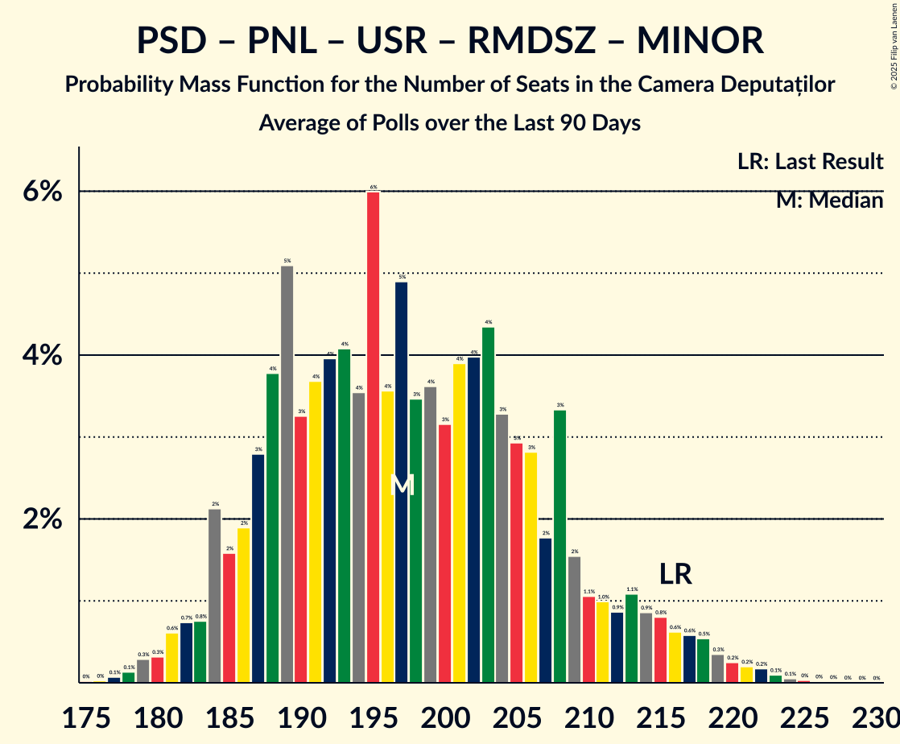

| Number of Seats | Probability | Accumulated | Special Marks |
|:---------------:|:-----------:|:-----------:|:-------------:|
| 176 | 0% | 100% |  |
| 177 | 0% | 99.9% |  |
| 178 | 0.1% | 99.9% |  |
| 179 | 0.1% | 99.8% |  |
| 180 | 0.2% | 99.6% |  |
| 181 | 0.5% | 99.4% |  |
| 182 | 0.4% | 99.0% |  |
| 183 | 0.5% | 98.5% |  |
| 184 | 0.7% | 98% |  |
| 185 | 1.0% | 97% |  |
| 186 | 2% | 96% |  |
| 187 | 2% | 95% |  |
| 188 | 2% | 93% |  |
| 189 | 3% | 90% |  |
| 190 | 2% | 87% |  |
| 191 | 2% | 85% |  |
| 192 | 2% | 82% |  |
| 193 | 3% | 80% |  |
| 194 | 4% | 77% |  |
| 195 | 6% | 74% |  |
| 196 | 4% | 68% |  |
| 197 | 5% | 64% | Median |
| 198 | 5% | 59% |  |
| 199 | 5% | 54% |  |
| 200 | 5% | 49% |  |
| 201 | 7% | 44% |  |
| 202 | 8% | 37% |  |
| 203 | 9% | 28% |  |
| 204 | 6% | 20% |  |
| 205 | 4% | 14% |  |
| 206 | 3% | 9% |  |
| 207 | 2% | 6% |  |
| 208 | 3% | 5% |  |
| 209 | 0.8% | 2% |  |
| 210 | 0.4% | 1.1% |  |
| 211 | 0.2% | 0.7% |  |
| 212 | 0.2% | 0.5% |  |
| 213 | 0.2% | 0.3% |  |
| 214 | 0.1% | 0.2% |  |
| 215 | 0.1% | 0.1% |  |
| 216 | 0% | 0% | Last Result |

### Partidul Social Democrat – Partidul Național Liberal – Uniunea Salvați România – Romániai Magyar Demokrata Szövetség

| Number of Seats | Probability | Accumulated | Special Marks |
|:---------------:|:-----------:|:-----------:|:-------------:|
| 157 | 0% | 100% |  |
| 158 | 0% | 99.9% |  |
| 159 | 0.1% | 99.9% |  |
| 160 | 0.1% | 99.8% |  |
| 161 | 0.2% | 99.6% |  |
| 162 | 0.5% | 99.4% |  |
| 163 | 0.4% | 99.0% |  |
| 164 | 0.5% | 98.5% |  |
| 165 | 0.7% | 98% |  |
| 166 | 1.0% | 97% | Majority |
| 167 | 2% | 96% |  |
| 168 | 2% | 95% |  |
| 169 | 2% | 93% |  |
| 170 | 3% | 90% |  |
| 171 | 2% | 87% |  |
| 172 | 2% | 85% |  |
| 173 | 2% | 82% |  |
| 174 | 3% | 80% |  |
| 175 | 4% | 77% |  |
| 176 | 6% | 74% |  |
| 177 | 4% | 68% |  |
| 178 | 5% | 64% | Median |
| 179 | 5% | 59% |  |
| 180 | 5% | 54% |  |
| 181 | 5% | 49% |  |
| 182 | 7% | 44% |  |
| 183 | 8% | 37% |  |
| 184 | 9% | 28% |  |
| 185 | 6% | 20% |  |
| 186 | 4% | 14% |  |
| 187 | 3% | 9% |  |
| 188 | 2% | 6% |  |
| 189 | 3% | 5% |  |
| 190 | 0.8% | 2% |  |
| 191 | 0.4% | 1.1% |  |
| 192 | 0.2% | 0.7% |  |
| 193 | 0.2% | 0.5% |  |
| 194 | 0.2% | 0.3% |  |
| 195 | 0.1% | 0.2% |  |
| 196 | 0.1% | 0.1% |  |
| 197 | 0% | 0% | Last Result |

### Partidul Social Democrat – Partidul Național Liberal – Uniunea Salvați România

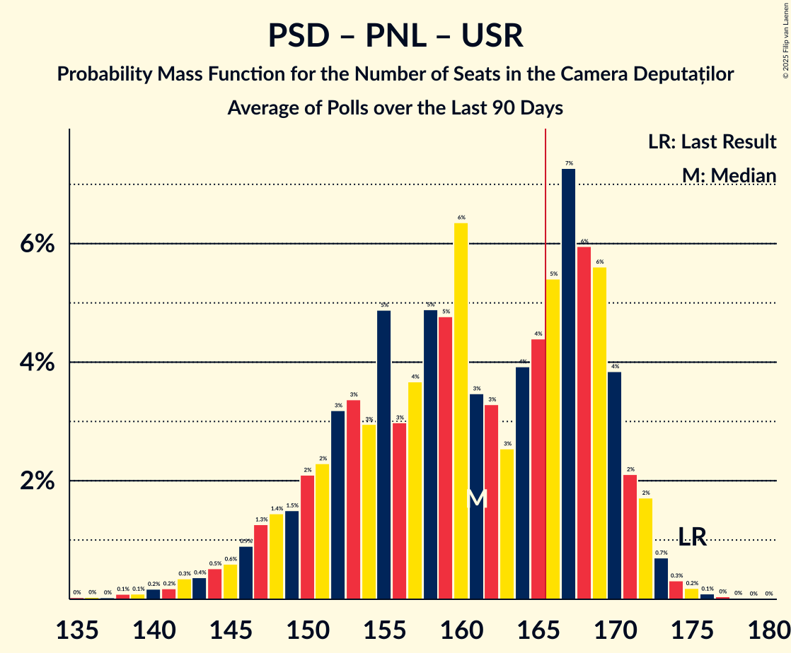

| Number of Seats | Probability | Accumulated | Special Marks |
|:---------------:|:-----------:|:-----------:|:-------------:|
| 142 | 0% | 100% |  |
| 143 | 0% | 99.9% |  |
| 144 | 0.1% | 99.9% |  |
| 145 | 0.1% | 99.8% |  |
| 146 | 0.1% | 99.7% |  |
| 147 | 0.2% | 99.6% |  |
| 148 | 0.4% | 99.4% |  |
| 149 | 0.8% | 98.9% |  |
| 150 | 0.8% | 98% |  |
| 151 | 1.2% | 97% |  |
| 152 | 2% | 96% |  |
| 153 | 2% | 94% |  |
| 154 | 2% | 92% |  |
| 155 | 3% | 90% |  |
| 156 | 3% | 88% |  |
| 157 | 4% | 84% |  |
| 158 | 4% | 80% |  |
| 159 | 4% | 76% |  |
| 160 | 5% | 72% |  |
| 161 | 4% | 67% |  |
| 162 | 5% | 63% | Median |
| 163 | 4% | 58% |  |
| 164 | 6% | 54% |  |
| 165 | 6% | 48% |  |
| 166 | 7% | 42% | Majority |
| 167 | 9% | 35% |  |
| 168 | 7% | 26% |  |
| 169 | 7% | 19% |  |
| 170 | 5% | 13% |  |
| 171 | 3% | 8% |  |
| 172 | 2% | 5% |  |
| 173 | 1.2% | 2% |  |
| 174 | 0.5% | 1.3% |  |
| 175 | 0.3% | 0.8% | Last Result |
| 176 | 0.2% | 0.5% |  |
| 177 | 0.2% | 0.4% |  |
| 178 | 0.1% | 0.2% |  |
| 179 | 0% | 0.1% |  |
| 180 | 0% | 0.1% |  |
| 181 | 0% | 0% |  |

### Partidul Social Democrat – Partidul Național Liberal – Romániai Magyar Demokrata Szövetség – Parties of ethnic minorities

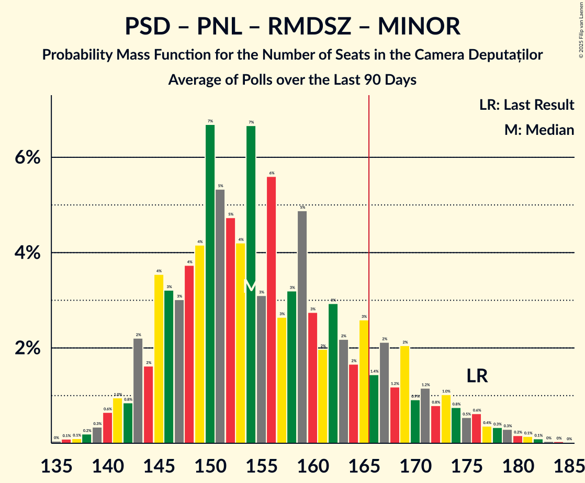

| Number of Seats | Probability | Accumulated | Special Marks |
|:---------------:|:-----------:|:-----------:|:-------------:|
| 132 | 0% | 100% |  |
| 133 | 0.1% | 99.9% |  |
| 134 | 0.1% | 99.9% |  |
| 135 | 0.2% | 99.8% |  |
| 136 | 0.2% | 99.6% |  |
| 137 | 0.3% | 99.5% |  |
| 138 | 0.4% | 99.2% |  |
| 139 | 0.6% | 98.8% |  |
| 140 | 1.0% | 98% |  |
| 141 | 1.3% | 97% |  |
| 142 | 2% | 96% |  |
| 143 | 2% | 94% |  |
| 144 | 2% | 92% |  |
| 145 | 4% | 90% |  |
| 146 | 5% | 86% |  |
| 147 | 6% | 81% |  |
| 148 | 7% | 75% |  |
| 149 | 7% | 68% |  |
| 150 | 7% | 61% |  |
| 151 | 4% | 54% |  |
| 152 | 4% | 50% | Median |
| 153 | 4% | 46% |  |
| 154 | 6% | 42% |  |
| 155 | 3% | 36% |  |
| 156 | 5% | 33% |  |
| 157 | 3% | 27% |  |
| 158 | 4% | 25% |  |
| 159 | 5% | 21% |  |
| 160 | 3% | 16% |  |
| 161 | 2% | 13% |  |
| 162 | 2% | 11% |  |
| 163 | 2% | 9% |  |
| 164 | 1.0% | 7% |  |
| 165 | 2% | 6% |  |
| 166 | 0.8% | 4% | Majority |
| 167 | 1.2% | 3% |  |
| 168 | 0.3% | 2% |  |
| 169 | 1.0% | 2% |  |
| 170 | 0.2% | 0.5% |  |
| 171 | 0.1% | 0.4% |  |
| 172 | 0.1% | 0.3% |  |
| 173 | 0.1% | 0.1% |  |
| 174 | 0% | 0.1% |  |
| 175 | 0% | 0% |  |
| 176 | 0% | 0% | Last Result |

### Partidul Social Democrat – Partidul Național Liberal – Romániai Magyar Demokrata Szövetség

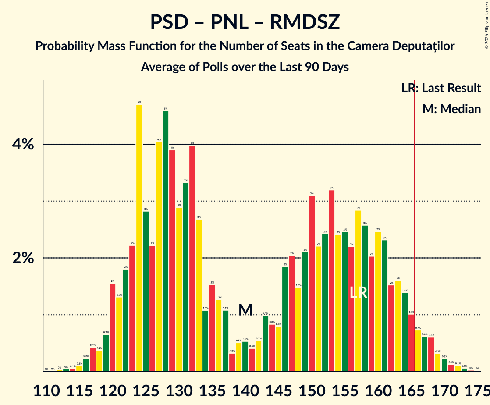

| Number of Seats | Probability | Accumulated | Special Marks |
|:---------------:|:-----------:|:-----------:|:-------------:|
| 113 | 0% | 100% |  |
| 114 | 0.1% | 99.9% |  |
| 115 | 0.1% | 99.9% |  |
| 116 | 0.2% | 99.8% |  |
| 117 | 0.2% | 99.6% |  |
| 118 | 0.3% | 99.5% |  |
| 119 | 0.4% | 99.2% |  |
| 120 | 0.6% | 98.8% |  |
| 121 | 1.0% | 98% |  |
| 122 | 1.3% | 97% |  |
| 123 | 2% | 96% |  |
| 124 | 2% | 94% |  |
| 125 | 2% | 92% |  |
| 126 | 4% | 90% |  |
| 127 | 5% | 86% |  |
| 128 | 6% | 81% |  |
| 129 | 7% | 75% |  |
| 130 | 7% | 68% |  |
| 131 | 7% | 61% |  |
| 132 | 4% | 54% |  |
| 133 | 4% | 50% | Median |
| 134 | 4% | 46% |  |
| 135 | 6% | 42% |  |
| 136 | 3% | 36% |  |
| 137 | 5% | 33% |  |
| 138 | 3% | 27% |  |
| 139 | 4% | 25% |  |
| 140 | 5% | 21% |  |
| 141 | 3% | 16% |  |
| 142 | 2% | 13% |  |
| 143 | 2% | 11% |  |
| 144 | 2% | 9% |  |
| 145 | 1.0% | 7% |  |
| 146 | 2% | 6% |  |
| 147 | 0.8% | 4% |  |
| 148 | 1.2% | 3% |  |
| 149 | 0.3% | 2% |  |
| 150 | 1.0% | 2% |  |
| 151 | 0.2% | 0.5% |  |
| 152 | 0.1% | 0.4% |  |
| 153 | 0.1% | 0.3% |  |
| 154 | 0.1% | 0.1% |  |
| 155 | 0% | 0.1% |  |
| 156 | 0% | 0% |  |
| 157 | 0% | 0% | Last Result |

### Alianța pentru Unirea Românilor

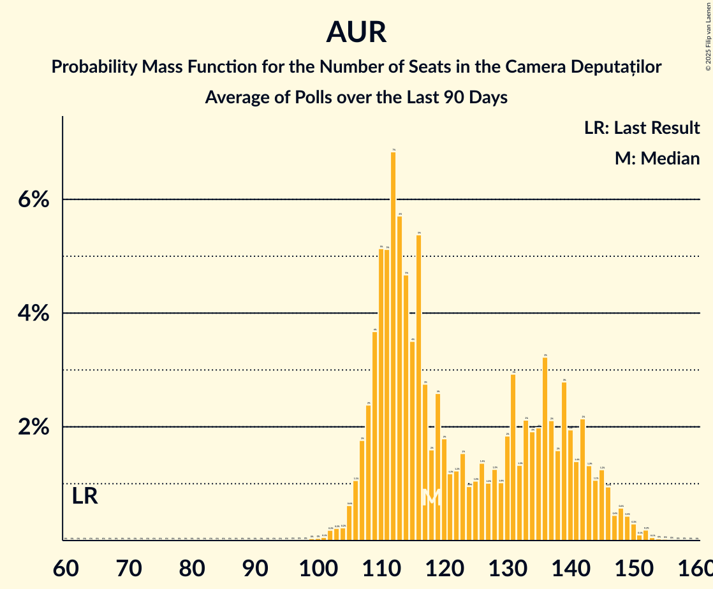

| Number of Seats | Probability | Accumulated | Special Marks |
|:---------------:|:-----------:|:-----------:|:-------------:|
| 63 | 0% | 100% | Last Result |
| 64 | 0% | 100% |  |
| 65 | 0% | 100% |  |
| 66 | 0% | 100% |  |
| 67 | 0% | 100% |  |
| 68 | 0% | 100% |  |
| 69 | 0% | 100% |  |
| 70 | 0% | 100% |  |
| 71 | 0% | 100% |  |
| 72 | 0% | 100% |  |
| 73 | 0% | 100% |  |
| 74 | 0% | 100% |  |
| 75 | 0% | 100% |  |
| 76 | 0% | 100% |  |
| 77 | 0% | 100% |  |
| 78 | 0% | 100% |  |
| 79 | 0% | 100% |  |
| 80 | 0% | 100% |  |
| 81 | 0% | 100% |  |
| 82 | 0% | 100% |  |
| 83 | 0% | 100% |  |
| 84 | 0% | 100% |  |
| 85 | 0% | 100% |  |
| 86 | 0% | 100% |  |
| 87 | 0% | 100% |  |
| 88 | 0% | 100% |  |
| 89 | 0% | 100% |  |
| 90 | 0% | 100% |  |
| 91 | 0% | 100% |  |
| 92 | 0% | 100% |  |
| 93 | 0% | 100% |  |
| 94 | 0% | 100% |  |
| 95 | 0% | 100% |  |
| 96 | 0% | 100% |  |
| 97 | 0% | 100% |  |
| 98 | 0% | 100% |  |
| 99 | 0% | 100% |  |
| 100 | 0% | 100% |  |
| 101 | 0% | 100% |  |
| 102 | 0% | 100% |  |
| 103 | 0% | 100% |  |
| 104 | 0% | 100% |  |
| 105 | 0% | 100% |  |
| 106 | 0% | 100% |  |
| 107 | 0% | 100% |  |
| 108 | 0% | 100% |  |
| 109 | 0% | 100% |  |
| 110 | 0% | 100% |  |
| 111 | 0% | 100% |  |
| 112 | 0% | 100% |  |
| 113 | 0% | 100% |  |
| 114 | 0% | 100% |  |
| 115 | 0% | 99.9% |  |
| 116 | 0.1% | 99.9% |  |
| 117 | 0.1% | 99.8% |  |
| 118 | 0.3% | 99.7% |  |
| 119 | 0.3% | 99.4% |  |
| 120 | 0.3% | 99.2% |  |
| 121 | 0.5% | 98.9% |  |
| 122 | 1.0% | 98% |  |
| 123 | 3% | 97% |  |
| 124 | 2% | 94% |  |
| 125 | 3% | 93% |  |
| 126 | 4% | 89% |  |
| 127 | 6% | 85% |  |
| 128 | 9% | 79% |  |
| 129 | 9% | 70% |  |
| 130 | 7% | 61% |  |
| 131 | 5% | 54% | Median |
| 132 | 5% | 49% |  |
| 133 | 5% | 44% |  |
| 134 | 5% | 39% |  |
| 135 | 4% | 34% |  |
| 136 | 6% | 30% |  |
| 137 | 3% | 24% |  |
| 138 | 3% | 21% |  |
| 139 | 2% | 18% |  |
| 140 | 2% | 16% |  |
| 141 | 2% | 14% |  |
| 142 | 3% | 12% |  |
| 143 | 2% | 9% |  |
| 144 | 2% | 7% |  |
| 145 | 1.5% | 5% |  |
| 146 | 0.9% | 3% |  |
| 147 | 0.6% | 2% |  |
| 148 | 0.4% | 2% |  |
| 149 | 0.4% | 1.2% |  |
| 150 | 0.4% | 0.9% |  |
| 151 | 0.2% | 0.5% |  |
| 152 | 0.1% | 0.3% |  |
| 153 | 0.1% | 0.2% |  |
| 154 | 0% | 0.1% |  |
| 155 | 0% | 0% |  |

### Partidul Național Liberal – Uniunea Salvați România – Romániai Magyar Demokrata Szövetség – Parties of ethnic minorities

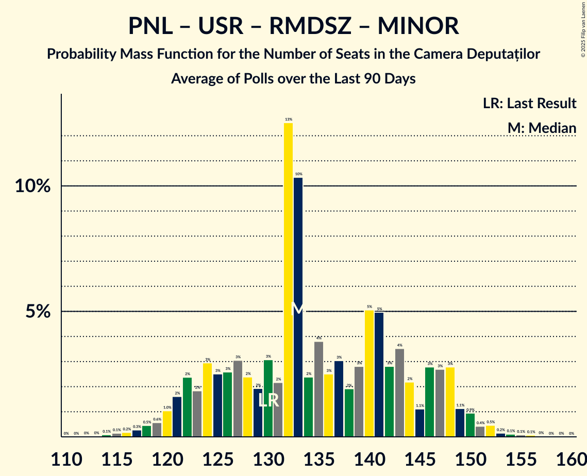

| Number of Seats | Probability | Accumulated | Special Marks |
|:---------------:|:-----------:|:-----------:|:-------------:|
| 113 | 0% | 100% |  |
| 114 | 0.1% | 99.9% |  |
| 115 | 0.1% | 99.8% |  |
| 116 | 0.2% | 99.7% |  |
| 117 | 0.4% | 99.6% |  |
| 118 | 0.4% | 99.1% |  |
| 119 | 0.6% | 98.7% |  |
| 120 | 1.0% | 98% |  |
| 121 | 2% | 97% |  |
| 122 | 2% | 96% |  |
| 123 | 2% | 94% |  |
| 124 | 3% | 92% |  |
| 125 | 4% | 89% |  |
| 126 | 3% | 85% |  |
| 127 | 5% | 82% |  |
| 128 | 5% | 77% |  |
| 129 | 6% | 72% |  |
| 130 | 5% | 66% | Last Result |
| 131 | 7% | 60% |  |
| 132 | 6% | 53% |  |
| 133 | 3% | 47% | Median |
| 134 | 3% | 44% |  |
| 135 | 2% | 41% |  |
| 136 | 1.5% | 39% |  |
| 137 | 3% | 37% |  |
| 138 | 4% | 34% |  |
| 139 | 7% | 31% |  |
| 140 | 5% | 24% |  |
| 141 | 5% | 19% |  |
| 142 | 6% | 14% |  |
| 143 | 4% | 9% |  |
| 144 | 2% | 4% |  |
| 145 | 0.8% | 3% |  |
| 146 | 0.4% | 2% |  |
| 147 | 0.6% | 1.3% |  |
| 148 | 0.4% | 0.7% |  |
| 149 | 0.2% | 0.3% |  |
| 150 | 0.1% | 0.1% |  |
| 151 | 0% | 0.1% |  |
| 152 | 0% | 0% |  |

### Partidul Social Democrat – Partidul Național Liberal

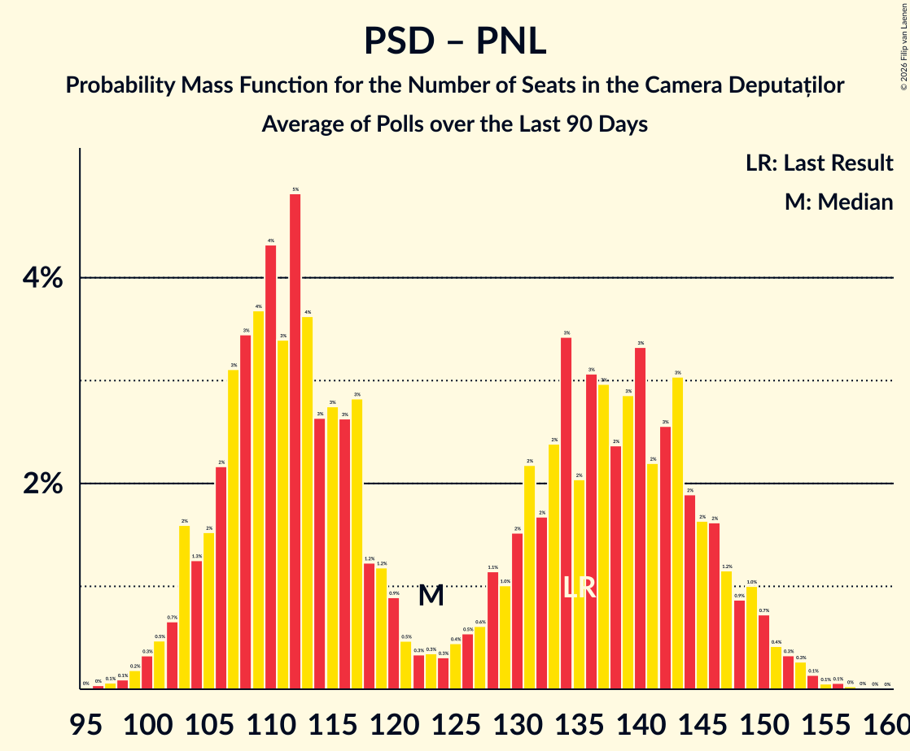

| Number of Seats | Probability | Accumulated | Special Marks |
|:---------------:|:-----------:|:-----------:|:-------------:|
| 98 | 0% | 100% |  |
| 99 | 0% | 99.9% |  |
| 100 | 0.1% | 99.9% |  |
| 101 | 0.1% | 99.9% |  |
| 102 | 0.3% | 99.7% |  |
| 103 | 0.3% | 99.5% |  |
| 104 | 0.4% | 99.1% |  |
| 105 | 0.5% | 98.7% |  |
| 106 | 0.9% | 98% |  |
| 107 | 1.2% | 97% |  |
| 108 | 1.5% | 96% |  |
| 109 | 2% | 95% |  |
| 110 | 3% | 93% |  |
| 111 | 3% | 89% |  |
| 112 | 6% | 86% |  |
| 113 | 7% | 81% |  |
| 114 | 9% | 74% |  |
| 115 | 8% | 65% |  |
| 116 | 7% | 57% |  |
| 117 | 6% | 50% | Median |
| 118 | 7% | 44% |  |
| 119 | 3% | 37% |  |
| 120 | 4% | 34% |  |
| 121 | 5% | 30% |  |
| 122 | 4% | 25% |  |
| 123 | 5% | 21% |  |
| 124 | 3% | 16% |  |
| 125 | 2% | 13% |  |
| 126 | 2% | 11% |  |
| 127 | 2% | 8% |  |
| 128 | 1.3% | 6% |  |
| 129 | 1.0% | 5% |  |
| 130 | 0.7% | 4% |  |
| 131 | 1.4% | 3% |  |
| 132 | 0.8% | 2% |  |
| 133 | 0.6% | 1.0% |  |
| 134 | 0.1% | 0.4% |  |
| 135 | 0.1% | 0.3% | Last Result |
| 136 | 0.1% | 0.2% |  |
| 137 | 0.1% | 0.1% |  |
| 138 | 0% | 0.1% |  |
| 139 | 0% | 0% |  |

### Partidul Național Liberal – Uniunea Salvați România – Romániai Magyar Demokrata Szövetség

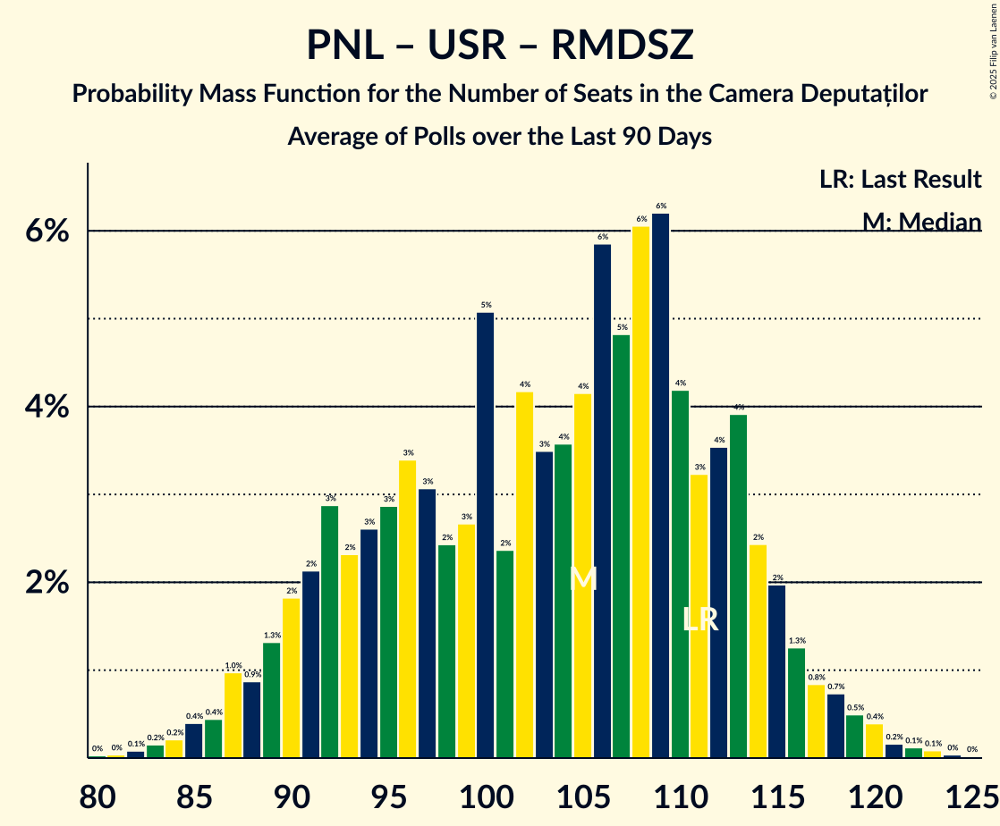

| Number of Seats | Probability | Accumulated | Special Marks |
|:---------------:|:-----------:|:-----------:|:-------------:|
| 94 | 0% | 100% |  |
| 95 | 0.1% | 99.9% |  |
| 96 | 0.1% | 99.8% |  |
| 97 | 0.2% | 99.7% |  |
| 98 | 0.4% | 99.6% |  |
| 99 | 0.4% | 99.1% |  |
| 100 | 0.6% | 98.7% |  |
| 101 | 1.0% | 98% |  |
| 102 | 2% | 97% |  |
| 103 | 2% | 96% |  |
| 104 | 2% | 94% |  |
| 105 | 3% | 92% |  |
| 106 | 4% | 89% |  |
| 107 | 3% | 85% |  |
| 108 | 5% | 82% |  |
| 109 | 5% | 77% |  |
| 110 | 6% | 72% |  |
| 111 | 5% | 66% | Last Result |
| 112 | 7% | 60% |  |
| 113 | 6% | 53% |  |
| 114 | 3% | 47% | Median |
| 115 | 3% | 44% |  |
| 116 | 2% | 41% |  |
| 117 | 1.5% | 39% |  |
| 118 | 3% | 37% |  |
| 119 | 4% | 34% |  |
| 120 | 7% | 31% |  |
| 121 | 5% | 24% |  |
| 122 | 5% | 19% |  |
| 123 | 6% | 14% |  |
| 124 | 4% | 9% |  |
| 125 | 2% | 4% |  |
| 126 | 0.8% | 3% |  |
| 127 | 0.4% | 2% |  |
| 128 | 0.6% | 1.3% |  |
| 129 | 0.4% | 0.7% |  |
| 130 | 0.2% | 0.3% |  |
| 131 | 0.1% | 0.1% |  |
| 132 | 0% | 0.1% |  |
| 133 | 0% | 0% |  |

### Partidul Social Democrat – Uniunea Salvați România

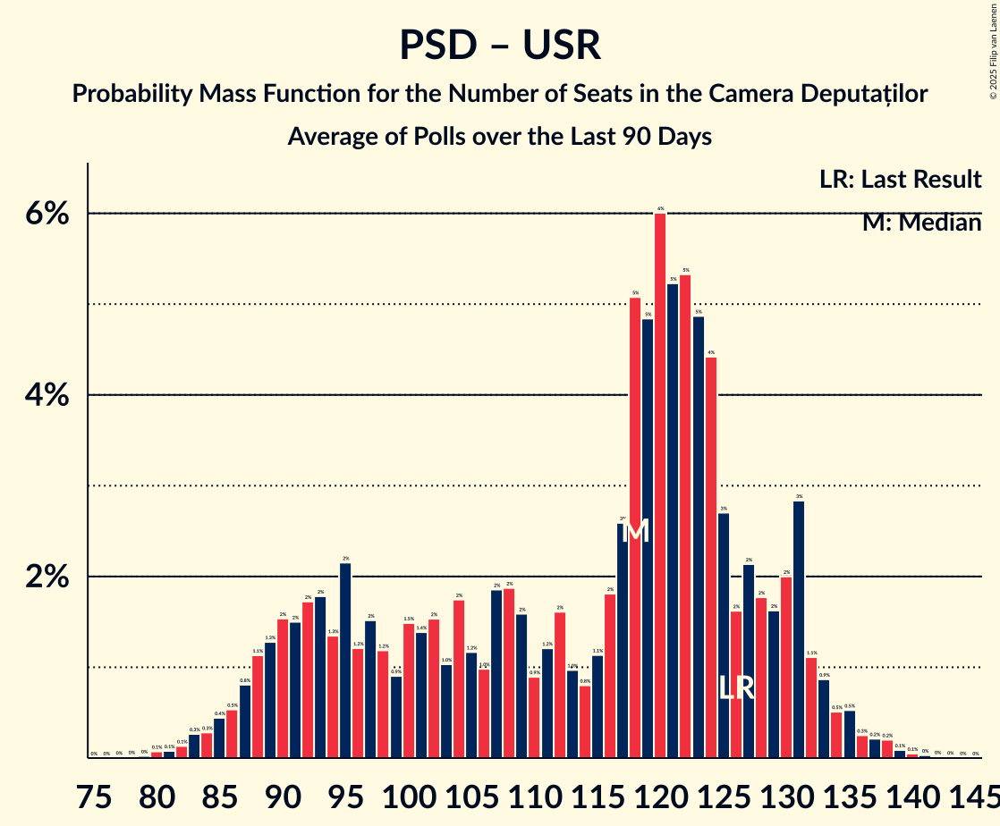

| Number of Seats | Probability | Accumulated | Special Marks |
|:---------------:|:-----------:|:-----------:|:-------------:|
| 92 | 0% | 100% |  |
| 93 | 0.1% | 99.9% |  |
| 94 | 0.1% | 99.9% |  |
| 95 | 0.2% | 99.8% |  |
| 96 | 0.2% | 99.6% |  |
| 97 | 0.5% | 99.4% |  |
| 98 | 0.8% | 98.9% |  |
| 99 | 1.1% | 98% |  |
| 100 | 2% | 97% |  |
| 101 | 2% | 95% |  |
| 102 | 2% | 93% |  |
| 103 | 3% | 91% |  |
| 104 | 3% | 88% |  |
| 105 | 4% | 85% |  |
| 106 | 5% | 81% |  |
| 107 | 5% | 76% |  |
| 108 | 5% | 71% |  |
| 109 | 4% | 66% | Median |
| 110 | 4% | 62% |  |
| 111 | 5% | 58% |  |
| 112 | 6% | 52% |  |
| 113 | 11% | 46% |  |
| 114 | 9% | 35% |  |
| 115 | 8% | 26% |  |
| 116 | 6% | 19% |  |
| 117 | 3% | 13% |  |
| 118 | 3% | 9% |  |
| 119 | 2% | 6% |  |
| 120 | 2% | 4% |  |
| 121 | 0.9% | 3% |  |
| 122 | 0.8% | 2% |  |
| 123 | 0.4% | 0.9% |  |
| 124 | 0.2% | 0.5% |  |
| 125 | 0.1% | 0.3% |  |
| 126 | 0.1% | 0.2% | Last Result |
| 127 | 0% | 0.1% |  |
| 128 | 0% | 0.1% |  |
| 129 | 0% | 0% |  |

### Partidul Național Liberal – Uniunea Salvați România

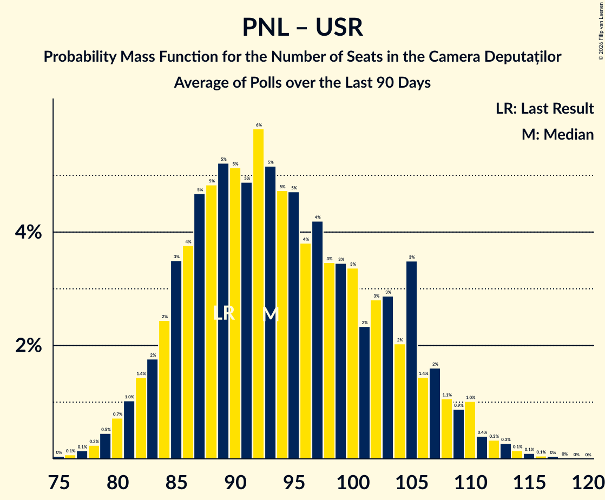

| Number of Seats | Probability | Accumulated | Special Marks |
|:---------------:|:-----------:|:-----------:|:-------------:|
| 78 | 0% | 100% |  |
| 79 | 0.1% | 99.9% |  |
| 80 | 0.1% | 99.9% |  |
| 81 | 0.2% | 99.7% |  |
| 82 | 0.2% | 99.6% |  |
| 83 | 0.4% | 99.3% |  |
| 84 | 0.9% | 98.9% |  |
| 85 | 1.1% | 98% |  |
| 86 | 0.8% | 97% |  |
| 87 | 1.4% | 96% |  |
| 88 | 2% | 95% |  |
| 89 | 3% | 92% | Last Result |
| 90 | 3% | 89% |  |
| 91 | 3% | 86% |  |
| 92 | 4% | 83% |  |
| 93 | 8% | 79% |  |
| 94 | 8% | 72% |  |
| 95 | 6% | 64% |  |
| 96 | 4% | 58% |  |
| 97 | 5% | 53% |  |
| 98 | 4% | 48% | Median |
| 99 | 5% | 44% |  |
| 100 | 3% | 39% |  |
| 101 | 3% | 36% |  |
| 102 | 2% | 33% |  |
| 103 | 4% | 31% |  |
| 104 | 3% | 26% |  |
| 105 | 4% | 24% |  |
| 106 | 2% | 20% |  |
| 107 | 2% | 18% |  |
| 108 | 8% | 15% |  |
| 109 | 5% | 8% |  |
| 110 | 1.0% | 3% |  |
| 111 | 0.8% | 2% |  |
| 112 | 0.6% | 0.8% |  |
| 113 | 0.1% | 0.2% |  |
| 114 | 0% | 0.1% |  |
| 115 | 0% | 0.1% |  |
| 116 | 0% | 0% |  |

### Partidul Național Liberal – Romániai Magyar Demokrata Szövetség – Parties of ethnic minorities

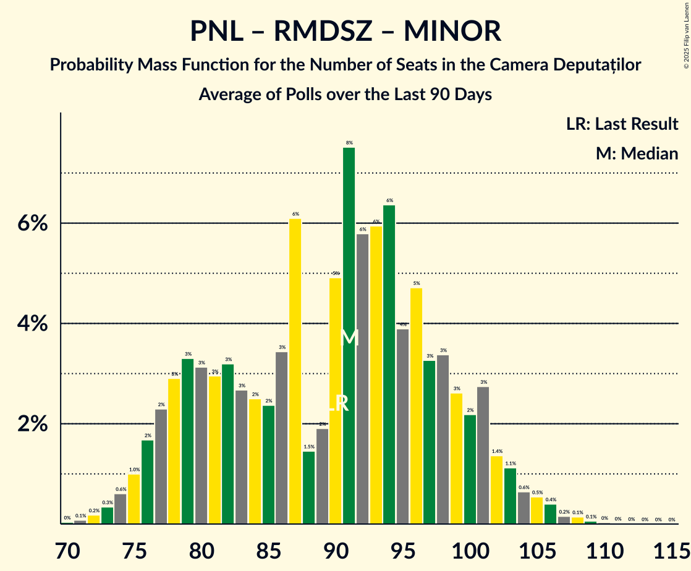

| Number of Seats | Probability | Accumulated | Special Marks |
|:---------------:|:-----------:|:-----------:|:-------------:|
| 73 | 0% | 100% |  |
| 74 | 0.1% | 99.9% |  |
| 75 | 0.2% | 99.9% |  |
| 76 | 0.3% | 99.7% |  |
| 77 | 0.5% | 99.4% |  |
| 78 | 0.7% | 98.9% |  |
| 79 | 2% | 98% |  |
| 80 | 2% | 96% |  |
| 81 | 3% | 95% |  |
| 82 | 4% | 92% |  |
| 83 | 5% | 87% |  |
| 84 | 4% | 83% |  |
| 85 | 7% | 78% |  |
| 86 | 9% | 72% |  |
| 87 | 10% | 63% |  |
| 88 | 15% | 53% | Median |
| 89 | 12% | 38% |  |
| 90 | 9% | 26% | Last Result |
| 91 | 4% | 17% |  |
| 92 | 4% | 14% |  |
| 93 | 2% | 10% |  |
| 94 | 3% | 8% |  |
| 95 | 2% | 5% |  |
| 96 | 0.9% | 3% |  |
| 97 | 0.6% | 2% |  |
| 98 | 0.3% | 1.0% |  |
| 99 | 0.2% | 0.7% |  |
| 100 | 0.2% | 0.4% |  |
| 101 | 0.1% | 0.2% |  |
| 102 | 0% | 0.1% |  |
| 103 | 0.1% | 0.1% |  |
| 104 | 0% | 0% |  |

### Partidul Social Democrat

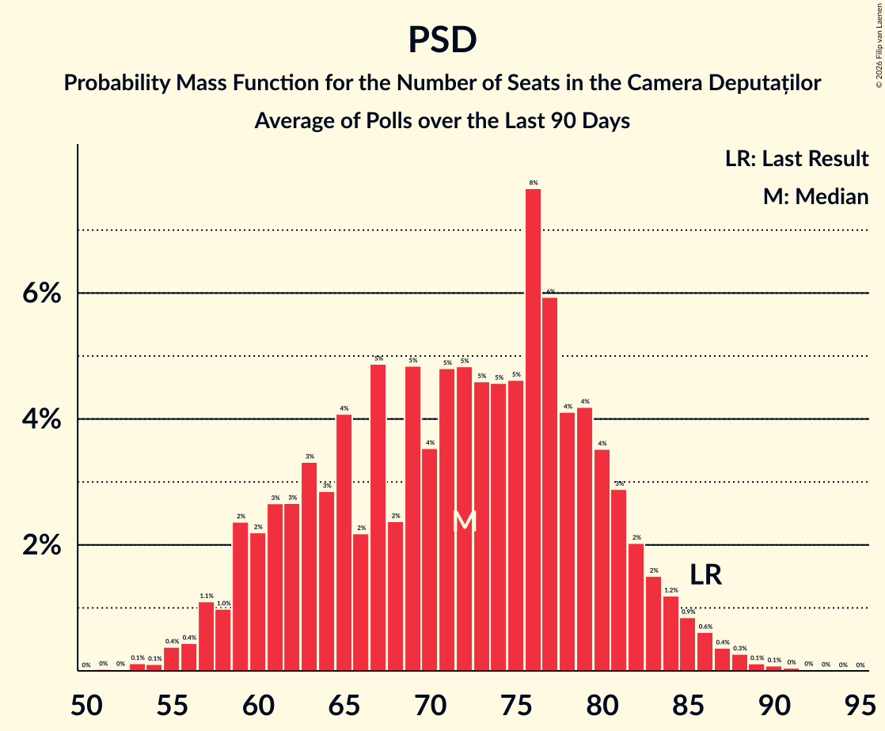

| Number of Seats | Probability | Accumulated | Special Marks |
|:---------------:|:-----------:|:-----------:|:-------------:|
| 50 | 0% | 100% |  |
| 51 | 0.1% | 99.9% |  |
| 52 | 0.3% | 99.9% |  |
| 53 | 0.4% | 99.6% |  |
| 54 | 0.6% | 99.3% |  |
| 55 | 2% | 98.7% |  |
| 56 | 2% | 97% |  |
| 57 | 2% | 96% |  |
| 58 | 4% | 93% |  |
| 59 | 6% | 89% |  |
| 60 | 8% | 83% |  |
| 61 | 9% | 75% |  |
| 62 | 7% | 66% |  |
| 63 | 6% | 59% |  |
| 64 | 7% | 53% | Median |
| 65 | 5% | 46% |  |
| 66 | 4% | 42% |  |
| 67 | 6% | 38% |  |
| 68 | 3% | 32% |  |
| 69 | 3% | 29% |  |
| 70 | 5% | 25% |  |
| 71 | 5% | 21% |  |
| 72 | 3% | 15% |  |
| 73 | 2% | 12% |  |
| 74 | 3% | 11% |  |
| 75 | 2% | 7% |  |
| 76 | 0.9% | 5% |  |
| 77 | 0.6% | 4% |  |
| 78 | 2% | 4% |  |
| 79 | 1.1% | 2% |  |
| 80 | 0.2% | 0.9% |  |
| 81 | 0.1% | 0.8% |  |
| 82 | 0.4% | 0.6% |  |
| 83 | 0.2% | 0.2% |  |
| 84 | 0% | 0.1% |  |
| 85 | 0% | 0% |  |
| 86 | 0% | 0% | Last Result |

### Partidul Național Liberal – Romániai Magyar Demokrata Szövetség

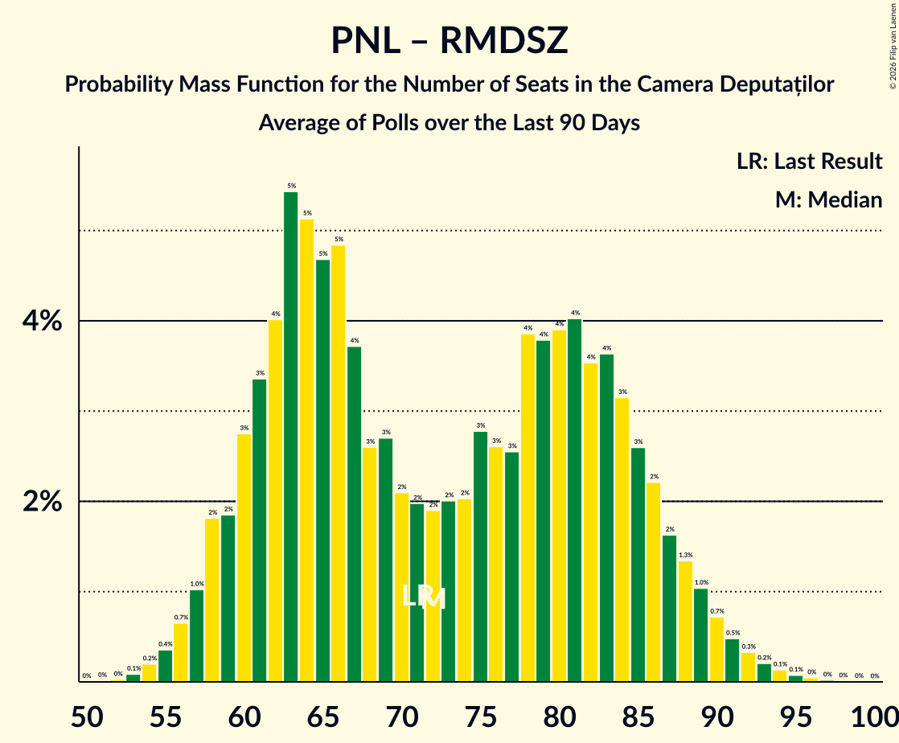

| Number of Seats | Probability | Accumulated | Special Marks |
|:---------------:|:-----------:|:-----------:|:-------------:|
| 54 | 0% | 100% |  |
| 55 | 0.1% | 99.9% |  |
| 56 | 0.2% | 99.9% |  |
| 57 | 0.3% | 99.7% |  |
| 58 | 0.5% | 99.4% |  |
| 59 | 0.7% | 98.9% |  |
| 60 | 2% | 98% |  |
| 61 | 2% | 96% |  |
| 62 | 3% | 95% |  |
| 63 | 4% | 92% |  |
| 64 | 5% | 87% |  |
| 65 | 4% | 83% |  |
| 66 | 7% | 78% |  |
| 67 | 9% | 72% |  |
| 68 | 10% | 63% |  |
| 69 | 15% | 53% | Median |
| 70 | 12% | 38% |  |
| 71 | 9% | 26% | Last Result |
| 72 | 4% | 17% |  |
| 73 | 4% | 14% |  |
| 74 | 2% | 10% |  |
| 75 | 3% | 8% |  |
| 76 | 2% | 5% |  |
| 77 | 0.9% | 3% |  |
| 78 | 0.6% | 2% |  |
| 79 | 0.3% | 1.0% |  |
| 80 | 0.2% | 0.7% |  |
| 81 | 0.2% | 0.4% |  |
| 82 | 0.1% | 0.2% |  |
| 83 | 0% | 0.1% |  |
| 84 | 0.1% | 0.1% |  |
| 85 | 0% | 0% |  |

### Partidul Național Liberal

| Number of Seats | Probability | Accumulated | Special Marks |
|:---------------:|:-----------:|:-----------:|:-------------:|
| 40 | 0% | 100% |  |
| 41 | 0.1% | 99.9% |  |
| 42 | 0.4% | 99.8% |  |
| 43 | 0.5% | 99.5% |  |
| 44 | 1.3% | 98.9% |  |
| 45 | 1.5% | 98% |  |
| 46 | 2% | 96% |  |
| 47 | 3% | 94% |  |
| 48 | 4% | 91% |  |
| 49 | 6% | 87% | Last Result |
| 50 | 8% | 81% |  |
| 51 | 8% | 72% |  |
| 52 | 12% | 64% |  |
| 53 | 13% | 52% | Median |
| 54 | 14% | 39% |  |
| 55 | 10% | 25% |  |
| 56 | 6% | 15% |  |
| 57 | 4% | 9% |  |
| 58 | 2% | 6% |  |
| 59 | 1.1% | 3% |  |
| 60 | 1.3% | 2% |  |
| 61 | 0.4% | 1.1% |  |
| 62 | 0.3% | 0.6% |  |
| 63 | 0.2% | 0.4% |  |
| 64 | 0.1% | 0.1% |  |
| 65 | 0% | 0.1% |  |
| 66 | 0% | 0% |  |

## Technical Information

+ **Number of polls included in this average:** 5
+ **Lowest number of simulations done in a poll included in this average:** 2,097,152
+ **Total number of simulations done in the polls included in this average:** 10,485,760
+ **Error estimate:** 2.18%
