# Poll Average

<a href="#voting-intentions">Voting Intentions</a> | <a href="#seats">Seats</a> | <a href="#coalitions">Coalitions</a> | <a href="#technical-information">Technical Information</a>

## Summary

The table below lists the polls on which the average is based. They are the most recent polls (less than 90 days old) registered and analyzed so far.

| Period     | Polling firm/Commissioner(s) | PSD | AUR | PNL | USR | SOSRO | POT | RMDSZ | SENS | FD | PMP | REPER | DREPT | MINOR |
|:----------:|:----------------------------:|:--:|:--:|:--:|:--:|:--:|:--:|:--:|:--:|:--:|:--:|:--:|:--:|:--:|
| 1 December 2024 | General Election | 22.0%   86 | 18.0%   63 | 13.2%   49 | 12.4%   40 | 7.4%   28 | 6.5%   24 | 6.3%   22 | 3.0%   0 | 2.0%   0 | 2.0%   0 | 1.2%   0 | 1.2%   0 | 0.0%   19 |
| N/A | Poll Average | 16–25%   54–85 | 32–40%   110–138 | 18–24%   63–82 | 8–12%   27–40 | 2–4%   0 | 1–3%   0 | 3–6%   11–20 | 2–3%   0 | N/A   N/A | 1–2%   0 | 0–1%   0 | N/A   N/A | N/A   19 |
| [14–24 July 2026](2026-07-24-CURS.html) | CURS | 21–26%   71–87 | 31–37%   107–126 | 19–24%   64–81 | 7–11%   25–37 | 2–4%   0 | N/A   N/A | 3–5%   10–18 | N/A   N/A | N/A   N/A | N/A   N/A | N/A   N/A | N/A   N/A | N/A   19 |
| [30 June–3 July 2026](2026-07-03-ARP.html) | ARP | 16–20%   56–66 | 34–39%   117–131 | 20–24%   70–82 | 9–12%   31–40 | 2–4%   0 | 1–2%   0 | 4–6%   13–19 | 1–3%   0 | N/A   N/A | 1–2%   0 | 0–1%   0 | N/A   N/A | N/A   19 |
| [11–14 May 2026](2026-05-14-INSCOP.html) | INSCOP   Informat.ro | 15–20%   52–68 | 35–41%   122–141 | 18–23%   62–78 | 8–12%   28–41 | 2–4%   0 | 1–3%   0 | 4–6%   13–22 | 2–4%   0 | N/A   N/A | N/A   N/A | N/A   N/A | N/A   N/A | N/A   19 |
| 1 December 2024 | General Election | 22.0%   86 | 18.0%   63 | 13.2%   49 | 12.4%   40 | 7.4%   28 | 6.5%   24 | 6.3%   22 | 3.0%   0 | 2.0%   0 | 2.0%   0 | 1.2%   0 | 1.2%   0 | 0.0%   19 |

Only polls for which at least the sample size has been published are included in the table above.

**Legend:**
+ **Top half of each row:** Voting intentions (95% confidence interval)
+ **Bottom half of each row:** Seat projections for the Camera Deputaților (95% confidence interval)
+ **PSD:** Partidul Social Democrat
+ **AUR:** Alianța pentru Unirea Românilor
+ **PNL:** Partidul Național Liberal
+ **USR:** Uniunea Salvați România
+ **SOSRO:** Partidul S.O.S. România
+ **POT:** Partidul Oamenilor Tineri
+ **RMDSZ:** Romániai Magyar Demokrata Szövetség
+ **SENS:** Sănătate, Educație, Natură, Sustenabilitate
+ **FD:** Forța Dreptei
+ **PMP:** Partidul Mișcarea Populară
+ **REPER:** Reînnoim Proiectul European al României
+ **DREPT:** Dreptate și Respect în Europa Pentru Toți
+ **MINOR:** Parties of ethnic minorities
+ **N/A (single party):** Party not included the published results
+ **N/A (entire row):** Calculation for this opinion poll not started yet

## Voting Intentions

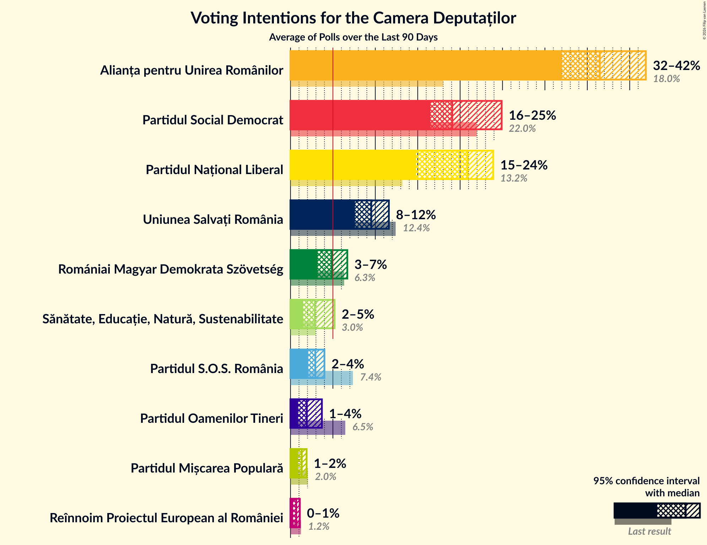

### Confidence Intervals

| Party | Last Result | Median | 80% Confidence Interval | 90% Confidence Interval | 95% Confidence Interval | 99% Confidence Interval |
|:-----:|:-----------:|:------:|:-----------------------:|:-----------------------:|:-----------------------:|:-----------------------:|
| <a href="#partidul-social-democrat">Partidul Social Democrat</a> | 22.0% | 18.4% | 16.6–23.7% |16.2–24.4% | 15.8–24.9% | 15.1–25.9% |
| <a href="#alianța-pentru-unirea-românilor">Alianța pentru Unirea Românilor</a> | 18.0% | 36.3% | 33.3–39.0% |32.6–39.7% | 32.0–40.3% | 31.0–41.4% |
| <a href="#partidul-național-liberal">Partidul Național Liberal</a> | 13.2% | 21.3% | 19.4–23.1% |18.9–23.6% | 18.5–24.0% | 17.7–24.7% |
| <a href="#uniunea-salvați-românia">Uniunea Salvați România</a> | 12.4% | 9.9% | 8.5–11.2% |8.2–11.5% | 7.9–11.8% | 7.3–12.4% |
| <a href="#partidul-s.o.s.-românia">Partidul S.O.S. România</a> | 7.4% | 3.0% | 2.4–3.6% |2.2–3.8% | 2.1–4.0% | 1.9–4.4% |
| <a href="#partidul-oamenilor-tineri">Partidul Oamenilor Tineri</a> | 6.5% | 1.6% | 1.1–2.3% |1.0–2.6% | 0.9–2.7% | 0.8–3.1% |
| <a href="#romániai-magyar-demokrata-szövetség">Romániai Magyar Demokrata Szövetség</a> | 6.3% | 4.7% | 3.7–5.6% |3.4–5.9% | 3.2–6.1% | 2.9–6.6% |
| <a href="#sănătate,-educație,-natură,-sustenabilitate">Sănătate, Educație, Natură, Sustenabilitate</a> | 3.0% | 2.2% | 1.7–2.9% |1.5–3.2% | 1.5–3.4% | 1.3–3.8% |
| <a href="#forța-dreptei">Forța Dreptei</a> | 2.0% | N/A | N/A |N/A | N/A | N/A |
| <a href="#partidul-mișcarea-populară">Partidul Mișcarea Populară</a> | 2.0% | 1.3% | 1.0–1.7% |0.9–1.8% | 0.9–1.9% | 0.8–2.2% |
| <a href="#reînnoim-proiectul-european-al-româniei">Reînnoim Proiectul European al României</a> | 1.2% | 0.7% | 0.4–0.9% |0.4–1.0% | 0.3–1.1% | 0.3–1.3% |
| <a href="#dreptate-și-respect-în-europa-pentru-toți">Dreptate și Respect în Europa Pentru Toți</a> | 1.2% | N/A | N/A |N/A | N/A | N/A |
| <a href="#parties-of-ethnic-minorities">Parties of ethnic minorities</a> | 0.0% | N/A | N/A |N/A | N/A | N/A |

### Partidul Social Democrat

*For a full overview of the results for this party, see the [Partidul Social Democrat](party-partidulsocialdemocrat.html) page.*

| Voting Intentions | Probability | Accumulated | Special Marks |
|:-----------------:|:-----------:|:-----------:|:-------------:|
| 12.5–13.5% | 0% | 100% |  |
| 13.5–14.5% | 0.1% | 100% |  |
| 14.5–15.5% | 1.3% | 99.9% |  |
| 15.5–16.5% | 7% | 98.6% |  |
| 16.5–17.5% | 20% | 91% |  |
| 17.5–18.5% | 24% | 71% | Median |
| 18.5–19.5% | 11% | 47% |  |
| 19.5–20.5% | 3% | 36% |  |
| 20.5–21.5% | 3% | 33% |  |
| 21.5–22.5% | 8% | 30% | Last Result |
| 22.5–23.5% | 10% | 22% |  |
| 23.5–24.5% | 8% | 12% |  |
| 24.5–25.5% | 3% | 4% |  |
| 25.5–26.5% | 0.8% | 0.9% |  |
| 26.5–27.5% | 0.1% | 0.1% |  |
| 27.5–28.5% | 0% | 0% |  |

### Alianța pentru Unirea Românilor

*For a full overview of the results for this party, see the [Alianța pentru Unirea Românilor](party-alianțapentruunirearomânilor.html) page.*

| Voting Intentions | Probability | Accumulated | Special Marks |
|:-----------------:|:-----------:|:-----------:|:-------------:|
| 17.5–18.5% | 0% | 100% | Last Result |
| 18.5–19.5% | 0% | 100% |  |
| 19.5–20.5% | 0% | 100% |  |
| 20.5–21.5% | 0% | 100% |  |
| 21.5–22.5% | 0% | 100% |  |
| 22.5–23.5% | 0% | 100% |  |
| 23.5–24.5% | 0% | 100% |  |
| 24.5–25.5% | 0% | 100% |  |
| 25.5–26.5% | 0% | 100% |  |
| 26.5–27.5% | 0% | 100% |  |
| 27.5–28.5% | 0% | 100% |  |
| 28.5–29.5% | 0% | 100% |  |
| 29.5–30.5% | 0.2% | 100% |  |
| 30.5–31.5% | 1.1% | 99.8% |  |
| 31.5–32.5% | 4% | 98.7% |  |
| 32.5–33.5% | 7% | 95% |  |
| 33.5–34.5% | 11% | 88% |  |
| 34.5–35.5% | 14% | 77% |  |
| 35.5–36.5% | 18% | 63% | Median |
| 36.5–37.5% | 17% | 45% |  |
| 37.5–38.5% | 13% | 28% |  |
| 38.5–39.5% | 8% | 15% |  |
| 39.5–40.5% | 4% | 6% |  |
| 40.5–41.5% | 1.5% | 2% |  |
| 41.5–42.5% | 0.3% | 0.4% |  |
| 42.5–43.5% | 0% | 0.1% |  |
| 43.5–44.5% | 0% | 0% |  |

### Partidul Național Liberal

*For a full overview of the results for this party, see the [Partidul Național Liberal](party-partidulnaționalliberal.html) page.*

| Voting Intentions | Probability | Accumulated | Special Marks |
|:-----------------:|:-----------:|:-----------:|:-------------:|
| 12.5–13.5% | 0% | 100% | Last Result |
| 13.5–14.5% | 0% | 100% |  |
| 14.5–15.5% | 0% | 100% |  |
| 15.5–16.5% | 0% | 100% |  |
| 16.5–17.5% | 0.3% | 100% |  |
| 17.5–18.5% | 3% | 99.7% |  |
| 18.5–19.5% | 10% | 97% |  |
| 19.5–20.5% | 19% | 88% |  |
| 20.5–21.5% | 25% | 69% | Median |
| 21.5–22.5% | 24% | 44% |  |
| 22.5–23.5% | 14% | 20% |  |
| 23.5–24.5% | 4% | 5% |  |
| 24.5–25.5% | 0.6% | 0.7% |  |
| 25.5–26.5% | 0% | 0% |  |

### Uniunea Salvați România

*For a full overview of the results for this party, see the [Uniunea Salvați România](party-uniuneasalvațiromânia.html) page.*

| Voting Intentions | Probability | Accumulated | Special Marks |
|:-----------------:|:-----------:|:-----------:|:-------------:|
| 5.5–6.5% | 0% | 100% |  |
| 6.5–7.5% | 1.0% | 100% |  |
| 7.5–8.5% | 9% | 98.9% |  |
| 8.5–9.5% | 26% | 90% |  |
| 9.5–10.5% | 36% | 64% | Median |
| 10.5–11.5% | 23% | 28% |  |
| 11.5–12.5% | 4% | 5% | Last Result |
| 12.5–13.5% | 0.3% | 0.3% |  |
| 13.5–14.5% | 0% | 0% |  |

### Partidul S.O.S. România

*For a full overview of the results for this party, see the [Partidul S.O.S. România](party-partidulsosromânia.html) page.*

| Voting Intentions | Probability | Accumulated | Special Marks |
|:-----------------:|:-----------:|:-----------:|:-------------:|
| 0.5–1.5% | 0% | 100% |  |
| 1.5–2.5% | 17% | 100% |  |
| 2.5–3.5% | 70% | 83% | Median |
| 3.5–4.5% | 12% | 13% |  |
| 4.5–5.5% | 0.3% | 0.3% |  |
| 5.5–6.5% | 0% | 0% |  |
| 6.5–7.5% | 0% | 0% | Last Result |

### Partidul Oamenilor Tineri

*For a full overview of the results for this party, see the [Partidul Oamenilor Tineri](party-partiduloamenilortineri.html) page.*

| Voting Intentions | Probability | Accumulated | Special Marks |
|:-----------------:|:-----------:|:-----------:|:-------------:|
| 0.0–0.5% | 0% | 100% |  |
| 0.5–1.5% | 46% | 100% |  |
| 1.5–2.5% | 49% | 54% | Median |
| 2.5–3.5% | 5% | 5% |  |
| 3.5–4.5% | 0% | 0% |  |
| 4.5–5.5% | 0% | 0% |  |
| 5.5–6.5% | 0% | 0% | Last Result |

### Romániai Magyar Demokrata Szövetség

*For a full overview of the results for this party, see the [Romániai Magyar Demokrata Szövetség](party-romániaimagyardemokrataszövetség.html) page.*

| Voting Intentions | Probability | Accumulated | Special Marks |
|:-----------------:|:-----------:|:-----------:|:-------------:|
| 1.5–2.5% | 0.1% | 100% |  |
| 2.5–3.5% | 7% | 99.9% |  |
| 3.5–4.5% | 35% | 93% |  |
| 4.5–5.5% | 46% | 58% | Median |
| 5.5–6.5% | 12% | 12% | Last Result |
| 6.5–7.5% | 0.7% | 0.7% |  |
| 7.5–8.5% | 0% | 0% |  |

### Sănătate, Educație, Natură, Sustenabilitate

*For a full overview of the results for this party, see the [Sănătate, Educație, Natură, Sustenabilitate](party-sănătateeducațienaturăsustenabilitate.html) page.*

| Voting Intentions | Probability | Accumulated | Special Marks |
|:-----------------:|:-----------:|:-----------:|:-------------:|
| 0.0–0.5% | 0% | 100% |  |
| 0.5–1.5% | 5% | 100% |  |
| 1.5–2.5% | 69% | 95% | Median |
| 2.5–3.5% | 25% | 26% | Last Result |
| 3.5–4.5% | 1.2% | 1.2% |  |
| 4.5–5.5% | 0% | 0% |  |

### Partidul Mișcarea Populară

*For a full overview of the results for this party, see the [Partidul Mișcarea Populară](party-partidulmișcareapopulară.html) page.*

| Voting Intentions | Probability | Accumulated | Special Marks |
|:-----------------:|:-----------:|:-----------:|:-------------:|
| 0.0–0.5% | 0% | 100% |  |
| 0.5–1.5% | 78% | 100% | Median |
| 1.5–2.5% | 22% | 22% | Last Result |
| 2.5–3.5% | 0% | 0% |  |

### Reînnoim Proiectul European al României

*For a full overview of the results for this party, see the [Reînnoim Proiectul European al României](party-reînnoimproiectuleuropeanalromâniei.html) page.*

| Voting Intentions | Probability | Accumulated | Special Marks |
|:-----------------:|:-----------:|:-----------:|:-------------:|
| 0.0–0.5% | 27% | 100% |  |
| 0.5–1.5% | 73% | 73% | Last Result, Median |
| 1.5–2.5% | 0% | 0% |  |
| 2.5–3.5% | 0% | 0% |  |

## Seats

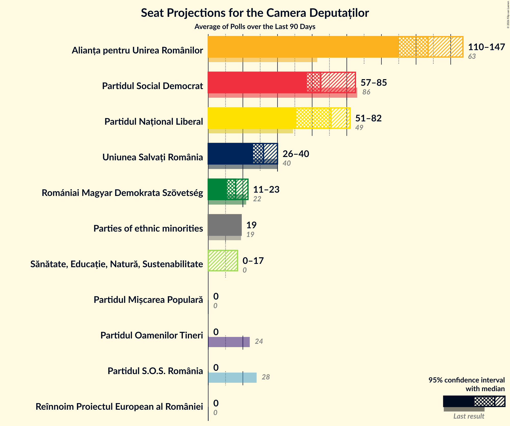

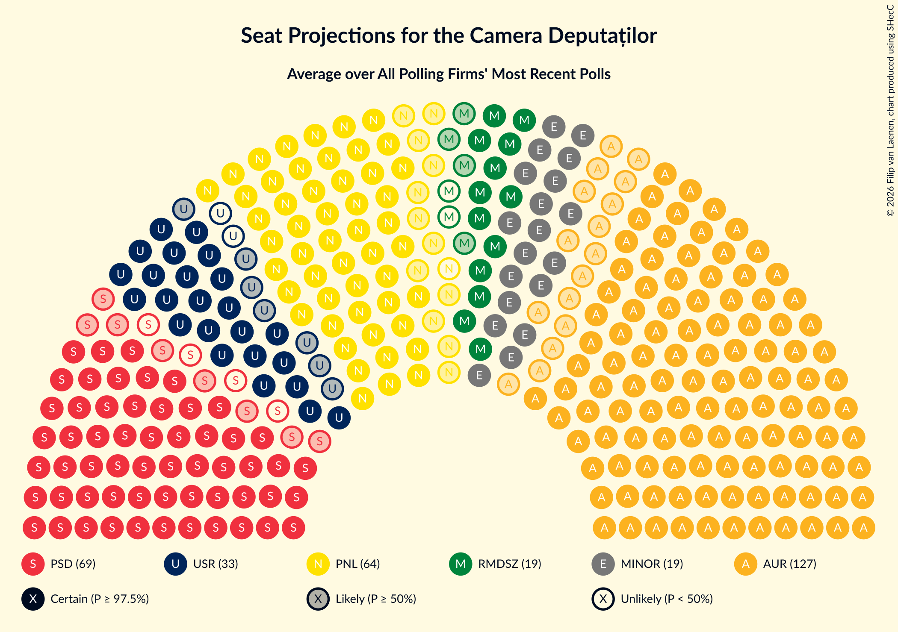

### Confidence Intervals

| Party | Last Result | Median | 80% Confidence Interval | 90% Confidence Interval | 95% Confidence Interval | 99% Confidence Interval |
|:-----:|:-----------:|:------:|:-----------------------:|:-----------------------:|:-----------------------:|:-----------------------:|
| <a href="#partidul-social-democrat">Partidul Social Democrat</a> | 86 | 62 | 57–81 |56–83 | 54–85 | 52–89 |
| <a href="#alianța-pentru-unirea-românilor">Alianța pentru Unirea Românilor</a> | 63 | 125 | 114–134 |112–137 | 110–138 | 107–142 |
| <a href="#partidul-național-liberal">Partidul Național Liberal</a> | 49 | 73 | 66–78 |65–81 | 63–82 | 61–83 |
| <a href="#uniunea-salvați-românia">Uniunea Salvați România</a> | 40 | 33 | 29–38 |27–39 | 27–40 | 25–42 |
| <a href="#partidul-s.o.s.-românia">Partidul S.O.S. România</a> | 28 | 0 | 0 |0 | 0 | 0 |
| <a href="#partidul-oamenilor-tineri">Partidul Oamenilor Tineri</a> | 24 | 0 | 0 |0 | 0 | 0 |
| <a href="#romániai-magyar-demokrata-szövetség">Romániai Magyar Demokrata Szövetség</a> | 22 | 16 | 12–19 |11–20 | 11–20 | 9–22 |
| <a href="#sănătate,-educație,-natură,-sustenabilitate">Sănătate, Educație, Natură, Sustenabilitate</a> | 0 | 0 | 0 |0 | 0 | 0 |
| <a href="#forța-dreptei">Forța Dreptei</a> | 0 | N/A | N/A |N/A | N/A | N/A |
| <a href="#partidul-mișcarea-populară">Partidul Mișcarea Populară</a> | 0 | 0 | 0 |0 | 0 | 0 |
| <a href="#reînnoim-proiectul-european-al-româniei">Reînnoim Proiectul European al României</a> | 0 | 0 | 0 |0 | 0 | 0 |
| <a href="#dreptate-și-respect-în-europa-pentru-toți">Dreptate și Respect în Europa Pentru Toți</a> | 0 | N/A | N/A |N/A | N/A | N/A |
| <a href="#parties-of-ethnic-minorities">Parties of ethnic minorities</a> | 19 | 19 | 19 |19 | 19 | 19 |

### Partidul Social Democrat

*For a full overview of the results for this party, see the [Partidul Social Democrat](party-partidulsocialdemocrat.html) page.*

| Number of Seats | Probability | Accumulated | Special Marks |
|:---------------:|:-----------:|:-----------:|:-------------:|
| 49 | 0% | 100% |  |
| 50 | 0.1% | 99.9% |  |
| 51 | 0.2% | 99.8% |  |
| 52 | 0.6% | 99.6% |  |
| 53 | 0.8% | 99.0% |  |
| 54 | 1.1% | 98% |  |
| 55 | 2% | 97% |  |
| 56 | 2% | 95% |  |
| 57 | 8% | 93% |  |
| 58 | 4% | 86% |  |
| 59 | 9% | 81% |  |
| 60 | 6% | 72% |  |
| 61 | 6% | 67% |  |
| 62 | 14% | 60% | Median |
| 63 | 3% | 46% |  |
| 64 | 3% | 43% |  |
| 65 | 2% | 40% |  |
| 66 | 2% | 37% |  |
| 67 | 1.3% | 36% |  |
| 68 | 0.6% | 34% |  |
| 69 | 0.5% | 34% |  |
| 70 | 0.5% | 33% |  |
| 71 | 0.6% | 33% |  |
| 72 | 1.0% | 32% |  |
| 73 | 1.2% | 31% |  |
| 74 | 2% | 30% |  |
| 75 | 2% | 28% |  |
| 76 | 2% | 26% |  |
| 77 | 3% | 24% |  |
| 78 | 3% | 21% |  |
| 79 | 4% | 18% |  |
| 80 | 3% | 15% |  |
| 81 | 3% | 12% |  |
| 82 | 2% | 9% |  |
| 83 | 2% | 7% |  |
| 84 | 2% | 5% |  |
| 85 | 1.0% | 3% |  |
| 86 | 0.8% | 2% | Last Result |
| 87 | 0.6% | 1.4% |  |
| 88 | 0.3% | 0.8% |  |
| 89 | 0.2% | 0.5% |  |
| 90 | 0.1% | 0.3% |  |
| 91 | 0.1% | 0.1% |  |
| 92 | 0% | 0.1% |  |
| 93 | 0% | 0% |  |

### Alianța pentru Unirea Românilor

*For a full overview of the results for this party, see the [Alianța pentru Unirea Românilor](party-alianțapentruunirearomânilor.html) page.*

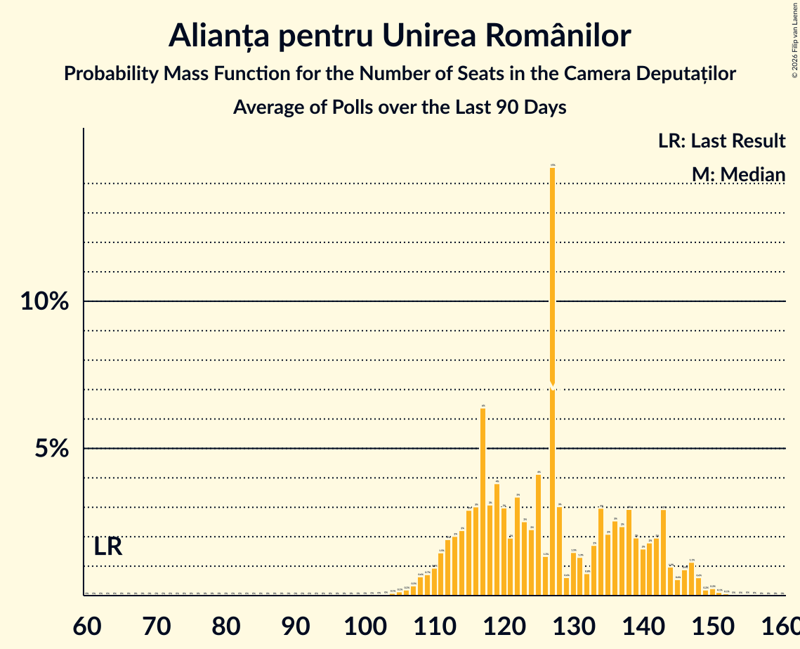

| Number of Seats | Probability | Accumulated | Special Marks |
|:---------------:|:-----------:|:-----------:|:-------------:|
| 63 | 0% | 100% | Last Result |
| 64 | 0% | 100% |  |
| 65 | 0% | 100% |  |
| 66 | 0% | 100% |  |
| 67 | 0% | 100% |  |
| 68 | 0% | 100% |  |
| 69 | 0% | 100% |  |
| 70 | 0% | 100% |  |
| 71 | 0% | 100% |  |
| 72 | 0% | 100% |  |
| 73 | 0% | 100% |  |
| 74 | 0% | 100% |  |
| 75 | 0% | 100% |  |
| 76 | 0% | 100% |  |
| 77 | 0% | 100% |  |
| 78 | 0% | 100% |  |
| 79 | 0% | 100% |  |
| 80 | 0% | 100% |  |
| 81 | 0% | 100% |  |
| 82 | 0% | 100% |  |
| 83 | 0% | 100% |  |
| 84 | 0% | 100% |  |
| 85 | 0% | 100% |  |
| 86 | 0% | 100% |  |
| 87 | 0% | 100% |  |
| 88 | 0% | 100% |  |
| 89 | 0% | 100% |  |
| 90 | 0% | 100% |  |
| 91 | 0% | 100% |  |
| 92 | 0% | 100% |  |
| 93 | 0% | 100% |  |
| 94 | 0% | 100% |  |
| 95 | 0% | 100% |  |
| 96 | 0% | 100% |  |
| 97 | 0% | 100% |  |
| 98 | 0% | 100% |  |
| 99 | 0% | 100% |  |
| 100 | 0% | 100% |  |
| 101 | 0% | 100% |  |
| 102 | 0% | 100% |  |
| 103 | 0% | 100% |  |
| 104 | 0.1% | 99.9% |  |
| 105 | 0.1% | 99.8% |  |
| 106 | 0.2% | 99.7% |  |
| 107 | 0.4% | 99.5% |  |
| 108 | 0.6% | 99.1% |  |
| 109 | 0.7% | 98.5% |  |
| 110 | 1.0% | 98% |  |
| 111 | 2% | 97% |  |
| 112 | 2% | 95% |  |
| 113 | 2% | 94% |  |
| 114 | 2% | 92% |  |
| 115 | 3% | 89% |  |
| 116 | 3% | 86% |  |
| 117 | 6% | 83% |  |
| 118 | 3% | 77% |  |
| 119 | 4% | 74% |  |
| 120 | 3% | 70% |  |
| 121 | 2% | 67% |  |
| 122 | 4% | 64% |  |
| 123 | 3% | 61% |  |
| 124 | 3% | 58% |  |
| 125 | 5% | 55% | Median |
| 126 | 2% | 50% |  |
| 127 | 16% | 47% |  |
| 128 | 5% | 31% |  |
| 129 | 3% | 26% |  |
| 130 | 3% | 23% |  |
| 131 | 3% | 20% |  |
| 132 | 3% | 17% |  |
| 133 | 3% | 14% |  |
| 134 | 2% | 11% |  |
| 135 | 2% | 9% |  |
| 136 | 1.1% | 6% |  |
| 137 | 2% | 5% |  |
| 138 | 1.2% | 3% |  |
| 139 | 0.7% | 2% |  |
| 140 | 0.6% | 2% |  |
| 141 | 0.3% | 0.9% |  |
| 142 | 0.3% | 0.6% |  |
| 143 | 0.2% | 0.4% |  |
| 144 | 0.1% | 0.2% |  |
| 145 | 0% | 0.1% |  |
| 146 | 0% | 0.1% |  |
| 147 | 0% | 0% |  |

### Partidul Național Liberal

*For a full overview of the results for this party, see the [Partidul Național Liberal](party-partidulnaționalliberal.html) page.*

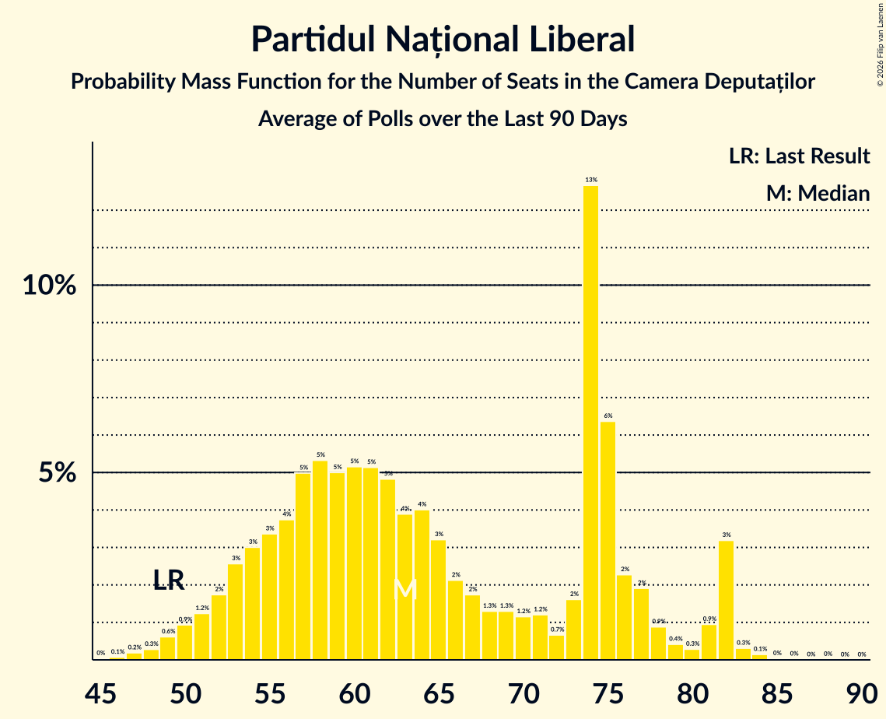

| Number of Seats | Probability | Accumulated | Special Marks |
|:---------------:|:-----------:|:-----------:|:-------------:|
| 49 | 0% | 100% | Last Result |
| 50 | 0% | 100% |  |
| 51 | 0% | 100% |  |
| 52 | 0% | 100% |  |
| 53 | 0% | 100% |  |
| 54 | 0% | 100% |  |
| 55 | 0% | 100% |  |
| 56 | 0% | 100% |  |
| 57 | 0% | 100% |  |
| 58 | 0.1% | 100% |  |
| 59 | 0.1% | 99.9% |  |
| 60 | 0.3% | 99.8% |  |
| 61 | 0.5% | 99.5% |  |
| 62 | 0.7% | 99.1% |  |
| 63 | 1.2% | 98% |  |
| 64 | 2% | 97% |  |
| 65 | 2% | 95% |  |
| 66 | 3% | 93% |  |
| 67 | 4% | 90% |  |
| 68 | 5% | 86% |  |
| 69 | 6% | 80% |  |
| 70 | 7% | 74% |  |
| 71 | 6% | 67% |  |
| 72 | 7% | 61% |  |
| 73 | 6% | 53% | Median |
| 74 | 17% | 47% |  |
| 75 | 10% | 30% |  |
| 76 | 5% | 20% |  |
| 77 | 4% | 15% |  |
| 78 | 3% | 11% |  |
| 79 | 1.5% | 8% |  |
| 80 | 0.8% | 7% |  |
| 81 | 1.5% | 6% |  |
| 82 | 3% | 4% |  |
| 83 | 0.5% | 0.8% |  |
| 84 | 0.2% | 0.4% |  |
| 85 | 0.1% | 0.2% |  |
| 86 | 0% | 0.1% |  |
| 87 | 0% | 0% |  |

### Uniunea Salvați România

*For a full overview of the results for this party, see the [Uniunea Salvați România](party-uniuneasalvațiromânia.html) page.*

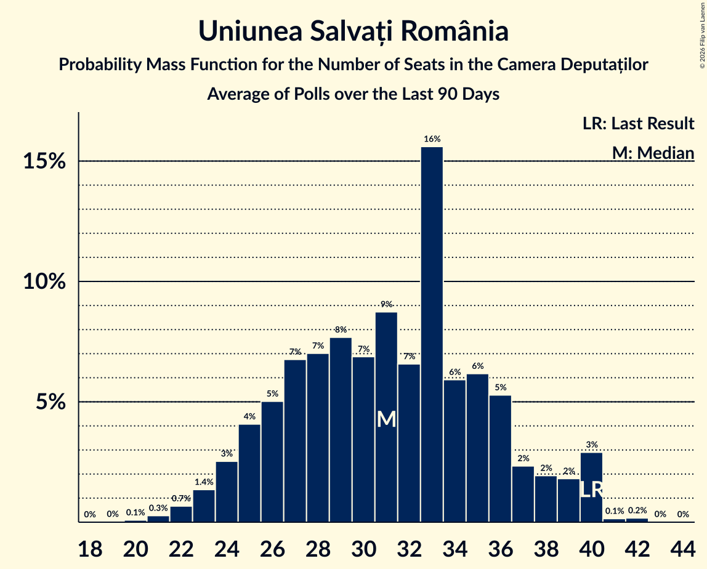

| Number of Seats | Probability | Accumulated | Special Marks |
|:---------------:|:-----------:|:-----------:|:-------------:|
| 23 | 0.1% | 100% |  |
| 24 | 0.2% | 99.8% |  |
| 25 | 0.9% | 99.7% |  |
| 26 | 0.9% | 98.8% |  |
| 27 | 3% | 98% |  |
| 28 | 3% | 95% |  |
| 29 | 5% | 92% |  |
| 30 | 6% | 87% |  |
| 31 | 9% | 81% |  |
| 32 | 9% | 71% |  |
| 33 | 19% | 62% | Median |
| 34 | 10% | 43% |  |
| 35 | 8% | 33% |  |
| 36 | 9% | 25% |  |
| 37 | 4% | 16% |  |
| 38 | 3% | 11% |  |
| 39 | 3% | 8% |  |
| 40 | 4% | 5% | Last Result |
| 41 | 0.7% | 1.3% |  |
| 42 | 0.3% | 0.6% |  |
| 43 | 0.1% | 0.2% |  |
| 44 | 0% | 0.1% |  |
| 45 | 0% | 0% |  |

### Partidul S.O.S. România

*For a full overview of the results for this party, see the [Partidul S.O.S. România](party-partidulsosromânia.html) page.*

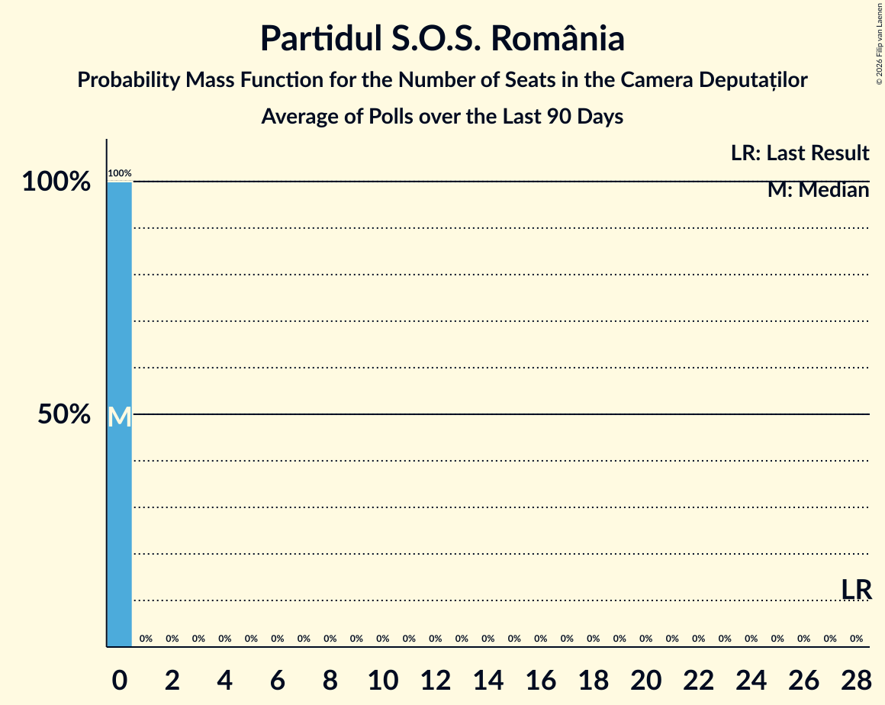

| Number of Seats | Probability | Accumulated | Special Marks |
|:---------------:|:-----------:|:-----------:|:-------------:|
| 0 | 100% | 100% | Median |
| 1 | 0% | 0% |  |
| 2 | 0% | 0% |  |
| 3 | 0% | 0% |  |
| 4 | 0% | 0% |  |
| 5 | 0% | 0% |  |
| 6 | 0% | 0% |  |
| 7 | 0% | 0% |  |
| 8 | 0% | 0% |  |
| 9 | 0% | 0% |  |
| 10 | 0% | 0% |  |
| 11 | 0% | 0% |  |
| 12 | 0% | 0% |  |
| 13 | 0% | 0% |  |
| 14 | 0% | 0% |  |
| 15 | 0% | 0% |  |
| 16 | 0% | 0% |  |
| 17 | 0% | 0% |  |
| 18 | 0% | 0% |  |
| 19 | 0% | 0% |  |
| 20 | 0% | 0% |  |
| 21 | 0% | 0% |  |
| 22 | 0% | 0% |  |
| 23 | 0% | 0% |  |
| 24 | 0% | 0% |  |
| 25 | 0% | 0% |  |
| 26 | 0% | 0% |  |
| 27 | 0% | 0% |  |
| 28 | 0% | 0% | Last Result |

### Partidul Oamenilor Tineri

*For a full overview of the results for this party, see the [Partidul Oamenilor Tineri](party-partiduloamenilortineri.html) page.*

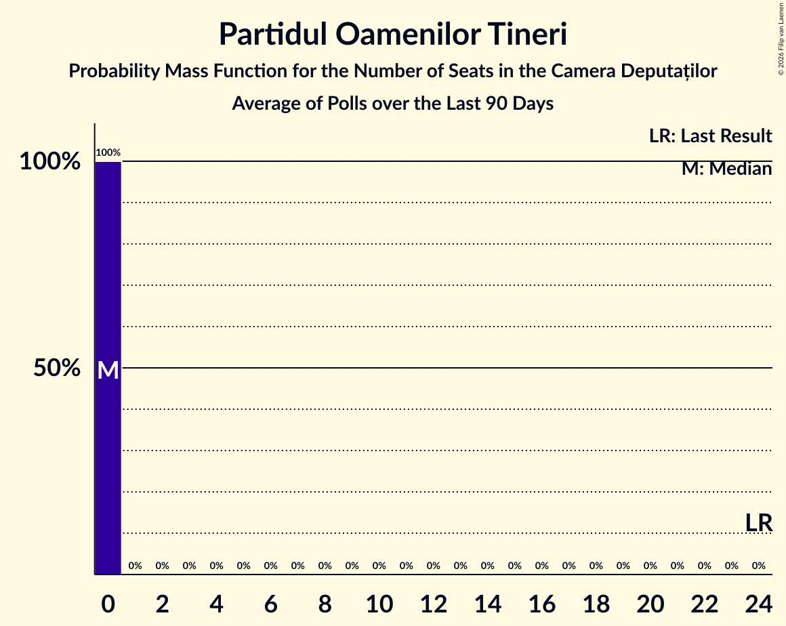

| Number of Seats | Probability | Accumulated | Special Marks |
|:---------------:|:-----------:|:-----------:|:-------------:|
| 0 | 100% | 100% | Median |
| 1 | 0% | 0% |  |
| 2 | 0% | 0% |  |
| 3 | 0% | 0% |  |
| 4 | 0% | 0% |  |
| 5 | 0% | 0% |  |
| 6 | 0% | 0% |  |
| 7 | 0% | 0% |  |
| 8 | 0% | 0% |  |
| 9 | 0% | 0% |  |
| 10 | 0% | 0% |  |
| 11 | 0% | 0% |  |
| 12 | 0% | 0% |  |
| 13 | 0% | 0% |  |
| 14 | 0% | 0% |  |
| 15 | 0% | 0% |  |
| 16 | 0% | 0% |  |
| 17 | 0% | 0% |  |
| 18 | 0% | 0% |  |
| 19 | 0% | 0% |  |
| 20 | 0% | 0% |  |
| 21 | 0% | 0% |  |
| 22 | 0% | 0% |  |
| 23 | 0% | 0% |  |
| 24 | 0% | 0% | Last Result |

### Romániai Magyar Demokrata Szövetség

*For a full overview of the results for this party, see the [Romániai Magyar Demokrata Szövetség](party-romániaimagyardemokrataszövetség.html) page.*

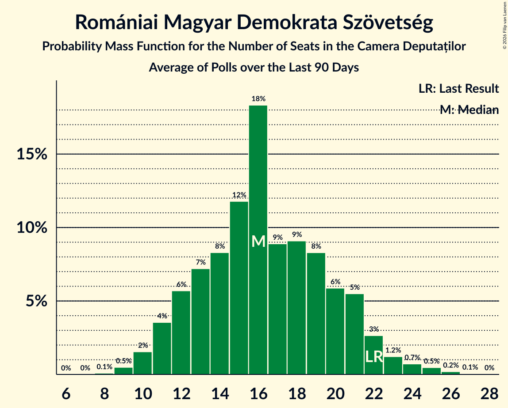

| Number of Seats | Probability | Accumulated | Special Marks |
|:---------------:|:-----------:|:-----------:|:-------------:|
| 8 | 0.1% | 100% |  |
| 9 | 0.5% | 99.9% |  |
| 10 | 2% | 99.4% |  |
| 11 | 4% | 98% |  |
| 12 | 6% | 94% |  |
| 13 | 8% | 88% |  |
| 14 | 10% | 80% |  |
| 15 | 15% | 70% |  |
| 16 | 22% | 55% | Median |
| 17 | 11% | 33% |  |
| 18 | 10% | 22% |  |
| 19 | 7% | 12% |  |
| 20 | 3% | 5% |  |
| 21 | 1.5% | 2% |  |
| 22 | 0.6% | 1.0% | Last Result |
| 23 | 0.3% | 0.4% |  |
| 24 | 0.1% | 0.1% |  |
| 25 | 0% | 0% |  |

### Sănătate, Educație, Natură, Sustenabilitate

*For a full overview of the results for this party, see the [Sănătate, Educație, Natură, Sustenabilitate](party-sănătateeducațienaturăsustenabilitate.html) page.*

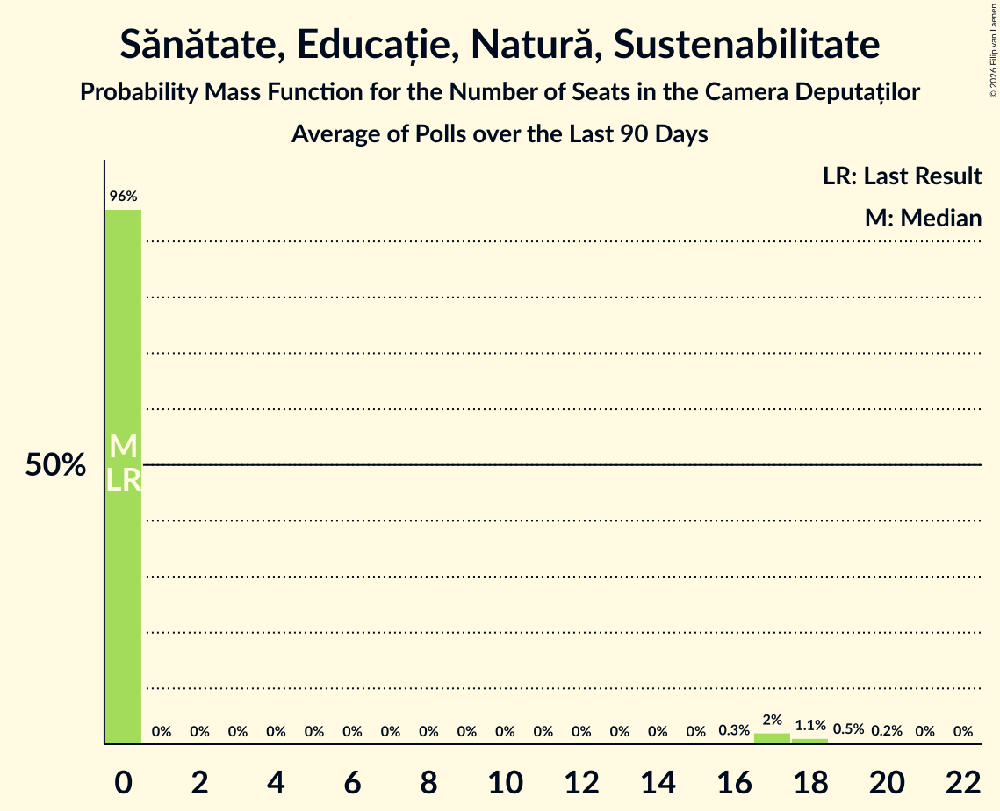

| Number of Seats | Probability | Accumulated | Special Marks |
|:---------------:|:-----------:|:-----------:|:-------------:|
| 0 | 100% | 100% | Last Result, Median |

### Forța Dreptei

*For a full overview of the results for this party, see the [Forța Dreptei](party-forțadreptei.html) page.*

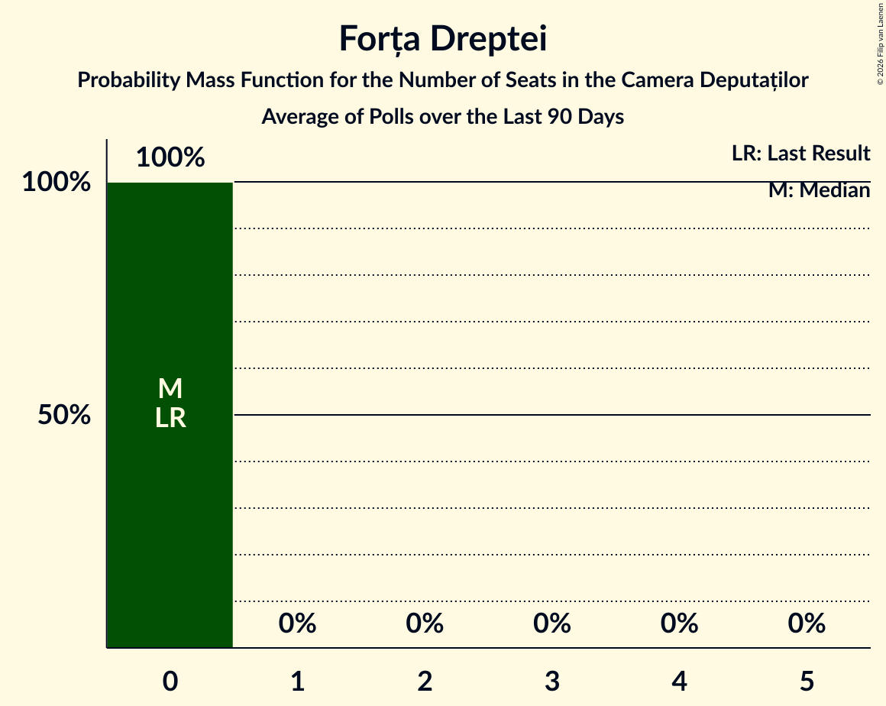

### Partidul Mișcarea Populară

*For a full overview of the results for this party, see the [Partidul Mișcarea Populară](party-partidulmișcareapopulară.html) page.*

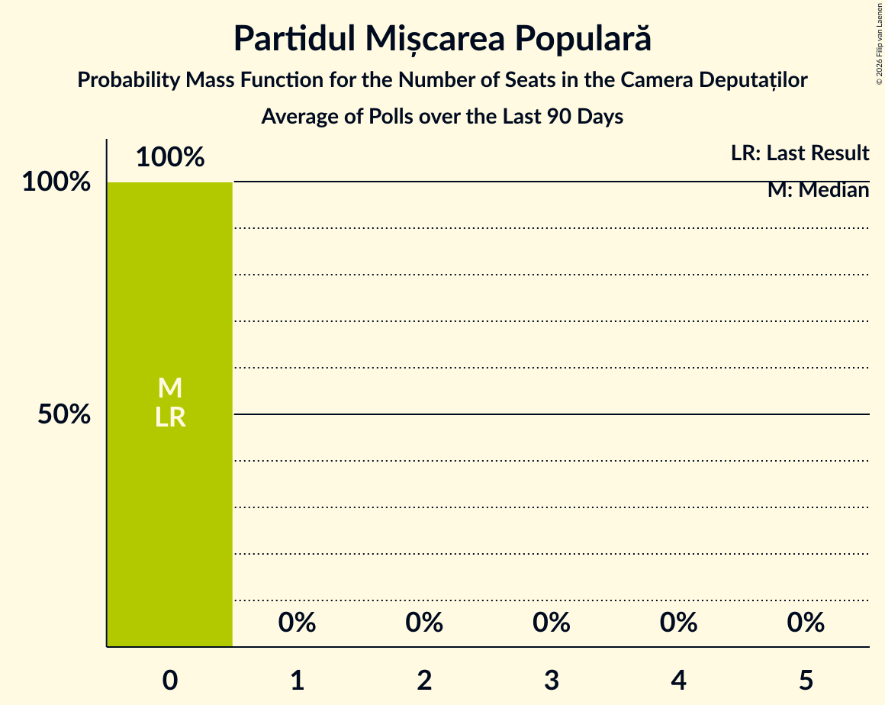

| Number of Seats | Probability | Accumulated | Special Marks |
|:---------------:|:-----------:|:-----------:|:-------------:|
| 0 | 100% | 100% | Last Result, Median |

### Reînnoim Proiectul European al României

*For a full overview of the results for this party, see the [Reînnoim Proiectul European al României](party-reînnoimproiectuleuropeanalromâniei.html) page.*

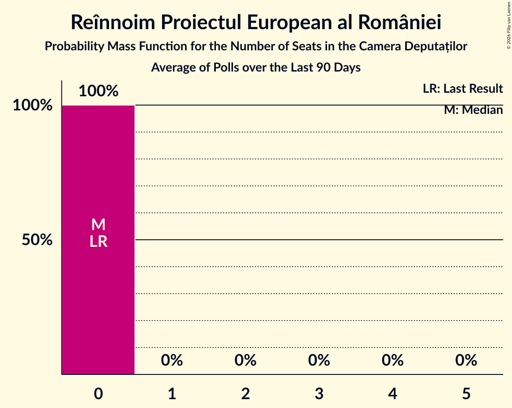

| Number of Seats | Probability | Accumulated | Special Marks |
|:---------------:|:-----------:|:-----------:|:-------------:|
| 0 | 100% | 100% | Last Result, Median |

### Dreptate și Respect în Europa Pentru Toți

*For a full overview of the results for this party, see the [Dreptate și Respect în Europa Pentru Toți](party-dreptateșirespectîneuropapentrutoți.html) page.*

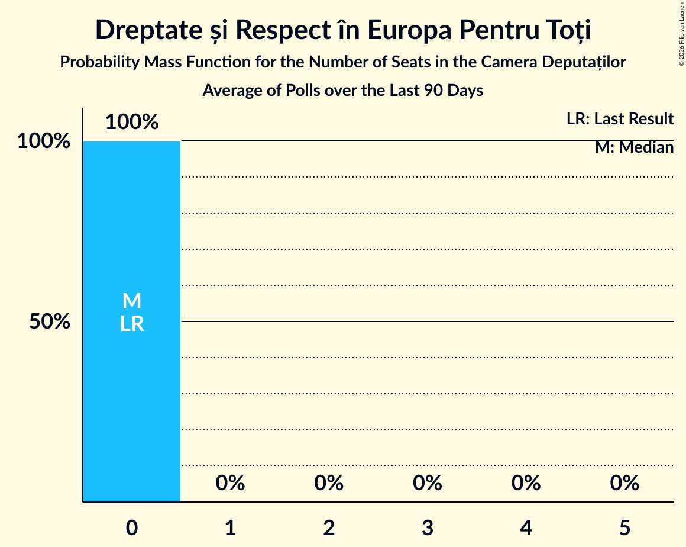

### Parties of ethnic minorities

*For a full overview of the results for this party, see the [Parties of ethnic minorities](party-partiesofethnicminorities.html) page.*

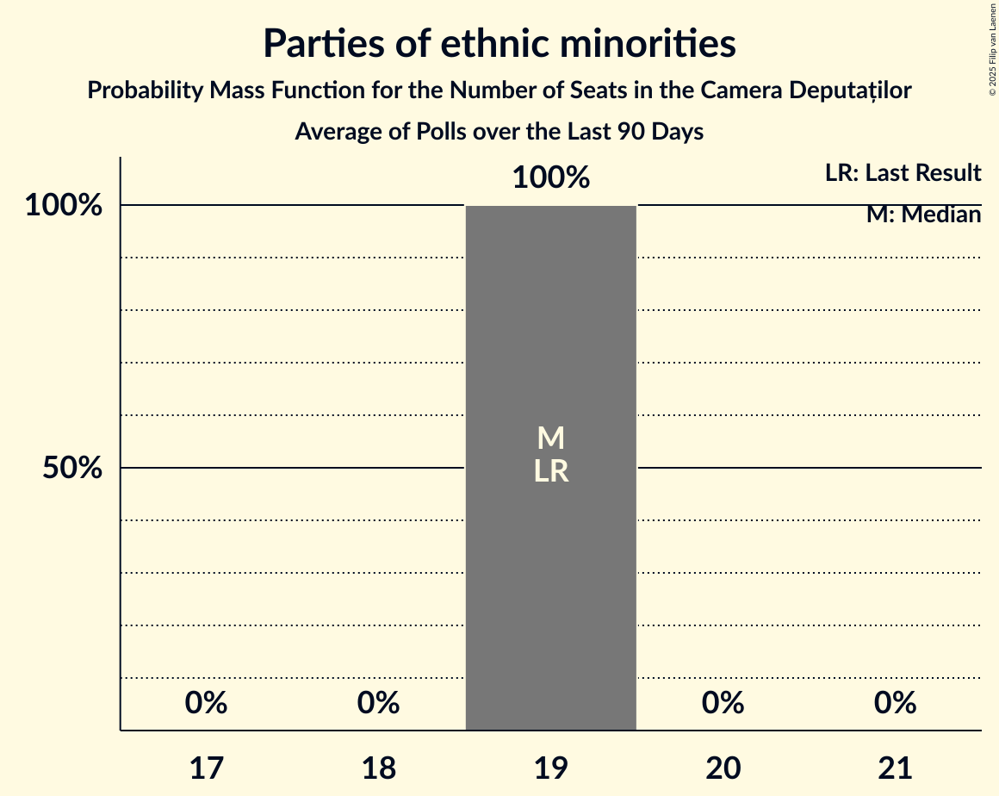

| Number of Seats | Probability | Accumulated | Special Marks |
|:---------------:|:-----------:|:-----------:|:-------------:|
| 19 | 100% | 100% | Last Result, Median |

## Coalitions

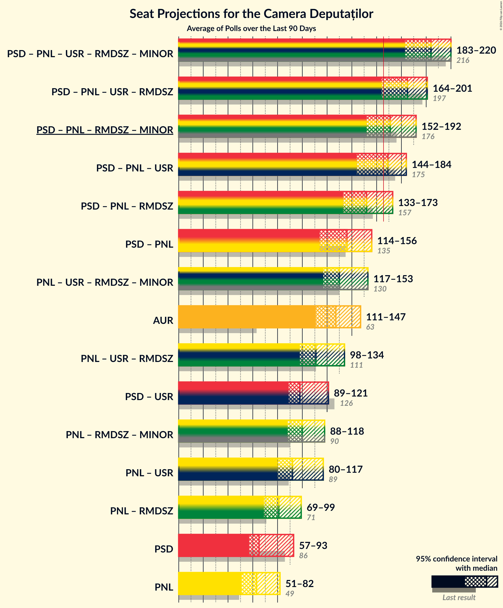

### Confidence Intervals

| Coalition | Last Result | Median | Majority? | 80% Confidence Interval | 90% Confidence Interval | 95% Confidence Interval | 99% Confidence Interval |
|:---------:|:-----------:|:------:|:---------:|:-----------------------:|:-----------------------:|:-----------------------:|:-----------------------:|
| Partidul Social Democrat – Partidul Național Liberal – Uniunea Salvați România – Romániai Magyar Demokrata Szövetség – Parties of ethnic minorities | 216 | 206 | 100% | 197–217 | 194–219 | 193–221 | 189–224 |
| Partidul Social Democrat – Partidul Național Liberal – Uniunea Salvați România – Romániai Magyar Demokrata Szövetség | 197 | 187 | 100% | 178–198 | 175–200 | 174–202 | 170–205 |
| Partidul Social Democrat – Partidul Național Liberal – Romániai Magyar Demokrata Szövetség – Parties of ethnic minorities | 176 | 171 | 83% | 163–186 | 160–189 | 158–191 | 155–194 |
| Partidul Social Democrat – Partidul Național Liberal – Uniunea Salvați România | 175 | 170 | 79% | 161–184 | 159–187 | 157–189 | 153–192 |
| Partidul Social Democrat – Partidul Național Liberal – Romániai Magyar Demokrata Szövetség | 157 | 152 | 14% | 144–167 | 141–170 | 139–172 | 136–175 |
| Partidul Social Democrat – Partidul Național Liberal | 135 | 136 | 0.1% | 127–153 | 125–156 | 122–158 | 119–161 |
| Partidul Național Liberal – Uniunea Salvați România – Romániai Magyar Demokrata Szövetség – Parties of ethnic minorities | 130 | 141 | 0% | 132–149 | 131–152 | 127–153 | 125–155 |
| Alianța pentru Unirea Românilor | 63 | 125 | 0% | 114–134 | 112–137 | 110–138 | 107–142 |
| Partidul Național Liberal – Uniunea Salvați România – Romániai Magyar Demokrata Szövetség | 111 | 122 | 0% | 113–130 | 112–133 | 108–134 | 106–136 |
| Partidul Național Liberal – Romániai Magyar Demokrata Szövetség – Parties of ethnic minorities | 90 | 108 | 0% | 100–113 | 99–116 | 97–118 | 94–120 |
| Partidul Național Liberal – Uniunea Salvați România | 89 | 106 | 0% | 99–114 | 97–115 | 95–117 | 92–118 |
| Partidul Social Democrat – Uniunea Salvați România | 126 | 97 | 0% | 91–112 | 90–115 | 88–117 | 84–120 |
| Partidul Național Liberal – Romániai Magyar Demokrata Szövetség | 71 | 89 | 0% | 81–94 | 80–97 | 78–99 | 75–101 |
| Partidul Social Democrat | 86 | 62 | 0% | 57–81 | 56–83 | 54–85 | 52–89 |
| Partidul Național Liberal | 49 | 73 | 0% | 66–78 | 65–81 | 63–82 | 61–83 |

### Partidul Social Democrat – Partidul Național Liberal – Uniunea Salvați România – Romániai Magyar Demokrata Szövetség – Parties of ethnic minorities

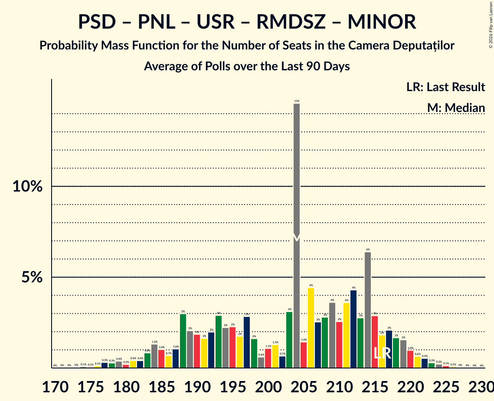

| Number of Seats | Probability | Accumulated | Special Marks |
|:---------------:|:-----------:|:-----------:|:-------------:|
| 185 | 0% | 100% |  |
| 186 | 0% | 99.9% |  |
| 187 | 0.1% | 99.9% |  |
| 188 | 0.2% | 99.8% |  |
| 189 | 0.3% | 99.6% |  |
| 190 | 0.3% | 99.4% |  |
| 191 | 0.6% | 99.0% |  |
| 192 | 0.7% | 98% |  |
| 193 | 1.2% | 98% |  |
| 194 | 2% | 97% |  |
| 195 | 1.1% | 95% |  |
| 196 | 2% | 94% |  |
| 197 | 2% | 91% |  |
| 198 | 3% | 89% |  |
| 199 | 3% | 86% |  |
| 200 | 3% | 83% |  |
| 201 | 3% | 80% |  |
| 202 | 3% | 77% |  |
| 203 | 5% | 74% | Median |
| 204 | 16% | 69% |  |
| 205 | 2% | 53% |  |
| 206 | 5% | 50% |  |
| 207 | 3% | 45% |  |
| 208 | 3% | 42% |  |
| 209 | 4% | 39% |  |
| 210 | 2% | 36% |  |
| 211 | 3% | 33% |  |
| 212 | 4% | 30% |  |
| 213 | 3% | 26% |  |
| 214 | 6% | 23% |  |
| 215 | 3% | 17% |  |
| 216 | 3% | 14% | Last Result |
| 217 | 2% | 11% |  |
| 218 | 2% | 8% |  |
| 219 | 2% | 6% |  |
| 220 | 2% | 5% |  |
| 221 | 1.0% | 3% |  |
| 222 | 0.7% | 2% |  |
| 223 | 0.6% | 1.5% |  |
| 224 | 0.4% | 0.8% |  |
| 225 | 0.2% | 0.5% |  |
| 226 | 0.1% | 0.3% |  |
| 227 | 0.1% | 0.2% |  |
| 228 | 0% | 0.1% |  |
| 229 | 0% | 0% |  |

### Partidul Social Democrat – Partidul Național Liberal – Uniunea Salvați România – Romániai Magyar Demokrata Szövetség

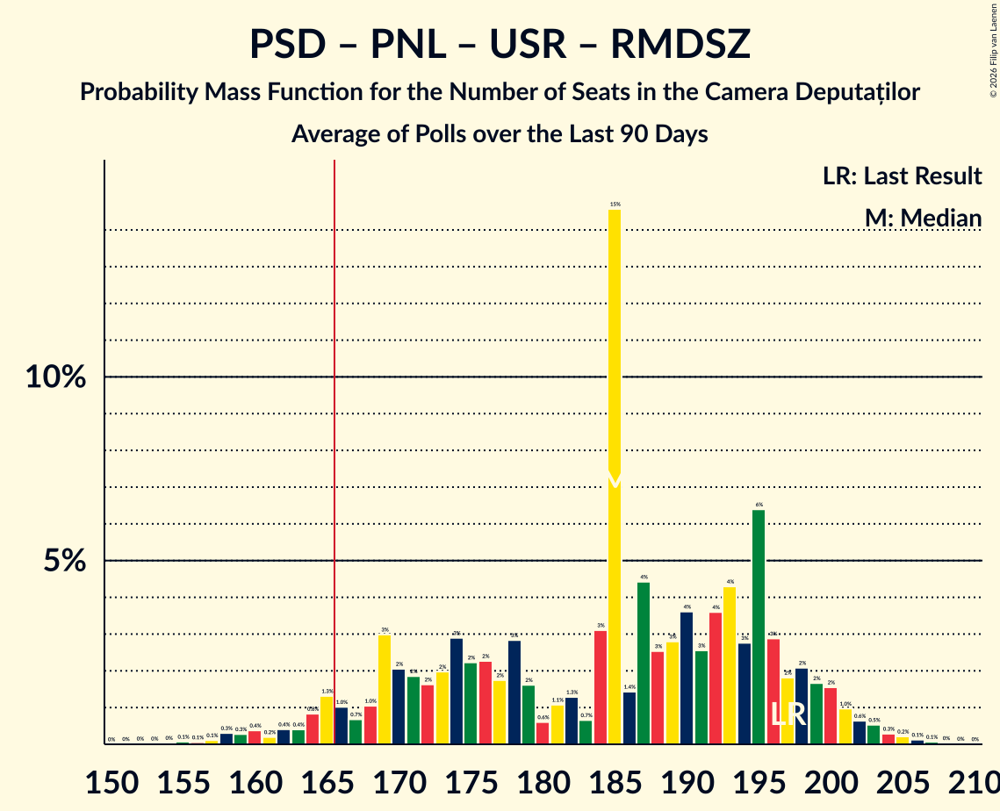

| Number of Seats | Probability | Accumulated | Special Marks |
|:---------------:|:-----------:|:-----------:|:-------------:|
| 166 | 0% | 100% | Majority |
| 167 | 0% | 99.9% |  |
| 168 | 0.1% | 99.9% |  |
| 169 | 0.2% | 99.8% |  |
| 170 | 0.3% | 99.6% |  |
| 171 | 0.3% | 99.4% |  |
| 172 | 0.6% | 99.0% |  |
| 173 | 0.7% | 98% |  |
| 174 | 1.2% | 98% |  |
| 175 | 2% | 97% |  |
| 176 | 1.1% | 95% |  |
| 177 | 2% | 94% |  |
| 178 | 2% | 91% |  |
| 179 | 3% | 89% |  |
| 180 | 3% | 86% |  |
| 181 | 3% | 83% |  |
| 182 | 3% | 80% |  |
| 183 | 3% | 77% |  |
| 184 | 5% | 74% | Median |
| 185 | 16% | 69% |  |
| 186 | 2% | 53% |  |
| 187 | 5% | 50% |  |
| 188 | 3% | 45% |  |
| 189 | 3% | 42% |  |
| 190 | 4% | 39% |  |
| 191 | 2% | 36% |  |
| 192 | 3% | 33% |  |
| 193 | 4% | 30% |  |
| 194 | 3% | 26% |  |
| 195 | 6% | 23% |  |
| 196 | 3% | 17% |  |
| 197 | 3% | 14% | Last Result |
| 198 | 2% | 11% |  |
| 199 | 2% | 8% |  |
| 200 | 2% | 6% |  |
| 201 | 2% | 5% |  |
| 202 | 1.0% | 3% |  |
| 203 | 0.7% | 2% |  |
| 204 | 0.6% | 1.5% |  |
| 205 | 0.4% | 0.8% |  |
| 206 | 0.2% | 0.5% |  |
| 207 | 0.1% | 0.3% |  |
| 208 | 0.1% | 0.2% |  |
| 209 | 0% | 0.1% |  |
| 210 | 0% | 0% |  |

### Partidul Social Democrat – Partidul Național Liberal – Romániai Magyar Demokrata Szövetség – Parties of ethnic minorities

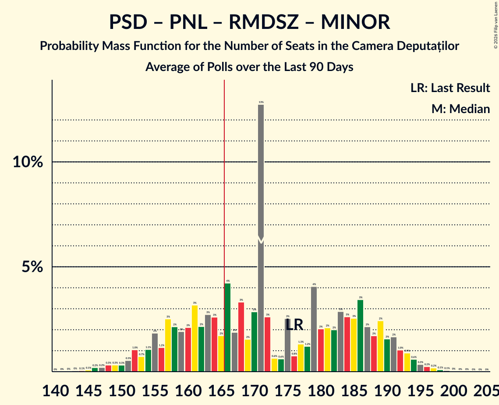

| Number of Seats | Probability | Accumulated | Special Marks |
|:---------------:|:-----------:|:-----------:|:-------------:|
| 151 | 0% | 100% |  |
| 152 | 0.1% | 99.9% |  |
| 153 | 0.1% | 99.9% |  |
| 154 | 0.2% | 99.8% |  |
| 155 | 0.2% | 99.5% |  |
| 156 | 0.4% | 99.3% |  |
| 157 | 0.6% | 98.9% |  |
| 158 | 0.9% | 98% |  |
| 159 | 1.0% | 97% |  |
| 160 | 2% | 96% |  |
| 161 | 2% | 95% |  |
| 162 | 2% | 93% |  |
| 163 | 2% | 91% |  |
| 164 | 3% | 88% |  |
| 165 | 3% | 85% |  |
| 166 | 6% | 83% | Majority |
| 167 | 3% | 77% |  |
| 168 | 5% | 73% |  |
| 169 | 3% | 69% |  |
| 170 | 5% | 66% | Median |
| 171 | 14% | 61% |  |
| 172 | 4% | 47% |  |
| 173 | 1.4% | 44% |  |
| 174 | 1.4% | 42% |  |
| 175 | 3% | 41% |  |
| 176 | 1.5% | 38% | Last Result |
| 177 | 2% | 36% |  |
| 178 | 2% | 34% |  |
| 179 | 5% | 32% |  |
| 180 | 3% | 27% |  |
| 181 | 3% | 24% |  |
| 182 | 3% | 22% |  |
| 183 | 3% | 19% |  |
| 184 | 3% | 17% |  |
| 185 | 2% | 14% |  |
| 186 | 3% | 11% |  |
| 187 | 2% | 9% |  |
| 188 | 2% | 7% |  |
| 189 | 1.5% | 5% |  |
| 190 | 1.2% | 4% |  |
| 191 | 0.8% | 3% |  |
| 192 | 0.6% | 2% |  |
| 193 | 0.4% | 1.1% |  |
| 194 | 0.3% | 0.7% |  |
| 195 | 0.2% | 0.4% |  |
| 196 | 0.1% | 0.2% |  |
| 197 | 0.1% | 0.1% |  |
| 198 | 0% | 0.1% |  |
| 199 | 0% | 0% |  |

### Partidul Social Democrat – Partidul Național Liberal – Uniunea Salvați România

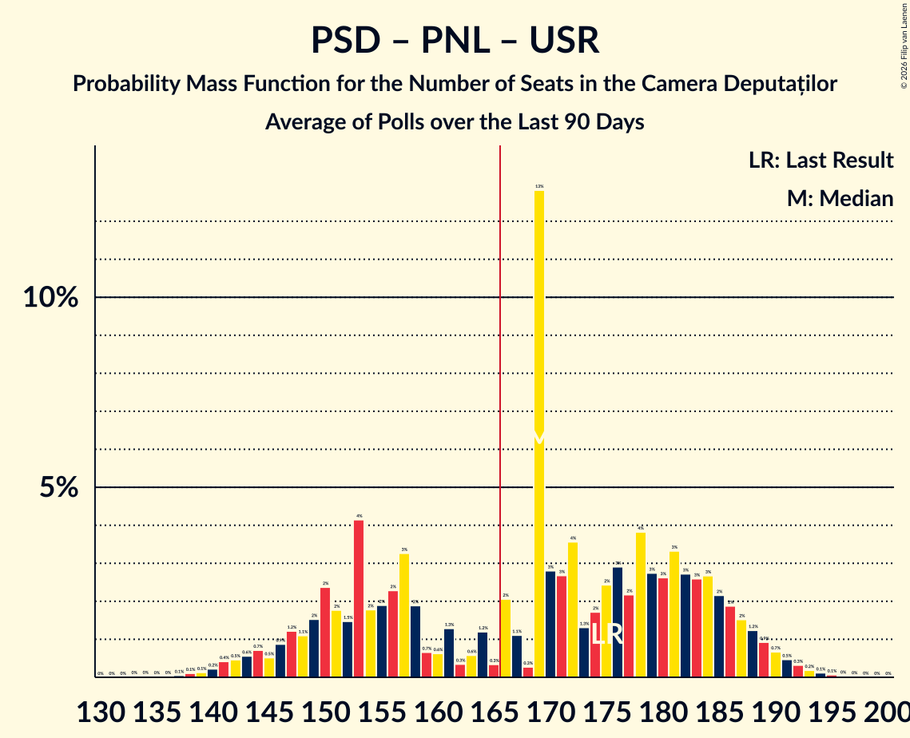

| Number of Seats | Probability | Accumulated | Special Marks |
|:---------------:|:-----------:|:-----------:|:-------------:|
| 149 | 0% | 100% |  |
| 150 | 0% | 99.9% |  |
| 151 | 0.1% | 99.9% |  |
| 152 | 0.2% | 99.8% |  |
| 153 | 0.2% | 99.5% |  |
| 154 | 0.4% | 99.3% |  |
| 155 | 0.6% | 98.9% |  |
| 156 | 0.6% | 98% |  |
| 157 | 0.8% | 98% |  |
| 158 | 1.3% | 97% |  |
| 159 | 2% | 96% |  |
| 160 | 3% | 94% |  |
| 161 | 3% | 91% |  |
| 162 | 3% | 88% |  |
| 163 | 2% | 85% |  |
| 164 | 3% | 83% |  |
| 165 | 2% | 81% |  |
| 166 | 5% | 79% | Majority |
| 167 | 4% | 74% |  |
| 168 | 3% | 70% | Median |
| 169 | 14% | 68% |  |
| 170 | 4% | 53% |  |
| 171 | 3% | 49% |  |
| 172 | 4% | 46% |  |
| 173 | 2% | 42% |  |
| 174 | 2% | 40% |  |
| 175 | 3% | 38% | Last Result |
| 176 | 3% | 36% |  |
| 177 | 2% | 32% |  |
| 178 | 4% | 30% |  |
| 179 | 3% | 26% |  |
| 180 | 3% | 24% |  |
| 181 | 3% | 21% |  |
| 182 | 3% | 18% |  |
| 183 | 2% | 15% |  |
| 184 | 3% | 12% |  |
| 185 | 2% | 10% |  |
| 186 | 2% | 8% |  |
| 187 | 2% | 6% |  |
| 188 | 1.2% | 4% |  |
| 189 | 0.8% | 3% |  |
| 190 | 0.7% | 2% |  |
| 191 | 0.5% | 1.2% |  |
| 192 | 0.3% | 0.8% |  |
| 193 | 0.2% | 0.5% |  |
| 194 | 0.1% | 0.3% |  |
| 195 | 0.1% | 0.1% |  |
| 196 | 0% | 0.1% |  |
| 197 | 0% | 0% |  |

### Partidul Social Democrat – Partidul Național Liberal – Romániai Magyar Demokrata Szövetség

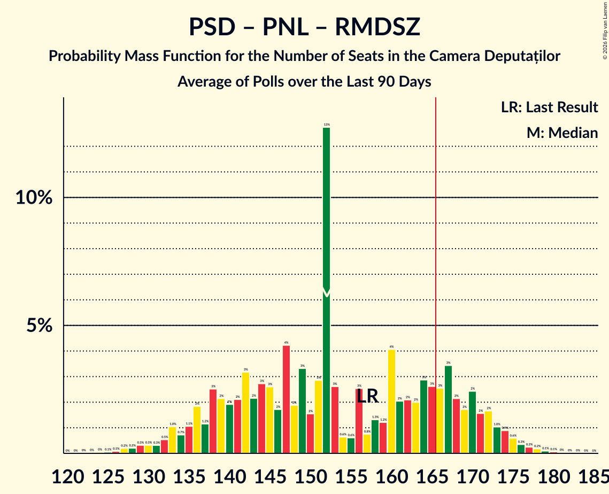

| Number of Seats | Probability | Accumulated | Special Marks |
|:---------------:|:-----------:|:-----------:|:-------------:|
| 132 | 0% | 100% |  |
| 133 | 0.1% | 99.9% |  |
| 134 | 0.1% | 99.9% |  |
| 135 | 0.2% | 99.8% |  |
| 136 | 0.2% | 99.5% |  |
| 137 | 0.4% | 99.3% |  |
| 138 | 0.6% | 98.9% |  |
| 139 | 0.9% | 98% |  |
| 140 | 1.0% | 97% |  |
| 141 | 2% | 96% |  |
| 142 | 2% | 95% |  |
| 143 | 2% | 93% |  |
| 144 | 2% | 91% |  |
| 145 | 3% | 88% |  |
| 146 | 3% | 85% |  |
| 147 | 6% | 83% |  |
| 148 | 3% | 77% |  |
| 149 | 5% | 73% |  |
| 150 | 3% | 69% |  |
| 151 | 5% | 66% | Median |
| 152 | 14% | 61% |  |
| 153 | 4% | 47% |  |
| 154 | 1.4% | 44% |  |
| 155 | 1.4% | 42% |  |
| 156 | 3% | 41% |  |
| 157 | 1.5% | 38% | Last Result |
| 158 | 2% | 36% |  |
| 159 | 2% | 34% |  |
| 160 | 5% | 32% |  |
| 161 | 3% | 27% |  |
| 162 | 3% | 24% |  |
| 163 | 3% | 22% |  |
| 164 | 3% | 19% |  |
| 165 | 3% | 17% |  |
| 166 | 2% | 14% | Majority |
| 167 | 3% | 11% |  |
| 168 | 2% | 9% |  |
| 169 | 2% | 7% |  |
| 170 | 1.5% | 5% |  |
| 171 | 1.2% | 4% |  |
| 172 | 0.8% | 3% |  |
| 173 | 0.6% | 2% |  |
| 174 | 0.4% | 1.1% |  |
| 175 | 0.3% | 0.7% |  |
| 176 | 0.2% | 0.4% |  |
| 177 | 0.1% | 0.2% |  |
| 178 | 0.1% | 0.1% |  |
| 179 | 0% | 0.1% |  |
| 180 | 0% | 0% |  |

### Partidul Social Democrat – Partidul Național Liberal

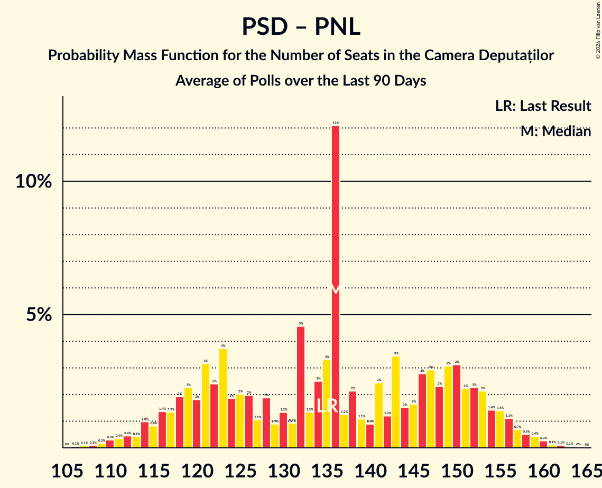

| Number of Seats | Probability | Accumulated | Special Marks |
|:---------------:|:-----------:|:-----------:|:-------------:|
| 115 | 0% | 100% |  |
| 116 | 0.1% | 99.9% |  |
| 117 | 0.1% | 99.9% |  |
| 118 | 0.2% | 99.8% |  |
| 119 | 0.3% | 99.6% |  |
| 120 | 0.4% | 99.3% |  |
| 121 | 0.6% | 99.0% |  |
| 122 | 0.9% | 98% |  |
| 123 | 1.0% | 97% |  |
| 124 | 1.2% | 96% |  |
| 125 | 2% | 95% |  |
| 126 | 2% | 93% |  |
| 127 | 3% | 91% |  |
| 128 | 3% | 88% |  |
| 129 | 3% | 85% |  |
| 130 | 3% | 83% |  |
| 131 | 3% | 80% |  |
| 132 | 7% | 77% |  |
| 133 | 3% | 70% |  |
| 134 | 4% | 67% |  |
| 135 | 4% | 62% | Last Result, Median |
| 136 | 13% | 58% |  |
| 137 | 2% | 45% |  |
| 138 | 3% | 43% |  |
| 139 | 1.4% | 41% |  |
| 140 | 0.9% | 39% |  |
| 141 | 2% | 38% |  |
| 142 | 1.0% | 36% |  |
| 143 | 3% | 35% |  |
| 144 | 1.0% | 33% |  |
| 145 | 2% | 31% |  |
| 146 | 2% | 30% |  |
| 147 | 3% | 28% |  |
| 148 | 2% | 25% |  |
| 149 | 2% | 23% |  |
| 150 | 2% | 21% |  |
| 151 | 3% | 19% |  |
| 152 | 3% | 16% |  |
| 153 | 3% | 12% |  |
| 154 | 2% | 10% |  |
| 155 | 1.4% | 7% |  |
| 156 | 1.3% | 6% |  |
| 157 | 1.2% | 5% |  |
| 158 | 1.1% | 3% |  |
| 159 | 1.0% | 2% |  |
| 160 | 0.6% | 1.4% |  |
| 161 | 0.3% | 0.8% |  |
| 162 | 0.2% | 0.5% |  |
| 163 | 0.1% | 0.3% |  |
| 164 | 0.1% | 0.2% |  |
| 165 | 0.1% | 0.1% |  |
| 166 | 0% | 0.1% | Majority |
| 167 | 0% | 0% |  |

### Partidul Național Liberal – Uniunea Salvați România – Romániai Magyar Demokrata Szövetség – Parties of ethnic minorities

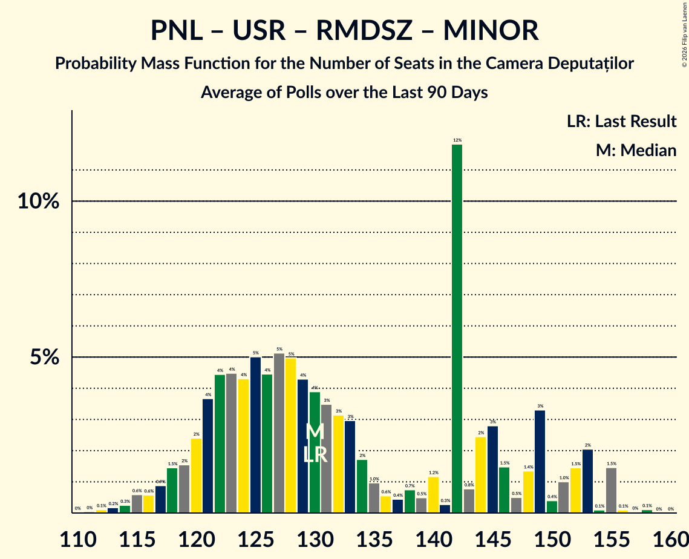

| Number of Seats | Probability | Accumulated | Special Marks |
|:---------------:|:-----------:|:-----------:|:-------------:|
| 121 | 0% | 100% |  |
| 122 | 0% | 99.9% |  |
| 123 | 0% | 99.9% |  |
| 124 | 0.1% | 99.9% |  |
| 125 | 0.4% | 99.8% |  |
| 126 | 0.9% | 99.4% |  |
| 127 | 1.1% | 98.5% |  |
| 128 | 0.8% | 97% |  |
| 129 | 0.4% | 97% |  |
| 130 | 0.6% | 96% | Last Result |
| 131 | 2% | 96% |  |
| 132 | 4% | 94% |  |
| 133 | 6% | 89% |  |
| 134 | 6% | 84% |  |
| 135 | 4% | 78% |  |
| 136 | 3% | 74% |  |
| 137 | 3% | 71% |  |
| 138 | 5% | 69% |  |
| 139 | 6% | 64% |  |
| 140 | 7% | 58% |  |
| 141 | 5% | 51% | Median |
| 142 | 15% | 46% |  |
| 143 | 4% | 31% |  |
| 144 | 5% | 28% |  |
| 145 | 4% | 22% |  |
| 146 | 3% | 18% |  |
| 147 | 2% | 15% |  |
| 148 | 2% | 13% |  |
| 149 | 4% | 11% |  |
| 150 | 0.8% | 8% |  |
| 151 | 1.2% | 7% |  |
| 152 | 2% | 6% |  |
| 153 | 2% | 4% |  |
| 154 | 0.1% | 2% |  |
| 155 | 1.5% | 2% |  |
| 156 | 0.1% | 0.3% |  |
| 157 | 0% | 0.2% |  |
| 158 | 0.1% | 0.1% |  |
| 159 | 0% | 0% |  |

### Alianța pentru Unirea Românilor

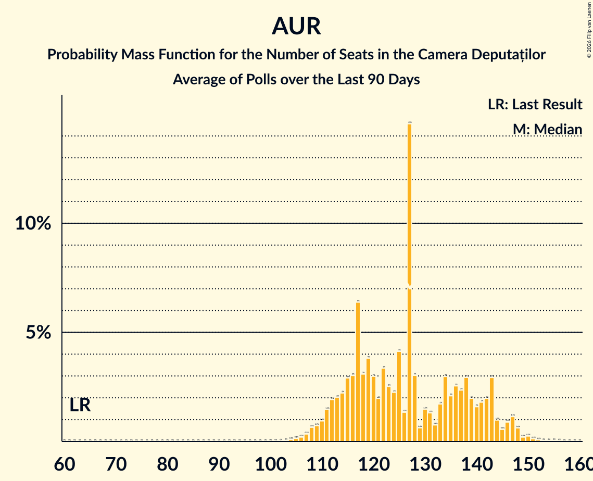

| Number of Seats | Probability | Accumulated | Special Marks |
|:---------------:|:-----------:|:-----------:|:-------------:|
| 63 | 0% | 100% | Last Result |
| 64 | 0% | 100% |  |
| 65 | 0% | 100% |  |
| 66 | 0% | 100% |  |
| 67 | 0% | 100% |  |
| 68 | 0% | 100% |  |
| 69 | 0% | 100% |  |
| 70 | 0% | 100% |  |
| 71 | 0% | 100% |  |
| 72 | 0% | 100% |  |
| 73 | 0% | 100% |  |
| 74 | 0% | 100% |  |
| 75 | 0% | 100% |  |
| 76 | 0% | 100% |  |
| 77 | 0% | 100% |  |
| 78 | 0% | 100% |  |
| 79 | 0% | 100% |  |
| 80 | 0% | 100% |  |
| 81 | 0% | 100% |  |
| 82 | 0% | 100% |  |
| 83 | 0% | 100% |  |
| 84 | 0% | 100% |  |
| 85 | 0% | 100% |  |
| 86 | 0% | 100% |  |
| 87 | 0% | 100% |  |
| 88 | 0% | 100% |  |
| 89 | 0% | 100% |  |
| 90 | 0% | 100% |  |
| 91 | 0% | 100% |  |
| 92 | 0% | 100% |  |
| 93 | 0% | 100% |  |
| 94 | 0% | 100% |  |
| 95 | 0% | 100% |  |
| 96 | 0% | 100% |  |
| 97 | 0% | 100% |  |
| 98 | 0% | 100% |  |
| 99 | 0% | 100% |  |
| 100 | 0% | 100% |  |
| 101 | 0% | 100% |  |
| 102 | 0% | 100% |  |
| 103 | 0% | 100% |  |
| 104 | 0.1% | 99.9% |  |
| 105 | 0.1% | 99.8% |  |
| 106 | 0.2% | 99.7% |  |
| 107 | 0.4% | 99.5% |  |
| 108 | 0.6% | 99.1% |  |
| 109 | 0.7% | 98.5% |  |
| 110 | 1.0% | 98% |  |
| 111 | 2% | 97% |  |
| 112 | 2% | 95% |  |
| 113 | 2% | 94% |  |
| 114 | 2% | 92% |  |
| 115 | 3% | 89% |  |
| 116 | 3% | 86% |  |
| 117 | 6% | 83% |  |
| 118 | 3% | 77% |  |
| 119 | 4% | 74% |  |
| 120 | 3% | 70% |  |
| 121 | 2% | 67% |  |
| 122 | 4% | 64% |  |
| 123 | 3% | 61% |  |
| 124 | 3% | 58% |  |
| 125 | 5% | 55% | Median |
| 126 | 2% | 50% |  |
| 127 | 16% | 47% |  |
| 128 | 5% | 31% |  |
| 129 | 3% | 26% |  |
| 130 | 3% | 23% |  |
| 131 | 3% | 20% |  |
| 132 | 3% | 17% |  |
| 133 | 3% | 14% |  |
| 134 | 2% | 11% |  |
| 135 | 2% | 9% |  |
| 136 | 1.1% | 6% |  |
| 137 | 2% | 5% |  |
| 138 | 1.2% | 3% |  |
| 139 | 0.7% | 2% |  |
| 140 | 0.6% | 2% |  |
| 141 | 0.3% | 0.9% |  |
| 142 | 0.3% | 0.6% |  |
| 143 | 0.2% | 0.4% |  |
| 144 | 0.1% | 0.2% |  |
| 145 | 0% | 0.1% |  |
| 146 | 0% | 0.1% |  |
| 147 | 0% | 0% |  |

### Partidul Național Liberal – Uniunea Salvați România – Romániai Magyar Demokrata Szövetség

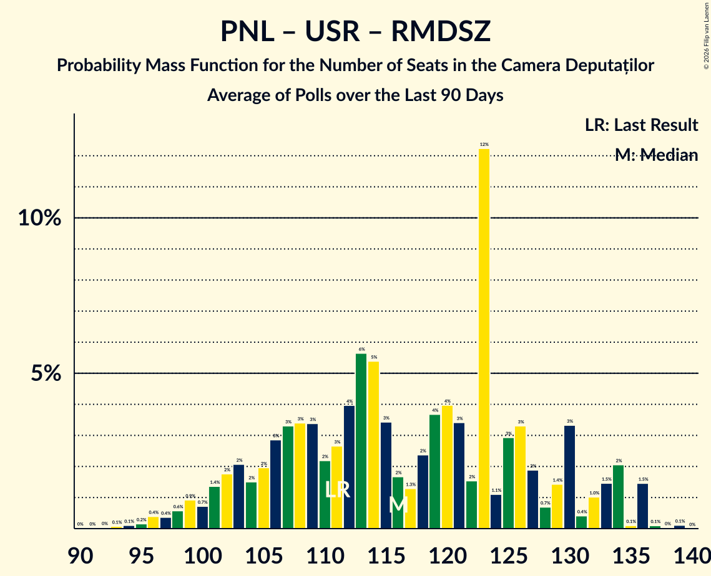

| Number of Seats | Probability | Accumulated | Special Marks |
|:---------------:|:-----------:|:-----------:|:-------------:|
| 102 | 0% | 100% |  |
| 103 | 0% | 99.9% |  |
| 104 | 0% | 99.9% |  |
| 105 | 0.1% | 99.9% |  |
| 106 | 0.4% | 99.8% |  |
| 107 | 0.9% | 99.4% |  |
| 108 | 1.1% | 98.5% |  |
| 109 | 0.8% | 97% |  |
| 110 | 0.4% | 97% |  |
| 111 | 0.6% | 96% | Last Result |
| 112 | 2% | 96% |  |
| 113 | 4% | 94% |  |
| 114 | 6% | 89% |  |
| 115 | 6% | 84% |  |
| 116 | 4% | 78% |  |
| 117 | 3% | 74% |  |
| 118 | 3% | 71% |  |
| 119 | 5% | 69% |  |
| 120 | 6% | 64% |  |
| 121 | 7% | 58% |  |
| 122 | 5% | 51% | Median |
| 123 | 15% | 46% |  |
| 124 | 4% | 31% |  |
| 125 | 5% | 28% |  |
| 126 | 4% | 22% |  |
| 127 | 3% | 18% |  |
| 128 | 2% | 15% |  |
| 129 | 2% | 13% |  |
| 130 | 4% | 11% |  |
| 131 | 0.8% | 8% |  |
| 132 | 1.2% | 7% |  |
| 133 | 2% | 6% |  |
| 134 | 2% | 4% |  |
| 135 | 0.1% | 2% |  |
| 136 | 1.5% | 2% |  |
| 137 | 0.1% | 0.3% |  |
| 138 | 0% | 0.2% |  |
| 139 | 0.1% | 0.1% |  |
| 140 | 0% | 0% |  |

### Partidul Național Liberal – Romániai Magyar Demokrata Szövetség – Parties of ethnic minorities

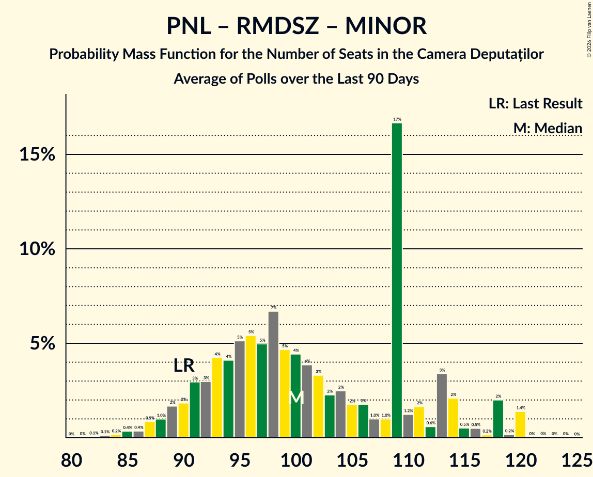

| Number of Seats | Probability | Accumulated | Special Marks |
|:---------------:|:-----------:|:-----------:|:-------------:|
| 90 | 0% | 100% | Last Result |
| 91 | 0% | 100% |  |
| 92 | 0.1% | 99.9% |  |
| 93 | 0.1% | 99.9% |  |
| 94 | 0.3% | 99.7% |  |
| 95 | 0.4% | 99.5% |  |
| 96 | 0.8% | 99.0% |  |
| 97 | 1.0% | 98% |  |
| 98 | 2% | 97% |  |
| 99 | 2% | 96% |  |
| 100 | 3% | 93% |  |
| 101 | 4% | 90% |  |
| 102 | 5% | 86% |  |
| 103 | 6% | 81% |  |
| 104 | 6% | 75% |  |
| 105 | 7% | 69% |  |
| 106 | 6% | 62% |  |
| 107 | 5% | 56% |  |
| 108 | 6% | 51% | Median |
| 109 | 21% | 45% |  |
| 110 | 4% | 24% |  |
| 111 | 4% | 20% |  |
| 112 | 2% | 16% |  |
| 113 | 5% | 13% |  |
| 114 | 3% | 9% |  |
| 115 | 1.0% | 6% |  |
| 116 | 0.8% | 5% |  |
| 117 | 0.3% | 4% |  |
| 118 | 2% | 4% |  |
| 119 | 0.2% | 2% |  |
| 120 | 1.4% | 2% |  |
| 121 | 0% | 0.1% |  |
| 122 | 0% | 0.1% |  |
| 123 | 0% | 0.1% |  |
| 124 | 0% | 0% |  |

### Partidul Național Liberal – Uniunea Salvați România

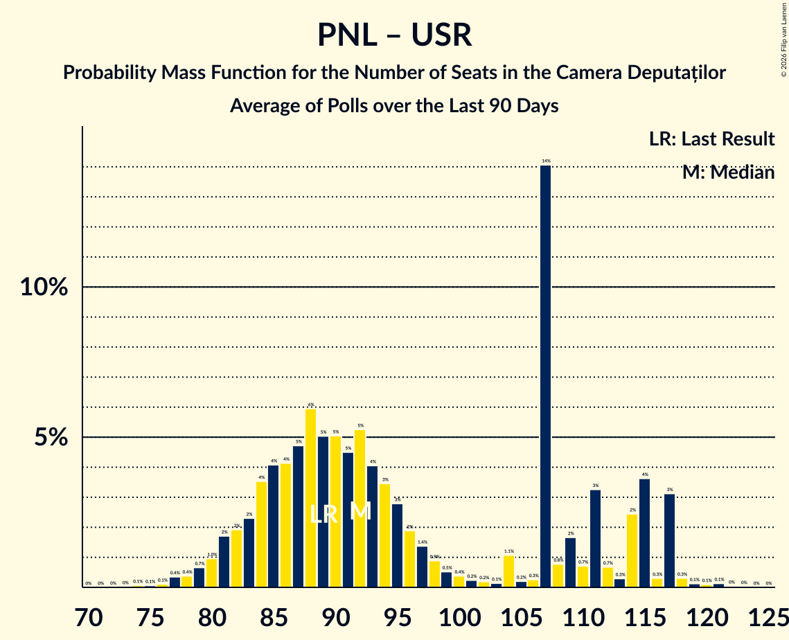

| Number of Seats | Probability | Accumulated | Special Marks |
|:---------------:|:-----------:|:-----------:|:-------------:|
| 89 | 0% | 100% | Last Result |
| 90 | 0.1% | 99.9% |  |
| 91 | 0.2% | 99.8% |  |
| 92 | 0.3% | 99.7% |  |
| 93 | 0.6% | 99.4% |  |
| 94 | 0.6% | 98.8% |  |
| 95 | 1.2% | 98% |  |
| 96 | 2% | 97% |  |
| 97 | 2% | 95% |  |
| 98 | 3% | 93% |  |
| 99 | 4% | 90% |  |
| 100 | 4% | 86% |  |
| 101 | 5% | 82% |  |
| 102 | 6% | 77% |  |
| 103 | 5% | 71% |  |
| 104 | 6% | 66% |  |
| 105 | 6% | 59% |  |
| 106 | 5% | 54% | Median |
| 107 | 18% | 49% |  |
| 108 | 5% | 31% |  |
| 109 | 4% | 26% |  |
| 110 | 3% | 22% |  |
| 111 | 5% | 19% |  |
| 112 | 2% | 14% |  |
| 113 | 0.9% | 12% |  |
| 114 | 3% | 11% |  |
| 115 | 4% | 8% |  |
| 116 | 0.5% | 5% |  |
| 117 | 3% | 4% |  |
| 118 | 0.4% | 0.8% |  |
| 119 | 0.2% | 0.5% |  |
| 120 | 0.1% | 0.3% |  |
| 121 | 0.1% | 0.2% |  |
| 122 | 0% | 0.1% |  |
| 123 | 0% | 0% |  |

### Partidul Social Democrat – Uniunea Salvați România

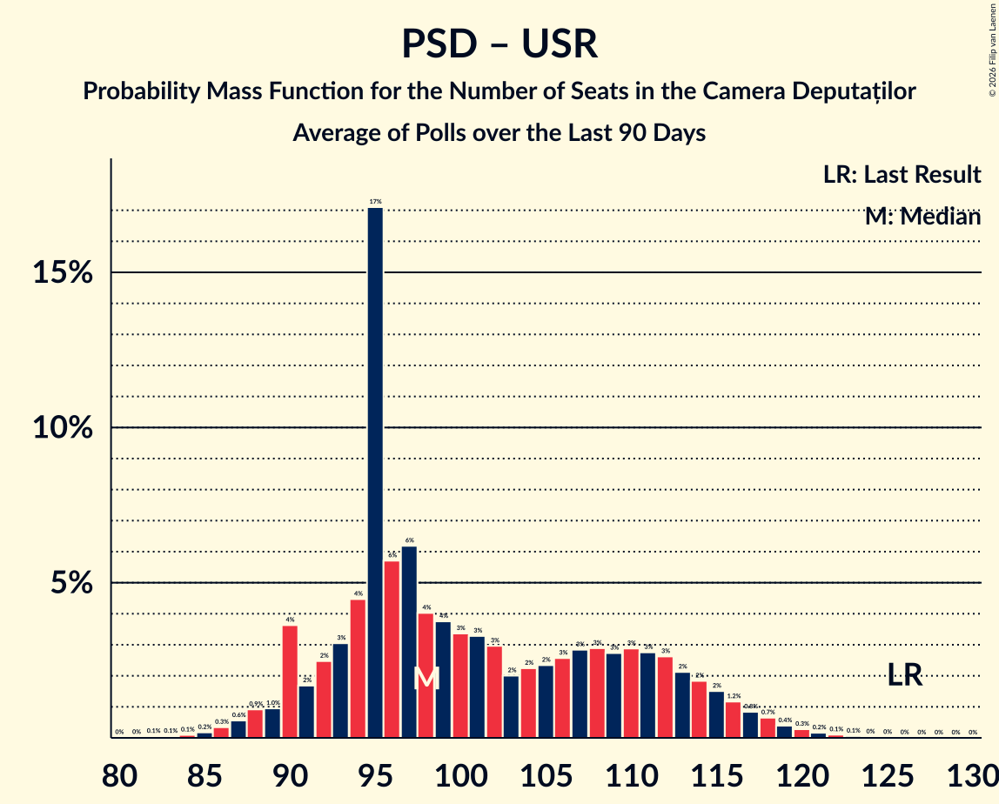

| Number of Seats | Probability | Accumulated | Special Marks |
|:---------------:|:-----------:|:-----------:|:-------------:|
| 81 | 0.1% | 100% |  |
| 82 | 0.1% | 99.9% |  |
| 83 | 0.1% | 99.8% |  |
| 84 | 0.3% | 99.7% |  |
| 85 | 0.4% | 99.5% |  |
| 86 | 0.5% | 99.1% |  |
| 87 | 1.0% | 98.6% |  |
| 88 | 1.4% | 98% |  |
| 89 | 1.2% | 96% |  |
| 90 | 5% | 95% |  |
| 91 | 2% | 90% |  |
| 92 | 4% | 88% |  |
| 93 | 3% | 84% |  |
| 94 | 6% | 80% |  |
| 95 | 17% | 74% | Median |
| 96 | 6% | 58% |  |
| 97 | 5% | 51% |  |
| 98 | 4% | 46% |  |
| 99 | 2% | 42% |  |
| 100 | 3% | 40% |  |
| 101 | 2% | 37% |  |
| 102 | 3% | 35% |  |
| 103 | 1.5% | 33% |  |
| 104 | 2% | 31% |  |
| 105 | 2% | 29% |  |
| 106 | 2% | 28% |  |
| 107 | 3% | 25% |  |
| 108 | 3% | 23% |  |
| 109 | 3% | 20% |  |
| 110 | 3% | 17% |  |
| 111 | 3% | 14% |  |
| 112 | 2% | 12% |  |
| 113 | 2% | 9% |  |
| 114 | 2% | 7% |  |
| 115 | 1.4% | 5% |  |
| 116 | 1.3% | 4% |  |
| 117 | 0.9% | 3% |  |
| 118 | 0.7% | 2% |  |
| 119 | 0.4% | 1.0% |  |
| 120 | 0.3% | 0.7% |  |
| 121 | 0.2% | 0.4% |  |
| 122 | 0.1% | 0.2% |  |
| 123 | 0.1% | 0.1% |  |
| 124 | 0% | 0.1% |  |
| 125 | 0% | 0% |  |
| 126 | 0% | 0% | Last Result |

### Partidul Național Liberal – Romániai Magyar Demokrata Szövetség

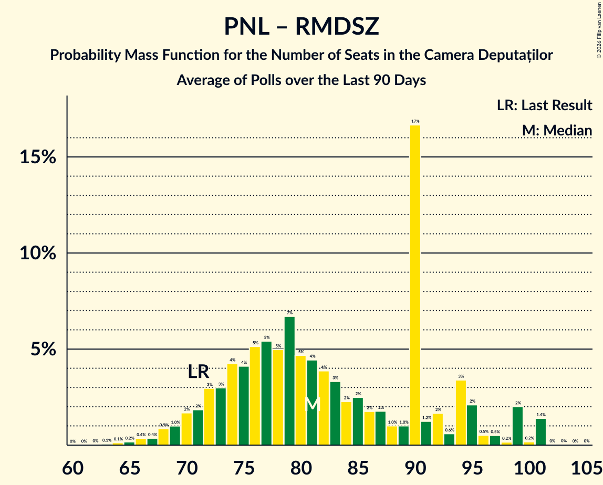

| Number of Seats | Probability | Accumulated | Special Marks |
|:---------------:|:-----------:|:-----------:|:-------------:|
| 71 | 0% | 100% | Last Result |
| 72 | 0% | 100% |  |
| 73 | 0.1% | 99.9% |  |
| 74 | 0.1% | 99.9% |  |
| 75 | 0.3% | 99.7% |  |
| 76 | 0.4% | 99.5% |  |
| 77 | 0.8% | 99.0% |  |
| 78 | 1.0% | 98% |  |
| 79 | 2% | 97% |  |
| 80 | 2% | 96% |  |
| 81 | 3% | 93% |  |
| 82 | 4% | 90% |  |
| 83 | 5% | 86% |  |
| 84 | 6% | 81% |  |
| 85 | 6% | 75% |  |
| 86 | 7% | 69% |  |
| 87 | 6% | 62% |  |
| 88 | 5% | 56% |  |
| 89 | 6% | 51% | Median |
| 90 | 21% | 45% |  |
| 91 | 4% | 24% |  |
| 92 | 4% | 20% |  |
| 93 | 2% | 16% |  |
| 94 | 5% | 13% |  |
| 95 | 3% | 9% |  |
| 96 | 1.0% | 6% |  |
| 97 | 0.8% | 5% |  |
| 98 | 0.3% | 4% |  |
| 99 | 2% | 4% |  |
| 100 | 0.2% | 2% |  |
| 101 | 1.4% | 2% |  |
| 102 | 0% | 0.1% |  |
| 103 | 0% | 0.1% |  |
| 104 | 0% | 0.1% |  |
| 105 | 0% | 0% |  |

### Partidul Social Democrat

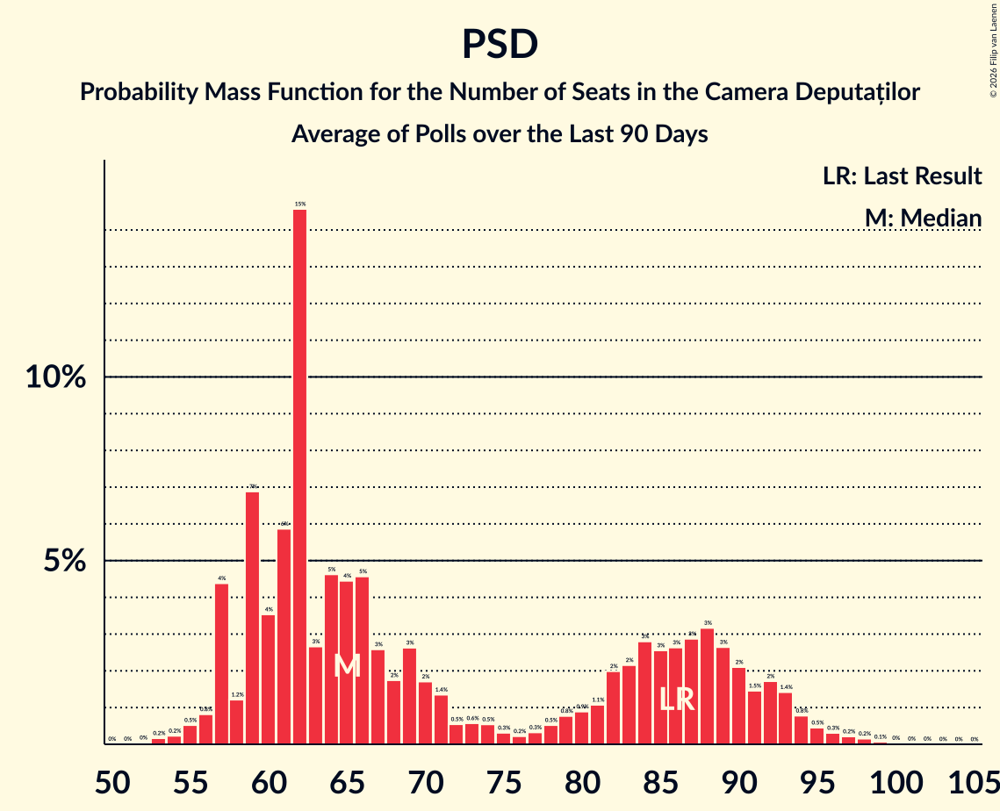

| Number of Seats | Probability | Accumulated | Special Marks |
|:---------------:|:-----------:|:-----------:|:-------------:|
| 49 | 0% | 100% |  |
| 50 | 0.1% | 99.9% |  |
| 51 | 0.2% | 99.8% |  |
| 52 | 0.6% | 99.6% |  |
| 53 | 0.8% | 99.0% |  |
| 54 | 1.1% | 98% |  |
| 55 | 2% | 97% |  |
| 56 | 2% | 95% |  |
| 57 | 8% | 93% |  |
| 58 | 4% | 86% |  |
| 59 | 9% | 81% |  |
| 60 | 6% | 72% |  |
| 61 | 6% | 67% |  |
| 62 | 14% | 60% | Median |
| 63 | 3% | 46% |  |
| 64 | 3% | 43% |  |
| 65 | 2% | 40% |  |
| 66 | 2% | 37% |  |
| 67 | 1.3% | 36% |  |
| 68 | 0.6% | 34% |  |
| 69 | 0.5% | 34% |  |
| 70 | 0.5% | 33% |  |
| 71 | 0.6% | 33% |  |
| 72 | 1.0% | 32% |  |
| 73 | 1.2% | 31% |  |
| 74 | 2% | 30% |  |
| 75 | 2% | 28% |  |
| 76 | 2% | 26% |  |
| 77 | 3% | 24% |  |
| 78 | 3% | 21% |  |
| 79 | 4% | 18% |  |
| 80 | 3% | 15% |  |
| 81 | 3% | 12% |  |
| 82 | 2% | 9% |  |
| 83 | 2% | 7% |  |
| 84 | 2% | 5% |  |
| 85 | 1.0% | 3% |  |
| 86 | 0.8% | 2% | Last Result |
| 87 | 0.6% | 1.4% |  |
| 88 | 0.3% | 0.8% |  |
| 89 | 0.2% | 0.5% |  |
| 90 | 0.1% | 0.3% |  |
| 91 | 0.1% | 0.1% |  |
| 92 | 0% | 0.1% |  |
| 93 | 0% | 0% |  |

### Partidul Național Liberal

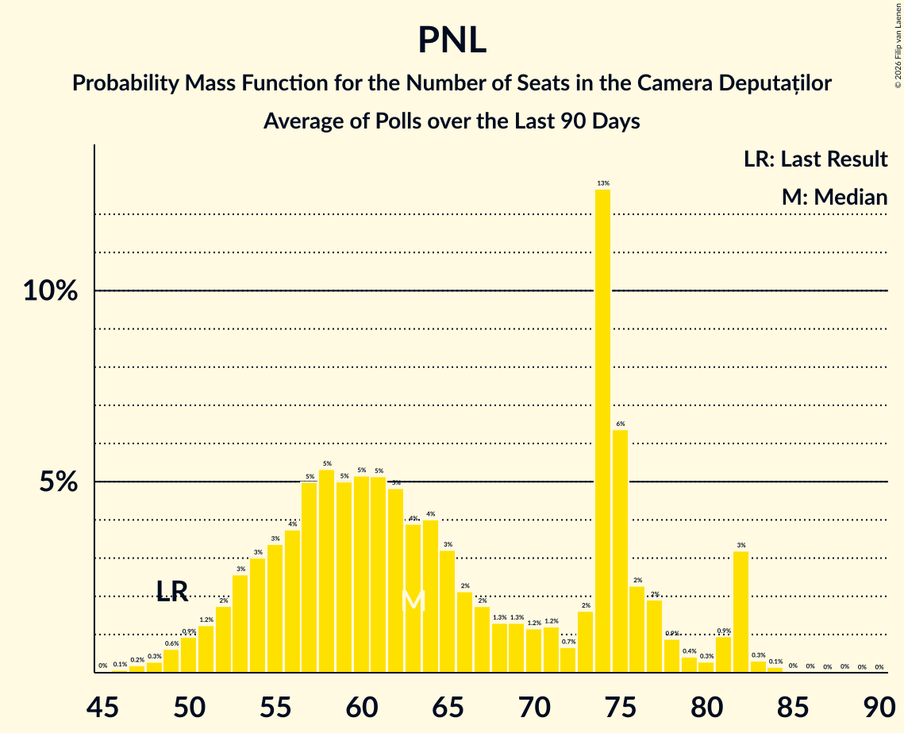

| Number of Seats | Probability | Accumulated | Special Marks |
|:---------------:|:-----------:|:-----------:|:-------------:|
| 49 | 0% | 100% | Last Result |
| 50 | 0% | 100% |  |
| 51 | 0% | 100% |  |
| 52 | 0% | 100% |  |
| 53 | 0% | 100% |  |
| 54 | 0% | 100% |  |
| 55 | 0% | 100% |  |
| 56 | 0% | 100% |  |
| 57 | 0% | 100% |  |
| 58 | 0.1% | 100% |  |
| 59 | 0.1% | 99.9% |  |
| 60 | 0.3% | 99.8% |  |
| 61 | 0.5% | 99.5% |  |
| 62 | 0.7% | 99.1% |  |
| 63 | 1.2% | 98% |  |
| 64 | 2% | 97% |  |
| 65 | 2% | 95% |  |
| 66 | 3% | 93% |  |
| 67 | 4% | 90% |  |
| 68 | 5% | 86% |  |
| 69 | 6% | 80% |  |
| 70 | 7% | 74% |  |
| 71 | 6% | 67% |  |
| 72 | 7% | 61% |  |
| 73 | 6% | 53% | Median |
| 74 | 17% | 47% |  |
| 75 | 10% | 30% |  |
| 76 | 5% | 20% |  |
| 77 | 4% | 15% |  |
| 78 | 3% | 11% |  |
| 79 | 1.5% | 8% |  |
| 80 | 0.8% | 7% |  |
| 81 | 1.5% | 6% |  |
| 82 | 3% | 4% |  |
| 83 | 0.5% | 0.8% |  |
| 84 | 0.2% | 0.4% |  |
| 85 | 0.1% | 0.2% |  |
| 86 | 0% | 0.1% |  |
| 87 | 0% | 0% |  |

## Technical Information

+ **Number of polls included in this average:** 3
+ **Lowest number of simulations done in a poll included in this average:** 1,048,576
+ **Total number of simulations done in the polls included in this average:** 5,242,880
+ **Error estimate:** 3.41%
