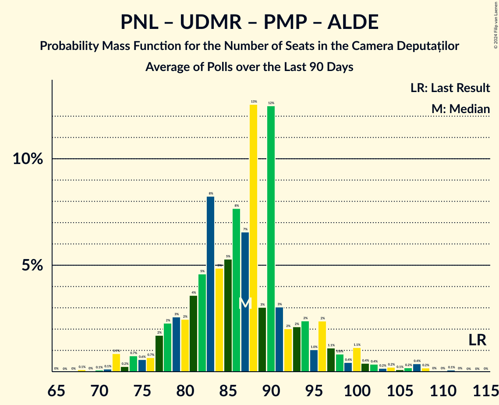

# Poll Average

<a href="#voting-intentions">Voting Intentions</a> | <a href="#seats">Seats</a> | <a href="#coalitions">Coalitions</a> | <a href="#technical-information">Technical Information</a>

## Summary

The table below lists the polls on which the average is based. They are the most recent polls (less than 90 days old) registered and analyzed so far.

| Period     | Polling firm/Commissioner(s) | PSD | PNL | A2020 | UDMR | ALDE | PMP | MIN | PRO | AUR | PPU-SL |
|:----------:|:----------------------------:|:--:|:--:|:--:|:--:|:--:|:--:|:--:|:--:|:--:|:--:|
| 6 December 2020 | General Election | 28.9%   110 | 25.2%   93 | 15.4%   55 | 5.7%   21 | 0.0%   0 | 4.8%   0 | 0.0%   17 | 4.1%   0 | 9.1%   33 | 0.0%   0 |
| N/A | Poll Average | 30–40%   101–147 | 14–30%   51–100 | 10–17%   33–57 | 4–8%   13–27 | N/A   N/A | 2–6%   0–20 | N/A   17 | 2–6%   0–19 | 9–17%   30–61 | 1–5%   0–16 |
| [8–10 September 2021](2021-09-10-CURS.html) | CURS | 33–39%   112–141 | 17–22%   54–76 | 9–13%   28–45 | 4–7%   13–22 | N/A   N/A | 4–7%   0–19 | N/A   17 | 4–7%   0–21 | 12–17%   41–58 | 3–5%   0–18 |
| [20–24 August 2021](2021-08-24-Avangarde.html) | Avangarde | 32–38%   108–131 | 18–24%   59–82 | 12–16%   39–55 | 4–7%   13–22 | N/A   N/A | 4–7%   0–22 | N/A   17 | 1–3%   0 | 13–17%   43–59 | 1–2%   0 |
| [15–19 August 2021](2021-08-19-IRES.html) | IRES | 32–38%   107–124 | 24–30%   81–97 | 12–16%   39–52 | 4–7%   12–20 | N/A   N/A | 1–3%   0 | N/A   17 | 2–4%   0 | 12–16%   39–53 | N/A   N/A |
| [1–15 July 2021](2021-07-15-Sociopol.html) | Sociopol | 29–35%   97–117 | 25–31%   84–102 | 13–18%   45–59 | 6–9%   19–29 | N/A   N/A | 1–3%   0 | N/A   17 | 3–5%   0–17 | 9–12%   28–41 | N/A   N/A |
| [1–15 July 2021](2021-07-15-INSOMAR.html) | INSOMAR   Realitatea.net | 35–41%   130–151 | 13–17%   48–64 | 9–13%   34–48 | 4–7%   14–24 | N/A   N/A | N/A   N/A | N/A   17 | N/A   N/A | 13–17%   48–64 | N/A   N/A |
| 6 December 2020 | General Election | 28.9%   110 | 25.2%   93 | 15.4%   55 | 5.7%   21 | 0.0%   0 | 4.8%   0 | 0.0%   17 | 4.1%   0 | 9.1%   33 | 0.0%   0 |

Only polls for which at least the sample size has been published are included in the table above.

**Legend:**
+ **Top half of each row:** Voting intentions (95% confidence interval)
+ **Bottom half of each row:** Seat projections for the Camera Deputaților (95% confidence interval)
+ **PSD:** Partidul Social Democrat
+ **PNL:** Partidul Național Liberal
+ **A2020:** Alianța 2020 USR-PLUS
+ **UDMR:** Uniunea Democrată Maghiară din România
+ **ALDE:** Partidul Alianța Liberalilor și Democraților
+ **PMP:** Partidul Mișcarea Populară
+ **MIN:** Parties of ethnic minorities
+ **PRO:** PRO România
+ **AUR:** Alianța pentru Unirea Românilor
+ **PPU-SL:** Partidul Puterii Umaniste (social-liberal)
+ **N/A (single party):** Party not included the published results
+ **N/A (entire row):** Calculation for this opinion poll not started yet

## Voting Intentions

### Confidence Intervals

| Party | Last Result | Median | 80% Confidence Interval | 90% Confidence Interval | 95% Confidence Interval | 99% Confidence Interval |
|:-----:|:-----------:|:------:|:-----------------------:|:-----------------------:|:-----------------------:|:-----------------------:|
| <a href="#partidul-social-democrat">Partidul Social Democrat</a> | 28.9% | 35.3% | 31.9–38.4% |31.0–39.3% | 30.4–39.9% | 29.3–41.1% |
| <a href="#partidul-național-liberal">Partidul Național Liberal</a> | 25.2% | 21.2% | 15.2–28.4% |14.4–29.1% | 13.9–29.7% | 13.1–30.7% |
| <a href="#alianța-2020-usr-plus">Alianța 2020 USR-PLUS</a> | 15.4% | 13.3% | 10.4–15.8% |10.0–16.4% | 9.6–16.9% | 8.9–17.8% |
| <a href="#alianța-pentru-unirea-românilor">Alianța pentru Unirea Românilor</a> | 9.1% | 14.2% | 10.3–16.1% |9.7–16.5% | 9.3–17.0% | 8.6–17.8% |
| <a href="#uniunea-democrată-maghiară-din-românia">Uniunea Democrată Maghiară din România</a> | 5.7% | 5.3% | 4.3–7.3% |4.1–7.8% | 3.9–8.2% | 3.5–8.9% |
| <a href="#partidul-mișcarea-populară">Partidul Mișcarea Populară</a> | 4.8% | 3.4% | 1.7–5.7% |1.6–6.1% | 1.5–6.4% | 1.2–7.0% |
| <a href="#pro-românia">PRO România</a> | 4.1% | 3.6% | 1.9–5.3% |1.7–5.7% | 1.5–6.1% | 1.2–6.7% |
| <a href="#partidul-alianța-liberalilor-și-democraților">Partidul Alianța Liberalilor și Democraților</a> | 0.0% | N/A | N/A |N/A | N/A | N/A |
| <a href="#parties-of-ethnic-minorities">Parties of ethnic minorities</a> | 0.0% | N/A | N/A |N/A | N/A | N/A |
| <a href="#partidul-puterii-umaniste-(social-liberal)">Partidul Puterii Umaniste (social-liberal)</a> | 0.0% | 2.4% | 0.8–4.6% |0.7–4.9% | 0.6–5.2% | 0.5–5.8% |

### Partidul Social Democrat

*For a full overview of the results for this party, see the [Partidul Social Democrat](party-partidulsocialdemocrat.html) page.*

| Voting Intentions | Probability | Accumulated | Special Marks |
|:-----------------:|:-----------:|:-----------:|:-------------:|
| 26.5–27.5% | 0% | 100% |  |
| 27.5–28.5% | 0.1% | 100% |  |
| 28.5–29.5% | 0.6% | 99.9% | Last Result |
| 29.5–30.5% | 2% | 99.2% |  |
| 30.5–31.5% | 5% | 97% |  |
| 31.5–32.5% | 8% | 92% |  |
| 32.5–33.5% | 10% | 85% |  |
| 33.5–34.5% | 13% | 75% |  |
| 34.5–35.5% | 15% | 62% | Median |
| 35.5–36.5% | 15% | 46% |  |
| 36.5–37.5% | 13% | 31% |  |
| 37.5–38.5% | 9% | 18% |  |
| 38.5–39.5% | 6% | 9% |  |
| 39.5–40.5% | 3% | 4% |  |
| 40.5–41.5% | 0.9% | 1.1% |  |
| 41.5–42.5% | 0.2% | 0.2% |  |
| 42.5–43.5% | 0% | 0% |  |

### Partidul Național Liberal

*For a full overview of the results for this party, see the [Partidul Național Liberal](party-partidulnaționalliberal.html) page.*

| Voting Intentions | Probability | Accumulated | Special Marks |
|:-----------------:|:-----------:|:-----------:|:-------------:|
| 10.5–11.5% | 0% | 100% |  |
| 11.5–12.5% | 0.1% | 100% |  |
| 12.5–13.5% | 1.2% | 99.9% |  |
| 13.5–14.5% | 4% | 98.7% |  |
| 14.5–15.5% | 7% | 94% |  |
| 15.5–16.5% | 6% | 87% |  |
| 16.5–17.5% | 4% | 82% |  |
| 17.5–18.5% | 5% | 78% |  |
| 18.5–19.5% | 8% | 73% |  |
| 19.5–20.5% | 9% | 65% |  |
| 20.5–21.5% | 8% | 56% | Median |
| 21.5–22.5% | 5% | 48% |  |
| 22.5–23.5% | 2% | 43% |  |
| 23.5–24.5% | 1.3% | 41% |  |
| 24.5–25.5% | 3% | 39% | Last Result |
| 25.5–26.5% | 7% | 36% |  |
| 26.5–27.5% | 11% | 30% |  |
| 27.5–28.5% | 10% | 19% |  |
| 28.5–29.5% | 6% | 9% |  |
| 29.5–30.5% | 2% | 3% |  |
| 30.5–31.5% | 0.6% | 0.7% |  |
| 31.5–32.5% | 0.1% | 0.1% |  |
| 32.5–33.5% | 0% | 0% |  |

### Alianța 2020 USR-PLUS

*For a full overview of the results for this party, see the [Alianța 2020 USR-PLUS](party-alianța2020usr-plus.html) page.*

| Voting Intentions | Probability | Accumulated | Special Marks |
|:-----------------:|:-----------:|:-----------:|:-------------:|
| 6.5–7.5% | 0% | 100% |  |
| 7.5–8.5% | 0.1% | 100% |  |
| 8.5–9.5% | 2% | 99.9% |  |
| 9.5–10.5% | 9% | 98% |  |
| 10.5–11.5% | 15% | 88% |  |
| 11.5–12.5% | 13% | 73% |  |
| 12.5–13.5% | 13% | 60% | Median |
| 13.5–14.5% | 17% | 47% |  |
| 14.5–15.5% | 16% | 29% | Last Result |
| 15.5–16.5% | 10% | 14% |  |
| 16.5–17.5% | 3% | 4% |  |
| 17.5–18.5% | 0.7% | 0.8% |  |
| 18.5–19.5% | 0.1% | 0.1% |  |
| 19.5–20.5% | 0% | 0% |  |

### Alianța pentru Unirea Românilor

*For a full overview of the results for this party, see the [Alianța pentru Unirea Românilor](party-alianțapentruunirearomânilor.html) page.*

| Voting Intentions | Probability | Accumulated | Special Marks |
|:-----------------:|:-----------:|:-----------:|:-------------:|
| 6.5–7.5% | 0% | 100% |  |
| 7.5–8.5% | 0.4% | 100% |  |
| 8.5–9.5% | 4% | 99.6% | Last Result |
| 9.5–10.5% | 8% | 96% |  |
| 10.5–11.5% | 7% | 88% |  |
| 11.5–12.5% | 5% | 82% |  |
| 12.5–13.5% | 13% | 77% |  |
| 13.5–14.5% | 23% | 64% | Median |
| 14.5–15.5% | 23% | 41% |  |
| 15.5–16.5% | 13% | 18% |  |
| 16.5–17.5% | 4% | 5% |  |
| 17.5–18.5% | 0.8% | 0.9% |  |
| 18.5–19.5% | 0.1% | 0.1% |  |
| 19.5–20.5% | 0% | 0% |  |

### Uniunea Democrată Maghiară din România

*For a full overview of the results for this party, see the [Uniunea Democrată Maghiară din România](party-uniuneademocratămaghiarădinromânia.html) page.*

| Voting Intentions | Probability | Accumulated | Special Marks |
|:-----------------:|:-----------:|:-----------:|:-------------:|
| 1.5–2.5% | 0% | 100% |  |
| 2.5–3.5% | 0.7% | 100% |  |
| 3.5–4.5% | 17% | 99.3% |  |
| 4.5–5.5% | 41% | 82% | Median |
| 5.5–6.5% | 23% | 41% | Last Result |
| 6.5–7.5% | 12% | 19% |  |
| 7.5–8.5% | 6% | 7% |  |
| 8.5–9.5% | 1.0% | 1.1% |  |
| 9.5–10.5% | 0.1% | 0.1% |  |
| 10.5–11.5% | 0% | 0% |  |

### Partidul Mișcarea Populară

*For a full overview of the results for this party, see the [Partidul Mișcarea Populară](party-partidulmișcareapopulară.html) page.*

| Voting Intentions | Probability | Accumulated | Special Marks |
|:-----------------:|:-----------:|:-----------:|:-------------:|
| 0.0–0.5% | 0% | 100% |  |
| 0.5–1.5% | 4% | 100% |  |
| 1.5–2.5% | 37% | 96% |  |
| 2.5–3.5% | 9% | 59% | Median |
| 3.5–4.5% | 12% | 50% |  |
| 4.5–5.5% | 25% | 38% | Last Result |
| 5.5–6.5% | 12% | 13% |  |
| 6.5–7.5% | 2% | 2% |  |
| 7.5–8.5% | 0.1% | 0.1% |  |
| 8.5–9.5% | 0% | 0% |  |

### PRO România

*For a full overview of the results for this party, see the [PRO România](party-proromânia.html) page.*

| Voting Intentions | Probability | Accumulated | Special Marks |
|:-----------------:|:-----------:|:-----------:|:-------------:|
| 0.0–0.5% | 0% | 100% |  |
| 0.5–1.5% | 3% | 100% |  |
| 1.5–2.5% | 22% | 97% |  |
| 2.5–3.5% | 24% | 75% |  |
| 3.5–4.5% | 25% | 51% | Last Result, Median |
| 4.5–5.5% | 18% | 25% |  |
| 5.5–6.5% | 6% | 7% |  |
| 6.5–7.5% | 0.8% | 0.8% |  |
| 7.5–8.5% | 0% | 0% |  |
| 8.5–9.5% | 0% | 0% |  |

### Partidul Puterii Umaniste (social-liberal)

*For a full overview of the results for this party, see the [Partidul Puterii Umaniste (social-liberal)](party-partidulputeriiumanistesocial-liberal.html) page.*

| Voting Intentions | Probability | Accumulated | Special Marks |
|:-----------------:|:-----------:|:-----------:|:-------------:|
| 0.0–0.5% | 1.5% | 100% | Last Result |
| 0.5–1.5% | 43% | 98.5% |  |
| 1.5–2.5% | 6% | 55% | Median |
| 2.5–3.5% | 11% | 50% |  |
| 3.5–4.5% | 27% | 38% |  |
| 4.5–5.5% | 10% | 11% |  |
| 5.5–6.5% | 1.0% | 1.0% |  |
| 6.5–7.5% | 0% | 0% |  |

## Seats

### Confidence Intervals

| Party | Last Result | Median | 80% Confidence Interval | 90% Confidence Interval | 95% Confidence Interval | 99% Confidence Interval |
|:-----:|:-----------:|:------:|:-----------------------:|:-----------------------:|:-----------------------:|:-----------------------:|
| <a href="#partidul-social-democrat">Partidul Social Democrat</a> | 110 | 118 | 107–141 |104–144 | 101–147 | 97–151 |
| <a href="#partidul-național-liberal">Partidul Național Liberal</a> | 93 | 74 | 55–94 |53–97 | 51–100 | 48–102 |
| <a href="#alianța-2020-usr-plus">Alianța 2020 USR-PLUS</a> | 55 | 45 | 36–53 |35–55 | 33–57 | 28–60 |
| <a href="#alianța-pentru-unirea-românilor">Alianța pentru Unirea Românilor</a> | 33 | 48 | 33–57 |31–59 | 30–61 | 28–64 |
| <a href="#uniunea-democrată-maghiară-din-românia">Uniunea Democrată Maghiară din România</a> | 21 | 18 | 14–24 |13–26 | 13–27 | 12–29 |
| <a href="#partidul-mișcarea-populară">Partidul Mișcarea Populară</a> | 0 | 0 | 0–18 |0–19 | 0–20 | 0–22 |
| <a href="#pro-românia">PRO România</a> | 0 | 0 | 0–16 |0–17 | 0–19 | 0–22 |
| <a href="#partidul-alianța-liberalilor-și-democraților">Partidul Alianța Liberalilor și Democraților</a> | 0 | N/A | N/A |N/A | N/A | N/A |
| <a href="#parties-of-ethnic-minorities">Parties of ethnic minorities</a> | 17 | 17 | 17 |17 | 17 | 17 |
| <a href="#partidul-puterii-umaniste-(social-liberal)">Partidul Puterii Umaniste (social-liberal)</a> | 0 | 0 | 0 |0 | 0–16 | 0–19 |

### Partidul Social Democrat

*For a full overview of the results for this party, see the [Partidul Social Democrat](party-partidulsocialdemocrat.html) page.*

| Number of Seats | Probability | Accumulated | Special Marks |
|:---------------:|:-----------:|:-----------:|:-------------:|
| 93 | 0% | 100% |  |
| 94 | 0.1% | 99.9% |  |
| 95 | 0.1% | 99.9% |  |
| 96 | 0.1% | 99.8% |  |
| 97 | 0.2% | 99.7% |  |
| 98 | 0.4% | 99.5% |  |
| 99 | 0.4% | 99.1% |  |
| 100 | 0.5% | 98.8% |  |
| 101 | 0.8% | 98% |  |
| 102 | 1.2% | 97% |  |
| 103 | 1.2% | 96% |  |
| 104 | 1.3% | 95% |  |
| 105 | 1.4% | 94% |  |
| 106 | 2% | 92% |  |
| 107 | 3% | 90% |  |
| 108 | 4% | 87% |  |
| 109 | 4% | 83% |  |
| 110 | 4% | 79% | Last Result |
| 111 | 2% | 74% |  |
| 112 | 2% | 72% |  |
| 113 | 7% | 71% |  |
| 114 | 2% | 64% |  |
| 115 | 4% | 62% |  |
| 116 | 2% | 58% |  |
| 117 | 4% | 56% |  |
| 118 | 2% | 51% | Median |
| 119 | 2% | 50% |  |
| 120 | 1.3% | 48% |  |
| 121 | 4% | 47% |  |
| 122 | 2% | 42% |  |
| 123 | 2% | 41% |  |
| 124 | 2% | 39% |  |
| 125 | 1.5% | 37% |  |
| 126 | 4% | 35% |  |
| 127 | 0.6% | 31% |  |
| 128 | 3% | 31% |  |
| 129 | 0.4% | 27% |  |
| 130 | 0.6% | 27% |  |
| 131 | 1.2% | 26% |  |
| 132 | 0.7% | 25% |  |
| 133 | 2% | 25% |  |
| 134 | 2% | 23% |  |
| 135 | 1.0% | 21% |  |
| 136 | 1.4% | 20% |  |
| 137 | 2% | 18% |  |
| 138 | 1.3% | 16% |  |
| 139 | 1.5% | 14% |  |
| 140 | 2% | 13% |  |
| 141 | 2% | 11% |  |
| 142 | 2% | 9% |  |
| 143 | 2% | 8% |  |
| 144 | 1.4% | 6% |  |
| 145 | 1.0% | 5% |  |
| 146 | 0.9% | 4% |  |
| 147 | 0.9% | 3% |  |
| 148 | 0.6% | 2% |  |
| 149 | 0.4% | 1.4% |  |
| 150 | 0.4% | 1.0% |  |
| 151 | 0.2% | 0.7% |  |
| 152 | 0.2% | 0.4% |  |
| 153 | 0.1% | 0.3% |  |
| 154 | 0.1% | 0.2% |  |
| 155 | 0% | 0.1% |  |
| 156 | 0% | 0.1% |  |
| 157 | 0% | 0% |  |

### Partidul Național Liberal

*For a full overview of the results for this party, see the [Partidul Național Liberal](party-partidulnaționalliberal.html) page.*

| Number of Seats | Probability | Accumulated | Special Marks |
|:---------------:|:-----------:|:-----------:|:-------------:|
| 45 | 0% | 100% |  |
| 46 | 0.1% | 99.9% |  |
| 47 | 0.2% | 99.8% |  |
| 48 | 0.3% | 99.6% |  |
| 49 | 0.5% | 99.4% |  |
| 50 | 0.7% | 98.9% |  |
| 51 | 1.0% | 98% |  |
| 52 | 1.3% | 97% |  |
| 53 | 2% | 96% |  |
| 54 | 2% | 94% |  |
| 55 | 2% | 92% |  |
| 56 | 3% | 90% |  |
| 57 | 3% | 87% |  |
| 58 | 2% | 83% |  |
| 59 | 2% | 81% |  |
| 60 | 1.5% | 79% |  |
| 61 | 2% | 78% |  |
| 62 | 4% | 76% |  |
| 63 | 2% | 72% |  |
| 64 | 0.6% | 70% |  |
| 65 | 0.9% | 70% |  |
| 66 | 3% | 69% |  |
| 67 | 4% | 66% |  |
| 68 | 0.9% | 62% |  |
| 69 | 2% | 61% |  |
| 70 | 2% | 59% |  |
| 71 | 5% | 58% |  |
| 72 | 0.3% | 53% |  |
| 73 | 2% | 53% |  |
| 74 | 6% | 51% | Median |
| 75 | 2% | 45% |  |
| 76 | 0.5% | 43% |  |
| 77 | 0.5% | 42% |  |
| 78 | 1.3% | 42% |  |
| 79 | 0.1% | 41% |  |
| 80 | 0.2% | 41% |  |
| 81 | 0.7% | 40% |  |
| 82 | 0.7% | 40% |  |
| 83 | 0.4% | 39% |  |
| 84 | 3% | 39% |  |
| 85 | 1.1% | 36% |  |
| 86 | 1.1% | 35% |  |
| 87 | 2% | 34% |  |
| 88 | 2% | 32% |  |
| 89 | 4% | 30% |  |
| 90 | 4% | 27% |  |
| 91 | 6% | 23% |  |
| 92 | 2% | 17% |  |
| 93 | 3% | 15% | Last Result |
| 94 | 2% | 11% |  |
| 95 | 2% | 9% |  |
| 96 | 0.9% | 7% |  |
| 97 | 1.0% | 6% |  |
| 98 | 0.9% | 5% |  |
| 99 | 2% | 4% |  |
| 100 | 1.1% | 3% |  |
| 101 | 0.8% | 1.5% |  |
| 102 | 0.3% | 0.7% |  |
| 103 | 0.1% | 0.4% |  |
| 104 | 0.1% | 0.2% |  |
| 105 | 0% | 0.2% |  |
| 106 | 0% | 0.1% |  |
| 107 | 0% | 0.1% |  |
| 108 | 0% | 0% |  |

### Alianța 2020 USR-PLUS

*For a full overview of the results for this party, see the [Alianța 2020 USR-PLUS](party-alianța2020usr-plus.html) page.*

| Number of Seats | Probability | Accumulated | Special Marks |
|:---------------:|:-----------:|:-----------:|:-------------:|
| 27 | 0% | 100% |  |
| 28 | 0.5% | 99.9% |  |
| 29 | 0.1% | 99.4% |  |
| 30 | 0.2% | 99.3% |  |
| 31 | 0.4% | 99.1% |  |
| 32 | 0.7% | 98.7% |  |
| 33 | 0.7% | 98% |  |
| 34 | 2% | 97% |  |
| 35 | 2% | 95% |  |
| 36 | 4% | 93% |  |
| 37 | 4% | 90% |  |
| 38 | 2% | 85% |  |
| 39 | 4% | 83% |  |
| 40 | 4% | 79% |  |
| 41 | 6% | 75% |  |
| 42 | 5% | 69% |  |
| 43 | 5% | 65% |  |
| 44 | 7% | 59% |  |
| 45 | 4% | 52% | Median |
| 46 | 7% | 48% |  |
| 47 | 5% | 41% |  |
| 48 | 5% | 36% |  |
| 49 | 5% | 31% |  |
| 50 | 2% | 26% |  |
| 51 | 5% | 24% |  |
| 52 | 6% | 19% |  |
| 53 | 3% | 12% |  |
| 54 | 3% | 10% |  |
| 55 | 2% | 7% | Last Result |
| 56 | 2% | 5% |  |
| 57 | 1.1% | 3% |  |
| 58 | 0.8% | 2% |  |
| 59 | 0.5% | 1.0% |  |
| 60 | 0.2% | 0.5% |  |
| 61 | 0.1% | 0.3% |  |
| 62 | 0.1% | 0.2% |  |
| 63 | 0% | 0.1% |  |
| 64 | 0% | 0% |  |

### Alianța pentru Unirea Românilor

*For a full overview of the results for this party, see the [Alianța pentru Unirea Românilor](party-alianțapentruunirearomânilor.html) page.*

| Number of Seats | Probability | Accumulated | Special Marks |
|:---------------:|:-----------:|:-----------:|:-------------:|
| 26 | 0% | 100% |  |
| 27 | 0.1% | 99.9% |  |
| 28 | 0.4% | 99.8% |  |
| 29 | 1.0% | 99.4% |  |
| 30 | 2% | 98% |  |
| 31 | 2% | 97% |  |
| 32 | 3% | 94% |  |
| 33 | 3% | 91% | Last Result |
| 34 | 2% | 88% |  |
| 35 | 2% | 86% |  |
| 36 | 1.1% | 84% |  |
| 37 | 0.7% | 83% |  |
| 38 | 0.7% | 82% |  |
| 39 | 1.0% | 81% |  |
| 40 | 0.7% | 80% |  |
| 41 | 2% | 80% |  |
| 42 | 2% | 78% |  |
| 43 | 2% | 75% |  |
| 44 | 3% | 73% |  |
| 45 | 3% | 70% |  |
| 46 | 4% | 66% |  |
| 47 | 8% | 62% |  |
| 48 | 5% | 54% | Median |
| 49 | 5% | 49% |  |
| 50 | 10% | 44% |  |
| 51 | 3% | 35% |  |
| 52 | 6% | 31% |  |
| 53 | 3% | 26% |  |
| 54 | 7% | 23% |  |
| 55 | 3% | 16% |  |
| 56 | 3% | 13% |  |
| 57 | 2% | 10% |  |
| 58 | 3% | 8% |  |
| 59 | 2% | 5% |  |
| 60 | 1.0% | 4% |  |
| 61 | 0.9% | 3% |  |
| 62 | 0.7% | 2% |  |
| 63 | 0.4% | 1.0% |  |
| 64 | 0.3% | 0.7% |  |
| 65 | 0.2% | 0.4% |  |
| 66 | 0.1% | 0.2% |  |
| 67 | 0.1% | 0.1% |  |
| 68 | 0% | 0.1% |  |
| 69 | 0% | 0% |  |

### Uniunea Democrată Maghiară din România

*For a full overview of the results for this party, see the [Uniunea Democrată Maghiară din România](party-uniuneademocratămaghiarădinromânia.html) page.*

| Number of Seats | Probability | Accumulated | Special Marks |
|:---------------:|:-----------:|:-----------:|:-------------:|
| 10 | 0.1% | 100% |  |
| 11 | 0.2% | 99.9% |  |
| 12 | 1.2% | 99.7% |  |
| 13 | 6% | 98.6% |  |
| 14 | 9% | 92% |  |
| 15 | 5% | 83% |  |
| 16 | 8% | 78% |  |
| 17 | 16% | 70% |  |
| 18 | 13% | 55% | Median |
| 19 | 8% | 42% |  |
| 20 | 5% | 34% |  |
| 21 | 6% | 28% | Last Result |
| 22 | 6% | 22% |  |
| 23 | 4% | 17% |  |
| 24 | 4% | 13% |  |
| 25 | 3% | 9% |  |
| 26 | 2% | 6% |  |
| 27 | 1.5% | 3% |  |
| 28 | 0.9% | 2% |  |
| 29 | 0.7% | 1.1% |  |
| 30 | 0.2% | 0.4% |  |
| 31 | 0.1% | 0.2% |  |
| 32 | 0% | 0.1% |  |
| 33 | 0% | 0% |  |

### Partidul Mișcarea Populară

*For a full overview of the results for this party, see the [Partidul Mișcarea Populară](party-partidulmișcareapopulară.html) page.*

| Number of Seats | Probability | Accumulated | Special Marks |
|:---------------:|:-----------:|:-----------:|:-------------:|
| 0 | 79% | 100% | Last Result, Median |
| 1 | 0% | 21% |  |
| 2 | 0% | 21% |  |
| 3 | 0% | 21% |  |
| 4 | 0% | 21% |  |
| 5 | 0% | 21% |  |
| 6 | 0% | 21% |  |
| 7 | 0% | 21% |  |
| 8 | 0% | 21% |  |
| 9 | 0% | 21% |  |
| 10 | 0% | 21% |  |
| 11 | 0% | 21% |  |
| 12 | 0% | 21% |  |
| 13 | 0% | 21% |  |
| 14 | 0% | 21% |  |
| 15 | 0% | 21% |  |
| 16 | 3% | 21% |  |
| 17 | 5% | 18% |  |
| 18 | 4% | 13% |  |
| 19 | 6% | 8% |  |
| 20 | 1.2% | 3% |  |
| 21 | 0.5% | 2% |  |
| 22 | 0.8% | 1.2% |  |
| 23 | 0.2% | 0.4% |  |
| 24 | 0.1% | 0.2% |  |
| 25 | 0.1% | 0.1% |  |
| 26 | 0% | 0% |  |

### PRO România

*For a full overview of the results for this party, see the [PRO România](party-proromânia.html) page.*

| Number of Seats | Probability | Accumulated | Special Marks |
|:---------------:|:-----------:|:-----------:|:-------------:|
| 0 | 86% | 100% | Last Result, Median |
| 1 | 0% | 14% |  |
| 2 | 0% | 14% |  |
| 3 | 0% | 14% |  |
| 4 | 0% | 14% |  |
| 5 | 0% | 14% |  |
| 6 | 0% | 14% |  |
| 7 | 0% | 14% |  |
| 8 | 0% | 14% |  |
| 9 | 0% | 14% |  |
| 10 | 0% | 14% |  |
| 11 | 0% | 14% |  |
| 12 | 0% | 14% |  |
| 13 | 0% | 14% |  |
| 14 | 0% | 14% |  |
| 15 | 0% | 14% |  |
| 16 | 5% | 14% |  |
| 17 | 4% | 9% |  |
| 18 | 2% | 5% |  |
| 19 | 1.2% | 3% |  |
| 20 | 0.7% | 2% |  |
| 21 | 0.3% | 0.9% |  |
| 22 | 0.1% | 0.5% |  |
| 23 | 0.2% | 0.4% |  |
| 24 | 0.1% | 0.2% |  |
| 25 | 0% | 0.1% |  |
| 26 | 0% | 0% |  |

### Partidul Alianța Liberalilor și Democraților

*For a full overview of the results for this party, see the [Partidul Alianța Liberalilor și Democraților](party-partidulalianțaliberalilorșidemocraților.html) page.*

### Parties of ethnic minorities

*For a full overview of the results for this party, see the [Parties of ethnic minorities](party-partiesofethnicminorities.html) page.*

| Number of Seats | Probability | Accumulated | Special Marks |
|:---------------:|:-----------:|:-----------:|:-------------:|
| 17 | 100% | 100% | Last Result, Median |

### Partidul Puterii Umaniste (social-liberal)

*For a full overview of the results for this party, see the [Partidul Puterii Umaniste (social-liberal)](party-partidulputeriiumanistesocial-liberal.html) page.*

| Number of Seats | Probability | Accumulated | Special Marks |
|:---------------:|:-----------:|:-----------:|:-------------:|
| 0 | 97% | 100% | Last Result, Median |
| 1 | 0% | 3% |  |
| 2 | 0% | 3% |  |
| 3 | 0% | 3% |  |
| 4 | 0% | 3% |  |
| 5 | 0% | 3% |  |
| 6 | 0% | 3% |  |
| 7 | 0% | 3% |  |
| 8 | 0% | 3% |  |
| 9 | 0% | 3% |  |
| 10 | 0% | 3% |  |
| 11 | 0% | 3% |  |
| 12 | 0% | 3% |  |
| 13 | 0% | 3% |  |
| 14 | 0% | 3% |  |
| 15 | 0% | 3% |  |
| 16 | 1.0% | 3% |  |
| 17 | 0.6% | 2% |  |
| 18 | 0.8% | 2% |  |
| 19 | 0.4% | 0.7% |  |
| 20 | 0.2% | 0.3% |  |
| 21 | 0.1% | 0.2% |  |
| 22 | 0% | 0% |  |

## Coalitions

### Confidence Intervals

| Coalition | Last Result | Median | Majority? | 80% Confidence Interval | 90% Confidence Interval | 95% Confidence Interval | 99% Confidence Interval |
|:---------:|:-----------:|:------:|:---------:|:-----------------------:|:-----------------------:|:-----------------------:|:-----------------------:|
| Partidul Național Liberal – Alianța 2020 USR-PLUS – Uniunea Democrată Maghiară din România – Partidul Mișcarea Populară – Partidul Alianța Liberalilor și Democraților | 169 | 143 | 16% | 114–170 | 112–174 | 110–176 | 106–180 |
| Partidul Național Liberal – Alianța 2020 USR-PLUS – Uniunea Democrată Maghiară din România – Partidul Mișcarea Populară | 169 | 143 | 16% | 114–170 | 112–174 | 110–176 | 106–180 |
| Partidul Național Liberal – Alianța 2020 USR-PLUS – Uniunea Democrată Maghiară din România – Partidul Alianța Liberalilor și Democraților | 169 | 136 | 16% | 113–170 | 110–174 | 107–176 | 102–180 |
| Partidul Național Liberal – Alianța 2020 USR-PLUS – Uniunea Democrată Maghiară din România | 169 | 136 | 16% | 113–170 | 110–174 | 107–176 | 102–180 |
| Partidul Național Liberal – Alianța 2020 USR-PLUS – Partidul Mișcarea Populară – Partidul Alianța Liberalilor și Democraților | 148 | 126 | 0% | 97–146 | 93–149 | 91–152 | 87–156 |
| Partidul Național Liberal – Alianța 2020 USR-PLUS – Partidul Mișcarea Populară | 148 | 126 | 0% | 97–146 | 93–149 | 91–152 | 87–156 |
| Partidul Național Liberal – Alianța 2020 USR-PLUS – Partidul Alianța Liberalilor și Democraților | 148 | 120 | 0% | 95–146 | 92–149 | 90–152 | 86–156 |
| Partidul Național Liberal – Alianța 2020 USR-PLUS | 148 | 120 | 0% | 95–146 | 92–149 | 90–152 | 86–156 |
| Partidul Social Democrat – PRO România – Partidul Alianța Liberalilor și Democraților | 110 | 121 | 0% | 107–143 | 105–147 | 103–151 | 99–152 |
| Partidul Social Democrat – PRO România | 110 | 121 | 0% | 107–143 | 105–147 | 103–151 | 99–152 |
| Partidul Social Democrat – Partidul Alianța Liberalilor și Democraților | 110 | 118 | 0% | 107–141 | 104–144 | 101–147 | 97–151 |
| Partidul Național Liberal – Uniunea Democrată Maghiară din România – Partidul Mișcarea Populară – Partidul Alianța Liberalilor și Democraților | 114 | 98 | 0% | 75–117 | 72–121 | 70–123 | 66–127 |
| Partidul Național Liberal – Uniunea Democrată Maghiară din România – Partidul Alianța Liberalilor și Democraților | 114 | 90 | 0% | 73–117 | 71–121 | 70–123 | 66–127 |
| Partidul Național Liberal – Uniunea Democrată Maghiară din România – Partidul Mișcarea Populară | 114 | 98 | 0% | 75–117 | 72–121 | 70–123 | 66–127 |
| Partidul Național Liberal – Uniunea Democrată Maghiară din România | 114 | 90 | 0% | 73–117 | 71–121 | 70–123 | 66–127 |
| Partidul Național Liberal – Partidul Mișcarea Populară | 93 | 82 | 0% | 56–94 | 53–98 | 51–100 | 48–102 |
| Partidul Național Liberal | 93 | 74 | 0% | 55–94 | 53–97 | 51–100 | 48–102 |
| Alianța 2020 USR-PLUS – Partidul Mișcarea Populară | 55 | 48 | 0% | 38–58 | 36–66 | 35–66 | 33–71 |

### Partidul Național Liberal – Alianța 2020 USR-PLUS – Uniunea Democrată Maghiară din România – Partidul Mișcarea Populară – Partidul Alianța Liberalilor și Democraților

| Number of Seats | Probability | Accumulated | Special Marks |
|:---------------:|:-----------:|:-----------:|:-------------:|
| 101 | 0% | 100% |  |
| 102 | 0% | 99.9% |  |
| 103 | 0.1% | 99.9% |  |
| 104 | 0.1% | 99.8% |  |
| 105 | 0.2% | 99.7% |  |
| 106 | 0.2% | 99.5% |  |
| 107 | 0.4% | 99.3% |  |
| 108 | 0.5% | 98.9% |  |
| 109 | 0.8% | 98% |  |
| 110 | 1.0% | 98% |  |
| 111 | 1.0% | 97% |  |
| 112 | 1.2% | 96% |  |
| 113 | 4% | 94% |  |
| 114 | 2% | 91% |  |
| 115 | 2% | 89% |  |
| 116 | 2% | 87% |  |
| 117 | 2% | 86% |  |
| 118 | 2% | 84% |  |
| 119 | 2% | 82% |  |
| 120 | 1.2% | 81% |  |
| 121 | 1.0% | 79% |  |
| 122 | 1.0% | 78% |  |
| 123 | 2% | 77% |  |
| 124 | 0.7% | 76% |  |
| 125 | 1.3% | 75% |  |
| 126 | 1.1% | 74% |  |
| 127 | 0.7% | 73% |  |
| 128 | 2% | 72% |  |
| 129 | 2% | 70% |  |
| 130 | 3% | 69% |  |
| 131 | 1.4% | 65% |  |
| 132 | 0.5% | 64% |  |
| 133 | 0.7% | 63% |  |
| 134 | 1.3% | 63% |  |
| 135 | 0.4% | 61% |  |
| 136 | 2% | 61% |  |
| 137 | 0.3% | 59% | Median |
| 138 | 0.7% | 59% |  |
| 139 | 4% | 58% |  |
| 140 | 1.2% | 54% |  |
| 141 | 0.7% | 53% |  |
| 142 | 1.2% | 52% |  |
| 143 | 1.1% | 51% |  |
| 144 | 2% | 50% |  |
| 145 | 2% | 48% |  |
| 146 | 1.2% | 46% |  |
| 147 | 0.9% | 45% |  |
| 148 | 0.8% | 44% |  |
| 149 | 6% | 43% |  |
| 150 | 3% | 38% |  |
| 151 | 0.5% | 34% |  |
| 152 | 5% | 34% |  |
| 153 | 0.4% | 29% |  |
| 154 | 1.0% | 29% |  |
| 155 | 2% | 28% |  |
| 156 | 1.1% | 25% |  |
| 157 | 2% | 24% |  |
| 158 | 1.4% | 22% |  |
| 159 | 0.7% | 21% |  |
| 160 | 0.8% | 20% |  |
| 161 | 1.1% | 19% |  |
| 162 | 0.9% | 18% |  |
| 163 | 0.6% | 17% |  |
| 164 | 0.6% | 17% |  |
| 165 | 0.6% | 16% | Majority |
| 166 | 0.8% | 15% |  |
| 167 | 0.9% | 15% |  |
| 168 | 1.2% | 14% |  |
| 169 | 1.5% | 13% | Last Result |
| 170 | 2% | 11% |  |
| 171 | 2% | 9% |  |
| 172 | 1.4% | 8% |  |
| 173 | 1.1% | 6% |  |
| 174 | 0.9% | 5% |  |
| 175 | 0.8% | 4% |  |
| 176 | 0.9% | 3% |  |
| 177 | 0.8% | 2% |  |
| 178 | 0.7% | 2% |  |
| 179 | 0.4% | 0.9% |  |
| 180 | 0.3% | 0.5% |  |
| 181 | 0.1% | 0.3% |  |
| 182 | 0.1% | 0.1% |  |
| 183 | 0% | 0.1% |  |
| 184 | 0% | 0.1% |  |
| 185 | 0% | 0% |  |

### Partidul Național Liberal – Alianța 2020 USR-PLUS – Uniunea Democrată Maghiară din România – Partidul Mișcarea Populară

| Number of Seats | Probability | Accumulated | Special Marks |
|:---------------:|:-----------:|:-----------:|:-------------:|
| 101 | 0% | 100% |  |
| 102 | 0% | 99.9% |  |
| 103 | 0.1% | 99.9% |  |
| 104 | 0.1% | 99.8% |  |
| 105 | 0.2% | 99.7% |  |
| 106 | 0.2% | 99.5% |  |
| 107 | 0.4% | 99.3% |  |
| 108 | 0.5% | 98.9% |  |
| 109 | 0.8% | 98% |  |
| 110 | 1.0% | 98% |  |
| 111 | 1.0% | 97% |  |
| 112 | 1.2% | 96% |  |
| 113 | 4% | 94% |  |
| 114 | 2% | 91% |  |
| 115 | 2% | 89% |  |
| 116 | 2% | 87% |  |
| 117 | 2% | 86% |  |
| 118 | 2% | 84% |  |
| 119 | 2% | 82% |  |
| 120 | 1.2% | 81% |  |
| 121 | 1.0% | 79% |  |
| 122 | 1.0% | 78% |  |
| 123 | 2% | 77% |  |
| 124 | 0.7% | 76% |  |
| 125 | 1.3% | 75% |  |
| 126 | 1.1% | 74% |  |
| 127 | 0.7% | 73% |  |
| 128 | 2% | 72% |  |
| 129 | 2% | 70% |  |
| 130 | 3% | 69% |  |
| 131 | 1.4% | 65% |  |
| 132 | 0.5% | 64% |  |
| 133 | 0.7% | 63% |  |
| 134 | 1.3% | 63% |  |
| 135 | 0.4% | 61% |  |
| 136 | 2% | 61% |  |
| 137 | 0.3% | 59% | Median |
| 138 | 0.7% | 59% |  |
| 139 | 4% | 58% |  |
| 140 | 1.2% | 54% |  |
| 141 | 0.7% | 53% |  |
| 142 | 1.2% | 52% |  |
| 143 | 1.1% | 51% |  |
| 144 | 2% | 50% |  |
| 145 | 2% | 48% |  |
| 146 | 1.2% | 46% |  |
| 147 | 0.9% | 45% |  |
| 148 | 0.8% | 44% |  |
| 149 | 6% | 43% |  |
| 150 | 3% | 38% |  |
| 151 | 0.5% | 34% |  |
| 152 | 5% | 34% |  |
| 153 | 0.4% | 29% |  |
| 154 | 1.0% | 29% |  |
| 155 | 2% | 28% |  |
| 156 | 1.1% | 25% |  |
| 157 | 2% | 24% |  |
| 158 | 1.4% | 22% |  |
| 159 | 0.7% | 21% |  |
| 160 | 0.8% | 20% |  |
| 161 | 1.1% | 19% |  |
| 162 | 0.9% | 18% |  |
| 163 | 0.6% | 17% |  |
| 164 | 0.6% | 17% |  |
| 165 | 0.6% | 16% | Majority |
| 166 | 0.8% | 15% |  |
| 167 | 0.9% | 15% |  |
| 168 | 1.2% | 14% |  |
| 169 | 1.5% | 13% | Last Result |
| 170 | 2% | 11% |  |
| 171 | 2% | 9% |  |
| 172 | 1.4% | 8% |  |
| 173 | 1.1% | 6% |  |
| 174 | 0.9% | 5% |  |
| 175 | 0.8% | 4% |  |
| 176 | 0.9% | 3% |  |
| 177 | 0.8% | 2% |  |
| 178 | 0.7% | 2% |  |
| 179 | 0.4% | 0.9% |  |
| 180 | 0.3% | 0.5% |  |
| 181 | 0.1% | 0.3% |  |
| 182 | 0.1% | 0.1% |  |
| 183 | 0% | 0.1% |  |
| 184 | 0% | 0.1% |  |
| 185 | 0% | 0% |  |

### Partidul Național Liberal – Alianța 2020 USR-PLUS – Uniunea Democrată Maghiară din România – Partidul Alianța Liberalilor și Democraților

| Number of Seats | Probability | Accumulated | Special Marks |
|:---------------:|:-----------:|:-----------:|:-------------:|
| 99 | 0.1% | 100% |  |
| 100 | 0% | 99.8% |  |
| 101 | 0% | 99.8% |  |
| 102 | 0.4% | 99.8% |  |
| 103 | 0.1% | 99.4% |  |
| 104 | 0.2% | 99.3% |  |
| 105 | 0.2% | 99.1% |  |
| 106 | 0.4% | 98.9% |  |
| 107 | 1.1% | 98.5% |  |
| 108 | 0.6% | 97% |  |
| 109 | 1.4% | 97% |  |
| 110 | 1.2% | 95% |  |
| 111 | 1.4% | 94% |  |
| 112 | 1.5% | 93% |  |
| 113 | 5% | 91% |  |
| 114 | 3% | 86% |  |
| 115 | 2% | 83% |  |
| 116 | 2% | 82% |  |
| 117 | 2% | 80% |  |
| 118 | 1.5% | 77% |  |
| 119 | 2% | 76% |  |
| 120 | 1.2% | 74% |  |
| 121 | 1.1% | 73% |  |
| 122 | 1.2% | 72% |  |
| 123 | 2% | 71% |  |
| 124 | 2% | 69% |  |
| 125 | 1.2% | 68% |  |
| 126 | 0.9% | 66% |  |
| 127 | 1.0% | 65% |  |
| 128 | 2% | 64% |  |
| 129 | 1.4% | 63% |  |
| 130 | 3% | 61% |  |
| 131 | 3% | 58% |  |
| 132 | 0.7% | 55% |  |
| 133 | 0.7% | 54% |  |
| 134 | 2% | 54% |  |
| 135 | 0.7% | 52% |  |
| 136 | 2% | 51% |  |
| 137 | 0.3% | 49% | Median |
| 138 | 0.7% | 49% |  |
| 139 | 4% | 48% |  |
| 140 | 1.0% | 44% |  |
| 141 | 0.7% | 43% |  |
| 142 | 0.3% | 43% |  |
| 143 | 0.5% | 42% |  |
| 144 | 1.2% | 42% |  |
| 145 | 1.5% | 40% |  |
| 146 | 0.9% | 39% |  |
| 147 | 0.3% | 38% |  |
| 148 | 0.2% | 38% |  |
| 149 | 6% | 38% |  |
| 150 | 0.2% | 32% |  |
| 151 | 0.4% | 32% |  |
| 152 | 4% | 31% |  |
| 153 | 0.3% | 28% |  |
| 154 | 1.0% | 27% |  |
| 155 | 2% | 26% |  |
| 156 | 1.1% | 25% |  |
| 157 | 2% | 23% |  |
| 158 | 1.3% | 22% |  |
| 159 | 0.6% | 21% |  |
| 160 | 0.7% | 20% |  |
| 161 | 1.0% | 19% |  |
| 162 | 0.8% | 18% |  |
| 163 | 0.6% | 17% |  |
| 164 | 0.6% | 17% |  |
| 165 | 0.6% | 16% | Majority |
| 166 | 0.8% | 15% |  |
| 167 | 0.9% | 15% |  |
| 168 | 1.1% | 14% |  |
| 169 | 1.4% | 13% | Last Result |
| 170 | 2% | 11% |  |
| 171 | 2% | 9% |  |
| 172 | 1.4% | 8% |  |
| 173 | 1.1% | 6% |  |
| 174 | 0.9% | 5% |  |
| 175 | 0.8% | 4% |  |
| 176 | 0.9% | 3% |  |
| 177 | 0.8% | 2% |  |
| 178 | 0.7% | 2% |  |
| 179 | 0.4% | 0.9% |  |
| 180 | 0.3% | 0.5% |  |
| 181 | 0.1% | 0.3% |  |
| 182 | 0.1% | 0.1% |  |
| 183 | 0% | 0.1% |  |
| 184 | 0% | 0.1% |  |
| 185 | 0% | 0% |  |

### Partidul Național Liberal – Alianța 2020 USR-PLUS – Uniunea Democrată Maghiară din România

| Number of Seats | Probability | Accumulated | Special Marks |
|:---------------:|:-----------:|:-----------:|:-------------:|
| 99 | 0.1% | 100% |  |
| 100 | 0% | 99.8% |  |
| 101 | 0% | 99.8% |  |
| 102 | 0.4% | 99.8% |  |
| 103 | 0.1% | 99.4% |  |
| 104 | 0.2% | 99.3% |  |
| 105 | 0.2% | 99.1% |  |
| 106 | 0.4% | 98.9% |  |
| 107 | 1.1% | 98.5% |  |
| 108 | 0.6% | 97% |  |
| 109 | 1.4% | 97% |  |
| 110 | 1.2% | 95% |  |
| 111 | 1.4% | 94% |  |
| 112 | 1.5% | 93% |  |
| 113 | 5% | 91% |  |
| 114 | 3% | 86% |  |
| 115 | 2% | 83% |  |
| 116 | 2% | 82% |  |
| 117 | 2% | 80% |  |
| 118 | 1.5% | 77% |  |
| 119 | 2% | 76% |  |
| 120 | 1.2% | 74% |  |
| 121 | 1.1% | 73% |  |
| 122 | 1.2% | 72% |  |
| 123 | 2% | 71% |  |
| 124 | 2% | 69% |  |
| 125 | 1.2% | 68% |  |
| 126 | 0.9% | 66% |  |
| 127 | 1.0% | 65% |  |
| 128 | 2% | 64% |  |
| 129 | 1.4% | 63% |  |
| 130 | 3% | 61% |  |
| 131 | 3% | 58% |  |
| 132 | 0.7% | 55% |  |
| 133 | 0.7% | 54% |  |
| 134 | 2% | 54% |  |
| 135 | 0.7% | 52% |  |
| 136 | 2% | 51% |  |
| 137 | 0.3% | 49% | Median |
| 138 | 0.7% | 49% |  |
| 139 | 4% | 48% |  |
| 140 | 1.0% | 44% |  |
| 141 | 0.7% | 43% |  |
| 142 | 0.3% | 43% |  |
| 143 | 0.5% | 42% |  |
| 144 | 1.2% | 42% |  |
| 145 | 1.5% | 40% |  |
| 146 | 0.9% | 39% |  |
| 147 | 0.3% | 38% |  |
| 148 | 0.2% | 38% |  |
| 149 | 6% | 38% |  |
| 150 | 0.2% | 32% |  |
| 151 | 0.4% | 32% |  |
| 152 | 4% | 31% |  |
| 153 | 0.3% | 28% |  |
| 154 | 1.0% | 27% |  |
| 155 | 2% | 26% |  |
| 156 | 1.1% | 25% |  |
| 157 | 2% | 23% |  |
| 158 | 1.3% | 22% |  |
| 159 | 0.6% | 21% |  |
| 160 | 0.7% | 20% |  |
| 161 | 1.0% | 19% |  |
| 162 | 0.8% | 18% |  |
| 163 | 0.6% | 17% |  |
| 164 | 0.6% | 17% |  |
| 165 | 0.6% | 16% | Majority |
| 166 | 0.8% | 15% |  |
| 167 | 0.9% | 15% |  |
| 168 | 1.1% | 14% |  |
| 169 | 1.4% | 13% | Last Result |
| 170 | 2% | 11% |  |
| 171 | 2% | 9% |  |
| 172 | 1.4% | 8% |  |
| 173 | 1.1% | 6% |  |
| 174 | 0.9% | 5% |  |
| 175 | 0.8% | 4% |  |
| 176 | 0.9% | 3% |  |
| 177 | 0.8% | 2% |  |
| 178 | 0.7% | 2% |  |
| 179 | 0.4% | 0.9% |  |
| 180 | 0.3% | 0.5% |  |
| 181 | 0.1% | 0.3% |  |
| 182 | 0.1% | 0.1% |  |
| 183 | 0% | 0.1% |  |
| 184 | 0% | 0.1% |  |
| 185 | 0% | 0% |  |

### Partidul Național Liberal – Alianța 2020 USR-PLUS – Partidul Mișcarea Populară – Partidul Alianța Liberalilor și Democraților

| Number of Seats | Probability | Accumulated | Special Marks |
|:---------------:|:-----------:|:-----------:|:-------------:|
| 83 | 0% | 100% |  |
| 84 | 0% | 99.9% |  |
| 85 | 0.1% | 99.9% |  |
| 86 | 0.1% | 99.8% |  |
| 87 | 0.3% | 99.6% |  |
| 88 | 0.3% | 99.4% |  |
| 89 | 0.5% | 99.1% |  |
| 90 | 0.6% | 98.6% |  |
| 91 | 0.9% | 98% |  |
| 92 | 1.1% | 97% |  |
| 93 | 1.4% | 96% |  |
| 94 | 1.3% | 95% |  |
| 95 | 2% | 93% |  |
| 96 | 2% | 92% |  |
| 97 | 2% | 90% |  |
| 98 | 2% | 88% |  |
| 99 | 4% | 87% |  |
| 100 | 1.4% | 83% |  |
| 101 | 2% | 81% |  |
| 102 | 0.9% | 80% |  |
| 103 | 0.9% | 79% |  |
| 104 | 0.9% | 78% |  |
| 105 | 0.8% | 77% |  |
| 106 | 0.7% | 76% |  |
| 107 | 0.5% | 76% |  |
| 108 | 0.8% | 75% |  |
| 109 | 1.4% | 74% |  |
| 110 | 2% | 73% |  |
| 111 | 1.1% | 71% |  |
| 112 | 4% | 70% |  |
| 113 | 0.9% | 66% |  |
| 114 | 2% | 65% |  |
| 115 | 0.3% | 63% |  |
| 116 | 0.3% | 63% |  |
| 117 | 0.3% | 63% |  |
| 118 | 0.2% | 63% |  |
| 119 | 2% | 62% | Median |
| 120 | 3% | 60% |  |
| 121 | 1.3% | 58% |  |
| 122 | 2% | 57% |  |
| 123 | 2% | 55% |  |
| 124 | 1.3% | 53% |  |
| 125 | 0.8% | 52% |  |
| 126 | 4% | 51% |  |
| 127 | 0.6% | 48% |  |
| 128 | 1.2% | 47% |  |
| 129 | 0.7% | 46% |  |
| 130 | 1.0% | 45% |  |
| 131 | 0.5% | 44% |  |
| 132 | 3% | 44% |  |
| 133 | 5% | 41% |  |
| 134 | 2% | 36% |  |
| 135 | 4% | 33% |  |
| 136 | 2% | 30% |  |
| 137 | 2% | 28% |  |
| 138 | 2% | 27% |  |
| 139 | 3% | 25% |  |
| 140 | 0.8% | 22% |  |
| 141 | 2% | 21% |  |
| 142 | 2% | 18% |  |
| 143 | 1.2% | 17% |  |
| 144 | 2% | 16% |  |
| 145 | 3% | 14% |  |
| 146 | 2% | 11% |  |
| 147 | 2% | 9% |  |
| 148 | 1.4% | 7% | Last Result |
| 149 | 1.1% | 6% |  |
| 150 | 0.7% | 5% |  |
| 151 | 0.8% | 4% |  |
| 152 | 0.9% | 3% |  |
| 153 | 0.9% | 2% |  |
| 154 | 0.6% | 1.4% |  |
| 155 | 0.3% | 0.9% |  |
| 156 | 0.3% | 0.5% |  |
| 157 | 0.1% | 0.3% |  |
| 158 | 0% | 0.1% |  |
| 159 | 0% | 0.1% |  |
| 160 | 0% | 0.1% |  |
| 161 | 0% | 0% |  |

### Partidul Național Liberal – Alianța 2020 USR-PLUS – Partidul Mișcarea Populară

| Number of Seats | Probability | Accumulated | Special Marks |
|:---------------:|:-----------:|:-----------:|:-------------:|
| 83 | 0% | 100% |  |
| 84 | 0% | 99.9% |  |
| 85 | 0.1% | 99.9% |  |
| 86 | 0.1% | 99.8% |  |
| 87 | 0.3% | 99.6% |  |
| 88 | 0.3% | 99.4% |  |
| 89 | 0.5% | 99.1% |  |
| 90 | 0.6% | 98.6% |  |
| 91 | 0.9% | 98% |  |
| 92 | 1.1% | 97% |  |
| 93 | 1.4% | 96% |  |
| 94 | 1.3% | 95% |  |
| 95 | 2% | 93% |  |
| 96 | 2% | 92% |  |
| 97 | 2% | 90% |  |
| 98 | 2% | 88% |  |
| 99 | 4% | 87% |  |
| 100 | 1.4% | 83% |  |
| 101 | 2% | 81% |  |
| 102 | 0.9% | 80% |  |
| 103 | 0.9% | 79% |  |
| 104 | 0.9% | 78% |  |
| 105 | 0.8% | 77% |  |
| 106 | 0.7% | 76% |  |
| 107 | 0.5% | 76% |  |
| 108 | 0.8% | 75% |  |
| 109 | 1.4% | 74% |  |
| 110 | 2% | 73% |  |
| 111 | 1.1% | 71% |  |
| 112 | 4% | 70% |  |
| 113 | 0.9% | 66% |  |
| 114 | 2% | 65% |  |
| 115 | 0.3% | 63% |  |
| 116 | 0.3% | 63% |  |
| 117 | 0.3% | 63% |  |
| 118 | 0.2% | 63% |  |
| 119 | 2% | 62% | Median |
| 120 | 3% | 60% |  |
| 121 | 1.3% | 58% |  |
| 122 | 2% | 57% |  |
| 123 | 2% | 55% |  |
| 124 | 1.3% | 53% |  |
| 125 | 0.8% | 52% |  |
| 126 | 4% | 51% |  |
| 127 | 0.6% | 48% |  |
| 128 | 1.2% | 47% |  |
| 129 | 0.7% | 46% |  |
| 130 | 1.0% | 45% |  |
| 131 | 0.5% | 44% |  |
| 132 | 3% | 44% |  |
| 133 | 5% | 41% |  |
| 134 | 2% | 36% |  |
| 135 | 4% | 33% |  |
| 136 | 2% | 30% |  |
| 137 | 2% | 28% |  |
| 138 | 2% | 27% |  |
| 139 | 3% | 25% |  |
| 140 | 0.8% | 22% |  |
| 141 | 2% | 21% |  |
| 142 | 2% | 18% |  |
| 143 | 1.2% | 17% |  |
| 144 | 2% | 16% |  |
| 145 | 3% | 14% |  |
| 146 | 2% | 11% |  |
| 147 | 2% | 9% |  |
| 148 | 1.4% | 7% | Last Result |
| 149 | 1.1% | 6% |  |
| 150 | 0.7% | 5% |  |
| 151 | 0.8% | 4% |  |
| 152 | 0.9% | 3% |  |
| 153 | 0.9% | 2% |  |
| 154 | 0.6% | 1.4% |  |
| 155 | 0.3% | 0.9% |  |
| 156 | 0.3% | 0.5% |  |
| 157 | 0.1% | 0.3% |  |
| 158 | 0% | 0.1% |  |
| 159 | 0% | 0.1% |  |
| 160 | 0% | 0.1% |  |
| 161 | 0% | 0% |  |

### Partidul Național Liberal – Alianța 2020 USR-PLUS – Partidul Alianța Liberalilor și Democraților

| Number of Seats | Probability | Accumulated | Special Marks |
|:---------------:|:-----------:|:-----------:|:-------------:|
| 82 | 0% | 100% |  |
| 83 | 0% | 99.9% |  |
| 84 | 0.1% | 99.9% |  |
| 85 | 0.1% | 99.7% |  |
| 86 | 0.2% | 99.7% |  |
| 87 | 0.3% | 99.4% |  |
| 88 | 0.6% | 99.2% |  |
| 89 | 0.6% | 98.6% |  |
| 90 | 0.7% | 98% |  |
| 91 | 2% | 97% |  |
| 92 | 1.5% | 96% |  |
| 93 | 2% | 94% |  |
| 94 | 2% | 92% |  |
| 95 | 2% | 91% |  |
| 96 | 3% | 89% |  |
| 97 | 4% | 86% |  |
| 98 | 2% | 82% |  |
| 99 | 4% | 81% |  |
| 100 | 1.5% | 77% |  |
| 101 | 2% | 75% |  |
| 102 | 2% | 74% |  |
| 103 | 0.9% | 71% |  |
| 104 | 0.7% | 70% |  |
| 105 | 0.9% | 70% |  |
| 106 | 0.9% | 69% |  |
| 107 | 0.6% | 68% |  |
| 108 | 1.2% | 67% |  |
| 109 | 1.1% | 66% |  |
| 110 | 1.3% | 65% |  |
| 111 | 1.3% | 64% |  |
| 112 | 4% | 62% |  |
| 113 | 0.7% | 59% |  |
| 114 | 3% | 58% |  |
| 115 | 0.7% | 55% |  |
| 116 | 0.1% | 54% |  |
| 117 | 1.0% | 54% |  |
| 118 | 0.2% | 53% |  |
| 119 | 2% | 53% | Median |
| 120 | 2% | 51% |  |
| 121 | 1.3% | 49% |  |
| 122 | 1.5% | 48% |  |
| 123 | 2% | 46% |  |
| 124 | 1.1% | 45% |  |
| 125 | 0.3% | 44% |  |
| 126 | 3% | 43% |  |
| 127 | 0.3% | 40% |  |
| 128 | 0.8% | 40% |  |
| 129 | 0.6% | 39% |  |
| 130 | 0.5% | 39% |  |
| 131 | 0.2% | 38% |  |
| 132 | 3% | 38% |  |
| 133 | 2% | 35% |  |
| 134 | 2% | 33% |  |
| 135 | 3% | 31% |  |
| 136 | 1.4% | 28% |  |
| 137 | 0.9% | 26% |  |
| 138 | 2% | 26% |  |
| 139 | 3% | 23% |  |
| 140 | 0.8% | 21% |  |
| 141 | 2% | 20% |  |
| 142 | 1.3% | 18% |  |
| 143 | 1.1% | 17% |  |
| 144 | 2% | 15% |  |
| 145 | 3% | 14% |  |
| 146 | 2% | 11% |  |
| 147 | 2% | 9% |  |
| 148 | 1.4% | 7% | Last Result |
| 149 | 1.1% | 6% |  |
| 150 | 0.7% | 5% |  |
| 151 | 0.8% | 4% |  |
| 152 | 0.9% | 3% |  |
| 153 | 0.9% | 2% |  |
| 154 | 0.6% | 1.4% |  |
| 155 | 0.3% | 0.9% |  |
| 156 | 0.3% | 0.5% |  |
| 157 | 0.1% | 0.3% |  |
| 158 | 0% | 0.1% |  |
| 159 | 0% | 0.1% |  |
| 160 | 0% | 0.1% |  |
| 161 | 0% | 0% |  |

### Partidul Național Liberal – Alianța 2020 USR-PLUS

| Number of Seats | Probability | Accumulated | Special Marks |
|:---------------:|:-----------:|:-----------:|:-------------:|
| 82 | 0% | 100% |  |
| 83 | 0% | 99.9% |  |
| 84 | 0.1% | 99.9% |  |
| 85 | 0.1% | 99.7% |  |
| 86 | 0.2% | 99.7% |  |
| 87 | 0.3% | 99.4% |  |
| 88 | 0.6% | 99.2% |  |
| 89 | 0.6% | 98.6% |  |
| 90 | 0.7% | 98% |  |
| 91 | 2% | 97% |  |
| 92 | 1.5% | 96% |  |
| 93 | 2% | 94% |  |
| 94 | 2% | 92% |  |
| 95 | 2% | 91% |  |
| 96 | 3% | 89% |  |
| 97 | 4% | 86% |  |
| 98 | 2% | 82% |  |
| 99 | 4% | 81% |  |
| 100 | 1.5% | 77% |  |
| 101 | 2% | 75% |  |
| 102 | 2% | 74% |  |
| 103 | 0.9% | 71% |  |
| 104 | 0.7% | 70% |  |
| 105 | 0.9% | 70% |  |
| 106 | 0.9% | 69% |  |
| 107 | 0.6% | 68% |  |
| 108 | 1.2% | 67% |  |
| 109 | 1.1% | 66% |  |
| 110 | 1.3% | 65% |  |
| 111 | 1.3% | 64% |  |
| 112 | 4% | 62% |  |
| 113 | 0.7% | 59% |  |
| 114 | 3% | 58% |  |
| 115 | 0.7% | 55% |  |
| 116 | 0.1% | 54% |  |
| 117 | 1.0% | 54% |  |
| 118 | 0.2% | 53% |  |
| 119 | 2% | 53% | Median |
| 120 | 2% | 51% |  |
| 121 | 1.3% | 49% |  |
| 122 | 1.5% | 48% |  |
| 123 | 2% | 46% |  |
| 124 | 1.1% | 45% |  |
| 125 | 0.3% | 44% |  |
| 126 | 3% | 43% |  |
| 127 | 0.3% | 40% |  |
| 128 | 0.8% | 40% |  |
| 129 | 0.6% | 39% |  |
| 130 | 0.5% | 39% |  |
| 131 | 0.2% | 38% |  |
| 132 | 3% | 38% |  |
| 133 | 2% | 35% |  |
| 134 | 2% | 33% |  |
| 135 | 3% | 31% |  |
| 136 | 1.4% | 28% |  |
| 137 | 0.9% | 26% |  |
| 138 | 2% | 26% |  |
| 139 | 3% | 23% |  |
| 140 | 0.8% | 21% |  |
| 141 | 2% | 20% |  |
| 142 | 1.3% | 18% |  |
| 143 | 1.1% | 17% |  |
| 144 | 2% | 15% |  |
| 145 | 3% | 14% |  |
| 146 | 2% | 11% |  |
| 147 | 2% | 9% |  |
| 148 | 1.4% | 7% | Last Result |
| 149 | 1.1% | 6% |  |
| 150 | 0.7% | 5% |  |
| 151 | 0.8% | 4% |  |
| 152 | 0.9% | 3% |  |
| 153 | 0.9% | 2% |  |
| 154 | 0.6% | 1.4% |  |
| 155 | 0.3% | 0.9% |  |
| 156 | 0.3% | 0.5% |  |
| 157 | 0.1% | 0.3% |  |
| 158 | 0% | 0.1% |  |
| 159 | 0% | 0.1% |  |
| 160 | 0% | 0.1% |  |
| 161 | 0% | 0% |  |

### Partidul Social Democrat – PRO România – Partidul Alianța Liberalilor și Democraților

| Number of Seats | Probability | Accumulated | Special Marks |
|:---------------:|:-----------:|:-----------:|:-------------:|
| 95 | 0% | 100% |  |
| 96 | 0% | 99.9% |  |
| 97 | 0.1% | 99.9% |  |
| 98 | 0.2% | 99.8% |  |
| 99 | 0.3% | 99.6% |  |
| 100 | 0.3% | 99.3% |  |
| 101 | 0.6% | 99.1% |  |
| 102 | 0.8% | 98% |  |
| 103 | 1.0% | 98% |  |
| 104 | 1.1% | 97% |  |
| 105 | 1.3% | 95% |  |
| 106 | 2% | 94% |  |
| 107 | 3% | 92% |  |
| 108 | 3% | 89% |  |
| 109 | 4% | 85% |  |
| 110 | 4% | 82% | Last Result |
| 111 | 2% | 77% |  |
| 112 | 1.3% | 75% |  |
| 113 | 6% | 74% |  |
| 114 | 2% | 67% |  |
| 115 | 3% | 65% |  |
| 116 | 2% | 62% |  |
| 117 | 4% | 60% |  |
| 118 | 2% | 56% | Median |
| 119 | 2% | 54% |  |
| 120 | 1.4% | 52% |  |
| 121 | 4% | 51% |  |
| 122 | 0.9% | 46% |  |
| 123 | 0.7% | 46% |  |
| 124 | 2% | 45% |  |
| 125 | 1.1% | 43% |  |
| 126 | 4% | 42% |  |
| 127 | 0.7% | 38% |  |
| 128 | 3% | 37% |  |
| 129 | 0.4% | 34% |  |
| 130 | 0.6% | 33% |  |
| 131 | 2% | 33% |  |
| 132 | 1.2% | 31% |  |
| 133 | 1.1% | 29% |  |
| 134 | 0.8% | 28% |  |
| 135 | 1.2% | 27% |  |
| 136 | 2% | 26% |  |
| 137 | 3% | 24% |  |
| 138 | 3% | 22% |  |
| 139 | 2% | 19% |  |
| 140 | 3% | 18% |  |
| 141 | 2% | 15% |  |
| 142 | 2% | 13% |  |
| 143 | 2% | 11% |  |
| 144 | 1.4% | 9% |  |
| 145 | 1.3% | 8% |  |
| 146 | 1.2% | 7% |  |
| 147 | 0.9% | 5% |  |
| 148 | 0.6% | 5% |  |
| 149 | 0.5% | 4% |  |
| 150 | 0.4% | 3% |  |
| 151 | 2% | 3% |  |
| 152 | 0.2% | 0.5% |  |
| 153 | 0.1% | 0.3% |  |
| 154 | 0.1% | 0.2% |  |
| 155 | 0% | 0.1% |  |
| 156 | 0% | 0.1% |  |
| 157 | 0% | 0% |  |

### Partidul Social Democrat – PRO România

| Number of Seats | Probability | Accumulated | Special Marks |
|:---------------:|:-----------:|:-----------:|:-------------:|
| 95 | 0% | 100% |  |
| 96 | 0% | 99.9% |  |
| 97 | 0.1% | 99.9% |  |
| 98 | 0.2% | 99.8% |  |
| 99 | 0.3% | 99.6% |  |
| 100 | 0.3% | 99.3% |  |
| 101 | 0.6% | 99.1% |  |
| 102 | 0.8% | 98% |  |
| 103 | 1.0% | 98% |  |
| 104 | 1.1% | 97% |  |
| 105 | 1.3% | 95% |  |
| 106 | 2% | 94% |  |
| 107 | 3% | 92% |  |
| 108 | 3% | 89% |  |
| 109 | 4% | 85% |  |
| 110 | 4% | 82% | Last Result |
| 111 | 2% | 77% |  |
| 112 | 1.3% | 75% |  |
| 113 | 6% | 74% |  |
| 114 | 2% | 67% |  |
| 115 | 3% | 65% |  |
| 116 | 2% | 62% |  |
| 117 | 4% | 60% |  |
| 118 | 2% | 56% | Median |
| 119 | 2% | 54% |  |
| 120 | 1.4% | 52% |  |
| 121 | 4% | 51% |  |
| 122 | 0.9% | 46% |  |
| 123 | 0.7% | 46% |  |
| 124 | 2% | 45% |  |
| 125 | 1.1% | 43% |  |
| 126 | 4% | 42% |  |
| 127 | 0.7% | 38% |  |
| 128 | 3% | 37% |  |
| 129 | 0.4% | 34% |  |
| 130 | 0.6% | 33% |  |
| 131 | 2% | 33% |  |
| 132 | 1.2% | 31% |  |
| 133 | 1.1% | 29% |  |
| 134 | 0.8% | 28% |  |
| 135 | 1.2% | 27% |  |
| 136 | 2% | 26% |  |
| 137 | 3% | 24% |  |
| 138 | 3% | 22% |  |
| 139 | 2% | 19% |  |
| 140 | 3% | 18% |  |
| 141 | 2% | 15% |  |
| 142 | 2% | 13% |  |
| 143 | 2% | 11% |  |
| 144 | 1.4% | 9% |  |
| 145 | 1.3% | 8% |  |
| 146 | 1.2% | 7% |  |
| 147 | 0.9% | 5% |  |
| 148 | 0.6% | 5% |  |
| 149 | 0.5% | 4% |  |
| 150 | 0.4% | 3% |  |
| 151 | 2% | 3% |  |
| 152 | 0.2% | 0.5% |  |
| 153 | 0.1% | 0.3% |  |
| 154 | 0.1% | 0.2% |  |
| 155 | 0% | 0.1% |  |
| 156 | 0% | 0.1% |  |
| 157 | 0% | 0% |  |

### Partidul Social Democrat – Partidul Alianța Liberalilor și Democraților

| Number of Seats | Probability | Accumulated | Special Marks |
|:---------------:|:-----------:|:-----------:|:-------------:|
| 93 | 0% | 100% |  |
| 94 | 0.1% | 99.9% |  |
| 95 | 0.1% | 99.9% |  |
| 96 | 0.1% | 99.8% |  |
| 97 | 0.2% | 99.7% |  |
| 98 | 0.4% | 99.5% |  |
| 99 | 0.4% | 99.1% |  |
| 100 | 0.5% | 98.8% |  |
| 101 | 0.8% | 98% |  |
| 102 | 1.2% | 97% |  |
| 103 | 1.2% | 96% |  |
| 104 | 1.3% | 95% |  |
| 105 | 1.4% | 94% |  |
| 106 | 2% | 92% |  |
| 107 | 3% | 90% |  |
| 108 | 4% | 87% |  |
| 109 | 4% | 83% |  |
| 110 | 4% | 79% | Last Result |
| 111 | 2% | 74% |  |
| 112 | 2% | 72% |  |
| 113 | 7% | 71% |  |
| 114 | 2% | 64% |  |
| 115 | 4% | 62% |  |
| 116 | 2% | 58% |  |
| 117 | 4% | 56% |  |
| 118 | 2% | 51% | Median |
| 119 | 2% | 50% |  |
| 120 | 1.3% | 48% |  |
| 121 | 4% | 47% |  |
| 122 | 2% | 42% |  |
| 123 | 2% | 41% |  |
| 124 | 2% | 39% |  |
| 125 | 1.5% | 37% |  |
| 126 | 4% | 35% |  |
| 127 | 0.6% | 31% |  |
| 128 | 3% | 31% |  |
| 129 | 0.4% | 27% |  |
| 130 | 0.6% | 27% |  |
| 131 | 1.2% | 26% |  |
| 132 | 0.7% | 25% |  |
| 133 | 2% | 25% |  |
| 134 | 2% | 23% |  |
| 135 | 1.0% | 21% |  |
| 136 | 1.4% | 20% |  |
| 137 | 2% | 18% |  |
| 138 | 1.3% | 16% |  |
| 139 | 1.5% | 14% |  |
| 140 | 2% | 13% |  |
| 141 | 2% | 11% |  |
| 142 | 2% | 9% |  |
| 143 | 2% | 8% |  |
| 144 | 1.4% | 6% |  |
| 145 | 1.0% | 5% |  |
| 146 | 0.9% | 4% |  |
| 147 | 0.9% | 3% |  |
| 148 | 0.6% | 2% |  |
| 149 | 0.4% | 1.4% |  |
| 150 | 0.4% | 1.0% |  |
| 151 | 0.2% | 0.7% |  |
| 152 | 0.2% | 0.4% |  |
| 153 | 0.1% | 0.3% |  |
| 154 | 0.1% | 0.2% |  |
| 155 | 0% | 0.1% |  |
| 156 | 0% | 0.1% |  |
| 157 | 0% | 0% |  |

### Partidul Național Liberal – Uniunea Democrată Maghiară din România – Partidul Mișcarea Populară – Partidul Alianța Liberalilor și Democraților

| Number of Seats | Probability | Accumulated | Special Marks |
|:---------------:|:-----------:|:-----------:|:-------------:|
| 62 | 0% | 100% |  |
| 63 | 0.1% | 99.9% |  |
| 64 | 0.1% | 99.9% |  |
| 65 | 0.2% | 99.8% |  |
| 66 | 0.3% | 99.6% |  |
| 67 | 0.4% | 99.3% |  |
| 68 | 0.5% | 98.9% |  |
| 69 | 0.8% | 98% |  |
| 70 | 1.0% | 98% |  |
| 71 | 1.3% | 97% |  |
| 72 | 2% | 95% |  |
| 73 | 2% | 94% |  |
| 74 | 2% | 92% |  |
| 75 | 2% | 90% |  |
| 76 | 3% | 88% |  |
| 77 | 2% | 85% |  |
| 78 | 2% | 83% |  |
| 79 | 1.3% | 81% |  |
| 80 | 1.3% | 80% |  |
| 81 | 1.3% | 78% |  |
| 82 | 0.7% | 77% |  |
| 83 | 1.1% | 76% |  |
| 84 | 0.4% | 75% |  |
| 85 | 0.3% | 75% |  |
| 86 | 1.3% | 74% |  |
| 87 | 3% | 73% |  |
| 88 | 2% | 70% |  |
| 89 | 5% | 69% |  |
| 90 | 1.5% | 64% |  |
| 91 | 4% | 63% |  |
| 92 | 0.5% | 59% | Median |
| 93 | 2% | 58% |  |
| 94 | 0.5% | 56% |  |
| 95 | 2% | 55% |  |
| 96 | 1.5% | 53% |  |
| 97 | 0.4% | 51% |  |
| 98 | 2% | 51% |  |
| 99 | 0.6% | 49% |  |
| 100 | 2% | 49% |  |
| 101 | 3% | 47% |  |
| 102 | 2% | 44% |  |
| 103 | 4% | 43% |  |
| 104 | 1.0% | 38% |  |
| 105 | 4% | 37% |  |
| 106 | 3% | 33% |  |
| 107 | 2% | 31% |  |
| 108 | 3% | 28% |  |
| 109 | 4% | 25% |  |
| 110 | 0.6% | 21% |  |
| 111 | 1.3% | 21% |  |
| 112 | 1.5% | 19% |  |
| 113 | 1.4% | 18% |  |
| 114 | 1.5% | 16% | Last Result |
| 115 | 2% | 15% |  |
| 116 | 2% | 13% |  |
| 117 | 2% | 11% |  |
| 118 | 1.2% | 9% |  |
| 119 | 1.3% | 8% |  |
| 120 | 1.1% | 6% |  |
| 121 | 1.1% | 5% |  |
| 122 | 0.9% | 4% |  |
| 123 | 0.9% | 3% |  |
| 124 | 0.8% | 2% |  |
| 125 | 0.7% | 2% |  |
| 126 | 0.4% | 1.0% |  |
| 127 | 0.2% | 0.6% |  |
| 128 | 0.2% | 0.4% |  |
| 129 | 0.1% | 0.2% |  |
| 130 | 0% | 0.1% |  |
| 131 | 0% | 0.1% |  |
| 132 | 0% | 0% |  |

### Partidul Național Liberal – Uniunea Democrată Maghiară din România – Partidul Alianța Liberalilor și Democraților

| Number of Seats | Probability | Accumulated | Special Marks |
|:---------------:|:-----------:|:-----------:|:-------------:|
| 62 | 0% | 100% |  |
| 63 | 0.1% | 99.9% |  |
| 64 | 0.1% | 99.9% |  |
| 65 | 0.2% | 99.8% |  |
| 66 | 0.3% | 99.6% |  |
| 67 | 0.4% | 99.3% |  |
| 68 | 0.6% | 98.9% |  |
| 69 | 0.8% | 98% |  |
| 70 | 1.4% | 98% |  |
| 71 | 2% | 96% |  |
| 72 | 2% | 94% |  |
| 73 | 2% | 92% |  |
| 74 | 3% | 90% |  |
| 75 | 2% | 87% |  |
| 76 | 4% | 84% |  |
| 77 | 3% | 81% |  |
| 78 | 2% | 78% |  |
| 79 | 3% | 76% |  |
| 80 | 1.5% | 73% |  |
| 81 | 2% | 72% |  |
| 82 | 2% | 70% |  |
| 83 | 2% | 68% |  |
| 84 | 4% | 66% |  |
| 85 | 0.6% | 62% |  |
| 86 | 1.4% | 61% |  |
| 87 | 3% | 60% |  |
| 88 | 2% | 57% |  |
| 89 | 4% | 54% |  |
| 90 | 2% | 51% |  |
| 91 | 3% | 49% |  |
| 92 | 0.7% | 46% | Median |
| 93 | 2% | 45% |  |
| 94 | 0.2% | 43% |  |
| 95 | 1.2% | 43% |  |
| 96 | 1.3% | 42% |  |
| 97 | 0.3% | 40% |  |
| 98 | 0.9% | 40% |  |
| 99 | 0.2% | 39% |  |
| 100 | 0.4% | 39% |  |
| 101 | 3% | 39% |  |
| 102 | 0.7% | 36% |  |
| 103 | 1.1% | 35% |  |
| 104 | 0.4% | 34% |  |
| 105 | 4% | 34% |  |
| 106 | 2% | 30% |  |
| 107 | 2% | 28% |  |
| 108 | 3% | 27% |  |
| 109 | 4% | 24% |  |
| 110 | 0.5% | 20% |  |
| 111 | 1.2% | 20% |  |
| 112 | 1.2% | 19% |  |
| 113 | 1.3% | 17% |  |
| 114 | 1.4% | 16% | Last Result |
| 115 | 2% | 15% |  |
| 116 | 2% | 13% |  |
| 117 | 2% | 11% |  |
| 118 | 1.2% | 9% |  |
| 119 | 1.3% | 8% |  |
| 120 | 1.1% | 6% |  |
| 121 | 1.1% | 5% |  |
| 122 | 0.9% | 4% |  |
| 123 | 0.9% | 3% |  |
| 124 | 0.8% | 2% |  |
| 125 | 0.7% | 2% |  |
| 126 | 0.4% | 1.0% |  |
| 127 | 0.2% | 0.6% |  |
| 128 | 0.2% | 0.4% |  |
| 129 | 0.1% | 0.2% |  |
| 130 | 0% | 0.1% |  |
| 131 | 0% | 0.1% |  |
| 132 | 0% | 0% |  |

### Partidul Național Liberal – Uniunea Democrată Maghiară din România – Partidul Mișcarea Populară

| Number of Seats | Probability | Accumulated | Special Marks |
|:---------------:|:-----------:|:-----------:|:-------------:|
| 62 | 0% | 100% |  |
| 63 | 0.1% | 99.9% |  |
| 64 | 0.1% | 99.9% |  |
| 65 | 0.2% | 99.8% |  |
| 66 | 0.3% | 99.6% |  |
| 67 | 0.4% | 99.3% |  |
| 68 | 0.5% | 98.9% |  |
| 69 | 0.8% | 98% |  |
| 70 | 1.0% | 98% |  |
| 71 | 1.3% | 97% |  |
| 72 | 2% | 95% |  |
| 73 | 2% | 94% |  |
| 74 | 2% | 92% |  |
| 75 | 2% | 90% |  |
| 76 | 3% | 88% |  |
| 77 | 2% | 85% |  |
| 78 | 2% | 83% |  |
| 79 | 1.3% | 81% |  |
| 80 | 1.3% | 80% |  |
| 81 | 1.3% | 78% |  |
| 82 | 0.7% | 77% |  |
| 83 | 1.1% | 76% |  |
| 84 | 0.4% | 75% |  |
| 85 | 0.3% | 75% |  |
| 86 | 1.3% | 74% |  |
| 87 | 3% | 73% |  |
| 88 | 2% | 70% |  |
| 89 | 5% | 69% |  |
| 90 | 1.5% | 64% |  |
| 91 | 4% | 63% |  |
| 92 | 0.5% | 59% | Median |
| 93 | 2% | 58% |  |
| 94 | 0.5% | 56% |  |
| 95 | 2% | 55% |  |
| 96 | 1.5% | 53% |  |
| 97 | 0.4% | 51% |  |
| 98 | 2% | 51% |  |
| 99 | 0.6% | 49% |  |
| 100 | 2% | 49% |  |
| 101 | 3% | 47% |  |
| 102 | 2% | 44% |  |
| 103 | 4% | 43% |  |
| 104 | 1.0% | 38% |  |
| 105 | 4% | 37% |  |
| 106 | 3% | 33% |  |
| 107 | 2% | 31% |  |
| 108 | 3% | 28% |  |
| 109 | 4% | 25% |  |
| 110 | 0.6% | 21% |  |
| 111 | 1.3% | 21% |  |
| 112 | 1.5% | 19% |  |
| 113 | 1.4% | 18% |  |
| 114 | 1.5% | 16% | Last Result |
| 115 | 2% | 15% |  |
| 116 | 2% | 13% |  |
| 117 | 2% | 11% |  |
| 118 | 1.2% | 9% |  |
| 119 | 1.3% | 8% |  |
| 120 | 1.1% | 6% |  |
| 121 | 1.1% | 5% |  |
| 122 | 0.9% | 4% |  |
| 123 | 0.9% | 3% |  |
| 124 | 0.8% | 2% |  |
| 125 | 0.7% | 2% |  |
| 126 | 0.4% | 1.0% |  |
| 127 | 0.2% | 0.6% |  |
| 128 | 0.2% | 0.4% |  |
| 129 | 0.1% | 0.2% |  |
| 130 | 0% | 0.1% |  |
| 131 | 0% | 0.1% |  |
| 132 | 0% | 0% |  |

### Partidul Național Liberal – Uniunea Democrată Maghiară din România

| Number of Seats | Probability | Accumulated | Special Marks |
|:---------------:|:-----------:|:-----------:|:-------------:|
| 62 | 0% | 100% |  |
| 63 | 0.1% | 99.9% |  |
| 64 | 0.1% | 99.9% |  |
| 65 | 0.2% | 99.8% |  |
| 66 | 0.3% | 99.6% |  |
| 67 | 0.4% | 99.3% |  |
| 68 | 0.6% | 98.9% |  |
| 69 | 0.8% | 98% |  |
| 70 | 1.4% | 98% |  |
| 71 | 2% | 96% |  |
| 72 | 2% | 94% |  |
| 73 | 2% | 92% |  |
| 74 | 3% | 90% |  |
| 75 | 2% | 87% |  |
| 76 | 4% | 84% |  |
| 77 | 3% | 81% |  |
| 78 | 2% | 78% |  |
| 79 | 3% | 76% |  |
| 80 | 1.5% | 73% |  |
| 81 | 2% | 72% |  |
| 82 | 2% | 70% |  |
| 83 | 2% | 68% |  |
| 84 | 4% | 66% |  |
| 85 | 0.6% | 62% |  |
| 86 | 1.4% | 61% |  |
| 87 | 3% | 60% |  |
| 88 | 2% | 57% |  |
| 89 | 4% | 54% |  |
| 90 | 2% | 51% |  |
| 91 | 3% | 49% |  |
| 92 | 0.7% | 46% | Median |
| 93 | 2% | 45% |  |
| 94 | 0.2% | 43% |  |
| 95 | 1.2% | 43% |  |
| 96 | 1.3% | 42% |  |
| 97 | 0.3% | 40% |  |
| 98 | 0.9% | 40% |  |
| 99 | 0.2% | 39% |  |
| 100 | 0.4% | 39% |  |
| 101 | 3% | 39% |  |
| 102 | 0.7% | 36% |  |
| 103 | 1.1% | 35% |  |
| 104 | 0.4% | 34% |  |
| 105 | 4% | 34% |  |
| 106 | 2% | 30% |  |
| 107 | 2% | 28% |  |
| 108 | 3% | 27% |  |
| 109 | 4% | 24% |  |
| 110 | 0.5% | 20% |  |
| 111 | 1.2% | 20% |  |
| 112 | 1.2% | 19% |  |
| 113 | 1.3% | 17% |  |
| 114 | 1.4% | 16% | Last Result |
| 115 | 2% | 15% |  |
| 116 | 2% | 13% |  |
| 117 | 2% | 11% |  |
| 118 | 1.2% | 9% |  |
| 119 | 1.3% | 8% |  |
| 120 | 1.1% | 6% |  |
| 121 | 1.1% | 5% |  |
| 122 | 0.9% | 4% |  |
| 123 | 0.9% | 3% |  |
| 124 | 0.8% | 2% |  |
| 125 | 0.7% | 2% |  |
| 126 | 0.4% | 1.0% |  |
| 127 | 0.2% | 0.6% |  |
| 128 | 0.2% | 0.4% |  |
| 129 | 0.1% | 0.2% |  |
| 130 | 0% | 0.1% |  |
| 131 | 0% | 0.1% |  |
| 132 | 0% | 0% |  |

### Partidul Național Liberal – Partidul Mișcarea Populară

| Number of Seats | Probability | Accumulated | Special Marks |
|:---------------:|:-----------:|:-----------:|:-------------:|
| 45 | 0% | 100% |  |
| 46 | 0.1% | 99.9% |  |
| 47 | 0.2% | 99.8% |  |
| 48 | 0.3% | 99.7% |  |
| 49 | 0.5% | 99.4% |  |
| 50 | 0.7% | 98.9% |  |
| 51 | 1.0% | 98% |  |
| 52 | 1.3% | 97% |  |
| 53 | 2% | 96% |  |
| 54 | 2% | 94% |  |
| 55 | 2% | 93% |  |
| 56 | 2% | 91% |  |
| 57 | 2% | 89% |  |
| 58 | 2% | 87% |  |
| 59 | 2% | 85% |  |
| 60 | 1.2% | 83% |  |
| 61 | 1.2% | 82% |  |
| 62 | 3% | 81% |  |
| 63 | 1.3% | 78% |  |
| 64 | 0.4% | 77% |  |
| 65 | 0.4% | 77% |  |
| 66 | 1.0% | 76% |  |
| 67 | 0.7% | 75% |  |
| 68 | 0.3% | 74% |  |
| 69 | 0.8% | 74% |  |
| 70 | 0.4% | 73% |  |
| 71 | 4% | 73% |  |
| 72 | 1.0% | 68% |  |
| 73 | 2% | 67% |  |
| 74 | 8% | 66% | Median |
| 75 | 2% | 58% |  |
| 76 | 0.6% | 56% |  |
| 77 | 0.7% | 55% |  |
| 78 | 3% | 55% |  |
| 79 | 0.6% | 52% |  |
| 80 | 0.4% | 51% |  |
| 81 | 1.0% | 51% |  |
| 82 | 1.0% | 50% |  |
| 83 | 0.8% | 49% |  |
| 84 | 4% | 48% |  |
| 85 | 2% | 44% |  |
| 86 | 4% | 42% |  |
| 87 | 3% | 38% |  |
| 88 | 2% | 35% |  |
| 89 | 4% | 33% |  |
| 90 | 5% | 28% |  |
| 91 | 6% | 24% |  |
| 92 | 3% | 18% |  |
| 93 | 4% | 15% | Last Result |
| 94 | 3% | 12% |  |
| 95 | 2% | 9% |  |
| 96 | 0.9% | 7% |  |
| 97 | 1.1% | 6% |  |
| 98 | 0.9% | 5% |  |
| 99 | 2% | 4% |  |
| 100 | 1.1% | 3% |  |
| 101 | 0.8% | 1.5% |  |
| 102 | 0.3% | 0.7% |  |
| 103 | 0.1% | 0.4% |  |
| 104 | 0.1% | 0.2% |  |
| 105 | 0% | 0.2% |  |
| 106 | 0% | 0.1% |  |
| 107 | 0% | 0.1% |  |
| 108 | 0% | 0% |  |

### Partidul Național Liberal

| Number of Seats | Probability | Accumulated | Special Marks |
|:---------------:|:-----------:|:-----------:|:-------------:|
| 45 | 0% | 100% |  |
| 46 | 0.1% | 99.9% |  |
| 47 | 0.2% | 99.8% |  |
| 48 | 0.3% | 99.6% |  |
| 49 | 0.5% | 99.4% |  |
| 50 | 0.7% | 98.9% |  |
| 51 | 1.0% | 98% |  |
| 52 | 1.3% | 97% |  |
| 53 | 2% | 96% |  |
| 54 | 2% | 94% |  |
| 55 | 2% | 92% |  |
| 56 | 3% | 90% |  |
| 57 | 3% | 87% |  |
| 58 | 2% | 83% |  |
| 59 | 2% | 81% |  |
| 60 | 1.5% | 79% |  |
| 61 | 2% | 78% |  |
| 62 | 4% | 76% |  |
| 63 | 2% | 72% |  |
| 64 | 0.6% | 70% |  |
| 65 | 0.9% | 70% |  |
| 66 | 3% | 69% |  |
| 67 | 4% | 66% |  |
| 68 | 0.9% | 62% |  |
| 69 | 2% | 61% |  |
| 70 | 2% | 59% |  |
| 71 | 5% | 58% |  |
| 72 | 0.3% | 53% |  |
| 73 | 2% | 53% |  |
| 74 | 6% | 51% | Median |
| 75 | 2% | 45% |  |
| 76 | 0.5% | 43% |  |
| 77 | 0.5% | 42% |  |
| 78 | 1.3% | 42% |  |
| 79 | 0.1% | 41% |  |
| 80 | 0.2% | 41% |  |
| 81 | 0.7% | 40% |  |
| 82 | 0.7% | 40% |  |
| 83 | 0.4% | 39% |  |
| 84 | 3% | 39% |  |
| 85 | 1.1% | 36% |  |
| 86 | 1.1% | 35% |  |
| 87 | 2% | 34% |  |
| 88 | 2% | 32% |  |
| 89 | 4% | 30% |  |
| 90 | 4% | 27% |  |
| 91 | 6% | 23% |  |
| 92 | 2% | 17% |  |
| 93 | 3% | 15% | Last Result |
| 94 | 2% | 11% |  |
| 95 | 2% | 9% |  |
| 96 | 0.9% | 7% |  |
| 97 | 1.0% | 6% |  |
| 98 | 0.9% | 5% |  |
| 99 | 2% | 4% |  |
| 100 | 1.1% | 3% |  |
| 101 | 0.8% | 1.5% |  |
| 102 | 0.3% | 0.7% |  |
| 103 | 0.1% | 0.4% |  |
| 104 | 0.1% | 0.2% |  |
| 105 | 0% | 0.2% |  |
| 106 | 0% | 0.1% |  |
| 107 | 0% | 0.1% |  |
| 108 | 0% | 0% |  |

### Alianța 2020 USR-PLUS – Partidul Mișcarea Populară

| Number of Seats | Probability | Accumulated | Special Marks |
|:---------------:|:-----------:|:-----------:|:-------------:|
| 29 | 0% | 100% |  |
| 30 | 0% | 99.9% |  |
| 31 | 0.1% | 99.9% |  |
| 32 | 0.2% | 99.8% |  |
| 33 | 0.4% | 99.6% |  |
| 34 | 0.9% | 99.2% |  |
| 35 | 2% | 98% |  |
| 36 | 2% | 97% |  |
| 37 | 3% | 95% |  |
| 38 | 2% | 91% |  |
| 39 | 3% | 89% |  |
| 40 | 3% | 86% |  |
| 41 | 6% | 83% |  |
| 42 | 3% | 78% |  |
| 43 | 5% | 74% |  |
| 44 | 7% | 69% |  |
| 45 | 4% | 62% | Median |
| 46 | 6% | 59% |  |
| 47 | 3% | 53% |  |
| 48 | 5% | 50% |  |
| 49 | 5% | 45% |  |
| 50 | 3% | 41% |  |
| 51 | 6% | 37% |  |
| 52 | 6% | 31% |  |
| 53 | 3% | 26% |  |
| 54 | 5% | 23% |  |
| 55 | 3% | 18% | Last Result |
| 56 | 2% | 16% |  |
| 57 | 3% | 14% |  |
| 58 | 1.4% | 11% |  |
| 59 | 0.6% | 9% |  |
| 60 | 0.7% | 9% |  |
| 61 | 0.4% | 8% |  |
| 62 | 0.6% | 8% |  |
| 63 | 0.4% | 7% |  |
| 64 | 1.0% | 7% |  |
| 65 | 0.5% | 6% |  |
| 66 | 3% | 5% |  |
| 67 | 0.4% | 2% |  |
| 68 | 0.4% | 2% |  |
| 69 | 0.7% | 1.4% |  |
| 70 | 0.1% | 0.7% |  |
| 71 | 0.3% | 0.7% |  |
| 72 | 0.1% | 0.4% |  |
| 73 | 0.1% | 0.3% |  |
| 74 | 0% | 0.2% |  |
| 75 | 0.2% | 0.2% |  |
| 76 | 0% | 0% |  |

## Technical Information

+ **Number of polls included in this average:** 5
+ **Lowest number of simulations done in a poll included in this average:** 131,072
+ **Total number of simulations done in the polls included in this average:** 2,490,368
+ **Error estimate:** 2.36%
