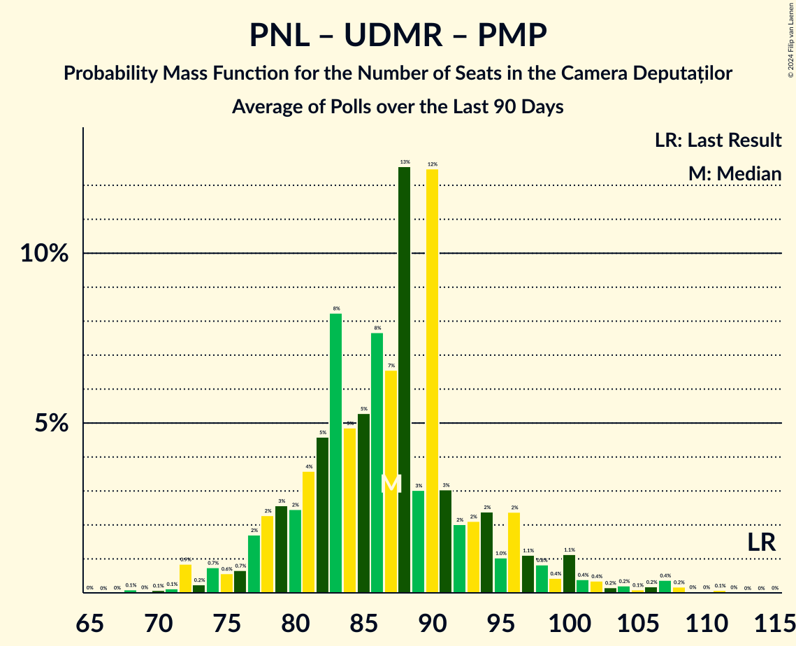

# Poll Average

<a href="#voting-intentions">Voting Intentions</a> | <a href="#seats">Seats</a> | <a href="#coalitions">Coalitions</a> | <a href="#technical-information">Technical Information</a>

## Summary

The table below lists the polls on which the average is based. They are the most recent polls (less than 90 days old) registered and analyzed so far.

| Period     | Polling firm/Commissioner(s) | PSD | PNL | A2020 | UDMR | ALDE | PMP | MIN | PRO |
|:----------:|:----------------------------:|:--:|:--:|:--:|:--:|:--:|:--:|:--:|:--:|
| 21 December 2016 | General Election | 45.5%   154 | 20.0%   69 | 8.9%   30 | 6.2%   21 | 5.6%   20 | 5.4%   18 | 5.0%   17 | 0.0%   0 |
| N/A | Poll Average | 19–31%   70–107 | 28–40%   104–141 | 14–26%   47–99 | 1–7%   3–23 | 3–7%   0–25 | 2–9%   0–32 | N/A   18 | 1–9%   0–33 |
| [15–20 May 2020](2020-05-20-INSCOP.html) | INSCOP | 20–24%   69–87 | 29–34%   103–125 | 18–23%   64–81 | 3–6%   12–21 | 3–6%   0–19 | 6–10%   23–34 | N/A   18 | 0–2%   0 |
| [1–7 May 2020](2020-05-07-BCS.html) | BCS | 18–22%   68–85 | 28–32%   101–124 | 23–27%   83–102 | 1–2%   3–7 | 5–7%   0–27 | 4–6%   0–21 | N/A   18 | 3–5%   0 |
| [6–24 April 2020](2020-04-24-IMAS.html) | IMAS   Europa FM | 22–28%   77–97 | 30–36%   105–128 | 14–18%   48–65 | 4–7%   15–25 | 3–6%   0–19 | 2–5%   0 | N/A   18 | 7–10%   23–35 |
| [6–12 April 2020](2020-04-12-Avangarde.html) | Avangarde   STIRIPESURSE.RO | 26–32%   88–112 | 35–41%   118–146 | 13–18%   45–62 | 3–6%   10–19 | 3–6%   0–18 | 2–4%   0 | N/A   18 | 4–7%   0–22 |
| 21 December 2016 | General Election | 45.5%   154 | 20.0%   69 | 8.9%   30 | 6.2%   21 | 5.6%   20 | 5.4%   18 | 5.0%   17 | 0.0%   0 |

Only polls for which at least the sample size has been published are included in the table above.

**Legend:**
+ **Top half of each row:** Voting intentions (95% confidence interval)
+ **Bottom half of each row:** Seat projections for the Camera Deputaților (95% confidence interval)
+ **PSD:** Partidul Social Democrat
+ **PNL:** Partidul Național Liberal
+ **A2020:** Alianța 2020 USR-PLUS
+ **UDMR:** Uniunea Democrată Maghiară din România
+ **ALDE:** Partidul Alianța Liberalilor și Democraților
+ **PMP:** Partidul Mișcarea Populară
+ **MIN:** Parties of ethnic minorities
+ **PRO:** PRO România
+ **N/A (single party):** Party not included the published results
+ **N/A (entire row):** Calculation for this opinion poll not started yet

## Voting Intentions

### Confidence Intervals

| Party | Last Result | Median | 80% Confidence Interval | 90% Confidence Interval | 95% Confidence Interval | 99% Confidence Interval |
|:-----:|:-----------:|:------:|:-----------------------:|:-----------------------:|:-----------------------:|:-----------------------:|
| <a href="#partidul-social-democrat">Partidul Social Democrat</a> | 45.5% | 23.3% | 19.9–29.3% |19.4–30.2% | 19.0–30.8% | 18.3–32.0% |
| <a href="#partidul-național-liberal">Partidul Național Liberal</a> | 20.0% | 32.4% | 29.4–38.6% |28.8–39.5% | 28.3–40.2% | 27.5–41.5% |
| <a href="#alianța-2020-usr-plus">Alianța 2020 USR-PLUS</a> | 8.9% | 18.3% | 14.7–25.0% |14.2–25.6% | 13.8–26.1% | 13.0–27.0% |
| <a href="#uniunea-democrată-maghiară-din-românia">Uniunea Democrată Maghiară din România</a> | 6.2% | 4.4% | 1.3–5.9% |1.1–6.3% | 1.0–6.6% | 0.8–7.2% |
| <a href="#partidul-alianța-liberalilor-și-democraților">Partidul Alianța Liberalilor și Democraților</a> | 5.6% | 4.6% | 3.7–6.1% |3.4–6.5% | 3.3–6.7% | 2.9–7.2% |
| <a href="#partidul-mișcarea-populară">Partidul Mișcarea Populară</a> | 5.4% | 4.2% | 2.8–8.1% |2.6–8.6% | 2.4–9.0% | 2.1–9.7% |
| <a href="#parties-of-ethnic-minorities">Parties of ethnic minorities</a> | 5.0% | N/A | N/A |N/A | N/A | N/A |
| <a href="#pro-românia">PRO România</a> | 0.0% | 4.5% | 0.9–8.5% |0.7–9.0% | 0.6–9.4% | 0.5–10.2% |

### Partidul Social Democrat

*For a full overview of the results for this party, see the [Partidul Social Democrat](party-partidulsocialdemocrat.html) page.*

| Voting Intentions | Probability | Accumulated | Special Marks |
|:-----------------:|:-----------:|:-----------:|:-------------:|
| 16.5–17.5% | 0.1% | 100% |  |
| 17.5–18.5% | 0.9% | 99.9% |  |
| 18.5–19.5% | 5% | 99.0% |  |
| 19.5–20.5% | 12% | 94% |  |
| 20.5–21.5% | 14% | 82% |  |
| 21.5–22.5% | 11% | 68% |  |
| 22.5–23.5% | 9% | 56% | Median |
| 23.5–24.5% | 8% | 48% |  |
| 24.5–25.5% | 8% | 40% |  |
| 25.5–26.5% | 6% | 32% |  |
| 26.5–27.5% | 5% | 26% |  |
| 27.5–28.5% | 6% | 21% |  |
| 28.5–29.5% | 7% | 15% |  |
| 29.5–30.5% | 5% | 8% |  |
| 30.5–31.5% | 2% | 3% |  |
| 31.5–32.5% | 0.8% | 1.0% |  |
| 32.5–33.5% | 0.2% | 0.2% |  |
| 33.5–34.5% | 0% | 0% |  |
| 34.5–35.5% | 0% | 0% |  |
| 35.5–36.5% | 0% | 0% |  |
| 36.5–37.5% | 0% | 0% |  |
| 37.5–38.5% | 0% | 0% |  |
| 38.5–39.5% | 0% | 0% |  |
| 39.5–40.5% | 0% | 0% |  |
| 40.5–41.5% | 0% | 0% |  |
| 41.5–42.5% | 0% | 0% |  |
| 42.5–43.5% | 0% | 0% |  |
| 43.5–44.5% | 0% | 0% |  |
| 44.5–45.5% | 0% | 0% | Last Result |

### Partidul Național Liberal

*For a full overview of the results for this party, see the [Partidul Național Liberal](party-partidulnaționalliberal.html) page.*

| Voting Intentions | Probability | Accumulated | Special Marks |
|:-----------------:|:-----------:|:-----------:|:-------------:|
| 19.5–20.5% | 0% | 100% | Last Result |
| 20.5–21.5% | 0% | 100% |  |
| 21.5–22.5% | 0% | 100% |  |
| 22.5–23.5% | 0% | 100% |  |
| 23.5–24.5% | 0% | 100% |  |
| 24.5–25.5% | 0% | 100% |  |
| 25.5–26.5% | 0% | 100% |  |
| 26.5–27.5% | 0.5% | 100% |  |
| 27.5–28.5% | 3% | 99.4% |  |
| 28.5–29.5% | 8% | 97% |  |
| 29.5–30.5% | 13% | 88% |  |
| 30.5–31.5% | 14% | 76% |  |
| 31.5–32.5% | 14% | 62% | Median |
| 32.5–33.5% | 11% | 48% |  |
| 33.5–34.5% | 7% | 36% |  |
| 34.5–35.5% | 4% | 29% |  |
| 35.5–36.5% | 4% | 25% |  |
| 36.5–37.5% | 5% | 21% |  |
| 37.5–38.5% | 6% | 16% |  |
| 38.5–39.5% | 5% | 10% |  |
| 39.5–40.5% | 3% | 5% |  |
| 40.5–41.5% | 1.3% | 2% |  |
| 41.5–42.5% | 0.4% | 0.5% |  |
| 42.5–43.5% | 0.1% | 0.1% |  |
| 43.5–44.5% | 0% | 0% |  |

### Alianța 2020 USR-PLUS

*For a full overview of the results for this party, see the [Alianța 2020 USR-PLUS](party-alianța2020usr-plus.html) page.*

| Voting Intentions | Probability | Accumulated | Special Marks |
|:-----------------:|:-----------:|:-----------:|:-------------:|
| 8.5–9.5% | 0% | 100% | Last Result |
| 9.5–10.5% | 0% | 100% |  |
| 10.5–11.5% | 0% | 100% |  |
| 11.5–12.5% | 0.1% | 100% |  |
| 12.5–13.5% | 1.4% | 99.9% |  |
| 13.5–14.5% | 7% | 98% |  |
| 14.5–15.5% | 14% | 92% |  |
| 15.5–16.5% | 16% | 78% |  |
| 16.5–17.5% | 9% | 62% |  |
| 17.5–18.5% | 4% | 53% | Median |
| 18.5–19.5% | 6% | 49% |  |
| 19.5–20.5% | 8% | 43% |  |
| 20.5–21.5% | 7% | 35% |  |
| 21.5–22.5% | 3% | 29% |  |
| 22.5–23.5% | 4% | 25% |  |
| 23.5–24.5% | 8% | 21% |  |
| 24.5–25.5% | 8% | 14% |  |
| 25.5–26.5% | 4% | 5% |  |
| 26.5–27.5% | 1.0% | 1.2% |  |
| 27.5–28.5% | 0.1% | 0.1% |  |
| 28.5–29.5% | 0% | 0% |  |

### Uniunea Democrată Maghiară din România

*For a full overview of the results for this party, see the [Uniunea Democrată Maghiară din România](party-uniuneademocratămaghiarădinromânia.html) page.*

| Voting Intentions | Probability | Accumulated | Special Marks |
|:-----------------:|:-----------:|:-----------:|:-------------:|
| 0.0–0.5% | 0% | 100% |  |
| 0.5–1.5% | 19% | 100% |  |
| 1.5–2.5% | 6% | 81% |  |
| 2.5–3.5% | 5% | 75% |  |
| 3.5–4.5% | 27% | 70% | Median |
| 4.5–5.5% | 28% | 44% |  |
| 5.5–6.5% | 13% | 16% | Last Result |
| 6.5–7.5% | 3% | 3% |  |
| 7.5–8.5% | 0.2% | 0.2% |  |
| 8.5–9.5% | 0% | 0% |  |

### Partidul Alianța Liberalilor și Democraților

*For a full overview of the results for this party, see the [Partidul Alianța Liberalilor și Democraților](party-partidulalianțaliberalilorșidemocraților.html) page.*

| Voting Intentions | Probability | Accumulated | Special Marks |
|:-----------------:|:-----------:|:-----------:|:-------------:|
| 1.5–2.5% | 0.1% | 100% |  |
| 2.5–3.5% | 7% | 99.9% |  |
| 3.5–4.5% | 40% | 93% |  |
| 4.5–5.5% | 31% | 53% | Median |
| 5.5–6.5% | 18% | 22% | Last Result |
| 6.5–7.5% | 4% | 4% |  |
| 7.5–8.5% | 0.2% | 0.2% |  |
| 8.5–9.5% | 0% | 0% |  |

### Partidul Mișcarea Populară

*For a full overview of the results for this party, see the [Partidul Mișcarea Populară](party-partidulmișcareapopulară.html) page.*

| Voting Intentions | Probability | Accumulated | Special Marks |
|:-----------------:|:-----------:|:-----------:|:-------------:|
| 0.5–1.5% | 0% | 100% |  |
| 1.5–2.5% | 5% | 100% |  |
| 2.5–3.5% | 29% | 95% |  |
| 3.5–4.5% | 26% | 66% | Median |
| 4.5–5.5% | 14% | 40% | Last Result |
| 5.5–6.5% | 2% | 26% |  |
| 6.5–7.5% | 7% | 24% |  |
| 7.5–8.5% | 12% | 17% |  |
| 8.5–9.5% | 5% | 5% |  |
| 9.5–10.5% | 0.6% | 0.7% |  |
| 10.5–11.5% | 0% | 0% |  |

### PRO România

*For a full overview of the results for this party, see the [PRO România](party-proromânia.html) page.*

| Voting Intentions | Probability | Accumulated | Special Marks |
|:-----------------:|:-----------:|:-----------:|:-------------:|
| 0.0–0.5% | 1.3% | 100% | Last Result |
| 0.5–1.5% | 23% | 98.7% |  |
| 1.5–2.5% | 0.9% | 76% |  |
| 2.5–3.5% | 6% | 75% |  |
| 3.5–4.5% | 21% | 69% | Median |
| 4.5–5.5% | 15% | 48% |  |
| 5.5–6.5% | 7% | 33% |  |
| 6.5–7.5% | 5% | 26% |  |
| 7.5–8.5% | 11% | 20% |  |
| 8.5–9.5% | 7% | 9% |  |
| 9.5–10.5% | 2% | 2% |  |
| 10.5–11.5% | 0.2% | 0.2% |  |
| 11.5–12.5% | 0% | 0% |  |

## Seats

### Confidence Intervals

| Party | Last Result | Median | 80% Confidence Interval | 90% Confidence Interval | 95% Confidence Interval | 99% Confidence Interval |
|:-----:|:-----------:|:------:|:-----------------------:|:-----------------------:|:-----------------------:|:-----------------------:|
| <a href="#partidul-social-democrat">Partidul Social Democrat</a> | 154 | 83 | 73–101 |71–105 | 70–107 | 67–112 |
| <a href="#partidul-național-liberal">Partidul Național Liberal</a> | 69 | 117 | 108–133 |105–138 | 104–141 | 100–146 |
| <a href="#alianța-2020-usr-plus">Alianța 2020 USR-PLUS</a> | 30 | 65 | 51–94 |49–97 | 47–99 | 44–103 |
| <a href="#uniunea-democrată-maghiară-din-românia">Uniunea Democrată Maghiară din România</a> | 21 | 15 | 4–20 |4–22 | 3–23 | 3–25 |
| <a href="#partidul-alianța-liberalilor-și-democraților">Partidul Alianța Liberalilor și Democraților</a> | 20 | 0 | 0–22 |0–24 | 0–25 | 0–27 |
| <a href="#partidul-mișcarea-populară">Partidul Mișcarea Populară</a> | 18 | 0 | 0–29 |0–31 | 0–32 | 0–34 |
| <a href="#parties-of-ethnic-minorities">Parties of ethnic minorities</a> | 17 | 18 | 18 |18 | 18 | 18 |
| <a href="#pro-românia">PRO România</a> | 0 | 0 | 0–30 |0–32 | 0–33 | 0–36 |

### Partidul Social Democrat

*For a full overview of the results for this party, see the [Partidul Social Democrat](party-partidulsocialdemocrat.html) page.*

| Number of Seats | Probability | Accumulated | Special Marks |
|:---------------:|:-----------:|:-----------:|:-------------:|
| 64 | 0.1% | 100% |  |
| 65 | 0.1% | 99.9% |  |
| 66 | 0.1% | 99.7% |  |
| 67 | 0.3% | 99.6% |  |
| 68 | 0.6% | 99.3% |  |
| 69 | 0.7% | 98.7% |  |
| 70 | 1.4% | 98% |  |
| 71 | 2% | 97% |  |
| 72 | 2% | 95% |  |
| 73 | 3% | 93% |  |
| 74 | 3% | 90% |  |
| 75 | 4% | 87% |  |
| 76 | 4% | 83% |  |
| 77 | 5% | 79% |  |
| 78 | 4% | 74% |  |
| 79 | 5% | 69% |  |
| 80 | 5% | 65% |  |
| 81 | 4% | 60% |  |
| 82 | 4% | 56% |  |
| 83 | 3% | 53% | Median |
| 84 | 3% | 50% |  |
| 85 | 3% | 46% |  |
| 86 | 3% | 43% |  |
| 87 | 3% | 40% |  |
| 88 | 2% | 37% |  |
| 89 | 2% | 35% |  |
| 90 | 2% | 33% |  |
| 91 | 2% | 31% |  |
| 92 | 2% | 28% |  |
| 93 | 2% | 26% |  |
| 94 | 2% | 24% |  |
| 95 | 2% | 22% |  |
| 96 | 2% | 20% |  |
| 97 | 2% | 18% |  |
| 98 | 2% | 16% |  |
| 99 | 2% | 15% |  |
| 100 | 2% | 13% |  |
| 101 | 1.4% | 11% |  |
| 102 | 1.5% | 10% |  |
| 103 | 1.2% | 8% |  |
| 104 | 2% | 7% |  |
| 105 | 1.1% | 5% |  |
| 106 | 0.9% | 4% |  |
| 107 | 0.7% | 3% |  |
| 108 | 0.6% | 2% |  |
| 109 | 0.4% | 2% |  |
| 110 | 0.4% | 1.5% |  |
| 111 | 0.3% | 1.1% |  |
| 112 | 0.3% | 0.8% |  |
| 113 | 0.1% | 0.5% |  |
| 114 | 0.1% | 0.4% |  |
| 115 | 0.1% | 0.2% |  |
| 116 | 0% | 0.1% |  |
| 117 | 0% | 0.1% |  |
| 118 | 0% | 0.1% |  |
| 119 | 0% | 0% |  |
| 120 | 0% | 0% |  |
| 121 | 0% | 0% |  |
| 122 | 0% | 0% |  |
| 123 | 0% | 0% |  |
| 124 | 0% | 0% |  |
| 125 | 0% | 0% |  |
| 126 | 0% | 0% |  |
| 127 | 0% | 0% |  |
| 128 | 0% | 0% |  |
| 129 | 0% | 0% |  |
| 130 | 0% | 0% |  |
| 131 | 0% | 0% |  |
| 132 | 0% | 0% |  |
| 133 | 0% | 0% |  |
| 134 | 0% | 0% |  |
| 135 | 0% | 0% |  |
| 136 | 0% | 0% |  |
| 137 | 0% | 0% |  |
| 138 | 0% | 0% |  |
| 139 | 0% | 0% |  |
| 140 | 0% | 0% |  |
| 141 | 0% | 0% |  |
| 142 | 0% | 0% |  |
| 143 | 0% | 0% |  |
| 144 | 0% | 0% |  |
| 145 | 0% | 0% |  |
| 146 | 0% | 0% |  |
| 147 | 0% | 0% |  |
| 148 | 0% | 0% |  |
| 149 | 0% | 0% |  |
| 150 | 0% | 0% |  |
| 151 | 0% | 0% |  |
| 152 | 0% | 0% |  |
| 153 | 0% | 0% |  |
| 154 | 0% | 0% | Last Result |

### Partidul Național Liberal

*For a full overview of the results for this party, see the [Partidul Național Liberal](party-partidulnaționalliberal.html) page.*

| Number of Seats | Probability | Accumulated | Special Marks |
|:---------------:|:-----------:|:-----------:|:-------------:|
| 69 | 0% | 100% | Last Result |
| 70 | 0% | 100% |  |
| 71 | 0% | 100% |  |
| 72 | 0% | 100% |  |
| 73 | 0% | 100% |  |
| 74 | 0% | 100% |  |
| 75 | 0% | 100% |  |
| 76 | 0% | 100% |  |
| 77 | 0% | 100% |  |
| 78 | 0% | 100% |  |
| 79 | 0% | 100% |  |
| 80 | 0% | 100% |  |
| 81 | 0% | 100% |  |
| 82 | 0% | 100% |  |
| 83 | 0% | 100% |  |
| 84 | 0% | 100% |  |
| 85 | 0% | 100% |  |
| 86 | 0% | 100% |  |
| 87 | 0% | 100% |  |
| 88 | 0% | 100% |  |
| 89 | 0% | 100% |  |
| 90 | 0% | 100% |  |
| 91 | 0% | 100% |  |
| 92 | 0% | 100% |  |
| 93 | 0% | 100% |  |
| 94 | 0% | 100% |  |
| 95 | 0% | 100% |  |
| 96 | 0% | 100% |  |
| 97 | 0.1% | 99.9% |  |
| 98 | 0.1% | 99.9% |  |
| 99 | 0.2% | 99.8% |  |
| 100 | 0.2% | 99.6% |  |
| 101 | 0.4% | 99.3% |  |
| 102 | 0.5% | 99.0% |  |
| 103 | 0.8% | 98% |  |
| 104 | 1.1% | 98% |  |
| 105 | 2% | 97% |  |
| 106 | 2% | 95% |  |
| 107 | 2% | 93% |  |
| 108 | 2% | 91% |  |
| 109 | 4% | 89% |  |
| 110 | 4% | 85% |  |
| 111 | 4% | 81% |  |
| 112 | 5% | 77% |  |
| 113 | 5% | 72% |  |
| 114 | 6% | 67% |  |
| 115 | 5% | 61% |  |
| 116 | 5% | 56% |  |
| 117 | 5% | 51% | Median |
| 118 | 4% | 46% |  |
| 119 | 4% | 41% |  |
| 120 | 3% | 37% |  |
| 121 | 3% | 34% |  |
| 122 | 2% | 31% |  |
| 123 | 2% | 29% |  |
| 124 | 2% | 26% |  |
| 125 | 2% | 24% |  |
| 126 | 1.5% | 22% |  |
| 127 | 2% | 21% |  |
| 128 | 2% | 19% |  |
| 129 | 1.2% | 17% |  |
| 130 | 1.5% | 16% |  |
| 131 | 2% | 14% |  |
| 132 | 2% | 12% |  |
| 133 | 1.0% | 11% |  |
| 134 | 1.3% | 10% |  |
| 135 | 2% | 8% |  |
| 136 | 0.8% | 7% |  |
| 137 | 0.6% | 6% |  |
| 138 | 1.0% | 5% |  |
| 139 | 0.9% | 5% |  |
| 140 | 0.8% | 4% |  |
| 141 | 0.4% | 3% |  |
| 142 | 0.5% | 2% |  |
| 143 | 0.6% | 2% |  |
| 144 | 0.4% | 1.3% |  |
| 145 | 0.2% | 0.9% |  |
| 146 | 0.3% | 0.7% |  |
| 147 | 0.1% | 0.5% |  |
| 148 | 0.2% | 0.4% |  |
| 149 | 0% | 0.2% |  |
| 150 | 0.1% | 0.2% |  |
| 151 | 0.1% | 0.1% |  |
| 152 | 0% | 0% |  |

### Alianța 2020 USR-PLUS

*For a full overview of the results for this party, see the [Alianța 2020 USR-PLUS](party-alianța2020usr-plus.html) page.*

| Number of Seats | Probability | Accumulated | Special Marks |
|:---------------:|:-----------:|:-----------:|:-------------:|
| 30 | 0% | 100% | Last Result |
| 31 | 0% | 100% |  |
| 32 | 0% | 100% |  |
| 33 | 0% | 100% |  |
| 34 | 0% | 100% |  |
| 35 | 0% | 100% |  |
| 36 | 0% | 100% |  |
| 37 | 0% | 100% |  |
| 38 | 0% | 100% |  |
| 39 | 0% | 100% |  |
| 40 | 0% | 100% |  |
| 41 | 0% | 100% |  |
| 42 | 0.1% | 99.9% |  |
| 43 | 0.2% | 99.8% |  |
| 44 | 0.3% | 99.7% |  |
| 45 | 0.5% | 99.4% |  |
| 46 | 0.7% | 98.9% |  |
| 47 | 0.9% | 98% |  |
| 48 | 2% | 97% |  |
| 49 | 3% | 96% |  |
| 50 | 3% | 93% |  |
| 51 | 3% | 91% |  |
| 52 | 4% | 88% |  |
| 53 | 4% | 84% |  |
| 54 | 4% | 80% |  |
| 55 | 4% | 76% |  |
| 56 | 4% | 71% |  |
| 57 | 4% | 67% |  |
| 58 | 3% | 63% |  |
| 59 | 3% | 60% |  |
| 60 | 2% | 58% |  |
| 61 | 2% | 55% |  |
| 62 | 1.3% | 53% |  |
| 63 | 1.0% | 52% |  |
| 64 | 1.0% | 51% |  |
| 65 | 0.8% | 50% | Median |
| 66 | 1.1% | 49% |  |
| 67 | 1.1% | 48% |  |
| 68 | 1.3% | 47% |  |
| 69 | 2% | 46% |  |
| 70 | 2% | 44% |  |
| 71 | 2% | 42% |  |
| 72 | 2% | 40% |  |
| 73 | 2% | 38% |  |
| 74 | 2% | 36% |  |
| 75 | 2% | 33% |  |
| 76 | 2% | 32% |  |
| 77 | 1.2% | 30% |  |
| 78 | 1.1% | 28% |  |
| 79 | 1.0% | 27% |  |
| 80 | 0.6% | 26% |  |
| 81 | 0.5% | 26% |  |
| 82 | 0.4% | 25% |  |
| 83 | 0.5% | 25% |  |
| 84 | 0.5% | 24% |  |
| 85 | 0.6% | 24% |  |
| 86 | 0.8% | 23% |  |
| 87 | 1.0% | 22% |  |
| 88 | 1.3% | 21% |  |
| 89 | 1.4% | 20% |  |
| 90 | 2% | 19% |  |
| 91 | 2% | 17% |  |
| 92 | 2% | 15% |  |
| 93 | 1.4% | 13% |  |
| 94 | 2% | 12% |  |
| 95 | 2% | 10% |  |
| 96 | 2% | 8% |  |
| 97 | 1.5% | 6% |  |
| 98 | 1.2% | 5% |  |
| 99 | 1.3% | 3% |  |
| 100 | 0.7% | 2% |  |
| 101 | 0.4% | 1.3% |  |
| 102 | 0.3% | 0.9% |  |
| 103 | 0.2% | 0.6% |  |
| 104 | 0.1% | 0.4% |  |
| 105 | 0.1% | 0.3% |  |
| 106 | 0.1% | 0.2% |  |
| 107 | 0% | 0.1% |  |
| 108 | 0% | 0.1% |  |
| 109 | 0% | 0% |  |

### Uniunea Democrată Maghiară din România

*For a full overview of the results for this party, see the [Uniunea Democrată Maghiară din România](party-uniuneademocratămaghiarădinromânia.html) page.*

| Number of Seats | Probability | Accumulated | Special Marks |
|:---------------:|:-----------:|:-----------:|:-------------:|
| 2 | 0.4% | 100% |  |
| 3 | 4% | 99.6% |  |
| 4 | 8% | 96% |  |
| 5 | 8% | 88% |  |
| 6 | 4% | 80% |  |
| 7 | 1.1% | 76% |  |
| 8 | 0.3% | 75% |  |
| 9 | 0.3% | 75% |  |
| 10 | 0.8% | 75% |  |
| 11 | 2% | 74% |  |
| 12 | 4% | 72% |  |
| 13 | 6% | 68% |  |
| 14 | 8% | 61% |  |
| 15 | 9% | 54% | Median |
| 16 | 8% | 45% |  |
| 17 | 9% | 37% |  |
| 18 | 7% | 28% |  |
| 19 | 7% | 21% |  |
| 20 | 4% | 14% |  |
| 21 | 4% | 10% | Last Result |
| 22 | 2% | 6% |  |
| 23 | 2% | 3% |  |
| 24 | 0.8% | 2% |  |
| 25 | 0.5% | 0.9% |  |
| 26 | 0.2% | 0.4% |  |
| 27 | 0.1% | 0.2% |  |
| 28 | 0% | 0.1% |  |
| 29 | 0% | 0% |  |

### Partidul Alianța Liberalilor și Democraților

*For a full overview of the results for this party, see the [Partidul Alianța Liberalilor și Democraților](party-partidulalianțaliberalilorșidemocraților.html) page.*

| Number of Seats | Probability | Accumulated | Special Marks |
|:---------------:|:-----------:|:-----------:|:-------------:|
| 0 | 65% | 100% | Median |
| 1 | 0% | 35% |  |
| 2 | 0% | 35% |  |
| 3 | 0% | 35% |  |
| 4 | 0% | 35% |  |
| 5 | 0% | 35% |  |
| 6 | 0% | 35% |  |
| 7 | 0% | 35% |  |
| 8 | 0% | 35% |  |
| 9 | 0% | 35% |  |
| 10 | 0% | 35% |  |
| 11 | 0% | 35% |  |
| 12 | 0% | 35% |  |
| 13 | 0% | 35% |  |
| 14 | 0% | 35% |  |
| 15 | 0% | 35% |  |
| 16 | 0.5% | 35% |  |
| 17 | 4% | 34% |  |
| 18 | 4% | 30% |  |
| 19 | 4% | 26% |  |
| 20 | 4% | 22% | Last Result |
| 21 | 4% | 18% |  |
| 22 | 4% | 14% |  |
| 23 | 4% | 10% |  |
| 24 | 3% | 6% |  |
| 25 | 2% | 4% |  |
| 26 | 1.0% | 2% |  |
| 27 | 0.5% | 0.7% |  |
| 28 | 0.2% | 0.3% |  |
| 29 | 0.1% | 0.1% |  |
| 30 | 0% | 0% |  |

### Partidul Mișcarea Populară

*For a full overview of the results for this party, see the [Partidul Mișcarea Populară](party-partidulmișcareapopulară.html) page.*

| Number of Seats | Probability | Accumulated | Special Marks |
|:---------------:|:-----------:|:-----------:|:-------------:|
| 0 | 69% | 100% | Median |
| 1 | 0% | 31% |  |
| 2 | 0% | 31% |  |
| 3 | 0% | 31% |  |
| 4 | 0% | 31% |  |
| 5 | 0% | 31% |  |
| 6 | 0% | 31% |  |
| 7 | 0% | 31% |  |
| 8 | 0% | 31% |  |
| 9 | 0% | 31% |  |
| 10 | 0% | 31% |  |
| 11 | 0% | 31% |  |
| 12 | 0% | 31% |  |
| 13 | 0% | 31% |  |
| 14 | 0% | 31% |  |
| 15 | 0% | 31% |  |
| 16 | 0% | 31% |  |
| 17 | 0.2% | 31% |  |
| 18 | 2% | 31% | Last Result |
| 19 | 2% | 28% |  |
| 20 | 1.1% | 27% |  |
| 21 | 0.6% | 26% |  |
| 22 | 0.5% | 25% |  |
| 23 | 0.9% | 25% |  |
| 24 | 1.4% | 24% |  |
| 25 | 2% | 22% |  |
| 26 | 3% | 20% |  |
| 27 | 3% | 17% |  |
| 28 | 3% | 14% |  |
| 29 | 3% | 11% |  |
| 30 | 3% | 8% |  |
| 31 | 2% | 5% |  |
| 32 | 1.2% | 3% |  |
| 33 | 0.9% | 2% |  |
| 34 | 0.5% | 1.0% |  |
| 35 | 0.3% | 0.5% |  |
| 36 | 0.1% | 0.2% |  |
| 37 | 0.1% | 0.1% |  |
| 38 | 0% | 0% |  |

### Parties of ethnic minorities

*For a full overview of the results for this party, see the [Parties of ethnic minorities](party-partiesofethnicminorities.html) page.*

| Number of Seats | Probability | Accumulated | Special Marks |
|:---------------:|:-----------:|:-----------:|:-------------:|
| 17 | 0% | 100% | Last Result |
| 18 | 100% | 100% | Median |

### PRO România

*For a full overview of the results for this party, see the [PRO România](party-proromânia.html) page.*

| Number of Seats | Probability | Accumulated | Special Marks |
|:---------------:|:-----------:|:-----------:|:-------------:|
| 0 | 60% | 100% | Last Result, Median |
| 1 | 0% | 40% |  |
| 2 | 0% | 40% |  |
| 3 | 0% | 40% |  |
| 4 | 0% | 40% |  |
| 5 | 0% | 40% |  |
| 6 | 0% | 40% |  |
| 7 | 0% | 40% |  |
| 8 | 0% | 40% |  |
| 9 | 0% | 40% |  |
| 10 | 0% | 40% |  |
| 11 | 0% | 40% |  |
| 12 | 0% | 40% |  |
| 13 | 0% | 40% |  |
| 14 | 0% | 40% |  |
| 15 | 0% | 40% |  |
| 16 | 0.2% | 40% |  |
| 17 | 3% | 40% |  |
| 18 | 4% | 37% |  |
| 19 | 3% | 33% |  |
| 20 | 2% | 30% |  |
| 21 | 1.3% | 27% |  |
| 22 | 1.0% | 26% |  |
| 23 | 0.7% | 25% |  |
| 24 | 1.1% | 24% |  |
| 25 | 2% | 23% |  |
| 26 | 2% | 21% |  |
| 27 | 4% | 20% |  |
| 28 | 2% | 16% |  |
| 29 | 4% | 14% |  |
| 30 | 3% | 10% |  |
| 31 | 2% | 7% |  |
| 32 | 2% | 5% |  |
| 33 | 0.8% | 3% |  |
| 34 | 1.2% | 2% |  |
| 35 | 0.3% | 0.9% |  |
| 36 | 0.3% | 0.6% |  |
| 37 | 0.1% | 0.3% |  |
| 38 | 0.1% | 0.1% |  |
| 39 | 0% | 0.1% |  |
| 40 | 0% | 0% |  |

## Coalitions

### Confidence Intervals

| Coalition | Last Result | Median | Majority? | 80% Confidence Interval | 90% Confidence Interval | 95% Confidence Interval | 99% Confidence Interval |
|:---------:|:-----------:|:------:|:---------:|:-----------------------:|:-----------------------:|:-----------------------:|:-----------------------:|
| Partidul Național Liberal – Alianța 2020 USR-PLUS – Uniunea Democrată Maghiară din România – Partidul Alianța Liberalilor și Democraților – Partidul Mișcarea Populară | 158 | 220 | 100% | 192–238 | 189–241 | 187–242 | 184–245 |
| Partidul Național Liberal – Alianța 2020 USR-PLUS – Uniunea Democrată Maghiară din România – Partidul Alianța Liberalilor și Democraților | 140 | 204 | 100% | 192–234 | 189–237 | 187–239 | 183–242 |
| Partidul Național Liberal – Alianța 2020 USR-PLUS – Uniunea Democrată Maghiară din România – Partidul Mișcarea Populară | 138 | 209 | 100% | 189–233 | 185–236 | 182–238 | 176–241 |
| Partidul Național Liberal – Alianța 2020 USR-PLUS – Partidul Alianța Liberalilor și Democraților – Partidul Mișcarea Populară | 137 | 206 | 99.2% | 174–232 | 171–234 | 168–237 | 164–240 |
| Partidul Național Liberal – Alianța 2020 USR-PLUS – Partidul Alianța Liberalilor și Democraților | 119 | 188 | 99.1% | 174–230 | 171–232 | 168–234 | 164–237 |
| Partidul Național Liberal – Alianța 2020 USR-PLUS – Partidul Mișcarea Populară | 117 | 199 | 96% | 171–218 | 167–221 | 164–223 | 158–228 |
| Partidul Național Liberal – Alianța 2020 USR-PLUS – Uniunea Democrată Maghiară din România | 120 | 201 | 100% | 188–213 | 185–216 | 182–218 | 176–229 |
| Partidul Național Liberal – Alianța 2020 USR-PLUS | 99 | 186 | 96% | 171–208 | 167–210 | 164–213 | 158–224 |
| Partidul Național Liberal – Uniunea Democrată Maghiară din România – Partidul Alianța Liberalilor și Democraților – Partidul Mișcarea Populară | 128 | 146 | 6% | 135–163 | 132–166 | 130–169 | 126–174 |
| Partidul Național Liberal – Uniunea Democrată Maghiară din România – Partidul Mișcarea Populară | 108 | 141 | 3% | 118–160 | 115–163 | 113–166 | 110–170 |
| Partidul Național Liberal – Uniunea Democrată Maghiară din România – Partidul Alianța Liberalilor și Democraților | 110 | 139 | 0.4% | 129–151 | 126–155 | 124–159 | 120–164 |
| Partidul Național Liberal – Uniunea Democrată Maghiară din România | 90 | 133 | 0.1% | 115–148 | 113–153 | 110–156 | 105–161 |
| Partidul Național Liberal – Partidul Mișcarea Populară | 87 | 126 | 0% | 111–144 | 109–147 | 107–149 | 103–153 |
| Partidul Național Liberal | 69 | 117 | 0% | 108–133 | 105–138 | 104–141 | 100–146 |
| Partidul Social Democrat – Partidul Alianța Liberalilor și Democraților – PRO România | 174 | 103 | 0% | 79–123 | 76–127 | 74–130 | 71–136 |
| Partidul Social Democrat – PRO România | 154 | 92 | 0% | 74–120 | 71–123 | 70–125 | 67–128 |
| Partidul Social Democrat – Partidul Alianța Liberalilor și Democraților | 174 | 94 | 0% | 78–105 | 76–108 | 74–111 | 71–118 |
| Alianța 2020 USR-PLUS – Partidul Mișcarea Populară | 48 | 79 | 0% | 51–105 | 49–108 | 47–110 | 44–114 |

### Partidul Național Liberal – Alianța 2020 USR-PLUS – Uniunea Democrată Maghiară din România – Partidul Alianța Liberalilor și Democraților – Partidul Mișcarea Populară

| Number of Seats | Probability | Accumulated | Special Marks |
|:---------------:|:-----------:|:-----------:|:-------------:|
| 158 | 0% | 100% | Last Result |
| 159 | 0% | 100% |  |
| 160 | 0% | 100% |  |
| 161 | 0% | 100% |  |
| 162 | 0% | 100% |  |
| 163 | 0% | 100% |  |
| 164 | 0% | 100% |  |
| 165 | 0% | 100% |  |
| 166 | 0% | 100% | Majority |
| 167 | 0% | 100% |  |
| 168 | 0% | 100% |  |
| 169 | 0% | 100% |  |
| 170 | 0% | 100% |  |
| 171 | 0% | 100% |  |
| 172 | 0% | 100% |  |
| 173 | 0% | 100% |  |
| 174 | 0% | 100% |  |
| 175 | 0% | 100% |  |
| 176 | 0% | 100% |  |
| 177 | 0% | 100% |  |
| 178 | 0% | 100% |  |
| 179 | 0% | 100% |  |
| 180 | 0% | 99.9% |  |
| 181 | 0.1% | 99.9% |  |
| 182 | 0.2% | 99.8% |  |
| 183 | 0.2% | 99.7% |  |
| 184 | 0.3% | 99.5% |  |
| 185 | 0.4% | 99.2% |  |
| 186 | 0.5% | 98.7% |  |
| 187 | 0.9% | 98% |  |
| 188 | 0.9% | 97% |  |
| 189 | 2% | 96% |  |
| 190 | 2% | 95% |  |
| 191 | 2% | 93% |  |
| 192 | 2% | 91% |  |
| 193 | 3% | 89% |  |
| 194 | 3% | 86% |  |
| 195 | 2% | 83% |  |
| 196 | 3% | 81% |  |
| 197 | 2% | 78% | Median |
| 198 | 3% | 75% |  |
| 199 | 3% | 72% |  |
| 200 | 2% | 69% |  |
| 201 | 2% | 67% |  |
| 202 | 2% | 65% |  |
| 203 | 2% | 64% |  |
| 204 | 1.4% | 62% |  |
| 205 | 1.3% | 61% |  |
| 206 | 1.2% | 59% |  |
| 207 | 1.1% | 58% |  |
| 208 | 1.4% | 57% |  |
| 209 | 0.8% | 56% |  |
| 210 | 0.7% | 55% |  |
| 211 | 0.6% | 54% |  |
| 212 | 0.6% | 54% |  |
| 213 | 0.9% | 53% |  |
| 214 | 0.4% | 52% |  |
| 215 | 0.3% | 52% |  |
| 216 | 0.5% | 51% |  |
| 217 | 0.3% | 51% |  |
| 218 | 0.2% | 50% |  |
| 219 | 0.2% | 50% |  |
| 220 | 0.2% | 50% |  |
| 221 | 0.2% | 50% |  |
| 222 | 0.2% | 50% |  |
| 223 | 0.3% | 49% |  |
| 224 | 0.4% | 49% |  |
| 225 | 0.6% | 49% |  |
| 226 | 0.9% | 48% |  |
| 227 | 1.4% | 47% |  |
| 228 | 2% | 46% |  |
| 229 | 2% | 44% |  |
| 230 | 2% | 42% |  |
| 231 | 3% | 40% |  |
| 232 | 4% | 37% |  |
| 233 | 4% | 33% |  |
| 234 | 4% | 29% |  |
| 235 | 5% | 25% |  |
| 236 | 4% | 21% |  |
| 237 | 4% | 17% |  |
| 238 | 3% | 13% |  |
| 239 | 3% | 10% |  |
| 240 | 2% | 7% |  |
| 241 | 2% | 5% |  |
| 242 | 1.4% | 3% |  |
| 243 | 0.6% | 2% |  |
| 244 | 0.6% | 1.2% |  |
| 245 | 0.3% | 0.7% |  |
| 246 | 0.1% | 0.3% |  |
| 247 | 0.1% | 0.2% |  |
| 248 | 0.1% | 0.1% |  |
| 249 | 0% | 0% |  |

### Partidul Național Liberal – Alianța 2020 USR-PLUS – Uniunea Democrată Maghiară din România – Partidul Alianța Liberalilor și Democraților

| Number of Seats | Probability | Accumulated | Special Marks |
|:---------------:|:-----------:|:-----------:|:-------------:|
| 140 | 0% | 100% | Last Result |
| 141 | 0% | 100% |  |
| 142 | 0% | 100% |  |
| 143 | 0% | 100% |  |
| 144 | 0% | 100% |  |
| 145 | 0% | 100% |  |
| 146 | 0% | 100% |  |
| 147 | 0% | 100% |  |
| 148 | 0% | 100% |  |
| 149 | 0% | 100% |  |
| 150 | 0% | 100% |  |
| 151 | 0% | 100% |  |
| 152 | 0% | 100% |  |
| 153 | 0% | 100% |  |
| 154 | 0% | 100% |  |
| 155 | 0% | 100% |  |
| 156 | 0% | 100% |  |
| 157 | 0% | 100% |  |
| 158 | 0% | 100% |  |
| 159 | 0% | 100% |  |
| 160 | 0% | 100% |  |
| 161 | 0% | 100% |  |
| 162 | 0% | 100% |  |
| 163 | 0% | 100% |  |
| 164 | 0% | 100% |  |
| 165 | 0% | 100% |  |
| 166 | 0% | 100% | Majority |
| 167 | 0% | 100% |  |
| 168 | 0% | 100% |  |
| 169 | 0% | 100% |  |
| 170 | 0% | 100% |  |
| 171 | 0% | 100% |  |
| 172 | 0% | 100% |  |
| 173 | 0% | 100% |  |
| 174 | 0% | 100% |  |
| 175 | 0% | 100% |  |
| 176 | 0% | 100% |  |
| 177 | 0% | 100% |  |
| 178 | 0% | 100% |  |
| 179 | 0% | 99.9% |  |
| 180 | 0% | 99.9% |  |
| 181 | 0.1% | 99.9% |  |
| 182 | 0.2% | 99.8% |  |
| 183 | 0.2% | 99.6% |  |
| 184 | 0.3% | 99.4% |  |
| 185 | 0.5% | 99.1% |  |
| 186 | 0.5% | 98.6% |  |
| 187 | 0.9% | 98% |  |
| 188 | 1.0% | 97% |  |
| 189 | 2% | 96% |  |
| 190 | 2% | 95% |  |
| 191 | 2% | 93% |  |
| 192 | 2% | 91% |  |
| 193 | 3% | 88% |  |
| 194 | 3% | 85% |  |
| 195 | 3% | 82% |  |
| 196 | 3% | 80% |  |
| 197 | 3% | 76% | Median |
| 198 | 4% | 74% |  |
| 199 | 4% | 70% |  |
| 200 | 3% | 66% |  |
| 201 | 3% | 63% |  |
| 202 | 3% | 59% |  |
| 203 | 3% | 56% |  |
| 204 | 3% | 53% |  |
| 205 | 3% | 50% |  |
| 206 | 3% | 46% |  |
| 207 | 3% | 43% |  |
| 208 | 3% | 40% |  |
| 209 | 2% | 37% |  |
| 210 | 2% | 35% |  |
| 211 | 2% | 33% |  |
| 212 | 2% | 32% |  |
| 213 | 2% | 30% |  |
| 214 | 1.0% | 28% |  |
| 215 | 0.9% | 27% |  |
| 216 | 1.0% | 26% |  |
| 217 | 1.0% | 25% |  |
| 218 | 0.9% | 24% |  |
| 219 | 0.7% | 23% |  |
| 220 | 0.9% | 23% |  |
| 221 | 0.7% | 22% |  |
| 222 | 0.6% | 21% |  |
| 223 | 0.7% | 20% |  |
| 224 | 0.5% | 20% |  |
| 225 | 0.3% | 19% |  |
| 226 | 0.5% | 19% |  |
| 227 | 0.4% | 18% |  |
| 228 | 0.5% | 18% |  |
| 229 | 0.7% | 17% |  |
| 230 | 1.0% | 17% |  |
| 231 | 1.4% | 16% |  |
| 232 | 2% | 14% |  |
| 233 | 1.4% | 13% |  |
| 234 | 2% | 11% |  |
| 235 | 2% | 10% |  |
| 236 | 2% | 8% |  |
| 237 | 2% | 6% |  |
| 238 | 1.4% | 4% |  |
| 239 | 0.9% | 3% |  |
| 240 | 0.7% | 2% |  |
| 241 | 0.4% | 1.0% |  |
| 242 | 0.2% | 0.6% |  |
| 243 | 0.2% | 0.4% |  |
| 244 | 0.1% | 0.2% |  |
| 245 | 0.1% | 0.1% |  |
| 246 | 0% | 0% |  |

### Partidul Național Liberal – Alianța 2020 USR-PLUS – Uniunea Democrată Maghiară din România – Partidul Mișcarea Populară

| Number of Seats | Probability | Accumulated | Special Marks |
|:---------------:|:-----------:|:-----------:|:-------------:|
| 138 | 0% | 100% | Last Result |
| 139 | 0% | 100% |  |
| 140 | 0% | 100% |  |
| 141 | 0% | 100% |  |
| 142 | 0% | 100% |  |
| 143 | 0% | 100% |  |
| 144 | 0% | 100% |  |
| 145 | 0% | 100% |  |
| 146 | 0% | 100% |  |
| 147 | 0% | 100% |  |
| 148 | 0% | 100% |  |
| 149 | 0% | 100% |  |
| 150 | 0% | 100% |  |
| 151 | 0% | 100% |  |
| 152 | 0% | 100% |  |
| 153 | 0% | 100% |  |
| 154 | 0% | 100% |  |
| 155 | 0% | 100% |  |
| 156 | 0% | 100% |  |
| 157 | 0% | 100% |  |
| 158 | 0% | 100% |  |
| 159 | 0% | 100% |  |
| 160 | 0% | 100% |  |
| 161 | 0% | 100% |  |
| 162 | 0% | 100% |  |
| 163 | 0% | 100% |  |
| 164 | 0% | 100% |  |
| 165 | 0% | 100% |  |
| 166 | 0% | 100% | Majority |
| 167 | 0% | 100% |  |
| 168 | 0% | 100% |  |
| 169 | 0% | 100% |  |
| 170 | 0% | 100% |  |
| 171 | 0% | 100% |  |
| 172 | 0% | 100% |  |
| 173 | 0% | 99.9% |  |
| 174 | 0.1% | 99.9% |  |
| 175 | 0.1% | 99.8% |  |
| 176 | 0.2% | 99.7% |  |
| 177 | 0.2% | 99.5% |  |
| 178 | 0.3% | 99.2% |  |
| 179 | 0.4% | 99.0% |  |
| 180 | 0.3% | 98.6% |  |
| 181 | 0.5% | 98% |  |
| 182 | 0.7% | 98% |  |
| 183 | 0.8% | 97% |  |
| 184 | 0.7% | 96% |  |
| 185 | 1.0% | 96% |  |
| 186 | 1.0% | 95% |  |
| 187 | 1.3% | 94% |  |
| 188 | 1.4% | 92% |  |
| 189 | 2% | 91% |  |
| 190 | 2% | 89% |  |
| 191 | 2% | 87% |  |
| 192 | 2% | 85% |  |
| 193 | 3% | 82% |  |
| 194 | 3% | 79% |  |
| 195 | 2% | 77% |  |
| 196 | 3% | 74% |  |
| 197 | 2% | 71% | Median |
| 198 | 3% | 69% |  |
| 199 | 2% | 66% |  |
| 200 | 2% | 64% |  |
| 201 | 2% | 62% |  |
| 202 | 1.4% | 61% |  |
| 203 | 1.3% | 59% |  |
| 204 | 1.2% | 58% |  |
| 205 | 1.4% | 57% |  |
| 206 | 1.4% | 55% |  |
| 207 | 2% | 54% |  |
| 208 | 2% | 52% |  |
| 209 | 2% | 50% |  |
| 210 | 2% | 48% |  |
| 211 | 2% | 47% |  |
| 212 | 3% | 45% |  |
| 213 | 3% | 42% |  |
| 214 | 2% | 39% |  |
| 215 | 2% | 36% |  |
| 216 | 2% | 34% |  |
| 217 | 2% | 32% |  |
| 218 | 1.5% | 30% |  |
| 219 | 1.4% | 29% |  |
| 220 | 1.2% | 27% |  |
| 221 | 1.1% | 26% |  |
| 222 | 0.8% | 25% |  |
| 223 | 0.7% | 24% |  |
| 224 | 0.7% | 23% |  |
| 225 | 0.8% | 23% |  |
| 226 | 0.9% | 22% |  |
| 227 | 1.2% | 21% |  |
| 228 | 1.4% | 20% |  |
| 229 | 1.3% | 18% |  |
| 230 | 1.5% | 17% |  |
| 231 | 1.4% | 16% |  |
| 232 | 2% | 14% |  |
| 233 | 2% | 12% |  |
| 234 | 2% | 10% |  |
| 235 | 2% | 8% |  |
| 236 | 1.4% | 6% |  |
| 237 | 1.1% | 4% |  |
| 238 | 0.8% | 3% |  |
| 239 | 0.8% | 2% |  |
| 240 | 0.5% | 1.5% |  |
| 241 | 0.5% | 0.9% |  |
| 242 | 0.2% | 0.4% |  |
| 243 | 0.1% | 0.2% |  |
| 244 | 0.1% | 0.1% |  |
| 245 | 0% | 0.1% |  |
| 246 | 0% | 0% |  |

### Partidul Național Liberal – Alianța 2020 USR-PLUS – Partidul Alianța Liberalilor și Democraților – Partidul Mișcarea Populară

| Number of Seats | Probability | Accumulated | Special Marks |
|:---------------:|:-----------:|:-----------:|:-------------:|
| 137 | 0% | 100% | Last Result |
| 138 | 0% | 100% |  |
| 139 | 0% | 100% |  |
| 140 | 0% | 100% |  |
| 141 | 0% | 100% |  |
| 142 | 0% | 100% |  |
| 143 | 0% | 100% |  |
| 144 | 0% | 100% |  |
| 145 | 0% | 100% |  |
| 146 | 0% | 100% |  |
| 147 | 0% | 100% |  |
| 148 | 0% | 100% |  |
| 149 | 0% | 100% |  |
| 150 | 0% | 100% |  |
| 151 | 0% | 100% |  |
| 152 | 0% | 100% |  |
| 153 | 0% | 100% |  |
| 154 | 0% | 100% |  |
| 155 | 0% | 100% |  |
| 156 | 0% | 100% |  |
| 157 | 0% | 100% |  |
| 158 | 0% | 100% |  |
| 159 | 0% | 100% |  |
| 160 | 0% | 100% |  |
| 161 | 0.1% | 99.9% |  |
| 162 | 0.1% | 99.9% |  |
| 163 | 0.2% | 99.8% |  |
| 164 | 0.2% | 99.6% |  |
| 165 | 0.2% | 99.4% |  |
| 166 | 0.6% | 99.2% | Majority |
| 167 | 0.5% | 98.6% |  |
| 168 | 0.8% | 98% |  |
| 169 | 0.9% | 97% |  |
| 170 | 1.0% | 96% |  |
| 171 | 1.4% | 95% |  |
| 172 | 2% | 94% |  |
| 173 | 2% | 93% |  |
| 174 | 2% | 91% |  |
| 175 | 2% | 89% |  |
| 176 | 2% | 86% |  |
| 177 | 2% | 85% |  |
| 178 | 2% | 82% |  |
| 179 | 2% | 80% |  |
| 180 | 2% | 78% |  |
| 181 | 2% | 75% |  |
| 182 | 2% | 73% | Median |
| 183 | 2% | 70% |  |
| 184 | 2% | 69% |  |
| 185 | 2% | 67% |  |
| 186 | 1.4% | 65% |  |
| 187 | 2% | 64% |  |
| 188 | 1.2% | 62% |  |
| 189 | 1.0% | 61% |  |
| 190 | 1.0% | 60% |  |
| 191 | 1.1% | 59% |  |
| 192 | 0.7% | 58% |  |
| 193 | 1.2% | 57% |  |
| 194 | 0.8% | 56% |  |
| 195 | 0.7% | 55% |  |
| 196 | 0.5% | 54% |  |
| 197 | 0.8% | 54% |  |
| 198 | 0.7% | 53% |  |
| 199 | 0.5% | 52% |  |
| 200 | 0.4% | 52% |  |
| 201 | 0.3% | 51% |  |
| 202 | 0.3% | 51% |  |
| 203 | 0.2% | 51% |  |
| 204 | 0.2% | 51% |  |
| 205 | 0.2% | 50% |  |
| 206 | 0.3% | 50% |  |
| 207 | 0.3% | 50% |  |
| 208 | 0.3% | 50% |  |
| 209 | 0.5% | 49% |  |
| 210 | 0.9% | 49% |  |
| 211 | 1.0% | 48% |  |
| 212 | 1.3% | 47% |  |
| 213 | 1.1% | 46% |  |
| 214 | 1.4% | 44% |  |
| 215 | 2% | 43% |  |
| 216 | 3% | 41% |  |
| 217 | 2% | 38% |  |
| 218 | 1.5% | 36% |  |
| 219 | 1.4% | 35% |  |
| 220 | 2% | 33% |  |
| 221 | 2% | 31% |  |
| 222 | 2% | 29% |  |
| 223 | 1.1% | 27% |  |
| 224 | 1.3% | 26% |  |
| 225 | 2% | 25% |  |
| 226 | 2% | 23% |  |
| 227 | 2% | 21% |  |
| 228 | 2% | 20% |  |
| 229 | 2% | 18% |  |
| 230 | 2% | 16% |  |
| 231 | 2% | 14% |  |
| 232 | 2% | 11% |  |
| 233 | 2% | 9% |  |
| 234 | 2% | 7% |  |
| 235 | 1.3% | 5% |  |
| 236 | 1.0% | 4% |  |
| 237 | 0.9% | 3% |  |
| 238 | 0.8% | 2% |  |
| 239 | 0.3% | 1.0% |  |
| 240 | 0.3% | 0.7% |  |
| 241 | 0.2% | 0.4% |  |
| 242 | 0.1% | 0.2% |  |
| 243 | 0.1% | 0.1% |  |
| 244 | 0% | 0.1% |  |
| 245 | 0% | 0% |  |

### Partidul Național Liberal – Alianța 2020 USR-PLUS – Partidul Alianța Liberalilor și Democraților

| Number of Seats | Probability | Accumulated | Special Marks |
|:---------------:|:-----------:|:-----------:|:-------------:|
| 119 | 0% | 100% | Last Result |
| 120 | 0% | 100% |  |
| 121 | 0% | 100% |  |
| 122 | 0% | 100% |  |
| 123 | 0% | 100% |  |
| 124 | 0% | 100% |  |
| 125 | 0% | 100% |  |
| 126 | 0% | 100% |  |
| 127 | 0% | 100% |  |
| 128 | 0% | 100% |  |
| 129 | 0% | 100% |  |
| 130 | 0% | 100% |  |
| 131 | 0% | 100% |  |
| 132 | 0% | 100% |  |
| 133 | 0% | 100% |  |
| 134 | 0% | 100% |  |
| 135 | 0% | 100% |  |
| 136 | 0% | 100% |  |
| 137 | 0% | 100% |  |
| 138 | 0% | 100% |  |
| 139 | 0% | 100% |  |
| 140 | 0% | 100% |  |
| 141 | 0% | 100% |  |
| 142 | 0% | 100% |  |
| 143 | 0% | 100% |  |
| 144 | 0% | 100% |  |
| 145 | 0% | 100% |  |
| 146 | 0% | 100% |  |
| 147 | 0% | 100% |  |
| 148 | 0% | 100% |  |
| 149 | 0% | 100% |  |
| 150 | 0% | 100% |  |
| 151 | 0% | 100% |  |
| 152 | 0% | 100% |  |
| 153 | 0% | 100% |  |
| 154 | 0% | 100% |  |
| 155 | 0% | 100% |  |
| 156 | 0% | 100% |  |
| 157 | 0% | 100% |  |
| 158 | 0% | 100% |  |
| 159 | 0% | 100% |  |
| 160 | 0% | 99.9% |  |
| 161 | 0.1% | 99.9% |  |
| 162 | 0.1% | 99.8% |  |
| 163 | 0.2% | 99.7% |  |
| 164 | 0.2% | 99.6% |  |
| 165 | 0.2% | 99.3% |  |
| 166 | 0.6% | 99.1% | Majority |
| 167 | 0.5% | 98.5% |  |
| 168 | 0.8% | 98% |  |
| 169 | 0.9% | 97% |  |
| 170 | 1.0% | 96% |  |
| 171 | 1.4% | 95% |  |
| 172 | 2% | 94% |  |
| 173 | 2% | 92% |  |
| 174 | 2% | 90% |  |
| 175 | 2% | 88% |  |
| 176 | 2% | 86% |  |
| 177 | 2% | 84% |  |
| 178 | 2% | 82% |  |
| 179 | 3% | 79% |  |
| 180 | 3% | 77% |  |
| 181 | 3% | 74% |  |
| 182 | 4% | 71% | Median |
| 183 | 3% | 68% |  |
| 184 | 3% | 65% |  |
| 185 | 3% | 62% |  |
| 186 | 3% | 59% |  |
| 187 | 3% | 56% |  |
| 188 | 3% | 53% |  |
| 189 | 3% | 49% |  |
| 190 | 3% | 46% |  |
| 191 | 3% | 44% |  |
| 192 | 2% | 41% |  |
| 193 | 2% | 39% |  |
| 194 | 2% | 36% |  |
| 195 | 2% | 34% |  |
| 196 | 1.4% | 33% |  |
| 197 | 1.4% | 31% |  |
| 198 | 1.3% | 30% |  |
| 199 | 0.9% | 29% |  |
| 200 | 0.7% | 28% |  |
| 201 | 0.5% | 27% |  |
| 202 | 0.6% | 27% |  |
| 203 | 0.3% | 26% |  |
| 204 | 0.2% | 26% |  |
| 205 | 0.2% | 25% |  |
| 206 | 0.2% | 25% |  |
| 207 | 0.2% | 25% |  |
| 208 | 0.2% | 25% |  |
| 209 | 0.2% | 25% |  |
| 210 | 0.3% | 25% |  |
| 211 | 0.3% | 24% |  |
| 212 | 0.4% | 24% |  |
| 213 | 0.6% | 24% |  |
| 214 | 0.5% | 23% |  |
| 215 | 0.7% | 22% |  |
| 216 | 0.6% | 22% |  |
| 217 | 0.6% | 21% |  |
| 218 | 0.5% | 21% |  |
| 219 | 0.6% | 20% |  |
| 220 | 0.5% | 19% |  |
| 221 | 0.4% | 19% |  |
| 222 | 0.5% | 19% |  |
| 223 | 0.5% | 18% |  |
| 224 | 0.7% | 18% |  |
| 225 | 0.8% | 17% |  |
| 226 | 1.3% | 16% |  |
| 227 | 1.3% | 15% |  |
| 228 | 2% | 13% |  |
| 229 | 2% | 12% |  |
| 230 | 2% | 10% |  |
| 231 | 2% | 8% |  |
| 232 | 2% | 7% |  |
| 233 | 2% | 5% |  |
| 234 | 1.2% | 3% |  |
| 235 | 0.7% | 2% |  |
| 236 | 0.6% | 1.3% |  |
| 237 | 0.3% | 0.8% |  |
| 238 | 0.2% | 0.5% |  |
| 239 | 0.1% | 0.2% |  |
| 240 | 0.1% | 0.1% |  |
| 241 | 0% | 0.1% |  |
| 242 | 0% | 0% |  |

### Partidul Național Liberal – Alianța 2020 USR-PLUS – Partidul Mișcarea Populară

| Number of Seats | Probability | Accumulated | Special Marks |
|:---------------:|:-----------:|:-----------:|:-------------:|
| 117 | 0% | 100% | Last Result |
| 118 | 0% | 100% |  |
| 119 | 0% | 100% |  |
| 120 | 0% | 100% |  |
| 121 | 0% | 100% |  |
| 122 | 0% | 100% |  |
| 123 | 0% | 100% |  |
| 124 | 0% | 100% |  |
| 125 | 0% | 100% |  |
| 126 | 0% | 100% |  |
| 127 | 0% | 100% |  |
| 128 | 0% | 100% |  |
| 129 | 0% | 100% |  |
| 130 | 0% | 100% |  |
| 131 | 0% | 100% |  |
| 132 | 0% | 100% |  |
| 133 | 0% | 100% |  |
| 134 | 0% | 100% |  |
| 135 | 0% | 100% |  |
| 136 | 0% | 100% |  |
| 137 | 0% | 100% |  |
| 138 | 0% | 100% |  |
| 139 | 0% | 100% |  |
| 140 | 0% | 100% |  |
| 141 | 0% | 100% |  |
| 142 | 0% | 100% |  |
| 143 | 0% | 100% |  |
| 144 | 0% | 100% |  |
| 145 | 0% | 100% |  |
| 146 | 0% | 100% |  |
| 147 | 0% | 100% |  |
| 148 | 0% | 100% |  |
| 149 | 0% | 100% |  |
| 150 | 0% | 100% |  |
| 151 | 0% | 100% |  |
| 152 | 0% | 100% |  |
| 153 | 0% | 100% |  |
| 154 | 0% | 99.9% |  |
| 155 | 0.1% | 99.9% |  |
| 156 | 0.1% | 99.9% |  |
| 157 | 0.1% | 99.7% |  |
| 158 | 0.1% | 99.6% |  |
| 159 | 0.2% | 99.5% |  |
| 160 | 0.3% | 99.3% |  |
| 161 | 0.3% | 99.0% |  |
| 162 | 0.5% | 98.7% |  |
| 163 | 0.5% | 98% |  |
| 164 | 0.9% | 98% |  |
| 165 | 0.5% | 97% |  |
| 166 | 0.9% | 96% | Majority |
| 167 | 0.9% | 95% |  |
| 168 | 1.2% | 94% |  |
| 169 | 1.3% | 93% |  |
| 170 | 1.5% | 92% |  |
| 171 | 2% | 90% |  |
| 172 | 2% | 89% |  |
| 173 | 2% | 87% |  |
| 174 | 2% | 85% |  |
| 175 | 3% | 83% |  |
| 176 | 2% | 80% |  |
| 177 | 2% | 79% |  |
| 178 | 2% | 76% |  |
| 179 | 2% | 74% |  |
| 180 | 2% | 72% |  |
| 181 | 2% | 70% |  |
| 182 | 2% | 68% | Median |
| 183 | 2% | 66% |  |
| 184 | 2% | 64% |  |
| 185 | 2% | 63% |  |
| 186 | 0.9% | 61% |  |
| 187 | 1.1% | 60% |  |
| 188 | 0.9% | 59% |  |
| 189 | 0.9% | 58% |  |
| 190 | 0.8% | 57% |  |
| 191 | 1.0% | 57% |  |
| 192 | 0.5% | 56% |  |
| 193 | 1.1% | 55% |  |
| 194 | 0.7% | 54% |  |
| 195 | 0.8% | 53% |  |
| 196 | 0.5% | 53% |  |
| 197 | 0.8% | 52% |  |
| 198 | 0.8% | 51% |  |
| 199 | 0.9% | 50% |  |
| 200 | 0.7% | 50% |  |
| 201 | 1.0% | 49% |  |
| 202 | 1.1% | 48% |  |
| 203 | 2% | 47% |  |
| 204 | 2% | 45% |  |
| 205 | 2% | 44% |  |
| 206 | 2% | 42% |  |
| 207 | 3% | 40% |  |
| 208 | 2% | 37% |  |
| 209 | 3% | 35% |  |
| 210 | 3% | 32% |  |
| 211 | 3% | 29% |  |
| 212 | 2% | 27% |  |
| 213 | 3% | 24% |  |
| 214 | 2% | 21% |  |
| 215 | 3% | 19% |  |
| 216 | 3% | 17% |  |
| 217 | 3% | 14% |  |
| 218 | 2% | 11% |  |
| 219 | 1.5% | 9% |  |
| 220 | 2% | 8% |  |
| 221 | 2% | 6% |  |
| 222 | 1.3% | 4% |  |
| 223 | 0.6% | 3% |  |
| 224 | 0.5% | 2% |  |
| 225 | 0.5% | 2% |  |
| 226 | 0.5% | 1.3% |  |
| 227 | 0.3% | 0.9% |  |
| 228 | 0.1% | 0.6% |  |
| 229 | 0.1% | 0.5% |  |
| 230 | 0.1% | 0.3% |  |
| 231 | 0.1% | 0.2% |  |
| 232 | 0.1% | 0.2% |  |
| 233 | 0% | 0.1% |  |
| 234 | 0% | 0.1% |  |
| 235 | 0% | 0.1% |  |
| 236 | 0% | 0% |  |

### Partidul Național Liberal – Alianța 2020 USR-PLUS – Uniunea Democrată Maghiară din România

| Number of Seats | Probability | Accumulated | Special Marks |
|:---------------:|:-----------:|:-----------:|:-------------:|
| 120 | 0% | 100% | Last Result |
| 121 | 0% | 100% |  |
| 122 | 0% | 100% |  |
| 123 | 0% | 100% |  |
| 124 | 0% | 100% |  |
| 125 | 0% | 100% |  |
| 126 | 0% | 100% |  |
| 127 | 0% | 100% |  |
| 128 | 0% | 100% |  |
| 129 | 0% | 100% |  |
| 130 | 0% | 100% |  |
| 131 | 0% | 100% |  |
| 132 | 0% | 100% |  |
| 133 | 0% | 100% |  |
| 134 | 0% | 100% |  |
| 135 | 0% | 100% |  |
| 136 | 0% | 100% |  |
| 137 | 0% | 100% |  |
| 138 | 0% | 100% |  |
| 139 | 0% | 100% |  |
| 140 | 0% | 100% |  |
| 141 | 0% | 100% |  |
| 142 | 0% | 100% |  |
| 143 | 0% | 100% |  |
| 144 | 0% | 100% |  |
| 145 | 0% | 100% |  |
| 146 | 0% | 100% |  |
| 147 | 0% | 100% |  |
| 148 | 0% | 100% |  |
| 149 | 0% | 100% |  |
| 150 | 0% | 100% |  |
| 151 | 0% | 100% |  |
| 152 | 0% | 100% |  |
| 153 | 0% | 100% |  |
| 154 | 0% | 100% |  |
| 155 | 0% | 100% |  |
| 156 | 0% | 100% |  |
| 157 | 0% | 100% |  |
| 158 | 0% | 100% |  |
| 159 | 0% | 100% |  |
| 160 | 0% | 100% |  |
| 161 | 0% | 100% |  |
| 162 | 0% | 100% |  |
| 163 | 0% | 100% |  |
| 164 | 0% | 100% |  |
| 165 | 0% | 100% |  |
| 166 | 0% | 100% | Majority |
| 167 | 0% | 100% |  |
| 168 | 0% | 100% |  |
| 169 | 0% | 100% |  |
| 170 | 0% | 100% |  |
| 171 | 0% | 100% |  |
| 172 | 0% | 99.9% |  |
| 173 | 0% | 99.9% |  |
| 174 | 0.1% | 99.8% |  |
| 175 | 0.1% | 99.8% |  |
| 176 | 0.2% | 99.6% |  |
| 177 | 0.3% | 99.4% |  |
| 178 | 0.3% | 99.2% |  |
| 179 | 0.4% | 98.9% |  |
| 180 | 0.4% | 98.5% |  |
| 181 | 0.5% | 98% |  |
| 182 | 0.8% | 98% |  |
| 183 | 0.9% | 97% |  |
| 184 | 0.8% | 96% |  |
| 185 | 1.1% | 95% |  |
| 186 | 1.1% | 94% |  |
| 187 | 1.5% | 93% |  |
| 188 | 2% | 92% |  |
| 189 | 2% | 90% |  |
| 190 | 2% | 88% |  |
| 191 | 2% | 85% |  |
| 192 | 3% | 83% |  |
| 193 | 4% | 80% |  |
| 194 | 3% | 76% |  |
| 195 | 3% | 73% |  |
| 196 | 4% | 70% |  |
| 197 | 3% | 66% | Median |
| 198 | 4% | 63% |  |
| 199 | 4% | 58% |  |
| 200 | 3% | 54% |  |
| 201 | 4% | 51% |  |
| 202 | 3% | 47% |  |
| 203 | 3% | 44% |  |
| 204 | 3% | 41% |  |
| 205 | 3% | 38% |  |
| 206 | 3% | 34% |  |
| 207 | 3% | 31% |  |
| 208 | 3% | 27% |  |
| 209 | 3% | 24% |  |
| 210 | 3% | 21% |  |
| 211 | 3% | 19% |  |
| 212 | 3% | 16% |  |
| 213 | 3% | 13% |  |
| 214 | 2% | 10% |  |
| 215 | 2% | 7% |  |
| 216 | 1.4% | 6% |  |
| 217 | 1.4% | 4% |  |
| 218 | 0.7% | 3% |  |
| 219 | 0.5% | 2% |  |
| 220 | 0.4% | 2% |  |
| 221 | 0.3% | 1.4% |  |
| 222 | 0.1% | 1.1% |  |
| 223 | 0.1% | 1.0% |  |
| 224 | 0.1% | 0.9% |  |
| 225 | 0.1% | 0.9% |  |
| 226 | 0.1% | 0.8% |  |
| 227 | 0.1% | 0.7% |  |
| 228 | 0.1% | 0.6% |  |
| 229 | 0.1% | 0.5% |  |
| 230 | 0.1% | 0.4% |  |
| 231 | 0.1% | 0.3% |  |
| 232 | 0.1% | 0.2% |  |
| 233 | 0% | 0.2% |  |
| 234 | 0.1% | 0.1% |  |
| 235 | 0% | 0.1% |  |
| 236 | 0% | 0% |  |

### Partidul Național Liberal – Alianța 2020 USR-PLUS

| Number of Seats | Probability | Accumulated | Special Marks |
|:---------------:|:-----------:|:-----------:|:-------------:|
| 99 | 0% | 100% | Last Result |
| 100 | 0% | 100% |  |
| 101 | 0% | 100% |  |
| 102 | 0% | 100% |  |
| 103 | 0% | 100% |  |
| 104 | 0% | 100% |  |
| 105 | 0% | 100% |  |
| 106 | 0% | 100% |  |
| 107 | 0% | 100% |  |
| 108 | 0% | 100% |  |
| 109 | 0% | 100% |  |
| 110 | 0% | 100% |  |
| 111 | 0% | 100% |  |
| 112 | 0% | 100% |  |
| 113 | 0% | 100% |  |
| 114 | 0% | 100% |  |
| 115 | 0% | 100% |  |
| 116 | 0% | 100% |  |
| 117 | 0% | 100% |  |
| 118 | 0% | 100% |  |
| 119 | 0% | 100% |  |
| 120 | 0% | 100% |  |
| 121 | 0% | 100% |  |
| 122 | 0% | 100% |  |
| 123 | 0% | 100% |  |
| 124 | 0% | 100% |  |
| 125 | 0% | 100% |  |
| 126 | 0% | 100% |  |
| 127 | 0% | 100% |  |
| 128 | 0% | 100% |  |
| 129 | 0% | 100% |  |
| 130 | 0% | 100% |  |
| 131 | 0% | 100% |  |
| 132 | 0% | 100% |  |
| 133 | 0% | 100% |  |
| 134 | 0% | 100% |  |
| 135 | 0% | 100% |  |
| 136 | 0% | 100% |  |
| 137 | 0% | 100% |  |
| 138 | 0% | 100% |  |
| 139 | 0% | 100% |  |
| 140 | 0% | 100% |  |
| 141 | 0% | 100% |  |
| 142 | 0% | 100% |  |
| 143 | 0% | 100% |  |
| 144 | 0% | 100% |  |
| 145 | 0% | 100% |  |
| 146 | 0% | 100% |  |
| 147 | 0% | 100% |  |
| 148 | 0% | 100% |  |
| 149 | 0% | 100% |  |
| 150 | 0% | 100% |  |
| 151 | 0% | 100% |  |
| 152 | 0% | 100% |  |
| 153 | 0% | 99.9% |  |
| 154 | 0% | 99.9% |  |
| 155 | 0.1% | 99.9% |  |
| 156 | 0.1% | 99.8% |  |
| 157 | 0.1% | 99.7% |  |
| 158 | 0.2% | 99.6% |  |
| 159 | 0.2% | 99.4% |  |
| 160 | 0.3% | 99.3% |  |
| 161 | 0.3% | 99.0% |  |
| 162 | 0.5% | 98.6% |  |
| 163 | 0.5% | 98% |  |
| 164 | 0.9% | 98% |  |
| 165 | 0.6% | 97% |  |
| 166 | 0.9% | 96% | Majority |
| 167 | 1.0% | 95% |  |
| 168 | 1.3% | 94% |  |
| 169 | 1.3% | 93% |  |
| 170 | 2% | 92% |  |
| 171 | 2% | 90% |  |
| 172 | 2% | 88% |  |
| 173 | 2% | 87% |  |
| 174 | 3% | 84% |  |
| 175 | 3% | 82% |  |
| 176 | 2% | 79% |  |
| 177 | 3% | 77% |  |
| 178 | 3% | 74% |  |
| 179 | 3% | 72% |  |
| 180 | 3% | 69% |  |
| 181 | 3% | 66% |  |
| 182 | 3% | 63% | Median |
| 183 | 3% | 60% |  |
| 184 | 3% | 57% |  |
| 185 | 3% | 55% |  |
| 186 | 2% | 51% |  |
| 187 | 3% | 49% |  |
| 188 | 3% | 46% |  |
| 189 | 3% | 43% |  |
| 190 | 3% | 40% |  |
| 191 | 3% | 38% |  |
| 192 | 2% | 35% |  |
| 193 | 3% | 33% |  |
| 194 | 2% | 30% |  |
| 195 | 2% | 28% |  |
| 196 | 2% | 26% |  |
| 197 | 1.5% | 25% |  |
| 198 | 1.2% | 23% |  |
| 199 | 1.2% | 22% |  |
| 200 | 0.9% | 21% |  |
| 201 | 1.1% | 20% |  |
| 202 | 1.0% | 19% |  |
| 203 | 1.1% | 18% |  |
| 204 | 1.3% | 16% |  |
| 205 | 1.3% | 15% |  |
| 206 | 1.3% | 14% |  |
| 207 | 2% | 13% |  |
| 208 | 1.4% | 10% |  |
| 209 | 2% | 9% |  |
| 210 | 2% | 7% |  |
| 211 | 1.1% | 5% |  |
| 212 | 0.7% | 4% |  |
| 213 | 1.1% | 3% |  |
| 214 | 0.3% | 2% |  |
| 215 | 0.4% | 2% |  |
| 216 | 0.3% | 1.5% |  |
| 217 | 0.2% | 1.2% |  |
| 218 | 0.1% | 1.0% |  |
| 219 | 0.1% | 0.9% |  |
| 220 | 0.1% | 0.8% |  |
| 221 | 0.1% | 0.8% |  |
| 222 | 0.1% | 0.7% |  |
| 223 | 0.1% | 0.6% |  |
| 224 | 0.1% | 0.5% |  |
| 225 | 0.1% | 0.4% |  |
| 226 | 0.1% | 0.4% |  |
| 227 | 0% | 0.2% |  |
| 228 | 0% | 0.2% |  |
| 229 | 0.1% | 0.1% |  |
| 230 | 0% | 0.1% |  |
| 231 | 0% | 0% |  |

### Partidul Național Liberal – Uniunea Democrată Maghiară din România – Partidul Alianța Liberalilor și Democraților – Partidul Mișcarea Populară

| Number of Seats | Probability | Accumulated | Special Marks |
|:---------------:|:-----------:|:-----------:|:-------------:|
| 119 | 0% | 100% |  |
| 120 | 0% | 99.9% |  |
| 121 | 0% | 99.9% |  |
| 122 | 0% | 99.9% |  |
| 123 | 0.1% | 99.8% |  |
| 124 | 0.1% | 99.7% |  |
| 125 | 0.1% | 99.6% |  |
| 126 | 0.3% | 99.5% |  |
| 127 | 0.3% | 99.3% |  |
| 128 | 0.4% | 98.9% | Last Result |
| 129 | 0.8% | 98.6% |  |
| 130 | 0.7% | 98% |  |
| 131 | 1.1% | 97% |  |
| 132 | 1.2% | 96% | Median |
| 133 | 2% | 95% |  |
| 134 | 2% | 93% |  |
| 135 | 3% | 91% |  |
| 136 | 3% | 88% |  |
| 137 | 3% | 85% |  |
| 138 | 3% | 82% |  |
| 139 | 4% | 79% |  |
| 140 | 4% | 75% |  |
| 141 | 4% | 71% |  |
| 142 | 4% | 67% |  |
| 143 | 4% | 63% |  |
| 144 | 4% | 59% |  |
| 145 | 3% | 55% |  |
| 146 | 3% | 52% |  |
| 147 | 3% | 49% |  |
| 148 | 3% | 46% |  |
| 149 | 3% | 43% |  |
| 150 | 2% | 40% |  |
| 151 | 2% | 38% |  |
| 152 | 2% | 36% |  |
| 153 | 2% | 33% |  |
| 154 | 3% | 31% |  |
| 155 | 2% | 28% |  |
| 156 | 2% | 26% |  |
| 157 | 3% | 24% |  |
| 158 | 2% | 21% |  |
| 159 | 3% | 19% |  |
| 160 | 3% | 16% |  |
| 161 | 2% | 14% |  |
| 162 | 2% | 12% |  |
| 163 | 2% | 10% |  |
| 164 | 2% | 8% |  |
| 165 | 1.1% | 7% |  |
| 166 | 1.1% | 6% | Majority |
| 167 | 0.9% | 5% |  |
| 168 | 0.9% | 4% |  |
| 169 | 0.6% | 3% |  |
| 170 | 0.5% | 2% |  |
| 171 | 0.4% | 2% |  |
| 172 | 0.3% | 1.2% |  |
| 173 | 0.2% | 0.9% |  |
| 174 | 0.3% | 0.7% |  |
| 175 | 0.1% | 0.4% |  |
| 176 | 0.1% | 0.3% |  |
| 177 | 0.1% | 0.2% |  |
| 178 | 0% | 0.1% |  |
| 179 | 0% | 0.1% |  |
| 180 | 0% | 0% |  |

### Partidul Național Liberal – Uniunea Democrată Maghiară din România – Partidul Mișcarea Populară

| Number of Seats | Probability | Accumulated | Special Marks |
|:---------------:|:-----------:|:-----------:|:-------------:|
| 106 | 0% | 100% |  |
| 107 | 0.1% | 99.9% |  |
| 108 | 0.1% | 99.8% | Last Result |
| 109 | 0.2% | 99.8% |  |
| 110 | 0.3% | 99.5% |  |
| 111 | 0.4% | 99.2% |  |
| 112 | 0.4% | 98.9% |  |
| 113 | 1.1% | 98% |  |
| 114 | 1.3% | 97% |  |
| 115 | 1.3% | 96% |  |
| 116 | 1.4% | 95% |  |
| 117 | 2% | 93% |  |
| 118 | 2% | 91% |  |
| 119 | 1.4% | 90% |  |
| 120 | 1.4% | 88% |  |
| 121 | 2% | 87% |  |
| 122 | 1.4% | 85% |  |
| 123 | 1.2% | 84% |  |
| 124 | 1.1% | 83% |  |
| 125 | 1.1% | 82% |  |
| 126 | 1.2% | 80% |  |
| 127 | 2% | 79% |  |
| 128 | 1.1% | 78% |  |
| 129 | 2% | 77% |  |
| 130 | 2% | 75% |  |
| 131 | 2% | 73% |  |
| 132 | 2% | 71% | Median |
| 133 | 2% | 69% |  |
| 134 | 2% | 67% |  |
| 135 | 2% | 65% |  |
| 136 | 2% | 63% |  |
| 137 | 3% | 60% |  |
| 138 | 2% | 58% |  |
| 139 | 2% | 55% |  |
| 140 | 3% | 53% |  |
| 141 | 3% | 50% |  |
| 142 | 2% | 48% |  |
| 143 | 2% | 45% |  |
| 144 | 3% | 43% |  |
| 145 | 2% | 40% |  |
| 146 | 2% | 38% |  |
| 147 | 2% | 36% |  |
| 148 | 2% | 35% |  |
| 149 | 2% | 33% |  |
| 150 | 2% | 31% |  |
| 151 | 1.2% | 29% |  |
| 152 | 2% | 28% |  |
| 153 | 2% | 26% |  |
| 154 | 2% | 24% |  |
| 155 | 2% | 22% |  |
| 156 | 2% | 20% |  |
| 157 | 2% | 18% |  |
| 158 | 2% | 16% |  |
| 159 | 2% | 14% |  |
| 160 | 2% | 12% |  |
| 161 | 2% | 9% |  |
| 162 | 1.4% | 8% |  |
| 163 | 2% | 6% |  |
| 164 | 1.3% | 5% |  |
| 165 | 0.9% | 3% |  |
| 166 | 0.6% | 3% | Majority |
| 167 | 0.6% | 2% |  |
| 168 | 0.4% | 1.3% |  |
| 169 | 0.3% | 0.9% |  |
| 170 | 0.2% | 0.5% |  |
| 171 | 0.1% | 0.3% |  |
| 172 | 0.1% | 0.2% |  |
| 173 | 0% | 0.1% |  |
| 174 | 0% | 0.1% |  |
| 175 | 0% | 0% |  |

### Partidul Național Liberal – Uniunea Democrată Maghiară din România – Partidul Alianța Liberalilor și Democraților

| Number of Seats | Probability | Accumulated | Special Marks |
|:---------------:|:-----------:|:-----------:|:-------------:|
| 110 | 0% | 100% | Last Result |
| 111 | 0% | 100% |  |
| 112 | 0% | 100% |  |
| 113 | 0% | 100% |  |
| 114 | 0% | 100% |  |
| 115 | 0% | 99.9% |  |
| 116 | 0.1% | 99.9% |  |
| 117 | 0.1% | 99.8% |  |
| 118 | 0.1% | 99.8% |  |
| 119 | 0.1% | 99.7% |  |
| 120 | 0.2% | 99.5% |  |
| 121 | 0.3% | 99.3% |  |
| 122 | 0.4% | 99.0% |  |
| 123 | 0.6% | 98.7% |  |
| 124 | 0.8% | 98% |  |
| 125 | 0.9% | 97% |  |
| 126 | 2% | 96% |  |
| 127 | 2% | 95% |  |
| 128 | 2% | 93% |  |
| 129 | 3% | 91% |  |
| 130 | 3% | 88% |  |
| 131 | 4% | 85% |  |
| 132 | 3% | 81% | Median |
| 133 | 4% | 78% |  |
| 134 | 4% | 74% |  |
| 135 | 4% | 70% |  |
| 136 | 4% | 66% |  |
| 137 | 5% | 61% |  |
| 138 | 4% | 57% |  |
| 139 | 4% | 52% |  |
| 140 | 5% | 48% |  |
| 141 | 5% | 43% |  |
| 142 | 4% | 39% |  |
| 143 | 4% | 34% |  |
| 144 | 4% | 30% |  |
| 145 | 4% | 26% |  |
| 146 | 3% | 22% |  |
| 147 | 2% | 20% |  |
| 148 | 3% | 17% |  |
| 149 | 2% | 14% |  |
| 150 | 2% | 12% |  |
| 151 | 1.2% | 11% |  |
| 152 | 1.3% | 9% |  |
| 153 | 1.3% | 8% |  |
| 154 | 1.4% | 7% |  |
| 155 | 0.7% | 5% |  |
| 156 | 0.5% | 5% |  |
| 157 | 0.7% | 4% |  |
| 158 | 0.8% | 3% |  |
| 159 | 0.7% | 3% |  |
| 160 | 0.3% | 2% |  |
| 161 | 0.3% | 2% |  |
| 162 | 0.4% | 1.3% |  |
| 163 | 0.2% | 0.9% |  |
| 164 | 0.2% | 0.7% |  |
| 165 | 0.1% | 0.5% |  |
| 166 | 0.1% | 0.4% | Majority |
| 167 | 0.1% | 0.3% |  |
| 168 | 0.1% | 0.2% |  |
| 169 | 0.1% | 0.1% |  |
| 170 | 0% | 0.1% |  |
| 171 | 0% | 0.1% |  |
| 172 | 0% | 0% |  |

### Partidul Național Liberal – Uniunea Democrată Maghiară din România

| Number of Seats | Probability | Accumulated | Special Marks |
|:---------------:|:-----------:|:-----------:|:-------------:|
| 90 | 0% | 100% | Last Result |
| 91 | 0% | 100% |  |
| 92 | 0% | 100% |  |
| 93 | 0% | 100% |  |
| 94 | 0% | 100% |  |
| 95 | 0% | 100% |  |
| 96 | 0% | 100% |  |
| 97 | 0% | 100% |  |
| 98 | 0% | 100% |  |
| 99 | 0% | 100% |  |
| 100 | 0% | 100% |  |
| 101 | 0% | 100% |  |
| 102 | 0.1% | 99.9% |  |
| 103 | 0.1% | 99.9% |  |
| 104 | 0.1% | 99.8% |  |
| 105 | 0.2% | 99.6% |  |
| 106 | 0.3% | 99.4% |  |
| 107 | 0.2% | 99.2% |  |
| 108 | 0.5% | 98.9% |  |
| 109 | 0.9% | 98% |  |
| 110 | 0.8% | 98% |  |
| 111 | 0.8% | 97% |  |
| 112 | 0.9% | 96% |  |
| 113 | 2% | 95% |  |
| 114 | 2% | 94% |  |
| 115 | 2% | 92% |  |
| 116 | 2% | 90% |  |
| 117 | 2% | 88% |  |
| 118 | 2% | 86% |  |
| 119 | 2% | 83% |  |
| 120 | 2% | 82% |  |
| 121 | 2% | 80% |  |
| 122 | 2% | 78% |  |
| 123 | 2% | 76% |  |
| 124 | 2% | 74% |  |
| 125 | 2% | 72% |  |
| 126 | 2% | 71% |  |
| 127 | 2% | 68% |  |
| 128 | 2% | 66% |  |
| 129 | 3% | 63% |  |
| 130 | 3% | 60% |  |
| 131 | 4% | 57% |  |
| 132 | 3% | 53% | Median |
| 133 | 3% | 50% |  |
| 134 | 3% | 47% |  |
| 135 | 3% | 44% |  |
| 136 | 3% | 41% |  |
| 137 | 3% | 38% |  |
| 138 | 3% | 34% |  |
| 139 | 3% | 32% |  |
| 140 | 3% | 29% |  |
| 141 | 3% | 26% |  |
| 142 | 2% | 23% |  |
| 143 | 2% | 21% |  |
| 144 | 3% | 18% |  |
| 145 | 2% | 16% |  |
| 146 | 1.5% | 14% |  |
| 147 | 1.4% | 12% |  |
| 148 | 2% | 11% |  |
| 149 | 2% | 9% |  |
| 150 | 0.9% | 8% |  |
| 151 | 0.7% | 7% |  |
| 152 | 1.0% | 6% |  |
| 153 | 1.0% | 5% |  |
| 154 | 1.0% | 4% |  |
| 155 | 0.4% | 3% |  |
| 156 | 0.4% | 3% |  |
| 157 | 0.4% | 2% |  |
| 158 | 0.7% | 2% |  |
| 159 | 0.5% | 1.3% |  |
| 160 | 0.2% | 0.9% |  |
| 161 | 0.2% | 0.7% |  |
| 162 | 0.2% | 0.5% |  |
| 163 | 0.1% | 0.3% |  |
| 164 | 0.1% | 0.2% |  |
| 165 | 0% | 0.1% |  |
| 166 | 0% | 0.1% | Majority |
| 167 | 0% | 0.1% |  |
| 168 | 0% | 0% |  |

### Partidul Național Liberal – Partidul Mișcarea Populară

| Number of Seats | Probability | Accumulated | Special Marks |
|:---------------:|:-----------:|:-----------:|:-------------:|
| 87 | 0% | 100% | Last Result |
| 88 | 0% | 100% |  |
| 89 | 0% | 100% |  |
| 90 | 0% | 100% |  |
| 91 | 0% | 100% |  |
| 92 | 0% | 100% |  |
| 93 | 0% | 100% |  |
| 94 | 0% | 100% |  |
| 95 | 0% | 100% |  |
| 96 | 0% | 100% |  |
| 97 | 0% | 100% |  |
| 98 | 0% | 100% |  |
| 99 | 0% | 100% |  |
| 100 | 0% | 99.9% |  |
| 101 | 0.1% | 99.9% |  |
| 102 | 0.1% | 99.8% |  |
| 103 | 0.2% | 99.7% |  |
| 104 | 0.3% | 99.5% |  |
| 105 | 0.5% | 99.2% |  |
| 106 | 0.7% | 98.6% |  |
| 107 | 1.0% | 98% |  |
| 108 | 1.1% | 97% |  |
| 109 | 2% | 96% |  |
| 110 | 2% | 94% |  |
| 111 | 2% | 91% |  |
| 112 | 3% | 89% |  |
| 113 | 3% | 86% |  |
| 114 | 4% | 83% |  |
| 115 | 3% | 79% |  |
| 116 | 3% | 77% |  |
| 117 | 4% | 74% | Median |
| 118 | 3% | 70% |  |
| 119 | 3% | 68% |  |
| 120 | 3% | 65% |  |
| 121 | 3% | 62% |  |
| 122 | 2% | 59% |  |
| 123 | 3% | 57% |  |
| 124 | 2% | 55% |  |
| 125 | 2% | 52% |  |
| 126 | 2% | 50% |  |
| 127 | 2% | 49% |  |
| 128 | 3% | 46% |  |
| 129 | 2% | 43% |  |
| 130 | 2% | 42% |  |
| 131 | 2% | 40% |  |
| 132 | 2% | 37% |  |
| 133 | 2% | 35% |  |
| 134 | 2% | 33% |  |
| 135 | 2% | 31% |  |
| 136 | 2% | 29% |  |
| 137 | 2% | 27% |  |
| 138 | 2% | 25% |  |
| 139 | 3% | 24% |  |
| 140 | 2% | 21% |  |
| 141 | 2% | 19% |  |
| 142 | 3% | 17% |  |
| 143 | 3% | 14% |  |
| 144 | 2% | 12% |  |
| 145 | 2% | 9% |  |
| 146 | 2% | 8% |  |
| 147 | 1.1% | 6% |  |
| 148 | 1.0% | 4% |  |
| 149 | 1.1% | 3% |  |
| 150 | 0.5% | 2% |  |
| 151 | 0.7% | 2% |  |
| 152 | 0.4% | 1.2% |  |
| 153 | 0.3% | 0.8% |  |
| 154 | 0.2% | 0.5% |  |
| 155 | 0.1% | 0.3% |  |
| 156 | 0.1% | 0.2% |  |
| 157 | 0% | 0.1% |  |
| 158 | 0% | 0.1% |  |
| 159 | 0% | 0% |  |

### Partidul Național Liberal

| Number of Seats | Probability | Accumulated | Special Marks |
|:---------------:|:-----------:|:-----------:|:-------------:|
| 69 | 0% | 100% | Last Result |
| 70 | 0% | 100% |  |
| 71 | 0% | 100% |  |
| 72 | 0% | 100% |  |
| 73 | 0% | 100% |  |
| 74 | 0% | 100% |  |
| 75 | 0% | 100% |  |
| 76 | 0% | 100% |  |
| 77 | 0% | 100% |  |
| 78 | 0% | 100% |  |
| 79 | 0% | 100% |  |
| 80 | 0% | 100% |  |
| 81 | 0% | 100% |  |
| 82 | 0% | 100% |  |
| 83 | 0% | 100% |  |
| 84 | 0% | 100% |  |
| 85 | 0% | 100% |  |
| 86 | 0% | 100% |  |
| 87 | 0% | 100% |  |
| 88 | 0% | 100% |  |
| 89 | 0% | 100% |  |
| 90 | 0% | 100% |  |
| 91 | 0% | 100% |  |
| 92 | 0% | 100% |  |
| 93 | 0% | 100% |  |
| 94 | 0% | 100% |  |
| 95 | 0% | 100% |  |
| 96 | 0% | 100% |  |
| 97 | 0.1% | 99.9% |  |
| 98 | 0.1% | 99.9% |  |
| 99 | 0.2% | 99.8% |  |
| 100 | 0.2% | 99.6% |  |
| 101 | 0.4% | 99.3% |  |
| 102 | 0.5% | 99.0% |  |
| 103 | 0.8% | 98% |  |
| 104 | 1.1% | 98% |  |
| 105 | 2% | 97% |  |
| 106 | 2% | 95% |  |
| 107 | 2% | 93% |  |
| 108 | 2% | 91% |  |
| 109 | 4% | 89% |  |
| 110 | 4% | 85% |  |
| 111 | 4% | 81% |  |
| 112 | 5% | 77% |  |
| 113 | 5% | 72% |  |
| 114 | 6% | 67% |  |
| 115 | 5% | 61% |  |
| 116 | 5% | 56% |  |
| 117 | 5% | 51% | Median |
| 118 | 4% | 46% |  |
| 119 | 4% | 41% |  |
| 120 | 3% | 37% |  |
| 121 | 3% | 34% |  |
| 122 | 2% | 31% |  |
| 123 | 2% | 29% |  |
| 124 | 2% | 26% |  |
| 125 | 2% | 24% |  |
| 126 | 1.5% | 22% |  |
| 127 | 2% | 21% |  |
| 128 | 2% | 19% |  |
| 129 | 1.2% | 17% |  |
| 130 | 1.5% | 16% |  |
| 131 | 2% | 14% |  |
| 132 | 2% | 12% |  |
| 133 | 1.0% | 11% |  |
| 134 | 1.3% | 10% |  |
| 135 | 2% | 8% |  |
| 136 | 0.8% | 7% |  |
| 137 | 0.6% | 6% |  |
| 138 | 1.0% | 5% |  |
| 139 | 0.9% | 5% |  |
| 140 | 0.8% | 4% |  |
| 141 | 0.4% | 3% |  |
| 142 | 0.5% | 2% |  |
| 143 | 0.6% | 2% |  |
| 144 | 0.4% | 1.3% |  |
| 145 | 0.2% | 0.9% |  |
| 146 | 0.3% | 0.7% |  |
| 147 | 0.1% | 0.5% |  |
| 148 | 0.2% | 0.4% |  |
| 149 | 0% | 0.2% |  |
| 150 | 0.1% | 0.2% |  |
| 151 | 0.1% | 0.1% |  |
| 152 | 0% | 0% |  |

### Partidul Social Democrat – Partidul Alianța Liberalilor și Democraților – PRO România

| Number of Seats | Probability | Accumulated | Special Marks |
|:---------------:|:-----------:|:-----------:|:-------------:|
| 67 | 0% | 100% |  |
| 68 | 0.1% | 99.9% |  |
| 69 | 0.1% | 99.9% |  |
| 70 | 0.2% | 99.8% |  |
| 71 | 0.5% | 99.6% |  |
| 72 | 0.5% | 99.1% |  |
| 73 | 0.8% | 98.5% |  |
| 74 | 0.8% | 98% |  |
| 75 | 1.1% | 97% |  |
| 76 | 1.4% | 96% |  |
| 77 | 2% | 94% |  |
| 78 | 2% | 92% |  |
| 79 | 2% | 90% |  |
| 80 | 2% | 88% |  |
| 81 | 1.4% | 86% |  |
| 82 | 1.5% | 84% |  |
| 83 | 1.3% | 83% | Median |
| 84 | 1.4% | 82% |  |
| 85 | 1.2% | 80% |  |
| 86 | 0.9% | 79% |  |
| 87 | 0.8% | 78% |  |
| 88 | 0.7% | 77% |  |
| 89 | 0.7% | 77% |  |
| 90 | 0.8% | 76% |  |
| 91 | 1.1% | 75% |  |
| 92 | 1.2% | 74% |  |
| 93 | 1.4% | 73% |  |
| 94 | 1.5% | 71% |  |
| 95 | 2% | 70% |  |
| 96 | 2% | 68% |  |
| 97 | 2% | 66% |  |
| 98 | 2% | 64% |  |
| 99 | 3% | 61% |  |
| 100 | 3% | 58% |  |
| 101 | 2% | 55% |  |
| 102 | 2% | 53% |  |
| 103 | 2% | 52% |  |
| 104 | 2% | 50% |  |
| 105 | 2% | 48% |  |
| 106 | 1.4% | 46% |  |
| 107 | 1.4% | 45% |  |
| 108 | 1.2% | 43% |  |
| 109 | 1.3% | 42% |  |
| 110 | 1.4% | 41% |  |
| 111 | 2% | 39% |  |
| 112 | 2% | 38% |  |
| 113 | 2% | 36% |  |
| 114 | 3% | 34% |  |
| 115 | 2% | 31% |  |
| 116 | 3% | 29% |  |
| 117 | 2% | 26% |  |
| 118 | 3% | 23% |  |
| 119 | 3% | 21% |  |
| 120 | 2% | 18% |  |
| 121 | 2% | 15% |  |
| 122 | 2% | 13% |  |
| 123 | 2% | 11% |  |
| 124 | 1.4% | 9% |  |
| 125 | 1.3% | 8% |  |
| 126 | 1.0% | 6% |  |
| 127 | 1.0% | 5% |  |
| 128 | 0.7% | 4% |  |
| 129 | 0.8% | 4% |  |
| 130 | 0.7% | 3% |  |
| 131 | 0.5% | 2% |  |
| 132 | 0.3% | 2% |  |
| 133 | 0.4% | 1.4% |  |
| 134 | 0.3% | 1.0% |  |
| 135 | 0.2% | 0.8% |  |
| 136 | 0.2% | 0.5% |  |
| 137 | 0.1% | 0.3% |  |
| 138 | 0.1% | 0.2% |  |
| 139 | 0% | 0.1% |  |
| 140 | 0% | 0.1% |  |
| 141 | 0% | 0% |  |
| 142 | 0% | 0% |  |
| 143 | 0% | 0% |  |
| 144 | 0% | 0% |  |
| 145 | 0% | 0% |  |
| 146 | 0% | 0% |  |
| 147 | 0% | 0% |  |
| 148 | 0% | 0% |  |
| 149 | 0% | 0% |  |
| 150 | 0% | 0% |  |
| 151 | 0% | 0% |  |
| 152 | 0% | 0% |  |
| 153 | 0% | 0% |  |
| 154 | 0% | 0% |  |
| 155 | 0% | 0% |  |
| 156 | 0% | 0% |  |
| 157 | 0% | 0% |  |
| 158 | 0% | 0% |  |
| 159 | 0% | 0% |  |
| 160 | 0% | 0% |  |
| 161 | 0% | 0% |  |
| 162 | 0% | 0% |  |
| 163 | 0% | 0% |  |
| 164 | 0% | 0% |  |
| 165 | 0% | 0% |  |
| 166 | 0% | 0% | Majority |
| 167 | 0% | 0% |  |
| 168 | 0% | 0% |  |
| 169 | 0% | 0% |  |
| 170 | 0% | 0% |  |
| 171 | 0% | 0% |  |
| 172 | 0% | 0% |  |
| 173 | 0% | 0% |  |
| 174 | 0% | 0% | Last Result |

### Partidul Social Democrat – PRO România

| Number of Seats | Probability | Accumulated | Special Marks |
|:---------------:|:-----------:|:-----------:|:-------------:|
| 64 | 0.1% | 100% |  |
| 65 | 0.1% | 99.9% |  |
| 66 | 0.1% | 99.8% |  |
| 67 | 0.3% | 99.7% |  |
| 68 | 0.6% | 99.3% |  |
| 69 | 0.6% | 98.8% |  |
| 70 | 1.4% | 98% |  |
| 71 | 2% | 97% |  |
| 72 | 2% | 95% |  |
| 73 | 3% | 93% |  |
| 74 | 3% | 90% |  |
| 75 | 4% | 87% |  |
| 76 | 4% | 83% |  |
| 77 | 5% | 79% |  |
| 78 | 4% | 75% |  |
| 79 | 4% | 71% |  |
| 80 | 4% | 67% |  |
| 81 | 3% | 63% |  |
| 82 | 2% | 60% |  |
| 83 | 2% | 58% | Median |
| 84 | 2% | 56% |  |
| 85 | 1.4% | 54% |  |
| 86 | 0.9% | 53% |  |
| 87 | 0.6% | 52% |  |
| 88 | 0.4% | 51% |  |
| 89 | 0.3% | 51% |  |
| 90 | 0.2% | 51% |  |
| 91 | 0.2% | 50% |  |
| 92 | 0.2% | 50% |  |
| 93 | 0.2% | 50% |  |
| 94 | 0.2% | 50% |  |
| 95 | 0.3% | 50% |  |
| 96 | 0.5% | 49% |  |
| 97 | 0.3% | 49% |  |
| 98 | 0.4% | 48% |  |
| 99 | 0.9% | 48% |  |
| 100 | 0.6% | 47% |  |
| 101 | 0.6% | 46% |  |
| 102 | 0.7% | 46% |  |
| 103 | 0.8% | 45% |  |
| 104 | 1.4% | 44% |  |
| 105 | 1.1% | 43% |  |
| 106 | 1.2% | 42% |  |
| 107 | 1.3% | 41% |  |
| 108 | 1.4% | 39% |  |
| 109 | 2% | 38% |  |
| 110 | 2% | 36% |  |
| 111 | 2% | 35% |  |
| 112 | 2% | 33% |  |
| 113 | 3% | 31% |  |
| 114 | 3% | 28% |  |
| 115 | 2% | 25% |  |
| 116 | 3% | 22% |  |
| 117 | 2% | 19% |  |
| 118 | 3% | 17% |  |
| 119 | 3% | 14% |  |
| 120 | 2% | 11% |  |
| 121 | 2% | 9% |  |
| 122 | 2% | 7% |  |
| 123 | 2% | 5% |  |
| 124 | 0.9% | 4% |  |
| 125 | 0.9% | 3% |  |
| 126 | 0.5% | 2% |  |
| 127 | 0.4% | 1.3% |  |
| 128 | 0.3% | 0.8% |  |
| 129 | 0.2% | 0.5% |  |
| 130 | 0.2% | 0.3% |  |
| 131 | 0.1% | 0.2% |  |
| 132 | 0% | 0.1% |  |
| 133 | 0% | 0.1% |  |
| 134 | 0% | 0% |  |
| 135 | 0% | 0% |  |
| 136 | 0% | 0% |  |
| 137 | 0% | 0% |  |
| 138 | 0% | 0% |  |
| 139 | 0% | 0% |  |
| 140 | 0% | 0% |  |
| 141 | 0% | 0% |  |
| 142 | 0% | 0% |  |
| 143 | 0% | 0% |  |
| 144 | 0% | 0% |  |
| 145 | 0% | 0% |  |
| 146 | 0% | 0% |  |
| 147 | 0% | 0% |  |
| 148 | 0% | 0% |  |
| 149 | 0% | 0% |  |
| 150 | 0% | 0% |  |
| 151 | 0% | 0% |  |
| 152 | 0% | 0% |  |
| 153 | 0% | 0% |  |
| 154 | 0% | 0% | Last Result |

### Partidul Social Democrat – Partidul Alianța Liberalilor și Democraților

| Number of Seats | Probability | Accumulated | Special Marks |
|:---------------:|:-----------:|:-----------:|:-------------:|
| 67 | 0% | 100% |  |
| 68 | 0.1% | 99.9% |  |
| 69 | 0.1% | 99.9% |  |
| 70 | 0.2% | 99.8% |  |
| 71 | 0.5% | 99.6% |  |
| 72 | 0.5% | 99.0% |  |
| 73 | 0.8% | 98.5% |  |
| 74 | 0.9% | 98% |  |
| 75 | 1.2% | 97% |  |
| 76 | 1.4% | 96% |  |
| 77 | 2% | 94% |  |
| 78 | 2% | 92% |  |
| 79 | 3% | 90% |  |
| 80 | 3% | 87% |  |
| 81 | 2% | 85% |  |
| 82 | 2% | 83% |  |
| 83 | 2% | 81% | Median |
| 84 | 3% | 78% |  |
| 85 | 3% | 76% |  |
| 86 | 3% | 73% |  |
| 87 | 3% | 71% |  |
| 88 | 2% | 68% |  |
| 89 | 3% | 66% |  |
| 90 | 3% | 63% |  |
| 91 | 3% | 60% |  |
| 92 | 3% | 57% |  |
| 93 | 3% | 54% |  |
| 94 | 3% | 51% |  |
| 95 | 4% | 48% |  |
| 96 | 4% | 44% |  |
| 97 | 4% | 40% |  |
| 98 | 4% | 36% |  |
| 99 | 4% | 32% |  |
| 100 | 4% | 28% |  |
| 101 | 4% | 23% |  |
| 102 | 3% | 20% |  |
| 103 | 3% | 17% |  |
| 104 | 3% | 14% |  |
| 105 | 2% | 11% |  |
| 106 | 2% | 9% |  |
| 107 | 2% | 7% |  |
| 108 | 1.0% | 6% |  |
| 109 | 0.9% | 5% |  |
| 110 | 0.7% | 4% |  |
| 111 | 0.5% | 3% |  |
| 112 | 0.5% | 2% |  |
| 113 | 0.5% | 2% |  |
| 114 | 0.2% | 1.5% |  |
| 115 | 0.2% | 1.2% |  |
| 116 | 0.2% | 1.0% |  |
| 117 | 0.2% | 0.8% |  |
| 118 | 0.2% | 0.6% |  |
| 119 | 0.1% | 0.5% |  |
| 120 | 0.1% | 0.4% |  |
| 121 | 0.2% | 0.3% |  |
| 122 | 0% | 0.2% |  |
| 123 | 0% | 0.1% |  |
| 124 | 0% | 0.1% |  |
| 125 | 0% | 0.1% |  |
| 126 | 0% | 0% |  |
| 127 | 0% | 0% |  |
| 128 | 0% | 0% |  |
| 129 | 0% | 0% |  |
| 130 | 0% | 0% |  |
| 131 | 0% | 0% |  |
| 132 | 0% | 0% |  |
| 133 | 0% | 0% |  |
| 134 | 0% | 0% |  |
| 135 | 0% | 0% |  |
| 136 | 0% | 0% |  |
| 137 | 0% | 0% |  |
| 138 | 0% | 0% |  |
| 139 | 0% | 0% |  |
| 140 | 0% | 0% |  |
| 141 | 0% | 0% |  |
| 142 | 0% | 0% |  |
| 143 | 0% | 0% |  |
| 144 | 0% | 0% |  |
| 145 | 0% | 0% |  |
| 146 | 0% | 0% |  |
| 147 | 0% | 0% |  |
| 148 | 0% | 0% |  |
| 149 | 0% | 0% |  |
| 150 | 0% | 0% |  |
| 151 | 0% | 0% |  |
| 152 | 0% | 0% |  |
| 153 | 0% | 0% |  |
| 154 | 0% | 0% |  |
| 155 | 0% | 0% |  |
| 156 | 0% | 0% |  |
| 157 | 0% | 0% |  |
| 158 | 0% | 0% |  |
| 159 | 0% | 0% |  |
| 160 | 0% | 0% |  |
| 161 | 0% | 0% |  |
| 162 | 0% | 0% |  |
| 163 | 0% | 0% |  |
| 164 | 0% | 0% |  |
| 165 | 0% | 0% |  |
| 166 | 0% | 0% | Majority |
| 167 | 0% | 0% |  |
| 168 | 0% | 0% |  |
| 169 | 0% | 0% |  |
| 170 | 0% | 0% |  |
| 171 | 0% | 0% |  |
| 172 | 0% | 0% |  |
| 173 | 0% | 0% |  |
| 174 | 0% | 0% | Last Result |

### Alianța 2020 USR-PLUS – Partidul Mișcarea Populară

| Number of Seats | Probability | Accumulated | Special Marks |
|:---------------:|:-----------:|:-----------:|:-------------:|
| 41 | 0% | 100% |  |
| 42 | 0.1% | 99.9% |  |
| 43 | 0.2% | 99.8% |  |
| 44 | 0.3% | 99.7% |  |
| 45 | 0.5% | 99.4% |  |
| 46 | 0.7% | 98.9% |  |
| 47 | 0.9% | 98% |  |
| 48 | 2% | 97% | Last Result |
| 49 | 3% | 96% |  |
| 50 | 3% | 93% |  |
| 51 | 3% | 91% |  |
| 52 | 4% | 88% |  |
| 53 | 4% | 84% |  |
| 54 | 4% | 80% |  |
| 55 | 4% | 76% |  |
| 56 | 4% | 71% |  |
| 57 | 4% | 68% |  |
| 58 | 3% | 63% |  |
| 59 | 3% | 60% |  |
| 60 | 2% | 58% |  |
| 61 | 2% | 56% |  |
| 62 | 1.2% | 54% |  |
| 63 | 0.8% | 53% |  |
| 64 | 0.7% | 52% |  |
| 65 | 0.4% | 51% | Median |
| 66 | 0.2% | 51% |  |
| 67 | 0.1% | 50% |  |
| 68 | 0.1% | 50% |  |
| 69 | 0.1% | 50% |  |
| 70 | 0% | 50% |  |
| 71 | 0% | 50% |  |
| 72 | 0% | 50% |  |
| 73 | 0% | 50% |  |
| 74 | 0% | 50% |  |
| 75 | 0% | 50% |  |
| 76 | 0% | 50% |  |
| 77 | 0% | 50% |  |
| 78 | 0% | 50% |  |
| 79 | 0% | 50% |  |
| 80 | 0% | 50% |  |
| 81 | 0% | 50% |  |
| 82 | 0% | 50% |  |
| 83 | 0.1% | 50% |  |
| 84 | 0.1% | 50% |  |
| 85 | 0.2% | 50% |  |
| 86 | 0.4% | 50% |  |
| 87 | 0.5% | 49% |  |
| 88 | 0.7% | 49% |  |
| 89 | 1.1% | 48% |  |
| 90 | 1.4% | 47% |  |
| 91 | 2% | 46% |  |
| 92 | 2% | 44% |  |
| 93 | 2% | 42% |  |
| 94 | 3% | 40% |  |
| 95 | 3% | 37% |  |
| 96 | 3% | 34% |  |
| 97 | 3% | 32% |  |
| 98 | 3% | 29% |  |
| 99 | 3% | 26% |  |
| 100 | 3% | 23% |  |
| 101 | 3% | 20% |  |
| 102 | 2% | 18% |  |
| 103 | 2% | 15% |  |
| 104 | 2% | 13% |  |
| 105 | 2% | 10% |  |
| 106 | 2% | 8% |  |
| 107 | 1.4% | 6% |  |
| 108 | 1.3% | 5% |  |
| 109 | 0.8% | 4% |  |
| 110 | 0.9% | 3% |  |
| 111 | 0.5% | 2% |  |
| 112 | 0.5% | 1.4% |  |
| 113 | 0.2% | 0.9% |  |
| 114 | 0.2% | 0.7% |  |
| 115 | 0.2% | 0.4% |  |
| 116 | 0.1% | 0.3% |  |
| 117 | 0.1% | 0.2% |  |
| 118 | 0% | 0.1% |  |
| 119 | 0% | 0.1% |  |
| 120 | 0% | 0.1% |  |
| 121 | 0% | 0% |  |

## Technical Information

+ **Number of polls included in this average:** 4
+ **Lowest number of simulations done in a poll included in this average:** 1,048,576
+ **Total number of simulations done in the polls included in this average:** 4,194,304
+ **Error estimate:** 0.98%
