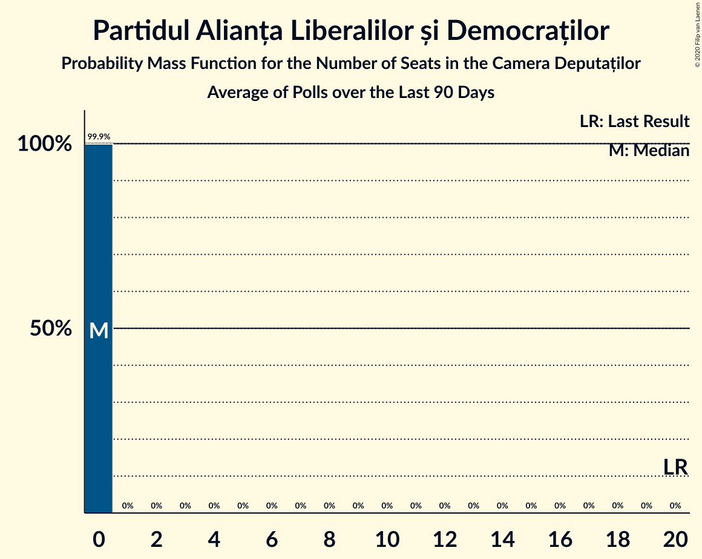
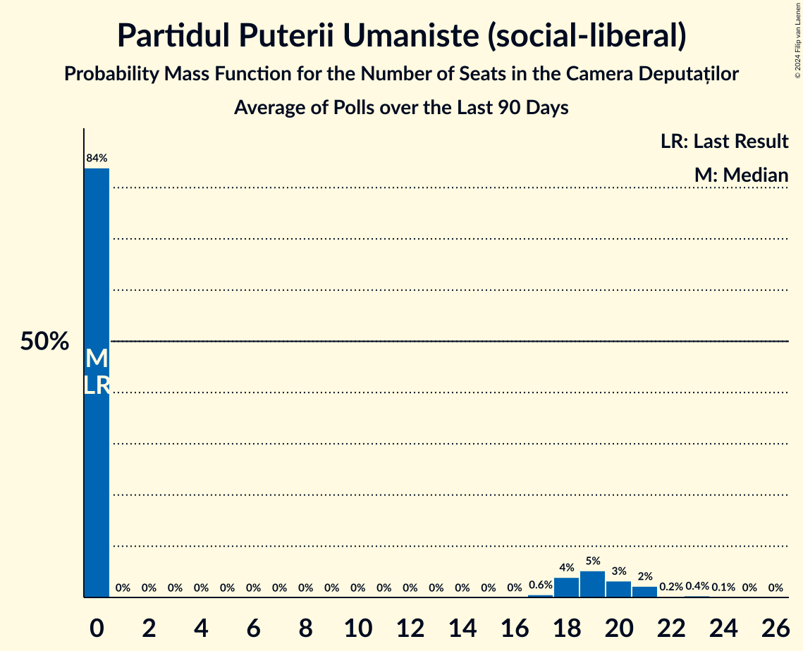

# Poll Average

<a href="#voting-intentions">Voting Intentions</a> | <a href="#seats">Seats</a> | <a href="#coalitions">Coalitions</a> | <a href="#technical-information">Technical Information</a>

## Summary

The table below lists the polls on which the average is based. They are the most recent polls (less than 90 days old) registered and analyzed so far.

| Period     | Polling firm/Commissioner(s) | PSD | PNL | A2020 | UDMR | ALDE | PMP | MIN | PRO | AUR | PPU-SL | PER | APP | FD | REPER | SOSRO |
|:----------:|:----------------------------:|:--:|:--:|:--:|:--:|:--:|:--:|:--:|:--:|:--:|:--:|:--:|:--:|:--:|:--:|:--:|
| 6 December 2020 | General Election | 28.9%   110 | 25.2%   93 | 15.4%   55 | 5.7%   21 | 0.0%   0 | 4.8%   0 | 0.0%   17 | 4.1%   0 | 9.1%   33 | 0.0%   0 | 1.2%   0 | 0.0%   0 | 0.0%   0 | 0.0%   0 | 0.0%   0 |
| N/A | Poll Average | 29–34%   112–133 | 18–23%   69–87 | 9–13%   35–49 | N/A   N/A | N/A   N/A | N/A   N/A | N/A   17 | N/A   N/A | 16–20%   61–79 | N/A   N/A | N/A   N/A | N/A   N/A | N/A   N/A | N/A   N/A | N/A   N/A |
| [1–31 December 2022](2022-12-31-INSCOP.html) | INSCOP | 29–34%   112–133 | 18–23%   69–87 | 9–13%   35–49 | N/A   N/A | N/A   N/A | N/A   N/A | N/A   17 | N/A   N/A | 16–21%   61–79 | N/A   N/A | N/A   N/A | N/A   N/A | N/A   N/A | N/A   N/A | N/A   N/A |
| [8–22 November 2022](2022-11-22-CURS.html) | CURS | N/A   N/A | N/A   N/A | N/A   N/A | N/A   N/A | N/A   N/A | N/A   N/A | N/A   N/A | N/A   N/A | N/A   N/A | N/A   N/A | N/A   N/A | N/A   N/A | N/A   N/A | N/A   N/A | N/A   N/A |
| [1–31 October 2022](2022-10-31-Sociopol.html) | Sociopol | N/A   N/A | N/A   N/A | N/A   N/A | N/A   N/A | N/A   N/A | N/A   N/A | N/A   N/A | N/A   N/A | N/A   N/A | N/A   N/A | N/A   N/A | N/A   N/A | N/A   N/A | N/A   N/A | N/A   N/A |
| 6 December 2020 | General Election | 28.9%   110 | 25.2%   93 | 15.4%   55 | 5.7%   21 | 0.0%   0 | 4.8%   0 | 0.0%   17 | 4.1%   0 | 9.1%   33 | 0.0%   0 | 1.2%   0 | 0.0%   0 | 0.0%   0 | 0.0%   0 | 0.0%   0 |

Only polls for which at least the sample size has been published are included in the table above.

**Legend:**
+ **Top half of each row:** Voting intentions (95% confidence interval)
+ **Bottom half of each row:** Seat projections for the Camera Deputaților (95% confidence interval)
+ **PSD:** Partidul Social Democrat
+ **PNL:** Partidul Național Liberal
+ **A2020:** Alianța 2020 USR-PLUS
+ **UDMR:** Uniunea Democrată Maghiară din România
+ **ALDE:** Partidul Alianța Liberalilor și Democraților
+ **PMP:** Partidul Mișcarea Populară
+ **MIN:** Parties of ethnic minorities
+ **PRO:** PRO România
+ **AUR:** Alianța pentru Unirea Românilor
+ **PPU-SL:** Partidul Puterii Umaniste (social-liberal)
+ **PER:** Partidul Ecologist Român
+ **APP:** Alianța pentru Patrie
+ **FD:** Forța Dreptei
+ **REPER:** Reînnoim Proiectul European al României
+ **SOSRO:** Partidul S.O.S. România
+ **N/A (single party):** Party not included the published results
+ **N/A (entire row):** Calculation for this opinion poll not started yet

## Voting Intentions

### Confidence Intervals

| Party | Last Result | Median | 80% Confidence Interval | 90% Confidence Interval | 95% Confidence Interval | 99% Confidence Interval |
|:-----:|:-----------:|:------:|:-----------------------:|:-----------------------:|:-----------------------:|:-----------------------:|
| <a href="#partidul-social-democrat">Partidul Social Democrat</a> | 28.9% | 31.5% | 29.7–33.4% |29.2–33.9% | 28.8–34.4% | 27.9–35.3% |
| <a href="#partidul-național-liberal">Partidul Național Liberal</a> | 25.2% | 20.2% | 18.7–21.8% |18.2–22.3% | 17.9–22.7% | 17.2–23.5% |
| <a href="#alianța-2020-usr-plus">Alianța 2020 USR-PLUS</a> | 15.4% | 10.9% | 9.7–12.2% |9.4–12.6% | 9.1–12.9% | 8.6–13.5% |
| <a href="#alianța-pentru-unirea-românilor">Alianța pentru Unirea Românilor</a> | 9.1% | 18.1% | 16.7–19.7% |16.2–20.1% | 15.9–20.5% | 15.2–21.3% |
| <a href="#uniunea-democrată-maghiară-din-românia">Uniunea Democrată Maghiară din România</a> | 5.7% | N/A | N/A |N/A | N/A | N/A |
| <a href="#partidul-mișcarea-populară">Partidul Mișcarea Populară</a> | 4.8% | N/A | N/A |N/A | N/A | N/A |
| <a href="#pro-românia">PRO România</a> | 4.1% | N/A | N/A |N/A | N/A | N/A |
| <a href="#partidul-ecologist-român">Partidul Ecologist Român</a> | 1.2% | N/A | N/A |N/A | N/A | N/A |
| <a href="#partidul-alianța-liberalilor-și-democraților">Partidul Alianța Liberalilor și Democraților</a> | 0.0% | N/A | N/A |N/A | N/A | N/A |
| <a href="#parties-of-ethnic-minorities">Parties of ethnic minorities</a> | 0.0% | N/A | N/A |N/A | N/A | N/A |
| <a href="#partidul-puterii-umaniste-(social-liberal)">Partidul Puterii Umaniste (social-liberal)</a> | 0.0% | N/A | N/A |N/A | N/A | N/A |
| <a href="#alianța-pentru-patrie">Alianța pentru Patrie</a> | 0.0% | N/A | N/A |N/A | N/A | N/A |
| <a href="#forța-dreptei">Forța Dreptei</a> | 0.0% | N/A | N/A |N/A | N/A | N/A |
| <a href="#reînnoim-proiectul-european-al-româniei">Reînnoim Proiectul European al României</a> | 0.0% | N/A | N/A |N/A | N/A | N/A |
| <a href="#partidul-s.o.s.-românia">Partidul S.O.S. România</a> | 0.0% | N/A | N/A |N/A | N/A | N/A |

### Partidul Social Democrat

*For a full overview of the results for this party, see the [Partidul Social Democrat](party-partidulsocialdemocrat.html) page.*

| Voting Intentions | Probability | Accumulated | Special Marks |
|:-----------------:|:-----------:|:-----------:|:-------------:|
| 25.5–26.5% | 0% | 100% |  |
| 26.5–27.5% | 0.2% | 100% |  |
| 27.5–28.5% | 1.4% | 99.8% |  |
| 28.5–29.5% | 6% | 98% | Last Result |
| 29.5–30.5% | 16% | 92% |  |
| 30.5–31.5% | 26% | 76% |  |
| 31.5–32.5% | 26% | 50% | Median |
| 32.5–33.5% | 16% | 24% |  |
| 33.5–34.5% | 6% | 8% |  |
| 34.5–35.5% | 2% | 2% |  |
| 35.5–36.5% | 0.3% | 0.3% |  |
| 36.5–37.5% | 0% | 0% |  |

### Partidul Național Liberal

*For a full overview of the results for this party, see the [Partidul Național Liberal](party-partidulnaționalliberal.html) page.*

| Voting Intentions | Probability | Accumulated | Special Marks |
|:-----------------:|:-----------:|:-----------:|:-------------:|
| 14.5–15.5% | 0% | 100% |  |
| 15.5–16.5% | 0.1% | 100% |  |
| 16.5–17.5% | 1.1% | 99.9% |  |
| 17.5–18.5% | 7% | 98.8% |  |
| 18.5–19.5% | 21% | 92% |  |
| 19.5–20.5% | 31% | 71% | Median |
| 20.5–21.5% | 25% | 40% |  |
| 21.5–22.5% | 11% | 15% |  |
| 22.5–23.5% | 3% | 3% |  |
| 23.5–24.5% | 0.4% | 0.5% |  |
| 24.5–25.5% | 0% | 0% | Last Result |
| 25.5–26.5% | 0% | 0% |  |

### Alianța 2020 USR-PLUS

*For a full overview of the results for this party, see the [Alianța 2020 USR-PLUS](party-alianța2020usr-plus.html) page.*

| Voting Intentions | Probability | Accumulated | Special Marks |
|:-----------------:|:-----------:|:-----------:|:-------------:|
| 6.5–7.5% | 0% | 100% |  |
| 7.5–8.5% | 0.4% | 100% |  |
| 8.5–9.5% | 7% | 99.6% |  |
| 9.5–10.5% | 28% | 93% |  |
| 10.5–11.5% | 39% | 65% | Median |
| 11.5–12.5% | 20% | 25% |  |
| 12.5–13.5% | 5% | 5% |  |
| 13.5–14.5% | 0.5% | 0.5% |  |
| 14.5–15.5% | 0% | 0% | Last Result |

### Alianța pentru Unirea Românilor

*For a full overview of the results for this party, see the [Alianța pentru Unirea Românilor](party-alianțapentruunirearomânilor.html) page.*

| Voting Intentions | Probability | Accumulated | Special Marks |
|:-----------------:|:-----------:|:-----------:|:-------------:|
| 8.5–9.5% | 0% | 100% | Last Result |
| 9.5–10.5% | 0% | 100% |  |
| 10.5–11.5% | 0% | 100% |  |
| 11.5–12.5% | 0% | 100% |  |
| 12.5–13.5% | 0% | 100% |  |
| 13.5–14.5% | 0.1% | 100% |  |
| 14.5–15.5% | 1.1% | 99.9% |  |
| 15.5–16.5% | 7% | 98.8% |  |
| 16.5–17.5% | 22% | 91% |  |
| 17.5–18.5% | 33% | 69% | Median |
| 18.5–19.5% | 24% | 36% |  |
| 19.5–20.5% | 10% | 12% |  |
| 20.5–21.5% | 2% | 2% |  |
| 21.5–22.5% | 0.3% | 0.3% |  |
| 22.5–23.5% | 0% | 0% |  |

## Seats

### Confidence Intervals

| Party | Last Result | Median | 80% Confidence Interval | 90% Confidence Interval | 95% Confidence Interval | 99% Confidence Interval |
|:-----:|:-----------:|:------:|:-----------------------:|:-----------------------:|:-----------------------:|:-----------------------:|
| <a href="#partidul-social-democrat">Partidul Social Democrat</a> | 110 | 122 | 117–128 |112–132 | 112–133 | 108–137 |
| <a href="#partidul-național-liberal">Partidul Național Liberal</a> | 93 | 78 | 72–84 |71–86 | 69–87 | 66–91 |
| <a href="#alianța-2020-usr-plus">Alianța 2020 USR-PLUS</a> | 55 | 42 | 37–47 |36–48 | 35–49 | 33–52 |
| <a href="#alianța-pentru-unirea-românilor">Alianța pentru Unirea Românilor</a> | 33 | 70 | 64–76 |63–78 | 61–79 | 59–82 |
| <a href="#uniunea-democrată-maghiară-din-românia">Uniunea Democrată Maghiară din România</a> | 21 | N/A | N/A |N/A | N/A | N/A |
| <a href="#partidul-mișcarea-populară">Partidul Mișcarea Populară</a> | 0 | N/A | N/A |N/A | N/A | N/A |
| <a href="#pro-românia">PRO România</a> | 0 | N/A | N/A |N/A | N/A | N/A |
| <a href="#partidul-ecologist-român">Partidul Ecologist Român</a> | 0 | N/A | N/A |N/A | N/A | N/A |
| <a href="#partidul-alianța-liberalilor-și-democraților">Partidul Alianța Liberalilor și Democraților</a> | 0 | N/A | N/A |N/A | N/A | N/A |
| <a href="#parties-of-ethnic-minorities">Parties of ethnic minorities</a> | 17 | 17 | 17 |17 | 17 | 17 |
| <a href="#partidul-puterii-umaniste-(social-liberal)">Partidul Puterii Umaniste (social-liberal)</a> | 0 | N/A | N/A |N/A | N/A | N/A |
| <a href="#alianța-pentru-patrie">Alianța pentru Patrie</a> | 0 | N/A | N/A |N/A | N/A | N/A |
| <a href="#forța-dreptei">Forța Dreptei</a> | 0 | N/A | N/A |N/A | N/A | N/A |
| <a href="#reînnoim-proiectul-european-al-româniei">Reînnoim Proiectul European al României</a> | 0 | N/A | N/A |N/A | N/A | N/A |
| <a href="#partidul-s.o.s.-românia">Partidul S.O.S. România</a> | 0 | N/A | N/A |N/A | N/A | N/A |

### Partidul Social Democrat

*For a full overview of the results for this party, see the [Partidul Social Democrat](party-partidulsocialdemocrat.html) page.*

| Number of Seats | Probability | Accumulated | Special Marks |
|:---------------:|:-----------:|:-----------:|:-------------:|
| 106 | 0.1% | 100% |  |
| 107 | 0.4% | 99.9% |  |
| 108 | 0.1% | 99.5% |  |
| 109 | 0% | 99.4% |  |
| 110 | 0% | 99.4% | Last Result |
| 111 | 0.5% | 99.4% |  |
| 112 | 5% | 98.9% |  |
| 113 | 1.4% | 94% |  |
| 114 | 0% | 93% |  |
| 115 | 0% | 93% |  |
| 116 | 0.9% | 93% |  |
| 117 | 19% | 92% |  |
| 118 | 6% | 73% |  |
| 119 | 0% | 67% |  |
| 120 | 0% | 67% |  |
| 121 | 0.4% | 67% |  |
| 122 | 27% | 67% | Median |
| 123 | 11% | 39% |  |
| 124 | 0% | 29% |  |
| 125 | 0% | 29% |  |
| 126 | 0% | 29% |  |
| 127 | 15% | 29% |  |
| 128 | 8% | 14% |  |
| 129 | 0% | 6% |  |
| 130 | 0% | 6% |  |
| 131 | 0% | 6% |  |
| 132 | 3% | 6% |  |
| 133 | 3% | 3% |  |
| 134 | 0% | 0.6% |  |
| 135 | 0% | 0.6% |  |
| 136 | 0% | 0.6% |  |
| 137 | 0.2% | 0.6% |  |
| 138 | 0.3% | 0.4% |  |
| 139 | 0% | 0.1% |  |
| 140 | 0% | 0.1% |  |
| 141 | 0% | 0.1% |  |
| 142 | 0% | 0% |  |

### Partidul Național Liberal

*For a full overview of the results for this party, see the [Partidul Național Liberal](party-partidulnaționalliberal.html) page.*

| Number of Seats | Probability | Accumulated | Special Marks |
|:---------------:|:-----------:|:-----------:|:-------------:|
| 63 | 0% | 100% |  |
| 64 | 0.1% | 99.9% |  |
| 65 | 0.1% | 99.9% |  |
| 66 | 0.3% | 99.7% |  |
| 67 | 0.5% | 99.5% |  |
| 68 | 0.8% | 99.0% |  |
| 69 | 1.3% | 98% |  |
| 70 | 2% | 97% |  |
| 71 | 3% | 95% |  |
| 72 | 4% | 92% |  |
| 73 | 5% | 89% |  |
| 74 | 6% | 84% |  |
| 75 | 7% | 78% |  |
| 76 | 8% | 71% |  |
| 77 | 9% | 63% |  |
| 78 | 8% | 55% | Median |
| 79 | 9% | 46% |  |
| 80 | 7% | 38% |  |
| 81 | 7% | 30% |  |
| 82 | 6% | 23% |  |
| 83 | 5% | 17% |  |
| 84 | 4% | 13% |  |
| 85 | 3% | 9% |  |
| 86 | 2% | 6% |  |
| 87 | 1.4% | 4% |  |
| 88 | 1.0% | 2% |  |
| 89 | 0.6% | 1.5% |  |
| 90 | 0.4% | 0.9% |  |
| 91 | 0.2% | 0.5% |  |
| 92 | 0.1% | 0.3% |  |
| 93 | 0.1% | 0.2% | Last Result |
| 94 | 0% | 0.1% |  |
| 95 | 0% | 0% |  |

### Alianța 2020 USR-PLUS

*For a full overview of the results for this party, see the [Alianța 2020 USR-PLUS](party-alianța2020usr-plus.html) page.*

| Number of Seats | Probability | Accumulated | Special Marks |
|:---------------:|:-----------:|:-----------:|:-------------:|
| 0 | 0.1% | 100% |  |
| 1 | 0% | 99.9% |  |
| 2 | 0% | 99.9% |  |
| 3 | 0% | 99.9% |  |
| 4 | 0% | 99.9% |  |
| 5 | 0% | 99.9% |  |
| 6 | 0% | 99.9% |  |
| 7 | 0% | 99.9% |  |
| 8 | 0% | 99.9% |  |
| 9 | 0% | 99.9% |  |
| 10 | 0% | 99.9% |  |
| 11 | 0% | 99.9% |  |
| 12 | 0% | 99.9% |  |
| 13 | 0% | 99.9% |  |
| 14 | 0% | 99.9% |  |
| 15 | 0% | 99.9% |  |
| 16 | 0% | 99.9% |  |
| 17 | 0% | 99.9% |  |
| 18 | 0% | 99.9% |  |
| 19 | 0% | 99.9% |  |
| 20 | 0% | 99.9% |  |
| 21 | 0% | 99.9% |  |
| 22 | 0% | 99.9% |  |
| 23 | 0% | 99.9% |  |
| 24 | 0% | 99.9% |  |
| 25 | 0% | 99.9% |  |
| 26 | 0% | 99.9% |  |
| 27 | 0% | 99.9% |  |
| 28 | 0% | 99.9% |  |
| 29 | 0% | 99.9% |  |
| 30 | 0% | 99.9% |  |
| 31 | 0.1% | 99.9% |  |
| 32 | 0.2% | 99.9% |  |
| 33 | 0.5% | 99.7% |  |
| 34 | 1.0% | 99.2% |  |
| 35 | 2% | 98% |  |
| 36 | 3% | 96% |  |
| 37 | 5% | 93% |  |
| 38 | 6% | 89% |  |
| 39 | 8% | 82% |  |
| 40 | 10% | 74% |  |
| 41 | 11% | 65% |  |
| 42 | 11% | 54% | Median |
| 43 | 10% | 43% |  |
| 44 | 9% | 33% |  |
| 45 | 7% | 24% |  |
| 46 | 6% | 17% |  |
| 47 | 4% | 11% |  |
| 48 | 3% | 7% |  |
| 49 | 2% | 4% |  |
| 50 | 1.1% | 2% |  |
| 51 | 0.6% | 1.3% |  |
| 52 | 0.3% | 0.7% |  |
| 53 | 0.2% | 0.3% |  |
| 54 | 0.1% | 0.2% |  |
| 55 | 0% | 0.1% | Last Result |
| 56 | 0% | 0% |  |

### Alianța pentru Unirea Românilor

*For a full overview of the results for this party, see the [Alianța pentru Unirea Românilor](party-alianțapentruunirearomânilor.html) page.*

| Number of Seats | Probability | Accumulated | Special Marks |
|:---------------:|:-----------:|:-----------:|:-------------:|
| 33 | 0% | 100% | Last Result |
| 34 | 0% | 100% |  |
| 35 | 0% | 100% |  |
| 36 | 0% | 100% |  |
| 37 | 0% | 100% |  |
| 38 | 0% | 100% |  |
| 39 | 0% | 100% |  |
| 40 | 0% | 100% |  |
| 41 | 0% | 100% |  |
| 42 | 0% | 100% |  |
| 43 | 0% | 100% |  |
| 44 | 0% | 100% |  |
| 45 | 0% | 100% |  |
| 46 | 0% | 100% |  |
| 47 | 0% | 100% |  |
| 48 | 0% | 100% |  |
| 49 | 0% | 100% |  |
| 50 | 0% | 100% |  |
| 51 | 0% | 100% |  |
| 52 | 0% | 100% |  |
| 53 | 0% | 100% |  |
| 54 | 0% | 100% |  |
| 55 | 0% | 100% |  |
| 56 | 0% | 100% |  |
| 57 | 0.1% | 99.9% |  |
| 58 | 0.2% | 99.8% |  |
| 59 | 0.4% | 99.6% |  |
| 60 | 0.7% | 99.2% |  |
| 61 | 1.2% | 98% |  |
| 62 | 2% | 97% |  |
| 63 | 3% | 96% |  |
| 64 | 4% | 93% |  |
| 65 | 5% | 89% |  |
| 66 | 6% | 84% |  |
| 67 | 7% | 78% |  |
| 68 | 8% | 70% |  |
| 69 | 9% | 62% |  |
| 70 | 9% | 54% | Median |
| 71 | 8% | 45% |  |
| 72 | 8% | 36% |  |
| 73 | 7% | 28% |  |
| 74 | 6% | 22% |  |
| 75 | 5% | 16% |  |
| 76 | 4% | 11% |  |
| 77 | 3% | 8% |  |
| 78 | 2% | 5% |  |
| 79 | 1.2% | 3% |  |
| 80 | 0.8% | 2% |  |
| 81 | 0.5% | 1.2% |  |
| 82 | 0.3% | 0.7% |  |
| 83 | 0.2% | 0.4% |  |
| 84 | 0.1% | 0.2% |  |
| 85 | 0.1% | 0.1% |  |
| 86 | 0% | 0.1% |  |
| 87 | 0% | 0% |  |

### Uniunea Democrată Maghiară din România

*For a full overview of the results for this party, see the [Uniunea Democrată Maghiară din România](party-uniuneademocratămaghiarădinromânia.html) page.*

### Partidul Mișcarea Populară

*For a full overview of the results for this party, see the [Partidul Mișcarea Populară](party-partidulmișcareapopulară.html) page.*

### PRO România

*For a full overview of the results for this party, see the [PRO România](party-proromânia.html) page.*

### Partidul Ecologist Român

*For a full overview of the results for this party, see the [Partidul Ecologist Român](party-partidulecologistromân.html) page.*

### Partidul Alianța Liberalilor și Democraților

*For a full overview of the results for this party, see the [Partidul Alianța Liberalilor și Democraților](party-partidulalianțaliberalilorșidemocraților.html) page.*

### Parties of ethnic minorities

*For a full overview of the results for this party, see the [Parties of ethnic minorities](party-partiesofethnicminorities.html) page.*

| Number of Seats | Probability | Accumulated | Special Marks |
|:---------------:|:-----------:|:-----------:|:-------------:|
| 17 | 100% | 100% | Last Result, Median |

### Partidul Puterii Umaniste (social-liberal)

*For a full overview of the results for this party, see the [Partidul Puterii Umaniste (social-liberal)](party-partidulputeriiumanistesocial-liberal.html) page.*

### Alianța pentru Patrie

*For a full overview of the results for this party, see the [Alianța pentru Patrie](party-alianțapentrupatrie.html) page.*

### Forța Dreptei

*For a full overview of the results for this party, see the [Forța Dreptei](party-forțadreptei.html) page.*

### Reînnoim Proiectul European al României

*For a full overview of the results for this party, see the [Reînnoim Proiectul European al României](party-reînnoimproiectuleuropeanalromâniei.html) page.*

### Partidul S.O.S. România

*For a full overview of the results for this party, see the [Partidul S.O.S. România](party-partidulsosromânia.html) page.*

## Coalitions

### Confidence Intervals

| Coalition | Last Result | Median | Majority? | 80% Confidence Interval | 90% Confidence Interval | 95% Confidence Interval | 99% Confidence Interval |
|:---------:|:-----------:|:------:|:---------:|:-----------------------:|:-----------------------:|:-----------------------:|:-----------------------:|
| Partidul Social Democrat – PRO România – Partidul Alianța Liberalilor și Democraților | 110 | 122 | 0% | 117–128 | 112–132 | 112–133 | 108–137 |
| Partidul Social Democrat – PRO România | 110 | 122 | 0% | 117–128 | 112–132 | 112–133 | 108–137 |
| Partidul Social Democrat – Partidul Alianța Liberalilor și Democraților | 110 | 122 | 0% | 117–128 | 112–132 | 112–133 | 108–137 |
| Partidul Național Liberal – Alianța 2020 USR-PLUS – Partidul Mișcarea Populară – Partidul Alianța Liberalilor și Democraților | 148 | 120 | 0% | 113–127 | 111–129 | 110–130 | 106–134 |
| Partidul Național Liberal – Alianța 2020 USR-PLUS – Uniunea Democrată Maghiară din România – Partidul Mișcarea Populară – Partidul Alianța Liberalilor și Democraților | 169 | 120 | 0% | 113–127 | 111–129 | 110–130 | 106–134 |
| Partidul Național Liberal – Alianța 2020 USR-PLUS – Partidul Alianța Liberalilor și Democraților | 148 | 120 | 0% | 113–127 | 111–129 | 110–130 | 106–134 |
| Partidul Național Liberal – Alianța 2020 USR-PLUS – Uniunea Democrată Maghiară din România – Partidul Alianța Liberalilor și Democraților | 169 | 120 | 0% | 113–127 | 111–129 | 110–130 | 106–134 |
| Partidul Național Liberal – Alianța 2020 USR-PLUS – Partidul Mișcarea Populară | 148 | 120 | 0% | 113–127 | 111–129 | 110–130 | 106–134 |
| Partidul Național Liberal – Alianța 2020 USR-PLUS – Uniunea Democrată Maghiară din România – Partidul Mișcarea Populară | 169 | 120 | 0% | 113–127 | 111–129 | 110–130 | 106–134 |
| Partidul Național Liberal – Alianța 2020 USR-PLUS | 148 | 120 | 0% | 113–127 | 111–129 | 110–130 | 106–134 |
| Partidul Național Liberal – Alianța 2020 USR-PLUS – Uniunea Democrată Maghiară din România | 169 | 120 | 0% | 113–127 | 111–129 | 110–130 | 106–134 |
| Partidul Național Liberal – Uniunea Democrată Maghiară din România – Partidul Mișcarea Populară – Partidul Alianța Liberalilor și Democraților | 114 | 78 | 0% | 72–84 | 71–86 | 69–87 | 66–91 |
| Partidul Național Liberal – Uniunea Democrată Maghiară din România – Partidul Alianța Liberalilor și Democraților | 114 | 78 | 0% | 72–84 | 71–86 | 69–87 | 66–91 |
| Partidul Național Liberal – Partidul Mișcarea Populară | 93 | 78 | 0% | 72–84 | 71–86 | 69–87 | 66–91 |
| Partidul Național Liberal – Uniunea Democrată Maghiară din România – Partidul Mișcarea Populară | 114 | 78 | 0% | 72–84 | 71–86 | 69–87 | 66–91 |
| Partidul Național Liberal | 93 | 78 | 0% | 72–84 | 71–86 | 69–87 | 66–91 |
| Partidul Național Liberal – Uniunea Democrată Maghiară din România | 114 | 78 | 0% | 72–84 | 71–86 | 69–87 | 66–91 |
| Alianța 2020 USR-PLUS – Partidul Mișcarea Populară | 55 | 42 | 0% | 37–47 | 36–48 | 35–49 | 33–52 |

### Partidul Social Democrat – PRO România – Partidul Alianța Liberalilor și Democraților

| Number of Seats | Probability | Accumulated | Special Marks |
|:---------------:|:-----------:|:-----------:|:-------------:|
| 106 | 0.1% | 100% |  |
| 107 | 0.4% | 99.9% |  |
| 108 | 0.1% | 99.5% |  |
| 109 | 0% | 99.4% |  |
| 110 | 0% | 99.4% | Last Result |
| 111 | 0.5% | 99.4% |  |
| 112 | 5% | 98.9% |  |
| 113 | 1.4% | 94% |  |
| 114 | 0% | 93% |  |
| 115 | 0% | 93% |  |
| 116 | 0.9% | 93% |  |
| 117 | 19% | 92% |  |
| 118 | 6% | 73% |  |
| 119 | 0% | 67% |  |
| 120 | 0% | 67% |  |
| 121 | 0.4% | 67% |  |
| 122 | 27% | 67% | Median |
| 123 | 11% | 39% |  |
| 124 | 0% | 29% |  |
| 125 | 0% | 29% |  |
| 126 | 0% | 29% |  |
| 127 | 15% | 29% |  |
| 128 | 8% | 14% |  |
| 129 | 0% | 6% |  |
| 130 | 0% | 6% |  |
| 131 | 0% | 6% |  |
| 132 | 3% | 6% |  |
| 133 | 3% | 3% |  |
| 134 | 0% | 0.6% |  |
| 135 | 0% | 0.6% |  |
| 136 | 0% | 0.6% |  |
| 137 | 0.2% | 0.6% |  |
| 138 | 0.3% | 0.4% |  |
| 139 | 0% | 0.1% |  |
| 140 | 0% | 0.1% |  |
| 141 | 0% | 0.1% |  |
| 142 | 0% | 0% |  |

### Partidul Social Democrat – PRO România

| Number of Seats | Probability | Accumulated | Special Marks |
|:---------------:|:-----------:|:-----------:|:-------------:|
| 106 | 0.1% | 100% |  |
| 107 | 0.4% | 99.9% |  |
| 108 | 0.1% | 99.5% |  |
| 109 | 0% | 99.4% |  |
| 110 | 0% | 99.4% | Last Result |
| 111 | 0.5% | 99.4% |  |
| 112 | 5% | 98.9% |  |
| 113 | 1.4% | 94% |  |
| 114 | 0% | 93% |  |
| 115 | 0% | 93% |  |
| 116 | 0.9% | 93% |  |
| 117 | 19% | 92% |  |
| 118 | 6% | 73% |  |
| 119 | 0% | 67% |  |
| 120 | 0% | 67% |  |
| 121 | 0.4% | 67% |  |
| 122 | 27% | 67% | Median |
| 123 | 11% | 39% |  |
| 124 | 0% | 29% |  |
| 125 | 0% | 29% |  |
| 126 | 0% | 29% |  |
| 127 | 15% | 29% |  |
| 128 | 8% | 14% |  |
| 129 | 0% | 6% |  |
| 130 | 0% | 6% |  |
| 131 | 0% | 6% |  |
| 132 | 3% | 6% |  |
| 133 | 3% | 3% |  |
| 134 | 0% | 0.6% |  |
| 135 | 0% | 0.6% |  |
| 136 | 0% | 0.6% |  |
| 137 | 0.2% | 0.6% |  |
| 138 | 0.3% | 0.4% |  |
| 139 | 0% | 0.1% |  |
| 140 | 0% | 0.1% |  |
| 141 | 0% | 0.1% |  |
| 142 | 0% | 0% |  |

### Partidul Social Democrat – Partidul Alianța Liberalilor și Democraților

| Number of Seats | Probability | Accumulated | Special Marks |
|:---------------:|:-----------:|:-----------:|:-------------:|
| 106 | 0.1% | 100% |  |
| 107 | 0.4% | 99.9% |  |
| 108 | 0.1% | 99.5% |  |
| 109 | 0% | 99.4% |  |
| 110 | 0% | 99.4% | Last Result |
| 111 | 0.5% | 99.4% |  |
| 112 | 5% | 98.9% |  |
| 113 | 1.4% | 94% |  |
| 114 | 0% | 93% |  |
| 115 | 0% | 93% |  |
| 116 | 0.9% | 93% |  |
| 117 | 19% | 92% |  |
| 118 | 6% | 73% |  |
| 119 | 0% | 67% |  |
| 120 | 0% | 67% |  |
| 121 | 0.4% | 67% |  |
| 122 | 27% | 67% | Median |
| 123 | 11% | 39% |  |
| 124 | 0% | 29% |  |
| 125 | 0% | 29% |  |
| 126 | 0% | 29% |  |
| 127 | 15% | 29% |  |
| 128 | 8% | 14% |  |
| 129 | 0% | 6% |  |
| 130 | 0% | 6% |  |
| 131 | 0% | 6% |  |
| 132 | 3% | 6% |  |
| 133 | 3% | 3% |  |
| 134 | 0% | 0.6% |  |
| 135 | 0% | 0.6% |  |
| 136 | 0% | 0.6% |  |
| 137 | 0.2% | 0.6% |  |
| 138 | 0.3% | 0.4% |  |
| 139 | 0% | 0.1% |  |
| 140 | 0% | 0.1% |  |
| 141 | 0% | 0.1% |  |
| 142 | 0% | 0% |  |

### Partidul Național Liberal – Alianța 2020 USR-PLUS – Partidul Mișcarea Populară – Partidul Alianța Liberalilor și Democraților

| Number of Seats | Probability | Accumulated | Special Marks |
|:---------------:|:-----------:|:-----------:|:-------------:|
| 98 | 0% | 100% |  |
| 99 | 0% | 99.9% |  |
| 100 | 0% | 99.9% |  |
| 101 | 0% | 99.9% |  |
| 102 | 0% | 99.9% |  |
| 103 | 0% | 99.9% |  |
| 104 | 0.1% | 99.9% |  |
| 105 | 0.1% | 99.8% |  |
| 106 | 0.2% | 99.7% |  |
| 107 | 0.3% | 99.5% |  |
| 108 | 0.5% | 99.2% |  |
| 109 | 0.8% | 98.6% |  |
| 110 | 1.2% | 98% |  |
| 111 | 2% | 97% |  |
| 112 | 2% | 95% |  |
| 113 | 3% | 93% |  |
| 114 | 4% | 89% |  |
| 115 | 5% | 85% |  |
| 116 | 5% | 81% |  |
| 117 | 7% | 75% |  |
| 118 | 7% | 69% |  |
| 119 | 8% | 62% |  |
| 120 | 8% | 54% | Median |
| 121 | 8% | 46% |  |
| 122 | 7% | 39% |  |
| 123 | 6% | 32% |  |
| 124 | 6% | 26% |  |
| 125 | 5% | 20% |  |
| 126 | 4% | 15% |  |
| 127 | 3% | 11% |  |
| 128 | 2% | 8% |  |
| 129 | 2% | 5% |  |
| 130 | 1.2% | 4% |  |
| 131 | 0.9% | 2% |  |
| 132 | 0.6% | 1.5% |  |
| 133 | 0.4% | 0.9% |  |
| 134 | 0.2% | 0.5% |  |
| 135 | 0.1% | 0.3% |  |
| 136 | 0.1% | 0.2% |  |
| 137 | 0% | 0.1% |  |
| 138 | 0% | 0.1% |  |
| 139 | 0% | 0% |  |
| 140 | 0% | 0% |  |
| 141 | 0% | 0% |  |
| 142 | 0% | 0% |  |
| 143 | 0% | 0% |  |
| 144 | 0% | 0% |  |
| 145 | 0% | 0% |  |
| 146 | 0% | 0% |  |
| 147 | 0% | 0% |  |
| 148 | 0% | 0% | Last Result |

### Partidul Național Liberal – Alianța 2020 USR-PLUS – Uniunea Democrată Maghiară din România – Partidul Mișcarea Populară – Partidul Alianța Liberalilor și Democraților

| Number of Seats | Probability | Accumulated | Special Marks |
|:---------------:|:-----------:|:-----------:|:-------------:|
| 98 | 0% | 100% |  |
| 99 | 0% | 99.9% |  |
| 100 | 0% | 99.9% |  |
| 101 | 0% | 99.9% |  |
| 102 | 0% | 99.9% |  |
| 103 | 0% | 99.9% |  |
| 104 | 0.1% | 99.9% |  |
| 105 | 0.1% | 99.8% |  |
| 106 | 0.2% | 99.7% |  |
| 107 | 0.3% | 99.5% |  |
| 108 | 0.5% | 99.2% |  |
| 109 | 0.8% | 98.6% |  |
| 110 | 1.2% | 98% |  |
| 111 | 2% | 97% |  |
| 112 | 2% | 95% |  |
| 113 | 3% | 93% |  |
| 114 | 4% | 89% |  |
| 115 | 5% | 85% |  |
| 116 | 5% | 81% |  |
| 117 | 7% | 75% |  |
| 118 | 7% | 69% |  |
| 119 | 8% | 62% |  |
| 120 | 8% | 54% | Median |
| 121 | 8% | 46% |  |
| 122 | 7% | 39% |  |
| 123 | 6% | 32% |  |
| 124 | 6% | 26% |  |
| 125 | 5% | 20% |  |
| 126 | 4% | 15% |  |
| 127 | 3% | 11% |  |
| 128 | 2% | 8% |  |
| 129 | 2% | 5% |  |
| 130 | 1.2% | 4% |  |
| 131 | 0.9% | 2% |  |
| 132 | 0.6% | 1.5% |  |
| 133 | 0.4% | 0.9% |  |
| 134 | 0.2% | 0.5% |  |
| 135 | 0.1% | 0.3% |  |
| 136 | 0.1% | 0.2% |  |
| 137 | 0% | 0.1% |  |
| 138 | 0% | 0.1% |  |
| 139 | 0% | 0% |  |
| 140 | 0% | 0% |  |
| 141 | 0% | 0% |  |
| 142 | 0% | 0% |  |
| 143 | 0% | 0% |  |
| 144 | 0% | 0% |  |
| 145 | 0% | 0% |  |
| 146 | 0% | 0% |  |
| 147 | 0% | 0% |  |
| 148 | 0% | 0% |  |
| 149 | 0% | 0% |  |
| 150 | 0% | 0% |  |
| 151 | 0% | 0% |  |
| 152 | 0% | 0% |  |
| 153 | 0% | 0% |  |
| 154 | 0% | 0% |  |
| 155 | 0% | 0% |  |
| 156 | 0% | 0% |  |
| 157 | 0% | 0% |  |
| 158 | 0% | 0% |  |
| 159 | 0% | 0% |  |
| 160 | 0% | 0% |  |
| 161 | 0% | 0% |  |
| 162 | 0% | 0% |  |
| 163 | 0% | 0% |  |
| 164 | 0% | 0% |  |
| 165 | 0% | 0% | Majority |
| 166 | 0% | 0% |  |
| 167 | 0% | 0% |  |
| 168 | 0% | 0% |  |
| 169 | 0% | 0% | Last Result |

### Partidul Național Liberal – Alianța 2020 USR-PLUS – Partidul Alianța Liberalilor și Democraților

| Number of Seats | Probability | Accumulated | Special Marks |
|:---------------:|:-----------:|:-----------:|:-------------:|
| 98 | 0% | 100% |  |
| 99 | 0% | 99.9% |  |
| 100 | 0% | 99.9% |  |
| 101 | 0% | 99.9% |  |
| 102 | 0% | 99.9% |  |
| 103 | 0% | 99.9% |  |
| 104 | 0.1% | 99.9% |  |
| 105 | 0.1% | 99.8% |  |
| 106 | 0.2% | 99.7% |  |
| 107 | 0.3% | 99.5% |  |
| 108 | 0.5% | 99.2% |  |
| 109 | 0.8% | 98.6% |  |
| 110 | 1.2% | 98% |  |
| 111 | 2% | 97% |  |
| 112 | 2% | 95% |  |
| 113 | 3% | 93% |  |
| 114 | 4% | 89% |  |
| 115 | 5% | 85% |  |
| 116 | 5% | 81% |  |
| 117 | 7% | 75% |  |
| 118 | 7% | 69% |  |
| 119 | 8% | 62% |  |
| 120 | 8% | 54% | Median |
| 121 | 8% | 46% |  |
| 122 | 7% | 39% |  |
| 123 | 6% | 32% |  |
| 124 | 6% | 26% |  |
| 125 | 5% | 20% |  |
| 126 | 4% | 15% |  |
| 127 | 3% | 11% |  |
| 128 | 2% | 8% |  |
| 129 | 2% | 5% |  |
| 130 | 1.2% | 4% |  |
| 131 | 0.9% | 2% |  |
| 132 | 0.6% | 1.5% |  |
| 133 | 0.4% | 0.9% |  |
| 134 | 0.2% | 0.5% |  |
| 135 | 0.1% | 0.3% |  |
| 136 | 0.1% | 0.2% |  |
| 137 | 0% | 0.1% |  |
| 138 | 0% | 0.1% |  |
| 139 | 0% | 0% |  |
| 140 | 0% | 0% |  |
| 141 | 0% | 0% |  |
| 142 | 0% | 0% |  |
| 143 | 0% | 0% |  |
| 144 | 0% | 0% |  |
| 145 | 0% | 0% |  |
| 146 | 0% | 0% |  |
| 147 | 0% | 0% |  |
| 148 | 0% | 0% | Last Result |

### Partidul Național Liberal – Alianța 2020 USR-PLUS – Uniunea Democrată Maghiară din România – Partidul Alianța Liberalilor și Democraților

| Number of Seats | Probability | Accumulated | Special Marks |
|:---------------:|:-----------:|:-----------:|:-------------:|
| 98 | 0% | 100% |  |
| 99 | 0% | 99.9% |  |
| 100 | 0% | 99.9% |  |
| 101 | 0% | 99.9% |  |
| 102 | 0% | 99.9% |  |
| 103 | 0% | 99.9% |  |
| 104 | 0.1% | 99.9% |  |
| 105 | 0.1% | 99.8% |  |
| 106 | 0.2% | 99.7% |  |
| 107 | 0.3% | 99.5% |  |
| 108 | 0.5% | 99.2% |  |
| 109 | 0.8% | 98.6% |  |
| 110 | 1.2% | 98% |  |
| 111 | 2% | 97% |  |
| 112 | 2% | 95% |  |
| 113 | 3% | 93% |  |
| 114 | 4% | 89% |  |
| 115 | 5% | 85% |  |
| 116 | 5% | 81% |  |
| 117 | 7% | 75% |  |
| 118 | 7% | 69% |  |
| 119 | 8% | 62% |  |
| 120 | 8% | 54% | Median |
| 121 | 8% | 46% |  |
| 122 | 7% | 39% |  |
| 123 | 6% | 32% |  |
| 124 | 6% | 26% |  |
| 125 | 5% | 20% |  |
| 126 | 4% | 15% |  |
| 127 | 3% | 11% |  |
| 128 | 2% | 8% |  |
| 129 | 2% | 5% |  |
| 130 | 1.2% | 4% |  |
| 131 | 0.9% | 2% |  |
| 132 | 0.6% | 1.5% |  |
| 133 | 0.4% | 0.9% |  |
| 134 | 0.2% | 0.5% |  |
| 135 | 0.1% | 0.3% |  |
| 136 | 0.1% | 0.2% |  |
| 137 | 0% | 0.1% |  |
| 138 | 0% | 0.1% |  |
| 139 | 0% | 0% |  |
| 140 | 0% | 0% |  |
| 141 | 0% | 0% |  |
| 142 | 0% | 0% |  |
| 143 | 0% | 0% |  |
| 144 | 0% | 0% |  |
| 145 | 0% | 0% |  |
| 146 | 0% | 0% |  |
| 147 | 0% | 0% |  |
| 148 | 0% | 0% |  |
| 149 | 0% | 0% |  |
| 150 | 0% | 0% |  |
| 151 | 0% | 0% |  |
| 152 | 0% | 0% |  |
| 153 | 0% | 0% |  |
| 154 | 0% | 0% |  |
| 155 | 0% | 0% |  |
| 156 | 0% | 0% |  |
| 157 | 0% | 0% |  |
| 158 | 0% | 0% |  |
| 159 | 0% | 0% |  |
| 160 | 0% | 0% |  |
| 161 | 0% | 0% |  |
| 162 | 0% | 0% |  |
| 163 | 0% | 0% |  |
| 164 | 0% | 0% |  |
| 165 | 0% | 0% | Majority |
| 166 | 0% | 0% |  |
| 167 | 0% | 0% |  |
| 168 | 0% | 0% |  |
| 169 | 0% | 0% | Last Result |

### Partidul Național Liberal – Alianța 2020 USR-PLUS – Partidul Mișcarea Populară

| Number of Seats | Probability | Accumulated | Special Marks |
|:---------------:|:-----------:|:-----------:|:-------------:|
| 98 | 0% | 100% |  |
| 99 | 0% | 99.9% |  |
| 100 | 0% | 99.9% |  |
| 101 | 0% | 99.9% |  |
| 102 | 0% | 99.9% |  |
| 103 | 0% | 99.9% |  |
| 104 | 0.1% | 99.9% |  |
| 105 | 0.1% | 99.8% |  |
| 106 | 0.2% | 99.7% |  |
| 107 | 0.3% | 99.5% |  |
| 108 | 0.5% | 99.2% |  |
| 109 | 0.8% | 98.6% |  |
| 110 | 1.2% | 98% |  |
| 111 | 2% | 97% |  |
| 112 | 2% | 95% |  |
| 113 | 3% | 93% |  |
| 114 | 4% | 89% |  |
| 115 | 5% | 85% |  |
| 116 | 5% | 81% |  |
| 117 | 7% | 75% |  |
| 118 | 7% | 69% |  |
| 119 | 8% | 62% |  |
| 120 | 8% | 54% | Median |
| 121 | 8% | 46% |  |
| 122 | 7% | 39% |  |
| 123 | 6% | 32% |  |
| 124 | 6% | 26% |  |
| 125 | 5% | 20% |  |
| 126 | 4% | 15% |  |
| 127 | 3% | 11% |  |
| 128 | 2% | 8% |  |
| 129 | 2% | 5% |  |
| 130 | 1.2% | 4% |  |
| 131 | 0.9% | 2% |  |
| 132 | 0.6% | 1.5% |  |
| 133 | 0.4% | 0.9% |  |
| 134 | 0.2% | 0.5% |  |
| 135 | 0.1% | 0.3% |  |
| 136 | 0.1% | 0.2% |  |
| 137 | 0% | 0.1% |  |
| 138 | 0% | 0.1% |  |
| 139 | 0% | 0% |  |
| 140 | 0% | 0% |  |
| 141 | 0% | 0% |  |
| 142 | 0% | 0% |  |
| 143 | 0% | 0% |  |
| 144 | 0% | 0% |  |
| 145 | 0% | 0% |  |
| 146 | 0% | 0% |  |
| 147 | 0% | 0% |  |
| 148 | 0% | 0% | Last Result |

### Partidul Național Liberal – Alianța 2020 USR-PLUS – Uniunea Democrată Maghiară din România – Partidul Mișcarea Populară

| Number of Seats | Probability | Accumulated | Special Marks |
|:---------------:|:-----------:|:-----------:|:-------------:|
| 98 | 0% | 100% |  |
| 99 | 0% | 99.9% |  |
| 100 | 0% | 99.9% |  |
| 101 | 0% | 99.9% |  |
| 102 | 0% | 99.9% |  |
| 103 | 0% | 99.9% |  |
| 104 | 0.1% | 99.9% |  |
| 105 | 0.1% | 99.8% |  |
| 106 | 0.2% | 99.7% |  |
| 107 | 0.3% | 99.5% |  |
| 108 | 0.5% | 99.2% |  |
| 109 | 0.8% | 98.6% |  |
| 110 | 1.2% | 98% |  |
| 111 | 2% | 97% |  |
| 112 | 2% | 95% |  |
| 113 | 3% | 93% |  |
| 114 | 4% | 89% |  |
| 115 | 5% | 85% |  |
| 116 | 5% | 81% |  |
| 117 | 7% | 75% |  |
| 118 | 7% | 69% |  |
| 119 | 8% | 62% |  |
| 120 | 8% | 54% | Median |
| 121 | 8% | 46% |  |
| 122 | 7% | 39% |  |
| 123 | 6% | 32% |  |
| 124 | 6% | 26% |  |
| 125 | 5% | 20% |  |
| 126 | 4% | 15% |  |
| 127 | 3% | 11% |  |
| 128 | 2% | 8% |  |
| 129 | 2% | 5% |  |
| 130 | 1.2% | 4% |  |
| 131 | 0.9% | 2% |  |
| 132 | 0.6% | 1.5% |  |
| 133 | 0.4% | 0.9% |  |
| 134 | 0.2% | 0.5% |  |
| 135 | 0.1% | 0.3% |  |
| 136 | 0.1% | 0.2% |  |
| 137 | 0% | 0.1% |  |
| 138 | 0% | 0.1% |  |
| 139 | 0% | 0% |  |
| 140 | 0% | 0% |  |
| 141 | 0% | 0% |  |
| 142 | 0% | 0% |  |
| 143 | 0% | 0% |  |
| 144 | 0% | 0% |  |
| 145 | 0% | 0% |  |
| 146 | 0% | 0% |  |
| 147 | 0% | 0% |  |
| 148 | 0% | 0% |  |
| 149 | 0% | 0% |  |
| 150 | 0% | 0% |  |
| 151 | 0% | 0% |  |
| 152 | 0% | 0% |  |
| 153 | 0% | 0% |  |
| 154 | 0% | 0% |  |
| 155 | 0% | 0% |  |
| 156 | 0% | 0% |  |
| 157 | 0% | 0% |  |
| 158 | 0% | 0% |  |
| 159 | 0% | 0% |  |
| 160 | 0% | 0% |  |
| 161 | 0% | 0% |  |
| 162 | 0% | 0% |  |
| 163 | 0% | 0% |  |
| 164 | 0% | 0% |  |
| 165 | 0% | 0% | Majority |
| 166 | 0% | 0% |  |
| 167 | 0% | 0% |  |
| 168 | 0% | 0% |  |
| 169 | 0% | 0% | Last Result |

### Partidul Național Liberal – Alianța 2020 USR-PLUS

| Number of Seats | Probability | Accumulated | Special Marks |
|:---------------:|:-----------:|:-----------:|:-------------:|
| 98 | 0% | 100% |  |
| 99 | 0% | 99.9% |  |
| 100 | 0% | 99.9% |  |
| 101 | 0% | 99.9% |  |
| 102 | 0% | 99.9% |  |
| 103 | 0% | 99.9% |  |
| 104 | 0.1% | 99.9% |  |
| 105 | 0.1% | 99.8% |  |
| 106 | 0.2% | 99.7% |  |
| 107 | 0.3% | 99.5% |  |
| 108 | 0.5% | 99.2% |  |
| 109 | 0.8% | 98.6% |  |
| 110 | 1.2% | 98% |  |
| 111 | 2% | 97% |  |
| 112 | 2% | 95% |  |
| 113 | 3% | 93% |  |
| 114 | 4% | 89% |  |
| 115 | 5% | 85% |  |
| 116 | 5% | 81% |  |
| 117 | 7% | 75% |  |
| 118 | 7% | 69% |  |
| 119 | 8% | 62% |  |
| 120 | 8% | 54% | Median |
| 121 | 8% | 46% |  |
| 122 | 7% | 39% |  |
| 123 | 6% | 32% |  |
| 124 | 6% | 26% |  |
| 125 | 5% | 20% |  |
| 126 | 4% | 15% |  |
| 127 | 3% | 11% |  |
| 128 | 2% | 8% |  |
| 129 | 2% | 5% |  |
| 130 | 1.2% | 4% |  |
| 131 | 0.9% | 2% |  |
| 132 | 0.6% | 1.5% |  |
| 133 | 0.4% | 0.9% |  |
| 134 | 0.2% | 0.5% |  |
| 135 | 0.1% | 0.3% |  |
| 136 | 0.1% | 0.2% |  |
| 137 | 0% | 0.1% |  |
| 138 | 0% | 0.1% |  |
| 139 | 0% | 0% |  |
| 140 | 0% | 0% |  |
| 141 | 0% | 0% |  |
| 142 | 0% | 0% |  |
| 143 | 0% | 0% |  |
| 144 | 0% | 0% |  |
| 145 | 0% | 0% |  |
| 146 | 0% | 0% |  |
| 147 | 0% | 0% |  |
| 148 | 0% | 0% | Last Result |

### Partidul Național Liberal – Alianța 2020 USR-PLUS – Uniunea Democrată Maghiară din România

| Number of Seats | Probability | Accumulated | Special Marks |
|:---------------:|:-----------:|:-----------:|:-------------:|
| 98 | 0% | 100% |  |
| 99 | 0% | 99.9% |  |
| 100 | 0% | 99.9% |  |
| 101 | 0% | 99.9% |  |
| 102 | 0% | 99.9% |  |
| 103 | 0% | 99.9% |  |
| 104 | 0.1% | 99.9% |  |
| 105 | 0.1% | 99.8% |  |
| 106 | 0.2% | 99.7% |  |
| 107 | 0.3% | 99.5% |  |
| 108 | 0.5% | 99.2% |  |
| 109 | 0.8% | 98.6% |  |
| 110 | 1.2% | 98% |  |
| 111 | 2% | 97% |  |
| 112 | 2% | 95% |  |
| 113 | 3% | 93% |  |
| 114 | 4% | 89% |  |
| 115 | 5% | 85% |  |
| 116 | 5% | 81% |  |
| 117 | 7% | 75% |  |
| 118 | 7% | 69% |  |
| 119 | 8% | 62% |  |
| 120 | 8% | 54% | Median |
| 121 | 8% | 46% |  |
| 122 | 7% | 39% |  |
| 123 | 6% | 32% |  |
| 124 | 6% | 26% |  |
| 125 | 5% | 20% |  |
| 126 | 4% | 15% |  |
| 127 | 3% | 11% |  |
| 128 | 2% | 8% |  |
| 129 | 2% | 5% |  |
| 130 | 1.2% | 4% |  |
| 131 | 0.9% | 2% |  |
| 132 | 0.6% | 1.5% |  |
| 133 | 0.4% | 0.9% |  |
| 134 | 0.2% | 0.5% |  |
| 135 | 0.1% | 0.3% |  |
| 136 | 0.1% | 0.2% |  |
| 137 | 0% | 0.1% |  |
| 138 | 0% | 0.1% |  |
| 139 | 0% | 0% |  |
| 140 | 0% | 0% |  |
| 141 | 0% | 0% |  |
| 142 | 0% | 0% |  |
| 143 | 0% | 0% |  |
| 144 | 0% | 0% |  |
| 145 | 0% | 0% |  |
| 146 | 0% | 0% |  |
| 147 | 0% | 0% |  |
| 148 | 0% | 0% |  |
| 149 | 0% | 0% |  |
| 150 | 0% | 0% |  |
| 151 | 0% | 0% |  |
| 152 | 0% | 0% |  |
| 153 | 0% | 0% |  |
| 154 | 0% | 0% |  |
| 155 | 0% | 0% |  |
| 156 | 0% | 0% |  |
| 157 | 0% | 0% |  |
| 158 | 0% | 0% |  |
| 159 | 0% | 0% |  |
| 160 | 0% | 0% |  |
| 161 | 0% | 0% |  |
| 162 | 0% | 0% |  |
| 163 | 0% | 0% |  |
| 164 | 0% | 0% |  |
| 165 | 0% | 0% | Majority |
| 166 | 0% | 0% |  |
| 167 | 0% | 0% |  |
| 168 | 0% | 0% |  |
| 169 | 0% | 0% | Last Result |

### Partidul Național Liberal – Uniunea Democrată Maghiară din România – Partidul Mișcarea Populară – Partidul Alianța Liberalilor și Democraților

| Number of Seats | Probability | Accumulated | Special Marks |
|:---------------:|:-----------:|:-----------:|:-------------:|
| 63 | 0% | 100% |  |
| 64 | 0.1% | 99.9% |  |
| 65 | 0.1% | 99.9% |  |
| 66 | 0.3% | 99.7% |  |
| 67 | 0.5% | 99.5% |  |
| 68 | 0.8% | 99.0% |  |
| 69 | 1.3% | 98% |  |
| 70 | 2% | 97% |  |
| 71 | 3% | 95% |  |
| 72 | 4% | 92% |  |
| 73 | 5% | 89% |  |
| 74 | 6% | 84% |  |
| 75 | 7% | 78% |  |
| 76 | 8% | 71% |  |
| 77 | 9% | 63% |  |
| 78 | 8% | 55% | Median |
| 79 | 9% | 46% |  |
| 80 | 7% | 38% |  |
| 81 | 7% | 30% |  |
| 82 | 6% | 23% |  |
| 83 | 5% | 17% |  |
| 84 | 4% | 13% |  |
| 85 | 3% | 9% |  |
| 86 | 2% | 6% |  |
| 87 | 1.4% | 4% |  |
| 88 | 1.0% | 2% |  |
| 89 | 0.6% | 1.5% |  |
| 90 | 0.4% | 0.9% |  |
| 91 | 0.2% | 0.5% |  |
| 92 | 0.1% | 0.3% |  |
| 93 | 0.1% | 0.2% |  |
| 94 | 0% | 0.1% |  |
| 95 | 0% | 0% |  |
| 96 | 0% | 0% |  |
| 97 | 0% | 0% |  |
| 98 | 0% | 0% |  |
| 99 | 0% | 0% |  |
| 100 | 0% | 0% |  |
| 101 | 0% | 0% |  |
| 102 | 0% | 0% |  |
| 103 | 0% | 0% |  |
| 104 | 0% | 0% |  |
| 105 | 0% | 0% |  |
| 106 | 0% | 0% |  |
| 107 | 0% | 0% |  |
| 108 | 0% | 0% |  |
| 109 | 0% | 0% |  |
| 110 | 0% | 0% |  |
| 111 | 0% | 0% |  |
| 112 | 0% | 0% |  |
| 113 | 0% | 0% |  |
| 114 | 0% | 0% | Last Result |

### Partidul Național Liberal – Uniunea Democrată Maghiară din România – Partidul Alianța Liberalilor și Democraților

| Number of Seats | Probability | Accumulated | Special Marks |
|:---------------:|:-----------:|:-----------:|:-------------:|
| 63 | 0% | 100% |  |
| 64 | 0.1% | 99.9% |  |
| 65 | 0.1% | 99.9% |  |
| 66 | 0.3% | 99.7% |  |
| 67 | 0.5% | 99.5% |  |
| 68 | 0.8% | 99.0% |  |
| 69 | 1.3% | 98% |  |
| 70 | 2% | 97% |  |
| 71 | 3% | 95% |  |
| 72 | 4% | 92% |  |
| 73 | 5% | 89% |  |
| 74 | 6% | 84% |  |
| 75 | 7% | 78% |  |
| 76 | 8% | 71% |  |
| 77 | 9% | 63% |  |
| 78 | 8% | 55% | Median |
| 79 | 9% | 46% |  |
| 80 | 7% | 38% |  |
| 81 | 7% | 30% |  |
| 82 | 6% | 23% |  |
| 83 | 5% | 17% |  |
| 84 | 4% | 13% |  |
| 85 | 3% | 9% |  |
| 86 | 2% | 6% |  |
| 87 | 1.4% | 4% |  |
| 88 | 1.0% | 2% |  |
| 89 | 0.6% | 1.5% |  |
| 90 | 0.4% | 0.9% |  |
| 91 | 0.2% | 0.5% |  |
| 92 | 0.1% | 0.3% |  |
| 93 | 0.1% | 0.2% |  |
| 94 | 0% | 0.1% |  |
| 95 | 0% | 0% |  |
| 96 | 0% | 0% |  |
| 97 | 0% | 0% |  |
| 98 | 0% | 0% |  |
| 99 | 0% | 0% |  |
| 100 | 0% | 0% |  |
| 101 | 0% | 0% |  |
| 102 | 0% | 0% |  |
| 103 | 0% | 0% |  |
| 104 | 0% | 0% |  |
| 105 | 0% | 0% |  |
| 106 | 0% | 0% |  |
| 107 | 0% | 0% |  |
| 108 | 0% | 0% |  |
| 109 | 0% | 0% |  |
| 110 | 0% | 0% |  |
| 111 | 0% | 0% |  |
| 112 | 0% | 0% |  |
| 113 | 0% | 0% |  |
| 114 | 0% | 0% | Last Result |

### Partidul Național Liberal – Partidul Mișcarea Populară

| Number of Seats | Probability | Accumulated | Special Marks |
|:---------------:|:-----------:|:-----------:|:-------------:|
| 63 | 0% | 100% |  |
| 64 | 0.1% | 99.9% |  |
| 65 | 0.1% | 99.9% |  |
| 66 | 0.3% | 99.7% |  |
| 67 | 0.5% | 99.5% |  |
| 68 | 0.8% | 99.0% |  |
| 69 | 1.3% | 98% |  |
| 70 | 2% | 97% |  |
| 71 | 3% | 95% |  |
| 72 | 4% | 92% |  |
| 73 | 5% | 89% |  |
| 74 | 6% | 84% |  |
| 75 | 7% | 78% |  |
| 76 | 8% | 71% |  |
| 77 | 9% | 63% |  |
| 78 | 8% | 55% | Median |
| 79 | 9% | 46% |  |
| 80 | 7% | 38% |  |
| 81 | 7% | 30% |  |
| 82 | 6% | 23% |  |
| 83 | 5% | 17% |  |
| 84 | 4% | 13% |  |
| 85 | 3% | 9% |  |
| 86 | 2% | 6% |  |
| 87 | 1.4% | 4% |  |
| 88 | 1.0% | 2% |  |
| 89 | 0.6% | 1.5% |  |
| 90 | 0.4% | 0.9% |  |
| 91 | 0.2% | 0.5% |  |
| 92 | 0.1% | 0.3% |  |
| 93 | 0.1% | 0.2% | Last Result |
| 94 | 0% | 0.1% |  |
| 95 | 0% | 0% |  |

### Partidul Național Liberal – Uniunea Democrată Maghiară din România – Partidul Mișcarea Populară

| Number of Seats | Probability | Accumulated | Special Marks |
|:---------------:|:-----------:|:-----------:|:-------------:|
| 63 | 0% | 100% |  |
| 64 | 0.1% | 99.9% |  |
| 65 | 0.1% | 99.9% |  |
| 66 | 0.3% | 99.7% |  |
| 67 | 0.5% | 99.5% |  |
| 68 | 0.8% | 99.0% |  |
| 69 | 1.3% | 98% |  |
| 70 | 2% | 97% |  |
| 71 | 3% | 95% |  |
| 72 | 4% | 92% |  |
| 73 | 5% | 89% |  |
| 74 | 6% | 84% |  |
| 75 | 7% | 78% |  |
| 76 | 8% | 71% |  |
| 77 | 9% | 63% |  |
| 78 | 8% | 55% | Median |
| 79 | 9% | 46% |  |
| 80 | 7% | 38% |  |
| 81 | 7% | 30% |  |
| 82 | 6% | 23% |  |
| 83 | 5% | 17% |  |
| 84 | 4% | 13% |  |
| 85 | 3% | 9% |  |
| 86 | 2% | 6% |  |
| 87 | 1.4% | 4% |  |
| 88 | 1.0% | 2% |  |
| 89 | 0.6% | 1.5% |  |
| 90 | 0.4% | 0.9% |  |
| 91 | 0.2% | 0.5% |  |
| 92 | 0.1% | 0.3% |  |
| 93 | 0.1% | 0.2% |  |
| 94 | 0% | 0.1% |  |
| 95 | 0% | 0% |  |
| 96 | 0% | 0% |  |
| 97 | 0% | 0% |  |
| 98 | 0% | 0% |  |
| 99 | 0% | 0% |  |
| 100 | 0% | 0% |  |
| 101 | 0% | 0% |  |
| 102 | 0% | 0% |  |
| 103 | 0% | 0% |  |
| 104 | 0% | 0% |  |
| 105 | 0% | 0% |  |
| 106 | 0% | 0% |  |
| 107 | 0% | 0% |  |
| 108 | 0% | 0% |  |
| 109 | 0% | 0% |  |
| 110 | 0% | 0% |  |
| 111 | 0% | 0% |  |
| 112 | 0% | 0% |  |
| 113 | 0% | 0% |  |
| 114 | 0% | 0% | Last Result |

### Partidul Național Liberal

| Number of Seats | Probability | Accumulated | Special Marks |
|:---------------:|:-----------:|:-----------:|:-------------:|
| 63 | 0% | 100% |  |
| 64 | 0.1% | 99.9% |  |
| 65 | 0.1% | 99.9% |  |
| 66 | 0.3% | 99.7% |  |
| 67 | 0.5% | 99.5% |  |
| 68 | 0.8% | 99.0% |  |
| 69 | 1.3% | 98% |  |
| 70 | 2% | 97% |  |
| 71 | 3% | 95% |  |
| 72 | 4% | 92% |  |
| 73 | 5% | 89% |  |
| 74 | 6% | 84% |  |
| 75 | 7% | 78% |  |
| 76 | 8% | 71% |  |
| 77 | 9% | 63% |  |
| 78 | 8% | 55% | Median |
| 79 | 9% | 46% |  |
| 80 | 7% | 38% |  |
| 81 | 7% | 30% |  |
| 82 | 6% | 23% |  |
| 83 | 5% | 17% |  |
| 84 | 4% | 13% |  |
| 85 | 3% | 9% |  |
| 86 | 2% | 6% |  |
| 87 | 1.4% | 4% |  |
| 88 | 1.0% | 2% |  |
| 89 | 0.6% | 1.5% |  |
| 90 | 0.4% | 0.9% |  |
| 91 | 0.2% | 0.5% |  |
| 92 | 0.1% | 0.3% |  |
| 93 | 0.1% | 0.2% | Last Result |
| 94 | 0% | 0.1% |  |
| 95 | 0% | 0% |  |

### Partidul Național Liberal – Uniunea Democrată Maghiară din România

| Number of Seats | Probability | Accumulated | Special Marks |
|:---------------:|:-----------:|:-----------:|:-------------:|
| 63 | 0% | 100% |  |
| 64 | 0.1% | 99.9% |  |
| 65 | 0.1% | 99.9% |  |
| 66 | 0.3% | 99.7% |  |
| 67 | 0.5% | 99.5% |  |
| 68 | 0.8% | 99.0% |  |
| 69 | 1.3% | 98% |  |
| 70 | 2% | 97% |  |
| 71 | 3% | 95% |  |
| 72 | 4% | 92% |  |
| 73 | 5% | 89% |  |
| 74 | 6% | 84% |  |
| 75 | 7% | 78% |  |
| 76 | 8% | 71% |  |
| 77 | 9% | 63% |  |
| 78 | 8% | 55% | Median |
| 79 | 9% | 46% |  |
| 80 | 7% | 38% |  |
| 81 | 7% | 30% |  |
| 82 | 6% | 23% |  |
| 83 | 5% | 17% |  |
| 84 | 4% | 13% |  |
| 85 | 3% | 9% |  |
| 86 | 2% | 6% |  |
| 87 | 1.4% | 4% |  |
| 88 | 1.0% | 2% |  |
| 89 | 0.6% | 1.5% |  |
| 90 | 0.4% | 0.9% |  |
| 91 | 0.2% | 0.5% |  |
| 92 | 0.1% | 0.3% |  |
| 93 | 0.1% | 0.2% |  |
| 94 | 0% | 0.1% |  |
| 95 | 0% | 0% |  |
| 96 | 0% | 0% |  |
| 97 | 0% | 0% |  |
| 98 | 0% | 0% |  |
| 99 | 0% | 0% |  |
| 100 | 0% | 0% |  |
| 101 | 0% | 0% |  |
| 102 | 0% | 0% |  |
| 103 | 0% | 0% |  |
| 104 | 0% | 0% |  |
| 105 | 0% | 0% |  |
| 106 | 0% | 0% |  |
| 107 | 0% | 0% |  |
| 108 | 0% | 0% |  |
| 109 | 0% | 0% |  |
| 110 | 0% | 0% |  |
| 111 | 0% | 0% |  |
| 112 | 0% | 0% |  |
| 113 | 0% | 0% |  |
| 114 | 0% | 0% | Last Result |

### Alianța 2020 USR-PLUS – Partidul Mișcarea Populară

| Number of Seats | Probability | Accumulated | Special Marks |
|:---------------:|:-----------:|:-----------:|:-------------:|
| 0 | 0.1% | 100% |  |
| 1 | 0% | 99.9% |  |
| 2 | 0% | 99.9% |  |
| 3 | 0% | 99.9% |  |
| 4 | 0% | 99.9% |  |
| 5 | 0% | 99.9% |  |
| 6 | 0% | 99.9% |  |
| 7 | 0% | 99.9% |  |
| 8 | 0% | 99.9% |  |
| 9 | 0% | 99.9% |  |
| 10 | 0% | 99.9% |  |
| 11 | 0% | 99.9% |  |
| 12 | 0% | 99.9% |  |
| 13 | 0% | 99.9% |  |
| 14 | 0% | 99.9% |  |
| 15 | 0% | 99.9% |  |
| 16 | 0% | 99.9% |  |
| 17 | 0% | 99.9% |  |
| 18 | 0% | 99.9% |  |
| 19 | 0% | 99.9% |  |
| 20 | 0% | 99.9% |  |
| 21 | 0% | 99.9% |  |
| 22 | 0% | 99.9% |  |
| 23 | 0% | 99.9% |  |
| 24 | 0% | 99.9% |  |
| 25 | 0% | 99.9% |  |
| 26 | 0% | 99.9% |  |
| 27 | 0% | 99.9% |  |
| 28 | 0% | 99.9% |  |
| 29 | 0% | 99.9% |  |
| 30 | 0% | 99.9% |  |
| 31 | 0.1% | 99.9% |  |
| 32 | 0.2% | 99.9% |  |
| 33 | 0.5% | 99.7% |  |
| 34 | 1.0% | 99.2% |  |
| 35 | 2% | 98% |  |
| 36 | 3% | 96% |  |
| 37 | 5% | 93% |  |
| 38 | 6% | 89% |  |
| 39 | 8% | 82% |  |
| 40 | 10% | 74% |  |
| 41 | 11% | 65% |  |
| 42 | 11% | 54% | Median |
| 43 | 10% | 43% |  |
| 44 | 9% | 33% |  |
| 45 | 7% | 24% |  |
| 46 | 6% | 17% |  |
| 47 | 4% | 11% |  |
| 48 | 3% | 7% |  |
| 49 | 2% | 4% |  |
| 50 | 1.1% | 2% |  |
| 51 | 0.6% | 1.3% |  |
| 52 | 0.3% | 0.7% |  |
| 53 | 0.2% | 0.3% |  |
| 54 | 0.1% | 0.2% |  |
| 55 | 0% | 0.1% | Last Result |
| 56 | 0% | 0% |  |

## Technical Information

+ **Number of polls included in this average:** 3
+ **Lowest number of simulations done in a poll included in this average:** 0
+ **Total number of simulations done in the polls included in this average:** 1,048,576
+ **Error estimate:** 0.14%
