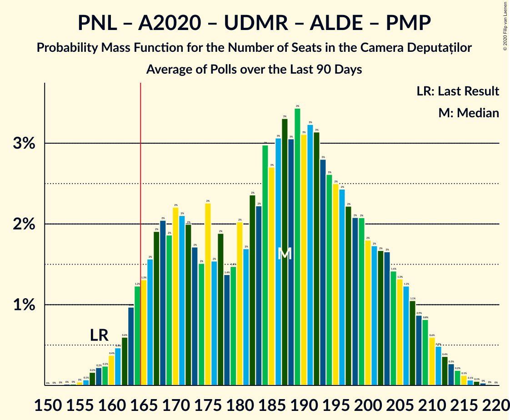

# Poll Average

<a href="#voting-intentions">Voting Intentions</a> | <a href="#seats">Seats</a> | <a href="#coalitions">Coalitions</a> | <a href="#technical-information">Technical Information</a>

## Summary

The table below lists the polls on which the average is based. They are the most recent polls (less than 90 days old) registered and analyzed so far.

| Period     | Polling firm/Commissioner(s) | PSD | PNL | A2020 | UDMR | ALDE | PMP | MIN | PRO |
|:----------:|:----------------------------:|:--:|:--:|:--:|:--:|:--:|:--:|:--:|:--:|
| 21 December 2016 | General Election | 45.5%   154 | 20.0%   69 | 8.9%   30 | 6.2%   21 | 5.6%   20 | 5.4%   18 | 5.0%   17 | 0.0%   0 |
| N/A | Poll Average | 19–30%   65–109 | 29–36%   98–126 | 12–20%   42–71 | 3–7%   10–24 | 2–6%   0–21 | 3–6%   0–21 | N/A   18 | 6–12%   20–43 |
| [6–26 August 2020](2020-08-26-IMAS.html) | IMAS   Europa FM | 18–23%   64–81 | 31–37%   106–127 | 16–21%   56–72 | 4–7%   15–25 | 2–4%   0 | 3–5%   0–18 | N/A   18 | 9–13%   30–44 |
| [29 July–5 August 2020](2020-08-05-CURS.html) | CURS | 25–31%   86–111 | 28–34%   96–121 | 12–16%   41–57 | 3–5%   10–18 | 4–6%   0–21 | 4–6%   0–22 | N/A   18 | 6–9%   19–30 |
| 21 December 2016 | General Election | 45.5%   154 | 20.0%   69 | 8.9%   30 | 6.2%   21 | 5.6%   20 | 5.4%   18 | 5.0%   17 | 0.0%   0 |

Only polls for which at least the sample size has been published are included in the table above.

**Legend:**
+ **Top half of each row:** Voting intentions (95% confidence interval)
+ **Bottom half of each row:** Seat projections for the Camera Deputaților (95% confidence interval)
+ **PSD:** Partidul Social Democrat
+ **PNL:** Partidul Național Liberal
+ **A2020:** Alianța 2020 USR-PLUS
+ **UDMR:** Uniunea Democrată Maghiară din România
+ **ALDE:** Partidul Alianța Liberalilor și Democraților
+ **PMP:** Partidul Mișcarea Populară
+ **MIN:** Parties of ethnic minorities
+ **PRO:** PRO România
+ **N/A (single party):** Party not included the published results
+ **N/A (entire row):** Calculation for this opinion poll not started yet

## Voting Intentions

### Confidence Intervals

| Party | Last Result | Median | 80% Confidence Interval | 90% Confidence Interval | 95% Confidence Interval | 99% Confidence Interval |
|:-----:|:-----------:|:------:|:-----------------------:|:-----------------------:|:-----------------------:|:-----------------------:|
| <a href="#partidul-social-democrat">Partidul Social Democrat</a> | 45.5% | 24.4% | 19.8–29.2% |19.2–29.8% | 18.8–30.3% | 18.0–31.2% |
| <a href="#partidul-național-liberal">Partidul Național Liberal</a> | 20.0% | 32.3% | 29.8–34.9% |29.2–35.5% | 28.8–36.1% | 27.8–37.1% |
| <a href="#alianța-2020-usr-plus">Alianța 2020 USR-PLUS</a> | 8.9% | 16.1% | 13.2–19.4% |12.7–20.0% | 12.4–20.4% | 11.7–21.3% |
| <a href="#uniunea-democrată-maghiară-din-românia">Uniunea Democrată Maghiară din România</a> | 6.2% | 4.9% | 3.6–6.4% |3.3–6.8% | 3.1–7.1% | 2.8–7.7% |
| <a href="#partidul-alianța-liberalilor-și-democraților">Partidul Alianța Liberalilor și Democraților</a> | 5.6% | 3.7% | 2.0–5.6% |1.9–6.0% | 1.7–6.2% | 1.5–6.7% |
| <a href="#partidul-mișcarea-populară">Partidul Mișcarea Populară</a> | 5.4% | 4.6% | 3.6–5.7% |3.4–6.0% | 3.2–6.2% | 2.8–6.7% |
| <a href="#parties-of-ethnic-minorities">Parties of ethnic minorities</a> | 5.0% | N/A | N/A |N/A | N/A | N/A |
| <a href="#pro-românia">PRO România</a> | 0.0% | 8.8% | 6.4–11.5% |6.1–11.9% | 5.9–12.3% | 5.4–13.0% |

### Partidul Social Democrat

*For a full overview of the results for this party, see the [Partidul Social Democrat](party-partidulsocialdemocrat.html) page.*

| Voting Intentions | Probability | Accumulated | Special Marks |
|:-----------------:|:-----------:|:-----------:|:-------------:|
| 15.5–16.5% | 0% | 100% |  |
| 16.5–17.5% | 0.2% | 100% |  |
| 17.5–18.5% | 1.5% | 99.8% |  |
| 18.5–19.5% | 6% | 98% |  |
| 19.5–20.5% | 13% | 92% |  |
| 20.5–21.5% | 15% | 79% |  |
| 21.5–22.5% | 10% | 64% |  |
| 22.5–23.5% | 4% | 55% |  |
| 23.5–24.5% | 1.0% | 51% | Median |
| 24.5–25.5% | 1.4% | 50% |  |
| 25.5–26.5% | 5% | 48% |  |
| 26.5–27.5% | 11% | 43% |  |
| 27.5–28.5% | 14% | 32% |  |
| 28.5–29.5% | 11% | 18% |  |
| 29.5–30.5% | 5% | 7% |  |
| 30.5–31.5% | 1.4% | 2% |  |
| 31.5–32.5% | 0.2% | 0.3% |  |
| 32.5–33.5% | 0% | 0% |  |
| 33.5–34.5% | 0% | 0% |  |
| 34.5–35.5% | 0% | 0% |  |
| 35.5–36.5% | 0% | 0% |  |
| 36.5–37.5% | 0% | 0% |  |
| 37.5–38.5% | 0% | 0% |  |
| 38.5–39.5% | 0% | 0% |  |
| 39.5–40.5% | 0% | 0% |  |
| 40.5–41.5% | 0% | 0% |  |
| 41.5–42.5% | 0% | 0% |  |
| 42.5–43.5% | 0% | 0% |  |
| 43.5–44.5% | 0% | 0% |  |
| 44.5–45.5% | 0% | 0% | Last Result |

### Partidul Național Liberal

*For a full overview of the results for this party, see the [Partidul Național Liberal](party-partidulnaționalliberal.html) page.*

| Voting Intentions | Probability | Accumulated | Special Marks |
|:-----------------:|:-----------:|:-----------:|:-------------:|
| 19.5–20.5% | 0% | 100% | Last Result |
| 20.5–21.5% | 0% | 100% |  |
| 21.5–22.5% | 0% | 100% |  |
| 22.5–23.5% | 0% | 100% |  |
| 23.5–24.5% | 0% | 100% |  |
| 24.5–25.5% | 0% | 100% |  |
| 25.5–26.5% | 0% | 100% |  |
| 26.5–27.5% | 0.3% | 100% |  |
| 27.5–28.5% | 2% | 99.7% |  |
| 28.5–29.5% | 6% | 98% |  |
| 29.5–30.5% | 12% | 93% |  |
| 30.5–31.5% | 17% | 81% |  |
| 31.5–32.5% | 19% | 64% | Median |
| 32.5–33.5% | 17% | 45% |  |
| 33.5–34.5% | 14% | 27% |  |
| 34.5–35.5% | 8% | 13% |  |
| 35.5–36.5% | 4% | 5% |  |
| 36.5–37.5% | 1.0% | 1.2% |  |
| 37.5–38.5% | 0.2% | 0.2% |  |
| 38.5–39.5% | 0% | 0% |  |

### Alianța 2020 USR-PLUS

*For a full overview of the results for this party, see the [Alianța 2020 USR-PLUS](party-alianța2020usr-plus.html) page.*

| Voting Intentions | Probability | Accumulated | Special Marks |
|:-----------------:|:-----------:|:-----------:|:-------------:|
| 8.5–9.5% | 0% | 100% | Last Result |
| 9.5–10.5% | 0% | 100% |  |
| 10.5–11.5% | 0.3% | 100% |  |
| 11.5–12.5% | 3% | 99.7% |  |
| 12.5–13.5% | 12% | 97% |  |
| 13.5–14.5% | 18% | 84% |  |
| 14.5–15.5% | 12% | 66% |  |
| 15.5–16.5% | 6% | 54% | Median |
| 16.5–17.5% | 10% | 47% |  |
| 17.5–18.5% | 16% | 38% |  |
| 18.5–19.5% | 14% | 22% |  |
| 19.5–20.5% | 6% | 8% |  |
| 20.5–21.5% | 2% | 2% |  |
| 21.5–22.5% | 0.3% | 0.3% |  |
| 22.5–23.5% | 0% | 0% |  |

### Uniunea Democrată Maghiară din România

*For a full overview of the results for this party, see the [Uniunea Democrată Maghiară din România](party-uniuneademocratămaghiarădinromânia.html) page.*

| Voting Intentions | Probability | Accumulated | Special Marks |
|:-----------------:|:-----------:|:-----------:|:-------------:|
| 1.5–2.5% | 0.1% | 100% |  |
| 2.5–3.5% | 9% | 99.9% |  |
| 3.5–4.5% | 32% | 91% |  |
| 4.5–5.5% | 26% | 59% | Median |
| 5.5–6.5% | 24% | 32% | Last Result |
| 6.5–7.5% | 7% | 8% |  |
| 7.5–8.5% | 0.7% | 0.7% |  |
| 8.5–9.5% | 0% | 0% |  |

### Partidul Alianța Liberalilor și Democraților

*For a full overview of the results for this party, see the [Partidul Alianța Liberalilor și Democraților](party-partidulalianțaliberalilorșidemocraților.html) page.*

| Voting Intentions | Probability | Accumulated | Special Marks |
|:-----------------:|:-----------:|:-----------:|:-------------:|
| 0.0–0.5% | 0% | 100% |  |
| 0.5–1.5% | 0.9% | 100% |  |
| 1.5–2.5% | 28% | 99.1% |  |
| 2.5–3.5% | 20% | 71% |  |
| 3.5–4.5% | 12% | 51% | Median |
| 4.5–5.5% | 27% | 39% |  |
| 5.5–6.5% | 11% | 12% | Last Result |
| 6.5–7.5% | 0.9% | 0.9% |  |
| 7.5–8.5% | 0% | 0% |  |

### Partidul Mișcarea Populară

*For a full overview of the results for this party, see the [Partidul Mișcarea Populară](party-partidulmișcareapopulară.html) page.*

| Voting Intentions | Probability | Accumulated | Special Marks |
|:-----------------:|:-----------:|:-----------:|:-------------:|
| 1.5–2.5% | 0.1% | 100% |  |
| 2.5–3.5% | 9% | 99.9% |  |
| 3.5–4.5% | 40% | 91% |  |
| 4.5–5.5% | 39% | 52% | Last Result, Median |
| 5.5–6.5% | 12% | 13% |  |
| 6.5–7.5% | 0.9% | 0.9% |  |
| 7.5–8.5% | 0% | 0% |  |

### PRO România

*For a full overview of the results for this party, see the [PRO România](party-proromânia.html) page.*

| Voting Intentions | Probability | Accumulated | Special Marks |
|:-----------------:|:-----------:|:-----------:|:-------------:|
| 0.0–0.5% | 0% | 100% | Last Result |
| 0.5–1.5% | 0% | 100% |  |
| 1.5–2.5% | 0% | 100% |  |
| 2.5–3.5% | 0% | 100% |  |
| 3.5–4.5% | 0% | 100% |  |
| 4.5–5.5% | 0.9% | 100% |  |
| 5.5–6.5% | 12% | 99.1% |  |
| 6.5–7.5% | 24% | 87% |  |
| 7.5–8.5% | 12% | 63% |  |
| 8.5–9.5% | 7% | 51% | Median |
| 9.5–10.5% | 17% | 44% |  |
| 10.5–11.5% | 18% | 27% |  |
| 11.5–12.5% | 7% | 9% |  |
| 12.5–13.5% | 1.4% | 2% |  |
| 13.5–14.5% | 0.1% | 0.1% |  |
| 14.5–15.5% | 0% | 0% |  |

## Seats

### Confidence Intervals

| Party | Last Result | Median | 80% Confidence Interval | 90% Confidence Interval | 95% Confidence Interval | 99% Confidence Interval |
|:-----:|:-----------:|:------:|:-----------------------:|:-----------------------:|:-----------------------:|:-----------------------:|
| <a href="#partidul-social-democrat">Partidul Social Democrat</a> | 154 | 84 | 69–103 |67–107 | 65–109 | 62–113 |
| <a href="#partidul-național-liberal">Partidul Național Liberal</a> | 69 | 113 | 102–122 |100–124 | 98–126 | 94–130 |
| <a href="#alianța-2020-usr-plus">Alianța 2020 USR-PLUS</a> | 30 | 57 | 45–67 |44–69 | 42–71 | 40–75 |
| <a href="#uniunea-democrată-maghiară-din-românia">Uniunea Democrată Maghiară din România</a> | 21 | 17 | 12–22 |11–23 | 10–24 | 9–26 |
| <a href="#partidul-alianța-liberalilor-și-democraților">Partidul Alianța Liberalilor și Democraților</a> | 20 | 0 | 0–19 |0–20 | 0–21 | 0–23 |
| <a href="#partidul-mișcarea-populară">Partidul Mișcarea Populară</a> | 18 | 0 | 0–19 |0–20 | 0–21 | 0–23 |
| <a href="#parties-of-ethnic-minorities">Parties of ethnic minorities</a> | 17 | 18 | 18 |18 | 18 | 18 |
| <a href="#pro-românia">PRO România</a> | 0 | 30 | 22–40 |21–41 | 20–43 | 18–45 |

### Partidul Social Democrat

*For a full overview of the results for this party, see the [Partidul Social Democrat](party-partidulsocialdemocrat.html) page.*

| Number of Seats | Probability | Accumulated | Special Marks |
|:---------------:|:-----------:|:-----------:|:-------------:|
| 59 | 0% | 100% |  |
| 60 | 0.1% | 99.9% |  |
| 61 | 0.2% | 99.8% |  |
| 62 | 0.3% | 99.6% |  |
| 63 | 0.5% | 99.3% |  |
| 64 | 0.8% | 98.8% |  |
| 65 | 1.0% | 98% |  |
| 66 | 2% | 97% |  |
| 67 | 2% | 95% |  |
| 68 | 3% | 94% |  |
| 69 | 3% | 91% |  |
| 70 | 3% | 88% |  |
| 71 | 4% | 85% |  |
| 72 | 5% | 81% |  |
| 73 | 4% | 76% |  |
| 74 | 4% | 72% |  |
| 75 | 4% | 68% |  |
| 76 | 4% | 64% |  |
| 77 | 3% | 60% |  |
| 78 | 3% | 58% |  |
| 79 | 2% | 55% |  |
| 80 | 1.2% | 53% |  |
| 81 | 1.0% | 52% |  |
| 82 | 0.5% | 51% |  |
| 83 | 0.4% | 51% |  |
| 84 | 0.4% | 50% | Median |
| 85 | 0.5% | 50% |  |
| 86 | 0.5% | 49% |  |
| 87 | 0.9% | 49% |  |
| 88 | 0.7% | 48% |  |
| 89 | 2% | 47% |  |
| 90 | 2% | 45% |  |
| 91 | 2% | 44% |  |
| 92 | 2% | 41% |  |
| 93 | 3% | 40% |  |
| 94 | 3% | 37% |  |
| 95 | 3% | 34% |  |
| 96 | 3% | 32% |  |
| 97 | 3% | 29% |  |
| 98 | 3% | 26% |  |
| 99 | 4% | 23% |  |
| 100 | 3% | 19% |  |
| 101 | 2% | 16% |  |
| 102 | 2% | 14% |  |
| 103 | 2% | 12% |  |
| 104 | 2% | 10% |  |
| 105 | 1.3% | 8% |  |
| 106 | 1.5% | 7% |  |
| 107 | 1.5% | 5% |  |
| 108 | 0.7% | 4% |  |
| 109 | 0.9% | 3% |  |
| 110 | 0.6% | 2% |  |
| 111 | 0.5% | 1.4% |  |
| 112 | 0.4% | 1.0% |  |
| 113 | 0.2% | 0.6% |  |
| 114 | 0.2% | 0.4% |  |
| 115 | 0.1% | 0.2% |  |
| 116 | 0% | 0.1% |  |
| 117 | 0.1% | 0.1% |  |
| 118 | 0% | 0% |  |
| 119 | 0% | 0% |  |
| 120 | 0% | 0% |  |
| 121 | 0% | 0% |  |
| 122 | 0% | 0% |  |
| 123 | 0% | 0% |  |
| 124 | 0% | 0% |  |
| 125 | 0% | 0% |  |
| 126 | 0% | 0% |  |
| 127 | 0% | 0% |  |
| 128 | 0% | 0% |  |
| 129 | 0% | 0% |  |
| 130 | 0% | 0% |  |
| 131 | 0% | 0% |  |
| 132 | 0% | 0% |  |
| 133 | 0% | 0% |  |
| 134 | 0% | 0% |  |
| 135 | 0% | 0% |  |
| 136 | 0% | 0% |  |
| 137 | 0% | 0% |  |
| 138 | 0% | 0% |  |
| 139 | 0% | 0% |  |
| 140 | 0% | 0% |  |
| 141 | 0% | 0% |  |
| 142 | 0% | 0% |  |
| 143 | 0% | 0% |  |
| 144 | 0% | 0% |  |
| 145 | 0% | 0% |  |
| 146 | 0% | 0% |  |
| 147 | 0% | 0% |  |
| 148 | 0% | 0% |  |
| 149 | 0% | 0% |  |
| 150 | 0% | 0% |  |
| 151 | 0% | 0% |  |
| 152 | 0% | 0% |  |
| 153 | 0% | 0% |  |
| 154 | 0% | 0% | Last Result |

### Partidul Național Liberal

*For a full overview of the results for this party, see the [Partidul Național Liberal](party-partidulnaționalliberal.html) page.*

| Number of Seats | Probability | Accumulated | Special Marks |
|:---------------:|:-----------:|:-----------:|:-------------:|
| 69 | 0% | 100% | Last Result |
| 70 | 0% | 100% |  |
| 71 | 0% | 100% |  |
| 72 | 0% | 100% |  |
| 73 | 0% | 100% |  |
| 74 | 0% | 100% |  |
| 75 | 0% | 100% |  |
| 76 | 0% | 100% |  |
| 77 | 0% | 100% |  |
| 78 | 0% | 100% |  |
| 79 | 0% | 100% |  |
| 80 | 0% | 100% |  |
| 81 | 0% | 100% |  |
| 82 | 0% | 100% |  |
| 83 | 0% | 100% |  |
| 84 | 0% | 100% |  |
| 85 | 0% | 100% |  |
| 86 | 0% | 100% |  |
| 87 | 0% | 100% |  |
| 88 | 0% | 100% |  |
| 89 | 0% | 100% |  |
| 90 | 0% | 100% |  |
| 91 | 0.1% | 99.9% |  |
| 92 | 0.1% | 99.9% |  |
| 93 | 0.2% | 99.8% |  |
| 94 | 0.3% | 99.6% |  |
| 95 | 0.5% | 99.3% |  |
| 96 | 0.4% | 98.9% |  |
| 97 | 0.6% | 98% |  |
| 98 | 0.9% | 98% |  |
| 99 | 1.4% | 97% |  |
| 100 | 1.4% | 96% |  |
| 101 | 2% | 94% |  |
| 102 | 2% | 92% |  |
| 103 | 2% | 89% |  |
| 104 | 2% | 87% |  |
| 105 | 3% | 85% |  |
| 106 | 4% | 82% |  |
| 107 | 3% | 78% |  |
| 108 | 3% | 75% |  |
| 109 | 4% | 72% |  |
| 110 | 4% | 68% |  |
| 111 | 5% | 63% |  |
| 112 | 4% | 58% |  |
| 113 | 6% | 54% | Median |
| 114 | 5% | 49% |  |
| 115 | 5% | 44% |  |
| 116 | 5% | 39% |  |
| 117 | 5% | 34% |  |
| 118 | 6% | 29% |  |
| 119 | 4% | 23% |  |
| 120 | 4% | 19% |  |
| 121 | 3% | 15% |  |
| 122 | 4% | 12% |  |
| 123 | 2% | 8% |  |
| 124 | 2% | 6% |  |
| 125 | 1.3% | 4% |  |
| 126 | 1.0% | 3% |  |
| 127 | 0.6% | 2% |  |
| 128 | 0.4% | 1.2% |  |
| 129 | 0.3% | 0.8% |  |
| 130 | 0.2% | 0.5% |  |
| 131 | 0.1% | 0.3% |  |
| 132 | 0.1% | 0.2% |  |
| 133 | 0% | 0.1% |  |
| 134 | 0% | 0.1% |  |
| 135 | 0% | 0% |  |

### Alianța 2020 USR-PLUS

*For a full overview of the results for this party, see the [Alianța 2020 USR-PLUS](party-alianța2020usr-plus.html) page.*

| Number of Seats | Probability | Accumulated | Special Marks |
|:---------------:|:-----------:|:-----------:|:-------------:|
| 30 | 0% | 100% | Last Result |
| 31 | 0% | 100% |  |
| 32 | 0% | 100% |  |
| 33 | 0% | 100% |  |
| 34 | 0% | 100% |  |
| 35 | 0% | 100% |  |
| 36 | 0% | 100% |  |
| 37 | 0.1% | 100% |  |
| 38 | 0.1% | 99.9% |  |
| 39 | 0.2% | 99.8% |  |
| 40 | 0.4% | 99.6% |  |
| 41 | 0.7% | 99.2% |  |
| 42 | 2% | 98% |  |
| 43 | 2% | 97% |  |
| 44 | 2% | 95% |  |
| 45 | 4% | 93% |  |
| 46 | 4% | 89% |  |
| 47 | 5% | 86% |  |
| 48 | 4% | 81% |  |
| 49 | 6% | 77% |  |
| 50 | 3% | 70% |  |
| 51 | 4% | 67% |  |
| 52 | 4% | 63% |  |
| 53 | 3% | 59% |  |
| 54 | 2% | 56% |  |
| 55 | 2% | 54% |  |
| 56 | 2% | 52% |  |
| 57 | 2% | 50% | Median |
| 58 | 3% | 48% |  |
| 59 | 2% | 45% |  |
| 60 | 3% | 43% |  |
| 61 | 6% | 40% |  |
| 62 | 3% | 34% |  |
| 63 | 6% | 31% |  |
| 64 | 5% | 25% |  |
| 65 | 2% | 20% |  |
| 66 | 7% | 18% |  |
| 67 | 3% | 12% |  |
| 68 | 2% | 9% |  |
| 69 | 3% | 7% |  |
| 70 | 1.4% | 5% |  |
| 71 | 1.1% | 3% |  |
| 72 | 1.1% | 2% |  |
| 73 | 0.4% | 1.1% |  |
| 74 | 0.2% | 0.8% |  |
| 75 | 0.3% | 0.5% |  |
| 76 | 0.1% | 0.2% |  |
| 77 | 0.1% | 0.1% |  |
| 78 | 0% | 0.1% |  |
| 79 | 0% | 0% |  |

### Uniunea Democrată Maghiară din România

*For a full overview of the results for this party, see the [Uniunea Democrată Maghiară din România](party-uniuneademocratămaghiarădinromânia.html) page.*

| Number of Seats | Probability | Accumulated | Special Marks |
|:---------------:|:-----------:|:-----------:|:-------------:|
| 8 | 0.1% | 100% |  |
| 9 | 0.6% | 99.9% |  |
| 10 | 2% | 99.3% |  |
| 11 | 5% | 97% |  |
| 12 | 7% | 93% |  |
| 13 | 8% | 85% |  |
| 14 | 9% | 78% |  |
| 15 | 8% | 69% |  |
| 16 | 8% | 60% |  |
| 17 | 7% | 52% | Median |
| 18 | 9% | 45% |  |
| 19 | 9% | 36% |  |
| 20 | 7% | 27% |  |
| 21 | 8% | 21% | Last Result |
| 22 | 5% | 13% |  |
| 23 | 3% | 8% |  |
| 24 | 2% | 5% |  |
| 25 | 1.2% | 2% |  |
| 26 | 0.6% | 1.1% |  |
| 27 | 0.3% | 0.5% |  |
| 28 | 0.1% | 0.2% |  |
| 29 | 0% | 0.1% |  |
| 30 | 0% | 0% |  |

### Partidul Alianța Liberalilor și Democraților

*For a full overview of the results for this party, see the [Partidul Alianța Liberalilor și Democraților](party-partidulalianțaliberalilorșidemocraților.html) page.*

| Number of Seats | Probability | Accumulated | Special Marks |
|:---------------:|:-----------:|:-----------:|:-------------:|
| 0 | 74% | 100% | Median |
| 1 | 0% | 26% |  |
| 2 | 0% | 26% |  |
| 3 | 0% | 26% |  |
| 4 | 0% | 26% |  |
| 5 | 0% | 26% |  |
| 6 | 0% | 26% |  |
| 7 | 0% | 26% |  |
| 8 | 0% | 26% |  |
| 9 | 0% | 26% |  |
| 10 | 0% | 26% |  |
| 11 | 0% | 26% |  |
| 12 | 0% | 26% |  |
| 13 | 0% | 26% |  |
| 14 | 0% | 26% |  |
| 15 | 0% | 26% |  |
| 16 | 0.8% | 26% |  |
| 17 | 7% | 25% |  |
| 18 | 7% | 18% |  |
| 19 | 4% | 11% |  |
| 20 | 4% | 7% | Last Result |
| 21 | 2% | 3% |  |
| 22 | 0.6% | 1.1% |  |
| 23 | 0.3% | 0.6% |  |
| 24 | 0.2% | 0.2% |  |
| 25 | 0.1% | 0.1% |  |
| 26 | 0% | 0% |  |

### Partidul Mișcarea Populară

*For a full overview of the results for this party, see the [Partidul Mișcarea Populară](party-partidulmișcareapopulară.html) page.*

| Number of Seats | Probability | Accumulated | Special Marks |
|:---------------:|:-----------:|:-----------:|:-------------:|
| 0 | 72% | 100% | Median |
| 1 | 0% | 28% |  |
| 2 | 0% | 28% |  |
| 3 | 0% | 28% |  |
| 4 | 0% | 28% |  |
| 5 | 0% | 28% |  |
| 6 | 0% | 28% |  |
| 7 | 0% | 28% |  |
| 8 | 0% | 28% |  |
| 9 | 0% | 28% |  |
| 10 | 0% | 28% |  |
| 11 | 0% | 28% |  |
| 12 | 0% | 28% |  |
| 13 | 0% | 28% |  |
| 14 | 0% | 28% |  |
| 15 | 0% | 28% |  |
| 16 | 0.8% | 28% |  |
| 17 | 7% | 27% |  |
| 18 | 9% | 20% | Last Result |
| 19 | 5% | 12% |  |
| 20 | 3% | 6% |  |
| 21 | 2% | 3% |  |
| 22 | 0.8% | 1.5% |  |
| 23 | 0.5% | 0.7% |  |
| 24 | 0.2% | 0.2% |  |
| 25 | 0% | 0.1% |  |
| 26 | 0% | 0% |  |

### Parties of ethnic minorities

*For a full overview of the results for this party, see the [Parties of ethnic minorities](party-partiesofethnicminorities.html) page.*

| Number of Seats | Probability | Accumulated | Special Marks |
|:---------------:|:-----------:|:-----------:|:-------------:|
| 17 | 0% | 100% | Last Result |
| 18 | 100% | 100% | Median |

### PRO România

*For a full overview of the results for this party, see the [PRO România](party-proromânia.html) page.*

| Number of Seats | Probability | Accumulated | Special Marks |
|:---------------:|:-----------:|:-----------:|:-------------:|
| 0 | 0.1% | 100% | Last Result |
| 1 | 0% | 99.9% |  |
| 2 | 0% | 99.9% |  |
| 3 | 0% | 99.9% |  |
| 4 | 0% | 99.9% |  |
| 5 | 0% | 99.9% |  |
| 6 | 0% | 99.9% |  |
| 7 | 0% | 99.9% |  |
| 8 | 0% | 99.9% |  |
| 9 | 0% | 99.9% |  |
| 10 | 0% | 99.9% |  |
| 11 | 0% | 99.9% |  |
| 12 | 0% | 99.9% |  |
| 13 | 0% | 99.9% |  |
| 14 | 0% | 99.9% |  |
| 15 | 0% | 99.9% |  |
| 16 | 0% | 99.9% |  |
| 17 | 0.2% | 99.9% |  |
| 18 | 0.5% | 99.7% |  |
| 19 | 0.9% | 99.2% |  |
| 20 | 3% | 98% |  |
| 21 | 4% | 96% |  |
| 22 | 5% | 92% |  |
| 23 | 8% | 87% |  |
| 24 | 6% | 79% |  |
| 25 | 7% | 74% |  |
| 26 | 6% | 67% |  |
| 27 | 4% | 61% |  |
| 28 | 3% | 56% |  |
| 29 | 2% | 54% |  |
| 30 | 2% | 52% | Median |
| 31 | 2% | 50% |  |
| 32 | 2% | 48% |  |
| 33 | 3% | 46% |  |
| 34 | 4% | 42% |  |
| 35 | 5% | 38% |  |
| 36 | 5% | 33% |  |
| 37 | 6% | 28% |  |
| 38 | 6% | 21% |  |
| 39 | 5% | 15% |  |
| 40 | 3% | 11% |  |
| 41 | 3% | 7% |  |
| 42 | 2% | 5% |  |
| 43 | 1.1% | 3% |  |
| 44 | 0.7% | 2% |  |
| 45 | 0.4% | 0.8% |  |
| 46 | 0.2% | 0.4% |  |
| 47 | 0.1% | 0.2% |  |
| 48 | 0.1% | 0.1% |  |
| 49 | 0% | 0% |  |

## Coalitions

### Confidence Intervals

| Coalition | Last Result | Median | Majority? | 80% Confidence Interval | 90% Confidence Interval | 95% Confidence Interval | 99% Confidence Interval |
|:---------:|:-----------:|:------:|:---------:|:-----------------------:|:-----------------------:|:-----------------------:|:-----------------------:|
| Partidul Național Liberal – Alianța 2020 USR-PLUS – Uniunea Democrată Maghiară din România – Partidul Alianța Liberalilor și Democraților – Partidul Mișcarea Populară | 158 | 197 | 100% | 183–207 | 180–209 | 177–211 | 173–215 |
| Partidul Național Liberal – Alianța 2020 USR-PLUS – Uniunea Democrată Maghiară din România – Partidul Mișcarea Populară | 138 | 194 | 98% | 173–207 | 170–209 | 167–211 | 162–215 |
| Partidul Național Liberal – Alianța 2020 USR-PLUS – Uniunea Democrată Maghiară din România – Partidul Alianța Liberalilor și Democraților | 140 | 193 | 98% | 173–206 | 169–208 | 167–210 | 163–213 |
| Partidul Național Liberal – Alianța 2020 USR-PLUS – Uniunea Democrată Maghiară din România | 120 | 188 | 86% | 163–206 | 159–208 | 157–210 | 153–213 |
| Partidul Național Liberal – Alianța 2020 USR-PLUS – Partidul Alianța Liberalilor și Democraților – Partidul Mișcarea Populară | 137 | 180 | 94% | 169–188 | 165–190 | 162–193 | 158–196 |
| Partidul Național Liberal – Alianța 2020 USR-PLUS – Partidul Mișcarea Populară | 117 | 176 | 76% | 159–187 | 156–189 | 153–192 | 148–196 |
| Partidul Național Liberal – Alianța 2020 USR-PLUS – Partidul Alianța Liberalilor și Democraților | 119 | 176 | 77% | 160–186 | 156–187 | 153–190 | 148–194 |
| Partidul Național Liberal – Alianța 2020 USR-PLUS | 99 | 171 | 58% | 150–186 | 146–187 | 144–190 | 140–194 |
| Partidul Național Liberal – Uniunea Democrată Maghiară din România – Partidul Alianța Liberalilor și Democraților – Partidul Mișcarea Populară | 128 | 139 | 0% | 130–150 | 127–153 | 126–156 | 122–160 |
| Partidul Național Liberal – Uniunea Democrată Maghiară din România – Partidul Mișcarea Populară | 108 | 136 | 0% | 124–145 | 120–147 | 118–150 | 113–154 |
| Partidul Național Liberal – Uniunea Democrată Maghiară din România – Partidul Alianța Liberalilor și Democraților | 110 | 135 | 0% | 124–144 | 120–146 | 118–148 | 114–151 |
| Partidul Național Liberal – Uniunea Democrată Maghiară din România | 90 | 131 | 0% | 116–142 | 113–144 | 111–146 | 107–150 |
| Partidul Social Democrat – Partidul Alianța Liberalilor și Democraților – PRO România | 174 | 118 | 0% | 105–139 | 103–142 | 101–145 | 97–150 |
| Partidul Social Democrat – PRO România | 154 | 115 | 0% | 105–129 | 103–132 | 101–135 | 97–139 |
| Partidul Național Liberal – Partidul Mișcarea Populară | 87 | 118 | 0% | 109–127 | 106–130 | 104–133 | 100–137 |
| Partidul Național Liberal | 69 | 113 | 0% | 102–122 | 100–124 | 98–126 | 94–130 |
| Partidul Social Democrat – Partidul Alianța Liberalilor și Democraților | 174 | 86 | 0% | 69–115 | 67–118 | 65–121 | 62–125 |
| Alianța 2020 USR-PLUS – Partidul Mișcarea Populară | 48 | 63 | 0% | 49–71 | 47–74 | 45–78 | 42–83 |

### Partidul Național Liberal – Alianța 2020 USR-PLUS – Uniunea Democrată Maghiară din România – Partidul Alianța Liberalilor și Democraților – Partidul Mișcarea Populară

| Number of Seats | Probability | Accumulated | Special Marks |
|:---------------:|:-----------:|:-----------:|:-------------:|
| 158 | 0% | 100% | Last Result |
| 159 | 0% | 100% |  |
| 160 | 0% | 100% |  |
| 161 | 0% | 100% |  |
| 162 | 0% | 100% |  |
| 163 | 0% | 100% |  |
| 164 | 0% | 100% |  |
| 165 | 0% | 100% |  |
| 166 | 0% | 100% | Majority |
| 167 | 0% | 100% |  |
| 168 | 0% | 100% |  |
| 169 | 0% | 100% |  |
| 170 | 0% | 99.9% |  |
| 171 | 0.2% | 99.9% |  |
| 172 | 0.1% | 99.7% |  |
| 173 | 0.2% | 99.6% |  |
| 174 | 0.3% | 99.4% |  |
| 175 | 0.4% | 99.1% |  |
| 176 | 0.6% | 98.6% |  |
| 177 | 0.6% | 98% |  |
| 178 | 0.8% | 97% |  |
| 179 | 1.2% | 97% |  |
| 180 | 1.1% | 95% |  |
| 181 | 1.0% | 94% |  |
| 182 | 2% | 93% |  |
| 183 | 2% | 92% |  |
| 184 | 2% | 90% |  |
| 185 | 2% | 88% |  |
| 186 | 2% | 86% |  |
| 187 | 2% | 84% | Median |
| 188 | 3% | 82% |  |
| 189 | 3% | 79% |  |
| 190 | 3% | 76% |  |
| 191 | 3% | 73% |  |
| 192 | 3% | 71% |  |
| 193 | 4% | 68% |  |
| 194 | 4% | 64% |  |
| 195 | 4% | 60% |  |
| 196 | 4% | 56% |  |
| 197 | 5% | 52% |  |
| 198 | 4% | 47% |  |
| 199 | 5% | 44% |  |
| 200 | 4% | 39% |  |
| 201 | 5% | 35% |  |
| 202 | 4% | 31% |  |
| 203 | 4% | 26% |  |
| 204 | 5% | 23% |  |
| 205 | 4% | 18% |  |
| 206 | 3% | 14% |  |
| 207 | 3% | 11% |  |
| 208 | 2% | 8% |  |
| 209 | 2% | 6% |  |
| 210 | 1.1% | 4% |  |
| 211 | 0.9% | 3% |  |
| 212 | 0.7% | 2% |  |
| 213 | 0.5% | 2% |  |
| 214 | 0.4% | 1.1% |  |
| 215 | 0.3% | 0.7% |  |
| 216 | 0.2% | 0.5% |  |
| 217 | 0.1% | 0.3% |  |
| 218 | 0.1% | 0.1% |  |
| 219 | 0% | 0.1% |  |
| 220 | 0% | 0% |  |

### Partidul Național Liberal – Alianța 2020 USR-PLUS – Uniunea Democrată Maghiară din România – Partidul Mișcarea Populară

| Number of Seats | Probability | Accumulated | Special Marks |
|:---------------:|:-----------:|:-----------:|:-------------:|
| 138 | 0% | 100% | Last Result |
| 139 | 0% | 100% |  |
| 140 | 0% | 100% |  |
| 141 | 0% | 100% |  |
| 142 | 0% | 100% |  |
| 143 | 0% | 100% |  |
| 144 | 0% | 100% |  |
| 145 | 0% | 100% |  |
| 146 | 0% | 100% |  |
| 147 | 0% | 100% |  |
| 148 | 0% | 100% |  |
| 149 | 0% | 100% |  |
| 150 | 0% | 100% |  |
| 151 | 0% | 100% |  |
| 152 | 0% | 100% |  |
| 153 | 0% | 100% |  |
| 154 | 0% | 100% |  |
| 155 | 0% | 100% |  |
| 156 | 0% | 100% |  |
| 157 | 0% | 100% |  |
| 158 | 0% | 100% |  |
| 159 | 0.1% | 99.9% |  |
| 160 | 0.1% | 99.8% |  |
| 161 | 0.1% | 99.8% |  |
| 162 | 0.2% | 99.6% |  |
| 163 | 0.4% | 99.5% |  |
| 164 | 0.4% | 99.1% |  |
| 165 | 0.5% | 98.7% |  |
| 166 | 0.5% | 98% | Majority |
| 167 | 0.7% | 98% |  |
| 168 | 1.0% | 97% |  |
| 169 | 0.9% | 96% |  |
| 170 | 1.4% | 95% |  |
| 171 | 1.1% | 94% |  |
| 172 | 2% | 93% |  |
| 173 | 1.2% | 90% |  |
| 174 | 2% | 89% |  |
| 175 | 2% | 87% |  |
| 176 | 2% | 85% |  |
| 177 | 2% | 83% |  |
| 178 | 2% | 81% |  |
| 179 | 3% | 79% |  |
| 180 | 2% | 76% |  |
| 181 | 2% | 74% |  |
| 182 | 2% | 72% |  |
| 183 | 2% | 69% |  |
| 184 | 2% | 67% |  |
| 185 | 2% | 65% |  |
| 186 | 2% | 63% |  |
| 187 | 2% | 61% | Median |
| 188 | 2% | 60% |  |
| 189 | 1.2% | 58% |  |
| 190 | 2% | 57% |  |
| 191 | 1.4% | 55% |  |
| 192 | 1.3% | 54% |  |
| 193 | 2% | 52% |  |
| 194 | 2% | 51% |  |
| 195 | 3% | 49% |  |
| 196 | 2% | 46% |  |
| 197 | 4% | 44% |  |
| 198 | 3% | 41% |  |
| 199 | 3% | 38% |  |
| 200 | 3% | 35% |  |
| 201 | 4% | 32% |  |
| 202 | 4% | 28% |  |
| 203 | 3% | 25% |  |
| 204 | 4% | 21% |  |
| 205 | 4% | 17% |  |
| 206 | 3% | 14% |  |
| 207 | 3% | 11% |  |
| 208 | 2% | 8% |  |
| 209 | 2% | 6% |  |
| 210 | 1.1% | 4% |  |
| 211 | 0.8% | 3% |  |
| 212 | 0.7% | 2% |  |
| 213 | 0.5% | 2% |  |
| 214 | 0.4% | 1.1% |  |
| 215 | 0.3% | 0.7% |  |
| 216 | 0.2% | 0.4% |  |
| 217 | 0.1% | 0.3% |  |
| 218 | 0.1% | 0.1% |  |
| 219 | 0% | 0.1% |  |
| 220 | 0% | 0% |  |

### Partidul Național Liberal – Alianța 2020 USR-PLUS – Uniunea Democrată Maghiară din România – Partidul Alianța Liberalilor și Democraților

| Number of Seats | Probability | Accumulated | Special Marks |
|:---------------:|:-----------:|:-----------:|:-------------:|
| 140 | 0% | 100% | Last Result |
| 141 | 0% | 100% |  |
| 142 | 0% | 100% |  |
| 143 | 0% | 100% |  |
| 144 | 0% | 100% |  |
| 145 | 0% | 100% |  |
| 146 | 0% | 100% |  |
| 147 | 0% | 100% |  |
| 148 | 0% | 100% |  |
| 149 | 0% | 100% |  |
| 150 | 0% | 100% |  |
| 151 | 0% | 100% |  |
| 152 | 0% | 100% |  |
| 153 | 0% | 100% |  |
| 154 | 0% | 100% |  |
| 155 | 0% | 100% |  |
| 156 | 0% | 100% |  |
| 157 | 0% | 100% |  |
| 158 | 0% | 100% |  |
| 159 | 0.1% | 99.9% |  |
| 160 | 0.1% | 99.9% |  |
| 161 | 0.2% | 99.8% |  |
| 162 | 0.1% | 99.6% |  |
| 163 | 0.3% | 99.5% |  |
| 164 | 0.3% | 99.2% |  |
| 165 | 0.7% | 98.9% |  |
| 166 | 0.4% | 98% | Majority |
| 167 | 0.8% | 98% |  |
| 168 | 0.7% | 97% |  |
| 169 | 1.3% | 96% |  |
| 170 | 1.1% | 95% |  |
| 171 | 1.0% | 94% |  |
| 172 | 1.4% | 93% |  |
| 173 | 2% | 91% |  |
| 174 | 2% | 90% |  |
| 175 | 2% | 88% |  |
| 176 | 2% | 86% |  |
| 177 | 2% | 84% |  |
| 178 | 2% | 82% |  |
| 179 | 3% | 80% |  |
| 180 | 2% | 77% |  |
| 181 | 2% | 75% |  |
| 182 | 2% | 73% |  |
| 183 | 3% | 71% |  |
| 184 | 2% | 68% |  |
| 185 | 2% | 67% |  |
| 186 | 2% | 65% |  |
| 187 | 2% | 63% | Median |
| 188 | 2% | 61% |  |
| 189 | 2% | 59% |  |
| 190 | 2% | 56% |  |
| 191 | 2% | 54% |  |
| 192 | 2% | 52% |  |
| 193 | 3% | 51% |  |
| 194 | 2% | 48% |  |
| 195 | 3% | 46% |  |
| 196 | 2% | 43% |  |
| 197 | 4% | 41% |  |
| 198 | 3% | 37% |  |
| 199 | 3% | 34% |  |
| 200 | 3% | 31% |  |
| 201 | 4% | 28% |  |
| 202 | 4% | 25% |  |
| 203 | 3% | 21% |  |
| 204 | 4% | 18% |  |
| 205 | 3% | 14% |  |
| 206 | 2% | 10% |  |
| 207 | 3% | 8% |  |
| 208 | 1.4% | 5% |  |
| 209 | 1.3% | 4% |  |
| 210 | 0.8% | 3% |  |
| 211 | 0.6% | 2% |  |
| 212 | 0.4% | 1.2% |  |
| 213 | 0.3% | 0.8% |  |
| 214 | 0.2% | 0.5% |  |
| 215 | 0.1% | 0.3% |  |
| 216 | 0.1% | 0.1% |  |
| 217 | 0% | 0.1% |  |
| 218 | 0% | 0% |  |

### Partidul Național Liberal – Alianța 2020 USR-PLUS – Uniunea Democrată Maghiară din România

| Number of Seats | Probability | Accumulated | Special Marks |
|:---------------:|:-----------:|:-----------:|:-------------:|
| 120 | 0% | 100% | Last Result |
| 121 | 0% | 100% |  |
| 122 | 0% | 100% |  |
| 123 | 0% | 100% |  |
| 124 | 0% | 100% |  |
| 125 | 0% | 100% |  |
| 126 | 0% | 100% |  |
| 127 | 0% | 100% |  |
| 128 | 0% | 100% |  |
| 129 | 0% | 100% |  |
| 130 | 0% | 100% |  |
| 131 | 0% | 100% |  |
| 132 | 0% | 100% |  |
| 133 | 0% | 100% |  |
| 134 | 0% | 100% |  |
| 135 | 0% | 100% |  |
| 136 | 0% | 100% |  |
| 137 | 0% | 100% |  |
| 138 | 0% | 100% |  |
| 139 | 0% | 100% |  |
| 140 | 0% | 100% |  |
| 141 | 0% | 100% |  |
| 142 | 0% | 100% |  |
| 143 | 0% | 100% |  |
| 144 | 0% | 100% |  |
| 145 | 0% | 100% |  |
| 146 | 0% | 100% |  |
| 147 | 0% | 100% |  |
| 148 | 0% | 100% |  |
| 149 | 0% | 99.9% |  |
| 150 | 0.1% | 99.9% |  |
| 151 | 0.1% | 99.8% |  |
| 152 | 0.2% | 99.7% |  |
| 153 | 0.3% | 99.6% |  |
| 154 | 0.3% | 99.3% |  |
| 155 | 0.5% | 98.9% |  |
| 156 | 0.6% | 98% |  |
| 157 | 0.9% | 98% |  |
| 158 | 0.8% | 97% |  |
| 159 | 2% | 96% |  |
| 160 | 1.0% | 94% |  |
| 161 | 1.3% | 93% |  |
| 162 | 1.4% | 92% |  |
| 163 | 2% | 91% |  |
| 164 | 1.4% | 89% |  |
| 165 | 2% | 88% |  |
| 166 | 2% | 86% | Majority |
| 167 | 2% | 84% |  |
| 168 | 2% | 82% |  |
| 169 | 2% | 81% |  |
| 170 | 2% | 78% |  |
| 171 | 2% | 76% |  |
| 172 | 3% | 74% |  |
| 173 | 2% | 72% |  |
| 174 | 2% | 70% |  |
| 175 | 3% | 68% |  |
| 176 | 1.4% | 65% |  |
| 177 | 1.4% | 64% |  |
| 178 | 2% | 62% |  |
| 179 | 2% | 61% |  |
| 180 | 1.2% | 59% |  |
| 181 | 0.9% | 58% |  |
| 182 | 1.4% | 57% |  |
| 183 | 1.2% | 56% |  |
| 184 | 0.8% | 54% |  |
| 185 | 1.3% | 54% |  |
| 186 | 0.7% | 52% |  |
| 187 | 1.1% | 52% | Median |
| 188 | 0.8% | 51% |  |
| 189 | 0.9% | 50% |  |
| 190 | 1.0% | 49% |  |
| 191 | 0.8% | 48% |  |
| 192 | 0.9% | 47% |  |
| 193 | 1.3% | 46% |  |
| 194 | 1.1% | 45% |  |
| 195 | 3% | 44% |  |
| 196 | 2% | 41% |  |
| 197 | 3% | 40% |  |
| 198 | 2% | 36% |  |
| 199 | 3% | 34% |  |
| 200 | 3% | 31% |  |
| 201 | 3% | 28% |  |
| 202 | 4% | 25% |  |
| 203 | 3% | 21% |  |
| 204 | 4% | 18% |  |
| 205 | 3% | 14% |  |
| 206 | 2% | 10% |  |
| 207 | 3% | 8% |  |
| 208 | 1.4% | 5% |  |
| 209 | 1.3% | 4% |  |
| 210 | 0.8% | 3% |  |
| 211 | 0.6% | 2% |  |
| 212 | 0.4% | 1.2% |  |
| 213 | 0.3% | 0.8% |  |
| 214 | 0.2% | 0.5% |  |
| 215 | 0.1% | 0.3% |  |
| 216 | 0.1% | 0.1% |  |
| 217 | 0% | 0.1% |  |
| 218 | 0% | 0% |  |

### Partidul Național Liberal – Alianța 2020 USR-PLUS – Partidul Alianța Liberalilor și Democraților – Partidul Mișcarea Populară

| Number of Seats | Probability | Accumulated | Special Marks |
|:---------------:|:-----------:|:-----------:|:-------------:|
| 137 | 0% | 100% | Last Result |
| 138 | 0% | 100% |  |
| 139 | 0% | 100% |  |
| 140 | 0% | 100% |  |
| 141 | 0% | 100% |  |
| 142 | 0% | 100% |  |
| 143 | 0% | 100% |  |
| 144 | 0% | 100% |  |
| 145 | 0% | 100% |  |
| 146 | 0% | 100% |  |
| 147 | 0% | 100% |  |
| 148 | 0% | 100% |  |
| 149 | 0% | 100% |  |
| 150 | 0% | 100% |  |
| 151 | 0% | 100% |  |
| 152 | 0% | 100% |  |
| 153 | 0% | 100% |  |
| 154 | 0% | 99.9% |  |
| 155 | 0.1% | 99.9% |  |
| 156 | 0.2% | 99.8% |  |
| 157 | 0.1% | 99.7% |  |
| 158 | 0.2% | 99.6% |  |
| 159 | 0.2% | 99.4% |  |
| 160 | 0.6% | 99.1% |  |
| 161 | 0.4% | 98% |  |
| 162 | 0.8% | 98% |  |
| 163 | 0.6% | 97% |  |
| 164 | 1.3% | 97% |  |
| 165 | 1.0% | 95% |  |
| 166 | 1.2% | 94% | Majority |
| 167 | 1.2% | 93% |  |
| 168 | 2% | 92% |  |
| 169 | 1.5% | 90% |  |
| 170 | 2% | 89% | Median |
| 171 | 2% | 87% |  |
| 172 | 2% | 85% |  |
| 173 | 3% | 83% |  |
| 174 | 3% | 80% |  |
| 175 | 5% | 76% |  |
| 176 | 5% | 71% |  |
| 177 | 5% | 66% |  |
| 178 | 5% | 61% |  |
| 179 | 6% | 56% |  |
| 180 | 4% | 50% |  |
| 181 | 4% | 46% |  |
| 182 | 5% | 42% |  |
| 183 | 5% | 37% |  |
| 184 | 7% | 32% |  |
| 185 | 5% | 25% |  |
| 186 | 5% | 20% |  |
| 187 | 4% | 15% |  |
| 188 | 3% | 11% |  |
| 189 | 2% | 8% |  |
| 190 | 1.4% | 6% |  |
| 191 | 1.1% | 5% |  |
| 192 | 0.8% | 4% |  |
| 193 | 0.6% | 3% |  |
| 194 | 0.6% | 2% |  |
| 195 | 0.7% | 2% |  |
| 196 | 0.4% | 0.8% |  |
| 197 | 0.2% | 0.5% |  |
| 198 | 0.2% | 0.3% |  |
| 199 | 0.1% | 0.2% |  |
| 200 | 0% | 0.1% |  |
| 201 | 0% | 0.1% |  |
| 202 | 0% | 0% |  |

### Partidul Național Liberal – Alianța 2020 USR-PLUS – Partidul Mișcarea Populară

| Number of Seats | Probability | Accumulated | Special Marks |
|:---------------:|:-----------:|:-----------:|:-------------:|
| 117 | 0% | 100% | Last Result |
| 118 | 0% | 100% |  |
| 119 | 0% | 100% |  |
| 120 | 0% | 100% |  |
| 121 | 0% | 100% |  |
| 122 | 0% | 100% |  |
| 123 | 0% | 100% |  |
| 124 | 0% | 100% |  |
| 125 | 0% | 100% |  |
| 126 | 0% | 100% |  |
| 127 | 0% | 100% |  |
| 128 | 0% | 100% |  |
| 129 | 0% | 100% |  |
| 130 | 0% | 100% |  |
| 131 | 0% | 100% |  |
| 132 | 0% | 100% |  |
| 133 | 0% | 100% |  |
| 134 | 0% | 100% |  |
| 135 | 0% | 100% |  |
| 136 | 0% | 100% |  |
| 137 | 0% | 100% |  |
| 138 | 0% | 100% |  |
| 139 | 0% | 100% |  |
| 140 | 0% | 100% |  |
| 141 | 0% | 100% |  |
| 142 | 0% | 100% |  |
| 143 | 0% | 100% |  |
| 144 | 0% | 100% |  |
| 145 | 0.1% | 99.9% |  |
| 146 | 0.1% | 99.9% |  |
| 147 | 0.1% | 99.8% |  |
| 148 | 0.2% | 99.7% |  |
| 149 | 0.4% | 99.5% |  |
| 150 | 0.3% | 99.1% |  |
| 151 | 0.4% | 98.8% |  |
| 152 | 0.8% | 98% |  |
| 153 | 0.8% | 98% |  |
| 154 | 0.5% | 97% |  |
| 155 | 1.2% | 96% |  |
| 156 | 1.2% | 95% |  |
| 157 | 1.2% | 94% |  |
| 158 | 1.5% | 93% |  |
| 159 | 2% | 91% |  |
| 160 | 1.2% | 89% |  |
| 161 | 3% | 88% |  |
| 162 | 2% | 85% |  |
| 163 | 2% | 83% |  |
| 164 | 3% | 81% |  |
| 165 | 2% | 79% |  |
| 166 | 2% | 76% | Majority |
| 167 | 2% | 74% |  |
| 168 | 3% | 72% |  |
| 169 | 2% | 69% |  |
| 170 | 2% | 67% | Median |
| 171 | 2% | 65% |  |
| 172 | 2% | 62% |  |
| 173 | 2% | 60% |  |
| 174 | 3% | 58% |  |
| 175 | 4% | 55% |  |
| 176 | 4% | 52% |  |
| 177 | 4% | 47% |  |
| 178 | 4% | 43% |  |
| 179 | 3% | 40% |  |
| 180 | 3% | 36% |  |
| 181 | 2% | 34% |  |
| 182 | 3% | 31% |  |
| 183 | 4% | 28% |  |
| 184 | 5% | 24% |  |
| 185 | 4% | 19% |  |
| 186 | 4% | 15% |  |
| 187 | 3% | 11% |  |
| 188 | 2% | 8% |  |
| 189 | 1.0% | 5% |  |
| 190 | 0.9% | 4% |  |
| 191 | 0.7% | 3% |  |
| 192 | 0.5% | 3% |  |
| 193 | 0.5% | 2% |  |
| 194 | 0.5% | 2% |  |
| 195 | 0.6% | 1.3% |  |
| 196 | 0.3% | 0.7% |  |
| 197 | 0.2% | 0.4% |  |
| 198 | 0.1% | 0.3% |  |
| 199 | 0.1% | 0.1% |  |
| 200 | 0% | 0.1% |  |
| 201 | 0% | 0% |  |

### Partidul Național Liberal – Alianța 2020 USR-PLUS – Partidul Alianța Liberalilor și Democraților

| Number of Seats | Probability | Accumulated | Special Marks |
|:---------------:|:-----------:|:-----------:|:-------------:|
| 119 | 0% | 100% | Last Result |
| 120 | 0% | 100% |  |
| 121 | 0% | 100% |  |
| 122 | 0% | 100% |  |
| 123 | 0% | 100% |  |
| 124 | 0% | 100% |  |
| 125 | 0% | 100% |  |
| 126 | 0% | 100% |  |
| 127 | 0% | 100% |  |
| 128 | 0% | 100% |  |
| 129 | 0% | 100% |  |
| 130 | 0% | 100% |  |
| 131 | 0% | 100% |  |
| 132 | 0% | 100% |  |
| 133 | 0% | 100% |  |
| 134 | 0% | 100% |  |
| 135 | 0% | 100% |  |
| 136 | 0% | 100% |  |
| 137 | 0% | 100% |  |
| 138 | 0% | 100% |  |
| 139 | 0% | 100% |  |
| 140 | 0% | 100% |  |
| 141 | 0% | 100% |  |
| 142 | 0% | 100% |  |
| 143 | 0% | 100% |  |
| 144 | 0% | 100% |  |
| 145 | 0.1% | 99.9% |  |
| 146 | 0.1% | 99.9% |  |
| 147 | 0.1% | 99.8% |  |
| 148 | 0.2% | 99.7% |  |
| 149 | 0.3% | 99.4% |  |
| 150 | 0.2% | 99.1% |  |
| 151 | 0.4% | 98.9% |  |
| 152 | 0.9% | 98% |  |
| 153 | 0.5% | 98% |  |
| 154 | 1.0% | 97% |  |
| 155 | 1.1% | 96% |  |
| 156 | 0.9% | 95% |  |
| 157 | 1.3% | 94% |  |
| 158 | 1.4% | 93% |  |
| 159 | 1.3% | 91% |  |
| 160 | 2% | 90% |  |
| 161 | 1.4% | 88% |  |
| 162 | 2% | 87% |  |
| 163 | 2% | 84% |  |
| 164 | 3% | 82% |  |
| 165 | 2% | 79% |  |
| 166 | 3% | 77% | Majority |
| 167 | 2% | 75% |  |
| 168 | 2% | 73% |  |
| 169 | 3% | 70% |  |
| 170 | 3% | 68% | Median |
| 171 | 3% | 65% |  |
| 172 | 2% | 62% |  |
| 173 | 3% | 60% |  |
| 174 | 3% | 57% |  |
| 175 | 4% | 54% |  |
| 176 | 4% | 50% |  |
| 177 | 5% | 46% |  |
| 178 | 4% | 41% |  |
| 179 | 5% | 37% |  |
| 180 | 3% | 33% |  |
| 181 | 2% | 30% |  |
| 182 | 3% | 28% |  |
| 183 | 4% | 24% |  |
| 184 | 5% | 20% |  |
| 185 | 4% | 15% |  |
| 186 | 4% | 12% |  |
| 187 | 3% | 8% |  |
| 188 | 2% | 5% |  |
| 189 | 0.6% | 3% |  |
| 190 | 0.6% | 3% |  |
| 191 | 0.5% | 2% |  |
| 192 | 0.4% | 2% |  |
| 193 | 0.5% | 1.2% |  |
| 194 | 0.3% | 0.7% |  |
| 195 | 0.3% | 0.4% |  |
| 196 | 0.1% | 0.2% |  |
| 197 | 0% | 0.1% |  |
| 198 | 0% | 0% |  |

### Partidul Național Liberal – Alianța 2020 USR-PLUS

| Number of Seats | Probability | Accumulated | Special Marks |
|:---------------:|:-----------:|:-----------:|:-------------:|
| 99 | 0% | 100% | Last Result |
| 100 | 0% | 100% |  |
| 101 | 0% | 100% |  |
| 102 | 0% | 100% |  |
| 103 | 0% | 100% |  |
| 104 | 0% | 100% |  |
| 105 | 0% | 100% |  |
| 106 | 0% | 100% |  |
| 107 | 0% | 100% |  |
| 108 | 0% | 100% |  |
| 109 | 0% | 100% |  |
| 110 | 0% | 100% |  |
| 111 | 0% | 100% |  |
| 112 | 0% | 100% |  |
| 113 | 0% | 100% |  |
| 114 | 0% | 100% |  |
| 115 | 0% | 100% |  |
| 116 | 0% | 100% |  |
| 117 | 0% | 100% |  |
| 118 | 0% | 100% |  |
| 119 | 0% | 100% |  |
| 120 | 0% | 100% |  |
| 121 | 0% | 100% |  |
| 122 | 0% | 100% |  |
| 123 | 0% | 100% |  |
| 124 | 0% | 100% |  |
| 125 | 0% | 100% |  |
| 126 | 0% | 100% |  |
| 127 | 0% | 100% |  |
| 128 | 0% | 100% |  |
| 129 | 0% | 100% |  |
| 130 | 0% | 100% |  |
| 131 | 0% | 100% |  |
| 132 | 0% | 100% |  |
| 133 | 0% | 100% |  |
| 134 | 0% | 100% |  |
| 135 | 0% | 100% |  |
| 136 | 0% | 99.9% |  |
| 137 | 0.1% | 99.9% |  |
| 138 | 0.1% | 99.8% |  |
| 139 | 0.2% | 99.7% |  |
| 140 | 0.2% | 99.5% |  |
| 141 | 0.4% | 99.3% |  |
| 142 | 0.5% | 99.0% |  |
| 143 | 0.8% | 98% |  |
| 144 | 0.8% | 98% |  |
| 145 | 1.0% | 97% |  |
| 146 | 1.2% | 96% |  |
| 147 | 2% | 95% |  |
| 148 | 1.5% | 93% |  |
| 149 | 2% | 92% |  |
| 150 | 1.5% | 90% |  |
| 151 | 2% | 89% |  |
| 152 | 2% | 87% |  |
| 153 | 2% | 85% |  |
| 154 | 2% | 83% |  |
| 155 | 2% | 81% |  |
| 156 | 2% | 79% |  |
| 157 | 2% | 77% |  |
| 158 | 2% | 74% |  |
| 159 | 3% | 72% |  |
| 160 | 2% | 70% |  |
| 161 | 3% | 68% |  |
| 162 | 2% | 65% |  |
| 163 | 1.5% | 63% |  |
| 164 | 2% | 61% |  |
| 165 | 1.5% | 59% |  |
| 166 | 1.4% | 58% | Majority |
| 167 | 1.2% | 57% |  |
| 168 | 2% | 55% |  |
| 169 | 1.4% | 54% |  |
| 170 | 2% | 52% | Median |
| 171 | 2% | 51% |  |
| 172 | 1.3% | 49% |  |
| 173 | 1.4% | 48% |  |
| 174 | 2% | 46% |  |
| 175 | 3% | 45% |  |
| 176 | 3% | 42% |  |
| 177 | 4% | 39% |  |
| 178 | 3% | 36% |  |
| 179 | 3% | 33% |  |
| 180 | 2% | 30% |  |
| 181 | 2% | 28% |  |
| 182 | 3% | 26% |  |
| 183 | 4% | 23% |  |
| 184 | 5% | 20% |  |
| 185 | 3% | 14% |  |
| 186 | 4% | 11% |  |
| 187 | 3% | 7% |  |
| 188 | 1.5% | 5% |  |
| 189 | 0.6% | 3% |  |
| 190 | 0.6% | 3% |  |
| 191 | 0.5% | 2% |  |
| 192 | 0.4% | 2% |  |
| 193 | 0.5% | 1.2% |  |
| 194 | 0.3% | 0.7% |  |
| 195 | 0.2% | 0.4% |  |
| 196 | 0.1% | 0.2% |  |
| 197 | 0% | 0.1% |  |
| 198 | 0% | 0% |  |

### Partidul Național Liberal – Uniunea Democrată Maghiară din România – Partidul Alianța Liberalilor și Democraților – Partidul Mișcarea Populară

| Number of Seats | Probability | Accumulated | Special Marks |
|:---------------:|:-----------:|:-----------:|:-------------:|
| 116 | 0% | 100% |  |
| 117 | 0% | 99.9% |  |
| 118 | 0% | 99.9% |  |
| 119 | 0.1% | 99.9% |  |
| 120 | 0.1% | 99.8% |  |
| 121 | 0.1% | 99.7% |  |
| 122 | 0.2% | 99.5% |  |
| 123 | 0.6% | 99.3% |  |
| 124 | 0.5% | 98.7% |  |
| 125 | 0.7% | 98% |  |
| 126 | 1.3% | 98% |  |
| 127 | 1.4% | 96% |  |
| 128 | 1.4% | 95% | Last Result |
| 129 | 2% | 93% |  |
| 130 | 2% | 92% | Median |
| 131 | 3% | 90% |  |
| 132 | 3% | 87% |  |
| 133 | 4% | 84% |  |
| 134 | 4% | 80% |  |
| 135 | 5% | 76% |  |
| 136 | 5% | 71% |  |
| 137 | 6% | 66% |  |
| 138 | 5% | 60% |  |
| 139 | 5% | 54% |  |
| 140 | 6% | 49% |  |
| 141 | 5% | 43% |  |
| 142 | 5% | 38% |  |
| 143 | 5% | 34% |  |
| 144 | 4% | 29% |  |
| 145 | 4% | 25% |  |
| 146 | 3% | 21% |  |
| 147 | 3% | 19% |  |
| 148 | 2% | 16% |  |
| 149 | 2% | 14% |  |
| 150 | 3% | 12% |  |
| 151 | 2% | 9% |  |
| 152 | 1.3% | 7% |  |
| 153 | 1.4% | 6% |  |
| 154 | 1.3% | 5% |  |
| 155 | 0.9% | 4% |  |
| 156 | 0.8% | 3% |  |
| 157 | 0.6% | 2% |  |
| 158 | 0.4% | 1.2% |  |
| 159 | 0.3% | 0.8% |  |
| 160 | 0.2% | 0.6% |  |
| 161 | 0.1% | 0.3% |  |
| 162 | 0.1% | 0.2% |  |
| 163 | 0% | 0.1% |  |
| 164 | 0% | 0.1% |  |
| 165 | 0% | 0% |  |

### Partidul Național Liberal – Uniunea Democrată Maghiară din România – Partidul Mișcarea Populară

| Number of Seats | Probability | Accumulated | Special Marks |
|:---------------:|:-----------:|:-----------:|:-------------:|
| 108 | 0% | 100% | Last Result |
| 109 | 0% | 100% |  |
| 110 | 0% | 100% |  |
| 111 | 0.1% | 99.9% |  |
| 112 | 0.1% | 99.8% |  |
| 113 | 0.3% | 99.7% |  |
| 114 | 0.3% | 99.4% |  |
| 115 | 0.3% | 99.1% |  |
| 116 | 0.5% | 98.8% |  |
| 117 | 0.7% | 98% |  |
| 118 | 0.7% | 98% |  |
| 119 | 1.4% | 97% |  |
| 120 | 0.9% | 96% |  |
| 121 | 1.0% | 95% |  |
| 122 | 1.5% | 94% |  |
| 123 | 2% | 92% |  |
| 124 | 2% | 90% |  |
| 125 | 2% | 89% |  |
| 126 | 2% | 87% |  |
| 127 | 3% | 85% |  |
| 128 | 2% | 82% |  |
| 129 | 3% | 80% |  |
| 130 | 3% | 77% | Median |
| 131 | 3% | 73% |  |
| 132 | 5% | 70% |  |
| 133 | 5% | 65% |  |
| 134 | 5% | 60% |  |
| 135 | 5% | 55% |  |
| 136 | 5% | 51% |  |
| 137 | 6% | 45% |  |
| 138 | 5% | 39% |  |
| 139 | 5% | 34% |  |
| 140 | 5% | 29% |  |
| 141 | 5% | 24% |  |
| 142 | 3% | 20% |  |
| 143 | 4% | 17% |  |
| 144 | 3% | 13% |  |
| 145 | 2% | 10% |  |
| 146 | 2% | 8% |  |
| 147 | 1.2% | 6% |  |
| 148 | 1.0% | 5% |  |
| 149 | 0.9% | 4% |  |
| 150 | 0.8% | 3% |  |
| 151 | 0.6% | 2% |  |
| 152 | 0.3% | 1.3% |  |
| 153 | 0.3% | 0.9% |  |
| 154 | 0.2% | 0.6% |  |
| 155 | 0.2% | 0.5% |  |
| 156 | 0.1% | 0.3% |  |
| 157 | 0.1% | 0.2% |  |
| 158 | 0% | 0.1% |  |
| 159 | 0% | 0.1% |  |
| 160 | 0% | 0% |  |

### Partidul Național Liberal – Uniunea Democrată Maghiară din România – Partidul Alianța Liberalilor și Democraților

| Number of Seats | Probability | Accumulated | Special Marks |
|:---------------:|:-----------:|:-----------:|:-------------:|
| 109 | 0% | 100% |  |
| 110 | 0% | 99.9% | Last Result |
| 111 | 0.1% | 99.9% |  |
| 112 | 0.1% | 99.8% |  |
| 113 | 0.1% | 99.7% |  |
| 114 | 0.2% | 99.6% |  |
| 115 | 0.3% | 99.4% |  |
| 116 | 0.3% | 99.0% |  |
| 117 | 0.9% | 98.7% |  |
| 118 | 0.9% | 98% |  |
| 119 | 1.0% | 97% |  |
| 120 | 1.0% | 96% |  |
| 121 | 1.0% | 95% |  |
| 122 | 1.2% | 94% |  |
| 123 | 2% | 93% |  |
| 124 | 2% | 91% |  |
| 125 | 2% | 89% |  |
| 126 | 3% | 87% |  |
| 127 | 3% | 85% |  |
| 128 | 3% | 82% |  |
| 129 | 3% | 79% |  |
| 130 | 4% | 76% | Median |
| 131 | 4% | 73% |  |
| 132 | 5% | 69% |  |
| 133 | 5% | 64% |  |
| 134 | 5% | 59% |  |
| 135 | 5% | 54% |  |
| 136 | 5% | 49% |  |
| 137 | 7% | 43% |  |
| 138 | 5% | 37% |  |
| 139 | 4% | 32% |  |
| 140 | 6% | 27% |  |
| 141 | 4% | 22% |  |
| 142 | 3% | 18% |  |
| 143 | 4% | 14% |  |
| 144 | 2% | 10% |  |
| 145 | 3% | 8% |  |
| 146 | 1.4% | 5% |  |
| 147 | 1.4% | 4% |  |
| 148 | 0.9% | 3% |  |
| 149 | 0.6% | 2% |  |
| 150 | 0.5% | 1.2% |  |
| 151 | 0.3% | 0.7% |  |
| 152 | 0.1% | 0.4% |  |
| 153 | 0.1% | 0.2% |  |
| 154 | 0% | 0.1% |  |
| 155 | 0% | 0.1% |  |
| 156 | 0% | 0.1% |  |
| 157 | 0% | 0% |  |

### Partidul Național Liberal – Uniunea Democrată Maghiară din România

| Number of Seats | Probability | Accumulated | Special Marks |
|:---------------:|:-----------:|:-----------:|:-------------:|
| 90 | 0% | 100% | Last Result |
| 91 | 0% | 100% |  |
| 92 | 0% | 100% |  |
| 93 | 0% | 100% |  |
| 94 | 0% | 100% |  |
| 95 | 0% | 100% |  |
| 96 | 0% | 100% |  |
| 97 | 0% | 100% |  |
| 98 | 0% | 100% |  |
| 99 | 0% | 100% |  |
| 100 | 0% | 100% |  |
| 101 | 0% | 100% |  |
| 102 | 0% | 100% |  |
| 103 | 0% | 100% |  |
| 104 | 0.1% | 99.9% |  |
| 105 | 0.1% | 99.9% |  |
| 106 | 0.2% | 99.7% |  |
| 107 | 0.4% | 99.5% |  |
| 108 | 0.3% | 99.1% |  |
| 109 | 0.4% | 98.8% |  |
| 110 | 0.7% | 98% |  |
| 111 | 0.7% | 98% |  |
| 112 | 1.1% | 97% |  |
| 113 | 2% | 96% |  |
| 114 | 2% | 94% |  |
| 115 | 1.4% | 92% |  |
| 116 | 2% | 91% |  |
| 117 | 3% | 89% |  |
| 118 | 2% | 86% |  |
| 119 | 3% | 84% |  |
| 120 | 3% | 81% |  |
| 121 | 2% | 79% |  |
| 122 | 3% | 76% |  |
| 123 | 3% | 74% |  |
| 124 | 3% | 71% |  |
| 125 | 2% | 68% |  |
| 126 | 3% | 66% |  |
| 127 | 3% | 63% |  |
| 128 | 3% | 59% |  |
| 129 | 3% | 57% |  |
| 130 | 3% | 54% | Median |
| 131 | 3% | 51% |  |
| 132 | 3% | 48% |  |
| 133 | 4% | 45% |  |
| 134 | 4% | 41% |  |
| 135 | 4% | 37% |  |
| 136 | 4% | 33% |  |
| 137 | 4% | 29% |  |
| 138 | 4% | 25% |  |
| 139 | 3% | 21% |  |
| 140 | 4% | 17% |  |
| 141 | 3% | 14% |  |
| 142 | 2% | 10% |  |
| 143 | 3% | 8% |  |
| 144 | 2% | 6% |  |
| 145 | 1.3% | 4% |  |
| 146 | 0.9% | 3% |  |
| 147 | 0.7% | 2% |  |
| 148 | 0.4% | 1.3% |  |
| 149 | 0.3% | 0.9% |  |
| 150 | 0.2% | 0.6% |  |
| 151 | 0.1% | 0.3% |  |
| 152 | 0.1% | 0.2% |  |
| 153 | 0.1% | 0.1% |  |
| 154 | 0% | 0.1% |  |
| 155 | 0% | 0% |  |

### Partidul Social Democrat – Partidul Alianța Liberalilor și Democraților – PRO România

| Number of Seats | Probability | Accumulated | Special Marks |
|:---------------:|:-----------:|:-----------:|:-------------:|
| 93 | 0% | 100% |  |
| 94 | 0.1% | 99.9% |  |
| 95 | 0.1% | 99.9% |  |
| 96 | 0.2% | 99.7% |  |
| 97 | 0.3% | 99.6% |  |
| 98 | 0.4% | 99.3% |  |
| 99 | 0.5% | 98.9% |  |
| 100 | 0.7% | 98% |  |
| 101 | 0.8% | 98% |  |
| 102 | 1.1% | 97% |  |
| 103 | 2% | 96% |  |
| 104 | 2% | 94% |  |
| 105 | 3% | 92% |  |
| 106 | 3% | 89% |  |
| 107 | 4% | 86% |  |
| 108 | 4% | 83% |  |
| 109 | 3% | 79% |  |
| 110 | 4% | 75% |  |
| 111 | 4% | 72% |  |
| 112 | 3% | 68% |  |
| 113 | 3% | 65% |  |
| 114 | 3% | 62% | Median |
| 115 | 4% | 59% |  |
| 116 | 2% | 56% |  |
| 117 | 3% | 54% |  |
| 118 | 2% | 51% |  |
| 119 | 2% | 49% |  |
| 120 | 1.3% | 48% |  |
| 121 | 1.4% | 46% |  |
| 122 | 2% | 45% |  |
| 123 | 1.2% | 43% |  |
| 124 | 2% | 42% |  |
| 125 | 2% | 40% |  |
| 126 | 2% | 39% |  |
| 127 | 2% | 37% |  |
| 128 | 2% | 35% |  |
| 129 | 2% | 33% |  |
| 130 | 2% | 31% |  |
| 131 | 2% | 28% |  |
| 132 | 2% | 26% |  |
| 133 | 3% | 24% |  |
| 134 | 2% | 21% |  |
| 135 | 2% | 19% |  |
| 136 | 2% | 17% |  |
| 137 | 2% | 15% |  |
| 138 | 2% | 13% |  |
| 139 | 1.2% | 11% |  |
| 140 | 2% | 10% |  |
| 141 | 1.1% | 7% |  |
| 142 | 1.4% | 6% |  |
| 143 | 0.9% | 5% |  |
| 144 | 1.0% | 4% |  |
| 145 | 0.7% | 3% |  |
| 146 | 0.5% | 2% |  |
| 147 | 0.5% | 2% |  |
| 148 | 0.4% | 1.3% |  |
| 149 | 0.4% | 0.9% |  |
| 150 | 0.2% | 0.5% |  |
| 151 | 0.1% | 0.4% |  |
| 152 | 0.1% | 0.2% |  |
| 153 | 0.1% | 0.2% |  |
| 154 | 0% | 0.1% |  |
| 155 | 0% | 0% |  |
| 156 | 0% | 0% |  |
| 157 | 0% | 0% |  |
| 158 | 0% | 0% |  |
| 159 | 0% | 0% |  |
| 160 | 0% | 0% |  |
| 161 | 0% | 0% |  |
| 162 | 0% | 0% |  |
| 163 | 0% | 0% |  |
| 164 | 0% | 0% |  |
| 165 | 0% | 0% |  |
| 166 | 0% | 0% | Majority |
| 167 | 0% | 0% |  |
| 168 | 0% | 0% |  |
| 169 | 0% | 0% |  |
| 170 | 0% | 0% |  |
| 171 | 0% | 0% |  |
| 172 | 0% | 0% |  |
| 173 | 0% | 0% |  |
| 174 | 0% | 0% | Last Result |

### Partidul Social Democrat – PRO România

| Number of Seats | Probability | Accumulated | Special Marks |
|:---------------:|:-----------:|:-----------:|:-------------:|
| 93 | 0% | 100% |  |
| 94 | 0.1% | 99.9% |  |
| 95 | 0.1% | 99.9% |  |
| 96 | 0.2% | 99.7% |  |
| 97 | 0.3% | 99.5% |  |
| 98 | 0.4% | 99.3% |  |
| 99 | 0.5% | 98.9% |  |
| 100 | 0.7% | 98% |  |
| 101 | 0.9% | 98% |  |
| 102 | 1.1% | 97% |  |
| 103 | 2% | 96% |  |
| 104 | 2% | 94% |  |
| 105 | 3% | 92% |  |
| 106 | 3% | 89% |  |
| 107 | 4% | 86% |  |
| 108 | 5% | 82% |  |
| 109 | 4% | 77% |  |
| 110 | 4% | 74% |  |
| 111 | 5% | 69% |  |
| 112 | 4% | 65% |  |
| 113 | 5% | 61% |  |
| 114 | 4% | 56% | Median |
| 115 | 5% | 53% |  |
| 116 | 4% | 48% |  |
| 117 | 4% | 44% |  |
| 118 | 4% | 40% |  |
| 119 | 4% | 36% |  |
| 120 | 3% | 32% |  |
| 121 | 3% | 29% |  |
| 122 | 3% | 27% |  |
| 123 | 3% | 24% |  |
| 124 | 3% | 21% |  |
| 125 | 2% | 18% |  |
| 126 | 2% | 16% |  |
| 127 | 2% | 14% |  |
| 128 | 2% | 12% |  |
| 129 | 2% | 10% |  |
| 130 | 2% | 8% |  |
| 131 | 1.0% | 7% |  |
| 132 | 1.1% | 6% |  |
| 133 | 1.2% | 5% |  |
| 134 | 0.8% | 3% |  |
| 135 | 0.6% | 3% |  |
| 136 | 0.6% | 2% |  |
| 137 | 0.4% | 1.4% |  |
| 138 | 0.3% | 0.9% |  |
| 139 | 0.2% | 0.6% |  |
| 140 | 0.1% | 0.4% |  |
| 141 | 0.2% | 0.3% |  |
| 142 | 0% | 0.1% |  |
| 143 | 0% | 0.1% |  |
| 144 | 0% | 0% |  |
| 145 | 0% | 0% |  |
| 146 | 0% | 0% |  |
| 147 | 0% | 0% |  |
| 148 | 0% | 0% |  |
| 149 | 0% | 0% |  |
| 150 | 0% | 0% |  |
| 151 | 0% | 0% |  |
| 152 | 0% | 0% |  |
| 153 | 0% | 0% |  |
| 154 | 0% | 0% | Last Result |

### Partidul Național Liberal – Partidul Mișcarea Populară

| Number of Seats | Probability | Accumulated | Special Marks |
|:---------------:|:-----------:|:-----------:|:-------------:|
| 87 | 0% | 100% | Last Result |
| 88 | 0% | 100% |  |
| 89 | 0% | 100% |  |
| 90 | 0% | 100% |  |
| 91 | 0% | 100% |  |
| 92 | 0% | 100% |  |
| 93 | 0% | 100% |  |
| 94 | 0% | 100% |  |
| 95 | 0% | 100% |  |
| 96 | 0% | 100% |  |
| 97 | 0.1% | 99.9% |  |
| 98 | 0.2% | 99.9% |  |
| 99 | 0.2% | 99.7% |  |
| 100 | 0.2% | 99.5% |  |
| 101 | 0.4% | 99.3% |  |
| 102 | 0.5% | 98.9% |  |
| 103 | 0.7% | 98% |  |
| 104 | 0.7% | 98% |  |
| 105 | 1.2% | 97% |  |
| 106 | 1.5% | 96% |  |
| 107 | 2% | 94% |  |
| 108 | 2% | 92% |  |
| 109 | 3% | 91% |  |
| 110 | 2% | 88% |  |
| 111 | 4% | 86% |  |
| 112 | 3% | 82% |  |
| 113 | 5% | 78% | Median |
| 114 | 5% | 73% |  |
| 115 | 5% | 69% |  |
| 116 | 5% | 64% |  |
| 117 | 5% | 59% |  |
| 118 | 7% | 54% |  |
| 119 | 5% | 46% |  |
| 120 | 6% | 41% |  |
| 121 | 5% | 35% |  |
| 122 | 5% | 31% |  |
| 123 | 4% | 25% |  |
| 124 | 4% | 21% |  |
| 125 | 3% | 18% |  |
| 126 | 3% | 15% |  |
| 127 | 2% | 12% |  |
| 128 | 2% | 10% |  |
| 129 | 2% | 8% |  |
| 130 | 1.4% | 6% |  |
| 131 | 1.0% | 5% |  |
| 132 | 1.2% | 4% |  |
| 133 | 0.7% | 3% |  |
| 134 | 0.6% | 2% |  |
| 135 | 0.4% | 1.3% |  |
| 136 | 0.3% | 0.9% |  |
| 137 | 0.2% | 0.6% |  |
| 138 | 0.2% | 0.4% |  |
| 139 | 0.1% | 0.2% |  |
| 140 | 0.1% | 0.1% |  |
| 141 | 0% | 0.1% |  |
| 142 | 0% | 0% |  |

### Partidul Național Liberal

| Number of Seats | Probability | Accumulated | Special Marks |
|:---------------:|:-----------:|:-----------:|:-------------:|
| 69 | 0% | 100% | Last Result |
| 70 | 0% | 100% |  |
| 71 | 0% | 100% |  |
| 72 | 0% | 100% |  |
| 73 | 0% | 100% |  |
| 74 | 0% | 100% |  |
| 75 | 0% | 100% |  |
| 76 | 0% | 100% |  |
| 77 | 0% | 100% |  |
| 78 | 0% | 100% |  |
| 79 | 0% | 100% |  |
| 80 | 0% | 100% |  |
| 81 | 0% | 100% |  |
| 82 | 0% | 100% |  |
| 83 | 0% | 100% |  |
| 84 | 0% | 100% |  |
| 85 | 0% | 100% |  |
| 86 | 0% | 100% |  |
| 87 | 0% | 100% |  |
| 88 | 0% | 100% |  |
| 89 | 0% | 100% |  |
| 90 | 0% | 100% |  |
| 91 | 0.1% | 99.9% |  |
| 92 | 0.1% | 99.9% |  |
| 93 | 0.2% | 99.8% |  |
| 94 | 0.3% | 99.6% |  |
| 95 | 0.5% | 99.3% |  |
| 96 | 0.4% | 98.9% |  |
| 97 | 0.6% | 98% |  |
| 98 | 0.9% | 98% |  |
| 99 | 1.4% | 97% |  |
| 100 | 1.4% | 96% |  |
| 101 | 2% | 94% |  |
| 102 | 2% | 92% |  |
| 103 | 2% | 89% |  |
| 104 | 2% | 87% |  |
| 105 | 3% | 85% |  |
| 106 | 4% | 82% |  |
| 107 | 3% | 78% |  |
| 108 | 3% | 75% |  |
| 109 | 4% | 72% |  |
| 110 | 4% | 68% |  |
| 111 | 5% | 63% |  |
| 112 | 4% | 58% |  |
| 113 | 6% | 54% | Median |
| 114 | 5% | 49% |  |
| 115 | 5% | 44% |  |
| 116 | 5% | 39% |  |
| 117 | 5% | 34% |  |
| 118 | 6% | 29% |  |
| 119 | 4% | 23% |  |
| 120 | 4% | 19% |  |
| 121 | 3% | 15% |  |
| 122 | 4% | 12% |  |
| 123 | 2% | 8% |  |
| 124 | 2% | 6% |  |
| 125 | 1.3% | 4% |  |
| 126 | 1.0% | 3% |  |
| 127 | 0.6% | 2% |  |
| 128 | 0.4% | 1.2% |  |
| 129 | 0.3% | 0.8% |  |
| 130 | 0.2% | 0.5% |  |
| 131 | 0.1% | 0.3% |  |
| 132 | 0.1% | 0.2% |  |
| 133 | 0% | 0.1% |  |
| 134 | 0% | 0.1% |  |
| 135 | 0% | 0% |  |

### Partidul Social Democrat – Partidul Alianța Liberalilor și Democraților

| Number of Seats | Probability | Accumulated | Special Marks |
|:---------------:|:-----------:|:-----------:|:-------------:|
| 59 | 0% | 100% |  |
| 60 | 0.1% | 99.9% |  |
| 61 | 0.2% | 99.8% |  |
| 62 | 0.3% | 99.6% |  |
| 63 | 0.5% | 99.3% |  |
| 64 | 0.8% | 98.8% |  |
| 65 | 1.0% | 98% |  |
| 66 | 2% | 97% |  |
| 67 | 2% | 95% |  |
| 68 | 3% | 94% |  |
| 69 | 3% | 91% |  |
| 70 | 3% | 88% |  |
| 71 | 4% | 85% |  |
| 72 | 5% | 81% |  |
| 73 | 4% | 76% |  |
| 74 | 4% | 72% |  |
| 75 | 4% | 68% |  |
| 76 | 4% | 64% |  |
| 77 | 3% | 60% |  |
| 78 | 3% | 58% |  |
| 79 | 2% | 55% |  |
| 80 | 1.2% | 53% |  |
| 81 | 0.9% | 52% |  |
| 82 | 0.5% | 51% |  |
| 83 | 0.3% | 51% |  |
| 84 | 0.2% | 50% | Median |
| 85 | 0.1% | 50% |  |
| 86 | 0.1% | 50% |  |
| 87 | 0.1% | 50% |  |
| 88 | 0.1% | 50% |  |
| 89 | 0.2% | 50% |  |
| 90 | 0.3% | 50% |  |
| 91 | 0.4% | 49% |  |
| 92 | 0.4% | 49% |  |
| 93 | 0.6% | 48% |  |
| 94 | 0.7% | 48% |  |
| 95 | 1.1% | 47% |  |
| 96 | 1.1% | 46% |  |
| 97 | 1.1% | 45% |  |
| 98 | 2% | 44% |  |
| 99 | 2% | 42% |  |
| 100 | 2% | 40% |  |
| 101 | 1.2% | 38% |  |
| 102 | 1.5% | 37% |  |
| 103 | 2% | 35% |  |
| 104 | 2% | 34% |  |
| 105 | 1.4% | 32% |  |
| 106 | 2% | 30% |  |
| 107 | 2% | 28% |  |
| 108 | 2% | 26% |  |
| 109 | 3% | 24% |  |
| 110 | 2% | 21% |  |
| 111 | 2% | 19% |  |
| 112 | 2% | 17% |  |
| 113 | 2% | 15% |  |
| 114 | 2% | 13% |  |
| 115 | 1.1% | 11% |  |
| 116 | 2% | 9% |  |
| 117 | 2% | 8% |  |
| 118 | 1.0% | 6% |  |
| 119 | 1.0% | 5% |  |
| 120 | 1.0% | 4% |  |
| 121 | 0.8% | 3% |  |
| 122 | 0.4% | 2% |  |
| 123 | 0.6% | 1.5% |  |
| 124 | 0.2% | 0.9% |  |
| 125 | 0.2% | 0.7% |  |
| 126 | 0.2% | 0.5% |  |
| 127 | 0.1% | 0.3% |  |
| 128 | 0.1% | 0.2% |  |
| 129 | 0.1% | 0.1% |  |
| 130 | 0% | 0.1% |  |
| 131 | 0% | 0% |  |
| 132 | 0% | 0% |  |
| 133 | 0% | 0% |  |
| 134 | 0% | 0% |  |
| 135 | 0% | 0% |  |
| 136 | 0% | 0% |  |
| 137 | 0% | 0% |  |
| 138 | 0% | 0% |  |
| 139 | 0% | 0% |  |
| 140 | 0% | 0% |  |
| 141 | 0% | 0% |  |
| 142 | 0% | 0% |  |
| 143 | 0% | 0% |  |
| 144 | 0% | 0% |  |
| 145 | 0% | 0% |  |
| 146 | 0% | 0% |  |
| 147 | 0% | 0% |  |
| 148 | 0% | 0% |  |
| 149 | 0% | 0% |  |
| 150 | 0% | 0% |  |
| 151 | 0% | 0% |  |
| 152 | 0% | 0% |  |
| 153 | 0% | 0% |  |
| 154 | 0% | 0% |  |
| 155 | 0% | 0% |  |
| 156 | 0% | 0% |  |
| 157 | 0% | 0% |  |
| 158 | 0% | 0% |  |
| 159 | 0% | 0% |  |
| 160 | 0% | 0% |  |
| 161 | 0% | 0% |  |
| 162 | 0% | 0% |  |
| 163 | 0% | 0% |  |
| 164 | 0% | 0% |  |
| 165 | 0% | 0% |  |
| 166 | 0% | 0% | Majority |
| 167 | 0% | 0% |  |
| 168 | 0% | 0% |  |
| 169 | 0% | 0% |  |
| 170 | 0% | 0% |  |
| 171 | 0% | 0% |  |
| 172 | 0% | 0% |  |
| 173 | 0% | 0% |  |
| 174 | 0% | 0% | Last Result |

### Alianța 2020 USR-PLUS – Partidul Mișcarea Populară

| Number of Seats | Probability | Accumulated | Special Marks |
|:---------------:|:-----------:|:-----------:|:-------------:|
| 39 | 0% | 100% |  |
| 40 | 0.1% | 99.9% |  |
| 41 | 0.1% | 99.9% |  |
| 42 | 0.3% | 99.8% |  |
| 43 | 0.6% | 99.5% |  |
| 44 | 0.7% | 98.9% |  |
| 45 | 1.1% | 98% |  |
| 46 | 1.3% | 97% |  |
| 47 | 2% | 96% |  |
| 48 | 2% | 94% | Last Result |
| 49 | 3% | 92% |  |
| 50 | 2% | 88% |  |
| 51 | 2% | 87% |  |
| 52 | 2% | 84% |  |
| 53 | 3% | 82% |  |
| 54 | 1.3% | 79% |  |
| 55 | 2% | 78% |  |
| 56 | 1.3% | 76% |  |
| 57 | 2% | 74% | Median |
| 58 | 3% | 73% |  |
| 59 | 2% | 70% |  |
| 60 | 4% | 68% |  |
| 61 | 7% | 64% |  |
| 62 | 4% | 57% |  |
| 63 | 8% | 53% |  |
| 64 | 6% | 46% |  |
| 65 | 4% | 39% |  |
| 66 | 9% | 35% |  |
| 67 | 5% | 26% |  |
| 68 | 4% | 21% |  |
| 69 | 4% | 18% |  |
| 70 | 3% | 13% |  |
| 71 | 2% | 11% |  |
| 72 | 2% | 8% |  |
| 73 | 1.0% | 6% |  |
| 74 | 0.8% | 5% |  |
| 75 | 1.0% | 5% |  |
| 76 | 0.5% | 4% |  |
| 77 | 0.5% | 3% |  |
| 78 | 0.6% | 3% |  |
| 79 | 0.3% | 2% |  |
| 80 | 0.6% | 2% |  |
| 81 | 0.3% | 1.1% |  |
| 82 | 0.2% | 0.8% |  |
| 83 | 0.3% | 0.6% |  |
| 84 | 0.1% | 0.3% |  |
| 85 | 0.1% | 0.2% |  |
| 86 | 0.1% | 0.1% |  |
| 87 | 0% | 0.1% |  |
| 88 | 0% | 0% |  |

## Technical Information

+ **Number of polls included in this average:** 2
+ **Lowest number of simulations done in a poll included in this average:** 1,048,576
+ **Total number of simulations done in the polls included in this average:** 2,097,152
+ **Error estimate:** 1.75%
