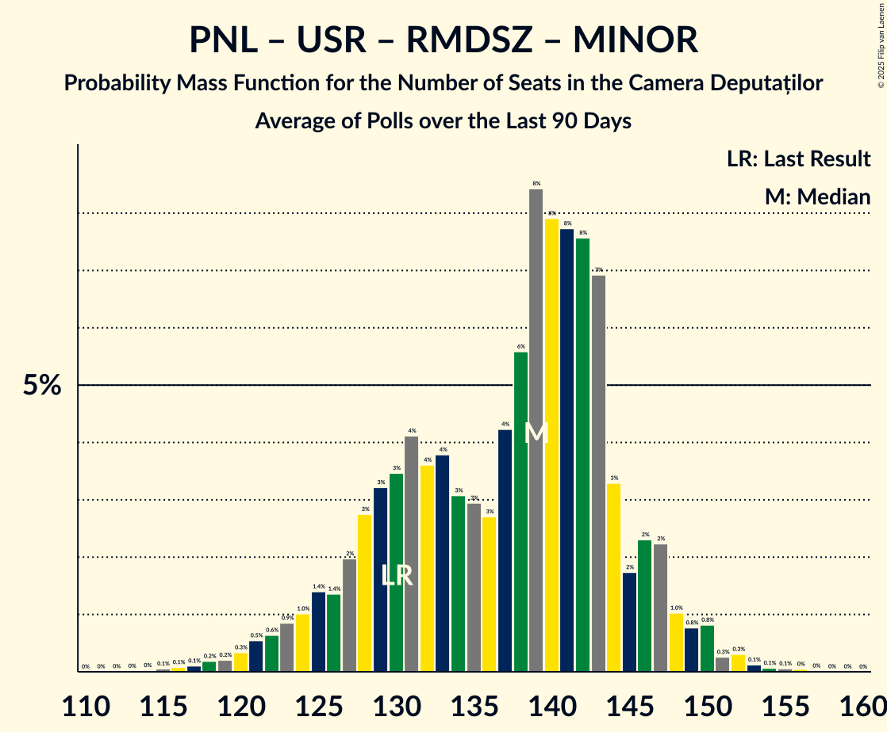

# Poll Average

<a href="#voting-intentions">Voting Intentions</a> | <a href="#seats">Seats</a> | <a href="#coalitions">Coalitions</a> | <a href="#technical-information">Technical Information</a>

## Summary

The table below lists the polls on which the average is based. They are the most recent polls (less than 90 days old) registered and analyzed so far.

| Period     | Polling firm/Commissioner(s) | PSD | AUR | PNL | USR | SOSRO | POT | RMDSZ | SENS | FD | PMP | REPER | DREPT | MINOR |
|:----------:|:----------------------------:|:--:|:--:|:--:|:--:|:--:|:--:|:--:|:--:|:--:|:--:|:--:|:--:|:--:|
| 1 December 2024 | General Election | 22.0%   86 | 18.0%   63 | 13.2%   49 | 12.4%   40 | 7.4%   28 | 6.5%   24 | 6.3%   22 | 3.0%   0 | 2.0%   0 | 2.0%   0 | 1.2%   0 | 1.2%   0 | 0.0%   19 |
| N/A | Poll Average | 13–22%   43–83 | 25–42%   107–146 | 13–19%   46–67 | 9–16%   36–58 | 1–5%   0 | 2–5%   0–17 | 4–7%   14–25 | 2–4%   0 | 1–3%   0 | 1–2%   0 | 1–3%   0 | 1–2%   0 | N/A   19 |
| [4–10 July 2025](2025-07-10-CURS.html) | CURS | 18–22%   60–77 | 35–41%   120–141 | 13–17%   44–60 | 10–14%   35–48 | 3–5%   0 | 3–5%   0–18 | 4–6%   13–22 | N/A   N/A | N/A   N/A | N/A   N/A | N/A   N/A | N/A   N/A | N/A   19 |
| [20–26 June 2025](2025-06-26-INSCOP.html) | INSCOP   informat.ro | 12–16%   40–55 | 38–43%   129–150 | 15–20%   52–68 | 11–15%   38–52 | 1–3%   0 | 3–6%   0–18 | 4–7%   14–23 | 2–4%   0 | N/A   N/A | N/A   N/A | N/A   N/A | N/A   N/A | N/A   19 |
| [26–28 May 2025](2025-05-28-Sociopol.html) | Sociopol | 15–19%   54–71 | 33–39%   122–142 | 12–16%   44–59 | 10–14%   37–52 | 1–3%   0 | 2–4%   0 | 5–8%   17–28 | 2–4%   0 | 1–3%   0 | N/A   N/A | 1–3%   0 | N/A   N/A | N/A   19 |
| [23–28 May 2025](2025-05-28-Avangarde.html) | Avangarde | 18–22%   64–79 | 30–35%   105–123 | 14–18%   50–63 | 13–17%   47–61 | 3–5%   0–17 | 2–4%   0 | 4–6%   14–22 | N/A   N/A | 1–2%   0 | 1–2%   0 | N/A   N/A | 1–2%   0 | N/A   19 |
| [24–26 April 2025](2025-04-26-FlashData.html) | FlashData | 18–20%   78–85 | 25–27%   107–115 | 14–16%   61–68 | 8–10%   36–41 | 2%   0 | 3%   0 | 4%   15–19 | N/A   N/A | N/A   N/A | N/A   N/A | N/A   N/A | N/A   N/A | N/A   19 |
| 1 December 2024 | General Election | 22.0%   86 | 18.0%   63 | 13.2%   49 | 12.4%   40 | 7.4%   28 | 6.5%   24 | 6.3%   22 | 3.0%   0 | 2.0%   0 | 2.0%   0 | 1.2%   0 | 1.2%   0 | 0.0%   19 |

Only polls for which at least the sample size has been published are included in the table above.

**Legend:**
+ **Top half of each row:** Voting intentions (95% confidence interval)
+ **Bottom half of each row:** Seat projections for the Camera Deputaților (95% confidence interval)
+ **PSD:** Partidul Social Democrat
+ **AUR:** Alianța pentru Unirea Românilor
+ **PNL:** Partidul Național Liberal
+ **USR:** Uniunea Salvați România
+ **SOSRO:** Partidul S.O.S. România
+ **POT:** Partidul Oamenilor Tineri
+ **RMDSZ:** Romániai Magyar Demokrata Szövetség
+ **SENS:** Sănătate, Educație, Natură, Sustenabilitate
+ **FD:** Forța Dreptei
+ **PMP:** Partidul Mișcarea Populară
+ **REPER:** Reînnoim Proiectul European al României
+ **DREPT:** Dreptate și Respect în Europa Pentru Toți
+ **MINOR:** Parties of ethnic minorities
+ **N/A (single party):** Party not included the published results
+ **N/A (entire row):** Calculation for this opinion poll not started yet

## Voting Intentions

### Confidence Intervals

| Party | Last Result | Median | 80% Confidence Interval | 90% Confidence Interval | 95% Confidence Interval | 99% Confidence Interval |
|:-----:|:-----------:|:------:|:-----------------------:|:-----------------------:|:-----------------------:|:-----------------------:|
| <a href="#partidul-social-democrat">Partidul Social Democrat</a> | 22.0% | 18.8% | 13.8–20.8% |13.1–21.4% | 12.6–21.8% | 11.9–22.7% |
| <a href="#alianța-pentru-unirea-românilor">Alianța pentru Unirea Românilor</a> | 18.0% | 35.7% | 26.0–40.7% |25.7–41.6% | 25.4–42.2% | 25.0–43.4% |
| <a href="#partidul-național-liberal">Partidul Național Liberal</a> | 13.2% | 15.3% | 13.7–17.6% |13.2–18.2% | 12.7–18.7% | 12.0–19.6% |
| <a href="#uniunea-salvați-românia">Uniunea Salvați România</a> | 12.4% | 12.4% | 9.0–15.1% |8.8–15.7% | 8.6–16.2% | 8.4–17.0% |
| <a href="#partidul-s.o.s.-românia">Partidul S.O.S. România</a> | 7.4% | 2.3% | 1.7–4.5% |1.6–4.8% | 1.4–5.0% | 1.2–5.5% |
| <a href="#partidul-oamenilor-tineri">Partidul Oamenilor Tineri</a> | 6.5% | 3.3% | 2.7–4.6% |2.5–4.9% | 2.3–5.1% | 2.0–5.6% |
| <a href="#romániai-magyar-demokrata-szövetség">Romániai Magyar Demokrata Szövetség</a> | 6.3% | 5.1% | 4.0–6.3% |3.8–6.7% | 3.7–7.0% | 3.5–7.7% |
| <a href="#sănătate,-educație,-natură,-sustenabilitate">Sănătate, Educație, Natură, Sustenabilitate</a> | 3.0% | 2.8% | 2.1–3.6% |1.9–3.8% | 1.8–4.0% | 1.6–4.5% |
| <a href="#forța-dreptei">Forța Dreptei</a> | 2.0% | 1.5% | 0.8–2.5% |0.7–2.7% | 0.6–2.9% | 0.5–3.3% |
| <a href="#partidul-mișcarea-populară">Partidul Mișcarea Populară</a> | 2.0% | 1.0% | 0.7–1.5% |0.6–1.6% | 0.6–1.7% | 0.5–1.9% |
| <a href="#reînnoim-proiectul-european-al-româniei">Reînnoim Proiectul European al României</a> | 1.2% | 2.1% | 1.5–2.7% |1.4–2.9% | 1.3–3.1% | 1.1–3.4% |
| <a href="#dreptate-și-respect-în-europa-pentru-toți">Dreptate și Respect în Europa Pentru Toți</a> | 1.2% | 1.0% | 0.7–1.5% |0.6–1.6% | 0.6–1.7% | 0.5–1.9% |
| <a href="#parties-of-ethnic-minorities">Parties of ethnic minorities</a> | 0.0% | N/A | N/A |N/A | N/A | N/A |

### Partidul Social Democrat

*For a full overview of the results for this party, see the [Partidul Social Democrat](party-partidulsocialdemocrat.html) page.*

| Voting Intentions | Probability | Accumulated | Special Marks |
|:-----------------:|:-----------:|:-----------:|:-------------:|
| 9.5–10.5% | 0% | 100% |  |
| 10.5–11.5% | 0.2% | 100% |  |
| 11.5–12.5% | 2% | 99.8% |  |
| 12.5–13.5% | 6% | 98% |  |
| 13.5–14.5% | 8% | 92% |  |
| 14.5–15.5% | 5% | 84% |  |
| 15.5–16.5% | 6% | 79% |  |
| 16.5–17.5% | 7% | 73% |  |
| 17.5–18.5% | 11% | 66% |  |
| 18.5–19.5% | 26% | 55% | Median |
| 19.5–20.5% | 16% | 29% |  |
| 20.5–21.5% | 9% | 13% |  |
| 21.5–22.5% | 3% | 4% | Last Result |
| 22.5–23.5% | 0.6% | 0.7% |  |
| 23.5–24.5% | 0.1% | 0.1% |  |
| 24.5–25.5% | 0% | 0% |  |

### Alianța pentru Unirea Românilor

*For a full overview of the results for this party, see the [Alianța pentru Unirea Românilor](party-alianțapentruunirearomânilor.html) page.*

| Voting Intentions | Probability | Accumulated | Special Marks |
|:-----------------:|:-----------:|:-----------:|:-------------:|
| 17.5–18.5% | 0% | 100% | Last Result |
| 18.5–19.5% | 0% | 100% |  |
| 19.5–20.5% | 0% | 100% |  |
| 20.5–21.5% | 0% | 100% |  |
| 21.5–22.5% | 0% | 100% |  |
| 22.5–23.5% | 0% | 100% |  |
| 23.5–24.5% | 0% | 100% |  |
| 24.5–25.5% | 4% | 100% |  |
| 25.5–26.5% | 14% | 96% |  |
| 26.5–27.5% | 3% | 83% |  |
| 27.5–28.5% | 0.1% | 80% |  |
| 28.5–29.5% | 0.5% | 80% |  |
| 29.5–30.5% | 2% | 79% |  |
| 30.5–31.5% | 5% | 77% |  |
| 31.5–32.5% | 6% | 73% |  |
| 32.5–33.5% | 5% | 67% |  |
| 33.5–34.5% | 4% | 61% |  |
| 34.5–35.5% | 6% | 57% |  |
| 35.5–36.5% | 8% | 51% | Median |
| 36.5–37.5% | 9% | 44% |  |
| 37.5–38.5% | 9% | 35% |  |
| 38.5–39.5% | 8% | 26% |  |
| 39.5–40.5% | 7% | 18% |  |
| 40.5–41.5% | 6% | 11% |  |
| 41.5–42.5% | 3% | 5% |  |
| 42.5–43.5% | 1.3% | 2% |  |
| 43.5–44.5% | 0.3% | 0.4% |  |
| 44.5–45.5% | 0.1% | 0.1% |  |
| 45.5–46.5% | 0% | 0% |  |

### Partidul Național Liberal

*For a full overview of the results for this party, see the [Partidul Național Liberal](party-partidulnaționalliberal.html) page.*

| Voting Intentions | Probability | Accumulated | Special Marks |
|:-----------------:|:-----------:|:-----------:|:-------------:|
| 9.5–10.5% | 0% | 100% |  |
| 10.5–11.5% | 0.2% | 100% |  |
| 11.5–12.5% | 2% | 99.8% |  |
| 12.5–13.5% | 7% | 98% | Last Result |
| 13.5–14.5% | 16% | 92% |  |
| 14.5–15.5% | 33% | 76% | Median |
| 15.5–16.5% | 19% | 43% |  |
| 16.5–17.5% | 13% | 23% |  |
| 17.5–18.5% | 7% | 10% |  |
| 18.5–19.5% | 3% | 3% |  |
| 19.5–20.5% | 0.5% | 0.6% |  |
| 20.5–21.5% | 0.1% | 0.1% |  |
| 21.5–22.5% | 0% | 0% |  |

### Uniunea Salvați România

*For a full overview of the results for this party, see the [Uniunea Salvați România](party-uniuneasalvațiromânia.html) page.*

| Voting Intentions | Probability | Accumulated | Special Marks |
|:-----------------:|:-----------:|:-----------:|:-------------:|
| 6.5–7.5% | 0% | 100% |  |
| 7.5–8.5% | 2% | 100% |  |
| 8.5–9.5% | 18% | 98% |  |
| 9.5–10.5% | 3% | 81% |  |
| 10.5–11.5% | 11% | 77% |  |
| 11.5–12.5% | 19% | 67% | Last Result, Median |
| 12.5–13.5% | 18% | 47% |  |
| 13.5–14.5% | 13% | 29% |  |
| 14.5–15.5% | 10% | 16% |  |
| 15.5–16.5% | 5% | 6% |  |
| 16.5–17.5% | 1.2% | 1.4% |  |
| 17.5–18.5% | 0.1% | 0.2% |  |
| 18.5–19.5% | 0% | 0% |  |

### Partidul S.O.S. România

*For a full overview of the results for this party, see the [Partidul S.O.S. România](party-partidulsosromânia.html) page.*

| Voting Intentions | Probability | Accumulated | Special Marks |
|:-----------------:|:-----------:|:-----------:|:-------------:|
| 0.0–0.5% | 0% | 100% |  |
| 0.5–1.5% | 5% | 100% |  |
| 1.5–2.5% | 50% | 95% | Median |
| 2.5–3.5% | 12% | 45% |  |
| 3.5–4.5% | 25% | 33% |  |
| 4.5–5.5% | 8% | 8% |  |
| 5.5–6.5% | 0.4% | 0.4% |  |
| 6.5–7.5% | 0% | 0% | Last Result |

### Partidul Oamenilor Tineri

*For a full overview of the results for this party, see the [Partidul Oamenilor Tineri](party-partiduloamenilortineri.html) page.*

| Voting Intentions | Probability | Accumulated | Special Marks |
|:-----------------:|:-----------:|:-----------:|:-------------:|
| 0.5–1.5% | 0% | 100% |  |
| 1.5–2.5% | 6% | 100% |  |
| 2.5–3.5% | 53% | 94% | Median |
| 3.5–4.5% | 31% | 41% |  |
| 4.5–5.5% | 10% | 11% |  |
| 5.5–6.5% | 0.7% | 0.7% | Last Result |
| 6.5–7.5% | 0% | 0% |  |

### Romániai Magyar Demokrata Szövetség

*For a full overview of the results for this party, see the [Romániai Magyar Demokrata Szövetség](party-romániaimagyardemokrataszövetség.html) page.*

| Voting Intentions | Probability | Accumulated | Special Marks |
|:-----------------:|:-----------:|:-----------:|:-------------:|
| 1.5–2.5% | 0% | 100% |  |
| 2.5–3.5% | 0.6% | 100% |  |
| 3.5–4.5% | 31% | 99.4% |  |
| 4.5–5.5% | 38% | 69% | Median |
| 5.5–6.5% | 24% | 31% | Last Result |
| 6.5–7.5% | 6% | 6% |  |
| 7.5–8.5% | 0.6% | 0.7% |  |
| 8.5–9.5% | 0% | 0% |  |

### Sănătate, Educație, Natură, Sustenabilitate

*For a full overview of the results for this party, see the [Sănătate, Educație, Natură, Sustenabilitate](party-sănătateeducațienaturăsustenabilitate.html) page.*

| Voting Intentions | Probability | Accumulated | Special Marks |
|:-----------------:|:-----------:|:-----------:|:-------------:|
| 0.0–0.5% | 0% | 100% |  |
| 0.5–1.5% | 0.5% | 100% |  |
| 1.5–2.5% | 35% | 99.5% |  |
| 2.5–3.5% | 54% | 65% | Last Result, Median |
| 3.5–4.5% | 10% | 11% |  |
| 4.5–5.5% | 0.4% | 0.4% |  |
| 5.5–6.5% | 0% | 0% |  |

### Forța Dreptei

*For a full overview of the results for this party, see the [Forța Dreptei](party-forțadreptei.html) page.*

| Voting Intentions | Probability | Accumulated | Special Marks |
|:-----------------:|:-----------:|:-----------:|:-------------:|
| 0.0–0.5% | 0.7% | 100% |  |
| 0.5–1.5% | 52% | 99.3% |  |
| 1.5–2.5% | 40% | 48% | Last Result, Median |
| 2.5–3.5% | 8% | 8% |  |
| 3.5–4.5% | 0.1% | 0.1% |  |
| 4.5–5.5% | 0% | 0% |  |

### Partidul Mișcarea Populară

*For a full overview of the results for this party, see the [Partidul Mișcarea Populară](party-partidulmișcareapopulară.html) page.*

| Voting Intentions | Probability | Accumulated | Special Marks |
|:-----------------:|:-----------:|:-----------:|:-------------:|
| 0.0–0.5% | 1.5% | 100% |  |
| 0.5–1.5% | 93% | 98.5% | Median |
| 1.5–2.5% | 6% | 6% | Last Result |
| 2.5–3.5% | 0% | 0% |  |

### Reînnoim Proiectul European al României

*For a full overview of the results for this party, see the [Reînnoim Proiectul European al României](party-reînnoimproiectuleuropeanalromâniei.html) page.*

| Voting Intentions | Probability | Accumulated | Special Marks |
|:-----------------:|:-----------:|:-----------:|:-------------:|
| 0.0–0.5% | 0% | 100% |  |
| 0.5–1.5% | 11% | 100% | Last Result |
| 1.5–2.5% | 74% | 89% | Median |
| 2.5–3.5% | 15% | 16% |  |
| 3.5–4.5% | 0.3% | 0.3% |  |
| 4.5–5.5% | 0% | 0% |  |

### Dreptate și Respect în Europa Pentru Toți

*For a full overview of the results for this party, see the [Dreptate și Respect în Europa Pentru Toți](party-dreptateșirespectîneuropapentrutoți.html) page.*

| Voting Intentions | Probability | Accumulated | Special Marks |
|:-----------------:|:-----------:|:-----------:|:-------------:|
| 0.0–0.5% | 1.5% | 100% |  |
| 0.5–1.5% | 93% | 98.5% | Last Result, Median |
| 1.5–2.5% | 6% | 6% |  |
| 2.5–3.5% | 0% | 0% |  |

## Seats

### Confidence Intervals

| Party | Last Result | Median | 80% Confidence Interval | 90% Confidence Interval | 95% Confidence Interval | 99% Confidence Interval |
|:-----:|:-----------:|:------:|:-----------------------:|:-----------------------:|:-----------------------:|:-----------------------:|
| <a href="#partidul-social-democrat">Partidul Social Democrat</a> | 86 | 68 | 47–81 |45–83 | 43–83 | 40–85 |
| <a href="#alianța-pentru-unirea-românilor">Alianța pentru Unirea Românilor</a> | 63 | 128 | 110–141 |109–144 | 107–146 | 105–150 |
| <a href="#partidul-național-liberal">Partidul Național Liberal</a> | 49 | 56 | 49–65 |47–66 | 46–67 | 43–68 |
| <a href="#uniunea-salvați-românia">Uniunea Salvați România</a> | 40 | 43 | 38–54 |37–55 | 36–58 | 34–61 |
| <a href="#partidul-s.o.s.-românia">Partidul S.O.S. România</a> | 28 | 0 | 0 |0 | 0 | 0–18 |
| <a href="#partidul-oamenilor-tineri">Partidul Oamenilor Tineri</a> | 24 | 0 | 0 |0 | 0–17 | 0–18 |
| <a href="#romániai-magyar-demokrata-szövetség">Romániai Magyar Demokrata Szövetség</a> | 22 | 18 | 15–22 |14–24 | 14–25 | 12–28 |
| <a href="#sănătate,-educație,-natură,-sustenabilitate">Sănătate, Educație, Natură, Sustenabilitate</a> | 0 | 0 | 0 |0 | 0 | 0 |
| <a href="#forța-dreptei">Forța Dreptei</a> | 0 | 0 | 0 |0 | 0 | 0 |
| <a href="#partidul-mișcarea-populară">Partidul Mișcarea Populară</a> | 0 | 0 | 0 |0 | 0 | 0 |
| <a href="#reînnoim-proiectul-european-al-româniei">Reînnoim Proiectul European al României</a> | 0 | 0 | 0 |0 | 0 | 0 |
| <a href="#dreptate-și-respect-în-europa-pentru-toți">Dreptate și Respect în Europa Pentru Toți</a> | 0 | 0 | 0 |0 | 0 | 0 |
| <a href="#parties-of-ethnic-minorities">Parties of ethnic minorities</a> | 19 | 19 | 19 |19 | 19 | 19 |

### Partidul Social Democrat

*For a full overview of the results for this party, see the [Partidul Social Democrat](party-partidulsocialdemocrat.html) page.*

| Number of Seats | Probability | Accumulated | Special Marks |
|:---------------:|:-----------:|:-----------:|:-------------:|
| 37 | 0% | 100% |  |
| 38 | 0% | 99.9% |  |
| 39 | 0.2% | 99.9% |  |
| 40 | 0.3% | 99.7% |  |
| 41 | 0.2% | 99.4% |  |
| 42 | 0.9% | 99.2% |  |
| 43 | 1.3% | 98% |  |
| 44 | 0.7% | 97% |  |
| 45 | 2% | 96% |  |
| 46 | 3% | 94% |  |
| 47 | 1.2% | 91% |  |
| 48 | 2% | 90% |  |
| 49 | 3% | 88% |  |
| 50 | 0.9% | 85% |  |
| 51 | 1.5% | 84% |  |
| 52 | 1.3% | 83% |  |
| 53 | 0.5% | 81% |  |
| 54 | 0.7% | 81% |  |
| 55 | 0.8% | 80% |  |
| 56 | 0.7% | 79% |  |
| 57 | 1.0% | 78% |  |
| 58 | 1.2% | 77% |  |
| 59 | 1.1% | 76% |  |
| 60 | 2% | 75% |  |
| 61 | 2% | 73% |  |
| 62 | 3% | 71% |  |
| 63 | 3% | 68% |  |
| 64 | 3% | 66% |  |
| 65 | 4% | 63% |  |
| 66 | 4% | 59% |  |
| 67 | 5% | 55% |  |
| 68 | 4% | 50% | Median |
| 69 | 5% | 47% |  |
| 70 | 4% | 41% |  |
| 71 | 3% | 37% |  |
| 72 | 4% | 34% |  |
| 73 | 2% | 30% |  |
| 74 | 2% | 28% |  |
| 75 | 2% | 26% |  |
| 76 | 2% | 24% |  |
| 77 | 1.3% | 23% |  |
| 78 | 2% | 21% |  |
| 79 | 2% | 20% |  |
| 80 | 3% | 17% |  |
| 81 | 4% | 14% |  |
| 82 | 4% | 10% |  |
| 83 | 3% | 5% |  |
| 84 | 2% | 2% |  |
| 85 | 0.6% | 0.9% |  |
| 86 | 0.2% | 0.3% | Last Result |
| 87 | 0.1% | 0.1% |  |
| 88 | 0% | 0% |  |

### Alianța pentru Unirea Românilor

*For a full overview of the results for this party, see the [Alianța pentru Unirea Românilor](party-alianțapentruunirearomânilor.html) page.*

| Number of Seats | Probability | Accumulated | Special Marks |
|:---------------:|:-----------:|:-----------:|:-------------:|
| 63 | 0% | 100% | Last Result |
| 64 | 0% | 100% |  |
| 65 | 0% | 100% |  |
| 66 | 0% | 100% |  |
| 67 | 0% | 100% |  |
| 68 | 0% | 100% |  |
| 69 | 0% | 100% |  |
| 70 | 0% | 100% |  |
| 71 | 0% | 100% |  |
| 72 | 0% | 100% |  |
| 73 | 0% | 100% |  |
| 74 | 0% | 100% |  |
| 75 | 0% | 100% |  |
| 76 | 0% | 100% |  |
| 77 | 0% | 100% |  |
| 78 | 0% | 100% |  |
| 79 | 0% | 100% |  |
| 80 | 0% | 100% |  |
| 81 | 0% | 100% |  |
| 82 | 0% | 100% |  |
| 83 | 0% | 100% |  |
| 84 | 0% | 100% |  |
| 85 | 0% | 100% |  |
| 86 | 0% | 100% |  |
| 87 | 0% | 100% |  |
| 88 | 0% | 100% |  |
| 89 | 0% | 100% |  |
| 90 | 0% | 100% |  |
| 91 | 0% | 100% |  |
| 92 | 0% | 100% |  |
| 93 | 0% | 100% |  |
| 94 | 0% | 100% |  |
| 95 | 0% | 100% |  |
| 96 | 0% | 100% |  |
| 97 | 0% | 100% |  |
| 98 | 0% | 100% |  |
| 99 | 0% | 100% |  |
| 100 | 0% | 100% |  |
| 101 | 0% | 99.9% |  |
| 102 | 0.1% | 99.9% |  |
| 103 | 0.1% | 99.8% |  |
| 104 | 0.1% | 99.6% |  |
| 105 | 0.4% | 99.5% |  |
| 106 | 0.7% | 99.1% |  |
| 107 | 1.4% | 98% |  |
| 108 | 2% | 97% |  |
| 109 | 3% | 95% |  |
| 110 | 4% | 92% |  |
| 111 | 4% | 88% |  |
| 112 | 6% | 84% |  |
| 113 | 4% | 78% |  |
| 114 | 3% | 74% |  |
| 115 | 2% | 71% |  |
| 116 | 4% | 69% |  |
| 117 | 1.3% | 64% |  |
| 118 | 0.7% | 63% |  |
| 119 | 2% | 62% |  |
| 120 | 0.7% | 61% |  |
| 121 | 0.6% | 60% |  |
| 122 | 0.8% | 60% |  |
| 123 | 1.4% | 59% |  |
| 124 | 0.9% | 57% |  |
| 125 | 2% | 56% |  |
| 126 | 2% | 55% |  |
| 127 | 2% | 53% |  |
| 128 | 2% | 51% | Median |
| 129 | 2% | 49% |  |
| 130 | 3% | 46% |  |
| 131 | 4% | 43% |  |
| 132 | 3% | 39% |  |
| 133 | 4% | 36% |  |
| 134 | 3% | 33% |  |
| 135 | 3% | 29% |  |
| 136 | 4% | 26% |  |
| 137 | 3% | 22% |  |
| 138 | 2% | 19% |  |
| 139 | 3% | 17% |  |
| 140 | 2% | 13% |  |
| 141 | 2% | 11% |  |
| 142 | 2% | 9% |  |
| 143 | 1.4% | 7% |  |
| 144 | 1.1% | 6% |  |
| 145 | 1.3% | 4% |  |
| 146 | 1.0% | 3% |  |
| 147 | 0.5% | 2% |  |
| 148 | 0.6% | 2% |  |
| 149 | 0.4% | 1.2% |  |
| 150 | 0.3% | 0.7% |  |
| 151 | 0.1% | 0.4% |  |
| 152 | 0.2% | 0.3% |  |
| 153 | 0.1% | 0.1% |  |
| 154 | 0% | 0.1% |  |
| 155 | 0% | 0.1% |  |
| 156 | 0% | 0% |  |

### Partidul Național Liberal

*For a full overview of the results for this party, see the [Partidul Național Liberal](party-partidulnaționalliberal.html) page.*

| Number of Seats | Probability | Accumulated | Special Marks |
|:---------------:|:-----------:|:-----------:|:-------------:|
| 40 | 0% | 100% |  |
| 41 | 0.1% | 99.9% |  |
| 42 | 0.3% | 99.8% |  |
| 43 | 0.3% | 99.6% |  |
| 44 | 0.6% | 99.3% |  |
| 45 | 0.8% | 98.6% |  |
| 46 | 2% | 98% |  |
| 47 | 2% | 96% |  |
| 48 | 3% | 94% |  |
| 49 | 4% | 91% | Last Result |
| 50 | 4% | 87% |  |
| 51 | 5% | 84% |  |
| 52 | 6% | 79% |  |
| 53 | 5% | 73% |  |
| 54 | 7% | 68% |  |
| 55 | 6% | 61% |  |
| 56 | 7% | 54% | Median |
| 57 | 5% | 47% |  |
| 58 | 3% | 43% |  |
| 59 | 3% | 39% |  |
| 60 | 5% | 36% |  |
| 61 | 3% | 31% |  |
| 62 | 6% | 28% |  |
| 63 | 6% | 22% |  |
| 64 | 6% | 16% |  |
| 65 | 5% | 11% |  |
| 66 | 3% | 6% |  |
| 67 | 1.4% | 3% |  |
| 68 | 0.8% | 1.2% |  |
| 69 | 0.2% | 0.4% |  |
| 70 | 0.1% | 0.2% |  |
| 71 | 0.1% | 0.1% |  |
| 72 | 0% | 0% |  |

### Uniunea Salvați România

*For a full overview of the results for this party, see the [Uniunea Salvați România](party-uniuneasalvațiromânia.html) page.*

| Number of Seats | Probability | Accumulated | Special Marks |
|:---------------:|:-----------:|:-----------:|:-------------:|
| 32 | 0.1% | 100% |  |
| 33 | 0.1% | 99.9% |  |
| 34 | 0.3% | 99.8% |  |
| 35 | 0.9% | 99.4% |  |
| 36 | 2% | 98.5% |  |
| 37 | 6% | 96% |  |
| 38 | 8% | 90% |  |
| 39 | 8% | 82% |  |
| 40 | 7% | 74% | Last Result |
| 41 | 5% | 67% |  |
| 42 | 6% | 62% |  |
| 43 | 6% | 56% | Median |
| 44 | 6% | 50% |  |
| 45 | 6% | 44% |  |
| 46 | 5% | 38% |  |
| 47 | 4% | 33% |  |
| 48 | 4% | 29% |  |
| 49 | 4% | 25% |  |
| 50 | 3% | 21% |  |
| 51 | 3% | 18% |  |
| 52 | 2% | 15% |  |
| 53 | 3% | 13% |  |
| 54 | 2% | 10% |  |
| 55 | 4% | 8% |  |
| 56 | 1.3% | 5% |  |
| 57 | 0.7% | 3% |  |
| 58 | 1.5% | 3% |  |
| 59 | 0.4% | 1.1% |  |
| 60 | 0.2% | 0.7% |  |
| 61 | 0.3% | 0.5% |  |
| 62 | 0.1% | 0.2% |  |
| 63 | 0% | 0.1% |  |
| 64 | 0% | 0% |  |

### Partidul S.O.S. România

*For a full overview of the results for this party, see the [Partidul S.O.S. România](party-partidulsosromânia.html) page.*

| Number of Seats | Probability | Accumulated | Special Marks |
|:---------------:|:-----------:|:-----------:|:-------------:|
| 0 | 98.9% | 100% | Median |
| 1 | 0% | 1.1% |  |
| 2 | 0% | 1.1% |  |
| 3 | 0% | 1.1% |  |
| 4 | 0% | 1.1% |  |
| 5 | 0% | 1.1% |  |
| 6 | 0% | 1.1% |  |
| 7 | 0% | 1.1% |  |
| 8 | 0% | 1.1% |  |
| 9 | 0% | 1.1% |  |
| 10 | 0% | 1.1% |  |
| 11 | 0% | 1.1% |  |
| 12 | 0% | 1.1% |  |
| 13 | 0% | 1.1% |  |
| 14 | 0% | 1.1% |  |
| 15 | 0% | 1.1% |  |
| 16 | 0% | 1.1% |  |
| 17 | 0.4% | 1.1% |  |
| 18 | 0.3% | 0.7% |  |
| 19 | 0.4% | 0.4% |  |
| 20 | 0% | 0.1% |  |
| 21 | 0% | 0% |  |
| 22 | 0% | 0% |  |
| 23 | 0% | 0% |  |
| 24 | 0% | 0% |  |
| 25 | 0% | 0% |  |
| 26 | 0% | 0% |  |
| 27 | 0% | 0% |  |
| 28 | 0% | 0% | Last Result |

### Partidul Oamenilor Tineri

*For a full overview of the results for this party, see the [Partidul Oamenilor Tineri](party-partiduloamenilortineri.html) page.*

| Number of Seats | Probability | Accumulated | Special Marks |
|:---------------:|:-----------:|:-----------:|:-------------:|
| 0 | 96% | 100% | Median |
| 1 | 0% | 4% |  |
| 2 | 0% | 4% |  |
| 3 | 0% | 4% |  |
| 4 | 0% | 4% |  |
| 5 | 0% | 4% |  |
| 6 | 0% | 4% |  |
| 7 | 0% | 4% |  |
| 8 | 0% | 4% |  |
| 9 | 0% | 4% |  |
| 10 | 0% | 4% |  |
| 11 | 0% | 4% |  |
| 12 | 0% | 4% |  |
| 13 | 0% | 4% |  |
| 14 | 0% | 4% |  |
| 15 | 0% | 4% |  |
| 16 | 0.7% | 4% |  |
| 17 | 2% | 3% |  |
| 18 | 0.7% | 1.2% |  |
| 19 | 0.3% | 0.4% |  |
| 20 | 0.1% | 0.1% |  |
| 21 | 0% | 0% |  |
| 22 | 0% | 0% |  |
| 23 | 0% | 0% |  |
| 24 | 0% | 0% | Last Result |

### Romániai Magyar Demokrata Szövetség

*For a full overview of the results for this party, see the [Romániai Magyar Demokrata Szövetség](party-romániaimagyardemokrataszövetség.html) page.*

| Number of Seats | Probability | Accumulated | Special Marks |
|:---------------:|:-----------:|:-----------:|:-------------:|
| 11 | 0.1% | 100% |  |
| 12 | 0.5% | 99.9% |  |
| 13 | 1.4% | 99.4% |  |
| 14 | 4% | 98% |  |
| 15 | 7% | 94% |  |
| 16 | 15% | 87% |  |
| 17 | 20% | 72% |  |
| 18 | 16% | 52% | Median |
| 19 | 9% | 36% |  |
| 20 | 7% | 26% |  |
| 21 | 6% | 19% |  |
| 22 | 5% | 13% | Last Result |
| 23 | 2% | 8% |  |
| 24 | 2% | 6% |  |
| 25 | 2% | 4% |  |
| 26 | 1.0% | 2% |  |
| 27 | 0.3% | 1.2% |  |
| 28 | 0.6% | 0.9% |  |
| 29 | 0.2% | 0.3% |  |
| 30 | 0.1% | 0.1% |  |
| 31 | 0% | 0% |  |

### Sănătate, Educație, Natură, Sustenabilitate

*For a full overview of the results for this party, see the [Sănătate, Educație, Natură, Sustenabilitate](party-sănătateeducațienaturăsustenabilitate.html) page.*

| Number of Seats | Probability | Accumulated | Special Marks |
|:---------------:|:-----------:|:-----------:|:-------------:|
| 0 | 100% | 100% | Last Result, Median |

### Forța Dreptei

*For a full overview of the results for this party, see the [Forța Dreptei](party-forțadreptei.html) page.*

| Number of Seats | Probability | Accumulated | Special Marks |
|:---------------:|:-----------:|:-----------:|:-------------:|
| 0 | 100% | 100% | Last Result, Median |

### Partidul Mișcarea Populară

*For a full overview of the results for this party, see the [Partidul Mișcarea Populară](party-partidulmișcareapopulară.html) page.*

| Number of Seats | Probability | Accumulated | Special Marks |
|:---------------:|:-----------:|:-----------:|:-------------:|
| 0 | 100% | 100% | Last Result, Median |

### Reînnoim Proiectul European al României

*For a full overview of the results for this party, see the [Reînnoim Proiectul European al României](party-reînnoimproiectuleuropeanalromâniei.html) page.*

| Number of Seats | Probability | Accumulated | Special Marks |
|:---------------:|:-----------:|:-----------:|:-------------:|
| 0 | 100% | 100% | Last Result, Median |

### Dreptate și Respect în Europa Pentru Toți

*For a full overview of the results for this party, see the [Dreptate și Respect în Europa Pentru Toți](party-dreptateșirespectîneuropapentrutoți.html) page.*

| Number of Seats | Probability | Accumulated | Special Marks |
|:---------------:|:-----------:|:-----------:|:-------------:|
| 0 | 100% | 100% | Last Result, Median |

### Parties of ethnic minorities

*For a full overview of the results for this party, see the [Parties of ethnic minorities](party-partiesofethnicminorities.html) page.*

| Number of Seats | Probability | Accumulated | Special Marks |
|:---------------:|:-----------:|:-----------:|:-------------:|
| 19 | 100% | 100% | Last Result, Median |

## Coalitions

### Confidence Intervals

| Coalition | Last Result | Median | Majority? | 80% Confidence Interval | 90% Confidence Interval | 95% Confidence Interval | 99% Confidence Interval |
|:---------:|:-----------:|:------:|:---------:|:-----------------------:|:-----------------------:|:-----------------------:|:-----------------------:|
| Partidul Social Democrat – Partidul Național Liberal – Uniunea Salvați România – Romániai Magyar Demokrata Szövetség – Parties of ethnic minorities | 216 | 202 | 100% | 188–221 | 185–222 | 182–224 | 177–226 |
| Partidul Social Democrat – Partidul Național Liberal – Uniunea Salvați România – Romániai Magyar Demokrata Szövetség | 197 | 183 | 96% | 169–202 | 166–203 | 163–205 | 158–207 |
| Partidul Social Democrat – Partidul Național Liberal – Uniunea Salvați România | 175 | 164 | 47% | 151–185 | 148–186 | 146–187 | 141–190 |
| Partidul Social Democrat – Partidul Național Liberal – Romániai Magyar Demokrata Szövetség – Parties of ethnic minorities | 176 | 158 | 29% | 144–181 | 140–183 | 138–184 | 133–185 |
| Partidul Social Democrat – Partidul Național Liberal – Romániai Magyar Demokrata Szövetség | 157 | 139 | 1.2% | 125–162 | 121–164 | 119–165 | 114–166 |
| Partidul Național Liberal – Uniunea Salvați România – Romániai Magyar Demokrata Szövetség – Parties of ethnic minorities | 130 | 139 | 0% | 128–148 | 125–150 | 123–152 | 119–156 |
| Partidul Social Democrat – Partidul Național Liberal | 135 | 121 | 0% | 106–146 | 103–147 | 101–148 | 97–150 |
| Alianța pentru Unirea Românilor | 63 | 128 | 0% | 110–141 | 109–144 | 107–146 | 105–150 |
| Partidul Național Liberal – Uniunea Salvați România – Romániai Magyar Demokrata Szövetség | 111 | 120 | 0% | 109–129 | 106–131 | 104–133 | 100–137 |
| Partidul Social Democrat – Uniunea Salvați România | 126 | 112 | 0% | 93–124 | 89–127 | 87–131 | 83–133 |
| Partidul Național Liberal – Uniunea Salvați România | 89 | 102 | 0% | 91–111 | 88–113 | 87–115 | 83–119 |
| Partidul Național Liberal – Romániai Magyar Demokrata Szövetség – Parties of ethnic minorities | 90 | 94 | 0% | 86–101 | 84–102 | 82–103 | 79–106 |
| Partidul Național Liberal – Romániai Magyar Demokrata Szövetség | 71 | 75 | 0% | 67–82 | 65–83 | 63–84 | 60–87 |
| Partidul Social Democrat | 86 | 68 | 0% | 47–81 | 45–83 | 43–83 | 40–85 |
| Partidul Național Liberal | 49 | 56 | 0% | 49–65 | 47–66 | 46–67 | 43–68 |

### Partidul Social Democrat – Partidul Național Liberal – Uniunea Salvați România – Romániai Magyar Demokrata Szövetség – Parties of ethnic minorities

| Number of Seats | Probability | Accumulated | Special Marks |
|:---------------:|:-----------:|:-----------:|:-------------:|
| 171 | 0% | 100% |  |
| 172 | 0% | 99.9% |  |
| 173 | 0% | 99.9% |  |
| 174 | 0.1% | 99.9% |  |
| 175 | 0.1% | 99.8% |  |
| 176 | 0.1% | 99.7% |  |
| 177 | 0.2% | 99.6% |  |
| 178 | 0.2% | 99.4% |  |
| 179 | 0.4% | 99.2% |  |
| 180 | 0.4% | 98.8% |  |
| 181 | 0.4% | 98% |  |
| 182 | 0.7% | 98% |  |
| 183 | 0.9% | 97% |  |
| 184 | 0.7% | 96% |  |
| 185 | 1.2% | 96% |  |
| 186 | 2% | 94% |  |
| 187 | 1.3% | 93% |  |
| 188 | 2% | 92% |  |
| 189 | 2% | 90% |  |
| 190 | 2% | 87% |  |
| 191 | 2% | 86% |  |
| 192 | 3% | 83% |  |
| 193 | 2% | 80% |  |
| 194 | 3% | 77% |  |
| 195 | 4% | 75% |  |
| 196 | 3% | 70% |  |
| 197 | 3% | 67% |  |
| 198 | 4% | 64% |  |
| 199 | 3% | 61% |  |
| 200 | 4% | 58% |  |
| 201 | 3% | 54% |  |
| 202 | 2% | 51% |  |
| 203 | 2% | 49% |  |
| 204 | 2% | 47% | Median |
| 205 | 2% | 45% |  |
| 206 | 1.3% | 43% |  |
| 207 | 0.8% | 42% |  |
| 208 | 1.2% | 41% |  |
| 209 | 0.7% | 40% |  |
| 210 | 0.5% | 39% |  |
| 211 | 0.6% | 39% |  |
| 212 | 2% | 38% |  |
| 213 | 0.6% | 37% |  |
| 214 | 1.3% | 36% |  |
| 215 | 4% | 35% |  |
| 216 | 2% | 31% | Last Result |
| 217 | 3% | 29% |  |
| 218 | 4% | 25% |  |
| 219 | 6% | 21% |  |
| 220 | 4% | 15% |  |
| 221 | 4% | 11% |  |
| 222 | 3% | 7% |  |
| 223 | 2% | 4% |  |
| 224 | 1.3% | 3% |  |
| 225 | 0.6% | 1.3% |  |
| 226 | 0.3% | 0.6% |  |
| 227 | 0.1% | 0.3% |  |
| 228 | 0.1% | 0.2% |  |
| 229 | 0.1% | 0.1% |  |
| 230 | 0% | 0% |  |

### Partidul Social Democrat – Partidul Național Liberal – Uniunea Salvați România – Romániai Magyar Demokrata Szövetség

| Number of Seats | Probability | Accumulated | Special Marks |
|:---------------:|:-----------:|:-----------:|:-------------:|
| 152 | 0% | 100% |  |
| 153 | 0% | 99.9% |  |
| 154 | 0% | 99.9% |  |
| 155 | 0.1% | 99.9% |  |
| 156 | 0.1% | 99.8% |  |
| 157 | 0.1% | 99.7% |  |
| 158 | 0.2% | 99.6% |  |
| 159 | 0.2% | 99.4% |  |
| 160 | 0.4% | 99.2% |  |
| 161 | 0.4% | 98.8% |  |
| 162 | 0.4% | 98% |  |
| 163 | 0.7% | 98% |  |
| 164 | 0.9% | 97% |  |
| 165 | 0.7% | 96% |  |
| 166 | 1.2% | 96% | Majority |
| 167 | 2% | 94% |  |
| 168 | 1.3% | 93% |  |
| 169 | 2% | 92% |  |
| 170 | 2% | 90% |  |
| 171 | 2% | 87% |  |
| 172 | 2% | 86% |  |
| 173 | 3% | 83% |  |
| 174 | 2% | 80% |  |
| 175 | 3% | 77% |  |
| 176 | 4% | 75% |  |
| 177 | 3% | 70% |  |
| 178 | 3% | 67% |  |
| 179 | 4% | 64% |  |
| 180 | 3% | 61% |  |
| 181 | 4% | 58% |  |
| 182 | 3% | 54% |  |
| 183 | 2% | 51% |  |
| 184 | 2% | 49% |  |
| 185 | 2% | 47% | Median |
| 186 | 2% | 45% |  |
| 187 | 1.3% | 43% |  |
| 188 | 0.8% | 42% |  |
| 189 | 1.2% | 41% |  |
| 190 | 0.7% | 40% |  |
| 191 | 0.5% | 39% |  |
| 192 | 0.6% | 39% |  |
| 193 | 2% | 38% |  |
| 194 | 0.6% | 37% |  |
| 195 | 1.3% | 36% |  |
| 196 | 4% | 35% |  |
| 197 | 2% | 31% | Last Result |
| 198 | 3% | 29% |  |
| 199 | 4% | 25% |  |
| 200 | 6% | 21% |  |
| 201 | 4% | 15% |  |
| 202 | 4% | 11% |  |
| 203 | 3% | 7% |  |
| 204 | 2% | 4% |  |
| 205 | 1.3% | 3% |  |
| 206 | 0.6% | 1.3% |  |
| 207 | 0.3% | 0.6% |  |
| 208 | 0.1% | 0.3% |  |
| 209 | 0.1% | 0.2% |  |
| 210 | 0.1% | 0.1% |  |
| 211 | 0% | 0% |  |

### Partidul Social Democrat – Partidul Național Liberal – Uniunea Salvați România

| Number of Seats | Probability | Accumulated | Special Marks |
|:---------------:|:-----------:|:-----------:|:-------------:|
| 135 | 0% | 100% |  |
| 136 | 0% | 99.9% |  |
| 137 | 0% | 99.9% |  |
| 138 | 0.1% | 99.9% |  |
| 139 | 0.1% | 99.8% |  |
| 140 | 0.2% | 99.7% |  |
| 141 | 0.2% | 99.5% |  |
| 142 | 0.3% | 99.3% |  |
| 143 | 0.4% | 99.0% |  |
| 144 | 0.5% | 98.6% |  |
| 145 | 0.6% | 98% |  |
| 146 | 0.9% | 98% |  |
| 147 | 1.3% | 97% |  |
| 148 | 1.4% | 95% |  |
| 149 | 1.3% | 94% |  |
| 150 | 2% | 93% |  |
| 151 | 2% | 91% |  |
| 152 | 2% | 89% |  |
| 153 | 3% | 86% |  |
| 154 | 3% | 83% |  |
| 155 | 4% | 80% |  |
| 156 | 3% | 76% |  |
| 157 | 3% | 73% |  |
| 158 | 3% | 71% |  |
| 159 | 4% | 67% |  |
| 160 | 5% | 63% |  |
| 161 | 2% | 59% |  |
| 162 | 3% | 56% |  |
| 163 | 2% | 53% |  |
| 164 | 2% | 51% |  |
| 165 | 2% | 49% |  |
| 166 | 2% | 47% | Majority |
| 167 | 1.3% | 45% | Median |
| 168 | 1.4% | 44% |  |
| 169 | 1.1% | 43% |  |
| 170 | 0.8% | 42% |  |
| 171 | 0.6% | 41% |  |
| 172 | 0.8% | 40% |  |
| 173 | 0.7% | 39% |  |
| 174 | 0.5% | 39% |  |
| 175 | 0.4% | 38% | Last Result |
| 176 | 0.5% | 38% |  |
| 177 | 2% | 37% |  |
| 178 | 3% | 35% |  |
| 179 | 1.5% | 32% |  |
| 180 | 3% | 30% |  |
| 181 | 3% | 28% |  |
| 182 | 5% | 25% |  |
| 183 | 4% | 21% |  |
| 184 | 5% | 17% |  |
| 185 | 4% | 12% |  |
| 186 | 3% | 8% |  |
| 187 | 2% | 4% |  |
| 188 | 0.8% | 2% |  |
| 189 | 0.5% | 1.1% |  |
| 190 | 0.3% | 0.6% |  |
| 191 | 0.1% | 0.3% |  |
| 192 | 0.1% | 0.2% |  |
| 193 | 0% | 0.1% |  |
| 194 | 0% | 0.1% |  |
| 195 | 0% | 0% |  |

### Partidul Social Democrat – Partidul Național Liberal – Romániai Magyar Demokrata Szövetség – Parties of ethnic minorities

| Number of Seats | Probability | Accumulated | Special Marks |
|:---------------:|:-----------:|:-----------:|:-------------:|
| 129 | 0% | 100% |  |
| 130 | 0.1% | 99.9% |  |
| 131 | 0.1% | 99.9% |  |
| 132 | 0.2% | 99.8% |  |
| 133 | 0.1% | 99.6% |  |
| 134 | 0.3% | 99.5% |  |
| 135 | 0.3% | 99.2% |  |
| 136 | 0.4% | 98.9% |  |
| 137 | 0.7% | 98.6% |  |
| 138 | 1.1% | 98% |  |
| 139 | 0.9% | 97% |  |
| 140 | 1.0% | 96% |  |
| 141 | 1.0% | 95% |  |
| 142 | 2% | 94% |  |
| 143 | 2% | 92% |  |
| 144 | 2% | 90% |  |
| 145 | 2% | 88% |  |
| 146 | 2% | 86% |  |
| 147 | 2% | 84% |  |
| 148 | 2% | 82% |  |
| 149 | 2% | 80% |  |
| 150 | 3% | 78% |  |
| 151 | 2% | 75% |  |
| 152 | 3% | 73% |  |
| 153 | 3% | 70% |  |
| 154 | 3% | 67% |  |
| 155 | 4% | 64% |  |
| 156 | 4% | 60% |  |
| 157 | 3% | 56% |  |
| 158 | 3% | 53% |  |
| 159 | 3% | 50% |  |
| 160 | 5% | 46% |  |
| 161 | 4% | 42% | Median |
| 162 | 3% | 38% |  |
| 163 | 2% | 35% |  |
| 164 | 2% | 33% |  |
| 165 | 2% | 31% |  |
| 166 | 2% | 29% | Majority |
| 167 | 2% | 27% |  |
| 168 | 2% | 24% |  |
| 169 | 0.8% | 23% |  |
| 170 | 0.4% | 22% |  |
| 171 | 0.3% | 22% |  |
| 172 | 0.6% | 21% |  |
| 173 | 0.4% | 21% |  |
| 174 | 0.2% | 20% |  |
| 175 | 0.1% | 20% |  |
| 176 | 0.2% | 20% | Last Result |
| 177 | 0.5% | 20% |  |
| 178 | 1.1% | 19% |  |
| 179 | 2% | 18% |  |
| 180 | 3% | 16% |  |
| 181 | 4% | 13% |  |
| 182 | 3% | 9% |  |
| 183 | 3% | 6% |  |
| 184 | 2% | 3% |  |
| 185 | 0.8% | 1.2% |  |
| 186 | 0.3% | 0.5% |  |
| 187 | 0.1% | 0.1% |  |
| 188 | 0% | 0% |  |

### Partidul Social Democrat – Partidul Național Liberal – Romániai Magyar Demokrata Szövetség

| Number of Seats | Probability | Accumulated | Special Marks |
|:---------------:|:-----------:|:-----------:|:-------------:|
| 110 | 0% | 100% |  |
| 111 | 0.1% | 99.9% |  |
| 112 | 0.1% | 99.9% |  |
| 113 | 0.2% | 99.8% |  |
| 114 | 0.1% | 99.6% |  |
| 115 | 0.3% | 99.5% |  |
| 116 | 0.3% | 99.2% |  |
| 117 | 0.4% | 98.9% |  |
| 118 | 0.7% | 98.6% |  |
| 119 | 1.1% | 98% |  |
| 120 | 0.9% | 97% |  |
| 121 | 1.0% | 96% |  |
| 122 | 1.0% | 95% |  |
| 123 | 2% | 94% |  |
| 124 | 2% | 92% |  |
| 125 | 2% | 90% |  |
| 126 | 2% | 88% |  |
| 127 | 2% | 86% |  |
| 128 | 2% | 84% |  |
| 129 | 2% | 82% |  |
| 130 | 2% | 80% |  |
| 131 | 3% | 78% |  |
| 132 | 2% | 75% |  |
| 133 | 3% | 73% |  |
| 134 | 3% | 70% |  |
| 135 | 3% | 67% |  |
| 136 | 4% | 64% |  |
| 137 | 4% | 60% |  |
| 138 | 3% | 56% |  |
| 139 | 3% | 53% |  |
| 140 | 3% | 50% |  |
| 141 | 5% | 46% |  |
| 142 | 4% | 42% | Median |
| 143 | 3% | 38% |  |
| 144 | 2% | 35% |  |
| 145 | 2% | 33% |  |
| 146 | 2% | 31% |  |
| 147 | 2% | 29% |  |
| 148 | 2% | 27% |  |
| 149 | 2% | 24% |  |
| 150 | 0.8% | 23% |  |
| 151 | 0.4% | 22% |  |
| 152 | 0.3% | 22% |  |
| 153 | 0.6% | 21% |  |
| 154 | 0.4% | 21% |  |
| 155 | 0.2% | 20% |  |
| 156 | 0.1% | 20% |  |
| 157 | 0.2% | 20% | Last Result |
| 158 | 0.5% | 20% |  |
| 159 | 1.1% | 19% |  |
| 160 | 2% | 18% |  |
| 161 | 3% | 16% |  |
| 162 | 4% | 13% |  |
| 163 | 3% | 9% |  |
| 164 | 3% | 6% |  |
| 165 | 2% | 3% |  |
| 166 | 0.8% | 1.2% | Majority |
| 167 | 0.3% | 0.5% |  |
| 168 | 0.1% | 0.1% |  |
| 169 | 0% | 0% |  |

### Partidul Național Liberal – Uniunea Salvați România – Romániai Magyar Demokrata Szövetség – Parties of ethnic minorities

| Number of Seats | Probability | Accumulated | Special Marks |
|:---------------:|:-----------:|:-----------:|:-------------:|
| 114 | 0% | 100% |  |
| 115 | 0.1% | 99.9% |  |
| 116 | 0.1% | 99.9% |  |
| 117 | 0.1% | 99.8% |  |
| 118 | 0.2% | 99.7% |  |
| 119 | 0.2% | 99.5% |  |
| 120 | 0.3% | 99.3% |  |
| 121 | 0.5% | 99.0% |  |
| 122 | 0.6% | 98% |  |
| 123 | 0.8% | 98% |  |
| 124 | 1.0% | 97% |  |
| 125 | 1.4% | 96% |  |
| 126 | 1.3% | 95% |  |
| 127 | 2% | 93% |  |
| 128 | 2% | 91% |  |
| 129 | 3% | 89% |  |
| 130 | 2% | 87% | Last Result |
| 131 | 2% | 84% |  |
| 132 | 2% | 82% |  |
| 133 | 3% | 80% |  |
| 134 | 4% | 76% |  |
| 135 | 4% | 73% |  |
| 136 | 5% | 69% | Median |
| 137 | 7% | 64% |  |
| 138 | 7% | 57% |  |
| 139 | 6% | 50% |  |
| 140 | 7% | 45% |  |
| 141 | 5% | 37% |  |
| 142 | 4% | 32% |  |
| 143 | 4% | 28% |  |
| 144 | 3% | 24% |  |
| 145 | 3% | 21% |  |
| 146 | 5% | 18% |  |
| 147 | 3% | 13% |  |
| 148 | 2% | 10% |  |
| 149 | 1.3% | 8% |  |
| 150 | 2% | 7% |  |
| 151 | 0.8% | 4% |  |
| 152 | 2% | 4% |  |
| 153 | 0.6% | 2% |  |
| 154 | 0.2% | 1.0% |  |
| 155 | 0.2% | 0.8% |  |
| 156 | 0.2% | 0.5% |  |
| 157 | 0.2% | 0.4% |  |
| 158 | 0.1% | 0.2% |  |
| 159 | 0.1% | 0.1% |  |
| 160 | 0% | 0% |  |

### Partidul Social Democrat – Partidul Național Liberal

| Number of Seats | Probability | Accumulated | Special Marks |
|:---------------:|:-----------:|:-----------:|:-------------:|
| 93 | 0% | 100% |  |
| 94 | 0.1% | 99.9% |  |
| 95 | 0.1% | 99.9% |  |
| 96 | 0.2% | 99.8% |  |
| 97 | 0.2% | 99.6% |  |
| 98 | 0.3% | 99.4% |  |
| 99 | 0.6% | 99.1% |  |
| 100 | 0.6% | 98.5% |  |
| 101 | 0.6% | 98% |  |
| 102 | 1.1% | 97% |  |
| 103 | 1.2% | 96% |  |
| 104 | 1.3% | 95% |  |
| 105 | 2% | 94% |  |
| 106 | 2% | 91% |  |
| 107 | 2% | 89% |  |
| 108 | 3% | 87% |  |
| 109 | 2% | 84% |  |
| 110 | 2% | 83% |  |
| 111 | 4% | 80% |  |
| 112 | 2% | 76% |  |
| 113 | 2% | 74% |  |
| 114 | 4% | 72% |  |
| 115 | 3% | 68% |  |
| 116 | 3% | 64% |  |
| 117 | 3% | 62% |  |
| 118 | 3% | 59% |  |
| 119 | 3% | 56% |  |
| 120 | 3% | 53% |  |
| 121 | 2% | 51% |  |
| 122 | 2% | 49% |  |
| 123 | 4% | 46% |  |
| 124 | 4% | 42% | Median |
| 125 | 3% | 38% |  |
| 126 | 2% | 35% |  |
| 127 | 2% | 33% |  |
| 128 | 2% | 32% |  |
| 129 | 2% | 29% |  |
| 130 | 2% | 27% |  |
| 131 | 2% | 25% |  |
| 132 | 1.1% | 24% |  |
| 133 | 0.7% | 23% |  |
| 134 | 0.5% | 22% |  |
| 135 | 0.4% | 21% | Last Result |
| 136 | 0.3% | 21% |  |
| 137 | 0.2% | 21% |  |
| 138 | 0.2% | 20% |  |
| 139 | 0.1% | 20% |  |
| 140 | 0.2% | 20% |  |
| 141 | 0.4% | 20% |  |
| 142 | 1.1% | 19% |  |
| 143 | 2% | 18% |  |
| 144 | 3% | 17% |  |
| 145 | 4% | 14% |  |
| 146 | 4% | 10% |  |
| 147 | 3% | 6% |  |
| 148 | 2% | 3% |  |
| 149 | 1.0% | 2% |  |
| 150 | 0.4% | 0.6% |  |
| 151 | 0.1% | 0.2% |  |
| 152 | 0% | 0% |  |

### Alianța pentru Unirea Românilor

| Number of Seats | Probability | Accumulated | Special Marks |
|:---------------:|:-----------:|:-----------:|:-------------:|
| 63 | 0% | 100% | Last Result |
| 64 | 0% | 100% |  |
| 65 | 0% | 100% |  |
| 66 | 0% | 100% |  |
| 67 | 0% | 100% |  |
| 68 | 0% | 100% |  |
| 69 | 0% | 100% |  |
| 70 | 0% | 100% |  |
| 71 | 0% | 100% |  |
| 72 | 0% | 100% |  |
| 73 | 0% | 100% |  |
| 74 | 0% | 100% |  |
| 75 | 0% | 100% |  |
| 76 | 0% | 100% |  |
| 77 | 0% | 100% |  |
| 78 | 0% | 100% |  |
| 79 | 0% | 100% |  |
| 80 | 0% | 100% |  |
| 81 | 0% | 100% |  |
| 82 | 0% | 100% |  |
| 83 | 0% | 100% |  |
| 84 | 0% | 100% |  |
| 85 | 0% | 100% |  |
| 86 | 0% | 100% |  |
| 87 | 0% | 100% |  |
| 88 | 0% | 100% |  |
| 89 | 0% | 100% |  |
| 90 | 0% | 100% |  |
| 91 | 0% | 100% |  |
| 92 | 0% | 100% |  |
| 93 | 0% | 100% |  |
| 94 | 0% | 100% |  |
| 95 | 0% | 100% |  |
| 96 | 0% | 100% |  |
| 97 | 0% | 100% |  |
| 98 | 0% | 100% |  |
| 99 | 0% | 100% |  |
| 100 | 0% | 100% |  |
| 101 | 0% | 99.9% |  |
| 102 | 0.1% | 99.9% |  |
| 103 | 0.1% | 99.8% |  |
| 104 | 0.1% | 99.6% |  |
| 105 | 0.4% | 99.5% |  |
| 106 | 0.7% | 99.1% |  |
| 107 | 1.4% | 98% |  |
| 108 | 2% | 97% |  |
| 109 | 3% | 95% |  |
| 110 | 4% | 92% |  |
| 111 | 4% | 88% |  |
| 112 | 6% | 84% |  |
| 113 | 4% | 78% |  |
| 114 | 3% | 74% |  |
| 115 | 2% | 71% |  |
| 116 | 4% | 69% |  |
| 117 | 1.3% | 64% |  |
| 118 | 0.7% | 63% |  |
| 119 | 2% | 62% |  |
| 120 | 0.7% | 61% |  |
| 121 | 0.6% | 60% |  |
| 122 | 0.8% | 60% |  |
| 123 | 1.4% | 59% |  |
| 124 | 0.9% | 57% |  |
| 125 | 2% | 56% |  |
| 126 | 2% | 55% |  |
| 127 | 2% | 53% |  |
| 128 | 2% | 51% | Median |
| 129 | 2% | 49% |  |
| 130 | 3% | 46% |  |
| 131 | 4% | 43% |  |
| 132 | 3% | 39% |  |
| 133 | 4% | 36% |  |
| 134 | 3% | 33% |  |
| 135 | 3% | 29% |  |
| 136 | 4% | 26% |  |
| 137 | 3% | 22% |  |
| 138 | 2% | 19% |  |
| 139 | 3% | 17% |  |
| 140 | 2% | 13% |  |
| 141 | 2% | 11% |  |
| 142 | 2% | 9% |  |
| 143 | 1.4% | 7% |  |
| 144 | 1.1% | 6% |  |
| 145 | 1.3% | 4% |  |
| 146 | 1.0% | 3% |  |
| 147 | 0.5% | 2% |  |
| 148 | 0.6% | 2% |  |
| 149 | 0.4% | 1.2% |  |
| 150 | 0.3% | 0.7% |  |
| 151 | 0.1% | 0.4% |  |
| 152 | 0.2% | 0.3% |  |
| 153 | 0.1% | 0.1% |  |
| 154 | 0% | 0.1% |  |
| 155 | 0% | 0.1% |  |
| 156 | 0% | 0% |  |

### Partidul Național Liberal – Uniunea Salvați România – Romániai Magyar Demokrata Szövetség

| Number of Seats | Probability | Accumulated | Special Marks |
|:---------------:|:-----------:|:-----------:|:-------------:|
| 95 | 0% | 100% |  |
| 96 | 0.1% | 99.9% |  |
| 97 | 0.1% | 99.9% |  |
| 98 | 0.1% | 99.8% |  |
| 99 | 0.2% | 99.7% |  |
| 100 | 0.2% | 99.5% |  |
| 101 | 0.3% | 99.3% |  |
| 102 | 0.5% | 99.0% |  |
| 103 | 0.6% | 98% |  |
| 104 | 0.8% | 98% |  |
| 105 | 1.0% | 97% |  |
| 106 | 1.4% | 96% |  |
| 107 | 1.3% | 95% |  |
| 108 | 2% | 93% |  |
| 109 | 2% | 91% |  |
| 110 | 3% | 89% |  |
| 111 | 2% | 87% | Last Result |
| 112 | 2% | 84% |  |
| 113 | 2% | 82% |  |
| 114 | 3% | 80% |  |
| 115 | 4% | 76% |  |
| 116 | 4% | 73% |  |
| 117 | 5% | 69% | Median |
| 118 | 7% | 64% |  |
| 119 | 7% | 57% |  |
| 120 | 6% | 50% |  |
| 121 | 7% | 45% |  |
| 122 | 5% | 37% |  |
| 123 | 4% | 32% |  |
| 124 | 4% | 28% |  |
| 125 | 3% | 24% |  |
| 126 | 3% | 21% |  |
| 127 | 5% | 18% |  |
| 128 | 3% | 13% |  |
| 129 | 2% | 10% |  |
| 130 | 1.3% | 8% |  |
| 131 | 2% | 7% |  |
| 132 | 0.8% | 4% |  |
| 133 | 2% | 4% |  |
| 134 | 0.6% | 2% |  |
| 135 | 0.2% | 1.0% |  |
| 136 | 0.2% | 0.8% |  |
| 137 | 0.2% | 0.5% |  |
| 138 | 0.2% | 0.4% |  |
| 139 | 0.1% | 0.2% |  |
| 140 | 0.1% | 0.1% |  |
| 141 | 0% | 0% |  |

### Partidul Social Democrat – Uniunea Salvați România

| Number of Seats | Probability | Accumulated | Special Marks |
|:---------------:|:-----------:|:-----------:|:-------------:|
| 79 | 0% | 100% |  |
| 80 | 0.1% | 99.9% |  |
| 81 | 0.1% | 99.9% |  |
| 82 | 0.1% | 99.8% |  |
| 83 | 0.3% | 99.7% |  |
| 84 | 0.3% | 99.4% |  |
| 85 | 0.4% | 99.1% |  |
| 86 | 0.5% | 98.7% |  |
| 87 | 0.8% | 98% |  |
| 88 | 1.1% | 97% |  |
| 89 | 1.3% | 96% |  |
| 90 | 2% | 95% |  |
| 91 | 2% | 93% |  |
| 92 | 2% | 92% |  |
| 93 | 2% | 90% |  |
| 94 | 1.4% | 88% |  |
| 95 | 2% | 87% |  |
| 96 | 1.2% | 85% |  |
| 97 | 2% | 84% |  |
| 98 | 1.3% | 82% |  |
| 99 | 1.1% | 81% |  |
| 100 | 2% | 80% |  |
| 101 | 2% | 78% |  |
| 102 | 2% | 76% |  |
| 103 | 2% | 74% |  |
| 104 | 3% | 73% |  |
| 105 | 2% | 70% |  |
| 106 | 2% | 68% |  |
| 107 | 3% | 66% |  |
| 108 | 3% | 63% |  |
| 109 | 3% | 60% |  |
| 110 | 3% | 57% |  |
| 111 | 3% | 54% | Median |
| 112 | 3% | 52% |  |
| 113 | 2% | 49% |  |
| 114 | 2% | 46% |  |
| 115 | 2% | 45% |  |
| 116 | 2% | 43% |  |
| 117 | 3% | 40% |  |
| 118 | 5% | 38% |  |
| 119 | 4% | 33% |  |
| 120 | 5% | 28% |  |
| 121 | 4% | 23% |  |
| 122 | 4% | 19% |  |
| 123 | 4% | 14% |  |
| 124 | 3% | 11% |  |
| 125 | 1.5% | 7% |  |
| 126 | 0.4% | 6% | Last Result |
| 127 | 0.8% | 6% |  |
| 128 | 0.5% | 5% |  |
| 129 | 0.6% | 4% |  |
| 130 | 1.1% | 4% |  |
| 131 | 2% | 3% |  |
| 132 | 0.2% | 0.7% |  |
| 133 | 0.3% | 0.5% |  |
| 134 | 0.1% | 0.2% |  |
| 135 | 0% | 0.2% |  |
| 136 | 0% | 0.1% |  |
| 137 | 0% | 0.1% |  |
| 138 | 0% | 0% |  |

### Partidul Național Liberal – Uniunea Salvați România

| Number of Seats | Probability | Accumulated | Special Marks |
|:---------------:|:-----------:|:-----------:|:-------------:|
| 79 | 0% | 100% |  |
| 80 | 0.1% | 99.9% |  |
| 81 | 0.1% | 99.9% |  |
| 82 | 0.1% | 99.8% |  |
| 83 | 0.3% | 99.6% |  |
| 84 | 0.5% | 99.4% |  |
| 85 | 0.6% | 98.9% |  |
| 86 | 0.8% | 98% |  |
| 87 | 2% | 98% |  |
| 88 | 2% | 96% |  |
| 89 | 2% | 94% | Last Result |
| 90 | 2% | 92% |  |
| 91 | 3% | 91% |  |
| 92 | 2% | 88% |  |
| 93 | 2% | 85% |  |
| 94 | 3% | 83% |  |
| 95 | 4% | 80% |  |
| 96 | 4% | 76% |  |
| 97 | 3% | 72% |  |
| 98 | 4% | 69% |  |
| 99 | 5% | 65% | Median |
| 100 | 4% | 61% |  |
| 101 | 6% | 56% |  |
| 102 | 7% | 51% |  |
| 103 | 6% | 44% |  |
| 104 | 6% | 38% |  |
| 105 | 4% | 32% |  |
| 106 | 3% | 28% |  |
| 107 | 5% | 25% |  |
| 108 | 3% | 20% |  |
| 109 | 2% | 17% |  |
| 110 | 4% | 15% |  |
| 111 | 3% | 11% |  |
| 112 | 2% | 8% |  |
| 113 | 2% | 6% |  |
| 114 | 1.0% | 5% |  |
| 115 | 1.3% | 4% |  |
| 116 | 1.0% | 2% |  |
| 117 | 0.3% | 1.3% |  |
| 118 | 0.3% | 1.0% |  |
| 119 | 0.3% | 0.7% |  |
| 120 | 0.2% | 0.3% |  |
| 121 | 0.1% | 0.2% |  |
| 122 | 0% | 0.1% |  |
| 123 | 0% | 0% |  |

### Partidul Național Liberal – Romániai Magyar Demokrata Szövetség – Parties of ethnic minorities

| Number of Seats | Probability | Accumulated | Special Marks |
|:---------------:|:-----------:|:-----------:|:-------------:|
| 76 | 0% | 100% |  |
| 77 | 0.1% | 99.9% |  |
| 78 | 0.2% | 99.8% |  |
| 79 | 0.3% | 99.6% |  |
| 80 | 0.4% | 99.4% |  |
| 81 | 0.6% | 99.0% |  |
| 82 | 1.1% | 98% |  |
| 83 | 1.2% | 97% |  |
| 84 | 2% | 96% |  |
| 85 | 2% | 94% |  |
| 86 | 3% | 92% |  |
| 87 | 4% | 89% |  |
| 88 | 4% | 85% |  |
| 89 | 5% | 81% |  |
| 90 | 5% | 77% | Last Result |
| 91 | 6% | 72% |  |
| 92 | 6% | 65% |  |
| 93 | 7% | 60% | Median |
| 94 | 5% | 52% |  |
| 95 | 5% | 47% |  |
| 96 | 6% | 43% |  |
| 97 | 5% | 37% |  |
| 98 | 6% | 31% |  |
| 99 | 7% | 26% |  |
| 100 | 6% | 19% |  |
| 101 | 5% | 12% |  |
| 102 | 4% | 8% |  |
| 103 | 2% | 4% |  |
| 104 | 0.9% | 2% |  |
| 105 | 0.5% | 1.0% |  |
| 106 | 0.2% | 0.5% |  |
| 107 | 0.1% | 0.3% |  |
| 108 | 0.1% | 0.2% |  |
| 109 | 0% | 0.1% |  |
| 110 | 0% | 0% |  |

### Partidul Național Liberal – Romániai Magyar Demokrata Szövetség

| Number of Seats | Probability | Accumulated | Special Marks |
|:---------------:|:-----------:|:-----------:|:-------------:|
| 57 | 0% | 100% |  |
| 58 | 0.1% | 99.9% |  |
| 59 | 0.2% | 99.8% |  |
| 60 | 0.3% | 99.6% |  |
| 61 | 0.4% | 99.4% |  |
| 62 | 0.6% | 99.0% |  |
| 63 | 1.1% | 98% |  |
| 64 | 1.2% | 97% |  |
| 65 | 2% | 96% |  |
| 66 | 2% | 94% |  |
| 67 | 3% | 92% |  |
| 68 | 4% | 89% |  |
| 69 | 4% | 85% |  |
| 70 | 5% | 81% |  |
| 71 | 5% | 77% | Last Result |
| 72 | 6% | 72% |  |
| 73 | 6% | 65% |  |
| 74 | 7% | 60% | Median |
| 75 | 5% | 52% |  |
| 76 | 5% | 47% |  |
| 77 | 6% | 43% |  |
| 78 | 5% | 37% |  |
| 79 | 6% | 31% |  |
| 80 | 7% | 26% |  |
| 81 | 6% | 19% |  |
| 82 | 5% | 12% |  |
| 83 | 4% | 8% |  |
| 84 | 2% | 4% |  |
| 85 | 0.9% | 2% |  |
| 86 | 0.5% | 1.0% |  |
| 87 | 0.2% | 0.5% |  |
| 88 | 0.1% | 0.3% |  |
| 89 | 0.1% | 0.2% |  |
| 90 | 0% | 0.1% |  |
| 91 | 0% | 0% |  |

### Partidul Social Democrat

| Number of Seats | Probability | Accumulated | Special Marks |
|:---------------:|:-----------:|:-----------:|:-------------:|
| 37 | 0% | 100% |  |
| 38 | 0% | 99.9% |  |
| 39 | 0.2% | 99.9% |  |
| 40 | 0.3% | 99.7% |  |
| 41 | 0.2% | 99.4% |  |
| 42 | 0.9% | 99.2% |  |
| 43 | 1.3% | 98% |  |
| 44 | 0.7% | 97% |  |
| 45 | 2% | 96% |  |
| 46 | 3% | 94% |  |
| 47 | 1.2% | 91% |  |
| 48 | 2% | 90% |  |
| 49 | 3% | 88% |  |
| 50 | 0.9% | 85% |  |
| 51 | 1.5% | 84% |  |
| 52 | 1.3% | 83% |  |
| 53 | 0.5% | 81% |  |
| 54 | 0.7% | 81% |  |
| 55 | 0.8% | 80% |  |
| 56 | 0.7% | 79% |  |
| 57 | 1.0% | 78% |  |
| 58 | 1.2% | 77% |  |
| 59 | 1.1% | 76% |  |
| 60 | 2% | 75% |  |
| 61 | 2% | 73% |  |
| 62 | 3% | 71% |  |
| 63 | 3% | 68% |  |
| 64 | 3% | 66% |  |
| 65 | 4% | 63% |  |
| 66 | 4% | 59% |  |
| 67 | 5% | 55% |  |
| 68 | 4% | 50% | Median |
| 69 | 5% | 47% |  |
| 70 | 4% | 41% |  |
| 71 | 3% | 37% |  |
| 72 | 4% | 34% |  |
| 73 | 2% | 30% |  |
| 74 | 2% | 28% |  |
| 75 | 2% | 26% |  |
| 76 | 2% | 24% |  |
| 77 | 1.3% | 23% |  |
| 78 | 2% | 21% |  |
| 79 | 2% | 20% |  |
| 80 | 3% | 17% |  |
| 81 | 4% | 14% |  |
| 82 | 4% | 10% |  |
| 83 | 3% | 5% |  |
| 84 | 2% | 2% |  |
| 85 | 0.6% | 0.9% |  |
| 86 | 0.2% | 0.3% | Last Result |
| 87 | 0.1% | 0.1% |  |
| 88 | 0% | 0% |  |

### Partidul Național Liberal

| Number of Seats | Probability | Accumulated | Special Marks |
|:---------------:|:-----------:|:-----------:|:-------------:|
| 40 | 0% | 100% |  |
| 41 | 0.1% | 99.9% |  |
| 42 | 0.3% | 99.8% |  |
| 43 | 0.3% | 99.6% |  |
| 44 | 0.6% | 99.3% |  |
| 45 | 0.8% | 98.6% |  |
| 46 | 2% | 98% |  |
| 47 | 2% | 96% |  |
| 48 | 3% | 94% |  |
| 49 | 4% | 91% | Last Result |
| 50 | 4% | 87% |  |
| 51 | 5% | 84% |  |
| 52 | 6% | 79% |  |
| 53 | 5% | 73% |  |
| 54 | 7% | 68% |  |
| 55 | 6% | 61% |  |
| 56 | 7% | 54% | Median |
| 57 | 5% | 47% |  |
| 58 | 3% | 43% |  |
| 59 | 3% | 39% |  |
| 60 | 5% | 36% |  |
| 61 | 3% | 31% |  |
| 62 | 6% | 28% |  |
| 63 | 6% | 22% |  |
| 64 | 6% | 16% |  |
| 65 | 5% | 11% |  |
| 66 | 3% | 6% |  |
| 67 | 1.4% | 3% |  |
| 68 | 0.8% | 1.2% |  |
| 69 | 0.2% | 0.4% |  |
| 70 | 0.1% | 0.2% |  |
| 71 | 0.1% | 0.1% |  |
| 72 | 0% | 0% |  |

## Technical Information

+ **Number of polls included in this average:** 5
+ **Lowest number of simulations done in a poll included in this average:** 2,097,152
+ **Total number of simulations done in the polls included in this average:** 10,485,760
+ **Error estimate:** 2.30%
