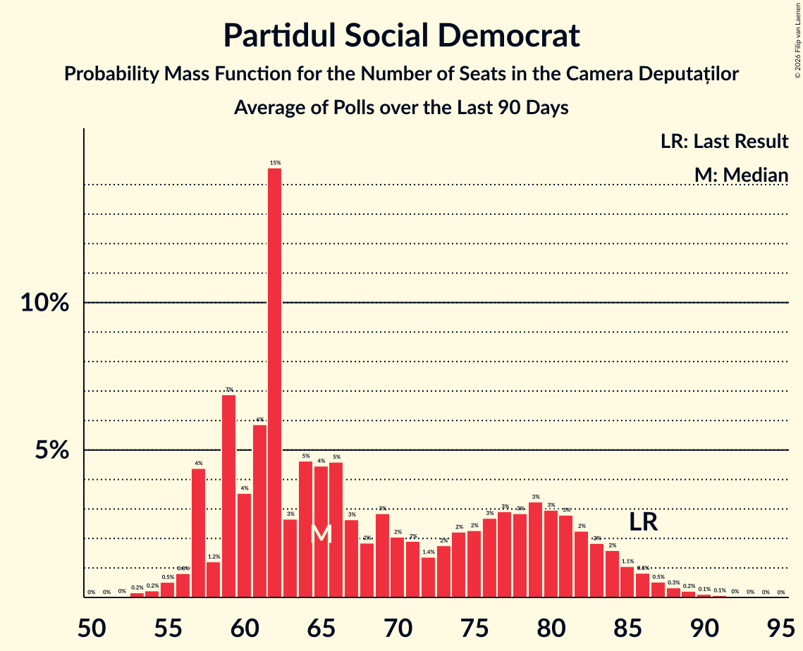

# Partidul Social Democrat

<a href="#voting-intentions">Voting Intentions</a> | <a href="#seats">Seats</a>

## Voting Intentions

Last result: **22.0%** (General Election of 1 December 2024)

### Confidence Intervals

| Period     | Polling firm/Commissioner(s) | Median | 80% Confidence Interval | 90% Confidence Interval | 95% Confidence Interval | 99% Confidence Interval |
|:----------:|:----------------:|:-----------:|:-----------------------:|:-----------------------:|:-----------------------:|:-----------------------:|
| N/A | [Poll Average](average.html) | 20.1% | 16.7–23.5% | 16.0–24.2% | 15.5–24.7% | 14.4–25.7% |
| [28 April–1 May 2026](2026-05-01-CURS.html) | CURS | 23.0% | 21.5–24.7% | 21.0–25.2% | 20.6–25.6% | 19.9–26.5% |
| [1–10 April 2026](2026-04-10-ARP.html) | ARP | 17.2% | 15.4–19.2% | 14.9–19.8% | 14.4–20.3% | 13.6–21.3% |
| [1–7 April 2026](2026-04-07-INSCOP.html) | INSCOP   Informat.ro | 20.1% | 18.6–21.7% | 18.2–22.2% | 17.8–22.6% | 17.1–23.4% |
| [26 March–4 April 2026](2026-04-04-Sociopol.html) | Sociopol | 18.0% | 16.5–19.6% | 16.1–20.1% | 15.7–20.5% | 15.0–21.3% |
| [23–27 March 2026](2026-03-27-CURS.html) | CURS | 24.0% | 22.6–25.5% | 22.2–25.9% | 21.9–26.2% | 21.3–26.9% |
| [10–17 March 2026](2026-03-17-Avangarde.html) | Avangarde | 22.0% | 20.4–23.7% | 19.9–24.2% | 19.5–24.7% | 18.8–25.5% |
| [2–6 March 2026](2026-03-06-INSCOP.html) | INSCOP   informat.ro | 19.2% | 17.7–20.8% | 17.3–21.2% | 17.0–21.6% | 16.3–22.4% |
| [11 February 2026](2026-02-11-ARA.html) | ARA   Antena3CNN | 25.0% | 23.0–27.2% | 22.4–27.8% | 21.9–28.3% | 21.0–29.4% |
| [14–23 January 2026](2026-01-23-CURS.html) | CURS | 23.0% | 21.4–24.7% | 20.9–25.2% | 20.5–25.6% | 19.8–26.4% |
| [12–15 January 2026](2026-01-15-INSCOP.html) | INSCOP   informat.ro | 18.2% | 16.8–19.8% | 16.4–20.2% | 16.0–20.6% | 15.3–21.4% |
| [10–19 December 2025](2025-12-19-CURS.html) | CURS | 22.0% | 20.5–23.7% | 20.0–24.2% | 19.6–24.6% | 18.9–25.4% |
| [4–17 December 2025](2025-12-17-IRES.html) | IRES | 21.0% | 19.5–22.8% | 19.0–23.2% | 18.6–23.7% | 17.9–24.5% |
| [25 October–2 November 2025](2025-11-02-INSCOP.html) | INSCOP   informat.ro | 19.5% | 18.6–20.5% | 18.3–20.7% | 18.1–21.0% | 17.7–21.4% |
| [14–26 October 2025](2025-10-26-CURS.html) | CURS | 24.0% | 22.4–25.8% | 21.9–26.3% | 21.5–26.7% | 20.8–27.6% |
| [6–10 October 2025](2025-10-10-INSCOP.html) | INSCOP   informat.ro | 17.6% | 16.2–19.2% | 15.8–19.6% | 15.5–20.0% | 14.8–20.8% |
| [5–19 September 2025](2025-09-19-CURS.html) | CURS | 23.0% | 21.4–24.7% | 21.0–25.2% | 20.6–25.6% | 19.9–26.4% |
| [9–18 September 2025](2025-09-18-Avangarde.html) | Avangarde | 19.0% | 17.6–20.5% | 17.3–20.9% | 16.9–21.2% | 16.3–21.9% |
| [1–9 September 2025](2025-09-09-INSCOP.html) | INSCOP   informat.ro | 17.9% | 16.4–19.4% | 16.0–19.9% | 15.7–20.2% | 15.1–21.0% |
| [21–23 July 2025](2025-07-23-Sociopol.html) | Sociopol   RomâniaTV | 21.0% | 19.4–22.7% | 18.9–23.2% | 18.5–23.6% | 17.8–24.4% |
| [15–23 July 2025](2025-07-23-INSOMAR.html) | INSOMAR | 17.0% | 15.6–18.6% | 15.2–19.1% | 14.8–19.4% | 14.1–20.2% |
| [10–12 July 2025](2025-07-12-FlashData.html) | FlashData | 18.0% | 17.4–18.6% | 17.3–18.7% | 17.1–18.9% | 16.9–19.2% |
| [4–10 July 2025](2025-07-10-CURS.html) | CURS | 20.0% | 18.5–21.6% | 18.0–22.1% | 17.7–22.5% | 17.0–23.3% |
| [20–26 June 2025](2025-06-26-INSCOP.html) | INSCOP   informat.ro | 13.7% | 12.5–15.1% | 12.2–15.5% | 11.9–15.9% | 11.3–16.5% |
| [26–30 May 2025](2025-05-30-INSCOP.html) | INSCOP | 17.4% | N/A | N/A | N/A | N/A |
| [26–30 May 2025](2025-05-30-CURS.html) | CURS | 24.0% | 22.5–25.6% | 22.1–26.0% | 21.7–26.4% | 21.0–27.2% |
| [26–28 May 2025](2025-05-28-Sociopol.html) | Sociopol   RomâniaTV | 17.0% | 15.5–18.6% | 15.1–19.1% | 14.8–19.4% | 14.1–20.2% |
| [23–28 May 2025](2025-05-28-Avangarde.html) | Avangarde | 20.0% | 18.6–21.5% | 18.2–21.9% | 17.9–22.3% | 17.3–23.0% |
| [24–26 April 2025](2025-04-26-FlashData.html) | FlashData | 19.0% | 18.4–19.6% | 18.3–19.8% | 18.1–19.9% | 17.8–20.2% |
| [3–5 April 2025](2025-04-05-FlashData.html) | FlashData | 18.5% | N/A | N/A | N/A | N/A |
| [24–28 March 2025](2025-03-28-Verifield.html) | Verifield | 21.2% | 19.7–22.8% | 19.2–23.3% | 18.9–23.7% | 18.2–24.5% |
| [14–16 February 2025](2025-02-16-FlashData.html) | FlashData | 21.2% | N/A | N/A | N/A | N/A |
| [21–25 January 2025](2025-01-25-CURS.html) | CURS | 24.0% | N/A | N/A | N/A | N/A |
| [10–16 January 2025](2025-01-16-Avangarde.html) | Avangarde | 22.0% | N/A | N/A | N/A | N/A |

### Probability Mass Function

The following table shows the probability mass function per percentage block of voting intentions for the [poll average](average.html) for Partidul Social Democrat.

| Voting Intentions | Probability | Accumulated | Special Marks |
|:-----------------:|:-----------:|:-----------:|:-------------:|
| 11.5–12.5% | 0% | 100% |  |
| 12.5–13.5% | 0.1% | 100% |  |
| 13.5–14.5% | 0.5% | 99.9% |  |
| 14.5–15.5% | 2% | 99.4% |  |
| 15.5–16.5% | 6% | 97% |  |
| 16.5–17.5% | 10% | 91% |  |
| 17.5–18.5% | 13% | 81% |  |
| 18.5–19.5% | 12% | 68% |  |
| 19.5–20.5% | 11% | 56% | Median |
| 20.5–21.5% | 12% | 45% |  |
| 21.5–22.5% | 13% | 33% | Last Result |
| 22.5–23.5% | 11% | 21% |  |
| 23.5–24.5% | 7% | 10% |  |
| 24.5–25.5% | 2% | 3% |  |
| 25.5–26.5% | 0.6% | 0.7% |  |
| 26.5–27.5% | 0.1% | 0.1% |  |
| 27.5–28.5% | 0% | 0% |  |

## Seats

Last result: **86** seats (General Election of 1 December 2024)

### Confidence Intervals

| Period     | Polling firm/Commissioner(s) | Median | 80% Confidence Interval | 90% Confidence Interval | 95% Confidence Interval | 99% Confidence Interval |
|:----------:|:----------------:|:------:|:-----------------------:|:-----------------------:|:-----------------------:|:-----------------------:|
| N/A | [Poll Average](average.html) | 70 | 57–83 | 55–85 | 53–86 | 50–90 |
| [28 April–1 May 2026](2026-05-01-CURS.html) | CURS | 80 | 74–85 | 73–87 | 71–88 | 69–91 |
| [1–10 April 2026](2026-04-10-ARP.html) | ARP | 60 | 53–67 | 52–68 | 50–71 | 47–74 |
| [1–7 April 2026](2026-04-07-INSCOP.html) | INSCOP   Informat.ro | 70 | 65–75 | 63–77 | 62–78 | 59–81 |
| [26 March–4 April 2026](2026-04-04-Sociopol.html) | Sociopol | 60 | 55–66 | 54–67 | 53–69 | 51–71 |
| [23–27 March 2026](2026-03-27-CURS.html) | CURS | 86 | 81–91 | 79–92 | 78–94 | 76–96 |
| [10–17 March 2026](2026-03-17-Avangarde.html) | Avangarde | 80 | 74–85 | 72–87 | 71–88 | 68–91 |
| [2–6 March 2026](2026-03-06-INSCOP.html) | INSCOP   informat.ro | 68 | 63–74 | 62–76 | 61–77 | 58–80 |
| [11 February 2026](2026-02-11-ARA.html) | ARA   Antena3CNN | 82 | 75–89 | 73–91 | 72–93 | 69–96 |
| [14–23 January 2026](2026-01-23-CURS.html) | CURS | 77 | 70–83 | 69–85 | 68–86 | 65–89 |
| [12–15 January 2026](2026-01-15-INSCOP.html) | INSCOP   informat.ro | 64 | 59–69 | 57–71 | 56–72 | 53–74 |
| [10–19 December 2025](2025-12-19-CURS.html) | CURS | 74 | 68–80 | 67–82 | 65–84 | 63–87 |
| [4–17 December 2025](2025-12-17-IRES.html) | IRES | 75 | 69–80 | 67–82 | 66–84 | 64–87 |
| [25 October–2 November 2025](2025-11-02-INSCOP.html) | INSCOP   informat.ro | 68 | 65–71 | 64–72 | 63–73 | 62–75 |
| [14–26 October 2025](2025-10-26-CURS.html) | CURS | 79 | 73–85 | 72–86 | 70–88 | 68–90 |
| [6–10 October 2025](2025-10-10-INSCOP.html) | INSCOP   informat.ro | 62 | 57–67 | 55–68 | 54–70 | 52–73 |
| [5–19 September 2025](2025-09-19-CURS.html) | CURS | 77 | 71–84 | 70–86 | 68–87 | 66–90 |
| [9–18 September 2025](2025-09-18-Avangarde.html) | Avangarde | 65 | 60–70 | 59–72 | 58–73 | 56–75 |
| [1–9 September 2025](2025-09-09-INSCOP.html) | INSCOP   informat.ro | 61 | 57–67 | 55–68 | 54–70 | 52–72 |
| [21–23 July 2025](2025-07-23-Sociopol.html) | Sociopol   RomâniaTV | 71 | 67–78 | 65–79 | 63–82 | 61–83 |
| [15–23 July 2025](2025-07-23-INSOMAR.html) | INSOMAR | 63 | 56–67 | 55–68 | 54–70 | 52–72 |
| [10–12 July 2025](2025-07-12-FlashData.html) | FlashData | 61 | 59–63 | 58–63 | 58–64 | 57–65 |
| [4–10 July 2025](2025-07-10-CURS.html) | CURS | 69 | 63–75 | 62–76 | 60–77 | 58–80 |
| [20–26 June 2025](2025-06-26-INSCOP.html) | INSCOP   informat.ro | 47 | 43–52 | 42–54 | 40–55 | 39–57 |
| [26–30 May 2025](2025-05-30-INSCOP.html) | INSCOP |  |  |  |  |  |
| [26–30 May 2025](2025-05-30-CURS.html) | CURS | 79 | 74–85 | 72–87 | 71–88 | 68–91 |
| [26–28 May 2025](2025-05-28-Sociopol.html) | Sociopol   RomâniaTV | 62 | 57–68 | 56–69 | 54–71 | 52–74 |
| [23–28 May 2025](2025-05-28-Avangarde.html) | Avangarde | 70 | 66–76 | 65–78 | 64–79 | 61–81 |
| [24–26 April 2025](2025-04-26-FlashData.html) | FlashData | 81 | 79–84 | 78–84 | 78–85 | 77–86 |
| [3–5 April 2025](2025-04-05-FlashData.html) | FlashData |  |  |  |  |  |
| [24–28 March 2025](2025-03-28-Verifield.html) | Verifield | 73 | 67–77 | 66–78 | 64–79 | 61–82 |
| [14–16 February 2025](2025-02-16-FlashData.html) | FlashData |  |  |  |  |  |
| [21–25 January 2025](2025-01-25-CURS.html) | CURS |  |  |  |  |  |
| [10–16 January 2025](2025-01-16-Avangarde.html) | Avangarde |  |  |  |  |  |

### Probability Mass Function

The following table shows the probability mass function per seat for the [poll average](average.html) for Partidul Social Democrat.

| Number of Seats | Probability | Accumulated | Special Marks |
|:---------------:|:-----------:|:-----------:|:-------------:|
| 46 | 0.1% | 100% |  |
| 47 | 0.1% | 99.9% |  |
| 48 | 0.1% | 99.8% |  |
| 49 | 0.1% | 99.7% |  |
| 50 | 0.3% | 99.6% |  |
| 51 | 0.4% | 99.3% |  |
| 52 | 1.1% | 98.9% |  |
| 53 | 0.8% | 98% |  |
| 54 | 2% | 97% |  |
| 55 | 1.4% | 95% |  |
| 56 | 2% | 94% |  |
| 57 | 4% | 92% |  |
| 58 | 4% | 88% |  |
| 59 | 4% | 84% |  |
| 60 | 3% | 81% |  |
| 61 | 3% | 78% |  |
| 62 | 4% | 75% |  |
| 63 | 3% | 71% |  |
| 64 | 2% | 68% |  |
| 65 | 3% | 65% |  |
| 66 | 3% | 63% |  |
| 67 | 3% | 59% |  |
| 68 | 2% | 56% |  |
| 69 | 2% | 54% |  |
| 70 | 3% | 52% | Median |
| 71 | 3% | 49% |  |
| 72 | 2% | 46% |  |
| 73 | 2% | 44% |  |
| 74 | 5% | 41% |  |
| 75 | 3% | 37% |  |
| 76 | 3% | 34% |  |
| 77 | 4% | 31% |  |
| 78 | 4% | 27% |  |
| 79 | 3% | 24% |  |
| 80 | 4% | 21% |  |
| 81 | 3% | 18% |  |
| 82 | 4% | 15% |  |
| 83 | 4% | 11% |  |
| 84 | 2% | 7% |  |
| 85 | 2% | 5% |  |
| 86 | 1.1% | 3% | Last Result |
| 87 | 1.0% | 2% |  |
| 88 | 0.6% | 1.4% |  |
| 89 | 0.3% | 0.8% |  |
| 90 | 0.2% | 0.5% |  |
| 91 | 0.1% | 0.3% |  |
| 92 | 0.1% | 0.2% |  |
| 93 | 0% | 0.1% |  |
| 94 | 0% | 0% |  |

