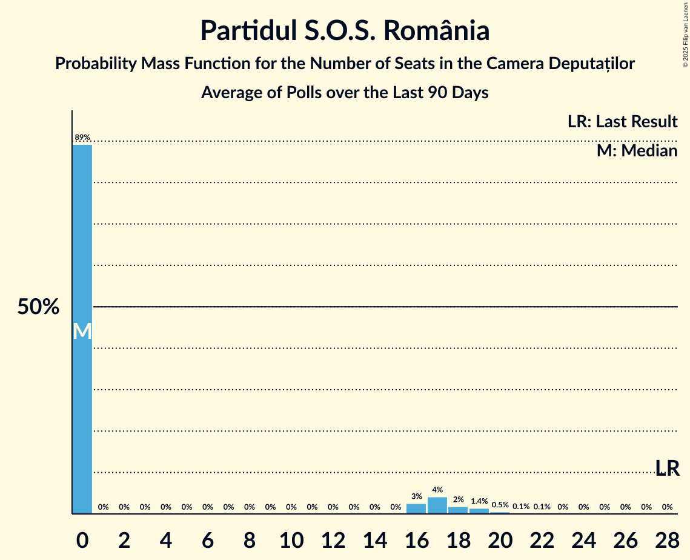

# Partidul S.O.S. România

<a href="#voting-intentions">Voting Intentions</a> | <a href="#seats">Seats</a>

## Voting Intentions

Last result: **7.4%** (General Election of 1 December 2024)

### Confidence Intervals

| Period     | Polling firm/Commissioner(s) | Median | 80% Confidence Interval | 90% Confidence Interval | 95% Confidence Interval | 99% Confidence Interval |
|:----------:|:----------------:|:-----------:|:-----------------------:|:-----------------------:|:-----------------------:|:-----------------------:|
| N/A | [Poll Average](average.html) | 2.0% | 1.5–2.5% | 1.4–2.7% | 1.3–2.9% | 1.1–3.2% |
| [20–26 June 2025](2025-06-26-INSCOP.html) | INSCOP   informat.ro | 1.9% | 1.5–2.5% | 1.4–2.7% | 1.3–2.9% | 1.1–3.2% |
| [26–30 May 2025](2025-05-30-INSCOP.html) | INSCOP | 2.5% | N/A | N/A | N/A | N/A |
| [26–30 May 2025](2025-05-30-CURS.html) | CURS | 5.0% | N/A | N/A | N/A | N/A |
| [26–28 May 2025](2025-05-28-Sociopol.html) | Sociopol | 2.0% | N/A | N/A | N/A | N/A |
| [23–28 May 2025](2025-05-28-Avangarde.html) | Avangarde | 4.0% | N/A | N/A | N/A | N/A |
| [24–26 April 2025](2025-04-26-FlashData.html) | FlashData | 2.0% | N/A | N/A | N/A | N/A |
| [3–5 April 2025](2025-04-05-FlashData.html) | FlashData | 3.5% | N/A | N/A | N/A | N/A |
| [24–28 March 2025](2025-03-28-Verifield.html) | Verifield | 3.6% | N/A | N/A | N/A | N/A |
| [14–16 February 2025](2025-02-16-FlashData.html) | FlashData | 5.6% | N/A | N/A | N/A | N/A |
| [21–25 January 2025](2025-01-25-CURS.html) | CURS | 5.0% | N/A | N/A | N/A | N/A |
| [10–16 January 2025](2025-01-16-Avangarde.html) | Avangarde | 8.0% | N/A | N/A | N/A | N/A |

### Probability Mass Function

The following table shows the probability mass function per percentage block of voting intentions for the [poll average](average.html) for Partidul S.O.S. România.

| Voting Intentions | Probability | Accumulated | Special Marks |
|:-----------------:|:-----------:|:-----------:|:-------------:|
| 0.0–0.5% | 0% | 100% |  |
| 0.5–1.5% | 14% | 100% |  |
| 1.5–2.5% | 76% | 86% | Median |
| 2.5–3.5% | 10% | 10% |  |
| 3.5–4.5% | 0.1% | 0.1% |  |
| 4.5–5.5% | 0% | 0% |  |
| 5.5–6.5% | 0% | 0% |  |
| 6.5–7.5% | 0% | 0% | Last Result |

## Seats

Last result: **28** seats (General Election of 1 December 2024)

### Confidence Intervals

| Period     | Polling firm/Commissioner(s) | Median | 80% Confidence Interval | 90% Confidence Interval | 95% Confidence Interval | 99% Confidence Interval |
|:----------:|:----------------:|:------:|:-----------------------:|:-----------------------:|:-----------------------:|:-----------------------:|
| N/A | [Poll Average](average.html) | 0 | 0 | 0 | 0 | 0 |
| [20–26 June 2025](2025-06-26-INSCOP.html) | INSCOP   informat.ro | 0 | 0 | 0 | 0 | 0 |
| [26–30 May 2025](2025-05-30-INSCOP.html) | INSCOP |  |  |  |  |  |
| [26–30 May 2025](2025-05-30-CURS.html) | CURS |  |  |  |  |  |
| [26–28 May 2025](2025-05-28-Sociopol.html) | Sociopol |  |  |  |  |  |
| [23–28 May 2025](2025-05-28-Avangarde.html) | Avangarde |  |  |  |  |  |
| [24–26 April 2025](2025-04-26-FlashData.html) | FlashData |  |  |  |  |  |
| [3–5 April 2025](2025-04-05-FlashData.html) | FlashData |  |  |  |  |  |
| [24–28 March 2025](2025-03-28-Verifield.html) | Verifield |  |  |  |  |  |
| [14–16 February 2025](2025-02-16-FlashData.html) | FlashData |  |  |  |  |  |
| [21–25 January 2025](2025-01-25-CURS.html) | CURS |  |  |  |  |  |
| [10–16 January 2025](2025-01-16-Avangarde.html) | Avangarde |  |  |  |  |  |

### Probability Mass Function

The following table shows the probability mass function per seat for the [poll average](average.html) for Partidul S.O.S. România.

| Number of Seats | Probability | Accumulated | Special Marks |
|:---------------:|:-----------:|:-----------:|:-------------:|
| 0 | 100% | 100% | Median |
| 1 | 0% | 0% |  |
| 2 | 0% | 0% |  |
| 3 | 0% | 0% |  |
| 4 | 0% | 0% |  |
| 5 | 0% | 0% |  |
| 6 | 0% | 0% |  |
| 7 | 0% | 0% |  |
| 8 | 0% | 0% |  |
| 9 | 0% | 0% |  |
| 10 | 0% | 0% |  |
| 11 | 0% | 0% |  |
| 12 | 0% | 0% |  |
| 13 | 0% | 0% |  |
| 14 | 0% | 0% |  |
| 15 | 0% | 0% |  |
| 16 | 0% | 0% |  |
| 17 | 0% | 0% |  |
| 18 | 0% | 0% |  |
| 19 | 0% | 0% |  |
| 20 | 0% | 0% |  |
| 21 | 0% | 0% |  |
| 22 | 0% | 0% |  |
| 23 | 0% | 0% |  |
| 24 | 0% | 0% |  |
| 25 | 0% | 0% |  |
| 26 | 0% | 0% |  |
| 27 | 0% | 0% |  |
| 28 | 0% | 0% | Last Result |

