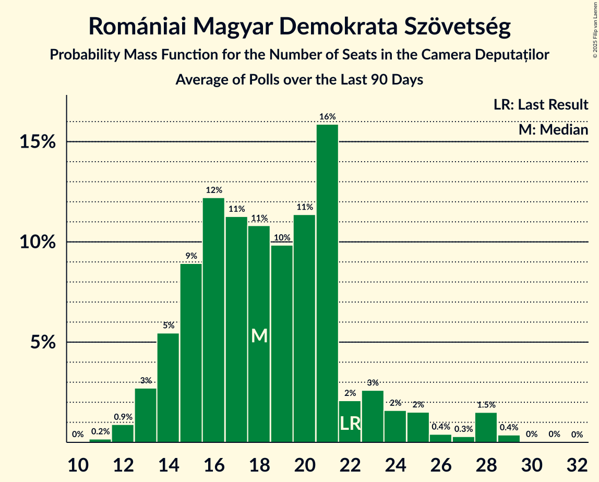

# Romániai Magyar Demokrata Szövetség

<a href="#voting-intentions">Voting Intentions</a> | <a href="#seats">Seats</a>

## Voting Intentions

Last result: **6.3%** (General Election of 1 December 2024)

### Confidence Intervals

| Period     | Polling firm/Commissioner(s) | Median | 80% Confidence Interval | 90% Confidence Interval | 95% Confidence Interval | 99% Confidence Interval |
|:----------:|:----------------:|:-----------:|:-----------------------:|:-----------------------:|:-----------------------:|:-----------------------:|
| N/A | [Poll Average](average.html) | 4.8% | 3.9–6.2% | 3.6–6.6% | 3.4–6.9% | 3.0–7.4% |
| [9–18 September 2025](2025-09-18-Avangarde.html) | Avangarde | 6.0% | 5.2–6.9% | 5.0–7.2% | 4.8–7.4% | 4.5–7.9% |
| [1–9 September 2025](2025-09-09-INSCOP.html) | INSCOP   informat.ro | 4.0% | 3.3–4.9% | 3.1–5.1% | 3.0–5.3% | 2.7–5.8% |
| [21–23 July 2025](2025-07-23-Sociopol.html) | Sociopol   RomâniaTV | 5.0% | 4.2–6.0% | 4.0–6.3% | 3.8–6.5% | 3.5–7.0% |
| [15–23 July 2025](2025-07-23-INSOMAR.html) | INSOMAR | 4.9% | 4.2–5.9% | 3.9–6.2% | 3.8–6.5% | 3.4–7.0% |
| [10–12 July 2025](2025-07-12-FlashData.html) | FlashData | 4.5% | 4.2–4.8% | 4.1–4.9% | 4.1–5.0% | 3.9–5.2% |
| [4–10 July 2025](2025-07-10-CURS.html) | CURS | 5.0% | 4.2–5.9% | 4.0–6.2% | 3.8–6.4% | 3.5–6.9% |
| [20–26 June 2025](2025-06-26-INSCOP.html) | INSCOP   informat.ro | 5.2% | 4.5–6.2% | 4.3–6.4% | 4.1–6.7% | 3.7–7.1% |
| [26–30 May 2025](2025-05-30-INSCOP.html) | INSCOP | 4.5% | N/A | N/A | N/A | N/A |
| [26–30 May 2025](2025-05-30-CURS.html) | CURS | 5.0% | 4.3–5.8% | 4.1–6.1% | 3.9–6.3% | 3.6–6.8% |
| [26–28 May 2025](2025-05-28-Sociopol.html) | Sociopol   RomâniaTV | 6.0% | 5.1–7.1% | 4.9–7.4% | 4.7–7.7% | 4.3–8.2% |
| [23–28 May 2025](2025-05-28-Avangarde.html) | Avangarde | 5.0% | 4.3–5.9% | 4.1–6.1% | 3.9–6.3% | 3.6–6.8% |
| [24–26 April 2025](2025-04-26-FlashData.html) | FlashData | 4.0% | 3.7–4.3% | 3.6–4.4% | 3.6–4.5% | 3.4–4.6% |
| [3–5 April 2025](2025-04-05-FlashData.html) | FlashData | 3.0% | N/A | N/A | N/A | N/A |
| [24–28 March 2025](2025-03-28-Verifield.html) | Verifield | 5.1% | 4.3–6.1% | 4.1–6.3% | 3.9–6.6% | 3.6–7.0% |
| [14–16 February 2025](2025-02-16-FlashData.html) | FlashData | 3.4% | N/A | N/A | N/A | N/A |
| [21–25 January 2025](2025-01-25-CURS.html) | CURS | 5.0% | N/A | N/A | N/A | N/A |
| [10–16 January 2025](2025-01-16-Avangarde.html) | Avangarde | 4.0% | N/A | N/A | N/A | N/A |

### Probability Mass Function

The following table shows the probability mass function per percentage block of voting intentions for the [poll average](average.html) for Romániai Magyar Demokrata Szövetség.

| Voting Intentions | Probability | Accumulated | Special Marks |
|:-----------------:|:-----------:|:-----------:|:-------------:|
| 1.5–2.5% | 0% | 100% |  |
| 2.5–3.5% | 4% | 100% |  |
| 3.5–4.5% | 33% | 96% |  |
| 4.5–5.5% | 38% | 63% | Median |
| 5.5–6.5% | 20% | 25% | Last Result |
| 6.5–7.5% | 5% | 5% |  |
| 7.5–8.5% | 0.4% | 0.4% |  |
| 8.5–9.5% | 0% | 0% |  |

## Seats

Last result: **22** seats (General Election of 1 December 2024)

### Confidence Intervals

| Period     | Polling firm/Commissioner(s) | Median | 80% Confidence Interval | 90% Confidence Interval | 95% Confidence Interval | 99% Confidence Interval |
|:----------:|:----------------:|:------:|:-----------------------:|:-----------------------:|:-----------------------:|:-----------------------:|
| N/A | [Poll Average](average.html) | 16 | 13–21 | 12–23 | 11–23 | 10–25 |
| [9–18 September 2025](2025-09-18-Avangarde.html) | Avangarde | 20 | 18–23 | 17–24 | 16–25 | 15–27 |
| [1–9 September 2025](2025-09-09-INSCOP.html) | INSCOP   informat.ro | 14 | 11–16 | 10–17 | 10–18 | 9–19 |
| [21–23 July 2025](2025-07-23-Sociopol.html) | Sociopol   RomâniaTV | 17 | 13–20 | 13–21 | 13–22 | 12–24 |
| [15–23 July 2025](2025-07-23-INSOMAR.html) | INSOMAR | 17 | 15–21 | 14–22 | 13–23 | 12–25 |
| [10–12 July 2025](2025-07-12-FlashData.html) | FlashData | 15 | 14–16 | 14–16 | 13–17 | 13–17 |
| [4–10 July 2025](2025-07-10-CURS.html) | CURS | 17 | 14–20 | 13–21 | 13–22 | 12–24 |
| [20–26 June 2025](2025-06-26-INSCOP.html) | INSCOP   informat.ro | 18 | 15–21 | 14–22 | 14–23 | 13–24 |
| [26–30 May 2025](2025-05-30-INSCOP.html) | INSCOP |  |  |  |  |  |
| [26–30 May 2025](2025-05-30-CURS.html) | CURS | 16 | 14–19 | 13–20 | 12–21 | 11–22 |
| [26–28 May 2025](2025-05-28-Sociopol.html) | Sociopol   RomâniaTV | 22 | 18–26 | 18–27 | 17–28 | 15–29 |
| [23–28 May 2025](2025-05-28-Avangarde.html) | Avangarde | 18 | 15–20 | 14–21 | 14–22 | 12–24 |
| [24–26 April 2025](2025-04-26-FlashData.html) | FlashData | 17 | 16–18 | 15–18 | 15–19 | 14–19 |
| [3–5 April 2025](2025-04-05-FlashData.html) | FlashData |  |  |  |  |  |
| [24–28 March 2025](2025-03-28-Verifield.html) | Verifield | 16 | 14–20 | 13–20 | 13–21 | 11–23 |
| [14–16 February 2025](2025-02-16-FlashData.html) | FlashData |  |  |  |  |  |
| [21–25 January 2025](2025-01-25-CURS.html) | CURS |  |  |  |  |  |
| [10–16 January 2025](2025-01-16-Avangarde.html) | Avangarde |  |  |  |  |  |

### Probability Mass Function

The following table shows the probability mass function per seat for the [poll average](average.html) for Romániai Magyar Demokrata Szövetség.

| Number of Seats | Probability | Accumulated | Special Marks |
|:---------------:|:-----------:|:-----------:|:-------------:|
| 9 | 0.2% | 100% |  |
| 10 | 0.9% | 99.7% |  |
| 11 | 2% | 98.8% |  |
| 12 | 3% | 97% |  |
| 13 | 7% | 93% |  |
| 14 | 12% | 86% |  |
| 15 | 15% | 75% |  |
| 16 | 13% | 59% | Median |
| 17 | 10% | 47% |  |
| 18 | 7% | 37% |  |
| 19 | 9% | 30% |  |
| 20 | 7% | 21% |  |
| 21 | 6% | 14% |  |
| 22 | 3% | 8% | Last Result |
| 23 | 4% | 6% |  |
| 24 | 1.1% | 2% |  |
| 25 | 0.6% | 1.1% |  |
| 26 | 0.3% | 0.4% |  |
| 27 | 0.1% | 0.1% |  |
| 28 | 0% | 0% |  |

