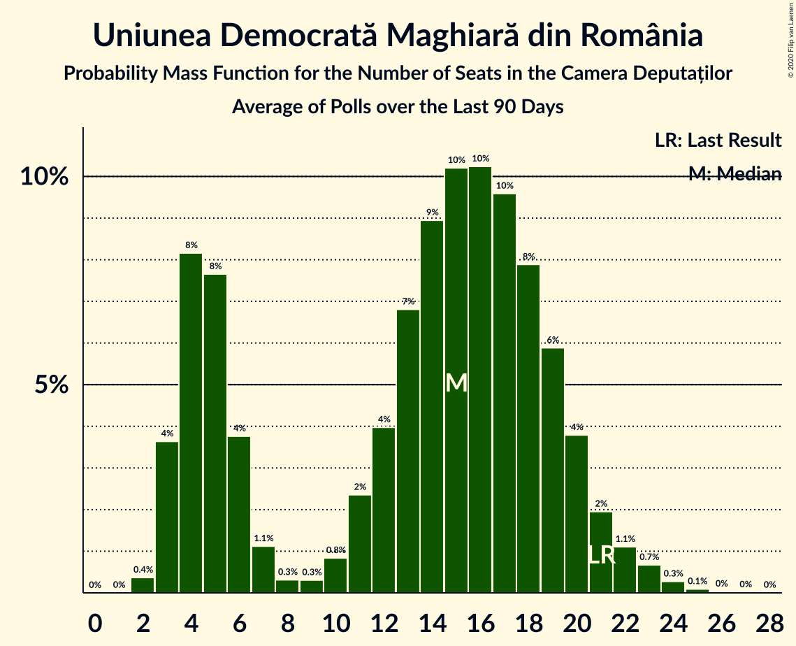

# Uniunea Democrată Maghiară din România

<a href="#voting-intentions">Voting Intentions</a> | <a href="#seats">Seats</a>

## Voting Intentions

Last result: **5.7%** (General Election of 6 December 2020)

### Confidence Intervals

| Period     | Polling firm/Commissioner(s) | Median | 80% Confidence Interval | 90% Confidence Interval | 95% Confidence Interval | 99% Confidence Interval |
|:----------:|:----------------:|:-----------:|:-----------------------:|:-----------------------:|:-----------------------:|:-----------------------:|
| N/A | [Poll Average](average.html) | 4.2% | 3.5–5.0% | 3.3–5.3% | 3.1–5.5% | 2.8–6.0% |
| [14–17 April 2021](2021-04-17-CURS.html) | CURS | 4.2% | 3.5–5.0% | 3.3–5.3% | 3.1–5.5% | 2.8–6.0% |
| [30 March–11 April 2021](2021-04-11-BCS.html) | BCS | 4.0% | N/A | N/A | N/A | N/A |
| [12–28 March 2021](2021-03-28-Sociopol.html) | Sociopol | 4.0% | N/A | N/A | N/A | N/A |
| [1–12 March 2021](2021-03-12-INSCOP.html) | INSCOP | 0.0% | N/A | N/A | N/A | N/A |
| [22–26 February 2021](2021-02-26-CURS.html) | CURS | 4.0% | 3.3–4.9% | 3.1–5.1% | 3.0–5.3% | 2.7–5.8% |
| [15–17 January 2021](2021-01-17-Avangarde.html) | Avangarde | 5.1% | 4.2–6.3% | 3.9–6.6% | 3.7–7.0% | 3.3–7.6% |
| [11–15 January 2021](2021-01-15-CURS.html) | CURS | 5.0% | 4.3–6.0% | 4.0–6.2% | 3.9–6.5% | 3.5–7.0% |
| [17–21 December 2020](2020-12-21-CURS.html) | CURS | 4.0% | 3.3–4.9% | 3.1–5.1% | 3.0–5.3% | 2.7–5.8% |
| [10–20 December 2020](2020-12-20-Avangarde.html) | Avangarde | 5.0% | 4.2–6.1% | 3.9–6.4% | 3.7–6.6% | 3.4–7.2% |

### Probability Mass Function

The following table shows the probability mass function per percentage block of voting intentions for the [poll average](average.html) for Uniunea Democrată Maghiară din România.

| Voting Intentions | Probability | Accumulated | Special Marks |
|:-----------------:|:-----------:|:-----------:|:-------------:|
| 1.5–2.5% | 0.1% | 100% |  |
| 2.5–3.5% | 12% | 99.9% |  |
| 3.5–4.5% | 59% | 88% | Median |
| 4.5–5.5% | 27% | 29% |  |
| 5.5–6.5% | 2% | 2% | Last Result |
| 6.5–7.5% | 0% | 0% |  |
| 7.5–8.5% | 0% | 0% |  |

## Seats

Last result: **21** seats (General Election of 6 December 2020)

### Confidence Intervals

| Period     | Polling firm/Commissioner(s) | Median | 80% Confidence Interval | 90% Confidence Interval | 95% Confidence Interval | 99% Confidence Interval |
|:----------:|:----------------:|:------:|:-----------------------:|:-----------------------:|:-----------------------:|:-----------------------:|
| N/A | [Poll Average](average.html) | 13 | 11–16 | 10–17 | 10–18 | 9–19 |
| [14–17 April 2021](2021-04-17-CURS.html) | CURS | 13 | 11–16 | 10–17 | 10–18 | 9–19 |
| [30 March–11 April 2021](2021-04-11-BCS.html) | BCS |  |  |  |  |  |
| [12–28 March 2021](2021-03-28-Sociopol.html) | Sociopol |  |  |  |  |  |
| [1–12 March 2021](2021-03-12-INSCOP.html) | INSCOP |  |  |  |  |  |
| [22–26 February 2021](2021-02-26-CURS.html) | CURS | 14 | 11–17 | 11–18 | 10–19 | 9–20 |
| [15–17 January 2021](2021-01-17-Avangarde.html) | Avangarde | 17 | 14–21 | 13–22 | 12–23 | 11–25 |
| [11–15 January 2021](2021-01-15-CURS.html) | CURS | 17 | 14–20 | 13–21 | 13–21 | 11–23 |
| [17–21 December 2020](2020-12-21-CURS.html) | CURS | 13 | 11–16 | 10–17 | 9–17 | 9–19 |
| [10–20 December 2020](2020-12-20-Avangarde.html) | Avangarde | 16 | 13–19 | 13–20 | 12–21 | 11–23 |

### Probability Mass Function

The following table shows the probability mass function per seat for the [poll average](average.html) for Uniunea Democrată Maghiară din România.

| Number of Seats | Probability | Accumulated | Special Marks |
|:---------------:|:-----------:|:-----------:|:-------------:|
| 8 | 0.2% | 100% |  |
| 9 | 1.5% | 99.8% |  |
| 10 | 5% | 98% |  |
| 11 | 8% | 93% |  |
| 12 | 9% | 86% |  |
| 13 | 28% | 77% | Median |
| 14 | 15% | 49% |  |
| 15 | 14% | 34% |  |
| 16 | 13% | 20% |  |
| 17 | 3% | 7% |  |
| 18 | 2% | 4% |  |
| 19 | 2% | 2% |  |
| 20 | 0.3% | 0.5% |  |
| 21 | 0.1% | 0.2% | Last Result |
| 22 | 0.1% | 0.1% |  |
| 23 | 0% | 0% |  |

