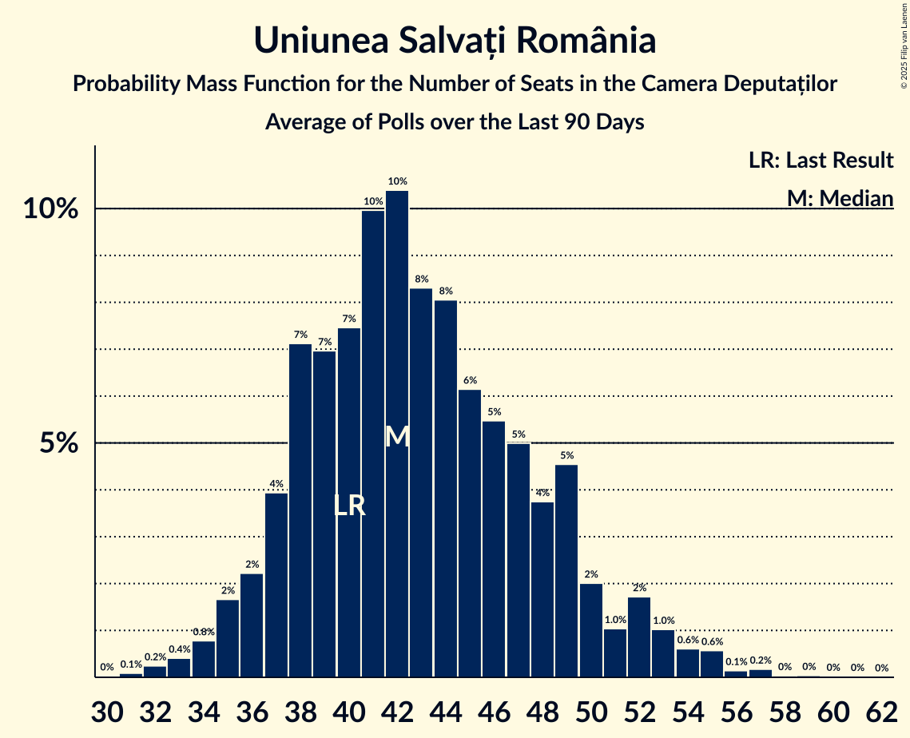

# Uniunea Salvați România

<a href="#voting-intentions">Voting Intentions</a> | <a href="#seats">Seats</a>

## Voting Intentions

Last result: **12.4%** (General Election of 1 December 2024)

### Confidence Intervals

| Period     | Polling firm/Commissioner(s) | Median | 80% Confidence Interval | 90% Confidence Interval | 95% Confidence Interval | 99% Confidence Interval |
|:----------:|:----------------:|:-----------:|:-----------------------:|:-----------------------:|:-----------------------:|:-----------------------:|
| N/A | [Poll Average](average.html) | 13.1% | 9.0–15.3% | 8.8–15.8% | 8.6–16.3% | 8.4–17.1% |
| [20–26 June 2025](2025-06-26-INSCOP.html) | INSCOP   informat.ro | 13.1% | 11.9–14.5% | 11.6–14.9% | 11.3–15.2% | 10.7–15.9% |
| [26–30 May 2025](2025-05-30-INSCOP.html) | INSCOP | 12.2% | N/A | N/A | N/A | N/A |
| [26–30 May 2025](2025-05-30-CURS.html) | CURS | 14.0% | 12.8–15.3% | 12.5–15.7% | 12.2–16.0% | 11.6–16.6% |
| [26–28 May 2025](2025-05-28-Sociopol.html) | Sociopol | 12.0% | 10.8–13.4% | 10.4–13.8% | 10.1–14.2% | 9.6–14.9% |
| [23–28 May 2025](2025-05-28-Avangarde.html) | Avangarde | 15.0% | 13.8–16.3% | 13.4–16.7% | 13.2–17.1% | 12.6–17.7% |
| [24–26 April 2025](2025-04-26-FlashData.html) | FlashData | 9.0% | 8.6–9.4% | 8.5–9.6% | 8.4–9.7% | 8.2–9.9% |
| [3–5 April 2025](2025-04-05-FlashData.html) | FlashData | 14.0% | N/A | N/A | N/A | N/A |
| [24–28 March 2025](2025-03-28-Verifield.html) | Verifield | 12.9% | 11.7–14.3% | 11.3–14.7% | 11.1–15.0% | 10.5–15.7% |
| [14–16 February 2025](2025-02-16-FlashData.html) | FlashData | 19.0% | N/A | N/A | N/A | N/A |
| [21–25 January 2025](2025-01-25-CURS.html) | CURS | 13.0% | N/A | N/A | N/A | N/A |
| [10–16 January 2025](2025-01-16-Avangarde.html) | Avangarde | 13.0% | N/A | N/A | N/A | N/A |

### Probability Mass Function

The following table shows the probability mass function per percentage block of voting intentions for the [poll average](average.html) for Uniunea Salvați România.

| Voting Intentions | Probability | Accumulated | Special Marks |
|:-----------------:|:-----------:|:-----------:|:-------------:|
| 6.5–7.5% | 0% | 100% |  |
| 7.5–8.5% | 2% | 100% |  |
| 8.5–9.5% | 17% | 98% |  |
| 9.5–10.5% | 2% | 81% |  |
| 10.5–11.5% | 6% | 79% |  |
| 11.5–12.5% | 13% | 73% | Last Result |
| 12.5–13.5% | 19% | 60% | Median |
| 13.5–14.5% | 20% | 41% |  |
| 14.5–15.5% | 14% | 22% |  |
| 15.5–16.5% | 6% | 8% |  |
| 16.5–17.5% | 1.3% | 2% |  |
| 17.5–18.5% | 0.2% | 0.2% |  |
| 18.5–19.5% | 0% | 0% |  |

## Seats

Last result: **40** seats (General Election of 1 December 2024)

### Confidence Intervals

| Period     | Polling firm/Commissioner(s) | Median | 80% Confidence Interval | 90% Confidence Interval | 95% Confidence Interval | 99% Confidence Interval |
|:----------:|:----------------:|:------:|:-----------------------:|:-----------------------:|:-----------------------:|:-----------------------:|
| N/A | [Poll Average](average.html) | 45 | 38–54 | 37–56 | 37–58 | 35–61 |
| [20–26 June 2025](2025-06-26-INSCOP.html) | INSCOP   informat.ro | 45 | 41–50 | 39–51 | 38–52 | 37–55 |
| [26–30 May 2025](2025-05-30-INSCOP.html) | INSCOP |  |  |  |  |  |
| [26–30 May 2025](2025-05-30-CURS.html) | CURS | 46 | 42–50 | 41–52 | 39–53 | 38–55 |
| [26–28 May 2025](2025-05-28-Sociopol.html) | Sociopol | 44 | 39–48 | 37–50 | 37–52 | 35–54 |
| [23–28 May 2025](2025-05-28-Avangarde.html) | Avangarde | 54 | 48–58 | 48–59 | 47–61 | 45–62 |
| [24–26 April 2025](2025-04-26-FlashData.html) | FlashData | 38 | 37–40 | 36–41 | 36–41 | 35–42 |
| [3–5 April 2025](2025-04-05-FlashData.html) | FlashData |  |  |  |  |  |
| [24–28 March 2025](2025-03-28-Verifield.html) | Verifield | 41 | 38–49 | 37–50 | 37–51 | 36–52 |
| [14–16 February 2025](2025-02-16-FlashData.html) | FlashData |  |  |  |  |  |
| [21–25 January 2025](2025-01-25-CURS.html) | CURS |  |  |  |  |  |
| [10–16 January 2025](2025-01-16-Avangarde.html) | Avangarde |  |  |  |  |  |

### Probability Mass Function

The following table shows the probability mass function per seat for the [poll average](average.html) for Uniunea Salvați România.

| Number of Seats | Probability | Accumulated | Special Marks |
|:---------------:|:-----------:|:-----------:|:-------------:|
| 34 | 0.1% | 100% |  |
| 35 | 0.5% | 99.9% |  |
| 36 | 2% | 99.3% |  |
| 37 | 5% | 98% |  |
| 38 | 7% | 93% |  |
| 39 | 7% | 86% |  |
| 40 | 5% | 80% | Last Result |
| 41 | 4% | 75% |  |
| 42 | 6% | 71% |  |
| 43 | 7% | 65% |  |
| 44 | 6% | 59% |  |
| 45 | 7% | 52% | Median |
| 46 | 6% | 46% |  |
| 47 | 5% | 40% |  |
| 48 | 6% | 34% |  |
| 49 | 5% | 29% |  |
| 50 | 5% | 24% |  |
| 51 | 2% | 20% |  |
| 52 | 2% | 18% |  |
| 53 | 4% | 15% |  |
| 54 | 2% | 11% |  |
| 55 | 4% | 9% |  |
| 56 | 2% | 5% |  |
| 57 | 0.6% | 4% |  |
| 58 | 2% | 3% |  |
| 59 | 0.3% | 1.1% |  |
| 60 | 0.1% | 0.7% |  |
| 61 | 0.4% | 0.6% |  |
| 62 | 0.1% | 0.2% |  |
| 63 | 0.1% | 0.1% |  |
| 64 | 0% | 0% |  |

